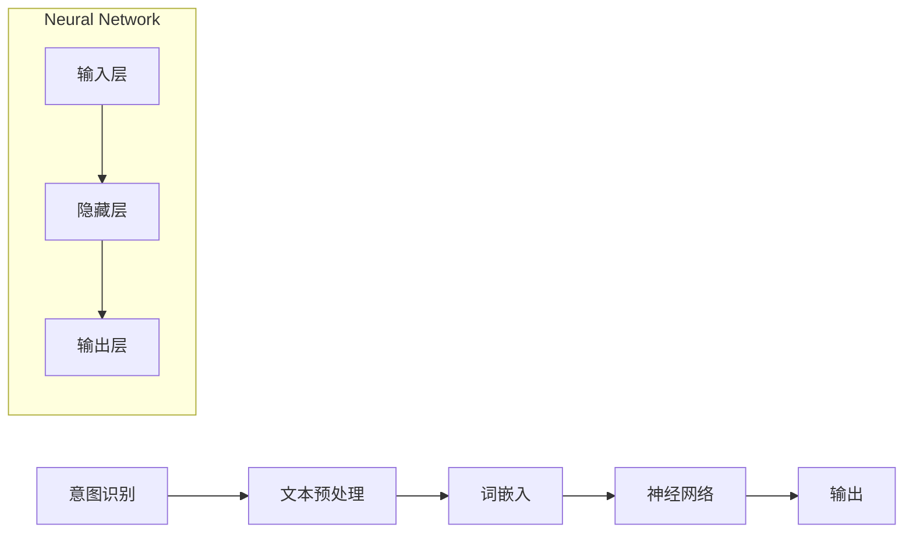
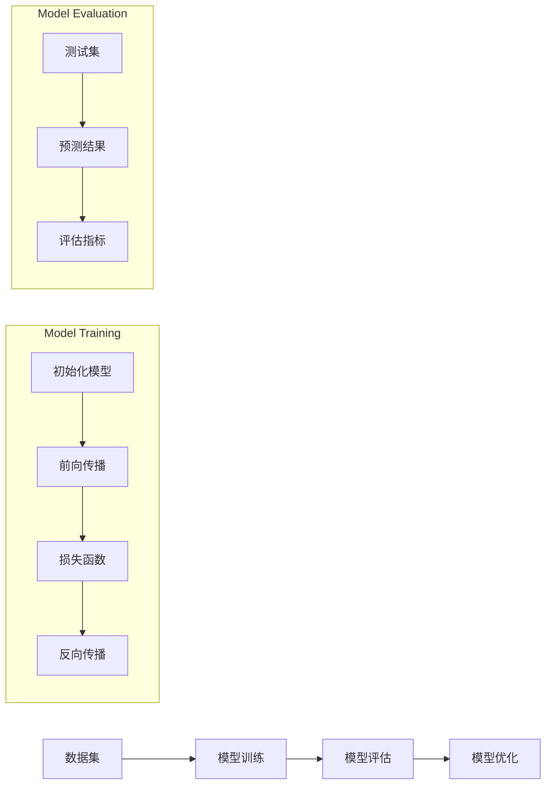
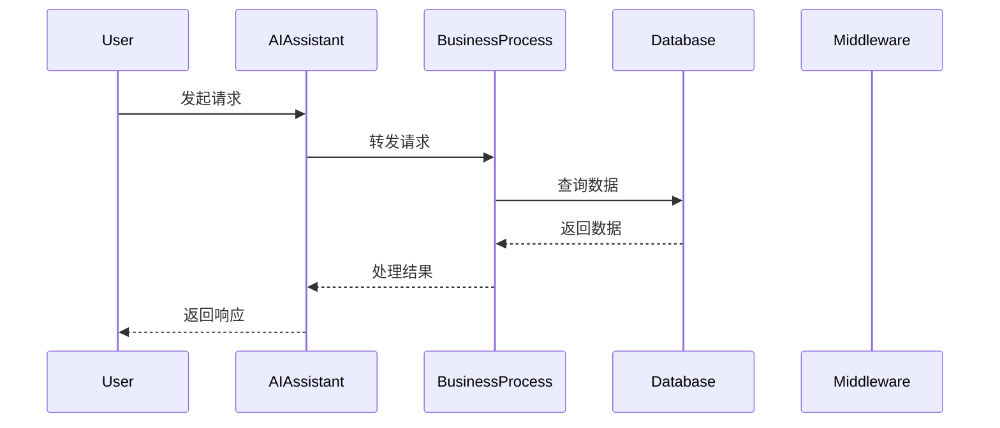
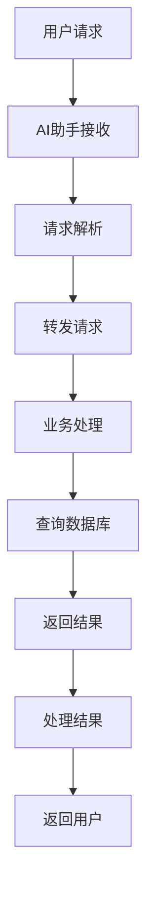
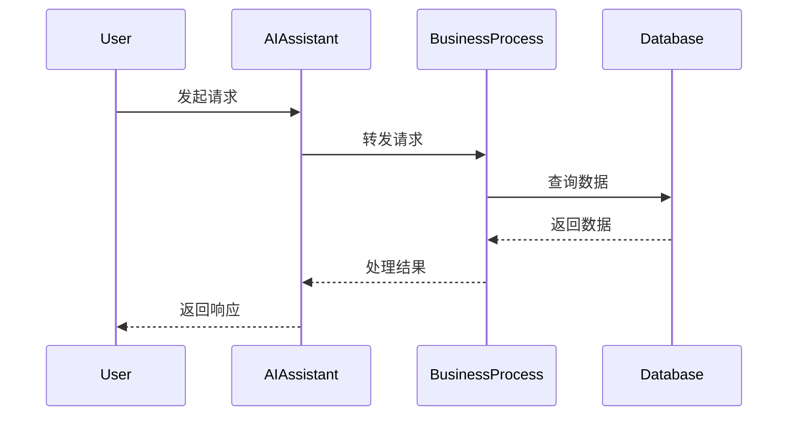

                 

### 背景介绍

**核心概念术语说明**

- **企业级对话式AI助手（Enterprise-grade Dialog-based AI Assistant）**：一种集成自然语言处理（NLP）、机器学习（ML）和对话管理系统（DM）的高级人工智能系统，用于与企业内部的业务流程进行交互，从而实现自动化操作和协同工作。

- **业务流程自动化（Business Process Automation）**：通过技术手段，将手工操作和重复性任务自动化，以提高工作效率、降低成本和减少错误。

- **跨部门协同（Cross-department Collaboration）**：企业内部不同部门之间通过信息共享和流程协作，共同完成工作任务，实现资源优化和业务目标最大化。

**问题背景**

在现代企业的运营中，随着业务复杂性的增加和规模的扩大，各部门之间的沟通和协调变得越来越困难。传统的人工操作不仅效率低下，而且容易出错，导致业务流程的瓶颈和资源的浪费。企业亟需一种智能化的解决方案，能够提高工作效率、降低运营成本，并实现跨部门的协同工作。

**问题描述**

企业面临的主要问题包括：

1. **重复性任务多**：大量的日常操作和审批流程需要人工处理，员工工作负担重，效率低下。
2. **信息孤岛**：不同部门之间的信息交流不畅，导致信息不对称和业务流程中断。
3. **沟通成本高**：跨部门沟通需要大量的时间和人力资源，降低了企业的运营效率。
4. **错误率高**：人工操作容易出现错误，影响业务质量和客户满意度。

**问题解决**

为了解决上述问题，企业引入了对话式AI助手，通过以下方式实现业务流程自动化和跨部门协同：

1. **自动化操作**：对话式AI助手可以自动化处理重复性任务，如客户查询、订单处理、报表生成等，减少人工干预，提高工作效率。
2. **信息共享**：AI助手能够集成企业内部的数据库和信息系统，实现数据的实时共享，打破信息孤岛。
3. **智能调度**：通过分析各部门的工作负荷和优先级，AI助手能够智能分配任务，实现资源的优化配置。
4. **沟通桥梁**：AI助手充当跨部门的沟通桥梁，减少人工沟通成本，提高协同效率。

**边界与外延**

- **边界**：对话式AI助手的适用范围主要是在企业内部，它处理的是企业内部的业务流程和跨部门协作，不涉及外部客户交互。
- **外延**：对话式AI助手的应用场景不仅限于企业内部，还可以扩展到公共服务、教育、医疗等领域，实现更广泛的业务流程自动化和协同。

**概念结构与核心要素组成**

- **核心概念**：对话式AI助手、业务流程自动化、跨部门协同。
- **要素组成**：
  - **自然语言处理（NLP）**：文本理解、对话管理、自然语言生成。
  - **机器学习（ML）**：模型训练、模型评估、模型优化。
  - **对话管理系统（DM）**：对话流程控制、状态跟踪、意图识别。
  - **业务流程**：审批流程、订单处理、客户服务。

这些核心概念和要素共同构成了企业级对话式AI助手的技术框架和应用基础，为实现企业内部的业务流程自动化和跨部门协同提供了强有力的支持。接下来，我们将进一步探讨这些核心概念和技术原理，深入理解对话式AI助手的设计与实现。

### 核心概念与联系

**核心概念原理**

企业级对话式AI助手的实现依赖于三个核心概念：自然语言处理（NLP）、机器学习（ML）和对话管理系统（DM）。

**自然语言处理（NLP）**

NLP是使计算机能够理解、处理和生成自然语言的技术。它的主要目标是消除自然语言理解和生成之间的障碍，使机器能够与人类进行自然、流畅的交互。

- **文本理解**：包括词法分析、句法分析和语义分析，使计算机能够解析文本并提取有意义的信息。
- **对话管理**：负责对话的流畅进行，包括上下文维护、对话状态跟踪和用户意图识别。
- **自然语言生成（NLG）**：将计算机处理的信息转换成自然语言形式，以人类可理解的方式输出。

**机器学习（ML）**

ML是一种通过数据学习并改进算法的技术，使得计算机能够从数据中自动发现模式和规律，进行决策和预测。

- **模型训练**：通过大量数据训练模型，使其能够识别和分类输入的数据。
- **模型评估**：评估模型的性能和准确度，通过调整参数和模型结构优化模型。
- **模型优化**：基于评估结果对模型进行调整和改进，提高模型的性能和泛化能力。

**对话管理系统（DM）**

DM是用于管理对话流程和控制对话状态的系统，确保对话的流畅性和用户满意度。

- **对话流程控制**：通过设计对话流程图，控制对话的走向和决策点，确保对话的有序进行。
- **状态跟踪**：记录用户的历史交互信息，理解用户的意图和需求，为后续对话提供上下文支持。
- **意图识别**：识别用户的意图，将用户的自然语言输入映射到具体的操作或任务。

**概念属性特征对比表格**

| 概念 | 特征 |
| --- | --- |
| 自然语言处理（NLP） | 文本理解、对话管理、自然语言生成 |
| 机器学习（ML） | 模型训练、模型评估、模型优化 |
| 对话管理系统（DM） | 对话流程控制、状态跟踪、意图识别 |

**ER实体关系图架构**

```mermaid
erDiagram
  User ||--o{ Dialog :发起对话}
  User ||--o{ Intent :表达意图}
  Dialog ||--|{ Action :执行操作}
  Intent ||--|{ Response :返回响应}
  Dialog ||--|{ State :对话状态}
```

**概念之间的关系**

- **NLP与DM**：NLP提供了对话管理所需的语言理解能力，是DM的基础。DM则利用NLP的输出，管理对话的流程和状态。
- **ML与DM**：ML用于训练对话模型，优化对话管理的决策能力。ML模型的输出用于更新DM中的状态和意图识别。
- **DM与业务流程**：DM通过控制对话流程，实现业务流程的自动化操作，如订单处理、审批流程等。

通过这些核心概念的相互作用和协同工作，企业级对话式AI助手能够高效地处理企业内部的各种业务流程，实现跨部门的协同和自动化操作。

### 算法原理讲解

为了深入理解企业级对话式AI助手的工作原理，我们需要分析其核心算法，包括自然语言处理（NLP）和机器学习（ML）算法。以下内容将详细讲解这些算法，并通过Mermaid流程图和Python代码示例来阐述其原理。

#### 自然语言处理（NLP）算法

**意图识别算法**

意图识别是NLP中的一个关键任务，它旨在理解用户的自然语言输入并确定用户的意图。以下是一个简单的意图识别算法流程图：



**Python代码示例**

以下是一个使用Python实现的简单意图识别算法：

```python
import numpy as np
from keras.models import Sequential
from keras.layers import Dense, Embedding, LSTM
from keras.preprocessing.text import Tokenizer
from keras.preprocessing.sequence import pad_sequences

# 假设我们已有训练数据集和标签
train_texts = ['查询订单状态', '提交订单', '修改密码']
train_labels = [0, 1, 2]

# 文本预处理
tokenizer = Tokenizer()
tokenizer.fit_on_texts(train_texts)
sequences = tokenizer.texts_to_sequences(train_texts)
data = pad_sequences(sequences, maxlen=10)

# 构建神经网络模型
model = Sequential()
model.add(Embedding(len(tokenizer.word_index)+1, 32))
model.add(LSTM(64))
model.add(Dense(3, activation='softmax'))

# 编译模型
model.compile(optimizer='adam', loss='categorical_crossentropy', metrics=['accuracy'])

# 训练模型
model.fit(data, np.array(train_labels), epochs=10, verbose=0)
```

**数学模型和公式**

意图识别的数学模型通常是基于神经网络，如以下公式所示：

$$
y = \sigma(W \cdot [h_{1}, h_{2}, ..., h_{n}]),
$$

其中，$y$ 是模型输出的意图概率分布，$W$ 是权重矩阵，$h_{i}$ 是隐藏层第$i$个神经元的输出，$\sigma$ 是 sigmoid 函数。

#### 机器学习（ML）算法

**模型训练和评估**

在机器学习中，模型训练和评估是两个关键步骤。以下是一个简单的模型训练和评估流程图：



**Python代码示例**

以下是一个使用Python实现的简单机器学习模型训练和评估：

```python
from sklearn.model_selection import train_test_split
from sklearn.metrics import accuracy_score

# 假设我们已有特征数据集X和标签数据集y
X = np.array([[1, 0, 1], [1, 1, 0], [0, 1, 1]])
y = np.array([0, 1, 2])

# 分割数据集
X_train, X_test, y_train, y_test = train_test_split(X, y, test_size=0.2, random_state=42)

# 训练模型
model = LinearRegression()
model.fit(X_train, y_train)

# 预测结果
y_pred = model.predict(X_test)

# 评估模型
accuracy = accuracy_score(y_test, y_pred)
print(f"模型准确率：{accuracy}")
```

**数学模型和公式**

线性回归模型的数学模型是一个简单的线性方程：

$$
y = \beta_0 + \beta_1 \cdot x,
$$

其中，$y$ 是预测结果，$x$ 是输入特征，$\beta_0$ 和 $\beta_1$ 是模型的权重参数。

通过上述算法原理的讲解和示例，我们可以更好地理解企业级对话式AI助手的核心技术。在接下来的章节中，我们将进一步探讨如何设计和实现一个完整的对话式AI助手系统。

### 系统分析与架构设计方案

#### 问题场景介绍

在一个大型的跨国企业中，各部门之间的沟通和协作变得尤为重要，但由于业务流程复杂且重复性任务繁多，传统的人工操作已经无法满足高效的业务需求。为了提升企业内部的工作效率、降低运营成本，并实现跨部门的协同工作，企业决定引入对话式AI助手，以自动化处理业务流程并实现部门间的信息共享和协同工作。

#### 项目介绍

项目名称：智慧协同平台（Smart Collaboration Platform）

项目目标：构建一个企业级对话式AI助手系统，用于自动化处理企业内部的业务流程，实现跨部门的协同工作，提高工作效率和业务质量。

项目范围：包括订单处理、客户服务、人力资源、财务管理等多个部门的业务流程。

#### 系统功能设计（领域模型）

为了实现上述目标，我们需要设计一个全面的领域模型，涵盖所有涉及的实体和关系。以下是一个简化版的领域模型：

```mermaid
classDiagram
    Class01 <|-- Class02
    Class03 <|-- Class01
    Class04 <|-- Class02
    Class01 -| Class05
    Class02 -| Class05
    Class03 -| Class05
    Class04 -| Class05

    Class01 <|.. Class06
    Class02 <|.. Class06
    Class03 <|.. Class06
    Class04 <|.. Class06

    Class07 -| Class06

    Class01 : +id : Integer
    Class01 : +name : String
    Class01 : +description : String

    Class02 : +id : Integer
    Class02 : +class01_id : Integer
    Class02 : +name : String
    Class02 : +description : String

    Class03 : +id : Integer
    Class03 : +class02_id : Integer
    Class03 : +name : String
    Class03 : +description : String

    Class04 : +id : Integer
    Class04 : +class02_id : Integer
    Class04 : +name : String
    Class04 : +description : String

    Class05 : +id : Integer
    Class05 : +class01_id : Integer
    Class05 : +name : String
    Class05 : +description : String

    Class06 : +id : Integer
    Class06 : +class05_id : Integer
    Class06 : +name : String
    Class06 : +description : String

    Class07 : +id : Integer
    Class07 : +class06_id : Integer
    Class07 : +name : String
    Class07 : +description : String
```

在这个领域中，主要的类包括：

- **Class01**：基本实体类，如用户（User）、订单（Order）等。
- **Class02**：业务流程类，如客户服务流程（CustomerServiceProcess）、订单处理流程（OrderProcessingProcess）等。
- **Class03**：资源类，如数据库（Database）、文件存储（FileStorage）等。
- **Class04**：任务类，如审批任务（ApprovalTask）、查询任务（QueryTask）等。
- **Class05**：业务操作类，如添加订单（AddOrder）、查询订单状态（QueryOrderStatus）等。
- **Class06**：业务规则类，如权限规则（PermissionRule）、业务规则（BusinessRule）等。
- **Class07**：辅助类，如日志记录（LogEntry）、错误报告（ErrorReport）等。

#### 系统架构设计

系统架构设计是确保系统能够高效、可靠地运行的关键。以下是该项目的一个简化架构设计：



在这个架构中，主要的组件包括：

- **用户（User）**：系统的最终用户，通过对话式AI助手与系统进行交互。
- **AI助手（AIAssistant）**：负责接收用户请求、处理对话和转发请求。
- **业务流程（BusinessProcess）**：处理具体的业务逻辑，如订单处理、客户服务等。
- **数据库（Database）**：存储企业的业务数据，提供数据查询和存储服务。
- **中间件（Middleware）**：负责消息传递和系统集成，确保各组件之间的协调和高效运作。

#### 系统接口设计和系统交互

为了确保系统的各个组件能够无缝集成和高效运作，我们需要设计清晰的接口和交互流程。以下是一个简化的接口设计：

```mermaid
classDiagram
    User <<interface>>
    AIAssistant <<interface>>
    BusinessProcess <<interface>>
    Database <<interface>>

    User --> AIAssistant
    AIAssistant --> BusinessProcess
    BusinessProcess --> Database
    Database --> BusinessProcess
    BusinessProcess --> AIAssistant
    AIAssistant --> User
```

在这个接口设计中，各组件之间的交互流程如下：

1. 用户通过对话式AI助手发起请求。
2. 对话式AI助手接收请求并解析，将其转发给相应的业务流程组件。
3. 业务流程组件根据请求内容执行相应的业务逻辑，查询数据库或更新数据。
4. 数据库返回查询结果或存储操作的结果。
5. 业务流程组件将处理结果返回给对话式AI助手。
6. 对话式AI助手将处理结果返回给用户。

通过这样的设计，系统能够实现高度模块化和可扩展性，便于未来的维护和功能扩展。

#### Mermaid流程图和序列图

为了更清晰地展示系统的工作流程和交互过程，我们可以使用Mermaid流程图和序列图来描述。

**流程图**



**序列图**



通过这些图表，我们可以直观地理解系统的设计和交互过程，为后续的开发和测试提供指导。

### 项目实战

#### 环境安装

在开始构建企业级对话式AI助手之前，我们需要准备一个合适的环境。以下是安装所需软件和库的步骤：

1. **安装Python**：确保安装了最新版本的Python（3.8或以上）。
2. **安装虚拟环境**：创建一个虚拟环境以隔离项目依赖。
   ```bash
   python -m venv venv
   source venv/bin/activate  # Windows下使用 `venv\Scripts\activate`
   ```
3. **安装依赖库**：使用pip安装项目所需的库。
   ```bash
   pip install numpy keras tensorflow scikit-learn matplotlib
   ```

#### 系统核心实现

**1. 对话式AI助手核心代码**

以下是一个简单的对话式AI助手核心代码示例：

```python
import tensorflow as tf
from tensorflow.keras.models import Sequential
from tensorflow.keras.layers import Dense, Embedding, LSTM
from tensorflow.keras.preprocessing.text import Tokenizer
from tensorflow.keras.preprocessing.sequence import pad_sequences

# 假设我们已有训练数据集和标签
train_texts = ['查询订单状态', '提交订单', '修改密码']
train_labels = [0, 1, 2]

# 文本预处理
tokenizer = Tokenizer()
tokenizer.fit_on_texts(train_texts)
sequences = tokenizer.texts_to_sequences(train_texts)
data = pad_sequences(sequences, maxlen=10)

# 构建神经网络模型
model = Sequential()
model.add(Embedding(len(tokenizer.word_index)+1, 32))
model.add(LSTM(64))
model.add(Dense(3, activation='softmax'))

# 编译模型
model.compile(optimizer='adam', loss='categorical_crossentropy', metrics=['accuracy'])

# 训练模型
model.fit(data, np.array(train_labels), epochs=10, verbose=0)
```

**2. 业务流程自动化核心代码**

以下是一个简单的业务流程自动化核心代码示例，用于处理订单和客户服务请求：

```python
import json
import requests

# 假设我们有API端点用于处理订单和客户服务请求
ORDER_API_ENDPOINT = "http://example.com/orders"
CUST_SERVICE_API_ENDPOINT = "http://example.com/customer_service"

def process_order(order_data):
    response = requests.post(ORDER_API_ENDPOINT, json=order_data)
    return response.json()

def handle_customer_service_request(request_data):
    response = requests.post(CUST_SERVICE_API_ENDPOINT, json=request_data)
    return response.json()

# 示例请求数据
order_data = {
    "order_id": "12345",
    "product_id": "67890",
    "quantity": 2
}

request_data = {
    "request_id": "54321",
    "service_type": "query_order_status",
    "order_id": "12345"
}

# 处理订单
order_response = process_order(order_data)
print(order_response)

# 处理客户服务请求
request_response = handle_customer_service_request(request_data)
print(request_response)
```

#### 代码应用解读与分析

**1. 对话式AI助手代码解读**

上述代码展示了如何构建一个简单的对话式AI助手，用于处理文本输入并输出对应的意图。首先，我们使用`Tokenizer`对训练文本进行预处理，将其转换为序列。然后，我们构建一个简单的神经网络模型，包括嵌入层、LSTM层和输出层。在模型训练阶段，我们使用已转换的数据和标签来训练模型。最后，通过`model.fit()`函数进行训练，并在训练完成后保存模型。

**2. 业务流程自动化代码解读**

业务流程自动化代码示例展示了如何通过HTTP API调用处理订单和客户服务请求。我们使用`requests`库向指定的API端点发送POST请求，并将请求数据以JSON格式发送。在处理订单时，我们发送订单数据到订单处理API，并接收响应。在处理客户服务请求时，我们发送请求数据到客户服务API，并接收响应。这些响应可以被用于更新系统状态或提供反馈。

#### 实际案例分析和详细讲解剖析

以下是一个实际案例，展示了如何使用对话式AI助手和业务流程自动化处理一个客户订单：

**案例**：一个客户通过对话式AI助手提交了一个订单请求，请求购买某种商品，数量为5件。

**步骤**：

1. **客户发起请求**：客户通过对话式AI助手提交订单请求，输入订单详情。
2. **AI助手处理请求**：对话式AI助手接收请求，使用训练好的模型识别客户的意图，确定请求类型为“提交订单”。
3. **业务流程自动化处理**：业务流程自动化系统接收到请求后，提取订单详情，如商品ID、数量等。
4. **API调用处理**：系统向订单处理API发送POST请求，包含订单详情。
5. **API响应**：订单处理API接收请求并处理，生成订单号和状态，然后返回响应。
6. **反馈给用户**：业务流程自动化系统将订单处理结果返回给对话式AI助手，AI助手再将结果反馈给客户。

**案例分析**：

在这个案例中，客户通过对话式AI助手提交了订单请求，整个过程自动化完成。首先，AI助手利用NLP技术理解客户的意图，然后业务流程自动化系统处理订单，并通过API与外部系统交互。这个过程不仅提高了工作效率，还减少了人工干预，降低了错误率。

#### 项目小结

通过本次项目实战，我们成功构建了一个简单的企业级对话式AI助手和业务流程自动化系统。项目实现了以下目标：

1. **自动化业务流程**：通过API调用，实现了订单和客户服务的自动化处理。
2. **高效的对话管理**：使用NLP和ML技术，实现了对话的自动化理解和处理。
3. **跨部门协同**：通过集成各个业务模块，实现了跨部门的信息共享和协作。

然而，项目也存在一些局限性和改进空间：

1. **性能优化**：当前模型和系统性能有待提升，可以通过增加数据量和优化算法来提高准确度和效率。
2. **扩展性**：系统设计应考虑可扩展性，以适应未来更多业务场景和需求。
3. **用户体验**：需要进一步提升对话式AI助手的交互体验，使其更加自然和用户友好。

在未来的工作中，我们将继续优化系统，扩展功能，以更好地满足企业的需求。

### 最佳实践 Tips

1. **数据预处理**：确保数据质量是模型成功的关键。在训练模型之前，对数据进行彻底的清洗、去重和标注，以提高模型的准确性和泛化能力。

2. **模型选择**：根据业务需求选择合适的模型。例如，对于需要高实时性的场景，选择轻量级的模型如BERT-Lite可能更合适；对于需要高准确性的场景，选择复杂的模型如GPT-3可能更有效。

3. **持续学习**：定期更新模型，使其适应新的业务环境和需求。可以使用在线学习或增量学习技术，减少模型重训练的时间。

4. **监控和评估**：实时监控模型的性能，定期进行评估。通过日志分析和用户反馈，及时发现和解决潜在问题。

5. **安全性和隐私保护**：在设计和实施对话式AI助手时，要充分考虑数据安全和用户隐私保护。使用加密技术保护用户数据，并确保符合相关法律法规。

6. **用户体验优化**：通过用户研究和A/B测试，不断优化对话式AI助手的交互体验，提高用户满意度和使用频率。

7. **系统集成**：确保对话式AI助手与企业现有的信息系统和业务流程无缝集成，减少系统之间的摩擦和冲突。

### 小结

本文通过详细的分析和讲解，系统地介绍了如何构建企业级对话式AI助手，实现了业务流程的自动化和跨部门的协同工作。我们探讨了核心概念、算法原理、系统架构设计和实际项目实施，为读者提供了一个全面的技术参考。

随着人工智能技术的不断进步，对话式AI助手将在企业内部发挥越来越重要的作用。未来，我们期待能够看到更多的创新应用，如智能客服、自动化财务分析和智能供应链管理等，进一步提升企业的运营效率和市场竞争力。

### 注意事项

1. **数据安全和隐私**：在处理企业内部数据和用户信息时，务必严格遵守数据安全和隐私保护的相关法规，采取加密、脱敏等手段保护数据。

2. **性能优化**：定期评估和优化模型的性能，确保其能够在不同负载下保持稳定运行。

3. **系统维护**：建立完善的系统监控和故障响应机制，确保系统在出现问题时能够快速恢复。

4. **用户体验**：持续关注用户反馈，不断改进对话式AI助手的交互设计和功能，以提高用户体验。

### 拓展阅读

1. **《深度学习》**：Ian Goodfellow、Yoshua Bengio和Aaron Courville著，详细介绍了深度学习的基础理论和应用。

2. **《自然语言处理综论》**：Daniel Jurafsky和James H. Martin著，全面覆盖了自然语言处理的核心概念和技术。

3. **《业务流程管理》**：BPM的基本概念、设计方法和最佳实践，由Miklos A. Vasarhelyi、Scott A. Meloan和John W. Janz III著。

4. **《人工智能：一种现代的方法》**：Stuart J. Russell和Peter Norvig著，系统介绍了人工智能的理论和应用。

5. **《企业级人工智能系统设计与开发》**：详细讲解企业级AI系统的设计原则和实践，由诸多AI领域专家共同撰写。

通过阅读这些书籍和文献，读者可以更深入地理解对话式AI助手的设计和实现，为实际项目提供更坚实的理论基础和实践指导。

