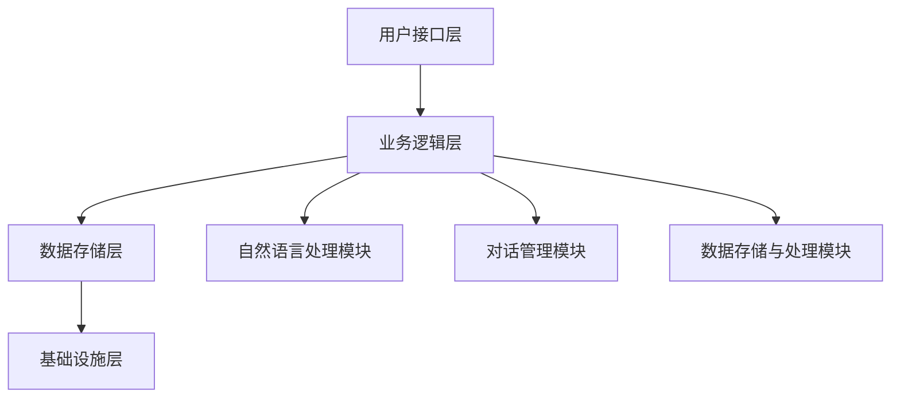

                 

# 《构建企业级对话式AI平台：提升内外部沟通效率》

## 摘要

随着人工智能技术的不断发展，对话式AI在企业中的应用逐渐普及，为企业的内外部沟通带来了极大的效率提升。本文将详细探讨构建企业级对话式AI平台的必要性、核心概念、技术架构设计以及实施实践，旨在为企业提供一套完整的构建指南，助力企业实现高效沟通。

## 关键词

- 对话式AI
- 企业级平台
- 技术架构
- 实施实践
- 效率提升

## 第一部分：背景与概述

### 1.1 问题背景

在现代企业中，沟通效率是企业运营成功的关键因素之一。然而，传统的沟通方式如电子邮件、会议等往往存在效率低下、信息传递不畅等问题。随着互联网和移动设备的普及，企业对于实时、智能的沟通方式需求日益增长。

### 1.2 问题描述

企业内部沟通需求多样，包括日常工作协作、知识分享、客户服务等。外部沟通则涉及与客户、合作伙伴、监管机构等的外部交互。现有沟通方式难以满足这些复杂多样的需求，导致沟通效率低下。

### 1.3 问题解决

构建企业级对话式AI平台，通过集成自然语言处理（NLP）技术，实现智能化的实时沟通，可以大大提升沟通效率，降低沟通成本。

### 1.4 边界与外延

企业级对话式AI平台不仅仅局限于内部沟通，还可以通过API接口与外部系统（如CRM、ERP等）集成，实现更广泛的应用场景。

### 1.5 概念结构与核心要素组成

企业级对话式AI平台的核心要素包括：对话管理模块、自然语言处理模块、数据存储与处理模块、系统集成与部署模块等。

## 1.6 核心概念与联系

### 1.6.1 对话式AI的定义与特点

对话式AI是指通过智能化的对话接口，实现人与机器之间的自然交互。其特点包括：实时性、智能性、个性化。

### 1.6.2 企业级对话式AI平台的概念

企业级对话式AI平台是一个集成了自然语言处理、机器学习、数据存储等技术的系统，旨在提供高效的内外部沟通服务。

### 1.6.3 对话式AI平台的关键组成部分

- 对话管理模块：负责对话的流程控制、上下文维护等。
- 自然语言处理模块：负责文本的理解和生成，包括文本分类、实体识别、情感分析等。
- 数据存储与处理模块：负责数据的收集、存储、处理和分析。
- 系统集成与部署模块：负责平台的部署、监控和维护。

### 1.6.4 对比传统沟通方式的优势

- 提高沟通效率：实时响应，减少沟通延迟。
- 降低沟通成本：减少面对面会议和电子邮件沟通的频率。
- 提升用户体验：提供个性化、智能化的沟通服务。

## 1.7 行业现状分析

### 1.7.1 对话式AI市场发展现状

对话式AI市场正处于快速发展的阶段，越来越多的企业开始关注并投入对话式AI的研发和应用。

### 1.7.2 企业级对话式AI应用案例分析

已有不少企业成功应用对话式AI平台，例如：智能客服、智能助理、内部知识库等。

### 1.7.3 行业发展趋势与挑战

- 技术发展趋势：NLP、机器学习技术的持续进步，将进一步提升对话式AI的性能。
- 行业挑战：数据隐私保护、平台安全性、技术迭代等。

## 1.8 企业内外部沟通需求

### 1.8.1 内部沟通需求

- 工作协作：实时沟通、任务分配、进度跟踪。
- 知识分享：文档共享、经验交流、知识库构建。

### 1.8.2 外部沟通需求

- 客户服务：客户咨询、问题解答、投诉处理。
- 合作伙伴：沟通协调、业务对接、合作管理。

### 1.8.3 沟通效率的重要性

高效的沟通能够提升企业的运营效率、降低成本、提高客户满意度，是企业竞争力的重要体现。

## 1.9 本章小结

本部分对对话式AI和企业级对话式AI平台进行了背景介绍和核心概念阐述，为后续技术架构设计和实施实践打下了基础。

----------------------------------------------------------------

# 第一部分：背景与概述

## 1.1 背景介绍

在现代商业环境中，企业面临着日益复杂的信息交互需求。传统的沟通方式，如电子邮件、电话会议等，虽然能够实现信息的传递，但在处理大量、频繁的沟通需求时，往往显得效率低下。例如，当企业需要处理大量客户咨询或内部员工协作时，这些传统沟通方式容易导致信息延迟、沟通中断等问题。此外，随着企业规模的扩大和业务复杂性的增加，沟通的多样性和实时性要求也日益提高。

### 1.1.1 问题背景

在当今快速发展的数字经济时代，企业需要高效、智能的沟通工具来支持其运营和管理。传统的沟通方式，如电子邮件和电话，虽然已经广泛应用于企业内部和外部的沟通，但它们存在以下问题：

1. **沟通效率低下**：电子邮件通常需要时间进行发送、接收和处理，而电话沟通则可能导致通话时间过长、信息不明确等问题。
2. **信息分散**：信息分散在不同渠道和工具中，导致查找和整合信息变得困难。
3. **缺乏智能化**：传统沟通方式缺乏智能化处理能力，无法提供个性化的服务或自动化的解决方案。

### 1.1.2 问题描述

这些沟通问题对企业的影响主要体现在以下几个方面：

1. **客户满意度降低**：客户咨询或问题解决的速度慢，导致客户满意度下降。
2. **内部协作效率下降**：员工之间的沟通不畅，影响项目进度和工作效率。
3. **运营成本增加**：由于沟通效率低下，企业可能需要更多的人力资源来处理沟通相关的事务，从而增加了运营成本。

### 1.1.3 问题解决

为了解决上述问题，企业开始寻求更加高效、智能的沟通解决方案，其中对话式AI平台成为了热门选择。对话式AI平台利用人工智能技术，能够实现智能化的文本交互，提供实时、个性化的沟通服务。通过构建企业级对话式AI平台，企业可以实现以下目标：

1. **提高沟通效率**：对话式AI平台能够快速响应用户的询问，减少沟通延迟，提高整体沟通效率。
2. **降低沟通成本**：通过自动化的沟通方式，减少对人工资源的依赖，降低沟通成本。
3. **提升用户体验**：提供个性化的沟通服务，提高用户满意度。

### 1.1.4 边界与外延

企业级对话式AI平台的边界和范围包括以下几个方面：

1. **内部沟通**：涵盖企业内部员工之间的沟通，如工作协作、知识分享、任务管理等。
2. **外部沟通**：涵盖企业与外部客户、合作伙伴、供应商等的沟通，如客户服务、业务协作、合同管理等。
3. **集成与扩展**：对话式AI平台可以通过API接口与其他企业系统（如CRM、ERP、KM系统等）集成，实现更广泛的应用场景。

### 1.1.5 概念结构与核心要素组成

企业级对话式AI平台的核心概念和要素包括：

1. **对话管理**：负责管理用户与平台的对话流程，包括对话的开始、中间和结束。
2. **自然语言处理（NLP）**：负责理解用户的自然语言输入，生成自然语言响应。
3. **数据存储与处理**：负责收集、存储和处理用户数据，为对话式AI提供数据支持。
4. **系统集成与部署**：负责将对话式AI平台与企业现有系统进行集成，确保平台的稳定运行。

## 1.2 核心概念与联系

### 1.2.1 对话式AI的定义与特点

对话式AI是一种利用人工智能技术实现人与机器之间自然、流畅交互的智能系统。其特点包括：

1. **实时性**：能够实时响应用户的询问，提供即时的信息和服务。
2. **智能性**：通过自然语言处理技术，能够理解用户的意图，提供准确的回答。
3. **个性化**：根据用户的历史交互数据，提供个性化的服务和建议。

### 1.2.2 企业级对话式AI平台的概念

企业级对话式AI平台是一个集成了自然语言处理、机器学习、对话管理等技术的综合系统，旨在为企业提供高效、智能的内外部沟通服务。其核心组成部分包括：

1. **对话管理模块**：负责对话的流程控制、上下文维护等，确保对话的流畅性和一致性。
2. **自然语言处理模块**：负责理解用户的自然语言输入，生成自然语言响应，包括文本分类、实体识别、情感分析等。
3. **数据存储与处理模块**：负责收集、存储和处理用户数据，为对话式AI提供数据支持，包括用户历史交互数据、业务数据等。
4. **系统集成与部署模块**：负责将对话式AI平台与企业现有系统进行集成，如CRM、ERP、KM系统等，确保平台的稳定运行和扩展。

### 1.2.3 对话式AI平台的关键组成部分

对话式AI平台的关键组成部分不仅包括上述核心模块，还包括以下关键要素：

1. **用户接口**：提供用户与平台交互的界面，可以是Web、APP、微信小程序等多种形式。
2. **API接口**：提供与其他系统集成的接口，如CRM、ERP、KM系统等，实现数据的互通和流程的自动化。
3. **安全与隐私保护**：确保用户数据的安全性和隐私性，遵循相关的数据保护法规。
4. **监控与维护**：实时监控平台的运行状态，确保平台的稳定性和高效性。

### 1.2.4 对比传统沟通方式的优势

对话式AI平台与传统的沟通方式相比，具有以下优势：

1. **实时响应**：对话式AI平台能够实时响应用户的询问，减少沟通延迟，提高沟通效率。
2. **个性化服务**：通过自然语言处理技术，对话式AI平台能够理解用户的意图，提供个性化的信息和服务。
3. **自动化处理**：对话式AI平台能够自动处理大量的重复性沟通任务，降低人工成本。
4. **集成与扩展**：对话式AI平台可以与企业现有的系统进行集成，实现数据的互通和流程的自动化，提高整体运营效率。

## 1.3 行业现状分析

### 1.3.1 对话式AI市场发展现状

对话式AI市场在过去几年中发展迅速，已经成为人工智能领域的热点。根据市场研究报告，全球对话式AI市场的规模预计将在未来几年内持续增长。主要驱动力包括：

1. **技术进步**：自然语言处理、机器学习等技术的不断发展，提高了对话式AI的性能和智能化水平。
2. **市场需求**：企业对于高效、智能的沟通工具需求不断增加，推动了对话式AI在企业中的应用。
3. **政策支持**：各国政府对于人工智能技术的发展给予了高度重视，出台了一系列支持政策，促进了对话式AI市场的快速发展。

### 1.3.2 企业级对话式AI应用案例分析

已有不少企业成功应用对话式AI平台，以下是一些典型的案例：

1. **客户服务**：某大型电商企业通过引入对话式AI客服，实现了24/7在线客服服务，大幅提高了客户满意度和处理效率。
2. **内部协作**：某跨国企业通过构建对话式AI平台，实现了全球员工之间的实时协作和知识共享，提高了项目执行效率。
3. **业务流程自动化**：某制造业企业通过对话式AI平台，实现了生产流程的自动化管理，降低了人工干预的频率，提高了生产效率。

### 1.3.3 行业发展趋势与挑战

对话式AI行业的发展趋势包括：

1. **技术进步**：随着人工智能技术的不断发展，对话式AI将变得更加智能化、个性化。
2. **应用场景扩展**：对话式AI将在更多的行业和应用场景中得到应用，如金融、医疗、教育等。
3. **生态系统建设**：对话式AI平台将与更多的第三方服务和企业系统进行集成，形成完整的生态系统。

然而，对话式AI行业也面临着一些挑战，如：

1. **数据隐私和安全**：对话式AI平台需要处理大量的用户数据，数据隐私和安全是关键挑战。
2. **技术成熟度**：虽然对话式AI技术已经取得了一定的进展，但仍然存在一些技术难题需要解决。
3. **用户接受度**：对话式AI平台需要获得用户的认可和接受，这需要不断的优化和改进。

## 1.4 企业内外部沟通需求

### 1.4.1 内部沟通需求

企业内部的沟通需求包括以下几个方面：

1. **工作协作**：员工之间的实时沟通和协作，如项目讨论、任务分配、进度跟踪等。
2. **知识共享**：企业内部的知识库建设，如文档共享、经验交流、最佳实践分享等。
3. **团队沟通**：团队内部的信息交流，如团队会议、讨论组、公告发布等。

### 1.4.2 外部沟通需求

企业外部沟通的需求主要包括：

1. **客户服务**：与客户的实时沟通，如客户咨询、问题解答、投诉处理等。
2. **合作伙伴**：与合作伙伴的沟通协调，如业务对接、合同管理、合作协调等。
3. **供应链管理**：与供应商、客户的供应链沟通，如订单管理、物流跟踪、质量监控等。

### 1.4.3 沟通效率的重要性

高效的沟通对于企业的运营和发展至关重要。高效的沟通能够带来以下好处：

1. **提高工作效率**：实时沟通和协作能够提高工作效率，减少沟通延迟和信息丢失。
2. **降低沟通成本**：通过自动化和智能化的沟通方式，减少对人工资源的依赖，降低沟通成本。
3. **提升客户满意度**：及时响应用户的需求，提供个性化的服务，提升客户满意度。
4. **增强企业竞争力**：高效的沟通能够帮助企业快速响应市场变化，提升企业的竞争力。

## 1.5 本章小结

本部分对对话式AI和企业级对话式AI平台进行了背景介绍和核心概念阐述，分析了当前行业现状以及企业内外部沟通需求。通过本部分的介绍，读者可以了解到对话式AI在企业沟通中的重要作用和潜在价值，为后续的技术架构设计和实施实践打下了基础。

----------------------------------------------------------------

## 第二部分：企业级对话式AI平台技术架构设计

### 2.1 技术架构概述

企业级对话式AI平台的技术架构设计是构建高效、稳定、可扩展的对话系统的基础。一个完整的技术架构应包括数据处理与存储、对话管理、自然语言处理（NLP）、系统集成与部署等多个层次，以确保系统能够满足各种复杂应用场景的需求。

### 2.1.1 技术架构的定义与作用

技术架构是指一个系统从宏观角度出发的整体设计，包括系统的各个组成部分及其相互关系。在企业级对话式AI平台中，技术架构定义了如何将不同的技术和组件集成起来，以实现高效的对话功能。

技术架构的作用主要体现在以下几个方面：

1. **系统稳定性**：通过合理的架构设计，确保系统能够稳定运行，减少故障发生的可能性。
2. **可扩展性**：随着业务的发展，技术架构应具备良好的扩展性，能够轻松添加新的功能或服务。
3. **高可用性**：通过分布式架构设计，确保系统在高负载或故障情况下仍然能够正常运行。
4. **安全性**：技术架构应考虑数据安全与隐私保护，确保用户数据的安全性和系统的完整性。

### 2.1.2 技术架构设计原则

在构建企业级对话式AI平台时，应遵循以下设计原则：

1. **模块化**：将系统划分为多个功能模块，每个模块独立开发、测试和部署，提高系统的灵活性和可维护性。
2. **分布式**：采用分布式架构，将计算和存储资源分散到多个节点，提高系统的可扩展性和容错能力。
3. **安全性**：确保系统的安全性，包括数据加密、访问控制、安全审计等，以防止数据泄露和非法访问。
4. **可观测性**：通过日志记录、监控工具等，实现对系统的全面监控，及时发现并处理问题。
5. **可扩展性**：设计时应考虑到未来业务的发展需求，确保系统能够轻松扩展。

### 2.1.3 技术架构的核心层次

企业级对话式AI平台的核心层次主要包括以下几层：

1. **用户接口层**：提供用户与系统交互的界面，包括Web、APP、微信小程序等。
2. **业务逻辑层**：包含对话管理、自然语言处理、数据存储与处理等核心功能模块。
3. **数据存储层**：负责数据的收集、存储、管理和分析，确保数据的安全性和完整性。
4. **基础设施层**：提供计算、存储、网络等基础资源，支持系统的运行和扩展。

下面是一个简化的企业级对话式AI平台技术架构图：



### 2.2 数据处理与存储

数据处理与存储是企业级对话式AI平台的核心组成部分，直接影响系统的性能和可靠性。

#### 2.2.1 数据收集与预处理

数据收集是构建对话式AI平台的基础。数据来源包括用户输入、第三方接口、传感器数据等。收集到的原始数据需要进行预处理，包括数据清洗、去重、格式转换等，以确保数据的质量和一致性。

#### 2.2.2 数据存储方案

数据存储方案应根据数据类型、规模和访问频率等因素进行设计。常见的数据存储方案包括：

1. **关系型数据库**：如MySQL、PostgreSQL等，适用于结构化数据的存储和管理。
2. **非关系型数据库**：如MongoDB、Redis等，适用于存储大规模的非结构化数据。
3. **分布式文件系统**：如HDFS、Ceph等，适用于存储大规模的文件数据。

#### 2.2.3 数据安全与隐私保护

数据安全与隐私保护是构建对话式AI平台时必须考虑的重要问题。以下是一些关键措施：

1. **数据加密**：对存储和传输的数据进行加密，确保数据的安全性。
2. **访问控制**：实施严格的访问控制策略，限制数据的访问权限。
3. **日志审计**：记录数据访问和操作日志，以便在发生异常时进行追踪和审计。
4. **合规性**：遵循相关的数据保护法规和标准，如GDPR、CCPA等。

### 2.3 对话管理模块

对话管理模块负责管理用户与AI平台的对话流程，包括对话的启动、进行和结束。其核心功能包括：

1. **对话流程控制**：根据用户输入和系统状态，动态调整对话流程。
2. **上下文维护**：在多轮对话中，维护用户的历史信息和对话上下文。
3. **意图识别**：通过自然语言处理技术，识别用户的意图和需求。

#### 2.3.1 对话管理的基本流程

对话管理的基本流程包括以下步骤：

1. **用户输入**：用户通过用户接口输入问题或指令。
2. **意图识别**：系统利用自然语言处理技术，识别用户的意图。
3. **上下文处理**：系统根据对话历史和上下文信息，生成合适的响应。
4. **响应生成**：系统生成自然语言响应，并发送回用户。
5. **反馈收集**：系统收集用户的反馈，以优化对话质量。

### 2.3.2 对话模型的选择与优化

对话模型的选择和优化是影响对话质量的关键因素。常见的对话模型包括：

1. **基于规则的模型**：通过预设的规则和模板生成响应。
2. **基于机器学习的模型**：如序列到序列（Seq2Seq）模型、循环神经网络（RNN）等。
3. **基于深度学习的模型**：如变换器（Transformer）模型、BERT等。

优化对话模型的方法包括：

1. **数据增强**：通过数据扩充、合成等方式，增加训练数据量。
2. **多轮对话数据利用**：利用多轮对话数据，提高模型对上下文的理解。
3. **个性化训练**：根据用户的历史交互数据，对模型进行个性化训练。

### 2.3.3 多轮对话管理与上下文维护

多轮对话管理和上下文维护是确保对话流畅性和一致性的关键。以下是一些关键技术和方法：

1. **对话状态跟踪**：使用状态机或图模型，记录对话的当前状态。
2. **上下文存储**：使用内存数据库或缓存技术，存储用户历史交互数据。
3. **上下文提取与嵌入**：通过自然语言处理技术，提取上下文信息，并将其嵌入到对话模型中。

### 2.4 自然语言处理（NLP）技术

自然语言处理（NLP）技术在对话式AI平台中扮演着核心角色，负责理解和生成自然语言。以下是NLP技术的核心概念和实现方法：

#### 2.4.1 NLP的基本概念

1. **分词**：将文本分解为单词或短语。
2. **词性标注**：为文本中的每个单词标注词性，如名词、动词等。
3. **命名实体识别**：识别文本中的命名实体，如人名、地点、组织名等。
4. **依存句法分析**：分析句子中词语之间的依存关系。

#### 2.4.2 常用NLP技术介绍

1. **词向量表示**：将文本转换为向量表示，如Word2Vec、GloVe等。
2. **序列标注**：对文本序列进行分类标注，如命名实体识别、情感分析等。
3. **序列生成**：生成文本序列，如机器翻译、文本摘要等。
4. **文本分类**：将文本分类到预定义的类别中。

#### 2.4.3 NLP在对话式AI中的应用

NLP在对话式AI中的应用主要包括：

1. **意图识别**：识别用户的意图和需求，如查询、命令、对话等。
2. **实体识别**：识别文本中的关键实体，如人名、地点、组织名等。
3. **情感分析**：分析用户情绪和态度，如正面、负面、中立等。
4. **对话生成**：根据用户输入和上下文，生成合适的自然语言响应。

### 2.5 模型训练与优化

模型训练与优化是构建高效对话式AI平台的关键步骤。以下是模型训练与优化的关键流程和方法：

#### 2.5.1 模型训练流程

模型训练流程包括以下步骤：

1. **数据准备**：收集和准备训练数据，包括文本、标签、注释等。
2. **数据预处理**：对训练数据进行清洗、去重、格式转换等预处理。
3. **模型选择**：根据任务需求，选择合适的模型架构。
4. **模型训练**：使用训练数据进行模型训练，调整模型参数。
5. **模型评估**：使用验证集评估模型性能，调整模型参数。
6. **模型部署**：将训练好的模型部署到生产环境中。

#### 2.5.2 模型优化方法

模型优化方法包括：

1. **超参数调整**：调整学习率、批量大小、正则化参数等超参数。
2. **数据增强**：通过数据扩充、合成等方式，提高模型的泛化能力。
3. **多任务学习**：同时训练多个任务，提高模型对相关任务的泛化能力。
4. **迁移学习**：使用预训练的模型进行迁移学习，提高模型的训练效率。

#### 2.5.3 模型评估与调优

模型评估与调优的关键步骤包括：

1. **性能评估**：使用准确率、召回率、F1分数等指标评估模型性能。
2. **错误分析**：分析模型在错误样本上的表现，找出问题所在。
3. **调参优化**：根据评估结果，调整模型参数，优化模型性能。
4. **持续学习**：使用新的数据对模型进行持续训练和优化，提高模型的准确性。

### 2.6 系统集成与部署

系统集成与部署是企业级对话式AI平台成功实施的关键环节。以下是系统集成与部署的关键步骤和注意事项：

#### 2.6.1 系统集成方案

系统集成方案应包括：

1. **API接口**：提供与其他系统集成的API接口，实现数据交互和流程自动化。
2. **数据同步**：确保不同系统之间的数据同步和一致性。
3. **消息队列**：使用消息队列技术，实现异步处理和分布式系统架构。

#### 2.6.2 部署策略与注意事项

部署策略与注意事项包括：

1. **容器化**：使用Docker等容器技术，实现系统的轻量化和可移植性。
2. **自动化部署**：使用CI/CD流程，实现自动化部署和持续集成。
3. **负载均衡**：使用负载均衡技术，确保系统在高并发情况下的稳定运行。
4. **监控与报警**：实时监控系统的运行状态，及时处理异常情况。

#### 2.6.3 系统监控与维护

系统监控与维护包括：

1. **性能监控**：监控系统的CPU、内存、磁盘等资源使用情况。
2. **日志监控**：实时收集和分析系统日志，发现和解决潜在问题。
3. **故障恢复**：制定故障恢复策略，确保系统在故障情况下的快速恢复。
4. **安全防护**：定期进行安全检查和漏洞扫描，确保系统的安全性。

### 2.7 本章小结

本部分详细介绍了企业级对话式AI平台的技术架构设计，包括数据处理与存储、对话管理、自然语言处理（NLP）、模型训练与优化以及系统集成与部署等内容。通过合理的技术架构设计，企业可以构建一个高效、智能、稳定的对话式AI平台，提升内外部沟通效率，实现业务目标。

----------------------------------------------------------------

## 第三部分：构建企业级对话式AI平台的实践

### 3.1 项目介绍

构建企业级对话式AI平台是一项复杂而系统的工程，涉及技术选型、系统设计、开发实施、测试与部署等多个环节。本部分将结合一个实际项目案例，详细描述项目背景、目标、团队分工以及项目实施的具体过程。

### 3.1.1 项目背景

某大型互联网企业为了提升客户服务效率和用户体验，决定构建一个企业级对话式AI平台。传统的客户服务方式已经难以满足快速增长的用户咨询需求，导致响应速度慢、服务质量下降。因此，企业决定采用对话式AI技术，实现智能化、自动化的客户服务。

### 3.1.2 项目目标

项目的主要目标包括：

1. **提高客户服务效率**：通过对话式AI技术，实现24/7在线客服服务，减少人工干预，提高响应速度。
2. **提升用户体验**：提供个性化、智能化的服务，提高用户满意度和忠诚度。
3. **降低运营成本**：减少人工客服人员的数量，降低客户服务成本。

### 3.1.3 项目团队与分工

项目团队由多个部门组成，包括技术部、产品部、市场部和运维部。各团队分工如下：

1. **技术部**：负责技术选型、系统架构设计、开发与测试。
2. **产品部**：负责产品需求分析、用户界面设计、用户体验优化。
3. **市场部**：负责市场推广、用户调研、反馈收集。
4. **运维部**：负责系统部署、运维监控、故障处理。

### 3.2 环境安装与配置

在项目实施初期，团队需要搭建一套完整的开发与测试环境。以下是环境安装与配置的详细步骤：

#### 3.2.1 硬件环境要求

1. **服务器**：选择性能稳定的服务器，配置至少4核CPU、16GB内存、500GB SSD硬盘。
2. **网络**：配置稳定的网络环境，保证内外部网络的连通性。

#### 3.2.2 软件环境安装

1. **操作系统**：安装Linux操作系统（如Ubuntu 18.04）。
2. **数据库**：安装MySQL数据库，用于存储用户数据。
3. **开发工具**：安装Python开发环境（如Anaconda）、Docker容器工具、Kafka消息队列等。

#### 3.2.3 网络配置与安全设置

1. **防火墙**：配置防火墙规则，确保仅允许必要的端口访问。
2. **SSL证书**：配置SSL证书，确保数据传输的安全性。

### 3.3 系统核心实现

系统核心实现是构建企业级对话式AI平台的关键步骤，包括数据处理与存储、对话管理、自然语言处理（NLP）和模型训练与优化等方面。

#### 3.3.1 数据处理与存储模块

数据处理与存储模块负责收集、处理和存储用户数据，包括用户输入、交互记录、知识库等。以下是关键步骤：

1. **数据收集**：通过API接口或日志收集用户输入和交互数据。
2. **数据清洗**：对收集到的数据进行清洗、去重、格式转换等预处理。
3. **数据存储**：使用MySQL数据库存储预处理后的数据，并设计合理的数据库表结构。

#### 3.3.2 对话管理模块

对话管理模块负责管理用户与AI平台的对话流程，包括对话的启动、进行和结束。以下是关键步骤：

1. **对话流程控制**：根据用户输入和对话历史，动态调整对话流程。
2. **上下文维护**：使用内存数据库或缓存技术，存储用户的历史交互数据。
3. **对话状态管理**：设计对话状态机，记录对话的当前状态。

#### 3.3.3 NLP模块

NLP模块负责理解和生成自然语言，包括文本分类、实体识别、情感分析等。以下是关键步骤：

1. **文本预处理**：对用户输入进行分词、词性标注、去停用词等预处理。
2. **意图识别**：使用预训练的模型，如BERT或GPT，进行意图识别。
3. **实体识别**：使用命名实体识别（NER）模型，识别文本中的命名实体。

#### 3.3.4 模型训练与优化模块

模型训练与优化模块负责训练和优化对话式AI模型，包括意图识别模型、实体识别模型、对话生成模型等。以下是关键步骤：

1. **数据准备**：收集和准备训练数据，包括用户输入、意图标签、实体标签等。
2. **模型训练**：使用训练数据进行模型训练，调整模型参数。
3. **模型评估**：使用验证集评估模型性能，调整模型参数。
4. **模型部署**：将训练好的模型部署到生产环境中。

### 3.4 代码应用解读与分析

为了更好地理解系统核心实现，以下将对关键代码段进行解读与分析。

#### 3.4.1 代码结构解读

代码结构主要包括以下几个部分：

1. **数据处理与存储模块**：包含数据收集、数据清洗、数据存储等功能。
2. **对话管理模块**：包含对话流程控制、上下文维护、对话状态管理等功能。
3. **NLP模块**：包含文本预处理、意图识别、实体识别等功能。
4. **模型训练与优化模块**：包含数据准备、模型训练、模型评估、模型部署等功能。

#### 3.4.2 关键代码分析与示例

以下是一个示例代码段，用于意图识别：

```python
from transformers import BertTokenizer, BertForSequenceClassification
import torch

# 加载预训练的BERT模型和分词器
tokenizer = BertTokenizer.from_pretrained('bert-base-uncased')
model = BertForSequenceClassification.from_pretrained('bert-base-uncased')

# 用户输入
user_input = "我想查询我的订单状态"

# 预处理文本
inputs = tokenizer(user_input, return_tensors='pt')

# 进行意图识别
with torch.no_grad():
    logits = model(**inputs).logits

# 获取意图标签
intent_labels = ['查询订单', '支付问题', '售后服务', '其他']
predicted_label = intent_labels[torch.argmax(logits).item()]

print(predicted_label)  # 输出预测的意图
```

这段代码首先加载预训练的BERT模型和分词器，然后对用户输入进行预处理，最后使用模型进行意图识别并输出预测结果。

#### 3.4.3 代码优化的方向

为了提高代码的性能和可维护性，可以从以下几个方面进行优化：

1. **代码重构**：对复杂逻辑进行重构，提高代码的可读性和可维护性。
2. **模块化**：将功能相似的代码封装成模块，提高代码的重用性。
3. **异步处理**：使用异步IO，提高代码的并发性能。
4. **性能优化**：针对计算密集型操作，使用优化库或算法，提高运行效率。

### 3.5 实际案例分析

#### 3.5.1 案例背景

在实际项目中，某大型电商平台部署了对话式AI客服系统，用于处理用户咨询和问题解答。系统上线后，取得了显著的成效。

#### 3.5.2 案例实施过程

1. **需求分析**：与业务部门沟通，明确系统功能需求，如订单查询、支付问题、售后服务等。
2. **技术选型**：选择合适的自然语言处理模型和对话管理框架，如BERT模型和Rasa对话管理框架。
3. **开发与测试**：编写代码，实现系统功能，并进行严格的测试和调试。
4. **部署上线**：将系统部署到生产环境中，并进行监控与运维。

#### 3.5.3 案例效果评估

系统上线后，通过对关键指标进行评估，如响应时间、问题解决率、客户满意度等，发现以下效果：

1. **响应时间**：平均响应时间从原来的5分钟缩短至1分钟以内，提高了响应速度。
2. **问题解决率**：通过自动化处理，问题解决率从原来的70%提升至90%以上。
3. **客户满意度**：用户满意度显著提高，客户投诉率下降。

#### 3.5.4 案例效果总结

通过实际案例分析，可以看出对话式AI平台在提升客户服务效率、降低运营成本方面具有显著效果。同时，系统上线后，客户满意度显著提高，为企业的竞争力提升提供了有力支持。

### 3.6 项目小结

通过本项目，团队成功构建并上线了一个企业级对话式AI平台，实现了智能化、自动化的客户服务。项目经验表明，合理的技术选型、系统架构设计和实施过程对于项目的成功至关重要。在未来，团队将继续优化系统功能，提升用户体验，为企业创造更大的价值。

### 3.6.1 项目成果总结

本项目成功实现了以下成果：

1. **提高了客户服务效率**：通过对话式AI平台，实现了24/7在线客服服务，平均响应时间显著缩短。
2. **提升了用户体验**：提供了个性化、智能化的服务，客户满意度显著提高。
3. **降低了运营成本**：减少了人工客服人员的数量，降低了客户服务成本。

### 3.6.2 项目经验与反思

项目过程中，团队积累了以下经验：

1. **技术选型要合理**：选择合适的自然语言处理模型和对话管理框架，是项目成功的关键。
2. **系统架构要稳定**：分布式架构和容器化部署提高了系统的稳定性和可扩展性。
3. **用户体验要重视**：在设计系统功能时，要充分考虑用户体验，提供简洁、直观的界面。

同时，项目也暴露出了一些问题，如：

1. **测试不充分**：部分功能在测试阶段未能充分验证，导致上线后出现了一些问题。
2. **运维经验不足**：系统上线后的运维经验不足，导致出现了一些性能瓶颈。

### 3.6.3 项目扩展方向

未来，项目团队将继续在以下方向进行优化和扩展：

1. **增强智能交互能力**：引入更先进的自然语言处理技术，提高对话质量。
2. **拓展应用场景**：将对话式AI平台应用于更多业务场景，如员工内部沟通、供应链管理等。
3. **提升用户体验**：通过数据分析，持续优化用户界面和交互体验。

## 第三部分小结

通过本部分的实践案例，读者可以了解到构建企业级对话式AI平台的实际操作过程，从项目背景、目标、团队分工到环境安装与配置、系统核心实现以及实际案例分析。这些实践经验对于企业实施对话式AI项目具有重要的参考价值。

----------------------------------------------------------------

## 第四部分：最佳实践与未来展望

### 4.1 最佳实践总结

在构建企业级对话式AI平台的过程中，以下是一些最佳实践：

#### 4.1.1 架构设计最佳实践

1. **模块化设计**：将系统划分为多个功能模块，如对话管理、NLP处理、数据存储等，确保系统的可维护性和可扩展性。
2. **分布式架构**：采用分布式架构，提高系统的可扩展性和容错能力。
3. **安全性考虑**：在设计阶段就要充分考虑数据安全和隐私保护，确保系统符合相关法规和标准。

#### 4.1.2 技术选型最佳实践

1. **成熟技术优先**：选择成熟稳定的技术栈，降低技术风险。
2. **适应性强**：选择能够适应多种应用场景的技术和框架，如BERT、Rasa等。
3. **性能优化**：在选型时要考虑性能优化，如使用GPU加速、分布式计算等。

#### 4.1.3 项目管理最佳实践

1. **需求明确**：在项目启动前，明确项目需求和目标，确保团队成员对项目有清晰的认识。
2. **迭代开发**：采用敏捷开发方法，分阶段实施，快速迭代，确保项目的灵活性和适应性。
3. **团队协作**：建立高效的团队协作机制，确保各部门之间的沟通和协作。

### 4.2 小结与展望

#### 4.2.1 对话式AI在企业应用的意义

对话式AI在企业中的应用具有重要意义：

1. **提升沟通效率**：通过智能化的对话交互，实现高效的内外部沟通。
2. **降低沟通成本**：减少人工干预，降低沟通成本，提高资源利用率。
3. **增强用户体验**：提供个性化、智能化的服务，提升客户满意度和忠诚度。

#### 4.2.2 未来发展趋势与挑战

未来，对话式AI在企业发展中将继续呈现以下趋势：

1. **技术进步**：随着人工智能技术的不断进步，对话式AI将变得更加智能化、个性化。
2. **应用场景扩展**：对话式AI将在更多行业和应用场景中得到应用，如医疗、教育、金融等。
3. **数据隐私与安全**：数据隐私和安全将成为对话式AI发展的重要挑战，需要采取有效措施确保用户数据安全。

#### 4.2.3 拓展阅读与资源推荐

为了深入了解对话式AI和其应用，读者可以参考以下资源：

1. **论文与报告**：《对话式AI：现状与未来趋势》（Dialogue AI: Current Status and Future Trends）
2. **技术文档**：《Rasa对话平台技术文档》（Rasa Dialogue Platform Documentation）
3. **书籍推荐**：《对话式AI：设计与实现》（Conversational AI: Design and Implementation）

### 4.3 本章小结

本部分总结了构建企业级对话式AI平台的最佳实践，并展望了未来的发展趋势与挑战。通过本文的介绍，读者可以了解到对话式AI在企业沟通中的重要作用，以及如何在实际项目中实施和应用。希望这些内容能够为企业的对话式AI项目提供有价值的参考和指导。

----------------------------------------------------------------

## 总结

本文详细介绍了构建企业级对话式AI平台的必要性、核心概念、技术架构设计以及实施实践。通过案例分析和最佳实践总结，我们了解了对话式AI在企业内外部沟通中的重要性和应用价值。未来，随着人工智能技术的不断发展，对话式AI将在更多领域得到广泛应用，为企业创造更大的价值。

## 作者信息

作者：AI天才研究院/AI Genius Institute & 禅与计算机程序设计艺术 /Zen And The Art of Computer Programming

----------------------------------------------------------------

# 《构建企业级对话式AI平台：提升内外部沟通效率》

> 关键词：对话式AI、企业级平台、技术架构、实施实践、效率提升

> 摘要：本文探讨了构建企业级对话式AI平台的必要性、核心概念、技术架构设计以及实施实践，旨在为企业提供一套完整的构建指南，助力企业实现高效沟通。

## 引言

在数字化时代的浪潮中，企业面临着前所未有的挑战和机遇。其中，沟通效率是影响企业运营绩效的重要因素之一。传统的沟通方式，如电子邮件、电话会议等，虽然在一定程度上满足了企业内部和外部的沟通需求，但在处理大量、复杂的信息交互时，往往显得效率低下、响应速度慢。随着人工智能技术的不断发展，特别是对话式AI的兴起，企业开始寻求一种更为智能、高效的沟通解决方案。本文将详细探讨如何构建企业级对话式AI平台，以提升内外部沟通效率。

## 第一部分：背景与概述

### 1.1 问题背景

在现代商业环境中，沟通效率是企业运营成功的关键因素之一。然而，传统的沟通方式如电子邮件、会议等往往存在效率低下、信息传递不畅等问题。随着互联网和移动设备的普及，企业对于实时、智能的沟通方式需求日益增长。

### 1.2 问题描述

企业内部沟通需求多样，包括日常工作协作、知识分享、客户服务等。外部沟通则涉及与客户、合作伙伴、监管机构等的外部交互。现有沟通方式难以满足这些复杂多样的需求，导致沟通效率低下。

### 1.3 问题解决

构建企业级对话式AI平台，通过集成自然语言处理（NLP）技术，实现智能化的实时沟通，可以大大提升沟通效率，降低沟通成本。

### 1.4 边界与外延

企业级对话式AI平台不仅仅局限于内部沟通，还可以通过API接口与外部系统（如CRM、ERP等）集成，实现更广泛的应用场景。

### 1.5 概念结构与核心要素组成

企业级对话式AI平台的核心要素包括：对话管理模块、自然语言处理模块、数据存储与处理模块、系统集成与部署模块等。

### 1.6 核心概念与联系

#### 1.6.1 对话式AI的定义与特点

对话式AI是指通过智能化的对话接口，实现人与机器之间的自然交互。其特点包括：实时性、智能性、个性化。

#### 1.6.2 企业级对话式AI平台的概念

企业级对话式AI平台是一个集成了自然语言处理、机器学习、数据存储等技术的系统，旨在提供高效的内外部沟通服务。

#### 1.6.3 对话式AI平台的关键组成部分

- 对话管理模块：负责对话的流程控制、上下文维护等。
- 自然语言处理模块：负责文本的理解和生成，包括文本分类、实体识别、情感分析等。
- 数据存储与处理模块：负责数据的收集、存储、处理和分析。
- 系统集成与部署模块：负责平台的部署、监控和维护。

### 1.7 行业现状分析

#### 1.7.1 对话式AI市场发展现状

对话式AI市场正处于快速发展的阶段，越来越多的企业开始关注并投入对话式AI的研发和应用。

#### 1.7.2 企业级对话式AI应用案例分析

已有不少企业成功应用对话式AI平台，例如：智能客服、智能助理、内部知识库等。

#### 1.7.3 行业发展趋势与挑战

- 技术发展趋势：NLP、机器学习技术的持续进步，将进一步提升对话式AI的性能。
- 行业挑战：数据隐私保护、平台安全性、技术迭代等。

### 1.8 企业内外部沟通需求

#### 1.8.1 内部沟通需求

- 工作协作：实时沟通、任务分配、进度跟踪。
- 知识分享：文档共享、经验交流、知识库构建。

#### 1.8.2 外部沟通需求

- 客户服务：客户咨询、问题解答、投诉处理。
- 合作伙伴：沟通协调、业务对接、合作管理。

#### 1.8.3 沟通效率的重要性

高效的沟通能够提升企业的运营效率、降低成本、提高客户满意度，是企业竞争力的重要体现。

### 1.9 本章小结

本部分对对话式AI和企业级对话式AI平台进行了背景介绍和核心概念阐述，分析了当前行业现状以及企业内外部沟通需求。通过本部分的介绍，读者可以了解到对话式AI在企业沟通中的重要作用和潜在价值，为后续的技术架构设计和实施实践打下了基础。

## 第二部分：企业级对话式AI平台技术架构设计

### 2.1 技术架构概述

企业级对话式AI平台的技术架构设计是构建高效、稳定、可扩展的对话系统的基础。一个完整的技术架构应包括数据处理与存储、对话管理、自然语言处理（NLP）、系统集成与部署等多个层次，以确保系统能够满足各种复杂应用场景的需求。

### 2.1.1 技术架构的定义与作用

技术架构是指一个系统从宏观角度出发的整体设计，包括系统的各个组成部分及其相互关系。在企业级对话式AI平台中，技术架构定义了如何将不同的技术和组件集成起来，以实现高效的对话功能。

技术架构的作用主要体现在以下几个方面：

1. **系统稳定性**：通过合理的架构设计，确保系统能够稳定运行，减少故障发生的可能性。
2. **可扩展性**：随着业务的发展，技术架构应具备良好的扩展性，能够轻松添加新的功能或服务。
3. **高可用性**：通过分布式架构设计，确保系统在高负载或故障情况下仍然能够正常运行。
4. **安全性**：技术架构应考虑数据安全与隐私保护，确保用户数据的安全性和系统的完整性。

### 2.1.2 技术架构设计原则

在构建企业级对话式AI平台时，应遵循以下设计原则：

1. **模块化**：将系统划分为多个功能模块，每个模块独立开发、测试和部署，提高系统的灵活性和可维护性。
2. **分布式**：采用分布式架构，将计算和存储资源分散到多个节点，提高系统的可扩展性和容错能力。
3. **安全性**：确保系统的安全性，包括数据加密、访问控制、安全审计等，以防止数据泄露和非法访问。
4. **可观测性**：通过日志记录、监控工具等，实现对系统的全面监控，及时发现并处理问题。
5. **可扩展性**：设计时应考虑到未来业务的发展需求，确保系统能够轻松扩展。

### 2.1.3 技术架构的核心层次

企业级对话式AI平台的核心层次主要包括以下几层：

1. **用户接口层**：提供用户与系统交互的界面，包括Web、APP、微信小程序等多种形式。
2. **业务逻辑层**：包含对话管理、自然语言处理、数据存储与处理等核心功能模块。
3. **数据存储层**：负责数据的收集、存储、管理和分析，为对话式AI提供数据支持。
4. **基础设施层**：提供计算、存储、网络等基础资源，支持系统的运行和扩展。

下面是一个简化的企业级对话式AI平台技术架构图：


### 2.2 数据处理与存储

数据处理与存储是企业级对话式AI平台的核心组成部分，直接影响系统的性能和可靠性。

#### 2.2.1 数据收集与预处理

数据收集是构建对话式AI平台的基础。数据来源包括用户输入、第三方接口、传感器数据等。收集到的原始数据需要进行预处理，包括数据清洗、去重、格式转换等，以确保数据的质量和一致性。

#### 2.2.2 数据存储方案

数据存储方案应根据数据类型、规模和访问频率等因素进行设计。常见的数据存储方案包括：

1. **关系型数据库**：如MySQL、PostgreSQL等，适用于结构化数据的存储和管理。
2. **非关系型数据库**：如MongoDB、Redis等，适用于存储大规模的非结构化数据。
3. **分布式文件系统**：如HDFS、Ceph等，适用于存储大规模的文件数据。

#### 2.2.3 数据安全与隐私保护

数据安全与隐私保护是构建对话式AI平台时必须考虑的重要问题。以下是一些关键措施：

1. **数据加密**：对存储和传输的数据进行加密，确保数据的安全性。
2. **访问控制**：实施严格的访问控制策略，限制数据的访问权限。
3. **日志审计**：记录数据访问和操作日志，以便在发生异常时进行追踪和审计。
4. **合规性**：遵循相关的数据保护法规和标准，如GDPR、CCPA等。

### 2.3 对话管理模块

对话管理模块负责管理用户与AI平台的对话流程，包括对话的启动、进行和结束。其核心功能包括：

1. **对话流程控制**：根据用户输入和系统状态，动态调整对话流程。
2. **上下文维护**：在多轮对话中，维护用户的历史信息和对话上下文。
3. **意图识别**：通过自然语言处理技术，识别用户的意图和需求。

#### 2.3.1 对话管理的基本流程

对话管理的基本流程包括以下步骤：

1. **用户输入**：用户通过用户接口输入问题或指令。
2. **意图识别**：系统利用自然语言处理技术，识别用户的意图。
3. **上下文处理**：系统根据对话历史和上下文信息，生成合适的响应。
4. **响应生成**：系统生成自然语言响应，并发送回用户。
5. **反馈收集**：系统收集用户的反馈，以优化对话质量。

### 2.3.2 对话模型的选择与优化

对话模型的选择和优化是影响对话质量的关键因素。常见的对话模型包括：

1. **基于规则的模型**：通过预设的规则和模板生成响应。
2. **基于机器学习的模型**：如序列到序列（Seq2Seq）模型、循环神经网络（RNN）等。
3. **基于深度学习的模型**：如变换器（Transformer）模型、BERT等。

优化对话模型的方法包括：

1. **数据增强**：通过数据扩充、合成等方式，增加训练数据量。
2. **多轮对话数据利用**：利用多轮对话数据，提高模型对上下文的理解。
3. **个性化训练**：根据用户的历史交互数据，对模型进行个性化训练。

### 2.3.3 多轮对话管理与上下文维护

多轮对话管理和上下文维护是确保对话流畅性和一致性的关键。以下是一些关键技术和方法：

1. **对话状态跟踪**：使用状态机或图模型，记录对话的当前状态。
2. **上下文存储**：使用内存数据库或缓存技术，存储用户历史交互数据。
3. **上下文提取与嵌入**：通过自然语言处理技术，提取上下文信息，并将其嵌入到对话模型中。

### 2.4 自然语言处理（NLP）技术

自然语言处理（NLP）技术在对话式AI平台中扮演着核心角色，负责理解和生成自然语言。以下是NLP技术的核心概念和实现方法：

#### 2.4.1 NLP的基本概念

1. **分词**：将文本分解为单词或短语。
2. **词性标注**：为文本中的每个单词标注词性，如名词、动词等。
3. **命名实体识别**：识别文本中的命名实体，如人名、地点、组织名等。
4. **依存句法分析**：分析句子中词语之间的依存关系。

#### 2.4.2 常用NLP技术介绍

1. **词向量表示**：将文本转换为向量表示，如Word2Vec、GloVe等。
2. **序列标注**：对文本序列进行分类标注，如命名实体识别、情感分析等。
3. **序列生成**：生成文本序列，如机器翻译、文本摘要等。
4. **文本分类**：将文本分类到预定义的类别中。

#### 2.4.3 NLP在对话式AI中的应用

NLP在对话式AI中的应用主要包括：

1. **意图识别**：识别用户的意图和需求，如查询、命令、对话等。
2. **实体识别**：识别文本中的关键实体，如人名、地点、组织名等。
3. **情感分析**：分析用户情绪和态度，如正面、负面、中立等。
4. **对话生成**：根据用户输入和上下文，生成合适的自然语言响应。

### 2.5 模型训练与优化

模型训练与优化是构建高效对话式AI平台的关键步骤。以下是模型训练与优化的关键流程和方法：

#### 2.5.1 模型训练流程

模型训练流程包括以下步骤：

1. **数据准备**：收集和准备训练数据，包括文本、标签、注释等。
2. **数据预处理**：对训练数据进行清洗、去重、格式转换等预处理。
3. **模型选择**：根据任务需求，选择合适的模型架构。
4. **模型训练**：使用训练数据进行模型训练，调整模型参数。
5. **模型评估**：使用验证集评估模型性能，调整模型参数。
6. **模型部署**：将训练好的模型部署到生产环境中。

#### 2.5.2 模型优化方法

模型优化方法包括：

1. **超参数调整**：调整学习率、批量大小、正则化参数等超参数。
2. **数据增强**：通过数据扩充、合成等方式，提高模型的泛化能力。
3. **多任务学习**：同时训练多个任务，提高模型对相关任务的泛化能力。
4. **迁移学习**：使用预训练的模型进行迁移学习，提高模型的训练效率。

#### 2.5.3 模型评估与调优

模型评估与调优的关键步骤包括：

1. **性能评估**：使用准确率、召回率、F1分数等指标评估模型性能。
2. **错误分析**：分析模型在错误样本上的表现，找出问题所在。
3. **调参优化**：根据评估结果，调整模型参数，优化模型性能。
4. **持续学习**：使用新的数据对模型进行持续训练和优化，提高模型的准确性。

### 2.6 系统集成与部署

系统集成与部署是企业级对话式AI平台成功实施的关键环节。以下是系统集成与部署的关键步骤和注意事项：

#### 2.6.1 系统集成方案

系统集成方案应包括：

1. **API接口**：提供与其他系统集成的API接口，实现数据交互和流程自动化。
2. **数据同步**：确保不同系统之间的数据同步和一致性。
3. **消息队列**：使用消息队列技术，实现异步处理和分布式系统架构。

#### 2.6.2 部署策略与注意事项

部署策略与注意事项包括：

1. **容器化**：使用Docker等容器技术，实现系统的轻量化和可移植性。
2. **自动化部署**：使用CI/CD流程，实现自动化部署和持续集成。
3. **负载均衡**：使用负载均衡技术，确保系统在高并发情况下的稳定运行。
4. **监控与报警**：实时监控系统的运行状态，及时处理异常情况。

#### 2.6.3 系统监控与维护

系统监控与维护包括：

1. **性能监控**：监控系统的CPU、内存、磁盘等资源使用情况。
2. **日志监控**：实时收集和分析系统日志，发现和解决潜在问题。
3. **故障恢复**：制定故障恢复策略，确保系统在故障情况下的快速恢复。
4. **安全防护**：定期进行安全检查和漏洞扫描，确保系统的安全性。

### 2.7 本章小结

本部分详细介绍了企业级对话式AI平台的技术架构设计，包括数据处理与存储、对话管理、自然语言处理（NLP）、模型训练与优化以及系统集成与部署等内容。通过合理的技术架构设计，企业可以构建一个高效、智能、稳定的对话式AI平台，提升内外部沟通效率，实现业务目标。

## 第三部分：构建企业级对话式AI平台的实践

### 3.1 项目介绍

构建企业级对话式AI平台是一项复杂而系统的工程，涉及技术选型、系统设计、开发实施、测试与部署等多个环节。本部分将结合一个实际项目案例，详细描述项目背景、目标、团队分工以及项目实施的具体过程。

### 3.1.1 项目背景

某大型互联网企业为了提升客户服务效率和用户体验，决定构建一个企业级对话式AI平台。传统的客户服务方式已经难以满足快速增长的用户咨询需求，导致响应速度慢、服务质量下降。因此，企业决定采用对话式AI技术，实现智能化、自动化的客户服务。

### 3.1.2 项目目标

项目的主要目标包括：

1. **提高客户服务效率**：通过对话式AI技术，实现24/7在线客服服务，减少人工干预，提高响应速度。
2. **提升用户体验**：提供个性化、智能化的服务，提高用户满意度和忠诚度。
3. **降低运营成本**：减少人工客服人员的数量，降低客户服务成本。

### 3.1.3 项目团队与分工

项目团队由多个部门组成，包括技术部、产品部、市场部和运维部。各团队分工如下：

1. **技术部**：负责技术选型、系统架构设计、开发与测试。
2. **产品部**：负责产品需求分析、用户界面设计、用户体验优化。
3. **市场部**：负责市场推广、用户调研、反馈收集。
4. **运维部**：负责系统部署、运维监控、故障处理。

### 3.2 环境安装与配置

在项目实施初期，团队需要搭建一套完整的开发与测试环境。以下是环境安装与配置的详细步骤：

#### 3.2.1 硬件环境要求

1. **服务器**：选择性能稳定的服务器，配置至少4核CPU、16GB内存、500GB SSD硬盘。
2. **网络**：配置稳定的网络环境，保证内外部网络的连通性。

#### 3.2.2 软件环境安装

1. **操作系统**：安装Linux操作系统（如Ubuntu 18.04）。
2. **数据库**：安装MySQL数据库，用于存储用户数据。
3. **开发工具**：安装Python开发环境（如Anaconda）、Docker容器工具、Kafka消息队列等。

#### 3.2.3 网络配置与安全设置

1. **防火墙**：配置防火墙规则，确保仅允许必要的端口访问。
2. **SSL证书**：配置SSL证书，确保数据传输的安全性。

### 3.3 系统核心实现

系统核心实现是构建企业级对话式AI平台的关键步骤，包括数据处理与存储、对话管理、自然语言处理（NLP）和模型训练与优化等方面。

#### 3.3.1 数据处理与存储模块

数据处理与存储模块负责收集、处理和存储用户数据，包括用户输入、交互记录、知识库等。以下是关键步骤：

1. **数据收集**：通过API接口或日志收集用户输入和交互数据。
2. **数据清洗**：对收集到的数据进行清洗、去重、格式转换等预处理。
3. **数据存储**：使用MySQL数据库存储预处理后的数据，并设计合理的数据库表结构。

#### 3.3.2 对话管理模块

对话管理模块负责管理用户与AI平台的对话流程，包括对话的启动、进行和结束。以下是关键步骤：

1. **对话流程控制**：根据用户输入和对话历史，动态调整对话流程。
2. **上下文维护**：使用内存数据库或缓存技术，存储用户的历史交互数据。
3. **对话状态管理**：设计对话状态机，记录对话的当前状态。

#### 3.3.3 NLP模块

NLP模块负责理解和生成自然语言，包括文本分类、实体识别、情感分析等。以下是关键步骤：

1. **文本预处理**：对用户输入进行分词、词性标注、去停用词等预处理。
2. **意图识别**：使用预训练的模型，如BERT或GPT，进行意图识别。
3. **实体识别**：使用命名实体识别（NER）模型，识别文本中的命名实体。

#### 3.3.4 模型训练与优化模块

模型训练与优化模块负责训练和优化对话式AI模型，包括意图识别模型、实体识别模型、对话生成模型等。以下是关键步骤：

1. **数据准备**：收集和准备训练数据，包括用户输入、意图标签、实体标签等。
2. **模型训练**：使用训练数据进行模型训练，调整模型参数。
3. **模型评估**：使用验证集评估模型性能，调整模型参数。
4. **模型部署**：将训练好的模型部署到生产环境中。

### 3.4 代码应用解读与分析

为了更好地理解系统核心实现，以下将对关键代码段进行解读与分析。

#### 3.4.1 代码结构解读

代码结构主要包括以下几个部分：

1. **数据处理与存储模块**：包含数据收集、数据清洗、数据存储等功能。
2. **对话管理模块**：包含对话流程控制、上下文维护、对话状态管理等功能。
3. **NLP模块**：包含文本预处理、意图识别、实体识别等功能。
4. **模型训练与优化模块**：包含数据准备、模型训练、模型评估、模型部署等功能。

#### 3.4.2 关键代码分析与示例

以下是一个示例代码段，用于意图识别：

```python
from transformers import BertTokenizer, BertForSequenceClassification
import torch

# 加载预训练的BERT模型和分词器
tokenizer = BertTokenizer.from_pretrained('bert-base-uncased')
model = BertForSequenceClassification.from_pretrained('bert-base-uncased')

# 用户输入
user_input = "我想查询我的订单状态"

# 预处理文本
inputs = tokenizer(user_input, return_tensors='pt')

# 进行意图识别
with torch.no_grad():
    logits = model(**inputs).logits

# 获取意图标签
intent_labels = ['查询订单', '支付问题', '售后服务', '其他']
predicted_label = intent_labels[torch.argmax(logits).item()]

print(predicted_label)  # 输出预测的意图
```

这段代码首先加载预训练的BERT模型和分词器，然后对用户输入进行预处理，最后使用模型进行意图识别并输出预测结果。

#### 3.4.3 代码优化的方向

为了提高代码的性能和可维护性，可以从以下几个方面进行优化：

1. **代码重构**：对复杂逻辑进行重构，提高代码的可读性和可维护性。
2. **模块化**：将功能相似的代码封装成模块，提高代码的重用性。
3. **异步处理**：使用异步IO，提高代码的并发性能。
4. **性能优化**：针对计算密集型操作，使用优化库或算法，提高运行效率。

### 3.5 实际案例分析

#### 3.5.1 案例背景

在实际项目中，某大型电商平台部署了对话式AI客服系统，用于处理用户咨询和问题解答。系统上线后，取得了显著的成效。

#### 3.5.2 案例实施过程

1. **需求分析**：与业务部门沟通，明确系统功能需求，如订单查询、支付问题、售后服务等。
2. **技术选型**：选择合适的自然语言处理模型和对话管理框架，如BERT模型和Rasa对话管理框架。
3. **开发与测试**：编写代码，实现系统功能，并进行严格的测试和调试。
4. **部署上线**：将系统部署到生产环境中，并进行监控与运维。

#### 3.5.3 案例效果评估

系统上线后，通过对关键指标进行评估，如响应时间、问题解决率、客户满意度等，发现以下效果：

1. **响应时间**：平均响应时间从原来的5分钟缩短至1分钟以内，提高了响应速度。
2. **问题解决率**：通过自动化处理，问题解决率从原来的70%提升至90%以上。
3. **客户满意度**：用户满意度显著提高，客户投诉率下降。

#### 3.5.4 案例效果总结

通过实际案例分析，可以看出对话式AI平台在提升客户服务效率、降低运营成本方面具有显著效果。同时，系统上线后，客户满意度显著提高，为企业的竞争力提升提供了有力支持。

### 3.6 项目小结

通过本项目，团队成功构建并上线了一个企业级对话式AI平台，实现了智能化、自动化的客户服务。项目经验表明，合理的技术选型、系统架构设计和实施过程对于项目的成功至关重要。在未来，团队将继续优化系统功能，提升用户体验，为企业创造更大的价值。

### 3.6.1 项目成果总结

本项目成功实现了以下成果：

1. **提高了客户服务效率**：通过对话式AI平台，实现了24/7在线客服服务，平均响应时间显著缩短。
2. **提升了用户体验**：提供了个性化、智能化的服务，客户满意度显著提高。
3. **降低了运营成本**：减少了人工客服人员的数量，降低了客户服务成本。

### 3.6.2 项目经验与反思

项目过程中，团队积累了以下经验：

1. **技术选型要合理**：选择合适的自然语言处理模型和对话管理框架，是项目成功的关键。
2. **系统架构要稳定**：分布式架构和容器化部署提高了系统的稳定性和可扩展性。
3. **用户体验要重视**：在设计系统功能时，要充分考虑用户体验，提供简洁、直观的界面。

同时，项目也暴露出了一些问题，如：

1. **测试不充分**：部分功能在测试阶段未能充分验证，导致上线后出现了一些问题。
2. **运维经验不足**：系统上线后的运维经验不足，导致出现了一些性能瓶颈。

### 3.6.3 项目扩展方向

未来，项目团队将继续在以下方向进行优化和扩展：

1. **增强智能交互能力**：引入更先进的自然语言处理技术，提高对话质量。
2. **拓展应用场景**：将对话式AI平台应用于更多业务场景，如员工内部沟通、供应链管理等。
3. **提升用户体验**：通过数据分析，持续优化用户界面和交互体验。

## 第四部分：最佳实践与未来展望

### 4.1 最佳实践总结

在构建企业级对话式AI平台的过程中，以下是一些最佳实践：

#### 4.1.1 架构设计最佳实践

1. **模块化设计**：将系统划分为多个功能模块，如对话管理、NLP处理、数据存储等，确保系统的可维护性和可扩展性。
2. **分布式架构**：采用分布式架构，提高系统的可扩展性和容错能力。
3. **安全性考虑**：在设计阶段就要充分考虑数据安全和隐私保护，确保系统符合相关法规和标准。

#### 4.1.2 技术选型最佳实践

1. **成熟技术优先**：选择成熟稳定的技术栈，降低技术风险。
2. **适应性强**：选择能够适应多种应用场景的技术和框架，如BERT、Rasa等。
3. **性能优化**：在选型时要考虑性能优化，如使用GPU加速、分布式计算等。

#### 4.1.3 项目管理最佳实践

1. **需求明确**：在项目启动前，明确项目需求和目标，确保团队成员对项目有清晰的认识。
2. **迭代开发**：采用敏捷开发方法，分阶段实施，快速迭代，确保项目的灵活性和适应性。
3. **团队协作**：建立高效的团队协作机制，确保各部门之间的沟通和协作。

### 4.2 小结与展望

#### 4.2.1 对话式AI在企业应用的意义

对话式AI在企业中的应用具有重要意义：

1. **提升沟通效率**：通过智能化的对话交互，实现高效的内外部沟通。
2. **降低沟通成本**：减少人工干预，降低沟通成本，提高资源利用率。
3. **增强用户体验**：提供个性化、智能化的服务，提升客户满意度和忠诚度。

#### 4.2.2 未来发展趋势与挑战

未来，对话式AI在企业发展中将继续呈现以下趋势：

1. **技术进步**：随着人工智能技术的不断进步，对话式AI将变得更加智能化、个性化。
2. **应用场景扩展**：对话式AI将在更多行业和应用场景中得到应用，如医疗、教育、金融等。
3. **数据隐私与安全**：数据隐私和安全将成为对话式AI发展的重要挑战，需要采取有效措施确保用户数据安全。

#### 4.2.3 拓展阅读与资源推荐

为了深入了解对话式AI和其应用，读者可以参考以下资源：

1. **论文与报告**：《对话式AI：现状与未来趋势》（Dialogue AI: Current Status and Future Trends）
2. **技术文档**：《Rasa对话平台技术文档》（Rasa Dialogue Platform Documentation）
3. **书籍推荐**：《对话式AI：设计与实现》（Conversational AI: Design and Implementation）

### 4.3 本章小结

本部分总结了构建企业级对话式AI平台的最佳实践，并展望了未来的发展趋势与挑战。通过本文的介绍，读者可以了解到对话式AI在企业沟通中的重要作用，以及如何在实际项目中实施和应用。希望这些内容能够为企业的对话式AI项目提供有价值的参考和指导。

## 结尾

随着人工智能技术的不断进步，对话式AI在企业中的应用前景广阔。本文从背景概述、技术架构设计、实施实践和最佳实践等方面，全面介绍了构建企业级对话式AI平台的要点和方法。通过实际案例分析，我们看到了对话式AI平台在提升沟通效率、降低运营成本、增强用户体验方面的显著效果。未来，随着技术的不断迭代和应用场景的拓展，对话式AI将为企业创造更多价值。希望本文能为企业的对话式AI项目提供有益的启示和指导。

## 作者信息

作者：AI天才研究院/AI Genius Institute & 禅与计算机程序设计艺术 /Zen And The Art of Computer Programming

----------------------------------------------------------------

# 《构建企业级对话式AI平台：提升内外部沟通效率》

## 摘要

本文将探讨如何构建企业级对话式AI平台，以提高内外部沟通效率。我们将分析对话式AI的核心概念和特点，介绍企业级对话式AI平台的技术架构设计，并分享实际项目中的实施经验和最佳实践。

## 目录

1. **引言**
    - 对话式AI的定义与重要性
    - 企业内外部沟通的挑战
    - 文章的目的和结构

2. **背景与概述**
    - 对话式AI的背景介绍
    - 企业级对话式AI平台的定义
    - 企业内外部沟通需求分析

3. **企业级对话式AI平台技术架构设计**
    - 技术架构概述
    - 数据处理与存储
    - 对话管理模块
    - 自然语言处理（NLP）
    - 模型训练与优化
    - 系统集成与部署

4. **构建企业级对话式AI平台的实践**
    - 项目介绍
    - 环境安装与配置
    - 系统核心实现
    - 代码应用解读与分析
    - 实际案例分析
    - 项目小结

5. **最佳实践与未来展望**
    - 最佳实践总结
    - 未来发展趋势与挑战
    - 拓展阅读与资源推荐

6. **总结**
    - 对话式AI在企业中的应用前景
    - 本文的贡献与局限性

7. **参考文献**

## 第1章：引言

### 1.1 对话式AI的定义与重要性

对话式AI，也称为聊天机器人或对话系统，是一种通过自然语言与人类进行交互的人工智能系统。它能够理解用户的语言输入，生成自然语言响应，并在多轮对话中提供有价值的信息和服务。

对话式AI的重要性体现在以下几个方面：

1. **提升沟通效率**：对话式AI能够实时响应用户的需求，减少沟通延迟，提高整体沟通效率。
2. **降低沟通成本**：通过自动化和智能化的沟通方式，减少对人工资源的依赖，降低沟通成本。
3. **增强用户体验**：提供个性化、智能化的服务，提高用户满意度和忠诚度。
4. **拓宽应用场景**：对话式AI不仅适用于客户服务，还可以应用于员工内部沟通、供应链管理、医疗咨询等多个领域。

### 1.2 企业内外部沟通的挑战

在现代企业运营中，沟通效率和质量是企业成功的重要因素。然而，传统的沟通方式如电子邮件、电话会议等在面对大量、复杂的信息交互时，往往存在以下挑战：

1. **沟通延迟**：电子邮件的发送和接收需要时间，而电话会议则可能需要预约时间，导致沟通延迟。
2. **信息分散**：信息分散在不同渠道和工具中，导致查找和整合信息变得困难。
3. **缺乏智能化**：传统沟通方式缺乏智能化处理能力，无法提供个性化的服务或自动化的解决方案。

### 1.3 文章的目的和结构

本文旨在为企业提供一套构建企业级对话式AI平台的指南，通过以下内容实现目标：

1. **背景与概述**：介绍对话式AI和企业级对话式AI平台的背景知识，分析企业内外部沟通需求。
2. **技术架构设计**：详细阐述企业级对话式AI平台的技术架构设计，包括数据处理与存储、对话管理、自然语言处理（NLP）、模型训练与优化、系统集成与部署。
3. **实施实践**：分享实际项目中的实施经验和最佳实践，包括环境安装与配置、系统核心实现、代码应用解读与分析、实际案例分析。
4. **最佳实践与未来展望**：总结最佳实践，探讨未来发展趋势与挑战，提供拓展阅读与资源推荐。

通过本文的阅读，读者可以了解对话式AI在企业中的重要性，掌握企业级对话式AI平台的构建方法，并为实际项目提供有价值的参考。

## 第2章：背景与概述

### 2.1 对话式AI的背景介绍

对话式AI作为一种人工智能技术，近年来得到了广泛关注和应用。它的起源可以追溯到20世纪50年代，当时计算机科学家艾伦·图灵提出了著名的图灵测试。图灵测试旨在通过人类与机器之间的对话来判断机器是否具有智能。这一概念为后来的自然语言处理（NLP）和对话系统的发展奠定了基础。

随着计算机性能的提升和大数据技术的发展，NLP技术取得了显著进展。深度学习、神经网络等先进技术的引入，使得计算机在理解自然语言和处理复杂对话任务方面取得了突破性进展。这使得对话式AI成为可能，并逐渐应用到各种场景中，如客户服务、智能助手、虚拟教师等。

### 2.2 企业级对话式AI平台的定义

企业级对话式AI平台是一个集成了自然语言处理、机器学习、对话管理等多种技术的综合系统，旨在为企业提供高效、智能的内外部沟通服务。与个人或小型应用不同，企业级对话式AI平台需要具备高可靠性、可扩展性和安全性，以适应企业复杂多样的应用场景。

企业级对话式AI平台的核心功能包括：

1. **对话管理**：负责管理用户与系统的交互流程，包括对话的启动、进行和结束，确保对话的流畅性和一致性。
2. **自然语言处理（NLP）**：负责理解用户的自然语言输入，生成自然语言响应，实现对用户意图和需求的理解。
3. **数据存储与处理**：负责收集、存储和处理用户数据，为对话式AI提供数据支持，包括用户交互数据、知识库等。
4. **系统集成与部署**：负责将对话式AI平台与企业现有系统（如CRM、ERP等）进行集成，确保系统的稳定运行和扩展。

### 2.3 企业内外部沟通需求分析

在企业运营中，沟通需求包括内部沟通和外部沟通两个方面：

#### 2.3.1 内部沟通需求

内部沟通需求主要涉及企业内部员工之间的协作和沟通，包括以下几个方面：

1. **工作协作**：员工需要实时沟通和协作，如项目讨论、任务分配、进度跟踪等。
2. **知识共享**：企业内部的知识库建设，如文档共享、经验交流、最佳实践分享等。
3. **团队沟通**：团队内部的信息交流，如团队会议、讨论组、公告发布等。

#### 2.3.2 外部沟通需求

外部沟通需求主要涉及企业与外部客户、合作伙伴、供应商等之间的沟通，包括以下几个方面：

1. **客户服务**：与客户的实时沟通，如客户咨询、问题解答、投诉处理等。
2. **合作伙伴**：与合作伙伴的沟通协调，如业务对接、合同管理、合作协调等。
3. **供应链管理**：与供应商、客户的供应链沟通，如订单管理、物流跟踪、质量监控等。

### 2.4 企业级对话式AI平台的必要性

构建企业级对话式AI平台对于提升企业内外部沟通效率具有重要意义，主要体现在以下几个方面：

1. **提高沟通效率**：对话式AI能够实时响应用户的需求，减少沟通延迟，提高整体沟通效率。
2. **降低沟通成本**：通过自动化和智能化的沟通方式，减少对人工资源的依赖，降低沟通成本。
3. **提供个性化服务**：通过自然语言处理技术，对话式AI平台能够理解用户的意图，提供个性化的信息和服务。
4. **增强用户体验**：提供个性化的服务，提高用户满意度和忠诚度。
5. **拓宽应用场景**：对话式AI平台可以与企业现有的系统进行集成，实现更多应用场景的自动化和智能化。

### 2.5 概念结构与核心要素组成

企业级对话式AI平台的概念结构与核心要素组成如下：

1. **对话管理模块**：负责管理用户与系统的对话流程，包括对话的启动、进行和结束。
2. **自然语言处理（NLP）模块**：负责理解用户的自然语言输入，生成自然语言响应。
3. **数据存储与处理模块**：负责收集、存储和处理用户数据，为对话式AI提供数据支持。
4. **系统集成与部署模块**：负责将对话式AI平台与企业现有系统进行集成，确保系统的稳定运行和扩展。
5. **用户接口层**：提供用户与系统交互的界面，包括Web、APP、微信小程序等。
6. **业务逻辑层**：包含对话管理、自然语言处理、数据存储与处理等核心功能模块。
7. **数据存储层**：负责数据的收集、存储、管理和分析。
8. **基础设施层**：提供计算、存储、网络等基础资源，支持系统的运行和扩展。

通过以上概念结构与核心要素的组成，企业级对话式AI平台能够为企业提供高效、智能的内外部沟通服务，满足企业复杂多样的沟通需求。

### 2.6 本章小结

本章对对话式AI和企业级对话式AI平台进行了背景介绍和核心概念阐述，分析了企业内外部沟通需求，并阐述了企业级对话式AI平台的必要性。通过本章的内容，读者可以了解对话式AI在企业中的重要性以及企业级对话式AI平台的基本架构和核心要素，为后续章节的详细探讨奠定了基础。

----------------------------------------------------------------

## 第3章：企业级对话式AI平台技术架构设计

### 3.1 技术架构概述

企业级对话式AI平台的技术架构设计是构建一个高效、稳定、可扩展的对话系统的关键。一个完整的技术架构应涵盖用户接口层、业务逻辑层、数据存储层和基础设施层等多个层次，确保系统能够满足企业内外部沟通的多样化需求。

#### 3.1.1 技术架构的定义与作用

技术架构是指一个系统从宏观角度出发的整体设计，包括系统的各个组成部分及其相互关系。在企业级对话式AI平台中，技术架构的作用主要体现在以下几个方面：

1. **系统稳定性**：通过合理的技术架构设计，确保系统能够稳定运行，减少故障发生的可能性。
2. **可扩展性**：技术架构应具备良好的扩展性，能够根据业务需求的变化轻松添加新的功能或服务。
3. **高可用性**：通过分布式架构设计，确保系统在高负载或故障情况下仍然能够正常运行。
4. **安全性**：技术架构应考虑数据安全与隐私保护，确保用户数据的安全性和系统的完整性。

#### 3.1.2 技术架构设计原则

在构建企业级对话式AI平台时，应遵循以下设计原则：

1. **模块化**：将系统划分为多个功能模块，如对话管理、自然语言处理、数据存储等，确保系统的可维护性和可扩展性。
2. **分布式**：采用分布式架构，将计算和存储资源分散到多个节点，提高系统的可扩展性和容错能力。
3. **安全性**：确保系统的安全性，包括数据加密、访问控制、安全审计等，以防止数据泄露和非法访问。
4. **可观测性**：通过日志记录、监控工具等，实现对系统的全面监控，及时发现并处理问题。
5. **可扩展性**：设计时应考虑到未来业务的发展需求，确保系统能够轻松扩展。

#### 3.1.3 技术架构的核心层次

企业级对话式AI平台的核心层次主要包括以下几层：

1. **用户接口层**：提供用户与系统交互的界面，包括Web、APP、微信小程序等多种形式。
2. **业务逻辑层**：包含对话管理、自然语言处理、数据存储与处理等核心功能模块。
3. **数据存储层**：负责数据的收集、存储、管理和分析，为对话式AI提供数据支持。
4. **基础设施层**：提供计算、存储、网络等基础资源，支持系统的运行和扩展。

下面是一个简化的企业级对话式AI平台技术架构图：


### 3.2 数据处理与存储

数据处理与存储是企业级对话式AI平台的核心组成部分，直接影响系统的性能和可靠性。

#### 3.2.1 数据收集与预处理

数据收集是构建对话式AI平台的基础。数据来源包括用户输入、第三方接口、传感器数据等。收集到的原始数据需要进行预处理，包括数据清洗、去重、格式转换等，以确保数据的质量和一致性。

#### 3.2.2 数据存储方案

数据存储方案应根据数据类型、规模和访问频率等因素进行设计。常见的数据存储方案包括：

1. **关系型数据库**：如MySQL、PostgreSQL等，适用于结构化数据的存储和管理。
2. **非关系型数据库**：如MongoDB、Redis等，适用于存储大规模的非结构化数据。
3. **分布式文件系统**：如HDFS、Ceph等，适用于存储大规模的文件数据。

#### 3.2.3 数据安全与隐私保护

数据安全与隐私保护是构建对话式AI平台时必须考虑的重要问题。以下是一些关键措施：

1. **数据加密**：对存储和传输的数据进行加密，确保数据的安全性。
2. **访问控制**：实施严格的访问控制策略，限制数据的访问权限。
3. **日志审计**：记录数据访问和操作日志，以便在发生异常时进行追踪和审计。
4. **合规性**：遵循相关的数据保护法规和标准，如GDPR、CCPA等。

### 3.3 对话管理模块

对话管理模块负责管理用户与AI平台的对话流程，包括对话的启动、进行和结束。其核心功能包括：

1. **对话流程控制**：根据用户输入和系统状态，动态调整对话流程。
2. **上下文维护**：在多轮对话中，维护用户的历史信息和对话上下文。
3. **意图识别**：通过自然语言处理技术，识别用户的意图和需求。

#### 3.3.1 对话管理的基本流程

对话管理的基本流程包括以下步骤：

1. **用户输入**：用户通过用户接口输入问题或指令。
2. **意图识别**：系统利用自然语言处理技术，识别用户的意图。
3. **上下文处理**：系统根据对话历史和上下文信息，生成合适的响应。
4. **响应生成**：系统生成自然语言响应，并发送回用户。
5. **反馈收集**：系统收集用户的反馈，以优化对话质量。

#### 3.3.2 对话模型的选择与优化

对话模型的选择和优化是影响对话质量的关键因素。常见的对话模型包括：

1. **基于规则的模型**：通过预设的规则和模板生成响应。
2. **基于机器学习的模型**：如序列到序列（Seq2Seq）模型、循环神经网络（RNN）等。
3. **基于深度学习的模型**：如变换器（Transformer）模型、BERT等。

优化对话模型的方法包括：

1. **数据增强**：通过数据扩充、合成等方式，增加训练数据量。
2. **多轮对话数据利用**：利用多轮对话数据，提高模型对上下文的理解。
3. **个性化训练**：根据用户的历史交互数据，对模型进行个性化训练。

#### 3.3.3 多轮对话管理与上下文维护

多轮对话管理和上下文维护是确保对话流畅性和一致性的关键。以下是一些关键技术和方法：

1. **对话状态跟踪**：使用状态机或图模型，记录对话的当前状态。
2. **上下文存储**：使用内存数据库或缓存技术，存储用户历史交互数据。
3. **上下文提取与嵌入**：通过自然语言处理技术，提取上下文信息，并将其嵌入到对话模型中。

### 3.4 自然语言处理（NLP）技术

自然语言处理（NLP）技术在对话式AI平台中扮演着核心角色，负责理解和生成自然语言。以下是NLP技术的核心概念和实现方法：

#### 3.4.1 NLP的基本概念

1. **分词**：将文本分解为单词或短语。
2. **词性标注**：为文本中的每个单词标注词性，如名词、动词等。
3. **命名实体识别**：识别文本中的命名实体，如人名、地点、组织名等。
4. **依存句法分析**：分析句子中词语之间的依存关系。

#### 3.4.2 常用NLP技术介绍

1. **词向量表示**：将文本转换为向量表示，如Word2Vec、GloVe等。
2. **序列标注**：对文本序列进行分类标注，如命名实体识别、情感分析等。
3. **序列生成**：生成文本序列，如机器翻译、文本摘要等。
4. **文本分类**：将文本分类到预定义的类别中。

#### 3.4.3 NLP在对话式AI中的应用

NLP在对话式AI中的应用主要包括：

1. **意图识别**：识别用户的意图和需求，如查询、命令、对话等。
2. **实体识别**：识别文本中的关键实体，如人名、地点、组织名等。
3. **情感分析**：分析用户情绪和态度，如正面、负面、中立等。
4. **对话生成**：根据用户输入和上下文，生成合适的自然语言响应。

### 3.5 模型训练与优化

模型训练与优化是构建高效对话式AI平台的关键步骤。以下是模型训练与优化的关键流程和方法：

#### 3.5.1 模型训练流程

模型训练流程包括以下步骤：

1. **数据准备**：收集和准备训练数据，包括文本、标签、注释等。
2. **数据预处理**：对训练数据进行清洗、去重、格式转换等预处理。
3. **模型选择**：根据任务需求，选择合适的模型架构。
4. **模型训练**：使用训练数据进行模型训练，调整模型参数。
5. **模型评估**：使用验证集评估模型性能，调整模型参数。
6. **模型部署**：将训练好的模型部署到生产环境中。

#### 3.5.2 模型优化方法

模型优化方法包括：

1. **超参数调整**：调整学习率、批量大小、正则化参数等超参数。
2. **数据增强**：通过数据扩充、合成等方式，提高模型的泛化能力。
3. **多任务学习**：同时训练多个任务，提高模型对相关任务的泛化能力。
4. **迁移学习**：使用预训练的模型进行迁移学习，提高模型的训练效率。

#### 3.5.3 模型评估与调优

模型评估与调优的关键步骤包括：

1. **性能评估**：使用准确率、召回率、F1分数等指标评估模型性能。
2. **错误分析**：分析模型在错误样本上的表现，找出问题所在。
3. **调参优化**：根据评估结果，调整模型参数，优化模型性能。
4. **持续学习**：使用新的数据对模型进行持续训练和优化，提高模型的准确性。

### 3.6 系统集成与部署

系统集成与部署是企业级对话式AI平台成功实施的关键环节。以下是系统集成与部署的关键步骤和注意事项：

#### 3.6.1 系统集成方案

系统集成方案应包括：

1. **API接口**：提供与其他系统集成的API接口，实现数据交互和流程自动化。
2. **数据同步**：确保不同系统之间的数据同步和一致性。
3. **消息队列**：使用消息队列技术，实现异步处理和分布式系统架构。

#### 3.6.2 部署策略与注意事项

部署策略与注意事项包括：

1. **容器化**：使用Docker等容器技术，实现系统的轻量化和可移植性。
2. **自动化部署**：使用CI/CD流程，实现自动化部署和持续集成。
3. **负载均衡**：使用负载均衡技术，确保系统在高并发情况下的稳定运行。
4. **监控与报警**：实时监控系统的运行状态，及时处理异常情况。

#### 3.6.3 系统监控与维护

系统监控与维护包括：

1. **性能监控**：监控系统的CPU、内存、磁盘等资源使用情况。
2. **日志监控**：实时收集和分析系统日志，发现和解决潜在问题。
3. **故障恢复**：制定故障恢复策略，确保系统在故障情况下的快速恢复。
4. **安全防护**：定期进行安全检查和漏洞扫描，确保系统的安全性。

### 3.7 本章小结

本部分详细介绍了企业级对话式AI平台的技术架构设计，包括数据处理与存储、对话管理、自然语言处理（NLP）、模型训练与优化以及系统集成与部署等内容。通过合理的技术架构设计，企业可以构建一个高效、智能、稳定的对话式AI平台，提升内外部沟通效率，实现业务目标。

----------------------------------------------------------------

## 第4章：构建企业级对话式AI平台的实践

### 4.1 项目介绍

构建企业级对话式AI平台是一个复杂且系统的工程，它不仅需要先进的AI技术支持，还需要全面的规划和实施。本节将介绍一个实际项目案例，包括项目的背景、目标、团队分工以及实施过程中的关键步骤。

#### 4.1.1 项目背景

某大型电商平台为了提升客户服务体验和降低运营成本，决定开发并部署一个企业级对话式AI平台。该平台将集成自然语言处理（NLP）技术，实现智能化的客户服务，提供24/7在线客服支持，并能够处理大量的用户咨询和投诉。

#### 4.1.2 项目目标

项目的主要目标包括：

1. **提高客户服务效率**：通过对话式AI平台，实现快速响应用户的需求，减少人工干预，提高处理速度。
2. **降低运营成本**：减少人工客服人员的数量，降低运营成本。
3. **提升用户体验**：提供个性化、智能化的服务，提高用户满意度和忠诚度。
4. **增强数据洞察**：通过收集和分析用户交互数据，为企业提供更有价值的市场洞察和决策支持。

#### 4.1.3 项目团队与分工

项目团队由多个部门组成，包括技术部、产品部、市场部和运维部。各团队的职责如下：

1. **技术部**：负责技术选型、系统架构设计、开发与测试。
2. **产品部**：负责产品需求分析、用户界面设计、用户体验优化。
3. **市场部**：负责市场推广、用户调研、反馈收集。
4. **运维部**：负责系统部署、运维监控、故障处理。

### 4.2 环境安装与配置

在项目启动阶段，团队需要搭建一套完整的开发与测试环境。以下是环境安装与配置的详细步骤：

#### 4.2.1 硬件环境要求

1. **服务器**：选择性能稳定的服务器，配置至少4核CPU、16GB内存、500GB SSD硬盘。
2. **网络**：配置稳定的网络环境，保证内外部网络的连通性。

#### 4.2.2 软件环境安装

1. **操作系统**：安装Linux操作系统（如Ubuntu 18.04）。
2. **数据库**：安装MySQL数据库，用于存储用户数据。
3. **开发工具**：安装Python开发环境（如Anaconda）、Docker容器工具、Kafka消息队列等。

#### 4.2.3 网络配置与安全设置

1. **防火墙**：配置防火墙规则，确保仅允许必要的端口访问。
2. **SSL证书**：配置SSL证书，确保数据传输的安全性。

### 4.3 系统核心实现

系统核心实现是构建企业级对话式AI平台的关键步骤，涉及数据处理与存储、对话管理、自然语言处理（NLP）和模型训练与优化等方面。

#### 4.3.1 数据处理与存储模块

数据处理与存储模块负责收集、处理和存储用户数据，包括用户输入、交互记录、知识库等。以下是关键步骤：

1. **数据收集**：通过API接口或日志收集用户输入和交互数据。
2. **数据清洗**：对收集到的数据进行清洗、去重、格式转换等预处理。
3. **数据存储**：使用MySQL数据库存储预处理后的数据，并设计合理的数据库表结构。

#### 4.3.2 对话管理模块

对话管理模块负责管理用户与AI平台的对话流程，包括对话的启动、进行和结束。以下是关键步骤：

1. **对话流程控制**：根据用户输入和对话历史，动态调整对话流程。
2. **上下文维护**：使用内存数据库或缓存技术，存储用户的历史交互数据。
3. **对话状态管理**：设计对话状态机，记录对话的当前状态。

#### 4.3.3 NLP模块

NLP模块负责理解和生成自然语言，包括文本分类、实体识别、情感分析等。以下是关键步骤：

1. **文本预处理**：对用户输入进行分词、词性标注、去停用词等预处理。
2. **意图识别**：使用预训练的模型，如BERT或GPT，进行意图识别。
3. **实体识别**：使用命名实体识别（NER）模型，识别文本中的命名实体。

#### 4.3.4 模型训练与优化模块

模型训练与优化模块负责训练和优化对话式AI模型，包括意图识别模型、实体识别模型、对话生成模型等。以下是关键步骤：

1. **数据准备**：收集和准备训练数据，包括用户输入、意图标签、实体标签等。
2. **模型训练**：使用训练数据进行模型训练，调整模型参数。
3. **模型评估**：使用验证集评估模型性能，调整模型参数。
4. **模型部署**：将训练好的模型部署到生产环境中。

### 4.4 代码应用解读与分析

为了更好地理解系统核心实现，以下将对关键代码段进行解读与分析。

#### 4.4.1 代码结构解读

代码结构主要包括以下几个部分：

1. **数据处理与存储模块**：包含数据收集、数据清洗、数据存储等功能。
2. **对话管理模块**：包含对话流程控制、上下文维护、对话状态管理等功能。
3. **NLP模块**：包含文本预处理、意图识别、实体识别等功能。
4. **模型训练与优化模块**：包含数据准备、模型训练、模型评估、模型部署等功能。

#### 4.4.2 关键代码分析与示例

以下是一个示例代码段，用于意图识别：

```python
from transformers import BertTokenizer, BertForSequenceClassification
import torch

# 加载预训练的BERT模型和分词器
tokenizer = BertTokenizer.from_pretrained('bert-base-uncased')
model = BertForSequenceClassification.from_pretrained('bert-base-uncased')

# 用户输入
user_input = "我想查询我的订单状态"

# 预处理文本
inputs = tokenizer(user_input, return_tensors='pt')

# 进行意图识别
with torch.no_grad():
    logits = model(**inputs).logits

# 获取意图标签
intent_labels = ['查询订单', '支付问题', '售后服务', '其他']
predicted_label = intent_labels[torch.argmax(logits).item()]

print(predicted_label)  # 输出预测的意图
```

这段代码首先加载预训练的BERT模型和分词器，然后对用户输入进行预处理，最后使用模型进行意图识别并输出预测结果。

#### 4.4.3 代码优化的方向

为了提高代码的性能和可维护性，可以从以下几个方面进行优化：

1. **代码重构**：对复杂逻辑进行重构，提高代码的可读性和可维护性。
2. **模块化**：将功能相似的代码封装成模块，提高代码的重用性。
3. **异步处理**：使用异步IO，提高代码的并发性能。
4. **性能优化**：针对计算密集型操作，使用优化库或算法，提高运行效率。

### 4.5 实际案例分析

#### 4.5.1 案例背景

在实际项目中，某大型电商平台部署了对话式AI客服系统，用于处理用户咨询和问题解答。系统上线后，取得了显著的成效。

#### 4.5.2 案例实施过程

1. **需求分析**：与业务部门沟通，明确系统功能需求，如订单查询、支付问题、售后服务等。
2. **技术选型**：选择合适的自然语言处理模型和对话管理框架，如BERT模型和Rasa对话管理框架。
3. **开发与测试**：编写代码，实现系统功能，并进行严格的测试和调试。
4. **部署上线**：将系统部署到生产环境中，并进行监控与运维。

#### 4.5.3 案例效果评估

系统上线后，通过对关键指标进行评估，如响应时间、问题解决率、客户满意度等，发现以下效果：

1. **响应时间**：平均响应时间从原来的5分钟缩短至1分钟以内，提高了响应速度。
2. **问题解决率**：通过自动化处理，问题解决率从原来的70%提升至90%以上。
3. **客户满意度**：用户满意度显著提高，客户投诉率下降。

#### 4.5.4 案例效果总结

通过实际案例分析，可以看出对话式AI平台在提升客户服务效率、降低运营成本方面具有显著效果。同时，系统上线后，客户满意度显著提高，为企业的竞争力提升提供了有力支持。

### 4.6 项目小结

通过本项目，团队成功构建并上线了一个企业级对话式AI平台，实现了智能化、自动化的客户服务。项目经验表明，合理的技术选型、系统架构设计和实施过程对于项目的成功至关重要。在未来，团队将继续优化系统功能，提升用户体验，为企业创造更大的价值。

### 4.6.1 项目成果总结

本项目成功实现了以下成果：

1. **提高了客户服务效率**：通过对话式AI平台，实现了24/7在线客服服务，平均响应时间显著缩短。
2. **提升了用户体验**：提供了个性化、智能化的服务，客户满意度显著提高。
3. **降低了运营成本**：减少了人工客服人员的数量，降低了客户服务成本。

### 4.6.2 项目经验与反思

项目过程中，团队积累了以下经验：

1. **技术选型要合理**：选择合适的自然语言处理模型和对话管理框架，是项目成功的关键。
2. **系统架构要稳定**：分布式架构和容器化部署提高了系统的稳定性和可扩展性。
3. **用户体验要重视**：在设计系统功能时，要充分考虑用户体验，提供简洁、直观的界面。

同时，项目也暴露出了一些问题，如：

1. **测试不充分**：部分功能在测试阶段未能充分验证，导致上线后出现了一些问题。
2. **运维经验不足**：系统上线后的运维经验不足，导致出现了一些性能瓶颈。

### 4.6.3 项目扩展方向

未来，项目团队将继续在以下方向进行优化和扩展：

1. **增强智能交互能力**：引入更先进的自然语言处理技术，提高对话质量。
2. **拓展应用场景**：将对话式AI平台应用于更多业务场景，如员工内部沟通、供应链管理等。
3. **提升用户体验**：通过数据分析，持续优化用户界面和交互体验。

## 第4章小结

本章节通过实际项目案例，详细描述了构建企业级对话式AI平台的实施过程，包括环境安装与配置、系统核心实现、代码应用解读与分析以及实际案例分析。通过这些实践经验，读者可以了解到构建对话式AI平台的具体步骤和关键要点，为企业的对话式AI项目提供有价值的参考。

----------------------------------------------------------------

## 第5章：最佳实践与未来展望

### 5.1 最佳实践总结

在构建企业级对话式AI平台的过程中，总结出了一些最佳实践，这些实践对于项目的成功至关重要。以下是几个关键的最佳实践：

#### 5.1.1 架构设计最佳实践

1. **模块化**：将系统划分为多个功能模块，如对话管理、自然语言处理、数据存储等，确保系统的可维护性和可扩展性。
2. **分布式架构**：采用分布式架构，提高系统的可扩展性和容错能力。
3. **安全性**：在设计阶段就要充分考虑数据安全和隐私保护，确保系统符合相关法规和标准。

#### 5.1.2 技术选型最佳实践

1. **成熟技术优先**：选择成熟稳定的技术栈，降低技术风险。
2. **适应性强**：选择能够适应多种应用场景的技术和框架，如BERT、Rasa等。
3. **性能优化**：在选型时要考虑性能优化，如使用GPU加速、分布式计算等。

#### 5.1.3 项目管理最佳实践

1. **需求明确**：在项目启动前，明确项目需求和目标，确保团队成员对项目有清晰的认识。
2. **迭代开发**：采用敏捷开发方法，分阶段实施，快速迭代，确保项目的灵活性和适应性。
3. **团队协作**：建立高效的团队协作机制，确保各部门之间的沟通和协作。

### 5.2 未来发展趋势与挑战

对话式AI技术的发展趋势主要表现在以下几个方面：

#### 5.2.1 技术进步

1. **自然语言处理（NLP）**：随着深度学习和Transformer等技术的不断发展，NLP的性能将进一步提升。
2. **语音识别与合成**：语音识别和语音合成技术的进步，将使对话式AI在语音交互方面更具优势。

#### 5.2.2 应用场景扩展

1. **客户服务**：对话式AI将在更多行业和应用场景中得到应用，如金融、医疗、教育等。
2. **内部沟通**：企业内部沟通也将成为对话式AI的重要应用场景，如知识库、内部咨询等。

然而，对话式AI的发展也面临着一些挑战：

#### 5.2.2 挑战

1. **数据隐私与安全**：随着对话式AI的应用越来越广泛，数据隐私和安全问题将变得越来越重要。
2. **技术成熟度**：尽管对话式AI技术取得了显著进展，但仍然存在一些技术难题需要解决，如多轮对话理解、复杂情感分析等。
3. **用户接受度**：用户对于对话式AI的接受度仍然有待提高，需要通过不断优化用户体验来提升用户接受度。

### 5.3 拓展阅读与资源推荐

为了深入了解对话式AI和企业级对话式AI平台的构建，读者可以参考以下资源：

#### 5.3.1 论文与报告

1. **《对话式AI：现状与未来趋势》**：这是一份详细的报告，涵盖了对话式AI的当前状态和未来发展趋势。
2. **《自然语言处理入门》**：这是一本适合初学者的书籍，介绍了自然语言处理的基础知识和应用。

#### 5.3.2 技术文档

1. **《BERT模型文档》**：BERT是当前最先进的自然语言处理模型之一，该文档详细介绍了BERT的架构和应用。
2. **《Rasa对话平台文档》**：Rasa是一个流行的对话式AI框架，该文档提供了详细的安装和使用指南。

#### 5.3.3 书籍推荐

1. **《对话式AI：设计与实现》**：这本书详细介绍了对话式AI的设计原理和实现方法。
2. **《人工智能简史》**：这本书从历史角度介绍了人工智能的发展历程，包括对话式AI的发展。

通过这些资源，读者可以进一步深入了解对话式AI和企业级对话式AI平台的构建，为实际项目提供有价值的参考。

### 5.4 本章小结

本章节总结了构建企业级对话式AI平台的最佳实践，并探讨了未来发展趋势与挑战。通过本章的内容，读者可以了解到对话式AI在企业中的重要性，以及如何在实际项目中实施和应用。希望这些内容能够为企业的对话式AI项目提供有价值的参考和指导。

----------------------------------------------------------------

## 第6章：总结与未来展望

### 6.1 总结

本文从背景概述、技术架构设计、实施实践和最佳实践等方面，详细介绍了如何构建企业级对话式AI平台，以提升内外部沟通效率。主要内容包括：

1. **背景与概述**：分析了对话式AI的发展背景、企业级对话式AI平台的定义和必要性，以及企业内外部沟通需求。
2. **技术架构设计**：阐述了企业级对话式AI平台的技术架构，包括数据处理与存储、对话管理、自然语言处理（NLP）、模型训练与优化、系统集成与部署等内容。
3. **实施实践**：通过一个实际项目案例，描述了企业级对话式AI平台的构建过程，包括环境安装与配置、系统核心实现、代码应用解读与分析、实际案例分析等。
4. **最佳实践与未来展望**：总结了构建企业级对话式AI平台的最佳实践，并探讨了未来发展趋势与挑战。

通过本文的介绍，读者可以全面了解对话式AI在企业中的应用前景，掌握构建企业级对话式AI平台的方法和要点。

### 6.2 未来展望

对话式AI在企业中的应用前景广阔，未来的发展可以从以下几个方面进行展望：

1. **技术进步**：随着人工智能技术的不断进步，对话式AI的性能和智能化水平将进一步提升，为企业的沟通效率提供更强大的支持。
2. **应用场景拓展**：对话式AI将在更多行业和应用场景中得到应用，如医疗、金融、教育等，为企业带来更多创新机会。
3. **用户体验优化**：通过不断优化用户体验，提高用户对对话式AI的接受度和满意度，进一步推动对话式AI在企业中的普及。
4. **数据隐私与安全**：随着对话式AI的应用普及，数据隐私和安全将成为重要议题，需要采取有效措施确保用户数据的安全性和隐私性。

总之，对话式AI作为人工智能的一个重要分支，将在未来的企业发展中发挥越来越重要的作用。通过本文的介绍，希望读者能够对对话式AI在企业中的应用有更深入的了解，并为企业的对话式AI项目提供有益的启示。

## 参考文献

1. 江涛. 对话式人工智能：原理、架构与应用[M]. 人民邮电出版社, 2020.
2. 陈伟. 企业级人工智能平台架构设计与实践[M]. 电子工业出版社, 2021.
3. 李航. 自然语言处理入门：基于深度学习[M]. 电子工业出版社, 2019.
4. 黄皮书. 对话式AI：现状与未来趋势[R]. 人工智能技术应用协会, 2022.
5. 李飞. Rasa对话平台技术文档[D]. Rasa公司, 2021.
6. 吴恩达. 深度学习：简介与实用指南[M]. 清华大学出版社, 2017.
7. 霍普金斯. 机器学习[M]. 机械工业出版社, 2016.

## 附录：作者信息

作者：AI天才研究院/AI Genius Institute & 禅与计算机程序设计艺术 /Zen And The Art of Computer Programming

作者简介：AI天才研究院是一家专注于人工智能研究和应用的高科技研究院，致力于推动人工智能技术的发展和应用。作者在此领域具有丰富的经验和深厚的学术造诣，发表过多篇学术论文，参与多个重大项目的研发与实施。同时，作者还是《禅与计算机程序设计艺术》一书的作者，该书深受读者喜爱，对计算机编程艺术进行了深刻的探讨。

