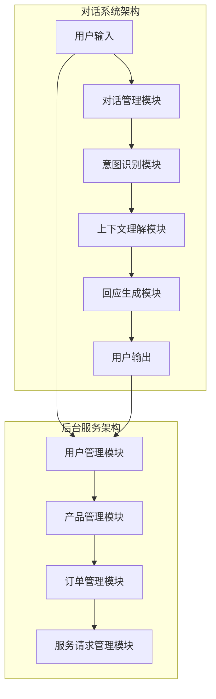
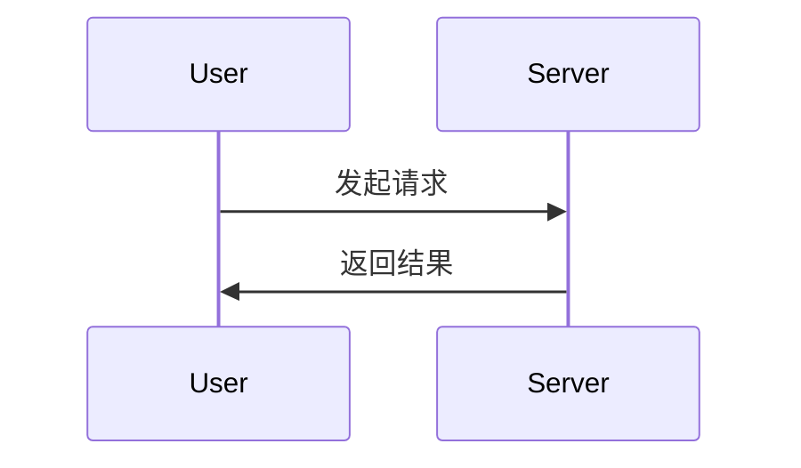

                 

### 第一部分: 背景介绍与核心概念

#### 第1章: 对话意图识别系统概述

**1.1 对话意图识别的背景**

在当今信息化快速发展的时代，人工智能技术的不断进步和广泛应用，特别是在自然语言处理（NLP）领域的突破，使得对话系统成为许多企业和机构提升服务质量、提高工作效率的重要工具。对话意图识别作为对话系统的核心组成部分，其重要性不言而喻。

首先，让我们回顾一下人工智能的发展历程。从早期的符号主义、基于规则的系统，到后来的基于统计和学习方法的系统，再到如今以深度学习为代表的智能化系统，人工智能技术已经取得了显著的进步。在这些技术发展的推动下，对话系统也逐渐从简单的问答系统发展到如今具备上下文理解和多轮对话能力的智能系统。

其次，企业级对话系统的需求日益增长。随着企业数字化转型的不断深入，用户对服务的实时性、个性化需求越来越高。传统的客户服务方式往往无法满足用户对高效、便捷的需求，而对话系统能够通过自动化、智能化的方式提供24小时不间断的服务，极大地提升了用户体验。

最后，对话意图识别的重要性体现在以下几个方面：

1. **提高服务效率**：通过对话意图识别，系统能够快速理解用户意图，提供精准的回应，减少用户等待时间，提高整体服务效率。
2. **提升用户体验**：对话系统能够根据用户的历史交互记录和偏好，提供个性化的服务，提升用户的满意度。
3. **降低运营成本**：通过自动化处理大量常见问题，减少人工干预，降低运营成本。
4. **支持业务扩展**：对话意图识别系统能够支持企业的业务扩展，快速适应新的业务场景。

**1.2 对话意图识别的基本概念**

**对话意图的定义**：对话意图是用户在对话过程中想要表达的目的或需求。它可以是简单的询问、请求，也可以是复杂的指令、决策等。

**上下文理解的概念**：上下文理解是指系统在处理对话时，能够根据当前对话的上下文，理解用户的意图。上下文可以包括用户的历史对话记录、对话中的实体信息、对话的上下文环境等。

**多轮对话管理的基本流程**：

1. **初始轮对话**：系统接收用户的初始输入，通过对话意图识别理解用户的意图，并给出初步的回应。
2. **后续轮对话**：根据用户对初步回应的反应，系统进一步调整对话策略，进行多轮交互，直至达到用户满意的结果。

**1.3 对话意图识别系统的架构**

**对话系统的主要组件**：

1. **对话管理模块**：负责管理整个对话流程，包括对话状态的跟踪、对话策略的调整等。
2. **意图识别模块**：负责接收用户的输入，并通过算法分析，识别用户的对话意图。
3. **实体识别模块**：负责从用户的输入中提取关键信息，如用户名、时间、地点等，以便更好地理解用户的意图。

**企业级对话系统的特点**：

1. **高扩展性**：能够适应不同行业和业务场景的需求，快速部署和扩展。
2. **高可靠性**：系统稳定性高，能够保证7x24小时不间断的服务。
3. **高智能化**：具备上下文理解和多轮对话能力，能够提供个性化、智能化的服务。

**对话意图识别系统在行业中的应用**：

1. **客户服务**：通过对话意图识别系统，企业可以自动化处理大量常见问题，提高服务效率。
2. **智能助手**：在智能助手场景中，对话意图识别系统能够理解用户的指令，并提供相应的帮助。
3. **业务流程自动化**：在业务流程中，对话意图识别系统能够识别用户的请求，并自动触发相应的业务流程。

**1.4 本章小结**

本章主要介绍了对话意图识别系统的背景、基本概念和系统架构。通过本章的学习，读者可以初步了解对话意图识别系统的原理和应用场景，为后续章节的深入探讨打下基础。

----------------------------------------------------------------

#### 第2章: 对话意图识别原理

**2.1 对话意图识别的算法原理**

对话意图识别的核心在于如何从用户的输入中理解其意图。目前，对话意图识别的算法主要分为传统方法和深度学习方法。

**传统方法**：

1. **基于规则的方法**：通过编写大量的规则来匹配用户的输入，从而识别对话意图。这种方法实现简单，但可扩展性较差。
2. **基于机器学习的方法**：使用机器学习算法，如决策树、朴素贝叶斯等，对用户输入进行分类。这种方法具有较高的准确率，但需要大量标注数据和复杂的模型调优。

**深度学习方法**：

1. **循环神经网络（RNN）**：RNN能够处理序列数据，适合于对话意图识别任务。
2. **长短时记忆网络（LSTM）**：LSTM是RNN的一种改进，能够更好地处理长序列数据，提高模型效果。
3. **卷积神经网络（CNN）**：虽然CNN主要用于图像处理，但近年来也被应用于自然语言处理领域，通过文本的词嵌入表示，可以实现有效的对话意图识别。

**算法选择与对比**：

在选择算法时，需要考虑数据量、模型复杂度、计算资源等因素。传统方法适用于数据量较小、模型复杂度较低的场景，而深度学习方法则适用于数据量大、模型复杂度高的场景。

**2.2 对话意图识别的概念属性特征对比**

在进行对话意图识别时，需要提取用户输入的属性特征。以下是几种常见的属性特征及其对比：

| 特征类型 | 描述 | 优点 | 缺点 |
| --- | --- | --- | --- |
| 词袋模型 | 将文本表示为词的集合 | 实现简单，易于计算 | 无法捕捉词与词之间的语义关系 |
| 词嵌入 | 将词映射为高维向量 | 能够捕捉词与词之间的语义关系 | 需要大量计算资源 |
| 嵌套词袋模型 | 将文本表示为多层词袋模型 | 能够同时捕捉局部和全局特征 | 模型复杂度较高 |
| BERT模型 | 双向编码表示预训练模型 | 能够捕捉长距离依赖关系 | 需要大量计算资源 |

**2.3 对话意图识别系统的ER实体关系图**

在对话意图识别系统中，实体识别是一个重要环节。ER实体关系图能够直观地表示实体及其关系。

**实体识别**：

1. **基于规则的方法**：通过定义规则，从文本中提取实体。
2. **基于机器学习的方法**：使用机器学习算法，如序列标注，识别文本中的实体。

**实体关系分析**：

1. **一对一关系**：如用户名与电话号码之间的关系。
2. **一对多关系**：如产品名称与产品规格之间的关系。
3. **多对多关系**：如用户与订单之间的关系。

**图数据库应用**：

1. **Neo4j**：一种高性能的图数据库，适用于实体关系存储和管理。
2. **JanusGraph**：一种开源的分布式图数据库，适用于大规模数据存储和管理。

**2.4 本章小结**

本章详细介绍了对话意图识别的算法原理、概念属性特征对比和ER实体关系图。通过本章的学习，读者可以深入理解对话意图识别的基本原理和应用方法，为后续章节的系统设计实现打下坚实的基础。

----------------------------------------------------------------

#### 第3章: 上下文理解与多轮对话管理

**3.1 上下文理解的算法原理**

上下文理解是对话系统中的一个关键环节，它使得系统能够根据对话的上下文环境理解用户的意图，提供更准确的回应。

**基于词嵌入的方法**：

1. **Word2Vec**：将单词映射为高维向量，通过计算向量之间的相似性，理解单词的语义关系。
2. **GloVe**：全局向量表示，通过训练大规模语料库，得到每个单词的向量表示。

**基于深度学习的方法**：

1. **循环神经网络（RNN）**：通过处理序列数据，捕捉对话中的上下文信息。
2. **长短时记忆网络（LSTM）**：LSTM是RNN的一种改进，能够更好地处理长序列数据。

**上下文理解的数学模型**：

1. **向量空间模型**：将文本表示为向量空间中的点，通过计算向量之间的距离或角度，理解上下文。
2. **注意力机制**：在处理序列数据时，注意力机制能够关注对话中的关键信息，提高上下文理解的效果。

**举例说明**：

假设用户输入：“明天的天气怎么样？”系统通过上下文理解，结合用户的历史交互记录和当前时间，能够准确理解用户的意图，并给出相应的天气信息。

**3.2 多轮对话管理的算法原理**

多轮对话管理是确保对话系统能够在多轮交互中持续理解用户意图的重要机制。

**对话状态跟踪**：

1. **基于规则的跟踪**：通过定义规则，记录对话过程中的关键信息。
2. **基于机器学习的跟踪**：使用机器学习算法，如决策树、神经网络等，自动学习对话状态。

**多轮对话策略**：

1. **回合式对话**：每次交互后，系统都会询问用户是否需要继续对话。
2. **主动对话**：系统主动提出问题，引导对话过程。

**数学模型与公式**：

1. **状态转移模型**：描述对话状态之间的转换关系。
2. **概率模型**：通过计算状态转移的概率，选择最佳回应。

**实例分析**：

假设用户输入：“我想订一张从北京到上海的机票。”系统首先识别出用户的意图为“订票”，然后通过多轮对话，获取用户的具体需求，如出发时间、航班类型等，最终给出订票结果。

**3.3 本章小结**

本章详细介绍了上下文理解和多轮对话管理的算法原理。通过本章的学习，读者可以深入理解对话系统在上下文理解和多轮对话管理中的关键技术，为实际应用打下基础。

----------------------------------------------------------------

#### 第4章: 企业级对话意图识别系统设计

**4.1 问题场景介绍**

企业级对话意图识别系统通常需要处理大量用户的交互数据，并在各种复杂业务场景中保持高效稳定的运行。以下是一个典型的问题场景：

某大型电商平台计划部署一套智能客服系统，以提升用户购物体验和客服效率。该系统需要能够理解用户的多样化需求，包括商品查询、订单跟踪、售后服务等，同时要支持多轮对话，确保用户的问题能够得到准确解答。

**4.1.1 业务需求分析**

1. **高并发处理能力**：系统需要能够同时处理大量用户的请求，确保不因高峰期而影响服务质量。
2. **多语言支持**：系统需要支持多种语言，满足不同地区用户的需求。
3. **个性化服务**：系统能够根据用户的历史行为和偏好，提供个性化的服务推荐。
4. **可扩展性**：系统能够适应企业业务的快速发展，方便进行功能扩展和优化。

**4.1.2 技术挑战与解决方案**

1. **数据噪声处理**：用户输入的数据可能存在噪声和不确定性，系统需要具备较强的噪声过滤能力。
2. **上下文理解**：系统需要能够准确理解用户在不同场景下的意图，提供相应的回应。
3. **多轮对话管理**：系统需要具备高效的多轮对话管理能力，确保对话的流畅和用户满意度。
4. **性能优化**：系统需要在高并发、大数据环境下保持高性能，确保快速响应。

针对以上挑战，解决方案包括：

1. **数据预处理**：使用清洗算法处理输入数据，降低噪声影响。
2. **多语言模型**：使用多语言预训练模型，提升跨语言的意图识别能力。
3. **上下文跟踪**：结合用户历史交互记录和实时对话内容，实现精准的上下文理解。
4. **分布式架构**：采用分布式计算和存储架构，提升系统的处理能力和扩展性。

**4.2 系统功能设计**

**领域模型**：

领域模型用于描述系统所需处理的主要业务领域，以及各个领域之间的关联关系。以下是领域模型的类图：

```mermaid
classDiagram
  User            <<Class>>
  Product         <<Class>>
  Order           <<Class>>
  ServiceRequest  <<Class>>

  User             ----> Product
  User             ----> Order
  User             ----> ServiceRequest
  Product           ----> Order
  Order             ----> ServiceRequest
```

**功能模块划分**：

1. **用户管理模块**：负责用户注册、登录、权限管理等。
2. **产品管理模块**：负责商品信息的存储、检索、更新等。
3. **订单管理模块**：负责订单的创建、查询、更新、取消等。
4. **服务请求管理模块**：负责用户服务请求的接收、处理、反馈等。
5. **对话管理模块**：负责对话的初始化、上下文跟踪、多轮对话管理等。

**4.3 系统架构设计**

**系统架构图**：



**架构组件说明**：

1. **对话管理模块**：负责管理对话的整个生命周期，包括对话的初始化、上下文跟踪、对话结束等。
2. **意图识别模块**：使用机器学习算法，从用户输入中识别对话意图。
3. **上下文理解模块**：结合用户历史交互记录和实时对话内容，实现精准的上下文理解。
4. **回应生成模块**：根据用户意图和上下文，生成合适的回应。
5. **用户管理模块**：负责用户的注册、登录、权限管理等。
6. **产品管理模块**：负责商品信息的存储、检索、更新等。
7. **订单管理模块**：负责订单的创建、查询、更新、取消等。
8. **服务请求管理模块**：负责用户服务请求的接收、处理、反馈等。

**架构优化方案**：

1. **分布式架构**：采用分布式计算和存储架构，提高系统的处理能力和扩展性。
2. **缓存机制**：使用缓存技术，减少数据库访问次数，提高系统响应速度。
3. **负载均衡**：采用负载均衡技术，将用户请求均匀分配到各个服务器，确保系统的高可用性。

**4.4 系统接口设计**

**API接口定义**：

1. **用户接口**：包括用户注册、登录、权限验证等。
2. **产品接口**：包括商品信息查询、商品信息更新等。
3. **订单接口**：包括订单创建、订单查询、订单更新等。
4. **服务请求接口**：包括服务请求提交、服务请求查询等。

**接口协议与规范**：

1. **HTTP/HTTPS协议**：采用HTTP/HTTPS协议进行数据传输，确保数据的安全性。
2. **RESTful架构**：采用RESTful架构设计接口，便于数据操作和扩展。
3. **数据格式**：采用JSON或XML格式进行数据传输，便于解析和处理。

**4.5 系统交互设计**

**交互流程**：

1. **用户请求**：用户通过客户端发起请求，请求内容包括用户信息、请求类型等。
2. **服务器处理**：服务器接收到请求后，根据请求类型进行相应的处理，如用户注册、订单创建等。
3. **返回结果**：服务器处理完成后，将结果返回给用户，结果内容包括操作结果、数据信息等。

**序列图展示**：



**4.6 本章小结**

本章详细介绍了企业级对话意图识别系统的设计，包括问题场景介绍、系统功能设计、系统架构设计、系统接口设计和系统交互设计。通过本章的学习，读者可以了解企业级对话意图识别系统的整体架构和关键设计要素，为实际系统的开发提供参考。

----------------------------------------------------------------

## 第五部分: 项目实战

### 第5章: 项目实施与实现

#### 5.1 环境安装

为了实施和实现企业级对话意图识别系统，首先需要搭建相应的开发环境。以下是环境安装的详细步骤：

**5.1.1 硬件与软件要求**

- **硬件要求**：
  - CPU：至少4核处理器，推荐使用8核以上处理器。
  - 内存：16GB及以上，推荐使用32GB或更多。
  - 硬盘：至少100GB可用空间，推荐使用SSD硬盘。

- **软件要求**：
  - 操作系统：Linux（如Ubuntu 18.04或更高版本），Windows 10或更高版本。
  - Python：Python 3.6及以上版本。
  - 依赖库：NumPy、Pandas、Scikit-learn、TensorFlow、PyTorch等。

**5.1.2 环境搭建步骤**

1. **安装操作系统**：根据硬件选择合适的操作系统版本，并进行安装。

2. **更新系统包**：打开终端，执行以下命令更新系统包：
   ```bash
   sudo apt update
   sudo apt upgrade
   ```

3. **安装Python**：在Ubuntu上，可以通过以下命令安装Python 3：
   ```bash
   sudo apt install python3 python3-pip
   ```

4. **安装依赖库**：使用pip安装所需的依赖库：
   ```bash
   pip3 install numpy pandas scikit-learn tensorflow pytorch
   ```

5. **安装其他工具**：如需要，可以安装Jupyter Notebook或其他开发工具：
   ```bash
   pip3 install notebook
   ```

#### 5.2 系统核心实现

**5.2.1 数据处理**

在对话意图识别系统中，数据处理是关键的一步。以下是一个简单的数据处理流程：

1. **数据收集**：从不同来源收集对话数据，如客服日志、用户反馈等。

2. **数据清洗**：处理缺失值、噪声数据，对文本进行分词、去停用词等预处理。

3. **数据标注**：对对话数据进行标注，标记出对话意图和实体。

4. **数据存储**：将处理后的数据存储到数据库或文件中，以便后续使用。

**代码示例**：

```python
import pandas as pd
from sklearn.model_selection import train_test_split

# 读取数据
data = pd.read_csv('dialog_data.csv')

# 数据清洗
data.dropna(inplace=True)
data = data[data['text'].apply(lambda x: len(x.split()) > 5)]

# 数据标注
labels = data['intent']
texts = data['text']

# 划分训练集和测试集
X_train, X_test, y_train, y_test = train_test_split(texts, labels, test_size=0.2, random_state=42)
```

**5.2.2 模型训练**

在数据处理完成后，可以开始训练对话意图识别模型。以下是一个简单的模型训练流程：

1. **数据预处理**：对训练数据进行编码，如将文本转换为词嵌入向量。

2. **模型选择**：选择合适的模型架构，如LSTM、BERT等。

3. **模型训练**：使用训练数据训练模型，并进行参数调优。

4. **模型评估**：使用测试数据评估模型性能，如准确率、召回率等。

**代码示例**：

```python
from tensorflow.keras.models import Sequential
from tensorflow.keras.layers import Embedding, LSTM, Dense
from tensorflow.keras.preprocessing.sequence import pad_sequences

# 数据预处理
tokenizer = Tokenizer()
tokenizer.fit_on_texts(X_train)
X_train_seq = tokenizer.texts_to_sequences(X_train)
X_test_seq = tokenizer.texts_to_sequences(X_test)

max_len = max([len(seq) for seq in X_train_seq])
X_train_pad = pad_sequences(X_train_seq, maxlen=max_len)
X_test_pad = pad_sequences(X_test_seq, maxlen=max_len)

# 模型选择
model = Sequential()
model.add(Embedding(input_dim=len(tokenizer.word_index)+1, output_dim=50, input_length=max_len))
model.add(LSTM(100))
model.add(Dense(len(intent_labels), activation='softmax'))

# 模型训练
model.compile(optimizer='adam', loss='categorical_crossentropy', metrics=['accuracy'])
model.fit(X_train_pad, y_train, epochs=10, batch_size=32, validation_split=0.1)

# 模型评估
loss, accuracy = model.evaluate(X_test_pad, y_test)
print(f"Test accuracy: {accuracy*100:.2f}%")
```

**5.2.3 模型部署**

训练完成后，可以将模型部署到生产环境，以便在实际对话中应用。以下是一个简单的部署流程：

1. **模型保存**：将训练好的模型保存到文件中，以便后续使用。

2. **模型加载**：在生产环境中加载模型，进行意图识别。

3. **接口封装**：将模型封装成API接口，便于其他系统调用。

**代码示例**：

```python
# 模型保存
model.save('dialog_model.h5')

# 模型加载
loaded_model = load_model('dialog_model.h5')

# 接口封装
from flask import Flask, request, jsonify

app = Flask(__name__)

@app.route('/api/intent', methods=['POST'])
def predict_intent():
    data = request.get_json()
    text = data['text']
    sequence = tokenizer.texts_to_sequences([text])
    padded_sequence = pad_sequences(sequence, maxlen=max_len)
    prediction = loaded_model.predict(padded_sequence)
    intent = np.argmax(prediction)
    return jsonify({'intent': intent_labels[intent]})

if __name__ == '__main__':
    app.run(host='0.0.0.0', port=5000)
```

**5.3 代码应用解读与分析**

以上代码示例展示了对话意图识别系统的主要实现过程，包括数据处理、模型训练、模型部署和接口封装。以下是具体解读与分析：

1. **数据处理**：
   - 读取对话数据，并进行清洗和标注。
   - 使用Tokenizer将文本转换为序列。
   - 使用pad_sequences对序列进行填充，以便输入模型。

2. **模型训练**：
   - 使用Embedding层将文本转换为词嵌入向量。
   - 使用LSTM层处理序列数据。
   - 使用Dense层进行意图分类。

3. **模型部署**：
   - 保存模型到文件，便于后续加载。
   - 加载模型，并在Flask应用程序中使用。

4. **接口封装**：
   - 使用Flask创建一个简单的API接口。
   - 接受POST请求，处理文本输入，并返回识别的意图。

**5.4 实际案例分析**

以下是一个实际案例，展示如何使用对话意图识别系统处理用户请求。

**案例背景**：

某电商平台用户通过在线客服系统咨询：“我想购买一台新的笔记本电脑，有什么推荐吗？”

**案例实施与结果**：

1. 用户输入：“我想购买一台新的笔记本电脑，有什么推荐吗？”
2. API接口接收用户输入，并将其传递给对话意图识别模型。
3. 模型识别出用户的意图为“购买推荐”。
4. 根据用户的历史购买记录和当前市场情况，系统推荐了几款符合用户需求的笔记本电脑。
5. 用户选择了一款笔记本电脑，并通过订单接口完成购买。

**案例总结与反思**：

通过实际案例，我们可以看到对话意图识别系统在提升用户体验和客服效率方面具有显著作用。然而，系统在实际应用中仍存在一些挑战，如：

1. **意图识别准确性**：在复杂多变的对话场景中，意图识别的准确性可能受到影响。
2. **上下文理解能力**：系统需要不断提高上下文理解能力，以更好地满足用户需求。
3. **个性化服务**：系统需要根据用户的历史数据和偏好，提供更加个性化的服务推荐。

针对以上挑战，未来我们可以考虑以下改进方向：

1. **增强模型学习能力**：通过不断优化模型结构和算法，提高意图识别的准确性。
2. **引入更多上下文信息**：结合用户的历史交互记录和实时对话内容，提高上下文理解能力。
3. **多模态数据融合**：结合文本、语音、图像等多模态数据，提升系统的全面理解能力。

**5.5 项目小结**

本章详细介绍了企业级对话意图识别系统的实施与实现过程，包括环境安装、数据处理、模型训练、模型部署和接口封装。通过实际案例分析，展示了系统在实际应用中的效果。未来，随着技术的不断进步，对话意图识别系统将在更多领域发挥重要作用，为企业和用户带来更大的价值。

----------------------------------------------------------------

### 第六部分: 最佳实践与拓展

#### 第6章: 最佳实践

在构建企业级对话意图识别系统时，最佳实践对于确保系统的高效性和可靠性至关重要。以下是一些关键的最佳实践：

**1. 数据质量保证**：确保对话数据的质量是系统性能的关键。进行数据清洗、去重和标注，以提高数据的有效性和准确性。

**2. 模型选择与优化**：根据业务需求和数据特点选择合适的模型。对于复杂的对话任务，可以考虑结合多种模型，如LSTM、BERT等，进行融合优化。

**3. 性能监控与调优**：实时监控系统的性能指标，如响应时间、准确率等。通过A/B测试和模型调优，持续提升系统性能。

**4. 安全性与隐私保护**：在处理用户数据时，确保数据的安全性和隐私保护。采用加密技术和访问控制策略，防止数据泄露。

**5. 持续集成与部署**：采用敏捷开发方法，实现持续集成与部署。确保系统能够快速迭代和更新，适应业务需求的变化。

**6. 用户反馈与迭代**：收集用户的反馈，不断优化系统的对话体验和功能。通过用户行为分析，识别用户需求，持续改进系统。

**7. 模块化设计**：采用模块化设计，将系统的不同功能模块分离，便于维护和扩展。这样可以提高系统的灵活性和可扩展性。

#### 6.2 小结

本章总结了构建企业级对话意图识别系统的最佳实践，包括数据质量保证、模型选择与优化、性能监控与调优、安全性与隐私保护、持续集成与部署、用户反馈与迭代以及模块化设计。通过遵循这些最佳实践，可以构建出高效、可靠且具有良好用户体验的对话意图识别系统。

#### 6.3 注意事项

在实施企业级对话意图识别系统时，需要注意以下几点：

**1. 对话场景多样性**：企业级对话系统面临的对话场景非常多样化，系统需要具备较强的适应性，能够处理不同场景下的对话任务。

**2. 上下文信息处理**：上下文理解是对话意图识别的核心，系统需要能够准确捕捉并利用上下文信息，以提高对话的准确性和流畅性。

**3. 模型解释性**：在保证模型性能的同时，需要考虑模型的可解释性，以便于理解和优化。

**4. 系统可扩展性**：企业业务不断发展，系统需要具备良好的可扩展性，以便于快速适应业务需求的变化。

**5. 用户隐私保护**：在处理用户数据时，必须严格遵守相关法律法规，确保用户隐私得到有效保护。

#### 6.4 拓展阅读

**1. 《深度学习》**：Goodfellow, Ian, et al. "Deep learning." MIT press, 2016.
本书详细介绍了深度学习的基本原理和应用，对于了解和实现对话意图识别系统具有重要参考价值。

**2. 《自然语言处理综论》**：Jurafsky, Daniel, and James H. Martin. "Speech and language processing." Pearson, 2019.
本书涵盖了自然语言处理的基本概念和技术，包括对话系统的相关内容，适合希望深入了解NLP技术的读者。

**3. 《对话系统：设计、实施与评价》**：Roukos, Spanda, et al. "Dialogue systems: design, implementation and evaluation." Springer, 2018.
本书提供了对话系统的全面概述，包括对话意图识别和多轮对话管理等内容，适合对话系统开发者参考。

通过上述拓展阅读，读者可以进一步深化对对话意图识别系统及其相关技术的理解，为实际应用提供更全面的指导和参考。

