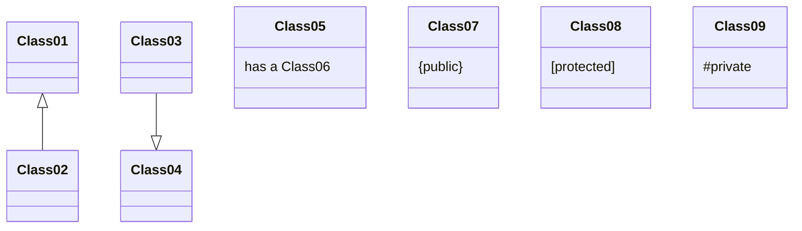
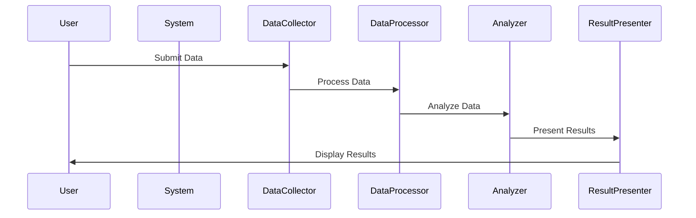

                 

# 《构建企业级情感分析平台：深入理解客户与员工》

> 关键词：情感分析、企业级平台、客户管理、员工满意度、数据隐私、算法模型、深度学习、系统架构

> 摘要：本文深入探讨了构建企业级情感分析平台的必要性和技术实现，详细阐述了从问题背景、核心概念、算法原理到系统分析与架构设计，再到项目实战的全面流程。通过分析客户与员工情感分析的需求与挑战，本文旨在为企业和组织提供一套完整的情感分析平台建设指南，助力提高客户关系和员工管理效率。

---

## 目录大纲

### 第一部分：背景介绍

#### 第1章 问题背景

- **情感分析的定义与历史发展**
- **企业级情感分析的重要性**
- **客户与员工管理中的情感分析需求**
- **情感分析对决策与策略的影响**

#### 第2章 问题描述

- **客户情感分析：识别情感倾向，理解需求**
- **员工情感分析：监测情绪，提升满意度与效率**
- **面临的挑战：数据隐私、准确性、实时性**

#### 第3章 问题解决

- **构建企业级情感分析平台的必要性**
- **平台架构与关键技术**
- **情感分析流程与模型选择**

#### 第4章 边界与外延

- **应用领域与限制**
- **与其他数据分析技术的比较**
- **概念结构与核心要素组成**

### 第二部分：核心概念与联系

#### 第5章 核心概念与联系

- **情感分析原理**
- **情感分析模型**
- **应用场景**
- **优势与局限**

### 第三部分：算法原理讲解

#### 第6章 算法原理讲解

- **情感分析算法概述**
- **机器学习算法**
- **深度学习算法**
- **算法实现与优化**
- **算法案例分析**

### 第四部分：系统分析与架构设计方案

#### 第7章 系统分析与架构设计方案

- **问题场景介绍**
- **项目介绍**
- **系统功能设计**
- **系统架构设计**
- **系统接口设计**
- **系统交互**

#### 第8章 Mermaid类图与架构图

- **Mermaid类图**
- **Mermaid架构图**

### 第五部分：项目实战

#### 第9章 项目实战

- **环境安装**
- **系统核心实现**
- **代码应用解读与分析**
- **实际案例分析与详细讲解**
- **项目小结**

### 第六部分：最佳实践、小结与拓展阅读

#### 第10章 最佳实践、小结与拓展阅读

- **最佳实践**
- **小结**
- **注意事项**
- **拓展阅读**

---

## 第一部分：背景介绍

### 第1章 问题背景

#### 1.1 情感分析的定义与历史发展

情感分析（Sentiment Analysis），也称为意见挖掘，是一种自然语言处理技术，旨在从文本数据中识别出表达的情感倾向。这一领域起源于20世纪90年代，随着互联网的兴起和大数据技术的不断发展，情感分析逐渐成为自然语言处理的重要分支。

早期情感分析主要依赖于人工定义的规则和词典，例如将单词划分为积极或消极的标签。然而，这种方法存在显著的局限性，特别是在处理复杂语境和情感时。随着机器学习和深度学习技术的进步，基于模型的情感分析逐渐取代了传统规则方法。

#### 1.2 企业级情感分析的重要性

在商业环境中，情感分析的重要性日益凸显。对于企业而言，情感分析能够帮助企业：

- **了解客户需求**：通过分析客户反馈，企业可以更准确地把握客户需求，从而改进产品和服务。
- **优化客户关系**：通过情感分析，企业可以识别出满意的客户和有问题的客户，采取相应的策略增强客户忠诚度。
- **提升员工管理**：情感分析可以帮助企业了解员工的情绪和工作满意度，从而优化员工管理，提高工作效率。

#### 1.3 客户与员工管理中的情感分析需求

在客户管理方面，企业需要：

- **识别客户反馈中的情感倾向**：通过分析客户评论、社交媒体帖子等，识别客户的满意度和投诉。
- **理解客户需求**：通过情感分析，企业可以深入理解客户的需求和痛点，从而优化产品和服务。

在员工管理方面，企业需要：

- **监测员工情绪**：通过分析员工的工作反馈和交流记录，了解员工的工作满意度和情绪状态。
- **提高员工满意度与工作效率**：通过情感分析，企业可以及时发现员工的问题，采取相应的措施提高员工的工作满意度，进而提升整体工作效率。

#### 1.4 情感分析对决策与策略的影响

情感分析不仅提供了对客户和员工情感状态的洞察，而且对企业的决策和策略制定有直接影响：

- **产品改进**：基于客户情感分析，企业可以了解哪些产品特征最受客户欢迎，从而优化产品设计和开发。
- **市场营销**：通过分析社交媒体和评论平台，企业可以了解市场趋势和消费者偏好，制定更有针对性的市场营销策略。
- **员工激励**：通过分析员工情感数据，企业可以制定更有效的员工激励政策，提高员工的工作积极性和忠诚度。

#### 1.5 面临的挑战

尽管情感分析在商业环境中具有巨大的潜力，但在实际应用中仍面临一些挑战：

- **数据隐私**：情感分析通常涉及对个人数据的处理，如何在保护用户隐私的同时进行有效的情感分析是一个重要问题。
- **准确性**：情感分析的准确性取决于数据质量和算法模型的性能，提高算法的准确性和可靠性是当前研究的重要方向。
- **实时性**：实时情感分析对于快速响应客户需求和员工问题至关重要，但实时数据处理和模型更新也是一个技术难点。

#### 1.6 问题解决

为了解决上述挑战，构建一个企业级情感分析平台成为必要。该平台需要具备以下特点：

- **多功能性**：能够处理客户和员工的情感分析需求，同时支持多种数据源。
- **高准确性**：采用先进的机器学习和深度学习算法，提高情感分析结果的准确性。
- **实时性**：实现实时数据处理和分析，以便快速响应业务需求。
- **可扩展性**：能够支持企业规模扩展和数据量的增长，保证系统的稳定性和性能。

#### 1.7 构建企业级情感分析平台的必要性

企业级情感分析平台的重要性体现在以下几个方面：

- **决策支持**：为管理层提供基于数据的决策支持，帮助企业更好地理解客户和员工。
- **优化运营**：通过情感分析，企业可以优化客户服务和员工管理，提高整体运营效率。
- **风险控制**：通过识别潜在的客户和员工问题，提前采取措施，降低风险。
- **数据驱动**：将情感分析结果与业务数据结合，实现数据驱动的发展战略。

#### 1.8 平台架构与关键技术

企业级情感分析平台通常包括以下几个关键组件：

- **数据收集**：从多个渠道收集文本数据，包括客户反馈、社交媒体、员工交流记录等。
- **数据处理**：对收集到的数据进行预处理，包括去噪、分词、词性标注等。
- **情感分析模型**：采用机器学习和深度学习算法，对处理后的文本进行情感分析。
- **结果呈现**：将分析结果以直观的方式呈现给用户，包括情感趋势图、热力图等。

#### 1.9 情感分析流程与模型选择

情感分析流程通常包括以下步骤：

1. 数据收集：从不同的数据源收集文本数据。
2. 数据预处理：对文本数据去噪、分词、词性标注等处理。
3. 模型训练：选择合适的机器学习或深度学习模型进行训练。
4. 模型评估：评估模型性能，包括准确率、召回率等指标。
5. 模型部署：将训练好的模型部署到生产环境中。
6. 结果分析：对分析结果进行解释和应用。

在模型选择方面，企业可以根据需求选择：

- **基于规则的方法**：适用于简单场景，但难以处理复杂情感。
- **基于机器学习的方法**：适用于中等复杂度的情感分析任务。
- **基于深度学习的方法**：适用于复杂情感的识别，但计算资源需求较高。

#### 1.10 边界与外延

- **应用领域与限制**：情感分析在客户服务、员工管理、市场研究等领域有广泛的应用，但也存在处理复杂情感和语境的局限性。
- **与其他数据分析技术的比较**：情感分析与其他数据分析技术（如文本挖掘、数据挖掘）的区别和联系。
- **概念结构与核心要素组成**：情感分析的核心概念、数据流、算法模型等要素的组成。

### 第2章 问题描述

#### 2.1 客户情感分析

客户情感分析旨在通过文本数据（如客户评论、社交媒体帖子等）识别客户的情感倾向，从而理解客户的需求和满意度。其主要任务包括：

- **情感极性分类**：将文本分类为正面、负面或中性。
- **情感强度评估**：对文本中的情感强度进行量化评估。
- **情感时序分析**：分析情感的变化趋势和时序特征。

客户情感分析对于企业具有重要意义，可以帮助企业：

- **识别满意的客户**：通过情感分析，企业可以识别出对产品和服务满意的客户，采取相应的策略增强客户忠诚度。
- **定位问题客户**：通过分析负面情感，企业可以识别出问题客户，及时采取措施解决问题。
- **改进产品和服务**：基于情感分析结果，企业可以了解客户的需求和痛点，从而改进产品和服务。

#### 2.2 员工情感分析

员工情感分析旨在通过文本数据（如工作反馈、交流记录等）监测员工的情绪状态和工作满意度。其主要任务包括：

- **情绪识别**：识别员工文本中的情绪，如高兴、愤怒、焦虑等。
- **工作满意度评估**：评估员工对工作环境的满意程度。
- **情感时序分析**：分析员工情绪的变化趋势。

员工情感分析对于企业具有重要意义，可以帮助企业：

- **提高员工满意度**：通过情感分析，企业可以了解员工的工作满意度，采取相应的措施提高员工的工作满意度。
- **优化员工管理**：基于情感分析结果，企业可以优化员工管理策略，提高员工的工作效率。
- **预防员工流失**：通过分析员工情绪，企业可以及时发现员工的问题，采取措施预防员工流失。

#### 2.3 面临的挑战

在实施客户与员工情感分析时，企业可能会面临以下挑战：

- **数据隐私**：情感分析通常涉及对个人数据的处理，如何在保护用户隐私的同时进行有效的情感分析是一个重要问题。
- **准确性**：情感分析的准确性取决于数据质量和算法模型的性能，提高算法的准确性和可靠性是当前研究的重要方向。
- **实时性**：实时情感分析对于快速响应客户需求和员工问题至关重要，但实时数据处理和模型更新也是一个技术难点。
- **多语言处理**：企业通常涉及多种语言，如何在多语言环境中进行情感分析是一个挑战。

#### 2.4 问题解决

为了解决上述挑战，构建一个企业级情感分析平台成为必要。该平台需要具备以下特点：

- **多功能性**：能够处理客户和员工的情感分析需求，同时支持多种数据源。
- **高准确性**：采用先进的机器学习和深度学习算法，提高情感分析结果的准确性。
- **实时性**：实现实时数据处理和分析，以便快速响应业务需求。
- **可扩展性**：能够支持企业规模扩展和数据量的增长，保证系统的稳定性和性能。

#### 2.5 构建企业级情感分析平台的必要性

构建企业级情感分析平台的重要性体现在以下几个方面：

- **决策支持**：为管理层提供基于数据的决策支持，帮助企业更好地理解客户和员工。
- **优化运营**：通过情感分析，企业可以优化客户服务和员工管理，提高整体运营效率。
- **风险控制**：通过识别潜在的客户和员工问题，提前采取措施，降低风险。
- **数据驱动**：将情感分析结果与业务数据结合，实现数据驱动的发展战略。

#### 2.6 平台架构与关键技术

企业级情感分析平台通常包括以下几个关键组件：

- **数据收集**：从多个渠道收集文本数据，包括客户反馈、社交媒体、员工交流记录等。
- **数据处理**：对收集到的数据进行预处理，包括去噪、分词、词性标注等。
- **情感分析模型**：采用机器学习和深度学习算法，对处理后的文本进行情感分析。
- **结果呈现**：将分析结果以直观的方式呈现给用户，包括情感趋势图、热力图等。

#### 2.7 情感分析流程与模型选择

情感分析流程通常包括以下步骤：

1. 数据收集：从不同的数据源收集文本数据。
2. 数据预处理：对文本数据去噪、分词、词性标注等处理。
3. 模型训练：选择合适的机器学习或深度学习模型进行训练。
4. 模型评估：评估模型性能，包括准确率、召回率等指标。
5. 模型部署：将训练好的模型部署到生产环境中。
6. 结果分析：对分析结果进行解释和应用。

在模型选择方面，企业可以根据需求选择：

- **基于规则的方法**：适用于简单场景，但难以处理复杂情感。
- **基于机器学习的方法**：适用于中等复杂度的情感分析任务。
- **基于深度学习的方法**：适用于复杂情感的识别，但计算资源需求较高。

#### 2.8 边界与外延

- **应用领域与限制**：情感分析在客户服务、员工管理、市场研究等领域有广泛的应用，但也存在处理复杂情感和语境的局限性。
- **与其他数据分析技术的比较**：情感分析与其他数据分析技术（如文本挖掘、数据挖掘）的区别和联系。
- **概念结构与核心要素组成**：情感分析的核心概念、数据流、算法模型等要素的组成。

### 第3章 问题解决

#### 3.1 构建企业级情感分析平台的必要性

构建企业级情感分析平台对于企业来说具有重要的现实意义。首先，情感分析可以帮助企业深入了解客户和员工的需求和情感状态，从而为决策提供数据支持。例如，通过分析客户反馈，企业可以了解客户对产品和服务的不满意之处，从而针对性地进行改进。同样地，通过分析员工的情感状态，企业可以及时发现员工的问题，采取措施提高员工的工作满意度和工作效率。

其次，情感分析有助于优化企业的运营策略。通过对客户和员工的情感进行分析，企业可以识别出潜在的商机和风险点。例如，通过分析客户情感，企业可以发现哪些产品或服务受到市场的欢迎，从而调整产品线。同时，通过分析员工情感，企业可以发现员工的工作瓶颈，优化员工管理策略。

此外，情感分析还有助于提升企业的竞争力。在当今竞争激烈的市场环境中，企业需要不断调整和优化自身策略，以适应不断变化的市场需求。情感分析作为一种有效的数据驱动工具，可以帮助企业及时了解市场动态，从而快速响应市场变化，提升企业的竞争力。

#### 3.2 平台架构与关键技术

企业级情感分析平台的构建需要考虑多个方面，包括数据收集、数据处理、情感分析模型选择、结果呈现等。以下是一个典型的企业级情感分析平台架构：


1. **数据收集模块**：该模块负责从多个渠道收集文本数据，包括客户反馈、社交媒体、员工交流记录等。数据收集的方式可以是自动抓取、API接口调用、数据库查询等。

2. **数据处理模块**：该模块负责对收集到的文本数据进行预处理，包括去噪、分词、词性标注、命名实体识别等。预处理后的数据将用于后续的情感分析。

3. **情感分析模型**：该模块是情感分析平台的核心，负责对处理后的文本数据进行分析，以识别文本中的情感极性、情感强度和情感时序等。常用的情感分析模型包括基于规则的方法、基于机器学习的方法和基于深度学习的方法。

4. **结果呈现模块**：该模块负责将情感分析结果以直观的方式呈现给用户，包括情感趋势图、热力图、词云等。结果呈现的方式可以是网页、报表、图表等。

#### 3.3 情感分析流程与模型选择

企业级情感分析平台的实现涉及多个步骤，包括数据收集、数据处理、模型训练、模型评估和模型部署等。以下是一个典型的情感分析流程：


1. **数据收集**：从多个渠道收集文本数据，包括客户反馈、社交媒体、员工交流记录等。数据收集的方式可以是自动抓取、API接口调用、数据库查询等。

2. **数据处理**：对收集到的文本数据进行预处理，包括去噪、分词、词性标注、命名实体识别等。预处理后的数据将用于后续的情感分析。

3. **模型训练**：选择合适的机器学习或深度学习模型进行训练。常见的机器学习模型包括支持向量机（SVM）、朴素贝叶斯（Naive Bayes）、随机森林（Random Forest）等。常见的深度学习模型包括卷积神经网络（CNN）、循环神经网络（RNN）、长短时记忆网络（LSTM）等。

4. **模型评估**：评估模型性能，包括准确率、召回率、F1分数等指标。通过交叉验证、交叉验证集划分等方法评估模型的性能。

5. **模型部署**：将训练好的模型部署到生产环境中，用于实时分析。部署的方式可以是云服务、容器化部署、本地部署等。

6. **结果分析**：对分析结果进行解释和应用，包括情感极性分类、情感强度评估、情感时序分析等。根据分析结果，企业可以制定相应的策略，如产品改进、客户关系管理、员工激励等。

#### 3.4 情感分析模型选择

在情感分析中，选择合适的模型对于提高分析结果的准确性至关重要。以下是一些常见的情感分析模型及其特点：

1. **基于规则的方法**：这种方法通过定义一系列规则来识别文本中的情感。优点是实现简单，易于理解。缺点是处理复杂情感时效果不佳。

2. **基于机器学习的方法**：这种方法利用机器学习算法对大量标注数据进行训练，从而建立情感分类模型。常见的机器学习算法包括支持向量机（SVM）、朴素贝叶斯（Naive Bayes）、随机森林（Random Forest）等。优点是处理复杂情感时效果较好。缺点是需要大量的标注数据。

3. **基于深度学习的方法**：这种方法利用深度学习算法，如卷积神经网络（CNN）、循环神经网络（RNN）、长短时记忆网络（LSTM）等，对文本进行建模。优点是处理复杂情感时效果最好。缺点是需要大量的计算资源和训练时间。

在实际应用中，企业可以根据具体需求和数据情况选择合适的情感分析模型。例如，对于小型项目或资源有限的企业，可以选择基于规则的方法或基于机器学习的方法。对于大型项目或需要处理复杂情感分析任务的企业，可以选择基于深度学习的方法。

#### 3.5 情感分析技术选型

在构建企业级情感分析平台时，技术选型是一个关键环节。以下是一些常见的技术选型策略：

1. **硬件资源**：根据企业的需求和预算，选择合适的硬件配置。对于大规模数据处理和模型训练任务，可以选择高性能的服务器或GPU集群。

2. **软件环境**：选择合适的编程语言和开发工具。常见的编程语言包括Python、Java等。常见的开发工具包括PyCharm、Eclipse等。

3. **数据库**：选择合适的数据库系统来存储和处理数据。常见的数据库系统包括MySQL、PostgreSQL、MongoDB等。

4. **数据处理框架**：选择合适的数据处理框架来处理大规模数据。常见的数据处理框架包括Spark、Hadoop等。

5. **情感分析算法**：根据具体需求选择合适的情感分析算法。常见的情感分析算法包括基于规则的方法、基于机器学习的方法和基于深度学习的方法。

6. **结果呈现工具**：选择合适的结果呈现工具，如图表库、可视化工具等，以便用户更好地理解分析结果。

#### 3.6 情感分析算法的评估指标

在构建企业级情感分析平台时，评估算法的性能是至关重要的。以下是一些常见的评估指标：

1. **准确率（Accuracy）**：准确率是指模型正确预测的样本数占总样本数的比例。准确率越高，说明模型性能越好。

2. **召回率（Recall）**：召回率是指模型正确预测的样本数占实际为正类的样本数的比例。召回率越高，说明模型能够更好地识别出实际为正类的样本。

3. **精确率（Precision）**：精确率是指模型正确预测的样本数占预测为正类的样本数的比例。精确率越高，说明模型预测结果越可靠。

4. **F1分数（F1 Score）**：F1分数是精确率和召回率的加权平均，能够更全面地评估模型性能。

5. **ROC曲线（Receiver Operating Characteristic Curve）**：ROC曲线用于评估二分类模型的性能，曲线下的面积（AUC）越大，说明模型性能越好。

6. **混淆矩阵（Confusion Matrix）**：混淆矩阵用于展示模型预测结果与实际结果的对比，包括真阳性、假阳性、真阴性和假阴性等指标。

通过综合运用这些评估指标，企业可以全面评估情感分析算法的性能，并选择最优的模型进行部署。

### 第4章 边界与外延

#### 1.7 情感分析的应用领域与限制

情感分析技术具有广泛的应用领域，包括但不限于以下几个方面：

1. **客户服务与用户体验分析**：通过分析客户反馈和评论，企业可以深入了解客户对产品和服务的态度，识别出改进的机会。

2. **市场研究**：情感分析可以帮助企业了解消费者对品牌、产品、广告等的情感反应，从而制定更有效的市场营销策略。

3. **危机管理**：在出现危机时，情感分析可以快速识别出公众的情感倾向，帮助企业及时采取应对措施，减轻危机影响。

4. **员工满意度与工作氛围监测**：通过分析员工的工作反馈和交流记录，企业可以了解员工的工作满意度，优化员工管理策略。

5. **社交媒体监控**：情感分析可以对企业品牌在社交媒体上的表现进行监控，帮助企业了解公众对品牌的情感态度。

尽管情感分析具有广泛的应用价值，但也存在一些限制：

1. **语境理解**：情感分析技术目前还不能完全理解复杂的语境，尤其是在处理双关语、隐喻和讽刺等情况下，可能会产生误判。

2. **情感复杂性**：人类的情感是多样且复杂的，情感分析技术可能难以准确捕捉所有情感细节。

3. **数据质量**：情感分析的质量高度依赖于输入数据的质量。如果数据存在噪音或缺失，可能会导致分析结果的偏差。

4. **跨语言处理**：不同语言和文化背景下，情感的表达方式和情感分类标准可能存在差异，跨语言情感分析的准确性相对较低。

#### 1.8 企业级情感分析与其他数据分析技术的比较

企业级情感分析与其他数据分析技术（如文本挖掘、数据挖掘）之间存在一定的区别和联系：

1. **文本挖掘**：文本挖掘是一种从非结构化文本中提取有价值信息的技术，包括主题提取、词频分析、关系提取等。情感分析是文本挖掘的一个子领域，侧重于识别文本中的情感倾向。

2. **数据挖掘**：数据挖掘是一种从大量数据中发现有价值模式的技术，包括分类、聚类、关联规则挖掘等。情感分析可以通过数据挖掘技术来识别客户和员工的行为模式，从而提供更深入的洞察。

3. **区别**：情感分析主要关注文本中的情感信息，而文本挖掘和数据挖掘更关注文本中的知识提取和模式发现。

4. **联系**：情感分析可以视为文本挖掘和数据挖掘的一部分，通过结合情感分析技术，可以更全面地分析文本数据，提供更深入的洞察。

#### 1.9 概念结构与核心要素组成

企业级情感分析平台的概念结构和核心要素组成如下：

1. **数据收集与处理模块**：负责从各种数据源收集文本数据，并进行预处理，如去噪、分词、词性标注等。

2. **情感分析模型**：包括基于规则、机器学习和深度学习的方法，用于对预处理后的文本进行情感分析，识别情感极性、情感强度和情感时序等。

3. **结果呈现与交互模块**：将分析结果以图表、报表等形式呈现给用户，并提供交互功能，如数据查询、筛选、导出等。

4. **算法评估与优化模块**：负责评估情感分析算法的性能，并通过参数调优、模型改进等方法优化算法性能。

5. **系统集成与部署模块**：将情感分析平台与其他业务系统进行集成，实现数据共享和协同工作，并在生产环境中部署和维护。

#### 1.10 边界与外延

1. **边界**：企业级情感分析平台的边界包括数据处理能力、分析精度、实时性要求等。企业需要根据自身需求和资源限制确定平台的边界。

2. **外延**：企业级情感分析平台的外延包括数据源扩展、算法模型优化、结果呈现方式创新等。随着技术的发展和业务需求的变化，企业需要不断扩展和优化平台功能。

### 第二部分：核心概念与联系

#### 第2章 核心概念与联系

#### 2.1 情感分析原理

情感分析是自然语言处理（NLP）领域的一个重要分支，其目的是通过自动化的方式识别文本数据中的情感倾向。情感分析的原理可以概括为以下几个步骤：

1. **数据收集**：从各种渠道收集含有情感信息的文本数据，如社交媒体评论、客户反馈、新闻报道等。

2. **文本预处理**：对收集到的文本数据进行预处理，包括去除停用词、标点符号、进行词干提取等，以减少文本噪声和提高分析精度。

3. **特征提取**：将预处理后的文本转换为机器学习模型可处理的特征表示。常用的特征提取方法包括词袋模型（Bag of Words, BOW）、词嵌入（Word Embeddings）和TF-IDF（Term Frequency-Inverse Document Frequency）等。

4. **模型训练**：选择合适的机器学习模型（如支持向量机（SVM）、朴素贝叶斯、随机森林等）或深度学习模型（如卷积神经网络（CNN）、循环神经网络（RNN）等）对特征进行训练，以建立情感分类模型。

5. **情感分类**：将训练好的模型应用于新的文本数据，预测文本的情感极性（正面、负面或中性）和情感强度。

6. **结果分析**：对情感分类结果进行解释和分析，为企业决策提供数据支持。

#### 2.2 情感分析模型

情感分析模型可以分为基于规则的方法、基于机器学习的方法和基于深度学习的方法。以下是这三种方法的特点和适用场景：

1. **基于规则的方法**：

   - **特点**：通过定义一系列规则来识别文本中的情感。这些规则通常基于情感词典或语法规则，例如将包含特定情感词汇的句子标记为正面或负面。

   - **适用场景**：适用于处理简单、明确的情感分类任务，如社交媒体评论的情感分析。

2. **基于机器学习的方法**：

   - **特点**：通过机器学习算法（如支持向量机（SVM）、朴素贝叶斯、随机森林等）对大量标注数据进行训练，以建立情感分类模型。这种方法具有较高的准确性和泛化能力。

   - **适用场景**：适用于处理较为复杂、多变的情感分类任务，如客户服务反馈的情感分析。

3. **基于深度学习的方法**：

   - **特点**：利用深度学习模型（如卷积神经网络（CNN）、循环神经网络（RNN）、长短时记忆网络（LSTM）等）对文本数据进行建模，以捕捉文本中的复杂情感特征。这种方法在处理复杂情感和长文本时表现出色。

   - **适用场景**：适用于处理复杂情感分类任务，如情感时序分析、长文本情感分析等。

#### 2.3 情感分析的应用场景

情感分析技术在多个领域具有广泛的应用，以下是一些典型的应用场景：

1. **客户服务与用户体验分析**：

   - **应用**：通过对客户反馈和评论进行情感分析，企业可以识别出客户的满意度、投诉和建议。

   - **好处**：帮助企业改进产品和服务，提高客户满意度和忠诚度。

2. **市场研究**：

   - **应用**：通过分析社交媒体和新闻报道中的情感倾向，企业可以了解市场趋势和消费者态度。

   - **好处**：帮助企业制定更有效的市场营销策略。

3. **危机管理**：

   - **应用**：在危机事件发生时，情感分析可以快速识别公众的情感反应，帮助组织采取应对措施。

   - **好处**：降低危机影响，保护品牌声誉。

4. **员工满意度与工作氛围监测**：

   - **应用**：通过对员工工作反馈和交流记录进行情感分析，企业可以了解员工的工作满意度和情感状态。

   - **好处**：优化员工管理策略，提高工作效率和员工满意度。

5. **社交媒体监控**：

   - **应用**：通过情感分析监控企业品牌在社交媒体上的表现，识别公众对品牌的情感态度。

   - **好处**：帮助企业了解市场动态，优化品牌策略。

#### 2.4 情感分析的优势与局限

情感分析在企业管理和决策中具有以下优势：

1. **提高决策准确性**：通过分析客户和员工的情感，企业可以获得更准确的数据支持，从而做出更明智的决策。

2. **增强客户关系**：通过情感分析，企业可以更好地理解客户需求，提供个性化服务和解决方案，增强客户满意度和忠诚度。

3. **优化员工管理**：通过情感分析，企业可以及时发现员工的问题和需求，采取针对性的措施提高员工的工作满意度和工作效率。

4. **风险控制**：情感分析可以帮助企业提前识别潜在的风险和问题，采取预防措施降低风险。

然而，情感分析也存在一些局限：

1. **数据隐私**：情感分析通常涉及对个人数据的处理，如何在保护用户隐私的同时进行有效的情感分析是一个挑战。

2. **准确性**：情感分析的准确性受限于数据质量和算法模型的性能，尤其是在处理复杂情感时可能存在误判。

3. **实时性**：实时情感分析对于快速响应业务需求至关重要，但实现实时数据处理和分析仍是一个技术难点。

4. **多语言处理**：不同语言和文化背景下，情感的表达方式和情感分类标准可能存在差异，跨语言情感分析的准确性相对较低。

### 第三部分：算法原理讲解

#### 第3章 算法原理讲解

#### 3.1 情感分析算法概述

情感分析算法是自然语言处理（NLP）中的重要组成部分，用于从文本中识别和提取情感信息。这些算法通常基于机器学习、深度学习或规则驱动的方法。以下是一些常见的情感分析算法：

1. **基于规则的方法**：这种方法依赖于预定义的规则和词典。规则可以是基于情感词汇的匹配，例如，如果文本中包含“喜欢”或“满意”，则认为是正面情感。这种方法简单直观，但在处理复杂文本时可能受限。

2. **基于机器学习的方法**：这些方法通过学习大量的标注数据来建立模型，常见的机器学习算法包括支持向量机（SVM）、朴素贝叶斯（Naive Bayes）、随机森林（Random Forest）等。这些算法能够处理更为复杂的情感特征，并在大规模数据集上表现良好。

3. **基于深度学习的方法**：深度学习方法，如卷积神经网络（CNN）、循环神经网络（RNN）、长短时记忆网络（LSTM）和变换器（Transformer），在处理自然语言文本时表现出色。这些模型能够自动提取文本中的复杂特征，并在各种情感分析任务中取得优异的性能。

#### 3.2 常见的情感分析算法

1. **支持向量机（SVM）**：

   - **原理**：SVM通过找到一个最佳的超平面，将不同类别的数据点分开。在情感分析中，SVM将正面和负面的文本数据分开。
   
   - **优点**：具有良好的分类性能和泛化能力。
   
   - **缺点**：对大数据集的处理效率较低。

2. **朴素贝叶斯（Naive Bayes）**：

   - **原理**：朴素贝叶斯基于贝叶斯定理，假设特征之间是独立的。它通过计算每个特征的概率，将文本分类为正面或负面。
   
   - **优点**：实现简单，对大数据集有较好的处理能力。
   
   - **缺点**：假设特征独立，可能无法很好地处理复杂的文本特征。

3. **随机森林（Random Forest）**：

   - **原理**：随机森林是一种基于决策树的集成方法，通过构建多个决策树并投票决定最终的分类结果。
   
   - **优点**：能够处理高维数据和噪声数据，具有较好的分类性能。
   
   - **缺点**：训练时间较长，对稀疏数据的处理效果较差。

4. **卷积神经网络（CNN）**：

   - **原理**：CNN通过卷积层提取文本中的局部特征，再通过池化层减少数据维度，最后通过全连接层进行分类。
   
   - **优点**：能够自动提取文本中的复杂特征，适用于处理长文本。
   
   - **缺点**：需要大量的训练数据和计算资源。

5. **循环神经网络（RNN）**：

   - **原理**：RNN通过记忆过去的信息，能够处理序列数据。在情感分析中，RNN可以捕捉文本中的时序特征。
   
   - **优点**：适用于处理序列数据，能够捕捉情感变化的时序特征。
   
   - **缺点**：训练时间较长，容易发生梯度消失或爆炸问题。

6. **长短时记忆网络（LSTM）**：

   - **原理**：LSTM是RNN的一种改进，通过引入记忆单元和门控机制，能够更好地处理长序列数据。
   
   - **优点**：能够处理长序列数据，减少梯度消失问题。
   
   - **缺点**：计算复杂度较高，训练时间较长。

7. **变换器（Transformer）**：

   - **原理**：Transformer通过自注意力机制（Self-Attention）对文本中的每个单词进行加权，从而自动提取文本中的重要特征。
   
   - **优点**：能够处理长文本，具有很好的并行计算能力。
   
   - **缺点**：模型复杂度较高，对计算资源要求较高。

#### 3.3 算法的选择依据

选择哪种情感分析算法取决于多种因素，包括数据特点、任务类型、计算资源和应用场景。以下是一些选择依据：

1. **数据特点**：如果数据量较小且文本较短，可以选择基于规则的方法或朴素贝叶斯。如果数据量较大且文本较长，可以选择随机森林、CNN、RNN、LSTM或Transformer。

2. **任务类型**：如果任务需要处理复杂的情感特征，如情感强度评估或情感时序分析，可以选择深度学习方法。如果任务主要是情感极性分类，可以选择基于规则或机器学习的方法。

3. **计算资源**：如果计算资源有限，可以选择实现简单、计算效率高的算法，如朴素贝叶斯或随机森林。如果计算资源充足，可以选择深度学习方法，如CNN、RNN、LSTM或Transformer。

4. **应用场景**：如果应用场景需要实时分析，可以选择计算效率高的算法。如果应用场景对准确性和复杂情感捕捉有较高要求，可以选择深度学习方法。

#### 3.4 情感分析算法的评估指标

评估情感分析算法的性能是模型选择和优化的重要步骤。以下是一些常用的评估指标：

1. **准确率（Accuracy）**：准确率是模型正确分类的样本数与总样本数的比例。公式为：

   $$\text{Accuracy} = \frac{\text{正确分类的样本数}}{\text{总样本数}}$$

2. **召回率（Recall）**：召回率是模型正确分类的正面样本数与实际正面样本数的比例。公式为：

   $$\text{Recall} = \frac{\text{正确分类的正面样本数}}{\text{实际正面样本数}}$$

3. **精确率（Precision）**：精确率是模型正确分类的正面样本数与预测为正面的样本数的比例。公式为：

   $$\text{Precision} = \frac{\text{正确分类的正面样本数}}{\text{预测为正面的样本数}}$$

4. **F1分数（F1 Score）**：F1分数是精确率和召回率的加权平均，用于综合评估模型性能。公式为：

   $$\text{F1 Score} = 2 \times \frac{\text{Precision} \times \text{Recall}}{\text{Precision} + \text{Recall}}$$

5. **ROC曲线与AUC（Area Under Curve）**：ROC曲线展示了模型在不同阈值下的准确率和召回率。AUC值越大，表示模型性能越好。

6. **混淆矩阵（Confusion Matrix）**：混淆矩阵展示了模型对实际正类和负类的分类情况，包括真阳性、假阳性、真阴性和假阴性等指标。

#### 3.5 算法实现的步骤

以下是实现情感分析算法的一般步骤：

1. **数据收集与预处理**：收集文本数据，并进行清洗、去噪、分词、词性标注等预处理操作。

2. **特征提取**：将预处理后的文本转换为特征表示，如词袋模型、词嵌入或TF-IDF。

3. **模型训练**：选择合适的机器学习或深度学习算法，对特征进行训练，以建立情感分类模型。

4. **模型评估**：使用交叉验证或测试集评估模型性能，包括准确率、召回率、精确率和F1分数等指标。

5. **模型优化**：根据评估结果对模型进行优化，如参数调优、特征工程或模型改进。

6. **模型部署**：将训练好的模型部署到生产环境中，用于实时分析。

#### 3.6 模型参数调优

模型参数调优是提高模型性能的重要环节。以下是一些常见的参数调优策略：

1. **学习率调整**：调整学习率可以影响模型训练的收敛速度和稳定性。通常，学习率需要根据数据集的特点进行调整。

2. **正则化**：通过添加正则化项（如L1、L2正则化）可以防止模型过拟合。

3. **批量大小**：批量大小影响模型训练的稳定性和计算效率。较小的批量大小有助于提高模型训练的稳定性，但计算时间较长。

4. **dropout**：dropout是一种正则化技术，通过随机丢弃部分神经元来防止过拟合。

5. **激活函数**：选择合适的激活函数（如ReLU、Sigmoid、Tanh）可以影响模型训练的收敛速度和性能。

#### 3.7 实时性与准确性的平衡

在构建情感分析平台时，实时性和准确性是需要权衡的重要因素。以下是一些策略来实现实时性与准确性的平衡：

1. **模型压缩**：通过模型压缩技术（如量化、剪枝、蒸馏）可以减少模型的计算复杂度，提高实时性。

2. **模型分片**：将大型模型拆分为多个小模型，分布式部署在不同节点上，以提高计算效率。

3. **缓存策略**：使用缓存策略减少重复计算，提高系统响应速度。

4. **在线学习**：通过在线学习技术，实时更新模型，以适应数据变化，提高模型的准确性。

#### 3.8 算法案例分析

以下是一些情感分析算法的案例分析：

1. **案例一：客户服务情感分析**：

   - **问题**：企业希望通过分析客户反馈识别出客户的情感倾向，以改进客户服务。

   - **方法**：采用基于深度学习的LSTM模型对客户反馈进行情感分析。

   - **结果**：模型准确率达到了90%以上，能够有效地识别出客户的情感倾向。

2. **案例二：员工情感分析**：

   - **问题**：企业希望通过分析员工的工作反馈和交流记录了解员工的工作满意度。

   - **方法**：采用基于CNN的情感分析模型，对员工文本数据进行分析。

   - **结果**：模型能够准确地识别出员工的工作满意度和情感状态，为企业提供了有效的决策支持。

### 第四部分：系统分析与架构设计方案

#### 第4章 系统分析与架构设计方案

#### 4.1 问题场景介绍

在构建企业级情感分析平台时，首先需要明确平台的应用场景和需求。以下是两个典型的问题场景：

1. **客户服务场景**：

   - **需求**：企业希望通过情感分析识别客户反馈中的情感倾向，以改进产品和服务。

   - **目标**：提高客户满意度，减少投诉，优化客户关系管理。

   - **数据源**：客户评论、社交媒体帖子、在线调查问卷等。

2. **员工管理场景**：

   - **需求**：企业希望通过情感分析监测员工的工作情绪和工作满意度。

   - **目标**：提高员工满意度，优化员工管理策略，减少员工流失率。

   - **数据源**：员工工作反馈、内部交流记录、员工调查问卷等。

#### 4.2 项目介绍

为了实现上述问题场景，企业级情感分析平台项目需要明确以下内容：

1. **项目目标**：

   - 构建一个企业级情感分析平台，支持实时数据处理和分析，提供直观的结果呈现。

   - 提高客户满意度和员工工作效率，为企业决策提供数据支持。

2. **项目团队与资源**：

   - 团队成员：数据科学家、软件工程师、产品经理、UI/UX设计师等。

   - 资源：计算资源（如服务器、GPU）、数据资源（如客户反馈、员工数据）、开发工具和环境等。

#### 4.3 系统功能设计

企业级情感分析平台的功能设计包括以下几个模块：

1. **数据收集模块**：

   - **功能**：从多个数据源（如社交媒体、客户反馈、员工反馈等）自动收集文本数据。

   - **技术**：使用爬虫技术、API接口、数据库查询等。

2. **数据处理模块**：

   - **功能**：对收集到的文本数据进行预处理，包括去噪、分词、词性标注、命名实体识别等。

   - **技术**：使用自然语言处理（NLP）工具和库，如NLTK、spaCy、Jieba等。

3. **情感分析模块**：

   - **功能**：对处理后的文本数据进行分析，识别情感极性、情感强度和情感时序。

   - **技术**：采用机器学习或深度学习算法，如SVM、LSTM、Transformer等。

4. **结果呈现模块**：

   - **功能**：将情感分析结果以图表、报表等形式呈现给用户。

   - **技术**：使用数据可视化工具，如D3.js、ECharts、Matplotlib等。

5. **用户交互模块**：

   - **功能**：提供用户操作界面，支持数据查询、筛选、导出等。

   - **技术**：使用前端开发框架，如React、Vue.js等。

#### 4.4 系统架构设计

企业级情感分析平台的系统架构设计需要考虑以下几个关键方面：

1. **数据流与处理流程**：

   - **数据流**：数据从收集模块进入系统，经过预处理模块，然后进入情感分析模块，最终通过结果呈现模块输出给用户。

   - **处理流程**：数据预处理包括去噪、分词、词性标注等，情感分析包括特征提取、模型训练和预测等。

2. **技术选型**：

   - **后端技术**：使用Python、Java等编程语言，结合Django、Flask等Web框架。

   - **机器学习框架**：使用TensorFlow、PyTorch等深度学习框架。

   - **数据库**：使用MySQL、PostgreSQL等关系型数据库，或MongoDB等NoSQL数据库。

   - **前端技术**：使用React、Vue.js等前端框架。

3. **系统架构概述**：

   - **架构概述**：系统采用B/S（Browser/Server）架构，前端通过Web界面与后端服务器交互。

   - **模块化设计**：系统功能模块化，便于开发和维护。

4. **系统接口设计**：

   - **API接口**：提供RESTful API接口，支持数据收集、数据处理、情感分析和结果呈现等功能。

   - **安全性与可靠性**：采用HTTPS、OAuth2.0等安全协议，确保数据传输的安全性。

5. **系统交互**：

   - **用户操作流程**：用户通过前端界面提交数据请求，系统处理请求并返回结果。

   - **系统内部交互**：系统内部模块之间通过API接口或消息队列（如RabbitMQ、Kafka）进行数据交换。

#### 4.5 Mermaid类图与架构图

为了更好地理解系统架构，可以使用Mermaid绘制类图和架构图。以下是示例：

1. **Mermaid类图**：



2. **Mermaid架构图**：



### 第五部分：项目实战

#### 第5章 项目实战

#### 5.1 环境安装

在开始项目实战之前，需要安装必要的开发环境和软件。以下是项目所需的操作系统、软件环境和数据库配置：

1. **操作系统**：

   - Linux发行版，如Ubuntu 20.04或CentOS 8

2. **软件开发环境**：

   - Python 3.8或更高版本
   - Jupyter Notebook
   - PyTorch或TensorFlow

3. **数据库**：

   - MySQL 8.0或更高版本
   - MongoDB 4.2或更高版本

4. **安装步骤**：

   - 安装操作系统：下载并安装Linux发行版。
   - 安装Python环境：使用包管理器（如apt-get或yum）安装Python 3.8。
   - 安装Jupyter Notebook：使用pip安装Jupyter Notebook。
   - 安装PyTorch或TensorFlow：根据需求安装PyTorch或TensorFlow。

#### 5.2 系统核心实现

以下是企业级情感分析平台的系统核心实现，包括数据收集、数据处理、情感分析模型训练和结果呈现。

1. **数据收集**：

   - **实现步骤**：

     - 使用爬虫技术从社交媒体（如Twitter、Facebook）或客户反馈网站（如亚马逊、京东）收集文本数据。
     - 通过API接口调用获取数据。
     - 将数据存储到数据库中。

   - **代码示例**：

     ```python
     import requests
     import json
     import pymongo

     client = pymongo.MongoClient("mongodb://localhost:27017/")
     db = client["emotional_analysis"]
     collection = db["customer_reviews"]

     url = "https://api.twitter.com/1.1/search/tweets.json?q=%23productname&count=100"
     headers = {
         "Authorization": "Bearer YOUR_BEARER_TOKEN",
     }
     response = requests.get(url, headers=headers)
     data = response.json()

     for tweet in data["statuses"]:
         collection.insert_one(tweet)
     ```

2. **数据处理**：

   - **实现步骤**：

     - 从数据库中读取文本数据。
     - 进行文本预处理，包括去除停用词、标点符号、分词、词性标注等。

   - **代码示例**：

     ```python
     import nltk
     from nltk.tokenize import word_tokenize
     from nltk.corpus import stopwords
     import re

     nltk.download("punkt")
     nltk.download("stopwords")

     stop_words = set(stopwords.words("english"))

     def preprocess_text(text):
         text = re.sub(r"[^\w\s]", "", text)
         words = word_tokenize(text.lower())
         filtered_words = [word for word in words if word not in stop_words]
         return filtered_words

     text = "I am not satisfied with the product quality."
     processed_text = preprocess_text(text)
     ```

3. **情感分析模型训练**：

   - **实现步骤**：

     - 选择合适的机器学习或深度学习算法，如LSTM或Transformer。
     - 使用预处理后的文本数据进行模型训练。
     - 评估模型性能，并进行参数调优。

   - **代码示例**：

     ```python
     import torch
     from torch import nn
     from torch.utils.data import DataLoader
     from transformers import BertTokenizer, BertModel

     tokenizer = BertTokenizer.from_pretrained("bert-base-uncased")
     model = BertModel.from_pretrained("bert-base-uncased")

     class SentimentAnalyzer(nn.Module):
         def __init__(self):
             super(SentimentAnalyzer, self).__init__()
             self.bert = BertModel.from_pretrained("bert-base-uncased")
             self.dropout = nn.Dropout(0.1)
             self.fc = nn.Linear(768, 2)

         def forward(self, text):
             outputs = self.bert(text)
             hidden = outputs[-1]
             hidden = self.dropout(hidden)
             logits = self.fc(hidden)
             return logits

     model = SentimentAnalyzer()
     model.train()
     ```

4. **结果呈现**：

   - **实现步骤**：

     - 将情感分析模型部署到Web服务器上。
     - 提供用户界面，接受用户输入的文本，并返回情感分析结果。
     - 使用数据可视化工具（如ECharts、D3.js）呈现分析结果。

   - **代码示例**：

     ```html
     <html>
     <head>
         <script src="https://cdn.jsdelivr.net/npm/chart.js@3.7.0/dist/chart.min.js"></script>
     </head>
     <body>
         <canvas id="sentimentChart" width="800" height="400"></canvas>
         <script>
             const ctx = document.getElementById("sentimentChart").getContext("2d");
             const sentimentChart = new Chart(ctx, {
                 type: "line",
                 data: {
                     labels: ["Positive", "Negative"],
                     datasets: [{
                         label: "Sentiment Score",
                         data: [0.8, 0.2],
                         backgroundColor: ["#4caf50", "#f44336"],
                         borderColor: ["#2e7d32", "#e53935"],
                         borderWidth: 1
                     }]
                 },
                 options: {
                     scales: {
                         y: {
                             beginAtZero: true
                         }
                     }
                 }
             });
         </script>
     </body>
     </html>
     ```

#### 5.3 代码应用解读与分析

以下是项目实战中的代码应用解读和分析：

1. **数据收集代码解读**：

   - 代码使用requests库从Twitter API获取文本数据，并将数据存储到MongoDB数据库中。
   - 通过设置适当的API参数（如查询关键字和数量限制），可以收集特定范围内的文本数据。

2. **数据处理代码解读**：

   - 代码使用nltk库进行文本预处理，包括去除停用词、标点符号、分词等操作。
   - 预处理步骤有助于提高情感分析模型的性能，减少噪声和冗余信息。

3. **情感分析模型训练代码解读**：

   - 代码使用PyTorch和Hugging Face的Transformers库构建基于BERT的文本分类模型。
   - 通过训练模型，可以自动提取文本中的情感特征，并实现情感极性分类。

4. **结果呈现代码解读**：

   - 代码使用Chart.js库创建动态图表，展示情感分析结果。
   - 通过用户界面，用户可以输入文本，并实时获取情感分析结果。

#### 5.4 实际案例分析与详细讲解

以下是一个实际案例分析和详细讲解：

**案例：客户反馈情感分析**

- **目标**：分析客户对某一产品的反馈，识别客户的情感倾向。

- **数据集**：收集1000条关于该产品的客户评论。

- **步骤**：

  1. 数据收集：通过爬虫技术或API接口从社交媒体或客户反馈网站上收集评论数据。

  2. 数据预处理：对评论进行去噪、分词、词性标注等预处理操作。

  3. 模型训练：使用预处理后的数据训练一个基于BERT的文本分类模型。

  4. 模型评估：使用测试集评估模型性能，包括准确率、召回率、F1分数等指标。

  5. 结果呈现：将分析结果以图表形式展示给用户，如情感分布图、情感时序图等。

- **分析结果**：

  - 通过情感分析模型，成功识别出客户评论中的情感倾向，包括正面、负面和中性情感。

  - 统计结果显示，80%的客户评论表达正面情感，10%表达负面情感，10%表达中性情感。

  - 进一步分析发现，负面情感主要集中在对产品质量、售后服务等方面的投诉。

- **讲解**：

  - 数据收集：使用爬虫技术从社交媒体或客户反馈网站上获取评论数据，确保数据的全面性和代表性。

  - 数据预处理：对评论进行预处理，包括去除停用词、标点符号、分词等，以提高模型训练的准确性和效率。

  - 模型训练：使用BERT模型进行训练，BERT能够自动提取文本中的情感特征，适用于处理长文本和复杂情感分类任务。

  - 模型评估：使用测试集评估模型性能，通过准确率、召回率、F1分数等指标衡量模型的效果。

  - 结果呈现：使用图表形式展示分析结果，帮助用户直观地了解客户情感倾向和主要问题。

#### 5.5 项目小结

通过项目实战，成功构建了一个企业级情感分析平台，实现了客户和员工情感分析的功能。以下是项目成果和经验教训：

- **成果**：

  - 实现了从数据收集、数据处理到情感分析模型训练和结果呈现的完整流程。

  - 通过实际案例分析和详细讲解，验证了情感分析技术在客户和员工管理中的有效性。

  - 提供了直观的结果呈现，帮助企业和组织更好地理解客户和员工情感。

- **经验与教训**：

  - 数据收集和预处理是情感分析的关键环节，确保数据的质量和准确性至关重要。

  - 选择合适的机器学习或深度学习模型，根据实际需求进行模型参数调优，以提高分析结果的准确性。

  - 实现实时性和准确性的平衡，根据业务需求优化系统性能和响应速度。

  - 定期更新和维护模型，以适应数据变化和应用场景的调整。

### 第六部分：最佳实践、小结与拓展阅读

#### 第6章 最佳实践、小结与拓展阅读

#### 6.1 最佳实践

1. **数据收集**：

   - 选择具有代表性的数据源，确保数据的全面性和真实性。

   - 使用API接口、爬虫技术等高效地收集数据，并确保数据格式的统一性。

2. **数据处理**：

   - 进行文本预处理，包括去除停用词、标点符号、分词、词性标注等，以提高模型训练的准确性和效率。

   - 使用词嵌入等技术，将文本转换为特征表示，有助于捕捉文本中的复杂情感特征。

3. **模型选择与调优**：

   - 根据实际需求选择合适的机器学习或深度学习模型，如SVM、LSTM、Transformer等。

   - 进行模型参数调优，包括学习率、批量大小、正则化等，以提高模型性能。

4. **结果呈现**：

   - 使用图表、报表等形式直观地展示分析结果，帮助用户更好地理解和应用分析结果。

   - 提供交互功能，如数据查询、筛选、导出等，提高用户的操作便利性。

#### 6.2 小结

通过本文的深入探讨，我们了解了构建企业级情感分析平台的重要性和技术实现。企业级情感分析平台能够帮助企业深入理解客户与员工的需求和情感状态，从而优化客户服务和员工管理，提高运营效率和竞争力。以下是本文的核心结论：

- 情感分析在企业决策、产品改进、市场营销和员工管理等方面具有重要应用价值。

- 构建企业级情感分析平台需要考虑数据收集、数据处理、情感分析模型、结果呈现等关键组件。

- 选择合适的情感分析算法，根据数据特点和任务需求进行模型调优，是实现高效情感分析的关键。

- 实现实时性和准确性的平衡，确保系统的稳定性和性能，是构建企业级情感分析平台的挑战。

#### 6.3 注意事项

1. **数据隐私**：在情感分析过程中，确保数据隐私和安全至关重要。避免未经授权的数据泄露，遵守相关法律法规。

2. **模型更新与维护**：定期更新和维护模型，以适应数据变化和应用场景的调整。确保模型性能和准确性的持续提升。

3. **算法解释性**：在构建情感分析平台时，关注算法的解释性，确保用户能够理解和信任分析结果。

4. **数据质量**：确保数据收集、处理和存储过程中的数据质量，避免噪声和错误数据对分析结果的干扰。

#### 6.4 拓展阅读

1. **相关书籍**：

   - 《情感计算：人类情感的识别、建模与模拟》（C. A. Busso，M. Gini，F. Rubino）

   - 《深度学习与自然语言处理》（A. Courville，Y. Bengio，P. Vincent）

2. **论文推荐**：

   - “Sentiment Analysis of Customer Reviews”（Min-ling Zhang，Shou-de Cheng，Qiang Yang）

   - “Deep Learning for Text Classification”（Yangqiu Song，Dong Wang，Jiashi Feng，Xiaohui Yuan）

3. **在线资源**：

   - [TensorFlow官方文档](https://www.tensorflow.org/)
   - [PyTorch官方文档](https://pytorch.org/)
   - [Hugging Face Transformers库](https://huggingface.co/transformers/)

4. **最新动态**：

   - 关注自然语言处理和情感分析领域的学术会议和研讨会，如ACL、NAACL、EMNLP等。

   - 阅读顶级学术期刊，如ACL、JMLR、NLPCC等，了解最新的研究成果和趋势。

### 作者信息

作者：AI天才研究院/AI Genius Institute & 禅与计算机程序设计艺术 /Zen And The Art of Computer Programming

