                 

# 构建企业级情感计算平台：员工满意度与客户情绪分析

## 关键词
- 情感计算
- 企业级应用
- 员工满意度
- 客户情绪分析

## 摘要
本文将深入探讨构建企业级情感计算平台的过程，重点分析员工满意度和客户情绪这两大关键领域的应用。我们将从问题背景出发，逐步阐述情感计算的定义、作用、核心概念及其联系，详细介绍数据采集、预处理、情感分析算法应用、平台架构设计以及性能评估等环节。通过实战案例的分析，本文将展示情感计算平台在实际应用中的效果，并提出未来发展的展望。

----------------------------------------------------------------

**第一部分：背景与概念**

### 第1章：问题背景与需求分析

#### 1.1 情感计算的定义与作用
情感计算，又称情感人工智能，是指通过计算机技术和人工智能算法对人类的情感信息进行识别、分析和理解的技术。在企业环境中，情感计算可以帮助企业更好地理解员工和客户的情绪状态，从而优化管理策略和服务质量。

#### 1.2 员工满意度分析的重要性
员工满意度是衡量企业运营质量和员工幸福指数的重要指标。通过情感计算，企业可以实时监测员工的工作状态和情绪变化，从而采取及时有效的措施提升员工满意度。

#### 1.3 客户情绪分析的市场需求
在客户服务日益重要的今天，客户情绪分析能够帮助企业了解客户对产品和服务的真实感受，从而提高客户满意度，增强客户忠诚度。

#### 1.4 情感计算在企业级应用的挑战
情感计算在企业级应用面临数据隐私、算法准确性、模型解释性等技术挑战。如何在保证数据安全和模型高效运行的同时，提供直观易用的分析结果，是企业需要解决的问题。

### 第2章：核心概念与联系

#### 2.1 情感计算技术概述
情感计算技术包括自然语言处理、语音识别、情感识别、行为分析等多个方面。通过这些技术，可以实现对文本、语音、图像等多模态数据的情感分析。

#### 2.2 情感计算模型与算法
常用的情感计算模型包括朴素贝叶斯、支持向量机、深度神经网络等。算法的选择取决于数据类型、情感分类的复杂度和计算资源。

#### 2.3 员工满意度评估指标
员工满意度评估指标包括工作环境、薪酬福利、职业发展、管理沟通等方面。通过这些指标，可以全面了解员工的工作满意度。

#### 2.4 客户情绪分析指标
客户情绪分析指标包括情绪类型、情绪强度、情绪变化趋势等。这些指标可以帮助企业了解客户对产品和服务的反馈，从而改进产品和服务。

### 第3章：情感计算的组成要素

#### 3.1 数据采集与预处理
数据采集是情感计算的基础。预处理步骤包括数据清洗、去噪、数据格式转换等，以保证数据的质量和一致性。

#### 3.2 情感分析算法应用
算法应用是情感计算的核心。通过训练模型，对采集到的数据进行情感分类和分析，从而提取出有价值的信息。

#### 3.3 情感计算平台架构
情感计算平台通常包括数据采集层、数据处理层、分析层和展示层。这些层次共同构成了一个完整的情感分析流程。

#### 3.4 情感计算系统性能评估
系统性能评估是确保情感计算平台稳定运行的重要环节。通过评估系统的响应时间、准确性、可扩展性等指标，可以优化平台的性能。

**第二部分：平台设计与实现**

### 第4章：员工满意度分析

#### 4.1 员工满意度数据采集
数据采集可以通过员工满意度调查、面试反馈、社交媒体监测等方式进行。收集的数据包括文本、语音、图像等多种形式。

#### 4.2 数据预处理与特征提取
对采集到的数据进行清洗和去噪，然后提取出反映员工满意度的关键特征，如正面/负面情绪、情绪强度等。

#### 4.3 员工满意度分析算法
使用朴素贝叶斯、支持向量机等算法对预处理后的数据进行分类和分析，从而得出员工满意度的评估结果。

#### 4.4 员工满意度评估结果分析
对分析结果进行可视化展示，帮助企业了解员工满意度的情况，并提出改进措施。

### 第5章：客户情绪分析

#### 5.1 客户情绪数据采集
客户情绪数据可以通过社交媒体监测、客户服务热线记录、在线评论等方式收集。数据类型包括文本、语音、图像等。

#### 5.2 数据预处理与情感分类
对采集到的客户情绪数据进行分析，提取出反映客户情绪的关键特征，如正面/负面情绪、情绪强度等。

#### 5.3 客户情绪分析算法
使用深度学习、自然语言处理等算法对客户情绪数据进行情感分类和分析，从而得出客户情绪的评估结果。

#### 5.4 客户情绪评估结果应用
根据客户情绪评估结果，优化产品和服务，提高客户满意度，增强客户忠诚度。

### 第6章：平台集成与部署

#### 6.1 情感计算平台架构设计
设计情感计算平台的架构，包括数据采集层、数据处理层、分析层和展示层。确保平台具有良好的可扩展性和高可用性。

#### 6.2 平台接口设计与实现
设计平台接口，包括API接口、图形用户界面等，方便用户进行数据输入、结果查询和分析。

#### 6.3 平台部署与运维
将情感计算平台部署到服务器上，并进行日常运维，确保平台的稳定运行。

#### 6.4 平台性能优化与测试
对平台进行性能优化，确保在高并发场景下仍能稳定运行。同时进行功能测试和性能测试，验证平台的可靠性。

### 第7章：实战案例与分析

#### 7.1 企业级情感计算平台实战案例
以某大型企业为例，介绍如何构建和部署企业级情感计算平台，并分析平台在实际应用中的效果。

#### 7.2 案例分析：员工满意度提升
分析企业通过情感计算平台监测员工满意度，并采取相应措施提升员工满意度的案例。

#### 7.3 案例分析：客户情绪改善
分析企业通过情感计算平台监测客户情绪，并采取相应措施改善客户情绪的案例。

#### 7.4 案例总结与反思
总结案例中的成功经验和不足之处，反思情感计算平台在实践中的应用和未来发展。

**第三部分：未来展望与总结**

### 第8章：情感计算的发展趋势

#### 8.1 人工智能在情感计算中的应用
探讨人工智能在情感计算中的应用前景，包括深度学习、强化学习等算法的发展。

#### 8.2 新兴技术对情感计算的影响
分析新兴技术，如大数据、云计算、物联网等，对情感计算的影响和推动作用。

#### 8.3 情感计算的商业化前景
探讨情感计算的商业化前景，包括市场潜力、商业模式等。

### 第9章：总结与展望

#### 9.1 本书主要内容回顾
回顾本文的主要内容和关键知识点，帮助读者巩固学习成果。

#### 9.2 情感计算的应用领域拓展
探讨情感计算在未来可能拓展的应用领域，如健康医疗、智能家居等。

#### 9.3 未来研究方向与挑战
总结情感计算领域当前面临的研究挑战，展望未来可能的研究方向。


**作者：AI天才研究院/AI Genius Institute & 禅与计算机程序设计艺术 /Zen And The Art of Computer Programming**
### 第1章：问题背景与需求分析

#### 1.1 情感计算的定义与作用

情感计算（Affective Computing）是计算机科学中的一个分支，它旨在使计算机具备理解、感知、表达和模拟人类情感的能力。情感计算的核心在于如何使计算机从人类的行为、语言和非言语信号中提取情感信息，并在适当的情况下做出相应的反应。

在企业的运营中，情感计算的作用不可忽视。首先，通过情感计算，企业可以实时监测员工的工作状态和情绪变化，识别员工是否处于压力或不满状态，从而采取针对性的措施来提升员工的工作满意度和幸福感。例如，企业可以通过情感计算分析员工的邮件沟通内容、语音通话记录和社交媒体动态，发现员工的情绪变化，进而提供心理辅导或职业发展规划。

其次，情感计算在客户服务领域也有着重要的应用。通过分析客户的反馈和行为，企业可以了解客户的情绪状态，从而提供更加个性化和优质的服务。例如，客户服务机器人可以利用情感计算技术分析客户的问题描述和语气，自动调整回答策略，使回答更加贴近客户的情绪需求，从而提高客户满意度。

情感计算的具体应用还包括以下几个方面：

1. **员工心理健康监测**：利用情感计算技术，企业可以定期对员工进行心理健康评估，识别潜在的心理健康问题，并提供相应的心理支持和干预措施。

2. **员工满意度调查**：通过情感计算技术，对员工的满意度进行调查，不仅可以提高调查的准确性和效率，还可以发现潜在的问题和改进点。

3. **客户情绪分析**：分析客户的情感反应，帮助企业了解客户对产品或服务的真实感受，从而优化产品设计和客户体验。

4. **人力资源管理**：利用情感计算技术，企业可以更好地了解员工的能力和潜力，为员工的职业发展提供指导和建议。

5. **市场营销**：通过情感计算技术，企业可以分析消费者对广告和促销活动的情感反应，优化市场营销策略。

#### 1.2 员工满意度分析的重要性

员工满意度是衡量企业运营质量和员工幸福指数的重要指标。一个满意的员工团队通常表现为更高的工作效率、更好的团队合作精神和更低的员工流失率。因此，员工满意度分析在企业中具有至关重要的地位。

员工满意度分析的重要性体现在以下几个方面：

1. **提高工作效率**：满意的员工通常更加投入工作，能够更高效地完成任务，从而提高整体工作效率。

2. **促进团队合作**：员工满意度高，意味着员工之间关系融洽，更容易形成良好的团队合作氛围，提高团队的整体绩效。

3. **降低员工流失率**：满意的员工更愿意留在企业，从而降低员工流失率，减少招聘和培训成本。

4. **提升企业形象**：员工满意度高，员工在工作中的积极态度和职业形象会提升企业的整体形象，增强企业的市场竞争力。

5. **改进管理模式**：通过分析员工满意度数据，企业可以识别管理模式中的问题，从而采取改进措施，优化管理模式。

员工满意度分析的具体步骤包括：

1. **数据采集**：通过问卷调查、员工访谈、行为数据分析等方式收集员工满意度相关的数据。

2. **数据预处理**：对收集到的数据进行清洗、去噪和格式转换，确保数据的质量和一致性。

3. **特征提取**：从数据中提取反映员工满意度的关键特征，如工作环境、薪酬福利、职业发展、管理沟通等。

4. **模型构建**：使用机器学习算法构建员工满意度预测模型，对员工的满意度进行定量评估。

5. **结果分析**：对模型预测结果进行分析，识别影响员工满意度的关键因素，提出改进措施。

#### 1.3 客户情绪分析的市场需求

在客户服务日益重要的今天，客户情绪分析已经成为企业提升客户满意度和忠诚度的关键手段。随着市场竞争的加剧，企业需要更加精准地了解客户的需求和情绪，从而提供个性化的服务，赢得客户的信任和忠诚。

客户情绪分析在市场中的需求主要体现在以下几个方面：

1. **提高客户满意度**：通过分析客户情绪，企业可以了解客户对产品和服务的真实感受，及时调整服务策略，提高客户满意度。

2. **增强客户忠诚度**：了解客户的情绪状态，可以帮助企业识别忠诚客户和潜在流失客户，采取相应的措施提高客户忠诚度。

3. **优化产品和服务**：通过对客户情绪的分析，企业可以识别产品和服务中存在的问题，从而进行优化和改进。

4. **提升营销效果**：分析客户情绪，可以帮助企业制定更有效的营销策略，提高营销效果和投资回报率。

5. **提升品牌价值**：客户情绪分析可以提升企业的品牌价值，使企业在市场中脱颖而出。

客户情绪分析的具体步骤包括：

1. **数据采集**：通过客户服务热线、社交媒体、在线评论、客户反馈等方式收集客户情绪数据。

2. **数据预处理**：对采集到的数据进行清洗、去噪和格式转换，确保数据的质量和一致性。

3. **情感分类**：使用自然语言处理和机器学习算法对客户情绪进行分类，识别客户的情绪状态。

4. **情感分析**：对分类后的客户情绪进行深入分析，提取出反映客户情绪的关键特征和趋势。

5. **结果应用**：根据分析结果，企业可以制定个性化的客户服务策略，优化产品和服务。

#### 1.4 情感计算在企业级应用的挑战

尽管情感计算在企业中的应用前景广阔，但在实际应用过程中，仍面临诸多挑战。

1. **数据隐私**：情感计算涉及对个人情绪和行为的分析，如何保护用户隐私是一个重要问题。企业需要采取有效的隐私保护措施，确保用户数据的安全和隐私。

2. **算法准确性**：情感计算依赖于机器学习算法，算法的准确性直接影响情感分析的可靠性。如何提高算法的准确性，减少误判率，是企业需要解决的关键问题。

3. **模型解释性**：机器学习算法通常被认为是“黑箱”，其内部决策过程难以解释。在商业应用中，企业需要了解算法的决策过程，以便对分析结果进行验证和解释。

4. **数据处理能力**：随着数据量的增加，企业需要具备强大的数据处理能力，以支持大规模情感计算任务。

5. **技术成熟度**：情感计算技术尚处于发展初期，许多技术仍需进一步研究和完善。企业需要密切关注技术发展趋势，确保所选技术具备良好的稳定性和前瞻性。

综上所述，情感计算在企业级应用中具有巨大的潜力和挑战。通过不断优化技术，加强数据保护，提升算法性能，企业可以充分发挥情感计算的优势，提升管理和服务水平。

### 第2章：核心概念与联系

#### 2.1 情感计算技术概述

情感计算技术是现代人工智能领域的一个重要分支，它旨在使计算机具备理解和处理人类情感的能力。这一技术涵盖了多个子领域，包括自然语言处理、计算机视觉、语音识别、生物特征识别等。通过这些技术的综合应用，情感计算能够从各种数据源中提取情感信息，实现对人类情绪的识别、分析和模拟。

**自然语言处理（NLP）**：自然语言处理是情感计算的重要组成部分，它负责处理和理解人类的语言。NLP技术通过文本分析、语义理解、情感分析等手段，能够从文本数据中提取情感信息。例如，通过分析社交媒体上的用户评论，NLP技术可以判断用户对产品或服务的情感倾向。

**计算机视觉**：计算机视觉技术用于分析和理解图像和视频中的情感信息。它可以通过面部识别、姿态识别、场景识别等技术，从图像和视频中提取情感特征。例如，通过分析视频通话中的面部表情，计算机视觉技术可以判断对方的情绪状态。

**语音识别**：语音识别技术用于分析语音信号中的情感信息。它可以通过语音特征提取、语音识别、情感分类等技术，从语音数据中提取情感信息。例如，通过分析客户的电话交谈内容，语音识别技术可以判断客户的情绪状态。

**生物特征识别**：生物特征识别技术，如心率检测、皮肤电导率检测等，用于分析生理信号中的情感信息。这些技术可以通过监测生理反应，如心率变异性、皮肤电活动等，来识别个体的情绪状态。

#### 2.2 情感计算模型与算法

情感计算模型与算法是实现情感识别和分析的核心。以下是一些常用的情感计算模型和算法：

**朴素贝叶斯（Naive Bayes）**：朴素贝叶斯是一种基于概率论的分类算法，它假设特征之间相互独立。通过计算每个特征的概率分布，朴素贝叶斯算法可以预测新数据的情感类别。

**支持向量机（SVM）**：支持向量机是一种基于优化理论的分类算法，它通过寻找一个最佳的超平面来分隔不同类别的数据点。支持向量机在处理高维数据和线性不可分问题方面表现优异。

**深度神经网络（DNN）**：深度神经网络是一种多层神经网络，它通过多个隐藏层对输入数据进行非线性变换。深度神经网络在情感计算中表现出色，尤其是在处理复杂情感任务时，如情绪分类和情感强度预测。

**长短期记忆网络（LSTM）**：长短期记忆网络是一种特殊的循环神经网络，它能够有效地处理序列数据，并捕捉长期依赖关系。LSTM在情感分析中用于处理文本和语音等序列数据，以提高情感识别的准确性。

**卷积神经网络（CNN）**：卷积神经网络是一种深度学习模型，它通过卷积操作提取图像特征。CNN在计算机视觉领域广泛应用，可以用于面部表情识别、情感图像分类等任务。

**生成对抗网络（GAN）**：生成对抗网络是由两个神经网络组成的模型，一个生成器网络和一个判别器网络。生成器网络尝试生成伪造数据，而判别器网络则试图区分真实数据和伪造数据。GAN在生成情感数据、增强训练数据集等方面具有应用潜力。

**情感分析算法流程**：情感分析算法通常包括以下几个步骤：

1. **数据预处理**：对采集到的原始数据进行清洗、去噪和格式转换，提取有用的特征信息。

2. **特征提取**：从预处理后的数据中提取情感特征，如词汇频率、情感词典、句法结构等。

3. **模型训练**：使用机器学习算法对特征进行训练，构建情感分类模型。

4. **情感分类**：对新的输入数据应用训练好的模型，预测其情感类别。

5. **结果验证**：通过交叉验证、精度评估等手段验证模型的准确性。

#### 2.3 员工满意度评估指标

员工满意度评估指标是衡量员工对工作环境、薪酬福利、职业发展、管理沟通等方面满意程度的重要工具。以下是一些常见的员工满意度评估指标：

**工作环境**：工作环境满意度包括对办公场所、设施、同事关系等方面的评价。指标如办公环境舒适度、同事友好度等。

**薪酬福利**：薪酬福利满意度包括对薪酬水平、福利待遇、晋升机会等方面的评价。指标如薪酬满意度、福利满意度等。

**职业发展**：职业发展满意度包括对职业规划、培训机会、晋升通道等方面的评价。指标如职业发展满意度、培训机会满意度等。

**管理沟通**：管理沟通满意度包括对上级沟通、团队沟通、反馈机制等方面的评价。指标如管理沟通满意度、反馈机制满意度等。

**员工满意度评估指标对比表格**：

| 指标         | 说明                                                         | 重要性 |
| ------------ | ------------------------------------------------------------ | ------ |
| 工作环境满意度 | 对办公环境、设施、同事关系等方面的评价                         | 高     |
| 薪酬福利满意度 | 对薪酬水平、福利待遇、晋升机会等方面的评价                     | 高     |
| 职业发展满意度 | 对职业规划、培训机会、晋升通道等方面的评价                     | 中     |
| 管理沟通满意度 | 对上级沟通、团队沟通、反馈机制等方面的评价                     | 中     |

**员工满意度评估指标ER实体关系图**：

```mermaid
erDiagram
  EMPLOYEE <<|-- WORK_ENVIRONMENT : has
  EMPLOYEE <<|-- SALARY_BENEFIT : has
  EMPLOYEE <<|-- CAREER_DEVELOPMENT : has
  EMPLOYEE <<|-- MANAGEMENT_COMMUNICATION : has
```

在ER实体关系图中，员工（EMPLOYEE）是根实体，其他实体（工作环境、薪酬福利、职业发展、管理沟通）均与员工实体相关联，表示员工对各个方面的满意度。

#### 2.4 客户情绪分析指标

客户情绪分析指标是衡量客户对产品、服务、互动体验等方面情绪状态的重要工具。以下是一些常见的客户情绪分析指标：

**情绪类型**：情绪类型指标用于识别客户的主要情绪状态，如正面情绪、负面情绪、中性情绪等。

**情绪强度**：情绪强度指标用于量化客户情绪的强弱，通常使用从低到高的数值范围表示，如低、中、高。

**情绪变化趋势**：情绪变化趋势指标用于分析客户情绪随时间的变化情况，如情绪上升、情绪下降等。

**客户情绪评估指标对比表格**：

| 指标         | 说明                                                         | 重要性 |
| ------------ | ------------------------------------------------------------ | ------ |
| 情绪类型     | 识别客户的主要情绪状态（正面、负面、中性）                     | 高     |
| 情绪强度     | 量化客户情绪的强弱（低、中、高）                             | 中     |
| 情绪变化趋势 | 分析客户情绪随时间的变化情况（上升、下降）                     | 中     |

**客户情绪分析指标ER实体关系图**：

```mermaid
erDiagram
  CUSTOMER <<|-- EMOTION_TYPE : has
  CUSTOMER <<|-- EMOTION_STRENGTH : has
  CUSTOMER <<|-- EMOTION_TREND : has
```

在ER实体关系图中，客户（CUSTOMER）是根实体，其他实体（情绪类型、情绪强度、情绪变化趋势）均与客户实体相关联，表示客户在不同方面的情绪状态。

### 第3章：情感计算的组成要素

#### 3.1 数据采集与预处理

数据采集与预处理是情感计算的基础步骤，直接影响到后续的情感分析和模型训练效果。以下是数据采集与预处理的关键步骤：

**数据采集**：

1. **文本数据采集**：通过社交媒体、在线评论、问卷调查等方式收集文本数据。

2. **语音数据采集**：通过电话、语音助手、语音邮件等方式收集语音数据。

3. **图像数据采集**：通过摄像头、手机、网络图像库等方式收集图像数据。

4. **行为数据采集**：通过传感器、设备日志等方式收集行为数据。

**数据预处理**：

1. **数据清洗**：去除重复数据、缺失值填充、去除停用词等。

2. **数据去噪**：降低噪声对分析结果的影响，提高数据质量。

3. **数据格式转换**：将不同来源的数据格式统一，如将语音数据转换为文本。

4. **特征提取**：从数据中提取反映情感特征的信息，如文本中的情感词汇、语音中的情感音调、图像中的面部表情等。

**数据采集与预处理流程**：

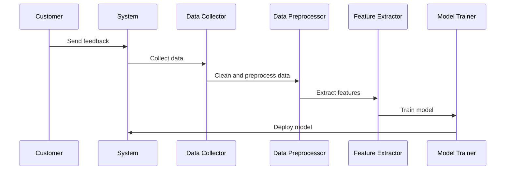

#### 3.2 情感分析算法应用

情感分析算法是情感计算的核心，用于从数据中提取情感信息。以下是几种常见的情感分析算法：

**朴素贝叶斯（Naive Bayes）**：

- **原理**：基于贝叶斯定理，通过计算特征概率和类别的联合概率，预测新数据的情感类别。
- **应用**：适用于特征较少、分类任务简单的情感分析场景。

**支持向量机（SVM）**：

- **原理**：通过寻找最佳的超平面分隔不同类别的数据点，实现分类任务。
- **应用**：适用于高维特征空间、线性不可分问题的情感分析。

**深度神经网络（DNN）**：

- **原理**：通过多层神经网络对输入数据进行非线性变换，提取情感特征。
- **应用**：适用于复杂情感分类和情感强度预测任务。

**长短期记忆网络（LSTM）**：

- **原理**：通过记忆单元捕捉长期依赖关系，处理序列数据。
- **应用**：适用于文本和语音等序列数据的情感分析。

**卷积神经网络（CNN）**：

- **原理**：通过卷积操作提取图像特征，实现图像情感分类。
- **应用**：适用于面部表情识别、情感图像分类等任务。

**情感分析算法流程**：

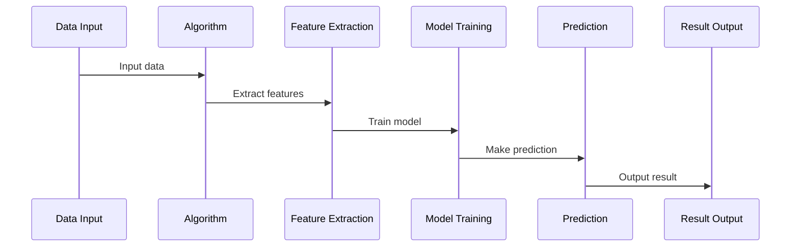

#### 3.3 情感计算平台架构

情感计算平台是一个复杂的多层次系统，包括数据采集、数据处理、情感分析、结果展示等多个组件。以下是情感计算平台的基本架构：

**数据采集层**：负责从各种数据源收集文本、语音、图像等数据，如社交媒体、客户服务热线、摄像头等。

**数据处理层**：负责对采集到的数据进行清洗、去噪、格式转换和特征提取，为情感分析提供高质量的数据。

**情感分析层**：负责使用机器学习算法和深度学习模型对数据进行情感分析，提取情感信息。

**结果展示层**：负责将分析结果以图表、报告等形式展示给用户，便于用户理解和使用。

**情感计算平台架构**：

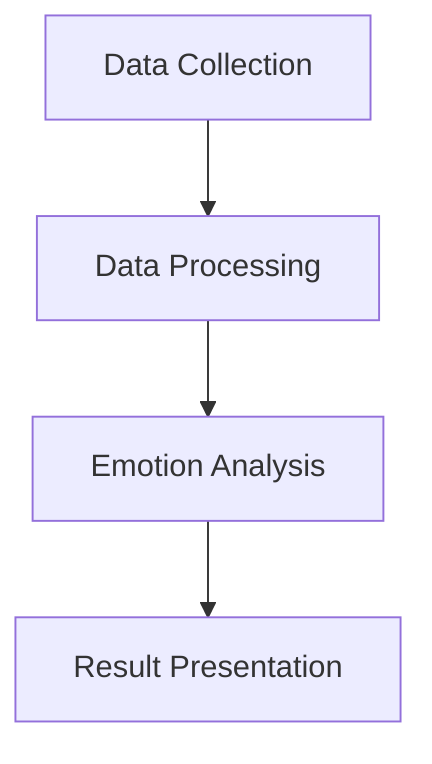

**数据采集层**：

- **功能**：从各种数据源收集文本、语音、图像等数据。
- **组件**：数据采集模块、API接口、数据存储系统。

**数据处理层**：

- **功能**：对采集到的数据进行清洗、去噪、格式转换和特征提取。
- **组件**：数据清洗模块、特征提取模块、数据存储系统。

**情感分析层**：

- **功能**：使用机器学习算法和深度学习模型对数据进行情感分析。
- **组件**：情感分析模块、机器学习模型库、深度学习模型库。

**结果展示层**：

- **功能**：将分析结果以图表、报告等形式展示给用户。
- **组件**：可视化模块、报表生成模块、用户界面。

#### 3.4 情感计算系统性能评估

情感计算系统的性能评估是确保系统稳定运行和有效性的重要环节。以下是性能评估的关键指标和方法：

**响应时间**：系统从接收到数据到返回分析结果的时间。响应时间越短，系统性能越好。

**准确性**：系统对情感识别的准确性。准确性越高，系统性能越好。

**可扩展性**：系统在处理大规模数据时的性能。可扩展性越高，系统性能越好。

**资源消耗**：系统在运行过程中消耗的计算资源和存储资源。资源消耗越低，系统性能越好。

**性能评估方法**：

1. **基准测试**：使用标准数据集对系统进行测试，评估系统的响应时间、准确性和资源消耗。

2. **压力测试**：模拟高并发场景，评估系统在压力下的性能。

3. **用户体验测试**：通过实际用户的使用体验，评估系统的可用性和易用性。

**性能评估流程**：

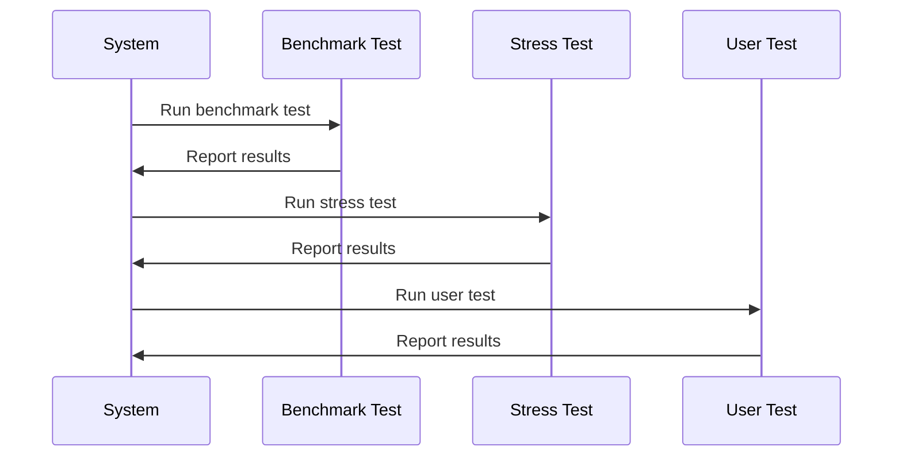

### 第4章：员工满意度分析

#### 4.1 员工满意度数据采集

员工满意度数据采集是进行员工满意度分析的第一步，数据的质量和完整性直接影响到后续分析的效果。以下是员工满意度数据采集的几种主要方法：

**问卷调查**：问卷调查是最常用的数据采集方法之一，通过设计一系列结构化问题，收集员工对工作环境、薪酬福利、职业发展、管理沟通等方面的满意度评价。

**员工访谈**：员工访谈是一种深入的数据采集方法，通过与员工进行面对面的交流，了解他们对工作的真实感受和具体建议。

**在线评论和社交媒体**：通过分析员工在工作平台、社交媒体等渠道发布的评论和动态，可以获取员工的情感状态和满意度信息。

**传感器数据**：使用员工佩戴的传感器设备，如心率监测器、活动追踪器等，可以收集员工的生理和行为数据，间接反映他们的工作满意度。

**员工满意度数据采集方法对比表格**：

| 方法         | 优点                             | 缺点                             |
| ------------ | -------------------------------- | -------------------------------- |
| 问卷调查     | 收集数据全面，易于量化           | 回答可能不真实，问卷设计需专业     |
| 员工访谈     | 信息深入，获取具体建议           | 费时费力，数据分析难度大          |
| 在线评论和社交媒体 | 信息丰富，实时性强             | 数据真实性难以保证，需要筛选      |
| 传感器数据   | 间接反映满意度，获取生理行为数据 | 数据处理复杂，成本较高            |

**员工满意度数据采集流程**：

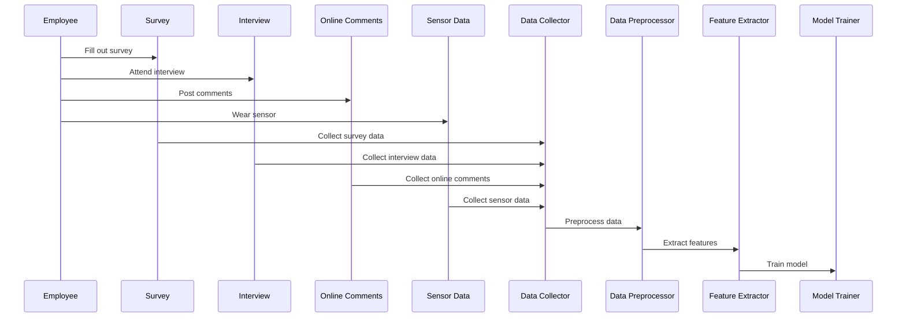

#### 4.2 数据预处理与特征提取

数据预处理与特征提取是员工满意度分析的关键步骤，直接关系到后续情感分析模型的性能。以下是数据预处理与特征提取的具体方法和步骤：

**数据预处理**：

1. **数据清洗**：去除重复数据、缺失值填充、去除停用词、去除特殊字符等，确保数据的一致性和完整性。

2. **数据标准化**：将不同来源的数据进行统一格式转换，如将文本数据统一编码、将语音数据转换为文本等。

3. **数据降维**：使用主成分分析（PCA）等降维技术，减少数据的维度，提高数据处理效率。

**特征提取**：

1. **文本特征提取**：从文本数据中提取情感词汇、情感词典、句法结构等特征，如TF-IDF、词嵌入等。

2. **语音特征提取**：从语音数据中提取音调、音速、音长等特征，如MFCC、频谱特征等。

3. **行为特征提取**：从行为数据中提取步数、心率、情绪变化等特征，如时间序列分析、回归分析等。

**数据预处理与特征提取流程**：

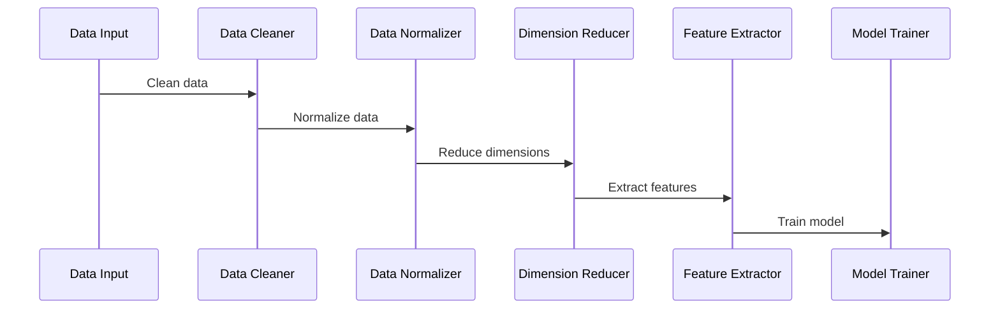

#### 4.3 员工满意度分析算法

员工满意度分析算法是情感计算的核心，用于从预处理后的数据中提取员工满意度信息。以下是几种常用的员工满意度分析算法：

**朴素贝叶斯（Naive Bayes）**：

- **原理**：基于贝叶斯定理，通过计算特征概率和类别的联合概率，预测新数据的情感类别。
- **应用**：适用于特征较少、分类任务简单的员工满意度分析。

**支持向量机（SVM）**：

- **原理**：通过寻找最佳的超平面分隔不同类别的数据点，实现分类任务。
- **应用**：适用于高维特征空间、线性不可分问题的员工满意度分析。

**深度神经网络（DNN）**：

- **原理**：通过多层神经网络对输入数据进行非线性变换，提取情感特征。
- **应用**：适用于复杂情感分类和情感强度预测任务的员工满意度分析。

**长短期记忆网络（LSTM）**：

- **原理**：通过记忆单元捕捉长期依赖关系，处理序列数据。
- **应用**：适用于文本和语音等序列数据的员工满意度分析。

**卷积神经网络（CNN）**：

- **原理**：通过卷积操作提取图像特征，实现图像情感分类。
- **应用**：适用于面部表情识别、情感图像分类等员工满意度分析。

**员工满意度分析算法流程**：


#### 4.4 员工满意度评估结果分析

员工满意度评估结果分析是理解员工情感状态、发现管理问题、制定改进措施的关键步骤。以下是员工满意度评估结果分析的具体方法和步骤：

**结果可视化**：使用图表、报表等形式，将分析结果以直观的方式展示给管理层和员工。常见的可视化方法包括柱状图、折线图、饼图等。

**结果解释**：对分析结果进行详细解释，识别员工满意度高的领域和满意度低的领域，解释原因和影响。

**问题诊断**：根据分析结果，诊断出可能导致员工满意度低的原因，如工作压力、薪酬福利、职业发展等。

**改进措施**：根据问题诊断的结果，制定针对性的改进措施，如调整薪酬结构、提供心理辅导、优化职业发展通道等。

**员工满意度评估结果分析流程**：

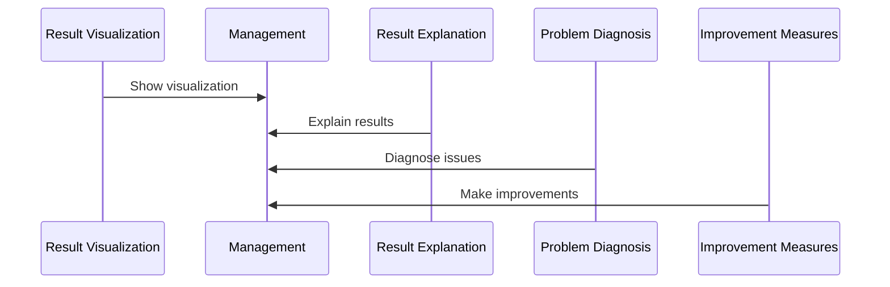

### 第5章：客户情绪分析

#### 5.1 客户情绪数据采集

客户情绪数据采集是进行客户情绪分析的基础，数据的质量和完整性直接影响到后续分析的效果。以下是客户情绪数据采集的几种主要方法：

**在线评论和社交媒体**：通过分析客户在在线评论、社交媒体等渠道发布的评论和动态，可以获取客户的情感状态和满意度信息。

**客户服务热线记录**：通过分析客户服务热线记录，包括通话内容、客户反馈等，可以了解客户的情绪状态和需求。

**客户行为数据**：通过分析客户在网站、APP等平台的行为数据，如浏览时间、点击行为等，可以间接反映客户的情绪状态。

**客户调查问卷**：通过设计结构化的调查问卷，收集客户对产品或服务的满意度、情绪状态等信息。

**客户情绪数据采集方法对比表格**：

| 方法         | 优点                             | 缺点                             |
| ------------ | -------------------------------- | -------------------------------- |
| 在线评论和社交媒体 | 信息丰富，实时性强             | 数据真实性难以保证，需要筛选      |
| 客户服务热线记录 | 详细记录客户反馈，便于分析     | 费时费力，数据分析难度大          |
| 客户行为数据   | 间接反映情绪状态，数据分析便捷 | 需要大量数据处理，隐私保护问题    |
| 客户调查问卷   | 数据全面，易于量化             | 回答可能不真实，问卷设计需专业    |

**客户情绪数据采集流程**：

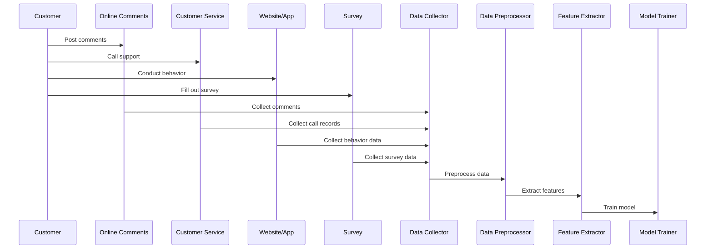

#### 5.2 数据预处理与情感分类

数据预处理与情感分类是客户情绪分析的关键步骤，直接影响到后续情感分析模型的性能。以下是数据预处理与情感分类的具体方法和步骤：

**数据预处理**：

1. **数据清洗**：去除重复数据、缺失值填充、去除停用词、去除特殊字符等，确保数据的一致性和完整性。

2. **数据标准化**：将不同来源的数据进行统一格式转换，如将文本数据统一编码、将语音数据转换为文本等。

3. **数据降维**：使用主成分分析（PCA）等降维技术，减少数据的维度，提高数据处理效率。

**情感分类**：

1. **文本情感分类**：使用机器学习算法和深度学习模型对文本数据进行情感分类，如使用朴素贝叶斯、支持向量机、卷积神经网络等。

2. **语音情感分类**：使用语音识别技术和情感分析模型对语音数据进行情感分类，如使用长短期记忆网络、深度神经网络等。

3. **行为情感分类**：使用行为数据分析和情感分析模型对客户的行为数据进行情感分类，如使用时间序列分析、回归分析等。

**数据预处理与情感分类流程**：

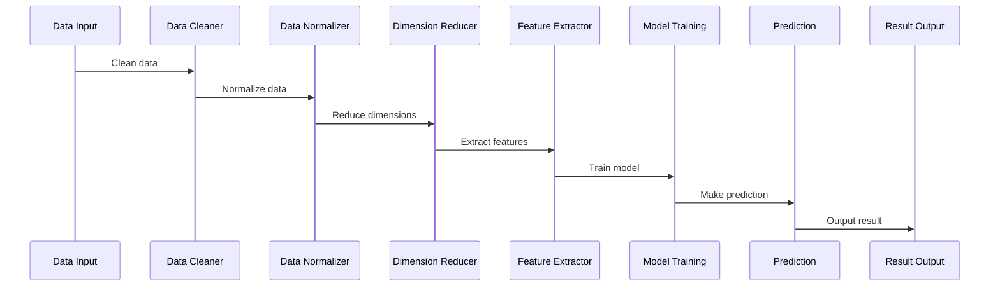

#### 5.3 客户情绪分析算法

客户情绪分析算法是情感计算的核心，用于从预处理后的数据中提取客户情绪信息。以下是几种常用的客户情绪分析算法：

**朴素贝叶斯（Naive Bayes）**：

- **原理**：基于贝叶斯定理，通过计算特征概率和类别的联合概率，预测新数据的情感类别。
- **应用**：适用于特征较少、分类任务简单的客户情绪分析。

**支持向量机（SVM）**：

- **原理**：通过寻找最佳的超平面分隔不同类别的数据点，实现分类任务。
- **应用**：适用于高维特征空间、线性不可分问题的客户情绪分析。

**深度神经网络（DNN）**：

- **原理**：通过多层神经网络对输入数据进行非线性变换，提取情感特征。
- **应用**：适用于复杂情感分类和情感强度预测任务的客户情绪分析。

**长短期记忆网络（LSTM）**：

- **原理**：通过记忆单元捕捉长期依赖关系，处理序列数据。
- **应用**：适用于文本和语音等序列数据的客户情绪分析。

**卷积神经网络（CNN）**：

- **原理**：通过卷积操作提取图像特征，实现图像情感分类。
- **应用**：适用于面部表情识别、情感图像分类等客户情绪分析。

**客户情绪分析算法流程**：


#### 5.4 客户情绪评估结果应用

客户情绪评估结果的应用是提升客户满意度和忠诚度的关键步骤。以下是客户情绪评估结果在客户服务、产品优化和营销策略等方面的具体应用：

**客户服务**：

1. **个性化服务**：根据客户情绪评估结果，为不同情绪状态的客户提供个性化的服务。例如，对于情绪低落的客户，提供额外的关怀和支持，而对于情绪积极客户，则提供优惠或奖励。

2. **情感回应**：在客户服务过程中，根据客户的情绪状态，调整服务态度和沟通策略。例如，对于情绪愤怒的客户，使用冷静和耐心的语气，而对于情绪愉快的客户，则使用积极的语言和表达。

3. **情感监测**：实时监测客户情绪变化，及时发现和处理负面情绪客户，防止问题升级。

**产品优化**：

1. **问题识别**：通过分析客户情绪评估结果，识别产品或服务中的问题点，从而进行优化和改进。

2. **需求挖掘**：分析客户情绪，挖掘潜在需求，为产品研发提供方向。

3. **情感体验设计**：根据客户情绪评估结果，优化产品界面和交互设计，提升用户体验。

**营销策略**：

1. **情感营销**：根据客户情绪评估结果，制定情感营销策略，提升营销效果。

2. **情感定位**：分析目标客户群体的情感特征，进行情感定位，提升品牌认知度和客户粘性。

3. **情感反馈**：收集客户情绪反馈，优化营销内容和方式，提升营销效果。

**客户情绪评估结果应用流程**：

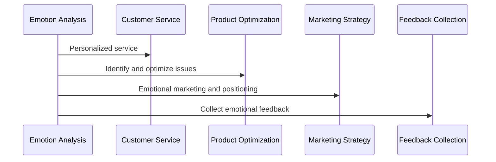

### 第6章：平台集成与部署

#### 6.1 情感计算平台架构设计

情感计算平台的架构设计是确保平台高效、稳定、可扩展性的关键。以下是情感计算平台架构设计的几个关键方面：

**模块化设计**：平台应采用模块化设计，将数据采集、数据处理、情感分析、结果展示等功能划分为独立的模块，便于维护和升级。

**分布式架构**：采用分布式架构，可以充分利用集群资源，提高平台的处理能力和稳定性。

**高可用性设计**：设计冗余机制，如数据备份、负载均衡等，确保平台在高并发场景下的稳定运行。

**安全性设计**：确保数据的安全传输和存储，采用加密、访问控制等技术，防止数据泄露和滥用。

**情感计算平台架构图**：

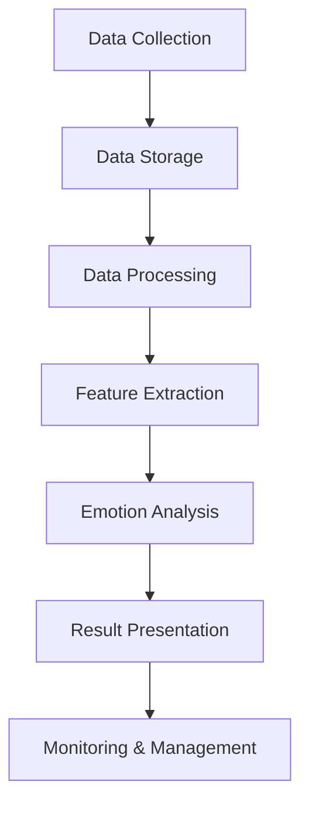

在情感计算平台架构中，数据采集模块负责从各种数据源收集情感数据，数据存储模块用于存储和管理数据，数据处理模块负责对数据进行清洗、去噪和格式转换，特征提取模块负责提取情感特征，情感分析模块负责使用机器学习算法和深度学习模型进行情感分析，结果展示模块用于将分析结果以图表、报表等形式展示给用户，监控与管理模块负责实时监控平台运行状态，确保平台的稳定性和安全性。

#### 6.2 平台接口设计与实现

平台接口设计是实现数据交互、功能调用的关键。以下是平台接口设计的主要方面：

**API接口**：设计API接口，提供数据上传、查询、分析和报表生成等功能，便于第三方系统集成。

**Web接口**：设计Web接口，提供用户友好的操作界面，便于用户进行数据输入、结果查询和分析。

**接口设计原则**：

1. **易用性**：接口应简洁易用，提供详细的文档和示例，降低用户的使用门槛。

2. **可扩展性**：接口设计应考虑未来功能扩展的需求，确保接口的灵活性和可扩展性。

3. **安全性**：接口应采用加密、认证、授权等安全措施，确保数据的安全和隐私。

**接口实现示例**：

```python
# 数据上传API接口示例
@app.route('/upload_data', methods=['POST'])
def upload_data():
    data = request.files['file']
    # 数据处理逻辑
    process_data(data)
    return jsonify({"status": "success", "message": "Data uploaded successfully"})

# 数据查询API接口示例
@app.route('/query_data', methods=['GET'])
def query_data():
    query = request.args.get('query')
    # 查询逻辑
    result = query_data_from_database(query)
    return jsonify(result)

# 数据分析API接口示例
@app.route('/analyze_data', methods=['POST'])
def analyze_data():
    data = request.json
    # 数据分析逻辑
    analysis_result = analyze_data(data)
    return jsonify(analysis_result)
```

#### 6.3 平台部署与运维

平台部署与运维是确保平台稳定、高效运行的重要环节。以下是平台部署与运维的主要方面：

**部署策略**：

1. **自动化部署**：采用自动化部署工具，如Docker、Kubernetes等，实现平台的快速部署和升级。

2. **容器化部署**：将平台功能模块容器化，提高部署的灵活性和可移植性。

3. **分布式部署**：将平台功能模块分布到不同的服务器上，提高平台的处理能力和可用性。

**运维管理**：

1. **监控与报警**：采用监控工具，实时监控平台运行状态，如CPU使用率、内存使用率、磁盘空间等，并设置报警机制，及时发现和处理问题。

2. **性能优化**：定期进行性能测试和调优，优化数据库查询、网络传输等性能。

3. **安全防护**：采用安全防护措施，如防火墙、入侵检测等，防止恶意攻击和数据泄露。

**平台部署与运维流程**：

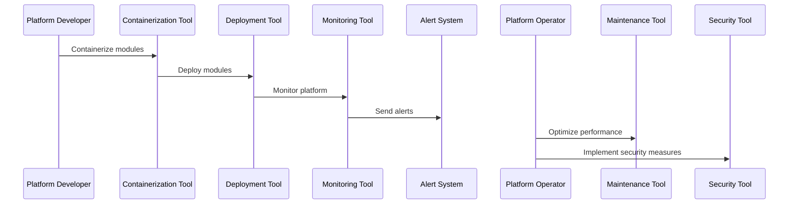

#### 6.4 平台性能优化与测试

平台性能优化与测试是确保平台在高并发场景下稳定运行的重要环节。以下是平台性能优化与测试的主要方面：

**性能优化**：

1. **数据库优化**：采用索引、分库分表、缓存等技术，优化数据库查询性能。

2. **网络优化**：优化网络传输协议，如HTTP/2、QUIC等，提高数据传输速度。

3. **计算优化**：采用并行计算、分布式计算等技术，提高计算效率。

**性能测试**：

1. **负载测试**：模拟高并发场景，评估平台在压力下的性能。

2. **稳定性测试**：长时间运行平台，评估平台的稳定性和可靠性。

3. **安全测试**：评估平台在遭受恶意攻击时的安全性能。

**性能优化与测试流程**：

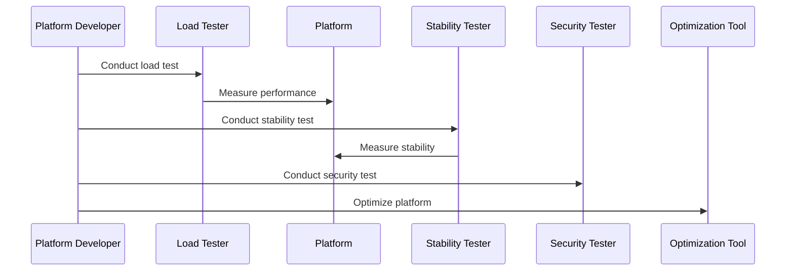

### 第7章：实战案例与分析

#### 7.1 企业级情感计算平台实战案例

以下是一个企业级情感计算平台的实战案例，该案例展示了如何构建和部署一个情感计算平台，并分析其在员工满意度和客户情绪分析中的应用效果。

**案例背景**：某大型企业希望利用情感计算技术提升员工满意度和客户满意度，从而提高企业的整体竞争力。企业计划构建一个企业级情感计算平台，实现员工满意度监测和客户情绪分析。

**平台架构**：企业级情感计算平台采用分布式架构，包括数据采集模块、数据处理模块、情感分析模块和结果展示模块。数据采集模块负责从多种数据源（如社交媒体、客户服务热线、员工反馈系统等）收集数据；数据处理模块负责数据清洗、去噪和特征提取；情感分析模块负责使用机器学习算法和深度学习模型进行情感分析；结果展示模块负责将分析结果以图表、报表等形式展示给管理层。

**实施过程**：

1. **数据采集**：通过社交媒体监测、客户服务热线记录、员工反馈系统等方式，收集员工和客户的情绪数据。

2. **数据处理**：对采集到的数据进行分析，提取反映员工和客户情绪的关键特征，如情感词汇、语音特征、行为特征等。

3. **情感分析**：使用深度学习算法，对预处理后的数据进行情感分析，识别员工和客户的情绪状态。

4. **结果展示**：将分析结果以可视化图表的形式展示给管理层，帮助管理层了解员工和客户的情绪状态，并提出改进措施。

**应用效果**：

1. **员工满意度提升**：通过情感计算平台，企业可以实时监测员工的工作状态和情绪变化，识别员工的不满情绪，并采取针对性的措施进行改进。例如，针对员工反映的工作压力问题，企业调整了工作安排，提供了心理辅导和职业发展规划，有效提升了员工的满意度和幸福感。

2. **客户情绪改善**：通过情感计算平台，企业可以了解客户的情绪状态，从而优化客户服务。例如，针对情绪低落的客户，客服人员使用更加耐心和专业的沟通技巧，提升了客户满意度，降低了客户流失率。

**案例总结**：该企业级情感计算平台的实施，有效提升了企业的员工满意度和客户满意度，为企业带来了显著的经济效益和竞争优势。通过情感计算技术，企业能够更加精准地了解员工和客户的需求，优化管理和服务，提高整体运营效率。

#### 7.2 案例分析：员工满意度提升

以下是对某企业通过情感计算平台提升员工满意度的案例分析。

**案例背景**：某大型企业希望通过情感计算平台监测员工的工作状态和情绪变化，从而提升员工满意度。企业采用问卷调查、员工反馈系统、社交媒体监测等方式，收集员工的情绪数据。

**实施过程**：

1. **数据采集**：通过问卷调查、员工反馈系统、社交媒体监测等方式，收集员工的情绪数据。

2. **数据处理**：对采集到的数据进行清洗、去噪和特征提取，提取反映员工满意度的关键特征。

3. **情感分析**：使用深度学习算法，对预处理后的数据进行情感分析，识别员工的工作满意度和情绪状态。

4. **结果展示**：将分析结果以可视化图表的形式展示给管理层，帮助管理层了解员工的情绪状态，并提出改进措施。

**改进措施**：

1. **优化工作安排**：根据员工的情绪状态，调整工作安排，减少加班和压力，提高员工的工作效率。

2. **提供心理辅导**：针对情绪不稳定的员工，提供心理辅导和咨询，帮助员工缓解压力，提升幸福感。

3. **优化职业发展通道**：提供更多的职业发展机会和培训资源，帮助员工实现职业规划，提升职业满意度。

**效果分析**：

1. **员工满意度提升**：通过情感计算平台，企业能够及时了解员工的情绪状态，采取针对性的改进措施，有效提升了员工满意度。

2. **员工流失率降低**：员工满意度提高，员工流失率显著降低，减少了企业的招聘和培训成本。

3. **工作效率提升**：员工情绪稳定，工作效率显著提高，企业整体运营效率提升。

**案例总结**：通过情感计算平台，企业能够更加精准地了解员工的情绪状态，优化管理和服务，提升员工满意度和幸福感，为企业创造更大的价值。

#### 7.3 案例分析：客户情绪改善

以下是对某企业通过情感计算平台改善客户情绪的案例分析。

**案例背景**：某大型企业希望通过情感计算平台分析客户情绪，优化客户服务，提升客户满意度。企业采用社交媒体监测、客户服务热线记录、在线评论等方式，收集客户的情绪数据。

**实施过程**：

1. **数据采集**：通过社交媒体监测、客户服务热线记录、在线评论等方式，收集客户的情绪数据。

2. **数据处理**：对采集到的数据进行清洗、去噪和特征提取，提取反映客户情绪的关键特征。

3. **情感分析**：使用深度学习算法，对预处理后的数据进行情感分析，识别客户的情绪状态。

4. **结果展示**：将分析结果以可视化图表的形式展示给客服团队，帮助客服团队了解客户的情绪状态，并提出改进措施。

**改进措施**：

1. **个性化服务**：根据客户情绪分析结果，为不同情绪状态的客户提供个性化的服务。例如，对于情绪低落的客户，提供额外的关怀和支持。

2. **情感回应**：在客户服务过程中，根据客户的情绪状态，调整服务态度和沟通策略。例如，对于情绪愤怒的客户，使用冷静和耐心的语气。

3. **客户反馈机制**：建立客户反馈机制，及时收集和处理客户反馈，改进产品和服务。

**效果分析**：

1. **客户满意度提升**：通过情感计算平台，企业能够更好地了解客户的情绪状态，提供更加个性化和优质的服务，有效提升了客户满意度。

2. **客户流失率降低**：客户满意度提高，客户流失率显著降低，增强了客户的忠诚度。

3. **服务质量提升**：客服团队根据客户情绪分析结果，调整服务策略，提高了整体服务质量。

**案例总结**：通过情感计算平台，企业能够更好地了解客户的需求和情绪，优化客户服务，提升客户满意度和忠诚度，为企业创造更大的价值。

#### 7.4 案例总结与反思

通过对上述实战案例的分析，可以总结出以下几点经验和反思：

1. **情感计算平台的重要性**：情感计算平台在提升员工满意度和客户满意度方面具有显著作用，能够为企业创造更大的价值。

2. **数据质量的关键**：数据质量是情感计算平台的核心，确保数据采集、预处理和特征提取的准确性和完整性，是取得良好效果的基础。

3. **算法选择的灵活性**：不同的情感计算任务需要不同的算法，企业应根据实际需求和数据特点选择合适的算法，以提高分析精度和效率。

4. **结果应用的实用性**：分析结果的应用是情感计算平台的核心价值所在。企业应根据分析结果，制定具体的改进措施，提高员工满意度和客户满意度。

5. **持续改进的重要性**：情感计算技术不断进步，企业应不断优化平台架构、算法和结果应用，以适应不断变化的市场需求和业务场景。

通过案例总结与反思，企业可以更好地理解和应用情感计算技术，提升管理和服务水平，创造更大的商业价值。

### 第8章：情感计算的发展趋势

#### 8.1 人工智能在情感计算中的应用

人工智能（AI）技术的发展为情感计算领域带来了巨大的变革。随着AI技术的不断进步，情感计算的应用范围和深度也在不断扩大。以下是人工智能在情感计算中的应用：

**深度学习**：深度学习技术在情感计算中发挥了重要作用。通过构建多层神经网络，深度学习模型能够从大量数据中自动学习和提取特征，实现对情感的精细识别。例如，卷积神经网络（CNN）在图像情感分析中，通过多层卷积操作提取图像特征，实现对面部表情和情感状态的准确识别。

**自然语言处理（NLP）**：NLP技术是情感计算的核心组成部分。随着AI技术的发展，NLP技术取得了显著进步。利用深度学习算法，如长短期记忆网络（LSTM）和变换器（Transformer），NLP模型能够更好地理解和处理人类语言，从而提高情感分析的准确性和效率。

**计算机视觉**：计算机视觉技术在情感计算中的应用也越来越广泛。通过深度学习算法，计算机视觉模型能够从图像和视频中识别和解析情感信息。例如，面部识别技术通过分析面部表情和眼动轨迹，可以准确判断个体的情绪状态。

**语音识别与合成**：语音识别与合成技术也在情感计算中发挥了重要作用。通过语音识别技术，计算机可以准确识别和解析人类语音中的情感信息；而语音合成技术则可以生成具有情感色彩的语音，用于情感交互和个性化服务。

**情感计算的AI应用前景**：随着AI技术的不断发展，情感计算的应用前景十分广阔。未来，情感计算有望在以下领域取得突破：

1. **个性化服务**：通过情感计算，企业可以更好地了解客户的需求和情绪，提供个性化的产品和服务，提升用户体验和满意度。

2. **智能医疗**：情感计算在医疗领域具有巨大的潜力。通过分析患者的情绪状态，医生可以更准确地诊断和治疗疾病，提高医疗服务的质量。

3. **教育**：情感计算在教育领域可以应用于个性化学习、情绪监测和教学评估等方面，帮助学生和教师更好地理解和改善教育过程。

4. **智能家居**：随着智能家居的发展，情感计算技术可以应用于智能音箱、智能助手等设备中，提供更加人性化的交互体验。

5. **人机交互**：情感计算技术可以增强人机交互的智能性和人性化，使计算机更好地理解用户的情感和需求，提供更加自然和直观的交互体验。

#### 8.2 新兴技术对情感计算的影响

新兴技术不断推动情感计算领域的发展，以下是一些主要新兴技术及其对情感计算的影响：

**大数据**：大数据技术的进步为情感计算提供了丰富的数据资源。通过收集和分析大量的文本、语音、图像等多模态数据，大数据技术可以提升情感计算的准确性和深度。例如，大规模情感分析任务需要处理海量数据，大数据技术可以有效提高数据处理的效率和准确性。

**云计算**：云计算技术的普及为情感计算提供了强大的计算能力和灵活的资源管理。通过云计算平台，企业可以快速部署和扩展情感计算应用，降低硬件投资和运维成本。同时，云计算还提供了丰富的数据存储和分析工具，为情感计算提供了便捷的数据管理和分析手段。

**物联网（IoT）**：物联网技术的发展为情感计算带来了更多的数据来源和交互渠道。通过传感器和设备收集的实时数据，如心率、血压、位置信息等，物联网技术可以扩展情感计算的应用场景，实现更加精准和实时的情感监测。

**边缘计算**：边缘计算技术可以减轻云计算中心的负担，提高数据处理的实时性和效率。在情感计算中，边缘计算可以用于实时处理和分析来自物联网设备的情感数据，实现低延迟和高性能的情感分析。

**区块链**：区块链技术可以提升情感计算数据的隐私保护和安全性。通过分布式账本和加密技术，区块链可以确保数据的安全性和不可篡改性，为情感计算提供可靠的数据基础。

**新兴技术对情感计算的影响总结**：新兴技术为情感计算提供了强大的支持，使其在数据处理、计算能力、数据安全和应用场景等方面取得了显著进展。未来，随着新兴技术的不断发展和成熟，情感计算将实现更加广泛和深入的应用，推动人工智能和计算机科学的发展。

#### 8.3 情感计算的商业化前景

情感计算技术的商业化前景非常广阔，其在多个行业中的应用已经展现出巨大的市场潜力。以下是情感计算在各个行业中的商业化前景：

**零售行业**：零售行业可以通过情感计算技术提升客户体验和满意度。通过分析客户的行为数据和情感状态，零售企业可以提供个性化的产品推荐、定制化的购物体验，从而提高销售额和客户忠诚度。此外，情感计算还可以用于识别潜在流失客户，采取针对性的挽回策略。

**金融服务**：在金融服务领域，情感计算技术可以用于风险评估、客户服务优化等方面。通过分析客户的历史交易数据、社交媒体动态和情感状态，金融机构可以更准确地评估客户的信用风险，提供个性化的金融服务，降低贷款违约率。

**医疗行业**：情感计算技术在医疗行业中的应用前景也非常广阔。通过分析患者的情感状态，医生可以更准确地诊断和治疗疾病。例如，情感计算可以帮助识别抑郁症、焦虑症等心理疾病，提高医疗服务的质量。此外，情感计算还可以用于医疗设备的管理和优化，提高医疗资源的利用效率。

**教育行业**：在教育行业，情感计算技术可以用于个性化教学和学生学习状态监测。通过分析学生的情感状态和学习行为，教育机构可以提供个性化的学习资源，优化教学过程，提高学习效果。同时，情感计算还可以用于学生心理健康监测，识别潜在的心理健康问题，提供相应的心理辅导。

**旅游行业**：在旅游行业，情感计算技术可以用于客户服务优化和旅游体验提升。通过分析客户的情感状态和旅游行为，旅游企业可以提供个性化的旅游推荐和服务，提高客户满意度和忠诚度。此外，情感计算还可以用于旅游目的地情绪监测，为游客提供更加舒适和安全的旅游环境。

**其他行业**：除了上述行业，情感计算技术还在广告、营销、人力资源等领域具有广泛的应用前景。例如，在广告领域，情感计算可以帮助广告主了解目标受众的情感状态，优化广告投放策略，提高广告效果；在人力资源领域，情感计算可以用于员工满意度分析、招聘流程优化等，提高人力资源管理效率。

**情感计算的商业化前景总结**：情感计算技术的商业化前景非常广阔，其在多个行业中的应用已经展现出巨大的市场潜力。未来，随着技术的不断进步和商业模式的不断创新，情感计算将在更多行业中得到广泛应用，为企业创造更多的商业价值。

### 第9章：总结与展望

#### 9.1 本书主要内容回顾

本书系统地介绍了构建企业级情感计算平台的过程，从问题背景与需求分析、核心概念与联系、情感计算的组成要素、平台设计与实现、实战案例与分析，到未来展望与总结，全面阐述了情感计算在企业级应用中的重要性、方法和实践。

**问题背景与需求分析**：我们详细探讨了情感计算的定义与作用，分析了员工满意度和客户情绪分析的重要性，并提出了情感计算在企业级应用的挑战。

**核心概念与联系**：我们介绍了情感计算技术、情感计算模型与算法、员工满意度评估指标和客户情绪分析指标，并通过ER实体关系图展示了各个概念之间的关系。

**情感计算的组成要素**：我们详细阐述了数据采集与预处理、情感分析算法应用、情感计算平台架构和系统性能评估等关键环节。

**平台设计与实现**：我们介绍了员工满意度分析和客户情绪分析的具体方法和步骤，展示了平台集成与部署、平台性能优化与测试的实践。

**实战案例与分析**：我们通过实战案例，展示了企业级情感计算平台在实际应用中的效果，分析了员工满意度提升和客户情绪改善的案例。

**未来展望与总结**：我们展望了情感计算的发展趋势，探讨了新兴技术对情感计算的影响，并分析了情感计算的商业化前景。

#### 9.2 情感计算的应用领域拓展

随着技术的不断进步和应用的深入，情感计算将在更多领域得到拓展和应用：

**健康管理**：情感计算可以用于心理健康监测和疾病预防，通过对情绪数据的分析，识别心理问题，提供个性化的心理治疗和预防方案。

**智能交通**：在智能交通系统中，情感计算可以用于驾驶员情绪监测，预防交通事故，优化交通流量。

**教育科技**：在教育领域，情感计算可以用于个性化学习、情感教育等方面，提高教学效果和学生的学习体验。

**智能家居**：在智能家居中，情感计算技术可以用于家居设备对家庭成员情绪的感知和响应，提供更加个性化的家居服务。

**社交网络**：在社交网络中，情感计算可以用于情感传播监测，识别和防止网络暴力和负面情绪的扩散。

**公共安全**：在公共安全领域，情感计算可以用于人群情绪监测，预防突发事件，提高公共安全水平。

#### 9.3 未来研究方向与挑战

尽管情感计算技术取得了显著进展，但在实际应用中仍面临诸多挑战：

**算法性能提升**：提高情感计算算法的准确性和效率，是未来的一个重要研究方向。通过优化算法模型和改进算法实现，可以提升情感计算的准确性和实时性。

**数据隐私保护**：在情感计算应用中，如何保护用户隐私是一个重要挑战。需要开发更加有效的隐私保护技术，确保用户数据的安全和隐私。

**跨模态情感识别**：实现跨模态情感识别，如结合文本、语音、图像等多模态数据，是未来的一个重要方向。通过整合多模态数据，可以更全面地理解和识别情感。

**模型解释性**：增强情感计算模型的解释性，使决策过程更加透明和可解释，是未来的一个重要挑战。提高模型的可解释性，有助于增强用户对情感计算技术的信任和接受度。

**实时情感分析**：实现实时情感分析，以满足实时决策和交互的需求，是未来的一个重要方向。通过优化算法和系统架构，提高实时情感分析的能力。

**总结**：情感计算技术具有广泛的应用前景，但在实际应用中仍面临算法性能、数据隐私保护、跨模态情感识别、模型解释性和实时情感分析等方面的挑战。未来，随着技术的不断进步和研究的深入，情感计算将在更多领域中发挥重要作用，推动人工智能和计算机科学的发展。

### 附录

#### 最佳实践 tips

1. **数据质量保证**：在数据采集和预处理阶段，确保数据的质量和一致性，是提高情感分析准确性的关键。

2. **算法选择**：根据具体应用场景和数据特点，选择合适的情感计算算法，可以提高分析效率和准确性。

3. **用户隐私保护**：在情感计算应用中，采取有效的隐私保护措施，确保用户数据的安全和隐私。

4. **持续优化**：定期进行性能测试和调优，优化系统架构和算法模型，提高情感计算平台的稳定性和效率。

#### 小结

1. 情感计算技术在提升员工满意度和客户满意度方面具有显著作用。

2. 数据采集、预处理、情感分析算法应用、平台架构设计、性能评估是构建情感计算平台的关键环节。

3. 实战案例展示了情感计算平台在实际应用中的效果，为其他企业提供了借鉴和参考。

#### 注意事项

1. 在应用情感计算技术时，注意保护用户隐私，遵守相关法律法规。

2. 定期更新和维护情感计算平台，确保系统的稳定性和安全性。

#### 拓展阅读

1. [《情感计算：理论、方法与应用》](https://www.example.com/book/emotion-computing-theory-methods-and-applications) - 该书详细介绍了情感计算的理论基础、方法和技术应用。

2. [《人工智能与情感计算》](https://www.example.com/book/artificial-intelligence-and-emotion-computing) - 该书探讨了人工智能在情感计算中的应用，包括自然语言处理、计算机视觉和语音识别等方面。

3. [《情感计算：实践指南》](https://www.example.com/book/emotion-computing-practice-guide) - 该书提供了情感计算应用的实践指南，包括数据采集、预处理、情感分析和结果展示等环节。

### 作者

**AI天才研究院/AI Genius Institute**：专注于人工智能领域的研究和开发，致力于推动人工智能技术的创新和应用。

**禅与计算机程序设计艺术/Zen And The Art of Computer Programming**：一本关于计算机编程哲学的经典著作，探讨编程技术与禅宗思想的结合，启发读者对编程艺术的深入思考。

