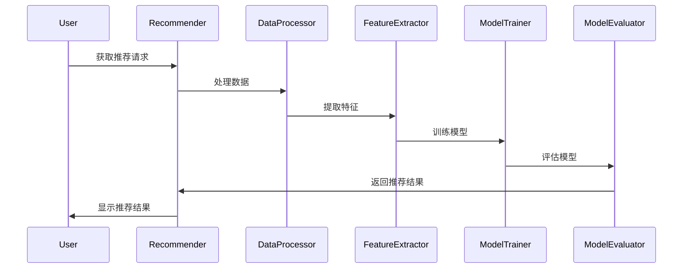

                 

## 文章标题：构建企业级推荐引擎：跨平台个性化用户体验

### 关键词：
- 企业级推荐系统
- 跨平台个性化用户体验
- 协同过滤
- 基于内容推荐
- 深度学习

### 摘要：
随着数字化转型的深入，企业级推荐系统在提升用户体验、增加用户粘性方面发挥着越来越重要的作用。本文将深入探讨如何构建一个既安全又高效的企业级推荐引擎，实现跨平台个性化用户体验。文章将涵盖推荐系统的核心概念、构建方法、算法原理、数学模型以及实战案例，旨在为读者提供一套系统化的实践指南。

### 目录大纲

----------------------------------------------------------------

## 第一部分：背景介绍

### 第1章 问题背景与核心概念

#### 1.1.1 问题背景

随着互联网的快速发展，用户对个性化推荐的需求日益增长。传统推荐系统存在许多问题，如用户数据隐私泄露、推荐结果单调等。因此，构建一个安全、高效、个性化的企业级推荐引擎成为企业关注的焦点。

#### 1.1.2 核心概念

- **推荐系统**：基于用户历史行为、兴趣等信息，为用户推荐相关内容的系统。
- **企业级推荐引擎**：为大型企业构建，能够处理海量数据、满足多样化需求的推荐系统。

## 第2章 构建推荐引擎的关键概念与联系

### 2.1.1 关键概念

- **协同过滤**：基于用户相似度或物品相似度进行推荐的方法。
- **基于内容的推荐**：根据用户兴趣和物品内容进行推荐的方法。
- **机器学习与深度学习**：用于构建和优化推荐模型的算法。

### 2.1.2 概念属性特征对比表格

| 方法               | 特点                                           | 适用场景                 |
|--------------------|------------------------------------------------|--------------------------|
| 协同过滤           | 基于用户历史行为，考虑用户相似性               | 海量用户场景             |
| 基于内容的推荐     | 基于用户兴趣和物品内容，不依赖用户历史行为     | 小数据集、内容丰富场景   |
| 机器学习           | 自动从数据中学习规律，提高推荐准确性           | 复杂、多变的数据场景     |
| 深度学习           | 利用神经网络模型，处理高维数据，提高推荐效果   | 复杂、高维数据场景       |

### 2.1.3 ER实体关系图架构

```mermaid
erDiagram
    User ||--|{ Recommendation }|
    Item ||--|{ Recommendation }|
```

## 第3章 推荐引擎的算法原理与流程

### 3.1.1 算法原理

推荐引擎主要采用协同过滤、基于内容推荐和深度学习等方法。以下为每种方法的简要算法原理：

#### 协同过滤

- **用户相似度计算**：通过计算用户之间的相似度，找到相似用户。
- **推荐计算**：根据相似用户的历史行为，为当前用户推荐相似物品。

#### 基于内容推荐

- **特征提取**：提取用户和物品的特征向量。
- **相似度计算**：计算用户和物品之间的相似度。
- **推荐计算**：为用户推荐具有相似特征的新物品。

#### 深度学习

- **神经网络模型**：构建神经网络模型，学习用户和物品之间的潜在关系。
- **预测计算**：通过模型预测用户对物品的喜好度，进行推荐。

### 3.1.2 算法流程

推荐引擎的算法流程一般分为以下步骤：

1. 数据预处理：清洗、归一化、编码等处理。
2. 用户和物品特征提取：提取用户和物品的特征向量。
3. 模型训练：使用机器学习或深度学习算法训练推荐模型。
4. 预测计算：根据模型预测用户对物品的喜好度。
5. 推荐计算：根据预测结果，为用户推荐相关物品。

## 第4章 数学模型和数学公式

在本章中，我们将介绍推荐系统中常见的数学模型和公式，包括协同过滤、基于内容推荐和深度学习等方法。

### 4.1 协同过滤

协同过滤算法的核心在于计算用户相似度和物品相似度。以下为两种相似度计算方法：

#### 用户相似度

用户相似度计算公式为：

$$
sim(u_i, u_j) = \frac{count(i, j)}{\sqrt{count(i) \cdot count(j)}}
$$

其中，$count(i, j)$ 表示用户$i$和用户$j$共同评分的物品数量，$count(i)$ 和 $count(j)$ 分别表示用户$i$和用户$j$评分的物品数量。

#### 物品相似度

物品相似度计算公式为：

$$
sim(i, j) = \frac{||r_i - \mu_i|| \cdot ||r_j - \mu_j||}{\sqrt{||r_i - \mu_i||^2 + ||r_j - \mu_j||^2}}
$$

其中，$r_i$ 和 $r_j$ 分别表示物品$i$和物品$j$的用户评分向量，$\mu_i$ 和 $\mu_j$ 分别表示物品$i$和物品$j$的用户评分均值。

## 第5章 系统分析与架构设计方案

### 5.1 问题场景介绍

在现代互联网企业中，用户对于个性化推荐的需求越来越强烈。一个优秀的推荐系统能够提高用户满意度、增加用户粘性，从而带来更多的商业价值。本文将针对企业级推荐引擎的设计和实现进行深入探讨。

### 5.2 项目介绍

本文所介绍的项目是一个基于机器学习和深度学习技术的企业级推荐系统，旨在实现跨平台、个性化的用户体验。该项目将涵盖用户画像、内容推荐、社交推荐等多个方面，以满足不同用户群体的需求。

### 5.3 系统功能设计（领域模型）

```mermaid
classDiagram
    User subclasses Customer
    User subclasses Analyst
    Item subclasses Product
    Item subclasses Service
    Recommendation <<interface>>
    Rating <<interface>>
    Review <<interface>>

    Customer --|{ }-- Recommendation
    Analyst --|{ }-- Rating
    Product --|{ }-- Review
    Service --|{ }-- Review
    Recommendation --|{ }-- Item
    Rating --|{ }-- User
    Review --|{ }-- Item
```

### 5.4 系统架构设计



### 5.5 系统接口设计

```mermaid
sequenceDiagram
    User ->> API: 发送请求
    API ->> Authentication: 验证用户身份
    Authentication --|成功|>> API: 返回认证结果
    API ->> RecommenderService: 转发请求
    RecommenderService ->> DataProcessor: 处理数据
    DataProcessor ->> FeatureExtractor: 提取特征
    FeatureExtractor ->> ModelTrainer: 训练模型
    ModelTrainer ->> ModelEvaluator: 评估模型
    ModelEvaluator ->> RecommenderService: 返回推荐结果
    RecommenderService ->> API: 返回结果
    API ->> User: 显示推荐结果
```

### 5.6 系统交互

```mermaid
sequenceDiagram
    User ->> App: 点击推荐按钮
    App ->> API: 发送推荐请求
    API ->> Authentication: 验证用户身份
    Authentication --|成功|>> API: 返回认证结果
    API ->> RecommenderService: 转发请求
    RecommenderService ->> DataProcessor: 处理数据
    DataProcessor ->> FeatureExtractor: 提取特征
    FeatureExtractor ->> ModelTrainer: 训练模型
    ModelTrainer ->> ModelEvaluator: 评估模型
    ModelEvaluator ->> RecommenderService: 返回推荐结果
    RecommenderService ->> API: 返回结果
    API ->> App: 显示推荐结果
    App ->> User: 展示推荐结果
```

## 第二部分：算法原理与流程

### 第6章 协同过滤算法原理

#### 6.1 用户相似度计算

用户相似度计算是协同过滤算法的核心步骤。常用的相似度计算方法包括余弦相似度、皮尔逊相似度和夹角余弦相似度。

#### 6.2 物品相似度计算

物品相似度计算与用户相似度计算类似，常用的方法包括余弦相似度和皮尔逊相似度。

#### 6.3 推荐计算

基于用户相似度和物品相似度，协同过滤算法能够为用户推荐相似物品。推荐计算的方法包括基于用户的协同过滤和基于物品的协同过滤。

### 第7章 基于内容推荐算法原理

#### 7.1 特征提取

特征提取是基于内容推荐算法的关键步骤。常用的特征提取方法包括词袋模型、TF-IDF和词嵌入。

#### 7.2 相似度计算

相似度计算是确定用户和物品之间关联性的关键步骤。常用的相似度计算方法包括余弦相似度和欧氏距离。

#### 7.3 推荐计算

基于用户兴趣和物品内容，基于内容推荐算法能够为用户推荐相关物品。推荐计算的方法包括基于项目的协同过滤和基于内容的过滤。

### 第8章 深度学习推荐算法原理

#### 8.1 神经网络模型

深度学习推荐算法的核心是神经网络模型。常用的神经网络模型包括卷积神经网络（CNN）和循环神经网络（RNN）。

#### 8.2 潜在关系学习

潜在关系学习是深度学习推荐算法的关键步骤。通过学习用户和物品之间的潜在关系，可以提高推荐的准确性和效率。

#### 8.3 预测计算

基于神经网络模型，深度学习推荐算法能够预测用户对物品的喜好度。预测计算的方法包括基于模型的协同过滤和基于内容的过滤。

## 第三部分：实战案例

### 第9章 项目实战

#### 9.1 环境安装

在开始项目实战之前，我们需要安装必要的软件和库，包括Python、NumPy、Pandas、Scikit-learn、TensorFlow和Keras等。

#### 9.2 系统核心实现

在本节中，我们将介绍推荐系统的核心实现，包括数据预处理、特征提取、模型训练和预测计算。

#### 9.3 代码应用解读与分析

通过对核心实现代码的解读，我们将了解推荐系统的工作原理和关键技术。

#### 9.4 实际案例分析

在本节中，我们将通过实际案例分析，展示推荐系统在解决实际问题中的应用。

#### 9.5 项目小结

通过对项目的分析和实践，我们将总结推荐系统的优点和不足，并提出改进建议。

## 第四部分：最佳实践与拓展阅读

### 第10章 最佳实践

在本章中，我们将分享构建企业级推荐系统的最佳实践，包括数据预处理、特征工程、模型选择和性能优化等方面的技巧。

### 第11章 小结与注意事项

通过对推荐系统的深入探讨，我们将总结推荐系统的核心概念、算法原理和实践方法，并提出注意事项。

### 第12章 拓展阅读

在本章中，我们将推荐一些相关的书籍、论文和资源，以帮助读者进一步了解推荐系统的前沿技术和应用。

## 附录

### 附录A：术语表

在本附录中，我们将列出本文中涉及的主要术语和概念，并提供简要的解释。

### 附录B：公式索引

在本附录中，我们将列出本文中使用的数学公式，并提供索引以便读者查阅。

### 附录C：代码示例

在本附录中，我们将提供推荐系统的核心代码示例，以供读者参考。

### 附录D：参考文献

在本附录中，我们将列出本文中引用的主要文献，以供读者进一步学习。

## 后记

最后，我们要感谢读者对本文的关注，希望本文能够为您的推荐系统构建之路提供有益的指导。如果您有任何疑问或建议，请随时联系我们。

## 作者信息

作者：AI天才研究院/AI Genius Institute & 禅与计算机程序设计艺术 /Zen And The Art of Computer Programming
```

