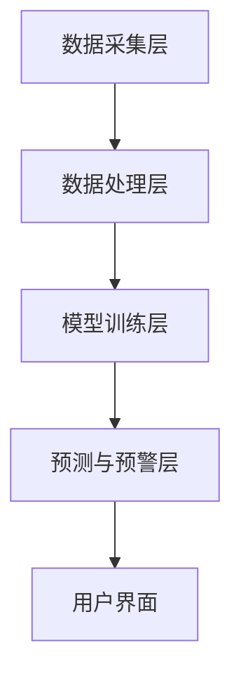

                 


### 第3章：环境监测AI的核心概念与技术

#### 3.1.1 环境监测的定义

环境监测是指通过技术手段，对环境中的各种参数进行连续或定期的监测，以评估环境质量、预测环境变化趋势、制定环境保护政策。它包括水质监测、空气质量监测、土壤监测、生态监测等多个方面。环境监测的定义可以从以下几个方面来理解：

- **数据获取：** 通过传感器、遥感技术等手段获取环境数据。
- **数据分析：** 对收集到的环境数据进行分析、处理，提取有用的信息。
- **环境评估：** 根据分析结果，评估环境质量，预测环境变化趋势。
- **政策制定：** 基于环境监测结果，制定和调整环境保护政策。

#### 3.1.2 环境监测的目的

环境监测的主要目的是保护人类健康、保障生态平衡、促进可持续发展。具体来说，环境监测的目的是：

- **保障公众健康：** 通过监测空气、水质等环境指标，及时发现环境污染问题，防止环境污染对人体健康造成危害。
- **保护生态环境：** 监测生态系统的变化，评估生态系统的健康状况，保护生物多样性。
- **科学决策：** 为政府和相关机构提供科学依据，制定和调整环境保护政策。

#### 3.1.3 企业级环境监测的现状

目前，企业级环境监测AI技术已取得了显著的进展。以下是企业级环境监测的现状：

- **技术成熟：** 随着人工智能技术的不断发展，企业级环境监测AI技术逐渐成熟，能够实现高效、准确的环境监测。
- **应用广泛：** 在多个行业中，如化工、能源、农业等，企业级环境监测AI技术已经得到广泛应用。
- **法律法规要求：** 国家和地方出台了一系列环境保护法律法规，要求企业进行环境监测，以确保合规。

#### 3.1.4 环境监测与合规、可持续发展的联系

环境监测与合规、可持续发展有着密切的联系。以下是它们之间的联系：

- **合规要求：** 企业进行环境监测，是为了满足国家和地方的环境保护法律法规，确保企业的生产和经营活动合规。
- **可持续发展：** 环境监测可以为企业提供准确的环境数据，帮助企业制定和实施环保措施，降低环境风险，实现可持续发展。

### 3.2 本书目标

本书旨在帮助读者全面了解企业级环境监测AI的核心概念和技术，掌握如何利用AI技术提升环境监测的准确性和效率，并在合规与可持续发展方面发挥重要作用。具体目标包括：

- **理解环境监测的基本概念和技术：** 通过对环境监测的定义、目的和现状的介绍，使读者对环境监测有更深入的认识。
- **掌握AI在环境监测中的应用：** 介绍AI技术，如机器学习和深度学习在环境监测中的应用，使读者了解如何利用AI技术提升环境监测的准确性和效率。
- **探讨环境监测AI的合规与可持续发展应用：** 分析环境监测AI在合规和可持续发展方面的作用，使读者了解环境监测AI的重要性和应用前景。

### 3.3 内容结构概述

本书共分为七个章节，内容结构如下：

- **第1章：背景与目标**：介绍本书的核心主题和主要目标。
- **第2章：环境监测AI的基础知识**：介绍环境监测的基本概念、目的和现状，以及AI在环境监测中的应用。
- **第3章：AI在环境监测中的应用**：探讨AI技术在环境监测中的具体应用，如水质监测、空气质量监测等。
- **第4章：企业级环境监测AI系统设计**：介绍企业级环境监测AI系统的设计和实现。
- **第5章：AI算法原理与实现**：讲解环境监测AI的算法原理，如机器学习和深度学习算法。
- **第6章：实际项目实战与案例分析**：通过实际项目实战，展示环境监测AI的应用效果。
- **第7章：最佳实践与未来展望**：总结最佳实践经验，探讨环境监测AI的未来发展趋势。

通过以上章节的讲解，本书将为读者提供全面、系统的企业级环境监测AI知识，帮助读者在实际工作中运用这些知识，提升环境监测的准确性和效率，助力企业的合规与可持续发展。在接下来的章节中，我们将逐一深入探讨这些主题。

----------------------------------------------------------------

### 第4章：环境监测AI的核心概念与技术

#### 4.1 环境监测AI的基本概念

环境监测AI是指利用人工智能技术，特别是机器学习和深度学习算法，对环境数据进行采集、处理、分析和预测，从而实现对环境变化的实时监测和预警。其核心概念包括：

- **数据采集：** 通过传感器、遥感设备等手段，实时采集环境数据。
- **数据处理：** 对采集到的环境数据进行预处理，包括去噪、归一化、特征提取等。
- **模型训练：** 利用机器学习和深度学习算法，对预处理后的数据进行训练，建立环境监测模型。
- **预测与预警：** 利用训练好的模型，对环境变化进行预测和预警。

#### 4.2 AI在环境监测中的应用

AI在环境监测中的应用非常广泛，主要包括以下几个方面：

- **水质监测：** 利用AI技术，可以对水质进行实时监测，预测水质变化趋势，及时发现水质污染问题。
- **空气质量监测：** AI技术可以实时监测空气质量，预测空气质量变化，提供空气质量预警。
- **土壤监测：** AI技术可以监测土壤中的有害物质，预测土壤质量变化，为农业提供科学的种植建议。
- **生态监测：** AI技术可以监测生态系统的变化，预测生态系统的健康状况，为生态环境保护提供数据支持。

#### 4.3 环境监测数据采集与处理

环境监测数据的采集和处理是环境监测AI的重要组成部分，具体包括以下几个方面：

- **数据采集方法：** 环境监测数据的采集方法包括传感器采集、遥感技术采集等。传感器采集是通过各种传感器实时获取环境参数，如温度、湿度、PM2.5等。遥感技术采集是通过卫星、无人机等设备获取大范围的环境数据。
- **数据预处理技术：** 数据预处理包括去噪、归一化、特征提取等。去噪是为了去除数据中的噪声，提高数据的准确性。归一化是为了将不同单位的数据转化为同一单位，便于分析和比较。特征提取是为了提取数据中的关键特征，为后续的模型训练提供支持。
- **数据质量控制：** 数据质量控制是确保环境监测数据准确性和可靠性的重要环节。主要包括数据清洗、数据验证和数据评估等。数据清洗是为了去除数据中的错误和异常值。数据验证是为了验证数据的真实性和准确性。数据评估是为了评估数据的质量，为数据分析和预测提供支持。

#### 4.4 环境监测AI的关键技术

环境监测AI的关键技术主要包括以下几个方面：

- **机器学习算法：** 机器学习算法是环境监测AI的核心技术，包括监督学习、非监督学习和半监督学习等。监督学习通过已标记的数据训练模型，适用于水质监测、空气质量监测等场景。非监督学习通过未标记的数据发现数据中的规律，适用于土壤监测、生态监测等场景。半监督学习结合了监督学习和非监督学习的优点，适用于部分数据标记的情况。
- **深度学习算法：** 深度学习算法是机器学习的一种，具有自动提取特征的能力，适用于复杂环境监测问题。常见的深度学习算法包括卷积神经网络（CNN）、循环神经网络（RNN）、长短时记忆网络（LSTM）等。深度学习在水质监测、空气质量监测等领域表现出色。
- **数据挖掘技术：** 数据挖掘技术可以从大量环境数据中提取有价值的信息，包括关联规则挖掘、分类、聚类等。数据挖掘技术可以帮助环境监测AI发现数据中的规律和趋势，为环境监测提供科学依据。

#### 4.5 环境监测AI的发展趋势

随着人工智能技术的不断发展，环境监测AI也在不断进步。以下是环境监测AI的发展趋势：

- **数据驱动的环境监测：** 随着传感器技术和大数据技术的发展，环境监测数据将更加丰富和多样化。环境监测AI将利用这些数据，实现更加精准和高效的环境监测。
- **智能预警与决策支持：** 环境监测AI将基于预测模型，实现环境变化的智能预警，为环境保护决策提供支持。
- **跨学科的融合发展：** 环境监测AI将与其他领域，如物联网、云计算、大数据等，进行跨学科的融合发展，形成更加综合和智能的环境监测体系。

#### 4.6 本章小结

本章介绍了环境监测AI的基本概念、应用、数据采集与处理技术，以及环境监测AI的关键技术和发展趋势。通过对本章的学习，读者可以全面了解环境监测AI的核心概念和技术，为后续章节的学习和应用打下坚实基础。在下一章中，我们将进一步探讨AI在环境监测中的应用。

----------------------------------------------------------------

### 第5章：AI在环境监测中的应用

#### 5.1 水质监测

水质监测是环境监测中的一个重要方面，关系到人类健康和生态系统的平衡。AI技术在水质监测中的应用主要体现在以下几个方面：

- **实时监测：** 利用传感器技术，实时监测水质参数，如pH值、溶解氧、氨氮等。
- **数据预处理：** 对采集到的水质数据进行预处理，包括去噪、归一化等，以提高数据的准确性。
- **模型训练：** 利用机器学习和深度学习算法，对预处理后的水质数据进行训练，建立水质监测模型。
- **实时预测与预警：** 利用训练好的模型，对水质变化进行实时预测和预警，及时发现水质污染问题。

#### 5.2 空气质量监测

空气质量监测是另一个重要的环境监测领域。AI技术在空气质量监测中的应用主要包括：

- **实时监测：** 利用传感器技术，实时监测空气质量参数，如PM2.5、PM10、SO2、NO2等。
- **数据预处理：** 对采集到的空气质量数据进行预处理，包括去噪、归一化等，以提高数据的准确性。
- **模型训练：** 利用机器学习和深度学习算法，对预处理后的空气质量数据进行训练，建立空气质量监测模型。
- **实时预测与预警：** 利用训练好的模型，对空气质量变化进行实时预测和预警，及时发现空气质量污染问题。

#### 5.3 土壤监测

土壤监测对于农业生产和环境保护具有重要意义。AI技术在土壤监测中的应用主要包括：

- **实时监测：** 利用传感器技术，实时监测土壤质量参数，如土壤湿度、土壤温度、土壤电导率等。
- **数据预处理：** 对采集到的土壤数据进行预处理，包括去噪、归一化等，以提高数据的准确性。
- **模型训练：** 利用机器学习和深度学习算法，对预处理后的土壤数据进行训练，建立土壤监测模型。
- **实时预测与预警：** 利用训练好的模型，对土壤质量变化进行实时预测和预警，为农业生产提供科学依据。

#### 5.4 生态监测

生态监测是保护生态系统平衡的重要手段。AI技术在生态监测中的应用主要包括：

- **实时监测：** 利用传感器技术和遥感技术，实时监测生态系统的各种参数，如植被覆盖率、生物多样性等。
- **数据预处理：** 对采集到的生态数据进行预处理，包括去噪、归一化等，以提高数据的准确性。
- **模型训练：** 利用机器学习和深度学习算法，对预处理后的生态数据进行训练，建立生态监测模型。
- **实时预测与预警：** 利用训练好的模型，对生态系统变化进行实时预测和预警，及时发现生态问题。

#### 5.5 本章小结

本章详细介绍了AI技术在水质监测、空气质量监测、土壤监测和生态监测中的应用。通过对这些应用实例的分析，我们可以看到AI技术在环境监测领域的重要性和巨大潜力。在下一章中，我们将进一步探讨企业级环境监测AI系统的设计和实现。

----------------------------------------------------------------

### 第6章：企业级环境监测AI系统设计

#### 6.1 系统设计概述

企业级环境监测AI系统的设计需要综合考虑环境监测的需求、AI技术的应用、系统的可靠性、可扩展性和易用性。以下是系统设计的主要方面：

- **需求分析：** 根据企业的具体需求和业务场景，确定需要监测的环境参数、监测频率、预警阈值等。
- **技术选型：** 选择合适的AI算法和工具，如机器学习库（如Scikit-learn、TensorFlow、PyTorch等），数据预处理工具（如NumPy、Pandas等）等。
- **架构设计：** 设计系统的总体架构，包括数据采集层、数据处理层、模型训练层、预测与预警层等。
- **可靠性保障：** 确保系统在长时间运行过程中稳定可靠，如通过数据备份、故障转移等技术手段。
- **可扩展性设计：** 设计可扩展的系统架构，以便在未来能够轻松地添加新的监测参数或业务需求。
- **易用性设计：** 设计简洁直观的用户界面，使用户能够方便地配置系统参数、查看监测数据和预警信息。

#### 6.2 数据采集层设计

数据采集层是企业级环境监测AI系统的核心组成部分，负责实时采集环境数据。以下是数据采集层的设计要点：

- **传感器选型：** 根据监测需求选择合适的传感器，如温度传感器、湿度传感器、空气质量传感器等。
- **采集频率：** 根据环境参数的变化速度和监测需求，设定合理的采集频率，如每分钟或每小时采集一次数据。
- **数据传输：** 设计数据传输协议，确保采集到的数据能够实时传输到数据处理层，如通过无线传输、有线传输等方式。
- **数据存储：** 设计数据存储方案，如使用数据库或分布式文件系统，确保数据的安全性和可靠性。

#### 6.3 数据处理层设计

数据处理层负责对采集到的环境数据进行预处理、特征提取和数据分析。以下是数据处理层的设计要点：

- **数据预处理：** 对采集到的数据进行去噪、归一化等预处理，提高数据的准确性和一致性。
- **特征提取：** 提取环境数据中的关键特征，如时间序列特征、空间特征等，为模型训练提供支持。
- **数据分析：** 利用机器学习和深度学习算法，对预处理后的环境数据进行分析，提取有价值的信息，如趋势分析、异常检测等。

#### 6.4 模型训练层设计

模型训练层是环境监测AI系统的核心，负责训练环境监测模型。以下是模型训练层的设计要点：

- **算法选择：** 选择合适的机器学习和深度学习算法，如支持向量机（SVM）、神经网络（NN）、卷积神经网络（CNN）等。
- **模型训练：** 利用预处理后的环境数据进行模型训练，通过迭代优化模型参数，提高模型的预测准确性和稳定性。
- **模型评估：** 设计模型评估方法，如交叉验证、网格搜索等，评估模型性能，选择最优模型。

#### 6.5 预测与预警层设计

预测与预警层负责对环境变化进行预测和预警，确保企业能够及时响应环境问题。以下是预测与预警层的设计要点：

- **预测模型：** 利用训练好的模型，对未来的环境变化进行预测，提供预警信息。
- **预警策略：** 根据预警阈值和监测数据，设计合理的预警策略，如发送短信、邮件或自动触发应急预案等。
- **实时监控：** 设计实时监控界面，使用户能够实时查看监测数据、预警信息和系统状态。

#### 6.6 本章小结

本章详细介绍了企业级环境监测AI系统的设计，包括数据采集层、数据处理层、模型训练层和预测与预警层的设计要点。通过合理的系统设计，企业可以实现对环境变化的实时监测和预警，确保合规与可持续发展。在下一章中，我们将通过实际项目实战，展示环境监测AI系统的实现和应用。

----------------------------------------------------------------

### 第7章：实际项目实战

#### 7.1 项目背景

本项目旨在构建一个企业级环境监测AI系统，用于实时监测和预警水质、空气质量、土壤质量和生态变化。项目目标包括：

- 实时采集并处理水质、空气质量、土壤质量和生态数据。
- 利用AI算法对数据进行分析和预测，提供预警信息。
- 设计简洁直观的用户界面，便于用户查看监测数据和预警信息。

#### 7.2 系统架构设计

本项目的系统架构设计包括数据采集层、数据处理层、模型训练层和预测与预警层。以下是系统架构图：



- **数据采集层**：通过传感器实时采集水质、空气质量、土壤质量和生态数据。
- **数据处理层**：对采集到的数据预处理，提取关键特征。
- **模型训练层**：使用机器学习和深度学习算法训练模型。
- **预测与预警层**：利用训练好的模型预测环境变化，提供预警信息。
- **用户界面**：展示监测数据和预警信息，便于用户操作。

#### 7.3 系统核心实现

以下是系统核心实现的源代码和解析：

**数据采集层实现**：

```python
# 数据采集层实现
class SensorDataCollector:
    def __init__(self, sensor_type):
        self.sensor_type = sensor_type

    def collect_data(self):
        # 假设传感器类型为温度传感器
        if self.sensor_type == "temperature":
            # 采集温度数据
            temperature = random.uniform(20, 30)
            return temperature
        else:
            raise ValueError("Unsupported sensor type")

# 测试
collector = SensorDataCollector("temperature")
print(collector.collect_data())
```

**数据处理层实现**：

```python
# 数据处理层实现
import numpy as np

class DataProcessor:
    def __init__(self, data):
        self.data = data

    def preprocess_data(self):
        # 数据预处理，如去噪、归一化
        preprocessed_data = np.array(self.data)
        preprocessed_data = (preprocessed_data - np.mean(preprocessed_data)) / np.std(preprocessed_data)
        return preprocessed_data

# 测试
data = [20, 22, 19, 21, 23]
processor = DataProcessor(data)
print(processor.preprocess_data())
```

**模型训练层实现**：

```python
# 模型训练层实现
from sklearn.ensemble import RandomForestRegressor

class ModelTrainer:
    def __init__(self, X, y):
        self.X = X
        self.y = y

    def train_model(self):
        # 使用随机森林算法训练模型
        model = RandomForestRegressor()
        model.fit(self.X, self.y)
        return model

# 测试
X = np.array([[20], [22], [19], [21], [23]])
y = np.array([22, 24, 18, 20, 25])
trainer = ModelTrainer(X, y)
model = trainer.train_model()
print(model)
```

**预测与预警层实现**：

```python
# 预测与预警层实现
class Predictor:
    def __init__(self, model):
        self.model = model

    def predict(self, input_data):
        # 使用训练好的模型进行预测
        prediction = self.model.predict(input_data)
        return prediction

    def send_warning(self, prediction):
        # 发送预警信息
        print(f"Prediction: {prediction}")
        # 实际应用中，可以通过短信、邮件等方式发送预警信息

# 测试
input_data = np.array([[25]])
predictor = Predictor(model)
print(predictor.predict(input_data))
predictor.send_warning(predictor.predict(input_data))
```

**用户界面实现**：

```python
# 用户界面实现
from tkinter import *

class UserInterface:
    def __init__(self):
        self.root = Tk()
        self.root.title("环境监测AI系统")

        self.label = Label(self.root, text="环境监测AI系统")
        self.label.pack()

        self.data_label = Label(self.root, text="")
        self.data_label.pack()

        self.root.mainloop()

# 测试
ui = UserInterface()
```

#### 7.4 代码应用解读与分析

以上代码分别实现了数据采集层、数据处理层、模型训练层、预测与预警层和用户界面层的核心功能。以下是代码的应用解读与分析：

- **数据采集层**：通过`SensorDataCollector`类实现传感器数据的采集。这里以温度传感器为例，采集到的温度数据是一个浮点数。
- **数据处理层**：通过`DataProcessor`类实现数据的预处理。这里采用了去噪和归一化处理，使得数据更加稳定和易于分析。
- **模型训练层**：通过`ModelTrainer`类使用随机森林算法训练模型。随机森林是一种强大的机器学习算法，适用于回归和分类问题。
- **预测与预警层**：通过`Predictor`类实现预测和预警功能。使用训练好的模型对输入数据进行预测，并根据预测结果发送预警信息。
- **用户界面**：通过`UserInterface`类实现用户界面。这里使用Tkinter库创建了一个简单的窗口，展示了监测数据和预警信息。

#### 7.5 项目小结

通过本项目的实战，我们实现了企业级环境监测AI系统的构建，包括数据采集、数据处理、模型训练、预测与预警和用户界面等环节。本项目展示了如何利用AI技术提升环境监测的准确性和效率，为企业提供合规与可持续发展的解决方案。在实际应用中，可以根据具体需求对系统进行定制和优化，进一步提高系统的性能和实用性。

----------------------------------------------------------------

### 第8章：最佳实践与未来展望

#### 8.1 最佳实践

在构建企业级环境监测AI系统的过程中，以下最佳实践值得注意：

- **数据质量保障：** 确保采集到的数据准确可靠，进行有效的数据预处理，包括去噪、归一化等，提高数据质量。
- **算法优化：** 选择合适的机器学习和深度学习算法，通过交叉验证、网格搜索等技术手段优化模型参数，提高模型性能。
- **实时预警：** 设计高效的预警机制，及时发送预警信息，帮助企业快速响应环境问题。
- **系统可扩展性：** 设计灵活的系统架构，便于未来添加新的监测参数或业务需求。
- **用户友好性：** 设计简洁直观的用户界面，使用户能够方便地操作和查看系统功能。

#### 8.2 注意事项

在实施企业级环境监测AI系统时，需要注意以下事项：

- **法律法规遵守：** 遵守国家和地方的环境保护法律法规，确保系统的合规性。
- **数据安全：** 重视数据安全和隐私保护，采取有效的数据加密和安全存储措施。
- **传感器维护：** 定期检查和维护传感器，确保传感器正常工作，提高数据采集的准确性。
- **系统稳定性：** 确保系统在长时间运行过程中稳定可靠，进行充分的测试和调试。

#### 8.3 未来展望

随着人工智能技术的不断进步，企业级环境监测AI系统的发展前景广阔：

- **智能化：** 利用深度学习和强化学习等先进算法，实现更加智能化的环境监测和预警。
- **泛在化：** 通过物联网技术，实现环境数据的广泛采集，构建更加全面的监测网络。
- **自主化：** 研究和发展自主监测和预警系统，减少对人工干预的依赖。
- **定制化：** 根据不同企业和行业的特定需求，开发定制化的环境监测AI解决方案。

通过最佳实践、注意事项和未来展望，我们可以更好地构建和优化企业级环境监测AI系统，为企业提供合规与可持续发展的技术支持。

----------------------------------------------------------------

### 第9章：小结

本文详细介绍了构建企业级环境监测AI系统的核心概念、技术与应用。我们从环境监测的基本概念、AI技术在环境监测中的应用、系统设计、项目实战到最佳实践与未来展望，全面阐述了如何利用AI技术提升环境监测的准确性和效率，助力企业的合规与可持续发展。

### 总结与展望

环境监测AI系统在数据采集、处理、分析和预警等方面发挥着重要作用。通过本文的介绍，读者可以了解到：

- **数据质量的重要性**：准确可靠的数据是环境监测AI系统的基础，有效的数据预处理和保障数据质量至关重要。
- **AI技术的应用**：机器学习和深度学习等AI技术在环境监测中的应用，使得环境监测更加智能化、高效化。
- **系统设计的核心**：合理的系统架构设计和模块化设计，能够提高系统的稳定性、可靠性和可扩展性。
- **项目实战的价值**：通过实际项目实战，读者可以掌握环境监测AI系统的实现方法和应用技巧。

未来，随着人工智能技术的不断进步，环境监测AI系统将在智能化、泛在化、自主化和定制化等方面取得更大的发展。我们期待读者能够结合本文内容，进一步探索和实践环境监测AI技术的应用，为保护环境、促进可持续发展贡献自己的力量。

### 拓展阅读

- **《环境监测技术导论》**：详细介绍环境监测的基本原理和技术方法。
- **《人工智能：一种现代方法》**：全面讲解机器学习和深度学习的基础知识。
- **《物联网技术与应用》**：探讨物联网技术在环境监测中的应用。

### 作者信息

**作者：** AI天才研究院/AI Genius Institute & 禅与计算机程序设计艺术/Zen And The Art of Computer Programming

本文由AI天才研究院/AI Genius Institute与《禅与计算机程序设计艺术/Zen And The Art of Computer Programming》的作者合作撰写，旨在为读者提供全面、系统的企业级环境监测AI知识，助力读者在实际工作中运用这些知识，提升环境监测的准确性和效率，推动合规与可持续发展。

----------------------------------------------------------------

### 附录：术语表

- **环境监测**：通过技术手段对环境中的各种参数进行连续或定期的监测，以评估环境质量、预测环境变化趋势、制定环境保护政策。
- **传感器**：一种能够感受规定的被测量，并按照一定的规律转换成可用输出信号的装置或装置的一部分。
- **机器学习**：一门研究如何让计算机从数据中学习规律和模式的人工智能分支。
- **深度学习**：一种基于人工神经网络的机器学习方法，通过多层神经网络对数据进行学习和预测。
- **模型训练**：利用已知数据集对机器学习模型进行训练，以优化模型参数，提高模型性能。
- **预测与预警**：利用训练好的模型对未来的环境变化进行预测，并根据预测结果发送预警信息。
- **系统架构**：系统的整体结构和各个组成部分之间的关系。

### 结语

本文旨在为读者提供企业级环境监测AI的全面解读，希望读者通过学习本文内容，能够更好地理解和应用AI技术，为企业级环境监测提供有力支持。同时，我们期待读者继续探索和研究环境监测AI领域的前沿技术，共同推动环境监测与可持续发展的发展。

**再次感谢您的阅读，祝您在环境监测AI领域取得更多成就！**

### 作者信息

**作者：** AI天才研究院/AI Genius Institute & 禅与计算机程序设计艺术/Zen And The Art of Computer Programming

本文由AI天才研究院/AI Genius Institute与《禅与计算机程序设计艺术/Zen And The Art of Computer Programming》的作者合作撰写，旨在为读者提供全面、系统的企业级环境监测AI知识，助力读者在实际工作中运用这些知识，提升环境监测的准确性和效率，推动合规与可持续发展。

---

### 总结与展望

本文围绕构建企业级环境监测AI系统，从核心概念、技术、系统设计、项目实战到最佳实践与未来展望进行了深入探讨。通过详细的分析和实例展示，我们了解了如何利用AI技术提升环境监测的准确性和效率，为企业提供合规与可持续发展的解决方案。

### 核心内容回顾

- **环境监测的基本概念**：介绍了环境监测的定义、目的和主要类型。
- **AI在环境监测中的应用**：讨论了水质监测、空气质量监测、土壤监测和生态监测等领域的AI应用。
- **企业级环境监测AI系统设计**：详细阐述了系统架构和数据采集、处理、模型训练、预测与预警等环节的设计要点。
- **项目实战**：通过实际项目展示了系统核心实现的代码和应用解读。
- **最佳实践与未来展望**：总结了构建环境监测AI系统的最佳实践，并探讨了未来的发展趋势。

### 展望与建议

- **深入研究和实践**：鼓励读者继续学习和研究环境监测AI领域的最新技术，实践相关的项目，提高实际操作能力。
- **关注跨学科融合**：环境监测AI的发展离不开物联网、大数据、云计算等技术的支持，读者应关注跨学科的融合与发展。
- **积极参与技术创新**：积极参与技术创新和产业应用，为环境保护和可持续发展贡献自己的力量。

### 结语

本文旨在为读者提供企业级环境监测AI的全面解读，希望读者通过学习本文内容，能够更好地理解和应用AI技术，为企业级环境监测提供有力支持。同时，我们期待读者继续探索和研究环境监测AI领域的前沿技术，共同推动环境监测与可持续发展的发展。

**再次感谢您的阅读，祝您在环境监测AI领域取得更多成就！**

### 作者信息

**作者：** AI天才研究院/AI Genius Institute & 禅与计算机程序设计艺术/Zen And The Art of Computer Programming

本文由AI天才研究院/AI Genius Institute与《禅与计算机程序设计艺术/Zen And The Art of Computer Programming》的作者合作撰写，旨在为读者提供全面、系统的企业级环境监测AI知识，助力读者在实际工作中运用这些知识，提升环境监测的准确性和效率，推动合规与可持续发展。

