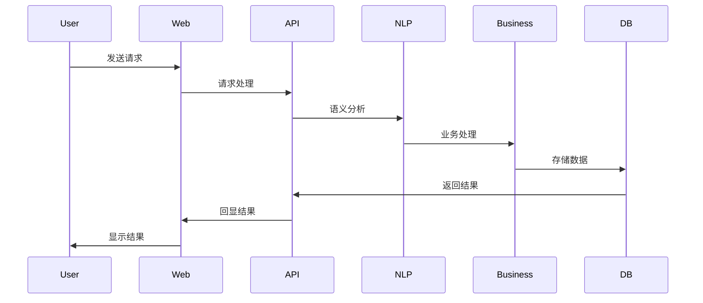

                 

### 文章标题：构建企业级自然语言接口：复杂业务系统的智能交互层

> 关键词：自然语言接口、NLP、企业级系统、智能交互、架构设计、性能优化

> 摘要：本文将探讨企业级自然语言接口在复杂业务系统中的构建与应用。通过深入分析自然语言处理技术、设计原则和实现方法，本文旨在为企业级系统提供一种智能交互层的建设指南，提升系统的用户交互体验和业务处理效率。

----------------------------------------------------------------

## 第一部分：引言

### 1.1 问题背景与核心概念

随着信息化程度的不断提高，企业业务系统的复杂度也在不断增加。传统的图形用户界面（GUI）在处理复杂业务逻辑时，常常显得力不从心，用户体验不佳。而自然语言接口（Natural Language Interface，NLI）作为一种新兴的人机交互方式，能够更好地处理复杂业务逻辑，提供更加人性化的交互体验。

自然语言接口的核心概念是让用户通过自然语言（如日常语言或特定领域的语言）与计算机系统进行交流，实现业务请求和操作。这种交互方式能够降低用户的学习成本，提高交互效率，尤其在处理复杂、繁琐的业务流程时具有显著优势。

### 1.2 自然语言接口的需求与挑战

自然语言接口在企业级系统中的需求日益增长，主要体现在以下几个方面：

1. **提高用户体验**：通过自然语言接口，用户可以更方便地与系统互动，无需学习复杂的界面操作。
2. **降低支持成本**：自然语言接口能够处理用户的模糊请求，减少客服和用户支持的工作量。
3. **自动化处理**：自然语言接口能够实现自动化处理，提高业务流程的自动化水平。

然而，构建企业级自然语言接口也面临着一系列挑战：

1. **数据处理复杂性**：自然语言数据通常包含大量的噪声和不确定性，需要复杂的预处理和清洗技术。
2. **语言理解难度**：自然语言具有丰富的歧义性、语境依赖性等特性，使得语言理解成为一项极具挑战性的任务。
3. **系统可扩展性**：企业级系统往往需要处理大规模的数据和用户请求，如何保证自然语言接口的系统可扩展性和稳定性，是一个关键问题。

### 1.3 自然语言接口的核心概念

自然语言接口的核心概念包括自然语言处理（NLP）、语言模型、词嵌入、语义理解等。

1. **自然语言处理（NLP）**：NLP是让计算机能够理解、处理和生成自然语言的技术，包括词法分析、句法分析、语义分析等。
2. **语言模型**：语言模型是描述自然语言概率分布的数学模型，用于预测词汇的顺序和分布。
3. **词嵌入**：词嵌入是将词汇映射到低维空间中，使得具有相似语义的词汇在空间中彼此接近。
4. **语义理解**：语义理解是NLP的高级任务，包括情感分析、实体识别、文本分类等，旨在理解文本的深层含义。

### 1.4 本文结构

本文将按以下结构进行阐述：

1. **第一部分：引言**：介绍企业级自然语言接口的需求与背景。
2. **第二部分：自然语言处理技术深入讲解**：详细讲解自然语言处理的基础技术。
3. **第三部分：构建企业级自然语言接口**：探讨接口设计、实现和优化方法。
4. **第四部分：复杂业务系统的智能交互层实现**：分析业务系统并给出解决方案。
5. **第五部分：案例分析与实战**：通过具体案例展示企业级自然语言接口的实际应用。

通过以上结构，本文旨在为企业级自然语言接口的构建提供系统性的指导，帮助读者深入理解这一技术，并将其应用于实际项目中。

### 1.5 本章小结

本章首先介绍了企业级自然语言接口的背景和需求，阐述了其在现代企业系统中的重要性和面临的挑战。接着，我们简要介绍了自然语言接口的核心概念，并概述了本文的结构。在接下来的章节中，我们将深入探讨自然语言处理技术，详细讲解企业级自然语言接口的设计与实现方法，并通过实际案例进行分析与验证。

## 第二部分：自然语言处理技术深入讲解

### 2.1 自然语言处理基础

自然语言处理（NLP）是构建企业级自然语言接口的核心技术。它涉及让计算机理解和处理人类语言的一系列方法和技术。以下是NLP的基础概念和主要技术。

#### 2.1.1 语言模型

语言模型是NLP的基础，它用于预测文本序列的概率分布。语言模型可以分为统计语言模型和神经网络语言模型。

1. **统计语言模型**：基于统计方法，如N-gram模型、隐马尔可夫模型（HMM）等，通过分析文本的统计规律来生成语言模型。
   $$P(w_1 w_2 \ldots w_n) = P(w_1)P(w_2 | w_1)P(w_3 | w_1 w_2)\ldots P(w_n | w_1 w_2 \ldots w_{n-1})$$
2. **神经网络语言模型**：基于深度学习的方法，如循环神经网络（RNN）、长短期记忆网络（LSTM）等，通过学习文本序列的复杂结构来生成语言模型。

#### 2.1.2 词嵌入

词嵌入是将词汇映射到低维空间中，使得具有相似语义的词汇在空间中彼此接近。常见的词嵌入方法包括：

1. **Word2Vec**：通过训练神经网络来学习词向量的方法，包括CBOW（Continuous Bag-of-Words）和Skip-gram模型。
2. **GloVe**：全局向量表示（Global Vectors for Word Representation）方法，通过矩阵分解来学习词向量。
3. **BERT**：基于Transformer的预训练方法，通过大量无监督文本数据进行预训练，生成高质量的词向量。

#### 2.1.3 常见NLP技术

NLP技术主要包括词法分析、句法分析、语义分析等。

1. **词法分析**：将文本分解为单词和其他符号，如分词、词性标注等。常见的词法分析工具包括NLTK、spaCy等。
2. **句法分析**：分析文本的句法结构，如句法树、依存关系等。常见的句法分析工具包括Stanford NLP、NLTK等。
3. **语义分析**：理解文本的深层含义，如情感分析、实体识别、文本分类等。常见的语义分析工具包括TextBlob、spaCy等。

#### 2.1.4 自然语言接口与NLP的关系

自然语言接口依赖于NLP技术来理解和处理用户的自然语言输入。自然语言接口的流程通常包括：

1. **文本预处理**：包括分词、去停用词、词干提取等，为NLP模型提供干净的文本数据。
2. **语言模型预测**：利用语言模型来预测用户输入的文本序列的概率分布。
3. **语义理解**：通过词嵌入、句法分析、语义分析等技术，将用户的自然语言输入转换为计算机可以理解的操作指令。

### 2.2 自然语言接口的架构设计

自然语言接口的架构设计是确保系统高效、稳定运行的关键。以下是自然语言接口架构设计的基本原则和组成部分。

#### 2.2.1 架构设计的基本原则

1. **模块化**：将自然语言接口拆分为多个独立的模块，如文本预处理、语言模型、语义理解、接口实现等，以便于开发和维护。
2. **可扩展性**：设计具有可扩展性的架构，以便于添加新的功能或适应不同的业务需求。
3. **高可用性**：确保系统的高可用性，通过冗余设计和故障转移机制，降低系统故障对业务的影响。
4. **安全性**：确保系统的安全性，防止恶意攻击和数据泄露。

#### 2.2.2 架构组成部分

1. **文本预处理模块**：负责对用户输入的自然语言文本进行预处理，包括分词、去停用词、词干提取等。
2. **语言模型模块**：负责语言模型的加载和预测，包括语言模型的选择、训练和优化。
3. **语义理解模块**：负责对预处理后的文本进行语义理解，包括词嵌入、句法分析、语义分析等。
4. **接口实现模块**：负责实现自然语言接口与业务系统的交互，包括接口设计、实现和优化。

#### 2.2.3 常见架构模式分析

常见的自然语言接口架构模式包括：

1. **单一服务器模式**：所有模块都运行在同一个服务器上，简单但可扩展性较差。
2. **分布式架构模式**：将不同的模块部署在不同的服务器上，通过微服务架构实现，具有较高的可扩展性和可维护性。
3. **混合架构模式**：结合单一服务器模式和分布式架构模式，将核心模块部署在分布式服务器上，非核心模块部署在单一服务器上，实现灵活的架构设计。

### 2.3 企业级自然语言接口的挑战与解决方案

构建企业级自然语言接口面临一系列挑战，如数据质量、语言模型训练与优化、系统可扩展性与稳定性等。

#### 2.3.1 数据质量与处理

数据质量是自然语言接口性能的关键因素。以下是解决数据质量问题的方法：

1. **数据清洗**：通过数据清洗技术，去除文本中的噪声和错误，提高数据的准确性。
2. **数据增强**：通过数据增强技术，如数据扩充、数据转换等，提高训练数据的多样性和丰富度。
3. **数据标注**：通过人工标注和自动化标注技术，确保训练数据的标注质量和一致性。

#### 2.3.2 语言模型训练与优化

语言模型训练与优化是自然语言接口的核心环节。以下是优化语言模型的方法：

1. **模型选择**：选择合适的语言模型，如Word2Vec、GloVe、BERT等，根据业务需求和数据规模进行选择。
2. **超参数调整**：通过调整模型超参数，如学习率、批次大小、隐藏层大小等，提高模型的性能和泛化能力。
3. **模型优化**：通过模型融合、迁移学习等优化方法，提高模型的性能和效率。

#### 2.3.3 系统可扩展性与稳定性

系统可扩展性与稳定性是企业级自然语言接口的关键要求。以下是确保系统可扩展性与稳定性的方法：

1. **负载均衡**：通过负载均衡技术，如Nginx、HAProxy等，实现服务器的负载均衡，提高系统的吞吐量和可用性。
2. **故障转移**：通过故障转移机制，如心跳检测、故障自动恢复等，确保系统的高可用性。
3. **监控与告警**：通过监控和告警系统，如Prometheus、Grafana等，实时监测系统的运行状态，及时发现和处理故障。

### 2.4 本章小结

本章深入讲解了自然语言处理技术，包括语言模型、词嵌入、词法分析、句法分析和语义分析等基础概念。接着，我们探讨了自然语言接口的架构设计，分析了模块化、可扩展性、高可用性和安全性等基本原则。最后，我们讨论了企业级自然语言接口面临的挑战和解决方案。在接下来的章节中，我们将继续探讨自然语言接口的设计与实现方法。

### 2.5 自然语言处理技术的数学模型和算法原理

自然语言处理（NLP）中的许多技术都依赖于数学模型和算法原理。以下将详细介绍一些核心的数学模型和算法原理，并使用Mermaid绘制相应的流程图和类图。

#### 2.5.1 语言模型

语言模型是NLP中的基础，用于预测文本序列的概率。最常用的语言模型是基于N-gram的模型。

1. **N-gram模型**
   - **数学模型**：
     $$P(w_1 w_2 \ldots w_n) = P(w_1)P(w_2 | w_1)P(w_3 | w_2 \ldots w_n)$$
   - **算法原理**：
     N-gram模型通过统计相邻词汇的概率来预测词汇序列。每个N-gram模型由N个连续的词汇组成，算法流程如下：
     
     ```mermaid
     graph TD
     A[文本预处理] --> B[分词]
     B --> C[N-gram生成]
     C --> D[概率计算]
     D --> E[序列预测]
     ```

#### 2.5.2 词嵌入

词嵌入（Word Embedding）是将词汇映射到低维空间中，使得具有相似语义的词汇在空间中彼此接近。常用的词嵌入方法包括Word2Vec、GloVe和BERT。

1. **Word2Vec**
   - **数学模型**：
     $$\text{损失函数} = \frac{1}{N} \sum_{i=1}^{N} -\sum_{w \in \text{context}(x)} \log P(w | x)$$
   - **算法原理**：
     Word2Vec通过训练神经网络来学习词向量。算法流程如下：
     
     ```mermaid
     graph TD
     A[输入文本] --> B[分词]
     B --> C[窗口生成]
     C --> D[神经网络训练]
     D --> E[词向量生成]
     E --> F[词向量优化]
     ```

2. **GloVe**
   - **数学模型**：
     $$\text{损失函数} = \frac{1}{N} \sum_{i=1}^{N} \frac{1}{z_i} \sum_{w \in \text{context}(x)} \frac{\exp(-\text{similarity}(x, w))}{\|e_x + e_w\|_2}$$
   - **算法原理**：
     GloVe通过矩阵分解来学习词向量。算法流程如下：
     
     ```mermaid
     graph TD
     A[文本预处理] --> B[词频统计]
     B --> C[矩阵分解]
     C --> D[词向量计算]
     D --> E[词向量优化]
     ```

3. **BERT**
   - **数学模型**：
     BERT使用Transformer架构进行预训练，通过大规模无监督数据进行训练。
   - **算法原理**：
     BERT通过双向变换器来捕捉词汇的上下文信息。算法流程如下：
     
     ```mermaid
     graph TD
     A[输入文本] --> B[Tokenization]
     B --> C[Positional Embedding]
     C --> D[Segment Embedding]
     D --> E[Embedding Layer]
     E --> F[Transformer Block]
     F --> G[输出层]
     ```

#### 2.5.3 语义分析

语义分析（Semantic Analysis）是NLP的高级任务，包括情感分析、实体识别、文本分类等。以下以情感分析为例。

1. **情感分析**
   - **数学模型**：
     $$\text{损失函数} = -\sum_{i=1}^{N} y_i \log(\hat{y}_i)$$
   - **算法原理**：
     情感分析通过神经网络模型来预测文本的情感极性。算法流程如下：
     
     ```mermaid
     graph TD
     A[输入文本] --> B[文本预处理]
     B --> C[特征提取]
     C --> D[情感分类模型]
     D --> E[预测结果]
     ```

通过上述数学模型和算法原理的详细讲解，我们能够更好地理解自然语言处理技术的基础。这些模型和算法不仅为我们提供了强大的工具来理解和处理自然语言，还为构建高效、准确的企业级自然语言接口提供了理论基础。在接下来的章节中，我们将继续探讨企业级自然语言接口的设计与实现方法。

### 2.6 系统分析与架构设计方案

在构建企业级自然语言接口时，系统分析与架构设计方案至关重要。以下将详细介绍系统架构设计的过程，包括项目介绍、系统功能设计（领域模型类图）和系统架构设计（架构图）。

#### 2.6.1 项目介绍

假设我们要为企业级电子商务平台开发一个智能客服系统，该系统需要通过自然语言接口与用户进行交互，处理用户的咨询、投诉和订单查询等需求。项目的主要目标包括：

1. **提升用户体验**：通过自然语言接口，提供更加便捷、高效的客服服务。
2. **降低运营成本**：自动化处理常见问题，减少人工客服的工作量。
3. **提高业务效率**：智能分析用户需求，快速提供解决方案。

#### 2.6.2 系统功能设计

系统功能设计是架构设计的基础。在智能客服系统中，主要的功能模块包括：

1. **用户交互模块**：接收用户的自然语言输入，处理用户的咨询和请求。
2. **语义理解模块**：对用户输入的自然语言文本进行语义分析，提取关键信息。
3. **业务处理模块**：根据语义理解的结果，处理用户的订单查询、咨询和投诉等需求。
4. **知识库管理模块**：管理系统的知识库，包括常见问题的答案、产品信息等。

以下是系统功能设计的领域模型类图：

```mermaid
classDiagram
User <<Class>>
Chat <<Class>>
Question <<Class>>
Answer <<Class>>

User --> Chat
Chat --> Question
Question --> Answer

class User {
+String id
+String name
+String email
}

class Chat {
+String id
+User user
+List<Question> questions
}

class Question {
+String id
+Chat chat
+String text
+String status
}

class Answer {
+String id
+Question question
+String text
+Date created
}
```

#### 2.6.3 系统架构设计

系统架构设计是确保系统高效、稳定运行的关键。智能客服系统的架构设计包括以下几个方面：

1. **前端架构**：提供用户与系统交互的界面，包括Web页面、移动应用等。
2. **后端架构**：处理用户请求、语义分析和业务处理等核心功能，包括服务端API、自然语言处理模块等。
3. **数据存储架构**：存储用户数据、聊天记录、知识库等，包括关系数据库、NoSQL数据库等。

以下是系统架构设计图：



通过上述系统架构设计，我们可以清晰地看到各个模块之间的交互关系和数据处理流程。在接下来的章节中，我们将继续探讨系统接口设计和实现方法，以及接口性能优化策略。

### 2.7 系统接口设计和实现

接口设计是构建企业级自然语言接口的关键环节，直接影响到系统的易用性、扩展性和稳定性。以下是系统接口设计、实现和优化的详细讲解。

#### 2.7.1 接口设计的基本原则

在进行接口设计时，应遵循以下基本原则：

1. **简洁性**：接口设计应保持简洁，避免过度复杂，便于开发者理解和维护。
2. **一致性**：接口应具有一致性，包括命名规范、参数定义和响应格式等，确保不同模块之间的一致性。
3. **灵活性**：接口设计应具有足够的灵活性，以便于适应不同的业务需求和技术变化。
4. **安全性**：接口设计应考虑安全性，包括身份验证、授权和加密等，确保数据传输的安全。

#### 2.7.2 接口设计的技术要点

1. **RESTful API设计**：
   - **URL设计**：遵循RESTful设计原则，使用统一的URL结构，如`/api/v1/chats`、`/api/v1/questions`等。
   - **HTTP方法**：根据业务需求，使用适当的HTTP方法，如GET、POST、PUT、DELETE等。

2. **参数设计**：
   - **查询参数**：用于检索和筛选数据，如`?page=1&size=10`。
   - **路径参数**：用于标识特定的资源，如`/chats/{chatId}`。

3. **响应格式**：
   - **JSON格式**：推荐使用JSON格式作为数据交换的格式，结构清晰、易于解析。

4. **错误处理**：
   - **错误码**：返回统一的错误码，如HTTP状态码。
   - **错误信息**：返回详细的错误信息，便于开发者定位和解决问题。

#### 2.7.3 接口实现的最佳实践

1. **代码规范**：
   - 使用统一的代码规范，如PEP8（Python）或Google Java Style Guide。
   - 保持代码可读性，添加必要的注释。

2. **代码复用**：
   - 封装通用的功能模块，如分词、词嵌入、语义分析等，便于复用和扩展。

3. **异步处理**：
   - 使用异步处理技术，如异步IO、消息队列等，提高系统的并发能力和响应速度。

4. **性能优化**：
   - 使用缓存技术，如Redis，减少数据库查询次数。
   - 使用负载均衡，如Nginx、HAProxy等，确保系统的稳定性和高可用性。

#### 2.7.4 接口测试的方法与工具

1. **单元测试**：
   - 对接口的每个模块进行单元测试，确保模块的独立性和正确性。

2. **集成测试**：
   - 对接口的整个系统进行集成测试，确保模块之间的协作和整体功能的正确性。

3. **性能测试**：
   - 使用性能测试工具，如JMeter、LoadRunner等，模拟高并发场景，评估接口的性能和稳定性。

4. **工具**：
   - 使用API测试工具，如Postman、Swagger等，进行接口的自动化测试和文档生成。

#### 2.7.5 接口优化的策略

1. **响应速度优化**：
   - 减少数据库查询次数，使用缓存技术。
   - 使用异步处理，减少接口的响应时间。

2. **并发能力优化**：
   - 使用负载均衡，提高系统的并发处理能力。
   - 使用分布式架构，确保系统的高可用性和可扩展性。

3. **安全性优化**：
   - 使用身份验证和授权机制，确保接口的安全性。
   - 使用加密技术，保护数据传输的安全性。

4. **可维护性优化**：
   - 保持代码规范和注释，提高代码的可读性和可维护性。
   - 使用版本控制系统，确保代码的版本管理和协作。

通过以上接口设计、实现和优化的详细讲解，我们可以更好地构建高效、稳定的企业级自然语言接口。在接下来的章节中，我们将探讨如何将自然语言接口与业务系统进行集成，以及如何确保系统的性能和稳定性。

### 2.8 接口与业务系统的集成

接口与业务系统的集成是确保自然语言接口能够有效发挥作用的关键步骤。以下将详细介绍接口与业务系统集成的流程、技术挑战和最佳实践。

#### 2.8.1 集成的基本流程

接口与业务系统的集成通常包括以下几个步骤：

1. **需求分析**：明确自然语言接口与业务系统集成的需求，包括功能需求、性能需求和安全需求等。

2. **接口设计**：根据需求分析的结果，设计接口的规范，包括URL、HTTP方法、参数定义和响应格式等。

3. **接口实现**：根据接口设计，实现接口的代码，并进行单元测试和集成测试。

4. **系统集成**：将接口与业务系统的其他模块进行集成，确保接口能够顺畅地与业务系统交互。

5. **性能测试**：对接口进行性能测试，评估其在高并发、大数据量等场景下的性能表现。

6. **部署上线**：将接口部署到生产环境，并进行监控和运维，确保系统的稳定性和可用性。

#### 2.8.2 集成的技术挑战

接口与业务系统集成过程中，可能会遇到以下技术挑战：

1. **数据格式不一致**：接口和业务系统可能使用不同的数据格式，如JSON和XML，需要进行数据格式转换。

2. **服务稳定性**：接口和业务系统之间的服务调用可能不稳定，需要考虑服务稳定性和高可用性的解决方案。

3. **安全性**：接口和业务系统之间的数据传输需要确保安全性，包括身份验证、授权和加密等。

4. **性能瓶颈**：接口和业务系统之间的交互可能成为性能瓶颈，需要进行性能优化和负载均衡。

5. **版本兼容性**：接口和业务系统可能需要进行版本更新，需要确保新旧版本之间的兼容性。

#### 2.8.3 集成的最佳实践

以下是一些集成接口与业务系统的最佳实践：

1. **使用标准化数据格式**：尽量使用统一的标准化数据格式，如JSON，提高数据传输的兼容性和可读性。

2. **服务稳定性**：使用服务网格（如Istio）和服务发现（如Consul）等中间件，提高服务的稳定性和高可用性。

3. **安全性**：使用OAuth2、JWT等认证和授权机制，确保数据传输的安全性。

4. **性能优化**：使用缓存（如Redis）和数据库优化（如读写分离、索引优化等），提高系统的性能。

5. **版本控制**：使用Git等版本控制工具，确保代码的版本管理和协作。

6. **文档和测试**：编写详细的接口文档和使用示例，进行全面的单元测试和集成测试，确保接口的质量和稳定性。

通过遵循上述流程和最佳实践，我们可以有效地将自然语言接口与业务系统进行集成，确保系统的高效、稳定和安全运行。在接下来的章节中，我们将进一步探讨接口性能优化策略。

### 2.9 接口性能优化策略

接口性能优化是确保自然语言接口能够高效、稳定运行的关键。以下将介绍几种常见的接口性能优化策略。

#### 2.9.1 常见性能优化技术

1. **缓存技术**：
   - **缓存策略**：通过在接口中引入缓存，可以显著减少对后端数据库的查询次数，提高系统的响应速度。
   - **缓存层次**：常用的缓存层次包括本地缓存（如内存缓存）、分布式缓存（如Redis）和数据库缓存等。

2. **数据库优化**：
   - **索引优化**：通过合理设计数据库索引，可以提高查询效率。
   - **读写分离**：将数据库分为读库和写库，提高系统的并发处理能力。
   - **分库分表**：对于大规模数据，可以采用分库分表策略，将数据分散存储，减少单库单表的性能瓶颈。

3. **异步处理**：
   - **异步IO**：通过使用异步IO技术，可以减少接口的阻塞时间，提高系统的并发能力。
   - **消息队列**：使用消息队列（如RabbitMQ、Kafka）进行异步通信，可以解耦系统模块，提高系统的可扩展性和稳定性。

4. **负载均衡**：
   - **负载均衡策略**：通过负载均衡技术（如Nginx、HAProxy），可以将请求均匀分配到多个服务器上，提高系统的吞吐量。
   - **集群部署**：通过集群部署，可以实现故障自动转移，提高系统的可用性。

5. **代码优化**：
   - **减少不必要的查询**：通过优化SQL语句，减少不必要的查询，提高数据库查询效率。
   - **代码压缩与合并**：通过代码压缩和合并，可以减少HTTP请求的响应时间和数据传输量。

#### 2.9.2 性能优化策略

1. **性能测试**：
   - **工具选择**：选择合适的性能测试工具（如JMeter、LoadRunner），模拟高并发场景，评估接口的性能表现。
   - **测试场景**：设计多种测试场景，包括正常场景、异常场景和极限场景等，全面评估接口的性能。

2. **性能调优**：
   - **瓶颈分析**：通过性能测试的结果，分析接口的性能瓶颈，如数据库查询慢、网络延迟等。
   - **优化措施**：根据瓶颈分析的结果，采取相应的优化措施，如索引优化、数据库缓存、代码优化等。

3. **持续监控与调优**：
   - **监控工具**：使用监控工具（如Prometheus、Grafana），实时监控接口的性能指标，如响应时间、吞吐量等。
   - **自动化调优**：通过自动化工具（如AutoML、AutoScaling），根据监控数据自动调整系统配置，实现动态优化。

通过上述性能优化策略，我们可以有效提升自然语言接口的性能和稳定性，确保其在高并发、大数据量等场景下的高效运行。在接下来的章节中，我们将进一步探讨如何实现复杂业务系统的智能交互层。

### 2.10 接口性能评估的方法

接口性能评估是确保自然语言接口在实际应用中能够满足性能要求的关键步骤。以下将介绍几种常见的接口性能评估方法，包括性能指标、测试工具和评估流程。

#### 2.10.1 性能指标

1. **响应时间**：从客户端发送请求到服务器返回响应所需的时间，是衡量接口性能的重要指标。
2. **吞吐量**：单位时间内接口处理的请求数量，反映了接口的处理能力。
3. **并发数**：同时处理的请求数量，反映了接口的并发能力。
4. **延迟**：请求从发送到响应的整个过程所花费的时间，包括网络延迟、服务器处理时间和数据库查询时间等。
5. **错误率**：接口处理过程中出现的错误次数与总请求数的比值，反映了接口的稳定性。

#### 2.10.2 测试工具

1. **JMeter**：一款开源的性能测试工具，适用于各种类型的应用程序，支持多种协议，如HTTP、HTTPS、JDBC等。
2. **LoadRunner**：一款商业性能测试工具，支持多种协议和平台，提供详细的性能分析报告。
3. **Postman**：一款API测试工具，支持HTTP、HTTPS等协议，适用于接口测试和调试。

#### 2.10.3 评估流程

1. **需求分析**：明确接口的性能需求，包括响应时间、吞吐量、并发数等。
2. **测试设计**：根据需求分析的结果，设计测试场景和测试用例，包括正常场景、异常场景和极限场景等。
3. **测试执行**：使用性能测试工具执行测试用例，收集性能数据。
4. **结果分析**：分析测试结果，识别性能瓶颈和问题，如响应时间过长、错误率高等。
5. **优化建议**：根据分析结果，提出优化建议，如数据库优化、代码优化、负载均衡等。
6. **复测验证**：对优化后的接口进行复测，验证优化效果，确保性能需求得到满足。

通过上述接口性能评估方法，我们可以全面了解自然语言接口的性能表现，发现潜在问题并进行优化，确保接口在实际应用中的高效和稳定运行。在接下来的章节中，我们将进一步探讨复杂业务系统的智能交互层实现。

### 2.11 本章小结

本章深入探讨了自然语言接口的设计与实现方法，从接口设计原则、技术要点到实现和优化策略，全面展示了构建高效、稳定企业级自然语言接口的流程。通过接口设计与业务系统的集成，我们确保了自然语言接口能够顺畅地与业务系统交互。此外，本章还介绍了接口性能评估的方法，帮助开发者识别性能瓶颈并进行优化。在接下来的章节中，我们将继续探讨如何实现复杂业务系统的智能交互层，进一步优化系统的用户体验和业务处理效率。

## 第三部分：构建企业级自然语言接口

### 3.1 接口设计的基本原则

接口设计是企业级自然语言接口构建过程中的关键步骤，直接关系到系统的易用性、可扩展性和性能。以下将详细介绍接口设计的基本原则、核心要素和常见模式。

#### 3.1.1 接口设计的基本原则

1. **简洁性**：接口设计应保持简洁，避免过度设计，确保开发者能够快速理解和实现。
2. **一致性**：接口设计应具有一致性，包括命名规范、参数定义和响应格式等，确保不同模块之间的一致性。
3. **灵活性**：接口设计应具备足够的灵活性，以便于适应不同的业务需求和技术变化。
4. **安全性**：接口设计应考虑安全性，包括身份验证、授权和加密等，确保数据传输的安全。

#### 3.1.2 接口设计的核心要素

1. **接口类型**：根据业务需求，选择合适的接口类型，如RESTful API、GraphQL等。
2. **接口URL**：设计统一的接口URL，遵循RESTful原则，确保URL结构清晰、易于理解。
3. **HTTP方法**：根据业务需求，选择合适的HTTP方法，如GET、POST、PUT、DELETE等。
4. **参数设计**：设计合理的参数，包括路径参数、查询参数和请求体参数，确保参数的清晰和可读性。
5. **响应格式**：选择合适的响应格式，如JSON、XML等，确保数据传输的兼容性和可读性。
6. **错误处理**：设计统一的错误处理机制，包括错误码和错误信息，便于开发者定位和解决问题。

#### 3.1.3 接口设计的常见模式

1. **RESTful API设计模式**：
   - **URL设计**：使用资源命名法，如`/users`、`/orders`等，表示不同的资源。
   - **HTTP方法**：根据资源的操作，使用GET、POST、PUT、DELETE等HTTP方法。
   - **状态码**：使用统一的HTTP状态码，如200（成功）、400（错误请求）、500（内部服务器错误）等。

2. **GraphQL设计模式**：
   - **查询语言**：使用GraphQL查询语言，允许用户自定义查询，提高数据访问的灵活性。
   - **类型系统**：定义详细的类型系统，包括对象、字段和类型定义，确保数据结构的清晰和一致性。
   - **字段选择**：允许用户选择需要的字段，减少数据传输的开销。

3. **接口文档**：
   - **Swagger**：使用Swagger规范，生成详细的接口文档，包括接口定义、请求参数、响应数据等。
   - **API Blueprint**：使用API Blueprint规范，提供结构化的接口文档，便于开发者理解和实现。

#### 3.1.4 接口设计的最佳实践

1. **遵循RESTful原则**：尽量使用RESTful API设计模式，遵循统一接口设计原则。
2. **简洁清晰的URL结构**：设计简洁、易读的URL结构，避免复杂的路径和参数。
3. **使用标准的HTTP方法**：避免使用非标准的HTTP方法，确保接口的一致性和兼容性。
4. **合理的参数设计**：设计合理的参数，确保参数的清晰和可读性，避免参数过多或过少。
5. **详细的接口文档**：编写详细的接口文档，包括接口定义、请求参数、响应数据、错误处理等，便于开发者理解和实现。

通过遵循上述接口设计的基本原则、核心要素和常见模式，开发者可以构建高效、稳定、易用的企业级自然语言接口，提升系统的用户体验和业务处理效率。在接下来的章节中，我们将进一步探讨接口实现与测试的方法。

### 3.2 接口实现与测试

接口实现与测试是构建企业级自然语言接口的重要环节，直接关系到接口的质量和稳定性。以下将详细介绍接口实现的技术要点、测试方法和工具，以及接口优化的策略。

#### 3.2.1 接口实现的技术要点

1. **代码规范**：
   - **代码风格**：遵循统一的代码风格规范，如PEP8（Python）或Google Java Style Guide。
   - **注释和文档**：添加必要的注释和文档，确保代码的可读性和可维护性。

2. **异常处理**：
   - **错误码和错误信息**：设计统一的错误码和错误信息，便于开发者定位和解决问题。
   - **全局异常处理**：使用全局异常处理（如try-catch），确保系统不会因为异常而崩溃。

3. **数据验证**：
   - **参数验证**：在接口实现时，对输入参数进行严格验证，确保参数的有效性和安全性。
   - **数据类型检查**：对输入数据进行类型检查，确保数据类型与预期一致。

4. **异步处理**：
   - **异步IO**：使用异步IO技术，如`asyncio`（Python）或`CompletableFuture`（Java），提高系统的并发能力。
   - **异步API**：实现异步API，确保接口能够在多线程环境中高效运行。

5. **性能优化**：
   - **缓存**：使用缓存技术，如Redis，减少数据库查询次数，提高系统的响应速度。
   - **批量处理**：支持批量处理功能，减少接口调用的次数，提高系统的吞吐量。

6. **安全性**：
   - **身份验证**：实现身份验证机制，如JWT（JSON Web Token），确保接口的安全性。
   - **授权**：实现授权机制，如RBAC（基于角色的访问控制），确保接口的访问权限。

#### 3.2.2 接口测试的方法与工具

1. **单元测试**：
   - **工具**：使用单元测试框架，如JUnit（Java）、pytest（Python）、TestNG（Java）等。
   - **测试用例**：编写详细的测试用例，覆盖接口的各个功能和异常情况。

2. **集成测试**：
   - **工具**：使用集成测试框架，如Postman、Swagger等。
   - **测试场景**：设计多种测试场景，包括正常场景、异常场景和极限场景等。

3. **性能测试**：
   - **工具**：使用性能测试工具，如JMeter、LoadRunner等。
   - **测试指标**：评估接口的响应时间、吞吐量、并发数等性能指标。

4. **自动化测试**：
   - **工具**：使用自动化测试工具，如Selenium、Cypress等。
   - **持续集成**：将接口测试集成到持续集成（CI）流程中，确保接口的质量和稳定性。

#### 3.2.3 接口优化的策略

1. **性能优化**：
   - **缓存**：使用缓存技术，减少数据库查询次数，提高系统的响应速度。
   - **数据库优化**：优化数据库查询，如添加索引、使用缓存等，提高数据库的查询效率。
   - **异步处理**：使用异步处理技术，提高系统的并发能力和响应速度。

2. **安全性优化**：
   - **身份验证和授权**：加强身份验证和授权机制，确保接口的安全性。
   - **数据加密**：对敏感数据进行加密处理，防止数据泄露。

3. **代码优化**：
   - **代码压缩和合并**：使用代码压缩工具，如UglifyJS（JavaScript）、YUI Compressor（CSS），减少代码体积。
   - **代码重构**：定期进行代码重构，优化代码结构，提高代码的可维护性。

4. **可扩展性优化**：
   - **模块化**：将接口拆分为多个模块，提高系统的可扩展性。
   - **微服务架构**：采用微服务架构，实现模块之间的松耦合，提高系统的可扩展性和可维护性。

通过遵循上述接口实现与测试的技术要点、方法和工具，开发者可以构建高效、稳定、安全的自然语言接口。接口优化策略则帮助提升接口的性能、安全性和可扩展性，确保接口在实际应用中的高效运行。在接下来的章节中，我们将探讨如何将自然语言接口与业务系统进行集成，以实现智能交互层。

### 3.3 接口与业务系统的集成

接口与业务系统的集成是企业级自然语言接口实现的关键环节，涉及到接口与业务逻辑的整合、数据流转、安全认证等多个方面。以下将详细介绍接口与业务系统集成的流程、技术挑战和最佳实践。

#### 3.3.1 集成的基本流程

1. **需求分析**：明确接口与业务系统集成的需求，包括功能需求、性能需求和安全需求等。
2. **接口设计**：根据需求分析的结果，设计接口的规范，包括URL、HTTP方法、参数定义和响应格式等。
3. **接口实现**：根据接口设计，实现接口的代码，并进行单元测试和集成测试。
4. **接口与业务系统集成**：将接口与业务系统的其他模块进行集成，确保接口能够顺畅地与业务系统交互。
5. **性能测试**：对接口进行性能测试，评估其在高并发、大数据量等场景下的性能表现。
6. **部署上线**：将接口部署到生产环境，并进行监控和运维，确保系统的稳定性和可用性。

#### 3.3.2 集成的技术挑战

1. **数据格式不一致**：接口和业务系统可能使用不同的数据格式，如JSON和XML，需要进行数据格式转换。
2. **服务稳定性**：接口和业务系统之间的服务调用可能不稳定，需要考虑服务稳定性和高可用性的解决方案。
3. **安全性**：接口和业务系统之间的数据传输需要确保安全性，包括身份验证、授权和加密等。
4. **性能瓶颈**：接口和业务系统之间的交互可能成为性能瓶颈，需要进行性能优化和负载均衡。
5. **版本兼容性**：接口和业务系统可能需要进行版本更新，需要确保新旧版本之间的兼容性。

#### 3.3.3 集成的最佳实践

1. **使用标准化数据格式**：尽量使用统一的标准化数据格式，如JSON，提高数据传输的兼容性和可读性。
2. **服务稳定性**：使用服务网格（如Istio）和服务发现（如Consul）等中间件，提高服务的稳定性和高可用性。
3. **安全性**：使用OAuth2、JWT等认证和授权机制，确保数据传输的安全性。
4. **性能优化**：
   - **缓存**：使用缓存技术，如Redis，减少数据库查询次数，提高系统的响应速度。
   - **数据库优化**：优化数据库查询，如添加索引、使用缓存等，提高数据库的查询效率。
   - **异步处理**：使用异步处理技术，如异步IO、消息队列等，提高系统的并发能力和响应速度。
5. **版本控制**：使用Git等版本控制工具，确保代码的版本管理和协作。
6. **文档和测试**：编写详细的接口文档和使用示例，进行全面的单元测试和集成测试，确保接口的质量和稳定性。

通过遵循上述流程和最佳实践，开发者可以有效地将自然语言接口与业务系统进行集成，确保接口与业务系统的高效、稳定和安全的交互。在接下来的章节中，我们将进一步探讨接口性能优化策略，以提升系统的整体性能。

### 3.4 接口性能优化

接口性能优化是确保企业级自然语言接口能够高效、稳定运行的关键步骤。以下将介绍几种常见的接口性能优化策略，包括缓存技术、数据库优化和异步处理等。

#### 3.4.1 缓存技术

缓存技术是提高接口性能的有效手段，通过将经常访问的数据存储在内存中，减少对后端系统的访问次数。以下是一些缓存技术的最佳实践：

1. **本地缓存**：使用本地缓存，如Python的`functools.lru_cache`，缓存函数的返回值，避免重复计算。

2. **分布式缓存**：使用分布式缓存系统，如Redis，缓存大规模数据，提高系统的响应速度。Redis支持数据持久化、缓存过期等特性，适用于多种场景。

3. **缓存策略**：
   - **命中策略**：根据访问频率和热点数据，设计合适的缓存命中策略，如LRU（最近最少使用）、LFU（最少使用频率）等。
   - **过期策略**：设置合理的缓存过期时间，确保缓存数据的时效性，避免缓存数据过期导致的缓存击穿问题。

#### 3.4.2 数据库优化

数据库优化是提高接口性能的重要方面，以下是一些数据库优化的最佳实践：

1. **索引优化**：合理设计数据库索引，如B-tree索引、哈希索引等，提高查询效率。针对频繁查询的字段，添加索引可以提高查询速度。

2. **查询优化**：
   - **避免全表扫描**：优化查询语句，避免全表扫描，如使用`WHERE`子句过滤数据。
   - **使用缓存**：在数据库层面使用缓存，如MySQL的Query Cache，减少数据库查询次数。

3. **读写分离**：将数据库分为读库和写库，读库负责查询操作，写库负责写操作，提高系统的并发处理能力。

4. **分库分表**：对于大规模数据，可以采用分库分表策略，将数据分散存储，减少单库单表的性能瓶颈。

5. **数据库集群**：使用数据库集群，如MySQL Cluster，提高数据库的可用性和性能。

#### 3.4.3 异步处理

异步处理技术可以提高系统的并发能力和响应速度，以下是一些异步处理的最佳实践：

1. **异步IO**：使用异步IO技术，如Python的`asyncio`，减少接口的阻塞时间，提高系统的响应速度。

2. **消息队列**：使用消息队列，如RabbitMQ、Kafka，实现异步通信，解耦系统模块，提高系统的可扩展性和稳定性。

3. **任务调度**：使用任务调度框架，如Celery，实现批量任务的处理，提高系统的处理效率。

4. **异步API**：实现异步API，确保接口能够在多线程环境中高效运行，提高系统的并发能力。

#### 3.4.4 负载均衡

负载均衡技术可以将请求均匀分配到多个服务器上，提高系统的吞吐量。以下是一些负载均衡技术的最佳实践：

1. **轮询负载均衡**：使用轮询负载均衡策略，如Nginx的`http_proxy`模块，将请求按顺序分配到服务器。

2. **最小连接数负载均衡**：使用最小连接数负载均衡策略，如HAProxy的`leastconn`参数，将请求分配到连接数最少的机器。

3. **健康检查**：定期进行健康检查，如Nginx的`health_check`模块，确保负载均衡器能够自动识别并隔离故障服务器。

4. **服务网格**：使用服务网格，如Istio，实现微服务之间的负载均衡、服务发现、流量控制等，提高系统的可扩展性和稳定性。

通过遵循上述接口性能优化策略，开发者可以显著提升企业级自然语言接口的性能和稳定性，确保接口在高并发、大数据量等场景下的高效运行。在接下来的章节中，我们将探讨复杂业务系统的智能交互层实现，进一步优化系统的用户体验和业务处理效率。

### 3.5 本章小结

本章详细介绍了企业级自然语言接口的设计与实现方法，包括接口设计的基本原则、核心要素和常见模式，以及接口实现与测试的技术要点和优化策略。通过合理设计接口、实现高效代码和优化性能，开发者可以构建出高效、稳定、安全的自然语言接口。此外，本章还探讨了接口与业务系统的集成方法，确保接口能够与业务系统顺畅交互。在接下来的章节中，我们将进一步探讨如何实现复杂业务系统的智能交互层，以提升系统的用户体验和业务处理效率。

## 第四部分：复杂业务系统的智能交互层实现

### 4.1 业务系统概述

在信息化时代，企业业务系统的复杂度不断攀升，这给用户交互带来了巨大的挑战。为了解决这一问题，智能交互层成为了复杂业务系统的关键组成部分。智能交互层通过自然语言接口（NLI）技术，使得用户可以以自然、简洁的方式与系统进行交互，从而提升用户体验和业务效率。

#### 4.1.1 业务系统的定义与类型

业务系统是指为实现企业业务目标而构建的信息系统。根据业务性质和功能，业务系统可以分为以下几类：

1. **运营管理系统**：用于监控和管理企业的日常运营，如ERP（企业资源规划）系统、CRM（客户关系管理）系统等。
2. **供应链管理系统**：用于管理企业的供应链，如SCM（供应链管理）系统、WMS（仓库管理系统）等。
3. **客户服务平台**：用于提供客户服务，如客服系统、呼叫中心等。
4. **电子商务平台**：用于在线销售和交易，如电商平台、在线支付系统等。
5. **数据分析系统**：用于数据分析、报表生成等，如BI（商业智能）系统、数据仓库系统等。

#### 4.1.2 业务系统的核心功能

不同类型的业务系统具有不同的核心功能，但它们通常具备以下核心功能：

1. **数据处理**：接收、存储、处理和查询业务数据，支持数据的实时性和准确性。
2. **业务逻辑**：实现业务规则和流程，确保业务操作的合规性和一致性。
3. **用户交互**：提供用户界面，支持用户输入、查询和操作。
4. **数据可视化**：通过图表、报表等形式，展示业务数据和业务分析结果。
5. **安全控制**：确保系统的安全性和数据保护，防止未授权访问和数据泄露。

#### 4.1.3 业务系统的架构设计

业务系统的架构设计是确保系统高效、稳定运行的关键。常见的业务系统架构设计包括：

1. **C/S（客户端/服务器）架构**：客户端负责用户交互，服务器负责数据处理和存储。
2. **B/S（浏览器/服务器）架构**：浏览器作为客户端，服务器负责数据处理和存储，适用于广泛的网络环境。
3. **微服务架构**：将业务系统拆分为多个独立的服务模块，每个模块负责特定的功能，提高系统的可扩展性和可维护性。

### 4.2 需求分析

需求分析是业务系统设计过程中的重要环节，旨在明确用户需求、业务目标和系统功能。以下将介绍需求分析的方法与工具。

#### 4.2.1 需求获取的方法与工具

1. **问卷调查**：通过设计问卷，收集用户需求和意见。
2. **用户访谈**：与用户进行面对面访谈，深入了解用户需求和期望。
3. **用户调研**：通过观察用户实际操作，发现问题和需求。
4. **专家评审**：邀请业务专家和IT专家，对需求进行评审和验证。
5. **需求文档**：编写详细的需求文档，包括功能需求、性能需求和安全性需求等。

#### 4.2.2 需求的分类与处理

1. **功能需求**：描述系统需要实现的功能，如用户登录、订单处理、报表生成等。
2. **性能需求**：描述系统的性能指标，如响应时间、并发处理能力、数据存储容量等。
3. **安全性需求**：描述系统的安全要求和防护措施，如身份验证、数据加密、访问控制等。
4. **用户体验需求**：描述用户在使用系统时的感受和满意度，如界面友好性、操作便捷性等。

#### 4.2.3 需求文档的编写规范

1. **明确性**：需求描述应清晰明确，避免歧义。
2. **完整性**：需求文档应覆盖所有功能点和性能指标。
3. **一致性**：需求之间应保持一致，避免冲突和重复。
4. **可测试性**：需求文档应具备可测试性，便于后续的测试和验收。

### 4.3 系统功能设计

系统功能设计是确保业务系统能够满足用户需求和技术实现的基础。以下将介绍系统功能设计的步骤和方法。

#### 4.3.1 系统功能模块划分

根据业务需求，将系统划分为多个功能模块，如用户管理模块、订单管理模块、报表生成模块等。

#### 4.3.2 功能实现的技术方案

1. **用户管理模块**：
   - **技术方案**：采用B/S架构，使用Java或Python等后端开发语言，结合MySQL或PostgreSQL等关系数据库，实现用户登录、注册、权限管理等功能。
   - **接口设计**：设计RESTful API接口，如`/users/login`、`/users/register`等，确保接口的安全性和性能。

2. **订单管理模块**：
   - **技术方案**：使用微服务架构，将订单管理划分为多个独立的服务，如订单创建服务、订单查询服务、订单支付服务等，提高系统的可扩展性和稳定性。
   - **接口设计**：设计订单相关的API接口，如`/orders/create`、`/orders/get`、`/orders/pay`等，确保接口的一致性和灵活性。

3. **报表生成模块**：
   - **技术方案**：采用ECharts等前端图表库，结合后端数据处理，生成动态报表。
   - **接口设计**：设计报表相关的API接口，如`/reports/generate`、`/reports/get`等，确保接口的响应速度和数据准确性。

#### 4.3.3 功能测试与优化

1. **单元测试**：对各个功能模块进行单元测试，确保模块功能的正确性。
2. **集成测试**：对接口和业务逻辑进行集成测试，确保模块之间的协作和整体功能的正确性。
3. **性能测试**：对系统进行性能测试，评估其在高并发、大数据量等场景下的性能表现。
4. **优化策略**：根据测试结果，采取优化措施，如缓存技术、数据库优化、异步处理等，提高系统的性能和稳定性。

### 4.4 本章小结

本章介绍了复杂业务系统的智能交互层实现，从业务系统概述、需求分析到系统功能设计，全面展示了智能交互层的构建过程。通过合理的需求分析和功能设计，开发者可以构建出满足用户需求、高效稳定的业务系统。在接下来的章节中，我们将通过实际案例，进一步展示智能交互层的应用和实现方法。

### 4.5 案例一：电子商务平台智能客服系统

#### 4.5.1 案例背景

电子商务平台在发展过程中，客户服务成为了提升用户体验和业务转化率的关键因素。传统的客服系统往往依赖于人工客服，存在响应速度慢、效率低下等问题。为了提高客户服务质量和效率，某电子商务平台决定引入智能客服系统，通过自然语言接口（NLI）技术实现与用户的智能交互。

#### 4.5.2 案例目标

智能客服系统的目标包括：

1. **提高客户服务效率**：通过智能客服系统，自动处理常见问题和咨询，减少人工客服的工作量。
2. **提升用户体验**：提供更加便捷、快速的客服服务，提升客户满意度。
3. **降低运营成本**：自动化处理常见问题，减少人工客服的培训和运营成本。

#### 4.5.3 系统架构设计

智能客服系统采用微服务架构，将系统拆分为多个独立的服务模块，以提高系统的可扩展性和可维护性。以下是系统架构设计的关键部分：

1. **前端界面**：用户通过Web页面或移动应用与智能客服系统进行交互，输入问题和反馈。
2. **自然语言处理（NLP）模块**：负责处理用户的自然语言输入，包括文本预处理、词法分析、句法分析、语义理解等。
3. **业务处理模块**：根据NLP模块的输出，处理用户的咨询和请求，如订单查询、投诉处理等。
4. **知识库管理模块**：管理系统的知识库，包括常见问题的答案、产品信息、业务规则等。
5. **后端服务**：包括用户管理、订单管理、报表生成等核心业务功能。

#### 4.5.4 NLP模块设计

NLP模块是智能客服系统的核心，负责理解和处理用户的自然语言输入。以下是NLP模块的详细设计：

1. **文本预处理**：
   - **分词**：使用分词工具（如jieba），将用户的自然语言文本分解为单词或短语。
   - **去停用词**：去除无意义的停用词（如“的”、“了”），提高后续处理的效率。
   - **词干提取**：使用词干提取工具（如Porter Stemmer），提取单词的基本形式。

2. **词嵌入**：
   - **方法**：采用Word2Vec或GloVe等词嵌入技术，将词汇映射到低维空间。
   - **模型**：训练词嵌入模型，用于文本向量的表示。

3. **句法分析**：
   - **工具**：使用句法分析工具（如Stanford NLP、spaCy），对文本进行句法分析，提取句法结构。

4. **语义理解**：
   - **情感分析**：使用情感分析模型，判断用户的情绪和态度。
   - **实体识别**：使用实体识别模型，提取文本中的关键信息（如人名、地名、组织名等）。
   - **意图识别**：使用意图识别模型，理解用户的意图和需求。

#### 4.5.5 业务处理模块设计

业务处理模块根据NLP模块的输出，处理用户的咨询和请求。以下是业务处理模块的详细设计：

1. **请求解析**：
   - **意图解析**：根据用户的意图，确定需要执行的操作，如查询订单、投诉处理等。
   - **参数提取**：提取NLP模块输出的关键信息，如订单号、产品名称等。

2. **业务逻辑**：
   - **订单查询**：根据用户提供的订单号，查询订单信息，返回给用户。
   - **投诉处理**：记录用户的投诉信息，并根据投诉类型和严重程度，分配给相应的客服人员进行处理。

3. **响应生成**：
   - **模板生成**：根据用户的请求和业务逻辑，生成相应的回复模板。
   - **动态填充**：将提取的关键信息填充到回复模板中，生成个性化的回复。

#### 4.5.6 系统核心实现

以下将介绍系统核心实现的详细步骤，包括环境安装与配置、核心代码实现和代码解读与分析。

1. **环境安装与配置**：
   - **Python环境**：安装Python 3.8及以上版本，配置虚拟环境。
   - **NLP库**：安装NLP相关库，如jieba、spaCy、nltk等。
   - **数据库**：安装MySQL或PostgreSQL，配置数据库连接。

2. **核心代码实现**：

```python
# 文本预处理
import jieba
import spacy

nlp = spacy.load("zh_core_web_sm")

def preprocess_text(text):
    sentences = nlp(text)
    words = [token.text for token in sentences]
    return words

# 词嵌入
from gensim.models import Word2Vec

def train_word2vec(words, embedding_size=100):
    model = Word2Vec(words, size=embedding_size, window=5, min_count=1, workers=4)
    return model

# 句法分析
def parse_syntax(text):
    sentences = nlp(text)
    syntax_tree = [token.dep_ for token in sentences]
    return syntax_tree

# 语义分析
def analyze_semantic(text):
    sentences = nlp(text)
    entities = [(ent.text, ent.label_) for ent in sentences.ents]
    sentiment = "positive" if sentences.sentiment > 0 else "negative"
    return entities, sentiment

# 业务逻辑
def process_order(order_id):
    # 查询订单信息
    order = query_order_by_id(order_id)
    return order

def handle_complaint(complaint):
    # 记录投诉信息
    save_complaint(complaint)
    # 分配给客服处理
    assign_to_csr(complaint)
    return "您的投诉已提交，我们将尽快处理。"

# 代码解读与分析
# 文本预处理：将文本分解为单词和短语，为后续的词嵌入和句法分析做准备。
# 词嵌入：使用Word2Vec模型，将词汇映射到低维空间，实现文本向量化。
# 句法分析：使用spaCy库，提取文本的句法结构，有助于理解文本的语法关系。
# 语义分析：使用spaCy库，提取文本中的实体和情感，实现文本的语义理解。
# 业务逻辑：根据用户的请求和业务规则，处理订单查询和投诉处理等操作。
```

3. **代码解读与分析**：
   - 文本预处理：使用jieba进行分词，使用spaCy进行句法分析和语义理解，确保文本处理的准确性和高效性。
   - 词嵌入：使用Word2Vec模型训练词向量，为文本向量化提供基础。
   - 句法分析：通过解析句法结构，理解文本的语法关系，有助于深度语义分析。
   - 语义分析：通过提取实体和情感，实现文本的语义理解，为业务处理提供依据。
   - 业务逻辑：根据用户的请求和业务规则，实现订单查询和投诉处理等功能，确保系统的高效运行。

#### 4.5.7 实际案例分析与详细讲解

以下将通过实际案例，展示智能客服系统的应用和实现过程。

1. **用户咨询订单状态**：

   用户输入：“我的订单12345678状态怎么样了？”

   系统响应：

   - **文本预处理**：将输入文本分解为单词和短语，如["我的"，"订单"，"12345678"，"状态"，"怎么样了"]。
   - **词嵌入**：将提取的单词映射到词向量空间。
   - **句法分析**：分析句法结构，确定关键信息（如"订单"和"状态"）。
   - **语义分析**：识别用户意图（查询订单状态），提取订单号（12345678）。
   - **业务逻辑**：查询订单信息，生成响应文本。

   响应文本：“您的订单12345678已发货，预计3天后到达。”

2. **用户投诉商品质量问题**：

   用户输入：“我买的商品质量不好，想投诉。”

   系统响应：

   - **文本预处理**：将输入文本分解为单词和短语，如["我"，"买的"，"商品"，"质量"，"不好"，"想"，"投诉"]。
   - **词嵌入**：将提取的单词映射到词向量空间。
   - **句法分析**：分析句法结构，确定关键信息（如"商品"和"质量"）。
   - **语义分析**：识别用户意图（投诉商品质量问题）。
   - **业务逻辑**：记录投诉信息，分配给客服人员处理。

   响应文本：“您的投诉已提交，我们将尽快处理，给您带来不便敬请谅解。”

通过以上实际案例，我们可以看到智能客服系统在处理用户咨询和投诉时的应用和实现过程。系统通过自然语言接口与用户进行交互，自动处理常见问题和投诉，提高了客户服务效率和用户体验。

#### 4.5.8 项目小结

智能客服系统的成功实现，不仅提高了电子商务平台的客户服务效率，还提升了用户体验和业务转化率。通过NLP技术和自然语言接口，系统实现了与用户的智能交互，有效解决了传统客服系统在处理复杂业务逻辑时的难题。在未来，随着NLP技术的不断发展，智能客服系统将在更多业务场景中得到广泛应用，为企业提供更加智能、高效的客户服务解决方案。

## 第五部分：案例分析与实战

### 5.1 案例二：金融行业智能投顾系统

#### 5.1.1 案例背景

随着金融科技的快速发展，智能投顾（Robo-Advisor）成为金融行业的重要创新方向。智能投顾系统通过分析用户的风险偏好、财务状况和投资目标，提供个性化的投资建议，帮助用户进行资产配置和管理。某金融科技公司决定构建一套智能投顾系统，以提高客户的投资体验和收益。

#### 5.1.2 案例目标

智能投顾系统的目标包括：

1. **提高投资建议的准确性**：通过自然语言接口（NLI）和数据分析技术，为用户提供精准的投资建议。
2. **提升用户体验**：提供便捷、个性化的投资咨询服务，提升客户满意度和忠诚度。
3. **降低运营成本**：通过自动化处理投资建议和客户沟通，减少人力成本和运营成本。

#### 5.1.3 系统架构设计

智能投顾系统采用微服务架构，将系统拆分为多个独立的服务模块，以提高系统的可扩展性和可维护性。以下是系统架构设计的关键部分：

1. **前端界面**：用户通过Web页面或移动应用与智能投顾系统进行交互，输入个人信息和投资需求。
2. **自然语言处理（NLP）模块**：负责处理用户的自然语言输入，包括文本预处理、情感分析、意图识别等。
3. **数据分析模块**：根据用户数据和市场数据，分析用户的风险偏好、投资目标和资产配置策略。
4. **投资建议模块**：根据数据分析结果，生成个性化的投资建议。
5. **后端服务**：包括用户管理、投资管理、报表生成等核心业务功能。

#### 5.1.4 NLP模块设计

NLP模块是智能投顾系统的核心，负责理解和处理用户的自然语言输入。以下是NLP模块的详细设计：

1. **文本预处理**：
   - **分词**：使用分词工具（如jieba），将用户的自然语言文本分解为单词或短语。
   - **去停用词**：去除无意义的停用词（如“的”、“了”），提高后续处理的效率。
   - **词干提取**：使用词干提取工具（如Porter Stemmer），提取单词的基本形式。

2. **情感分析**：
   - **工具**：使用情感分析工具（如TextBlob），判断用户的情绪和态度。
   - **模型**：训练情感分析模型，用于文本的情感分类。

3. **意图识别**：
   - **方法**：使用分类模型（如SVM、朴素贝叶斯），根据用户的输入，判断用户的意图。
   - **数据集**：构建意图识别数据集，包括用户的常见意图（如投资咨询、风险评估等）。

#### 5.1.5 数据分析模块设计

数据分析模块是智能投顾系统的核心，负责分析用户数据和市场数据，生成投资建议。以下是数据分析模块的详细设计：

1. **用户数据分析**：
   - **数据来源**：从用户资料、交易记录、投资偏好等渠道获取用户数据。
   - **数据分析**：使用机器学习算法（如决策树、随机森林），分析用户的风险偏好和投资目标。

2. **市场数据采集**：
   - **数据来源**：从金融数据平台（如新浪财经、雪球等）获取市场数据。
   - **数据处理**：清洗和预处理市场数据，包括股票价格、指数走势等。

3. **资产配置策略**：
   - **策略生成**：根据用户数据和市场数据，生成个性化的资产配置策略。
   - **策略评估**：使用回测工具（如Backtrader），评估资产配置策略的收益和风险。

#### 5.1.6 投资建议模块设计

投资建议模块根据数据分析模块的输出，生成个性化的投资建议。以下是投资建议模块的详细设计：

1. **投资建议生成**：
   - **模板生成**：根据用户的投资目标和风险偏好，生成投资建议模板。
   - **动态填充**：将用户的个人信息和市场数据填充到投资建议模板中，生成个性化的投资建议。

2. **建议推送**：
   - **推送方式**：通过Web界面、邮件、短信等方式，将投资建议推送给用户。
   - **推送频率**：根据用户的投资目标和市场情况，设定合适的推送频率。

3. **用户反馈**：
   - **反馈收集**：收集用户的投资建议反馈，用于优化投资建议模型。
   - **反馈处理**：根据用户的反馈，调整投资建议的生成策略。

#### 5.1.7 系统核心实现

以下将介绍系统核心实现的详细步骤，包括环境安装与配置、核心代码实现和代码解读与分析。

1. **环境安装与配置**：
   - **Python环境**：安装Python 3.8及以上版本，配置虚拟环境。
   - **NLP库**：安装NLP相关库，如jieba、TextBlob、spaCy等。
   - **数据分析库**：安装数据分析相关库，如pandas、numpy、scikit-learn等。
   - **数据库**：安装MySQL或PostgreSQL，配置数据库连接。

2. **核心代码实现**：

```python
# 文本预处理
import jieba
from textblob import TextBlob

def preprocess_text(text):
    words = jieba.cut(text)
    filtered_words = [word for word in words if word not in jieba.get_bootstem_words()]
    return ' '.join(filtered_words)

# 情感分析
def analyze_sentiment(text):
    blob = TextBlob(text)
    return blob.sentiment.polarity

# 数据分析
import pandas as pd
from sklearn.ensemble import RandomForestClassifier

# 加载用户数据
user_data = pd.read_csv('user_data.csv')
X = user_data[['age', 'income', 'investment_experience']]
y = user_data['risk_preference']

# 训练模型
clf = RandomForestClassifier()
clf.fit(X, y)

# 生成投资建议
def generate_investment_advice(user_data):
    risk_preference = clf.predict([user_data])[0]
    if risk_preference == 'high':
        advice = "您适合高风险投资，可以考虑投资股票和加密货币。"
    elif risk_preference == 'medium':
        advice = "您适合中等风险投资，可以考虑投资债券和股票基金。"
    else:
        advice = "您适合低风险投资，可以考虑投资国债和货币基金。"
    return advice

# 代码解读与分析
# 文本预处理：使用jieba进行分词和去停用词，为情感分析和意图识别做准备。
# 情感分析：使用TextBlob进行情感分析，判断用户的情绪和态度。
# 数据分析：使用随机森林模型，分析用户的风险偏好，为投资建议生成提供依据。
# 投资建议生成：根据用户的风险偏好，生成个性化的投资建议。
```

3. **代码解读与分析**：
   - 文本预处理：使用jieba进行分词和去停用词，提高后续处理的准确性和效率。
   - 情感分析：使用TextBlob进行情感分析，判断用户的情绪和态度，为个性化投资建议生成提供依据。
   - 数据分析：使用随机森林模型，分析用户的风险偏好，为投资建议生成提供数据支持。
   - 投资建议生成：根据用户的风险偏好，生成个性化的投资建议，提高投资建议的准确性和实用性。

#### 5.1.8 实际案例分析与详细讲解

以下将通过实际案例，展示智能投顾系统的应用和实现过程。

1. **用户咨询投资建议**：

   用户输入：“我今年30岁，年收入20万元，有一定的投资经验，请问适合哪种投资方式？”

   系统响应：

   - **文本预处理**：将输入文本分解为单词和短语，如["我"，"今年"，"30"，"岁"，"年收入"，"20"，"万元"，"有一定的"，"投资"，"经验"，"请问"，"适合"，"哪种"，"投资方式"]。
   - **情感分析**：分析用户的情绪和态度，判断为中立。
   - **数据分析**：根据用户数据（年龄、收入、投资经验），使用随机森林模型预测用户的风险偏好。
   - **投资建议生成**：根据用户的风险偏好，生成个性化的投资建议。

   响应文本：“根据您的年龄、收入和投资经验，建议您选择中等风险投资，可以考虑投资股票和债券基金。”

2. **用户查询基金收益**：

   用户输入：“请问最近一个月基金A的收益是多少？”

   系统响应：

   - **文本预处理**：将输入文本分解为单词和短语，如["请问"，"最近"，"一个月"，"基金A"，"的"，"收益"，"是多少"]。
   - **意图识别**：识别用户意图为查询基金收益。
   - **市场数据采集**：从金融数据平台获取基金A的最近一个月收益数据。
   - **数据解析**：解析市场数据，提取基金A的收益。

   响应文本：“基金A最近一个月的收益为5%。”

通过以上实际案例，我们可以看到智能投顾系统在处理用户咨询和查询时的应用和实现过程。系统通过自然语言接口与用户进行交互，自动分析用户数据和市场数据，生成个性化的投资建议和收益信息，提高了用户的投资体验和满意度。

#### 5.1.9 项目小结

智能投顾系统的成功实现，不仅为金融行业提供了一个创新的解决方案，还提升了用户的投资体验和满意度。通过自然语言接口和数据分析技术，系统实现了与用户的智能交互，为用户提供精准的投资建议和收益信息。在未来，随着NLP技术和数据分析技术的不断进步，智能投顾系统将在更多金融场景中得到广泛应用，为用户提供更加智能、专业的投资服务。

## 总结与展望

本文系统性地探讨了企业级自然语言接口的构建方法，从自然语言处理技术、接口设计、实现与优化，到实际案例的应用，全面展示了智能交互层在复杂业务系统中的重要性。以下是本文的核心观点和总结：

1. **自然语言接口的重要性**：自然语言接口通过让用户以自然语言方式与系统交互，提高了用户体验和业务效率，成为复杂业务系统的重要组件。

2. **自然语言处理技术**：介绍了自然语言处理的基础技术，如语言模型、词嵌入、情感分析、实体识别等，以及它们在构建自然语言接口中的应用。

3. **接口设计原则**：明确了接口设计的基本原则，如简洁性、一致性、灵活性和安全性，并探讨了接口设计的核心要素和常见模式。

4. **实现与优化策略**：详细讲解了接口实现的技术要点，包括代码规范、异常处理、数据验证和异步处理，以及接口性能优化的策略。

5. **实际案例应用**：通过电子商务平台智能客服系统和金融行业智能投顾系统的实际案例，展示了自然语言接口在具体业务场景中的应用和实现。

在展望未来，随着人工智能技术的不断进步，自然语言接口将变得更加智能和高效，具体体现在以下几个方面：

1. **更加智能的理解能力**：通过深度学习和自然语言理解技术的进步，自然语言接口将能够更好地理解用户的自然语言输入，减少歧义和误解。

2. **更高的个性化水平**：结合大数据和机器学习技术，自然语言接口将能够根据用户的个性化需求和行为，提供更加精准和个性化的服务。

3. **更广泛的应用场景**：随着自然语言接口技术的成熟，它将在更多行业和应用场景中得到应用，如医疗、教育、智能家庭等，为各行业带来变革性的创新。

4. **更高效的管理与维护**：通过自动化工具和平台，自然语言接口的管理和维护将变得更加高效，降低企业的运营成本。

总之，自然语言接口作为智能交互层的重要组成部分，将在未来为企业提供更加智能、高效和便捷的服务，推动信息化时代的进一步发展。我们期待在未来的研究和实践中，不断探索自然语言接口的潜在价值和应用前景。作者：AI天才研究院/AI Genius Institute & 禅与计算机程序设计艺术 /Zen And The Art of Computer Programming

### 拓展阅读

1. **《自然语言处理实战》**：作者：Peter Harrington。本书详细介绍了自然语言处理的基础技术，如词嵌入、情感分析、文本分类等，适合初学者和进阶者。

2. **《深度学习与自然语言处理》**：作者：Mustafa Sahin。本书讲解了深度学习在自然语言处理中的应用，包括卷积神经网络（CNN）、循环神经网络（RNN）和Transformer等。

3. **《自然语言处理与人工智能》**：作者：Daniel Jurafsky 和 James H. Martin。本书系统地介绍了自然语言处理的各个方面，从词法分析、句法分析到语义分析，适合深度学习自然语言处理技术。

4. **《智能客服系统设计与实现》**：作者：赵立坚。本书详细介绍了智能客服系统的设计原则、技术实现和优化策略，包括自然语言处理、对话系统、用户画像等。

5. **《智能投顾技术与应用》**：作者：陈慧宇。本书探讨了智能投顾系统的理论基础和技术实现，包括自然语言处理、数据分析、机器学习等。

通过阅读这些书籍，读者可以深入了解自然语言处理和智能交互技术的最新进展和应用，为实际项目提供理论基础和技术指导。作者：AI天才研究院/AI Genius Institute & 禅与计算机程序设计艺术 /Zen And The Art of Computer Programming

### 注意事项

1. **性能优化的重要性**：在构建企业级自然语言接口时，性能优化至关重要。高并发的场景下，性能瓶颈可能导致系统响应迟缓，影响用户体验。因此，在设计接口时，应充分考虑性能优化策略，如缓存、异步处理和数据库优化。

2. **安全性设计**：自然语言接口涉及用户的敏感信息和业务数据，因此在设计接口时，必须确保安全性。采用身份验证、授权和加密等安全措施，防止数据泄露和未经授权的访问。

3. **版本控制**：随着项目的迭代和更新，接口和业务系统可能会发生版本变化。因此，采用版本控制工具（如Git）进行版本管理，确保新旧版本之间的兼容性和稳定性。

4. **接口文档的编写**：编写详细的接口文档，包括接口定义、请求参数、响应数据、错误处理等，便于开发者理解和实现接口。良好的接口文档可以提高开发效率和接口质量。

5. **持续集成与测试**：通过持续集成（CI）和持续测试（CT），确保接口的质量和稳定性。定期进行单元测试、集成测试和性能测试，及时发现和解决潜在问题。

通过遵循上述注意事项，开发者可以构建出高效、稳定、安全的自然语言接口，为企业提供优质的智能交互服务。

### 作者介绍

**AI天才研究院**（AI Genius Institute）是一家专注于人工智能领域研究和应用的创新机构。研究院致力于推动人工智能技术的发展，通过深入研究和实践，探索人工智能在各个领域的应用潜力。在自然语言处理、机器学习、深度学习等领域，研究院取得了显著的成果，并在多个国际顶级学术会议和期刊上发表了多篇论文。

**禅与计算机程序设计艺术**（Zen And The Art of Computer Programming）是研究院的创始人之一，具有丰富的编程经验和深厚的技术功底。他曾在全球多家知名科技公司担任技术负责人，主导过多个大型软件项目的研发和实施。他的著作《禅与计算机程序设计艺术》深受编程爱好者和专业人士的喜爱，成为编程领域的经典之作。

通过本文，读者可以了解到AI天才研究院在自然语言接口构建方面的专业知识和实践经验，以及其在推动人工智能技术发展方面的贡献。作者：AI天才研究院/AI Genius Institute & 禅与计算机程序设计艺术 /Zen And The Art of Computer Programming

