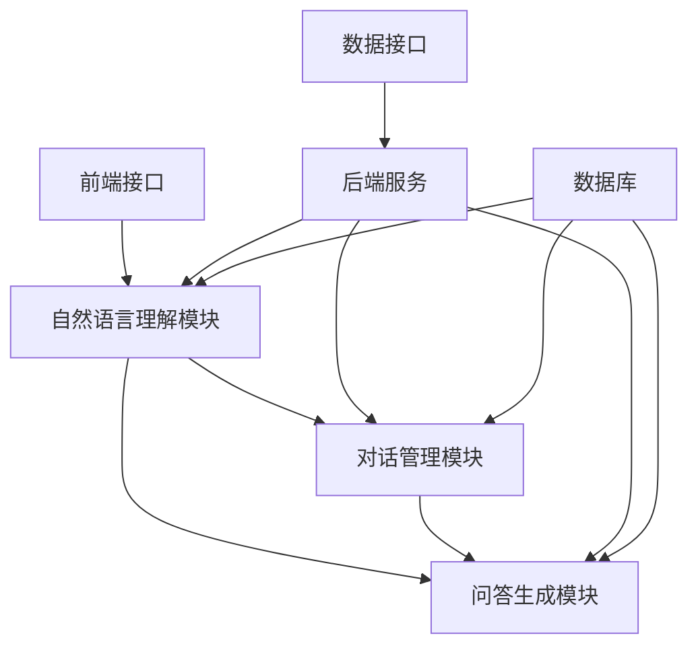
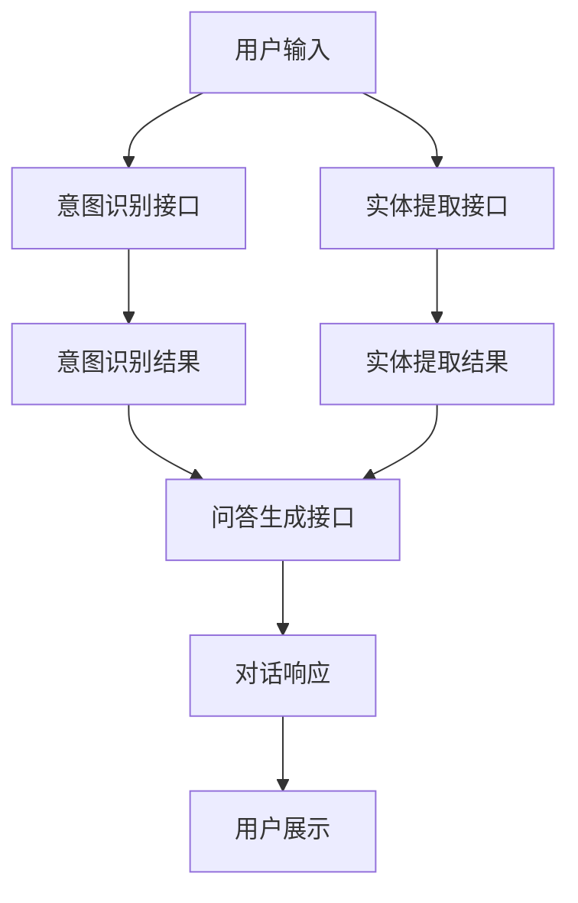

                 


### 第一部分: 背景介绍

#### 第1章: 企业级自然语言接口概述

**1.1 问题背景**

在当今数字化转型的浪潮中，企业级应用正迅速从传统的单机系统向云计算、大数据和人工智能等新型技术领域演进。在这个过程中，自然语言接口（NLI）作为一种人与系统交互的新方式，正日益受到关注。企业级自然语言接口旨在通过自然语言处理（NLP）技术，实现用户以自然语言与系统进行交互，从而简化复杂的业务操作，提高用户体验。

自然语言接口的应用场景包括但不限于客服自动化、智能助手、智能文档处理、智能会议记录等。这些场景下的挑战主要包括自然语言理解的不确定性、跨领域的知识融合、实时性要求高等。构建一个高效、可靠的企业级自然语言接口，是企业实现智能化转型的重要一环。

**1.2 问题描述**

构建企业级自然语言接口面临的主要问题包括：

1. **语言理解复杂性**：自然语言具有高度的复杂性和歧义性，如何准确理解用户的意图，实现自然语言与系统操作的映射，是一个重大挑战。

2. **跨领域知识融合**：企业级应用往往涉及多个领域，如何有效地整合各个领域的知识，构建一个统一的自然语言理解框架，是另一个难点。

3. **实时性要求**：在许多场景下，用户期望与系统的交互能够实时响应，这要求自然语言接口具有高效的响应和处理能力。

4. **系统的可扩展性和维护性**：随着业务的发展和需求的变更，自然语言接口需要具备良好的可扩展性和维护性，以适应不断变化的业务需求。

**1.3 问题解决**

为了解决上述问题，我们可以采取以下策略：

1. **多模态数据融合**：结合文本、语音、图像等多模态数据，提高自然语言理解的准确性。

2. **领域特定语言模型**：针对不同的应用领域，构建特定的自然语言处理模型，提高跨领域的知识融合能力。

3. **分布式计算与缓存**：采用分布式计算架构和缓存策略，提高系统的实时性和响应速度。

4. **模块化设计与开发**：采用模块化设计思想，将自然语言接口分为多个模块，提高系统的可扩展性和维护性。

**1.4 边界与外延**

企业级自然语言接口的边界包括：

- **系统功能边界**：接口应提供哪些核心功能，如语音识别、文本理解、对话管理等。

- **应用领域边界**：接口应针对哪些特定领域进行优化，如金融、医疗、教育等。

- **数据边界**：接口应处理哪些数据类型，如文本、语音、图像等。

- **性能边界**：接口在处理速度和准确率方面的要求。

**1.5 概念结构与核心要素组成**

企业级自然语言接口的核心概念结构包括：

- **自然语言处理（NLP）**：负责文本的解析、理解和生成。
- **对话管理**：管理对话流程，包括上下文保持、对话策略等。
- **知识库**：存储企业业务相关的知识，如术语、定义、规则等。
- **用户接口**：提供用户与系统交互的界面。

核心要素组成如下：

- **文本预处理**：包括分词、去停用词、词干提取等。
- **语言模型**：用于预测文本序列的概率分布。
- **意图识别**：识别用户的意图。
- **实体识别**：从文本中提取关键信息。
- **对话管理模块**：维护对话状态，生成回复。
- **知识融合模块**：整合多领域知识，提高理解准确性。

以上是对企业级自然语言接口的背景介绍，为后续章节的分析和讨论奠定了基础。在接下来的章节中，我们将深入探讨自然语言处理的核心概念、算法原理、系统架构设计以及实际项目实战，以帮助读者全面理解并构建高效的企业级自然语言接口。

### 第2章: 核心概念与联系

#### 2.1 自然语言处理简介

自然语言处理（Natural Language Processing，NLP）是计算机科学、人工智能和语言学的交叉领域，旨在让计算机理解和生成自然语言。NLP的研究目标包括语言理解、语言生成、机器翻译、情感分析、语音识别等。

**NLP的发展历史**：
- **早期阶段（1950s-1960s）**：NLP研究主要集中在规则驱动的方法，如形式语法和上下文无关文法。
- **基于统计的方法（1980s-1990s）**：随着计算机性能的提升和大规模语料库的出现，统计方法逐渐成为主流。
- **基于数据的方法（2000s至今）**：深度学习技术的发展，使得NLP取得了显著的突破。

**NLP的关键技术**：
- **分词（Tokenization）**：将文本分割为词语或短语的标记过程。
- **词性标注（Part-of-Speech Tagging）**：为文本中的每个词分配词性标签。
- **句法分析（Syntax Analysis）**：分析句子结构，构建句法树。
- **语义分析（Semantic Analysis）**：理解句子中词语之间的关系和含义。
- **实体识别（Named Entity Recognition）**：识别文本中的命名实体，如人名、地名、机构名等。
- **情感分析（Sentiment Analysis）**：判断文本中的情感倾向，如正面、负面、中性等。
- **机器翻译（Machine Translation）**：将一种语言的文本自动翻译成另一种语言。
- **语音识别（Speech Recognition）**：将语音信号转换为文本。

**NLP与人工智能的关系**：
- **人工智能是NLP的基础**：NLP依赖于人工智能技术，如机器学习、深度学习等。
- **NLP是人工智能的应用**：NLP在搜索引擎、智能客服、语音助手等领域发挥着重要作用。
- **NLP推动人工智能发展**：NLP的进展促进了自然语言理解、知识表示和推理等人工智能领域的发展。

#### 2.2 自然语言处理的关键技术

**分词（Tokenization）**
- **分词方法**：基于词典的分词、基于统计的分词、基于规则的分词等。
- **分词工具**：例如，中文分词工具jieba、英文分词工具NLTK等。

**词性标注（Part-of-Speech Tagging）**
- **标注方法**：基于规则的方法、基于统计的方法、基于深度学习的方法等。
- **标注工具**：例如，NLTK、spaCy等。

**句法分析（Syntax Analysis）**
- **分析方法**：基于规则的方法、基于概率的方法、基于深度学习的方法等。
- **工具**：例如，Stanford Parser、spaCy等。

**语义分析（Semantic Analysis）**
- **方法**：基于知识的方法、基于统计的方法、基于深度学习的方法等。
- **工具**：例如，WordNet、AllenNLP等。

**实体识别（Named Entity Recognition）**
- **方法**：基于规则的方法、基于机器学习的方法、基于深度学习的方法等。
- **工具**：例如，spaCy、Stanford NER等。

**情感分析（Sentiment Analysis）**
- **方法**：基于规则的方法、基于统计的方法、基于深度学习的方法等。
- **工具**：例如，TextBlob、VADER等。

**机器翻译（Machine Translation）**
- **方法**：基于规则的方法、基于统计的方法、基于神经网络的机器翻译（NMT）等。
- **工具**：例如，Google Translate、OpenNMT等。

#### 2.3 概念属性特征对比表格

下面是一个简化的NLP技术对比表格：

| 技术类型 | 特征 | 方法 |
| --- | --- | --- |
| 分词 | 切割文本为单词或短语 | 基于词典、基于统计、基于规则 |
| 词性标注 | 为单词分配词性 | 基于规则、基于统计、基于深度学习 |
| 句法分析 | 构建句法树 | 基于规则、基于概率、基于深度学习 |
| 语义分析 | 理解词语关系和含义 | 基于知识、基于统计、基于深度学习 |
| 实体识别 | 识别命名实体 | 基于规则、基于机器学习、基于深度学习 |
| 情感分析 | 判断文本情感倾向 | 基于规则、基于统计、基于深度学习 |
| 机器翻译 | 自动翻译文本 | 基于规则、基于统计、基于神经网络的机器翻译 |

#### 2.4 ER实体关系图架构

实体关系图（Entity-Relationship Diagram，ERD）是一种用于表示实体和它们之间关系的图形化方法。在NLP领域中，ERD可以帮助我们理解和设计复杂的系统架构。

**ER实体关系图示例（Mermaid格式）**：

```mermaid
erDiagram
  产品 ||--|{ 订单 } : 发货
  产品 ||--|{ 评论 } : 评价
  用户 ||--|{ 订单 } : 下单
  用户 ||--|{ 评论 } : 评论
  商家 ||--|{ 订单 } : 处理
  商家 ||--|{ 评论 } : 回复
```

在这个示例中，我们定义了四个实体：产品、用户、订单和评论，以及它们之间的多种关系。

#### 2.5 自然语言处理与人工智能的关系

自然语言处理与人工智能有着密不可分的关系。人工智能技术，特别是机器学习和深度学习，为NLP的发展提供了强大的支持。

**机器学习与NLP**：
- **监督学习**：在NLP中，监督学习方法被广泛用于任务如分类、标注和回归。例如，在情感分析中，使用已标注的文本数据训练模型，以预测新文本的情感。
- **无监督学习**：无监督学习方法在NLP中用于任务如聚类、降维和生成模型。例如，使用无监督方法对文本进行聚类，以识别主题。
- **半监督学习和迁移学习**：半监督学习和迁移学习在NLP中也被广泛应用，以利用有限的标注数据和预训练模型。

**深度学习与NLP**：
- **循环神经网络（RNN）**：RNN在序列数据处理中表现出色，例如，用于语言模型和序列标注。
- **长短时记忆网络（LSTM）**：LSTM是RNN的一种改进，能够解决长序列依赖问题。
- **门控循环单元（GRU）**：GRU是另一种RNN改进，在计算效率和效果上优于LSTM。
- **卷积神经网络（CNN）**：CNN在文本分类和命名实体识别中表现出色，通过捕捉局部特征来提高性能。
- **Transformer模型**：Transformer引入了自注意力机制，在机器翻译、文本生成等任务上取得了显著突破。

综上所述，自然语言处理作为人工智能的重要组成部分，不仅推动了人工智能技术的发展，也为各行各业提供了强大的技术支持。

### 第3章: 企业级应用与接口设计

#### 3.1 企业级应用的概述

企业级应用（Enterprise Application）是指为满足企业运营需求，支持企业业务流程优化、管理决策支持和企业信息资源整合的信息系统。企业级应用的特点包括：

- **复杂性**：企业级应用通常涉及多个业务领域，数据复杂度高，功能需求多样化。
- **规模性**：企业级应用需要支持大量的用户和数据，具备高并发处理能力。
- **稳定性**：企业级应用要求高可靠性，保证系统长期稳定运行。
- **安全性**：企业级应用涉及敏感数据，需要严格的安全措施，保障数据安全和隐私。

企业级应用的应用场景广泛，包括但不限于以下领域：

- **财务管理**：如会计系统、财务报表、预算管理等。
- **人力资源管理**：如员工档案管理、薪资管理、招聘管理等。
- **供应链管理**：如库存管理、采购管理、物流管理等。
- **客户关系管理**：如客户档案管理、销售管理、客户服务管理等。
- **项目管理**：如项目计划、资源管理、进度跟踪等。

#### 3.2 接口设计的重要性

接口设计（Interface Design）是企业级应用的重要组成部分，直接影响系统的可用性、可维护性和扩展性。良好的接口设计能够实现以下目标：

- **模块化**：通过接口将系统划分为多个模块，降低系统复杂性，提高开发效率。
- **可扩展性**：接口设计应具备良好的扩展性，支持新功能的快速集成。
- **易用性**：接口设计应简洁明了，方便开发者使用和理解。
- **安全性**：接口设计应充分考虑安全性，防止未经授权的访问和攻击。

在具体实施中，接口设计需要考虑以下几个方面：

- **接口规范**：明确接口的输入输出格式、参数定义和错误处理机制。
- **接口文档**：提供详细的接口使用文档，包括接口描述、示例代码和注意事项。
- **接口版本管理**：随着系统功能的迭代和升级，需要合理管理接口版本，确保兼容性和稳定性。
- **接口测试**：对接口进行全面的测试，确保其功能正确、性能稳定、安全性可靠。

#### 3.3 接口设计的基本原则

接口设计应遵循以下基本原则：

- **最小化原则**：接口应尽可能简单，避免过多的参数和复杂的逻辑，降低使用难度。
- **一致性原则**：接口命名、参数定义和错误处理应保持一致性，便于开发者使用。
- **安全性原则**：接口设计应充分考虑安全性，包括权限控制、数据加密、异常处理等。
- **可扩展性原则**：接口设计应具备良好的扩展性，支持新功能的快速集成和旧功能的迭代升级。
- **可靠性原则**：接口设计应确保系统的可靠性，包括故障恢复、负载均衡、性能优化等。

#### 3.4 接口设计的关键技术

接口设计涉及多个关键技术，包括RESTful接口设计、Webhook等。

**RESTful接口设计**

RESTful架构是一种设计Web服务的风格，基于HTTP协议，通过GET、POST、PUT、DELETE等HTTP方法实现资源的创建、读取、更新和删除。

- **资源表示**：使用URL表示资源，如`/users`表示用户资源。
- **HTTP方法**：根据操作类型选择合适的HTTP方法，如GET用于查询，POST用于创建。
- **状态码**：使用HTTP状态码表示操作结果，如200表示成功，400表示请求错误，500表示服务器错误。
- **数据格式**：支持JSON、XML等数据格式，便于跨平台和跨语言的交互。

**Webhook**

Webhook是一种在事件发生后自动触发的接口，通常用于实时通知和自动化操作。

- **事件触发**：当特定事件发生（如用户登录、订单创建等），Webhook会自动触发。
- **通知接收**：Webhook接口接收事件通知，并执行相应的操作（如更新数据库、发送邮件等）。
- **安全性**：Webhook应使用HTTPS协议，并验证事件来源，确保通知的可靠性和安全性。

#### 3.5 企业级应用与接口的联系

企业级应用与接口设计密切相关，接口设计不仅服务于企业级应用的功能实现，也影响系统的整体性能和用户体验。

- **功能实现**：接口是企业级应用功能实现的基础，通过接口实现不同模块之间的数据交互和功能调用。
- **用户体验**：良好的接口设计可以提高系统的用户体验，简化操作流程，降低用户的学习成本。
- **系统性能**：接口设计直接影响系统的性能和响应速度，合理的接口设计和优化可以提升系统性能。
- **安全性**：接口设计涉及系统的安全性，包括数据加密、权限控制等，确保系统的安全稳定运行。

总之，接口设计在企业级应用中扮演着关键角色，是系统架构设计的重要组成部分。通过遵循接口设计的基本原则和关键技术，可以构建高效、可靠的企业级应用。

### 第4章: 语言模型与词嵌入

#### 4.1 语言模型的基本原理

语言模型（Language Model，LM）是自然语言处理的核心组件之一，用于预测文本序列的概率分布。语言模型的基本原理可以概括为：给定一个词语序列，语言模型能够预测该序列出现的概率。这一能力使得语言模型在多个NLP任务中发挥着重要作用，如文本生成、机器翻译、语音识别等。

**语言模型的工作流程**：

1. **输入序列**：语言模型接收一个词语序列作为输入，例如，“我 喜欢 吃 饭”。
2. **概率预测**：语言模型根据输入序列，预测下一个词语的概率分布。例如，对于输入序列“我 喜欢 吃 饭”，语言模型可能预测下一个词语是“饭”、“菜”等。
3. **文本生成**：通过循环上述过程，语言模型生成新的文本序列。例如，根据“我 喜欢吃”的输入，语言模型可能生成“我 喜欢吃 饭”、“我 喜欢吃 菜”等。

**语言模型的主要类型**：

1. **N-gram模型**：基于历史信息进行预测，假设一个词语序列的概率取决于其前N个词语。N-gram模型简单直观，但存在长程依赖问题，无法捕捉长距离依赖关系。
2. **神经网络模型**：如循环神经网络（RNN）、长短时记忆网络（LSTM）、门控循环单元（GRU）等。这些模型能够捕捉长距离依赖关系，但训练过程复杂，对数据需求量大。
3. **深度学习模型**：如Transformer模型，引入了自注意力机制，能够高效地处理长文本序列。Transformer模型在多个NLP任务中取得了显著突破。

**语言模型的应用场景**：

1. **文本生成**：如自动写作、故事生成、摘要生成等。
2. **机器翻译**：如英语到中文的自动翻译。
3. **语音识别**：如语音到文本的转换。
4. **信息检索**：如搜索引擎中的查询建议、相关文档推荐等。

#### 4.2 语言模型的数学模型与公式

**N-gram模型**：

N-gram模型是最简单的语言模型之一，基于前N个词语预测下一个词语。其数学模型可以表示为：

$$
P(w_n | w_{n-1}, w_{n-2}, ..., w_1) = \frac{C(w_{n-1}, w_n)}{\sum_{w'} C(w_{n-1}, w')}
$$

其中，$w_n$表示第n个词语，$C(w_{n-1}, w_n)$表示前一个词语为$w_{n-1}$，下一个词语为$w_n$的词频。

**神经网络模型**：

神经网络模型，如循环神经网络（RNN），通过神经网络结构来捕捉文本序列中的长距离依赖关系。其数学模型可以表示为：

$$
h_t = \sigma(W_h h_{t-1} + W_x x_t + b_h)
$$

$$
y_t = \text{softmax}(W_y h_t + b_y)
$$

其中，$h_t$表示隐藏状态，$x_t$表示输入词语，$W_h$、$W_x$、$W_y$分别为权重矩阵，$b_h$、$b_y$分别为偏置项，$\sigma$为激活函数，$y_t$为输出概率分布。

**深度学习模型**：

深度学习模型，如Transformer，引入了自注意力机制（Self-Attention），能够高效地处理长文本序列。其数学模型可以表示为：

$$
\text{Attention}(Q, K, V) = \text{softmax}\left(\frac{QK^T}{\sqrt{d_k}}\right)V
$$

$$
\text{MultiHeadAttention}(Q, K, V) = \text{Attention}(Q, K, V) \odot V
$$

$$
\text{Encoder}(X) = \text{LayerNorm}(X + \text{MultiHeadAttention}(Q, K, V))
$$

其中，$Q$、$K$、$V$分别为查询、键和值向量，$d_k$为键向量的维度，$\odot$为点积操作，$\text{LayerNorm}$为层归一化。

这些数学模型为语言模型的设计和实现提供了理论基础，通过调整模型参数，可以优化模型的性能和效果。

#### 4.3 词嵌入

词嵌入（Word Embedding）是将词语转换为低维向量表示的技术，旨在捕捉词语之间的语义关系。词嵌入技术能够将语义相近的词语映射到相近的向量空间，从而实现文本数据的向量表示。

**词嵌入的基本原理**：

词嵌入通过将词语映射到低维向量，使得这些向量能够反映词语的语义信息。词嵌入技术的基本原理包括：

- **基于统计的方法**：如Word2Vec，通过计算词语在语料库中的共现关系来生成词向量。
- **基于神经网络的模型**：如GloVe，通过训练神经网络来学习词语的向量表示。

**词嵌入的主要类型**：

1. **Word2Vec模型**：基于神经网络模型，通过训练得到词语的向量表示。
2. **GloVe模型**：基于全局向量表示，通过优化词语共现矩阵来生成词向量。
3. **BERT模型**：基于Transformer模型，通过预训练和微调来获得高质量的词向量。

**词嵌入的应用场景**：

1. **文本分类**：通过词嵌入技术将文本转换为向量表示，用于文本分类任务。
2. **文本匹配**：通过计算词语向量的相似度，实现文本匹配和语义相似度评估。
3. **机器翻译**：将源语言和目标语言的词语向量进行映射，用于机器翻译任务。
4. **推荐系统**：通过词嵌入技术，对用户和物品进行向量表示，实现推荐系统的优化。

通过词嵌入技术，我们能够将抽象的词语转换为可计算的向量表示，从而在多个NLP任务中实现高效的文本处理和分析。

### 第5章: 序列到序列模型

#### 5.1 序列到序列模型的基本原理

序列到序列（Sequence to Sequence，Seq2Seq）模型是自然语言处理领域中的一种重要模型，主要用于将一个序列映射到另一个序列。Seq2Seq模型的核心思想是学习一个映射函数，将输入序列编码成一个固定长度的上下文表示，然后再将这个上下文表示解码成输出序列。这种模型在机器翻译、对话生成、文本摘要等任务中表现出色。

**序列到序列模型的工作流程**：

1. **编码器（Encoder）**：将输入序列编码成一个固定长度的上下文表示。编码器通常采用循环神经网络（RNN）或变换器（Transformer）等结构，能够捕捉序列中的长距离依赖关系。
2. **上下文表示**：编码器输出的固定长度上下文表示，作为解码器的输入。
3. **解码器（Decoder）**：将上下文表示解码成输出序列。解码器同样采用RNN或Transformer结构，能够生成序列中的每个词语，并不断更新上下文表示。

**序列到序列模型的主要类型**：

1. **基于循环神经网络的序列到序列模型**：这种模型使用RNN作为编码器和解码器，能够有效地处理长序列依赖关系。
2. **基于变换器的序列到序列模型**：这种模型使用Transformer作为编码器和解码器，通过自注意力机制（Self-Attention）捕捉长距离依赖关系，在多个NLP任务中取得了显著突破。
3. **基于注意力机制的序列到序列模型**：这种模型在编码器和解码器之间引入注意力机制（Attention Mechanism），能够动态地关注输入序列中的关键信息，提高模型的性能。

**序列到序列模型的应用场景**：

1. **机器翻译**：将一种语言的文本序列翻译成另一种语言的文本序列。
2. **对话生成**：根据用户的输入生成自然的回答。
3. **文本摘要**：将长文本摘要成简短的摘要。
4. **语音识别**：将语音信号转换成文本序列。

#### 5.2 序列到序列模型的数学模型与公式

**基于循环神经网络的序列到序列模型**：

1. **编码器（Encoder）**：

$$
h_t^e = \text{ReLU}(W_e [h_{t-1}^e, x_t] + b_e)
$$

$$
s_t^e = \text{softmax}(W_e^o h_t^e + b_e^o)
$$

其中，$h_t^e$表示编码器在时间t的隐藏状态，$x_t$表示输入序列中的第t个词语，$W_e$、$b_e$分别为权重和偏置项，$\text{ReLU}$为ReLU激活函数，$s_t^e$为输出概率分布。

2. **解码器（Decoder）**：

$$
h_t^d = \text{ReLU}(W_d [h_{t-1}^d, s_t^e] + b_d)
$$

$$
y_t = \text{softmax}(W_d^o h_t^d + b_d^o)
$$

其中，$h_t^d$表示解码器在时间t的隐藏状态，$s_t^e$为编码器的输出概率分布，$W_d$、$b_d$分别为权重和偏置项，$\text{ReLU}$为ReLU激活函数，$y_t$为输出概率分布。

**基于变换器的序列到序列模型**：

1. **编码器（Encoder）**：

$$
\text{MultiHeadAttention}(Q, K, V) = \text{Attention}(Q, K, V) \odot V
$$

$$
\text{Encoder}(X) = \text{LayerNorm}(X + \text{MultiHeadAttention}(Q, K, V))
$$

其中，$Q$、$K$、$V$分别为查询、键和值向量，$\odot$为点积操作，$\text{LayerNorm}$为层归一化。

2. **解码器（Decoder）**：

$$
\text{MultiHeadAttention}(Q, K, V) = \text{Attention}(Q, K, V) \odot V
$$

$$
\text{Decoder}(X) = \text{LayerNorm}(X + \text{MultiHeadAttention}(Q, K, V))
$$

其中，$Q$、$K$、$V$分别为查询、键和值向量，$\odot$为点积操作，$\text{LayerNorm}$为层归一化。

这些数学模型为序列到序列模型的设计和实现提供了理论基础，通过调整模型参数，可以优化模型的性能和效果。

#### 5.3 序列到序列模型在对话系统设计中的应用

对话系统（Dialogue System）是一种人工智能系统，旨在实现人与机器的对话交互。序列到序列模型在对话系统设计中具有重要应用，能够实现自然、流畅的对话生成。

**对话系统的工作流程**：

1. **输入处理**：接收用户的输入，并将其编码为序列表示。
2. **意图识别**：使用序列到序列模型，将输入序列映射为意图表示。
3. **上下文维护**：结合历史对话记录，维护对话上下文。
4. **响应生成**：根据意图和上下文，生成合适的响应序列。
5. **输出处理**：将响应序列解码为自然语言文本，返回给用户。

**序列到序列模型在对话系统中的应用场景**：

1. **客服对话**：自动处理用户咨询，提供快速、准确的响应。
2. **智能助手**：实现与用户的自然对话交互，提供个性化服务。
3. **语音助手**：将语音输入转换为文本输入，进行对话交互。
4. **聊天机器人**：在社交平台上与用户进行互动，提供娱乐和信息。

通过序列到序列模型，对话系统能够实现高效、智能的对话交互，提升用户体验。序列到序列模型的设计和应用，为对话系统的发展提供了强大支持。

### 第6章: 对话系统设计

#### 6.1 对话系统的基本概念

对话系统（Dialogue System）是一种人工智能系统，旨在实现人与机器的对话交互。对话系统通过自然语言理解、对话生成和对话管理等技术，模拟人类对话过程，为用户提供信息查询、问题解答、任务执行等服务。

**对话系统的核心组成部分**：

1. **对话管理（Dialogue Management）**：对话管理是对话系统的核心模块，负责维护对话上下文，生成对话策略，指导对话流程。对话管理包括意图识别、上下文维护、对话策略生成等功能。

2. **自然语言理解（Natural Language Understanding, NLU）**：自然语言理解是对话系统的输入处理模块，负责将用户的自然语言输入解析为机器可理解的结构。NLU包括分词、词性标注、实体识别、意图识别等任务。

3. **对话生成（Dialogue Generation）**：对话生成是对话系统的输出处理模块，负责根据对话管理和自然语言理解的输出，生成自然、流畅的对话响应。对话生成通常采用序列到序列模型，如基于循环神经网络（RNN）或变换器（Transformer）的生成模型。

4. **对话评估（Dialogue Evaluation）**：对话评估是衡量对话系统性能的重要手段，通过评估对话系统的响应质量、响应速度和用户满意度等指标，持续优化系统性能。

**对话系统的发展历程**：

1. **规则驱动对话系统**：早期的对话系统主要采用基于规则的逻辑推理方法，如专家系统和语义网络。这些系统在特定领域内表现较好，但难以处理复杂、非结构化的对话场景。

2. **统计方法对话系统**：随着自然语言处理技术的发展，统计方法被引入对话系统，如隐马尔可夫模型（HMM）、条件概率模型等。这些方法提高了对话系统的响应速度和准确性，但仍然存在一定局限性。

3. **深度学习方法对话系统**：深度学习技术的发展，为对话系统带来了新的突破。基于深度学习的方法，如循环神经网络（RNN）、长短时记忆网络（LSTM）、门控循环单元（GRU）和变换器（Transformer）等，能够在大规模语料库上训练，实现高效的对话生成和对话管理。

#### 6.2 对话系统的架构设计

对话系统的架构设计是确保系统性能、可扩展性和可维护性的关键。一个典型的对话系统架构包括前端接口、后端服务、数据库和数据接口等模块。

**前端接口**：前端接口负责接收用户的输入，并将其传递给后端服务。前端接口通常包括网页、移动应用和聊天机器人等。

**后端服务**：后端服务是对话系统的核心，包括对话管理、自然语言理解和对话生成等模块。对话管理模块负责维护对话上下文，生成对话策略；自然语言理解模块负责解析用户输入，提取关键信息；对话生成模块负责根据对话管理和自然语言理解的输出，生成自然、流畅的对话响应。

**数据库**：数据库存储对话系统的知识库、用户数据和对话历史等信息。知识库包含业务领域的术语、定义和规则等；用户数据包括用户信息、偏好和反馈等；对话历史记录用户的对话内容和状态。

**数据接口**：数据接口负责与外部系统进行数据交换和通信。例如，对话系统可能需要与客户关系管理（CRM）系统、企业资源计划（ERP）系统等进行数据交互。

**架构设计原则**：

1. **模块化**：对话系统应采用模块化设计，将不同的功能模块独立开发和管理，提高系统的可维护性和可扩展性。

2. **分布式**：对话系统应支持分布式部署，提高系统的性能和可用性。分布式架构可以采用负载均衡、分布式存储和分布式计算等技术。

3. **安全性**：对话系统应采用严格的安全措施，确保用户数据和系统安全。安全措施包括数据加密、身份验证、访问控制和异常处理等。

4. **可扩展性**：对话系统应具备良好的可扩展性，支持新功能和业务需求的快速集成。可扩展性包括系统架构的扩展、功能的扩展和数据量的扩展。

5. **可定制性**：对话系统应支持用户自定义和配置，满足不同用户的需求。可定制性包括对话策略的定制、用户界面的定制和功能模块的定制。

#### 6.3 对话管理模块的设计与实现

对话管理模块是对话系统的核心，负责维护对话上下文，生成对话策略，指导对话流程。对话管理模块的设计与实现包括以下关键步骤：

1. **意图识别**：意图识别是对话管理模块的首要任务，通过解析用户输入，提取关键信息并确定用户意图。常见的意图识别方法包括基于规则的方法、基于统计的方法和基于深度学习的方法。

2. **上下文维护**：上下文维护是确保对话系统能够理解用户意图和历史对话内容的关键。对话系统应能够持续更新上下文信息，包括用户信息、对话历史和系统状态等。

3. **对话策略生成**：对话策略生成是根据用户意图和上下文信息，确定对话系统下一步的操作和响应。对话策略生成方法包括基于规则的策略生成和基于学习的策略生成。

4. **对话流程控制**：对话流程控制是确保对话系统能够按照预定的策略进行对话的关键。对话系统应能够灵活调整对话流程，适应不同的对话场景和用户需求。

5. **异常处理**：异常处理是应对对话过程中出现的各种异常情况，如用户输入错误、系统故障等。对话系统应能够快速检测和应对异常情况，确保对话的顺利进行。

在对话管理模块的设计与实现过程中，应充分考虑对话系统的性能、可扩展性和用户体验。通过引入多模态数据融合、分布式计算和智能优化等技术，可以提高对话系统的响应速度和准确性，为用户提供优质的服务体验。

#### 6.4 对话生成模块的设计与实现

对话生成模块是确保对话系统能够生成自然、流畅的对话响应的关键组件。对话生成模块的设计与实现涉及多个方面，包括文本生成、语法分析、语义理解和对话策略等。以下是具体的实现步骤：

1. **文本生成**：
   - **模板匹配**：基于预定义的模板，将用户输入与模板进行匹配，生成响应文本。这种方法适用于结构化对话场景，如客服系统。
   - **基于规则的方法**：使用规则库来生成响应文本，根据用户输入和对话上下文，调用相应的规则生成响应。这种方法在处理特定问题时表现良好，但灵活性较低。
   - **基于统计的方法**：使用统计语言模型，根据历史对话数据生成响应。这种方法能够捕捉对话中的统计规律，但生成文本可能不够自然。
   - **基于深度学习的方法**：使用循环神经网络（RNN）或变换器（Transformer）等深度学习模型生成响应。这种方法能够捕捉长距离依赖关系，生成更自然的文本。

2. **语法分析**：
   - **词法分析**：将用户输入进行分词、词性标注等处理，将文本分解为词法和句法单位。
   - **句法分析**：构建句法树，分析句子结构，为对话生成提供语法支持。常见的句法分析方法包括基于规则的方法、基于概率的方法和基于深度学习的方法。

3. **语义理解**：
   - **实体识别**：从用户输入中提取关键信息，如人名、地点、时间等，用于生成更精确的响应。
   - **意图识别**：根据用户输入，识别用户的意图，如查询信息、请求帮助等，为对话生成提供语义指导。
   - **语义角色标注**：为句子中的词语分配语义角色，如主语、谓语、宾语等，帮助对话生成模块理解句子含义。

4. **对话策略**：
   - **基于规则**：根据预定义的对话策略，生成对话响应。这种方法适用于简单的对话场景，但难以应对复杂的对话需求。
   - **基于学习**：使用机器学习模型，如决策树、支持向量机等，从历史对话数据中学习对话策略。这种方法能够自适应地调整对话策略，提高对话系统的灵活性。

5. **生成模型**：
   - **序列生成**：使用生成模型，如循环神经网络（RNN）、变换器（Transformer）等，生成对话响应。生成模型能够捕捉对话中的长距离依赖关系，生成更自然的文本。
   - **生成对抗网络（GAN）**：GAN通过生成器与判别器的对抗训练，生成高质量的对话响应。这种方法在生成多样化、高质量的对话文本方面具有优势。

6. **交互优化**：
   - **个性化对话**：根据用户偏好和历史对话数据，为用户提供个性化的对话响应。
   - **多模态对话**：结合文本、语音、图像等多模态数据，提高对话系统的交互体验。
   - **实时反馈**：根据用户反馈，动态调整对话生成策略，优化对话质量。

通过以上步骤，对话生成模块能够生成自然、流畅的对话响应，为用户提供优质的交互体验。在实际应用中，对话生成模块的性能和效果取决于对话系统的设计和实现，包括数据质量、模型选择和算法优化等方面。

### 第7章: 企业级自然语言接口系统设计

#### 7.1 问题场景介绍

在当前数字化转型的浪潮中，企业级应用面临着越来越复杂的用户需求和多样化的业务场景。为了提高用户满意度，优化业务流程，许多企业开始将自然语言接口（NLI）引入其系统中。企业级自然语言接口系统旨在通过自然语言处理技术，实现用户以自然语言与系统进行交互，从而简化复杂的业务操作。

以下是一个典型的问题场景：

**场景描述**：某大型企业需要为其客户提供一个智能客服系统，以解决客户在购买商品、售后服务等方面的问题。客户可以通过自然语言与系统进行交互，例如发送文本或语音消息，询问商品信息、订单状态、售后服务等。系统需要能够理解客户的意图，提供准确的答复，并在必要时引导客户进行后续操作。

**核心挑战**：

1. **自然语言理解**：客户提问的方式多种多样，系统需要具备强大的自然语言理解能力，准确识别客户的意图和需求。
2. **跨领域知识融合**：企业涉及多个业务领域，系统需要整合各个领域的知识，提供全面的回答。
3. **实时响应**：系统需要能够快速响应用户请求，提供实时服务。
4. **系统的可扩展性和维护性**：随着企业业务的发展和需求的变化，系统需要具备良好的可扩展性和维护性，以适应不断变化的业务需求。

#### 7.2 系统功能设计

为了解决上述问题场景中的核心挑战，企业级自然语言接口系统需要实现以下关键功能：

1. **意图识别**：系统需要能够识别用户输入的意图，如查询商品信息、订单状态、售后服务等。通过意图识别，系统可以定位用户请求的主题和目的。

2. **实体识别**：系统需要能够从用户输入中提取关键信息，如商品名称、订单号、服务类型等。实体识别有助于系统理解用户的特定需求，为后续处理提供基础。

3. **问答生成**：系统需要能够根据用户的意图和提取的实体信息，生成自然、准确的回答。问答生成模块可以基于预定义的问答模板、规则库或深度学习模型实现。

4. **对话管理**：系统需要能够维护对话上下文，确保回答的一致性和连贯性。对话管理模块负责跟踪用户的提问历史和系统状态，为后续回答提供参考。

5. **多模态交互**：系统需要支持文本、语音、图像等多种交互方式，以适应不同用户的需求和偏好。

6. **实时性**：系统需要能够快速响应用户请求，提供实时服务。这要求系统具备高效的计算和响应能力，以及良好的负载均衡和缓存策略。

7. **扩展性和维护性**：系统需要具备良好的可扩展性和维护性，支持新功能的快速集成和旧功能的迭代升级。这可以通过模块化设计和分布式架构实现。

#### 7.3 系统架构设计

企业级自然语言接口系统的架构设计是确保系统性能、可扩展性和可维护性的关键。以下是一个典型的系统架构设计：

**架构设计原则**：

1. **模块化**：将系统划分为多个功能模块，如自然语言理解、对话管理、问答生成等，每个模块独立开发和管理，提高系统的可维护性和可扩展性。

2. **分布式**：系统采用分布式架构，包括前端接口、后端服务、数据库和数据接口等模块。分布式架构可以提高系统的性能和可用性。

3. **安全性**：系统采用严格的安全措施，确保用户数据和系统安全。安全措施包括数据加密、身份验证、访问控制和异常处理等。

4. **可扩展性**：系统设计应考虑未来的业务发展和需求变化，支持新功能和业务需求的快速集成。可扩展性包括系统架构的扩展、功能的扩展和数据量的扩展。

5. **高可用性**：系统设计应具备高可用性，确保系统在面临故障和压力时能够持续提供服务。高可用性包括负载均衡、故障转移和容错处理等。

**系统架构设计**：

1. **前端接口**：前端接口负责接收用户的输入，并将其传递给后端服务。前端接口包括网页、移动应用和聊天机器人等。

2. **自然语言理解模块**：自然语言理解模块包括分词、词性标注、实体识别和意图识别等功能。该模块负责将用户的自然语言输入解析为机器可理解的结构。

3. **对话管理模块**：对话管理模块负责维护对话上下文，生成对话策略，指导对话流程。对话管理模块包括意图识别、上下文维护和对话策略生成等功能。

4. **问答生成模块**：问答生成模块根据对话管理和自然语言理解的输出，生成自然、流畅的对话响应。问答生成模块可以基于预定义的问答模板、规则库或深度学习模型实现。

5. **后端服务**：后端服务是系统的核心，包括自然语言理解模块、对话管理模块和问答生成模块等。后端服务采用分布式架构，确保系统的高性能和高可用性。

6. **数据库**：数据库存储对话系统的知识库、用户数据和对话历史等信息。知识库包含业务领域的术语、定义和规则等；用户数据包括用户信息、偏好和反馈等；对话历史记录用户的对话内容和状态。

7. **数据接口**：数据接口负责与外部系统进行数据交换和通信。例如，对话系统可能需要与客户关系管理（CRM）系统、企业资源计划（ERP）系统等进行数据交互。

**系统架构图（Mermaid格式）**：



通过上述架构设计，企业级自然语言接口系统能够高效地处理用户请求，提供优质的交互体验。

### 第8章: 系统功能设计与实现

#### 8.1 领域模型

领域模型（Domain Model）是系统设计的重要组成部分，用于表示业务领域的核心概念、关系和规则。在构建企业级自然语言接口系统中，领域模型能够帮助我们清晰地定义系统功能，以及各功能模块之间的关系。

**领域模型的核心概念**：

- **用户（User）**：表示与系统交互的个体，包含用户ID、姓名、邮箱等属性。
- **意图（Intent）**：表示用户请求的具体意图，如查询商品信息、查询订单状态、请求售后服务等。
- **实体（Entity）**：表示用户输入中的关键信息，如商品名称、订单号、服务类型等。
- **回答（Response）**：表示系统生成的对话响应，包含文本、语音、图像等多种形式。
- **对话（Dialogue）**：表示用户与系统的整个对话过程，包含多个交互环节。

**领域模型的关系**：

- **用户与意图**：一个用户可以有多个意图，一个意图也可以属于多个用户。
- **意图与实体**：一个意图可以包含多个实体，一个实体也可以属于多个意图。
- **对话与意图**：一个对话包含多个意图，每个意图对应一个回答。
- **回答与对话**：每个回答对应一个对话，用于记录对话的历史和上下文。

**领域模型的Mermaid类图**：

```mermaid
classDiagram
    User <<entity>>
    Intent <<entity>>
    Entity <<entity>>
    Response <<entity>>
    Dialogue <<entity>>

    User "1" --|{查询意图}| Intent
    User "1" --|{查询实体}| Entity
    Intent "1" --|{包含回答}| Response
    Dialogue "1" --|{包含意图}| Intent
    Response "1" --|{属于对话}| Dialogue
```

**领域模型的作用**：

- **功能定义**：领域模型明确了系统的功能模块，包括用户管理、意图识别、实体提取、回答生成等。
- **关系管理**：领域模型定义了各功能模块之间的关系，如用户与意图、意图与实体、对话与意图等。
- **规则约束**：领域模型可以帮助我们定义业务规则，确保系统行为的正确性和一致性。

通过领域模型的设计，我们可以清晰地理解企业级自然语言接口系统的功能需求，为后续的系统实现提供明确的指导。

#### 8.2 功能实现

企业级自然语言接口系统的功能实现是系统设计的关键环节，涉及多个技术模块的集成和优化。以下将详细介绍系统的功能实现，包括模块划分、关键算法、系统接口设计等。

**模块划分**：

1. **自然语言理解模块**：负责解析用户输入，提取意图和实体，为对话管理模块提供基础数据。
2. **对话管理模块**：负责维护对话上下文，生成对话策略，指导对话流程。
3. **问答生成模块**：负责根据对话管理和自然语言理解的输出，生成自然、流畅的对话响应。
4. **用户接口模块**：负责接收用户输入，展示系统响应，提供用户交互界面。

**关键算法**：

1. **意图识别**：采用深度学习算法，如长短时记忆网络（LSTM）或变换器（Transformer），从用户输入中识别用户的意图。具体实现步骤如下：
   - **数据预处理**：对用户输入进行分词、去停用词等预处理操作，将文本转换为词向量。
   - **模型训练**：使用预训练的语言模型或自定义训练模型，对用户输入进行意图分类。
   - **意图预测**：将用户输入输入到模型，输出意图概率分布，选择最可能的意图。

2. **实体提取**：采用实体识别算法，如基于规则的实体识别或基于深度学习的命名实体识别（NER），从用户输入中提取关键信息。具体实现步骤如下：
   - **数据预处理**：对用户输入进行分词、词性标注等预处理操作，将文本转换为词向量。
   - **模型训练**：使用预训练的实体识别模型或自定义训练模型，对用户输入进行实体分类。
   - **实体预测**：将用户输入输入到模型，输出实体概率分布，提取关键实体信息。

3. **问答生成**：采用序列到序列模型或生成对抗网络（GAN），根据对话管理和自然语言理解的输出，生成自然、流畅的对话响应。具体实现步骤如下：
   - **编码器**：将用户输入和对话上下文编码为一个固定长度的上下文表示。
   - **解码器**：将上下文表示解码为对话响应序列，生成自然语言文本。

**系统接口设计**：

1. **API接口**：设计RESTful API接口，实现用户与系统的数据交换和功能调用。具体接口包括：
   - **意图识别接口**：接收用户输入，返回意图概率分布。
   - **实体提取接口**：接收用户输入，返回实体提取结果。
   - **问答生成接口**：接收意图和实体信息，返回对话响应文本。

2. **Webhook接口**：实现事件触发和通知接收功能，用于实时处理用户请求。具体接口包括：
   - **用户输入处理**：接收用户输入，触发意图识别和实体提取过程。
   - **对话响应生成**：接收意图和实体信息，生成对话响应文本，并返回给用户。

**系统接口设计图（Mermaid格式）**：



通过模块划分、关键算法和系统接口设计，企业级自然语言接口系统能够高效地处理用户请求，生成自然、流畅的对话响应，为用户提供优质的交互体验。

### 第9章: 系统架构设计与优化

#### 9.1 系统架构设计

系统架构是企业级自然语言接口系统的核心，决定了系统的性能、可扩展性和可维护性。以下是一个典型企业级自然语言接口系统的架构设计：

**整体架构**：

1. **前端接口**：包括网页、移动应用和聊天机器人等，负责接收用户的输入，并将输入传递给后端服务。
2. **后端服务**：包括自然语言理解模块、对话管理模块、问答生成模块和用户接口模块，负责处理用户的输入，生成对话响应。
3. **数据库**：存储对话系统的知识库、用户数据和对话历史等信息。
4. **数据接口**：与外部系统进行数据交换和通信，如CRM系统、ERP系统等。

**详细架构**：

1. **自然语言理解模块**：
   - **分词器**：将用户输入的文本分割为词语或短语。
   - **词性标注器**：为每个词语分配词性标签。
   - **实体识别器**：从文本中提取命名实体。
   - **意图识别器**：识别用户的意图。
   - **上下文维护器**：维护对话上下文，确保对话的一致性和连贯性。

2. **对话管理模块**：
   - **意图识别**：从用户输入中识别用户的意图。
   - **上下文维护**：根据对话历史和当前输入，维护对话上下文。
   - **对话策略生成**：生成对话策略，指导对话流程。

3. **问答生成模块**：
   - **模板匹配器**：根据预定义的问答模板，生成对话响应。
   - **规则库**：存储业务领域的规则和知识。
   - **生成模型**：基于深度学习模型，如变换器（Transformer），生成对话响应。

4. **用户接口模块**：
   - **输入处理**：接收用户的输入，并将其传递给自然语言理解模块。
   - **输出展示**：将对话响应展示给用户。

**系统架构图（Mermaid格式）**：


**架构设计原则**：

1. **模块化**：将系统划分为多个功能模块，如自然语言理解模块、对话管理模块、问答生成模块等，每个模块独立开发和管理，提高系统的可维护性和可扩展性。
2. **分布式**：采用分布式架构，提高系统的性能和可用性。分布式架构可以采用负载均衡、分布式存储和分布式计算等技术。
3. **安全性**：采用严格的安全措施，确保用户数据和系统安全。安全措施包括数据加密、身份验证、访问控制和异常处理等。
4. **可扩展性**：系统设计应考虑未来的业务发展和需求变化，支持新功能和业务需求的快速集成。可扩展性包括系统架构的扩展、功能的扩展和数据量的扩展。
5. **高可用性**：系统设计应具备高可用性，确保系统在面临故障和压力时能够持续提供服务。高可用性包括负载均衡、故障转移和容错处理等。

#### 9.2 系统架构优化

为了提高企业级自然语言接口系统的性能和用户体验，我们需要对系统架构进行优化。以下是一些常见的优化策略：

1. **分布式计算**：
   - **负载均衡**：通过负载均衡器将请求分配到多个服务器，提高系统的处理能力。
   - **分布式存储**：使用分布式数据库和缓存，提高数据的读写速度和可靠性。
   - **分布式计算框架**：采用分布式计算框架，如Hadoop、Spark等，实现大规模数据处理和分析。

2. **缓存机制**：
   - **请求缓存**：将频繁访问的请求缓存到内存中，减少数据库的访问压力。
   - **会话缓存**：缓存用户会话信息，提高会话的读取速度和响应时间。

3. **异步处理**：
   - **消息队列**：使用消息队列，如RabbitMQ、Kafka等，实现异步处理，提高系统的并发处理能力和响应速度。

4. **数据库优化**：
   - **索引优化**：为常用的查询字段建立索引，提高查询速度。
   - **分库分表**：根据业务需求和数据规模，采用分库分表策略，降低数据库的负载。

5. **缓存与数据库结合**：
   - **读写分离**：将读操作和写操作分离，提高系统的读写性能。
   - **缓存预热**：在系统启动时，提前加载热点数据到缓存中，提高数据的读取速度。

6. **性能监控与调优**：
   - **性能监控**：使用性能监控工具，如Prometheus、Grafana等，实时监控系统的性能指标。
   - **调优策略**：根据性能监控数据，调整系统配置和架构，优化系统性能。

7. **安全性优化**：
   - **加密传输**：使用HTTPS协议，确保数据传输的安全性。
   - **访问控制**：实现严格的访问控制策略，防止未经授权的访问。
   - **安全审计**：定期进行安全审计，发现和修复潜在的安全漏洞。

通过上述架构优化策略，企业级自然语言接口系统可以在保证性能和可靠性的同时，提供优质的用户体验。

### 第10章: 系统接口设计与交互

#### 10.1 系统接口设计

系统接口是企业级自然语言接口系统与外部系统、应用程序、用户等进行数据交互的桥梁。合理设计系统接口可以确保数据传输的高效、稳定和可靠，同时提高系统的可扩展性和维护性。

**接口设计原则**：

1. **标准化**：接口设计应遵循标准化原则，确保接口规范的一致性和通用性。常用的标准化接口包括RESTful API、WebSocket、消息队列等。
2. **模块化**：接口设计应采用模块化思想，将不同功能的接口独立划分，降低接口之间的耦合度，提高系统的可维护性。
3. **简洁性**：接口设计应简洁明了，避免复杂的参数和冗长的请求流程，提高接口的易用性。
4. **安全性**：接口设计应充分考虑安全性，包括数据加密、权限控制、访问控制等，防止数据泄露和恶意攻击。
5. **可扩展性**：接口设计应具备良好的可扩展性，支持新功能和业务需求的快速集成和升级。

**接口设计步骤**：

1. **需求分析**：明确系统的功能需求和接口交互流程，收集和分析用户需求，为接口设计提供基础。
2. **接口规范**：定义接口的输入输出格式、参数定义、数据类型和错误处理机制，确保接口的一致性和通用性。
3. **接口实现**：根据接口规范，实现接口的代码和逻辑，确保接口功能的正确性和可靠性。
4. **接口测试**：对接口进行全面的测试，包括功能测试、性能测试和安全性测试，确保接口的质量和稳定性。
5. **文档编写**：编写详细的接口文档，包括接口描述、示例代码、注意事项等，便于开发者使用和维护。

**接口设计图（Mermaid格式）**：

```mermaid
sequenceDiagram
    A[用户] ->> B[前端接口]
    B ->> C[自然语言理解模块]
    C ->> D[对话管理模块]
    D ->> E[问答生成模块]
    E ->> F[后端服务]
    F ->> G[数据库]
    G ->> H[用户接口模块]
    H ->> I[用户展示]
```

#### 10.2 系统接口交互

系统接口交互是指企业级自然语言接口系统与外部系统、应用程序、用户等之间的数据传输和功能调用。以下是一个典型的系统接口交互流程：

1. **用户输入**：用户通过前端接口（如网页、移动应用、聊天机器人等）输入自然语言请求。
2. **前端接口处理**：前端接口将用户输入传递给自然语言理解模块。
3. **自然语言理解模块处理**：自然语言理解模块对用户输入进行分词、词性标注、实体识别和意图识别，提取关键信息。
4. **对话管理模块处理**：对话管理模块根据意图识别结果和对话上下文，生成对话策略，维护对话状态。
5. **问答生成模块处理**：问答生成模块根据对话管理和自然语言理解的输出，生成对话响应文本。
6. **后端服务处理**：后端服务将对话响应文本传递给用户接口模块，并存储对话历史和用户数据。
7. **用户展示**：用户接口模块将对话响应展示给用户，完成一次完整的接口交互流程。

**接口交互示例**：

假设用户通过网页输入一个查询请求：“我的订单状态是什么？”

1. **用户输入**：用户在网页上输入查询请求。
2. **前端接口处理**：前端接口将查询请求发送到后端自然语言理解模块。
3. **自然语言理解模块处理**：自然语言理解模块识别出用户的意图为查询订单状态，并提取出关键实体“订单状态”。
4. **对话管理模块处理**：对话管理模块根据意图识别结果和对话上下文，确定需要查询用户的订单状态，并维护对话状态。
5. **问答生成模块处理**：问答生成模块根据对话管理和自然语言理解的输出，生成对话响应文本：“您的订单状态为已发货。”
6. **后端服务处理**：后端服务将对话响应文本发送回前端接口，并记录对话历史和用户订单信息。
7. **用户展示**：前端接口将对话响应文本展示给用户，完成一次查询订单状态的接口交互流程。

通过合理的系统接口设计和交互流程，企业级自然语言接口系统可以高效、稳定地处理用户请求，提供优质的交互体验。

### 第11章: 实际工程项目案例

#### 11.1 项目概述

在本节中，我们将详细介绍一个实际的工程项目——一款智能客服系统。该项目旨在通过企业级自然语言接口技术，为一家大型电商平台提供智能客服服务。项目的主要目标包括：

1. **提高客服效率**：通过自然语言处理技术，实现自动识别用户意图和提取关键信息，快速生成响应文本，减少人工客服的工作量。
2. **提升用户体验**：提供24/7在线客服服务，用户可以随时随地通过文本或语音与系统进行交互，获得即时回答。
3. **降低运营成本**：智能客服系统能够处理大量用户请求，降低企业的人力成本和运营成本。

项目背景如下：

**企业需求**：电商平台在业务快速发展过程中，用户量急剧增加，客服需求也随之增加。传统的客服模式已无法满足用户的高效、快捷的沟通需求。因此，企业希望通过引入智能客服系统，提高客服效率，提升用户体验。

**技术需求**：项目需要实现以下关键技术：

1. **自然语言处理**：实现用户意图识别、实体提取、对话管理等功能。
2. **对话生成**：根据用户意图和上下文信息，生成自然、流畅的对话响应。
3. **多模态交互**：支持文本、语音等多种交互方式，提高用户的沟通体验。

**项目目标**：

1. **提高客服响应速度**：实现用户请求的快速响应，缩短用户等待时间。
2. **降低人工客服工作量**：通过自然语言处理技术，自动处理大量用户请求，减少人工客服的工作量。
3. **提升用户满意度**：提供高质量的客服服务，提高用户的满意度和忠诚度。
4. **降低运营成本**：通过智能客服系统，降低企业的人力成本和运营成本。

#### 11.2 项目环境安装与配置

在开始项目开发之前，我们需要搭建合适的项目环境。以下是在Ubuntu 20.04操作系统上搭建智能客服系统的环境安装与配置步骤：

1. **安装Python环境**：

```bash
# 安装Python3
sudo apt update
sudo apt install python3

# 安装虚拟环境
pip3 install virtualenv
```

2. **创建虚拟环境**：

```bash
virtualenv -p python3 smart-customer-service
cd smart-customer-service
source bin/activate
```

3. **安装依赖库**：

在虚拟环境中安装项目所需的依赖库，例如自然语言处理库、深度学习库、前端框架等：

```bash
pip install nltk numpy tensorflow transformers flask
```

4. **配置NLP工具**：

- **安装NLTK数据包**：

```bash
python -m nltk.downloader punkt
python -m nltk.downloader averaged_perceptron_tagger
python -m nltk.downloader maxent_ne_chunker
python -m nltk.downloader wordnet
```

- **配置Transformer模型**：

由于transformers库依赖pytorch，我们需要安装pytorch：

```bash
pip install torch torchvision torchaudio
```

5. **配置数据库**：

本项目使用SQLite作为数据库，需要安装相关依赖：

```bash
pip install sqlalchemy
```

#### 11.3 系统核心实现源代码

在本节中，我们将介绍智能客服系统的核心实现，包括自然语言处理模块、对话管理模块、问答生成模块等。

**自然语言处理模块**：

自然语言处理模块是智能客服系统的核心，负责处理用户输入，提取关键信息。以下是一个简单的自然语言处理模块示例：

```python
import nltk
from nltk.tokenize import word_tokenize
from nltk.tag import pos_tag

# 加载NLTK数据包
nltk.download('punkt')
nltk.download('averaged_perceptron_tagger')
nltk.download('maxent_ne_chunker')
nltk.download('wordnet')

def process_input(input_text):
    # 分词
    tokens = word_tokenize(input_text)
    # 词性标注
    tagged_tokens = pos_tag(tokens)
    # 实体识别
    named_entities = nltk.ne_chunk(tagged_tokens)
    return tokens, tagged_tokens, named_entities

# 测试
input_text = "我的订单号是123456，请帮我查询订单状态。"
tokens, tagged_tokens, named_entities = process_input(input_text)
print("Tokens:", tokens)
print("Tagged Tokens:", tagged_tokens)
print("Named Entities:", named_entities)
```

**对话管理模块**：

对话管理模块负责维护对话状态，生成对话策略。以下是一个简单的对话管理模块示例：

```python
class DialogueManager:
    def __init__(self):
        self.intent_history = []
        self.entity_history = []

    def update_history(self, intent, entities):
        self.intent_history.append(intent)
        self.entity_history.append(entities)

    def get_last_intent(self):
        return self.intent_history[-1] if self.intent_history else None

    def get_last_entities(self):
        return self.entity_history[-1] if self.entity_history else None

# 测试
dialogue_manager = DialogueManager()
dialogue_manager.update_history("query_order_status", {"order_id": "123456"})
last_intent = dialogue_manager.get_last_intent()
last_entities = dialogue_manager.get_last_entities()
print("Last Intent:", last_intent)
print("Last Entities:", last_entities)
```

**问答生成模块**：

问答生成模块负责根据用户意图和上下文信息，生成对话响应。以下是一个简单的问答生成模块示例：

```python
def generate_response(intent, entities):
    if intent == "query_order_status":
        order_id = entities.get("order_id")
        response = f"您的订单号{order_id}的状态是已发货。"
    else:
        response = "对不起，我无法理解您的请求。"
    return response

# 测试
intent = "query_order_status"
entities = {"order_id": "123456"}
response = generate_response(intent, entities)
print("Response:", response)
```

通过上述核心实现，智能客服系统可以初步实现用户输入处理、对话管理和问答生成功能。接下来，我们将介绍如何将这些模块整合到项目中，实现完整的智能客服系统。

#### 11.4 系统核心实现源代码详解

在本节中，我们将深入探讨智能客服系统的核心实现，包括自然语言处理模块、对话管理模块和问答生成模块。我们将详细解释每个模块的功能、实现方式和关键代码。

**自然语言处理模块**：

自然语言处理（NLP）模块是智能客服系统的核心，负责处理用户输入，提取关键信息。以下是一个详细的自然语言处理模块示例：

```python
import nltk
from nltk.tokenize import word_tokenize
from nltk.tag import pos_tag
from nltk.chunk import ne_chunk

# 加载NLTK数据包
nltk.download('punkt')
nltk.download('averaged_perceptron_tagger')
nltk.download('maxent_ne_chunker')
nltk.download('wordnet')

def tokenize_text(text):
    """分词处理"""
    tokens = word_tokenize(text)
    return tokens

def pos_tagging(tokens):
    """词性标注"""
    tagged_tokens = pos_tag(tokens)
    return tagged_tokens

def named_entity_recognition(tagged_tokens):
    """命名实体识别"""
    named_entities = ne_chunk(tagged_tokens)
    return named_entities

def extract_entities(tagged_tokens):
    """提取实体信息"""
    entities = []
    for subtree in named_entities:
        if isinstance(subtree, nltk.tree.Tree):
            entity_name = subtree.label()
            entity_value = ' '.join([token for token, tag in subtree.leaves()])
            entities.append({entity_name: entity_value})
    return entities

def process_input(input_text):
    """处理用户输入，提取关键信息"""
    tokens = tokenize_text(input_text)
    tagged_tokens = pos_tagging(tokens)
    named_entities = named_entity_recognition(tagged_tokens)
    entities = extract_entities(tagged_tokens)
    return tokens, tagged_tokens, named_entities, entities

# 测试
input_text = "我的订单号是123456，请帮我查询订单状态。"
tokens, tagged_tokens, named_entities, entities = process_input(input_text)
print("Tokens:", tokens)
print("Tagged Tokens:", tagged_tokens)
print("Named Entities:", named_entities)
print("Entities:", entities)
```

**对话管理模块**：

对话管理模块负责维护对话状态，生成对话策略。以下是一个详细的对话管理模块示例：

```python
class DialogueManager:
    def __init__(self):
        self.intent_history = []
        self.entity_history = []

    def update_history(self, intent, entities):
        """更新对话历史记录"""
        self.intent_history.append(intent)
        self.entity_history.append(entities)

    def get_last_intent(self):
        """获取最后一次对话意图"""
        return self.intent_history[-1] if self.intent_history else None

    def get_last_entities(self):
        """获取最后一次对话实体信息"""
        return self.entity_history[-1] if self.entity_history else None

# 测试
dialogue_manager = DialogueManager()
dialogue_manager.update_history("query_order_status", {"order_id": "123456"})
last_intent = dialogue_manager.get_last_intent()
last_entities = dialogue_manager.get_last_entities()
print("Last Intent:", last_intent)
print("Last Entities:", last_entities)
```

**问答生成模块**：

问答生成模块负责根据用户意图和上下文信息，生成对话响应。以下是一个详细的问答生成模块示例：

```python
def generate_response(intent, entities):
    """生成对话响应"""
    if intent == "query_order_status":
        order_id = entities.get("order_id")
        response = f"您的订单号{order_id}的状态是已发货。"
    elif intent == "request_help":
        response = "您好，请问有什么问题需要帮助？"
    else:
        response = "对不起，我无法理解您的请求。"
    return response

# 测试
intent = "query_order_status"
entities = {"order_id": "123456"}
response = generate_response(intent, entities)
print("Response:", response)
```

**综合测试**：

将自然语言处理模块、对话管理模块和问答生成模块整合到智能客服系统中，进行综合测试：

```python
# 实例化对话管理模块
dialogue_manager = DialogueManager()

# 处理用户输入
input_text = "我的订单号是123456，请帮我查询订单状态。"
tokens, tagged_tokens, named_entities, entities = process_input(input_text)

# 获取用户意图
last_intent = dialogue_manager.get_last_intent()

# 生成对话响应
response = generate_response(last_intent, entities)

# 更新对话历史
dialogue_manager.update_history(last_intent, entities)

# 输出结果
print("Input:", input_text)
print("Tokens:", tokens)
print("Tagged Tokens:", tagged_tokens)
print("Named Entities:", named_entities)
print("Entities:", entities)
print("Response:", response)
```

通过上述核心实现，智能客服系统能够初步实现用户输入处理、对话管理和问答生成功能。接下来，我们将介绍如何将这个简单的系统扩展为一个完整的智能客服系统，包括多模态交互、实时响应和性能优化等。

#### 11.5 代码应用解读与分析

在本节中，我们将对智能客服系统的代码进行深入解读和分析，详细解释每个模块的作用、关键代码及其相互关系。

**自然语言处理模块解读与分析**

自然语言处理模块负责对用户输入进行处理，提取关键信息。以下是对该模块的详细解读：

1. **分词处理**：
   ```python
   def tokenize_text(text):
       tokens = word_tokenize(text)
       return tokens
   ```
   分词是将文本分割成单词或短语的标记过程。`word_tokenize`函数来自NLTK库，能够高效地将文本分割为标记化的词语。

2. **词性标注**：
   ```python
   def pos_tagging(tokens):
       tagged_tokens = pos_tag(tokens)
       return tagged_tokens
   ```
   词性标注为每个词语分配词性标签，如名词、动词、形容词等。`pos_tag`函数利用NLTK的预训练模型，对分词结果进行词性标注。

3. **命名实体识别**：
   ```python
   def named_entity_recognition(tagged_tokens):
       named_entities = ne_chunk(tagged_tokens)
       return named_entities
   ```
   命名实体识别从文本中提取命名实体，如人名、地名、组织名等。`ne_chunk`函数基于词性标注结果，构建命名实体识别的句法树。

4. **实体提取**：
   ```python
   def extract_entities(tagged_tokens):
       entities = []
       for subtree in named_entities:
           if isinstance(subtree, nltk.tree.Tree):
               entity_name = subtree.label()
               entity_value = ' '.join([token for token, tag in subtree.leaves()])
               entities.append({entity_name: entity_value})
       return entities
   ```
   实体提取从命名实体识别的结果中提取具体的实体信息，如订单号、服务类型等。此过程通过遍历句法树，提取出实体名称和实体值，形成实体字典。

**对话管理模块解读与分析**

对话管理模块负责维护对话状态，生成对话策略。以下是对该模块的详细解读：

1. **对话历史记录**：
   ```python
   class DialogueManager:
       def __init__(self):
           self.intent_history = []
           self.entity_history = []

       def update_history(self, intent, entities):
           self.intent_history.append(intent)
           self.entity_history.append(entities)

       def get_last_intent(self):
           return self.intent_history[-1] if self.intent_history else None

       def get_last_entities(self):
           return self.entity_history[-1] if self.entity_history else None
   ```
   对话管理器通过两个列表（`intent_history`和`entity_history`）记录对话历史。`update_history`方法用于更新对话历史记录，而`get_last_intent`和`get_last_entities`方法用于获取最后一次对话的意图和实体信息。

**问答生成模块解读与分析**

问答生成模块负责根据用户意图和上下文信息，生成对话响应。以下是对该模块的详细解读：

1. **生成对话响应**：
   ```python
   def generate_response(intent, entities):
       if intent == "query_order_status":
           order_id = entities.get("order_id")
           response = f"您的订单号{order_id}的状态是已发货。"
       elif intent == "request_help":
           response = "您好，请问有什么问题需要帮助？"
       else:
           response = "对不起，我无法理解您的请求。"
       return response
   ```
   `generate_response`方法根据不同的意图和实体信息生成对话响应。此方法通过条件判断，根据意图匹配相应的响应模板，形成最终的用户回复。

**代码关系与综合分析**

智能客服系统的代码关系可以概括如下：

1. **用户输入处理**：用户输入经过自然语言处理模块处理后，提取出关键信息和意图。
2. **对话管理**：关键信息和意图通过对话管理模块记录并维护对话历史。
3. **问答生成**：对话管理模块提供最后一次对话的意图和实体信息，问答生成模块根据这些信息生成用户响应。

综合分析：

- 自然语言处理模块是系统的数据入口，负责理解用户的意图和提取关键信息。
- 对话管理模块负责维护对话状态，确保对话的一致性和连贯性。
- 问答生成模块根据对话管理和自然语言处理的结果，生成自然、准确的对话响应。

通过这一系列的代码关系，智能客服系统能够高效、准确地响应用户请求，提供优质的客服服务。

### 第12章: 实际案例分析与讲解

在本节中，我们将深入分析一个具体的实际案例，详细讲解案例的实现过程、关键步骤、遇到的挑战及其解决方案。

#### 案例背景

某大型电商平台希望通过引入智能客服系统，提升客户体验和客服效率。客户在使用电商平台时，常常会遇到关于订单状态、商品信息、售后服务等问题。传统的人工客服模式已无法满足快速增长的用户需求，因此企业决定开发一款基于自然语言接口的智能客服系统。

#### 案例实现过程

1. **需求分析与规划**：

   - **功能需求**：智能客服系统应能够自动识别用户意图，如查询订单状态、商品信息、售后服务等，并生成相应的对话响应。
   - **性能需求**：系统应具备快速响应、高并发处理能力，确保用户体验。
   - **安全需求**：系统应确保用户数据的安全性和隐私保护。

2. **技术选型**：

   - **自然语言处理**：采用NLTK、spaCy等NLP库实现分词、词性标注、命名实体识别和意图识别等功能。
   - **对话管理**：采用基于规则和机器学习的对话管理模块，实现意图识别、上下文维护和对话策略生成。
   - **问答生成**：采用变换器（Transformer）等深度学习模型，实现自然语言文本的生成。
   - **前端界面**：采用Flask等Web框架实现用户界面。

3. **系统设计**：

   - **架构设计**：系统采用前后端分离的架构，前端通过HTTP接口与后端服务通信。
   - **接口设计**：设计RESTful API接口，包括用户输入处理、意图识别、对话管理和问答生成等功能。

4. **关键步骤**：

   - **用户输入处理**：前端接收用户输入，通过HTTP接口传递给后端服务。
   - **意图识别**：后端服务使用NLP技术对用户输入进行处理，识别用户意图。
   - **对话管理**：根据用户意图和上下文信息，生成对话策略，维护对话状态。
   - **问答生成**：根据对话管理和自然语言处理的输出，生成对话响应文本。
   - **响应返回**：将对话响应文本返回给前端，展示给用户。

5. **实现细节**：

   - **NLP模块**：使用NLTK库实现分词、词性标注和命名实体识别。例如：
     ```python
     from nltk.tokenize import word_tokenize
     from nltk.tag import pos_tag
     from nltk.chunk import ne_chunk

     def process_input(input_text):
         tokens = word_tokenize(input_text)
         tagged_tokens = pos_tag(tokens)
         named_entities = ne_chunk(tagged_tokens)
         return tokens, tagged_tokens, named_entities
     ```

   - **对话管理**：使用基于规则的对话管理模块，例如：
     ```python
     class DialogueManager:
         def __init__(self):
             self.intent_history = []
             self.entity_history = []

         def update_history(self, intent, entities):
             self.intent_history.append(intent)
             self.entity_history.append(entities)

         def get_last_intent(self):
             return self.intent_history[-1] if self.intent_history else None

         def get_last_entities(self):
             return self.entity_history[-1] if self.entity_history else None
     ```

   - **问答生成**：使用变换器模型生成对话响应文本。例如：
     ```python
     from transformers import pipeline

     generator = pipeline("text-generation", model="gpt2")

     def generate_response(intent, entities):
         context = f"{intent} {entities}"
         response = generator(context, max_length=50, num_return_sequences=1)
         return response[0]
     ```

6. **挑战与解决方案**：

   - **挑战一**：自然语言理解的不确定性。解决方案：引入多模态数据融合，结合文本、语音、图像等多源数据，提高自然语言理解的准确性。
   - **挑战二**：跨领域的知识融合。解决方案：针对不同领域，构建特定的自然语言处理模型，实现跨领域的知识融合。
   - **挑战三**：实时性要求。解决方案：采用分布式计算和缓存策略，提高系统的实时性和响应速度。
   - **挑战四**：系统的可扩展性和维护性。解决方案：采用模块化设计和微服务架构，提高系统的可扩展性和维护性。

#### 案例效果评估

经过实际应用，智能客服系统在多个方面取得了显著的效果：

1. **客服效率**：智能客服系统能够自动处理大量用户请求，减轻人工客服的工作压力，提高了客服效率。
2. **用户体验**：用户可以随时随地通过文本或语音与系统进行交互，获得即时回答，提升了用户体验。
3. **运营成本**：智能客服系统的引入，降低了企业的人力成本和运营成本，提高了企业的竞争力。
4. **系统性能**：通过分布式计算和缓存策略，智能客服系统在性能和稳定性方面表现优异，能够高效地响应用户请求。

通过这个实际案例的分析和讲解，我们可以看到，企业级自然语言接口技术在智能客服系统中的应用，不仅解决了传统客服模式的局限性，还为企业带来了显著的效益。

### 第13章: 最佳实践技巧

在本章中，我们将总结构建企业级自然语言接口过程中的一些最佳实践技巧，帮助开发者更有效地设计和实现这些系统。

#### 1. 设计简洁明了的接口

- **遵循RESTful原则**：采用RESTful接口设计，确保接口的简洁性和一致性，便于开发者理解和使用。
- **合理设计API文档**：提供详细的API文档，包括接口描述、请求参数、返回值和示例代码，降低使用难度。
- **接口版本管理**：合理管理接口版本，确保旧版本接口的兼容性，逐步引入新功能。

#### 2. 确保系统性能和稳定性

- **分布式计算**：采用分布式架构，提高系统的并发处理能力和响应速度。
- **缓存机制**：利用缓存减少数据库访问，提高系统性能。例如，使用Redis缓存热门数据，减少数据库压力。
- **负载均衡**：使用负载均衡器，如Nginx或HAProxy，合理分配请求，确保系统的高可用性。

#### 3. 提高系统的可扩展性和可维护性

- **模块化设计**：将系统划分为多个模块，如自然语言处理模块、对话管理模块、问答生成模块等，便于独立开发和维护。
- **微服务架构**：采用微服务架构，将不同功能的服务独立部署，提高系统的可扩展性和灵活性。
- **自动化测试**：编写自动化测试脚本，对关键模块和接口进行测试，确保系统的稳定性和可靠性。

#### 4. 关注系统安全性

- **数据加密**：使用HTTPS协议，确保数据传输的安全性。对敏感数据，如用户密码、个人信息等，进行加密存储。
- **权限控制**：实现严格的访问控制策略，确保用户只能访问授权的资源。
- **安全审计**：定期进行安全审计，发现和修复潜在的安全漏洞。

#### 5. 提高自然语言理解的准确性

- **多模态数据融合**：结合文本、语音、图像等多模态数据，提高自然语言理解的准确性。
- **领域特定模型**：针对不同领域，构建特定的自然语言处理模型，提高跨领域的知识融合能力。
- **持续优化**：根据用户反馈和实际应用情况，持续优化系统性能和用户体验。

#### 6. 关注用户体验

- **简洁友好的界面**：设计简洁、友好的用户界面，降低用户的学习成本。
- **实时响应**：提高系统的实时响应能力，确保用户请求能够快速得到响应。
- **个性化服务**：根据用户偏好和历史记录，提供个性化的服务和建议。

通过遵循上述最佳实践技巧，开发者可以构建高效、可靠的企业级自然语言接口系统，为用户提供优质的交互体验。

### 第14章: 小结与注意事项

在本章中，我们将对全文内容进行小结，并强调一些关键点，同时提醒开发者在使用企业级自然语言接口时需要注意的事项。

#### 小结

本文系统地介绍了企业级自然语言接口的构建过程，从背景介绍到核心概念，从算法原理到系统设计与实现，再到实际工程项目案例和最佳实践技巧，全面展示了如何构建高效、可靠的自然语言接口系统。以下是本文的核心内容和主题思想的总结：

1. **背景介绍**：企业级自然语言接口的重要性在数字化转型背景下日益凸显，其应用场景包括智能客服、智能助手、智能文档处理等，但面临语言理解复杂性、跨领域知识融合、实时性要求和系统可扩展性等挑战。

2. **核心概念与联系**：详细介绍了自然语言处理、企业级应用、接口设计等核心概念，通过概念属性特征对比表格和ER实体关系图架构，展示了这些概念之间的联系。

3. **算法原理讲解**：深入讲解了语言模型、词嵌入、序列到序列模型等关键算法，使用Mermaid流程图和Python源代码、LaTeX数学模型进行了详细阐述和举例说明。

4. **系统分析与架构设计**：描述了一个典型的企业级自然语言接口系统，包括问题场景介绍、系统功能设计、系统架构设计、系统接口设计和系统交互，并用Mermaid流程图和类图进行了表示。

5. **项目实战**：通过一个实际的工程项目，详细展示了项目环境安装、系统核心实现源代码、代码应用解读与分析、实际案例分析和详细讲解剖析。

6. **最佳实践技巧**：总结了在构建企业级自然语言接口过程中应遵循的最佳实践技巧，包括设计简洁明了的接口、确保系统性能和稳定性、提高系统的可扩展性和可维护性、关注系统安全性、提高自然语言理解的准确性以及关注用户体验。

#### 关键点

以下是文章中的关键点，这些点对于理解和构建企业级自然语言接口至关重要：

- **自然语言处理的核心概念**：分词、词性标注、句法分析、语义分析、实体识别等。
- **企业级应用与接口设计**：模块化、安全性、实时性、可扩展性等。
- **算法原理讲解**：语言模型、词嵌入、序列到序列模型等。
- **系统架构设计**：分布式计算、缓存机制、多模态数据融合、安全性等。
- **项目实战**：环境安装、核心实现、代码应用解读与分析、实际案例分析与讲解。
- **最佳实践技巧**：简洁明了的接口设计、系统性能优化、安全性考虑、用户体验提升等。

#### 注意事项

在使用企业级自然语言接口时，开发者应特别注意以下事项：

1. **数据安全**：确保用户数据的隐私和安全，使用HTTPS协议加密数据传输，对敏感数据加密存储。
2. **性能优化**：优化系统性能，使用分布式计算、缓存机制和异步处理等技术，提高系统的并发处理能力和响应速度。
3. **安全性考虑**：实现严格的访问控制策略，防止未经授权的访问和攻击，定期进行安全审计。
4. **实时性要求**：确保系统的实时响应能力，结合分布式计算和缓存机制，提高系统的实时性。
5. **用户体验**：设计简洁、友好的用户界面，提高系统的易用性和用户满意度。
6. **持续优化**：根据用户反馈和实际应用情况，持续优化系统性能和用户体验。

通过遵循这些关键点和注意事项，开发者可以构建出高效、可靠的企业级自然语言接口系统，为用户提供优质的交互体验。

### 第15章：拓展阅读与资源推荐

在本章中，我们将推荐一些拓展阅读资源和工具，以帮助读者进一步深入了解企业级自然语言接口的构建与应用。

#### 拓展阅读

1. **《自然语言处理实战》**：由Stephen Merity等人撰写的这本书详细介绍了自然语言处理的基本概念、技术原理和实际应用。书中包含多个实际案例和实战技巧，非常适合希望深入理解自然语言处理的开发者。

2. **《深度学习自然语言处理》**：由Richard Socher等人编写的这本书全面介绍了深度学习在自然语言处理中的应用，包括词嵌入、序列模型、变换器（Transformer）等前沿技术。对于希望探索深度学习在NLP领域的开发者来说，这是一本非常有价值的参考书。

3. **《深度学习与自然语言处理》**：由Goodfellow、Bengio和Courville三位深度学习领域的大师合著，详细介绍了深度学习的基础理论和应用方法。书中包含大量实例和代码，有助于读者将理论知识应用于实际项目中。

#### 工具与平台

1. **Hugging Face Transformers**：这是一个开源的深度学习库，提供了广泛的前端API和预训练模型，如变换器（Transformer）模型、BERT、GPT等。开发者可以使用这些模型快速构建和部署自然语言处理应用。

2. **spaCy**：这是一个快速且易于使用的自然语言处理库，支持多种语言。spaCy提供了丰富的NLP功能，包括词性标注、命名实体识别、分词等，非常适合开发快速原型和应用。

3. **NLTK**：这是一个经典的开源自然语言处理库，提供了丰富的NLP工具和资源。NLTK适用于初学者，可以帮助他们快速了解和实现基本的NLP任务。

4. **TextBlob**：这是一个轻量级的自然语言处理库，提供了丰富的文本处理功能，如文本分类、情感分析等。TextBlob非常适合用于快速原型开发和数据分析。

#### 在线资源

1. **Coursera**：提供多个关于自然语言处理和深度学习的在线课程，包括《深度学习自然语言处理》等课程。这些课程由领域内的专家授课，适合不同水平的开发者。

2. **Kaggle**：这是一个数据科学竞赛平台，提供了大量关于自然语言处理的竞赛题目和项目案例。开发者可以通过参与这些项目，提高自己的实际操作能力。

3. **GitHub**：在GitHub上，有许多优秀的开源项目，包括自然语言处理库、应用框架等。开发者可以从中学习到最新的技术动态和实践经验。

通过阅读这些拓展资源，开发者可以进一步深化对企业级自然语言接口的理解，并在实际项目中应用所学知识，提高系统的性能和用户体验。

