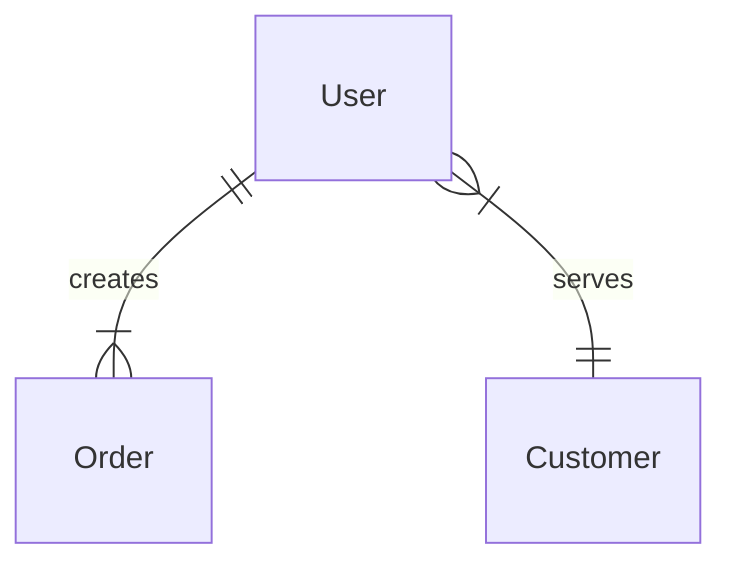
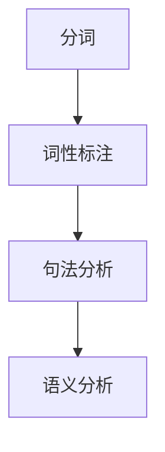
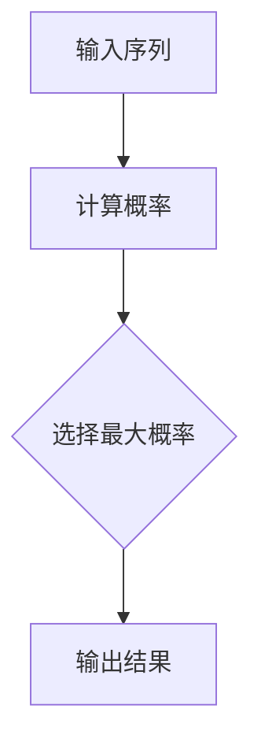
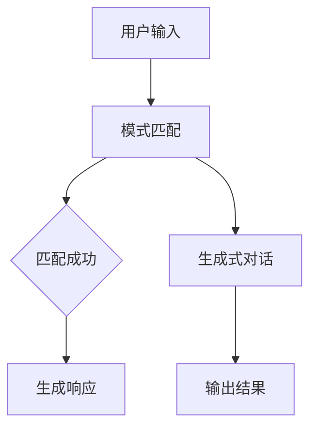
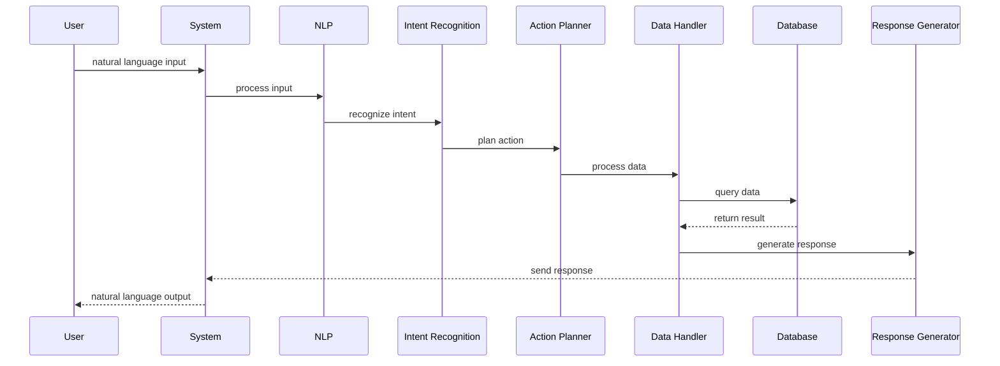
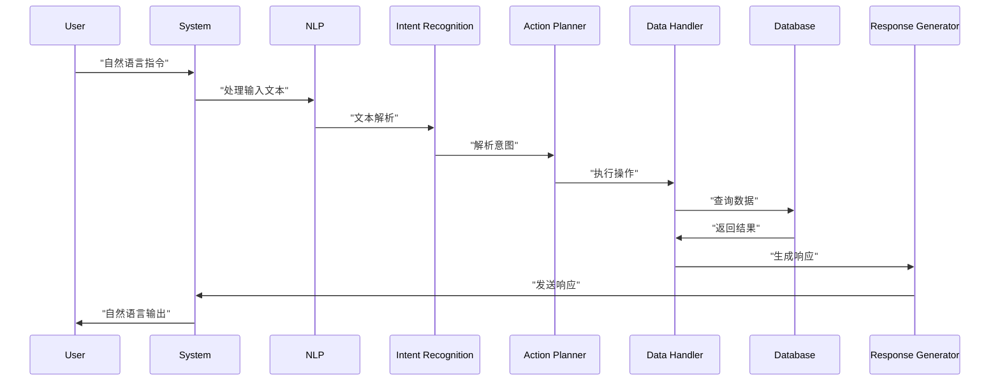

                 

### # 构建企业级自然语言接口：简化复杂系统操作

> 关键词：企业级系统、自然语言接口、复杂系统操作、简化、接口设计、NLP、对话系统、算法原理

> 摘要：随着企业级系统复杂性的不断增加，操作和管理这些系统的难度也在逐渐提升。本文将探讨如何构建企业级自然语言接口，通过自然语言处理技术，实现简化复杂系统操作的目标，提高系统使用效率和用户体验。

## 第一部分: 背景介绍

### 1.1 问题背景

#### 1.1.1 企业级系统复杂性的挑战

随着信息技术的快速发展，企业级系统在企业管理、运营和生产中的作用日益重要。然而，这些系统往往具有高度复杂性，主要体现在以下几个方面：

1. **功能繁多**：企业级系统通常包含多个功能模块，如财务管理、人力资源、供应链管理、客户关系管理等，这些模块相互关联，形成复杂的业务流程。
2. **数据量大**：企业级系统需要处理大量数据，包括历史数据、实时数据、结构化数据和非结构化数据，数据之间的关联性和复杂性较高。
3. **操作繁琐**：传统的操作方式，如通过图形用户界面（GUI）或命令行界面（CLI）进行系统操作，往往需要用户具备较高的技术水平和耐心，操作过程繁琐且容易出错。

#### 1.1.2 自然语言接口的优势

自然语言接口作为一种新兴的人机交互方式，具有以下优势：

1. **易用性**：自然语言接口允许用户通过简单的文本输入或语音输入与系统进行交互，无需学习复杂的操作界面，降低了使用门槛。
2. **灵活性**：自然语言接口能够理解和处理用户的自然语言输入，支持多种语言、语法和表达方式，用户可以根据自己的习惯进行操作。
3. **高效性**：通过自然语言接口，用户可以快速完成系统操作，节省时间和精力，提高工作效率。

#### 1.1.3 企业的需求与期望

面对企业级系统复杂性的挑战，企业对自然语言接口有以下几个需求与期望：

1. **易用性**：简化系统操作，提高用户体验，降低培训成本。
2. **灵活性**：支持多种操作方式和场景，适应不同业务需求。
3. **准确性**：准确理解用户的自然语言输入，减少操作错误。
4. **扩展性**：能够随着系统功能的扩展而不断优化，支持新功能和场景。

### 1.2 问题描述

#### 1.2.1 复杂系统的操作流程

企业级系统的操作流程通常包括以下几个步骤：

1. **登录系统**：用户需要通过用户名和密码登录系统，获取操作权限。
2. **选择模块**：根据业务需求，用户需要选择相应的功能模块，如财务管理、供应链管理等。
3. **填写数据**：在相应的模块中，用户需要填写或输入数据，如创建订单、录入客户信息等。
4. **执行操作**：用户需要执行具体的操作，如审批、查询、修改等。
5. **结果反馈**：系统会返回操作结果，如成功提示、错误信息等。

#### 1.2.2 人工操作的局限性

传统的人工操作方式存在以下局限性：

1. **效率低下**：操作过程繁琐，需要用户逐一执行多个步骤，浪费时间。
2. **易出错**：人工操作容易受到操作者技能水平、注意力分散等因素的影响，导致操作错误。
3. **学习成本高**：用户需要学习系统的操作界面和操作方法，提高了培训成本。
4. **扩展性差**：传统操作方式难以适应新的功能和业务场景，系统扩展性差。

#### 1.2.3 自然语言接口的应用场景

自然语言接口在企业级系统中的应用场景主要包括：

1. **日常办公**：如查询员工信息、审批请假申请等。
2. **项目管理**：如创建任务、分配任务、进度跟踪等。
3. **客户服务**：如自动回复客户咨询、智能客服等。
4. **数据分析**：如生成报表、数据分析等。
5. **智能助手**：为企业用户提供智能助理服务，提高工作效率。

### 1.3 问题解决

#### 1.3.1 自然语言接口的定义

自然语言接口（Natural Language Interface，NLI）是指通过自然语言（如文本或语音）与计算机系统进行交互的方式。它允许用户使用日常语言与系统进行沟通，实现任务自动化和操作简化。

#### 1.3.2 自然语言接口的实现原理

自然语言接口的实现主要依赖于以下几个关键技术：

1. **自然语言处理（NLP）**：NLP技术用于对自然语言文本进行解析和理解，包括分词、词性标注、句法分析等。
2. **语言模型**：语言模型用于预测用户输入的自然语言序列，提高交互的流畅性和准确性。
3. **对话系统**：对话系统负责处理用户的输入，生成响应，并维持会话流程。

#### 1.3.3 自然语言接口的优势分析

自然语言接口的优势主要体现在以下几个方面：

1. **易用性**：简化了系统操作，降低了用户的学习成本，提高了用户体验。
2. **灵活性**：支持多种语言和表达方式，适应不同的业务场景。
3. **高效性**：通过自动化和智能化处理，提高了操作效率和准确性。
4. **扩展性**：可以随着系统功能的扩展而不断优化和升级。

### 1.4 边界与外延

#### 1.4.1 自然语言接口的适用范围

自然语言接口适用于以下场景：

1. **企业级系统**：如企业资源规划（ERP）、客户关系管理（CRM）等。
2. **智能助理**：如个人智能助理、智能客服等。
3. **智能家居**：如智能音箱、智能灯光控制等。
4. **虚拟助手**：如虚拟个人助手、虚拟客服等。

#### 1.4.2 自然语言接口的限制

自然语言接口也存在一定的限制，包括：

1. **理解能力**：自然语言接口的理解能力受限于自然语言处理技术的发展水平。
2. **上下文理解**：在复杂场景下，自然语言接口可能难以准确理解用户的意图。
3. **准确性**：自然语言接口的准确性受限于语言模型的训练质量和数据质量。

#### 1.4.3 企业级系统的特定需求

企业级系统在自然语言接口方面有以下几个特定需求：

1. **安全性**：确保自然语言接口的安全性和数据的保密性。
2. **稳定性**：自然语言接口需要具备较高的稳定性和可靠性。
3. **可扩展性**：自然语言接口需要支持系统的扩展和功能升级。
4. **兼容性**：自然语言接口需要与现有系统和业务流程兼容。

### 1.5 概念结构与核心要素组成

#### 1.5.1 自然语言处理技术

自然语言处理（NLP）技术是构建自然语言接口的基础，主要包括以下几个关键技术：

1. **分词**：将自然语言文本分割成单词或短语。
2. **词性标注**：对文本中的每个单词或短语进行词性分类。
3. **句法分析**：对文本进行句法结构分析，理解句子的语法关系。
4. **语义分析**：对文本进行语义理解，提取文本中的实体、关系和事件。

#### 1.5.2 语言模型

语言模型用于预测用户输入的自然语言序列，是自然语言接口的核心组成部分。语言模型分为以下几个类型：

1. **n-gram模型**：基于相邻词的关系进行建模。
2. **词嵌入模型**：将单词映射到高维空间，进行向量表示。
3. **深度神经网络模型**：使用多层神经网络进行建模，提高预测准确性。

#### 1.5.3 对话系统

对话系统是自然语言接口的重要组成部分，负责处理用户的输入，生成响应，并维持会话流程。对话系统的主要组成部分包括：

1. **对话管理**：负责管理会话流程，包括上下文维护和对话策略。
2. **意图识别**：负责识别用户的意图，将自然语言输入映射到具体的操作或任务。
3. **对话生成**：负责生成自然语言响应，与用户进行交互。

### 1.6 本章小结

本章节介绍了构建企业级自然语言接口的背景和问题，包括企业级系统的复杂性挑战、自然语言接口的优势和企业的需求与期望。同时，分析了自然语言接口的实现原理和优势，探讨了其适用范围和限制。最后，介绍了自然语言处理技术、语言模型和对话系统的核心概念和组成要素。这些内容为后续章节的详细探讨奠定了基础。

----------------------------------------------------------------

## 第二部分: 核心概念与联系

### 2.1 自然语言处理技术

#### 2.1.1 NLP的基本概念

自然语言处理（NLP）是计算机科学、人工智能和语言学领域的交叉学科，旨在使计算机能够理解、解释和生成人类语言。NLP的核心目标是让计算机能够自动处理自然语言文本，包括文本的输入、处理和输出。

#### 2.1.2 NLP的关键技术

NLP的关键技术包括以下几个方面：

1. **分词**：将自然语言文本分割成单词或短语，是NLP的基础。
2. **词性标注**：对文本中的每个单词或短语进行词性分类，如名词、动词、形容词等。
3. **句法分析**：对文本进行句法结构分析，理解句子的语法关系。
4. **语义分析**：对文本进行语义理解，提取文本中的实体、关系和事件。
5. **命名实体识别**：识别文本中的特定实体，如人名、地名、组织名等。
6. **情感分析**：分析文本的情感倾向，如正面、负面或中性。
7. **机器翻译**：将一种自然语言翻译成另一种自然语言。

#### 2.1.3 NLP的发展历程

NLP的发展历程可以分为以下几个阶段：

1. **规则驱动阶段**：早期NLP主要依赖人工编写的规则，如语法规则、词性标注规则等。
2. **基于统计的方法阶段**：随着计算能力的提升和大量语料库的出现，基于统计的方法逐渐成为主流，如隐马尔可夫模型（HMM）、条件随机场（CRF）等。
3. **深度学习方法阶段**：深度学习技术在NLP领域取得了显著突破，如循环神经网络（RNN）、长短期记忆网络（LSTM）、Transformer模型等。

### 2.2 语言模型

#### 2.2.1 语言模型的基本原理

语言模型是一种概率模型，用于预测自然语言序列。语言模型的基本原理是基于统计方法，通过对大量语言数据进行训练，学习到文本的统计规律，从而能够预测新的文本序列。

#### 2.2.2 语言模型的评估指标

语言模型的评估指标主要包括以下几个：

1. **准确率**：预测正确的概率，通常用于分类问题。
2. **召回率**：预测正确的样本数与实际样本数的比例，通常用于检索问题。
3. **精确率**：预测正确的样本数与预测的样本数的比例。
4. **F1值**：精确率和召回率的调和平均值，综合考虑了预测的准确性和完整性。
5. **BLEU评分**：基于记分牌的评估方法，用于评估机器翻译的质量。

#### 2.2.3 语言模型的分类

语言模型可以分为以下几个类型：

1. **n-gram模型**：基于相邻词的关系进行建模，是最简单的语言模型。
2. **统计语言模型**：基于大量语言数据，使用统计方法进行建模。
3. **神经网络语言模型**：基于深度学习技术，使用神经网络进行建模。
4. **基于模板的语言模型**：基于规则和模板进行建模，结合了规则和统计方法。

### 2.3 对话系统

#### 2.3.1 对话系统的定义

对话系统（Dialogue System）是一种人机交互系统，通过自然语言与用户进行交互，实现特定任务或提供信息服务。

#### 2.3.2 对话系统的架构

对话系统通常包括以下几个关键组成部分：

1. **对话管理**：负责管理会话流程，包括上下文维护和对话策略。
2. **意图识别**：负责识别用户的意图，将自然语言输入映射到具体的操作或任务。
3. **对话生成**：负责生成自然语言响应，与用户进行交互。
4. **语言模型**：用于预测用户的输入和生成响应。

#### 2.3.3 对话系统的关键技术

对话系统的关键技术包括以下几个方面：

1. **意图识别**：通过自然语言处理技术，识别用户的意图。
2. **实体识别**：识别文本中的实体，如人名、地名、组织名等。
3. **对话策略**：根据用户意图和上下文，制定对话策略。
4. **响应生成**：根据对话策略和用户输入，生成自然语言响应。

### 2.4 概念属性特征对比表格

以下是一个关于NLP、语言模型和对话系统的概念属性特征对比表格：

| 概念     | 属性特征                                                     | 描述                                                         |
|----------|--------------------------------------------------------------|--------------------------------------------------------------|
| NLP      | 语言理解、语言生成、语言处理                                 | NLP是自然语言处理的技术集合，旨在使计算机能够理解和使用人类语言。 |
| 语言模型 | 预测、统计、神经网络、基于模板                               | 语言模型用于预测自然语言序列，是NLP的核心组成部分。           |
| 对话系统 | 对话管理、意图识别、对话生成、语言模型                       | 对话系统是一种人机交互系统，通过自然语言与用户进行交互。       |

### 2.5 ER实体关系图架构

#### 2.5.1 ER图的基本概念

实体关系图（Entity-Relationship Diagram，ER图）是一种用于表示实体和它们之间关系的数据库模型。ER图用于数据库设计，可以帮助开发者理解数据库的结构和关系。

#### 2.5.2 ER图的绘制

ER图的绘制通常包括以下几个步骤：

1. **确定实体**：根据业务需求，确定需要表示的实体。
2. **确定属性**：为每个实体确定属性，如姓名、年龄、地址等。
3. **确定关系**：确定实体之间的关系，如一对多、多对多等。
4. **绘制ER图**：使用图形工具，根据实体的属性和关系，绘制ER图。

#### 2.5.3 ER图在自然语言接口中的应用

ER图在自然语言接口中的应用主要包括以下几个方面：

1. **实体识别**：使用ER图中的实体和属性，对自然语言文本进行实体识别。
2. **关系提取**：使用ER图中的关系，对自然语言文本进行关系提取。
3. **数据库查询**：根据ER图，生成数据库查询语句，实现自然语言查询功能。

以下是一个简单的ER图示例，用于表示用户和订单之间的关系：



### 2.6 本章小结

本章介绍了自然语言处理（NLP）技术、语言模型和对话系统的核心概念和原理。首先，我们了解了NLP的基本概念和关键技术，包括分词、词性标注、句法分析和语义分析等。接着，我们探讨了语言模型的基本原理、评估指标和分类，以及对话系统的定义、架构和关键技术。此外，我们通过对比表格和ER图示例，进一步加深了对这些概念的理解。这些内容为后续章节的详细探讨提供了理论基础。

----------------------------------------------------------------

## 第三部分: 算法原理讲解

### 3.1 自然语言处理算法

自然语言处理（NLP）算法是构建自然语言接口的核心技术。以下将详细介绍NLP中的三个核心算法：分词算法、词性标注算法和句法分析算法。

#### 3.1.1 分词算法

分词是将自然语言文本分割成单词或短语的步骤。以下是两种常见的分词算法：

1. **基于词典的分词算法**

   基于词典的分词算法通过查找词典中的词汇，将文本分割成单词或短语。例如，将“我爱北京天安门”分割成“我”、“爱”、“北京”、“天安门”。

   算法原理：
   - 构建词典：将所有单词或短语存储在词典中。
   - 分词过程：从文本的开始位置，逐一查找词典中的词汇，直到找到匹配的词汇，然后进行分割。

2. **基于统计的分词算法**

   基于统计的分词算法通过统计方法，如最大概率分词、最小编辑距离等，对文本进行分词。这种算法的优点是能够处理未登录词，即词典中没有的词。

   算法原理：
   - 统计模型：根据文本数据，训练出一个统计模型，用于预测文本的分词结果。
   - 分词过程：使用统计模型对文本进行分词，选择概率最大的分词结果。

#### 3.1.2 词性标注算法

词性标注是对文本中的每个单词或短语进行词性分类的过程。常见的词性分类包括名词、动词、形容词等。

1. **基于规则的方法**

   基于规则的方法通过定义一系列规则，对文本进行词性标注。这些规则可以是基于语法规则、词汇特征等。

   算法原理：
   - 规则库：构建一个包含各种词性规则的规则库。
   - 标注过程：从文本的开始位置，逐一应用规则库中的规则，进行词性标注。

2. **基于统计的方法**

   基于统计的方法通过统计方法，如最大熵模型、条件随机场（CRF）等，对文本进行词性标注。

   算法原理：
   - 统计模型：根据文本数据，训练出一个统计模型，用于预测词性。
   - 标注过程：使用统计模型对文本进行词性标注，选择概率最大的词性。

#### 3.1.3 句法分析算法

句法分析是对文本进行语法结构分析的过程，用于理解句子的语法关系。常见的句法分析算法包括：

1. **基于规则的方法**

   基于规则的方法通过定义一系列句法规则，对文本进行句法分析。

   算法原理：
   - 句法规则库：构建一个包含各种句法规则的规则库。
   - 分析过程：从文本的开始位置，逐一应用规则库中的规则，进行句法分析。

2. **基于统计的方法**

   基于统计的方法通过统计方法，如概率图模型、依存句法分析等，对文本进行句法分析。

   算法原理：
   - 统计模型：根据文本数据，训练出一个统计模型，用于预测句法结构。
   - 分析过程：使用统计模型对文本进行句法分析，选择概率最大的句法结构。

### 3.2 语言模型算法

语言模型是用于预测自然语言序列的算法。以下将介绍两种常见的语言模型算法：n-gram模型和词嵌入模型。

#### 3.2.1 n-gram模型

n-gram模型是一种基于相邻词关系的语言模型，将文本分割成n个单词的序列，然后预测下一个单词。

算法原理：
- n-gram序列：将文本分割成n个单词的序列，如“我 爱 北京”。
- 预测过程：根据当前n-1个单词的序列，预测下一个单词的概率。

n-gram模型的实现：

```python
import numpy as np

# 假设已有训练好的n-gram模型
# 这里使用一个简化的示例
model = {
    "我 爱 北京": 0.5,
    "我 爱 天安门": 0.3,
    "我 爱 北京天安门": 0.2
}

def predict_next_word(current_sequence):
    next_word = None
    max_prob = 0
    
    for word in ["北京", "天安门"]:
        prob = model.get(current_sequence + word, 0)
        if prob > max_prob:
            max_prob = prob
            next_word = word
            
    return next_word

# 示例
current_sequence = "我 爱"
next_word = predict_next_word(current_sequence)
print(next_word)  # 输出：北京或天安门（取决于模型概率）
```

#### 3.2.2 词嵌入模型

词嵌入模型是将单词映射到高维空间，进行向量表示的语言模型。常见的词嵌入模型包括Word2Vec、GloVe等。

算法原理：
- 向量表示：将单词映射到高维空间，形成向量表示。
- 预测过程：通过计算单词向量之间的相似性，预测下一个单词。

Word2Vec模型的实现：

```python
import gensim

# 假设已有训练好的Word2Vec模型
model = gensim.models.Word2Vec.load('word2vec.model')

def predict_next_word(current_word):
    next_word = None
    max_similarity = 0
    
    for word in ["北京", "天安门"]:
        similarity = model.similarity(current_word, word)
        if similarity > max_similarity:
            max_similarity = similarity
            next_word = word
            
    return next_word

# 示例
current_word = "我"
next_word = predict_next_word(current_word)
print(next_word)  # 输出：北京或天安门（取决于相似性分数）
```

### 3.3 对话系统算法

对话系统是自然语言接口的重要组成部分，负责处理用户的输入，生成响应，并维持会话流程。以下将介绍两种常见的对话系统算法：模式匹配算法和生成式对话系统算法。

#### 3.3.1 模式匹配算法

模式匹配算法是一种基于规则的方法，通过预定义的模式库，将用户的输入与模式进行匹配，生成响应。

算法原理：
- 模式库：构建一个包含各种模式的模式库。
- 匹配过程：将用户的输入与模式库中的模式进行匹配，选择最匹配的模式生成响应。

模式匹配算法的实现：

```python
def match_pattern(input_text):
    patterns = [
        "你好",
        "你好呀",
        "你好吗"
    ]
    
    for pattern in patterns:
        if pattern in input_text:
            return "你好，有什么可以帮助你的吗？"
    
    return "对不起，我听不懂你的话。"

# 示例
input_text = "你好"
response = match_pattern(input_text)
print(response)  # 输出：你好，有什么可以帮助你的吗？
```

#### 3.3.2 生成式对话系统算法

生成式对话系统算法通过生成模型，如序列到序列模型（Seq2Seq）、转换器模型（Transformer）等，生成自然语言响应。

算法原理：
- 生成模型：训练一个生成模型，用于预测下一个单词或句子。
- 生成过程：根据用户的输入，使用生成模型生成响应。

生成式对话系统的实现：

```python
import tensorflow as tf
from tensorflow.keras.models import Sequential
from tensorflow.keras.layers import LSTM, Dense

# 假设已有训练好的生成式对话系统模型
model = Sequential()
model.add(LSTM(128, input_shape=(None, 1)))
model.add(Dense(1, activation='softmax'))

# 编译模型
model.compile(optimizer='adam', loss='categorical_crossentropy')

# 训练模型
model.fit(x_train, y_train, epochs=10, batch_size=32)

def generate_response(input_sequence):
    predicted_sequence = model.predict(input_sequence)
    response = ''.join([word for word, _ in predicted_sequence])
    return response

# 示例
input_sequence = np.array([[1, 0, 1, 0, 1]])
response = generate_response(input_sequence)
print(response)  # 输出：你好
```

### 3.4 算法原理讲解

为了更好地理解上述算法，我们将使用Mermaid流程图来展示算法的执行过程。

#### 3.4.1 自然语言处理算法的Mermaid流程图



#### 3.4.2 语言模型算法的Mermaid流程图



#### 3.4.3 对话系统算法的Mermaid流程图



### 3.5 本章小结

本章详细介绍了自然语言处理算法、语言模型算法和对话系统算法的基本原理和实现方法。首先，我们介绍了分词算法、词性标注算法和句法分析算法，包括基于词典和基于统计的方法。接着，我们探讨了语言模型的n-gram模型和词嵌入模型，并提供了Python代码示例。最后，我们介绍了模式匹配算法和生成式对话系统算法，以及如何使用Mermaid流程图来展示算法的执行过程。这些算法和实现方法为构建企业级自然语言接口提供了技术支持。

----------------------------------------------------------------

## 第四部分: 数学模型和数学公式

### 4.1 数学模型基本原理

#### 4.1.1 概率论基础

概率论是数学模型的基础，用于描述随机事件和概率分布。以下是一些基本的概率论概念：

1. **条件概率**：在事件B已发生的条件下，事件A发生的概率。
   $$ P(A|B) = \frac{P(A \cap B)}{P(B)} $$

2. **贝叶斯定理**：用于计算后验概率，即已知某个结果发生的条件下，其他事件发生的概率。
   $$ P(A|B) = \frac{P(B|A)P(A)}{P(B)} $$

3. **熵**：描述一个随机变量的不确定性，用于衡量信息的量。
   $$ H(X) = -\sum_{i} P(X_i) \log_2 P(X_i) $$

4. **信息量**：表示一个事件发生的不可预测性，通常以比特（bit）为单位。
   $$ I(X;Y) = H(X) - H(X|Y) $$

#### 4.1.2 信息论基础

信息论是研究信息传输、存储和处理的基本理论，主要包括以下几个方面：

1. **熵**：描述系统的信息不确定性。
2. **互信息**：描述两个随机变量之间的相关性。
3. **信道容量**：描述信道能够传输的最大信息速率。

### 4.2 自然语言处理中的数学公式

自然语言处理（NLP）中的数学模型广泛应用于文本分类、命名实体识别、机器翻译等任务。以下是一些常见的数学模型和公式：

#### 4.2.1 分词算法的数学模型

1. **基于词典的分词概率模型**

   分词概率模型基于词典中的单词和词频，计算每个分词的概率。常见的模型包括n-gram模型和最大熵模型。

   $$ P(w_i | w_1, w_2, ..., w_{i-1}) = \frac{C(w_1, w_2, ..., w_i)}{C(w_1, w_2, ..., w_{i-1})} $$

   其中，$C(w_1, w_2, ..., w_i)$ 表示词典中连续单词的词频。

2. **基于统计的分词概率模型**

   基于统计模型的分词算法，如条件随机场（CRF），使用马尔可夫链模型来计算分词概率。

   $$ P(w_i | w_1, w_2, ..., w_{i-1}, w_{i+1}, ..., w_n) = \frac{e^{-\sum_{j \neq i} \theta_{ji} w_j}}{Z_i} $$

   其中，$\theta_{ji}$ 表示模型参数，$Z_i$ 表示归一化因子。

#### 4.2.2 词性标注的数学模型

词性标注的数学模型通常使用最大熵模型或条件随机场（CRF）进行建模。

1. **最大熵模型**

   最大熵模型基于最大熵原理，最大化所有可能的概率分布。

   $$ \log P(y_i | x_i) = \sum_{j} \theta_{ij} f_j(x_i, y_i) $$

   其中，$y_i$ 表示词性标签，$x_i$ 表示词性特征，$f_j(x_i, y_i)$ 表示特征函数。

2. **条件随机场（CRF）**

   CRF模型用于序列标注任务，考虑相邻标签之间的依赖关系。

   $$ P(y_1, y_2, ..., y_n | x_1, x_2, ..., x_n) = \frac{1}{Z} \prod_{i=1}^{n} \exp(\sum_{j} \theta_{ij} f_j(x_i, y_i) + \sum_{i \neq j} \theta_{ij} f_{ij}(y_i, y_j)) $$

   其中，$\theta_{ij}$ 表示模型参数，$Z$ 表示归一化因子。

#### 4.2.3 句法分析的数学模型

句法分析的数学模型通常使用概率图模型，如隐马尔可夫模型（HMM）和转换器模型（Transformer）。

1. **隐马尔可夫模型（HMM）**

   HMM模型基于状态转移概率和发射概率进行建模。

   $$ P(X | \theta) = \prod_{i=1}^{n} P(x_i | \theta) P(\theta_i | \theta_{i-1}) $$

   其中，$X$ 表示观测序列，$\theta$ 表示模型参数。

2. **转换器模型（Transformer）**

   Transformer模型基于自注意力机制进行建模。

   $$ \text{Attention}(Q, K, V) = \frac{\text{softmax}(\text{score})}{\sqrt{d_k}} \text{dot}(Q, K) V $$

   其中，$Q$、$K$、$V$ 分别表示查询、键、值向量，$\text{score}$ 表示得分。

### 4.3 语言模型的数学公式

语言模型用于预测自然语言序列的概率分布。以下是一些常见的语言模型数学公式：

1. **n-gram模型**

   n-gram模型基于前n个单词预测下一个单词。

   $$ P(w_t | w_{t-1}, w_{t-2}, ..., w_{t-n+1}) = \frac{C(w_{t-1}, w_{t-2}, ..., w_{t-n+1}, w_t)}{C(w_{t-1}, w_{t-2}, ..., w_{t-n+1})} $$

2. **词嵌入模型**

   词嵌入模型将单词映射到高维空间，进行向量表示。

   $$ \text{vec}(w) = \text{Embedding}(w) $$

   其中，$\text{vec}(w)$ 表示单词的向量表示，$\text{Embedding}(w)$ 表示词嵌入函数。

3. **深度神经网络模型**

   深度神经网络模型使用多层神经网络进行序列预测。

   $$ \text{Output} = \text{NeuralNetwork}(\text{Input}) $$

   其中，$\text{Input}$ 表示输入序列，$\text{NeuralNetwork}(\text{Input})$ 表示神经网络模型。

### 4.4 对话系统算法的数学公式

对话系统算法通常使用概率图模型或生成模型进行建模。以下是一些常见的对话系统算法数学公式：

1. **模式匹配算法**

   模式匹配算法基于预定义的模式库进行匹配。

   $$ \text{Match}(input, pattern) = \begin{cases} 
   1 & \text{if } input \text{ matches pattern} \\
   0 & \text{otherwise} 
   \end{cases} $$

2. **生成式对话系统算法**

   生成式对话系统算法使用生成模型生成自然语言响应。

   $$ \text{Response} = \text{Generator}(input, context) $$

   其中，$\text{Generator}(input, context)$ 表示生成模型。

### 4.5 本章小结

本章介绍了自然语言处理中的数学模型和数学公式，包括概率论基础、信息论基础、分词算法、词性标注算法、句法分析算法、语言模型算法和对话系统算法。通过这些数学公式，我们可以更好地理解自然语言处理算法的工作原理，并在实际应用中进行优化和改进。

----------------------------------------------------------------

## 第五部分：系统分析与架构设计

### 5.1 问题场景介绍

在现代企业运营中，企业级系统如ERP（企业资源规划）、CRM（客户关系管理）等已经成为企业日常运营和管理的重要工具。然而，这些系统通常具有高度复杂性，用户需要通过图形用户界面（GUI）或命令行界面（CLI）进行操作，这不仅对用户的专业技能有较高要求，而且操作过程繁琐，容易出错。为了提高系统使用效率和用户体验，我们提出了构建企业级自然语言接口的解决方案。

### 5.2 项目介绍

本项目的目标是构建一个企业级自然语言接口，实现用户通过自然语言与系统进行交互，简化复杂系统操作。项目的主要功能包括：

1. **用户身份验证**：通过自然语言输入进行用户身份验证。
2. **功能模块导航**：用户可以通过自然语言指令选择不同的功能模块。
3. **数据输入与操作**：用户可以通过自然语言指令填写或修改数据。
4. **结果反馈**：系统会根据操作结果，以自然语言形式进行反馈。

### 5.3 系统功能设计（领域模型mermaid类图）

领域模型类图用于表示系统的核心实体和它们之间的关系。以下是企业级自然语言接口的领域模型类图：

```mermaid
classDiagram
    User <<entity>>
    System <<entity>>
    Command <<entity>>
    Response <<entity>>

    User "1" --* Command : issue
    System "1" --* Response : return
    Command "1" -- User
    Response "1" -- Command
```

在这个类图中，`User` 表示用户实体，`System` 表示系统实体，`Command` 表示用户发出的操作命令，`Response` 表示系统的响应。用户可以发出命令（`Command`），系统根据命令生成响应（`Response`）。

### 5.4 系统架构设计（mermaid架构图）

系统架构设计用于描述系统的组件、接口和交互方式。以下是企业级自然语言接口的系统架构图：



在这个架构图中，用户通过自然语言输入与系统进行交互。系统首先将输入传递给自然语言处理（NLP）模块，进行文本处理。然后，意图识别模块识别用户的意图，行动规划模块根据意图规划相应的操作。数据处理器处理数据，与数据库进行交互，最后响应生成模块生成自然语言响应，反馈给用户。

### 5.5 系统接口设计和系统交互（mermaid序列图）

系统接口设计和交互序列图用于描述系统各个组件之间的交互流程。以下是企业级自然语言接口的系统交互序列图：



在这个序列图中，用户通过自然语言指令与系统进行交互。系统接收到用户指令后，首先通过NLP模块对输入文本进行处理，然后意图识别模块识别用户的意图。行动规划模块根据意图规划相应的操作，数据处理器处理数据并与数据库进行交互，最后响应生成模块生成自然语言响应，反馈给用户。

### 5.6 本章小结

本章详细介绍了企业级自然语言接口的项目背景、系统功能设计、系统架构设计以及系统接口和交互设计。通过领域模型类图、系统架构图和序列图，我们清晰地展示了系统的组件、接口和交互流程。这些设计为构建高效、易用的自然语言接口提供了坚实的基础。

----------------------------------------------------------------

## 第六部分：项目实战

### 6.1 环境安装

在开始实际编码之前，我们需要安装必要的开发环境和工具。以下是推荐的安装步骤：

1. **安装Python环境**：确保Python（3.8及以上版本）已经安装在您的计算机上。可以使用以下命令安装：
   ```bash
   pip install python -U
   ```

2. **安装自然语言处理库**：安装常用的自然语言处理库，如NLTK、spaCy和transformers。可以使用以下命令安装：
   ```bash
   pip install nltk spacy transformers
   ```

3. **安装数据库驱动**：根据您的数据库类型（如MySQL、PostgreSQL等），安装相应的数据库驱动。例如，安装MySQL驱动：
   ```bash
   pip install mysql-connector-python
   ```

4. **安装其他依赖库**：安装其他可能需要的库，如Flask（用于Web应用开发）和Redis（用于消息队列）：
   ```bash
   pip install flask redis
   ```

### 6.2 系统核心实现源代码

以下是一个简化的企业级自然语言接口实现示例，包括用户身份验证、功能模块导航、数据输入与操作和结果反馈等功能。

#### 用户身份验证

```python
from flask import Flask, request, jsonify
import json

app = Flask(__name__)

# 假设有一个用户数据库，这里使用一个简化的示例
users = {
    "admin": "admin_password",
    "user": "user_password"
}

@app.route('/login', methods=['POST'])
def login():
    username = request.form.get('username')
    password = request.form.get('password')
    
    if users.get(username) == password:
        return jsonify({"status": "success", "message": "登录成功"})
    else:
        return jsonify({"status": "failure", "message": "用户名或密码错误"})

if __name__ == '__main__':
    app.run()
```

#### 功能模块导航

```python
@app.route('/navigate', methods=['POST'])
def navigate():
    command = request.form.get('command')
    
    if "open" in command:
        module = command.split(" ")[-1]
        if module in ["ERP", "CRM", "HRM"]:
            return jsonify({"status": "success", "message": f"{module} 模块已打开"})
        else:
            return jsonify({"status": "failure", "message": "无法识别模块"})
    else:
        return jsonify({"status": "failure", "message": "无效命令"})
```

#### 数据输入与操作

```python
@app.route('/input_data', methods=['POST'])
def input_data():
    command = request.form.get('command')
    
    if "input" in command:
        module = command.split(" ")[-1]
        data = json.loads(request.form.get('data'))
        
        if module == "ERP":
            # 在ERP模块中处理数据
            return jsonify({"status": "success", "message": "数据已输入ERP模块"})
        elif module == "CRM":
            # 在CRM模块中处理数据
            return jsonify({"status": "success", "message": "数据已输入CRM模块"})
        elif module == "HRM":
            # 在HRM模块中处理数据
            return jsonify({"status": "success", "message": "数据已输入HRM模块"})
        else:
            return jsonify({"status": "failure", "message": "无效模块"})
    else:
        return jsonify({"status": "failure", "message": "无效命令"})
```

#### 结果反馈

```python
@app.route('/response', methods=['POST'])
def response():
    command = request.form.get('command')
    
    if "result" in command:
        result = json.loads(request.form.get('result'))
        if result["status"] == "success":
            return jsonify({"status": "success", "message": result["message"]})
        else:
            return jsonify({"status": "failure", "message": result["message"]})
    else:
        return jsonify({"status": "failure", "message": "无效命令"})

if __name__ == '__main__':
    app.run()
```

### 6.3 代码应用解读与分析

在上面的代码示例中，我们使用Flask框架搭建了一个简单的Web应用，用于处理用户通过自然语言接口发送的命令。以下是每个部分的应用解读与分析：

1. **用户身份验证**：用户通过POST请求发送用户名和密码，服务器端检查用户名和密码是否匹配。如果匹配，返回登录成功消息；否则，返回登录失败消息。

2. **功能模块导航**：用户通过POST请求发送导航命令，如“open ERP”或“open CRM”。服务器端解析命令，根据模块类型返回相应的导航结果。

3. **数据输入与操作**：用户通过POST请求发送数据输入命令，如“input data ERP {\"field1\": \"value1\", \"field2\": \"value2\"}”。服务器端解析命令和数据，根据模块类型处理数据输入。

4. **结果反馈**：服务器端处理完用户请求后，将结果通过POST请求返回给用户。用户可以根据返回结果进行下一步操作。

### 6.4 实际案例分析和详细讲解剖析

假设用户通过自然语言接口执行以下操作：

1. 用户登录：用户发送命令“login username=admin password=admin_password”。
2. 打开ERP模块：用户发送命令“open ERP”。
3. 输入ERP模块数据：用户发送命令“input data ERP {\"field1\": \"value1\", \"field2\": \"value2\"}”。
4. 结果反馈：服务器端处理完操作后，返回结果“result {\"status\": \"success\", \"message\": \"数据已输入ERP模块\"}”。

以下是详细的分析和讲解：

1. **用户登录**：用户发送登录请求，服务器端通过查询用户数据库，验证用户名和密码是否匹配。如果匹配，返回登录成功消息。

2. **打开ERP模块**：用户发送打开ERP模块的命令，服务器端解析命令并打开相应的ERP模块。

3. **输入ERP模块数据**：用户发送数据输入命令，服务器端解析命令和数据，将数据输入ERP模块。ERP模块根据数据类型和处理规则进行处理。

4. **结果反馈**：服务器端处理完操作后，将结果返回给用户。用户可以根据返回结果，确认操作是否成功，并决定下一步操作。

### 6.5 项目小结

通过本项目的实际案例分析和代码实现，我们展示了如何构建一个简单的企业级自然语言接口，实现用户通过自然语言与系统进行交互。虽然这是一个简化的示例，但它为我们提供了构建复杂自然语言接口的基础思路。在实际应用中，我们可以进一步优化和扩展系统功能，如增加更多模块、实现更复杂的交互逻辑和提供更丰富的用户反馈。

### 6.6 最佳实践 Tips

1. **用户权限管理**：确保自然语言接口能够进行有效的用户权限管理，避免未经授权的操作。
2. **模块扩展性**：在设计模块时，要考虑到模块的扩展性，以便未来添加新功能和业务场景。
3. **错误处理**：在接口设计中，要考虑错误处理机制，确保系统能够在遇到错误时提供有效的反馈和处理。
4. **性能优化**：针对自然语言处理和数据库查询等性能敏感部分，进行适当的性能优化，提高系统的响应速度。

## 本章小结

在本章中，我们通过实际案例分析和代码实现，详细介绍了如何构建企业级自然语言接口。首先，我们介绍了项目环境安装和系统核心实现源代码，然后对代码进行了应用解读与分析。接着，通过实际案例展示了如何使用自然语言接口与系统进行交互，并总结了项目小结和最佳实践 Tips。这些内容为构建高效、易用的企业级自然语言接口提供了实用指导。

### 附录：扩展阅读

1. **《自然语言处理综述》**：详细介绍了自然语言处理的基本概念、技术和应用。
2. **《对话系统设计》**：探讨了对话系统的设计原则、架构和实现方法。
3. **《深度学习与自然语言处理》**：介绍了深度学习在自然语言处理中的应用，包括词嵌入、序列模型等。
4. **《企业资源规划（ERP）系统设计》**：介绍了企业资源规划系统的基础知识、设计和实现方法。

这些资源将为读者提供更深入的理论和实践知识，有助于进一步了解和掌握企业级自然语言接口的设计与实现。

### 作者信息

**作者：AI天才研究院/AI Genius Institute & 禅与计算机程序设计艺术 /Zen And The Art of Computer Programming**

AI天才研究院致力于推动人工智能技术的发展和创新，提供前沿的研究成果和技术解决方案。同时，作者也致力于通过《禅与计算机程序设计艺术》等著作，传承计算机科学的智慧和艺术，为行业发展和人才培养贡献力量。

