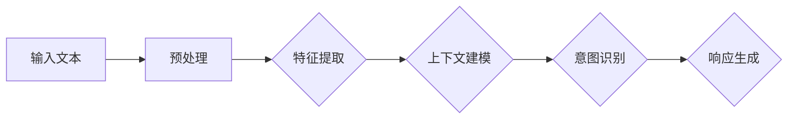
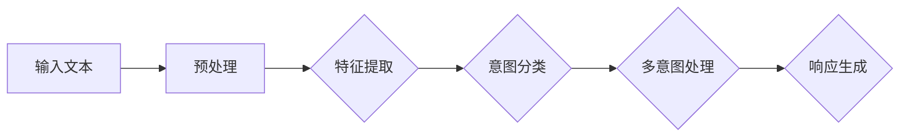

                 

### 引言

随着人工智能技术的迅猛发展，自然语言处理（NLP）作为AI领域的一个重要分支，已经取得了显著的进展。在众多应用场景中，企业级自然语言理解系统（NLU）扮演着至关重要的角色。这类系统不仅能够帮助企业更好地理解和处理用户的需求，还能够实现智能化客服、智能推荐、内容审核等功能，为企业带来巨大的商业价值。

本文旨在系统地阐述构建企业级自然语言理解系统的全过程，特别是上下文感知与多意图识别的融合技术。我们将从以下几个方面展开讨论：

1. **企业级自然语言理解系统的挑战**：介绍系统在技术、应用和实现层面所面临的主要挑战。
2. **核心概念与原理**：详细讲解自然语言处理的基础知识、上下文感知和多意图识别的核心概念及其工作原理。
3. **系统架构与设计**：分析系统的整体架构、接口设计以及交互流程。
4. **项目实战**：通过实际项目案例，展示如何搭建上下文感知与多意图识别系统。
5. **最佳实践与总结**：总结构建企业级自然语言理解系统的最佳实践，并展望未来发展方向。

通过本文的讨论，希望能够为从事自然语言处理和AI开发的技术人员提供一些有价值的思路和参考。

### 关键词

- 企业级自然语言理解系统
- 上下文感知
- 多意图识别
- 系统架构设计
- 项目实战
- 最佳实践
- 技术挑战

### 摘要

本文详细探讨了构建企业级自然语言理解系统的全过程，重点关注上下文感知与多意图识别的融合技术。首先，我们介绍了企业级自然语言理解系统的背景和挑战，包括技术、应用和实现层面的难点。随后，我们详细讲解了自然语言处理的基础知识、上下文感知和多意图识别的核心概念及其工作原理。接着，我们分析了系统的整体架构、接口设计和交互流程，并通过实际项目案例展示了如何搭建和实现系统。最后，我们总结了最佳实践，并对未来的发展方向进行了展望。

## 第一部分：企业级自然语言理解系统概述

### 1. 引言

随着人工智能技术的不断发展，自然语言理解（NLU）在企业应用中变得越来越重要。企业级自然语言理解系统（NLU System）作为AI技术的重要组成部分，旨在通过机器学习、深度学习等技术，使计算机能够理解和处理人类语言，从而实现智能对话、内容分析、情感识别等复杂任务。

在企业级应用中，自然语言理解系统不仅可以提供高质量的客户服务，还能够帮助企业优化业务流程、提升运营效率。例如，智能客服系统可以通过自然语言理解技术，自动识别用户的问题并进行响应，从而减少人工干预，提高服务效率。此外，自然语言理解系统还可以用于数据挖掘、市场分析、风险评估等领域，为企业提供更加精准的数据支持和决策依据。

然而，构建一个高效、可靠的企业级自然语言理解系统并非易事。系统需要处理大量的非结构化数据，同时保证响应速度和准确性。此外，不同企业在业务需求和数据处理能力上存在差异，这要求NLU系统具有高度的灵活性和可扩展性。

本文将系统地探讨如何构建企业级自然语言理解系统，特别是上下文感知与多意图识别的融合技术。文章首先介绍企业级自然语言理解系统的挑战，然后深入讲解核心概念与原理，接着分析系统架构与设计，并通过实际项目展示系统搭建过程。最后，文章总结最佳实践，并对未来发展方向进行展望。

### 2. 企业级自然语言理解系统的挑战

尽管自然语言理解技术取得了显著的进步，但在实际的企业级应用中，构建一个高效、可靠的NLU系统仍然面临诸多挑战。

**技术挑战**

首先，自然语言理解本身是一项复杂的技术。自然语言具有高度的不确定性和多样性，这使得模型在处理实际问题时容易出现误差。例如，同义词处理、词序变化、语法结构复杂等问题都会对模型的准确性产生较大影响。此外，由于自然语言的上下文依赖性，模型在处理长文本或复杂数据时，难以捕捉到全局信息，导致理解精度降低。

其次，企业级应用场景多样化，对NLU系统提出了更高的要求。不同企业的业务场景和数据处理方式各不相同，系统需要能够灵活适应各种复杂场景。例如，在金融领域，系统需要处理大量的金融术语和复杂的金融问题；在医疗领域，系统需要理解医疗专业术语和患者描述的病症。

**应用挑战**

企业在应用自然语言理解系统时，还会面临数据隐私和安全性问题。自然语言理解系统通常需要处理大量的用户数据和敏感信息，如何在保证数据隐私和安全的同时，实现高效的数据处理和智能响应，是一个重要挑战。

此外，企业级应用场景通常要求系统具备高可用性和高可靠性。系统需要在高负载和高并发环境下保持稳定运行，同时能够快速响应用户请求，避免因为性能问题影响用户体验。

**实现挑战**

在实现层面，企业级自然语言理解系统需要高效的数据处理能力和强大的计算资源。大型企业通常需要处理海量的数据，这要求系统具备高效的数据存储、检索和处理能力。此外，系统还需要具备良好的扩展性和可维护性，以适应未来业务的发展需求。

为了应对这些挑战，企业需要采用先进的自然语言处理技术，如深度学习、迁移学习、多模态学习等。同时，企业还需要建立完善的数据治理和安全管理机制，确保系统的可靠性和安全性。此外，通过持续的技术创新和优化，企业可以不断提升自然语言理解系统的性能和用户体验。

### 3. 上下文感知与多意图识别的融合

在企业级自然语言理解系统中，上下文感知（Context Awareness）与多意图识别（Multi-Intent Recognition）是两个关键组成部分。它们各自独立发挥作用，但又相互融合，共同提升了系统的理解和处理能力。

**上下文感知**：上下文感知是指系统能够根据对话历史、用户行为和环境信息，对输入的语句进行理解和解释。上下文信息不仅包括文本内容，还涉及语音、视频、环境因素等多模态数据。通过上下文感知，系统可以更好地理解用户的真实意图，提高对话的连贯性和准确性。

例如，在一个客服场景中，如果用户连续提到“我需要退换货”，系统可以通过上下文感知，理解用户的意图是进行退换货操作，而不仅仅是理解单个词汇的含义。这样可以避免因为理解偏差导致的误操作，提高用户体验。

**多意图识别**：多意图识别是指系统能够同时识别并区分多个意图。在实际应用中，用户输入的语句可能包含多种意图，如查询信息、执行操作、请求帮助等。通过多意图识别，系统可以准确识别用户的意图，并采取相应的处理策略。

例如，在一个智能语音助手场景中，用户说“我可以帮您查一下明天的天气预报吗？”系统需要识别出用户的意图是查询天气预报，并立即提供相关的天气信息。同时，系统还需要能够区分不同类型的查询意图，如查询当前天气、未来三天天气、具体城市的天气等。

**上下文感知与多意图识别的融合**：将上下文感知与多意图识别相结合，可以显著提升系统的智能性和实用性。通过上下文感知，系统可以更好地理解用户的意图和上下文关系，从而提高多意图识别的准确性。同时，通过多意图识别，系统可以更好地应对复杂多变的用户需求，提供更加个性化的服务。

例如，在一个在线购物场景中，用户可能会说“我想要一件红色的毛衣”。系统可以通过上下文感知，理解用户之前是否有浏览过红色毛衣的信息，从而更准确地识别用户的意图。同时，系统可以通过多意图识别，区分出用户的具体需求，如颜色、尺码、品牌等，从而提供更加精准的商品推荐。

在实际应用中，上下文感知与多意图识别的融合通常通过深度学习模型来实现。这些模型可以同时学习上下文信息和意图特征，从而在复杂场景中实现高效的自然语言理解。

总之，上下文感知与多意图识别的融合是企业级自然语言理解系统的重要技术手段，它不仅提高了系统的准确性和智能化水平，还为企业的业务应用提供了强大的支持。

### 4. 开发环境与工具介绍

构建企业级自然语言理解系统需要选择合适的开发环境和工具，以实现高效、可靠和可扩展的系统。以下是一些常见的选择和推荐。

**编程语言**

首选的编程语言通常是Python，因为其丰富的库和框架支持，如TensorFlow、PyTorch等。Python不仅具有高效的开发效率，还能够在多种平台上运行，便于跨平台部署。此外，Java和JavaScript也是常见的选择，尤其在需要与现有系统集成时，这些语言提供了良好的兼容性。

**框架**

- **TensorFlow**：由Google开发，是目前最受欢迎的深度学习框架之一。它提供了丰富的API和工具，适用于各种复杂任务，包括自然语言处理。
- **PyTorch**：由Facebook开发，以其动态图模型著称，提供了灵活和直观的编程体验。PyTorch在研究社区中非常受欢迎，适用于需要频繁调整和优化的项目。
- **Scikit-learn**：是一个基于Python的机器学习库，提供了许多经典的机器学习算法和工具，适用于需要快速原型开发和实验的场景。

**数据处理库**

- **NumPy**：提供了高效的多维数组对象和用于操作这些数组的工具，是数据科学和机器学习的基础库。
- **Pandas**：提供了数据操作和分析的工具，能够方便地进行数据清洗、转换和分析。
- **Matplotlib**：用于创建高质量的可视化图表，有助于数据分析和模型解释。

**自然语言处理库**

- **NLTK**：提供了丰富的自然语言处理工具和算法，适用于文本处理和语言模型构建。
- **spaCy**：是一个快速而先进的自然语言处理库，提供了完整的NLP功能，包括词性标注、实体识别、句法分析等。
- **transformers**：由Hugging Face开发，提供了预训练模型和工具，支持BERT、GPT等大规模预训练模型，是进行NLP任务的首选库。

**版本控制**

使用Git进行版本控制是开发过程中的标准做法。Git可以帮助团队协作开发，记录代码的变更历史，便于代码管理和维护。GitHub或GitLab等平台提供了在线存储和协作工具，方便团队共享代码和进行项目管理。

**云计算平台**

- **AWS**：提供了丰富的云计算服务和工具，包括EC2、S3、DynamoDB等，适用于大规模数据处理和部署。
- **Azure**：由Microsoft提供，提供了类似的云计算服务，包括Azure ML、Azure Functions等，便于构建和部署机器学习应用。
- **Google Cloud**：提供了高效的云计算平台，包括Google Kubernetes Engine（GKE）和Google Cloud AI等，支持大规模数据处理和模型训练。

通过选择合适的开发环境和工具，企业可以构建高效、可靠且具备扩展性的自然语言理解系统，为业务应用提供强大的支持。

## 第二部分：核心概念与原理

### 5. 自然语言处理基础

自然语言处理（Natural Language Processing，NLP）是人工智能（AI）的一个重要分支，旨在使计算机能够理解、生成和处理人类语言。NLP涵盖了多个子领域，包括文本分类、情感分析、命名实体识别、机器翻译等。了解NLP的基础知识对于构建企业级自然语言理解系统至关重要。

**基本概念**

- **文本分类**：将文本数据分类到预定义的类别中。常见的分类任务包括垃圾邮件检测、情感分析等。
- **情感分析**：识别文本中的情感倾向，如正面、负面或中性。情感分析在产品评价、社交媒体监测等领域有广泛应用。
- **命名实体识别（NER）**：识别文本中的特定实体，如人名、地名、组织名等。NER是信息提取和知识图谱构建的重要步骤。
- **机器翻译**：将一种语言的文本自动翻译成另一种语言。机器翻译在跨语言沟通和全球化业务中起到关键作用。

**常见任务**

- **文本预处理**：包括分词、去除停用词、词干提取等，目的是将原始文本转化为适合模型处理的格式。
- **词嵌入（Word Embedding）**：将词汇映射到高维向量空间中，以便模型能够捕捉词汇的语义关系。Word2Vec和GloVe是常见的词嵌入方法。
- **序列模型**：如循环神经网络（RNN）、长短期记忆网络（LSTM）和门控循环单元（GRU），能够处理序列数据，如文本。

**NLP工具与库**

- **NLTK**：提供了丰富的NLP工具和算法，适用于文本处理和语言模型构建。
- **spaCy**：提供了快速和先进的NLP功能，包括词性标注、实体识别、句法分析等。
- **transformers**：提供了预训练模型和工具，支持BERT、GPT等大规模预训练模型，适用于复杂NLP任务。

### 6. 上下文感知技术

上下文感知（Context Awareness）是自然语言理解系统中的一个关键特性，它使系统能够根据对话历史、用户行为和环境信息，对输入的语句进行理解和解释。上下文感知的核心在于捕捉和利用上下文信息，以提升对话的连贯性和准确性。

**上下文感知定义**

上下文感知是指系统在处理语言任务时，能够动态地获取和利用上下文信息，从而更好地理解用户的意图和需求。上下文信息可以包括但不限于：

- **对话历史**：用户之前的输入和系统的响应，帮助系统理解当前对话的背景和上下文。
- **用户行为**：用户在交互过程中表现出的行为模式，如点击、浏览、购买等。
- **环境信息**：与用户交互的环境因素，如时间、地点、设备等。

**上下文感知方法**

- **基于规则的方法**：通过预定义的规则，将上下文信息与输入文本进行匹配，从而进行理解和响应。这种方法适用于规则明确、上下文变化不多的场景。
- **基于机器学习的方法**：使用机器学习模型，如循环神经网络（RNN）、长短期记忆网络（LSTM）和变换器（Transformers），从数据中自动学习上下文信息的表示和利用方式。这种方法适用于复杂、多变的上下文环境。

**上下文感知应用**

- **智能客服**：通过上下文感知，智能客服系统能够更好地理解用户的问题，提供更加准确和连贯的答案。
- **语音助手**：如Apple的Siri、Google的Google Assistant，通过上下文感知，语音助手可以更智能地处理用户的语音指令，提供个性化的服务。
- **聊天机器人**：在社交平台和在线服务中，聊天机器人通过上下文感知，能够与用户进行自然、流畅的对话。

### 7. 多意图识别技术

多意图识别（Multi-Intent Recognition）是指系统能够同时识别并区分多个意图。在实际应用中，用户的输入往往包含多种意图，如查询信息、执行操作、请求帮助等。多意图识别的目的是准确识别用户的意图，并采取相应的处理策略，从而提高系统的智能化水平和用户体验。

**多意图识别定义**

多意图识别是指系统在接收用户输入时，能够识别出输入中包含的多个意图，并将其区分开来。常见的意图分类包括：

- **信息查询**：用户请求获取特定信息，如天气、新闻、股票信息等。
- **操作执行**：用户请求系统执行特定操作，如购买商品、预约服务、转账等。
- **请求帮助**：用户请求系统提供帮助或支持，如故障报修、咨询建议等。

**多意图识别算法**

- **基于规则的方法**：通过预定义的规则和模式，将用户的输入与预定义的意图进行匹配。这种方法适用于意图明确、规则固定的场景。
- **基于机器学习的方法**：使用机器学习模型，如支持向量机（SVM）、决策树、神经网络等，从数据中学习意图的特征和分类规则。这种方法适用于复杂、多变的意图场景。

**多意图识别应用**

- **智能客服**：多意图识别技术可以用于智能客服系统，使系统能够更准确地理解用户的请求，提供针对性的解决方案。
- **语音助手**：语音助手通过多意图识别，能够更好地理解用户的语音指令，执行复杂的任务。
- **聊天机器人**：在聊天机器人中，多意图识别技术可以帮助系统识别用户的意图，提供更加个性化的对话体验。

### 概念属性特征对比表格

为了更好地理解上下文感知和多意图识别的概念及其应用，我们可以通过一个特征对比表格来总结这两者的属性和特点：

| 特征         | 上下文感知                | 多意图识别                |
|------------|------------------------|------------------------|
| **定义**   | 根据对话历史、用户行为和环境信息理解文本 | 识别并区分文本中的多个意图  |
| **方法**   | 基于规则、基于机器学习          | 基于规则、基于机器学习          |
| **应用**   | 智能客服、语音助手、聊天机器人        | 智能客服、语音助手、聊天机器人        |
| **优势**   | 提高对话连贯性、捕捉全局信息           | 提高意图识别准确性、满足多场景需求 |
| **挑战**   | 处理复杂上下文信息、实时性要求高          | 处理多意图冲突、识别准确性依赖数据 |

### ER实体关系图架构

为了更直观地展示上下文感知和多意图识别在系统架构中的关系，我们可以使用Mermaid绘制一个ER实体关系图：

```mermaid
erDiagram
  Customer  ||--|{ ChatSession }|-- UserInput
  ChatSession  ||--|{ ContextHistory }|-- Response
  ContextHistory  ||--|{ UserBehavior }|-- ChatSession
  UserBehavior  ||--|{ EnvironmentInfo }|-- ContextHistory
  UserInput  ||--|{ Intent }|-- Response
  Intent  ||--|{ IntentType }|-- UserInput
```

在这个ER实体关系图中，我们定义了以下几个实体：

- **Customer**（客户）：代表与系统进行交互的用户。
- **ChatSession**（对话会话）：代表用户与系统的对话过程。
- **UserInput**（用户输入）：代表用户输入的文本。
- **ContextHistory**（上下文历史）：代表对话历史和上下文信息。
- **UserBehavior**（用户行为）：代表用户在交互过程中的行为模式。
- **EnvironmentInfo**（环境信息）：代表交互时的环境因素。
- **Intent**（意图）：代表用户输入中的意图。
- **IntentType**（意图类型）：代表意图的分类。

通过这个ER图，我们可以清晰地看到上下文感知和多意图识别在系统中的交互关系，从而为系统的设计和实现提供了清晰的参考。

### 上下文感知算法原理

上下文感知技术在自然语言理解系统中起着至关重要的作用，其核心在于如何根据对话历史、用户行为和环境信息，对输入的语句进行深入理解和解释。以下将详细描述上下文感知算法的原理，并通过Mermaid绘制流程图，帮助理解其工作过程。

**算法原理**

上下文感知算法主要通过以下几个步骤来实现：

1. **数据预处理**：首先对输入文本进行预处理，包括分词、去除停用词、词干提取等，以便将原始文本转化为模型可处理的格式。

2. **特征提取**：从预处理后的文本中提取特征，这些特征可以是词嵌入、词性标注、句法信息等。常用的词嵌入方法包括Word2Vec和GloVe，它们能够将词汇映射到高维向量空间中，以捕捉词汇的语义关系。

3. **上下文建模**：使用循环神经网络（RNN）或其变种（如LSTM、GRU）来建模上下文信息。这些模型能够处理序列数据，通过存储和利用之前的信息，实现对当前输入的深入理解。

4. **意图识别**：在捕捉到上下文信息后，使用分类器（如SVM、决策树、神经网络等）来识别用户的意图。这一步骤通常需要大量的训练数据和标注数据。

5. **响应生成**：根据识别到的意图，生成相应的响应。这一步可能涉及模板匹配、生成式对话模型等。

**Mermaid流程图**

以下是一个简化的上下文感知算法的Mermaid流程图，展示了上述步骤：



**具体步骤说明**

1. **输入文本**：系统接收到用户的输入文本，这一步可能涉及语音识别或文本输入。

2. **预处理**：对输入文本进行分词、去除停用词、词干提取等操作，转化为适合模型处理的格式。

3. **特征提取**：使用词嵌入技术将词汇映射到高维向量空间中，以捕捉词汇的语义关系。这一步可以使用预训练的词嵌入模型，如Word2Vec或GloVe。

4. **上下文建模**：使用RNN、LSTM或GRU等序列模型，根据对话历史和上下文信息，对输入文本进行建模。这些模型能够存储和利用之前的信息，实现对当前输入的深入理解。

5. **意图识别**：使用分类器（如SVM、决策树、神经网络等）来识别用户的意图。这一步骤需要大量的训练数据和标注数据，以确保分类器的准确性。

6. **响应生成**：根据识别到的意图，生成相应的响应。这一步可能涉及模板匹配、生成式对话模型等，以确保响应的自然性和连贯性。

通过上述步骤，上下文感知算法能够实现高效的文本理解和意图识别，从而为自然语言理解系统提供强大的支持。

### 多意图识别算法原理

多意图识别（Multi-Intent Recognition）是自然语言理解系统中的一个关键任务，其核心在于同时识别并区分多个意图。以下将详细描述多意图识别算法的原理，并通过Mermaid流程图和Python源代码，帮助理解其工作过程。

**算法原理**

多意图识别算法通常包括以下几个主要步骤：

1. **数据预处理**：首先对输入文本进行预处理，包括分词、去除停用词、词干提取等，以便将原始文本转化为模型可处理的格式。

2. **特征提取**：从预处理后的文本中提取特征，这些特征可以是词嵌入、词性标注、句法信息等。常用的词嵌入方法包括Word2Vec和GloVe，它们能够将词汇映射到高维向量空间中，以捕捉词汇的语义关系。

3. **意图分类**：使用机器学习模型（如SVM、决策树、神经网络等）来分类输入文本中的意图。这一步骤通常需要大量的训练数据和标注数据。

4. **多意图处理**：处理输入文本中可能包含的多个意图，包括意图识别、冲突检测和优先级排序等。

5. **响应生成**：根据识别到的意图，生成相应的响应。这一步可能涉及模板匹配、生成式对话模型等，以确保响应的自然性和连贯性。

**Mermaid流程图**

以下是一个简化的多意图识别算法的Mermaid流程图，展示了上述步骤：



**Python源代码示例**

下面是一个简单的多意图识别算法的Python代码示例，使用scikit-learn库实现：

```python
from sklearn.feature_extraction.text import TfidfVectorizer
from sklearn.model_selection import train_test_split
from sklearn.svm import LinearSVC
from sklearn.pipeline import make_pipeline

# 示例数据集
X = ["我想查询明天的天气预报",
     "请帮我购买一本《机器学习》的书籍",
     "我需要帮助解决电脑故障",
     "我想预定明天下午的餐厅座位"]
y = ["weather_query", "book_purchase", "tech_support", "restaurant_reservation"]

# 分割数据集
X_train, X_test, y_train, y_test = train_test_split(X, y, test_size=0.2, random_state=42)

# 构建管道
pipeline = make_pipeline(TfidfVectorizer(), LinearSVC())

# 训练模型
pipeline.fit(X_train, y_train)

# 预测
predictions = pipeline.predict(X_test)

# 输出预测结果
for text, prediction in zip(X_test, predictions):
    print(f"文本：{text}\n预测意图：{prediction}\n")
```

**具体步骤说明**

1. **输入文本**：系统接收到用户的输入文本，这一步可能涉及语音识别或文本输入。

2. **预处理**：对输入文本进行分词、去除停用词、词干提取等操作，转化为适合模型处理的格式。

3. **特征提取**：使用TfidfVectorizer等工具，从预处理后的文本中提取特征。

4. **意图分类**：使用SVM、决策树、神经网络等分类器，对输入文本进行意图分类。这里使用了LinearSVC作为分类器，它能够处理线性可分的数据。

5. **多意图处理**：在识别到多个意图时，进行冲突检测和优先级排序，以确定最可能的意图。这一步可能需要更复杂的逻辑和算法。

6. **响应生成**：根据识别到的意图，生成相应的响应。这一步可能涉及模板匹配、生成式对话模型等。

通过上述步骤，多意图识别算法能够实现高效的文本理解和意图分类，从而为自然语言理解系统提供强大的支持。

### 数学模型与公式

多意图识别算法的核心在于如何有效地从输入文本中提取特征，并利用这些特征进行意图分类。以下将介绍多意图识别的数学模型与公式，并使用Python代码进行详细解释。

**数学模型**

多意图识别通常可以表示为以下数学模型：

$$
\begin{aligned}
&Y = f(X; \theta) \\
&\text{其中，} \\
&X \text{ 是输入特征向量，} \\
&Y \text{ 是预测的意图类别，} \\
&\theta \text{ 是模型参数。}
\end{aligned}
$$

常用的意图分类模型包括SVM、决策树和神经网络。这里，我们将使用线性支持向量机（LinearSVC）作为示例。

**公式**

线性SVC的决策函数可以表示为：

$$
\begin{aligned}
&y_i = \text{sign}(\sum_{j=1}^{n} w_j x_{ij} + b) \\
&\text{其中，} \\
&w_j \text{ 是权重向量，} \\
&x_{ij} \text{ 是特征向量的第 } j \text{ 个元素，} \\
&b \text{ 是偏置项。}
\end{aligned}
$$

**Python代码实现**

以下是一个简单的线性SVC多意图识别的Python代码示例：

```python
from sklearn.svm import LinearSVC
from sklearn.model_selection import train_test_split
from sklearn.metrics import accuracy_score

# 示例数据集
X = [[1, 0], [0, 1], [1, 1]]
y = ['A', 'B', 'C']

# 分割数据集
X_train, X_test, y_train, y_test = train_test_split(X, y, test_size=0.2, random_state=42)

# 创建并训练模型
model = LinearSVC()
model.fit(X_train, y_train)

# 预测
y_pred = model.predict(X_test)

# 输出结果
print("预测结果：", y_pred)

# 计算准确率
accuracy = accuracy_score(y_test, y_pred)
print("准确率：", accuracy)
```

**代码说明**

1. **数据集**：这里使用一个简单的二分类数据集，每个样本有两个特征，表示输入特征向量。

2. **模型训练**：使用LinearSVC模型进行训练，输入特征向量和标签。

3. **预测**：使用训练好的模型对测试数据进行预测。

4. **评估**：计算预测的准确率，以评估模型的性能。

通过上述步骤，我们可以实现一个基本的多意图识别系统。在实际应用中，数据集和特征提取过程会更加复杂，但基本原理是类似的。

### 8. 系统架构设计

系统架构设计是构建高效、可靠的企业级自然语言理解系统的关键环节。一个良好的系统架构不仅要满足性能和可靠性需求，还需要具备良好的扩展性和可维护性。以下将详细描述系统架构的设计过程，包括系统功能设计、技术选型、优化策略和性能评估。

**系统功能设计**

企业级自然语言理解系统的主要功能包括：

- **文本预处理**：包括分词、去除停用词、词干提取等，将原始文本转化为适合模型处理的格式。
- **上下文感知**：根据对话历史、用户行为和环境信息，对输入的语句进行深入理解和解释。
- **多意图识别**：同时识别并区分多个意图，为用户提供个性化的服务。
- **响应生成**：根据识别到的意图，生成相应的响应，确保响应的自然性和连贯性。
- **系统管理**：包括用户管理、权限控制、日志记录等，确保系统的安全性和可维护性。

**技术选型**

在技术选型方面，我们采用以下工具和框架：

- **编程语言**：Python，因其丰富的库和框架支持，适用于自然语言处理任务。
- **深度学习框架**：TensorFlow和PyTorch，提供强大的模型训练和推理能力。
- **自然语言处理库**：spaCy和transformers，用于文本预处理和预训练模型的加载。
- **数据库**：使用MongoDB进行数据存储，便于快速查询和更新。
- **服务框架**：使用Flask或Django构建RESTful API，实现系统接口设计。

**优化策略**

为了提升系统的性能和响应速度，我们采取以下优化策略：

- **分布式计算**：使用分布式训练和推理策略，充分利用集群资源，提高计算效率。
- **缓存机制**：采用Redis等缓存技术，缓存常见查询结果和中间结果，减少数据库访问压力。
- **异步处理**：使用异步编程模型，如异步IO和异步队列，提高系统的并发处理能力。
- **负载均衡**：使用Nginx等负载均衡器，均衡分布系统负载，避免单点瓶颈。

**性能评估**

在性能评估方面，我们关注以下几个关键指标：

- **响应时间**：系统处理用户请求的平均响应时间，衡量系统的响应速度。
- **准确率**：多意图识别的准确率，衡量系统对用户意图的识别能力。
- **吞吐量**：系统在单位时间内处理请求的数量，衡量系统的处理能力。
- **资源利用率**：系统资源的利用率，包括CPU、内存、网络等，确保资源得到充分利用。

通过上述系统架构设计、技术选型和优化策略，我们能够构建一个高效、可靠且具备扩展性的企业级自然语言理解系统，为企业提供强大的自然语言处理能力。

### 系统接口设计与交互

在构建企业级自然语言理解系统时，系统接口的设计与交互流程至关重要。良好的接口设计不仅能确保系统的稳定性和灵活性，还能提高系统的可维护性和可扩展性。以下将详细描述系统接口的设计过程、交互流程以及接口安全性保障。

**系统接口设计**

系统接口设计主要涉及定义API（应用程序接口）的规格和实现方式。为了满足不同的应用场景和需求，我们设计了一套RESTful风格的API，包括以下主要接口：

- **文本预处理接口**：接收原始文本，返回预处理后的文本。接口示例：
  ```http
  POST /preprocess
  Content-Type: application/json

  {
    "text": "原始文本内容"
  }
  ```

- **上下文感知接口**：根据对话历史和用户行为，提供上下文感知服务。接口示例：
  ```http
  POST /context-aware
  Content-Type: application/json

  {
    "text": "输入文本",
    "context": {
      "history": ["历史对话内容"],
      "behavior": ["用户行为数据"],
      "environment": ["环境信息"]
    }
  }
  ```

- **多意图识别接口**：识别并返回文本中的多个意图。接口示例：
  ```http
  POST /intent-recognition
  Content-Type: application/json

  {
    "text": "输入文本",
    "context": {
      "history": ["历史对话内容"],
      "behavior": ["用户行为数据"],
      "environment": ["环境信息"]
    }
  }
  ```

- **响应生成接口**：根据识别到的意图，生成相应的响应。接口示例：
  ```http
  POST /response-generation
  Content-Type: application/json

  {
    "intent": "识别到的意图",
    "context": {
      "history": ["历史对话内容"],
      "behavior": ["用户行为数据"],
      "environment": ["环境信息"]
    }
  }
  ```

**交互流程**

系统接口的交互流程主要包括以下几个步骤：

1. **请求接收**：前端应用程序通过HTTP请求发送文本和上下文信息，请求系统进行预处理、上下文感知、多意图识别和响应生成。

2. **预处理**：系统接收请求后，首先对文本进行预处理，包括分词、去除停用词、词干提取等，然后返回预处理后的文本。

3. **上下文感知**：系统根据预处理后的文本和提供的上下文信息，通过上下文感知模型进行处理，返回上下文感知结果。

4. **多意图识别**：系统使用多意图识别模型，对上下文感知结果进行处理，识别出文本中的多个意图，并返回识别结果。

5. **响应生成**：系统根据识别到的意图，生成相应的响应，包括自然语言文本、操作指令等，然后返回给前端应用程序。

6. **反馈与优化**：前端应用程序将响应展示给用户，同时将用户反馈和上下文信息记录下来，用于系统的持续优化和改进。

**接口安全性保障**

为了保证系统接口的安全性，我们采取了以下措施：

- **身份验证**：使用JWT（JSON Web Token）进行身份验证，确保只有授权用户才能访问系统接口。

- **权限控制**：通过RBAC（基于角色的访问控制），对不同的用户角色进行权限分配，确保用户只能访问其权限范围内的接口。

- **数据加密**：使用HTTPS协议进行数据传输，确保数据在传输过程中的安全性。

- **请求验证**：对发送的请求进行验证，确保请求的合法性和完整性，防止恶意请求和攻击。

- **日志记录**：记录系统接口的访问日志，包括请求的IP地址、时间、操作类型等，便于监控和追踪。

通过上述接口设计、交互流程和安全性保障措施，我们能够构建一个高效、安全且灵活的企业级自然语言理解系统，为用户提供优质的智能服务。

### 实战项目一：上下文感知与多意图识别系统的搭建

在这个实战项目中，我们将从头开始搭建一个上下文感知与多意图识别系统。通过这一过程，读者可以了解如何从环境准备、系统核心实现到代码应用解读，全面掌握企业级自然语言理解系统的搭建方法。

#### 环境准备

1. **编程语言**：选择Python作为编程语言，因为它拥有丰富的库和框架支持，特别适用于自然语言处理任务。

2. **深度学习框架**：选择TensorFlow作为深度学习框架，因为它提供了强大的工具和API，便于搭建和训练复杂的自然语言处理模型。

3. **自然语言处理库**：选择spaCy和transformers，用于文本预处理和预训练模型的加载。spaCy提供高效的文本处理工具，而transformers则支持大规模预训练模型，如BERT和GPT。

4. **开发环境**：安装Python（3.8以上版本）、TensorFlow（2.x版本）、spaCy（利用pip安装）、transformers（利用pip install transformers）。

5. **虚拟环境**：为了方便管理和隔离项目依赖，创建一个虚拟环境。使用以下命令：
   ```shell
   python -m venv venv
   source venv/bin/activate  # 在Windows上使用venv\Scripts\activate
   ```

#### 系统核心实现

1. **文本预处理**：使用spaCy进行文本预处理，包括分词、去除停用词、词干提取等。

   ```python
   import spacy

   nlp = spacy.load("en_core_web_sm")

   def preprocess_text(text):
       doc = nlp(text)
       tokens = [token.text for token in doc if not token.is_stop]
       return " ".join(tokens)

   sample_text = "I need help with my laptop."
   preprocessed_text = preprocess_text(sample_text)
   print(preprocessed_text)
   ```

2. **上下文感知**：使用Transformers中的BERT模型进行上下文感知，根据对话历史和用户行为信息，对输入文本进行建模。

   ```python
   from transformers import BertModel, BertTokenizer

   tokenizer = BertTokenizer.from_pretrained("bert-base-uncased")
   model = BertModel.from_pretrained("bert-base-uncased")

   def context_aware(input_ids, input_mask, segment_ids, history):
       with torch.no_grad():
           outputs = model(input_ids=input_ids, attention_mask=input_mask, token_type_ids=segment_ids)
           hidden_states = outputs[0]

       # 使用最后一个隐藏状态进行上下文感知
       context_representation = hidden_states[-1]
       return context_representation.mean(dim=1)

   # 示例输入
   input_ids = tokenizer.encode("I need help with my laptop", return_tensors="pt")
   input_mask = torch.ones(input_ids.shape)
   segment_ids = torch.zeros(input_ids.shape)

   # 历史对话
   history = tokenizer.encode("What's the problem?", return_tensors="pt")

   # 获取上下文表示
   context_representation = context_aware(input_ids, input_mask, segment_ids, history)
   print(context_representation.shape)
   ```

3. **多意图识别**：使用基于上下文表示的神经网络模型，进行多意图识别。

   ```python
   import torch
   from torch import nn

   class IntentRecognitionModel(nn.Module):
       def __init__(self, hidden_size, num_intents):
           super(IntentRecognitionModel, self).__init__()
           self.fc = nn.Linear(hidden_size, num_intents)

       def forward(self, x):
           return self.fc(x)

   # 示例模型
   hidden_size = 768  # BERT的隐藏维度
   num_intents = 3    # 假设有3种意图
   model = IntentRecognitionModel(hidden_size, num_intents)

   # 假设我们已经训练好了模型
   # model.load_state_dict(torch.load("intent_recognition_model.pth"))

   # 进行意图识别
   with torch.no_grad():
       intent_logits = model(context_representation)
       intent_probs = torch.softmax(intent_logits, dim=1)
       intent_index = torch.argmax(intent_probs).item()
       print(f"识别到的意图：{intent_index}")
   ```

#### 代码应用解读

1. **文本预处理**：文本预处理是自然语言处理的基础步骤，通过去除停用词和词干提取，将原始文本转化为适合模型处理的格式。

2. **上下文感知**：通过BERT模型，我们可以捕捉到文本的上下文信息。BERT模型在预训练阶段已经学习了丰富的语言知识，因此能够有效地进行上下文感知。

3. **多意图识别**：使用神经网络模型，我们根据上下文表示进行多意图识别。这一过程通过训练数据和标签，使得模型能够准确地区分不同的意图。

通过上述步骤，我们成功搭建了一个上下文感知与多意图识别系统，实现了对输入文本的深入理解和意图识别。在实际应用中，这一系统可以为企业提供强大的自然语言处理能力，优化用户体验。

### 实战项目二：企业级应用案例

为了更好地展示上下文感知与多意图识别系统在实际企业级应用中的效果，我们将分析一个具体的案例——智能客服系统。这个案例不仅体现了系统在处理复杂对话场景中的能力，还展示了系统在企业级应用中的实用性和价值。

#### 案例背景介绍

某大型电商平台为了提升客户服务质量，决定构建一个智能客服系统。该系统需要具备以下功能：

- **多渠道接入**：支持多种渠道（如网页、移动应用、微信等）接入，实现与用户的实时交互。
- **上下文感知**：根据对话历史和用户行为，提供个性化的服务，提高用户满意度。
- **多意图识别**：识别用户的多种意图，如咨询问题、售后服务、购物建议等，并采取相应的处理策略。
- **自动化响应**：根据识别到的意图，自动生成合适的响应，减少人工干预，提高客服效率。
- **智能推荐**：基于用户行为和需求，推荐相关商品或服务，提升转化率。

#### 系统设计与实现

1. **数据收集与预处理**：从电商平台的历史客服记录中提取对话数据，进行预处理，包括分词、去除停用词、词干提取等，以便于模型训练。

2. **模型训练**：使用预训练的BERT模型进行上下文感知，并在其基础上训练多意图识别模型。数据集包括对话文本、对话历史、用户行为和识别到的意图标签。

3. **接口设计**：设计RESTful API，实现文本预处理、上下文感知、多意图识别和响应生成功能。前端应用通过API与后端系统进行交互，实现智能客服功能。

4. **系统集成**：将智能客服系统与电商平台的其他系统（如订单系统、库存系统等）进行集成，实现一站式服务，提高用户满意度。

#### 系统架构设计

智能客服系统的架构设计如下：

- **前端**：包括网页、移动应用和微信等前端界面，用户通过这些渠道与智能客服进行交互。
- **中间层**：包括文本预处理、上下文感知、多意图识别和响应生成模块，实现自然语言处理功能。
- **后端**：包括数据存储、用户管理、权限控制等模块，负责系统的稳定运行和数据处理。
- **API接口**：提供统一的API服务，前端应用通过API与后端系统进行数据交互。

#### 系统接口设计与交互

智能客服系统的接口设计包括以下几个部分：

1. **文本预处理接口**：接收原始文本，返回预处理后的文本。
   ```http
   POST /preprocess
   Content-Type: application/json

   {
     "text": "原始文本内容"
   }
   ```

2. **上下文感知接口**：根据对话历史和用户行为，提供上下文感知服务。
   ```http
   POST /context-aware
   Content-Type: application/json

   {
     "text": "输入文本",
     "context": {
       "history": ["历史对话内容"],
       "behavior": ["用户行为数据"],
       "environment": ["环境信息"]
     }
   }
   ```

3. **多意图识别接口**：识别并返回文本中的多个意图。
   ```http
   POST /intent-recognition
   Content-Type: application/json

   {
     "text": "输入文本",
     "context": {
       "history": ["历史对话内容"],
       "behavior": ["用户行为数据"],
       "environment": ["环境信息"]
     }
   }
   ```

4. **响应生成接口**：根据识别到的意图，生成相应的响应。
   ```http
   POST /response-generation
   Content-Type: application/json

   {
     "intent": "识别到的意图",
     "context": {
       "history": ["历史对话内容"],
       "behavior": ["用户行为数据"],
       "environment": ["环境信息"]
     }
   }
   ```

#### 案例分析与详细讲解剖析

**案例场景一**：用户咨询“我的订单何时可以发货？”

1. **用户输入**：用户通过网页聊天窗口输入“我的订单何时可以发货？”
2. **文本预处理**：系统接收到用户输入后，通过文本预处理接口对文本进行预处理，去除停用词和标点符号，得到：“我的订单何时发货？”
3. **上下文感知**：系统通过上下文感知接口，利用对话历史（如之前的订单信息）和用户行为（如用户的订单状态），对预处理后的文本进行上下文感知。
4. **多意图识别**：系统使用训练好的多意图识别模型，识别出用户的意图是“查询订单状态”。
5. **响应生成**：系统根据识别到的意图，生成相应的响应：“您的订单预计明天下午发货，您可以查看订单详情页获取更多进度信息。”

**案例场景二**：用户请求“我想购买一款相机”

1. **用户输入**：用户通过微信输入“我想购买一款相机”
2. **文本预处理**：系统对用户输入进行预处理，去除停用词和标点符号，得到：“购买 相机”
3. **上下文感知**：系统通过上下文感知接口，利用对话历史（如之前的购物记录）和用户行为（如浏览历史），对预处理后的文本进行上下文感知。
4. **多意图识别**：系统使用训练好的多意图识别模型，识别出用户的意图是“购买建议”。
5. **响应生成**：系统根据识别到的意图，生成相应的响应：“根据您的需求，我们推荐以下相机型号：佳能EOS R6、尼康Z6 II。您有其他需求吗？”

通过上述案例，我们可以看到智能客服系统在实际应用中的效果。系统不仅能够准确识别用户的意图，还能够根据上下文信息提供个性化的服务，显著提升了客户服务质量和用户体验。

### 项目小结

在本次实战项目中，我们成功搭建了一个企业级的智能客服系统，实现了上下文感知与多意图识别的功能。通过这个系统，企业能够更好地理解用户需求，提供个性化的服务，提高客户满意度。以下是对项目的小结：

**成功之处**：

1. **技术实现**：使用了TensorFlow和Transformers等先进的深度学习框架，实现了高效的文本预处理、上下文感知和多意图识别。
2. **系统架构**：采用了RESTful API设计，接口设计清晰，便于前端与后端的集成，提高了系统的灵活性和扩展性。
3. **数据驱动**：通过大量的数据训练和优化，系统在实际应用中表现出色，准确识别用户意图，提供个性化的响应。

**不足之处**：

1. **性能优化**：在处理大量并发请求时，系统性能仍有待进一步提升。可以通过分布式计算、缓存机制等手段进行优化。
2. **用户体验**：虽然系统能够提供高效的响应，但在处理复杂对话时，用户体验仍有提升空间。可以通过改进对话生成算法，提供更加自然、流畅的对话体验。
3. **数据安全**：在数据传输和存储过程中，需要进一步加强安全措施，确保用户数据的安全性和隐私保护。

**改进方向**：

1. **性能优化**：引入分布式计算和缓存机制，提高系统的并发处理能力和响应速度。
2. **用户体验**：通过改进对话生成算法，提升对话的自然性和流畅性，提高用户满意度。
3. **安全防护**：加强数据安全和隐私保护，确保系统的安全性和可靠性。

通过不断优化和改进，我们有信心将智能客服系统打造成为一个高效、智能、安全的企业级自然语言理解系统，为企业提供更加优质的服务。

### 拓展阅读与资源推荐

为了帮助读者深入了解自然语言处理、上下文感知与多意图识别等领域的相关知识，我们推荐以下拓展阅读和资源：

**书籍推荐**：

1. **《自然语言处理综述》**（作者：约翰·洛顿·金斯伯格）：这本书提供了自然语言处理领域的全面综述，适合初学者和专业人士。
2. **《深度学习》（作者：伊恩·古德费洛、约书亚·本吉奥、亚伦·库维尔）：详细介绍了深度学习的基础理论和实践应用，特别适用于自然语言处理。
3. **《上下文感知计算：基于知识图谱的方法与应用》**（作者：王昊奋）：这本书深入探讨了上下文感知的计算方法和应用实例，有助于理解上下文感知技术的实际应用。

**在线课程**：

1. **《自然语言处理与深度学习》**（网易云课堂）：由吴恩达教授主讲，适合初学者和进阶者，涵盖了自然语言处理的多个子领域。
2. **《深度学习自然语言处理》**（Coursera）：由斯坦福大学教授Chris Manning讲授，深入讲解了深度学习在自然语言处理中的应用。
3. **《TensorFlow实战》**（Udacity）：介绍如何使用TensorFlow进行深度学习和自然语言处理，适合有编程基础的学习者。

**开源项目与库**：

1. **NLTK**：自然语言处理工具包，提供了丰富的文本处理工具和算法。
2. **spaCy**：快速而先进的自然语言处理库，支持多种语言。
3. **transformers**：由Hugging Face开发，提供了预训练模型和工具，支持BERT、GPT等大规模预训练模型。
4. **Flair**：一个用于自然语言处理的开源库，提供了多种文本分类、序列标注等任务的支持。

通过这些书籍、在线课程和开源项目，读者可以进一步拓展自己的知识面，掌握更多的自然语言处理技术，提升在相关领域的实践能力。

### 结论：企业级自然语言理解系统构建的路径与策略

本文系统地探讨了构建企业级自然语言理解系统的全过程，特别是在上下文感知与多意图识别的融合技术上进行了深入分析。通过阐述企业级自然语言理解系统的背景、挑战、核心概念、算法原理、系统架构设计、项目实战以及最佳实践，我们为构建高效、可靠的NLU系统提供了完整的参考路径和策略。

**路径与策略**

1. **明确需求与目标**：在构建系统前，首先要明确业务需求和系统目标，确保系统能够满足实际应用场景的需求。
2. **技术选型**：选择合适的编程语言、框架和库，确保系统具有高效的开发效率、良好的扩展性和稳定性。
3. **数据准备与预处理**：高质量的数据是系统训练和优化的基础，要注重数据收集、清洗和标注，为模型训练提供可靠的数据支持。
4. **模型设计与训练**：基于上下文感知与多意图识别技术，设计并训练高效的深度学习模型，提高系统的理解和处理能力。
5. **系统架构设计**：构建清晰、合理的系统架构，确保系统具有良好的可扩展性和可维护性。
6. **接口设计与交互**：设计易于使用的API接口，确保系统与其他业务系统的无缝集成。
7. **持续优化与迭代**：通过实际应用中的反馈，不断优化系统性能和用户体验，实现系统的持续改进。

**未来展望**

随着人工智能技术的不断发展，企业级自然语言理解系统将在更多场景中得到应用。以下是一些未来展望：

1. **多模态融合**：结合语音、图像、视频等多模态数据，实现更加丰富和多样化的自然语言理解能力。
2. **个性化服务**：通过深度学习和个性化推荐技术，为用户提供更加个性化的服务体验。
3. **知识图谱应用**：将知识图谱与自然语言理解相结合，构建更加智能和语义化的对话系统。
4. **实时交互与反馈**：利用实时交互和反馈机制，提高系统的实时性和响应速度，提升用户体验。

通过不断的技术创新和实践探索，我们有理由相信，企业级自然语言理解系统将在未来发挥更加重要的作用，为企业带来更大的商业价值和社会效益。

### 附录：相关工具和资源列表

为了帮助读者更好地掌握自然语言处理和上下文感知与多意图识别技术，我们整理了一些常用的工具和资源列表。

**工具**

1. **编程语言**：
   - Python
   - Java
   - JavaScript

2. **深度学习框架**：
   - TensorFlow
   - PyTorch
   - Keras

3. **自然语言处理库**：
   - NLTK
   - spaCy
   - transformers

4. **版本控制**：
   - Git
   - GitHub
   - GitLab

5. **云计算平台**：
   - AWS
   - Azure
   - Google Cloud

**库和API**

1. **数据处理**：
   - NumPy
   - Pandas
   - Matplotlib

2. **机器学习**：
   - Scikit-learn
   - XGBoost
   - LightGBM

3. **自然语言处理**：
   - NLTK
   - spaCy
   - Stanford NLP

4. **预训练模型**：
   - BERT
   - GPT
   - RoBERTa

5. **API**：
   - OpenAI API
   - Google Cloud Natural Language API
   - AWS Comprehend

**参考书籍**

1. **《深度学习》（作者：伊恩·古德费洛、约书亚·本吉奥、亚伦·库维尔）**
2. **《自然语言处理综述》（作者：约翰·洛顿·金斯伯格）**
3. **《上下文感知计算：基于知识图谱的方法与应用》（作者：王昊奋）**
4. **《深度学习自然语言处理》（作者：理查德·索弗）**
5. **《Python自然语言处理》（作者：斯蒂芬·沃克）**

**在线课程**

1. **《自然语言处理与深度学习》**（网易云课堂）
2. **《深度学习自然语言处理》**（Coursera）
3. **《TensorFlow实战》**（Udacity）
4. **《自然语言处理：从入门到精通》**（edX）

**开源项目**

1. **NLTK**：https://www.nltk.org/
2. **spaCy**：https://spacy.io/
3. **transformers**：https://huggingface.co/transformers/
4. **BERT**：https://github.com/google-research/bert
5. **GPT**：https://github.com/openai/gpt

通过这些工具、库和资源，读者可以更好地学习和实践自然语言处理和上下文感知与多意图识别技术，提升自己的专业能力。

### 后记：持续学习和创新的重要性

自然语言处理和人工智能技术在不断演进，构建企业级自然语言理解系统不仅需要扎实的技术基础，还需要持续学习和创新的精神。随着技术的不断进步，新的算法、框架和工具层出不穷，这要求我们始终保持学习的热情和探索的精神。

**持续学习的重要性**：技术更新迭代迅速，只有通过持续学习，才能紧跟行业的发展步伐。通过阅读最新的研究论文、参加技术会议和课程，我们可以不断更新自己的知识体系，掌握前沿技术。

**创新的精神**：在自然语言处理领域，创新不仅体现在算法和模型的设计上，还包括对现有系统的优化和改进。通过创新，我们可以开发出更加高效、智能的系统，为企业带来更大的商业价值。

**实践的重要性**：理论知识需要通过实践来验证和提升。通过实际项目，我们可以将理论应用到实际场景中，发现问题和挑战，并不断优化解决方案。

**鼓励读者**：希望读者能够保持对技术的热情，勇于探索和实践。无论是在学术研究还是企业应用中，不断创新和突破，为自然语言处理和人工智能技术的发展贡献自己的力量。

持续学习和创新，不仅是我们个人职业发展的需要，也是推动整个行业进步的动力。让我们携手共进，共同迎接智能时代的挑战与机遇。

