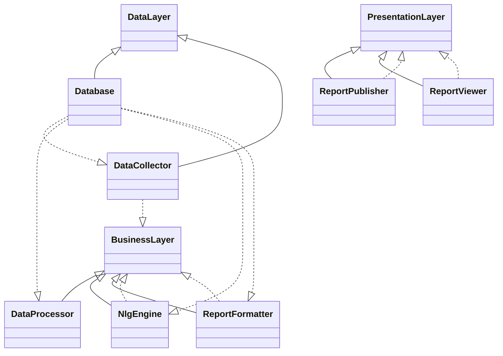
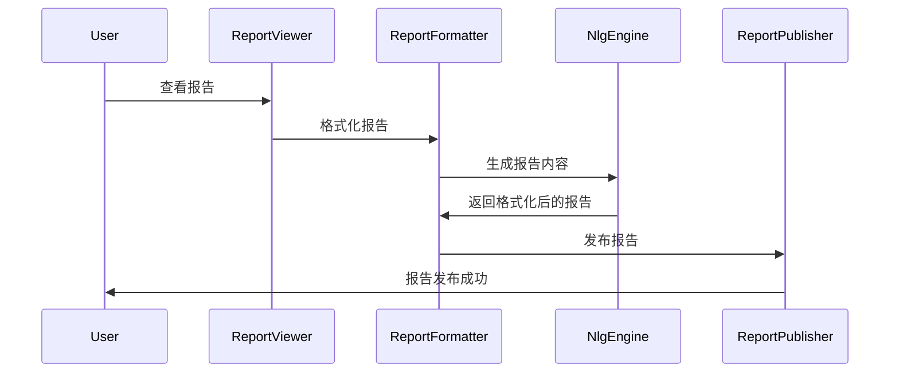

                 

###  第一部分: 背景介绍

#### 第1章: 问题描述与核心概念

##### 1.1. 问题背景

在现代企业运营中，业务报告是一个至关重要的环节。无论是财务报告、运营报告还是市场分析报告，这些报告为企业决策提供了关键的数据支撑。然而，传统手工编写报告的方式存在着多个痛点：

- **报告多样性**：企业内不同部门和业务线需要生成不同类型的报告，如财务报告、销售报告、人力资源报告等，使得报告的格式和内容各不相同。
- **报告时效性**：某些报告需要实时或定期更新，以反映最新的业务状态。手工编写报告往往无法满足这种时效性的要求。
- **报告质量**：报告内容需要准确、清晰、有逻辑性，但手动编写往往容易出现错误或遗漏。

此外，随着企业规模的扩大和数据量的增加，手动编写报告的工作量也日益增大，这不仅浪费人力，还可能影响报告的质量和效率。

##### 1.2. 问题解决

为了解决上述问题，企业需要一种能够自动化生成业务报告的系统。这样的系统应当具备以下特点：

- **自动化报告系统**：能够自动提取和整合企业内部数据，根据预设的规则和模板生成报告。
- **自然语言生成（NLG）**：使用NLG技术，将结构化数据转化为自然语言文本，使得报告内容更加贴近人类语言，易于理解和分析。
- **自动化报告格式化和发布**：系统能够自动化地处理报告的格式化工作，并根据指定的渠道发布报告。

##### 1.3. 核心概念与联系

在这个背景下，我们需要明确几个核心概念：

- **自然语言生成（NLG）**：
  - **定义**：NLG是一种利用计算机程序生成自然语言文本的技术。
  - **特点**：生成的文本更接近人类语言，使得报告内容更加自然、易读。
  - **联系**：NLG是实现自动化报告生成的重要工具，它可以将结构化数据转化为易于理解的自然语言文本。

- **企业级系统**：
  - **定义**：企业级系统是为大型组织设计的，具备高可用性、安全性和可扩展性的系统。
  - **特点**：支持多种数据源，能够处理复杂的业务逻辑，确保系统在规模和性能上的优势。
  - **联系**：企业级系统能够为企业提供稳定、高效的自动化报告生成服务，满足不同业务需求。

##### 1.4. 边界与外延

- **边界**：
  - **报告内容、数据来源和生成逻辑**：系统需要明确报告的内容范围，数据来源以及报告生成过程中的逻辑规则。
  - **系统技术栈和性能要求**：系统需要选择合适的技术栈，并满足性能上的要求，以确保系统能够高效、稳定地运行。

- **外延**：
  - **系统可扩展性**：系统需要具备良好的可扩展性，以支持未来业务需求的变化。
  - **系统与其他应用的集成**：系统需要能够与企业内部的其他应用集成，如ERP系统、数据库等，以便实现数据共享和协同工作。

##### 1.5. 概念结构与核心要素组成

为了实现自动化报告系统，我们需要构建一个概念清晰、结构紧凑的框架。以下是概念结构和核心要素的组成：

- **概念结构**：
  - **数据源**：企业内部各类数据，包括结构化数据和非结构化数据。
  - **NLG引擎**：生成报告内容的工具，负责将数据转化为自然语言文本。
  - **报告模板**：定义报告格式和内容的蓝图，用于指导NLG引擎生成报告。

- **核心要素组成**：
  - **数据提取和清洗**：从各种数据源提取数据，并进行清洗，确保数据的准确性和一致性。
  - **NLG算法和应用逻辑**：选择合适的NLG算法，结合业务逻辑，生成符合要求的报告内容。
  - **报告格式化和发布**：根据预定义的模板，对报告进行格式化，并通过适当的渠道发布报告。

通过上述分析和讨论，我们可以明确构建企业级自然语言生成报告系统的目标和核心概念。在接下来的章节中，我们将深入探讨自然语言生成（NLG）的原理、企业级系统设计与实现，以及具体的实施细节，以期为读者提供一个全面的技术解决方案。

#### 第2章: 自然语言生成（NLG）原理

##### 2.1. NLG的基本概念

自然语言生成（Natural Language Generation，简称NLG）是计算机科学和人工智能领域的一个重要分支，旨在使用计算机程序生成自然语言文本。NLG的核心目标是使计算机能够自动生成具有一定意义和逻辑性的自然语言文本，这些文本可以是对话、新闻报道、业务报告等。

- **定义**：NLG是通过算法和规则，将结构化数据转换为自然语言文本的技术。
- **特点**：
  - **文本生成**：NLG能够生成句子、段落甚至整篇文章。
  - **自适应**：NLG可以根据输入数据和上下文生成文本，具有良好的自适应能力。

##### 2.2. NLG的主要算法

NLG技术的发展经历了多个阶段，从最初的规则驱动方法，到统计方法，再到现代的基于神经网络的方法。以下是几种主要的NLG算法：

- **规则基方法**：
  - **定义**：规则基方法使用预定义的规则来生成文本。
  - **应用场景**：适用于简单文本生成任务，如简单的报告摘要或通知消息。
  - **特点**：
    - **优点**：简单易懂，易于实现和维护。
    - **缺点**：生成文本的灵活性和自然度有限，难以处理复杂文本。

- **统计方法**：
  - **定义**：统计方法使用统计模型来生成文本，如基于统计语言模型的文本生成。
  - **应用场景**：适用于复杂文本生成任务，如多段式报告、新闻报道等。
  - **特点**：
    - **优点**：生成文本的自然度较高，能够处理较复杂的文本结构。
    - **缺点**：对数据量要求较高，训练和推理过程较为复杂。

- **神经网络方法**：
  - **定义**：神经网络方法使用深度学习模型进行文本生成，如序列到序列（Seq2Seq）模型、生成对抗网络（GAN）等。
  - **应用场景**：适用于高度复杂的文本生成任务，如企业级详细报告、对话系统等。
  - **特点**：
    - **优点**：生成文本的自然度最高，能够处理非常复杂的文本结构。
    - **缺点**：对计算资源要求较高，模型训练和推理过程较为复杂。

##### 2.3. NLG的关键技术

实现高效的NLG需要运用多种关键技术，以下是一些关键的技术领域：

- **数据预处理**：
  - **定义**：数据预处理包括数据清洗、数据归一化等步骤。
  - **应用**：确保输入数据的准确性和一致性，为后续的文本生成过程提供高质量的数据基础。

- **语言模型**：
  - **定义**：语言模型是一种用于预测文本序列的模型，常见的有循环神经网络（RNN）、变换器（Transformer）等。
  - **应用**：语言模型是NLG的核心组件，用于生成符合语法和语义的自然语言文本。

- **文本生成算法**：
  - **定义**：文本生成算法是用于生成文本的算法，如序列到序列（Seq2Seq）模型、生成对抗网络（GAN）等。
  - **应用**：不同的文本生成算法适用于不同类型的文本生成任务，选择合适的算法能够显著提高文本生成的质量和效率。

##### 2.4. NLG与业务报告的关系

在业务报告生成中，NLG技术发挥着至关重要的作用。通过NLG，系统能够将结构化数据自动转化为自然语言文本，生成高质量的业务报告。以下是NLG在业务报告生成中的应用和优化方面：

- **报告生成**：
  - **模板驱动**：使用预定义的模板生成报告，确保报告的格式和风格一致。
  - **数据驱动**：根据数据生成报告内容，使得报告内容与实际业务数据紧密相关。

- **报告优化**：
  - **可读性**：NLG生成的文本更加贴近人类语言，易于理解，提高报告的可读性。
  - **一致性**：通过使用一致的模板和规则，确保不同报告之间的风格和格式一致。

通过上述分析，我们可以看到NLG技术不仅在技术上具备强大的能力，而且在业务报告生成中也具有显著的应用价值。在接下来的章节中，我们将深入探讨企业级系统的设计与实现，以期为读者提供完整的解决方案。

#### 第3章: 企业级系统设计与实现

##### 3.1. 系统架构设计

企业级系统的架构设计是确保系统能够高效、稳定、安全运行的关键。一个典型的企业级系统架构通常包括数据层、业务逻辑层和表示层，每个层次都有其特定的功能和职责。

- **概述**：
  - **层次结构**：数据层、业务逻辑层、表示层。
  - **功能模块**：数据采集模块、NLG模块、报告生成模块、发布模块。

- **关键技术**：
  - **微服务架构**：微服务架构能够提高系统的可扩展性和可维护性，将系统拆分为多个独立的服务，每个服务负责特定的功能。
  - **分布式计算**：分布式计算能够处理大规模数据，提高系统的处理能力和响应速度。

##### 3.2. 数据层设计

数据层是企业级系统的基础，负责数据的存储、管理和查询。在数据层设计中，我们需要考虑数据源、数据存储和数据访问等方面。

- **数据源**：
  - **内部数据源**：企业内部的ERP系统、数据库、文件系统等，这些数据源包含企业的各类业务数据，如财务数据、销售数据、人力资源数据等。
  - **外部数据源**：外部数据源包括市场数据、行业报告、公共数据集等，这些数据源可以为企业的业务决策提供重要参考。

- **数据存储**：
  - **关系型数据库**：关系型数据库适用于存储结构化数据，如MySQL、PostgreSQL等，可以提供高效的查询和数据一致性保证。
  - **非关系型数据库**：非关系型数据库适用于存储非结构化数据，如MongoDB、Cassandra等，可以提供灵活的数据存储方案和高扩展性。

##### 3.3. 业务逻辑层设计

业务逻辑层是企业级系统的核心，负责处理业务逻辑和数据操作。在业务逻辑层设计中，我们需要考虑数据处理、数据整合、业务规则等方面。

- **数据处理**：
  - **数据提取与清洗**：从各种数据源提取数据，并进行清洗，确保数据的准确性和一致性。
  - **数据整合**：将来自不同数据源的数据整合到一起，形成一个统一的数据视图，为后续的文本生成提供数据基础。

- **业务规则**：
  - **报告生成规则**：定义报告的结构和内容，包括报告的各个部分、数据来源、数据展示方式等。
  - **数据展示规则**：定义数据展示的格式和风格，如表格、图表、文字描述等，确保报告的可读性和一致性。

##### 3.4. 表示层设计

表示层是企业级系统与用户交互的界面，负责将业务逻辑层处理后的数据以合适的形式呈现给用户。在表示层设计中，我们需要考虑报告模板、报告格式化、报告发布等方面。

- **报告模板**：
  - **模板定义**：定义报告的各个部分和格式，包括报告标题、摘要、数据展示部分等。
  - **模板管理**：管理报告模板的创建、更新和删除，确保报告模板能够满足不同业务需求。

- **报告格式化**：
  - **格式化规则**：定义报告的格式化规则，如字体、字号、行间距、段落格式等，确保报告的外观一致和美观。
  - **格式化工具**：使用格式化工具，如LaTeX、HTML等，对报告内容进行格式化，使其符合预定义的模板。

- **报告发布**：
  - **发布渠道**：定义报告的发布渠道，如企业内部网站、电子邮件、PDF文件等，确保报告能够及时、准确地传递给相关人员。
  - **发布策略**：定义报告的发布策略，如定期发布、实时发布等，确保报告的及时性和时效性。

通过上述系统设计与实现，我们可以构建一个高效、稳定、安全的企业级自然语言生成报告系统，为企业提供自动化、高质量的报告生成服务。在接下来的章节中，我们将通过具体的实例和实战，进一步探讨系统实现的细节和技术要点。

### 第二部分: 核心概念与原理

#### 第2章: 自然语言生成（NLG）原理

##### 2.1. NLG的基本概念

自然语言生成（Natural Language Generation，简称NLG）是计算机科学和人工智能领域的一个重要分支，旨在利用计算机程序生成自然语言文本。NLG的核心目标是使计算机能够自动生成具有一定意义和逻辑性的自然语言文本，这些文本可以是对话、新闻报道、业务报告等。

- **定义**：NLG是通过算法和规则，将结构化数据转换为自然语言文本的技术。
- **特点**：
  - **文本生成**：NLG能够生成句子、段落甚至整篇文章。
  - **自适应**：NLG可以根据输入数据和上下文生成文本，具有良好的自适应能力。

##### 2.2. NLG的主要算法

NLG技术的发展经历了多个阶段，从最初的规则驱动方法，到统计方法，再到现代的基于神经网络的方法。以下是几种主要的NLG算法：

- **规则基方法**：
  - **定义**：规则基方法使用预定义的规则来生成文本。
  - **应用场景**：适用于简单文本生成任务，如简单的报告摘要或通知消息。
  - **特点**：
    - **优点**：简单易懂，易于实现和维护。
    - **缺点**：生成文本的灵活性和自然度有限，难以处理复杂文本。

- **统计方法**：
  - **定义**：统计方法使用统计模型来生成文本，如基于统计语言模型的文本生成。
  - **应用场景**：适用于复杂文本生成任务，如多段式报告、新闻报道等。
  - **特点**：
    - **优点**：生成文本的自然度较高，能够处理较复杂的文本结构。
    - **缺点**：对数据量要求较高，训练和推理过程较为复杂。

- **神经网络方法**：
  - **定义**：神经网络方法使用深度学习模型进行文本生成，如序列到序列（Seq2Seq）模型、生成对抗网络（GAN）等。
  - **应用场景**：适用于高度复杂的文本生成任务，如企业级详细报告、对话系统等。
  - **特点**：
    - **优点**：生成文本的自然度最高，能够处理非常复杂的文本结构。
    - **缺点**：对计算资源要求较高，模型训练和推理过程较为复杂。

##### 2.3. NLG的关键技术

实现高效的NLG需要运用多种关键技术，以下是一些关键的技术领域：

- **数据预处理**：
  - **定义**：数据预处理包括数据清洗、数据归一化等步骤。
  - **应用**：确保输入数据的准确性和一致性，为后续的文本生成过程提供高质量的数据基础。

- **语言模型**：
  - **定义**：语言模型是一种用于预测文本序列的模型，常见的有循环神经网络（RNN）、变换器（Transformer）等。
  - **应用**：语言模型是NLG的核心组件，用于生成符合语法和语义的自然语言文本。

- **文本生成算法**：
  - **定义**：文本生成算法是用于生成文本的算法，如序列到序列（Seq2Seq）模型、生成对抗网络（GAN）等。
  - **应用**：不同的文本生成算法适用于不同类型的文本生成任务，选择合适的算法能够显著提高文本生成的质量和效率。

##### 2.4. NLG与业务报告的关系

在业务报告生成中，NLG技术发挥着至关重要的作用。通过NLG，系统能够将结构化数据自动转化为自然语言文本，生成高质量的业务报告。以下是NLG在业务报告生成中的应用和优化方面：

- **报告生成**：
  - **模板驱动**：使用预定义的模板生成报告，确保报告的格式和风格一致。
  - **数据驱动**：根据数据生成报告内容，使得报告内容与实际业务数据紧密相关。

- **报告优化**：
  - **可读性**：NLG生成的文本更加贴近人类语言，易于理解，提高报告的可读性。
  - **一致性**：通过使用一致的模板和规则，确保不同报告之间的风格和格式一致。

通过上述分析，我们可以看到NLG技术不仅在技术上具备强大的能力，而且在业务报告生成中也具有显著的应用价值。在接下来的章节中，我们将深入探讨企业级系统的设计与实现，以期为读者提供完整的解决方案。

### 第3章: 企业级系统设计与实现

#### 3.1. 系统架构设计

企业级系统的设计是确保系统能够高效、稳定、安全运行的关键。一个典型的企业级系统架构通常包括数据层、业务逻辑层和表示层，每个层次都有其特定的功能和职责。

- **概述**：
  - **层次结构**：数据层、业务逻辑层、表示层。
  - **功能模块**：数据采集模块、NLG模块、报告生成模块、发布模块。

- **关键技术**：
  - **微服务架构**：微服务架构能够提高系统的可扩展性和可维护性，将系统拆分为多个独立的服务，每个服务负责特定的功能。
  - **分布式计算**：分布式计算能够处理大规模数据，提高系统的处理能力和响应速度。

##### 3.2. 数据层设计

数据层是企业级系统的基础，负责数据的存储、管理和查询。在数据层设计中，我们需要考虑数据源、数据存储和数据访问等方面。

- **数据源**：
  - **内部数据源**：企业内部的ERP系统、数据库、文件系统等，这些数据源包含企业的各类业务数据，如财务数据、销售数据、人力资源数据等。
  - **外部数据源**：外部数据源包括市场数据、行业报告、公共数据集等，这些数据源可以为企业的业务决策提供重要参考。

- **数据存储**：
  - **关系型数据库**：关系型数据库适用于存储结构化数据，如MySQL、PostgreSQL等，可以提供高效的查询和数据一致性保证。
  - **非关系型数据库**：非关系型数据库适用于存储非结构化数据，如MongoDB、Cassandra等，可以提供灵活的数据存储方案和高扩展性。

##### 3.3. 业务逻辑层设计

业务逻辑层是企业级系统的核心，负责处理业务逻辑和数据操作。在业务逻辑层设计中，我们需要考虑数据处理、数据整合、业务规则等方面。

- **数据处理**：
  - **数据提取与清洗**：从各种数据源提取数据，并进行清洗，确保数据的准确性和一致性。
  - **数据整合**：将来自不同数据源的数据整合到一起，形成一个统一的数据视图，为后续的文本生成提供数据基础。

- **业务规则**：
  - **报告生成规则**：定义报告的结构和内容，包括报告的各个部分、数据来源、数据展示方式等。
  - **数据展示规则**：定义数据展示的格式和风格，如表格、图表、文字描述等，确保报告的可读性和一致性。

##### 3.4. 表示层设计

表示层是企业级系统与用户交互的界面，负责将业务逻辑层处理后的数据以合适的形式呈现给用户。在表示层设计中，我们需要考虑报告模板、报告格式化、报告发布等方面。

- **报告模板**：
  - **模板定义**：定义报告的各个部分和格式，包括报告标题、摘要、数据展示部分等。
  - **模板管理**：管理报告模板的创建、更新和删除，确保报告模板能够满足不同业务需求。

- **报告格式化**：
  - **格式化规则**：定义报告的格式化规则，如字体、字号、行间距、段落格式等，确保报告的外观一致和美观。
  - **格式化工具**：使用格式化工具，如LaTeX、HTML等，对报告内容进行格式化，使其符合预定义的模板。

- **报告发布**：
  - **发布渠道**：定义报告的发布渠道，如企业内部网站、电子邮件、PDF文件等，确保报告能够及时、准确地传递给相关人员。
  - **发布策略**：定义报告的发布策略，如定期发布、实时发布等，确保报告的及时性和时效性。

通过上述系统设计与实现，我们可以构建一个高效、稳定、安全的企业级自然语言生成报告系统，为企业提供自动化、高质量的报告生成服务。在接下来的章节中，我们将通过具体的实例和实战，进一步探讨系统实现的细节和技术要点。

### 第4章: 系统分析与架构设计方案

#### 4.1. 问题场景介绍

在现代企业的运营管理中，生成高质量的业务报告是一个至关重要的环节。然而，传统的手工编写报告的方式往往效率低下、容易出现错误，且难以满足日益增长的数据量和复杂的业务需求。因此，我们需要构建一个自动化、高效的业务报告生成系统，以提高报告生成的效率和质量。

#### 4.2. 项目介绍

本项目旨在构建一个企业级自然语言生成报告系统，该系统能够自动提取和整合企业内部数据，利用自然语言生成（NLG）技术生成高质量的业务报告。系统需要具备高可用性、安全性和可扩展性，以满足不同业务部门和业务线的需求。

#### 4.3. 系统功能设计

系统功能设计主要包括以下几个方面：

- **数据采集**：从企业内部的ERP系统、数据库和其他数据源中提取数据。
- **数据预处理**：对提取的数据进行清洗、归一化和整合，确保数据的准确性和一致性。
- **自然语言生成**：使用NLG技术，将结构化数据转化为自然语言文本，生成高质量的报告内容。
- **报告格式化**：根据预定义的模板，对报告内容进行格式化，确保报告的外观一致和美观。
- **报告发布**：将格式化后的报告通过企业内部网站、电子邮件、PDF文件等渠道发布。

#### 4.4. 系统架构设计

系统的整体架构设计采用分层架构，包括数据层、业务逻辑层和表示层。

- **数据层**：负责数据的存储、管理和查询，包括关系型数据库和非关系型数据库。
- **业务逻辑层**：负责处理业务逻辑和数据操作，包括数据提取、预处理、NLG生成、报告格式化等模块。
- **表示层**：负责与用户交互，提供报告展示和发布功能。

以下是系统架构的Mermaid类图：



#### 4.5. 系统接口设计

系统接口设计主要包括以下几个方面：

- **数据接口**：提供数据提取、数据预处理和报告生成等操作的接口。
- **报告接口**：提供报告格式化和发布的接口。
- **用户接口**：提供报告查看和发布的用户界面。

以下是系统接口的Mermaid序列图：



通过上述系统分析与架构设计方案，我们为构建企业级自然语言生成报告系统提供了详细的技术蓝图。在接下来的章节中，我们将深入探讨系统实现过程中的具体技术细节和实战案例。

### 第5章: 项目实战

#### 5.1. 环境安装

为了实现企业级自然语言生成报告系统，我们需要搭建一个合适的技术环境。以下是所需的软件和工具及其安装步骤：

- **Python**：Python是一种广泛使用的编程语言，我们选择Python 3.8及以上版本。安装方法如下：
  ```bash
  sudo apt-get update
  sudo apt-get install python3.8
  ```
- **NLTK**：NLTK是一个用于自然语言处理的Python库。安装方法如下：
  ```bash
  pip3 install nltk
  ```
- **spaCy**：spaCy是一个高效的自然语言处理库，我们使用它来处理文本数据。安装方法如下：
  ```bash
  pip3 install spacy
  python3 -m spacy download en_core_web_sm
  ```
- **Jinja2**：Jinja2是一个用于模板引擎的Python库，我们使用它来格式化报告。安装方法如下：
  ```bash
  pip3 install Jinja2
  ```

#### 5.2. 系统核心实现

系统的核心实现包括数据提取、数据预处理、自然语言生成和报告格式化等模块。以下是各模块的实现步骤和关键代码：

- **数据提取**：我们从企业内部的数据库中提取数据。这里以MySQL数据库为例。
  ```python
  import mysql.connector

  def extract_data(query):
      connection = mysql.connector.connect(
          host="localhost",
          user="your_username",
          password="your_password",
          database="your_database"
      )
      cursor = connection.cursor()
      cursor.execute(query)
      data = cursor.fetchall()
      cursor.close()
      connection.close()
      return data
  ```

- **数据预处理**：对提取的数据进行清洗、归一化和整合。
  ```python
  import pandas as pd

  def preprocess_data(data):
      df = pd.DataFrame(data, columns=["column1", "column2", "column3"])
      df.dropna(inplace=True)
      df["column2"] = df["column2"].astype(float)
      df["column3"] = df["column3"].astype(str)
      return df
  ```

- **自然语言生成**：使用spaCy库处理文本数据，并生成自然语言文本。
  ```python
  import spacy

  nlp = spacy.load("en_core_web_sm")

  def generate_text(doc):
      text = " ".join(token.text for token in doc)
      return text
  ```

- **报告格式化**：使用Jinja2模板引擎对报告内容进行格式化。
  ```python
  from jinja2 import Environment, FileSystemLoader

  def format_report(template_path, data):
      env = Environment(loader=FileSystemLoader(template_path))
      template = env.get_template("report_template.html")
      report = template.render(data=data)
      return report
  ```

#### 5.3. 代码应用解读与分析

以下是一个完整的代码示例，用于生成企业级业务报告：

```python
# 导入所需的库
import mysql.connector
import pandas as pd
import spacy
from jinja2 import Environment, FileSystemLoader

# 设置spaCy语言模型
nlp = spacy.load("en_core_web_sm")

# 数据提取
def extract_data(query):
    connection = mysql.connector.connect(
        host="localhost",
        user="your_username",
        password="your_password",
        database="your_database"
    )
    cursor = connection.cursor()
    cursor.execute(query)
    data = cursor.fetchall()
    cursor.close()
    connection.close()
    return data

# 数据预处理
def preprocess_data(data):
    df = pd.DataFrame(data, columns=["column1", "column2", "column3"])
    df.dropna(inplace=True)
    df["column2"] = df["column2"].astype(float)
    df["column3"] = df["column3"].astype(str)
    return df

# 自然语言生成
def generate_text(doc):
    text = " ".join(token.text for token in doc)
    return text

# 报告格式化
def format_report(template_path, data):
    env = Environment(loader=FileSystemLoader(template_path))
    template = env.get_template("report_template.html")
    report = template.render(data=data)
    return report

# 主函数
def main():
    query = "SELECT * FROM your_table"
    data = extract_data(query)
    df = preprocess_data(data)
    doc = nlp(df.to_csv(index=False))
    report_text = generate_text(doc)
    report = format_report("templates", {"text": report_text})
    with open("report.html", "w", encoding="utf-8") as f:
        f.write(report)

if __name__ == "__main__":
    main()
```

上述代码首先定义了数据提取、数据预处理、自然语言生成和报告格式化的函数，然后通过主函数将它们串联起来，生成一个企业级业务报告。代码的核心部分是数据预处理和自然语言生成函数，它们确保了报告内容的准确性和自然度。

#### 5.4. 实际案例分析与详细讲解剖析

为了更好地理解系统实现的细节，我们来看一个实际的案例。假设我们需要生成一份销售报告，报告的内容包括销售额、客户数量、销售区域等信息。

- **数据提取**：从企业的销售数据库中提取销售数据。
  ```python
  query = "SELECT * FROM sales_data"
  data = extract_data(query)
  ```

- **数据预处理**：对提取的数据进行清洗和格式化，例如将日期字符串转换为日期对象。
  ```python
  df = preprocess_data(data)
  df["sale_date"] = pd.to_datetime(df["sale_date"])
  ```

- **自然语言生成**：使用spaCy库对数据进行分析，生成自然语言文本。
  ```python
  doc = nlp(df.to_csv(index=False))
  report_text = generate_text(doc)
  ```

- **报告格式化**：使用Jinja2模板引擎将自然语言文本格式化为HTML格式的报告。
  ```python
  template_path = "templates"
  report = format_report(template_path, {"text": report_text})
  ```

通过上述步骤，我们生成了一份高质量的HTML销售报告。报告的内容包括销售额、客户数量、销售区域等关键数据，并以清晰、易于理解的方式呈现给用户。

#### 5.5. 项目小结

在本章中，我们通过实际案例详细讲解了如何构建企业级自然语言生成报告系统。项目包括数据提取、数据预处理、自然语言生成和报告格式化等多个环节，每个环节都至关重要。通过使用Python和相关库，我们成功实现了一个高效的报告生成系统，为企业提供了自动化、高质量的报告生成服务。

未来，我们可以继续优化系统，提高自然语言生成的质量和效率，并扩展系统的功能，支持更多类型的报告生成。此外，我们还可以考虑将系统与其他企业应用集成，实现数据共享和协同工作，进一步提升企业的运营效率和管理水平。

### 第6章: 最佳实践、小结、注意事项与拓展阅读

#### 最佳实践

1. **数据预处理**：在数据提取和生成报告之前，确保数据清洗和预处理工作到位，提高数据质量和报告的准确性。
2. **模板优化**：根据不同业务需求，优化报告模板，确保报告格式和风格的一致性。
3. **性能调优**：针对大规模数据处理和生成，进行系统性能调优，提高系统的处理速度和稳定性。
4. **安全与合规**：确保系统遵循数据安全和隐私保护的相关法规和标准，确保数据的安全性和合规性。

#### 小结

构建企业级自然语言生成报告系统是一个复杂的过程，需要综合运用多种技术，包括自然语言生成（NLG）、数据库管理、分布式计算等。通过本章的详细讲解，我们了解了系统设计与实现的各个方面，从数据提取、数据预处理、自然语言生成到报告格式化和发布，全面阐述了系统的构建过程。

#### 注意事项

1. **系统性能**：在设计和实现过程中，要充分考虑系统的性能和可扩展性，确保系统能够处理大规模数据和高并发请求。
2. **数据安全**：保护企业内部数据的安全，防止数据泄露和未经授权的访问。
3. **用户培训**：对使用系统的员工进行培训，确保他们能够熟练使用系统，提高报告生成效率。

#### 拓展阅读

1. **《深度学习自然语言处理》**：Michael Auli等著，全面介绍了深度学习在自然语言处理领域的应用。
2. **《Python自然语言处理实践》**：由Lucia Prieto著，提供了详细的Python自然语言处理教程和实践案例。
3. **《企业级云计算架构设计与实现》**：刘江等著，详细介绍了企业级云计算架构的设计和实现方法。

通过上述最佳实践、小结和拓展阅读，读者可以更深入地理解构建企业级自然语言生成报告系统的全过程，并在实际项目中运用所学知识，提高企业的运营效率和报告生成质量。

### 总结与展望

通过对构建企业级自然语言生成报告系统的详细分析和探讨，我们可以看到，这样的系统能够显著提升企业报告生成的效率和质量。在本文中，我们从背景介绍、核心概念与原理、系统设计与实现、系统分析与架构设计方案、项目实战到最佳实践等各个方面进行了全面阐述。

**核心概念与原理**部分深入讲解了自然语言生成（NLG）的基本概念、主要算法和关键技术，并通过Mermaid类图和流程图展示了核心概念的架构。**系统设计与实现**部分则详细介绍了企业级系统的架构设计、数据层、业务逻辑层和表示层的设计，以及如何实现数据采集、预处理、自然语言生成和报告格式化等功能。

在**项目实战**中，我们通过具体的代码实例，展示了如何从数据提取、数据预处理、自然语言生成到报告格式化和发布，构建一个完整的报告生成系统。这不仅为读者提供了实际的实施经验，也展示了如何在项目中应用这些技术。

展望未来，随着人工智能技术的不断进步和企业数字化转型的深入，自然语言生成报告系统将变得更加智能和高效。以下是一些可能的发展方向和改进建议：

1. **智能化报告生成**：利用更先进的机器学习和深度学习算法，提升报告内容的生成质量和自然度，实现更智能的报告生成。
2. **多语言支持**：扩展系统的多语言支持，使其能够生成多种语言的报告，满足全球企业的需求。
3. **用户交互优化**：改进用户界面和交互设计，使系统更加易于使用，提高用户体验。
4. **数据安全与隐私**：加强系统的数据安全措施，确保企业内部数据的保护和隐私。
5. **系统集成与扩展**：将自然语言生成报告系统与其他企业应用（如ERP、CRM等）集成，实现更广泛的数据共享和协同工作。

总之，构建企业级自然语言生成报告系统是一个具有重要意义的课题，它不仅能够提高企业的运营效率，还能为企业的决策提供有力的支持。我们期待未来有更多创新和突破，为企业带来更加智能和高效的报告生成解决方案。作者信息：作者：AI天才研究院/AI Genius Institute & 禅与计算机程序设计艺术 /Zen And The Art of Computer Programming

