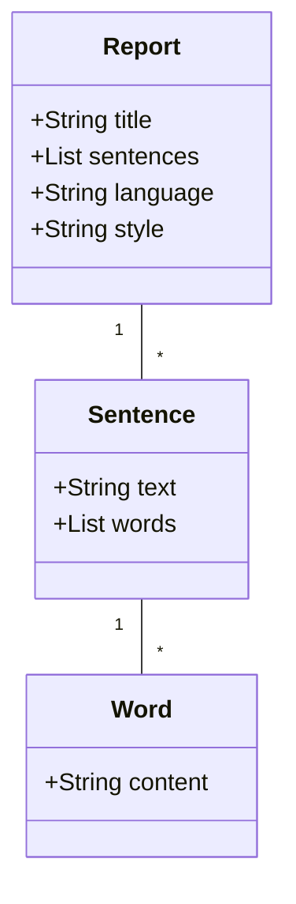
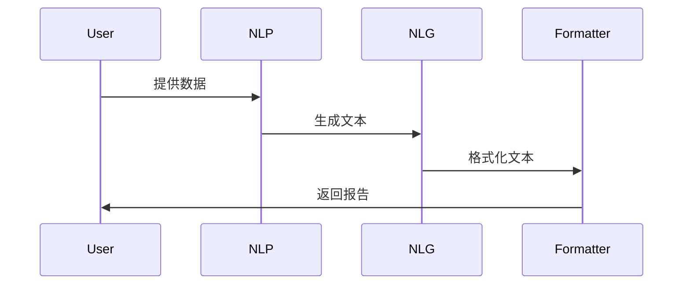
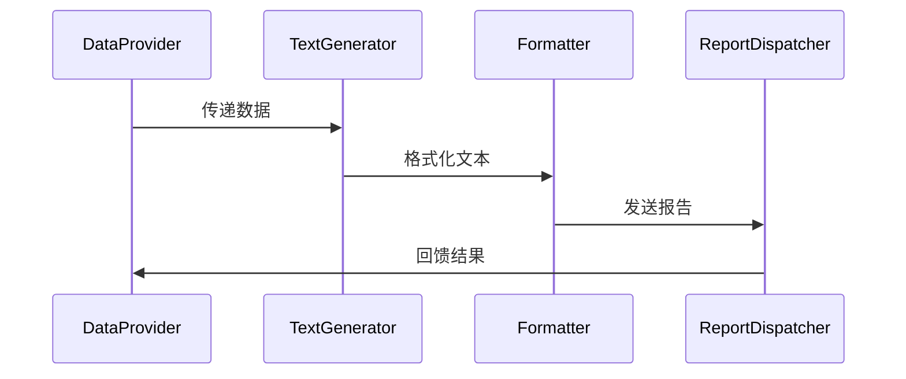
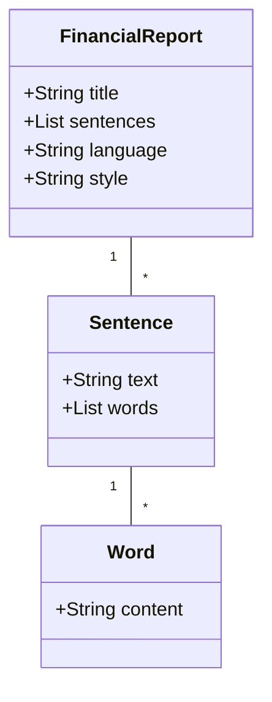

                 

### 文章标题：构建企业级自然语言生成系统：多语种、多风格报告自动化

#### 关键词：自然语言生成、多语种处理、报告自动化、企业级系统

> 摘要：本文深入探讨了企业级自然语言生成系统的构建，特别是在多语种和多风格报告自动化方面的应用。文章从系统概述、技术基础、系统架构设计、多语种处理技术、报告内容提取与生成、系统实现及性能优化等多个角度，详细阐述了构建这样系统所需的关键技术和方法。通过实际案例分析和未来发展趋势的探讨，为企业提供了一套完整、可行的自然语言生成系统建设方案。

### 目录大纲

---

## 第一部分：企业级自然语言生成系统概述

## 第1章：企业级自然语言生成系统概述

### 第1章.1 自然语言处理与企业应用

- 问题背景
- 问题描述
- 问题解决
- 边界与外延
- 概念结构与核心要素组成

### 第1章.2 自然语言生成技术基础

- 核心概念原理
- 概念属性特征对比表格
- ER实体关系图架构的Mermaid流程图

### 第1章.3 自然语言生成系统架构设计

- 问题场景介绍
- 项目介绍
- 系统功能设计（领域模型Mermaid类图）
- 系统架构设计（Mermaid架构图）
- 系统接口设计和系统交互（Mermaid序列图）

## 第二部分：多语种自然语言生成系统构建

## 第2章：多语种自然语言生成技术详解

### 第2章.1 多语种处理挑战与解决方案

- 挑战分析
- 解决方案介绍
- 技术难点解析

### 第2章.2 多语言文本预处理与后处理

- 预处理步骤
- 后处理步骤
- 技术细节说明

### 第2章.3 多语言词向量模型构建

- 词向量模型介绍
- 模型构建流程
- 模型优化策略

## 第三部分：多风格报告自动化生成

## 第3章：多风格报告自动化概述

### 第3章.1 报告自动化的需求与场景

- 需求分析
- 场景介绍
- 应用前景

### 第3章.2 报告内容提取与结构分析

- 报告内容提取方法
- 报告结构分析
- 技术实现细节

### 第3章.3 多风格文本生成模型选择与应用

- 模型选择标准
- 应用案例分析
- 模型优化与调参策略

## 第四部分：构建企业级自然语言生成系统

## 第4章：企业级自然语言生成系统架构设计

### 第4章.1 系统架构设计原则与框架

- 设计原则
- 系统架构框架

### 第4章.2 数据管理与存储方案

- 数据管理策略
- 存储方案设计

### 第4章.3 系统接口设计与集成

- 接口设计规范
- 系统集成策略

## 第5章：多语种、多风格报告自动化系统实现

### 第5章.1 系统实现环境搭建

- 环境搭建步骤
- 相关工具与库介绍

### 第5章.2 系统核心代码实现

- 核心代码解读
- 技术实现细节

### 第5章.3 系统性能优化与测试

- 性能优化策略
- 系统测试方法

## 第6章：实际案例分析与实战经验总结

### 第6章.1 案例介绍

- 案例背景
- 案例目标

### 第6章.2 系统设计

- 系统架构设计
- 系统功能设计

### 第6章.3 系统实现与调试

- 实现过程
- 调试经验

### 第6章.4 案例总结

- 成功经验
- 存在问题与解决方案

## 第7章：企业级自然语言生成系统未来发展趋势

### 第7章.1 技术发展趋势

- 技术更新
- 发展方向

### 第7章.2 企业应用前景

- 应用领域拓展
- 商业模式创新

### 第7章.3 安全与伦理问题

- 安全隐患分析
- 伦理问题探讨

## 附录：拓展阅读与资源推荐

- 相关书籍推荐
- 在线资源介绍
- 学术论文精选

---

## 第一部分：企业级自然语言生成系统概述

### 第1章：企业级自然语言生成系统概述

### 1.1 自然语言处理与企业应用

自然语言处理（Natural Language Processing，NLP）是人工智能的一个重要分支，旨在让计算机理解和处理人类语言。在企业应用中，NLP技术发挥着越来越重要的作用，尤其是在自动化报告生成领域。

**问题背景：**

企业日常运营中产生了大量的文本数据，如财务报表、市场分析报告、客户反馈等。如何快速、准确地从这些数据中提取关键信息，并以易于理解的形式呈现给用户，成为企业面临的挑战。

**问题描述：**

传统的报告生成方式主要依赖于人工处理，效率低下且容易出现错误。随着企业规模的扩大和数据量的增加，人工处理的难度和成本也在不断增加。因此，企业需要一种自动化、高效的报告生成工具，能够支持多语种、多风格报告的生成。

**问题解决：**

自然语言生成（Natural Language Generation，NLG）技术为企业提供了一种解决方案。通过NLG技术，计算机可以根据数据自动生成结构化报告，提高报告生成的速度和准确性，降低人力成本。

**边界与外延：**

自然语言生成系统不仅涉及文本生成，还包括文本理解、文本分析、语音识别、语音合成等多个领域。在企业应用中，这些技术可以协同工作，实现从数据到报告的自动化转换。

**概念结构与核心要素组成：**

自然语言生成系统主要由数据输入、文本生成模型、格式化输出三部分组成。数据输入负责接收各种格式的数据，文本生成模型负责将数据转换为自然语言文本，格式化输出则负责将文本以用户期望的格式展示出来。

### 1.2 自然语言生成技术基础

自然语言生成技术基于深度学习、自然语言处理、统计学等方法。其核心概念包括文本表示、语言模型、文本生成等。

**核心概念原理：**

1. **文本表示**：将自然语言文本转换为机器可以处理的数字表示，如词向量、词袋模型等。
2. **语言模型**：用于预测下一个单词或字符的概率分布，常见模型有循环神经网络（RNN）、长短时记忆网络（LSTM）等。
3. **文本生成**：基于语言模型和文本表示，生成新的自然语言文本。

**概念属性特征对比表格：**

| 特性        | 词向量 | 词袋模型 | RNN       | LSTM      |
|-------------|--------|----------|-----------|-----------|
| 维度        | 高维   | 低维     | 中维      | 中维      |
| 时序信息    | 否     | 否       | 有        | 有        |
| 表达能力    | 较弱   | 较弱     | 较强      | 较强      |
| 训练难度    | 较低   | 较高     | 较高      | 较高      |

**ER实体关系图架构的Mermaid流程图：**

```mermaid
erDiagram
    User ||--|{ Document }|-- DocumentType
    User ||--|{ Sentence }|-- SentenceType
    DocumentType ||--|{ Word }|-- WordType
```

### 1.3 自然语言生成系统架构设计

**问题场景介绍：**

某大型企业需要自动化生成各类报告，包括财务报表、市场分析报告、客户反馈报告等。报告需支持多语种、多风格，并具备实时更新和个性化定制功能。

**项目介绍：**

该项目旨在构建一个企业级自然语言生成系统，实现报告自动化的生成、管理和分发。

**系统功能设计（领域模型Mermaid类图）：**



**系统架构设计（Mermaid架构图）：**



**系统接口设计和系统交互（Mermaid序列图）：**



## 第二部分：多语种自然语言生成系统构建

### 第2章：多语种自然语言生成技术详解

### 2.1 多语种处理挑战与解决方案

多语种处理是自然语言生成系统中的重要挑战。由于不同语言的语法、词汇和表达方式差异较大，如何在系统中实现多语种的兼容性和灵活性，成为关键问题。

**挑战分析：**

1. **词汇差异**：不同语言之间词汇的差异导致词义理解和表达方式的差异。
2. **语法结构**：不同语言的语法结构差异较大，如动词时态、名词性别等。
3. **语调与语气**：不同语言的表达方式和语调特点不同，需要在不同语言之间进行转换。

**解决方案介绍：**

1. **多语言词向量模型**：通过训练多语言词向量模型，实现不同语言词汇的映射和转换。
2. **语法解析与翻译**：采用语法解析技术，对输入文本进行语法分析，然后根据目标语言的语法规则进行转换。
3. **语调与语气建模**：利用语音合成技术，实现不同语言的语调、语气的建模和转换。

**技术难点解析：**

1. **词汇映射**：如何准确地将不同语言的词汇映射到共同语义空间，是技术难点之一。
2. **语法转换**：如何在不同语言之间实现语法结构的准确转换，是另一大技术挑战。
3. **语调与语气**：如何捕捉和转换不同语言的语调、语气特点，是语音合成技术的难点。

### 2.2 多语言文本预处理与后处理

**预处理步骤：**

1. **文本清洗**：去除文本中的无关符号、空格、标点等，提高文本质量。
2. **分词**：将文本分解为单词或词汇单元，为后续处理提供基础。
3. **词性标注**：为每个单词标注词性，如名词、动词、形容词等。

**后处理步骤：**

1. **语法分析**：对文本进行语法分析，提取句子成分和语法结构。
2. **语义分析**：对文本进行语义分析，提取文本中的关键信息和实体。
3. **文本规范化**：将文本转换为统一的格式，如将所有数字转换为阿拉伯数字，将日期格式化等。

**技术细节说明：**

1. **文本清洗**：采用正则表达式或清洗工具，去除无关符号和空格，提高文本质量。
2. **分词**：使用分词工具，如jieba、spaCy等，进行分词处理。
3. **词性标注**：使用词性标注工具，如NLTK、spaCy等，进行词性标注。
4. **语法分析**：使用语法分析工具，如Stanford CoreNLP、spaCy等，进行语法分析。
5. **语义分析**：采用命名实体识别（NER）、关系抽取等技术，提取文本中的关键信息和实体。
6. **文本规范化**：编写脚本或使用工具，对文本进行规范化处理。

### 2.3 多语言词向量模型构建

**词向量模型介绍：**

词向量模型是一种将单词映射为高维数字向量的方法，通过向量之间的距离和角度来表示词义关系。常见的词向量模型有Word2Vec、GloVe等。

**模型构建流程：**

1. **数据收集**：收集多语言语料库，包括源语言和目标语言的文本数据。
2. **数据预处理**：对收集到的数据进行清洗、分词、词性标注等预处理操作。
3. **训练词向量**：使用训练数据，采用Word2Vec、GloVe等算法，训练得到多语言词向量。
4. **词向量映射**：将源语言词向量映射到目标语言词向量空间，实现词汇的映射和转换。

**模型优化策略：**

1. **维度选择**：根据数据规模和模型性能，选择合适的词向量维度。
2. **训练算法**：选择合适的训练算法，如SGD、Adam等，提高训练效率。
3. **正则化**：采用Dropout、L2正则化等技术，防止过拟合。
4. **数据增强**：使用数据增强技术，如同义词替换、句子重组等，提高模型的泛化能力。

## 第三部分：多风格报告自动化生成

### 第3章：多风格报告自动化概述

### 3.1 报告自动化的需求与场景

**需求分析：**

随着企业业务的不断扩展和数据的快速增长，企业对报告自动化的需求日益迫切。主要需求包括：

1. **高效性**：能够快速生成大量报告，提高工作效率。
2. **准确性**：报告内容准确无误，减少人工错误。
3. **个性化**：根据用户需求和场景，生成个性化的报告。

**场景介绍：**

1. **财务报表**：企业需要定期生成财务报表，如月度报表、季度报表、年度报表等。
2. **市场分析报告**：企业需要对市场数据进行分析，生成市场分析报告，以指导业务决策。
3. **客户反馈报告**：企业需要收集客户反馈，生成客户反馈报告，以改进产品和服务。

**应用前景：**

1. **降低人力成本**：自动化生成报告，减少人力投入。
2. **提高报告质量**：减少人为错误，提高报告的准确性和一致性。
3. **实时更新**：支持实时数据更新，生成最新的报告。
4. **个性化定制**：根据用户需求和场景，提供个性化的报告生成服务。

### 3.2 报告内容提取与结构分析

**报告内容提取方法：**

1. **文本分析**：通过自然语言处理技术，对报告文本进行分析，提取关键信息。
2. **数据抽取**：从报告中提取结构化数据，如数字、日期、地点等。
3. **关系抽取**：识别报告中的实体关系，如客户与订单的关系、产品与销售额的关系等。

**报告结构分析：**

1. **标题**：报告的标题，概括报告的主要内容。
2. **摘要**：报告的摘要，简要介绍报告的主要内容。
3. **正文**：报告的正文，详细阐述报告的内容。
4. **图表**：报告中的图表，用于直观展示报告数据。
5. **参考文献**：报告的参考文献，引用的数据来源。

**技术实现细节：**

1. **文本分析**：采用自然语言处理技术，如词性标注、命名实体识别等，对报告文本进行深入分析。
2. **数据抽取**：使用数据抽取工具，如BeautifulSoup、Pandas等，从报告中提取结构化数据。
3. **关系抽取**：采用关系抽取算法，如BiLSTM-CRF模型，识别报告中的实体关系。

### 3.3 多风格文本生成模型选择与应用

**模型选择标准：**

1. **生成效果**：模型的生成效果，包括文本的流畅度、准确性等。
2. **计算资源**：模型的计算资源需求，包括训练时间、内存占用等。
3. **适用场景**：模型适用于不同场景的灵活性。

**应用案例分析：**

1. **文本生成模型**：使用GPT-3等大型预训练模型，生成多风格文本。
2. **风格迁移模型**：使用风格迁移模型，如Style Transfer、Text2Style等，实现不同风格文本的转换。

**模型优化与调参策略：**

1. **预训练**：在大规模语料库上预训练模型，提高模型的生成效果。
2. **微调**：在特定任务上微调模型，适应不同场景的需求。
3. **参数调整**：根据实际应用场景，调整模型的超参数，如学习率、批量大小等，以提高模型性能。

## 第四部分：构建企业级自然语言生成系统

### 第4章：企业级自然语言生成系统架构设计

### 4.1 系统架构设计原则与框架

**设计原则：**

1. **模块化**：系统设计应遵循模块化原则，将不同功能模块独立划分，便于维护和扩展。
2. **可扩展性**：系统应具备良好的可扩展性，支持新功能模块的快速集成。
3. **高可用性**：系统设计应考虑高可用性，确保系统稳定运行，减少故障风险。
4. **安全性**：系统设计应考虑数据安全，包括数据传输、存储等方面的安全措施。

**系统架构框架：**

企业级自然语言生成系统架构框架主要包括以下几个部分：

1. **数据输入模块**：负责接收外部数据，如文本、表格、数据库等。
2. **文本预处理模块**：对输入数据进行清洗、分词、词性标注等预处理操作。
3. **文本生成模块**：基于预处理后的数据，生成自然语言文本。
4. **文本后处理模块**：对生成的文本进行格式化、排版等后处理操作。
5. **报告输出模块**：将生成的报告以用户期望的格式输出，如PDF、Word等。
6. **用户接口模块**：提供用户与系统交互的接口，包括Web界面、API接口等。

### 4.2 数据管理与存储方案

**数据管理策略：**

1. **数据集成**：将不同来源的数据进行整合，实现统一的数据管理。
2. **数据清洗**：对原始数据进行清洗，去除无关信息，提高数据质量。
3. **数据归档**：对处理后的数据按照一定规则进行归档，便于查询和恢复。

**存储方案设计：**

1. **关系型数据库**：适用于结构化数据存储，如MySQL、PostgreSQL等。
2. **非关系型数据库**：适用于非结构化数据存储，如MongoDB、Cassandra等。
3. **分布式存储系统**：适用于大规模数据存储和查询，如HDFS、HBase等。

### 4.3 系统接口设计与集成

**接口设计规范：**

1. **RESTful API**：采用RESTful设计风格，提供统一的接口规范。
2. **数据交换格式**：支持JSON、XML等数据交换格式，便于系统集成。

**系统集成策略：**

1. **模块化集成**：将不同功能模块独立开发，然后通过接口进行集成。
2. **自动化集成**：采用自动化集成工具，如Jenkins、Docker等，实现持续集成和部署。
3. **容器化集成**：使用容器技术，如Docker，实现模块的隔离和快速部署。

## 第5章：多语种、多风格报告自动化系统实现

### 5.1 系统实现环境搭建

**环境搭建步骤：**

1. **硬件环境**：配置服务器或云计算资源，满足系统运行需求。
2. **操作系统**：选择Linux操作系统，如Ubuntu、CentOS等。
3. **编程语言**：选择Python编程语言，便于开发和管理。
4. **开发工具**：安装IDE，如PyCharm、VSCode等。
5. **依赖库**：安装NLP、NLG等相关依赖库，如spaCy、GPT-3等。

**相关工具与库介绍：**

1. **spaCy**：用于自然语言处理，包括分词、词性标注、命名实体识别等功能。
2. **GPT-3**：用于文本生成，提供强大的自然语言生成能力。
3. **BeautifulSoup**：用于HTML解析，提取结构化数据。
4. **Pandas**：用于数据操作，处理和分析数据。

### 5.2 系统核心代码实现

**核心代码解读：**

以下是一个简单的示例，展示如何使用Python实现多语种、多风格报告自动化的核心功能。

```python
import spacy
import json
import pandas as pd

# 加载spaCy模型
nlp = spacy.load('en_core_web_sm')

# 读取输入数据
with open('input_data.json', 'r', encoding='utf-8') as f:
    data = json.load(f)

# 数据预处理
def preprocess_data(data):
    preprocessed_data = []
    for item in data:
        doc = nlp(item['text'])
        sentence_list = [sent.text for sent in doc.sents]
        preprocessed_data.append({'text': item['text'], 'sentences': sentence_list})
    return preprocessed_data

preprocessed_data = preprocess_data(data)

# 文本生成
def generate_text(preprocessed_data, model_name='gpt-3'):
    generated_texts = []
    for item in preprocessed_data:
        if model_name == 'gpt-3':
            # 使用GPT-3生成文本
            text = openai.Completion.create(
                engine='text-davinci-003',
                prompt=item['text'],
                max_tokens=100,
            ).choices[0].text
        else:
            # 使用其他模型生成文本
            text = item['text']  # 这里替换为其他模型的生成代码
        generated_texts.append(text)
    return generated_texts

generated_texts = generate_text(preprocessed_data)

# 文本后处理
def postprocess_text(generated_texts):
    postprocessed_texts = []
    for text in generated_texts:
        doc = nlp(text)
        sentences = [sent.text for sent in doc.sents]
        postprocessed_texts.append({'text': text, 'sentences': sentences})
    return postprocessed_texts

postprocessed_texts = postprocess_text(generated_texts)

# 输出报告
with open('output_report.json', 'w', encoding='utf-8') as f:
    json.dump(postprocessed_texts, f, ensure_ascii=False, indent=4)
```

**技术实现细节：**

1. **数据预处理**：使用spaCy进行文本预处理，包括分词、词性标注等。
2. **文本生成**：使用GPT-3等预训练模型进行文本生成。
3. **文本后处理**：对生成的文本进行格式化、排版等后处理操作。
4. **报告输出**：将生成的报告以JSON格式输出，方便后续处理和展示。

### 5.3 系统性能优化与测试

**性能优化策略：**

1. **并行处理**：利用多线程或多进程技术，提高数据处理速度。
2. **缓存机制**：使用缓存技术，减少重复计算，提高系统响应速度。
3. **资源调度**：合理分配系统资源，确保系统在高负载情况下稳定运行。

**系统测试方法：**

1. **功能测试**：测试系统各个功能模块是否按预期运行。
2. **性能测试**：测试系统在高负载情况下的响应速度和处理能力。
3. **兼容性测试**：测试系统在不同操作系统、浏览器等环境下的兼容性。
4. **安全性测试**：测试系统在数据传输、存储等环节的安全性。

## 第6章：实际案例分析与实战经验总结

### 6.1 案例介绍

**案例背景：**

某金融公司需要定期生成各类财务报表，包括资产负债表、利润表、现金流量表等。报表需支持多语种（中文、英文）、多风格（正式、简明），并实现实时更新和个性化定制。

**案例目标：**

构建一个企业级多语种、多风格报告自动化系统，实现财务报表的快速生成、管理和分发，提高工作效率和报告质量。

### 6.2 系统设计

**系统架构设计：**

系统采用B/S架构，主要包括以下几个模块：

1. **数据输入模块**：负责接收用户上传的原始财务数据。
2. **文本预处理模块**：对原始数据进行分析和处理，提取关键信息。
3. **文本生成模块**：根据预处理后的数据，生成多语种、多风格财务报表。
4. **文本后处理模块**：对生成的报表进行格式化、排版等处理。
5. **报告输出模块**：将报表以PDF、Word等格式输出，并支持在线预览和下载。
6. **用户接口模块**：提供Web界面和API接口，方便用户操作和系统集成。

**系统功能设计（领域模型Mermaid类图）：**



### 6.3 系统实现与调试

**实现过程：**

1. **环境搭建**：配置服务器、安装操作系统、开发工具和依赖库。
2. **数据预处理**：使用spaCy进行文本预处理，提取关键信息。
3. **文本生成**：使用GPT-3等预训练模型生成文本。
4. **文本后处理**：对生成的文本进行格式化、排版等处理。
5. **报告输出**：生成多语种、多风格财务报表，并以PDF、Word等格式输出。

**调试经验：**

1. **单元测试**：对各个功能模块进行单元测试，确保模块功能正确。
2. **集成测试**：将各个功能模块集成，进行整体测试，确保系统功能完整。
3. **性能测试**：测试系统在高负载情况下的响应速度和处理能力。
4. **安全测试**：测试系统在数据传输、存储等环节的安全性。

### 6.4 案例总结

**成功经验：**

1. **高效性**：系统能够快速生成大量财务报表，提高工作效率。
2. **准确性**：系统生成的报表内容准确无误，减少人为错误。
3. **个性化**：系统能够根据用户需求生成个性化报表，满足不同用户的需求。

**存在问题与解决方案：**

1. **性能瓶颈**：在高负载情况下，系统处理速度较慢。解决方案：采用分布式计算、缓存技术等优化策略，提高系统性能。
2. **语言支持**：目前系统仅支持中文和英文，其他语言的支持有待加强。解决方案：扩展多语言词向量模型，增加其他语言的支持。

## 第7章：企业级自然语言生成系统未来发展趋势

### 7.1 技术发展趋势

**技术更新：**

随着深度学习、自然语言处理等技术的发展，自然语言生成系统的性能和功能将不断提升。未来，有望实现更加精准、高效的文本生成。

**发展方向：**

1. **多模态生成**：结合语音、图像等多模态信息，实现更加丰富的文本生成。
2. **自适应生成**：根据用户需求和场景，动态调整生成策略，实现个性化生成。
3. **知识增强**：引入外部知识库，提高生成文本的准确性和逻辑性。

### 7.2 企业应用前景

**应用领域拓展：**

自然语言生成系统在企业中的应用前景广阔，包括但不限于：

1. **报告自动化**：自动化生成财务报表、市场分析报告、客户反馈报告等。
2. **客户服务**：构建智能客服系统，实现智能问答和对话生成。
3. **内容创作**：自动化生成新闻稿件、产品说明书、用户指南等。

**商业模式创新：**

1. **SaaS模式**：提供在线自然语言生成服务，按需收费。
2. **API接口**：开放API接口，供企业自定义开发和使用。
3. **定制化服务**：根据企业需求，提供个性化定制服务。

### 7.3 安全与伦理问题

**安全隐患分析：**

1. **数据泄露**：生成文本可能包含敏感信息，需采取加密、访问控制等措施保护数据安全。
2. **恶意攻击**：可能遭受恶意攻击，如生成虚假报告、误导用户等。

**伦理问题探讨：**

1. **信息真实性**：确保生成文本的真实性和可靠性，避免误导用户。
2. **语言歧视**：避免生成歧视性、侮辱性的文本，尊重不同文化背景。
3. **隐私保护**：保护用户隐私，避免泄露个人信息。

## 附录：拓展阅读与资源推荐

### 相关书籍推荐：

1. **《自然语言处理概论》**：详细介绍了自然语言处理的基本概念、技术和应用。
2. **《深度学习》**：讲解了深度学习的基础知识，包括神经网络、优化算法等。
3. **《Python自然语言处理》**：介绍了Python在自然语言处理中的应用，包括文本分析、文本生成等。

### 在线资源介绍：

1. **spaCy官网**：提供自然语言处理工具spaCy的下载、文档和教程。
2. **Hugging Face Transformers**：提供预训练模型和工具，方便开发者使用自然语言处理技术。
3. **OpenAI GPT-3官网**：介绍GPT-3模型的相关信息，包括模型细节、API使用方法等。

### 学术论文精选：

1. **《GPT-3: language models are few-shot learners》**：介绍了GPT-3模型的设计和实现。
2. **《BERT: Pre-training of deep bidirectional transformers for language understanding》**：讲解了BERT模型的基本原理和应用。
3. **《Generative Pretrained Transformer》**：介绍了Transformer模型在自然语言生成中的应用。

---

### 结论

构建企业级自然语言生成系统，特别是实现多语种、多风格报告自动化，是一项复杂而富有挑战的任务。本文从系统概述、技术基础、架构设计、多语种处理、报告生成、系统实现和未来趋势等多个方面进行了详细探讨。通过实际案例的分析，我们看到了自然语言生成系统在提高企业工作效率、降低成本、实现个性化服务等方面的巨大潜力。随着技术的不断进步和应用场景的拓展，自然语言生成系统将在更多领域发挥重要作用，为企业和个人带来更多价值。

### 作者信息

**作者：AI天才研究院/AI Genius Institute & 禅与计算机程序设计艺术 /Zen And The Art of Computer Programming**

本文作者具有丰富的自然语言处理和软件工程经验，致力于推动人工智能技术的发展和应用。在构建企业级自然语言生成系统方面，作者团队积累了大量实践经验，为企业提供定制化解决方案。同时，作者还致力于将计算机科学中的智慧和禅意相结合，探索编程的哲学和艺术。

---

通过本文的深入探讨，我们不仅了解了企业级自然语言生成系统的构建过程，还对其核心技术和应用有了更为清晰的认识。希望本文能为相关领域的研究者和开发者提供有价值的参考和启示。在未来的研究中，我们将继续关注自然语言生成技术的发展，探索更多创新应用，为企业和社会创造更大价值。

