                 

：

# 《构建企业级自然语言生成系统：自动报告与内容创作》

> 关键词：自然语言生成（NLG）、企业级系统、自动报告、内容创作、NLP、深度学习

> 摘要：
本文深入探讨了构建企业级自然语言生成（NLG）系统的关键要素。从背景介绍、核心概念、技术原理、系统架构设计、内容生成方法、系统集成、应用案例、优化与维护到未来发展方向，全面解析了企业级NLG系统的构建流程。通过实际案例分析和最佳实践分享，旨在为开发者提供全面的技术指南和解决方案。

## 目录大纲

### 第一部分：背景介绍与核心概念

#### 第1章：问题背景与重要性
- **1.1 自然语言生成系统在企业中的应用**
- **1.2 自动报告与内容创作的需求分析**
- **1.3 企业级NLP系统面临的挑战**

#### 第2章：核心概念与联系
- **2.1 自然语言处理（NLP）的基本概念**
- **2.2 自然语言生成（NLG）的概念与分类**
- **2.3 NLP与NLG的核心概念联系图**

#### 第3章：NLP模型与算法原理
- **3.1 基于统计的方法**
- **3.2 基于规则的方法**
- **3.3 基于深度学习的方法**

#### 第4章：数学模型与公式讲解
- **4.1 常见NLP算法的数学模型**
- **4.2 数学公式与应用举例**

#### 第5章：NLP系统的架构设计
- **5.1 系统需求分析**
- **5.2 系统功能设计**
- **5.3 系统架构设计**
- **5.4 系统接口设计与交互**

### 第二部分：技术原理与实践

#### 第6章：内容生成（自动报告与内容创作）
- **6.1 自动报告生成方法**
- **6.2 内容创作策略与技巧**
- **6.3 内容评估与优化**

#### 第7章：系统集成与优化
- **7.1 系统集成策略**
- **7.2 性能优化方法**
- **7.3 质量保障措施**

#### 第8章：应用案例与分析
- **8.1 实际应用场景**
- **8.2 案例分析**
- **8.3 案例总结**

### 第三部分：总结与展望

#### 第9章：优化与维护
- **9.1 系统优化策略**
- **9.2 维护与更新**
- **9.3 未来发展方向**

#### 第10章：结论
- **10.1 核心观点回顾**
- **10.2 技术挑战与机遇**
- **10.3 进一步研究方向**

## 第一部分：背景介绍与核心概念

### 第1章：问题背景与重要性

#### 1.1 自然语言生成系统在企业中的应用

自然语言生成（Natural Language Generation，NLG）技术是企业信息化发展中的重要一环。随着大数据和人工智能技术的广泛应用，企业对于自动化内容生成的需求日益增长。NLG系统可以在多个领域发挥重要作用：

- **报告生成**：自动生成业务报告、财务报表、市场分析报告等，提高工作效率。
- **内容创作**：撰写新闻稿、产品描述、技术文档等，丰富企业内容资源。
- **客户服务**：提供智能客服、自动回复等功能，提升客户体验。

#### 1.2 自动报告与内容创作的需求分析

在企业中，自动报告与内容创作有着广泛的应用需求：

- **自动化报告**：企业需要定期生成各种报告，如销售报告、财务报告、运营报告等。手动编写不仅费时费力，而且容易出现错误。自动报告生成系统能够从海量数据中提取关键信息，生成格式统一的报告，提高工作效率。
- **内容创作**：企业需要不断更新网站、社交媒体、内部通讯等渠道的内容。人工撰写内容成本高昂，且速度有限。NLG系统能够根据需求和模板自动生成各种类型的内容，满足企业的内容创作需求。

#### 1.3 企业级NLP系统面临的挑战

构建企业级NLP系统面临着诸多挑战：

- **数据质量**：NLP系统的性能很大程度上依赖于输入数据的质量。企业级数据通常包含噪声、缺失值和不一致性，需要预处理和清洗。
- **模型复杂度**：NLP模型复杂度高，训练和推理过程计算量大，需要高效的处理能力和算法优化。
- **可解释性**：企业对于NLP系统的可解释性有较高要求，希望能够理解模型的决策过程和结果。
- **系统集成**：企业级NLP系统需要与现有的业务系统、数据存储和通信机制等进行集成，确保系统能够稳定运行。

### 第2章：核心概念与联系

#### 2.1 自然语言处理（NLP）的基本概念

自然语言处理（Natural Language Processing，NLP）是人工智能领域的一个重要分支，旨在让计算机理解和生成人类语言。NLP包括以下几个方面：

- **文本预处理**：包括分词、词性标注、句法分析等，将原始文本转换为计算机可以理解的形式。
- **实体识别**：从文本中识别出人、地点、组织等实体信息。
- **关系抽取**：分析实体之间的关系，如人物关系、组织隶属关系等。
- **语义理解**：理解文本的含义和意图，包括情感分析、语义角色标注等。

#### 2.2 自然语言生成（NLG）的概念与分类

自然语言生成（Natural Language Generation，NLG）是指计算机自动生成自然语言文本的过程。根据生成策略，NLG可以分为以下几种：

- **基于模板的生成**：根据预定义的模板生成文本，适用于结构化数据。
- **基于规则的方法**：根据语法规则生成文本，适用于特定领域的文本生成。
- **基于统计的方法**：利用统计模型生成文本，如条件概率模型、序列模型等。
- **基于深度学习的方法**：利用深度学习模型生成文本，如循环神经网络（RNN）、变换器（Transformer）等。

#### 2.3 NLP与NLG的核心概念联系图

NLP和NLG在核心概念上密切相关，两者相互依存、相互促进。以下是一个简化的NLP与NLG的核心概念联系图：

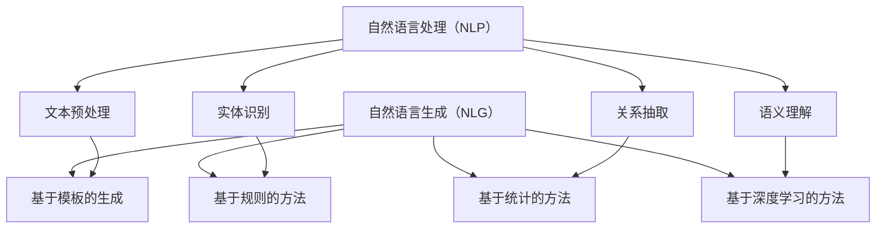

### 第3章：NLP模型与算法原理

#### 3.1 基于统计的方法

基于统计的方法是NLP的早期方法，主要包括：

- **隐马尔可夫模型（HMM）**：用于序列标注任务，如词性标注。
- **条件概率模型**：用于文本分类和主题建模，如朴素贝叶斯分类器。
- **统计语言模型**：用于预测下一个单词或短语，如n元语法。

以下是一个简单的隐马尔可夫模型（HMM）的Mermaid流程图：

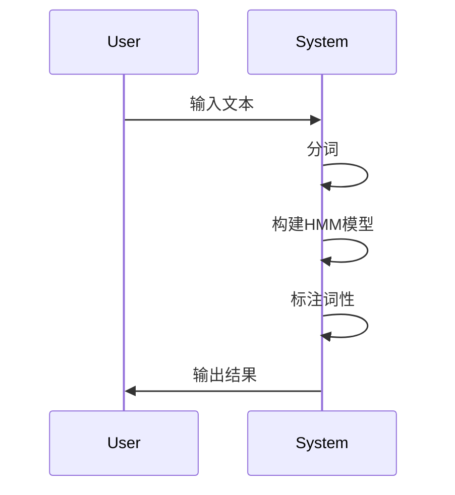

#### 3.2 基于规则的方法

基于规则的方法通过定义一套语法规则来生成文本或进行文本分析。这种方法适用于特定的领域，如法律文档生成、医学报告生成等。以下是一个简单的基于规则的方法的Mermaid流程图：

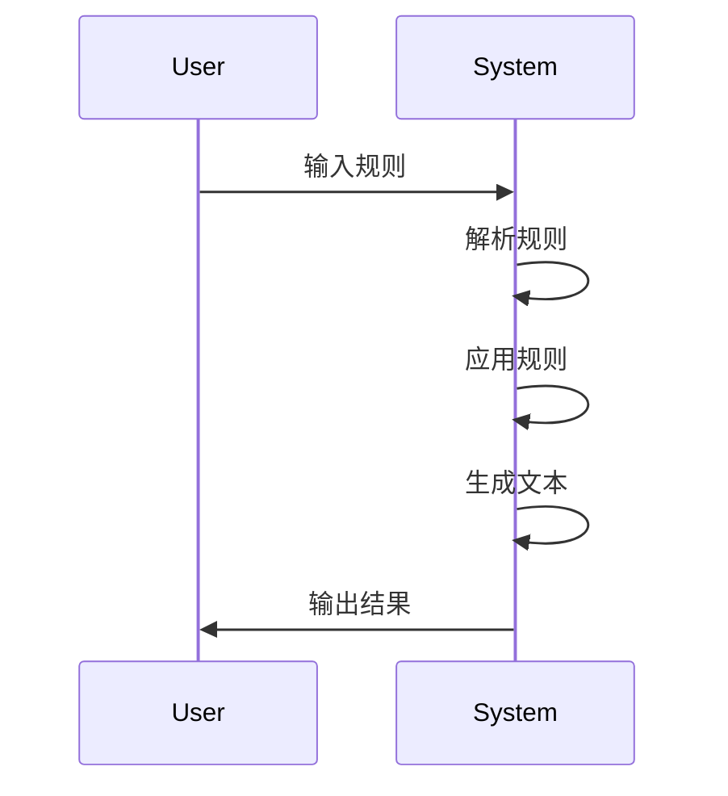

#### 3.3 基于深度学习的方法

基于深度学习的方法是当前NLP的主流方法，主要包括：

- **循环神经网络（RNN）**：用于处理序列数据，如文本。
- **长短时记忆网络（LSTM）**：是RNN的一种改进，能够解决长序列依赖问题。
- **变换器（Transformer）**：是当前最先进的NLP模型，具有强大的序列建模能力。

以下是一个简单的变换器（Transformer）的Mermaid流程图：

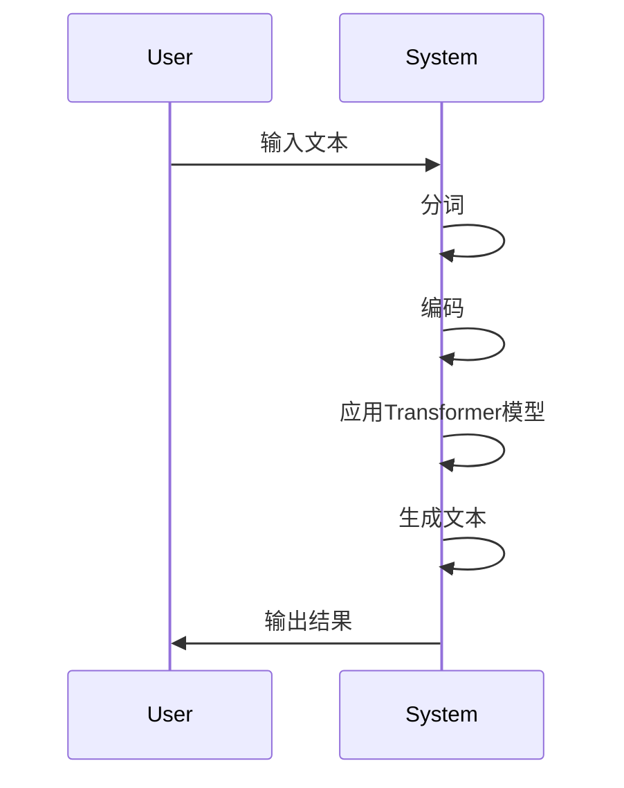

### 第4章：数学模型与公式讲解

#### 4.1 常见NLP算法的数学模型

NLP算法通常涉及复杂的数学模型。以下是一些常见的数学模型：

- **朴素贝叶斯分类器**：
  $$ P(y|X) = \frac{P(X|y)P(y)}{P(X)} $$
  
- **循环神经网络（RNN）**：
  $$ h_t = \sigma(W_h \cdot [h_{t-1}, x_t] + b_h) $$

- **变换器（Transformer）**：
  $$ Y = \text{softmax}(W_y \cdot V) $$
  
以上公式分别表示了文本分类、文本生成等任务的数学模型。以下是一个简单的解释和举例：

- **朴素贝叶斯分类器**：用于文本分类任务，给定一个文本序列X，预测其类别y。例如，判断一篇文章是关于技术的还是关于娱乐的。
  
- **循环神经网络（RNN）**：用于序列建模任务，如语言模型。给定一个序列X，输出隐藏状态序列h。例如，预测下一个单词。

- **变换器（Transformer）**：用于机器翻译、文本生成等任务。给定一个编码器序列X，输出解码器序列Y。例如，将一种语言的句子翻译成另一种语言。

#### 4.2 数学公式与应用举例

以下是一个具体的数学公式应用举例：

**问题**：给定一个包含10个单词的文本序列，使用循环神经网络（RNN）生成下一个单词。

**解答**：

1. **输入编码**：将每个单词转换为词向量，形成一个10维的向量序列。
   $$ X = [x_1, x_2, ..., x_{10}] $$

2. **RNN计算**：使用RNN模型计算隐藏状态序列。
   $$ h_t = \sigma(W_h \cdot [h_{t-1}, x_t] + b_h) $$
   其中，\( h_t \) 表示第t个隐藏状态，\( W_h \) 和 \( b_h \) 分别为权重和偏置。

3. **输出解码**：使用softmax函数生成下一个单词的概率分布。
   $$ Y = \text{softmax}(W_y \cdot V) $$
   其中，\( V \) 表示输出层权重。

4. **选择单词**：根据概率分布选择下一个单词。

此过程可以迭代进行，直到生成完整的文本序列。

### 第5章：NLP系统的架构设计

#### 5.1 系统需求分析

在构建NLP系统时，首先需要进行系统需求分析。需求分析包括以下几个方面：

- **功能需求**：确定系统需要实现的功能，如文本预处理、实体识别、关系抽取、文本生成等。
- **性能需求**：确定系统的性能指标，如处理速度、准确率、召回率等。
- **可靠性需求**：确保系统在长时间运行中保持稳定，能够处理各种异常情况。
- **可扩展性需求**：确保系统能够适应未来业务需求的变化，支持数据量增长和模型升级。

以下是一个简单的系统需求分析表格：

| 需求类型 | 具体需求 |
| --- | --- |
| 功能需求 | 文本预处理、实体识别、关系抽取、文本生成 |
| 性能需求 | 处理速度：每秒处理1000个单词 准确率：达到95% |
| 可靠性需求 | 系统稳定运行，处理中断后可恢复 |
| 可扩展性需求 | 支持自定义算法和模型，可扩展数据处理能力 |

#### 5.2 系统功能设计

系统功能设计是根据需求分析确定的具体实现功能。以下是一个简单的NLP系统的功能设计：

- **文本预处理**：包括分词、词性标注、句法分析等，将原始文本转换为结构化的数据。
- **实体识别**：从文本中识别出人、地点、组织等实体信息。
- **关系抽取**：分析实体之间的关系，如人物关系、组织隶属关系等。
- **文本生成**：根据输入数据生成文本，如报告、文章、新闻等。

以下是一个简单的NLP系统的领域模型Mermaid类图：

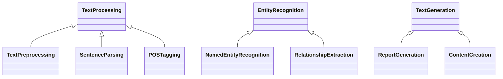

#### 5.3 系统架构设计

系统架构设计是确定系统的整体结构和各组件之间的交互方式。以下是一个简单的NLP系统的架构设计：

- **前端**：提供用户界面，接收用户输入和处理结果。
- **后端**：包括文本预处理、实体识别、关系抽取、文本生成等核心模块，以及数据存储和模型管理模块。
- **接口**：提供与前端和后端之间的数据交换接口。

以下是一个简单的NLP系统架构Mermaid架构图：

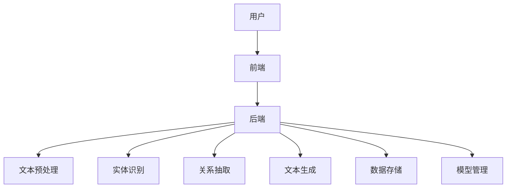

#### 5.4 系统接口设计与交互

系统接口设计是确定系统内部各模块之间的数据交换方式和交互协议。以下是一个简单的NLP系统接口设计：

- **API接口**：提供RESTful API，支持文本预处理、实体识别、关系抽取、文本生成等功能。
- **消息队列**：用于异步处理大量数据和任务，提高系统性能和可扩展性。

以下是一个简单的NLP系统接口Mermaid序列图：

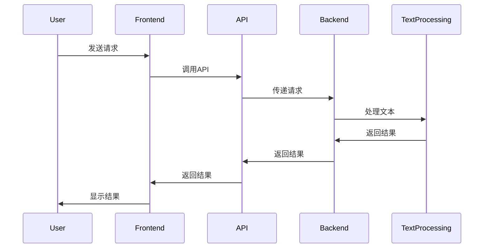

### 第二部分：技术原理与实践

#### 第6章：内容生成（自动报告与内容创作）

#### 6.1 自动报告生成方法

自动报告生成是NLP技术在企业中的重要应用之一。以下是一种简单的自动报告生成方法：

1. **数据收集**：收集需要生成报告的数据，如销售数据、财务数据、运营数据等。
2. **数据预处理**：对数据进行清洗、归一化和格式转换，确保数据质量。
3. **数据提取**：从数据中提取关键信息，如金额、数量、百分比等。
4. **报告模板**：根据报告的格式和内容，设计报告模板。
5. **文本生成**：使用NLG技术生成报告文本，将提取的关键信息填充到报告模板中。
6. **报告输出**：将生成的报告文本输出到目标格式，如PDF、Word等。

以下是一个简单的自动报告生成流程Mermaid流程图：

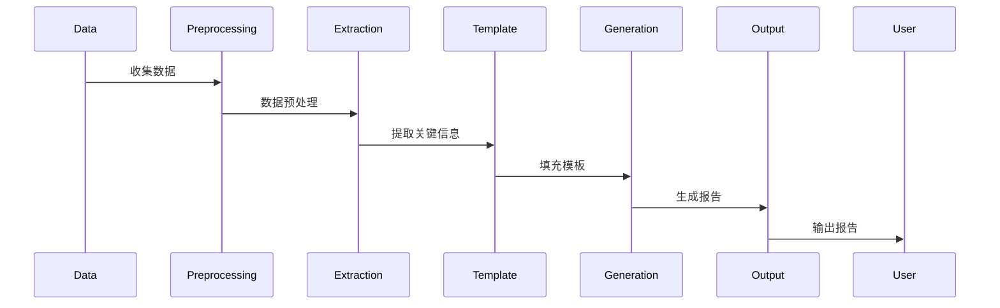

#### 6.2 内容创作策略与技巧

内容创作是自动报告生成的重要补充。以下是一些内容创作的策略与技巧：

1. **需求分析**：明确内容创作的目的和受众，确定内容类型和风格。
2. **数据驱动的创作**：利用数据分析和用户反馈，为内容创作提供数据支持。
3. **模板化创作**：设计多种内容模板，根据需求快速生成内容。
4. **语境敏感创作**：根据上下文环境和用户需求，生成符合语境的内容。
5. **文本生成与编辑**：使用NLG技术生成文本，结合人工编辑，提高内容质量。

以下是一个简单的内容创作流程Mermaid流程图：

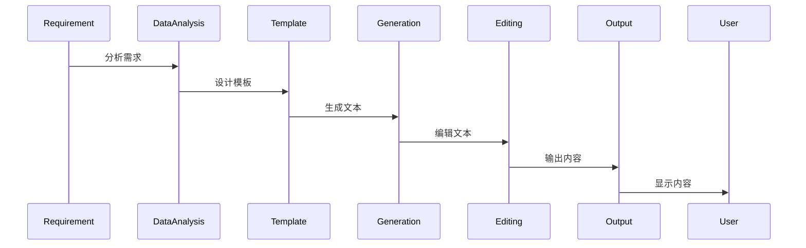

#### 6.3 内容评估与优化

内容评估与优化是确保自动报告和内容创作质量的关键步骤。以下是一些内容评估与优化的方法：

1. **用户反馈**：收集用户对内容的评价和反馈，识别问题和改进方向。
2. **自动化评估**：使用指标如文本质量评分、错误率等，对生成内容进行自动化评估。
3. **人工审核**：结合机器评估和人工审核，确保内容的质量和准确性。
4. **持续优化**：根据评估结果，对NLG模型和生成策略进行调整和优化。

以下是一个简单的内容评估与优化流程Mermaid流程图：

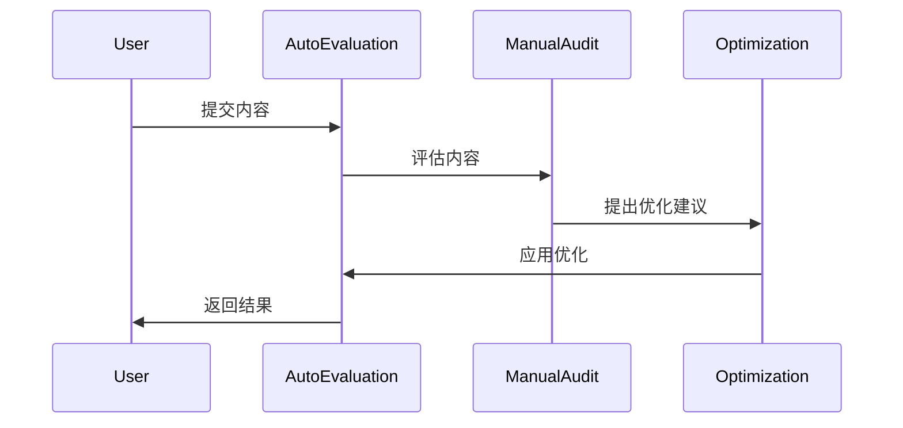

### 第三部分：总结与展望

#### 第9章：优化与维护

#### 9.1 系统优化策略

系统优化是提高NLP系统性能和效率的重要手段。以下是一些常见的系统优化策略：

1. **算法优化**：针对具体任务，选择合适的算法和模型，进行优化和调参。
2. **硬件加速**：利用GPU、TPU等硬件加速技术，提高数据处理速度。
3. **数据预处理**：优化数据预处理流程，提高数据质量和一致性。
4. **分布式计算**：使用分布式计算框架，如Spark、Hadoop等，提高系统处理能力。

以下是一个简单的系统优化策略Mermaid流程图：

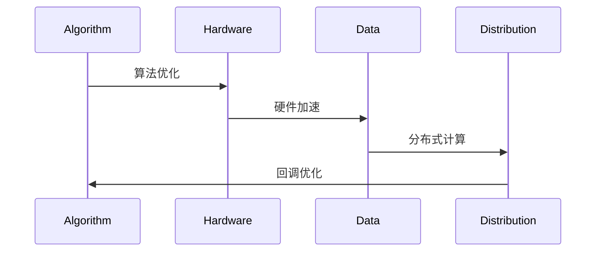

#### 9.2 维护与更新

系统的维护与更新是确保系统长期稳定运行的关键。以下是一些维护与更新的方法：

1. **定期备份**：定期备份系统数据和模型，防止数据丢失。
2. **监控与报警**：监控系统性能和运行状态，及时发现问题并进行修复。
3. **版本控制**：使用版本控制系统，管理代码和模型的变更，确保系统稳定性。
4. **持续集成与部署**：实施持续集成与持续部署（CI/CD），快速迭代和发布新功能。

以下是一个简单的系统维护与更新流程Mermaid流程图：

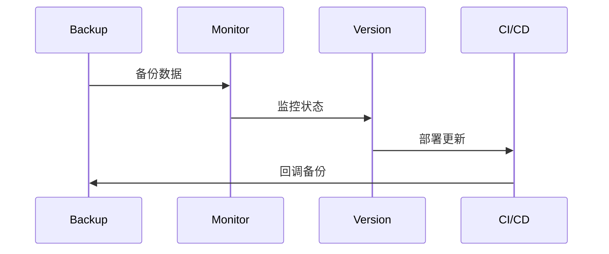

#### 9.3 未来发展方向

NLP技术在不断进步，未来有望在以下几个方面取得突破：

1. **多模态NLP**：结合文本、图像、音频等多模态数据，实现更丰富的语义理解和生成。
2. **预训练模型**：基于大规模预训练模型，实现更高效、更强大的NLP应用。
3. **知识图谱**：利用知识图谱，实现更精准的实体关系抽取和语义理解。
4. **个性化和交互**：结合用户行为和偏好，实现更个性化的内容生成和交互体验。

以下是一个简单的未来发展方向Mermaid流程图：

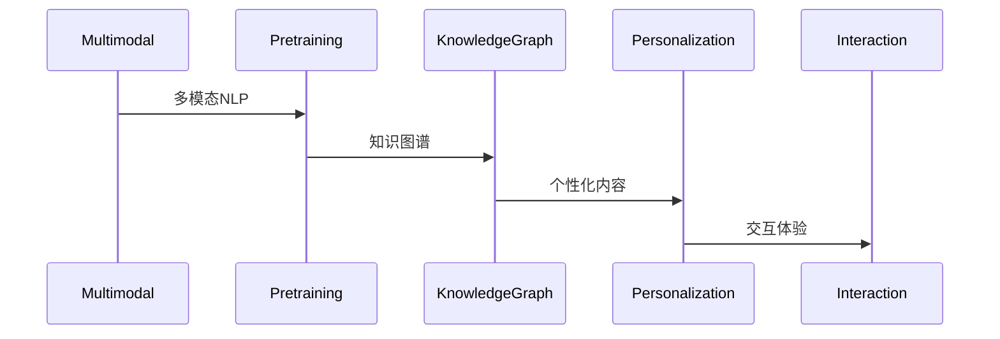

### 第10章：结论

#### 10.1 核心观点回顾

本文从背景介绍、核心概念、技术原理、系统架构设计、内容生成方法、系统集成、优化与维护到未来发展方向，全面探讨了构建企业级自然语言生成系统的关键要素。核心观点如下：

- 自动报告与内容创作是NLP技术在企业中的重要应用。
- NLP与NLG密切相关，共同构成了自然语言处理的核心。
- 基于统计、规则和深度学习的方法是当前NLP和NLG的主要技术手段。
- 系统需求分析、功能设计、架构设计、接口设计是构建企业级NLP系统的基础。
- 内容生成、系统集成、优化与维护是确保系统高效稳定运行的关键。
- 未来NLP技术将朝着多模态、预训练、知识图谱和个性化交互等方向发展。

#### 10.2 技术挑战与机遇

在构建企业级NLP系统的过程中，面临着以下技术挑战：

- 数据质量：企业级数据质量参差不齐，需要预处理和清洗。
- 模型复杂度：NLP模型复杂度高，训练和推理过程计算量大。
- 可解释性：企业对NLP系统的可解释性有较高要求。
- 系统集成：NLP系统需要与现有业务系统、数据存储和通信机制等进行集成。

然而，随着技术的进步，NLP技术也带来了诸多机遇：

- 自动化：NLP技术可以自动化报告生成、内容创作等任务，提高工作效率。
- 个性化：NLP技术可以结合用户行为和偏好，实现更个性化的内容生成和交互体验。
- 多模态：NLP技术可以结合文本、图像、音频等多模态数据，实现更丰富的语义理解和生成。

#### 10.3 进一步研究方向

未来NLP技术在以下几个方面有望取得突破：

- 多模态NLP：结合文本、图像、音频等多模态数据，实现更丰富的语义理解和生成。
- 预训练模型：基于大规模预训练模型，实现更高效、更强大的NLP应用。
- 知识图谱：利用知识图谱，实现更精准的实体关系抽取和语义理解。
- 个性化和交互：结合用户行为和偏好，实现更个性化的内容生成和交互体验。

通过深入研究这些方向，有望推动NLP技术在企业级应用中的进一步发展。

