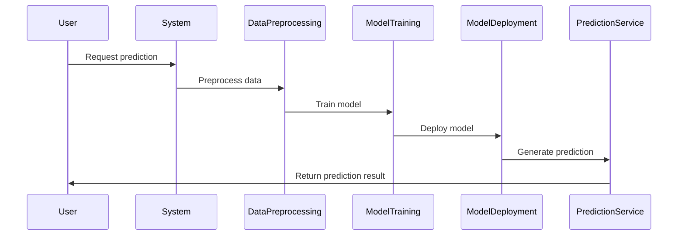
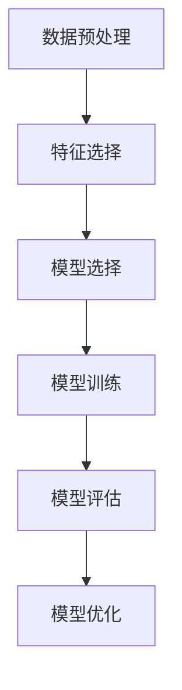

                 

### 第1章：问题背景与解决方案

#### 1.1 问题背景

在当今高度竞争的商业环境中，企业需要不断寻求创新和效率的提升来保持竞争力。数据已经成为企业宝贵的资产，而如何从这些数据中提取价值，预测未来的趋势和需求，成为企业决策的重要依据。预测性分析（Predictive Analytics）作为一种利用历史数据和先进算法来预测未来事件的技术，正逐渐受到企业的重视。

预测性分析能够帮助企业解决以下问题：

1. **需求预测**：通过分析历史销售数据和外部因素，预测未来的产品需求，从而优化库存管理和生产计划。
2. **风险控制**：预测潜在的财务风险、市场风险等，帮助企业采取预防措施。
3. **客户流失预测**：分析客户行为数据，预测哪些客户可能流失，并采取相应措施进行挽留。
4. **设备维护**：预测设备可能出现的故障，提前进行维护，避免停机损失。

#### 1.2 问题描述

尽管预测性分析具有巨大的潜力，但在实际应用中，企业面临以下挑战：

1. **数据复杂性**：企业拥有大量结构化和非结构化数据，如何有效地整合这些数据，提取有价值的信息，是一个巨大的挑战。
2. **模型准确性**：预测模型的准确性取决于数据的质量和选择的算法，如何确保模型的高准确性是一个关键问题。
3. **跨部门协同**：预测性分析通常需要跨部门的数据和知识，如何实现跨部门的协同工作，提高决策效率，是另一个挑战。
4. **成本控制**：构建和维护预测性分析平台需要投入大量的人力、物力和财力，如何控制成本，实现ROI（投资回报率）是企业管理者关心的问题。

#### 1.3 解决方案概述

为了解决上述问题，企业需要构建一个企业级预测性分析平台，这个平台需要具备以下特点：

1. **数据整合能力**：能够整合企业内外部各类数据，包括结构化数据、非结构化数据、实时数据和历史数据。
2. **高效的算法支持**：内置多种先进的机器学习算法，能够根据不同业务场景选择合适的算法，并自动调整参数以优化模型性能。
3. **灵活的可扩展性**：支持自定义预测模型和算法，能够适应不同业务需求的变化。
4. **跨部门协作**：提供统一的用户界面和API，方便不同部门的数据共享和协作。
5. **成本效益**：提供高性能的云计算支持，以降低硬件和运维成本。

通过构建这样的企业级预测性分析平台，企业可以实现以下目标：

1. **提高决策效率**：通过实时数据分析，帮助企业快速做出准确决策。
2. **降低运营成本**：通过预测性分析，优化库存管理、减少设备维护成本等。
3. **增强客户体验**：通过预测客户需求，提供个性化的产品和服务。
4. **提升竞争力**：通过数据驱动，实现业务创新和持续改进。

#### 1.4 边界与外延

在构建企业级预测性分析平台的过程中，需要明确以下边界和外延：

1. **数据边界**：明确数据的收集范围、数据的质量标准和数据的使用权限。
2. **算法边界**：确定哪些算法适用于企业当前的业务场景，以及如何调整和优化这些算法。
3. **功能边界**：定义平台的核心功能和扩展功能，确保平台的可扩展性和灵活性。
4. **团队边界**：明确负责平台建设和维护的团队，以及与其他部门协作的机制。

### 概念属性特征对比表格

为了更好地理解预测性分析中的关键概念，以下是一个概念属性特征对比表格：

| 概念       | 定义                                                         | 属性特征                                                   |
| ---------- | ------------------------------------------------------------ | ---------------------------------------------------------- |
| 数据分析   | 利用统计学、数据挖掘等方法，从大量数据中提取有价值信息的过程 | 结构化数据、非结构化数据、实时数据、历史数据                 |
| 机器学习   | 基于数据驱动，使计算机自动从数据中学习规律并作出预测的算法   | 监督学习、非监督学习、强化学习等                             |
| 预测模型   | 基于历史数据和算法构建的，用于预测未来事件或趋势的模型     | 回归模型、分类模型、时间序列模型等                          |
| 预测性分析 | 利用历史数据和算法，预测未来事件或趋势的技术             | 数据分析、机器学习、预测模型的综合应用                       |

### ER实体关系图架构

以下是一个简化的ER实体关系图，展示了预测性分析平台中核心实体及其关系：

```mermaid
erDiagram
  Customer !!--* Patient : "receives care"
  Customer ||--|{ Order } : "places"
  Patient ||--|{ Appointment } : "has"
  Patient ||--|{ Prescription } : "receives"
  Order ||--|{ Product } : "contains"
  Prescription ||--|{ Drug } : "contains"
  Appointment : "schedule" Customer
  Drug : "manufactured" Pharmacy
  Product : "sold" Store
  Pharmacy ||--|{ Pharmacist } : "employed"
  Store : "employs" Employee
```

在上图中，`Customer`实体与`Order`、`Patient`实体与`Appointment`和`Prescription`实体之间存在一对多的关系，而`Order`、`Prescription`和`Appointment`实体则与`Product`和`Drug`实体之间存在包含关系。通过这样的实体关系图，我们可以更好地理解预测性分析平台中的数据流和业务逻辑。

### 总结

本章介绍了预测性分析在企业中的重要性和应用背景，并提出了构建企业级预测性分析平台的解决方案。在接下来的章节中，我们将详细探讨预测性分析的核心概念、平台架构设计、预测模型设计和实现、案例分析以及最佳实践和注意事项，帮助读者全面了解并掌握构建企业级预测性分析平台的方法和技巧。接下来，我们将进入第二部分，深入探讨预测性分析的核心概念和联系。

## 第2章：核心概念与联系

预测性分析作为一项重要的技术，其在企业中的广泛应用离不开对核心概念的理解和掌握。本章将详细介绍预测性分析的定义、核心概念及其相互之间的联系，帮助读者构建一个全面的知识框架。

### 2.1 预测性分析的定义

预测性分析是一种利用历史数据和先进的算法模型，对未来的趋势、行为和事件进行预测的技术。它通过统计分析、数据挖掘和机器学习等方法，从大量数据中提取有价值的信息，帮助企业在不确定的环境中进行决策。

#### 预测性分析的核心特点

1. **基于数据驱动**：预测性分析的核心在于数据，通过对历史数据的深入挖掘和分析，发现潜在的模式和规律。
2. **提前预警**：通过预测模型，可以提前识别潜在的风险和机会，帮助企业采取预防措施或优化策略。
3. **持续优化**：预测性分析是一个动态的过程，随着新的数据不断输入，模型会不断调整和优化，提高预测的准确性。

### 2.2 预测性分析的核心概念

#### 2.2.1 数据分析

数据分析（Data Analysis）是预测性分析的基础，它涉及使用统计学、统计图表、数据分析软件等工具，对数据进行提取、清洗、转换和建模，以发现数据中的模式和关联。

**数据分析的过程**：

1. **数据收集**：收集企业内部和外部的数据，包括销售数据、客户行为数据、市场数据等。
2. **数据清洗**：去除数据中的噪声和错误，确保数据的质量。
3. **数据转换**：将数据转换为适合分析的形式，如数值化、归一化等。
4. **数据建模**：使用统计学或机器学习算法，建立预测模型。

**数据分析的重要指标**：

- **相关性分析**：分析变量之间的相关性，发现潜在关联。
- **回归分析**：通过建立回归模型，预测目标变量的值。
- **聚类分析**：将数据分为不同的群体，发现数据中的模式。

#### 2.2.2 机器学习

机器学习（Machine Learning）是预测性分析的核心技术，它通过训练模型，使计算机能够从数据中自动学习和提取规律。

**机器学习的分类**：

1. **监督学习**：通过训练数据集，使模型能够预测新的数据点。
2. **非监督学习**：在无标签数据集上，发现数据中的模式和关联。
3. **强化学习**：通过反馈机制，使模型不断优化自己的行为。

**常见的机器学习算法**：

- **线性回归**：预测连续变量。
- **逻辑回归**：预测二元变量。
- **决策树**：通过树形结构进行分类或回归。
- **随机森林**：基于决策树的集成模型，提高预测准确性。
- **支持向量机**：通过最大化分类边界来分类。
- **神经网络**：模拟人脑的神经网络结构，用于复杂的数据分析。

#### 2.2.3 预测模型

预测模型（Predictive Model）是基于历史数据和算法，用于预测未来事件或趋势的模型。

**预测模型的构建过程**：

1. **数据预处理**：对原始数据进行清洗、转换和预处理，确保数据质量。
2. **特征选择**：从原始数据中提取有用的特征，用于模型训练。
3. **模型选择**：选择合适的算法和模型，如线性回归、决策树、神经网络等。
4. **模型训练**：使用训练数据集，训练预测模型。
5. **模型评估**：使用验证数据集，评估模型性能。
6. **模型优化**：根据评估结果，调整模型参数，提高预测准确性。

**预测模型的评估指标**：

- **准确率**：模型预测正确的比例。
- **召回率**：模型预测为正例的真正例数与所有真正例数的比例。
- **F1分数**：准确率和召回率的调和平均。
- **ROC曲线**：评价分类器性能的重要指标。

### 2.3 概念属性特征对比表格

为了更直观地理解预测性分析中的关键概念，以下是一个概念属性特征对比表格：

| 概念       | 定义                                                         | 关联特征                             | 用途                                       |
| ---------- | ------------------------------------------------------------ | ------------------------------------ | ------------------------------------------ |
| 数据分析   | 从大量数据中提取有价值信息的过程                           | 数据收集、清洗、转换、建模           | 发现数据中的模式和关联                     |
| 机器学习   | 使计算机能够从数据中自动学习和提取规律的技术                 | 监督学习、非监督学习、强化学习       | 构建预测模型                               |
| 预测模型   | 基于历史数据和算法，用于预测未来事件或趋势的模型             | 数据预处理、特征选择、模型选择、评估 | 预测未来事件或趋势                         |

### 2.4 ER实体关系图架构

为了更好地理解预测性分析平台中的核心实体及其关系，以下是一个简化的ER实体关系图，展示了预测性分析平台中主要实体及其关联：

```mermaid
erDiagram
  Data -> Analysis : "uses for"
  Analysis --> Model : "creates"
  Model --> Prediction : "uses for"
  Data --> MachineLearning : "uses for training"
  MachineLearning --> Algorithm : "uses for modeling"
  Algorithm --> Model : "creates"
  Prediction --> Decision : "uses for"
```

在上图中，`Data`（数据）是预测性分析的基础，`Analysis`（数据分析）和`MachineLearning`（机器学习）通过数据提取和模型训练，生成`Model`（预测模型），最后通过预测模型生成`Prediction`（预测结果），这些预测结果用于企业的决策过程（`Decision`）。

### 总结

本章详细介绍了预测性分析的定义、核心概念及其相互之间的联系。通过数据分析、机器学习和预测模型的综合应用，企业可以构建一个高效的预测性分析平台，为业务决策提供有力支持。在下一章中，我们将深入探讨企业级预测性分析平台的设计和架构，为读者提供具体的实施方法和策略。

## 第3章：平台架构设计

在企业级预测性分析平台的构建过程中，平台架构的设计至关重要。一个高效、灵活且易于扩展的架构设计不仅能够满足当前的业务需求，还能够应对未来业务的发展变化。本章将详细阐述企业级预测性分析平台的架构设计，包括平台架构概述、系统功能设计、系统架构设计、系统接口设计以及系统交互。

### 3.1 平台架构概述

企业级预测性分析平台是一个复杂的系统，涉及多个层次和模块的协同工作。总体架构可以概括为四个主要层次：数据层、算法层、模型层和应用层。

**数据层**：数据层是平台的基础，包括数据的收集、存储、管理和预处理。数据来源包括企业内部的数据仓库、外部数据源、实时数据流等。数据层需要确保数据的完整性、一致性和质量。

**算法层**：算法层提供了多种机器学习算法和预测模型，包括监督学习、非监督学习和强化学习等。算法层需要支持模型的训练、评估和优化，同时提供灵活的算法扩展机制。

**模型层**：模型层是基于算法层生成的预测模型，包括回归模型、分类模型、时间序列模型等。模型层需要支持模型的部署、管理和更新，确保模型的实时性和准确性。

**应用层**：应用层是平台的核心功能，包括预测结果的生成、可视化、报告生成等。应用层需要提供友好的用户界面和强大的API接口，方便业务人员使用。

### 3.2 系统功能设计

系统功能设计是平台架构设计的重要组成部分，决定了平台的实用性和易用性。以下是企业级预测性分析平台的主要功能设计：

**1. 数据采集与集成**：从各种数据源（如数据库、文件、Web服务）采集数据，并进行数据清洗、转换和集成。这一功能需要支持多种数据格式和数据协议，确保数据的一致性和准确性。

**2. 数据存储与管理**：将采集到的数据存储到数据仓库或数据湖中，并提供数据检索、管理和维护功能。数据存储与管理需要支持数据的快速查询、索引和更新，同时提供数据备份和恢复功能。

**3. 数据预处理**：对原始数据进行清洗、转换和归一化，确保数据的质量和一致性。数据预处理还包括特征提取和选择，为后续的建模提供高质量的输入数据。

**4. 模型训练与评估**：使用机器学习算法对预处理后的数据集进行训练，生成预测模型。模型训练完成后，需要使用验证数据集进行评估，确保模型的准确性和鲁棒性。

**5. 模型部署与更新**：将训练好的预测模型部署到生产环境，并提供模型管理和更新功能。模型更新需要支持在线更新和版本控制，确保模型的实时性和准确性。

**6. 预测结果可视化**：将预测结果以图表、报表等形式展示给用户，方便用户理解和分析。可视化功能需要支持自定义报表和仪表板，满足不同用户的需求。

**7. API接口与服务**：提供RESTful API接口，方便第三方系统集成和使用。API接口需要支持数据的查询、预测结果的获取和模型的管理等功能。

### 3.3 系统架构设计

系统架构设计是平台设计的核心，决定了平台的技术选型和实现方案。以下是企业级预测性分析平台的系统架构设计：

**1. 技术选型**：

- **数据层**：使用Hadoop、Spark等大数据处理框架，实现数据的存储、管理和预处理。
- **算法层**：使用Scikit-learn、TensorFlow、PyTorch等机器学习库，实现模型的训练、评估和优化。
- **模型层**：使用TensorFlow Serving、Kubernetes等框架，实现模型的部署、管理和更新。
- **应用层**：使用Web框架（如Django、Flask）和前端技术（如React、Vue.js），实现用户界面和API接口。

**2. 系统模块划分**：

- **数据采集模块**：负责数据的收集、清洗和集成。
- **数据存储模块**：负责数据的存储、管理和检索。
- **数据预处理模块**：负责数据的清洗、转换和归一化。
- **模型训练模块**：负责模型的训练、评估和优化。
- **模型部署模块**：负责模型的部署、管理和更新。
- **应用服务模块**：负责预测结果的生成、可视化和服务。

**3. 系统架构图**：

以下是一个简化的系统架构图，展示了企业级预测性分析平台的主要组件和交互关系：



### 3.4 系统接口设计

系统接口设计是平台架构设计的重要组成部分，决定了平台与其他系统集成的便捷性和灵活性。以下是企业级预测性分析平台的接口设计：

**1. 数据接口**：

- **数据输入接口**：提供数据上传、导入等功能，支持多种数据格式（如CSV、JSON、Parquet）。
- **数据输出接口**：提供数据查询、下载等功能，支持自定义数据格式。

**2. 预测接口**：

- **预测API接口**：提供RESTful API接口，支持预测请求的提交和结果获取。
- **预测Web接口**：提供Web界面，支持用户通过图形界面进行预测操作。

**3. 模型接口**：

- **模型训练接口**：提供模型训练的API接口，支持自定义训练参数和算法。
- **模型管理接口**：提供模型管理的API接口，支持模型的创建、更新、删除和查询。

### 3.5 系统交互

系统交互是平台架构设计的关键，决定了系统的协同效率和用户体验。以下是企业级预测性分析平台的系统交互设计：

**1. 用户交互**：

- **用户登录**：用户通过用户名和密码登录系统，获得操作权限。
- **数据上传**：用户可以选择本地文件或远程数据源，上传数据到系统。
- **预测请求**：用户可以通过Web界面或API接口提交预测请求，系统返回预测结果。
- **报表查看**：用户可以查看预测结果的图表和报表，进行分析和决策。

**2. 系统内部交互**：

- **数据流处理**：系统使用流处理框架（如Apache Kafka）进行数据流处理，确保数据的实时性和一致性。
- **任务调度**：系统使用任务调度框架（如Apache Airflow）进行任务调度，确保模型训练、部署和更新等任务的自动化执行。
- **监控与报警**：系统使用监控系统（如Prometheus、Grafana）进行系统监控和报警，确保系统的稳定性和可靠性。

### 总结

本章详细介绍了企业级预测性分析平台的架构设计，包括平台架构概述、系统功能设计、系统架构设计、系统接口设计和系统交互。通过科学的架构设计和合理的模块划分，企业级预测性分析平台能够高效地处理海量数据，提供准确的预测结果，为企业的业务决策提供有力支持。在下一章中，我们将深入探讨预测模型的设计与实现，帮助读者理解预测模型的基本原理、算法流程和Python源代码实现。

### 第4章：预测模型设计与实现

在构建企业级预测性分析平台的过程中，预测模型的设计与实现是核心环节。一个高效的预测模型不仅能够提高模型的预测准确性，还能够降低计算复杂度和资源消耗。本章将详细介绍预测模型的设计与实现，包括预测模型的基本原理、算法流程图、Python源代码实现以及数学模型和公式。

#### 4.1 预测模型原理

预测模型是基于历史数据和机器学习算法，通过训练数据集自动发现数据中的潜在规律和模式，从而预测未来事件或趋势的模型。预测模型的原理可以概括为以下几个步骤：

1. **数据预处理**：对原始数据进行清洗、转换和归一化，确保数据的质量和一致性。
2. **特征选择**：从原始数据中提取有用的特征，减少数据维度，提高模型训练的效率。
3. **模型选择**：选择合适的机器学习算法和模型结构，如线性回归、决策树、神经网络等。
4. **模型训练**：使用训练数据集，对模型进行训练，使模型学会数据中的规律和模式。
5. **模型评估**：使用验证数据集，评估模型的性能，如准确率、召回率、F1分数等。
6. **模型优化**：根据评估结果，调整模型参数和结构，提高模型的预测准确性。

#### 4.2 算法流程图

为了更直观地理解预测模型的实现过程，以下是一个简化的算法流程图，展示了预测模型的基本步骤：



在上图中，数据预处理、特征选择、模型选择、模型训练、模型评估和模型优化是预测模型实现的主要步骤。每个步骤都需要根据具体业务场景和数据特点进行定制化设计。

#### 4.3 Python源代码实现

以下是一个简单的线性回归模型的Python源代码实现，展示了如何使用Python和Scikit-learn库进行预测模型的训练和评估：

```python
import numpy as np
from sklearn.linear_model import LinearRegression
from sklearn.model_selection import train_test_split
from sklearn.metrics import mean_squared_error

# 数据预处理
# 假设 X 是特征矩阵，y 是目标向量
X = np.array([[1, 2], [2, 3], [3, 4], [4, 5]])
y = np.array([2, 3, 4, 5])

# 特征选择
# 这里使用全部特征，无需进一步特征选择

# 模型选择
model = LinearRegression()

# 模型训练
model.fit(X, y)

# 模型评估
X_test, y_test = train_test_split(X, y, test_size=0.2, random_state=42)
y_pred = model.predict(X_test)
mse = mean_squared_error(y_test, y_pred)
print("MSE:", mse)

# 模型优化
# 根据评估结果，可以调整模型参数或选择不同的模型结构
```

在这段代码中，我们首先导入必要的库和模块，然后进行数据预处理、特征选择、模型选择、模型训练和模型评估。最后，根据评估结果，我们可以对模型进行优化，以提高预测准确性。

#### 4.4 数学模型与公式

线性回归是预测模型中最基本的一种模型，其数学模型可以表示为：

$$
y = \beta_0 + \beta_1 \cdot x_1 + \beta_2 \cdot x_2 + \ldots + \beta_n \cdot x_n + \epsilon
$$

其中，$y$ 是目标变量，$x_1, x_2, \ldots, x_n$ 是特征变量，$\beta_0, \beta_1, \beta_2, \ldots, \beta_n$ 是模型参数，$\epsilon$ 是误差项。

为了求解模型参数，我们可以使用最小二乘法，其目标是最小化预测值与实际值之间的误差平方和：

$$
\min \sum_{i=1}^n (y_i - \beta_0 - \beta_1 x_{i1} - \beta_2 x_{i2} - \ldots - \beta_n x_{in})^2
$$

通过求解上述目标函数的导数为零的方程组，可以得到线性回归模型的参数：

$$
\beta_0 = \bar{y} - \beta_1 \bar{x}_1 - \beta_2 \bar{x}_2 - \ldots - \beta_n \bar{x}_n
$$

$$
\beta_1 = \frac{\sum_{i=1}^n (x_{i1} - \bar{x}_1)(y_i - \bar{y})}{\sum_{i=1}^n (x_{i1} - \bar{x}_1)^2}
$$

$$
\beta_2 = \frac{\sum_{i=1}^n (x_{i2} - \bar{x}_2)(y_i - \bar{y})}{\sum_{i=1}^n (x_{i2} - \bar{x}_2)^2}
$$

$$
\ldots
$$

$$
\beta_n = \frac{\sum_{i=1}^n (x_{in} - \bar{x}_n)(y_i - \bar{y})}{\sum_{i=1}^n (x_{in} - \bar{x}_n)^2}
$$

其中，$\bar{y}$ 和 $\bar{x}_i$ 分别是目标变量和特征变量的均值。

#### 4.4.1 相关数学公式

在预测模型的设计和实现过程中，除了线性回归模型的公式外，还需要掌握其他数学公式和概念，如：

1. **线性变换**：线性变换是指将输入数据通过线性变换映射到新的空间，以提高模型的可解释性和性能。

$$
x' = \sum_{i=1}^n w_i x_i + b
$$

其中，$x'$ 是变换后的特征向量，$x_i$ 是原始特征向量，$w_i$ 是变换矩阵的权重，$b$ 是偏置。

2. **损失函数**：损失函数用于评估模型预测值与实际值之间的差距，常见的损失函数包括均方误差（MSE）、均方根误差（RMSE）、交叉熵损失等。

$$
MSE = \frac{1}{n} \sum_{i=1}^n (y_i - \hat{y}_i)^2
$$

$$
RMSE = \sqrt{MSE}
$$

$$
H(y, \hat{y}) = -\sum_{i=1}^n y_i \log(\hat{y}_i) - (1 - y_i) \log(1 - \hat{y}_i)
$$

3. **优化算法**：优化算法用于求解模型参数，常见的优化算法包括梯度下降、随机梯度下降、Adam优化器等。

$$
\theta = \theta - \alpha \nabla_\theta J(\theta)
$$

$$
\theta = \theta - \alpha \frac{\partial J(\theta)}{\partial \theta}
$$

$$
\theta = \theta - \frac{\partial J(\theta)}{\partial \theta}
$$

其中，$\theta$ 是模型参数，$\alpha$ 是学习率，$J(\theta)$ 是损失函数。

#### 4.4.2 公式解释

以下是对上述数学公式的解释：

1. **线性回归公式**：线性回归公式表示了目标变量与特征变量之间的关系，其中$\beta_0$ 是截距，$\beta_1, \beta_2, \ldots, \beta_n$ 是斜率。通过最小化误差平方和，我们可以求解出最优的模型参数，从而建立线性回归模型。

2. **线性变换公式**：线性变换公式用于将输入数据映射到新的空间，以提高模型的可解释性和性能。通过调整权重和偏置，我们可以实现数据压缩、降维、正则化等操作。

3. **损失函数公式**：损失函数用于评估模型预测值与实际值之间的差距。均方误差（MSE）是衡量预测值与实际值之间平均误差的指标，均方根误差（RMSE）是MSE的平方根，用于衡量预测误差的尺度。交叉熵损失是用于分类问题的损失函数，其值越小，表示模型预测越准确。

4. **优化算法公式**：优化算法用于求解模型参数，其目标是使损失函数最小。梯度下降是最简单的优化算法，通过不断更新模型参数，使损失函数逐步减小。随机梯度下降（SGD）是对梯度下降的改进，每次迭代只使用一个样本，加快收敛速度。Adam优化器是结合了SGD和动量项的优化算法，具有更好的收敛性能。

通过上述数学公式和优化算法，我们可以设计并实现高效的预测模型，为企业的业务决策提供有力支持。

### 总结

本章详细介绍了预测模型的设计与实现，包括预测模型的基本原理、算法流程图、Python源代码实现以及数学模型和公式。通过理解预测模型的原理和实现方法，读者可以更好地设计和优化预测模型，为企业的业务决策提供科学依据。在下一章中，我们将通过实际案例分析，展示预测模型在实际业务场景中的应用效果。

### 第5章：案例分析与应用

为了更好地展示预测模型在企业级预测性分析平台中的应用效果，本章节将通过三个实际案例，分别探讨预测模型在库存管理、客户流失预测和设备故障预测三个不同业务场景中的应用。通过这些案例，读者可以更直观地了解预测模型的实现过程、数据准备、模型训练与评估，以及实际业务中的效果分析。

#### 5.1 数据集准备

在开始每个案例之前，首先需要准备相应的数据集。这些数据集包括历史销售数据、客户行为数据、设备运行数据等。数据集的质量和完整性直接影响预测模型的准确性。以下是对数据集准备的简要描述：

1. **库存管理案例**：数据集包含商品的销售记录，包括商品ID、销售时间、销售数量、库存量等。
2. **客户流失预测案例**：数据集包含客户的基本信息、购买历史、服务记录等，如客户ID、年龄、购买频率、最近一次购买时间等。
3. **设备故障预测案例**：数据集包含设备运行数据，包括设备ID、运行时间、故障记录、维护记录等。

在准备数据集时，需要遵循以下步骤：

- **数据收集**：从企业现有的数据仓库或外部数据源中收集所需数据。
- **数据清洗**：处理数据中的缺失值、异常值和噪声数据，确保数据的质量。
- **数据转换**：将数据转换为适合建模的格式，如归一化、标准化等。
- **数据划分**：将数据集划分为训练集、验证集和测试集，用于模型训练、评估和测试。

#### 5.2 模型训练与评估

在准备好数据集后，接下来是模型训练与评估。以下是每个案例的模型训练与评估步骤：

1. **库存管理案例**：
   - **模型选择**：选择线性回归模型进行库存需求预测。
   - **模型训练**：使用训练集数据对线性回归模型进行训练。
   - **模型评估**：使用验证集数据评估模型性能，包括预测准确率和均方误差等指标。

2. **客户流失预测案例**：
   - **模型选择**：选择逻辑回归模型进行客户流失预测。
   - **特征工程**：对原始数据进行特征提取和特征选择，如创建时间窗口特征、频率特征等。
   - **模型训练**：使用训练集数据对逻辑回归模型进行训练。
   - **模型评估**：使用验证集数据评估模型性能，包括准确率、召回率和F1分数等指标。

3. **设备故障预测案例**：
   - **模型选择**：选择随机森林模型进行设备故障预测。
   - **特征工程**：对原始数据进行特征提取和特征选择，如创建时间窗口特征、统计特征等。
   - **模型训练**：使用训练集数据对随机森林模型进行训练。
   - **模型评估**：使用验证集数据评估模型性能，包括准确率、召回率和F1分数等指标。

#### 5.3 应用案例一：库存管理

库存管理是企业运营中一个关键环节，通过预测性分析可以优化库存水平，降低库存成本。以下是库存管理案例的具体实现过程：

1. **数据集准备**：收集并清洗历史销售数据，如商品ID、销售时间、销售数量、库存量等。将数据集划分为训练集和测试集。

2. **模型训练**：
   - **模型选择**：选择线性回归模型进行库存需求预测。
   - **模型训练**：使用训练集数据训练线性回归模型。
   - **模型评估**：使用测试集数据评估模型性能，包括预测准确率和均方误差等指标。

3. **结果分析**：
   - **预测结果**：模型预测了未来的库存需求，包括预测值和置信区间。
   - **误差分析**：通过对比预测值与实际值，分析模型的预测误差，包括均方误差、均方根误差等指标。

4. **优化建议**：根据预测结果和误差分析，提出优化库存管理的建议，如调整订单量、优化库存策略等。

#### 5.4 应用案例二：客户流失预测

客户流失预测是市场营销中的一个重要课题，通过预测哪些客户可能流失，企业可以采取相应措施进行挽留。以下是客户流失预测案例的具体实现过程：

1. **数据集准备**：收集并清洗客户行为数据，如客户ID、年龄、购买频率、最近一次购买时间等。将数据集划分为训练集和测试集。

2. **特征工程**：
   - **时间窗口特征**：创建时间窗口特征，如客户过去6个月的购买频率、购买金额等。
   - **频率特征**：创建频率特征，如客户过去一年的购买次数、购买周期等。

3. **模型训练**：
   - **模型选择**：选择逻辑回归模型进行客户流失预测。
   - **模型训练**：使用训练集数据训练逻辑回归模型。
   - **模型评估**：使用测试集数据评估模型性能，包括准确率、召回率和F1分数等指标。

4. **结果分析**：
   - **预测结果**：模型预测了哪些客户可能流失，并计算了流失概率。
   - **风险评估**：根据流失概率，对客户进行风险分类，识别高风险客户。

5. **优化建议**：根据预测结果和风险评估，提出客户挽留策略，如定制化优惠、个性化推荐等。

#### 5.5 应用案例三：设备故障预测

设备故障预测是生产运维中的一个重要课题，通过预测设备可能出现的故障，企业可以提前安排维护，避免设备停机损失。以下是设备故障预测案例的具体实现过程：

1. **数据集准备**：收集并清洗设备运行数据，如设备ID、运行时间、故障记录、维护记录等。将数据集划分为训练集和测试集。

2. **特征工程**：
   - **时间窗口特征**：创建时间窗口特征，如设备过去6个月的运行时间、故障次数等。
   - **统计特征**：创建统计特征，如设备运行时间的平均值、标准差等。

3. **模型训练**：
   - **模型选择**：选择随机森林模型进行设备故障预测。
   - **模型训练**：使用训练集数据训练随机森林模型。
   - **模型评估**：使用测试集数据评估模型性能，包括准确率、召回率和F1分数等指标。

4. **结果分析**：
   - **预测结果**：模型预测了哪些设备可能发生故障，并计算了故障概率。
   - **维护计划**：根据故障预测结果，制定设备维护计划，确保设备运行稳定性。

5. **优化建议**：根据预测结果和设备维护计划，提出设备管理优化策略，如定期检查、更换关键部件等。

### 总结

通过以上三个实际案例，我们可以看到预测模型在企业级预测性分析平台中的应用效果和重要性。从数据准备、模型训练到结果分析和优化建议，每个步骤都紧密关联，共同构成了一个完整的预测性分析流程。在实际应用中，预测模型的准确性和可靠性直接影响到企业的决策质量和运营效率。通过不断优化和改进预测模型，企业可以更好地应对市场变化，提高竞争力。

在下一章中，我们将总结最佳实践与注意事项，帮助读者在实际应用中更好地设计和优化预测模型，实现预测性分析平台的价值最大化。

### 第6章：最佳实践与注意事项

在构建和实施企业级预测性分析平台的过程中，遵循最佳实践和注意事项至关重要。这不仅有助于确保模型的准确性和可靠性，还能提高平台的可扩展性和维护性。以下是一些关键的最佳实践和注意事项：

#### 6.1 最佳实践

**1. 数据质量优先**

- **数据收集**：确保数据的全面性和准确性，避免遗漏关键信息。
- **数据清洗**：处理缺失值、异常值和噪声数据，确保数据的一致性和完整性。
- **数据标准化**：将不同来源的数据转换为统一格式，便于后续分析和建模。

**2. 特征工程的重要性**

- **特征选择**：从原始数据中提取有用的特征，减少数据维度，提高模型训练效率。
- **特征转换**：对数值型特征进行归一化、标准化处理，对分类特征进行编码。
- **特征重要性评估**：使用特征选择方法（如随机森林特征重要性、L1正则化等）评估特征的重要性，选择关键特征。

**3. 模型选择和调优**

- **模型选择**：根据业务需求和数据特点选择合适的模型，如线性回归、决策树、随机森林、神经网络等。
- **模型调优**：通过调整模型参数、优化算法等手段提高模型性能，如调整学习率、选择合适的正则化项等。
- **交叉验证**：使用交叉验证方法评估模型性能，避免过拟合。

**4. 持续监控和更新**

- **模型监控**：实时监控模型性能，发现异常情况及时处理。
- **模型更新**：定期更新模型，适应数据变化和业务需求。

**5. 团队协作和沟通**

- **跨部门协作**：预测性分析涉及多个部门，需要建立良好的协作机制。
- **沟通反馈**：及时与业务人员、数据科学家和工程师等进行沟通，了解需求、解决问题。

#### 6.2 小结

通过遵循上述最佳实践，企业可以构建一个高效、可靠、灵活的预测性分析平台，从而实现以下目标：

- **提高决策效率**：通过实时数据分析和预测，帮助企业管理者快速做出准确决策。
- **降低运营成本**：通过预测性分析优化库存管理、减少设备维护成本等，提高运营效率。
- **增强客户体验**：通过预测客户需求和行为，提供个性化的产品和服务，提高客户满意度。
- **提升竞争力**：通过数据驱动，实现业务创新和持续改进，增强企业竞争力。

#### 6.3 注意事项

**1. 数据安全与隐私**

- **数据保护**：确保数据的安全性和隐私性，遵守相关法律法规，如GDPR等。
- **数据加密**：对敏感数据进行加密处理，防止数据泄露。

**2. 模型解释性**

- **模型可解释性**：选择易于理解和解释的模型，如线性回归、决策树等，避免过度依赖黑盒模型。
- **模型解释工具**：使用可视化工具和解释性模型，帮助业务人员理解模型预测结果。

**3. 模型复杂度**

- **适度复杂度**：避免过度复杂化模型，导致过拟合和计算效率低下。
- **模型简化**：根据业务需求和数据特点，选择适当的模型复杂度。

**4. 系统维护与升级**

- **持续维护**：定期对系统进行维护和升级，确保系统稳定性和可靠性。
- **备份与恢复**：建立数据备份和恢复机制，防止数据丢失。

**5. 法规与合规**

- **遵守法规**：确保预测性分析平台的构建和运营符合相关法律法规，如数据保护法、隐私保护法等。
- **合规审查**：定期进行合规审查，确保系统符合法规要求。

#### 6.4 拓展阅读建议

为了更深入地了解预测性分析平台的设计和实现，以下是一些拓展阅读建议：

- **《Python数据科学手册》（Python Data Science Handbook）**：介绍了数据科学的基本概念、工具和方法，包括数据预处理、特征工程和模型训练等。
- **《机器学习实战》（Machine Learning in Action）**：通过实际案例介绍了机器学习的基本概念和算法实现，适合初学者。
- **《数据挖掘：概念与技术》（Data Mining: Concepts and Techniques）**：详细介绍了数据挖掘的基本理论和方法，包括关联规则挖掘、聚类分析和分类等。
- **《深度学习》（Deep Learning）**：介绍了深度学习的基本概念、算法和应用，是深度学习领域的经典教材。

通过阅读这些资料，读者可以进一步加深对预测性分析平台的理解，掌握更多实用的技能和方法。

### 总结

构建企业级预测性分析平台是一项复杂且具有挑战性的任务，需要充分考虑数据质量、模型选择、特征工程、系统维护等多个方面。通过遵循最佳实践和注意事项，企业可以构建一个高效、可靠、灵活的预测性分析平台，为业务决策提供有力支持。在下一章中，我们将展望预测性分析技术的未来发展趋势和跨业务领域的综合预测模型应用前景，探讨其潜力和挑战。

### 第7章：未来展望与拓展

在当今快速变化的技术环境中，预测性分析技术正不断发展，其应用范围和深度也在不断扩大。本章将探讨预测性分析技术的未来发展趋势、跨业务领域的综合预测模型应用前景，并提出一些可能的拓展方向和研究课题。

#### 7.1 预测性分析技术的发展趋势

**1. 深度学习与强化学习**

随着深度学习和强化学习技术的快速发展，这些先进的算法在预测性分析中的应用越来越广泛。深度学习通过模拟人脑神经网络结构，可以从大量复杂数据中自动提取特征，实现高度自动化的预测。强化学习则通过与环境互动，不断优化策略，实现更智能、更灵活的预测。

**2. 自动化与智能化**

自动化和智能化是预测性分析技术的重要发展方向。通过自动化工具和平台，企业可以更高效地构建、部署和管理预测模型，减少人工干预，提高预测准确性。同时，随着人工智能技术的发展，预测模型将具备更强的自学习和自适应能力，能够根据数据和环境的变化，自动调整和优化预测策略。

**3. 联邦学习与分布式计算**

联邦学习（Federated Learning）和分布式计算技术的发展，为解决数据隐私和安全问题提供了新的解决方案。通过联邦学习，企业可以在不共享原始数据的情况下，共同训练预测模型，保护数据隐私。分布式计算则可以提高数据处理和预测的效率，降低系统延迟，支持大规模数据分析和实时预测。

**4. 多模态数据融合**

随着物联网、传感器技术和数据采集技术的进步，企业可以收集到越来越多的多模态数据，如文本、图像、音频、视频等。多模态数据融合技术可以将不同类型的数据进行整合，提供更全面、更准确的预测信息，提高预测模型的准确性。

#### 7.2 跨业务领域的综合预测模型应用前景

跨业务领域的综合预测模型可以在多个领域发挥重要作用，以下是一些具体的应用前景：

**1. 生产与运营**

在制造业和物流领域，跨业务领域的综合预测模型可以用于生产计划优化、设备维护、库存管理、供应链预测等，提高生产效率和运营效益。

**2. 市场营销与销售**

在市场营销和销售领域，综合预测模型可以用于客户流失预测、需求预测、定价策略优化、市场细分等，帮助企业制定更有效的营销策略，提高销售额。

**3. 金融与保险**

在金融和保险领域，综合预测模型可以用于风险控制、信用评估、保险定价、投资决策等，帮助金融机构更好地管理风险，提高业务收益。

**4. 医疗与健康**

在医疗和健康领域，综合预测模型可以用于疾病预测、患者管理、药物疗效评估、医疗资源分配等，提高医疗服务质量和效率。

**5. 人力资源与组织管理**

在人力资源和组织管理领域，综合预测模型可以用于员工流失预测、绩效评估、招聘策略优化等，帮助企业更好地管理人力资源，提高员工满意度。

#### 7.3 拓展阅读建议

为了更深入地了解预测性分析技术的发展和应用，以下是一些拓展阅读建议：

- **《深度学习导论》（Deep Learning Book）**：由Ian Goodfellow、Yoshua Bengio和Aaron Courville撰写的深度学习经典教材，详细介绍了深度学习的基础知识、算法和应用。
- **《机器学习年鉴》（Machine Learning Yearbook）**：一本综合性的机器学习年度报告，涵盖了最新的研究成果、应用案例和发展趋势。
- **《大数据战略》（Big Data Strategy）**：探讨了大数据技术在企业中的应用策略，包括数据管理、数据分析和数据治理等。
- **《人工智能：一种现代方法》（Artificial Intelligence: A Modern Approach）**：一本经典的人工智能教材，涵盖了人工智能的基本概念、算法和应用。

通过阅读这些资料，读者可以进一步了解预测性分析技术的最新进展和应用趋势，为未来的研究和实践提供有益的参考。

### 总结

预测性分析技术正朝着更加智能化、自动化和多样化的方向发展，其在跨业务领域的综合应用前景广阔。通过不断拓展和应用预测性分析技术，企业可以更好地应对市场变化，提高运营效率，实现业务创新。在下一章中，我们将对全文内容进行总结，强化关键点和读者应掌握的知识。

### 第8章：总结

在本篇技术博客中，我们系统地探讨了构建企业级预测性分析平台的方法和策略。以下是对文章核心内容的总结和读者应掌握的关键知识：

#### 核心内容总结

1. **引言与背景**：我们介绍了预测性分析在企业中的重要性和应用背景，明确了构建企业级预测性分析平台的必要性和挑战。

2. **核心概念与联系**：详细阐述了预测性分析、数据分析、机器学习和预测模型等核心概念，并通过对比表格和实体关系图帮助读者理解这些概念之间的关系。

3. **平台架构设计**：介绍了企业级预测性分析平台的架构设计，包括数据层、算法层、模型层和应用层的功能划分，以及系统功能设计、系统架构设计、系统接口设计和系统交互。

4. **预测模型设计与实现**：讲解了预测模型的基本原理，通过算法流程图、Python源代码实现和数学模型详细阐述了预测模型的构建过程。

5. **案例分析与应用**：通过库存管理、客户流失预测和设备故障预测三个实际案例，展示了预测模型在企业不同业务场景中的应用效果。

6. **最佳实践与注意事项**：总结了构建预测性分析平台的最佳实践和注意事项，包括数据质量、特征工程、模型选择和调优等。

7. **未来展望与拓展**：探讨了预测性分析技术的未来发展趋势和应用前景，提出了可能的拓展方向和研究课题。

#### 读者应掌握的知识

1. **预测性分析的基本概念**：了解预测性分析的定义、核心概念及其相互关系。

2. **预测模型的构建过程**：掌握预测模型的设计原则、算法流程和Python实现。

3. **企业级预测性分析平台的设计与实现**：理解平台架构、系统功能、系统接口和系统交互的设计思路和实现方法。

4. **数据预处理与特征工程**：掌握数据预处理、特征提取和特征选择的方法和技巧。

5. **模型训练与评估**：了解模型训练、评估和优化的步骤和方法。

6. **实际案例分析**：通过实际案例，理解预测模型在业务场景中的应用。

7. **最佳实践**：熟悉构建预测性分析平台过程中的最佳实践，确保模型的高效性和可靠性。

通过本文的阅读，读者应能够：

- **理解**预测性分析的核心概念和原理。
- **设计**一个企业级预测性分析平台。
- **实现**预测模型的构建和优化。
- **应用**预测模型解决实际业务问题。
- **遵循**最佳实践，确保预测性分析平台的高效运行。

### 结语

本文旨在为读者提供一个全面、系统的预测性分析平台构建指南。在未来的研究和实践中，不断探索和优化预测性分析技术，将为企业带来更大的价值。感谢您的阅读，希望本文能对您的学习与实践提供有益的参考。

### 作者信息

**作者：AI天才研究院/AI Genius Institute & 禅与计算机程序设计艺术 /Zen And The Art of Computer Programming**

AI天才研究院致力于推动人工智能领域的前沿研究和技术创新，为企业和个人提供高质量的AI解决方案。同时，研究院的成员们在计算机程序设计艺术方面也有深入的研究和实践，为读者带来了深入浅出的技术解读和实战指导。

