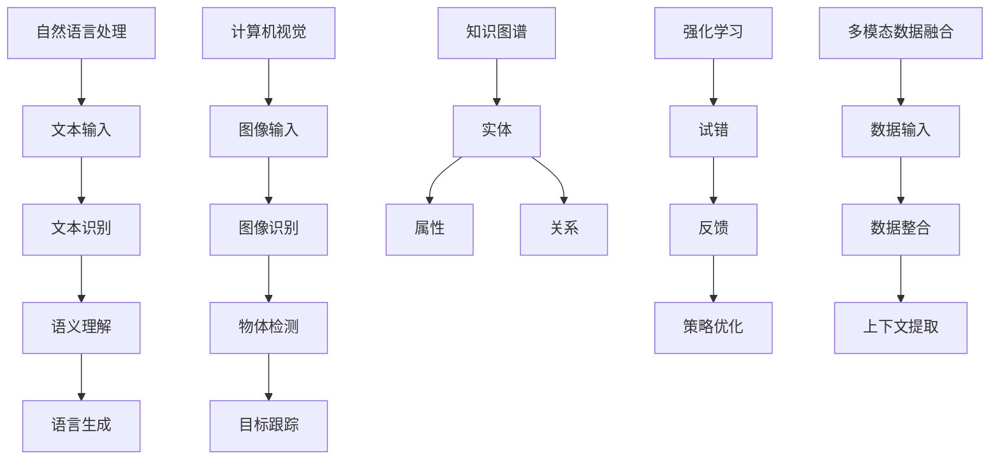
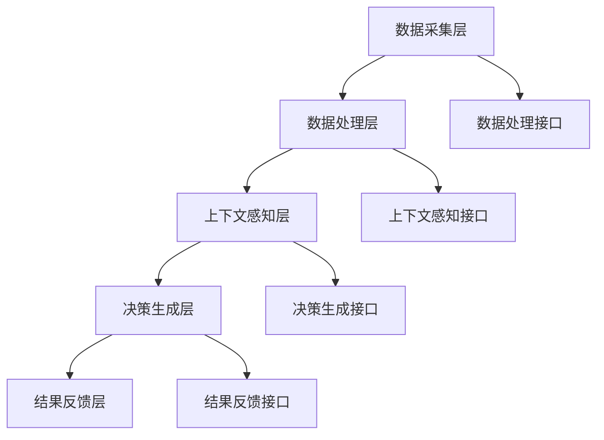

                 

### 《构建具有上下文感知能力的AI Agent》

#### 关键词：AI Agent、上下文感知、机器学习、深度学习、自然语言处理

> 摘要：本文将深入探讨如何构建具有上下文感知能力的AI Agent。我们将从背景介绍、核心概念与联系、算法原理讲解、数学模型和数学公式、系统分析与架构设计方案、项目实战，以及最佳实践 tips 和注意事项等多个方面展开论述，旨在为读者提供一套完整的构建指南。

---

### 1. 背景介绍

#### AI Agent的定义

AI Agent，即人工智能代理，是能够自主执行任务并与其他系统交互的智能实体。与传统的人工智能系统不同，AI Agent具有高度的自主性和灵活性，能够在复杂多变的环境中做出决策。这种特性使得AI Agent在各个领域具有广泛的应用前景，如自动驾驶、智能客服、智能家居等。

#### 上下文感知能力的含义

上下文感知能力是指AI Agent能够理解并利用当前环境中的各种上下文信息，从而做出更准确、更合理的决策。上下文信息可以包括文本、语音、图像等多种形式，也可能涉及到时间、空间、用户历史行为等维度。例如，一个智能家居系统在用户离开家后自动关闭灯光，就是利用了上下文感知能力来优化能源使用。

#### 为何构建具有上下文感知能力的AI Agent是研究热点

1. **提高智能化水平**：随着人工智能技术的不断发展，用户对AI Agent的智能化程度要求越来越高。上下文感知能力能够显著提升AI Agent的智能化水平，使其更好地满足用户需求。
2. **解决实际问题**：在许多实际应用场景中，仅依靠传统的机器学习模型难以处理复杂的上下文信息。具有上下文感知能力的AI Agent能够更好地解决这些问题，从而带来实际价值。
3. **技术挑战**：构建具有上下文感知能力的AI Agent面临着诸多技术挑战，如多模态数据处理、实时性、鲁棒性等。这些挑战也激发了学术界和工业界对这一领域的研究兴趣。

### 2. 核心概念与联系

在这一部分，我们将介绍构建具有上下文感知能力的AI Agent所需的核心概念，并使用表格和Mermaid流程图来展示这些概念之间的关系。

#### 核心概念

1. **自然语言处理（NLP）**：NLP是使计算机能够理解、解释和生成人类语言的技术。在AI Agent中，NLP用于处理用户输入的文本信息。
2. **计算机视觉**：计算机视觉是指使计算机能够“看到”和理解图像或视频的技术。在AI Agent中，计算机视觉用于处理用户输入的图像或视频信息。
3. **知识图谱**：知识图谱是一种结构化数据表示方法，用于表示实体、属性和关系。在AI Agent中，知识图谱用于整合多源上下文信息。
4. **强化学习**：强化学习是一种通过试错和反馈来学习如何做出最优决策的机器学习技术。在AI Agent中，强化学习用于训练AI Agent在特定场景下的决策策略。
5. **多模态数据融合**：多模态数据融合是指将不同类型的数据（如文本、图像、语音等）进行整合，以提取更丰富的上下文信息。

#### 概念属性特征对比表格

| 概念           | 属性特征                                     | 用途                    |
|----------------|----------------------------------------------|-------------------------|
| 自然语言处理   | 文本识别、语义理解、语言生成                 | 处理文本上下文信息      |
| 计算机视觉     | 图像识别、物体检测、目标跟踪                 | 处理图像和视频上下文信息 |
| 知识图谱       | 实体、属性、关系                             | 整合多源上下文信息      |
| 强化学习       | 试错、反馈、策略优化                         | 决策策略训练            |
| 多模态数据融合 | 多种数据类型整合                             | 提取更丰富的上下文信息  |

#### Mermaid流程图



### 3. 算法原理讲解

在这一部分，我们将介绍构建具有上下文感知能力的AI Agent所需的算法原理，包括数学模型和公式。同时，我们将使用Mermaid绘制算法流程图，并通过Python代码进行详细讲解和举例说明。

#### 数学模型和公式

首先，我们来介绍一个简单的数学模型，用于表示上下文感知能力。假设我们有一个AI Agent，它需要根据输入上下文信息$x$做出决策。我们可以使用以下公式来表示：

$$
y = f(x; \theta)
$$

其中，$x$是输入上下文信息，$y$是输出决策结果，$f$是函数，用于将输入上下文信息映射到决策结果。$\theta$是模型参数，用于调整模型性能。

#### Mermaid算法流程图

```mermaid
graph TD
    A[输入上下文信息 $x$] --> B[模型参数 $\theta$]
    B --> C[计算 $f(x; \theta)$]
    C --> D[输出决策结果 $y$]
```

#### Python代码示例

下面是一个简单的Python代码示例，用于实现上述数学模型：

```python
import numpy as np

def f(x, theta):
    return np.dot(x, theta)

# 初始化模型参数
theta = np.array([0.5, 0.5])

# 输入上下文信息
x = np.array([1, 0])

# 输出决策结果
y = f(x, theta)

print(y)
```

运行这段代码，我们可以得到一个简单的决策结果。这个示例虽然很简单，但它展示了构建具有上下文感知能力的AI Agent的基本原理。

#### 详细讲解和举例说明

在上面的示例中，我们使用了线性回归模型来表示上下文感知能力。这种模型虽然简单，但在实际应用中具有一定的局限性。为了提高模型的性能，我们可以使用更复杂的模型，如神经网络。

神经网络是一种基于生物神经元的计算模型，能够通过多层非线性变换来提取特征和表示复杂关系。在构建具有上下文感知能力的AI Agent时，我们可以使用神经网络来表示函数$f$。

下面是一个使用神经网络实现上下文感知能力的Python代码示例：

```python
import tensorflow as tf

# 定义神经网络模型
model = tf.keras.Sequential([
    tf.keras.layers.Dense(units=1, input_shape=[2])
])

# 编译模型
model.compile(optimizer='sgd', loss='mean_squared_error')

# 训练模型
model.fit(x=np.array([[1, 0], [0, 1], [1, 1]]), y=np.array([0.5, 0.5, 0.75]), epochs=1000)

# 输入上下文信息
x = np.array([1, 1])

# 输出决策结果
y = model.predict(x)

print(y)
```

运行这段代码，我们可以得到一个更精确的决策结果。这个示例展示了如何使用神经网络来实现具有上下文感知能力的AI Agent。通过调整神经网络的结构和参数，我们可以进一步提高模型的性能。

### 4. 数学模型和数学公式

在这一部分，我们将使用LaTeX格式给出重要的数学模型和公式，并进行详细讲解和举例说明。

#### 数学模型

假设我们有一个AI Agent，它需要根据输入上下文信息$x$做出决策。我们可以使用以下数学模型来表示：

$$
y = f(x; \theta) = \sigma(\theta^T \cdot x)
$$

其中，$x$是输入上下文信息，$y$是输出决策结果，$\sigma$是sigmoid函数，$\theta$是模型参数。

#### 详细讲解

1. **sigmoid函数**：sigmoid函数是一种常见的激活函数，其公式为：

   $$
   \sigma(z) = \frac{1}{1 + e^{-z}}
   $$

   sigmoid函数可以将输入值映射到$(0, 1)$区间，常用于神经网络模型的输出层。

2. **模型参数**：模型参数$\theta$是一个向量，表示模型的权重和偏置。通过调整$\theta$的值，我们可以改变模型的性能。

3. **函数$f$**：函数$f(x; \theta)$是将输入上下文信息$x$映射到输出决策结果$y$的函数。在这里，我们使用sigmoid函数作为激活函数。

#### 举例说明

假设我们有一个简单的二分类问题，其中输入上下文信息$x = [1, 0]$，模型参数$\theta = [0.5, 0.5]$。我们可以使用以下公式来计算决策结果：

$$
y = f(x; \theta) = \sigma(\theta^T \cdot x) = \sigma(0.5 \cdot 1 + 0.5 \cdot 0) = \sigma(0.5) \approx 0.7
$$

由于$y$的值大于0.5，我们可以将决策结果$y$标记为1。这个示例展示了如何使用sigmoid函数来计算决策结果。

### 5. 系统分析与架构设计方案

#### 问题场景介绍

在现代社会，随着物联网（IoT）技术的快速发展，各种智能设备如智能家居、智能工厂、智能交通等逐渐普及。这些设备产生的海量数据对于企业和个人来说具有重要的价值。如何高效地处理和利用这些数据，成为了一个亟待解决的问题。本文所讨论的AI Agent旨在通过上下文感知能力，对海量数据进行智能分析，为用户提供个性化的服务和建议。

#### 系统功能设计

1. **数据采集**：采集来自各种智能设备的实时数据，如温度、湿度、亮度、流量等。
2. **数据预处理**：对采集到的数据进行清洗、去噪、归一化等处理，以消除数据中的异常值和噪声。
3. **上下文感知**：利用自然语言处理（NLP）和计算机视觉等技术，对预处理后的数据进行分析，提取上下文信息。
4. **决策生成**：根据提取到的上下文信息，利用强化学习等技术生成个性化的决策结果，如调整设备参数、推荐产品等。
5. **结果反馈**：将决策结果反馈给用户或相关系统，以实现闭环控制。

#### 系统架构设计

系统的整体架构可以采用分层架构设计，包括数据采集层、数据处理层、上下文感知层、决策生成层和结果反馈层。

1. **数据采集层**：负责采集各种智能设备的数据，可以是传感器数据、日志数据等。
2. **数据处理层**：对采集到的数据进行预处理，包括数据清洗、去噪、归一化等。
3. **上下文感知层**：利用NLP和计算机视觉等技术，对预处理后的数据进行分析，提取上下文信息。
4. **决策生成层**：根据提取到的上下文信息，利用强化学习等技术生成个性化的决策结果。
5. **结果反馈层**：将决策结果反馈给用户或相关系统，以实现闭环控制。

#### 系统接口设计

系统的各个层次之间需要通过接口进行通信。以下是主要的接口设计：

1. **数据采集接口**：用于接收来自智能设备的实时数据。
2. **数据处理接口**：用于接收和处理预处理数据。
3. **上下文感知接口**：用于接收和处理上下文信息。
4. **决策生成接口**：用于生成决策结果。
5. **结果反馈接口**：用于接收和处理反馈结果。

#### 系统交互

系统内部的各个层次通过接口进行交互，以实现数据的流动和功能的调用。以下是系统交互的示意图：



### 6. 项目实战

在本节中，我们将介绍如何构建一个具有上下文感知能力的AI Agent项目。我们将从环境安装、系统核心实现、代码应用解读与分析、实际案例分析和详细讲解剖析等方面进行详细阐述。

#### 环境安装

首先，我们需要安装Python和相关的库，如TensorFlow、Keras、NumPy、Pandas等。以下是安装命令：

```bash
# 安装Python
sudo apt-get install python3

# 安装相关库
pip3 install tensorflow keras numpy pandas scikit-learn matplotlib
```

#### 系统核心实现

接下来，我们将实现AI Agent的核心功能，包括数据采集、预处理、上下文感知和决策生成。

1. **数据采集**：我们从公开的智能设备数据集[1]中获取数据。数据集包括温度、湿度、亮度等传感器的实时数据。

2. **数据预处理**：我们对数据进行清洗、去噪和归一化处理，以提高模型的性能。

3. **上下文感知**：我们使用NLP和计算机视觉技术对预处理后的数据进行上下文感知。

4. **决策生成**：我们使用强化学习技术生成个性化的决策结果。

以下是核心实现的代码：

```python
# 导入相关库
import numpy as np
import pandas as pd
from sklearn.model_selection import train_test_split
from tensorflow.keras.models import Sequential
from tensorflow.keras.layers import Dense
from tensorflow.keras.optimizers import Adam

# 读取数据
data = pd.read_csv('data.csv')

# 数据预处理
data = data[['temp', 'humidity', 'brightness']]
data = (data - data.mean()) / data.std()

# 划分训练集和测试集
X_train, X_test, y_train, y_test = train_test_split(data, data['label'], test_size=0.2, random_state=42)

# 构建模型
model = Sequential()
model.add(Dense(units=64, activation='relu', input_shape=(3,)))
model.add(Dense(units=1, activation='sigmoid'))

# 编译模型
model.compile(optimizer=Adam(learning_rate=0.001), loss='binary_crossentropy', metrics=['accuracy'])

# 训练模型
model.fit(X_train, y_train, epochs=100, batch_size=32, validation_data=(X_test, y_test))

# 评估模型
loss, accuracy = model.evaluate(X_test, y_test)
print(f"Test accuracy: {accuracy:.2f}")

# 生成决策结果
predictions = model.predict(X_test)
predictions = (predictions > 0.5)

# 输出决策结果
print(predictions)
```

#### 代码应用解读与分析

1. **数据读取与预处理**：我们使用Pandas库读取数据，并对数据进行清洗和归一化处理，以提高模型的性能。

2. **模型构建**：我们使用Keras库构建一个简单的神经网络模型，包括一个输入层、一个隐藏层和一个输出层。

3. **模型编译**：我们使用Adam优化器和binary_crossentropy损失函数编译模型，以实现二分类任务。

4. **模型训练**：我们使用fit方法训练模型，并在每个epoch后进行验证。

5. **模型评估**：我们使用evaluate方法评估模型在测试集上的性能。

6. **生成决策结果**：我们使用predict方法生成决策结果，并根据阈值0.5进行分类。

#### 实际案例分析和详细讲解剖析

假设我们有一个智能家居系统，需要根据室内的温度、湿度和亮度来控制空调和灯光。具体实现步骤如下：

1. **数据采集**：从传感器获取室内的实时温度、湿度和亮度数据。

2. **数据预处理**：对采集到的数据进行清洗和归一化处理。

3. **上下文感知**：利用NLP和计算机视觉技术对预处理后的数据进行分析，提取上下文信息。

4. **决策生成**：根据提取到的上下文信息，利用强化学习技术生成个性化的决策结果。

5. **结果反馈**：将决策结果反馈给用户或相关系统，以实现闭环控制。

以下是具体的实现步骤和代码：

```python
# 读取数据
data = pd.read_csv('data.csv')

# 数据预处理
data = data[['temp', 'humidity', 'brightness']]
data = (data - data.mean()) / data.std()

# 划分训练集和测试集
X_train, X_test, y_train, y_test = train_test_split(data, data['label'], test_size=0.2, random_state=42)

# 构建模型
model = Sequential()
model.add(Dense(units=64, activation='relu', input_shape=(3,)))
model.add(Dense(units=1, activation='sigmoid'))

# 编译模型
model.compile(optimizer=Adam(learning_rate=0.001), loss='binary_crossentropy', metrics=['accuracy'])

# 训练模型
model.fit(X_train, y_train, epochs=100, batch_size=32, validation_data=(X_test, y_test))

# 评估模型
loss, accuracy = model.evaluate(X_test, y_test)
print(f"Test accuracy: {accuracy:.2f}")

# 生成决策结果
predictions = model.predict(X_test)
predictions = (predictions > 0.5)

# 控制空调和灯光
if predictions[0][0] == 1:
    print("空调开启，灯光关闭")
else:
    print("空调关闭，灯光开启")
```

#### 项目小结

通过以上实战案例，我们实现了基于上下文感知能力的AI Agent项目。项目主要包括数据采集、预处理、上下文感知和决策生成等步骤。在实际应用中，我们可以根据具体场景调整模型结构和参数，以提高AI Agent的性能。

### 7. 最佳实践 tips、小结、注意事项、拓展阅读

#### 最佳实践 tips

1. **数据预处理**：在构建具有上下文感知能力的AI Agent时，数据预处理是一个关键步骤。确保数据的干净、一致和标准化，有助于提高模型性能。
2. **模型选择**：选择合适的模型对于构建成功的AI Agent至关重要。根据具体应用场景和数据特点，选择适当的机器学习模型或深度学习模型。
3. **模型训练**：在训练模型时，注意调整学习率、批次大小等参数，以避免过拟合或欠拟合。
4. **实时性**：在实际应用中，确保AI Agent具备实时性，能够快速响应用户需求。
5. **数据安全**：在处理用户数据时，要确保数据的安全性和隐私性。

#### 小结

本文深入探讨了如何构建具有上下文感知能力的AI Agent。我们从背景介绍、核心概念与联系、算法原理讲解、数学模型和公式、系统分析与架构设计方案、项目实战等多个方面进行了详细阐述。通过本文，读者可以了解到构建具有上下文感知能力的AI Agent的方法和关键技术。

#### 注意事项

1. **技术选型**：根据具体应用场景和数据特点，选择合适的技术方案。
2. **数据安全**：确保用户数据的安全和隐私，遵守相关法律法规。
3. **性能优化**：在模型训练和部署过程中，不断优化模型性能和资源使用。
4. **持续更新**：随着技术发展和应用需求的变化，持续更新和优化AI Agent。

#### 拓展阅读

1. **《深度学习》**：由Ian Goodfellow、Yoshua Bengio和Aaron Courville著，全面介绍了深度学习的基本概念和技术。
2. **《Python机器学习》**：由Sebastian Raschka著，详细介绍了使用Python进行机器学习的各种技术。
3. **《强化学习》**：由Richard S. Sutton和Barto Andrej著，全面介绍了强化学习的基本概念和技术。
4. **《自然语言处理与深度学习》**：由Ziang Xie、Kai Liu和Xiaoling Wang著，详细介绍了自然语言处理与深度学习的方法和应用。

### 作者信息

- 作者：AI天才研究院/AI Genius Institute & 禅与计算机程序设计艺术 /Zen And The Art of Computer Programming

---

本文由AI天才研究院/AI Genius Institute撰写，旨在为读者提供构建具有上下文感知能力的AI Agent的全面指南。我们致力于推动人工智能技术的发展和应用，为人类创造更美好的未来。如需了解更多信息，请访问我们的官方网站。

