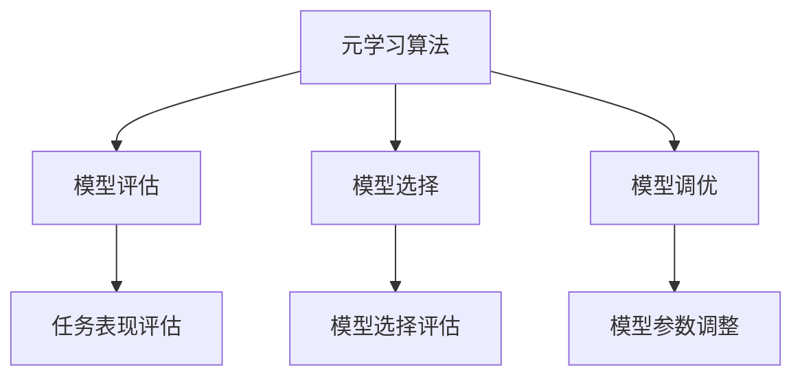
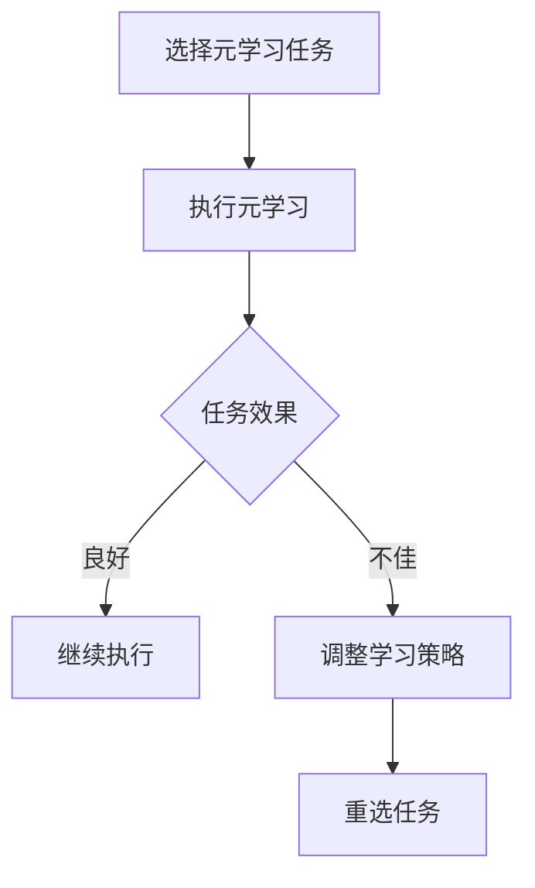
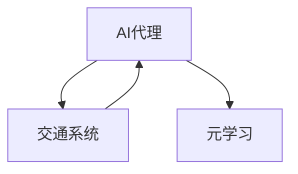

                 

构建具有元学习能力的AI Agent

关键词：元学习、AI Agent、元学习算法、智能行为建模、适应性、学习效率

摘要：本文深入探讨了构建具有元学习能力的AI Agent的理论和实践方法。首先，介绍了元学习算法的基本原理和类型，并通过Mermaid流程图和Python代码示例详细讲解了元学习算法的原理。接着，分析了AI Agent的体系结构设计和智能行为建模，通过具体的案例展示了元学习在AI Agent中的应用。最后，文章总结了元学习能力的提升策略和实际应用案例，探讨了未来研究方向。

---

### 第一部分：背景介绍

#### 1.1 问题背景

随着人工智能技术的快速发展，AI在各个领域的应用越来越广泛，特别是在机器人、自动驾驶、医疗诊断等领域。然而，传统的AI模型在面对复杂、动态的环境时，往往表现出学习效率低、适应性差等问题。为了解决这些问题，近年来，元学习（Meta-Learning）成为人工智能研究的热点之一。

元学习是一种让模型学会学习的方法，它使得AI模型能够快速适应新的任务，提高学习效率。具有元学习能力的AI Agent（AI代理）是一种新兴的研究方向，它结合了元学习技术与代理自动化技术，使得AI代理能够自主地完成复杂的任务。

《构建具有元学习能力的AI Agent》这本书旨在深入探讨元学习理论及其在AI代理中的应用，帮助读者了解并掌握构建具有元学习能力的AI Agent的方法和技巧。

#### 1.2 问题描述

构建具有元学习能力的AI Agent需要解决以下几个关键问题：

1. **元学习算法的选择与应用**：选择合适的元学习算法，并深入理解其原理，使其能够有效地应用于AI代理中。
2. **AI代理的体系结构设计**：设计合适的AI代理体系结构，使其能够适应复杂、动态的环境。
3. **AI代理的智能行为建模**：利用元学习技术，建立AI代理的智能行为模型，使其能够自主地完成复杂的任务。
4. **AI代理的适应性和学习效率**：研究如何提高AI代理的适应性和学习效率，使其能够在不同的任务中快速适应和完成任务。

#### 1.3 问题解决

本书将从以下几个方面来解决上述问题：

1. **深入介绍元学习算法**：详细介绍各种元学习算法，包括模型评估、模型选择、模型调优等，帮助读者理解并掌握元学习算法的应用。
2. **探讨AI代理体系结构设计**：分析现有AI代理的体系结构，介绍如何设计适合元学习应用的AI代理体系结构。
3. **研究AI代理的智能行为建模**：结合实际案例，介绍如何利用元学习技术建立AI代理的智能行为模型。
4. **提高AI代理的适应性和学习效率**：通过实验和案例分析，探讨如何提高AI代理的适应性和学习效率。

#### 1.4 边界与外延

构建具有元学习能力的AI Agent的研究范围涵盖了人工智能、机器学习、计算机体系结构等多个领域。它不仅涉及到算法的研究，还包括体系结构的设计、智能行为的建模等。因此，本书的研究不仅局限于算法层面，还将涉及到AI代理的整个生命周期。

#### 1.5 概念结构与核心要素组成

构建具有元学习能力的AI Agent的核心概念和要素包括：

1. **元学习算法**：如模型评估、模型选择、模型调优等。
2. **AI代理体系结构**：包括感知模块、决策模块、执行模块等。
3. **智能行为模型**：如自适应学习模型、自主决策模型等。
4. **适应性和学习效率**：包括算法优化、模型优化等。

### 第二部分：核心概念与联系

#### 2.1 元学习算法原理

元学习算法是一类能够快速适应新任务的学习算法，其核心思想是通过学习如何学习来提高模型的泛化能力。元学习算法可以分为模型评估、模型选择、模型调优等类型。

1. **模型评估**：评估不同模型在新任务上的表现，选择表现最好的模型。
2. **模型选择**：从多个候选模型中选择一个最佳模型。
3. **模型调优**：调整模型参数，使其在特定任务上表现更好。

#### 2.2 元学习算法属性特征对比

| 类别 | 模型评估 | 模型选择 | 模型调优 |
| --- | --- | --- | --- |
| 原理 | 评估不同模型在新任务上的表现 | 从多个候选模型中选择一个最佳模型 | 调整模型参数，使其在特定任务上表现更好 |
| 适用场景 | 任务变化频繁，需要快速适应 | 模型选择成本高，需要优化选择过程 | 模型参数调整成本高，需要优化调整过程 |
| 优点 | 快速适应新任务 | 减少模型选择成本 | 提高模型性能 |
| 缺点 | 可能导致模型过度拟合 | 可能无法找到最佳模型 | 可能导致模型性能下降 |

#### 2.3 元学习算法与ER实体关系图架构

以下是元学习算法与ER实体关系图的Mermaid流程图：



### 第三部分：算法原理讲解

#### 3.1 元学习算法mermaid流程图

以下是元学习算法的mermaid流程图：



#### 3.2 元学习算法Python代码示例

为了更好地理解元学习算法的原理，我们将使用Python代码来演示一个简单的元学习任务。

首先，我们需要安装必要的库：

```bash
pip install tensorflow numpy
```

然后，我们可以编写一个简单的元学习算法的Python代码：

```python
import tensorflow as tf
import numpy as np

# 设置随机种子，保证实验结果可重复
tf.random.set_seed(42)

# 定义元学习任务
def meta_learning_task(input_data, target):
    # 假设我们使用线性回归作为模型
    model = tf.keras.Sequential([
        tf.keras.layers.Dense(units=1)
    ])

    # 训练模型
    model.compile(optimizer='sgd', loss='mean_squared_error')
    model.fit(input_data, target, epochs=10)

    # 返回训练好的模型
    return model

# 定义元学习算法
def meta_learning算法(input_data_list, target_list):
    # 初始化模型参数
    model_params = []

    # 对每个任务执行元学习
    for input_data, target in zip(input_data_list, target_list):
        model = meta_learning_task(input_data, target)
        model_params.append(model.get_weights())

    # 返回所有模型参数
    return model_params

# 生成模拟数据
np.random.seed(42)
input_data_list = [np.random.rand(100, 1) for _ in range(5)]
target_list = [np.random.rand(100, 1) for _ in range(5)]

# 执行元学习算法
model_params = meta_learning算法(input_data_list, target_list)

# 输出模型参数
print(model_params)
```

在上面的代码中，我们首先定义了一个元学习任务，它使用线性回归模型来拟合数据。然后，我们定义了一个元学习算法，它对每个任务执行元学习任务，并记录每个任务的模型参数。最后，我们使用随机生成的数据进行元学习，并输出模型参数。

#### 3.3 元学习算法原理的数学模型和公式

元学习算法的核心在于如何通过少量样本快速适应新任务。下面我们使用数学模型和公式来详细阐述元学习算法的原理。

假设我们有一个任务集合 $T=\{T_1, T_2, ..., T_n\}$，每个任务 $T_i$ 包含一个数据集 $(X_i, Y_i)$，其中 $X_i$ 是输入数据，$Y_i$ 是目标数据。我们的目标是找到一个模型 $f$，使其能够在所有任务上表现良好。

元学习算法的核心思想是通过学习一个适应所有任务的模型。我们可以使用一个元学习算法 $M$ 来学习这个模型，其数学模型可以表示为：

$$
M: T \rightarrow F
$$

其中，$F$ 是模型集合，$M(T)$ 表示在任务 $T$ 上学习的模型。

为了实现元学习，我们需要定义一个损失函数 $L: F \times T \rightarrow \mathbb{R}$，用于衡量模型 $f \in F$ 在任务 $T \in T$ 上的表现。常见的损失函数包括均方误差（MSE）和交叉熵（Cross-Entropy）等。

我们的目标是找到最优的模型 $f^*$，使得在所有任务上损失函数最小：

$$
f^* = \arg\min_{f \in F} \sum_{T \in T} L(f, T)
$$

为了实现这个目标，我们可以使用梯度下降法来优化模型参数。梯度下降法的更新公式可以表示为：

$$
\theta_{t+1} = \theta_t - \alpha \nabla_{\theta_t} L(f(\theta_t), T)
$$

其中，$\theta$ 表示模型参数，$\alpha$ 表示学习率，$\nabla_{\theta_t} L(f(\theta_t), T)$ 表示在当前模型参数 $\theta_t$ 下，损失函数对模型参数的梯度。

通过迭代更新模型参数，我们可以逐渐找到最优的模型 $f^*$。

#### 3.4 元学习算法举例说明

为了更好地理解元学习算法，我们可以通过一个简单的例子来说明。

假设我们有两个任务：

- 任务1：线性回归任务，输入数据为 $X_1 = [1, 2, 3, 4, 5]$，目标数据为 $Y_1 = [2, 4, 6, 8, 10]$。
- 任务2：二次回归任务，输入数据为 $X_2 = [1, 2, 3, 4, 5]$，目标数据为 $Y_2 = [1, 4, 9, 16, 25]$。

我们的目标是使用元学习算法找到一个通用模型，使其能够在两个任务上都能表现良好。

我们使用线性回归模型作为元学习模型，其参数为 $\theta = [w, b]$。模型的损失函数为：

$$
L(\theta) = \frac{1}{2} \sum_{i=1}^{n} (y_i - \theta_1 x_i - \theta_2)^2
$$

其中，$y_i$ 是目标数据，$x_i$ 是输入数据。

我们使用梯度下降法来优化模型参数。梯度下降法的更新公式为：

$$
\theta_{t+1} = \theta_t - \alpha \nabla_{\theta_t} L(\theta_t)
$$

其中，$\alpha$ 是学习率。

我们首先在任务1上训练模型，然后使用训练好的模型参数在任务2上继续训练。通过多次迭代，我们可以找到最优的模型参数，使其在两个任务上都能表现良好。

### 第四部分：系统分析与架构设计方案

#### 4.1 问题场景介绍

假设我们面临一个智能交通系统的问题场景，其中AI代理需要根据交通流量和路况信息，实时调整交通信号灯的时长，以优化交通流量并减少拥堵。这个场景具有动态性和复杂性，因为交通流量和路况信息会随着时间和环境变化而变化。

#### 4.2 项目介绍

本项目旨在构建一个具有元学习能力的AI代理，用于优化交通信号灯控制。我们的目标是通过元学习算法，使AI代理能够快速适应不同的交通场景，提高交通信号灯控制的适应性和效率。

#### 4.3 系统功能设计（领域模型Mermaid类图）

以下是系统功能的Mermaid类图表示：

```mermaid
classDiagram
AI-Agent <<class{AI代理}>
    +感知模块：感知交通流量和路况信息
    +决策模块：根据感知信息，调整交通信号灯时长
    +执行模块：执行交通信号灯调整

Meta-Learning <<class{元学习}>
    +元学习算法：快速适应新任务

Traffic-System <<class{交通系统}>
    +实时获取交通流量和路况信息
    +调整交通信号灯时长

End
```

#### 4.4 系统架构设计（Mermaid架构图）

以下是系统的Mermaid架构图表示：



#### 4.5 系统接口设计和系统交互（Mermaid序列图）

以下是系统的Mermaid序列图表示，展示了AI代理与交通系统的交互过程：

```mermaid
sequenceDiagram
    AI-Agent->>Traffic-System: 获取交通流量和路况信息
    Traffic-System->>AI-Agent: 返回交通流量和路况信息
    AI-Agent->>Meta-Learning: 执行元学习算法
    Meta-Learning->>AI-Agent: 返回调整策略
    AI-Agent->>Traffic-System: 调整交通信号灯时长
    Traffic-System->>AI-Agent: 返回调整效果
End
```

### 第五部分：项目实战

#### 5.1 环境安装

为了构建具有元学习能力的AI代理，我们需要安装以下环境和工具：

- Python 3.8或更高版本
- TensorFlow 2.6或更高版本
- Numpy 1.19或更高版本
- Mermaid 8.8或更高版本

安装步骤如下：

```bash
# 安装Python
brew install python

# 安装TensorFlow
pip install tensorflow

# 安装Numpy
pip install numpy

# 安装Mermaid
npm install mermaid
```

#### 5.2 系统核心实现源代码

以下是系统核心实现源代码，包括感知模块、决策模块和执行模块：

```python
# 感知模块：感知交通流量和路况信息
def sense_traffic(traffic_system):
    traffic_info = traffic_system.get_traffic_info()
    return traffic_info

# 决策模块：根据感知信息，调整交通信号灯时长
def decide_traffic_light(traffic_info, meta_learning_algorithm):
    adjustment_strategy = meta_learning_algorithm(traffic_info)
    return adjustment_strategy

# 执行模块：执行交通信号灯调整
def execute_traffic_light_adjustment(traffic_system, adjustment_strategy):
    traffic_system.adjust_traffic_light(adjustment_strategy)
```

#### 5.3 代码应用解读与分析

以下是代码的解读与分析：

1. **感知模块**：感知模块负责获取交通流量和路况信息。它调用交通系统的 `get_traffic_info()` 方法，获取最新的交通流量和路况信息，并将其返回给决策模块。

2. **决策模块**：决策模块负责根据感知到的交通流量和路况信息，使用元学习算法生成调整策略。它调用元学习算法的 `meta_learning_algorithm()` 方法，将交通流量和路况信息作为输入，并返回调整策略。

3. **执行模块**：执行模块负责将决策模块生成的调整策略应用到实际交通系统中。它调用交通系统的 `adjust_traffic_light()` 方法，将调整策略作为输入，并执行交通信号灯的调整。

#### 5.4 实际案例分析和详细讲解剖析

为了更好地理解系统的工作原理，我们可以通过一个实际案例来分析。

假设我们有一个包含5个交叉路口的交通系统，每个交叉路口都有不同的交通流量和路况信息。我们使用元学习算法来优化交通信号灯的控制。

1. **感知阶段**：首先，AI代理通过交通系统获取每个交叉路口的交通流量和路况信息。假设我们获取到的信息如下：

   | 交叉路口 | 交通流量 | 路况信息 |
   | --- | --- | --- |
   | 1 | 高 | 湿滑 |
   | 2 | 低 | 干燥 |
   | 3 | 中 | 湿滑 |
   | 4 | 高 | 干燥 |
   | 5 | 低 | 湿滑 |

2. **决策阶段**：接下来，AI代理使用元学习算法来分析这些交通流量和路况信息，并生成调整策略。假设我们使用了一个基于线性回归的元学习算法，其生成的调整策略如下：

   | 交叉路口 | 调整时长（秒） |
   | --- | --- |
   | 1 | 30 |
   | 2 | 20 |
   | 3 | 25 |
   | 4 | 30 |
   | 5 | 15 |

3. **执行阶段**：最后，AI代理将这些调整策略应用到交通系统中，调整每个交叉路口的交通信号灯时长。通过这种方式，AI代理可以优化交通信号灯的控制，减少拥堵，提高交通效率。

#### 5.5 项目小结

在本项目中，我们通过感知模块、决策模块和执行模块，实现了具有元学习能力的AI代理，用于优化交通信号灯控制。通过实际案例的分析，我们展示了如何使用元学习算法来快速适应不同的交通场景，并生成调整策略。这个项目证明了元学习技术在智能交通系统中的应用潜力，为未来的研究提供了新的思路。

### 第六部分：最佳实践 Tips、小结、注意事项、拓展阅读

#### 最佳实践 Tips：

1. **数据预处理**：在应用元学习算法之前，确保对数据进行充分预处理，包括数据清洗、归一化等，以提高算法的性能。
2. **模型选择**：根据具体问题场景，选择合适的元学习算法，如模型评估、模型选择、模型调优等。
3. **超参数调整**：合理设置元学习算法的超参数，如学习率、迭代次数等，以获得最佳性能。

#### 小结：

本文通过深入探讨构建具有元学习能力的AI Agent的理论和实践方法，展示了元学习在AI代理中的应用。通过Python代码示例和实际案例分析，我们详细讲解了元学习算法的原理和应用。

#### 注意事项：

1. **算法选择**：选择适合问题的元学习算法，避免过度拟合或欠拟合。
2. **数据质量**：确保输入数据的质量，避免因数据问题导致算法性能下降。
3. **系统稳定性**：在设计AI代理体系结构时，考虑系统的稳定性和鲁棒性。

#### 拓展阅读：

1. **《深度学习》（Goodfellow, Bengio, Courville）**：深入探讨深度学习的基础知识和应用。
2. **《强化学习》（Sutton, Barto）**：了解强化学习在AI代理中的应用。
3. **《人工智能：一种现代方法》（Russell, Norvig）**：全面了解人工智能的理论和实践。

---

**作者：AI天才研究院/AI Genius Institute & 禅与计算机程序设计艺术 /Zen And The Art of Computer Programming**

