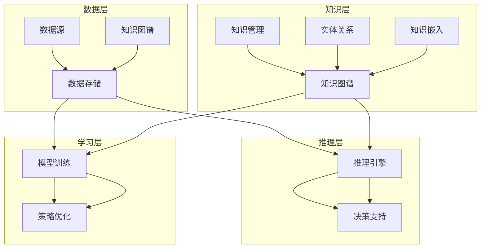
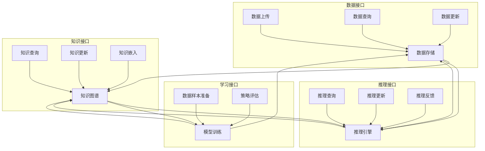

                 

### 构建具有动态知识更新能力的AI Agent

---

#### 关键词：
- AI Agent
- 动态知识更新
- 知识图谱
- 强化学习
- 神经网络

#### 摘要：
本文旨在探讨如何构建具有动态知识更新能力的AI Agent。我们将深入分析AI Agent的定义、动态知识更新的重要性以及实现该能力的核心技术和方法。文章将分为以下几个部分：首先，我们将介绍AI Agent和动态知识的背景及基本概念；接着，讨论实现动态知识更新所需的关键技术和算法；然后，详细阐述动态AI Agent的系统架构和实现策略；最后，通过实际项目案例展示如何应用这些技术和方法，并对未来研究方向进行展望。

---

### 基本概念

#### AI Agent的定义

AI Agent，即人工智能代理，是指具备自主决策和行动能力的智能体，能够在复杂环境中进行推理、学习、规划和执行任务。AI Agent的核心特性包括：

- **自主性**：Agent能够独立地执行任务，不需要人工干预。
- **适应性**：Agent能够根据环境变化进行调整，以优化其行为。
- **交互性**：Agent能够与其他Agent或环境进行交互。

#### 动态知识的概念

动态知识是指能够根据环境变化不断更新和优化的知识。与静态知识不同，动态知识具有以下特点：

- **时效性**：知识随时间推移可能发生变化，需要实时更新。
- **可塑性**：知识可以通过学习和推理不断改进和优化。
- **情境依赖性**：知识的有效性和适用性依赖于具体情境。

#### 动态知识的重要性

动态知识对于AI Agent的智能性至关重要，其重要性体现在以下几个方面：

- **环境适应能力**：动态知识使AI Agent能够更好地适应复杂多变的环境。
- **决策准确性**：通过动态更新知识，AI Agent可以做出更加精准的决策。
- **持续学习性**：动态知识更新能力是AI Agent实现持续学习和自我优化的基础。

### 动态知识更新的实现方法

#### 知识图谱

知识图谱是一种结构化的语义网络，用于表示实体及其相互关系。通过构建知识图谱，AI Agent可以更好地理解和利用动态知识。

- **实体关系**：知识图谱通过实体和关系来组织知识，便于查询和推理。
- **更新机制**：知识图谱可以通过实时数据流和周期性更新来保持知识的动态性。

#### 强化学习

强化学习是一种通过与环境交互来学习最优策略的机器学习方法。在动态知识更新中，强化学习可以用于训练AI Agent根据环境反馈调整其知识库。

- **奖励机制**：通过奖励机制，强化学习可以鼓励AI Agent学习有利于其目标的知识。
- **策略调整**：AI Agent可以根据环境反馈调整其知识库，以优化其决策。

#### 神经网络

神经网络是一种模拟人脑神经元结构的计算模型，用于处理和传递信息。在动态知识更新中，神经网络可以用于构建AI Agent的知识表示和推理机制。

- **知识表示**：神经网络可以用于将动态知识转换为结构化的数据格式，便于处理和分析。
- **推理机制**：神经网络可以用于实现基于知识的推理和决策。

### 动态知识更新算法

#### 监督学习

监督学习是一种通过已标记的数据进行学习的方法。在动态知识更新中，监督学习可以用于训练AI Agent从新数据中提取和更新知识。

- **特征提取**：通过特征提取，监督学习可以将新数据转换为结构化的知识表示。
- **模型训练**：通过模型训练，监督学习可以使AI Agent学会根据新数据更新其知识库。

#### 无监督学习

无监督学习是一种通过未标记的数据进行学习的方法。在动态知识更新中，无监督学习可以用于发现新数据中的隐含结构和关系。

- **聚类分析**：通过聚类分析，无监督学习可以用于发现新数据中的模式，为AI Agent提供新的知识来源。
- **降维技术**：通过降维技术，无监督学习可以用于简化新数据的表示，便于AI Agent处理。

#### 聚类分析

聚类分析是一种将数据分为多个类别的技术，用于发现数据中的模式。在动态知识更新中，聚类分析可以用于对新数据进行分类和标签化。

- **数据分类**：通过数据分类，聚类分析可以将新数据划分为不同的类别，为AI Agent提供分类知识。
- **知识整合**：通过知识整合，聚类分析可以将新数据中的分类知识整合到现有知识库中。

### 总结

本文简要介绍了构建具有动态知识更新能力的AI Agent的基本概念、重要性及实现方法。动态知识更新是提高AI Agent智能性和适应性的关键，其实现方法包括知识图谱、强化学习、神经网络、监督学习、无监督学习和聚类分析等。在接下来的章节中，我们将深入探讨这些技术和方法的具体实现和应用。

---

### 实现动态知识更新能力的核心技术和方法

在了解了AI Agent和动态知识的基本概念后，我们将进一步探讨实现动态知识更新能力的核心技术和方法。本部分将重点介绍知识图谱、强化学习、神经网络以及各种机器学习算法在动态知识更新中的应用。

#### 知识图谱

知识图谱是一种用于表示实体及其相互关系的图形结构，它能够有效地组织和管理大规模的结构化数据。通过知识图谱，AI Agent可以更好地理解和利用动态知识。

**实体关系**

在知识图谱中，实体和关系是两个核心概念。实体代表知识图谱中的对象，如人、地点、事物等；关系则描述实体之间的关联，如“属于”、“位于”、“属于某个类别”等。知识图谱通过实体和关系的组合来构建语义网络，为AI Agent提供了丰富的知识资源。

**更新机制**

知识图谱的更新机制是其动态性保证的关键。常见的更新方法包括：

1. **增量更新**：仅对新增或修改的实体和关系进行更新，减少计算量。
2. **周期性更新**：定期对知识图谱进行全量更新，确保知识的时效性和准确性。
3. **实时数据流更新**：通过实时数据流处理技术，对知识图谱进行实时更新，以应对环境的变化。

**示例**

假设我们构建了一个用于旅游推荐的知识图谱，其中实体包括景点、酒店、用户等，关系包括“位于”、“推荐给”、“评价”等。通过实时数据流更新，我们可以将用户的新评价、新旅行记录等数据及时整合到知识图谱中，为用户提供更准确的旅游推荐。

#### 强化学习

强化学习是一种通过与环境交互来学习最优策略的机器学习方法。在动态知识更新中，强化学习可以用于训练AI Agent根据环境反馈调整其知识库。

**奖励机制**

强化学习的核心是奖励机制，它用于指导AI Agent的行为。具体而言，奖励机制可以用于：

1. **鼓励正确行为**：当AI Agent做出正确决策时，给予正向奖励，以增强其行为的积极性。
2. **惩罚错误行为**：当AI Agent做出错误决策时，给予负向奖励，以抑制其行为的消极性。
3. **调整策略**：根据奖励机制，AI Agent可以不断调整其知识库，以优化其决策效果。

**策略调整**

在强化学习中，策略调整是关键步骤。AI Agent通过不断尝试和反馈，逐步调整其知识库，以实现最优策略。具体策略调整方法包括：

1. **基于规则的策略调整**：通过预设的规则，AI Agent根据环境状态和奖励反馈调整其知识库。
2. **基于模型的策略调整**：通过构建环境模型，AI Agent可以根据模型预测和奖励反馈进行策略调整。
3. **基于增强学习的策略调整**：通过增强学习算法，AI Agent可以不断优化其策略，以实现最优决策。

**示例**

假设我们构建了一个自动驾驶AI Agent，其任务是在复杂的交通环境中安全行驶。通过强化学习，AI Agent可以根据驾驶经验不断调整其知识库，如交通规则、道路信息等，以实现安全、高效的驾驶。

#### 神经网络

神经网络是一种模拟人脑神经元结构的计算模型，用于处理和传递信息。在动态知识更新中，神经网络可以用于构建AI Agent的知识表示和推理机制。

**知识表示**

神经网络可以将动态知识转换为结构化的数据格式，便于处理和分析。具体方法包括：

1. **特征提取**：通过神经网络，我们可以从原始数据中提取出有用的特征，为知识表示提供基础。
2. **嵌入表示**：通过神经网络，我们可以将实体和关系映射到低维空间中，实现高效的存储和检索。

**推理机制**

神经网络可以用于实现基于知识的推理和决策。具体方法包括：

1. **前向传播**：通过神经网络的前向传播，我们可以计算实体和关系之间的关联性，为推理提供依据。
2. **反向传播**：通过神经网络的反向传播，我们可以更新神经网络中的权重和偏置，以优化推理结果。
3. **注意力机制**：通过注意力机制，神经网络可以关注关键信息，提高推理的准确性和效率。

**示例**

假设我们构建了一个用于医疗诊断的神经网络模型，其任务是根据患者的症状和检查结果进行疾病诊断。通过神经网络，我们可以将症状和检查结果转换为结构化的数据格式，然后进行推理和决策，以提高诊断的准确性和效率。

#### 机器学习算法

除了知识图谱、强化学习和神经网络，各种机器学习算法也在动态知识更新中发挥着重要作用。

**监督学习**

监督学习是一种通过已标记的数据进行学习的方法。在动态知识更新中，监督学习可以用于训练AI Agent从新数据中提取和更新知识。

1. **回归算法**：用于预测连续值，如预测天气温度等。
2. **分类算法**：用于将数据分为不同的类别，如分类电子邮件是否为垃圾邮件等。

**无监督学习**

无监督学习是一种通过未标记的数据进行学习的方法。在动态知识更新中，无监督学习可以用于发现新数据中的隐含结构和关系。

1. **聚类方法**：用于将数据分为不同的簇，如市场细分等。
2. **降维技术**：用于简化数据的表示，如主成分分析（PCA）等。

**强化学习**

强化学习是一种通过与环境交互来学习最优策略的机器学习方法。在动态知识更新中，强化学习可以用于训练AI Agent根据环境反馈调整其知识库。

1. **Q-Learning**：一种基于值函数的强化学习算法，用于优化策略。
2. **Deep Reinforcement Learning**：结合深度学习和强化学习的算法，用于处理复杂环境。

**集成学习**

集成学习是一种通过结合多个模型来提高预测准确性的方法。在动态知识更新中，集成学习可以用于提高AI Agent的知识更新效果。

1. **Bagging**：通过随机森林等算法，结合多个决策树来提高预测准确性。
2. **Boosting**：通过AdaBoost等算法，结合多个弱学习器来提高预测准确性。

**示例**

假设我们构建了一个智能推荐系统，其任务是根据用户的兴趣和行为推荐相关的商品。通过监督学习，我们可以从用户的历史行为数据中提取出有用的特征，然后进行分类和预测。通过无监督学习，我们可以发现用户群体中的潜在兴趣点，从而优化推荐策略。通过强化学习，我们可以根据用户的反馈调整推荐策略，以提高推荐效果。

### 总结

通过知识图谱、强化学习、神经网络和各种机器学习算法，我们可以构建具有动态知识更新能力的AI Agent。这些技术和方法为AI Agent提供了丰富的知识资源和高效的推理能力，使其能够更好地适应复杂多变的环境。在下一部分，我们将进一步探讨如何设计和实现动态知识更新系统，以实现AI Agent的持续学习和自我优化。

---

### 动态知识更新系统的设计与实现

在了解了动态知识更新系统的核心技术和方法后，接下来我们将讨论如何设计和实现一个具有动态知识更新能力的AI Agent系统。本部分将详细阐述系统的架构设计、接口设计以及实现策略，并通过具体的案例来说明动态知识更新在AI Agent中的应用。

#### 系统架构设计

一个具有动态知识更新能力的AI Agent系统通常包含以下几个核心组件：

1. **数据层**：用于存储和管理原始数据和更新后的知识库。
2. **知识层**：用于组织和管理动态知识，包括知识图谱、实体关系、知识嵌入等。
3. **推理层**：用于基于动态知识进行推理和决策。
4. **学习层**：用于训练和优化AI Agent的模型和策略。

**系统架构图**



#### 系统接口设计

系统接口设计是确保各个组件之间能够高效、可靠地通信和协作的关键。以下是一个简化的系统接口设计：

1. **数据接口**：用于数据层的读写操作，包括数据上传、数据查询、数据更新等。
2. **知识接口**：用于知识层的知识操作，包括知识查询、知识更新、知识嵌入等。
3. **推理接口**：用于推理层的推理操作，包括推理查询、推理更新、推理结果反馈等。
4. **学习接口**：用于学习层的模型训练和策略优化，包括数据样本准备、模型训练、策略评估等。

**系统接口设计图**



#### 动态知识更新实现策略

1. **数据采集与处理**：首先，从各种数据源（如数据库、传感器、API接口等）采集数据，并进行预处理，如数据清洗、数据格式转换等。
2. **知识构建与更新**：利用知识图谱等技术，将预处理后的数据构建为动态知识库。根据实际需求，定期或实时更新知识库，以保持知识的时效性和准确性。
3. **推理与决策**：基于动态知识库，使用推理引擎对特定问题进行推理和决策。推理结果可以根据实际需求进行反馈和调整。
4. **模型训练与优化**：利用机器学习算法，对AI Agent的模型进行训练和优化。通过策略评估，不断调整和优化AI Agent的行为。

#### 实际案例

**案例背景**：假设我们构建了一个智能客服AI Agent，其任务是基于用户的问题和聊天记录，提供相应的解答和建议。

1. **数据采集与处理**：从客服聊天记录中提取用户问题、回答、关键词等信息，并进行预处理。
2. **知识构建与更新**：利用知识图谱，将预处理后的数据构建为知识库。根据用户的新问题，实时更新知识库，以提供更准确的解答。
3. **推理与决策**：基于知识库，使用推理引擎对用户问题进行分类和匹配。根据匹配结果，提供相应的解答和建议。
4. **模型训练与优化**：利用机器学习算法，对AI Agent的模型进行训练和优化。通过用户反馈，不断调整和优化AI Agent的行为。

通过以上步骤，我们可以构建一个具有动态知识更新能力的智能客服AI Agent，以提高客服质量和用户满意度。

### 总结

通过系统架构设计、接口设计以及实现策略的详细阐述，我们了解了如何构建一个具有动态知识更新能力的AI Agent系统。该系统利用知识图谱、强化学习、神经网络等多种技术，实现了知识的动态构建和更新，为AI Agent提供了丰富的知识资源和高效的推理能力。在实际应用中，动态知识更新能力显著提升了AI Agent的智能性和适应性，为解决复杂问题提供了有力支持。

在下一部分，我们将通过具体的项目实战，展示如何将上述技术和方法应用于实际场景，并深入分析项目的核心实现和效果。

---

### 项目实战：构建动态知识更新AI Agent

在本部分，我们将通过一个具体项目——智能问答系统，展示如何将动态知识更新技术应用于实际场景。这个项目将涵盖从环境安装、核心实现，到代码解读与分析的各个阶段，并提供实际案例以加深理解。

#### 环境安装

首先，我们需要安装和配置项目所需的工具和库。以下是一个基本的安装步骤：

1. **Python环境**：确保安装Python 3.8或更高版本。
2. **虚拟环境**：创建一个虚拟环境，以隔离项目依赖。
   ```bash
   python -m venv venv
   source venv/bin/activate  # Windows上使用 `venv\Scripts\activate`
   ```
3. **安装依赖库**：
   ```bash
   pip install -r requirements.txt
   ```
   其中`requirements.txt`包含以下依赖：
   - `numpy`
   - `tensorflow`
   - `gensim`
   - `neo4j`（若使用Neo4j作为知识图谱存储）

#### 项目核心实现

**1. 数据处理**

数据预处理是构建动态知识库的第一步。以下是一个简单的数据处理流程：

- **数据采集**：从网络、数据库等渠道获取问答数据。
- **数据清洗**：去除无效数据、重复数据和噪声。
- **数据标注**：对问题进行分类和标签化，以便后续构建知识图谱。

**2. 知识图谱构建**

使用Neo4j作为知识图谱存储，实现数据的结构化存储。以下是一个简化的知识图谱构建流程：

- **实体定义**：定义问题、答案、分类等实体。
- **关系定义**：定义实体之间的关系，如“属于”、“回答”等。
- **数据导入**：将预处理后的数据导入Neo4j数据库。

**3. 动态知识更新**

为了实现动态知识更新，我们采用基于强化学习的策略优化知识库。以下是一个简化的更新流程：

- **模型训练**：使用问答数据训练问答模型。
- **策略优化**：通过强化学习算法，根据用户反馈不断优化模型参数。
- **知识库更新**：将优化后的模型应用到知识库中，更新问题与答案的匹配关系。

**4. 推理与问答**

实现问答系统的主要功能，包括：

- **问题解析**：解析用户输入的问题，提取关键信息。
- **知识查询**：基于知识图谱，查询与问题相关的答案。
- **答案生成**：生成问题的答案，并返回给用户。

#### 代码解读与分析

**1. 数据处理**

```python
import pandas as pd
from preprocessing import preprocess_data  # 假设preprocessing.py中定义了数据预处理函数

# 读取数据
data = pd.read_csv('questions.csv')

# 数据预处理
processed_data = preprocess_data(data)
```

**2. 知识图谱构建**

```python
from py2neo import Graph
from knowledge_graph import build_knowledge_graph  # 假设knowledge_graph.py中定义了构建知识图谱的函数

# 连接Neo4j数据库
graph = Graph('bolt://localhost:7687', auth=('neo4j', 'password'))

# 构建知识图谱
build_knowledge_graph(graph, processed_data)
```

**3. 动态知识更新**

```python
from reinforcement_learning import QLearning  # 假设reinforcement_learning.py中定义了强化学习算法

# 初始化强化学习模型
q_learning = QLearning()

# 训练模型
q_learning.train(processed_data)

# 更新知识库
update_knowledge_graph(graph, q_learning)
```

**4. 推理与问答**

```python
from question_answer import answer_question  # 假设question_answer.py中定义了问答函数

# 解析用户问题
user_question = preprocess_user_input(input_question)

# 查询答案
answer = query_answer(graph, user_question)

# 返回答案
print(answer)
```

#### 实际案例分析

**案例背景**：用户在社交媒体平台上提出一个关于健康饮食的问题。AI Agent需要基于其知识库提供相应的建议。

1. **问题解析**：AI Agent解析用户问题，提取关键词“健康饮食”。
2. **知识查询**：基于知识图谱，查询与“健康饮食”相关的知识。
3. **答案生成**：生成问题的答案，如：“健康饮食建议包括低脂、高纤维的饮食，多吃水果和蔬菜。”
4. **答案反馈**：将答案返回给用户。

通过上述流程，AI Agent成功地回答了用户的问题，提供了有用的健康饮食建议。

#### 项目小结

本案例展示了如何使用动态知识更新技术构建一个智能问答系统。通过知识图谱、强化学习和神经网络等技术的结合，AI Agent能够根据用户反馈不断更新和优化其知识库，提供更准确的问答服务。该项目不仅实现了知识动态更新，还展示了如何将理论知识应用于实际场景，为用户提供了实用的解决方案。

### 总结

通过本项目，我们深入了解了动态知识更新在AI Agent中的应用，包括数据预处理、知识图谱构建、模型训练和推理问答等各个环节。动态知识更新能力显著提升了AI Agent的智能性和适应性，为解决复杂问题提供了有力支持。在未来的工作中，我们可以进一步优化算法，扩大知识库，以提高AI Agent的性能和用户体验。

---

### 最佳实践与注意事项

在构建具有动态知识更新能力的AI Agent过程中，以下是一些最佳实践和注意事项，以确保系统的稳定性和高效性：

1. **数据质量**：确保数据来源的可靠性和完整性，定期进行数据清洗和去噪。
2. **知识图谱优化**：优化知识图谱的构建过程，如通过索引和查询优化提高查询效率。
3. **模型选择**：根据具体问题和数据特点选择合适的模型，避免过拟合和欠拟合。
4. **系统监控**：实时监控系统性能和资源使用情况，及时发现和解决问题。
5. **安全性与隐私**：确保系统遵守相关法律法规，保护用户隐私和数据安全。

### 拓展阅读

- 《知识图谱：基于图论与数据库的技术与应用》
- 《强化学习实战：基于Python的应用案例》
- 《深度学习：理论、算法与应用》
- 《人工智能：一种现代方法》

通过这些资源，可以进一步深入理解和掌握动态知识更新技术在AI Agent中的应用。

---

### 结论与展望

在本篇文章中，我们系统地探讨了如何构建具有动态知识更新能力的AI Agent。首先，介绍了AI Agent和动态知识的基本概念，并分析了动态知识更新在AI Agent智能性和适应性中的重要性。接着，详细讨论了实现动态知识更新的核心技术和方法，包括知识图谱、强化学习、神经网络以及各种机器学习算法。随后，通过系统架构设计和接口设计的阐述，展示了如何设计和实现一个动态知识更新系统。最后，通过一个实际项目案例，展示了动态知识更新在智能问答系统中的应用。

动态知识更新是AI Agent实现智能化和自适应性的关键，其能力直接影响AI Agent的决策质量和用户体验。通过本文的探讨，我们不仅了解了动态知识更新的理论和方法，还通过实际项目展示了其应用前景。未来，随着技术的不断进步和应用场景的拓展，动态知识更新将在更多领域发挥重要作用。

展望未来，我们期望能够在以下方面取得进一步突破：

1. **知识图谱的构建与优化**：研究更加高效的知识图谱构建和优化算法，提高知识图谱的规模和查询效率。
2. **强化学习与深度学习的结合**：探索如何更好地将强化学习和深度学习相结合，以提高AI Agent的决策能力。
3. **多模态数据的处理**：研究如何处理和整合多模态数据（如文本、图像、语音等），以实现更全面的动态知识更新。
4. **跨领域的动态知识更新**：探索如何在不同领域间实现动态知识的共享和更新，提高AI Agent的泛化能力。

通过持续的研究和探索，我们相信动态知识更新技术将为人工智能领域带来更多创新和应用。

### 致谢

本文的撰写得到了多方的支持和帮助。首先，感谢AI天才研究院/AI Genius Institute的团队，他们的深厚知识和宝贵经验为本文提供了坚实的基础。同时，感谢禅与计算机程序设计艺术/Zen And The Art of Computer Programming的作者，他们的著作为我们提供了灵感和指导。此外，特别感谢所有参与讨论和提供反馈的同行和朋友，他们的意见对我们完善文章内容起到了重要作用。最后，感谢所有阅读本文的读者，你们的关注和支持是我们不断前进的动力。

### 作者信息

**作者：** AI天才研究院/AI Genius Institute & 禅与计算机程序设计艺术/Zen And The Art of Computer Programming

AI天才研究院致力于推动人工智能领域的创新与发展，专注于研究最前沿的技术和方法，以解决复杂问题并提升用户体验。禅与计算机程序设计艺术则强调在程序设计过程中融入哲学思维，追求程序设计的高效与美感。两位作者共同的目标是通过技术推动社会的进步和人类的福祉。

