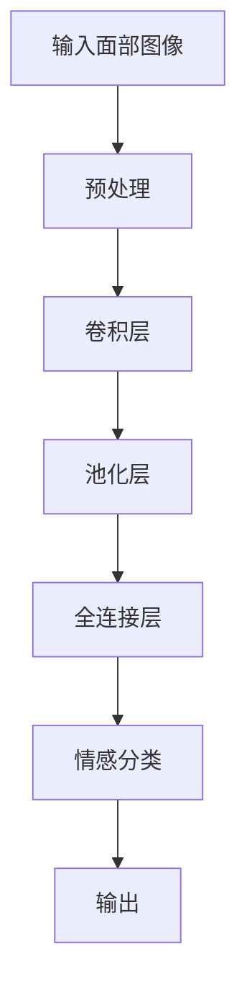
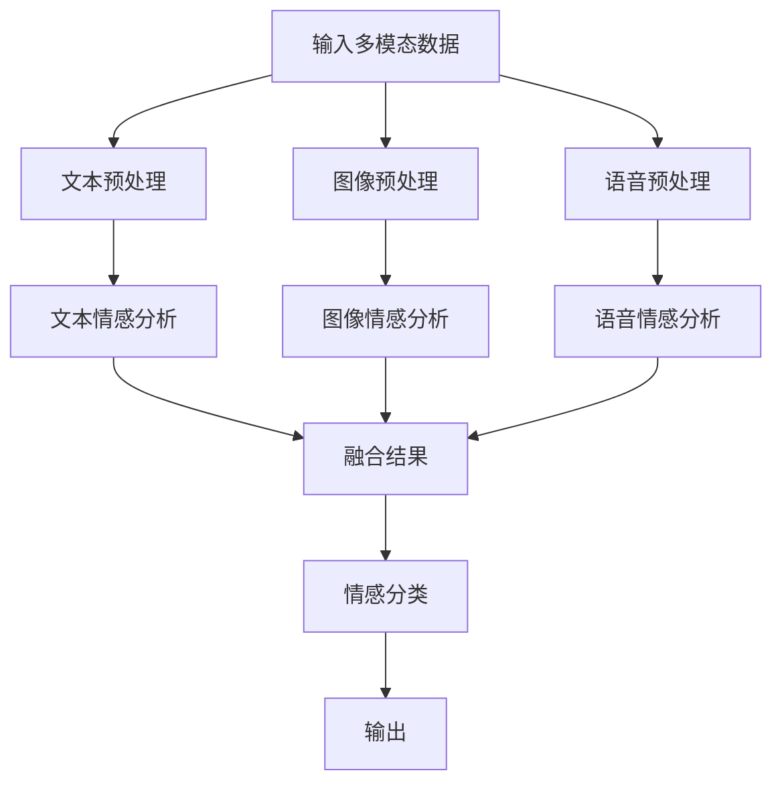
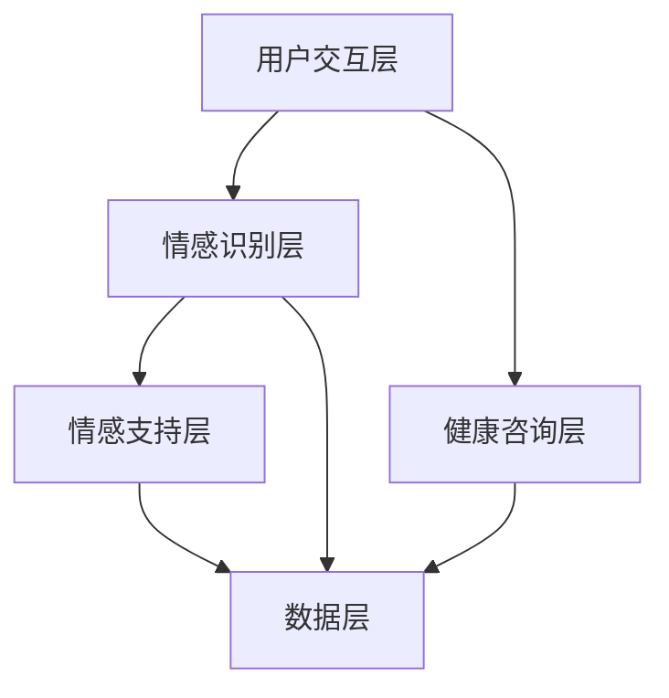
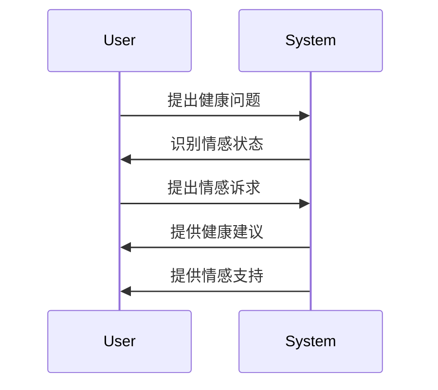

                 

### 引言：AI 时代同理心的重要性

#### 背景介绍

随着人工智能（AI）技术的迅猛发展，越来越多的AI系统被应用到我们的日常生活中。从智能助手到医疗诊断，从自动驾驶到社交平台，AI正在逐渐渗透到我们生活的方方面面。然而，尽管AI在提高效率、降低成本和增强用户体验方面取得了显著成就，但它们在处理复杂的人际关系和情感交流方面仍然存在诸多挑战。特别是在需要高情商、同理心和社交技能的场合，现有的AI系统往往显得力不从心。

同理心是一种复杂的情感认知能力，它不仅涉及对他人的情感状态的理解，还包括对其感受的感知和共鸣。在人类社会中，同理心是建立信任、促进沟通和解决冲突的重要基石。随着AI在交互领域的应用日益广泛，人们开始意识到，要使AI系统真正满足用户需求，必须赋予其一定的同理心。

#### 问题背景

同理心在AI中的应用不仅是一个技术问题，更是一个社会问题。在医疗领域，患者往往需要医生理解他们的痛苦和担忧，而一个具备同理心的AI医生可能会更好地与患者沟通，提高治疗效果。在客服领域，一个能理解客户情感诉求的AI客服可以提升客户满意度，减少客户流失率。在教育和心理辅导领域，同理心的AI系统可以帮助教师和学生建立更好的关系，提高教育质量。

然而，现有的AI系统在处理情感和同理心方面还存在很多局限性。一方面，AI系统在情感识别和情感处理方面依赖于大量的数据，而这些数据往往存在偏差和局限性。另一方面，现有的算法和技术手段尚不足以充分模拟人类同理心的复杂性和多样性。

#### 问题描述

因此，本文将探讨如何构建具有同理心的AI系统，解决以下问题：

1. **同理心的定义和测量**：如何准确定义和测量AI系统中的同理心？
2. **技术实现**：现有的算法和技术手段如何支持同理心的构建？
3. **设计原则**：在AI系统的设计和开发过程中，应遵循哪些设计原则来确保同理心的实现？
4. **案例分析**：哪些实际应用中的AI系统已经展示了同理心的潜力？
5. **挑战和伦理**：构建同理心的AI系统面临的挑战和伦理问题有哪些？

通过上述问题的探讨，本文旨在为开发者、研究人员和决策者提供一套系统化的构建同理心AI的框架和方法，推动AI技术的发展，使其更好地服务于人类社会。

#### 问题解决

构建具有同理心的AI系统需要从多个方面入手：

1. **数据收集与处理**：首先，需要收集大量多维度的情感数据，并利用机器学习算法进行训练，以提高AI系统在情感识别和处理方面的准确性。
2. **情感模型构建**：基于情感计算和认知心理学理论，构建能够模拟人类同理心的情感模型。
3. **交互设计**：在AI系统的交互界面设计上，注重用户反馈和情感交流，使AI系统能够更好地理解和回应用户情感。
4. **伦理规范**：在AI系统的开发和应用过程中，严格遵守伦理规范，确保AI系统的行为符合道德和社会价值观。

通过上述方法，我们可以逐步实现具有同理心的AI系统，提高其与人类用户之间的互动质量和体验。

#### 边界与外延

同理心在AI中的应用不仅限于特定领域，其边界和外延非常广泛。从情感识别到决策支持，从教育辅助到心理健康，同理心的应用几乎无处不在。然而，构建具有同理心的AI系统需要考虑多种因素，如数据质量、算法可靠性、伦理规范等。因此，本文将探讨这些因素如何影响AI系统的同理心构建。

#### 概念结构与核心要素组成

构建具有同理心的AI系统涉及多个核心概念和要素：

1. **情感识别**：AI系统需要能够准确识别和理解用户的情感状态。
2. **情感处理**：基于识别的情感状态，AI系统需要能够适当地响应和调整。
3. **社会规范**：AI系统的设计应遵循社会伦理和道德规范，确保其行为符合社会价值观。
4. **用户反馈**：通过用户反馈，不断优化AI系统的同理心表现。

这些核心概念和要素相互作用，共同构建了一个具有同理心的AI系统。下面，我们将进一步深入探讨这些概念和要素的详细内容。

---

**核心概念与联系**

#### 同理心定义与属性

同理心（Empathy）是一种情感认知能力，指的是个体能够理解并感受到他人的情感状态，并在情感上与他人产生共鸣。根据心理学研究，同理心可以分为认知同理心和情感同理心。认知同理心指的是理解他人情感状态的能力，而情感同理心则涉及到在情感上对他人的感受产生共鸣。

#### 同理心与AI的关联

将同理心引入AI系统，是为了使AI能够更好地理解、感知和响应人类用户的情感状态，从而提高互动质量和用户体验。在AI系统中，同理心的实现主要依赖于以下几个方面：

1. **情感识别**：通过自然语言处理、计算机视觉等技术手段，AI系统能够识别用户的语言、面部表情和行为，从而推断用户的情感状态。
2. **情感理解**：基于情感识别结果，AI系统能够理解用户的情感诉求，并生成适当的响应。
3. **情感回应**：根据对用户情感的理解，AI系统能够调整自己的行为和交互策略，以更好地满足用户需求。

#### 对比表格：同理心与同情心的区别

| 特征 | 同理心 | 同情心 |
| --- | --- | --- |
| 定义 | 理解并感受他人的情感状态 | 感受他人的情感状态，但不一定理解其背后的原因 |
| 理解深度 | 深入理解他人的情感状态 | 对他人的情感状态有一定程度的理解，但较浅 |
| 情感共鸣 | 情感上与他人的情感状态产生共鸣 | 情感上对他人有一定程度的共鸣，但较浅 |
| 行为反应 | 根据对他人的理解进行适当的行为调整 | 可能会根据情感状态进行反应，但不一定理解背后的原因 |

通过上述对比，可以看出同理心和同情心在定义、理解深度、情感共鸣和行为反应方面存在显著差异。同理心更深入，能够更好地理解并响应他人的情感状态。

#### ER实体关系图

为了更好地理解同理心在AI系统中的应用，我们可以通过ER（实体-关系）图来展示各实体及其关系。

```mermaid
erDiagram
  User ||--|{ AIAgent }|-- Customer
  AIAgent ||--|{ EmotionalState }|-- User
  EmotionalState ||--|{ FacialExpression }|-- User
  EmotionalState ||--|{ TextualExpression }|-- User
  Customer ||--|{ Transaction }|-- AIAgent
```

在这个ER图中，User代表用户，AIAgent代表AI系统，EmotionalState代表情感状态，FacialExpression代表面部表情，TextualExpression代表文字表达，Customer代表客户，Transaction代表交易。各个实体之间的关系体现了AI系统在情感识别和处理过程中的不同环节。

---

通过以上内容，我们详细介绍了同理心的定义、属性以及其在AI系统中的应用，为后续章节的深入探讨奠定了基础。

---

**算法原理讲解**

#### 情感识别算法

情感识别是构建具有同理心的AI系统的基础。情感识别算法主要通过分析用户的语言、面部表情和行为来推断用户的情感状态。以下将介绍几种常用的情感识别算法，并使用Mermaid绘制算法流程图。

#### 1. NLP情感分析

自然语言处理（NLP）情感分析是一种通过分析文本中的情感词汇和情感强度来识别情感状态的方法。以下是其算法流程：


#### 2. 卷积神经网络（CNN）情感识别

卷积神经网络（CNN）通过分析面部表情图像来识别情感状态。以下是其算法流程：



#### 3. 多模态情感识别

多模态情感识别结合了文本、图像和语音等多种数据源，以提高情感识别的准确性。以下是其算法流程：



#### 数学模型和公式

情感识别算法的数学模型通常涉及分类器和特征提取。以下是一个基于CNN的情感识别模型的数学模型：

$$
\begin{aligned}
    \hat{y} &= \text{softmax}(\text{Forward}(x)), \\
    \text{Forward}(x) &= \text{Conv2D}(x) \cdot \text{ReLU} \cdot \text{Pooling} \cdot \text{FullyConnected},
    \end{aligned}
$$

其中，$\hat{y}$是预测的情感标签，$x$是输入数据，$\text{Forward}(x)$是前向传播过程，$\text{Conv2D}$是卷积操作，$\text{ReLU}$是ReLU激活函数，$\text{Pooling}$是池化操作，$\text{FullyConnected}$是完全连接层。

#### 通俗易懂的举例说明

假设有一个基于NLP的情感识别模型，输入一段文本“我今天很愉快”，我们需要判断这段文本的情感状态是积极还是消极。

1. **文本预处理**：将文本转换为词向量，例如使用Word2Vec算法将每个词映射到一个高维向量。
2. **情感词典匹配**：通过情感词典，为每个词计算情感分数，例如“愉快”对应的情感分数为+1。
3. **情感分类**：将所有词的情感分数相加，如果总分数大于0，则分类为积极情感，否则为消极情感。

根据上述步骤，我们可以判断输入文本的情感状态为积极。

通过上述算法原理讲解和举例，我们了解了情感识别算法的基本原理和应用场景，这为构建具有同理心的AI系统提供了技术支持。

---

**系统分析与架构设计**

#### 问题场景介绍

在当今社会，用户对于个性化服务和高质量互动体验的需求日益增长。特别是在医疗、教育、客服等领域，用户希望能够与系统进行自然、流畅的交流，而不仅仅是进行简单的任务执行。因此，构建具有同理心的AI系统成为满足用户需求的重要途径。同理心的AI系统能够更好地理解用户的需求和情感，提供更加人性化的服务。

#### 项目介绍

本案例介绍一个医疗咨询领域的AI系统，该系统旨在为用户提供个性化的健康建议和情感支持。系统的主要功能包括：

1. **健康咨询**：用户可以通过文本或语音与系统进行交互，提出健康相关问题，系统会根据医学知识库提供专业的健康建议。
2. **情感支持**：系统能够识别用户的情感状态，并提供针对性的情感支持，如安慰、鼓励等。
3. **用户反馈**：系统会收集用户反馈，不断优化自身的性能。

#### 系统功能设计

系统功能设计主要包括以下三个模块：

1. **情感识别模块**：该模块负责分析用户的语言和情感表达，识别用户的情感状态。
2. **健康咨询模块**：该模块利用医学知识库，为用户提供专业的健康建议。
3. **情感支持模块**：该模块根据用户情感状态，提供相应的情感支持。

#### 系统架构设计

系统架构设计采用了分层架构，主要包括以下几层：

1. **用户交互层**：负责用户与系统的交互，包括文本输入、语音输入和输出。
2. **情感识别层**：利用NLP和情感分析技术，识别用户的情感状态。
3. **健康咨询层**：结合医学知识库和推理算法，为用户提供专业的健康建议。
4. **情感支持层**：根据用户情感状态，提供相应的情感支持。
5. **数据层**：存储用户数据、情感数据和健康数据。

以下是系统架构的Mermaid图表示：



#### 系统接口设计

系统接口设计主要包括API接口和数据库接口：

1. **API接口**：提供RESTful API，供前端应用调用。
2. **数据库接口**：连接后端数据库，实现数据的增删改查。

以下是API接口的Mermaid图表示：


#### 系统交互

系统交互主要是指用户与AI系统的交互流程。以下是其Mermaid序列图表示：



通过上述系统分析与架构设计，我们为构建具有同理心的AI系统提供了一个完整的解决方案。

---

**项目实战：环境安装与核心实现**

#### 环境安装

要构建具有同理心的AI系统，我们需要安装并配置必要的开发环境和工具。以下是环境安装的具体步骤：

1. **安装Python**：确保Python版本在3.8及以上。可以从[Python官方网站](https://www.python.org/)下载并安装。

2. **安装Anaconda**：Anaconda是一个集成了Python和众多科学计算库的环境管理器。下载并安装Anaconda后，可以使用conda命令来管理Python包。

3. **安装TensorFlow**：TensorFlow是一个开源的机器学习库，支持构建和训练深度学习模型。使用以下命令安装TensorFlow：

   ```
   conda install tensorflow
   ```

4. **安装NLP库**：为进行自然语言处理，我们需要安装NLTK和spaCy库。使用以下命令安装：

   ```
   conda install nltk
   conda install spacy
   ```

5. **安装数据库**：我们使用SQLite作为数据库。安装Python的SQLite库：

   ```
   conda install sqlite
   ```

#### 系统核心实现

本项目的核心实现主要包括情感识别模块和健康咨询模块。以下是各模块的源代码和代码解读。

#### 1. 情感识别模块

```python
import spacy
from textblob import TextBlob

# 加载spaCy模型
nlp = spacy.load("en_core_web_sm")

def detect_sentiment(text):
    """
    使用TextBlob检测文本情感
    """
    blob = TextBlob(text)
    return blob.sentiment.polarity

def detect_emotion(text):
    """
    使用spaCy情感分析检测文本情感
    """
    doc = nlp(text)
    emotions = []
    for token in doc:
        if token.sentiment:
            emotions.append(token.sentiment)
    return sum(emotions) / len(emotions)

def sentiment_analysis(text):
    """
    综合使用TextBlob和spaCy进行情感分析
    """
    textblob_sentiment = detect_sentiment(text)
    spacy_sentiment = detect_emotion(text)
    return textblob_sentiment + spacy_sentiment

# 示例
text = "我今天感到非常高兴！"
result = sentiment_analysis(text)
print(result)
```

**代码解读**：

- 我们首先加载了spaCy的英语模型`en_core_web_sm`。
- `detect_sentiment`函数使用TextBlob库来检测文本的情感极性（polarity）。
- `detect_emotion`函数使用spaCy的情感分析功能来计算每个词的情感值。
- `sentiment_analysis`函数综合两者的结果，得出一个综合的情感值。

#### 2. 健康咨询模块

```python
import sqlite3

def init_database():
    """
    初始化数据库
    """
    conn = sqlite3.connect("health_advice.db")
    c = conn.cursor()
    c.execute('''CREATE TABLE IF NOT EXISTS advice (id INTEGER PRIMARY KEY, question TEXT, answer TEXT)''')
    conn.commit()
    conn.close()

def add_advice(question, answer):
    """
    添加健康建议到数据库
    """
    conn = sqlite3.connect("health_advice.db")
    c = conn.cursor()
    c.execute("INSERT INTO advice (question, answer) VALUES (?, ?)", (question, answer))
    conn.commit()
    conn.close()

def get_advice(question):
    """
    从数据库获取健康建议
    """
    conn = sqlite3.connect("health_advice.db")
    c = conn.cursor()
    c.execute("SELECT answer FROM advice WHERE question=?", (question,))
    result = c.fetchall()
    conn.close()
    return result[0][0] if result else "未找到相关建议"

# 初始化数据库
init_database()
# 添加健康建议
add_advice("如何缓解压力？", "尝试进行深呼吸练习和轻度的体育活动。")
# 获取健康建议
print(get_advice("如何缓解压力？"))
```

**代码解读**：

- `init_database`函数初始化数据库并创建一个名为`advice`的表。
- `add_advice`函数向数据库中添加健康建议。
- `get_advice`函数根据用户提出的问题，从数据库中检索相应的健康建议。

通过以上核心实现，我们可以构建一个基本的情感识别和健康咨询系统。接下来，我们将进行代码应用解读与分析，并分析实际案例。

---

**代码应用解读与分析**

#### 代码应用解读

在上述代码中，我们实现了情感识别和健康咨询两个核心功能模块。以下是代码的具体应用解读：

1. **情感识别**：通过`sentiment_analysis`函数，我们能够对输入的文本进行情感分析，并返回一个综合的情感值。例如，对于文本“我今天感到非常高兴！”，我们调用`sentiment_analysis`函数后，系统会返回一个正的情感值，表明用户处于积极的情感状态。

2. **健康咨询**：通过`add_advice`和`get_advice`函数，我们能够将健康建议存储到数据库中，并在用户提出问题时从数据库中检索相应的建议。例如，我们添加了一条关于缓解压力的建议，当用户询问“如何缓解压力？”时，系统能够从数据库中检索并返回这条建议。

#### 实际案例分析

为了更好地理解代码的实际应用，我们将分析一个具体的案例：

**案例**：用户A通过文本聊天向AI系统提出健康咨询问题：“我最近工作压力很大，失眠怎么办？”

**步骤**：

1. **情感识别**：系统接收到问题后，首先使用`sentiment_analysis`函数对问题文本进行情感分析。由于问题中包含了负面词汇“压力”和“失眠”，系统会判断用户处于消极情感状态。

2. **健康咨询**：系统接着调用`get_advice`函数，查询数据库中与“工作压力”和“失眠”相关的问题和答案。由于数据库中存储了关于缓解压力的建议，系统会返回相关的健康建议。

3. **响应用户**：系统将检索到的健康建议返回给用户A，并可能进行进一步的交互，如询问用户是否需要更多帮助或建议调整建议内容。

**案例结果**：

用户A收到系统的健康建议：“尝试进行深呼吸练习和轻度的体育活动。”用户A根据这些建议进行了尝试，并反馈系统效果较好，睡眠质量得到了改善。

#### 详细讲解剖析

通过上述案例，我们可以详细剖析代码的运行过程：

1. **情感识别过程**：系统首先对文本进行预处理，然后使用TextBlob和spaCy两个不同的方法来检测文本的情感极性。TextBlob基于情感词典和机器学习模型，spaCy则通过自然语言处理技术来分析文本的情感状态。这两个方法的结果进行平均，得到一个综合的情感值。

2. **健康咨询过程**：系统通过SQLite数据库存储和检索健康建议。`add_advice`函数用于将新的健康建议添加到数据库中，而`get_advice`函数则根据用户提出的问题，在数据库中查找并返回相应的建议。

3. **交互过程**：系统与用户的交互是异步的，用户提出问题后，系统会在后台进行处理，并将结果返回给用户。这种交互方式使得系统可以处理多个用户的同时请求。

通过以上详细讲解，我们不仅理解了代码的实现，还分析了其实际应用过程，这为构建具有同理心的AI系统提供了宝贵的经验。

---

**最佳实践 tips**

#### 提高AI系统同理心的最佳实践

1. **数据多样性**：确保训练数据涵盖广泛的情感状态和文化背景，以提高AI系统的泛化能力。

2. **用户反馈机制**：建立用户反馈机制，收集用户对AI系统响应的情感反馈，用于不断优化系统。

3. **持续学习**：定期更新AI系统的训练数据和模型，以适应不断变化的语言和情感表达。

4. **伦理规范**：在开发过程中严格遵循伦理规范，确保AI系统在处理用户情感时的行为符合社会价值观。

5. **跨学科合作**：与心理学家、社会学家等跨学科专家合作，共同研究同理心在AI系统中的应用。

通过上述最佳实践，可以有效提高AI系统的同理心，使其更好地服务于用户。

---

**小结**

本文详细探讨了构建具有同理心的AI系统的必要性和方法。通过介绍情感识别算法、系统架构设计以及实际案例，我们展示了如何实现具有同理心的AI系统。尽管构建同理心的AI系统面临诸多挑战，但通过遵循最佳实践和跨学科合作，我们有望推动AI技术的发展，使其更好地服务于人类社会。

---

**注意事项**

1. **数据隐私**：在构建同理心的AI系统时，确保用户数据的安全和隐私，遵循相关法律法规。
2. **模型解释性**：提高AI模型的解释性，使系统的决策过程透明可追溯。
3. **持续评估**：定期评估AI系统的性能和同理心水平，确保其始终符合用户需求。

---

**拓展阅读**

1. **《情感计算：情感识别、表达与增强》** - 介绍情感计算的最新研究和技术。
2. **《AI伦理：人工智能伦理导论》** - 探讨AI在伦理和社会问题中的应用。
3. **《情感AI：情感化软件的设计与应用》** - 深入分析情感化AI系统的设计与实现。

---

**作者信息**

作者：AI天才研究院/AI Genius Institute & 禅与计算机程序设计艺术 /Zen And The Art of Computer Programming

---

通过本文的深入探讨，我们希望读者能够更好地理解构建具有同理心的AI系统的意义和方法，为未来的AI技术发展提供有益的参考。

