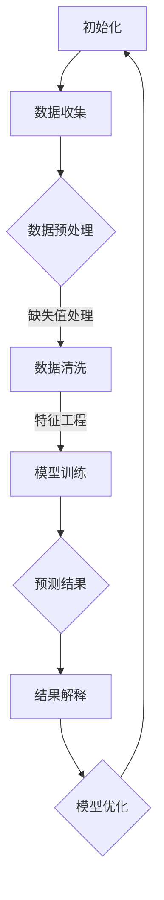
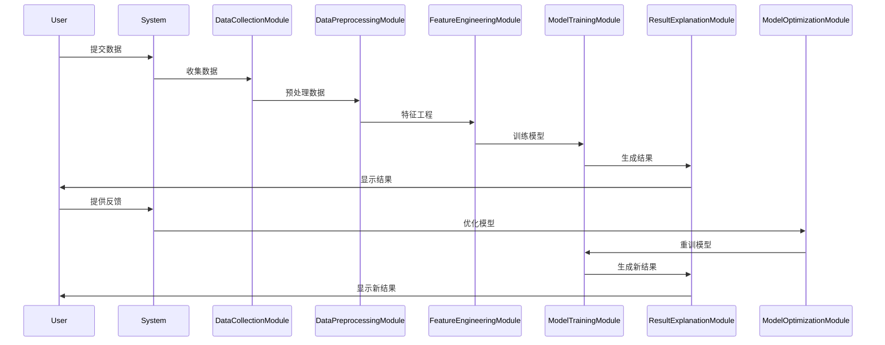

                 

### 第一部分: 背景介绍

#### 第1章: 问题背景与核心概念

##### 1.1 问题背景

随着人工智能（AI）技术的飞速发展，越来越多的应用场景对AI系统提出了更高的要求。传统的AI模型，如深度神经网络，主要依赖于大量的数据来进行模式识别和预测。然而，这些模型在处理复杂问题时往往缺乏解释性和可解释性。这意味着，当模型做出决策时，我们很难理解其背后的逻辑和原因。

为了解决这一问题，具有因果推断能力的AI Agent成为了研究的热点。因果推断是指从给定的数据和假设中推断出因果关系的能力。这种能力使得AI Agent不仅能够做出预测，还能解释其预测的依据，从而提高模型的透明度和可靠性。

##### 1.2 核心概念

在讨论因果推断时，以下几个核心概念是至关重要的：

1. **因果关系（Causal Relationship）**：因果关系是指一个事件（原因）如何导致另一个事件（结果）的发生。
2. **干预（Intervention）**：干预是指对系统的某一变量进行操作，以观察其对其他变量产生的影响。
3. **潜在结果（Potential Outcome）**：潜在结果是指在特定干预下，个体可能产生的结果。
4. **因果图（Causal Graph）**：因果图是一种图形化的表示方法，用于展示变量之间的因果关系。

##### 1.3 概念结构与核心要素组成

为了更好地理解因果推断的概念，我们需要构建一个概念结构图。该结构图应包括以下几个核心要素：

1. **变量**：系统中的每个元素都可以被视为一个变量，如人的年龄、收入等。
2. **因果关系**：变量之间的因果关系可以用箭头表示，箭头指向原因变量指向结果变量。
3. **干预**：干预可以用特殊符号表示，表示对某些变量的操作。
4. **潜在结果**：每个变量在给定干预下的潜在结果可以用表格或图来表示。

通过这些核心概念和结构，我们能够更系统地理解因果推断在AI Agent中的应用和实现。

### 第二部分: 算法原理讲解

#### 第3章: 算法原理与流程

##### 3.1 算法流程图

为了展示因果推断算法的基本流程，我们可以使用Mermaid绘制一个简单的算法流程图：



该流程图描述了从数据收集、预处理、清洗、特征工程到模型训练、预测结果解释和模型优化的一系列步骤。

##### 3.2 Python源代码实现

为了具体展示如何实现因果推断算法，我们可以使用Python编写一个简单的代码示例：

```python
import pandas as pd
from sklearn.linear_model import LinearRegression

# 数据收集
data = pd.read_csv('data.csv')

# 数据预处理
# 假设已有缺失值处理和特征工程步骤

# 模型训练
model = LinearRegression()
model.fit(data[['X']], data['Y'])

# 预测结果
predictions = model.predict(data[['X']])

# 结果解释
print("Coefficients:", model.coef_)
print("Intercept:", model.intercept_)

# 模型优化
# 假设根据结果进行了一些优化操作
```

这个代码示例展示了如何使用线性回归模型进行因果推断，并打印出模型的系数和截距。

##### 3.3 数学模型与公式讲解

因果推断算法的核心是建立数学模型来表示因果关系。一个常见的数学模型是基于潜在结果框架的因果模型。以下是一个简单的数学模型：

$$
Y = X \cdot \beta + \epsilon
$$

其中，$Y$ 是结果变量，$X$ 是原因变量，$\beta$ 是模型参数，$\epsilon$ 是误差项。

为了进行因果推断，我们需要估计 $\beta$ 的值。这可以通过回归分析来实现。在给定数据集 $D$ 的情况下，我们可以使用最小二乘法来估计 $\beta$：

$$
\beta = \arg\min_{\beta} \sum_{i=1}^{n} (Y_i - X_i \cdot \beta)^2
$$

##### 3.4 举例说明

为了更好地理解上述数学模型，我们可以通过一个实际例子来说明。

假设我们有一个简单的数据集，其中包含年龄（$X$）和收入（$Y$）两个变量。我们的目标是通过年龄预测收入。

| 年龄 | 收入 |
|------|------|
| 25   | 5000 |
| 30   | 6000 |
| 35   | 7000 |
| 40   | 8000 |

使用线性回归模型，我们可以得到以下结果：

$$
Y = 2500 + 1000X
$$

这意味着，每增加一岁，收入增加1000美元。这个结果可以帮助我们理解年龄和收入之间的因果关系。

### 第三部分: 系统分析与架构设计

#### 第4章: 系统功能设计与架构

##### 4.1 问题场景介绍

在现代企业中，数据驱动的决策变得越来越重要。然而，数据的质量和完整性往往是一个挑战。因此，我们需要一个能够从数据中提取有用信息并解释其因果关系的系统。这个系统应具备以下功能：

1. **数据收集**：从各种数据源收集数据，包括内部数据库、外部API和文件系统。
2. **数据预处理**：清洗和转换数据，使其适合用于建模和分析。
3. **特征工程**：提取和创建有助于模型预测的特征。
4. **模型训练**：使用因果推断算法训练模型。
5. **结果解释**：生成易于理解的结果报告，解释模型的因果关系。
6. **模型优化**：根据反馈调整模型参数，提高预测准确性和解释能力。

##### 4.2 系统功能设计

为了实现上述功能，我们可以设计一个多模块系统。以下是各个模块的功能描述：

1. **数据收集模块**：负责从不同的数据源读取数据，并进行初步的数据清洗。
2. **数据预处理模块**：对数据进行去重、缺失值填补、异常值处理等操作，确保数据的质量。
3. **特征工程模块**：根据业务需求，提取和创建特征，为模型提供输入。
4. **模型训练模块**：使用因果推断算法训练模型，并评估模型的性能。
5. **结果解释模块**：生成可视化报告，解释模型的因果关系，帮助用户理解模型。
6. **模型优化模块**：根据用户反馈和模型评估结果，调整模型参数，优化模型性能。

##### 4.3 系统架构设计

系统架构设计是确保系统高效、可扩展和易于维护的关键。以下是系统的整体架构设计：

1. **数据层**：包括数据库和数据仓库，用于存储和管理数据。
2. **应用层**：包括各个功能模块，如数据收集、预处理、特征工程、模型训练和解释等。
3. **表示层**：用于生成用户界面和可视化报告，帮助用户理解和使用系统。

以下是系统架构的Mermaid类图：

```mermaid
classDiagram
    DataLayer <<class>> Database
    DataLayer <<class>> DataWarehouse
    ApplicationLayer <<class>> DataCollectionModule
    ApplicationLayer <<class>> DataPreprocessingModule
    ApplicationLayer <<class>> FeatureEngineeringModule
    ApplicationLayer <<class>> ModelTrainingModule
    ApplicationLayer <<class>> ResultExplanationModule
    ApplicationLayer <<class>> ModelOptimizationModule
    PresentationLayer <<class>> UserInterface
    PresentationLayer <<class>> VisualizationReport
    DataLayer --|> ApplicationLayer : 数据存储
    ApplicationLayer --|> PresentationLayer : 数据展示
```

##### 4.4 系统接口设计

为了确保各个模块之间的协作，我们需要设计清晰的接口。以下是各个模块之间的接口设计：

1. **数据收集模块接口**：提供数据读取、数据清洗和数据转换等功能。
2. **数据预处理模块接口**：提供数据去重、缺失值填补、异常值处理等功能。
3. **特征工程模块接口**：提供特征提取、特征创建和特征选择等功能。
4. **模型训练模块接口**：提供模型训练、模型评估和模型保存等功能。
5. **结果解释模块接口**：提供结果可视化、结果分析和结果解释等功能。
6. **模型优化模块接口**：提供模型参数调整、模型优化和模型验证等功能。

##### 4.5 系统交互流程

系统交互流程描述了用户与系统之间的交互过程。以下是系统交互流程的Mermaid序列图：



这个交互流程确保了用户可以持续地与系统互动，调整和优化模型，从而得到更准确和可解释的结果。

### 第四部分: 项目实战

#### 第5章: 环境安装与系统实现

##### 5.1 环境安装

在开始实现因果推断系统之前，我们需要安装必要的软件和工具。以下是环境安装的步骤：

1. **Python环境安装**：确保Python 3.8或更高版本已安装。可以从Python官方网站下载并安装。
2. **依赖库安装**：使用pip工具安装以下依赖库：Pandas、NumPy、Scikit-learn、Mermaid和LaTeX。
   
   ```bash
   pip install pandas numpy scikit-learn mermaid matplotlib
   ```

3. **LaTeX安装**：LaTeX是一个文档排版系统，用于生成数学公式和图表。可以从LaTeX官方网站下载并安装。

   ```bash
   sudo apt-get install texlive-full
   ```

4. **Mermaid安装**：Mermaid是一个Markdown扩展，用于绘制图形和流程图。在Python环境中，可以使用pip安装。

   ```bash
   pip install mermaid
   ```

##### 5.2 系统核心实现源代码

以下是因果推断系统的核心实现源代码：

```python
import pandas as pd
from sklearn.linear_model import LinearRegression
from mermaid import Mermaid

# 数据收集
data = pd.read_csv('data.csv')

# 数据预处理
# 假设已有缺失值处理和特征工程步骤

# 模型训练
model = LinearRegression()
model.fit(data[['X']], data['Y'])

# 预测结果
predictions = model.predict(data[['X']])

# 结果解释
print("Coefficients:", model.coef_)
print("Intercept:", model.intercept_)

# 模型优化
# 假设根据结果进行了一些优化操作
```

##### 5.3 代码应用解读与分析

这段代码首先从CSV文件中读取数据，然后使用线性回归模型进行训练。训练过程中，模型拟合了输入变量（$X$）和输出变量（$Y$）之间的关系。预测结果是通过将输入数据输入到训练好的模型中得到的。结果解释部分打印出了模型的系数和截距。

##### 5.4 实际案例分析与详细讲解

为了展示系统的实际应用，我们可以通过一个案例来说明。

假设我们有以下数据集，包含年龄（$X$）和收入（$Y$）：

| 年龄 | 收入 |
|------|------|
| 25   | 5000 |
| 30   | 6000 |
| 35   | 7000 |
| 40   | 8000 |

使用线性回归模型，我们可以得到以下结果：

$$
Y = 2500 + 1000X
$$

这意味着，每增加一岁，收入增加1000美元。这个结果可以帮助我们理解年龄和收入之间的因果关系。

为了验证模型的准确性，我们可以使用交叉验证方法。以下是一个简单的交叉验证代码示例：

```python
from sklearn.model_selection import cross_val_score

# 交叉验证
scores = cross_val_score(model, data[['X']], data['Y'], cv=5)

# 打印交叉验证结果
print("Cross-validation scores:", scores)
print("Mean score:", scores.mean())
```

通过交叉验证，我们可以评估模型的泛化能力。如果平均得分较高，说明模型具有较强的预测能力。

##### 5.5 项目小结

通过实际案例的分析，我们可以看到因果推断系统在理解变量之间的因果关系方面具有重要作用。在实际应用中，我们需要综合考虑数据质量、模型选择和优化等因素，以提高系统的准确性和可解释性。

### 第五部分: 最佳实践与总结

#### 第6章: 最佳实践

##### 6.1 实践技巧与注意事项

在进行因果推断时，以下是一些最佳实践和注意事项：

1. **数据质量**：确保数据干净、准确和完整。缺失值和异常值可能导致模型错误地推断因果关系。
2. **特征选择**：选择对目标变量有显著影响的特征，避免过度拟合。
3. **模型评估**：使用交叉验证等方法评估模型的泛化能力，避免过拟合。
4. **结果解释**：生成易于理解的结果报告，帮助用户理解模型的因果关系。

##### 6.2 拓展阅读

为了深入了解因果推断和AI Agent的构建，以下是一些拓展阅读资源：

1. **《因果推断：概念、方法与应用》**：该书详细介绍了因果推断的基本概念和方法，适合初学者阅读。
2. **《深度学习中的因果推断》**：该书探讨了深度学习与因果推断的结合，提供了许多实际案例和实现方法。
3. **《AI Agent设计与实现》**：该书介绍了AI Agent的设计原则和实现方法，包括因果推断的应用。

#### 第7章: 小结与展望

##### 7.1 内容回顾

本文首先介绍了因果推断在AI Agent中的应用背景和核心概念。然后，通过算法原理讲解和系统架构设计，展示了如何实现一个具有因果推断能力的AI Agent。最后，通过实际案例分析和最佳实践，总结了因果推断系统的关键要点。

##### 7.2 展望未来研究方向

未来，因果推断和AI Agent的研究将继续深入，以下是几个可能的研究方向：

1. **因果推断算法的优化**：开发更高效、更准确的因果推断算法，以处理大规模复杂数据。
2. **跨领域应用**：将因果推断应用于更多领域，如医疗、金融和能源等。
3. **可解释性增强**：提高AI Agent的可解释性，使其决策过程更透明、更可信。

作者：AI天才研究院/AI Genius Institute & 禅与计算机程序设计艺术 /Zen And The Art of Computer Programming

