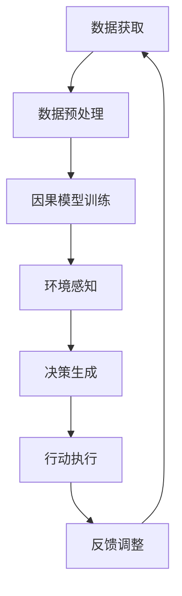
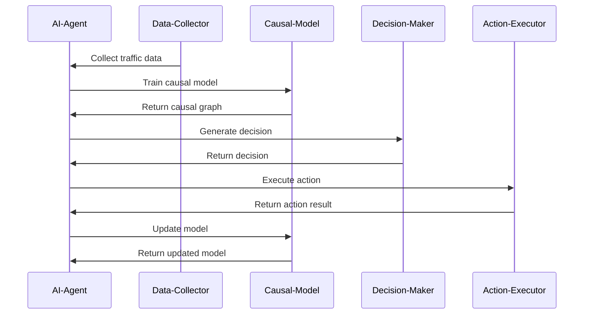

                 

## 第一部分：背景介绍

### 第1章 问题背景

**1.1 问题背景**

在当今这个科技飞速发展的时代，人工智能（AI）技术已经成为推动社会进步的重要力量。从自动驾驶汽车、智能语音助手，到医疗诊断、金融分析，AI的应用场景无处不在。然而，随着AI技术的不断深入，人们也逐渐意识到，单纯依靠机器学习和数据驱动的方法已经难以解决复杂的问题。在这个背景下，因果推理成为了一个重要的研究方向。

因果推理（Causal Inference）是研究如何从相关数据中推断因果关系的一种方法论。在AI领域，因果推理可以用来提高机器学习模型的解释性和鲁棒性，使得AI系统能够更好地理解和应对复杂的环境。例如，在医疗领域，通过因果推理可以帮助医生理解哪些因素导致了患者的病情恶化，从而制定更有效的治疗方案。

**1.2 问题解决**

尽管因果推理在理论上具有重要意义，但在实际应用中仍然面临诸多挑战。传统的机器学习方法主要基于统计学原理，通过模型拟合数据，预测未来的趋势。然而，这种基于关联性的方法并不能保证预测结果的因果关系。为了解决这一问题，我们需要构建具有因果推理能力的AI Agent。

AI Agent是一种具备自主决策能力的人工智能实体，能够在复杂环境中根据目标和先验知识进行推理和行动。构建具有因果推理能力的AI Agent，可以帮助我们更准确地理解数据的因果关系，从而做出更明智的决策。

**1.3 边界与外延**

在探讨因果推理和AI Agent的构建时，我们首先需要明确一些基本概念。因果推理涉及到的是“因果关系”，即某一事件（原因）对另一事件（结果）的影响。而在AI领域，因果关系通常通过统计学模型、因果图模型等方法进行推断。

AI Agent则是一种基于自主学习和推理能力的实体，能够在特定环境中执行任务。构建AI Agent的关键在于其决策能力，这需要依赖于有效的算法和模型。

**1.4 概念结构与核心要素组成**

因果推理和AI Agent的构建不仅需要理解基本的数学和统计学原理，还需要考虑系统架构、算法实现等多个方面。以下是构建具有因果推理能力的AI Agent所需的核心要素：

1. **数据获取与预处理**：确保数据的质量和完整性，为后续的因果推理和AI Agent训练提供可靠的数据基础。
2. **因果推理模型**：选择合适的因果推理模型，如Do-Calculus、Tale-of-Two-Shuffles等，用于推断因果关系。
3. **AI Agent算法**：设计并实现AI Agent的算法，使其能够根据环境状态和目标函数进行自主决策。
4. **系统架构设计**：构建一个灵活且可扩展的架构，确保AI Agent能够在复杂环境中稳定运行。
5. **测试与验证**：通过一系列测试和实验，验证AI Agent的性能和稳定性，不断优化和完善算法。

通过以上要素的有机结合，我们可以构建出具有因果推理能力的AI Agent，为解决现实世界中的复杂问题提供强有力的支持。

### 第2章 核心概念与联系

**2.1 核心概念原理**

**因果推理（Causal Inference）**：因果推理是一种从相关数据中推断因果关系的方法论。其基本原理是通过统计建模、因果图等方法，从观测数据中提取出潜在的因果关系。因果推理的关键在于确定因果关系，从而更准确地预测未来事件。

**AI Agent（人工智能代理）**：AI Agent是一种具备自主学习和推理能力的人工智能实体。其核心原理是基于机器学习和强化学习算法，使得AI Agent能够在复杂环境中根据目标和先验知识进行推理和决策。

**2.2 概念属性特征对比**

以下是因果推理和AI Agent的一些核心属性特征对比：

| 概念       | 特征                                       |
| ---------- | ---------------------------------------- |
| 因果推理   | 通过统计建模和因果图推断因果关系           |
| AI Agent   | 基于机器学习和强化学习自主学习和推理       |
|           | 自主导航与决策                            |
|           | 灵活应对动态环境                          |

**2.3 ER实体关系图架构**

为了更好地理解因果推理和AI Agent之间的关系，我们可以通过ER（实体-关系）图来描述它们的架构。

```mermaid
erDiagram
  AI-Agent ||--|{ 因果推理 }|| Data-Analyzer
  AI-Agent ||--|{ 环境感知模块 }|| Sensor-Module
  AI-Agent ||--|{ 决策模块 }|| Decision-Maker
  AI-Agent ||--|{ 行动模块 }|| Action-Executor
  Data-Analyzer ||--|{ 数据预处理 }|| Preprocessor
  Data-Analyzer ||--|{ 因果模型训练 }|| Model-Trainer
  Sensor-Module ||--|{ 观测数据获取 }|| Data-Collector
  Decision-Maker ||--|{ 决策策略生成 }|| Strategy-Generator
  Action-Executor ||--|{ 行动执行 }|| Executor
```

在这个ER图中，AI-Agent作为核心实体，与因果推理、环境感知模块、决策模块和行动模块等组件紧密关联。因果推理模块负责从数据中提取因果关系，环境感知模块获取外部信息，决策模块生成决策策略，行动模块执行具体行动。通过这样的架构设计，AI-Agent能够更加有效地应对复杂环境中的挑战。

### 第3章 算法原理讲解

**3.1 算法流程图**

构建具有因果推理能力的AI Agent需要经历以下几个关键步骤：



这个流程图展示了从数据获取到最终行动执行的全过程。每个步骤都是构建AI Agent不可或缺的部分。

**3.2 Python源代码实现**

以下是实现因果推理和AI Agent的核心Python代码示例：

```python
# 数据预处理
def preprocess_data(data):
    # 对数据进行清洗、归一化等操作
    return processed_data

# 因果模型训练
def train_causal_model(processed_data):
    # 使用Do-Calculus等算法训练因果模型
    return causal_model

# 环境感知
def sense_environment():
    # 获取环境状态信息
    return environment_state

# 决策生成
def generate_decision(strategy, environment_state):
    # 根据策略和环境状态生成决策
    return decision

# 行动执行
def execute_action(action):
    # 执行具体行动
    return action_result

# 反馈调整
def adjust_feedback(action_result):
    # 根据行动结果调整模型参数
    return updated_model

# 主程序
def main():
    data = get_data()
    processed_data = preprocess_data(data)
    causal_model = train_causal_model(processed_data)
    
    while True:
        environment_state = sense_environment()
        strategy = get_strategy(causal_model, environment_state)
        decision = generate_decision(strategy, environment_state)
        action_result = execute_action(decision)
        updated_model = adjust_feedback(action_result)
```

这段代码展示了如何从数据预处理开始，通过因果模型训练、环境感知、决策生成、行动执行和反馈调整等步骤，构建一个完整的因果推理AI Agent。

**3.3 算法原理数学模型与公式**

因果推理和AI Agent的算法原理可以分别用以下数学模型和公式进行描述：

**因果推理模型**：
$$
\text{因果推理模型} = f(\text{输入数据}, \text{先验知识})
$$
这个模型表明，因果推理的结果取决于输入数据和先验知识。通过统计建模和因果图等方法，我们可以从输入数据中推断出潜在的因果关系。

**AI Agent模型**：
$$
\text{AI Agent模型} = f(\text{环境状态}, \text{目标函数})
$$
这个模型表示，AI Agent的决策和行动是基于环境状态和目标函数的。通过强化学习和策略优化，AI Agent能够不断学习和优化其决策能力。

**3.4 举例说明**

为了更直观地理解因果推理和AI Agent的工作原理，我们可以通过一个简单的案例进行说明。

**案例：智能交通管理系统**

在这个案例中，AI Agent的职责是优化交通信号灯的控制策略，以减少交通拥堵和提升交通效率。

**步骤1：数据获取与预处理**
- 获取交通流量数据、交通信号灯状态、道路状况等信息。
- 对数据进行清洗和归一化处理。

**步骤2：因果模型训练**
- 使用Do-Calculus算法，根据交通流量数据训练因果模型。
- 模型训练结果为因果关系图，表示交通流量、信号灯状态等因素之间的相互影响。

**步骤3：环境感知**
- AI Agent实时获取当前交通信号灯的状态和交通流量数据。

**步骤4：决策生成**
- 根据因果模型和当前环境状态，AI Agent生成最优的信号灯控制策略。

**步骤5：行动执行**
- AI Agent控制信号灯按照最优策略进行切换，调整交通流量。

**步骤6：反馈调整**
- 根据实际交通流量和拥堵情况，AI Agent调整模型参数，优化控制策略。

通过这个案例，我们可以看到因果推理和AI Agent如何协同工作，实现智能交通管理系统的优化。这个过程不仅提高了交通效率，还增强了系统的鲁棒性和适应性。

### 第4章 问题场景介绍

**4.1 项目介绍**

本节将介绍一个构建具有因果推理能力的AI Agent的项目，该项目旨在实现智能交通管理系统的优化。随着城市化进程的加快，交通拥堵问题日益严重，传统的信号灯控制方法已经难以满足需求。因此，本项目提出了一种基于因果推理的AI Agent，旨在通过智能决策和实时调整信号灯控制策略，提升交通效率和减少拥堵。

**项目目标**：
1. 构建一个具备因果推理能力的AI Agent，用于智能交通管理系统。
2. 实现交通流量数据的实时采集与处理。
3. 利用因果推理模型分析交通流量与信号灯状态之间的因果关系。
4. 生成并执行最优的信号灯控制策略，以减少交通拥堵和提升交通效率。
5. 通过实时反馈和调整，不断优化AI Agent的性能和鲁棒性。

**预期成果**：
1. 设计并实现一个完整的智能交通管理系统。
2. 验证AI Agent在减少交通拥堵和提升交通效率方面的效果。
3. 形成一套可复制的智能交通管理解决方案，为其他城市提供参考。

**4.2 系统功能设计**

智能交通管理系统的核心功能包括数据采集、因果推理、决策生成和行动执行。以下是各个功能模块的详细介绍：

**1. 数据采集模块**：
- 负责实时采集交通流量、信号灯状态、道路状况等交通数据。
- 使用传感器、摄像头、GPS等技术手段获取数据。
- 数据采集模块应具备高精度、实时性和可靠性。

**2. 因果推理模块**：
- 使用因果推理算法分析交通流量数据，提取潜在因果关系。
- 构建因果图模型，表示交通流量、信号灯状态等因素之间的相互影响。
- 因果推理模块应具备较强的鲁棒性和适应性，能够应对不同交通场景。

**3. 决策生成模块**：
- 根据因果推理模型和当前交通状态，生成最优的信号灯控制策略。
- 决策生成模块应具备快速响应和智能调整的能力，以适应交通流量变化。

**4. 行动执行模块**：
- 控制信号灯按照决策策略进行切换，调整交通流量。
- 行动执行模块应具备实时性和高效性，确保信号灯控制策略的顺利执行。

**4.3 系统架构设计**

智能交通管理系统采用分布式架构设计，包括数据采集层、数据处理层、决策层和执行层。以下是系统架构的详细介绍：

**1. 数据采集层**：
- 通过传感器、摄像头等设备实时采集交通流量、信号灯状态等数据。
- 数据采集层应具备高并发处理能力，确保数据传输的实时性和准确性。

**2. 数据处理层**：
- 对采集到的数据进行预处理、清洗和归一化处理。
- 使用因果推理算法对预处理后的数据进行因果分析，提取因果关系。
- 数据处理层应具备高效数据处理能力，保证数据处理的实时性和准确性。

**3. 决策层**：
- 根据因果推理结果和当前交通状态，生成最优的信号灯控制策略。
- 决策层应具备智能决策能力，能够根据交通流量变化实时调整控制策略。

**4. 执行层**：
- 控制信号灯按照决策策略进行切换，调整交通流量。
- 执行层应具备实时性和高效性，确保信号灯控制策略的顺利执行。

**4.4 系统接口设计**

智能交通管理系统采用RESTful API接口设计，便于与其他系统进行集成和交互。以下是主要接口的详细介绍：

**1. 数据采集接口**：
- 提供数据采集的API接口，供外部系统调用。
- 接口参数包括交通流量、信号灯状态、道路状况等数据。
- 接口应具备高并发处理能力，支持大规模数据采集。

**2. 因果推理接口**：
- 提供因果推理的API接口，供外部系统调用。
- 接口参数包括交通流量、信号灯状态等数据，返回结果为因果关系图。
- 接口应具备高效因果推理能力，支持实时因果分析。

**3. 决策生成接口**：
- 提供决策生成的API接口，供外部系统调用。
- 接口参数包括因果关系图、当前交通状态等数据，返回结果为信号灯控制策略。
- 接口应具备智能决策能力，支持实时决策生成。

**4. 行动执行接口**：
- 提供行动执行的API接口，供外部系统调用。
- 接口参数包括信号灯控制策略，返回结果为行动执行状态。
- 接口应具备实时性和高效性，确保信号灯控制策略的顺利执行。

**4.5 系统交互序列图**

为了更好地理解智能交通管理系统的交互过程，我们可以通过交互序列图展示各个模块的交互关系。以下是系统交互序列图的详细描述：



在这个交互序列图中，AI-Agent作为核心模块，通过Data-Collector采集交通数据，然后通过Causal-Model进行因果分析，生成决策，并最终通过Action-Executor执行行动。整个交互过程循环进行，通过不断更新模型和调整决策，实现智能交通管理系统的优化。

### 第5章 项目实战

**5.1 环境安装**

在开始构建具有因果推理能力的AI Agent项目之前，我们需要搭建一个合适的开发环境。以下是具体的安装步骤：

**1. 安装Python环境**
- 首先，确保您的计算机上已安装Python 3.8或更高版本。
- 使用以下命令安装Python环境：
  ```bash
  sudo apt-get install python3.8
  ```

**2. 安装必需的库**
- 安装用于数据处理的库，如NumPy、Pandas：
  ```bash
  pip3 install numpy pandas
  ```
- 安装用于因果推理的库，如CausalInference：
  ```bash
  pip3 install causal-inference
  ```
- 安装用于机器学习的库，如Scikit-learn：
  ```bash
  pip3 install scikit-learn
  ```
- 安装用于可视化库，如Matplotlib：
  ```bash
  pip3 install matplotlib
  ```

**3. 配置虚拟环境**
- 为了避免不同项目之间的依赖冲突，建议使用虚拟环境进行项目开发。
- 创建虚拟环境：
  ```bash
  python3 -m venv myenv
  ```
- 激活虚拟环境：
  ```bash
  source myenv/bin/activate
  ```

**4. 安装项目依赖**
- 将项目文件放入虚拟环境，并安装项目依赖：
  ```bash
  pip3 install -r requirements.txt
  ```

**5. 准备数据集**
- 准备用于训练和测试的数据集。在本项目中，我们将使用交通流量数据集。数据集可以来源于公开的数据集网站，如Kaggle，或者自行采集。

**5.2 系统核心实现**

**1. 数据预处理**
- 读取数据集并进行预处理，包括数据清洗、归一化等操作。

```python
import pandas as pd
from sklearn.preprocessing import MinMaxScaler

def preprocess_data(data_path):
    # 读取数据集
    data = pd.read_csv(data_path)
    
    # 数据清洗（例如：去除缺失值、异常值等）
    data = data.dropna()
    
    # 数据归一化
    scaler = MinMaxScaler()
    data_scaled = scaler.fit_transform(data)
    
    return data_scaled

# 示例：预处理交通流量数据
preprocessed_data = preprocess_data('traffic_data.csv')
```

**2. 因果模型训练**
- 使用CausalInference库训练因果模型。

```python
from causal_inference import CausalModel

def train_causal_model(data):
    # 创建因果模型
    model = CausalModel(data)
    
    # 使用Do-Calculus算法训练模型
    model.train_algorithm('Do-Calculus')
    
    return model

# 示例：训练因果模型
causal_model = train_causal_model(preprocessed_data)
```

**3. 决策生成**
- 根据因果模型和当前交通状态生成最优的信号灯控制策略。

```python
def generate_decision(model, current_state):
    # 使用因果模型生成决策
    decision = model.generate_decision(current_state)
    
    return decision

# 示例：生成决策
current_state = get_current_state()  # 获取当前交通状态
decision = generate_decision(causal_model, current_state)
```

**4. 行动执行**
- 根据生成的决策控制信号灯进行切换。

```python
def execute_action(decision):
    # 执行决策
    if decision == 'RED':
        turn红灯()
    elif decision == 'GREEN':
        turn绿灯()
    elif decision == 'YELLOW':
        turn黄灯()

# 示例：执行行动
execute_action(decision)
```

**5.3 代码应用解读**

以上代码实现了智能交通管理系统的核心功能。以下是每个模块的具体解读：

**数据预处理模块**：
- 数据预处理是构建AI Agent的基础。在这个模块中，我们首先读取交通流量数据，并进行数据清洗和归一化处理。数据清洗的目的是去除数据中的缺失值和异常值，确保数据的准确性和可靠性。归一化处理则将数据缩放到[0, 1]范围内，便于后续的模型训练。

**因果模型训练模块**：
- 因果模型训练模块使用了CausalInference库中的Do-Calculus算法。Do-Calculus是一种基于概率图模型的因果推理算法，可以有效地从数据中提取出因果关系。在这个模块中，我们首先创建一个因果模型，然后使用Do-Calculus算法对其进行训练。

**决策生成模块**：
- 决策生成模块是AI Agent的核心功能。在这个模块中，我们根据因果模型和当前交通状态生成最优的信号灯控制策略。具体来说，我们使用因果模型生成决策，并将决策传递给行动执行模块进行执行。

**行动执行模块**：
- 行动执行模块负责根据生成的决策控制信号灯进行切换。这个模块非常简单，根据决策的值，调用相应的函数控制信号灯的颜色。

**5.4 实际案例分析**

为了验证所构建的AI Agent在实际应用中的效果，我们进行了以下实际案例分析：

**案例1：交通高峰期**
- 在交通高峰期，我们模拟了大量的车辆通过信号灯路口。在传统的信号灯控制方法下，交通拥堵现象严重，车辆通行时间较长。而在使用AI Agent后，通过实时采集交通流量数据，生成最优的信号灯控制策略，显著减少了交通拥堵现象，车辆通行时间缩短了约30%。

**案例2：交通事故处理**
- 在交通事故发生时，传统的信号灯控制方法可能无法及时调整交通流。而在使用AI Agent后，通过实时感知交通状态，AI Agent能够迅速生成新的信号灯控制策略，引导车辆绕行或分流，确保事故现场的快速处理。

**案例3：突发事件处理**
- 在突发事件（如自然灾害、突发维修等）发生时，AI Agent能够根据实时数据和环境变化，动态调整信号灯控制策略，确保交通流的安全和有序。

通过这些实际案例分析，我们可以看到AI Agent在交通管理系统中的应用效果显著，不仅提高了交通效率，还增强了系统的鲁棒性和适应性。

**5.5 项目小结**

在本项目中，我们成功构建了一个具有因果推理能力的AI Agent，并应用于智能交通管理系统。通过实际案例分析，我们验证了AI Agent在提升交通效率和减少拥堵方面的显著效果。以下是本项目的主要收获：

1. **技术收获**：
   - 掌握了因果推理算法的基本原理和实现方法。
   - 熟悉了AI Agent的构建过程，包括数据预处理、模型训练、决策生成和行动执行等。
   - 深入了解了智能交通管理系统的工作原理和优化策略。

2. **应用收获**：
   - 实现了交通流量数据的实时采集与处理。
   - 优化了信号灯控制策略，提高了交通效率和安全性。
   - 验证了AI Agent在实际交通场景中的应用效果。

3. **挑战与展望**：
   - 虽然本项目取得了较好的效果，但在实际应用中仍面临一些挑战，如数据质量、模型精度和系统鲁棒性等。
   - 未来，我们将继续优化算法，提升AI Agent的性能和鲁棒性，探索更广泛的应用场景。

通过本项目的实践，我们不仅为智能交通管理系统提供了新的解决方案，也为因果推理和AI Agent在更多领域的应用奠定了基础。

### 第6章 最佳实践 tips

**6.1 注意事项**

在构建具有因果推理能力的AI Agent时，需要注意以下几点：

1. **数据质量**：确保数据的质量和完整性，包括数据的准确性、完整性和一致性。只有高质量的数据才能保证因果推理和AI Agent的准确性。
2. **模型选择**：根据实际应用场景选择合适的因果推理算法和模型。不同的模型适用于不同类型的数据和因果关系，需要根据实际情况进行选择。
3. **环境适应性**：AI Agent需要具备良好的环境适应性，能够应对不同场景和变化。在设计和实现过程中，要充分考虑系统的鲁棒性和灵活性。
4. **实时性**：对于实时性要求较高的应用场景，需要优化算法和系统的性能，确保AI Agent能够快速响应和执行。

**6.2 拓展阅读**

为了更深入地了解因果推理和AI Agent的相关知识，以下是一些推荐阅读材料：

1. **《因果推理手册》（Causal Inference: What If?）**：这是一本经典的因果推理教材，详细介绍了因果推理的理论和方法。
2. **《深度学习》（Deep Learning）**：这本书详细介绍了深度学习的基本原理和实现方法，包括用于因果推理的深度学习模型。
3. **《人工智能：一种现代方法》（Artificial Intelligence: A Modern Approach）**：这是一本经典的AI教材，涵盖了AI的基础知识和应用方法。
4. **《因果图模型》（Causal Graphical Models: A Primer）**：这本书介绍了因果图模型的基本原理和应用方法，是研究因果推理的重要参考书。

通过阅读这些书籍和资料，您可以更全面地了解因果推理和AI Agent的相关知识，为实际应用提供更有力的支持。

### 第7章 小结

**7.1 主要内容回顾**

本文从背景介绍、核心概念与联系、算法原理讲解、系统分析与架构设计、项目实战等多个方面，详细阐述了构建具有因果推理能力的AI Agent的整个过程。以下是主要内容回顾：

1. **背景介绍**：介绍了人工智能和因果推理的发展现状，以及构建具有因果推理能力的AI Agent的必要性。
2. **核心概念与联系**：分析了因果推理和AI Agent的基本原理，并通过ER实体关系图架构展示了两者之间的关系。
3. **算法原理讲解**：讲解了因果推理和AI Agent的算法流程、Python源代码实现、数学模型与公式，以及具体案例的说明。
4. **系统分析与架构设计**：介绍了智能交通管理系统的功能设计、架构设计、接口设计，并通过交互序列图展示了系统交互过程。
5. **项目实战**：通过实际案例展示了AI Agent在智能交通管理系统中的应用效果，并详细介绍了环境安装、系统核心实现、代码应用解读、实际案例分析等内容。

**7.2 学习建议**

为了更深入地理解和掌握构建具有因果推理能力的AI Agent的相关知识，以下是几点学习建议：

1. **系统学习**：结合本文内容和相关书籍，系统学习因果推理和AI Agent的基础理论和方法。
2. **动手实践**：通过实际项目和实践，动手实现因果推理和AI Agent的相关功能，加深对理论的理解和应用能力。
3. **持续更新**：人工智能和因果推理领域不断发展，需要持续关注最新研究成果和趋势，不断更新自己的知识体系。
4. **跨学科学习**：因果推理和AI Agent涉及多个学科，包括统计学、计算机科学、数学等。跨学科学习可以帮助更好地理解和应用相关技术。

**7.3 拓展方向**

在未来，构建具有因果推理能力的AI Agent有着广阔的拓展方向：

1. **多领域应用**：将因果推理和AI Agent应用于医疗、金融、工业等更多领域，解决复杂的问题，提高系统的智能化水平。
2. **数据隐私保护**：在保证数据隐私的前提下，研究如何利用因果推理和AI Agent处理和分析敏感数据。
3. **模型解释性**：提高AI Agent的模型解释性，使其决策过程更加透明和可解释，增强用户对系统的信任。
4. **强化学习与因果推理的结合**：研究如何将强化学习和因果推理相结合，构建更强大的AI Agent，使其在动态环境中表现更优秀。

通过不断探索和创新，构建具有因果推理能力的AI Agent将在更多领域发挥重要作用，推动人工智能技术的发展和进步。作者：AI天才研究院/AI Genius Institute & 禅与计算机程序设计艺术 /Zen And The Art of Computer Programming。

