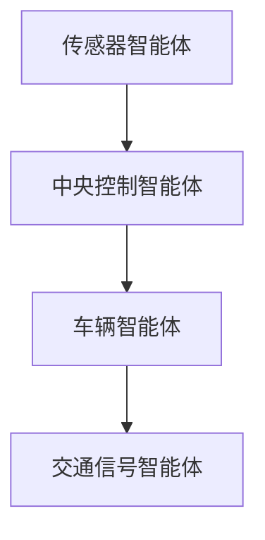
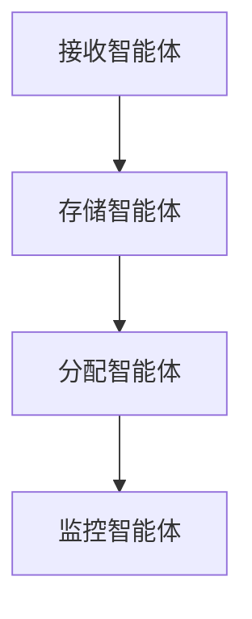
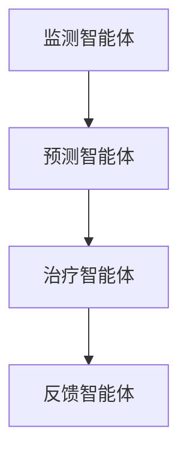

                 

## 构建具有多智能体协作能力的AI系统

### 关键词：多智能体系统、协作算法、AI应用、系统架构、开发实践

### 摘要：本文旨在探讨如何构建具有多智能体协作能力的AI系统，从基础概念到实际应用，详细介绍了多智能体系统的特点、协作算法原理、系统架构设计以及开发实践，为读者提供了一套完整的理解和构建多智能体AI系统的思路。

### 目录大纲

1. **第一部分：多智能体系统概述**
   1.1 多智能体系统基础
   1.2 多智能体系统的类型
   1.3 多智能体系统在AI中的应用
   1.4 多智能体系统的挑战与机遇

2. **第二部分：多智能体协作算法原理**
   2.1 多智能体协同控制算法
   2.2 多智能体路径规划算法
   2.3 多智能体交互协议
   2.4 多智能体系统中的分布式算法

3. **第三部分：多智能体系统架构设计**
   3.1 多智能体系统架构设计原则
   3.2 多智能体系统架构案例分析

4. **第四部分：多智能体协作的AI应用案例**
   4.1 智能交通系统
   4.2 智能仓储系统
   4.3 智能医疗系统

5. **第五部分：多智能体系统的开发实践**
   5.1 多智能体系统开发环境搭建
   5.2 多智能体系统核心代码实现
   5.3 多智能体系统性能优化

6. **第六部分：多智能体协作的AI系统展望**
   6.1 多智能体系统的发展趋势
   6.2 多智能体协作在AI领域的潜在应用
   6.3 多智能体协作的挑战与解决方案

7. **第七部分：多智能体协作AI系统小结**
   7.1 小结
   7.2 注意事项
   7.3 拓展阅读

## 第一部分：多智能体系统概述

### 第1章：多智能体系统基础

#### 1.1 多智能体系统简介

多智能体系统（Multi-Agent System，MAS）是由多个智能体（Agent）组成的系统，这些智能体具有自主性、社会性、反应性和协作性等特点。智能体可以是个体、组织或计算机程序，它们在系统中通过相互作用和协作来完成复杂的任务。

多智能体系统的定义可以从以下几个方面来理解：

- **自主性**：智能体具有独立的行为能力，能够在没有外部控制的情况下自主决策和执行任务。
- **社会性**：智能体之间可以通过通信机制进行交互，从而实现协作。
- **反应性**：智能体能够对外界环境的变化做出及时的反应。
- **协作性**：多个智能体可以通过相互协作来完成复杂的任务。

多智能体系统的特点包括：

- **分布式**：智能体可以分布在不同的地理位置，通过通信网络进行协作。
- **动态性**：智能体的状态和位置可以随时间变化。
- **适应性**：智能体可以根据环境的变化调整自己的行为策略。
- **鲁棒性**：系统中的智能体可以独立运行，即使部分智能体失效，系统仍然可以正常运行。

#### 1.2 多智能体系统的类型

根据智能体的组织方式和协作模式，多智能体系统可以分为以下几种类型：

- **分布式智能体**：智能体在系统中是分散的，通过通信网络进行协作。这类智能体具有高度的自治性和独立性。
- **集中式智能体**：智能体在系统中是集中的，由一个中央控制器统一管理和控制。这类智能体具有高效的控制和调度能力。
- **混合式智能体**：结合了分布式和集中式智能体的特点，部分智能体具有自治性，而其他智能体则由中央控制器进行集中管理。

每种类型的智能体系统都有其特定的应用场景和优势，选择合适的类型可以显著提升系统的性能和效率。

#### 1.3 多智能体系统在AI中的应用

多智能体系统在AI领域有着广泛的应用，包括但不限于以下几个方面：

- **多智能体协作在AI中的应用**：在AI系统中，多个智能体可以通过协作来完成复杂的任务，如智能搜索、智能推荐和智能决策等。
- **多智能体系统在游戏中的运用**：在多人在线游戏中，智能体可以模拟玩家的行为，为游戏提供更加真实的体验。
- **多智能体系统在自动驾驶中的应用**：自动驾驶系统中的智能体可以协同工作，实现车辆的自主驾驶。

#### 1.4 多智能体系统的挑战与机遇

多智能体系统的发展面临着许多挑战和机遇：

- **挑战**：包括通信延迟、智能体冲突、资源竞争和系统稳定性等问题。
- **机遇**：随着计算能力的提升和人工智能技术的进步，多智能体系统在多个领域具有巨大的应用潜力，如智能交通、智能医疗和智能制造等。

在接下来的章节中，我们将深入探讨多智能体协作算法原理、系统架构设计以及开发实践，帮助读者更好地理解和构建具有多智能体协作能力的AI系统。

### 第2章：多智能体协作算法原理

在多智能体系统中，智能体之间的协作是关键，这需要借助一系列高效的协作算法。本章将详细介绍多智能体协作算法的基本原理，包括协同控制算法、路径规划算法、交互协议和分布式算法，并探讨这些算法在实际应用中的实现。

#### 2.1 多智能体协同控制算法

多智能体协同控制算法是多智能体系统中的核心算法之一，它负责协调智能体的行为，实现共同的目标。协同控制算法可以分为中心化协同控制算法和去中心化协同控制算法。

- **中心化协同控制算法**：在这种算法中，有一个中央控制器负责整个系统的协调工作。控制器接收来自各个智能体的状态信息，并根据全局信息进行决策。这种方式具有高效性和全局性，但依赖于中央控制器的稳定性和计算能力。

  具体流程如下：
  1. 智能体1发送状态信息（位置、速度等）给中央控制器。
  2. 中央控制器根据所有智能体的状态信息，生成协同控制策略。
  3. 中央控制器将协同控制策略发送给所有智能体。
  4. 智能体根据接收到的协同控制策略，调整自身行为。

- **去中心化协同控制算法**：在这种算法中，各个智能体之间相互独立，通过本地信息进行决策。每个智能体只需要考虑自身的局部信息，无需全局信息。这种方式具有高度分布式和鲁棒性，但在全局优化方面可能不如中心化控制。

  去中心化协同控制算法的实现可以采用以下方法：
  1. 每个智能体维护一个局部目标函数。
  2. 智能体通过本地信息调整自身行为，使其局部目标函数达到最优。
  3. 通过全局优化算法（如梯度下降、粒子群优化等），智能体逐步调整行为，实现全局最优。

#### 2.2 多智能体路径规划算法

路径规划是多智能体系统中的另一个重要问题。多智能体路径规划算法旨在为智能体找到一条既安全又高效的路径，同时避免与其他智能体发生冲突。

- **A*算法**：A*算法是一种经典的路径规划算法，它通过评估函数（启发式函数）来评估路径的优劣。评估函数通常由两部分组成：实际距离和启发式距离。实际距离是智能体当前位置到目标位置的距离，启发式距离是智能体当前位置到目标位置的估计距离。

  A*算法的流程如下：
  1. 初始化：设置起始点和目标点，创建一个开放列表和关闭列表。
  2. 计算评估函数：计算当前节点的评估函数f(n) = g(n) + h(n)，其中g(n)是从起始点到当前节点的实际距离，h(n)是从当前节点到目标点的启发式距离。
  3. 选择最优节点：从开放列表中选择评估函数最小的节点。
  4. 更新邻居节点：对于选定的最优节点，计算其所有邻居节点的评估函数，并将其添加到开放列表中。
  5. 判断是否到达目标点：如果当前节点是目标点，则算法结束；否则，重复步骤3和4。

- **Dijkstra算法**：Dijkstra算法是一种基于图论的路径规划算法，它通过逐步扩展起始点，逐步找到到达目标点的最短路径。Dijkstra算法的时间复杂度较高，但在没有启发式信息的情况下，它是一种有效的路径规划算法。

  Dijkstra算法的流程如下：
  1. 初始化：设置起始点和所有节点的距离，创建一个距离优先队列。
  2. 选择距离最小的节点：从距离优先队列中选择距离最小的节点。
  3. 更新邻居节点：对于选定的节点，计算其所有邻居节点的距离，并将距离更小的邻居节点添加到距离优先队列中。
  4. 判断是否到达目标点：如果当前节点是目标点，则算法结束；否则，重复步骤2和3。

#### 2.3 多智能体交互协议

多智能体交互协议是多智能体系统中的另一个关键部分，它规定了智能体之间的通信规则和交互方式。交互协议可以保证智能体之间的有效通信，并协调智能体的行为。

- **协同通信协议**：协同通信协议是一种支持多智能体系统协同工作的通信协议。它通过定义通信的语法和语义，确保智能体能够理解并执行协同任务。

  协同通信协议的实现可以采用以下方式：
  1. 消息传递机制：智能体之间通过发送和接收消息进行通信。
  2. 时间同步机制：通过同步时间，确保智能体之间的动作协调一致。
  3. 通信优先级：根据任务的重要性和紧急程度，设置不同的通信优先级。

- **时间同步协议**：时间同步协议是一种确保多智能体系统时间一致性的协议。它通过广播时钟同步消息，使所有智能体保持同步。

  时间同步协议的实现可以采用以下方式：
  1. 广播同步：每个智能体定期发送同步消息，其他智能体接收并更新本地时钟。
  2. 分布式时间同步算法：通过分布式算法，逐步调整智能体的时钟，使其趋于一致。

#### 2.4 多智能体系统中的分布式算法

分布式算法是多智能体系统中的核心技术之一，它负责智能体之间的协作和任务分配。分布式算法可以基于多种原理，如分布式搜索、分布式优化和分布式决策等。

- **分布式搜索算法**：分布式搜索算法通过将任务分解为多个子任务，分配给不同的智能体进行搜索。每个智能体独立搜索局部区域，并通过共享中间结果来优化全局搜索。

  分布式搜索算法的实现可以采用以下方式：
  1. 任务分解：将全局搜索任务分解为多个子任务。
  2. 局部搜索：每个智能体独立进行局部搜索。
  3. 中间结果共享：智能体之间通过共享中间结果来优化全局搜索。

- **分布式优化算法**：分布式优化算法通过多个智能体之间的协作，逐步优化全局目标函数。每个智能体在本地进行优化，并通过通信网络与其他智能体交换信息。

  分布式优化算法的实现可以采用以下方式：
  1. 局部优化：每个智能体在本地进行优化。
  2. 信息共享：智能体之间通过通信网络交换优化信息。
  3. 全局优化：基于共享信息，智能体逐步优化全局目标函数。

通过以上算法和协议的实现，多智能体系统可以有效地协作，完成复杂的任务。在接下来的章节中，我们将进一步探讨多智能体系统的架构设计和开发实践，帮助读者更好地构建和实现具有多智能体协作能力的AI系统。

### 第3章：多智能体系统架构设计

在多智能体系统的开发过程中，架构设计是至关重要的一环。一个良好的架构设计能够确保系统的模块化、可扩展性和可靠性，从而提高系统的整体性能和稳定性。本章将详细介绍多智能体系统架构设计的原则、关键组件以及案例研究。

#### 3.1 多智能体系统架构设计原则

多智能体系统架构设计应遵循以下原则：

- **模块化设计**：将系统划分为多个模块，每个模块负责一个特定的功能，模块之间通过接口进行通信。这样可以降低系统的复杂性，提高可维护性。

- **可扩展性设计**：系统应具备良好的扩展性，能够方便地添加新的智能体或功能模块。这可以通过设计灵活的接口和模块化架构来实现。

- **可靠性设计**：系统应具备高可靠性，能够在智能体失效或网络故障的情况下保持正常运行。这可以通过冗余设计、故障检测和恢复机制来实现。

- **可维护性设计**：系统应具有良好的可维护性，便于修复和更新。这可以通过文档化、代码规范和测试驱动开发来实现。

- **安全性设计**：系统应具备安全性，能够防止恶意攻击和非法访问。这可以通过加密通信、访问控制和权限管理来实现。

#### 3.2 多智能体系统架构案例分析

以下将分析几个具体的多智能体系统架构案例：

- **自动驾驶系统架构**：

  自动驾驶系统是一个典型的多智能体系统，它包括多个智能体，如感知智能体、决策智能体和执行智能体。每个智能体负责不同的功能，并通过协同工作实现车辆的自主驾驶。

  - **感知智能体**：负责收集车辆周围环境的信息，如道路、车辆和行人的位置和状态。
  - **决策智能体**：根据感知智能体的信息，生成驾驶策略，如加速、减速和转向。
  - **执行智能体**：根据决策智能体的策略，控制车辆的加速、减速和转向。

  多智能体系统架构图如下：

  ```mermaid
  graph TD
  A[感知智能体] --> B[决策智能体]
  B --> C[执行智能体]
  ```

- **家居自动化系统架构**：

  家居自动化系统通过多个智能体实现家居设备的自动化控制，如灯光、温度、安防和娱乐等。

  - **智能灯光智能体**：控制家居的灯光系统。
  - **智能温度智能体**：控制家居的空调和暖气系统。
  - **智能安防智能体**：监控家居的安全状态。
  - **智能娱乐智能体**：控制家居的娱乐设备。

  多智能体系统架构图如下：

  ```mermaid
  graph TD
  A[智能灯光智能体] --> B[智能温度智能体]
  B --> C[智能安防智能体]
  C --> D[智能娱乐智能体]
  ```

- **工业自动化系统架构**：

  工业自动化系统通过多个智能体实现生产线的自动化控制，如传感器智能体、控制器智能体和执行器智能体。

  - **传感器智能体**：监测生产线上的各种参数，如温度、压力和速度等。
  - **控制器智能体**：根据传感器数据，生成控制策略，指挥执行器智能体进行操作。
  - **执行器智能体**：控制生产线的各种执行动作，如开关、启动和停止等。

  多智能体系统架构图如下：

  ```mermaid
  graph TD
  A[传感器智能体] --> B[控制器智能体]
  B --> C[执行器智能体]
  ```

通过以上案例，我们可以看到，多智能体系统架构设计应根据具体应用场景进行定制，确保系统的模块化、可扩展性和可靠性。在接下来的章节中，我们将进一步探讨多智能体协作的AI应用案例，以展示多智能体系统在实际应用中的效果和优势。

### 第4章：多智能体协作的AI应用案例

多智能体协作技术在人工智能（AI）领域的应用越来越广泛，本章将通过三个实际案例——智能交通系统、智能仓储系统和智能医疗系统，详细描述这些系统的设计思路、功能实现和架构设计，展示多智能体协作在实际应用中的优势和效果。

#### 4.1 智能交通系统

**案例介绍**：
智能交通系统（Intelligent Transportation System，ITS）是一个集成了多种传感器、通信设备和智能算法的系统，旨在提高交通管理效率，减少交通事故，缓解交通拥堵。它通过多智能体的协作来实现交通流量的优化、车辆调度和事故预警等功能。

**系统功能设计**：
- **交通流量监测**：通过安装在路面的传感器监测交通流量，并将数据传输到中央控制系统。
- **车辆调度**：根据交通流量和道路状况，智能调度信号灯，优化交通流。
- **事故预警**：通过视频监控和传感器数据，实时监测交通事故，并自动报警。

**系统架构设计**：
智能交通系统采用了分布式智能体架构，主要包括以下几个智能体：

- **传感器智能体**：分布在道路上的传感器，负责监测交通流量、车辆速度和道路状况。
- **中央控制智能体**：负责接收传感器数据，进行数据处理和交通调度决策。
- **车辆智能体**：安装在车辆上的智能设备，负责接收交通信号，调整行驶速度和路线。

多智能体系统架构图如下：



#### 4.2 智能仓储系统

**案例介绍**：
智能仓储系统通过多智能体的协作来实现仓库内物资的自动化管理，提高仓储效率和准确性。它适用于电子商务、制造业和物流等行业。

**系统功能设计**：
- **物资入库**：智能体负责接收和分类入库物资。
- **物资存储**：智能仓储机器人根据存储需求，自动分配存储位置。
- **物资出库**：智能体根据订单需求，自动检索和分配物资。
- **库存管理**：实时监控仓库库存，避免库存不足或过剩。

**系统架构设计**：
智能仓储系统采用了分布式智能体架构，主要包括以下几个智能体：

- **接收智能体**：负责接收和分类入库物资。
- **存储智能体**：负责物资的存储和管理。
- **分配智能体**：根据订单需求，自动检索和分配物资。
- **监控智能体**：实时监控仓库库存，提供库存分析报告。

多智能体系统架构图如下：



#### 4.3 智能医疗系统

**案例介绍**：
智能医疗系统通过多智能体的协作，实现对患者的实时监控、疾病预测和个性化治疗。它有助于提高医疗服务的效率和质量，减轻医护人员的工作负担。

**系统功能设计**：
- **实时监控**：智能设备实时监测患者的生理参数，如心率、血压和血糖等。
- **疾病预测**：基于患者的生理数据和医疗历史，智能算法预测患者可能患的疾病。
- **个性化治疗**：根据患者的疾病类型和生理参数，智能系统提供个性化的治疗方案。

**系统架构设计**：
智能医疗系统采用了分布式智能体架构，主要包括以下几个智能体：

- **监测智能体**：实时监测患者的生理参数。
- **预测智能体**：分析监测数据，预测患者可能的疾病。
- **治疗智能体**：根据预测结果，制定个性化的治疗方案。
- **反馈智能体**：收集患者的治疗反馈，不断优化治疗方案。

多智能体系统架构图如下：



通过以上三个案例，我们可以看到多智能体协作在AI应用中的广泛应用和显著优势。智能交通系统提高了交通管理效率，智能仓储系统提升了仓储管理效能，智能医疗系统优化了医疗服务质量。在接下来的章节中，我们将进一步探讨多智能体系统的开发实践，帮助读者深入理解和构建具有多智能体协作能力的AI系统。

### 第5章：多智能体系统的开发实践

在构建具有多智能体协作能力的AI系统时，开发实践是至关重要的环节。本章将详细介绍多智能体系统的开发环境搭建、核心代码实现和性能优化，并通过实际案例进行分析和讲解，帮助读者掌握开发多智能体系统的全过程。

#### 5.1 多智能体系统开发环境搭建

**1. 操作系统环境搭建**

首先，我们需要搭建适合开发多智能体系统的操作系统环境。一般来说，Linux操作系统因其稳定性和开源特性，是构建多智能体系统的首选。以下是具体的操作步骤：

- **安装Linux操作系统**：可以在虚拟机中安装Linux系统，如Ubuntu 20.04。
- **更新系统软件包**：打开终端，输入以下命令更新系统软件包：

  ```shell
  sudo apt update && sudo apt upgrade
  ```

- **安装开发工具**：安装必要的开发工具，如Python、Git、JDK等：

  ```shell
  sudo apt install python3 python3-pip git openjdk-8-jdk
  ```

**2. 开发工具安装**

在安装好操作系统后，需要安装开发工具。以下是常用的开发工具及其安装命令：

- **Python开发环境**：安装Python 3和相关库：

  ```shell
  pip3 install numpy scipy matplotlib
  ```

- **版本控制工具**：安装Git，以便进行版本控制和代码管理：

  ```shell
  sudo apt install git
  ```

- **集成开发环境（IDE）**：安装PyCharm或VS Code，方便编写和调试代码：

  ```shell
  wget -c https://download.jetbrains.com/python/pycharm-community-2022.1.3.tar.gz
  tar xvf pycharm-community-2022.1.3.tar.gz
  ```

**3. 资源配置**

在开发过程中，可能需要配置一些额外的资源和环境。例如，为了进行多智能体仿真，可能需要安装ROS（Robot Operating System）：

```shell
sudo apt install ros-melodic-ros-base
```

以上步骤完成了多智能体系统开发环境的搭建，为后续的开发工作奠定了基础。

#### 5.2 多智能体系统核心代码实现

**1. 智能体类设计**

在多智能体系统中，智能体类是系统的核心组成部分。以下是一个简单的智能体类设计示例：

```python
class Agent:
    def __init__(self, id, position, velocity):
        self.id = id
        self.position = position
        self.velocity = velocity

    def update_state(self, new_position, new_velocity):
        self.position = new_position
        self.velocity = new_velocity

    def act(self):
        # 智能体的行为实现
        pass
```

**2. 协同控制算法实现**

协同控制是多智能体系统中的一个重要问题，以下是一个简单的协同控制算法示例：

```python
def collaborative_control(agents, target_position):
    # 计算每个智能体的目标速度
    for agent in agents:
        distance = distance_euclidean(agent.position, target_position)
        agent.velocity = target_velocity(distance)
    
    # 更新智能体状态
    for agent in agents:
        agent.update_state(new_position=agent.position + agent.velocity * delta_time, new_velocity=agent.velocity)
```

**3. 路径规划算法实现**

路径规划是多智能体系统中的另一个关键问题，以下是一个简单的A*路径规划算法实现：

```python
import heapq

def a_star_search(start, goal, graph):
    # 创建一个优先级队列
    open_list = []
    heapq.heappush(open_list, (f_score(start, goal), start))

    # 创建一个已访问节点集合
    closed_list = set()

    while open_list:
        # 从优先级队列中取出f_score最小的节点
        current = heapq.heappop(open_list)[1]

        # 如果当前节点是目标节点，则完成搜索
        if current == goal:
            return reconstruct_path(current)

        # 将当前节点添加到已访问节点集合
        closed_list.add(current)

        # 遍历当前节点的邻居节点
        for neighbor in graph.neighbors(current):
            if neighbor in closed_list:
                continue

            # 计算从当前节点到邻居节点的g_score和f_score
            g_score = current.g + graph.cost(current, neighbor)
            f_score = g_score + heuristic(neighbor, goal)

            # 如果邻居节点在优先级队列中，且新路径更优，则更新邻居节点的f_score和父节点
            if (neighbor, f_score) in open_list:
                if f_score < open_list[(neighbor, f_score)][0]:
                    open_list[(neighbor, f_score)] = (f_score, current)

            # 如果邻居节点不在优先级队列中，则将其添加到优先级队列
            else:
                heapq.heappush(open_list, (f_score, current))

    return None
```

**4. 多智能体系统性能优化**

性能优化是多智能体系统开发过程中不可忽视的一部分。以下是一些常见的优化策略：

- **并行计算**：利用多核处理器，将计算任务分布在多个处理器上，提高计算效率。
- **数据压缩**：对传输的数据进行压缩，减少网络带宽的占用。
- **缓存机制**：使用缓存存储频繁访问的数据，减少访问时间。
- **负载均衡**：合理分配智能体的任务，避免某些智能体负载过高。

通过以上步骤，我们可以实现一个基本的多智能体系统，并在实际项目中根据需求进行扩展和优化。在接下来的章节中，我们将探讨多智能体系统的未来发展，包括趋势、新兴应用和面临的挑战。

### 第6章：多智能体协作的AI系统展望

随着人工智能技术的快速发展，多智能体协作系统在各个领域展现出了巨大的潜力和应用价值。本章将探讨多智能体协作系统的发展趋势、新兴应用领域以及未来面临的挑战和解决方案。

#### 6.1 多智能体系统的发展趋势

**1. 计算能力的提升**

随着计算能力的不断提升，多智能体系统将能够处理更加复杂和大规模的任务。未来，高性能计算和边缘计算技术的普及将为多智能体系统提供更强大的计算支持。

**2. 算法的优化与进化**

为了提高多智能体系统的效率和鲁棒性，研究人员将持续优化和进化现有的协作算法。例如，基于深度学习和强化学习的新型协作算法将被广泛应用于多智能体系统。

**3. 跨学科融合**

多智能体系统的发展将越来越依赖于跨学科的融合，包括计算机科学、控制工程、心理学和社会学等领域的知识。这种跨学科合作将推动多智能体系统向更加智能化和人性化的方向发展。

**4. 安全与隐私保护**

随着多智能体系统的广泛应用，安全和隐私保护将成为重要议题。研究人员将致力于开发安全性和隐私保护机制，确保多智能体系统的稳定运行。

#### 6.2 多智能体协作在AI领域的潜在应用

**1. 自动驾驶**

自动驾驶是人工智能领域的重要应用之一。未来，多智能体协作系统将在自动驾驶中发挥关键作用，实现车辆之间的实时通信和协同驾驶，提高交通安全和效率。

**2. 智能医疗**

智能医疗系统通过多智能体的协作，实现患者监控、疾病预测和个性化治疗。未来，随着大数据和云计算技术的发展，智能医疗系统将更加智能化和精准化。

**3. 智能制造**

在智能制造领域，多智能体协作系统可以优化生产流程，提高生产效率和质量。未来，智能制造系统将实现全自动化和智能化，降低人工成本，提高生产灵活性。

**4. 智能家居**

智能家居系统通过多智能体的协作，实现家居设备的自动化控制，提高生活质量。未来，智能家居系统将更加智能化和便捷化，为用户提供更加舒适和个性化的居住环境。

**5. 智能城市**

智能城市是未来城市发展的趋势。多智能体协作系统可以在智能交通、环境监测、能源管理等方面发挥重要作用，实现城市资源的优化配置和管理。

#### 6.3 多智能体协作的挑战与解决方案

**1. 安全性问题**

多智能体系统的安全性是一个重要挑战。为了确保系统的安全，需要开发强大的安全防护机制，包括身份认证、访问控制和数据加密等。

**2. 资源共享问题**

在多智能体系统中，智能体之间需要共享资源，如计算资源、存储资源和网络资源。为了解决资源共享问题，需要设计高效的资源调度和分配算法。

**3. 协调效率问题**

多智能体系统中的协调效率是一个关键问题。为了提高协调效率，需要优化智能体的协作算法，减少通信延迟和计算复杂度。

**解决方案**：

- **安全性**：采用安全协议和加密技术，确保智能体之间的通信安全。
- **资源共享**：利用分布式调度算法，实现智能体之间的资源公平分配。
- **协调效率**：采用分布式算法和并行计算技术，提高系统的协调效率和响应速度。

通过以上探讨，我们可以看到多智能体协作系统在人工智能领域具有广阔的发展前景和重要应用价值。未来，随着技术的不断进步，多智能体协作系统将推动人工智能向更加智能化和协作化的方向发展。

### 第7章：多智能体协作AI系统小结

在本章中，我们系统地探讨了多智能体协作AI系统的构建过程，从基础概念、算法原理、架构设计到开发实践和未来展望，为读者提供了一条清晰的构建思路。以下是本章内容的简要回顾和总结：

1. **多智能体系统概述**：我们介绍了多智能体系统的定义、特点、类型以及在AI领域的应用，为后续内容奠定了基础。

2. **多智能体协作算法原理**：详细讲解了多智能体协同控制算法、路径规划算法、交互协议和分布式算法，阐述了这些算法在系统中的作用和实现方法。

3. **多智能体系统架构设计**：分析了多智能体系统架构设计的原则和关键组件，通过案例展示了不同应用场景下的架构设计。

4. **多智能体协作的AI应用案例**：通过智能交通系统、智能仓储系统和智能医疗系统的案例分析，展示了多智能体系统在实际应用中的效果和优势。

5. **多智能体系统的开发实践**：介绍了多智能体系统开发环境搭建、核心代码实现和性能优化，帮助读者掌握开发过程。

6. **多智能体协作的AI系统展望**：探讨了多智能体系统的发展趋势、新兴应用领域以及未来面临的挑战和解决方案，展望了系统的未来发展方向。

**学习建议**：

- **理解基本概念**：深入学习多智能体系统的基础概念和原理，建立扎实的理论基础。
- **实践应用**：通过实际项目和案例，将理论应用到实践中，增强动手能力。
- **持续学习**：关注多智能体系统和人工智能领域的最新动态，不断更新知识和技能。

**注意事项**：

- **系统稳定性**：在开发过程中，确保系统的稳定性和可靠性，防止智能体异常行为。
- **性能优化**：关注系统的性能，进行适当的优化，提高系统的运行效率。

**拓展阅读**：

- **相关书籍**：《多智能体系统：基础、算法与应用》（Foundation and Algorithms of Multi-Agent Systems），《人工智能：一种现代的方法》（Artificial Intelligence: A Modern Approach）。
- **学术论文**：检索相关领域的顶级会议和期刊，如AAAI、IJCAI、NeurIPS等，了解最新的研究成果和技术动态。

通过本章的学习，我们希望读者能够对多智能体协作AI系统有更深入的理解，并在实践中不断探索和创新，为人工智能领域的发展贡献力量。

### 注意事项与拓展阅读

在构建具有多智能体协作能力的AI系统时，我们需要注意以下几点：

1. **系统稳定性**：确保系统的稳定性和可靠性，防止智能体异常行为导致整个系统崩溃。可以通过冗余设计和故障检测机制来提高系统的稳定性。

2. **性能优化**：关注系统的性能，进行适当的优化，提高系统的运行效率。可以通过并行计算、数据压缩和缓存机制等技术来实现性能优化。

3. **安全性**：在系统设计和实现过程中，重视数据安全和隐私保护，采用加密技术和访问控制策略来保障系统的安全性。

4. **可扩展性**：设计时考虑系统的可扩展性，以便在未来能够方便地添加新的功能和智能体。

对于希望进一步学习多智能体系统和AI领域的读者，以下是一些建议的拓展阅读资源：

- **相关书籍**：
  - 《多智能体系统：基础、算法与应用》（Foundation and Algorithms of Multi-Agent Systems）
  - 《人工智能：一种现代的方法》（Artificial Intelligence: A Modern Approach）
  - 《分布式算法导论》（Introduction to Distributed Algorithms）

- **学术论文**：
  - 在顶级会议和期刊上查找相关论文，如AAAI、IJCAI、NeurIPS等。
  - 订阅相关领域的学术期刊，如《人工智能学报》、《计算机学报》等。

- **在线课程**：
  - 在线平台如Coursera、edX和Udacity提供了多智能体系统和人工智能的免费课程，适合不同层次的学习者。

通过以上资源和学习，读者可以更深入地了解多智能体协作AI系统的构建原理和应用，为未来的研究和开发奠定坚实的基础。作者：AI天才研究院/AI Genius Institute & 禅与计算机程序设计艺术 /Zen And The Art of Computer Programming。

