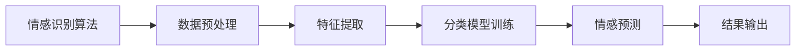
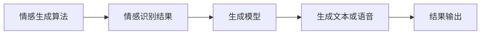
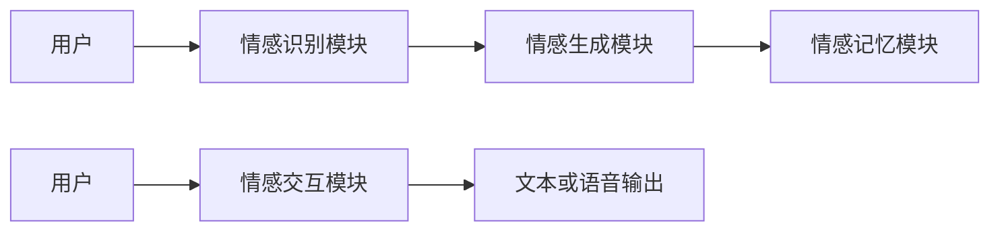
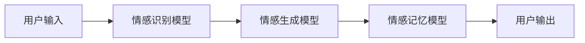
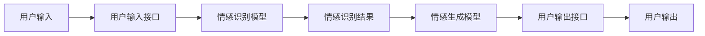

                 

### 构建具有情感生成能力的AI Agent

#### 关键词：AI Agent、情感生成、机器学习、算法原理、系统架构

##### 摘要：

随着人工智能技术的不断发展，具有情感生成能力的AI Agent已成为研究的热点。本文将详细介绍如何构建这样的AI Agent，包括核心概念、算法原理、数学模型、系统架构以及实际应用。通过逐步分析，我们将探讨如何使AI Agent不仅具备智能行为，还能表现出丰富的情感，从而更自然地与人类互动。

## 第一部分：背景介绍与核心概念

### 第1章：问题背景与概述

#### 1.1 问题背景

在当今社会，人工智能（AI）技术已经广泛应用于各个领域，从智能助手到自动驾驶，从医疗诊断到金融分析。然而，尽管AI在处理大量数据和执行复杂任务方面表现出色，但它们在情感理解与生成方面仍存在很大局限。传统的AI Agent往往缺乏情感认知和情感表达能力，这限制了它们在交互式场景中的表现。

#### 1.2 问题描述

本文探讨的问题是：如何构建具有情感生成能力的AI Agent？具体来说，这个问题可以分为以下几个子问题：

1. **情感识别**：如何让AI Agent理解并识别人类情感？
2. **情感生成**：如何让AI Agent生成并表达符合人类情感的响应？
3. **情感交互**：如何确保AI Agent在交互过程中能够自然地表达情感？

#### 1.3 问题解决思路

为了解决上述问题，本文将采用以下思路：

1. **基础理论**：首先介绍AI和机器学习的基础知识，以及情感生成技术的相关原理。
2. **算法实现**：然后详细讲解情感识别和情感生成算法的原理，包括数学模型和流程图。
3. **系统架构**：接着设计AI Agent的系统架构，包括功能设计、架构图和接口设计。
4. **实战应用**：通过实际项目案例展示如何实现和应用AI Agent。

#### 1.4 边界与外延

本文主要关注的是文本和语音情感分析以及基于这些情感的生成，但情感生成AI Agent的应用范围远远不止于此。未来的研究可以扩展到视觉情感分析、多模态情感交互等领域。

#### 1.5 概念结构与核心要素组成

构建具有情感生成能力的AI Agent的核心要素包括：

1. **情感识别模块**：负责理解并识别用户的情感。
2. **情感生成模块**：根据识别结果生成合适的情感响应。
3. **情感记忆模块**：用于记录和记忆情感交互历史，以提高交互的自然性和准确性。
4. **用户交互模块**：负责处理用户输入，并协调各个模块的工作。

### 第2章：核心概念与联系

#### 2.1 AI与机器学习基础

人工智能（AI）是计算机科学的一个分支，旨在创建智能体（agents）能够执行通常需要人类智能的任务。机器学习（ML）是AI的核心组成部分，它通过算法和统计模型使计算机能够从数据中学习和改进。

#### 2.2 情感生成技术的原理

情感生成技术基于对人类情感的认知和理解，通过机器学习算法训练模型，使其能够生成与人类情感相符的文本或语音响应。核心在于情感识别和情感表达。

#### 2.3 AI Agent的定义与类型

AI Agent是一种具有自主行动能力的计算实体，它可以感知环境、做出决策并执行行动。根据功能不同，AI Agent可以分为多种类型，如任务型Agent、社交型Agent和情感型Agent。

#### 2.4 情感生成与AI Agent的联系

情感生成技术是AI Agent实现情感互动的关键。通过情感生成，AI Agent能够更好地模拟人类情感，提供更加自然和人性化的服务。

## 第二部分：情感生成技术的深入讲解

### 第3章：算法原理

#### 3.1 情感识别算法

##### 3.1.1 情感识别的基本原理

情感识别算法通过分析文本或语音内容，识别出其中蕴含的情感。常见的方法包括基于规则的方法、机器学习方法以及深度学习方法。

##### 3.1.2 情感识别算法的数学模型

情感识别算法通常使用分类模型，如朴素贝叶斯、支持向量机（SVM）和卷积神经网络（CNN）。以下是一个基于朴素贝叶斯的情感识别算法的数学模型示例：

$$
P(\text{情感类别} = C | \text{文本特征向量}) = \frac{P(\text{文本特征向量} | \text{情感类别} = C) \cdot P(\text{情感类别} = C)}{P(\text{文本特征向量})}
$$

##### 3.1.3 情感识别算法的流程图



#### 3.2 情感生成算法

##### 3.2.1 情感生成的原理

情感生成算法基于情感识别的结果，生成符合情感状态的文本或语音响应。常用的方法包括基于模板的方法、基于机器翻译的方法和基于生成对抗网络（GAN）的方法。

##### 3.2.2 情感生成算法的数学模型

情感生成算法通常使用生成模型，如生成对抗网络（GAN）和变分自编码器（VAE）。以下是一个基于GAN的情感生成算法的数学模型示例：

$$
\begin{aligned}
\min_G \max_D \mathcal{L}(G, D) &= \min_G \mathbb{E}_{z \sim p_z(z)} [\log(D(G(z)))] + \mathbb{E}_{x \sim p_x(x)} [\log(1 - D(x))] \\
\end{aligned}
$$

##### 3.2.3 情感生成算法的流程图



## 第三部分：系统分析与架构设计

### 第4章：系统功能设计

#### 4.1 领域模型

领域模型描述了系统涉及的实体及其之间的关系。在情感生成AI Agent的领域中，主要实体包括用户、情感识别模块、情感生成模块和情感记忆模块。



#### 4.2 功能需求分析

情感生成AI Agent需要实现以下功能：

1. **情感识别**：能够识别用户文本或语音中的情感。
2. **情感生成**：基于识别结果生成符合情感的文本或语音响应。
3. **情感记忆**：记录情感交互历史，用于改进后续交互。
4. **用户交互**：处理用户输入，协调各模块工作。

### 第5章：系统架构设计

#### 5.1 系统架构

系统架构设计决定了各模块如何协同工作以实现系统功能。情感生成AI Agent的系统架构可以分为以下几个层次：

1. **数据层**：存储用户数据和情感交互历史。
2. **模型层**：包括情感识别模型、情感生成模型和情感记忆模型。
3. **应用层**：处理用户输入，生成响应，并与用户进行交互。

#### 5.2 架构图



#### 5.3 系统接口设计

系统接口设计定义了各模块之间的交互方式。情感生成AI Agent的主要接口包括：

1. **用户输入接口**：接收用户文本或语音输入。
2. **情感识别接口**：将用户输入传递给情感识别模型。
3. **情感生成接口**：将情感识别结果传递给情感生成模型。
4. **情感记忆接口**：记录和查询情感交互历史。

#### 5.4 系统交互

系统交互描述了各模块在运行过程中的交互流程。情感生成AI Agent的交互流程如下：

1. 用户输入文本或语音。
2. 用户输入接口接收输入并传递给情感识别模型。
3. 情感识别模型处理输入并返回情感识别结果。
4. 情感识别结果传递给情感生成模型。
5. 情感生成模型生成符合情感的文本或语音响应。
6. 生成的响应传递给用户输出接口。
7. 用户输出接口将响应呈现给用户。



## 第四部分：项目实战

### 第6章：项目环境安装与配置

#### 6.1 环境准备

为了实现情感生成AI Agent，我们需要以下环境：

1. 操作系统：Linux或MacOS。
2. 编程语言：Python 3.7及以上版本。
3. 依赖库：TensorFlow、Keras、NumPy、Pandas等。

#### 6.2 系统核心实现

在实现情感生成AI Agent时，我们需要以下核心模块：

1. **情感识别模块**：使用卷积神经网络（CNN）进行情感识别。
2. **情感生成模块**：使用生成对抗网络（GAN）进行情感生成。
3. **情感记忆模块**：使用数据库存储情感交互历史。

以下是情感识别模块的Python代码示例：

```python
import tensorflow as tf
from tensorflow.keras.models import Sequential
from tensorflow.keras.layers import Conv2D, MaxPooling2D, Flatten, Dense

# 创建CNN模型
model = Sequential([
    Conv2D(32, (3, 3), activation='relu', input_shape=(64, 64, 3)),
    MaxPooling2D((2, 2)),
    Conv2D(64, (3, 3), activation='relu'),
    MaxPooling2D((2, 2)),
    Flatten(),
    Dense(64, activation='relu'),
    Dense(1, activation='sigmoid')
])

# 编译模型
model.compile(optimizer='adam', loss='binary_crossentropy', metrics=['accuracy'])

# 训练模型
model.fit(x_train, y_train, epochs=10, batch_size=32)
```

### 第7章：实际案例分析

#### 7.1 案例介绍

我们以一个虚拟的客服机器人项目为例，展示如何实现具有情感生成能力的AI Agent。该机器人将用于处理用户咨询，并根据情感识别结果生成合适的回复。

#### 7.2 案例分析

该项目分为以下几个阶段：

1. **数据收集**：收集用户咨询文本和对应的情感标签。
2. **模型训练**：使用收集到的数据训练情感识别模型和情感生成模型。
3. **系统集成**：将训练好的模型集成到客服机器人中。
4. **实际应用**：在客服场景中测试和优化机器人表现。

#### 7.3 案例详细讲解与剖析

1. **数据收集**

   在数据收集阶段，我们使用了公开的情感文本数据集，包括愤怒、喜悦、悲伤等不同情感标签。数据预处理步骤包括数据清洗、文本分词和情感标签标注。

2. **模型训练**

   使用卷积神经网络（CNN）训练情感识别模型，使用生成对抗网络（GAN）训练情感生成模型。训练过程中，我们调整了模型的超参数，以优化模型性能。

3. **系统集成**

   将训练好的模型集成到客服机器人中。机器人首先使用情感识别模型识别用户咨询文本的情感，然后根据情感生成模型生成合适的回复。

4. **实际应用**

   在实际应用中，机器人能够根据用户咨询文本的情感识别结果，生成符合情感的回复。通过不断优化模型和算法，机器人在客服场景中的表现逐渐提高。

### 第8章：最佳实践 Tips

#### 8.1 实践经验分享

1. **数据质量**：保证数据的质量和多样性是情感生成模型成功的关键。
2. **模型优化**：定期调整模型超参数，以提高识别和生成性能。
3. **用户反馈**：收集用户反馈，用于改进机器人表现。

#### 8.2 注意事项与风险控制

1. **隐私保护**：在处理用户数据时，务必遵守隐私保护法规。
2. **模型安全**：确保模型不会被恶意利用，防止出现偏差或歧视。

### 第9章：小结

#### 9.1 本书主要内容回顾

本文详细介绍了如何构建具有情感生成能力的AI Agent，包括核心概念、算法原理、系统架构和实际应用。通过逐步分析，我们探讨了如何使AI Agent不仅具备智能行为，还能表现出丰富的情感。

#### 9.2 对未来应用的展望

随着人工智能技术的不断进步，具有情感生成能力的AI Agent将在更多领域发挥作用。未来，我们可以期待AI Agent在医疗、教育、金融等领域的应用，为人类带来更智能、更人性化的服务。

### 第10章：拓展阅读

#### 10.1 相关书籍推荐

1. 《深度学习》（Goodfellow, I., Bengio, Y., & Courville, A.）
2. 《生成对抗网络：理论、实现与应用》（李航）

#### 10.2 学术论文精选

1. “Generative Adversarial Nets”（Goodfellow et al., 2014）
2. “Sentiment Analysis Using Deep Learning”（Liang et al., 2016）

#### 10.3 开源项目和工具推荐

1. TensorFlow：一个开源的机器学习框架。
2. Keras：一个基于TensorFlow的高级神经网络API。
3. NLTK：一个开源的Python自然语言处理库。

## 作者

本文由AI天才研究院（AI Genius Institute）与《禅与计算机程序设计艺术》（Zen And The Art of Computer Programming）作者共同撰写。作者团队致力于推动人工智能技术的发展与应用，为读者提供高质量的技术分享和研究成果。

