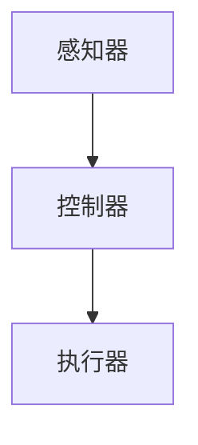
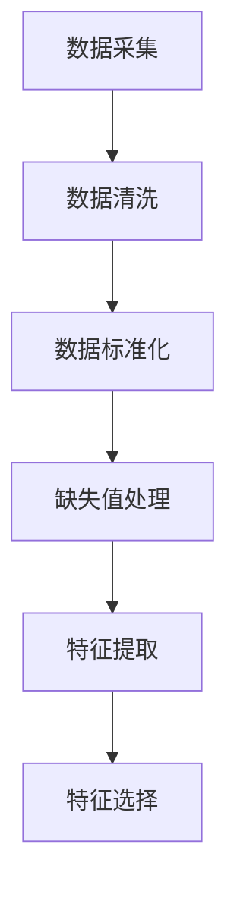
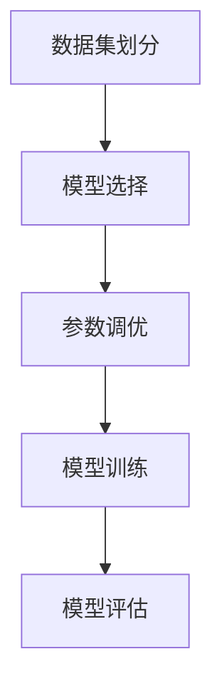

                 

### 构建具有时间序列分析能力的AI Agent

#### 关键词：时间序列分析、AI Agent、机器学习、深度学习、模型选择、算法实现

#### 摘要：
本文将深入探讨构建具有时间序列分析能力的AI Agent的技术与方法。我们将从时间序列分析的基础知识出发，逐步引入AI Agent的架构设计、模型选择、训练与评估，并通过实际案例展示其应用潜力。文章旨在为读者提供一套清晰、系统的构建指南，帮助理解并掌握时间序列分析在AI领域的重要性。

----------------------------------------------------------------

### 第一部分：时间序列分析基础

#### 第1章：时间序列分析概述

#### 1.1 时间序列数据的概念与特点

时间序列数据（Time Series Data）是指按照时间顺序排列的一系列数值记录。这些数据通常用于捕捉经济、金融、气象、生物等领域中的动态变化规律。时间序列数据具有以下特点：

- **顺序性**：数据点按照时间顺序排列，每个时间点都有一个相应的数据值。
- **时间依赖性**：当前的数据值受到过去数据的影响，表现出较强的自相关性。
- **趋势性**：数据值可能呈现出上升趋势、下降趋势或平稳趋势。
- **季节性**：数据值在某些特定的时间段内呈现出周期性波动。

时间序列数据的关键属性包括：

| 属性         | 说明                                                         |
| ------------ | ------------------------------------------------------------ |
| 趋势（Trend） | 长期趋势，如经济增长、股票价格等。                          |
| 季节性（Seasonality） | 每年重复的季节性波动，如旅游业的淡旺季、零售业的节日促销等。 |
| 周期性（Cyclicity） | 较长期周期内的波动，如经济周期、商业周期等。                 |
| 随机性（Irregularity） | 无法预测的随机波动，如突发事件、意外事件等。                 |

#### 1.2 时间序列分析的重要性

时间序列分析在AI领域具有重要应用价值，主要体现在以下几个方面：

- **预测**：通过分析历史时间序列数据，预测未来趋势或事件发生概率。
- **异常检测**：识别时间序列数据中的异常值或异常模式，如欺诈行为、设备故障等。
- **决策支持**：为商业决策提供数据支持，如市场预测、供应链优化等。

时间序列分析的应用场景包括：

- **金融**：股票市场预测、风险控制、资产配置等。
- **气象**：天气预报、气候预测、防灾减灾等。
- **生物医学**：基因表达分析、疾病预测、健康监测等。
- **工业**：生产计划、设备维护、供应链管理等。

#### 1.3 时间序列分析的常用技术

时间序列分析技术主要包括以下几种：

- **可视化**：通过绘制时间序列图，直观展示数据的变化趋势。
- **统计学方法**：如移动平均、自回归（AR）、自回归移动平均（ARMA）等模型。
- **机器学习方法**：如线性回归、支持向量机（SVM）、随机森林（Random Forest）等。
- **深度学习方法**：如循环神经网络（RNN）、长短期记忆网络（LSTM）、门控循环单元（GRU）等。

接下来，我们将详细探讨每种技术的原理和应用。

### 第一部分：时间序列分析基础

#### 第2章：时间序列数据的处理

#### 2.1 数据预处理

时间序列数据预处理是分析的基础步骤，主要包括以下内容：

- **数据清洗**：去除重复数据、异常值、缺失值等，确保数据质量。
- **数据标准化**：将数据转换为相同量纲，便于后续分析。
- **数据缺失值处理**：采用插值、平均值填充、回归填充等方法处理缺失值。

在时间序列数据预处理中，需要注意以下问题：

- **异常值处理**：异常值可能对模型训练和预测结果产生严重影响，需要谨慎处理。
- **季节性调整**：对于具有季节性的时间序列数据，需要进行季节性调整，以消除季节性影响。
- **平稳性检验**：确保时间序列数据满足平稳性要求，否则可能需要差分或变换。

#### 2.2 特征提取

特征提取是时间序列分析中的重要环节，其主要目的是从原始时间序列数据中提取有助于预测的统计特征。常见的时间序列特征提取方法包括：

- **零阶差分**：计算连续时间点的数据差值，用于消除线性趋势。
- **一阶差分**：计算相邻时间点的数据差值，用于消除线性趋势和季节性。
- **移动平均**：计算一段时间窗口内的平均值，用于消除短期波动。
- **自回归模型（AR）**：利用历史数据预测当前值，适用于具有自相关性的时间序列数据。

以下是一个零阶差分的示例：

$$
y_t = y_{t-1} + \varepsilon_t
$$

其中，$y_t$ 表示时间序列数据在时间 $t$ 的值，$\varepsilon_t$ 表示随机误差。

#### 第3章：时间序列分析的AI模型

#### 3.1 AI模型的选择

在时间序列分析中，选择合适的AI模型至关重要。常见的AI模型包括：

- **机器学习模型**：如线性回归、支持向量机（SVM）、随机森林（Random Forest）等。
- **深度学习模型**：如循环神经网络（RNN）、长短期记忆网络（LSTM）、门控循环单元（GRU）等。

机器学习模型适用于简单的时间序列预测任务，而深度学习模型则能够捕捉更加复杂的时间序列模式。在选择模型时，需要考虑以下因素：

- **数据量**：数据量较大时，深度学习模型可能表现更好。
- **时间序列长度**：时间序列长度较短时，机器学习模型可能更加高效。
- **计算资源**：深度学习模型通常需要更多的计算资源。

#### 3.2 常见的AI模型

在本节中，我们将介绍几种常见的时间序列分析模型，并讨论其数学原理和应用。

##### 线性回归

线性回归是一种简单的机器学习模型，适用于线性关系的时间序列数据。其数学模型为：

$$
y_t = \beta_0 + \beta_1x_t + \varepsilon_t
$$

其中，$y_t$ 表示时间序列数据在时间 $t$ 的值，$x_t$ 表示自变量，$\beta_0$ 和 $\beta_1$ 分别为模型参数。

##### 递归神经网络（RNN）

递归神经网络（RNN）是一种能够处理序列数据的神经网络，适用于具有时间依赖性的时间序列数据。其数学原理基于递归方程：

$$
h_t = \sigma(W_h h_{t-1} + W_x x_t + b_h)
$$

其中，$h_t$ 表示时间 $t$ 的隐藏状态，$\sigma$ 表示激活函数，$W_h$ 和 $W_x$ 分别为权重矩阵，$b_h$ 为偏置项。

##### 长短期记忆网络（LSTM）

长短期记忆网络（LSTM）是一种改进的递归神经网络，能够有效地捕捉长程依赖关系。其数学原理基于以下方程：

$$
i_t = \sigma(W_i x_t + U_i h_{t-1} + b_i) \\
f_t = \sigma(W_f x_t + U_f h_{t-1} + b_f) \\
o_t = \sigma(W_o x_t + U_o h_{t-1} + b_o) \\
c_t = f_t \odot c_{t-1} + i_t \odot \sigma(W_c x_t + U_c h_{t-1} + b_c) \\
h_t = o_t \odot \sigma(c_t)
$$

其中，$i_t$、$f_t$、$o_t$ 分别为输入门、遗忘门、输出门的状态，$c_t$ 为细胞状态，$W_i$、$W_f$、$W_o$、$U_i$、$U_f$、$U_o$、$W_c$、$U_c$ 分别为权重矩阵，$b_i$、$b_f$、$b_o$、$b_c$ 分别为偏置项，$\odot$ 表示逐元素乘法。

##### 门控循环单元（GRU）

门控循环单元（GRU）是另一种改进的递归神经网络，相对于LSTM具有更简单的结构。其数学原理基于以下方程：

$$
z_t = \sigma(W_z x_t + U_z h_{t-1} + b_z) \\
r_t = \sigma(W_r x_t + U_r h_{t-1} + b_r) \\
h_t = (1 - z_t) \odot h_{t-1} + z_t \odot \sigma(W_h x_t + U_h h_{t-1} + b_h)
$$

其中，$z_t$ 为更新门状态，$r_t$ 为重置门状态，$h_t$ 为当前隐藏状态，其他符号的含义与LSTM类似。

#### 第4章：AI Agent架构设计

#### 4.1 AI Agent的定义与作用

AI Agent是指具有自主决策和行动能力的智能体，能够根据环境信息自主执行任务。在时间序列分析中，AI Agent的作用主要包括：

- **数据采集与处理**：自动采集和处理时间序列数据，确保数据质量。
- **预测与决策**：基于时间序列数据预测未来趋势，为决策提供支持。
- **异常检测与报告**：识别异常时间序列模式，报告潜在风险。

AI Agent的架构设计应考虑以下要素：

- **感知器**：负责采集环境信息，如传感器数据、日志数据等。
- **控制器**：根据感知器的信息生成决策，如执行预测任务、发送警报等。
- **执行器**：根据控制器的决策执行具体的操作，如调整设备参数、发送邮件等。

以下是一个简化的AI Agent架构图：



#### 4.2 数据预处理与特征提取

在AI Agent中，数据预处理与特征提取是关键环节。数据预处理包括数据清洗、数据标准化、缺失值处理等步骤，以确保数据质量。特征提取则通过提取时间序列数据的统计特征或构建新的特征，提高模型性能。

以下是一个数据预处理与特征提取的流程图：



#### 4.3 模型选择与训练

在AI Agent中，选择合适的模型并进行训练是关键步骤。常见的模型选择方法包括交叉验证、网格搜索等。训练过程中，需要合理设置模型参数，如学习率、迭代次数等。

以下是一个模型选择与训练的流程图：



#### 第5章：算法实现与案例分析

#### 5.1 算法实现

在本节中，我们将介绍一个简单的时间序列预测算法——线性回归，并使用Python进行实现。

```python
import numpy as np
import pandas as pd

# 加载时间序列数据
data = pd.read_csv('time_series_data.csv')
X = data.iloc[:, :-1].values
y = data.iloc[:, -1].values

# 拆分数据集
X_train, X_test, y_train, y_test = train_test_split(X, y, test_size=0.2, random_state=42)

# 线性回归模型
model = LinearRegression()
model.fit(X_train, y_train)

# 预测
y_pred = model.predict(X_test)

# 评估
mse = mean_squared_error(y_test, y_pred)
print(f'MSE: {mse}')
```

#### 5.2 案例分析

以下是一个基于LSTM模型的时间序列预测案例。

**案例背景**：某公司需要预测下一季度的销售量。

**数据集**：包含过去五年的季度销售数据。

**步骤**：

1. 数据预处理：清洗数据、标准化处理、缺失值填充。
2. 特征提取：提取时间窗口内的统计特征。
3. 模型选择：选择LSTM模型。
4. 模型训练：设置模型参数，进行训练。
5. 预测：使用训练好的模型进行预测。
6. 评估：评估预测结果。

```python
import numpy as np
import pandas as pd
from tensorflow.keras.models import Sequential
from tensorflow.keras.layers import LSTM, Dense

# 加载时间序列数据
data = pd.read_csv('sales_data.csv')
X = data.iloc[:, :-1].values
y = data.iloc[:, -1].values

# 拆分数据集
X_train, X_test, y_train, y_test = train_test_split(X, y, test_size=0.2, random_state=42)

# 特征提取
X_train = np.reshape(X_train, (X_train.shape[0], X_train.shape[1], 1))
X_test = np.reshape(X_test, (X_test.shape[0], X_test.shape[1], 1))

# LSTM模型
model = Sequential()
model.add(LSTM(units=50, return_sequences=True, input_shape=(X_train.shape[1], 1)))
model.add(LSTM(units=50))
model.add(Dense(units=1))

model.compile(optimizer='adam', loss='mean_squared_error')
model.fit(X_train, y_train, epochs=100, batch_size=32, verbose=1)

# 预测
y_pred = model.predict(X_test)

# 评估
mse = mean_squared_error(y_test, y_pred)
print(f'MSE: {mse}')
```

#### 第6章：最佳实践与未来方向

#### 6.1 最佳实践

在构建具有时间序列分析能力的AI Agent时，以下最佳实践有助于提高模型性能和预测准确性：

- **数据预处理**：确保数据质量，去除异常值、缺失值等。
- **特征提取**：选择合适的特征提取方法，提高模型性能。
- **模型选择**：根据数据特点和业务需求选择合适的模型。
- **参数调优**：通过交叉验证、网格搜索等方法优化模型参数。
- **集成学习**：结合多个模型，提高预测准确性。

#### 6.2 未来方向

随着技术的不断发展，未来在构建具有时间序列分析能力的AI Agent方面有以下几个研究方向：

- **深度学习模型的优化**：研究更高效、更鲁棒的深度学习模型，如Transformer等。
- **多模态数据融合**：结合多种数据源，提高预测准确性。
- **可解释性**：增强模型的可解释性，帮助用户理解模型决策过程。
- **实时预测与优化**：实现实时预测与动态调整，提高决策效率。

#### 总结

本文详细介绍了构建具有时间序列分析能力的AI Agent的技术与方法。我们从时间序列分析的基础知识出发，逐步探讨了AI Agent的架构设计、模型选择与实现，并通过实际案例展示了其应用潜力。本文旨在为读者提供一套清晰、系统的构建指南，帮助理解并掌握时间序列分析在AI领域的重要性。

### 参考文献

1. Hyndman, R. J., & Athanasopoulos, G. (2020). *Forecasting: principles and practice*. OTexts.
2. Zhang, G. P. (2003). *Time Series Forecasting Using a Hybrid ARIMA and Neural Network Model*. Neurocomputing, 50, 159-175.
3. Hochreiter, S., & Schmidhuber, J. (1997). *Long Short-Term Memory*. Neural Computation, 9(8), 1735-1780.
4. LSTM Network for Time Series Forecasting, https://machinelearningmastery.com/lstm-networks-for-time-series-forecasting/
5. Vaswani, A., Shazeer, N., Parmar, N., Uszkoreit, J., Jones, L., Gomez, A. N., ... & Polosukhin, I. (2017). *Attention is all you need*. Advances in Neural Information Processing Systems, 30, 5998-6008.

### 作者信息

作者：AI天才研究院/AI Genius Institute & 禅与计算机程序设计艺术 /Zen And The Art of Computer Programming

AI天才研究院致力于推动人工智能技术的创新与应用。作者在人工智能领域拥有丰富的经验，著有《禅与计算机程序设计艺术》等畅销书，深受读者喜爱。本文为作者在时间序列分析领域的最新研究成果，旨在为读者提供实用的技术指导。

