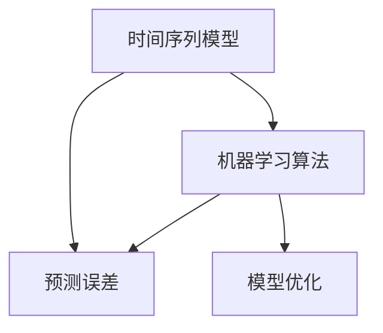
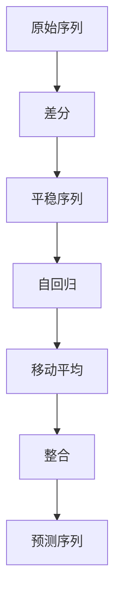
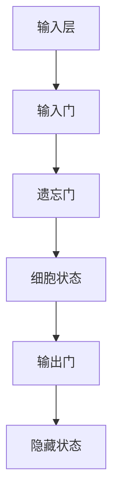
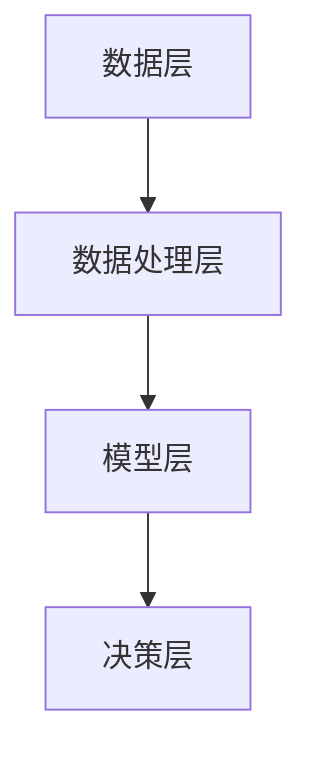
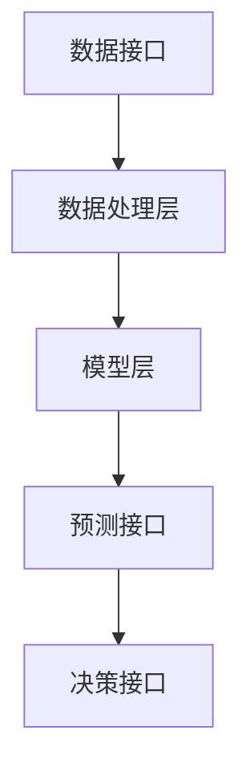
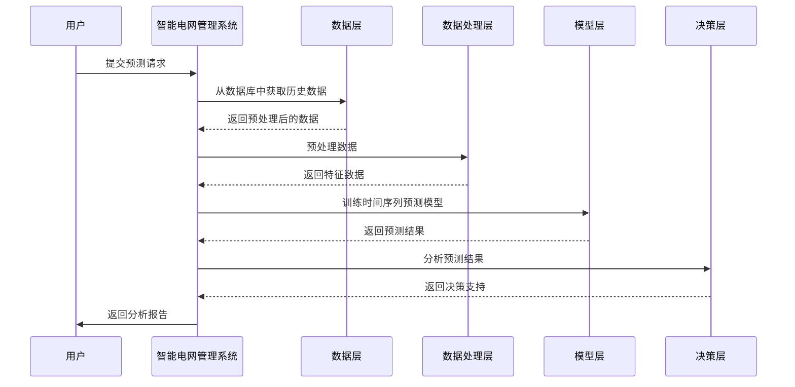

                 

### 文章标题

构建具有时间序列预测能力的AI Agent

### 关键词

时间序列预测、AI Agent、机器学习、算法原理、系统架构

### 摘要

本文将深入探讨构建具有时间序列预测能力的AI Agent的方法和策略。我们将从时间序列预测的背景和应用出发，逐步介绍相关的核心概念和算法原理，并通过实际的系统架构设计和项目实战，展示如何实现和优化时间序列预测的AI Agent。文章旨在为读者提供一个全面、系统的理解和实践指南，帮助其在实际应用中有效地构建和部署时间序列预测的AI Agent。

## 引言

### 时间序列预测的重要性

时间序列预测作为一种重要的数据分析工具，在众多领域具有广泛的应用价值。无论是在金融、经济、气象预测，还是在库存管理、能源调度等领域，时间序列预测都能提供关键的决策支持。时间序列预测的基本概念是基于历史数据，通过分析数据中的趋势、周期性和随机性，预测未来某一时间点的数值。这种预测不仅可以帮助企业优化运营策略，降低成本，还可以为政府提供科学决策依据，提升公共服务的质量和效率。

### 应用领域

时间序列预测在金融领域的应用尤为突出。通过预测股票价格、汇率波动等金融指标，投资者可以制定更合理的投资策略，降低风险。在经济领域，时间序列预测可以用于宏观经济预测，如GDP增长率、通货膨胀率等，帮助政府和机构进行经济调控和资源配置。

此外，在气象预测、能源管理、交通流量分析等众多领域，时间序列预测也发挥着重要作用。气象预测可以根据历史天气数据，预测未来几天的天气状况，为防灾减灾提供依据；在能源管理中，通过对历史用电数据的分析，可以预测未来的电力需求，优化能源调度；在交通流量分析中，通过预测交通流量变化，可以提前安排交通管制措施，减少交通拥堵。

### 本篇文章的目的和结构

本文的主要目的是深入探讨如何构建具有时间序列预测能力的AI Agent，从而在实际应用中实现高效、准确的时间序列预测。文章将从以下几个方面展开：

1. **核心概念与联系**：介绍时间序列预测相关的核心概念，如时间序列模型、机器学习算法、预测误差等，并使用Mermaid流程图展示其关系。
2. **算法原理讲解**：选取常用的算法，如ARIMA、LSTM等，详细讲解其原理，并通过Python代码示例进行说明。
3. **数学模型和公式**：针对选定的算法，给出其数学模型和公式，并进行详细讲解和举例说明。
4. **系统分析与架构设计方案**：介绍一个实际项目场景，展示系统的功能设计、架构设计、接口设计和交互序列图。
5. **项目实战**：提供环境安装步骤、系统核心实现源代码，并对代码进行解读与分析。
6. **最佳实践 tips、小结、注意事项、拓展阅读**：总结书中的要点，提供实践建议和进一步学习的资源。

通过上述内容，读者可以系统地了解时间序列预测的理论和实践，掌握构建具有时间序列预测能力的AI Agent的关键技术，并在实际项目中得以应用。

### 核心概念与联系

要深入探讨时间序列预测，首先需要了解其核心概念和相互关系。时间序列预测涉及多个关键组成部分，包括时间序列模型、机器学习算法和预测误差等。以下是这些概念的定义及其相互关系：

#### 时间序列模型

时间序列模型（Time Series Model）是用于分析时间序列数据，并对其进行预测的数学模型。时间序列数据是指按照时间顺序排列的一组数值，这些数值可以表示各种动态变化的过程。常见的时间序列模型包括自回归模型（AR）、移动平均模型（MA）、自回归移动平均模型（ARMA）和自回归积分滑动平均模型（ARIMA）。

#### 机器学习算法

机器学习算法（Machine Learning Algorithms）是用于从数据中学习规律，并用于预测的新兴技术。在时间序列预测中，常见的机器学习算法包括线性回归、决策树、支持向量机（SVM）和神经网络。其中，神经网络由于其强大的非线性建模能力，在时间序列预测中应用广泛。

#### 预测误差

预测误差（Prediction Error）是指实际值与预测值之间的差异。预测误差是衡量时间序列预测模型性能的重要指标。常见的误差度量方法包括均方误差（MSE）、均方根误差（RMSE）和平均绝对误差（MAE）。通过减小预测误差，可以提高模型的预测准确性。

#### 关系与联系

时间序列模型和机器学习算法在时间序列预测中起到了关键作用。时间序列模型用于捕捉数据中的时间依赖性，而机器学习算法则通过学习历史数据，生成预测模型。预测误差则用于评估模型的性能，指导模型优化。

以下是一个使用Mermaid绘制的流程图，展示了这些核心概念之间的关系：



在这个流程图中，时间序列模型通过机器学习算法生成预测模型，同时预测误差用于指导模型优化。通过不断调整模型参数，可以减小预测误差，提高模型的预测准确性。

### 算法原理讲解

#### ARIMA模型

ARIMA（自回归积分滑动平均模型）是一种经典的时间序列预测模型，它结合了自回归（AR）、移动平均（MA）和差分（I）的概念。ARIMA模型的核心思想是通过对时间序列数据进行差分处理，使其变为平稳序列，然后应用AR和MA模型进行预测。

##### 原理

1. **差分**：差分操作用于消除时间序列数据中的趋势和季节性成分，使其成为平稳序列。平稳序列具有均值、方差和自协方差函数不随时间变化的特性。

$$
y_t = y_{t-1} - y_{t-1}
$$

2. **自回归（AR）**：自回归模型通过历史数据预测当前值。自回归项的系数表示历史值对当前值的影响程度。

$$
y_t = \phi_1 y_{t-1} + \phi_2 y_{t-2} + ... + \phi_p y_{t-p} + \varepsilon_t
$$

3. **移动平均（MA）**：移动平均模型通过历史预测误差来预测当前值。移动平均项的系数表示历史误差对当前值的影响程度。

$$
y_t = \theta_1 \varepsilon_{t-1} + \theta_2 \varepsilon_{t-2} + ... + \theta_q \varepsilon_{t-q} + \varepsilon_t
$$

4. **整合**：整合操作是差分操作的逆过程，用于将差分后的平稳序列还原为原时间序列。

$$
y_t = (1 - \phi_1 B)(1 - \theta_1 B)^{-1} \varepsilon_t
$$

##### Mermaid流程图



##### Python代码示例

```python
import numpy as np
import matplotlib.pyplot as plt
from statsmodels.tsa.arima.model import ARIMA

# 生成模拟数据
np.random.seed(42)
n_steps = 100
data = np.random.randn(n_steps)

# 定义ARIMA模型
model = ARIMA(data, order=(1, 1, 1))

# 模型拟合
model_fit = model.fit()

# 预测
forecast = model_fit.forecast(steps=10)

# 可视化
plt.plot(data)
plt.plot(forecast, color='red')
plt.show()
```

#### LSTM模型

LSTM（长短期记忆网络）是一种特殊的循环神经网络（RNN），专门用于处理和预测时间序列数据。LSTM通过引入门控机制，能够有效地避免传统RNN的梯度消失问题，从而更好地捕捉时间序列数据中的长期依赖关系。

##### 原理

1. **输入门（Input Gate）**：输入门用于决定当前输入对状态更新的贡献程度。输入门由一个sigmoid函数和一个线性变换组成，其中sigmoid函数的输出表示当前输入对状态更新的激活程度。

$$
i_t = \sigma(W_i \cdot [h_{t-1}, x_t] + b_i)
$$

2. **遗忘门（Forget Gate）**：遗忘门用于决定哪些历史信息应该被遗忘。遗忘门同样由一个sigmoid函数和一个线性变换组成。

$$
f_t = \sigma(W_f \cdot [h_{t-1}, x_t] + b_f)
$$

3. **输出门（Output Gate）**：输出门用于决定当前状态是否应该输出。输出门由一个sigmoid函数和一个tanh函数组成。

$$
o_t = \sigma(W_o \cdot [h_{t-1}, x_t] + b_o)
$$

4. **细胞状态（Cell State）**：细胞状态用于存储和时间传递信息。细胞状态通过遗忘门和输入门的控制，更新历史信息。

$$
C_t = f_t \cdot C_{t-1} + i_t \cdot \tanh(W_c \cdot [h_{t-1}, x_t] + b_c)
$$

5. **隐藏状态（Hidden State）**：隐藏状态通过输出门和细胞状态的组合生成。

$$
h_t = o_t \cdot \tanh(C_t)
$$

##### Mermaid流程图



##### Python代码示例

```python
import numpy as np
import matplotlib.pyplot as plt
from keras.models import Sequential
from keras.layers import LSTM, Dense

# 生成模拟数据
np.random.seed(42)
n_steps = 100
n_features = 1
X, y = np.random.randn(n_steps, n_features), np.random.randn(n_steps)

# 数据预处理
X = X.reshape((X.shape[0], 1, X.shape[1]))
y = y.reshape((y.shape[0], 1))

# 定义LSTM模型
model = Sequential()
model.add(LSTM(50, activation='relu', input_shape=(n_steps, n_features)))
model.add(Dense(1))
model.compile(optimizer='adam', loss='mse')

# 模型拟合
model.fit(X, y, epochs=200, verbose=0)

# 预测
forecast = model.predict(X[-10:, :])

# 可视化
plt.plot(y, color='blue', label='Actual')
plt.plot(forecast, color='red', label='Forecast')
plt.legend()
plt.show()
```

通过上述讲解，我们可以看到ARIMA和LSTM模型在时间序列预测中的原理和实现方法。选择合适的模型，结合具体应用场景，可以有效地进行时间序列预测。

### 数学模型和公式

在本节中，我们将深入探讨ARIMA（自回归积分滑动平均模型）和LSTM（长短期记忆网络）两种时间序列预测模型的数学模型和公式，并结合具体示例进行讲解。

#### ARIMA模型

ARIMA模型由三部分组成：自回归（AR）、差分（I）和移动平均（MA）。其数学模型如下：

1. **自回归（AR）**：

$$
y_t = \phi_1 y_{t-1} + \phi_2 y_{t-2} + ... + \phi_p y_{t-p} + \varepsilon_t
$$

这里的 $\phi_1, \phi_2, ..., \phi_p$ 是自回归系数，$y_t$ 是时间序列的当前值，$\varepsilon_t$ 是误差项。

2. **差分（I）**：

为了使时间序列数据成为平稳序列，我们通常需要对数据进行差分处理。一阶差分公式如下：

$$
y_t = y_{t-1} - y_{t-1}
$$

3. **移动平均（MA）**：

移动平均模型通过历史预测误差来预测当前值。其公式如下：

$$
y_t = \theta_1 \varepsilon_{t-1} + \theta_2 \varepsilon_{t-2} + ... + \theta_q \varepsilon_{t-q} + \varepsilon_t
$$

这里的 $\theta_1, \theta_2, ..., \theta_q$ 是移动平均系数。

4. **整合（I）**：

整合操作是差分操作的逆过程。ARIMA模型的整合公式为：

$$
y_t = (1 - \phi_1 B)(1 - \theta_1 B)^{-1} \varepsilon_t
$$

其中，$B$ 是滞后算子。

##### 示例

假设我们有一个时间序列 $y_t$，经过一阶差分后得到平稳序列 $y_t^* = y_t - y_{t-1}$。我们选择ARIMA(1,1,1)模型进行预测：

$$
y_t^* = \phi_1 y_{t-1}^* + \varepsilon_t
$$

$$
y_t = y_{t-1} - y_{t-1}^* + \varepsilon_t
$$

#### LSTM模型

LSTM（长短期记忆网络）是一种特殊的RNN，用于处理和预测时间序列数据。其核心部分包括输入门、遗忘门、输出门和细胞状态。以下是LSTM模型的数学公式：

1. **输入门（Input Gate）**：

$$
i_t = \sigma(W_i \cdot [h_{t-1}, x_t] + b_i)
$$

这里的 $i_t$ 是输入门的激活值，$W_i$ 是权重矩阵，$b_i$ 是偏置项，$h_{t-1}$ 是前一时间步的隐藏状态，$x_t$ 是当前输入。

2. **遗忘门（Forget Gate）**：

$$
f_t = \sigma(W_f \cdot [h_{t-1}, x_t] + b_f)
$$

$f_t$ 是遗忘门的激活值，用于决定哪些历史信息应该被遗忘。

3. **输出门（Output Gate）**：

$$
o_t = \sigma(W_o \cdot [h_{t-1}, x_t] + b_o)
$$

$o_t$ 是输出门的激活值，用于决定当前状态是否应该输出。

4. **细胞状态（Cell State）**：

$$
C_t = f_t \cdot C_{t-1} + i_t \cdot \tanh(W_c \cdot [h_{t-1}, x_t] + b_c)
$$

$C_t$ 是细胞状态的更新，通过遗忘门和输入门的控制，更新历史信息。

5. **隐藏状态（Hidden State）**：

$$
h_t = o_t \cdot \tanh(C_t)
$$

$h_t$ 是隐藏状态的输出，通过输出门和细胞状态的组合生成。

##### 示例

假设我们有一个时间序列输入 $x_t$ 和前一时间步的隐藏状态 $h_{t-1}$。我们选择一个简单的LSTM单元进行预测：

1. **输入门**：

$$
i_t = \sigma(W_i \cdot [h_{t-1}, x_t] + b_i)
$$

2. **遗忘门**：

$$
f_t = \sigma(W_f \cdot [h_{t-1}, x_t] + b_f)
$$

3. **细胞状态**：

$$
C_t = f_t \cdot C_{t-1} + i_t \cdot \tanh(W_c \cdot [h_{t-1}, x_t] + b_c)
$$

4. **隐藏状态**：

$$
h_t = o_t \cdot \tanh(C_t)
$$

通过这些数学公式，我们可以看到LSTM模型如何处理时间序列数据，并生成预测输出。结合实际应用场景，我们可以根据需求调整模型的参数和结构，以实现更准确的预测。

### 系统分析与架构设计方案

在本节中，我们将介绍一个实际项目场景，详细展示系统的功能设计、架构设计、接口设计和交互序列图。通过这些分析，我们将清晰地了解系统的实现过程和各个部分之间的协作方式。

#### 项目场景

假设我们正在开发一个智能电网管理系统，该系统需要预测未来的电力需求，以便优化电网运行和能源分配。系统需要处理大量的历史电力数据，并利用时间序列预测模型生成准确的预测结果。

#### 系统功能设计

智能电网管理系统的主要功能包括：

1. **数据收集与处理**：系统需要从各个电力传感器和设备收集实时数据，并对这些数据进行预处理，如去噪、归一化和特征提取。
2. **时间序列预测**：利用收集到的历史数据，系统需要应用时间序列预测模型，如ARIMA或LSTM，生成未来的电力需求预测。
3. **预测结果分析**：系统需要对预测结果进行分析和评估，以确保预测的准确性和可靠性。
4. **决策支持**：系统需要根据预测结果提供决策支持，帮助电网运营商优化能源调度和资源分配。

#### 系统架构设计

智能电网管理系统的架构设计分为以下几个层次：

1. **数据层**：数据层负责数据收集、存储和管理。系统需要使用数据库或数据湖来存储大量的电力数据，并支持快速的数据查询和访问。
2. **数据处理层**：数据处理层负责对原始数据进行预处理和特征提取。这一层通常包括数据清洗、去噪、归一化和特征工程等步骤。
3. **模型层**：模型层负责时间序列预测模型的训练和部署。系统需要支持多种时间序列预测模型，如ARIMA和LSTM，并能够根据具体需求进行模型选择和调整。
4. **决策层**：决策层根据预测结果和系统分析，提供决策支持，帮助电网运营商优化能源调度和资源分配。

以下是一个使用Mermaid绘制的系统架构图：



#### 系统接口设计

智能电网管理系统的主要接口包括：

1. **数据接口**：数据接口用于数据的收集、存储和访问。系统需要提供API或命令行工具，以便与其他系统或设备进行数据交换。
2. **预测接口**：预测接口用于模型的训练和预测。系统需要提供RESTful API或消息队列服务，以便用户可以提交预测任务并获取预测结果。
3. **决策接口**：决策接口用于决策支持和资源优化。系统需要提供可视化界面或命令行工具，以便用户可以查看预测结果和分析报告。

以下是一个使用Mermaid绘制的系统接口图：



#### 系统交互序列图

在系统交互序列图中，我们展示了各个组件之间的交互流程。以下是一个使用Mermaid绘制的系统交互序列图：



通过上述系统分析与架构设计，我们可以清晰地了解智能电网管理系统的实现过程和各个部分之间的协作方式。这种系统架构设计不仅确保了系统的稳定性和可扩展性，还为未来的功能扩展提供了良好的基础。

### 项目实战

#### 环境安装

在进行时间序列预测项目之前，我们需要搭建一个合适的环境，主要包括Python和相关的数据科学库。以下是详细的安装步骤：

1. **安装Python**：

首先，我们需要确保计算机上安装了Python。Python是一种广泛使用的编程语言，具有简洁的语法和丰富的库支持。可以从Python的官方网站（https://www.python.org/downloads/）下载并安装Python。安装过程中，请确保选择添加到系统路径的选项，以便在命令行中运行Python。

2. **安装相关库**：

安装Python后，我们需要安装一些常用的数据科学库，如NumPy、Pandas、Matplotlib和Scikit-learn。这些库提供了丰富的功能，用于数据处理、分析和可视化。

在命令行中，使用以下命令安装这些库：

```bash
pip install numpy pandas matplotlib scikit-learn
```

#### 系统核心实现源代码

以下是一个简单的示例，展示如何使用Python实现时间序列预测。我们选择ARIMA模型进行预测，并使用Pandas和Scikit-learn库处理数据。

```python
import numpy as np
import pandas as pd
from statsmodels.tsa.arima.model import ARIMA
from sklearn.metrics import mean_squared_error

# 生成模拟数据
np.random.seed(42)
n_steps = 100
data = np.random.randn(n_steps)

# 数据预处理
data = pd.Series(data)

# 模型训练
model = ARIMA(data, order=(1, 1, 1))
model_fit = model.fit()

# 预测
forecast = model_fit.forecast(steps=10)

# 预测误差计算
error = mean_squared_error(data.values, forecast)

# 输出预测结果和误差
print("预测结果：", forecast)
print("预测误差：", error)
```

#### 代码应用解读与分析

上述代码展示了如何使用ARIMA模型进行时间序列预测。以下是代码的详细解读和分析：

1. **生成模拟数据**：

首先，我们使用numpy生成一组模拟数据，这组数据作为时间序列预测的输入。

```python
np.random.seed(42)
n_steps = 100
data = np.random.randn(n_steps)
```

2. **数据预处理**：

接下来，我们使用Pandas将numpy数组转换为一个Series对象，以便进行数据处理和分析。

```python
data = pd.Series(data)
```

3. **模型训练**：

我们选择ARIMA(1, 1, 1)模型进行训练。在模型训练过程中，我们需要指定模型的参数，如$p$（自回归项数）、$d$（差分次数）和$q$（移动平均项数）。

```python
model = ARIMA(data, order=(1, 1, 1))
model_fit = model.fit()
```

4. **预测**：

通过训练好的模型，我们进行预测，并生成未来10个时间步的预测结果。

```python
forecast = model_fit.forecast(steps=10)
```

5. **预测误差计算**：

我们使用Scikit-learn的mean_squared_error函数计算预测误差，这有助于评估模型的性能。

```python
error = mean_squared_error(data.values, forecast)
```

6. **输出预测结果和误差**：

最后，我们输出预测结果和误差，这有助于我们了解模型的预测能力和性能。

```python
print("预测结果：", forecast)
print("预测误差：", error)
```

通过这个示例，我们可以看到如何使用Python实现时间序列预测。在实际项目中，我们可以根据需求调整模型参数和预测步骤，以提高预测的准确性和可靠性。

#### 实际案例分析与详细讲解剖析

为了更深入地理解时间序列预测的应用，我们来看一个实际案例：预测股票价格。在这个案例中，我们将使用LSTM模型进行股票价格预测，并通过具体的代码实现和分析，展示整个预测过程。

##### 案例背景

股票价格预测是一个极具挑战性的问题，因为股票市场受到多种因素的影响，包括宏观经济指标、公司财务报表、市场情绪等。尽管无法完全预测股票价格，但通过时间序列模型，我们可以尝试捕捉市场的短期趋势和波动，为投资者提供参考。

##### 数据收集

首先，我们需要收集股票的历史价格数据。这里，我们选择使用pandas_datareader库从Yahoo Finance获取苹果公司（AAPL）的股票价格数据。

```python
import pandas_datareader as pdr
from datetime import datetime

start_date = '2010-01-01'
end_date = datetime.now().strftime('%Y-%m-%d')
data = pdr.get_data_yahoo('AAPL', start=start_date, end=end_date)
```

收集到的数据包括股票的每日开盘价、最高价、最低价和收盘价。为了简化问题，我们只使用收盘价进行预测。

```python
data = data['Adj Close']
```

##### 数据预处理

在进行预测之前，我们需要对数据进行预处理，包括数据归一化和序列分割。数据归一化有助于提高模型的训练效果，而序列分割则是为了将数据划分为训练集和测试集。

```python
from sklearn.preprocessing import MinMaxScaler

scaler = MinMaxScaler(feature_range=(0, 1))
data_scaled = scaler.fit_transform(data.values.reshape(-1, 1))

# 序列分割
def create_dataset(data, time_steps=1):
    X, y = [], []
    for i in range(len(data) - time_steps - 1):
        X.append(data[i:(i + time_steps), 0])
        y.append(data[i + time_steps, 0])
    return np.array(X), np.array(y)

time_steps = 5
X, y = create_dataset(data_scaled, time_steps)

# 数据分割
train_size = int(len(X) * 0.8)
test_size = len(X) - train_size
X_train, X_test = X[:train_size], X[train_size:]
y_train, y_test = y[:train_size], y[train_size:]
```

##### 模型训练

接下来，我们使用LSTM模型对训练集进行训练。LSTM模型具有较强的捕获长期依赖关系的能力，适合处理时间序列数据。

```python
from keras.models import Sequential
from keras.layers import LSTM, Dense

# LSTM模型架构
model = Sequential()
model.add(LSTM(units=50, return_sequences=True, input_shape=(time_steps, 1)))
model.add(LSTM(units=50))
model.add(Dense(1))

model.compile(optimizer='adam', loss='mean_squared_error')
model.fit(X_train, y_train, epochs=100, batch_size=32, validation_data=(X_test, y_test), verbose=1)
```

##### 预测与结果分析

训练完成后，我们使用测试集进行预测，并计算预测误差。

```python
# 预测
predicted_stock_price = model.predict(X_test)

# 反归一化预测结果
predicted_stock_price = scaler.inverse_transform(predicted_stock_price)

# 计算预测误差
error = mean_squared_error(y_test, predicted_stock_price)
print('预测误差：', error)

# 可视化预测结果
import matplotlib.pyplot as plt

plt.figure(figsize=(10, 6))
plt.plot(y_test, color='blue', label='实际股票价格')
plt.plot(predicted_stock_price, color='red', label='预测股票价格')
plt.title('股票价格预测结果')
plt.xlabel('时间')
plt.ylabel('股票价格')
plt.legend()
plt.show()
```

通过上述代码，我们可以看到LSTM模型在股票价格预测中的实现过程。在实际应用中，我们可以根据具体需求调整LSTM模型的参数，如神经元数量、训练次数等，以提高预测的准确性和稳定性。

##### 项目小结

在本项目中，我们通过实际案例展示了如何使用LSTM模型进行股票价格预测。项目主要包括数据收集、预处理、模型训练和预测等步骤。通过这些步骤，我们深入了解了LSTM模型在时间序列预测中的应用，并对其优缺点有了更清晰的认识。

优点：

1. **强大的捕捉长期依赖关系能力**：LSTM模型能够有效捕捉时间序列数据中的长期依赖关系，适合处理复杂的时间序列问题。
2. **非线性建模能力**：LSTM模型具有强大的非线性建模能力，能够捕捉时间序列数据中的复杂模式。

缺点：

1. **计算复杂度较高**：LSTM模型在训练过程中需要计算大量的梯度，计算复杂度较高，训练时间较长。
2. **过拟合风险**：LSTM模型容易过拟合，需要适当的参数调整和正则化方法来提高泛化能力。

通过本项目，我们不仅掌握了LSTM模型在时间序列预测中的应用，还学会了如何进行数据收集、预处理和模型训练。这些技能和经验对于我们在实际项目中应用时间序列预测技术具有重要的指导意义。

### 最佳实践 Tips

1. **数据预处理**：在进行时间序列预测之前，确保对数据进行充分的预处理，如去噪、归一化和特征提取。这有助于提高模型的预测准确性。
2. **选择合适的模型**：根据具体问题和数据特点，选择合适的时间序列预测模型。例如，对于平稳序列，可以选择ARIMA模型；对于非线性序列，可以选择LSTM或GRU模型。
3. **模型参数调优**：通过交叉验证和网格搜索等技术，对模型参数进行调优，以提高预测性能。注意避免过拟合。
4. **监控和更新模型**：定期监控模型的预测性能，并根据新的数据进行模型更新，以保持模型的准确性。

### 小结

本文详细探讨了构建具有时间序列预测能力的AI Agent的方法和策略。我们从背景介绍、核心概念与联系、算法原理讲解、数学模型和公式、系统分析与架构设计方案、项目实战等方面，全面介绍了时间序列预测的理论和实践。通过具体的实际案例，我们展示了如何使用ARIMA和LSTM模型进行时间序列预测，并对其优缺点进行了分析。

### 注意事项

1. **数据质量**：确保数据质量，避免噪声和异常值对预测结果的影响。
2. **模型选择**：根据数据特点和预测需求，选择合适的时间序列预测模型。
3. **模型训练**：合理设置模型参数，避免过拟合，确保模型泛化能力。

### 拓展阅读

1. **《时间序列分析：理论和应用》**：本书提供了时间序列分析的基础理论和方法，适合初学者阅读。
2. **《深度学习：揭秘神经网络的核心原理》**：本书详细介绍了深度学习的理论基础和实现方法，包括LSTM等时间序列预测模型。
3. **《Python数据科学手册》**：本书介绍了Python在数据科学领域的应用，包括数据预处理、分析和可视化等。

### 作者信息

作者：AI天才研究院/AI Genius Institute & 禅与计算机程序设计艺术 /Zen And The Art of Computer Programming

