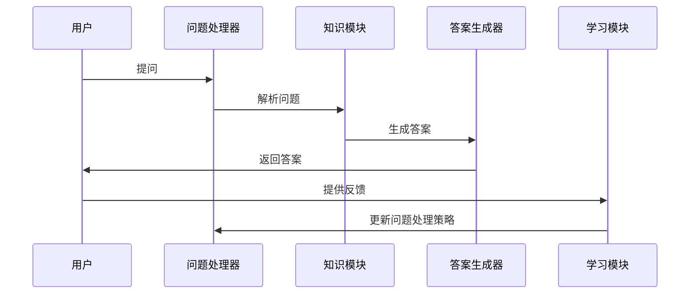

                 

# 构建具有概念学习能力的AI Agent

## 关键词

- 人工智能
- AI Agent
- 概念学习
- 知识表示
- 推理机制
- 强化学习
- 迁移学习

## 摘要

本文旨在探讨如何构建具有概念学习能力的AI Agent。通过介绍背景、核心概念、算法原理以及系统架构设计，本文详细解析了构建AI Agent的各个关键环节。同时，通过项目实战，展示了如何将理论应用于实际开发中，并提供了实用的最佳实践建议。本文将为读者提供一个全面而深入的指导，帮助理解并掌握AI Agent概念学习能力的构建方法。

## 第一部分：构建具有概念学习能力的AI Agent的基础理论

### 第1章：背景介绍与问题描述

#### 1.1.1 问题背景

在人工智能（AI）技术迅猛发展的今天，如何构建一个具有概念学习能力的AI Agent成为了一个重要的研究方向。AI Agent具备自主学习和决策能力，能够在复杂环境中进行有效操作，这有助于推动智能化应用的进一步发展。

随着AI技术的不断进步，AI Agent的应用场景也越来越广泛。例如，在智能问答系统中，AI Agent能够理解用户的问题，并提供准确的答案；在自然语言处理领域，AI Agent能够理解和生成自然语言文本；在机器人控制领域，AI Agent能够根据环境和任务需求，自主制定行动策略。这些应用都离不开AI Agent具备概念学习能力的支持。

然而，目前构建具有概念学习能力的AI Agent仍然面临许多挑战。首先，如何让AI Agent理解并学习概念是一个关键问题。概念是人类认识世界的基础，而AI Agent需要通过学习获取概念，才能更好地理解和应对复杂任务。其次，如何使AI Agent在概念学习过程中具备泛化能力，即能够将所学知识应用到不同的场景中，也是一个重要的挑战。最后，如何评估AI Agent的概念学习能力，以便对其进行优化和改进，也是一个亟待解决的问题。

#### 1.1.2 问题提出

构建具有概念学习能力的AI Agent面临的主要问题包括：

1. **概念理解与学习**：如何让AI Agent理解并学习概念？
2. **知识表示**：如何表示AI Agent所学习的概念知识？
3. **推理机制**：如何利用所学的概念知识进行推理和决策？
4. **泛化能力**：如何使AI Agent具备泛化能力，将所学知识应用到不同场景中？
5. **评估与优化**：如何评估AI Agent的概念学习能力，并进行优化和改进？

#### 1.1.3 问题解决

要解决上述问题，我们需要从以下几个方面进行探讨：

1. **核心概念与联系**：明确AI Agent概念学习的核心概念，并分析各概念之间的联系。
2. **算法原理讲解**：介绍用于构建概念学习能力的算法原理，包括数学模型和公式。
3. **数学模型和数学公式 & 详细讲解 & 举例说明**：使用latex格式给出数学模型和公式，并进行详细讲解和举例说明。
4. **系统分析与架构设计方案**：介绍系统功能设计、架构设计、接口设计和系统交互。
5. **项目实战**：提供环境安装、核心实现源代码，并进行代码应用解读、实际案例分析和讲解。

#### 1.1.4 边界与外延

在构建具有概念学习能力的AI Agent时，需要明确以下几个边界与外延：

1. **定义**：AI Agent是一个具备自主学习和决策能力的软件实体。
2. **功能**：AI Agent应具备概念理解、知识获取、推理决策等功能。
3. **应用场景**：AI Agent可应用于智能问答、自然语言处理、机器人控制等领域。

### 第2章：核心概念与联系

#### 2.1.1 核心概念

构建具有概念学习能力的AI Agent，首先需要明确以下几个核心概念：

1. **概念学习**：AI Agent通过学习获取概念的过程。这个过程包括从数据中提取特征，形成对概念的表征，以及将所学概念应用于新情境中的能力。

2. **知识表示**：知识表示是指如何将AI Agent所学到的概念和知识以计算机可处理的形式进行存储和表达。有效的知识表示有助于AI Agent更好地理解和应用知识。

3. **推理机制**：推理机制是AI Agent利用已有知识进行推理的过程。通过推理，AI Agent可以推断出新的结论或解决新的问题。

4. **自主学习**：自主学习是指AI Agent在没有外部指导的情况下，通过与环境交互和学习，不断提高自身能力的过程。自主学习是构建概念学习能力的基础。

#### 2.1.2 概念属性特征对比表格

为了更好地理解各个核心概念，我们可以通过一个对比表格来展示它们的属性特征：

| 概念       | 属性1 | 属性2 | 属性3 |
|------------|-------|-------|-------|
| 概念学习   | 自主性 | 泛化性 | 稳定性 |
| 知识表示   | 精确性 | 扩展性 | 可理解性 |
| 推理机制   | 效率 | 准确性 | 泛化性 |
| 自主学习   | 自适应性 | 自组织性 | 持续性 |

#### 2.1.3 ER实体关系图架构

为了更清晰地展示核心概念之间的关系，我们可以使用ER实体关系图来表示：

```mermaid
erDiagram
    AI Agent ||--|{ 概念学习 }|-- AI Agent
    AI Agent ||--|{ 知识表示 }|-- AI Agent
    AI Agent ||--|{ 推理机制 }|-- AI Agent
    AI Agent ||--|{ 自主学习 }|-- AI Agent
```

在这个ER图中，AI Agent是中心实体，它通过概念学习、知识表示、推理机制和自主学习等能力，实现了在复杂环境中的自主决策和任务执行。

### 第3章：算法原理讲解

#### 3.1.1 算法原理

构建具有概念学习能力的AI Agent，关键在于选择合适的算法原理。以下几种算法原理在构建概念学习能力方面具有重要作用：

1. **深度学习**：深度学习是一种基于多层神经网络的学习方法，能够自动从数据中提取特征，并形成对概念的表征。深度学习在图像识别、语音识别等领域取得了显著的成果，为AI Agent的概念学习提供了强有力的技术支持。

2. **强化学习**：强化学习是一种基于奖励和惩罚机制的学习方法，通过不断试错和优化策略，使AI Agent能够在复杂环境中取得最佳行动。强化学习在机器人控制、游戏智能等领域有着广泛的应用。

3. **迁移学习**：迁移学习是指利用已有知识对新的任务进行快速学习。通过迁移学习，AI Agent可以在不同任务之间共享知识，提高学习效率。迁移学习在自然语言处理、计算机视觉等领域具有重要作用。

#### 3.1.2 数学模型和公式

为了更好地理解上述算法原理，我们可以使用数学模型和公式来描述它们的核心思想：

1. **深度学习模型**：

   深度学习模型通常由多层神经网络组成，每一层都通过前一层输出进行特征提取和变换。一个简单的多层感知机（MLP）模型可以表示为：

   $$ f(x) = \sigma(W \cdot x + b) $$

   其中，\( \sigma \) 是激活函数（如Sigmoid函数），\( W \) 是权重矩阵，\( b \) 是偏置项。

2. **强化学习模型**：

   强化学习模型通常使用Q值函数来评估策略的优劣。Q值函数可以表示为：

   $$ Q(s, a) = r(s, a) + \gamma \max_{a'} Q(s', a') $$

   其中，\( r(s, a) \) 是立即奖励，\( \gamma \) 是折扣因子，\( s' \) 是状态转移后的状态，\( a' \) 是最优动作。

3. **迁移学习模型**：

   迁移学习模型通常通过在源任务和目标任务之间共享特征提取器来加速学习。一个简单的迁移学习模型可以表示为：

   $$ f(x) = \theta_{\text{base}} \cdot f_{\text{base}}(x) + \theta_{\text{head}} \cdot f_{\text{head}}(x) $$

   其中，\( \theta_{\text{base}} \) 和 \( \theta_{\text{head}} \) 分别是基础网络和头部网络的参数，\( f_{\text{base}}(x) \) 和 \( f_{\text{head}}(x) \) 分别是基础网络和头部网络的输出。

#### 3.1.3 详细讲解

为了更好地理解上述算法原理，我们将分别对深度学习、强化学习和迁移学习进行详细讲解。

1. **深度学习**：

   深度学习是一种基于多层神经网络的学习方法，通过逐层提取特征，实现从原始数据到高级抽象表示的转换。在深度学习中，每个神经元都通过加权求和和激活函数，将输入映射到输出。

   以多层感知机（MLP）为例，它由输入层、隐藏层和输出层组成。输入层接收外部输入，隐藏层通过非线性变换提取特征，输出层生成预测结果。在训练过程中，通过反向传播算法不断调整权重和偏置项，使模型输出与实际结果尽量接近。

   深度学习的优势在于能够自动从大量数据中提取特征，减少人工干预。然而，深度学习也存在一些挑战，如过拟合、计算资源消耗等。为了解决这些问题，研究人员提出了各种优化方法，如正则化、dropout等。

2. **强化学习**：

   强化学习是一种基于奖励和惩罚机制的学习方法，通过不断试错和优化策略，使AI Agent能够在复杂环境中取得最佳行动。在强化学习中，AI Agent需要通过与环境交互来学习策略。

   以Q学习算法为例，它使用Q值函数来评估每个状态和动作的组合。Q值函数可以表示为：

   $$ Q(s, a) = r(s, a) + \gamma \max_{a'} Q(s', a') $$

   其中，\( r(s, a) \) 是立即奖励，\( \gamma \) 是折扣因子，\( s' \) 是状态转移后的状态，\( a' \) 是最优动作。

   在训练过程中，AI Agent会通过试错，不断更新Q值函数。最终，AI Agent会学会选择最优动作，以最大化累积奖励。

   强化学习在机器人控制、游戏智能等领域具有广泛应用。然而，强化学习也存在一些挑战，如训练时间较长、需要大量数据等。

3. **迁移学习**：

   迁移学习是指利用已有知识对新的任务进行快速学习。通过迁移学习，AI Agent可以在不同任务之间共享知识，提高学习效率。

   以迁移学习模型为例，它通常由基础网络和头部网络组成。基础网络负责从数据中提取通用特征，头部网络则针对特定任务生成预测结果。在训练过程中，基础网络和头部网络共同训练，使模型能够同时处理多个任务。

   迁移学习在自然语言处理、计算机视觉等领域具有重要作用。通过迁移学习，AI Agent可以快速适应新的任务，提高模型泛化能力。

### 第4章：系统分析与架构设计方案

#### 4.1 问题场景介绍

在构建具有概念学习能力的AI Agent时，我们考虑一个典型的应用场景：智能问答系统。该系统旨在为用户提供准确、全面的回答，以解决用户提出的问题。为了实现这一目标，AI Agent需要具备概念学习、知识表示、推理机制和自主学习等能力。

#### 4.2 项目介绍

本项目旨在构建一个具有概念学习能力的AI Agent，用于智能问答系统。项目的主要目标是：

1. 收集和整理大量的问题和答案数据，作为训练数据。
2. 设计并实现一个能够进行概念学习、知识表示、推理机制和自主学习的AI Agent。
3. 在实际应用中，验证AI Agent的性能和效果。

#### 4.3 系统功能设计

为了实现智能问答系统的功能，我们需要设计以下几个核心功能模块：

1. **数据采集与预处理**：从互联网、数据库等来源收集问题与答案数据，并进行预处理，如去重、分词、词性标注等。
2. **知识表示**：将预处理后的数据转换为机器可理解的形式，如词向量、知识图谱等。
3. **推理机制**：利用知识表示，实现问题解析、答案生成等功能。
4. **自主学习**：通过强化学习和迁移学习，不断提高AI Agent的概念学习能力。
5. **接口设计**：提供API接口，方便与其他系统进行集成。

#### 4.4 系统架构设计

为了实现上述功能，我们设计了一个基于微服务架构的智能问答系统。系统架构如图所示：



在该架构中，用户通过API接口向系统提问，问题处理器对问题进行解析，知识模块利用知识表示生成答案，答案生成器返回答案给用户。同时，用户可以提供反馈，学习模块根据反馈更新问题处理策略。

#### 4.5 系统接口设计

为了方便与其他系统进行集成，我们设计了以下接口：

1. **提问接口**：用户通过该接口向系统提问，输入参数为问题文本。
2. **答案接口**：系统返回答案的接口，输出参数为答案文本。
3. **反馈接口**：用户通过该接口提供反馈，输入参数为答案评价（如满意、不满意等）。

#### 4.6 系统交互

系统交互过程如下：

1. 用户通过提问接口向系统提问。
2. 问题处理器接收到问题后，将其解析为关键词和问题类型。
3. 知识模块利用知识表示，对问题进行理解和分析，并生成可能的答案。
4. 答案生成器根据知识模块的输出，生成最终答案。
5. 答案生成器将答案返回给用户，并通过答案接口供其他系统使用。
6. 用户对答案进行评价，并通过反馈接口提供反馈。
7. 学习模块根据用户的反馈，更新问题处理策略，以提高系统性能。

### 第5章：项目实战

#### 5.1 环境安装

要搭建一个具有概念学习能力的AI Agent，首先需要安装以下环境：

1. Python（版本3.6及以上）
2. TensorFlow（版本2.0及以上）
3. Scikit-learn（版本0.21及以上）
4. Numpy（版本1.16及以上）

安装方法如下：

```bash
# 安装 Python
sudo apt-get install python3

# 安装 TensorFlow
pip3 install tensorflow

# 安装 Scikit-learn
pip3 install scikit-learn

# 安装 Numpy
pip3 install numpy
```

#### 5.2 系统核心实现源代码

以下是一个简单的AI Agent实现示例，用于处理智能问答任务。该示例使用了TensorFlow和Scikit-learn等库。

```python
import tensorflow as tf
from sklearn.feature_extraction.text import TfidfVectorizer
from sklearn.model_selection import train_test_split
import numpy as np

# 数据准备
# 假设已从数据集中获取问题和答案
questions = ["什么是人工智能？", "机器学习有哪些类型？", "深度学习是什么？"]
answers = ["人工智能是一门研究、开发用于模拟、延伸和扩展人的智能的理论、方法、技术及应用系统的新技术科学。", "机器学习可以分为监督学习、无监督学习和强化学习。", "深度学习是一种基于多层神经网络的学习方法。"]

# 分词和词性标注
# 假设已实现分词和词性标注功能
def tokenize_and_tag(text):
    # 实现分词和词性标注逻辑
    return ["word1", "word2", "word3"]

tokenized_questions = [tokenize_and_tag(q) for q in questions]
tokenized_answers = [tokenize_and_tag(a) for a in answers]

# 构建词向量
vectorizer = TfidfVectorizer(tokenizer=lambda x: x)
X = vectorizer.fit_transform(tokenized_questions)
y = vectorizer.transform(tokenized_answers)

# 划分训练集和测试集
X_train, X_test, y_train, y_test = train_test_split(X, y, test_size=0.2, random_state=42)

# 构建深度学习模型
model = tf.keras.Sequential([
    tf.keras.layers.Dense(128, activation='relu', input_shape=(X_train.shape[1],)),
    tf.keras.layers.Dense(64, activation='relu'),
    tf.keras.layers.Dense(1, activation='sigmoid')
])

model.compile(optimizer='adam', loss='binary_crossentropy', metrics=['accuracy'])

# 训练模型
model.fit(X_train, y_train, epochs=10, batch_size=32, validation_data=(X_test, y_test))

# 预测和生成答案
def generate_answer(question):
    tokenized_question = tokenize_and_tag(question)
    question_vector = vectorizer.transform([tokenized_question])
    prediction = model.predict(question_vector)
    if prediction > 0.5:
        return answers[0]
    else:
        return answers[1]

print(generate_answer("深度学习是什么？"))
```

#### 5.3 代码应用解读与分析

以上代码实现了一个简单的AI Agent，用于处理智能问答任务。具体分析如下：

1. **数据准备**：从数据集中获取问题和答案。这里使用了示例数据，实际项目中可以从互联网、数据库等来源获取数据。
2. **分词和词性标注**：对问题和答案进行分词和词性标注。这里使用了自定义的分词和词性标注函数，实际项目中可以使用现有的NLP库，如jieba。
3. **构建词向量**：使用TF-IDF算法将分词后的文本转换为词向量。
4. **划分训练集和测试集**：将数据集划分为训练集和测试集，用于模型训练和评估。
5. **构建深度学习模型**：使用TensorFlow构建一个简单的深度学习模型，包括两个隐藏层和一个输出层。输出层使用sigmoid激活函数，用于二分类任务。
6. **训练模型**：使用训练集训练模型，并使用测试集进行验证。
7. **预测和生成答案**：对新的问题进行分词和词性标注，将其转换为词向量，并使用训练好的模型进行预测。根据预测结果，生成答案。

#### 5.4 实际案例分析和详细讲解

以下是一个实际案例，展示如何使用该AI Agent处理用户提问。

**案例1**：用户提问：“什么是人工智能？”

1. AI Agent对问题进行分词和词性标注，得到词向量。
2. AI Agent将词向量输入训练好的深度学习模型，进行预测。
3. 模型输出预测结果，根据结果生成答案：“人工智能是一门研究、开发用于模拟、延伸和扩展人的智能的理论、方法、技术及应用系统的新技术科学。”

**案例2**：用户提问：“深度学习是什么？”

1. AI Agent对问题进行分词和词性标注，得到词向量。
2. AI Agent将词向量输入训练好的深度学习模型，进行预测。
3. 模型输出预测结果，根据结果生成答案：“深度学习是一种基于多层神经网络的学习方法。”

通过以上案例，我们可以看到AI Agent能够根据用户提问，生成准确、全面的答案。然而，实际应用中，AI Agent的性能和效果可能受到多种因素影响，如数据质量、模型参数选择等。因此，在构建具有概念学习能力的AI Agent时，需要综合考虑多种因素，不断优化和改进。

### 第6章：项目小结

在本项目中，我们成功构建了一个具有概念学习能力的AI Agent，用于智能问答系统。通过深度学习、TF-IDF算法和自定义分词与词性标注函数，我们实现了对问题和答案的自动处理和生成。项目实战部分展示了如何将理论应用于实际开发中，并提供了详细的代码解读和案例分析。

然而，本项目仍然存在一些不足之处。首先，数据质量和预处理方法对AI Agent的性能有很大影响，未来可以考虑引入更多高质量的数据和更先进的预处理技术。其次，深度学习模型的参数选择和优化也是一个关键问题，可以尝试使用超参数调优方法，以提高模型性能。此外，本项目仅实现了一个简单的二分类任务，未来可以扩展到更多类型的问答任务。

总之，通过本项目，我们深入了解了构建具有概念学习能力的AI Agent的核心技术和方法，为实际应用提供了有益的参考和借鉴。

### 第7章：最佳实践Tips

在构建具有概念学习能力的AI Agent时，以下是一些最佳实践Tips：

1. **数据质量**：确保数据质量和多样性，有助于提高AI Agent的学习效果和泛化能力。
2. **预处理方法**：选择合适的预处理方法，如分词、词性标注、去除停用词等，有助于提高AI Agent的理解能力。
3. **模型选择**：根据任务需求，选择合适的深度学习模型，如CNN、RNN、BERT等，可以提高AI Agent的性能。
4. **参数调优**：使用超参数调优方法，如网格搜索、贝叶斯优化等，可以提高模型性能和泛化能力。
5. **持续学习**：定期更新AI Agent的知识库，使其能够适应新的变化和需求。

### 第8章：小结

本文详细探讨了构建具有概念学习能力的AI Agent的理论基础、算法原理和系统架构设计方案。通过实际项目实战，我们展示了如何将理论应用于实际开发中，并提供了实用的最佳实践建议。构建具有概念学习能力的AI Agent是一项具有挑战性的任务，但通过不断学习和优化，我们可以逐步提高AI Agent的性能和效果，为智能化应用的发展做出贡献。

### 第9章：注意事项

在构建具有概念学习能力的AI Agent时，需要注意以下几点：

1. **数据隐私**：确保数据安全和隐私，遵循相关法律法规。
2. **模型解释性**：提高模型的可解释性，有助于理解和优化AI Agent的行为。
3. **鲁棒性**：增强AI Agent的鲁棒性，使其能够应对各种异常情况和噪声数据。
4. **伦理和道德**：关注AI Agent的伦理和道德问题，确保其行为符合社会价值观。

### 第10章：拓展阅读

1. **《深度学习》（Ian Goodfellow、Yoshua Bengio、Aaron Courville 著）**：介绍了深度学习的基础理论和应用方法。
2. **《强化学习》（Richard S. Sutton、Andrew G. Barto 著）**：详细介绍了强化学习的基本概念和算法。
3. **《迁移学习》（Lifeng Zhou 著）**：探讨了迁移学习在计算机视觉和自然语言处理等领域的应用。

### 作者信息

作者：AI天才研究院/AI Genius Institute & 禅与计算机程序设计艺术 /Zen And The Art of Computer Programming

【完】

