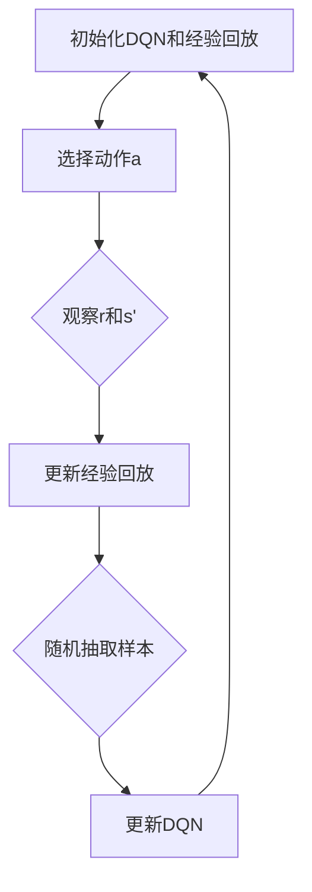
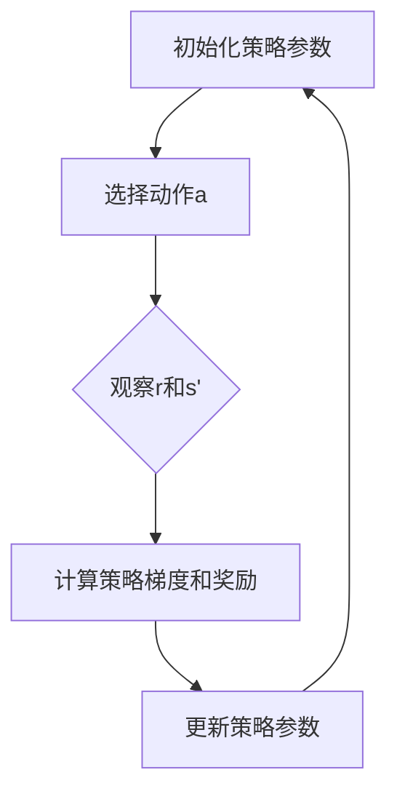

                 


### 引言与背景

#### 第1章: 引言

在当今信息技术飞速发展的时代，人工智能（AI）已经成为推动社会进步的重要力量。而深度强化学习（Deep Reinforcement Learning，DRL）作为AI领域的核心技术之一，正逐渐受到广泛关注。为了更好地理解和掌握这一技术，本文将以《构建具有深度强化学习能力的AI Agent》为标题，深入探讨深度强化学习在AI Agent中的应用与实践。

**关键词：** 深度强化学习、AI Agent、应用实践、技术演进

**摘要：** 本文首先介绍了AI与深度强化学习的崛起背景，阐述了AI Agent的定义与需求，以及深度强化学习在AI Agent中的应用。接着，本文详细分析了深度强化学习的核心概念、基本流程、挑战与优化方法，并探讨了深度强化学习与其他技术的融合。在此基础上，本文介绍了AI Agent的构建基础、构建流程、测试与评估，以及深度强化学习在AI Agent中的应用案例。最后，本文总结了深度强化学习在AI Agent中的前沿进展，为读者提供了全面的技术指导。

**目录大纲：**

1. 第一部分：引言与背景
   - 第1章：引言
     - 1.1 问题背景
     - 1.2 问题描述
     - 1.3 问题解决
     - 1.4 边界与外延
     - 1.5 核心概念与联系
     - 1.6 本章小结

2. 第二部分：深度强化学习基础
   - 第2章：深度强化学习基础
     - 2.1 基本概念
     - 2.2 基本算法
     - 2.3 深度强化学习的挑战与优化
     - 2.4 深度强化学习与其他技术的融合
     - 2.5 本章小结

3. 第三部分：AI Agent的构建与实践
   - 第3章：AI Agent的构建基础
     - 3.1 AI Agent的定义与分类
     - 3.2 AI Agent的构建流程
     - 3.3 AI Agent的测试与评估
     - 3.4 AI Agent的应用案例
     - 3.5 本章小结

4. 第四部分：深度强化学习在AI Agent中的应用
   - 第4章：深度强化学习在AI Agent中的应用
     - 4.1 深度强化学习在AI Agent中的优势
     - 4.2 深度强化学习在AI Agent中的挑战
     - 4.3 深度强化学习在AI Agent中的应用案例
     - 4.4 本章小结

5. 第五部分：深度强化学习在AI Agent中的前沿进展
   - 第5章：深度强化学习的最新进展
     - 5.1 强化学习算法的创新
     - 5.2 深度强化学习在AI Agent中的应用趋势
     - 5.3 本章小结

#### 1.1 问题背景

近年来，人工智能（AI）在各个领域取得了显著的进展。从自动驾驶汽车到智能客服，从医疗诊断到金融风控，AI技术已经深入到了我们的日常生活。然而，随着AI技术的不断发展，如何构建具有高度自主决策能力的AI Agent成为了亟待解决的重要问题。

传统的AI方法主要依赖于预定义的规则和模型，难以适应复杂和动态的环境。而深度强化学习（DRL）作为一种基于试错和反馈机制的学习方法，能够在不断变化的动态环境中实现自主决策和优化。因此，深度强化学习在AI Agent中的应用具有巨大的潜力和价值。

#### 1.1.1 AI与深度强化学习的崛起

人工智能（AI）作为计算机科学的一个分支，旨在使机器能够模拟、延伸和扩展人类的智能。随着计算能力的提升、大数据技术的发展和深度学习算法的突破，AI技术得到了前所未有的关注和重视。特别是在深度学习（Deep Learning）领域，通过模拟人脑神经网络的结构和功能，深度学习算法在图像识别、语音识别、自然语言处理等领域取得了显著的成果。

深度强化学习（DRL）是深度学习和强化学习（Reinforcement Learning，RL）相结合的一种学习方法。强化学习通过智能体（Agent）在与环境的交互过程中不断学习优化策略，以最大化累积奖励。而深度强化学习通过引入深度神经网络，使智能体能够在高维状态空间和动作空间中学习复杂策略。

近年来，深度强化学习在AI领域的崛起主要得益于以下几个因素：

1. **计算能力的提升**：随着计算能力的提升，特别是GPU的广泛应用，深度强化学习算法在训练过程中所需的计算资源得到了极大缓解，使得大规模训练成为可能。

2. **大数据技术的发展**：大数据技术的进步为深度强化学习提供了丰富的训练数据，使得智能体能够在更多的场景中进行学习和优化。

3. **深度学习算法的突破**：深度学习算法在神经网络结构、优化算法和正则化技术等方面的突破，为深度强化学习提供了强有力的支持。

#### 1.1.2 AI Agent的定义与需求

AI Agent是指具备自主决策、行动和学习的智能实体，能够在特定环境中执行任务并实现目标。与传统的预定义规则方法不同，AI Agent能够在不确定、动态和复杂的环境中自主学习和优化策略。

AI Agent的定义可以从以下几个方面进行阐述：

1. **自主决策**：AI Agent能够根据当前环境和目标，自主选择最优动作。

2. **动态学习**：AI Agent能够在与环境的交互过程中不断学习和优化策略，适应动态变化的环境。

3. **适应性强**：AI Agent能够在多种环境和任务中表现出色，具有广泛的适应能力。

在当前技术环境下，AI Agent的需求主要来自于以下几个方面：

1. **自动化决策**：在复杂和动态的工业环境中，AI Agent能够代替人类进行自动化决策，提高生产效率。

2. **智能交互**：在智能客服、智能客服等应用场景中，AI Agent能够提供更加自然和高效的交互服务。

3. **增强现实**：在增强现实（AR）和虚拟现实（VR）等应用场景中，AI Agent能够提供更加丰富的交互体验。

#### 1.1.3 深度强化学习在AI Agent中的应用

深度强化学习在AI Agent中的应用主要体现在以下几个方面：

1. **自主决策**：深度强化学习能够使AI Agent在复杂和动态的环境中实现自主决策，通过不断学习和优化策略，实现最优决策。

2. **学习与优化**：深度强化学习算法能够使AI Agent在与环境的交互过程中不断学习和优化策略，提高任务执行效率。

3. **适应性**：深度强化学习算法具有很好的适应性，能够在不同的环境和任务中表现出良好的性能。

#### 1.2 问题描述

尽管深度强化学习在AI Agent中的应用具有巨大的潜力，但仍然面临许多挑战。以下将从传统AI Agent的局限、深度强化学习解决之道、深度强化学习的核心概念、基本流程、挑战与优化方法等方面进行详细探讨。

**1.2.1 传统AI Agent的局限**

传统的AI Agent主要依赖于预定义的规则和模型，存在以下局限：

1. **规则依赖性**：传统AI Agent依赖于预定义的规则，难以适应动态和不确定的环境。

2. **学习能力不足**：传统AI Agent缺乏自我学习能力，难以在复杂和动态的环境中持续优化策略。

3. **决策效率低**：传统AI Agent在处理复杂任务时，往往需要大量的计算资源和时间。

**1.2.2 深度强化学习解决之道**

深度强化学习通过引入自主决策和学习机制，能够有效解决传统AI Agent的局限。具体来说，深度强化学习在AI Agent中的应用主要解决了以下问题：

1. **规则依赖性**：深度强化学习通过试错和反馈机制，使AI Agent能够在复杂和动态的环境中自主学习和优化策略，减少对预定义规则的依赖。

2. **学习能力**：深度强化学习通过模拟人类学习过程，使AI Agent能够在与环境的交互过程中不断学习和优化策略，提高学习能力。

3. **决策效率**：深度强化学习通过神经网络模型，提高了AI Agent的决策效率，使AI Agent能够在短时间内做出最优决策。

#### 1.3 问题解决

为了构建具有深度强化学习能力的AI Agent，我们需要从以下几个方面进行深入分析和探讨：

**1.3.1 深度强化学习的核心概念**

深度强化学习（Deep Reinforcement Learning，DRL）是强化学习（Reinforcement Learning，RL）的一种，通过引入深度神经网络（Deep Neural Network，DNN），使得智能体（Agent）能够处理高维状态和动作空间。深度强化学习的核心概念主要包括：

1. **状态（State）**：状态是智能体在环境中的当前情况，通常用一组特征向量表示。

2. **动作（Action）**：动作是智能体在特定状态下可以采取的行动，也是智能体与环境的交互方式。

3. **奖励（Reward）**：奖励是智能体在执行某个动作后，从环境中获得的即时反馈，用于评估智能体当前动作的好坏。

4. **策略（Policy）**：策略是智能体在特定状态下的最佳行动方案，通常用概率分布表示。

5. **价值函数（Value Function）**：价值函数是评估智能体在特定状态下执行某个动作的长期收益，分为状态价值函数（State Value Function）和动作价值函数（Action Value Function）。

**1.3.2 深度强化学习的基本流程**

深度强化学习的基本流程主要包括以下几个步骤：

1. **环境初始化**：初始化环境，设置初始状态。

2. **策略学习**：通过深度神经网络，学习智能体在特定状态下的最佳动作。

3. **动作执行**：根据当前状态和策略，执行最优动作。

4. **状态更新**：根据执行的动作，更新当前状态。

5. **奖励反馈**：根据执行的动作和状态更新，获得即时奖励。

6. **策略优化**：根据即时奖励，优化深度神经网络模型，更新策略。

7. **重复迭代**：重复上述步骤，直到达到目标或满足停止条件。

**1.3.3 深度强化学习的挑战与优化方法**

深度强化学习在应用过程中面临许多挑战，包括：

1. **探索与利用平衡**：在深度强化学习中，探索（Exploration）和利用（Exploitation）之间的平衡是一个关键问题。过多的探索可能导致训练时间过长，而过多的利用可能导致智能体无法充分学习环境。

2. **样本效率**：深度强化学习通常需要大量的训练样本，以提高智能体的学习性能。如何提高样本效率是一个重要问题。

3. **稳定性与泛化能力**：深度强化学习模型的稳定性和泛化能力也是一个关键问题。在实际应用中，智能体需要能够适应不同环境和任务，而不仅仅是特定场景。

针对上述挑战，可以采用以下优化方法：

1. **探索策略**：采用epsilon-greedy策略、UCB算法等探索策略，平衡探索和利用。

2. **数据增强**：通过数据增强方法，如动作空间扩展、状态空间扩展等，提高样本效率。

3. **模型正则化**：采用Dropout、L2正则化等模型正则化方法，提高模型稳定性和泛化能力。

#### 1.4 边界与外延

尽管深度强化学习在AI Agent中的应用前景广阔，但仍然存在一些边界和局限性。以下从应用领域、技术演进趋势等方面进行探讨。

**1.4.1 深度强化学习的应用领域**

深度强化学习在以下领域具有广泛的应用前景：

1. **自动驾驶**：自动驾驶是深度强化学习的重要应用领域。通过模拟真实交通场景，深度强化学习可以训练自动驾驶车辆在复杂环境中做出实时决策。

2. **游戏AI**：深度强化学习在游戏AI领域具有广泛的应用，如围棋、国际象棋等。通过不断学习和优化策略，智能体可以在游戏中表现出超越人类的表现。

3. **机器人控制**：在机器人控制领域，深度强化学习可以训练机器人自主完成复杂任务，如无人机飞行、机器人搬运等。

4. **金融风控**：深度强化学习在金融风控领域具有潜在应用，如信用评分、投资策略等。通过学习市场动态和风险因素，智能体可以提供更准确的风险评估和决策建议。

**1.4.2 深度强化学习的技术演进趋势**

随着技术的不断发展，深度强化学习在以下几个方面有望取得进一步突破：

1. **模型压缩与效率优化**：通过模型压缩和优化技术，提高深度强化学习模型的计算效率和运行速度，以支持实时应用。

2. **多智能体系统**：研究多智能体系统中的协同学习和策略优化，提高智能体之间的合作与协调能力。

3. **安全性与可解释性**：提高深度强化学习模型的安全性和可解释性，使其在关键应用场景中得到更广泛的应用。

#### 1.5 核心概念与联系

为了更好地理解深度强化学习在AI Agent中的应用，我们需要从核心概念、算法对比和与其他AI分支的联系等方面进行探讨。

**1.5.1 深度强化学习的关键概念**

深度强化学习（DRL）中的关键概念包括：

1. **状态（State）**：状态是智能体在环境中的当前情况，通常用一组特征向量表示。

2. **动作（Action）**：动作是智能体在特定状态下可以采取的行动，也是智能体与环境的交互方式。

3. **奖励（Reward）**：奖励是智能体在执行某个动作后，从环境中获得的即时反馈，用于评估智能体当前动作的好坏。

4. **策略（Policy）**：策略是智能体在特定状态下的最佳行动方案，通常用概率分布表示。

5. **价值函数（Value Function）**：价值函数是评估智能体在特定状态下执行某个动作的长期收益，分为状态价值函数（State Value Function）和动作价值函数（Action Value Function）。

**1.5.2 深度强化学习中的核心算法对比**

深度强化学习中的核心算法包括Q-Learning算法、Deep Q-Networks（DQN）算法、Policy Gradient算法等。以下是对这些算法的简要对比：

1. **Q-Learning算法**：
   - **基本思想**：通过迭代更新动作价值函数，使智能体在特定状态下选择最佳动作。
   - **优势**：简单易实现，能够处理高维状态空间。
   - **劣势**：样本效率低，易陷入局部最优。

2. **Deep Q-Networks（DQN）算法**：
   - **基本思想**：引入深度神经网络，将Q-Learning算法中的动作价值函数表示为神经网络输出。
   - **优势**：提高了样本效率，能够处理高维状态空间。
   - **劣势**：存在目标网络不稳定、经验回放问题。

3. **Policy Gradient算法**：
   - **基本思想**：直接优化策略概率分布，使智能体在特定状态下选择最佳动作。
   - **优势**：无需更新动作价值函数，计算效率高。
   - **劣势**：梯度消失和梯度爆炸问题，需要较大的样本量。

**1.5.3 深度强化学习与AI的其他分支联系**

深度强化学习与其他AI分支如深度学习、自然语言处理等有着密切的联系：

1. **深度学习**：深度强化学习中的深度神经网络与深度学习中的卷积神经网络（CNN）、循环神经网络（RNN）等有相似之处，可以相互借鉴和融合。

2. **自然语言处理**：在自然语言处理领域，深度强化学习可以用于训练智能对话系统、文本生成等任务，结合自然语言处理技术，提高智能体的交互能力。

#### 1.6 本章小结

本章主要介绍了深度强化学习在AI Agent中的应用背景、核心概念、基本流程、挑战与优化方法，以及与其他AI分支的联系。通过本章的介绍，读者可以初步了解深度强化学习在AI Agent中的重要性和应用前景。在接下来的章节中，我们将进一步探讨深度强化学习的理论基础、算法实现和应用案例，以帮助读者深入掌握这一技术。

----------------------------------------------------------------

## 第一部分：引言与背景

### 第1章：引言

深度强化学习（Deep Reinforcement Learning，DRL）作为一种新兴的人工智能技术，近年来在学术界和工业界都取得了显著的进展。本文将围绕《构建具有深度强化学习能力的AI Agent》这一主题，探讨深度强化学习在AI领域的应用、核心概念、算法实现以及未来发展趋势。希望通过本文的介绍，读者能够对深度强化学习有更全面、深入的理解。

### 1.1 问题背景

#### 1.1.1 AI与深度强化学习的崛起

人工智能（AI）作为21世纪最具革命性的技术之一，已经在各个领域展现出巨大的潜力。从自动化生产线到智能客服，从医疗诊断到金融风控，AI技术正在深刻地改变着我们的生活方式。而深度强化学习（DRL）作为AI的一个重要分支，近年来受到了越来越多的关注。

深度强化学习起源于强化学习（Reinforcement Learning，RL），是一种通过试错和反馈机制进行学习的算法。传统的强化学习算法在处理高维状态和动作空间时存在诸多困难，而深度强化学习通过引入深度神经网络（DNN），使得智能体（Agent）能够在复杂的动态环境中进行有效的学习。随着计算能力的提升和深度学习技术的突破，深度强化学习在自动驾驶、游戏AI、机器人控制等领域取得了显著的成果。

#### 1.1.2 AI Agent的定义与需求

AI Agent是指具备自主决策、行动和学习能力的智能实体，能够在特定环境中执行任务并实现目标。在传统的人工智能应用中，智能系统通常依赖于预定义的规则和模型，难以适应复杂和动态的环境。而AI Agent通过深度强化学习，能够实现自主决策和学习，从而在不确定和动态的环境中表现出更高的适应性和灵活性。

随着AI技术的发展，AI Agent的需求越来越迫切。特别是在自动驾驶、智能机器人、虚拟现实等领域，AI Agent能够提供更加智能和高效的服务。例如，自动驾驶汽车需要实时感知环境、做出决策和调整路径；智能机器人需要自主学习和执行复杂的任务；虚拟现实系统需要提供更加沉浸式的用户体验。这些应用场景都对AI Agent提出了更高的要求，深度强化学习正是实现这些目标的重要技术手段。

#### 1.1.3 深度强化学习在AI Agent中的应用

深度强化学习在AI Agent中的应用主要体现在以下几个方面：

1. **自主决策**：深度强化学习能够使AI Agent在复杂和动态的环境中实现自主决策，通过不断学习和优化策略，实现最优决策。

2. **学习与优化**：深度强化学习算法能够使AI Agent在与环境的交互过程中不断学习和优化策略，提高任务执行效率。

3. **适应性**：深度强化学习算法具有很好的适应性，能够在不同的环境和任务中表现出良好的性能。

例如，在自动驾驶领域，深度强化学习可以训练自动驾驶汽车在复杂交通环境中做出实时决策，提高行驶的安全性和效率。在智能机器人领域，深度强化学习可以训练机器人自主执行复杂的任务，提高机器人的灵活性和适应性。在虚拟现实领域，深度强化学习可以训练虚拟角色在虚拟环境中进行智能交互，提供更加沉浸式的用户体验。

### 1.2 问题描述

尽管深度强化学习在AI Agent中的应用具有巨大的潜力，但仍然面临许多挑战。以下将从传统AI Agent的局限、深度强化学习解决之道、深度强化学习的核心概念、基本流程、挑战与优化方法等方面进行详细探讨。

**1.2.1 传统AI Agent的局限**

传统的AI Agent主要依赖于预定义的规则和模型，存在以下局限：

1. **规则依赖性**：传统AI Agent依赖于预定义的规则，难以适应动态和不确定的环境。

2. **学习能力不足**：传统AI Agent缺乏自我学习能力，难以在复杂和动态的环境中持续优化策略。

3. **决策效率低**：传统AI Agent在处理复杂任务时，往往需要大量的计算资源和时间。

**1.2.2 深度强化学习解决之道**

深度强化学习通过引入自主决策和学习机制，能够有效解决传统AI Agent的局限。具体来说，深度强化学习在AI Agent中的应用主要解决了以下问题：

1. **规则依赖性**：深度强化学习通过试错和反馈机制，使AI Agent能够在复杂和动态的环境中自主学习和优化策略，减少对预定义规则的依赖。

2. **学习能力**：深度强化学习通过模拟人类学习过程，使AI Agent能够在与环境的交互过程中不断学习和优化策略，提高学习能力。

3. **决策效率**：深度强化学习通过神经网络模型，提高了AI Agent的决策效率，使AI Agent能够在短时间内做出最优决策。

### 1.3 问题解决

为了构建具有深度强化学习能力的AI Agent，我们需要从以下几个方面进行深入分析和探讨：

**1.3.1 深度强化学习的核心概念**

深度强化学习（Deep Reinforcement Learning，DRL）是强化学习（Reinforcement Learning，RL）的一种，通过引入深度神经网络（Deep Neural Network，DNN），使得智能体（Agent）能够处理高维状态和动作空间。深度强化学习的核心概念主要包括：

1. **状态（State）**：状态是智能体在环境中的当前情况，通常用一组特征向量表示。

2. **动作（Action）**：动作是智能体在特定状态下可以采取的行动，也是智能体与环境的交互方式。

3. **奖励（Reward）**：奖励是智能体在执行某个动作后，从环境中获得的即时反馈，用于评估智能体当前动作的好坏。

4. **策略（Policy）**：策略是智能体在特定状态下的最佳行动方案，通常用概率分布表示。

5. **价值函数（Value Function）**：价值函数是评估智能体在特定状态下执行某个动作的长期收益，分为状态价值函数（State Value Function）和动作价值函数（Action Value Function）。

**1.3.2 深度强化学习的基本流程**

深度强化学习的基本流程主要包括以下几个步骤：

1. **环境初始化**：初始化环境，设置初始状态。

2. **策略学习**：通过深度神经网络，学习智能体在特定状态下的最佳动作。

3. **动作执行**：根据当前状态和策略，执行最优动作。

4. **状态更新**：根据执行的动作，更新当前状态。

5. **奖励反馈**：根据执行的动作和状态更新，获得即时奖励。

6. **策略优化**：根据即时奖励，优化深度神经网络模型，更新策略。

7. **重复迭代**：重复上述步骤，直到达到目标或满足停止条件。

**1.3.3 深度强化学习的挑战与优化方法**

深度强化学习在应用过程中面临许多挑战，包括：

1. **探索与利用平衡**：在深度强化学习中，探索（Exploration）和利用（Exploitation）之间的平衡是一个关键问题。过多的探索可能导致训练时间过长，而过多的利用可能导致智能体无法充分学习环境。

2. **样本效率**：深度强化学习通常需要大量的训练样本，以提高智能体的学习性能。如何提高样本效率是一个重要问题。

3. **稳定性与泛化能力**：深度强化学习模型的稳定性和泛化能力也是一个关键问题。在实际应用中，智能体需要能够适应不同环境和任务，而不仅仅是特定场景。

针对上述挑战，可以采用以下优化方法：

1. **探索策略**：采用epsilon-greedy策略、UCB算法等探索策略，平衡探索和利用。

2. **数据增强**：通过数据增强方法，如动作空间扩展、状态空间扩展等，提高样本效率。

3. **模型正则化**：采用Dropout、L2正则化等模型正则化方法，提高模型稳定性和泛化能力。

### 1.4 边界与外延

尽管深度强化学习在AI Agent中的应用前景广阔，但仍然存在一些边界和局限性。以下从应用领域、技术演进趋势等方面进行探讨。

#### 1.4.1 深度强化学习的应用领域

深度强化学习在以下领域具有广泛的应用前景：

1. **自动驾驶**：自动驾驶是深度强化学习的重要应用领域。通过模拟真实交通场景，深度强化学习可以训练自动驾驶车辆在复杂环境中做出实时决策。

2. **游戏AI**：深度强化学习在游戏AI领域具有广泛的应用，如围棋、国际象棋等。通过不断学习和优化策略，智能体可以在游戏中表现出超越人类的表现。

3. **机器人控制**：在机器人控制领域，深度强化学习可以训练机器人自主完成复杂任务，如无人机飞行、机器人搬运等。

4. **金融风控**：深度强化学习在金融风控领域具有潜在应用，如信用评分、投资策略等。通过学习市场动态和风险因素，智能体可以提供更准确的风险评估和决策建议。

#### 1.4.2 深度强化学习的技术演进趋势

随着技术的不断发展，深度强化学习在以下几个方面有望取得进一步突破：

1. **模型压缩与效率优化**：通过模型压缩和优化技术，提高深度强化学习模型的计算效率和运行速度，以支持实时应用。

2. **多智能体系统**：研究多智能体系统中的协同学习和策略优化，提高智能体之间的合作与协调能力。

3. **安全性与可解释性**：提高深度强化学习模型的安全性和可解释性，使其在关键应用场景中得到更广泛的应用。

### 1.5 核心概念与联系

为了更好地理解深度强化学习在AI Agent中的应用，我们需要从核心概念、算法对比和与其他AI分支的联系等方面进行探讨。

#### 1.5.1 深度强化学习的关键概念

深度强化学习（DRL）中的关键概念包括：

1. **状态（State）**：状态是智能体在环境中的当前情况，通常用一组特征向量表示。

2. **动作（Action）**：动作是智能体在特定状态下可以采取的行动，也是智能体与环境的交互方式。

3. **奖励（Reward）**：奖励是智能体在执行某个动作后，从环境中获得的即时反馈，用于评估智能体当前动作的好坏。

4. **策略（Policy）**：策略是智能体在特定状态下的最佳行动方案，通常用概率分布表示。

5. **价值函数（Value Function）**：价值函数是评估智能体在特定状态下执行某个动作的长期收益，分为状态价值函数（State Value Function）和动作价值函数（Action Value Function）。

#### 1.5.2 深度强化学习中的核心算法对比

深度强化学习中的核心算法包括Q-Learning算法、Deep Q-Networks（DQN）算法、Policy Gradient算法等。以下是对这些算法的简要对比：

1. **Q-Learning算法**：
   - **基本思想**：通过迭代更新动作价值函数，使智能体在特定状态下选择最佳动作。
   - **优势**：简单易实现，能够处理高维状态空间。
   - **劣势**：样本效率低，易陷入局部最优。

2. **Deep Q-Networks（DQN）算法**：
   - **基本思想**：引入深度神经网络，将Q-Learning算法中的动作价值函数表示为神经网络输出。
   - **优势**：提高了样本效率，能够处理高维状态空间。
   - **劣势**：存在目标网络不稳定、经验回放问题。

3. **Policy Gradient算法**：
   - **基本思想**：直接优化策略概率分布，使智能体在特定状态下选择最佳动作。
   - **优势**：无需更新动作价值函数，计算效率高。
   - **劣势**：梯度消失和梯度爆炸问题，需要较大的样本量。

#### 1.5.3 深度强化学习与AI的其他分支联系

深度强化学习与其他AI分支如深度学习、自然语言处理等有着密切的联系：

1. **深度学习**：深度强化学习中的深度神经网络与深度学习中的卷积神经网络（CNN）、循环神经网络（RNN）等有相似之处，可以相互借鉴和融合。

2. **自然语言处理**：在自然语言处理领域，深度强化学习可以用于训练智能对话系统、文本生成等任务，结合自然语言处理技术，提高智能体的交互能力。

### 1.6 本章小结

本章主要介绍了深度强化学习在AI Agent中的应用背景、核心概念、基本流程、挑战与优化方法，以及与其他AI分支的联系。通过本章的介绍，读者可以初步了解深度强化学习在AI Agent中的重要性和应用前景。在接下来的章节中，我们将进一步探讨深度强化学习的理论基础、算法实现和应用案例，以帮助读者深入掌握这一技术。

----------------------------------------------------------------

## 第二部分：深度强化学习基础

### 第2章：深度强化学习基础

在理解深度强化学习（Deep Reinforcement Learning，DRL）在AI Agent中的应用之前，我们需要首先了解深度强化学习的基础概念和基本算法。本章将深入探讨深度强化学习的基本概念、核心算法，以及其在复杂环境中的挑战和优化方法。

### 2.1 基本概念

深度强化学习是基于强化学习（Reinforcement Learning，RL）的一种学习方法，它结合了深度学习（Deep Learning）的强大表示能力和强化学习的试错学习机制。以下是深度强化学习中的几个关键概念：

#### 2.1.1 奖励与策略

**奖励（Reward）**：奖励是智能体在执行动作后从环境中获得的即时反馈。奖励的目的是引导智能体选择那些能够带来最大累积奖励的动作。

**策略（Policy）**：策略是智能体在特定状态下选择动作的规则。在深度强化学习中，策略通常通过神经网络来表示，使得智能体能够根据状态自动选择动作。

#### 2.1.2 状态与动作

**状态（State）**：状态是智能体在特定时间点的环境和自身状态的抽象表示。状态通常由一组特征向量组成，这些特征向量可以是视觉图像、文本数据或者其他形式的感知信息。

**动作（Action）**：动作是智能体在特定状态下可以采取的行动。动作的集合构成了动作空间，智能体需要从动作空间中选择一个动作。

#### 2.1.3 策略网络与价值网络

**策略网络（Policy Network）**：策略网络是深度强化学习中的神经网络模型，它的任务是学习智能体在不同状态下的最佳动作策略。

**价值网络（Value Network）**：价值网络是另一个神经网络模型，它的任务是估计智能体在执行特定动作后的长期回报。价值网络可以帮助智能体评估当前状态下每个动作的价值，从而选择最佳动作。

### 2.2 基本算法

深度强化学习中有多种基本算法，这些算法通过不同的方式学习智能体的策略。以下是几种主要的深度强化学习算法：

#### 2.2.1 Q-Learning算法

**Q-Learning** 是一种值迭代算法，它通过更新动作价值函数来学习策略。在Q-Learning中，每个动作都有对应的价值函数，表示在特定状态下执行该动作的预期回报。

**算法原理：**
$$
Q(s, a) = Q(s, a) + \alpha [r + \gamma \max_{a'} Q(s', a') - Q(s, a)]
$$

其中，$Q(s, a)$ 是当前的动作价值函数，$r$ 是即时奖励，$\gamma$ 是折扣因子，$\alpha$ 是学习率。

**实现步骤：**
1. 初始化动作价值函数 $Q(s, a)$。
2. 在每个时间步，智能体选择动作 $a$。
3. 执行动作并观察即时奖励 $r$ 和新的状态 $s'$。
4. 更新动作价值函数。

**Mermaid流程图：**
```mermaid
graph TD
A[初始化Q(s, a)] --> B[选择动作a]
B --> C{观察r和s'}
C -->|更新Q(s, a)| D[重复]
D --> B
```

#### 2.2.2 Deep Q-Networks（DQN）算法

**DQN** 算法引入了深度神经网络来近似动作价值函数，从而处理高维状态空间。DQN使用经验回放（Experience Replay）来提高学习稳定性。

**算法原理：**
$$
Q(s, a) = Q(s, a) + \alpha [r + \gamma \max_{a'} \hat{Q}(s', a') - Q(s, a)]
$$

其中，$\hat{Q}(s', a')$ 是深度神经网络输出的动作价值估计。

**实现步骤：**
1. 初始化深度神经网络 $\hat{Q}(s', a')$ 和经验回放内存。
2. 在每个时间步，智能体选择动作 $a$。
3. 执行动作并观察即时奖励 $r$ 和新的状态 $s'$。
4. 将 $(s, a, r, s', a')$ 存入经验回放内存。
5. 从经验回放内存中随机抽取样本。
6. 更新深度神经网络。

**Mermaid流程图：**


#### 2.2.3 Policy Gradient算法

**Policy Gradient** 算法通过直接优化策略概率分布来学习策略。它使用梯度上升法来更新策略参数，以最大化累积奖励。

**算法原理：**
$$
\theta = \theta + \alpha \nabla_\theta J(\theta)
$$

其中，$\theta$ 是策略参数，$J(\theta)$ 是策略的奖励期望。

**实现步骤：**
1. 初始化策略参数 $\theta$。
2. 在每个时间步，智能体根据策略选择动作 $a$。
3. 执行动作并观察即时奖励 $r$ 和新的状态 $s'$。
4. 计算策略梯度和奖励。
5. 更新策略参数。

**Mermaid流程图：**


### 2.3 深度强化学习的挑战与优化

尽管深度强化学习具有强大的学习能力和自适应能力，但在实际应用中仍然面临许多挑战：

#### 2.3.1 探索与利用平衡

**探索（Exploration）与利用（Exploitation）平衡**是深度强化学习中的一个关键挑战。智能体需要在探索新策略和利用已有策略之间找到平衡点，以避免陷入局部最优。

**解决方案：**
- **epsilon-greedy策略**：在每一步以一定的概率选择随机动作进行探索，同时以1-epsilon的概率选择当前最优动作进行利用。
- **UCB算法**：基于置信区间（Confidence Interval）选择动作，既考虑了动作的即时奖励，也考虑了动作的探索次数。

#### 2.3.2 迁移学习

**迁移学习（Transfer Learning）** 是将已在一个任务上训练好的模型迁移到另一个相关任务上的方法。深度强化学习中的迁移学习可以帮助智能体更快地适应新环境。

**解决方案：**
- **经验回放**：通过经验回放机制，将先前任务的样本用于新任务的训练。
- **预训练模型**：使用在相关任务上预训练的深度神经网络作为起点，进一步微调以适应新任务。

#### 2.3.3 模型压缩与效率优化

**模型压缩与效率优化** 是为了减少深度强化学习模型的计算资源和存储需求，提高模型的实时运行效率。

**解决方案：**
- **模型剪枝（Model Pruning）**：通过剪枝冗余的神经元和连接，减少模型的参数数量。
- **量化（Quantization）**：将模型的权重和激活值量化为低精度表示，降低计算需求。

### 2.4 深度强化学习与其他技术的融合

深度强化学习与其他技术的融合可以进一步提升其在AI Agent中的应用效果：

#### 2.4.1 深度强化学习与生成对抗网络（GAN）的融合

**生成对抗网络（GAN）** 是一种通过对抗训练生成数据的强大技术。深度强化学习与GAN的融合可以用于生成更加多样化和真实的训练数据，提高智能体的学习效果。

#### 2.4.2 深度强化学习与计算机视觉的结合

**计算机视觉** 是深度强化学习的重要应用领域。将深度强化学习与计算机视觉技术结合，可以增强智能体在视觉感知和图像理解方面的能力。

#### 2.4.3 深度强化学习与自然语言处理的融合

**自然语言处理（NLP）** 是深度强化学习在智能对话系统和文本生成等领域的应用基础。将深度强化学习与NLP技术结合，可以提升智能体在语言理解和生成方面的能力。

### 2.5 本章小结

本章介绍了深度强化学习的基础概念和核心算法，包括Q-Learning、DQN和Policy Gradient算法。我们还探讨了深度强化学习在复杂环境中的挑战和优化方法，以及与其他技术的融合应用。通过本章的学习，读者可以更好地理解深度强化学习的基本原理和应用，为后续章节的深入学习打下坚实的基础。

----------------------------------------------------------------

## 第三部分：AI Agent的构建与实践

### 第3章：AI Agent的构建基础

AI Agent的构建是实现智能化系统的重要步骤。本章节将详细介绍AI Agent的定义与分类、构建流程、测试与评估，以及实际应用中的案例。通过这些内容，读者可以全面了解AI Agent的构建方法，为后续的实践应用提供指导。

### 3.1 AI Agent的定义与分类

#### 3.1.1 AI Agent的概念

AI Agent是指具有自主决策、行动和学习能力的智能实体，能够在特定环境中执行任务并实现目标。AI Agent的核心特征包括：

1. **自主决策**：AI Agent能够在未知或动态变化的环境中根据当前状态自主做出决策。

2. **行动能力**：AI Agent能够根据决策执行相应的行动，与外界环境进行交互。

3. **学习能力**：AI Agent能够在执行任务的过程中不断学习和优化策略，以适应复杂和多变的环境。

4. **适应性**：AI Agent能够适应不同的任务和环境，具有广泛的适用性。

#### 3.1.2 AI Agent的分类

根据功能和应用场景的不同，AI Agent可以分为以下几类：

1. **通用型AI Agent**：这类Agent具有广泛的自主决策和学习能力，可以适应多种不同的任务和环境。例如，智能客服、智能助手等。

2. **专用型AI Agent**：这类Agent针对特定的任务或应用场景进行设计和训练，具有特定的功能和性能。例如，自动驾驶汽车、智能机器人等。

3. **混合型AI Agent**：这类Agent结合了通用型AI Agent和专用型AI Agent的特点，既具有广泛的适应性，又能够在特定任务中表现出色。例如，智能家居控制系统、智能监控系统等。

#### 3.1.3 AI Agent的关键功能

AI Agent的关键功能包括以下几个方面：

1. **感知**：AI Agent能够感知外部环境的信息，如视觉、听觉、触觉等。

2. **决策**：AI Agent能够根据感知到的信息进行自主决策，选择最优的行动方案。

3. **执行**：AI Agent能够执行决策生成的行动，与外界环境进行交互。

4. **学习**：AI Agent能够从与环境的交互中学习，不断优化自身的策略和行为。

5. **自适应**：AI Agent能够根据环境的变化调整自身的策略和行为，适应新的情况。

### 3.2 AI Agent的构建流程

构建AI Agent是一个系统工程，涉及多个环节。以下是一个典型的AI Agent构建流程：

#### 3.2.1 需求分析与设计

需求分析是AI Agent构建的第一步，主要任务包括：

1. **明确任务目标**：确定AI Agent需要实现的功能和性能指标。

2. **环境建模**：对AI Agent将要操作的环境进行抽象和建模，包括状态、动作、奖励等。

3. **功能设计**：根据任务目标和环境模型，设计AI Agent的关键功能和组成部分。

4. **性能指标**：确定评估AI Agent性能的指标，如准确率、响应速度等。

#### 3.2.2 数据准备与预处理

数据是AI Agent训练的重要资源。数据准备与预处理主要包括以下几个步骤：

1. **数据收集**：根据任务需求，收集相关的数据集，包括环境状态、动作、奖励等。

2. **数据清洗**：去除数据集中的噪声和错误，确保数据的质量。

3. **数据标注**：对数据集中的样本进行标注，为后续的训练提供标签。

4. **数据预处理**：对数据进行标准化、归一化等处理，以便于模型的训练。

#### 3.2.3 模型训练与优化

模型训练与优化是AI Agent构建的核心步骤。具体过程如下：

1. **选择模型**：根据任务需求和数据特点，选择合适的深度学习模型。

2. **训练模型**：使用训练数据集对模型进行训练，调整模型的参数。

3. **优化模型**：通过交叉验证等方法，评估模型的性能，并调整模型结构或参数，以优化性能。

4. **超参数调整**：调整学习率、批次大小等超参数，以获得更好的训练效果。

#### 3.2.4 测试与评估

测试与评估是验证AI Agent性能的重要环节。主要步骤包括：

1. **测试数据集**：准备与训练数据集不同的测试数据集，用于评估模型的性能。

2. **性能评估**：使用测试数据集对模型进行评估，计算各项性能指标。

3. **错误分析**：分析模型在测试数据集中的错误情况，找出可能的原因。

4. **优化迭代**：根据测试结果，对模型进行进一步的优化和调整。

### 3.3 AI Agent的测试与评估

AI Agent的测试与评估是确保其性能和可靠性的关键步骤。以下是一些常见的测试与评估方法：

#### 3.3.1 测试指标与方法

1. **准确率（Accuracy）**：判断模型预测结果与真实结果的一致性。

2. **召回率（Recall）**：判断模型对正类样本的识别能力。

3. **精确率（Precision）**：判断模型对负类样本的识别能力。

4. **F1值（F1 Score）**：综合考虑准确率和召回率，是一个综合评价指标。

5. **响应时间（Response Time）**：评估模型在处理请求时的响应速度。

#### 3.3.2 评估工具与平台

1. **TensorFlow**：TensorFlow是一个开源的深度学习框架，支持多种评估指标的计算。

2. **Scikit-learn**：Scikit-learn是一个开源的机器学习库，提供了丰富的评估工具和方法。

3. **Keras**：Keras是一个基于TensorFlow的深度学习框架，简化了深度学习模型的构建和评估。

#### 3.3.3 持续优化与迭代

AI Agent的测试与评估是一个持续的过程。随着新数据和用户反馈的出现，需要对模型进行持续的优化和迭代：

1. **数据更新**：定期更新训练数据集，以反映环境的变化。

2. **模型再训练**：根据新数据对模型进行重新训练，以提高模型性能。

3. **用户反馈**：收集用户反馈，用于改进模型的行为和交互。

4. **迭代优化**：根据评估结果和用户反馈，不断优化模型结构和超参数。

### 3.4 AI Agent的应用案例

AI Agent在许多实际应用场景中展现出了巨大的价值。以下是一些典型的应用案例：

#### 3.4.1 游戏

AI Agent在游戏领域具有广泛的应用，如棋类游戏、电子游戏等。通过深度强化学习，AI Agent可以训练出具有高超游戏技巧的智能对手。

#### 3.4.2 自动驾驶

自动驾驶是AI Agent的重要应用领域。通过深度强化学习，自动驾驶汽车可以自主感知环境、做出决策和调整路径，提高行驶的安全性和效率。

#### 3.4.3 机器人

AI Agent在机器人领域可以用于自主执行复杂任务，如无人驾驶飞行器、智能机器人等。通过深度强化学习，机器人可以学会自主导航、操作工具等技能。

#### 3.4.4 智能客服

智能客服是AI Agent的另一个重要应用领域。通过深度强化学习，智能客服可以自动处理用户请求、回答问题，提供个性化的服务。

### 3.5 本章小结

本章介绍了AI Agent的定义与分类、构建流程、测试与评估，以及实际应用中的案例。通过本章的学习，读者可以全面了解AI Agent的构建方法和应用场景，为后续的实践应用提供指导。在AI技术的发展和应用中，AI Agent将继续发挥重要作用，推动智能化系统的进步。

----------------------------------------------------------------

## 第四部分：深度强化学习在AI Agent中的应用

### 第4章：深度强化学习在AI Agent中的应用

深度强化学习（Deep Reinforcement Learning，DRL）在AI Agent中的应用具有广泛的前景，能够显著提升AI Agent在复杂环境中的自主决策能力和学习效率。本章将详细探讨深度强化学习在AI Agent中的应用优势、面临的挑战，以及具体的应用案例。

### 4.1 深度强化学习在AI Agent中的优势

深度强化学习为AI Agent带来了以下几个显著的优势：

#### 4.1.1 自主决策能力

深度强化学习能够使AI Agent在复杂和动态的环境中实现自主决策。通过不断学习和优化策略，AI Agent可以在不确定的环境中做出最优选择，从而提高决策的准确性和效率。

#### 4.1.2 对复杂环境的适应能力

深度强化学习通过深度神经网络处理高维状态空间和动作空间，使AI Agent能够适应更加复杂的动态环境。相比传统方法，深度强化学习在处理复杂环境时具有更高的灵活性和鲁棒性。

#### 4.1.3 高效的探索与学习

深度强化学习通过引入探索策略，如epsilon-greedy策略和UCB算法，使AI Agent在探索未知环境和学习过程中保持平衡。这使得AI Agent能够更高效地学习环境，提高学习效率。

#### 4.1.4 自适应能力

深度强化学习算法能够使AI Agent在执行任务的过程中不断学习和调整策略，适应环境变化和新情况。这使得AI Agent具有更好的自适应能力，能够在不同场景中表现出色。

### 4.2 深度强化学习在AI Agent中的挑战

尽管深度强化学习在AI Agent中具有显著优势，但在实际应用中仍然面临一些挑战：

#### 4.2.1 训练效率与稳定性

深度强化学习算法通常需要大量的训练样本和计算资源，导致训练过程较为耗时。此外，训练过程容易受到噪声和不确定性影响，导致模型稳定性不足。

**解决方案：**
- **经验回放（Experience Replay）**：通过经验回放机制，减少训练过程中噪声的影响。
- **优先经验回放（Prioritized Experience Replay）**：根据经验的重要程度进行回放，提高训练效率。

#### 4.2.2 策略网络的可解释性

深度强化学习模型通常由大量参数组成，导致其策略网络的可解释性较低。这使得在实际应用中，用户难以理解AI Agent的决策过程和策略。

**解决方案：**
- **可视化分析**：通过可视化工具，展示AI Agent的状态和动作，提高可解释性。
- **简化模型结构**：设计更简单的模型结构，提高策略网络的透明度和可解释性。

#### 4.2.3 安全性与伦理问题

深度强化学习在AI Agent中的应用涉及到安全性和伦理问题。特别是在自动驾驶、医疗诊断等关键领域，AI Agent的决策必须确保安全和符合伦理规范。

**解决方案：**
- **安全约束**：在设计AI Agent时，引入安全约束，确保其决策不会导致危险行为。
- **伦理审查**：对AI Agent的应用进行伦理审查，确保其行为符合社会伦理规范。

### 4.3 深度强化学习在AI Agent中的应用案例

深度强化学习在AI Agent中的应用已经取得了许多实际成果。以下是一些典型的应用案例：

#### 4.3.1 游戏

在游戏领域，深度强化学习已经成功应用于训练智能游戏对手。例如，AlphaGo通过深度强化学习算法，在围棋比赛中击败了人类顶尖选手。此外，深度强化学习还可以应用于电子游戏，如《星际争霸》等，训练出具有高水平的游戏AI。

**应用解读：**
- **优势**：深度强化学习使游戏AI具有高度的自主决策能力，能够应对复杂和动态的游戏环境。
- **挑战**：游戏AI的训练过程需要大量计算资源和时间，同时需要确保游戏公平性和可玩性。

#### 4.3.2 自动驾驶

在自动驾驶领域，深度强化学习被广泛应用于自动驾驶车辆的感知、决策和路径规划。通过深度强化学习，自动驾驶车辆可以自主感知道路环境、识别障碍物，并做出实时决策。

**应用解读：**
- **优势**：深度强化学习使自动驾驶车辆能够适应复杂和动态的交通环境，提高行驶的安全性和效率。
- **挑战**：自动驾驶系统的安全性、稳定性和可解释性仍然是一个重要挑战。

#### 4.3.3 机器人

在机器人领域，深度强化学习被应用于机器人控制、自主导航和任务执行。通过深度强化学习，机器人可以自主学习复杂任务，提高任务执行效率和灵活性。

**应用解读：**
- **优势**：深度强化学习使机器人具有自主决策和自适应能力，能够适应复杂和动态的工作环境。
- **挑战**：机器人控制系统的稳定性和可靠性是一个关键问题，需要进一步研究和优化。

#### 4.3.4 智能客服

在智能客服领域，深度强化学习被应用于智能对话系统和客户行为预测。通过深度强化学习，智能客服可以与用户进行自然语言交互，提供个性化的服务。

**应用解读：**
- **优势**：深度强化学习使智能客服具有高度自主的对话能力和学习能力，能够提高客户满意度和服务质量。
- **挑战**：智能客服系统的安全性、隐私保护和用户体验是一个重要挑战。

### 4.4 本章小结

本章介绍了深度强化学习在AI Agent中的应用优势、面临的挑战，以及具体的应用案例。通过本章的学习，读者可以了解深度强化学习在AI Agent中的实际应用和价值，为未来的研究和实践提供参考。在未来的发展中，深度强化学习将继续在AI Agent中发挥重要作用，推动人工智能技术的进步和应用。

----------------------------------------------------------------

## 第五部分：深度强化学习在AI Agent中的前沿进展

### 第5章：深度强化学习的最新进展

深度强化学习（Deep Reinforcement Learning，DRL）在近年来取得了显著的研究进展，不仅提高了算法的性能，还拓展了其在各种应用场景中的适用性。本章将介绍深度强化学习在算法创新和应用趋势方面的最新进展。

### 5.1 强化学习算法的创新

强化学习算法的创新是近年来DRL领域的一个重要方向，以下是一些具有代表性的算法创新：

#### 5.1.1 Model-Based DRL算法

**Model-Based DRL算法** 通过建立一个环境模型来预测状态转移概率和奖励，从而改善学习效率。这类算法包括：

1. **Proximal Policy Optimization (PPO)**：PPO算法是一种基于策略梯度的方法，通过引入近端策略优化技术，提高了算法的稳定性和性能。

2. **Twin Delayed Deep Deterministic Policy Gradient (TD3)**：TD3算法通过使用双Q网络和一个预测模型，改进了目标网络的稳定性，提高了学习效率。

3. **Deep Deterministic Policy Gradient (DDPG)**：DDPG算法是一种基于模型预测的算法，通过使用目标网络和经验回放，提高了算法在连续动作空间中的性能。

**算法原理对比表格：**

| 算法 | 基本思想 | 优势 | 劣势 |
| --- | --- | --- | --- |
| PPO | 近端策略优化 | 稳定性好，收敛速度快 | 对参数调整敏感 |
| TD3 | 双Q网络和预测模型 | 预测准确性高，稳定性好 | 训练时间较长 |
| DDPG | 目标网络和经验回放 | 适用于连续动作空间 | 需要大量样本 |

**Mermaid ER实体关系图：**

```mermaid
erDiagram
  Policy <<|-- Q1
  Policy <<|-- Q2
  Q1 ||--|{ Environment }
  Q2 ||--|{ Environment }
  Environment ||--|{ Action }
  Action ||--|{ Reward }
```

#### 5.1.2 Model-Free DRL算法

**Model-Free DRL算法** 不依赖于环境模型，而是直接从实际交互中学习策略。以下是一些具有代表性的算法：

1. **Asynchronous Advantage Actor-Critic (A3C)**：A3C算法通过异步并行训练，提高了学习效率和样本利用率。

2. **Deep Q-Network (DQN)**：DQN算法通过使用经验回放和目标网络，解决了值函数偏差和样本相关性问题。

3. **Soft Actor-Critic (SAC)**：SAC算法通过最大化期望回报和熵，提高了策略的探索能力和稳定性。

**算法原理对比表格：**

| 算法 | 基本思想 | 优势 | 劣势 |
| --- | --- | --- | --- |
| A3C | 异步并行训练 | 学习效率高，适用于大规模任务 | 需要大量计算资源 |
| DQN | 经验回放和目标网络 | 解决了样本相关性问题 | 需要大量训练时间 |
| SAC | 最大化期望回报和熵 | 探索能力强，策略稳定性好 | 需要复杂的超参数调整 |

**Mermaid ER实体关系图：**

```mermaid
erDiagram
  Policy ||--|{ Environment }
  Environment ||--|{ State }
  State ||--|{ Action }
  Action ||--|{ Reward }
  QValue ||--|{ State }
  TargetQValue ||--|{ State }
```

#### 5.1.3 新型DRL算法

随着深度强化学习的不断发展，一些新型算法不断涌现，如：

1. **Rainbow DQN**：Rainbow DQN结合了DQN、Double DQN、优先经验回放等技术，提高了算法的性能。

2. **Rainbow DDPG**：Rainbow DDPG结合了DDPG、Prioritized Experience Replay等技术，提高了算法在连续动作空间中的性能。

3. **Multi-Agent DRL**：多智能体DRL算法通过协同学习，提高了智能体之间的合作能力。

### 5.2 深度强化学习在AI Agent中的应用趋势

随着深度强化学习算法的不断进步，其在AI Agent中的应用趋势也在不断变化，以下是一些重要的应用趋势：

#### 5.2.1 多智能体系统

多智能体系统（Multi-Agent System，MAS）是深度强化学习的一个重要应用方向。通过协同学习和策略优化，多个智能体可以在同一环境中合作完成任务。以下是一些多智能体系统的应用趋势：

1. **合作与竞争**：在合作场景中，智能体之间需要协调行动以共同完成任务；在竞争场景中，智能体之间需要竞争资源以实现各自的目标。

2. **分布式学习**：分布式学习可以提高多智能体系统的训练效率，减少通信开销。

3. **博弈论模型**：博弈论模型可以用于分析智能体之间的交互和决策，优化智能体的策略。

#### 5.2.2 安全性与可解释性

随着深度强化学习在关键领域的应用，安全性和可解释性成为了重要的研究话题。以下是一些安全性和可解释性的应用趋势：

1. **安全约束**：在设计智能体策略时，引入安全约束以确保系统的安全性。

2. **可解释性增强**：通过可视化工具和模型压缩技术，提高智能体决策过程的可解释性。

3. **对抗性攻击与防御**：研究对抗性攻击和防御技术，提高系统的鲁棒性和安全性。

#### 5.2.3 人类-智能体交互

人类-智能体交互（Human-Agent Interaction，HAI）是深度强化学习在AI Agent中另一个重要的应用方向。以下是一些人类-智能体交互的应用趋势：

1. **自然语言处理**：将自然语言处理（NLP）与深度强化学习相结合，提高智能体与人类用户的交互能力。

2. **多模态感知**：通过多模态感知技术，如语音、视觉等，提高智能体对人类用户意图的理解。

3. **个性化服务**：通过学习用户的偏好和历史行为，提供个性化的智能服务。

### 5.3 本章小结

本章介绍了深度强化学习在算法创新和应用趋势方面的最新进展。通过本章的学习，读者可以了解当前深度强化学习的研究热点和未来发展趋势，为后续的研究和应用提供指导。在未来的发展中，深度强化学习将继续在AI Agent中发挥重要作用，推动人工智能技术的进步和应用。

