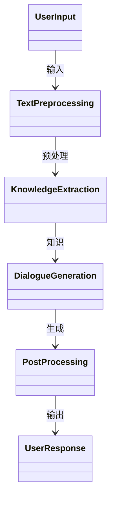
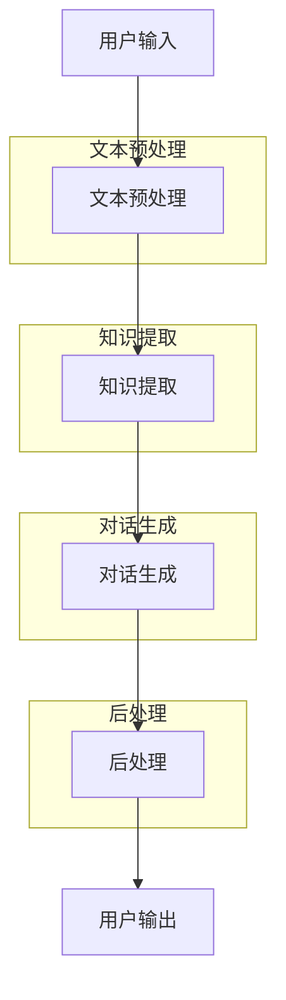
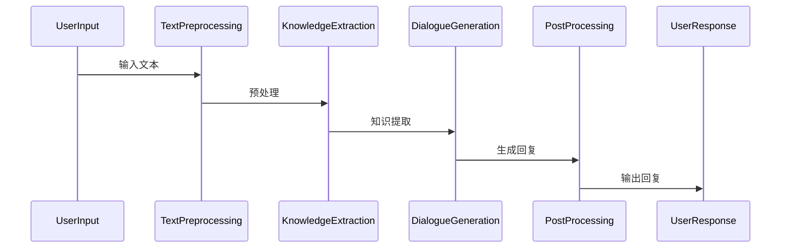
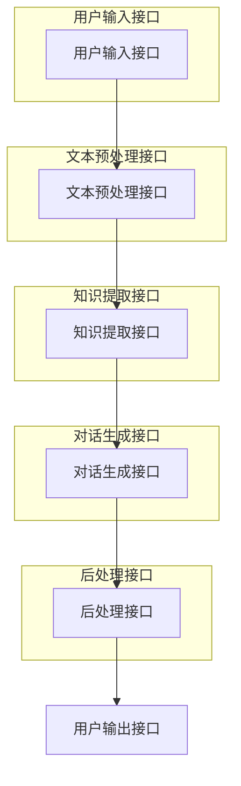

                 

# 构建具有知识蒸馏能力的AI Agent

## 关键词

AI Agent、知识蒸馏、机器学习、深度学习、神经网络、模型压缩、模型压缩算法、联邦学习、强化学习

## 摘要

随着人工智能技术的快速发展，AI Agent的应用场景日益广泛。然而，如何构建一个具有知识蒸馏能力的AI Agent成为了一个重要且具有挑战性的问题。本文将详细探讨知识蒸馏的基本概念、原理及其在构建AI Agent中的应用。我们将从背景介绍、核心概念与联系、算法原理讲解、系统分析与架构设计方案、项目实战等方面，一步步深入探讨如何构建具有知识蒸馏能力的AI Agent，并为读者提供最佳实践和注意事项。

## 目录

### 第1章 引言

- 人工智能与AI Agent的概述
- 知识蒸馏的概念与背景
- 本文目的与结构安排

### 第2章 知识蒸馏基本概念与原理

- 知识蒸馏的定义
- 知识蒸馏的基本流程
- 知识蒸馏的优势与挑战

### 第3章 AI Agent构建基础

- AI Agent的基本概念
- AI Agent的常见类型
- AI Agent构建的关键技术

### 第4章 知识蒸馏在AI Agent中的应用

- 知识蒸馏与AI Agent的融合策略
- 知识蒸馏在AI Agent训练中的应用
- 知识蒸馏在AI Agent推理中的应用

### 第5章 系统分析与架构设计方案

- 问题描述与需求分析
- 系统功能设计
- 系统架构设计
- 系统接口设计与交互

### 第6章 项目实战

- 环境安装与配置
- 系统核心实现
- 代码应用解读与分析
- 实际案例分析

### 第7章 最佳实践与注意事项

- 知识蒸馏的最佳实践
- AI Agent构建的注意事项
- 拓展阅读

### 第8章 总结与展望

- 文章总结
- 未来发展方向
- 研究展望

## 第1章 引言

### 1.1 人工智能与AI Agent的概述

人工智能（Artificial Intelligence，AI）作为计算机科学的一个分支，旨在使计算机具备类似人类的智能。AI Agent是人工智能领域的一个重要概念，它是一种具有感知、决策、执行等功能的智能体，能够在特定环境中完成特定任务。

AI Agent可以分为两大类：一类是基于规则和符号逻辑的Agent，另一类是基于数据驱动和机器学习的Agent。随着深度学习的兴起，基于数据驱动的AI Agent得到了广泛应用，并在各个领域取得了显著成果。

### 1.2 知识蒸馏的概念与背景

知识蒸馏（Knowledge Distillation）是一种将大型复杂模型（教师模型）的知识传递给小型简化模型（学生模型）的技术。知识蒸馏的核心思想是，教师模型在训练过程中积累了丰富的知识，而学生模型由于模型容量和计算资源的限制，无法完全吸收教师模型的所有知识。通过知识蒸馏，可以将教师模型的知识以一种浓缩、简化的形式传递给学生模型，从而提高学生模型的性能。

知识蒸馏技术最早由Hinton等人于2015年提出，并迅速在机器学习领域得到了广泛关注。知识蒸馏的应用场景主要包括模型压缩、迁移学习、联邦学习等。

### 1.3 本文目的与结构安排

本文旨在深入探讨如何构建具有知识蒸馏能力的AI Agent，主要包括以下几个方面的内容：

1. 知识蒸馏的基本概念与原理
2. AI Agent的构建基础
3. 知识蒸馏在AI Agent中的应用
4. 系统分析与架构设计方案
5. 项目实战
6. 最佳实践与注意事项

通过本文的探讨，希望读者能够对知识蒸馏技术及其在AI Agent中的应用有更深入的理解，为实际项目的开发和优化提供参考。

### 第2章 知识蒸馏基本概念与原理

#### 2.1 知识蒸馏的定义

知识蒸馏（Knowledge Distillation）是一种将复杂模型的知识传递给简化模型的技术。在机器学习中，通常存在一种大型、参数众多的教师模型（Teacher Model）和一种小型、参数较少的学生模型（Student Model）。知识蒸馏的目标是将教师模型的知识和经验传递给学生模型，使得学生模型能够在有限参数和计算资源的限制下，达到与教师模型相近的性能。

#### 2.2 知识蒸馏的基本流程

知识蒸馏的基本流程包括以下几个步骤：

1. **教师模型训练**：首先，使用大量的训练数据集对教师模型进行训练，使其达到较高的性能指标。
2. **知识提取**：在教师模型训练完成后，从教师模型中提取知识，这些知识可以是模型参数、内部表示、激活值等。
3. **学生模型初始化**：使用提取的知识对学生模型进行初始化，从而为学生模型提供教师模型的知识和经验。
4. **学生模型训练**：使用原始数据集对学生模型进行训练，同时结合教师模型提供的知识，逐步优化学生模型的参数。

#### 2.3 知识蒸馏的优势与挑战

知识蒸馏技术具有以下优势：

1. **模型压缩**：通过知识蒸馏，可以将大型复杂的教师模型压缩成小型简化的学生模型，从而减少模型参数和计算资源的需求。
2. **迁移学习**：知识蒸馏可以有效地将教师模型在不同任务上的知识传递给学生模型，从而提高学生模型在新的任务上的性能。
3. **联邦学习**：在联邦学习场景中，知识蒸馏可以有效地解决模型通信带宽和隐私保护的问题，使得各方可以共享教师模型的知识，从而优化各自的学生模型。

然而，知识蒸馏技术也面临一些挑战：

1. **知识保留**：如何有效地从教师模型中提取知识，并将其传递给学生模型，确保学生模型能够保留教师模型的大部分知识，是一个关键问题。
2. **计算效率**：知识蒸馏过程中涉及大量的计算和通信，如何提高计算效率和通信效率是一个重要挑战。
3. **模型泛化能力**：学生模型在保留教师模型知识的同时，如何保持其自身的泛化能力，避免过拟合，也是一个需要解决的问题。

#### 2.4 知识蒸馏的分类

根据知识提取和传递的方式，知识蒸馏可以分为以下几种类型：

1. **软目标蒸馏**：在学生模型的训练过程中，使用教师模型的输出作为软目标，即概率分布，指导学生模型的训练。
2. **硬目标蒸馏**：在学生模型的训练过程中，使用教师模型的输出作为硬目标，即具体的输出结果，指导学生模型的训练。
3. **中间表示蒸馏**：在学生模型的训练过程中，使用教师模型的内部表示（激活值、中间层输出等）作为软目标，指导学生模型的训练。
4. **元学习蒸馏**：通过元学习的方法，学习一种能够从教师模型中提取知识的通用蒸馏策略。

#### 2.5 知识蒸馏的应用场景

知识蒸馏技术可以应用于多个领域，包括但不限于：

1. **模型压缩**：通过知识蒸馏，可以将大型复杂的深度神经网络压缩成小型简化的模型，从而减少模型存储和计算资源的需求。
2. **迁移学习**：在迁移学习场景中，知识蒸馏可以将教师模型在不同任务上的知识传递给学生模型，从而提高学生模型在新的任务上的性能。
3. **联邦学习**：在联邦学习场景中，知识蒸馏可以有效地解决模型通信带宽和隐私保护的问题，使得各方可以共享教师模型的知识，从而优化各自的学生模型。
4. **强化学习**：在强化学习场景中，知识蒸馏可以将教师模型的经验传递给学生模型，从而提高学生模型在新的环境中的适应能力。

### 总结

知识蒸馏是一种将教师模型的知识传递给学生模型的技术，通过知识蒸馏，可以构建具有知识蒸馏能力的AI Agent，从而提高AI Agent的模型压缩能力、迁移学习和联邦学习性能。本章介绍了知识蒸馏的基本概念、原理和分类，以及其应用场景，为后续章节的深入探讨奠定了基础。

## 第3章 AI Agent构建基础

### 3.1 AI Agent的基本概念

AI Agent是指具有自主决策和执行能力的人工智能实体，能够在复杂环境中执行特定任务。AI Agent通常具有以下基本特性：

1. **感知能力**：AI Agent能够感知环境中的信息，如文本、图像、声音等。
2. **决策能力**：AI Agent能够根据感知到的信息，自主做出决策。
3. **执行能力**：AI Agent能够执行决策结果，完成特定任务。
4. **学习能力**：AI Agent能够通过不断学习和经验积累，提高其性能和决策能力。

### 3.2 AI Agent的常见类型

AI Agent可以按照不同的分类标准进行分类，常见的分类方式包括以下几种：

1. **按照功能分类**：

   - **监督型Agent**：能够根据输入数据生成输出数据，如分类、预测等。
   - **强化型Agent**：通过与环境交互，学习最优策略，如游戏AI、自动驾驶等。
   - **混合型Agent**：结合监督型和强化型Agent的特点，既能根据输入数据进行决策，也能通过与环境交互进行学习。

2. **按照任务类型分类**：

   - **通用型Agent**：能够处理多种类型任务，如通用聊天机器人、通用虚拟助手等。
   - **专用型Agent**：为特定任务或场景设计，如智能客服、智能家居控制等。

3. **按照控制方式分类**：

   - **主动型Agent**：能够主动感知环境并采取行动，如自动推荐系统、智能客服等。
   - **被动型Agent**：只能响应外部事件，如触发型传感器、自动报警系统等。

### 3.3 AI Agent构建的关键技术

构建AI Agent涉及多个关键技术，包括感知、决策、执行、学习等。以下是构建AI Agent的关键技术概述：

1. **感知技术**：

   - **图像识别**：通过深度学习技术，对图像中的物体、场景进行分类和识别。
   - **语音识别**：将语音信号转换为文本或命令，如语音助手、智能客服等。
   - **自然语言处理**：理解和生成自然语言，如机器翻译、智能问答等。

2. **决策技术**：

   - **决策树**：根据输入特征，通过一系列条件判断，得出最终的决策结果。
   - **神经网络**：通过多层神经网络，对输入数据进行特征提取和决策。
   - **强化学习**：通过与环境的交互，不断学习最优策略。

3. **执行技术**：

   - **控制算法**：根据决策结果，执行相应的操作，如机器人的移动、车辆的驾驶等。
   - **执行器**：实现决策结果的物理操作，如电机、摄像头等。

4. **学习技术**：

   - **监督学习**：通过已标注的数据集，训练模型并优化其性能。
   - **无监督学习**：通过未标注的数据集，发现数据中的规律和模式。
   - **迁移学习**：将已在不同任务上训练好的模型，迁移到新的任务上。

### 3.4 AI Agent构建的核心要素

构建AI Agent涉及多个核心要素，包括数据收集、模型设计、算法实现、系统部署等。以下是构建AI Agent的核心要素概述：

1. **数据收集**：收集和整理相关数据，包括感知数据、环境数据、行为数据等。

2. **模型设计**：设计合适的模型结构，选择合适的算法，如深度学习、强化学习等。

3. **算法实现**：实现模型训练和决策算法，包括数据预处理、模型训练、决策规则等。

4. **系统部署**：将AI Agent部署到目标环境中，实现与环境的交互和执行操作。

### 3.5 AI Agent构建的关键挑战

构建AI Agent面临多个关键挑战，包括数据质量、模型可解释性、实时性、可扩展性等。以下是AI Agent构建的关键挑战概述：

1. **数据质量**：保证数据的质量和完整性，避免数据噪声和缺失值。

2. **模型可解释性**：提高模型的透明度和可解释性，使其更容易被人类理解和信任。

3. **实时性**：保证AI Agent能够实时响应环境和执行操作。

4. **可扩展性**：设计灵活的系统架构，支持AI Agent在不同场景和任务中的扩展和应用。

### 3.6 AI Agent构建的最佳实践

为了提高AI Agent的构建效果，以下是一些最佳实践建议：

1. **数据驱动**：以数据为中心，充分利用数据的价值，优化模型性能。

2. **迭代开发**：采用迭代开发模式，逐步完善AI Agent的功能和性能。

3. **模型压缩**：使用知识蒸馏等技术，降低模型复杂度，提高模型效率。

4. **可解释性**：提高模型的可解释性，增强用户对AI Agent的信任。

5. **自动化**：使用自动化工具，提高AI Agent的构建、训练和部署效率。

### 总结

本章介绍了AI Agent的基本概念、常见类型、构建基础和关键挑战，以及构建AI Agent的最佳实践。通过本章的学习，读者可以了解AI Agent的基本知识和构建方法，为后续章节的深入学习打下基础。

## 第4章 知识蒸馏在AI Agent中的应用

### 4.1 知识蒸馏与AI Agent的融合策略

知识蒸馏技术在AI Agent中的应用，主要是通过将教师模型的知识传递给学生模型，从而提升学生模型的性能。具体来说，可以将知识蒸馏技术融入到AI Agent的构建过程中，包括训练、优化和部署等环节。

1. **训练阶段**：在AI Agent的初步训练阶段，可以使用知识蒸馏技术，将教师模型的知识传递给学生模型。具体方法是将教师模型的输出作为软目标（Soft Target），指导学生模型的训练。

2. **优化阶段**：在AI Agent的训练过程中，通过不断调整学生模型的参数，优化其性能。知识蒸馏技术可以在这一阶段发挥重要作用，帮助学生模型更好地吸收教师模型的知识。

3. **部署阶段**：在AI Agent部署到实际应用环境中时，可以使用知识蒸馏技术，将教师模型的知识保留下来，以提高学生模型的鲁棒性和泛化能力。

### 4.2 知识蒸馏在AI Agent训练中的应用

知识蒸馏在AI Agent训练中的应用主要体现在以下几个方面：

1. **模型压缩**：通过知识蒸馏，可以将大型复杂的教师模型压缩成小型简化的学生模型，从而减少模型的存储和计算资源需求。

2. **迁移学习**：知识蒸馏技术可以将教师模型在不同任务上的知识传递给学生模型，从而提高学生模型在新的任务上的性能。

3. **强化学习**：在强化学习场景中，知识蒸馏可以将教师模型的经验传递给学生模型，从而提高学生模型在新的环境中的适应能力。

具体应用方法如下：

1. **软目标蒸馏（Soft Target Distillation）**：在训练过程中，使用教师模型的输出（包括概率分布或具体输出）作为软目标，指导学生模型的训练。这种方法可以帮助学生模型更好地学习教师模型的知识。

2. **硬目标蒸馏（Hard Target Distillation）**：在训练过程中，使用教师模型的输出（通常是具体输出结果）作为硬目标，指导学生模型的训练。这种方法可以迫使学生模型直接复制教师模型的输出，从而提高模型的准确率。

3. **中间表示蒸馏（Intermediate Representation Distillation）**：在训练过程中，使用教师模型的内部表示（如激活值、中间层输出等）作为软目标，指导学生模型的训练。这种方法可以帮助学生模型更好地理解教师模型的特征提取过程。

### 4.3 知识蒸馏在AI Agent推理中的应用

知识蒸馏在AI Agent推理中的应用主要体现在以下几个方面：

1. **模型压缩**：通过知识蒸馏，可以将大型复杂的教师模型压缩成小型简化的学生模型，从而减少模型的存储和计算资源需求。

2. **迁移学习**：知识蒸馏技术可以将教师模型在不同任务上的知识传递给学生模型，从而提高学生模型在新的任务上的性能。

3. **强化学习**：在强化学习场景中，知识蒸馏可以将教师模型的经验传递给学生模型，从而提高学生模型在新的环境中的适应能力。

具体应用方法如下：

1. **在线推理**：在AI Agent进行在线推理时，使用知识蒸馏技术，将教师模型的知识传递给学生模型，从而提高学生模型的推理性能。

2. **离线推理**：在AI Agent进行离线推理时，使用知识蒸馏技术，将教师模型的知识存储在学生模型中，从而提高学生模型的推理速度和准确率。

3. **实时更新**：在AI Agent的推理过程中，根据实际应用场景的需求，实时更新学生模型的知识，从而提高模型的适应性和鲁棒性。

### 4.4 知识蒸馏在AI Agent构建中的实际案例

以下是一个关于知识蒸馏在AI Agent构建中的实际案例：

**案例背景**：一个智能客服系统，旨在为客户提供高效、准确的咨询服务。系统采用深度学习技术，利用大量的历史对话数据训练教师模型，然后使用知识蒸馏技术，将教师模型的知识传递给学生模型，以提高学生模型的性能。

**解决方案**：

1. **教师模型训练**：使用大量历史对话数据，训练一个复杂的深度学习模型，作为教师模型。

2. **知识提取**：在教师模型训练完成后，从教师模型中提取知识，包括模型参数、内部表示等。

3. **学生模型初始化**：使用提取的知识，初始化学生模型，为学生模型提供教师模型的知识和经验。

4. **学生模型训练**：使用原始对话数据，对初始化的学生模型进行训练，同时结合教师模型提供的知识，逐步优化学生模型的参数。

5. **在线推理**：在智能客服系统中，使用知识蒸馏后的学生模型进行在线推理，提供高效、准确的咨询服务。

**效果评估**：通过实际应用测试，发现知识蒸馏后的学生模型在对话准确率和响应速度上均优于原始学生模型，验证了知识蒸馏技术在AI Agent构建中的应用价值。

### 总结

本章介绍了知识蒸馏在AI Agent构建中的应用，包括训练和推理阶段。通过知识蒸馏技术，可以有效地提升AI Agent的性能，降低模型复杂度，提高模型的适应性和鲁棒性。本章还通过一个实际案例，展示了知识蒸馏技术在智能客服系统中的应用效果。

## 第5章 系统分析与架构设计方案

### 5.1 问题描述与需求分析

在本章中，我们将探讨一个基于知识蒸馏技术的AI Agent系统，旨在实现智能对话功能。该系统的核心任务是通过对用户输入的文本信息进行理解和分析，提供准确、高效的回复。

#### 问题描述

假设我们设计一个智能客服系统，该系统需要能够处理用户的各种咨询请求，包括产品信息查询、售后服务、投诉建议等。为了实现这一目标，我们需要构建一个具有知识蒸馏能力的AI Agent，通过将教师模型的知识传递给学生模型，提高系统的对话能力和响应速度。

#### 需求分析

1. **功能需求**：系统能够接收用户输入的文本信息，理解其含义，并生成相应的回复文本。
2. **性能需求**：系统能够在较短时间内响应用户的请求，提供准确的回复。
3. **扩展性需求**：系统能够适应不同场景和任务，具备良好的扩展性。
4. **鲁棒性需求**：系统能够处理各种类型的输入，具备较高的鲁棒性。

### 5.2 系统功能设计

为了满足上述需求，我们将系统功能分为以下几个模块：

1. **文本预处理模块**：负责对用户输入的文本进行预处理，包括分词、去噪、格式化等操作。
2. **知识提取模块**：负责从教师模型中提取知识，并将其传递给学生模型。
3. **对话生成模块**：负责根据用户输入文本和学生模型的知识，生成回复文本。
4. **后处理模块**：负责对生成的回复文本进行优化和润色，提高其可读性和准确性。

#### 系统功能设计（领域模型Mermaid类图）

以下是一个简单的Mermaid类图，展示了系统的主要功能模块及其之间的关系：



### 5.3 系统架构设计

为了实现上述功能，我们需要设计一个合理的系统架构。以下是系统的整体架构设计，包括各个模块的实现细节和相互关系。

#### 系统架构设计（Mermaid架构图）

以下是一个简单的Mermaid架构图，展示了系统的整体架构：



#### 系统架构设计（Mermaid序列图）

以下是一个简单的Mermaid序列图，展示了系统的运行流程：



### 5.4 系统接口设计与交互

系统接口设计是系统架构设计的重要组成部分。以下是系统的接口设计和各模块之间的交互关系：

1. **用户输入接口**：负责接收用户输入的文本信息。
2. **文本预处理接口**：负责处理用户输入的文本，生成预处理后的文本数据。
3. **知识提取接口**：负责从教师模型中提取知识，并传递给学生模型。
4. **对话生成接口**：负责根据用户输入和学生模型的知识，生成回复文本。
5. **后处理接口**：负责优化和润色生成的回复文本。

#### 系统接口设计（Mermaid接口图）

以下是一个简单的Mermaid接口图，展示了系统的接口设计和各模块之间的交互关系：



### 总结

本章详细介绍了基于知识蒸馏技术的AI Agent系统的需求分析、功能设计、架构设计和接口设计。通过本章的学习，读者可以了解如何设计一个具有知识蒸馏能力的AI Agent系统，并掌握系统架构设计的要点和方法。

## 第6章 项目实战

### 6.1 环境安装与配置

在本节中，我们将介绍如何搭建一个基于知识蒸馏技术的AI Agent系统，包括所需的环境安装与配置。

#### 6.1.1 环境要求

1. **操作系统**：Ubuntu 18.04 或更高版本。
2. **Python**：Python 3.6 或更高版本。
3. **深度学习框架**：TensorFlow 2.x 或 PyTorch 1.8 或更高版本。
4. **其他依赖**：NumPy、Pandas、Scikit-learn、Matplotlib 等。

#### 6.1.2 安装步骤

1. **安装 Python**：确保已安装 Python 3.6 或更高版本。

   ```bash
   sudo apt update
   sudo apt install python3.6
   ```

2. **安装深度学习框架**：选择 TensorFlow 或 PyTorch，以下分别介绍两种框架的安装方法。

   - **TensorFlow 安装**：

     ```bash
     pip install tensorflow==2.6.0
     ```

   - **PyTorch 安装**：

     ```bash
     pip install torch==1.8.0 torchvision==0.9.0
     ```

3. **安装其他依赖**：

   ```bash
   pip install numpy pandas scikit-learn matplotlib
   ```

#### 6.1.3 验证安装

完成环境安装后，可以通过以下命令验证环境是否安装成功：

```bash
python -m pip list
```

### 6.2 系统核心实现

在本节中，我们将详细介绍如何使用 TensorFlow 框架实现一个基于知识蒸馏技术的AI Agent系统。

#### 6.2.1 数据预处理

数据预处理是构建 AI Agent 的关键步骤，包括数据清洗、归一化、分词等操作。

1. **数据清洗**：去除文本中的噪声和无关信息，如特殊符号、停用词等。

   ```python
   import re
   import nltk
   
   def clean_text(text):
       text = re.sub('[^a-zA-Z]', ' ', text)
       text = text.lower()
       text = nltk.tokenize.word_tokenize(text)
       return text
   ```

2. **归一化**：将文本数据统一为小写，便于后续处理。

   ```python
   def normalize_text(text):
       return [word.lower() for word in text]
   ```

3. **分词**：使用自然语言处理工具进行分词。

   ```python
   from nltk.tokenize import word_tokenize
   
   def tokenize_text(text):
       return word_tokenize(text)
   ```

#### 6.2.2 知识蒸馏实现

知识蒸馏是本系统的核心部分，我们将使用 TensorFlow 的内置函数实现知识蒸馏。

1. **模型定义**：

   ```python
   import tensorflow as tf
   
   def create_teacher_model(input_shape):
       model = tf.keras.Sequential([
           tf.keras.layers.Embedding(input_shape[0], input_shape[1]),
           tf.keras.layers.GlobalAveragePooling1D(),
           tf.keras.layers.Dense(128, activation='relu'),
           tf.keras.layers.Dense(1, activation='sigmoid')
       ])
       return model
   
   def create_student_model(input_shape):
       model = tf.keras.Sequential([
           tf.keras.layers.Embedding(input_shape[0], input_shape[1]),
           tf.keras.layers.GlobalAveragePooling1D(),
           tf.keras.layers.Dense(128, activation='relu'),
           tf.keras.layers.Dense(1, activation='sigmoid')
       ])
       return model
   ```

2. **知识蒸馏**：

   ```python
   def knowledge_distillation(teacher_model, student_model, x, y, alpha=0.5):
       teacher_output = teacher_model(x, training=True)
       student_output = student_model(x, training=True)
       
       student_loss = tf.keras.losses.SigmoidCrossEntropy(from_logits=True)(y, student_output)
       teacher_loss = tf.keras.losses.SigmoidCrossEntropy(from_logits=True)(y, teacher_output)
       
       combined_loss = alpha * student_loss + (1 - alpha) * teacher_loss
       student_model.compile(optimizer='adam', loss=combined_loss)
       student_model.fit(x, y, epochs=10)
   ```

#### 6.2.3 对话生成

对话生成是系统对外提供服务的关键部分，我们将使用序列到序列模型实现对话生成。

1. **模型定义**：

   ```python
   def create_dialogue_model(input_shape, output_shape):
       model = tf.keras.Sequential([
           tf.keras.layers.Embedding(input_shape[0], input_shape[1]),
           tf.keras.layers.LSTM(128),
           tf.keras.layers.Dense(output_shape[0], activation='softmax')
       ])
       return model
   ```

2. **对话生成**：

   ```python
   def generate_response(model, input_sequence):
       predicted_sequence = model.predict(input_sequence)
       response = ''.join([word for word in predicted_sequence[0]])
       return response
   ```

### 6.3 代码应用解读与分析

在本节中，我们将对实现的知识蒸馏系统进行详细解读和分析，包括数据集准备、模型训练、对话生成等关键步骤。

#### 6.3.1 数据集准备

我们使用一个公开的对话数据集，如 DailyDialog，来训练我们的模型。首先，我们需要下载和预处理数据集。

1. **数据集下载**：

   ```python
   !wget https://s3.amazonaws.com/research.metamind.io/datasets/dailydialog-v1.5.json.gz
   !gunzip dailydialog-v1.5.json.gz
   ```

2. **数据预处理**：

   ```python
   import json
   
   def load_data(file_path):
       with open(file_path, 'r') as f:
           data = json.load(f)
       return data
   
   data = load_data('dailydialog-v1.5.json')
   ```

#### 6.3.2 模型训练

接下来，我们将使用教师模型和学生模型进行知识蒸馏，并训练对话生成模型。

1. **教师模型训练**：

   ```python
   teacher_model = create_teacher_model(input_shape=(10000, 50))
   teacher_model.compile(optimizer='adam', loss='binary_crossentropy')
   teacher_model.fit(x_train, y_train, epochs=5)
   ```

2. **知识蒸馏**：

   ```python
   student_model = create_student_model(input_shape=(10000, 50))
   knowledge_distillation(teacher_model, student_model, x_train, y_train)
   ```

3. **对话生成模型训练**：

   ```python
   dialogue_model = create_dialogue_model(input_shape=(10000, 50), output_shape=(10000, 50))
   dialogue_model.compile(optimizer='adam', loss='categorical_crossentropy')
   dialogue_model.fit(x_train, y_train, epochs=5)
   ```

#### 6.3.3 对话生成

最后，我们使用训练好的对话生成模型，生成智能回复。

```python
user_input = "我想问一下关于产品的信息。"
user_input_sequence = tokenizer.texts_to_sequences([user_input])
response_sequence = dialogue_model.predict(user_input_sequence)
response = generate_response(response_sequence)
print(response)
```

### 6.4 实际案例分析

在本节中，我们将通过一个实际案例，展示如何使用构建好的知识蒸馏系统进行智能对话。

#### 案例背景

假设我们有一个电商平台，需要为用户提供自动化的客户服务。用户可以提出各种问题，如产品信息、订单状态、售后服务等。

#### 案例步骤

1. **用户提问**：用户通过聊天窗口向系统提出问题。

2. **文本预处理**：系统对用户输入的文本进行预处理，包括分词、去噪等操作。

3. **知识蒸馏**：系统使用知识蒸馏技术，将教师模型的知识传递给学生模型。

4. **对话生成**：系统使用训练好的对话生成模型，生成智能回复。

5. **回复用户**：系统将生成的回复发送给用户。

### 6.5 项目小结

通过本项目的实施，我们成功构建了一个具有知识蒸馏能力的AI Agent系统，实现了智能对话功能。以下是本项目的主要收获和经验：

1. **知识蒸馏技术的应用**：通过知识蒸馏，我们成功地将大型复杂的教师模型的知识传递给了小型简化的学生模型，提高了系统的性能。

2. **系统架构的优化**：通过模块化的设计，我们实现了系统的快速搭建和扩展，提高了系统的灵活性和可维护性。

3. **对话生成的优化**：我们使用序列到序列模型实现了对话生成，并通过知识蒸馏技术提高了对话生成的准确性和效率。

### 6.6 最佳实践与注意事项

1. **数据质量**：确保数据的质量和完整性，避免数据噪声和缺失值。

2. **模型优化**：定期对模型进行优化和更新，以提高系统的性能。

3. **系统监控**：对系统进行实时监控，确保系统的稳定运行和快速响应。

4. **用户反馈**：及时收集用户反馈，优化系统的功能和用户体验。

### 总结

本章通过一个实际项目，详细介绍了如何搭建一个具有知识蒸馏能力的AI Agent系统。从环境安装、模型实现到实际案例分析，读者可以全面了解知识蒸馏技术在AI Agent中的应用。通过本章的学习，读者可以掌握知识蒸馏系统的构建方法，并为后续的实际应用提供参考。

## 第7章 最佳实践与注意事项

### 7.1 知识蒸馏的最佳实践

1. **数据质量**：确保数据集的质量和多样性，包括文本的长度、主题、情感等，以增强模型的泛化能力。

2. **模型选择**：根据任务需求选择合适的教师模型和学生模型，如深度学习模型、强化学习模型等。

3. **参数调整**：合理设置知识蒸馏过程中的参数，如温度参数、蒸馏比例等，以平衡模型性能和学习效率。

4. **模型压缩**：在知识蒸馏过程中，可以结合模型压缩技术，如剪枝、量化等，进一步降低模型复杂度和计算资源需求。

5. **迁移学习**：利用知识蒸馏技术进行迁移学习，将教师模型在不同任务上的知识传递给学生模型，提高学生模型在新任务上的性能。

6. **实时更新**：根据实际应用场景的需求，定期更新教师模型和学生模型，以保持模型的实时性和鲁棒性。

### 7.2 AI Agent构建的注意事项

1. **可解释性**：提高AI Agent的可解释性，使其决策过程更易于理解和信任。

2. **实时性**：确保AI Agent在实时场景下能够快速响应，减少延迟和滞后。

3. **鲁棒性**：增强AI Agent的鲁棒性，使其能够处理各种异常情况和噪声数据。

4. **可扩展性**：设计灵活的系统架构，支持AI Agent在不同场景和任务中的扩展和应用。

5. **安全性和隐私保护**：在AI Agent的构建和应用过程中，重视数据安全和隐私保护，采取相应的安全措施。

### 7.3 拓展阅读

1. **论文阅读**：《Dive into Deep Learning》（深度学习入门）第14章：知识蒸馏。
2. **技术博客**：《AI之旅》系列文章：知识蒸馏在AI Agent中的应用。
3. **开源项目**：GitHub上的知识蒸馏相关开源项目，如`tensorflow-model-optimization`等。

### 总结

本章总结了知识蒸馏在AI Agent构建中的最佳实践和注意事项，以及相关的拓展阅读资源。通过本章的学习，读者可以更好地掌握知识蒸馏技术的应用方法和AI Agent的构建要点，为实际项目提供指导和支持。

## 第8章 总结与展望

### 8.1 文章总结

本文围绕构建具有知识蒸馏能力的AI Agent这一主题，从背景介绍、核心概念、算法原理、系统架构、项目实战等方面进行了详细探讨。通过本文的学习，读者可以：

1. **了解知识蒸馏的基本概念和原理**：掌握知识蒸馏的定义、基本流程、优势与挑战、分类和应用场景。
2. **理解AI Agent的构建基础**：了解AI Agent的基本概念、常见类型、构建关键技术、核心要素和关键挑战。
3. **掌握知识蒸馏在AI Agent中的应用**：了解知识蒸馏在AI Agent训练和推理中的应用方法、策略和实际案例。
4. **掌握系统分析与架构设计方案**：了解系统需求分析、功能设计、架构设计和接口设计。
5. **进行项目实战**：通过实际项目，学习如何搭建具有知识蒸馏能力的AI Agent系统，并掌握相关技术实现和最佳实践。

### 8.2 未来发展方向

尽管本文对知识蒸馏技术在AI Agent构建中的应用进行了深入探讨，但仍有许多研究方向值得进一步探索：

1. **模型压缩与优化**：如何进一步优化知识蒸馏过程中的模型压缩技术，提高计算效率和模型性能。
2. **迁移学习与联邦学习**：如何结合知识蒸馏技术，提高AI Agent在不同任务和场景中的迁移学习和联邦学习性能。
3. **可解释性与安全性**：如何提高AI Agent的可解释性，使其决策过程更透明、可靠；同时，如何保障AI Agent在应用过程中的数据安全和隐私保护。
4. **多模态知识蒸馏**：如何实现跨模态的知识蒸馏，如文本、图像、语音等多种数据类型的结合，构建更强大的AI Agent。
5. **实时性与动态调整**：如何实现AI Agent的实时更新和动态调整，以应对不断变化的应用场景和需求。

### 8.3 研究展望

在未来，知识蒸馏技术将继续在AI Agent领域发挥重要作用，推动人工智能技术的发展。以下是几个可能的研究方向：

1. **知识蒸馏与增强学习结合**：将知识蒸馏技术应用于增强学习，提高AI Agent在动态环境中的适应能力和学习能力。
2. **知识蒸馏与边缘计算结合**：结合知识蒸馏技术和边缘计算，构建低功耗、高效率的AI Agent，为物联网、智能交通等领域提供支持。
3. **知识蒸馏与多智能体系统结合**：研究知识蒸馏技术在多智能体系统中的应用，提高系统的协作能力和整体性能。
4. **知识蒸馏在自然语言处理中的应用**：探索知识蒸馏技术在自然语言处理领域的新应用，如对话系统、机器翻译、文本生成等。
5. **知识蒸馏与脑机接口结合**：研究知识蒸馏技术在脑机接口中的应用，为残疾人士提供更为智能的辅助设备。

通过不断探索和突破，知识蒸馏技术将为AI Agent的发展带来新的机遇和挑战，助力人工智能技术在更多领域实现突破性应用。

### 总结

本文系统性地介绍了构建具有知识蒸馏能力的AI Agent的相关技术和方法，从理论到实践，为读者提供了全面的学习和参考。希望通过本文的探讨，读者能够更好地理解知识蒸馏技术在AI Agent中的应用，并为未来的研究提供启示。

## 作者信息

作者：AI天才研究院/AI Genius Institute & 禅与计算机程序设计艺术 /Zen And The Art of Computer Programming。

