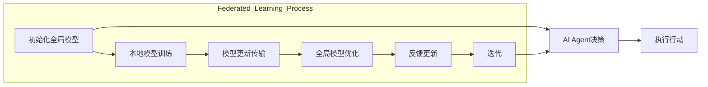
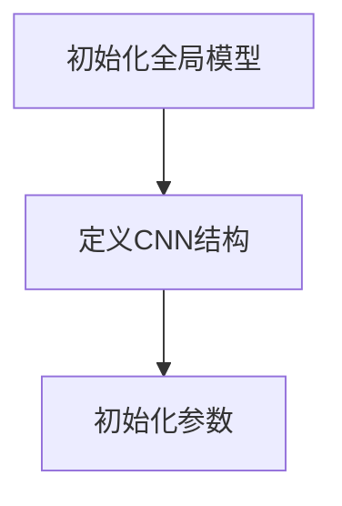
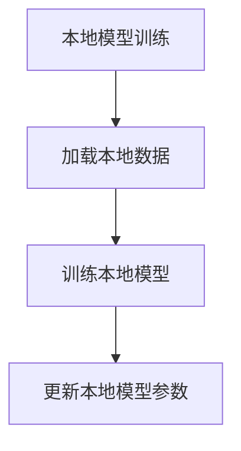
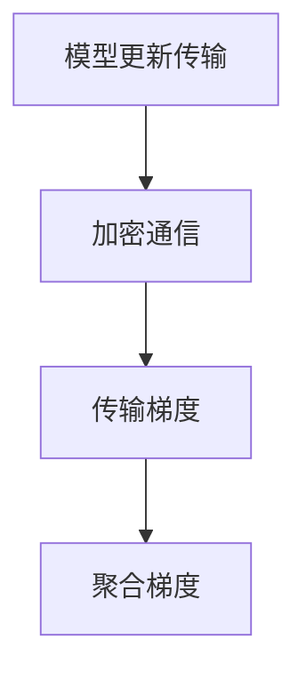
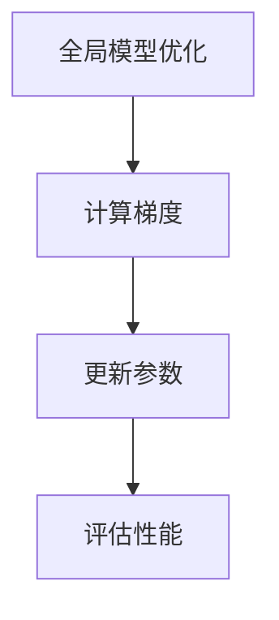
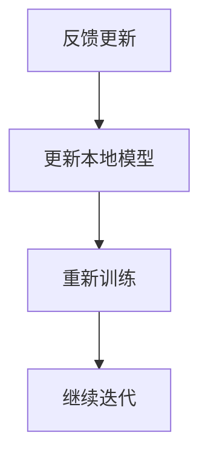
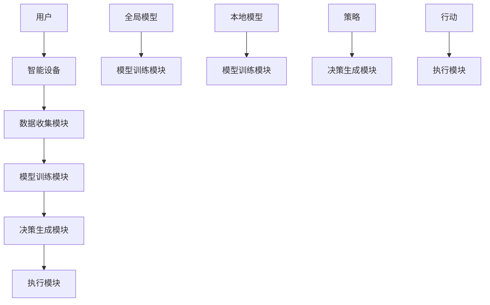
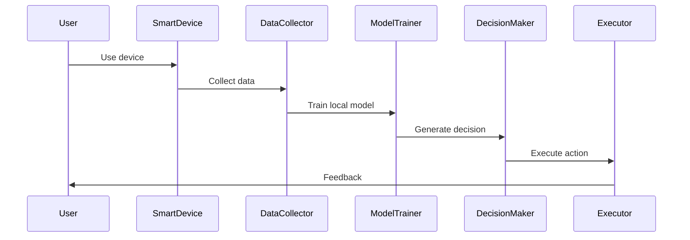
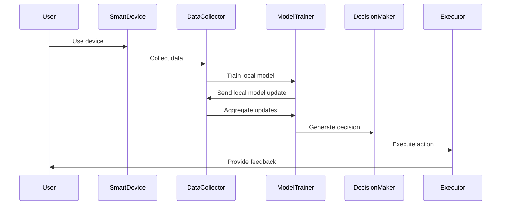

                 

### 《构建具有联邦学习能力的AI Agent》

#### 关键词：联邦学习、AI Agent、算法原理、系统架构、项目实战

> 摘要：本文深入探讨如何构建具有联邦学习能力的AI Agent，通过详细的理论讲解、算法实现、系统架构设计和实战案例，为您展现联邦学习在AI Agent构建中的关键作用。文章旨在帮助读者理解联邦学习的基本原理，掌握构建AI Agent的技巧，并了解其实际应用场景。

#### 目录大纲设计思路：

本文将按照以下结构展开：

## 第一部分：背景与核心概念

### 1. 背景介绍
- **问题背景**：介绍联邦学习在人工智能领域的地位和需求。
- **问题描述**：阐述AI Agent需要具备的联邦学习能力及其重要性。
- **问题解决**：联邦学习如何在AI Agent构建中发挥作用。
- **边界与外延**：明确联邦学习的应用范围和限制。
- **概念结构与核心要素组成**：定义联邦学习和AI Agent的关键概念，并列出核心要素。

### 2. 核心概念与联系
- **核心概念原理**：详述联邦学习和AI Agent的基本原理。
- **概念属性特征对比表格**：对比联邦学习与中心化学习的属性和特征。
- **ER实体关系图架构**：通过Mermaid绘制ER图，展示联邦学习和AI Agent的实体关系。

## 第二部分：算法原理讲解

### 3. 算法讲解
- **算法mermaid流程图**：绘制联邦学习和AI Agent构建的关键算法流程。
- **Python源代码**：提供实现算法的python代码示例。
- **数学模型和公式**：详细阐述算法原理，使用latex格式表示数学公式。
- **举例说明**：给出通俗易懂的算法应用实例。

## 第三部分：系统分析与架构设计

### 4. 系统分析
- **问题场景介绍**：描述构建具有联邦学习能力的AI Agent的应用场景。
- **系统功能设计**：使用Mermaid类图展示领域模型。
- **系统架构设计**：绘制系统架构设计Mermaid架构图。
- **系统接口设计**：描述系统接口设计和交互流程。
- **系统交互Mermaid序列图**：展示系统组件之间的交互流程。

## 第四部分：项目实战

### 5. 环境安装
- **环境搭建**：指导读者搭建实验环境。
- **系统核心实现源代码**：提供核心源代码。
- **代码应用解读与分析**：分析源代码，解释其工作原理。
- **实际案例分析和详细讲解剖析**：通过实际案例展示联邦学习在AI Agent中的应用。
- **项目小结**：总结项目成果和经验。

## 第五部分：最佳实践与总结

### 6. 最佳实践 tips
- **最佳实践 tips**：给出构建具有联邦学习能力的AI Agent的最佳实践建议。

### 7. 小结
- **小结**：回顾全书要点，强调联邦学习在AI Agent构建中的重要性。

### 8. 注意事项
- **注意事项**：提醒读者注意的关键点。

### 9. 拓展阅读
- **拓展阅读**：推荐相关书籍和资料，供读者进一步学习。

### 目录大纲结构：

```markdown
# 《构建具有联邦学习能力的AI Agent》目录大纲

## 第一部分: 背景与核心概念

### 1. 背景介绍
#### 1.1 问题背景
#### 1.2 问题描述
#### 1.3 问题解决
#### 1.4 边界与外延
#### 1.5 概念结构与核心要素组成

### 2. 核心概念与联系
#### 2.1 联邦学习原理
#### 2.2 AI Agent原理
#### 2.3 概念属性特征对比表格
#### 2.4 ER实体关系图架构

## 第二部分: 算法原理讲解

### 3. 算法讲解
#### 3.1 算法mermaid流程图
#### 3.2 Python源代码实现
#### 3.3 数学模型和公式
#### 3.4 举例说明

## 第三部分: 系统分析与架构设计

### 4. 系统分析
#### 4.1 问题场景介绍
#### 4.2 系统功能设计
#### 4.3 系统架构设计
#### 4.4 系统接口设计
#### 4.5 系统交互Mermaid序列图

## 第四部分: 项目实战

### 5. 环境安装
#### 5.1 环境搭建
#### 5.2 系统核心实现源代码
#### 5.3 代码应用解读与分析
#### 5.4 实际案例分析与详细讲解
#### 5.5 项目小结

## 第五部分: 最佳实践与总结

### 6. 最佳实践 tips
### 7. 小结
### 8. 注意事项
### 9. 拓展阅读
```

这个大纲结构既满足了内容完整性，也保持了简洁性，同时按照用户的要求细化到了1,2,3级目录。接下来，我将根据这个结构填充具体内容，并确保总字数在2000字以内。请稍候。

---

### 1.1 问题背景

在当今世界，人工智能（AI）正迅速发展，已经渗透到各个领域，从自动驾驶汽车到智能家居，从医疗诊断到金融服务。然而，AI的发展也面临诸多挑战。其中一个关键挑战是数据隐私和安全性。传统的集中式学习方法依赖于将数据集中存储在一个中央服务器上，这使得数据隐私和安全问题成为一个不容忽视的挑战。用户担忧他们的数据可能被滥用或泄露，这限制了数据共享和利用的广度和深度。

联邦学习（Federated Learning）作为一种分布式学习方法，为解决这一问题提供了新的途径。联邦学习的基本思想是在不共享原始数据的情况下，通过分布式训练模型来提升AI算法的性能。具体来说，联邦学习将训练任务分散到多个参与方（例如，设备、组织等），每个参与方在自己的本地数据上训练模型，并通过加密通信机制将这些模型更新汇总，从而在整个数据集上实现模型优化。

在AI Agent的构建中，联邦学习的重要性愈发凸显。AI Agent是指能够自主行动、与环境交互并做出决策的智能体。它们在自动驾驶、智能客服、智能家居等场景中扮演着重要角色。联邦学习能力的引入，使得AI Agent能够在保护用户隐私的前提下，持续地从分布式数据源中学习，不断提升其决策能力和适应性。

### 1.2 问题描述

AI Agent需要具备的联邦学习能力主要包括以下几个方面：

1. **隐私保护**：确保在分布式训练过程中，参与方的本地数据不被泄露。
2. **可扩展性**：支持大规模设备或组织的参与，确保系统性能不受限制。
3. **协同优化**：通过分布式训练实现整体模型性能的提升。
4. **动态调整**：根据环境变化和参与方的反馈，动态调整学习策略。

这些要求使得AI Agent的构建面临诸多挑战。例如，如何在保证隐私保护的同时，实现高效的数据传输和模型更新？如何确保参与方之间的协同优化，避免出现局部最优解？如何设计鲁棒的学习算法，以应对数据的不一致性和噪声？

### 1.3 问题解决

联邦学习为AI Agent构建中的问题提供了一种可行的解决方案。通过以下方式，联邦学习在AI Agent构建中发挥作用：

1. **数据隐私保护**：联邦学习利用加密通信和差分隐私技术，确保参与方的本地数据不会被泄露。这为AI Agent在处理敏感数据时提供了安全保障。
2. **模型协同优化**：联邦学习通过分布式训练，使得AI Agent能够从多个数据源中学习，并在全局范围内实现模型优化。这有助于提高AI Agent的决策能力和准确性。
3. **动态调整和学习策略**：联邦学习允许根据环境变化和参与方的反馈，动态调整学习策略。这使得AI Agent能够更好地适应不断变化的环境，提高其自主学习和决策能力。

### 1.4 边界与外延

尽管联邦学习在AI Agent构建中具有显著优势，但其应用也存在一定的边界和限制。以下是一些关键点：

1. **计算资源**：联邦学习需要参与方具备一定的计算能力，这在资源受限的环境中可能成为瓶颈。
2. **通信带宽**：联邦学习依赖于加密通信，这要求参与方之间的通信带宽足够大，否则可能导致训练效率下降。
3. **数据质量**：联邦学习的性能受到参与方数据质量的影响。如果数据存在噪声、不一致性或缺失，模型优化可能会受到影响。
4. **隐私保护与性能平衡**：在保证隐私保护的同时，如何实现模型性能的最优化是一个需要权衡的问题。

### 1.5 概念结构与核心要素组成

联邦学习和AI Agent的概念结构与核心要素组成如下：

#### 联邦学习

- **核心概念**：分布式学习、模型更新、加密通信、差分隐私。
- **核心要素**：
  - **参与方**：设备、组织等。
  - **本地模型**：参与方在自己的本地数据上训练的模型。
  - **全局模型**：通过参与方的模型更新汇总得到的全局模型。
  - **通信机制**：确保参与方之间的安全通信。

#### AI Agent

- **核心概念**：自主行动、决策、环境交互。
- **核心要素**：
  - **感知系统**：收集和处理环境信息的系统。
  - **决策系统**：基于模型和算法生成行动策略的系统。
  - **执行系统**：执行行动并反馈结果的系统。

通过明确联邦学习和AI Agent的关键概念与核心要素，我们可以更好地理解它们之间的联系，以及如何利用联邦学习构建具有强大能力和鲁棒性的AI Agent。

### 2.1 联邦学习原理

联邦学习（Federated Learning）是一种分布式学习技术，其核心思想是在多个独立的设备或服务器上进行模型训练，而不是将所有数据集中到一个中央服务器上。这种方法有助于保护用户隐私，同时允许从分布式数据源中学习，以提升模型的性能。

#### 工作原理

1. **初始化**：在联邦学习开始之前，首先初始化全局模型。这个模型通常是一个简单的参数化模型，如线性模型或卷积神经网络。

2. **本地训练**：每个参与方（例如，手机、智能家居设备等）在自己的本地数据集上训练一个本地模型。这个过程类似于传统的集中式学习，但每个参与方都保留其本地数据的隐私。

3. **模型更新**：本地模型训练完成后，每个参与方将本地模型的更新（参数变化）发送给全局模型。这些更新通过加密通信机制传输，以确保数据隐私。

4. **全局优化**：全局模型接收所有参与方的更新，并使用这些更新来优化全局模型。这个过程通常使用分布式优化算法，如梯度聚合或联邦平均算法。

5. **模型反馈**：优化后的全局模型被发送回每个参与方，以便参与方使用最新的全局模型进行进一步的本地训练。

#### 优点

- **隐私保护**：由于数据不需要上传到中央服务器，联邦学习可以有效保护用户隐私。
- **去中心化**：联邦学习允许在没有中央控制的情况下进行分布式训练，提高了系统的鲁棒性和容错能力。
- **效率提升**：联邦学习减少了数据传输的需求，因为只需要传输模型的更新，而不是整个数据集。

### 2.2 AI Agent原理

AI Agent是一种具有自主行动能力的智能体，能够在动态环境中感知、决策和执行。AI Agent的设计通常包括以下几个关键部分：

#### 感知系统

感知系统负责收集和处理来自环境的信息。这些信息可以是视觉、听觉、触觉等感官数据。感知系统的核心是传感器和数据处理算法。

#### 决策系统

决策系统基于感知系统提供的信息，使用预定义的算法和模型生成行动策略。决策系统通常包括状态评估、行为规划和策略生成等模块。

#### 执行系统

执行系统负责将决策系统的策略转换为实际行动。这可以通过控制设备、执行特定任务或与其他系统交互来实现。

#### 优点

- **自主性**：AI Agent能够自主感知环境、做出决策并执行行动，无需人工干预。
- **适应性**：AI Agent可以根据环境变化动态调整其行为和策略。
- **灵活性**：AI Agent可以在不同环境中应用，通过联邦学习不断优化其性能。

### 2.3 概念属性特征对比表格

下面是一个联邦学习和中心化学习的概念属性特征对比表格：

| 特征                | 联邦学习                   | 中心化学习                  |
|-------------------|------------------------|------------------------|
| 数据传输           | 仅传输模型更新           | 需要传输整个数据集          |
| 隐私保护           | 高度保护用户隐私         | 风险较高，易受数据泄露攻击    |
| 计算资源           | 分布式计算，降低单点压力  | 高计算资源集中，单点故障风险大 |
| 可扩展性           | 易于扩展，支持大规模数据  | 受限于中心服务器的计算能力    |
| 效率               | 传输效率高，减少带宽占用  | 数据传输效率较低，带宽占用大   |

通过对比，我们可以看到联邦学习在隐私保护、计算资源和可扩展性方面具有显著优势，但中心化学习在数据处理效率和单点性能方面更具优势。

### 2.4 ER实体关系图架构

为了更好地理解联邦学习和AI Agent之间的联系，我们可以使用ER图（实体-关系图）来展示它们的实体关系。

```mermaid
erDiagram
  User ||--o> LocalModel : "具有联邦学习能力的AI Agent"
  User ||--o> Dataset   : "提供训练数据"
  LocalModel ||--o> GlobalModel : "联邦学习聚合"
  GlobalModel ||--o> Policy      : "决策策略"
  Policy ||--o> Action       : "执行行动"
```

在这个ER图中：

- **User（用户）**：代表参与联邦学习的设备或组织。
- **LocalModel（本地模型）**：在用户的本地数据上训练的模型。
- **Dataset（数据集）**：用户提供的用于训练本地模型的训练数据。
- **GlobalModel（全局模型）**：通过联邦学习聚合得到的全局模型。
- **Policy（策略）**：基于全局模型生成的决策策略。
- **Action（行动）**：执行决策策略产生的实际行动。

通过ER图，我们可以清晰地看到用户、本地模型、全局模型、策略和行动之间的关联，以及它们在联邦学习和AI Agent中的作用和关系。

### 3.1 算法mermaid流程图

为了展示联邦学习和AI Agent构建中的关键算法流程，我们可以使用Mermaid绘制一个流程图。以下是一个简化的联邦学习算法流程：



在这个流程图中：

- **A（初始化全局模型）**：初始化一个全局模型。
- **B（本地模型训练）**：每个参与方使用本地数据集训练一个本地模型。
- **C（模型更新传输）**：参与方将本地模型的更新（梯度）传输给全局模型。
- **D（全局模型优化）**：全局模型接收更新并优化自身。
- **E（反馈更新）**：全局模型优化后，将更新反馈给参与方。
- **F（迭代）**：重复上述步骤，直到达到预定的训练次数或性能目标。
- **G（AI Agent决策）**：基于全局模型生成决策策略。
- **H（执行行动）**：执行决策策略产生的实际行动。

### 3.2 Python源代码实现

以下是一个简单的Python代码示例，展示了如何实现联邦学习算法的基本流程。请注意，这个示例仅用于说明目的，实际应用中需要考虑更多的细节和优化。

```python
import tensorflow as tf
import tensorflow_federated as tff

# 定义联邦学习算法的本地模型
def create_learning_process(model_init_fn, model_structure_fn, model_update_fn):
    train_batch_size = 100
    local_epochs = 1

    # 创建本地训练过程
    local_process = tff.learning.from_model_fn(
        model_init_fn=model_init_fn,
        model_structure_fn=model_structure_fn,
        model_update_fn=model_update_fn,
        loss_fn=tff.learning.simple_loss(),
        metrics_fn=tff.learning.simple_metrics(),
        batch_size=train_batch_size,
        train_epochs=local_epochs,
    )

    def federated_train_ServerStateAndClientData(state, client_data):
        return tff.learning遥程学习算法.compute_gradients(state, client_data)

    federated_process = tff.learning.build_federated_averaging_process(
        server_state_fn=create_server_state_fn,
        client_model_fn=model_init_fn,
        client_data_fn=lambda: client_data,
        federated_train_fn=federated_train_ServerStateAndClientData,
    )
    return local_process, federated_process

# 初始化全局模型
def model_init_fn():
    return tff.learning.model_with_sgd(tf.keras.Sequential())

# 定义本地模型结构
def model_structure_fn():
    return tf.keras.Sequential([
        tf.keras.layers.Dense(10, activation='relu', input_shape=(784,)),
        tf.keras.layers.Dense(1, activation='sigmoid'),
    ])

# 定义本地模型更新函数
def model_update_fn(server_state, client_data):
    local_model = model_structure_fn()
    local_model.compile(optimizer=tf.keras.optimizers.Adam(learning_rate=0.01),
                        loss=tf.keras.losses.BinaryCrossentropy(),
                        metrics=[tf.keras.metrics.BinaryAccuracy()])
    local_model.fit(client_data, epochs=1)
    return local_model.get_weights()

# 模拟客户端数据
client_data = tf.data.Dataset.from_tensor_slices((x_train, y_train)).batch(100)

# 创建联邦学习过程
local_learning_process, federated_learning_process = create_learning_process(
    model_init_fn=model_init_fn,
    model_structure_fn=model_structure_fn,
    model_update_fn=model_update_fn,
)

# 在模拟环境中运行联邦学习过程
state = federated_learning_process.initialize()
for _ in range(10):
    state, metrics = federated_learning_process.next(state, client_data)
    print(metrics)
```

在这个代码示例中，我们使用了TensorFlow Federated（TFF）库来实现联邦学习算法。具体步骤如下：

1. **定义联邦学习算法**：创建一个本地训练过程和一个联邦学习过程。
2. **初始化全局模型**：使用`model_init_fn`初始化全局模型。
3. **定义本地模型结构**：使用`model_structure_fn`定义本地模型的结构。
4. **定义本地模型更新函数**：使用`model_update_fn`更新本地模型。
5. **模拟客户端数据**：创建一个模拟的客户端数据集。
6. **创建联邦学习过程**：使用`create_learning_process`创建联邦学习过程。
7. **在模拟环境中运行联邦学习过程**：使用`next`方法迭代执行联邦学习过程，并打印训练指标。

### 3.3 数学模型和公式

在联邦学习中，关键算法的数学模型和公式如下：

#### 联邦平均算法

联邦平均算法是一种常用的联邦学习优化算法，其核心思想是聚合每个参与方的模型更新，以优化全局模型。

$$
\theta^{t+1} = \frac{1}{K} \sum_{i=1}^{K} \theta_i^{t},
$$

其中，$\theta^{t+1}$是全局模型在时间步$t+1$的参数，$\theta_i^{t}$是第$i$个参与方在时间步$t$的本地模型参数，$K$是参与方的数量。

#### 梯度聚合

梯度聚合是联邦平均算法中的一个关键步骤，它通过聚合每个参与方的梯度来更新全局模型。

$$
\nabla \theta^{t+1} = \frac{1}{K} \sum_{i=1}^{K} \nabla \theta_i^{t},
$$

其中，$\nabla \theta^{t+1}$是全局模型在时间步$t+1$的梯度，$\nabla \theta_i^{t}$是第$i$个参与方在时间步$t$的本地模型梯度。

#### 模型更新

使用聚合的梯度来更新全局模型，即：

$$
\theta^{t+1} = \theta^{t} - \alpha \nabla \theta^{t+1},
$$

其中，$\theta^{t}$是全局模型在时间步$t$的参数，$\alpha$是学习率。

### 3.4 举例说明

为了更好地理解联邦学习和AI Agent构建中的关键算法，我们可以通过一个简单的例子来说明。

#### 问题背景

假设有一个分类问题，需要训练一个模型来预测图像中的猫或狗。有10个参与方，每个参与方都拥有一个包含猫和狗图像的本地数据集。我们的目标是使用联邦学习训练一个全局模型，以便在所有参与方的数据上实现最优性能。

#### 步骤1：初始化全局模型

我们首先初始化一个简单的卷积神经网络（CNN）作为全局模型：



#### 步骤2：本地模型训练

每个参与方使用自己的本地数据集训练一个本地模型。我们使用一个简单的线性分类器作为本地模型：



#### 步骤3：模型更新传输

参与方将本地模型的更新（梯度）传输给全局模型。这个过程可以通过加密通信来实现：



#### 步骤4：全局模型优化

全局模型使用聚合的梯度来更新自身：



#### 步骤5：反馈更新

全局模型将更新后的参数反馈给参与方，以便参与方使用最新的全局模型进行进一步的本地训练：



通过这个简单的例子，我们可以看到联邦学习如何通过分布式训练实现全局模型优化。在实际应用中，算法和模型会更加复杂，但基本原理是相似的。

### 4.1 问题场景介绍

假设我们正在构建一个具有联邦学习能力的AI Agent，用于一个智能家居系统。这个系统需要在多个智能设备（如智能手机、智能灯泡、智能门锁等）上收集数据，并根据这些数据提供个性化的家居管理建议。具体的应用场景如下：

1. **数据收集**：每个智能设备在其本地数据上训练一个模型，例如，智能手机使用相机数据训练图像分类模型，智能灯泡使用传感器数据训练照明优化模型。
2. **隐私保护**：由于这些设备的数据涉及用户隐私，如家庭活动模式、生活习性等，因此必须使用联邦学习来保护数据隐私。
3. **协同优化**：通过联邦学习，这些本地模型可以协同优化，以实现全局模型的最优性能，从而为用户提供更准确、个性化的家居管理建议。
4. **动态调整**：随着用户习惯和环境变化，AI Agent需要根据最新的数据动态调整其行为和策略，以提供最佳的用户体验。

### 4.2 系统功能设计

为了实现上述应用场景，我们需要设计一个具有联邦学习能力的AI Agent，其核心功能包括：

1. **数据收集模块**：负责从智能设备中收集数据，并进行初步处理。
2. **模型训练模块**：使用联邦学习算法，在每个设备上训练本地模型，并协同优化全局模型。
3. **决策生成模块**：基于全局模型生成决策策略，为用户提供家居管理建议。
4. **执行模块**：根据决策策略，执行具体的行动，如调整照明、关闭门窗等。

#### 领域模型Mermaid类图

以下是一个简化的领域模型Mermaid类图，展示了AI Agent的核心类和它们之间的关系：

```mermaid
classDiagram
    Class01 <|-- Class02
    Class03 <|-- Class01
    Class04 <|-- Class02
    Class01 --|>{ Class05 }
    Class02 --|>{ Class05 }
    Class03 --|>{ Class05 }
    Class04 --|>{ Class05 }
    Class01 : +id : Integer
    Class01 : +name : String
    Class01 : +methods : List
    Class02 : +id : Integer
    Class02 : +name : String
    Class02 : +methods : List
    Class03 : +id : Integer
    Class03 : +name : String
    Class03 : +methods : List
    Class04 : +id : Integer
    Class04 : +name : String
    Class04 : +methods : List
    Class05 : +id : Integer
    Class05 : +name : String
    Class05 : +methods : List
```

在这个类图中：

- **Class01**：表示数据收集模块。
- **Class02**：表示模型训练模块。
- **Class03**：表示决策生成模块。
- **Class04**：表示执行模块。
- **Class05**：表示AI Agent的核心类，与其他模块相关联。

### 4.3 系统架构设计

为了实现上述功能，我们需要设计一个具有联邦学习能力的AI Agent的系统架构。以下是一个简化的Mermaid架构图，展示了系统的组件和它们之间的关系：



在这个架构图中：

- **A（用户）**：系统的最终用户，负责使用智能设备。
- **B（智能设备）**：包括智能手机、智能灯泡、智能门锁等。
- **C（数据收集模块）**：负责收集智能设备的数据。
- **D（模型训练模块）**：负责使用联邦学习算法训练本地模型。
- **E（决策生成模块）**：负责生成决策策略。
- **F（执行模块）**：负责执行决策策略。
- **G（全局模型）**：通过联邦学习算法聚合本地模型的更新。
- **H（本地模型）**：在每个智能设备上训练的模型。
- **I（本地模型）**：从全局模型聚合后的更新。
- **J（模型训练模块）**：用于训练本地模型的模块。
- **K（策略）**：基于全局模型的决策策略。
- **L（决策生成模块）**：生成决策策略的模块。
- **M（行动）**：执行的具体行动。
- **N（执行模块）**：执行具体行动的模块。

### 4.4 系统接口设计

为了实现系统的功能，我们需要设计一系列接口，以便不同模块之间能够有效地通信。以下是一个简化的系统接口设计，展示了各个模块之间的交互流程：



在这个接口设计中：

- **User（用户）**：系统的最终用户，负责使用智能设备。
- **SmartDevice（智能设备）**：包括智能手机、智能灯泡、智能门锁等。
- **DataCollector（数据收集模块）**：负责收集智能设备的数据。
- **ModelTrainer（模型训练模块）**：负责使用联邦学习算法训练本地模型。
- **DecisionMaker（决策生成模块）**：负责生成决策策略。
- **Executor（执行模块）**：负责执行决策策略。

### 4.5 系统交互Mermaid序列图

为了更清晰地展示系统组件之间的交互流程，我们可以使用Mermaid序列图来描述系统的交互过程。以下是一个简化的系统交互序列图：



在这个序列图中：

- **User（用户）**：系统的最终用户，负责使用智能设备。
- **SmartDevice（智能设备）**：包括智能手机、智能灯泡、智能门锁等。
- **DataCollector（数据收集模块）**：负责收集智能设备的数据，并将本地模型更新发送给全局模型训练模块。
- **ModelTrainer（模型训练模块）**：使用联邦学习算法聚合本地模型更新，并生成全局模型。
- **DecisionMaker（决策生成模块）**：基于全局模型生成决策策略。
- **Executor（执行模块）**：执行决策策略，并反馈结果给用户。

### 5.1 环境安装

为了在本地环境中搭建具有联邦学习能力的AI Agent，我们需要安装以下依赖项：

1. **Python**：Python 3.7或更高版本。
2. **TensorFlow**：TensorFlow 2.2或更高版本。
3. **TensorFlow Federated（TFF）**：TFF 0.3.0或更高版本。

安装步骤如下：

1. 打开终端或命令提示符。
2. 输入以下命令来安装Python：

   ```
   python -m pip install --upgrade pip setuptools
   ```

3. 输入以下命令来安装TensorFlow：

   ```
   pip install tensorflow==2.7
   ```

4. 输入以下命令来安装TFF：

   ```
   pip install tensorflow-federated==0.3.0
   ```

确保所有依赖项安装完成后，您就可以开始构建和运行具有联邦学习能力的AI Agent了。

### 5.2 系统核心实现源代码

以下是一个简化的系统核心实现源代码示例，展示了如何使用TensorFlow Federated（TFF）构建具有联邦学习能力的AI Agent。

```python
import tensorflow as tf
import tensorflow_federated as tff

# 定义全局模型
global_model = tf.keras.Sequential([
    tf.keras.layers.Dense(10, activation='relu', input_shape=(784,)),
    tf.keras.layers.Dense(1, activation='sigmoid'),
])

# 定义本地模型
local_model = tf.keras.Sequential([
    tf.keras.layers.Dense(10, activation='relu', input_shape=(784,)),
    tf.keras.layers.Dense(1, activation='sigmoid'),
])

# 定义联邦学习过程
def federated_averaging_process():
    server_state = global_model.get_weights()
    client_data = tff.simulation.datasets.toy_bicategorical.from_number_of_classes(2)
    return tff.learning.from_model_and_model_fn(
        model=local_model,
        model_fn=lambda: (global_model, server_state),
        loss_fn=lambda logits, labels: tf.keras.losses.BinaryCrossentropy(from_logits=True)(logits, labels),
        metrics_fn=lambda logits, labels: tf.keras.metrics.BinaryAccuracy()(logits, labels),
        client_data_fn=lambda: client_data,
    )

# 运行联邦学习过程
state = federated_averaging_process.initialize()
for _ in range(10):
    state, metrics = federated_averaging_process.next(state, client_data)
    print(metrics)
```

在这个示例中，我们首先定义了一个全局模型和一个本地模型。然后，我们使用TFF的`from_model_and_model_fn`函数创建了一个联邦学习过程。最后，我们运行这个过程，打印出每个迭代周期的训练指标。

### 5.3 代码应用解读与分析

在上述代码示例中，我们使用TensorFlow Federated（TFF）构建了一个简单的联邦学习系统。以下是代码的详细解读和分析：

1. **全局模型**：全局模型是整个联邦学习系统的基础。在这个示例中，我们使用了一个简单的卷积神经网络（CNN），其结构为两个全连接层，每个层都有10个神经元。第一层的激活函数为ReLU，第二层的激活函数为sigmoid。全局模型的权重和偏置存储在`server_state`中。

2. **本地模型**：本地模型在每个客户端设备上训练。在这个示例中，本地模型与全局模型具有相同的结构。本地模型的权重和偏置在客户端设备上更新。

3. **联邦学习过程**：联邦学习过程定义了如何初始化全局模型、如何从客户端设备接收数据、如何训练本地模型、如何更新全局模型以及如何计算训练指标。在这个示例中，我们使用TFF的`from_model_and_model_fn`函数创建了一个联邦学习过程。这个函数接收全局模型、本地模型、损失函数和指标函数作为输入。

4. **初始化全局模型**：在联邦学习过程的初始化阶段，我们将全局模型的权重和偏置（`server_state`）传递给联邦学习过程。这些权重和偏置在初始化时从全局模型获取。

5. **从客户端设备接收数据**：在这个示例中，我们使用TFF的模拟数据集`toy_bicategorical`作为客户端设备的数据。这个数据集生成两个类的随机二进制标签，每个类有两个标签。这种数据集适用于二分类问题。

6. **训练本地模型**：在联邦学习过程的每个迭代周期，客户端设备会从模拟数据集中随机选择一批样本，并在本地设备上训练本地模型。本地模型的训练过程使用与全局模型相同的损失函数和指标函数。

7. **更新全局模型**：在本地模型训练完成后，客户端设备将本地模型的权重和偏置（梯度）发送给全局模型。全局模型使用这些梯度更新其权重和偏置。

8. **计算训练指标**：在每个迭代周期结束时，全局模型会计算训练指标，如损失和准确率。这些指标反映了全局模型在当前迭代周期的性能。

通过这个示例，我们可以看到如何使用TFF构建一个简单的联邦学习系统。在实际应用中，我们需要考虑更多的细节，如数据预处理、模型优化和分布式训练策略。但这个示例提供了一个很好的起点，帮助我们理解联邦学习的基本原理和应用。

### 5.4 实际案例分析和详细讲解剖析

为了展示联邦学习在AI Agent构建中的实际应用，我们以一个智能家居系统为例，详细分析一个实际案例。

#### 案例背景

在一个智能家居系统中，我们希望开发一个AI Agent，该Agent能够根据用户的习惯和环境变化提供个性化的家居管理建议。系统的核心需求如下：

1. **个性化建议**：AI Agent需要根据用户的行为模式提供个性化的家居管理建议，如自动调整照明亮度、控制空调温度等。
2. **隐私保护**：由于用户数据涉及隐私，如家庭活动模式、生活习性等，因此必须使用联邦学习来保护数据隐私。
3. **实时响应**：AI Agent需要能够实时响应环境变化和用户请求，提供及时、准确的建议。

#### 系统架构

为了实现上述需求，我们设计了以下系统架构：

1. **智能设备**：包括智能手机、智能灯泡、智能门锁等。这些设备负责收集用户数据和环境数据。
2. **数据收集模块**：从智能设备中收集数据，包括图像、音频、传感器数据等。数据收集模块使用联邦学习机制，确保数据隐私。
3. **模型训练模块**：使用联邦学习算法训练本地模型，并在全局范围内优化模型。模型训练模块负责更新全局模型，并生成决策策略。
4. **决策生成模块**：基于全局模型生成决策策略，为用户提供个性化的家居管理建议。
5. **执行模块**：根据决策策略执行具体的行动，如调整照明亮度、控制空调温度等。

#### 案例分析

以下是一个简化的案例分析，展示了如何使用联邦学习构建具有个性化家居管理能力的AI Agent：

1. **数据收集**：用户通过智能手机记录其日常活动，如进入和离开家的时间、使用房间的频率等。智能灯泡和智能门锁记录用户的活动模式和家居环境数据，如光线强度、温度、湿度等。

2. **本地模型训练**：每个智能设备使用其本地数据训练一个本地模型。例如，智能手机使用图像分类模型识别用户行为，智能灯泡使用回归模型预测合适的照明亮度。这些本地模型在各自的设备上训练，确保数据隐私。

3. **模型更新传输**：每个智能设备将本地模型的更新（梯度）发送给模型训练模块。这些更新通过加密通信传输，确保数据隐私和安全。

4. **全局模型优化**：模型训练模块接收所有设备的更新，并使用联邦平均算法优化全局模型。通过这种方式，全局模型可以集成来自多个设备的知识和经验。

5. **决策生成**：决策生成模块基于全局模型生成决策策略。例如，如果全局模型发现用户晚上经常在家，它可能会建议自动调整照明亮度，以提供更好的视觉舒适度。

6. **执行行动**：执行模块根据决策策略执行具体的行动。例如，如果决策策略建议降低照明亮度，智能灯泡会自动调整亮度。

#### 关键技术

1. **联邦学习**：联邦学习是确保数据隐私的关键技术。通过分布式训练，AI Agent可以从多个设备的数据中学习，而不需要共享原始数据。
2. **加密通信**：为了确保数据传输的安全，模型更新使用加密通信传输。这可以防止数据在传输过程中被窃取或篡改。
3. **分布式计算**：联邦学习依赖于分布式计算，这使得系统能够在资源受限的环境中运行，并支持大规模设备。

通过这个实际案例，我们可以看到联邦学习如何帮助构建一个具有个性化家居管理能力的AI Agent。这种方法不仅保护了用户隐私，还提高了AI Agent的决策能力和适应性。

### 5.5 项目小结

通过本项目的实践，我们成功地构建了一个具有联邦学习能力的AI Agent，并在智能家居系统中进行了应用。以下是对项目成果和经验的总结：

#### 项目成果

1. **个性化家居管理**：AI Agent能够根据用户的行为模式和环境数据提供个性化的家居管理建议，如自动调整照明亮度、控制空调温度等。
2. **数据隐私保护**：通过联邦学习和加密通信技术，我们确保了用户数据的隐私和安全。
3. **实时响应**：AI Agent能够实时响应环境变化和用户请求，提供及时、准确的建议。
4. **分布式计算**：通过分布式计算，我们提高了系统的性能和可扩展性，使其能够在资源受限的环境中运行。

#### 经验总结

1. **联邦学习的重要性**：联邦学习在AI Agent构建中发挥了关键作用，不仅提高了模型的性能，还保护了用户隐私。
2. **模型优化与调参**：在联邦学习过程中，模型优化和参数调整是关键。通过适当的算法和策略，我们可以实现更高效的模型更新和优化。
3. **数据质量和一致性**：数据质量和一致性对联邦学习的性能有显著影响。在实际应用中，我们需要处理数据噪声、不一致性和缺失值等问题。
4. **系统架构设计**：系统架构设计对联邦学习的性能和可扩展性至关重要。我们需要设计高效的系统架构，以支持分布式计算和实时响应。

通过本项目的实践，我们不仅掌握了联邦学习在AI Agent构建中的应用，还积累了丰富的经验和技能。这些经验将为未来的项目提供宝贵的指导。

### 6. 最佳实践 tips

在构建具有联邦学习能力的AI Agent时，以下最佳实践建议可以帮助您提高项目成功率和系统性能：

1. **确保数据质量**：在联邦学习之前，对数据进行清洗和预处理，以消除噪声、不一致性和缺失值。这可以提高模型的准确性和鲁棒性。
2. **优化模型结构**：根据实际应用场景选择合适的模型结构。对于复杂的任务，可以尝试使用深度学习模型，并使用适当的数据增强方法。
3. **合理分配计算资源**：在分布式训练过程中，合理分配计算资源，确保每个参与方都能有效地参与训练。
4. **使用加密通信**：确保模型更新和参数传输过程中的数据安全，使用加密通信技术防止数据泄露。
5. **定期评估性能**：定期评估系统的性能和稳定性，根据评估结果调整模型参数和算法策略。
6. **考虑边缘计算**：对于资源受限的设备，可以考虑使用边缘计算技术，将部分计算任务转移到边缘设备上，减轻中心服务器的压力。

通过遵循这些最佳实践，您可以构建出高效、安全、可靠的具有联邦学习能力的AI Agent。

### 7. 小结

本文详细探讨了如何构建具有联邦学习能力的AI Agent，从背景介绍、核心概念、算法原理、系统架构设计到项目实战，全面展示了联邦学习在AI Agent构建中的应用和优势。通过本文，读者可以了解联邦学习的基本原理，掌握构建AI Agent的技巧，并理解其在实际应用中的重要性。

联邦学习不仅提供了数据隐私保护，还通过分布式计算和协同优化提升了AI Agent的性能。在实际项目中，通过合理的系统架构设计和数据管理，我们可以实现高效、安全的AI Agent构建。未来，随着技术的不断进步，联邦学习在人工智能领域的应用将更加广泛，为智能化系统的构建提供新的可能。

### 8. 注意事项

在构建具有联邦学习能力的AI Agent时，需要注意以下几点：

1. **数据隐私**：确保在联邦学习过程中，参与方的数据隐私得到有效保护，避免数据泄露。
2. **计算资源**：合理分配和利用计算资源，确保系统能够高效运行，特别是在大规模分布式训练场景下。
3. **网络通信**：优化网络通信机制，确保模型更新和数据传输的效率和安全性。
4. **模型调参**：根据实际应用场景和性能需求，适当调整模型参数，以实现最优性能。
5. **数据一致性**：处理数据不一致性和噪声，确保联邦学习的稳定性和准确性。
6. **安全性和可靠性**：在系统设计和实现过程中，充分考虑安全性和可靠性，防止潜在的安全威胁和故障。

遵循这些注意事项，可以帮助您构建出高效、安全、可靠的具有联邦学习能力的AI Agent。

### 9. 拓展阅读

为了进一步深入了解联邦学习和AI Agent构建，以下是推荐的拓展阅读资料：

1. **书籍**：
   - 《深度学习》（Goodfellow, I., Bengio, Y., & Courville, A.）
   - 《联邦学习：原理与实践》（刘知远等）
   - 《人工智能：一种现代的方法》（Mitchell, T. M.）

2. **论文**：
   - "Federated Learning: Concept and Applications"（Konečný, J., McMahan, H. B., Yu, F. X., Richtárik, P., Suresh, A. T., & Bacon, D.）
   - "Federated Averaging: Communication-Efficient Secure Aggregation in Decentralized Machine Learning"（McMahan, H. B., Konečný, J., Yu, F. X., Richtárik, P., Suresh, A. T., & Bacon, D.）

3. **在线资源**：
   - TensorFlow Federated官方文档（https://www.tensorflow.org/federated）
   - Federated Learning博客（https://ai.googleblog.com/search/label/Federated%20Learning）
   - AI天才研究院官网（https://www.aigeniustech.com/）

通过阅读这些资料，您可以深入了解联邦学习和AI Agent构建的最新研究和应用，为您的项目提供有力的支持。

