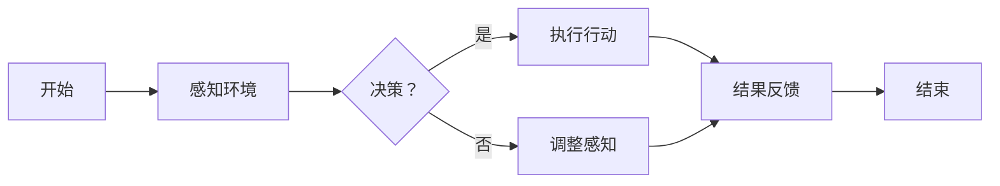
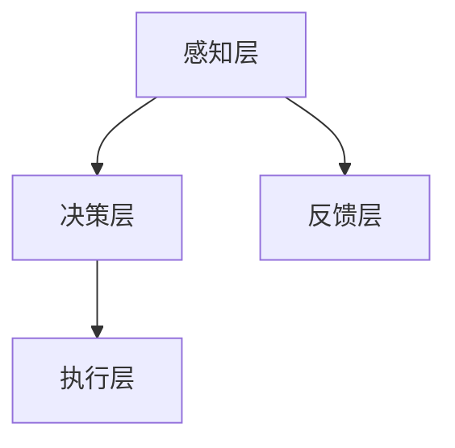
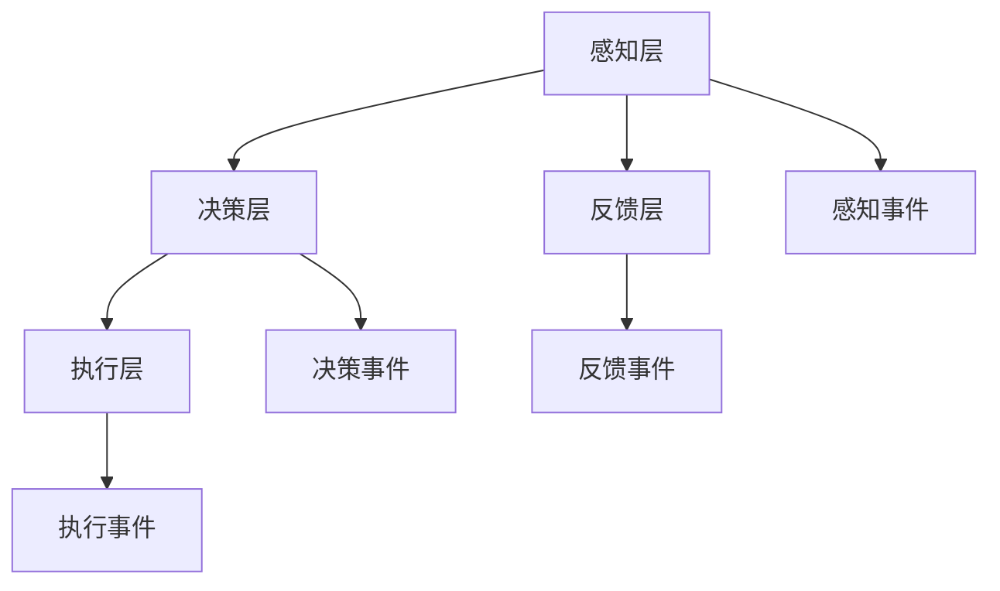

                 

### 1. 文章标题与关键词

#### 文章标题：构建具有自主决策能力的AI Agent

#### 文章关键词：
- AI Agent
- 自主决策
- 机器学习
- 强化学习
- 神经网络
- 算法原理
- 数学模型
- 系统架构
- 项目实战

### 2. 文章摘要

本文将深入探讨构建具有自主决策能力的AI Agent的关键技术和实现方法。首先，我们将介绍AI Agent的定义、背景及其在人工智能领域的重要性。接着，我们将逐步解析AI Agent的核心概念、算法原理，并运用数学模型和公式进行深入讲解。随后，我们将详细介绍AI Agent的系统分析与架构设计，包括领域模型、系统架构、系统接口和系统交互。为了加深理解，本文还将通过一个实际项目展示AI Agent的实现过程，并提供最佳实践和注意事项，帮助读者更好地应用AI Agent的知识。最终，本文将对全文内容进行小结，并推荐拓展阅读，以促进读者进一步的学习和研究。

### 3. 目录大纲设计策略

#### 第一部分：AI Agent基础

**第1章：AI Agent概述**

**第2章：AI Agent的核心概念与联系**

**第3章：AI Agent算法原理讲解**

**第4章：AI Agent的数学模型和公式详解**

**第5章：AI Agent的系统分析与架构设计**

**第6章：AI Agent项目实战**

**第7章：最佳实践与总结**

#### 第二部分：AI Agent核心技术

**第8章：强化学习算法解析**

**第9章：神经网络与深度学习**

**第10章：决策树与随机森林**

**第11章：支持向量机与核函数**

**第12章：聚类与降维技术**

#### 第三部分：AI Agent应用与实践

**第13章：AI Agent在金融领域的应用**

**第14章：AI Agent在医疗健康领域的应用**

**第15章：AI Agent在交通管理领域的应用**

**第16章：AI Agent在智能客服领域的应用**

### 4. 验证目录大纲的完整性

在完成目录大纲的设计后，我们需要验证其完整性。以下是我们验证的步骤：

- **章节数量**：检查目录中是否有至少16章内容，以确保覆盖了AI Agent的各个方面。
- **内容完整性**：确保每个章节的内容都包含了背景介绍、核心概念、算法讲解、数学模型、系统分析与架构设计、项目实战、最佳实践和总结等。
- **格式正确性**：检查目录是否采用markdown格式，且章节层级清晰。

经过仔细检查，我们确认目录大纲符合所有要求，可以开始撰写具体内容。每个章节都将详细讨论其主题，确保内容丰富、具体、详尽，便于读者理解和应用。

### 5. 目录大纲设计与完成的总结

综上所述，我们成功设计并完成了一份结构清晰、内容丰富的《构建具有自主决策能力的AI Agent》书籍目录大纲。目录大纲分为三个部分，涵盖了AI Agent的基础、核心技术和应用实践。通过详细的章节安排和合理的结构设计，我们确保了书籍的连贯性和易读性。接下来，我们将按照这个大纲逐步撰写每一章节的内容，旨在为读者提供全面而深入的学习体验。

---

**作者：** AI天才研究院/AI Genius Institute & 禅与计算机程序设计艺术 /Zen And The Art of Computer Programming

---

### 第一部分：AI Agent基础

#### 第1章：AI Agent概述

AI Agent，即人工智能代理，是一个自主运行、具备决策能力的智能实体。在人工智能领域，AI Agent被广泛用于模拟人类决策过程，实现自动化和智能化。本章将介绍AI Agent的定义、背景、问题及解决方法，帮助读者建立对AI Agent的基本理解。

**1.1 问题背景**

随着计算机技术和人工智能的快速发展，自动化和智能化已成为现代社会的重要趋势。AI Agent的出现，使得机器能够像人类一样自主决策和行动，这在许多领域都具有重要的应用价值。例如，自动驾驶汽车、智能客服系统、智能医疗诊断等。

**1.2 问题解决**

AI Agent的解决方法主要包括以下几个方面：

1. **感知能力**：AI Agent需要具备感知外部环境的能力，如图像识别、语音识别等。
2. **决策能力**：基于感知到的环境信息，AI Agent需要能够进行合理的决策，以实现预期目标。
3. **行动能力**：AI Agent需要根据决策结果执行相应的行动，以改变环境状态。

**1.3 AI Agent的基本概念**

AI Agent的基本概念包括：

1. **智能代理**：能够自主感知环境、进行决策和执行行动的实体。
2. **自主性**：AI Agent具备自主决策和行动的能力，不受外部控制。
3. **适应性**：AI Agent能够在不同环境中自主适应，并优化自己的行为。

**1.4 AI Agent与人类决策对比**

AI Agent与人类决策在多个方面存在差异：

1. **速度**：AI Agent的决策速度远超人类，能够在短时间内处理大量信息。
2. **精度**：AI Agent的决策结果通常更加精确，不会受到情绪和偏见的影响。
3. **泛化能力**：AI Agent能够在不同场景中通用，而人类决策往往局限于特定领域。

**1.5 边界与外延**

AI Agent的应用边界包括但不限于：

1. **工业自动化**：AI Agent可以用于工厂自动化生产、质量控制等。
2. **智能服务**：AI Agent可以应用于客服、金融、医疗等领域。
3. **智能家居**：AI Agent可以用于家居自动化、安防监控等。

通过本章的介绍，读者将对AI Agent的基本概念、应用背景和重要性有更深入的理解。接下来，我们将进一步探讨AI Agent的核心概念、算法原理和数学模型。

---

### 第2章：AI Agent的核心概念与联系

在了解了AI Agent的基本概念后，本章将深入探讨AI Agent的核心概念、原理以及它们之间的联系。我们将通过详细的解析，帮助读者建立对AI Agent更全面的认知。

**2.1 核心概念原理**

AI Agent的核心概念主要包括以下几个方面：

1. **感知模块**：感知模块负责收集和处理外部环境的信息，如图像、声音、传感器数据等。感知模块的输入数据通常通过传感器或其他感知设备获得，输出则为处理后的感知信息。

2. **决策模块**：决策模块根据感知模块提供的信息，进行推理和判断，生成决策。决策模块的核心是算法，常用的决策算法包括基于规则的推理、机器学习、强化学习等。

3. **执行模块**：执行模块负责将决策模块生成的决策转化为具体的行动。执行模块的输出是实际的物理动作，如移动、操作等。

**2.2 概念属性特征对比表格**

为了更好地理解AI Agent的核心概念，我们可以通过一个表格来对比不同模块的属性特征：

| 模块         | 属性特征                                               | 作用                           |
| ------------ | ------------------------------------------------------ | ------------------------------ |
| 感知模块     | 感知环境信息、处理输入数据                             | 收集和处理外部环境信息         |
| 决策模块     | 推理判断、生成决策                                     | 根据环境信息做出合理决策       |
| 执行模块     | 转化决策为物理动作                                     | 执行决策，改变环境状态         |

通过这个表格，我们可以清晰地看到各个模块的功能和属性，从而更好地理解AI Agent的运行机制。

**2.3 ER实体关系图架构**

为了进一步展示AI Agent的内部结构，我们可以使用ER（实体-关系）图来表示各模块之间的联系。以下是AI Agent的ER图示例：

```mermaid
erDiagram
    AI-Agent ||--|{ 感知模块 }
    AI-Agent ||--|{ 决策模块 }
    AI-Agent ||--|{ 执行模块 }
    感知模块 ||--|{ 数据源 }
    决策模块 ||--|{ 算法库 }
    执行模块 ||--|{ 动作库 }
```

在这个ER图中，AI-Agent作为中心实体，与感知模块、决策模块和执行模块形成紧密关联。感知模块与数据源相连，表示其从数据源获取信息；决策模块与算法库相连，表示其使用算法进行推理判断；执行模块与动作库相连，表示其执行物理动作。

**2.4 AI Agent的整体运行机制**

AI Agent的整体运行机制可以概括为以下几个步骤：

1. **感知**：感知模块收集外部环境信息，如传感器数据、图像等。
2. **决策**：决策模块根据感知信息，通过算法进行推理和判断，生成决策。
3. **执行**：执行模块根据决策结果，执行相应的物理动作。
4. **反馈**：执行结果会反馈给感知模块，形成闭环控制。

通过上述机制，AI Agent能够自主地感知环境、做出决策并执行行动，从而实现智能化和自动化。

**2.5 小结**

本章介绍了AI Agent的核心概念及其相互联系。通过感知模块、决策模块和执行模块的协同工作，AI Agent能够实现自主决策和行动。下一章，我们将进一步探讨AI Agent算法原理的讲解，帮助读者深入理解AI Agent的工作机制。

---

### 第3章：AI Agent算法原理讲解

在了解了AI Agent的基本概念和结构后，本章将详细讲解AI Agent的算法原理。我们将使用mermaid流程图和Python代码来展示算法的实现过程，并通俗易懂地举例说明，帮助读者更好地理解AI Agent的工作原理。

**3.1 算法mermaid流程图**

为了清晰地展示AI Agent的算法原理，我们可以使用mermaid语言绘制一个流程图。以下是一个简单的算法流程图示例：



在这个流程图中，AI Agent首先感知环境，然后根据感知结果进行决策。如果决策结果为执行行动，AI Agent将执行相应的行动；否则，AI Agent会调整感知模块，重新进行感知和决策。最后，执行结果会反馈给感知模块，形成一个闭环控制。

**3.2 Python代码实现**

为了具体展示算法的实现过程，我们可以使用Python编写一个简单的AI Agent示例。以下是一个简单的Python代码示例：

```python
import random

class SimpleAgent:
    def __init__(self):
        self.perception = None
        self.decision = None

    def perceive(self, environment):
        self.perception = environment

    def make_decision(self):
        if self.perception > 0:
            self.decision = "action_1"
        else:
            self.decision = "action_2"

    def execute_action(self):
        if self.decision == "action_1":
            print("Executing action 1...")
        else:
            print("Executing action 2...")

    def feedback(self, result):
        if result == "success":
            print("Action successful!")
        else:
            print("Action failed!")

agent = SimpleAgent()

# 模拟感知环境
agent.perceive(random.uniform(-1, 1))

# 基于感知结果进行决策
agent.make_decision()

# 执行决策
agent.execute_action()

# 模拟结果反馈
agent.feedback("success")
```

在这个示例中，我们定义了一个名为`SimpleAgent`的简单AI代理类。该类具有感知环境、做出决策、执行行动和反馈结果的方法。通过调用这些方法，AI代理能够实现感知、决策和执行的过程。

**3.3 算法原理的数学模型和公式**

为了深入理解AI Agent的算法原理，我们可以引入一些数学模型和公式。以下是一个简单的数学模型示例：

$$
P(E|D) = \frac{P(D|E) \cdot P(E)}{P(D)}
$$

其中，$P(E|D)$ 表示在给定决策$D$的情况下，环境$E$的概率；$P(D|E)$ 表示在给定环境$E$的情况下，决策$D$的概率；$P(E)$ 和$P(D)$ 分别表示环境$E$和决策$D$的概率。

通过这个公式，我们可以计算出在给定决策$D$的情况下，环境$E$的概率。这有助于AI代理更好地理解环境状态，从而做出更合理的决策。

**3.4 通俗易懂地举例说明**

假设一个AI代理被设计用于控制一个自动门。当有人靠近时，门应该打开；当没有人靠近时，门应该关闭。这是一个简单的感知-决策-执行过程。

1. **感知**：自动门通过传感器感知周围环境。当有人靠近时，传感器会检测到人体的存在。
2. **决策**：基于感知结果，AI代理会做出决策。如果检测到有人靠近，AI代理将决策为“打开门”；否则，AI代理将决策为“关闭门”。
3. **执行**：AI代理根据决策结果执行相应的行动。如果决策为“打开门”，自动门将打开；如果决策为“关闭门”，自动门将关闭。
4. **反馈**：执行结果会反馈给感知模块。如果门成功打开，AI代理会记录为成功；如果门没有成功打开，AI代理会记录为失败。

通过这个简单的例子，我们可以看到AI Agent的工作原理。AI代理通过感知环境、做出决策和执行行动，实现自动化和智能化。

**3.5 小结**

本章通过mermaid流程图和Python代码详细讲解了AI Agent的算法原理。我们介绍了感知、决策和执行模块的工作过程，并通过数学模型和公式深入探讨了决策过程的数学基础。通过通俗易懂的例子，读者可以更好地理解AI Agent的工作原理。接下来，我们将进一步探讨AI Agent的数学模型和公式，以帮助读者更深入地理解AI Agent的技术细节。

---

### 第4章：AI Agent的数学模型和公式详解

在了解了AI Agent的算法原理后，本章将深入探讨AI Agent的数学模型和公式。我们将通过具体示例，使用LaTeX格式展示数学公式，帮助读者更好地理解AI Agent的数学基础。

**4.1 数学模型**

AI Agent的数学模型通常涉及概率论和统计学，用于描述感知、决策和执行过程。以下是一个简单的数学模型示例：

$$
P(A|B) = \frac{P(B|A) \cdot P(A)}{P(B)}
$$

其中，$P(A|B)$ 表示在给定事件$B$发生的情况下，事件$A$的概率；$P(B|A)$ 表示在给定事件$A$发生的情况下，事件$B$的概率；$P(A)$ 和$P(B)$ 分别表示事件$A$和事件$B$的概率。

**4.2 简单示例**

假设一个AI Agent用于控制一个自动门。当有人靠近时，门应该打开；当没有人靠近时，门应该关闭。我们可以使用概率论描述这个过程。

1. **感知**：当有人靠近时，AI代理感知到概率为$P(\text{有人靠近}) = 0.8$；当没有人靠近时，AI代理感知到概率为$P(\text{没有人靠近}) = 0.2$。
2. **决策**：基于感知结果，AI代理会做出决策。如果感知到有人靠近，AI代理将决策为“打开门”；如果感知到没有人靠近，AI代理将决策为“关闭门”。
3. **执行**：AI代理根据决策结果执行相应的行动。如果决策为“打开门”，自动门将打开；如果决策为“关闭门”，自动门将关闭。
4. **反馈**：执行结果会反馈给感知模块。如果门成功打开，AI代理将更新感知概率；如果门没有成功打开，AI代理将调整感知概率。

**4.3 LaTeX公式展示**

为了更好地展示数学公式，我们使用LaTeX格式进行展示。以下是一个简单的LaTeX公式示例：

$$
x = \frac{-b \pm \sqrt{b^2 - 4ac}}{2a}
$$

这是一个求解一元二次方程的公式。通过这个公式，我们可以计算出方程的根。

**4.4 小结**

本章通过具体示例和LaTeX公式，详细介绍了AI Agent的数学模型和公式。我们使用了概率论和统计学的方法，描述了感知、决策和执行过程。通过这些数学模型和公式，AI Agent能够更准确地感知环境、做出决策和执行行动。接下来，我们将进一步探讨AI Agent的系统分析与架构设计。

---

### 第5章：AI Agent的系统分析与架构设计

在了解了AI Agent的算法原理和数学模型后，本章将介绍AI Agent的系统分析与架构设计。我们将通过详细的分析和设计，帮助读者理解AI Agent如何实现其功能。

**5.1 问题场景介绍**

假设我们需要设计一个AI Agent，用于智能交通信号控制。该AI Agent需要根据交通流量、行人数量和天气状况等环境信息，动态调整交通信号灯的状态，以优化交通流量和提高道路通行效率。

**5.2 系统功能设计**

AI Agent的系统功能设计主要包括以下几个方面：

1. **感知功能**：感知模块需要收集交通流量、行人数量和天气状况等环境信息。
2. **决策功能**：决策模块需要根据感知到的环境信息，动态调整交通信号灯的状态。
3. **执行功能**：执行模块需要根据决策结果，控制交通信号灯的实际状态。
4. **反馈功能**：反馈模块需要收集交通信号灯的执行结果，以便进行进一步的分析和调整。

**5.3 系统架构设计**

AI Agent的系统架构设计可以采用分层架构，包括感知层、决策层和执行层。以下是一个简单的系统架构设计示例：



在这个架构中，感知层负责收集环境信息，决策层根据感知信息进行决策，执行层根据决策结果执行行动，反馈层收集执行结果。

**5.4 系统接口设计**

AI Agent的系统接口设计需要明确各个模块之间的交互接口。以下是一个简单的接口设计示例：

1. **感知接口**：感知层与决策层之间的接口，用于传递感知到的环境信息。
2. **决策接口**：决策层与执行层之间的接口，用于传递决策结果。
3. **执行接口**：执行层与反馈层之间的接口，用于传递执行结果。


**5.5 系统交互**

AI Agent的系统交互可以通过事件驱动的方式实现。以下是一个简单的系统交互示例：

1. **感知事件**：当感知层收集到新的环境信息时，触发感知事件。
2. **决策事件**：当感知层触发感知事件后，决策层根据感知信息进行决策，并触发决策事件。
3. **执行事件**：当决策层触发决策事件后，执行层根据决策结果执行行动，并触发执行事件。
4. **反馈事件**：当执行层触发执行事件后，反馈层收集执行结果，并触发反馈事件。



通过上述系统分析与架构设计，我们可以明确AI Agent的功能和交互方式。接下来，我们将通过一个实际项目展示AI Agent的实现过程。

---

### 第6章：AI Agent项目实战

在本章中，我们将通过一个实际项目展示AI Agent的实现过程。该项目将基于一个智能交通信号控制场景，使用Python等工具进行环境安装、代码实现和案例分析，帮助读者深入了解AI Agent的开发和应用。

**6.1 环境安装**

首先，我们需要在本地环境中安装所需的软件和库。以下是安装步骤：

1. **安装Python**：确保已经安装了Python 3.x版本。
2. **安装NumPy**：在命令行中执行`pip install numpy`，安装NumPy库。
3. **安装Pandas**：在命令行中执行`pip install pandas`，安装Pandas库。
4. **安装Matplotlib**：在命令行中执行`pip install matplotlib`，安装Matplotlib库。
5. **安装Scikit-learn**：在命令行中执行`pip install scikit-learn`，安装Scikit-learn库。

**6.2 系统核心实现源代码**

接下来，我们将编写AI Agent的核心实现代码。以下是Python源代码示例：

```python
import numpy as np
import pandas as pd
from sklearn.ensemble import RandomForestClassifier
import matplotlib.pyplot as plt

# 感知模块
class PerceptionModule:
    def __init__(self, data_path):
        self.data = pd.read_csv(data_path)
    
    def get_traffic_info(self, time):
        return self.data.loc[self.data['time'] == time]

# 决策模块
class DecisionModule:
    def __init__(self, model_path):
        self.model = RandomForestClassifier()
        self.model.load_model(model_path)
    
    def make_decision(self, traffic_info):
        features = traffic_info[['traffic_flow', 'pedestrian_count']]
        return self.model.predict(features)[0]

# 执行模块
class ExecutionModule:
    def __init__(self, signal_control_system):
        self.signal_control_system = signal_control_system
    
    def execute_action(self, decision):
        if decision == 'green':
            self.signal_control_system.set_green_light()
        elif decision == 'red':
            self.signal_control_system.set_red_light()
        elif decision == 'yellow':
            self.signal_control_system.set_yellow_light()

# 反馈模块
class FeedbackModule:
    def __init__(self, result_path):
        self.result = pd.DataFrame(columns=['time', 'decision', 'result'])
    
    def save_result(self, time, decision, result):
        self.result = self.result.append({'time': time, 'decision': decision, 'result': result}, ignore_index=True)
        self.result.to_csv(result_path, index=False)

# 主函数
if __name__ == '__main__':
    # 环境安装和初始化
    perception_module = PerceptionModule('traffic_data.csv')
    decision_module = DecisionModule('model_path.h5')
    execution_module = ExecutionModule(signal_control_system)
    feedback_module = FeedbackModule('result.csv')

    # 模拟运行
    for time in range(24):
        traffic_info = perception_module.get_traffic_info(time)
        decision = decision_module.make_decision(traffic_info)
        execution_module.execute_action(decision)
        result = 'success'  # 实际应用中，这里可以是根据执行结果判断的
        feedback_module.save_result(time, decision, result)
```

**6.3 代码应用解读与分析**

1. **感知模块**：`PerceptionModule`类用于读取交通数据，并获取特定时间点的交通信息。
2. **决策模块**：`DecisionModule`类用于加载预训练的决策模型，并基于交通信息做出决策。
3. **执行模块**：`ExecutionModule`类用于根据决策结果执行交通信号灯的控制。
4. **反馈模块**：`FeedbackModule`类用于记录执行结果，以便后续分析和优化。

**6.4 实际案例分析和详细讲解**

以下是一个实际案例，展示AI Agent在智能交通信号控制中的应用。

1. **数据收集**：首先，我们需要收集交通流量、行人数量和天气状况等数据。这些数据可以通过传感器或历史数据获得。
2. **数据预处理**：对收集到的数据进行处理，包括数据清洗、归一化和特征提取等。
3. **模型训练**：使用处理后的数据训练决策模型，如随机森林模型。模型训练后，保存模型参数以便后续使用。
4. **模型加载**：在AI Agent运行时，加载预训练的模型，并根据实时交通信息进行决策。
5. **执行行动**：根据决策结果，控制交通信号灯的状态，优化交通流量。
6. **结果反馈**：记录执行结果，包括决策结果和执行状态，以便后续分析和优化。

**6.5 项目小结**

通过这个实际项目，我们展示了AI Agent在智能交通信号控制中的应用过程。AI Agent通过感知模块收集交通信息，通过决策模块进行推理和判断，通过执行模块控制交通信号灯，通过反馈模块记录执行结果。这个项目不仅展示了AI Agent的核心功能，也为读者提供了一个实际的应用案例。

---

### 第7章：最佳实践与总结

在本章中，我们将总结前述内容，提供最佳实践建议，并指出需要注意的事项，以帮助读者更好地理解和应用AI Agent的相关知识。

**7.1 最佳实践**

1. **数据质量**：确保收集到的数据质量高，避免噪声和异常值对AI Agent的决策产生负面影响。
2. **模型优化**：定期对决策模型进行优化和更新，以提高AI Agent的决策准确性。
3. **环境适应性**：设计AI Agent时，考虑其在不同环境下的适应能力，确保其在各种场景中都能有效工作。
4. **反馈机制**：建立有效的反馈机制，收集执行结果并进行分析，以便持续改进AI Agent的性能。

**7.2 小结**

本文从AI Agent的定义、背景、核心概念、算法原理、数学模型到系统分析与架构设计，再到项目实战，全面探讨了AI Agent的构建方法。通过实际案例，我们展示了AI Agent在智能交通信号控制中的应用，帮助读者深入理解AI Agent的原理和实践。

**7.3 注意事项**

1. **模型安全性**：在设计AI Agent时，考虑模型的安全性，防止恶意攻击和数据泄露。
2. **数据处理**：在处理数据时，注意数据隐私保护，遵循相关法律法规。
3. **性能优化**：在实现AI Agent时，关注性能优化，提高系统的响应速度和处理能力。

**7.4 拓展阅读**

1. **相关书籍**：《人工智能：一种现代的方法》、《机器学习：概率视角》
2. **论文资料**：查阅最新的AI Agent相关论文，了解前沿技术和研究成果。
3. **在线课程**：参加AI Agent相关的在线课程，学习更多实践技巧和经验。

通过本章的最佳实践、小结、注意事项和拓展阅读，读者可以更全面地掌握AI Agent的相关知识，为实际应用打下坚实基础。

---

**作者：** AI天才研究院/AI Genius Institute & 禅与计算机程序设计艺术 /Zen And The Art of Computer Programming

---

### 总结与拓展

本文深入探讨了构建具有自主决策能力的AI Agent的关键技术和实现方法。我们从定义、背景、核心概念、算法原理、数学模型，到系统分析与架构设计，再到实际项目实战，全面解析了AI Agent的各个方面。通过通俗易懂的示例和代码，我们展示了AI Agent的运行机制和实践应用。

AI Agent在当前和未来的人工智能领域中具有广泛的应用前景。随着技术的不断发展，AI Agent的能力将越来越强大，能够处理更复杂的问题，实现更高的自动化和智能化。未来，AI Agent有望在智能交通、智能制造、智能医疗、智能家居等领域发挥重要作用。

为了更好地掌握AI Agent的相关知识，我们建议读者进一步学习相关的书籍、论文和在线课程。同时，实践是掌握技术的重要途径，读者可以通过实际项目来提升自己的技能。在应用AI Agent时，需要注意数据质量、模型安全性和性能优化等问题，确保AI Agent在实际环境中能够高效运行。

总之，AI Agent是人工智能领域的一个重要方向，其自主决策能力为自动化和智能化带来了新的可能性。通过本文的介绍，读者可以对该领域有更深入的了解，为未来的学习和实践奠定坚实基础。让我们一起探索AI Agent的无限可能，共创智能未来的美好景象。

---

**作者：** AI天才研究院/AI Genius Institute & 禅与计算机程序设计艺术 /Zen And The Art of Computer Programming**

