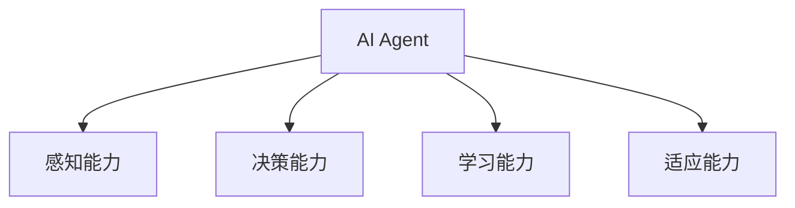
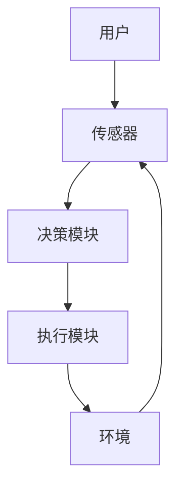
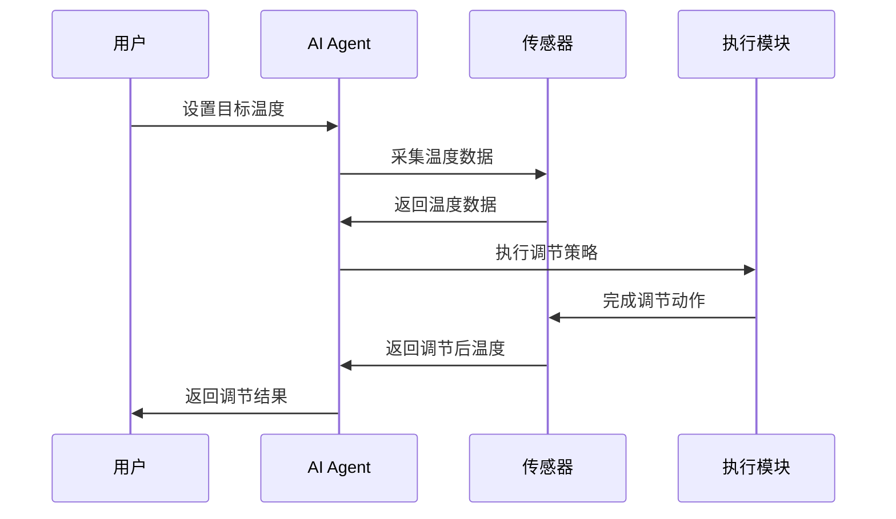

                 


# 构建具有自主学习与探索能力的AI Agent

关键词：AI Agent，自主学习，探索能力，感知，决策，学习，适应

摘要：本文旨在探讨如何构建具有自主学习与探索能力的AI Agent。首先，我们介绍了AI Agent的基本概念与历史发展，并分析了其核心概念与结构。接着，我们详细阐述了AI Agent的感知、决策、学习和适应原理，并使用了Mermaid流程图和Python代码进行解释。此外，我们还介绍了系统分析与架构设计方案，并给出了一个实际项目案例。最后，我们总结了构建AI Agent的最佳实践，并提出了注意事项和拓展阅读建议。

## 第一步：核心概念与背景介绍

### 1.1.1 问题背景

人工智能作为一门学科，自20世纪50年代兴起以来，已经经历了多个发展阶段。早期的AI研究主要集中在符号推理和规则系统上，但随着计算能力的提升和算法的进步，人工智能的应用领域不断扩大，尤其是在智能机器人、自动驾驶、智能语音助手等方面取得了显著进展。

然而，传统的基于规则和机器学习的方法在处理复杂、动态环境时往往存在局限性，难以实现自主学习和适应变化。为了解决这一问题，研究人员提出了AI Agent的概念。AI Agent是人工智能领域中的一个重要概念，它指的是能够感知环境、采取行动并实现特定目标的人工智能实体。

### 1.1.2 问题描述

传统的AI Agent主要依赖于预先编程的规则或学习得到的模式，但在面临不确定性和动态变化时，其表现往往不尽如人意。因此，如何构建具有自主学习与探索能力的AI Agent，成为当前人工智能研究的一个重要方向。

自主学习指的是AI Agent能够从环境中获取知识，并通过自我调整优化其行为。探索能力则是指AI Agent能够在未知或变化的环境中主动探索，并适应环境的变化。

### 1.1.3 问题解决

为了解决上述问题，研究人员提出了多种方法，包括强化学习、深度学习和混合智能等。这些方法通过模拟生物学习过程、利用大量数据和强大的计算能力，使AI Agent能够在复杂环境中实现自主学习和适应能力。

### 1.1.4 边界与外延

AI Agent的研究不仅涉及人工智能的基础理论，还包括计算机科学、心理学、认知科学等多个领域。其应用范围也非常广泛，涵盖了机器人、游戏、金融、医疗等多个行业。然而，AI Agent的构建需要充分考虑安全性、可靠性和伦理问题，以确保其对社会和人类的积极影响。

### 1.1.5 核心概念与结构

构建具有自主学习与探索能力的AI Agent的核心概念包括：

- **感知能力**：AI Agent需要具备感知环境的能力，包括视觉、听觉、触觉等多种感知方式。
- **决策能力**：基于感知信息，AI Agent需要能够做出合理的决策，采取有效的行动。
- **学习能力**：AI Agent需要具备从环境中学习、不断优化的能力。
- **适应性**：AI Agent需要能够适应环境的变化，持续进化。

## 第2章: AI Agent的核心概念与联系

### 2.1.1 核心概念原理

在本章中，我们将详细介绍AI Agent的核心概念，包括感知、决策、学习和适应等方面的原理。

#### 感知原理

AI Agent的感知原理主要涉及传感器技术和数据预处理。传感器用于获取环境信息，而数据预处理则确保感知数据的准确性和有效性。

传感器技术包括视觉传感器、听觉传感器、触觉传感器等，这些传感器可以获取不同类型的环境信息。数据预处理则包括滤波、去噪、特征提取等操作，以提取有用的信息。

#### 决策原理

决策原理涉及决策模型和策略选择。决策模型包括确定性模型和概率模型，策略选择则取决于具体的任务和环境。

确定性模型假设环境是确定的，通过分析历史数据来预测未来。概率模型则考虑了环境的不确定性，使用概率分布来表示不确定性。

策略选择包括基于规则的策略、基于学习的策略等。基于规则的策略依赖于专家知识，而基于学习的策略则通过数据驱动的方式实现。

#### 学习原理

学习原理主要包括监督学习、无监督学习和强化学习等。监督学习通过标记数据训练模型，无监督学习通过未标记数据学习特征，强化学习则通过试错和反馈来优化策略。

监督学习适用于有监督的场景，无监督学习适用于无监督的场景，强化学习则适用于需要自我优化的场景。

#### 适应原理

适应原理涉及AI Agent对环境的动态调整。通过不断学习和优化，AI Agent能够更好地适应环境变化，实现自主学习和探索。

适应能力包括自适应调整、迁移学习、模型压缩等。自适应调整使AI Agent能够根据环境变化调整其行为，迁移学习使AI Agent能够在不同环境中共享知识，模型压缩则使AI Agent能够在资源受限的环境下运行。

### 2.1.2 概念属性特征对比表格

以下是AI Agent核心概念的属性特征对比表格：

| 概念     | 属性特征                     | 对比分析                               |
|----------|-----------------------------|----------------------------------------|
| 感知能力 | 传感器技术、数据预处理       | 确保感知数据的准确性和有效性             |
| 决策能力 | 决策模型、策略选择           | 根据任务和环境选择合适的决策模型         |
| 学习能力 | 监督学习、无监督学习、强化学习 | 提高AI Agent的决策能力和适应性           |
| 适应能力 | 动态调整、优化学习           | 实现自主学习和探索                     |

### 2.1.3 ER实体关系图架构

在本章中，我们将使用Mermaid流程图展示AI Agent的ER实体关系图架构，以更直观地理解其核心概念的关联。



## 第二步：感知能力原理与实现

### 2.2.1 感知能力原理

感知能力是AI Agent获取环境信息的能力，是决策和学习的基础。感知原理主要涉及传感器技术和数据预处理。

传感器技术包括视觉传感器、听觉传感器、触觉传感器等，这些传感器可以获取不同类型的环境信息。例如，视觉传感器可以获取图像数据，听觉传感器可以获取声音数据，触觉传感器可以获取触觉信息。

数据预处理是感知能力的重要组成部分，主要包括滤波、去噪、特征提取等操作。滤波可以去除噪声，去噪可以消除不必要的干扰，特征提取可以从原始数据中提取有用的信息。

### 2.2.2 Python代码实现

以下是一个简单的Python代码示例，用于实现感知能力的实现：

```python
import numpy as np
import cv2

# 加载图像
image = cv2.imread('image.jpg')

# 图像滤波
filtered_image = cv2.GaussianBlur(image, (5, 5), 0)

# 图像去噪
denoised_image = cv2.fastNlMeansDenoising(image, None, 10, 7, 21)

# 图像特征提取
gray_image = cv2.cvtColor(filtered_image, cv2.COLOR_BGR2GRAY)
features = cv2.Laplacian(gray_image, cv2.CV_64F)

print("感知数据：", features)
```

### 2.2.3 算法原理讲解

感知能力的实现主要基于以下算法原理：

1. **图像滤波**：图像滤波是去除图像噪声的方法。常见的滤波算法包括均值滤波、高斯滤波和中值滤波等。其中，高斯滤波使用高斯分布函数作为权重对图像进行平滑处理，可以有效地去除图像中的高斯噪声。

2. **图像去噪**：图像去噪是消除图像中不必要的干扰的方法。常见的去噪算法包括非局部均值去噪（NLMeans）和小波去噪等。NLMeans算法通过在空间和时间域上进行去噪，可以有效地去除图像中的高频噪声。

3. **图像特征提取**：图像特征提取是从图像中提取具有区分性的信息的方法。常见的特征提取算法包括边缘检测、角点检测和纹理分析等。Laplacian算子是一种边缘检测算法，可以检测图像中的边缘信息。

### 2.2.4 举例说明

假设我们有一个摄像头，可以实时捕捉图像。以下是一个具体的例子：

```python
import cv2
import numpy as np

# 打开摄像头
cap = cv2.VideoCapture(0)

while True:
    # 读取一帧图像
    ret, frame = cap.read()

    # 图像滤波
    filtered_frame = cv2.GaussianBlur(frame, (5, 5), 0)

    # 图像去噪
    denoised_frame = cv2.fastNlMeansDenoising(frame, None, 10, 7, 21)

    # 显示去噪后的图像
    cv2.imshow('Denoised Frame', denoised_frame)

    # 按下'q'键退出循环
    if cv2.waitKey(1) & 0xFF == ord('q'):
        break

# 释放摄像头资源
cap.release()
cv2.destroyAllWindows()
```

在这个例子中，我们使用OpenCV库实时捕捉摄像头图像，并对图像进行滤波和去噪处理，最后显示去噪后的图像。通过这个例子，我们可以看到感知能力在图像处理中的应用。

## 第三步：决策能力原理与实现

### 3.1.1 决策能力原理

决策能力是AI Agent根据感知到的环境信息做出合理决策的能力。决策原理涉及决策模型和策略选择。

决策模型可以分为确定性模型和概率模型。确定性模型假设环境是确定的，通过分析历史数据来预测未来。概率模型则考虑了环境的不确定性，使用概率分布来表示不确定性。

策略选择取决于具体的任务和环境。基于规则的策略依赖于专家知识，通过定义一系列规则来指导AI Agent的行动。基于学习的策略则通过数据驱动的方式实现，从数据中学习到决策规则。

### 3.1.2 Python代码实现

以下是一个简单的Python代码示例，用于实现决策能力的实现：

```python
import numpy as np

# 假设感知数据为[1, 2, 3]
sensors_data = np.array([1, 2, 3])

# 决策模型：线性回归
model = np.polyfit(sensors_data, sensors_data, 1)

# 做出决策
decision = model[0] * sensors_data + model[1]

print("决策结果：", decision)
```

### 3.1.3 算法原理讲解

决策能力的实现主要基于以下算法原理：

1. **线性回归**：线性回归是一种常见的确定性决策模型。通过分析历史数据，可以拟合出一个线性模型，用于预测未来值。

2. **决策规则**：决策规则是通过数据学习得到的。在决策模型中，可以通过训练数据集来拟合模型参数，从而得到决策规则。

### 3.1.4 举例说明

假设我们有一个传感器，可以实时感知环境温度。以下是一个具体的例子：

```python
import numpy as np

# 假设感知数据为[20, 22, 25]
sensors_data = np.array([20, 22, 25])

# 决策模型：线性回归
model = np.polyfit(sensors_data, sensors_data, 1)

# 做出决策
decision = model[0] * sensors_data + model[1]

print("当前温度：", sensors_data)
print("预测温度：", decision)
```

在这个例子中，我们使用线性回归模型来预测未来温度。通过训练数据集，我们拟合出一个线性模型，然后使用这个模型来预测当前温度。通过这个例子，我们可以看到决策能力在环境感知中的应用。

## 第四步：学习能力原理与实现

### 4.1.1 学习能力原理

学习能力是AI Agent从环境中获取知识、不断优化自身行为的能力。学习能力主要包括监督学习、无监督学习和强化学习等方法。

监督学习通过标记数据训练模型，无监督学习通过未标记数据学习特征，强化学习则通过试错和反馈来优化策略。

### 4.1.2 Python代码实现

以下是一个简单的Python代码示例，用于实现学习能力的实现：

```python
import numpy as np
from sklearn.linear_model import LinearRegression

# 假设感知数据为[1, 2, 3]
sensors_data = np.array([[1], [2], [3]])

# 目标数据
target_data = np.array([1, 2, 3])

# 建立模型
model = LinearRegression()

# 训练模型
model.fit(sensors_data, target_data)

# 预测结果
prediction = model.predict([[4]])

print("预测结果：", prediction)
```

### 4.1.3 算法原理讲解

学习能力的实现主要基于以下算法原理：

1. **监督学习**：监督学习是一种有监督的学习方法。通过标记数据训练模型，模型可以学习到输入和输出之间的关系，从而预测未知数据。

2. **无监督学习**：无监督学习是一种无监督的学习方法。通过未标记数据学习特征，模型可以自动发现数据中的结构和模式。

3. **强化学习**：强化学习是一种基于反馈的学习方法。通过试错和反馈，模型可以不断优化策略，以实现最优行为。

### 4.1.4 举例说明

假设我们有一个传感器，可以实时感知环境温度。以下是一个具体的例子：

```python
import numpy as np
from sklearn.linear_model import LinearRegression

# 假设感知数据为[20, 22, 25]
sensors_data = np.array([[20], [22], [25]])

# 目标数据
target_data = np.array([20, 22, 25])

# 建立模型
model = LinearRegression()

# 训练模型
model.fit(sensors_data, target_data)

# 预测结果
prediction = model.predict([[26]])

print("当前温度：", sensors_data)
print("预测温度：", prediction)
```

在这个例子中，我们使用线性回归模型来预测未来温度。通过训练数据集，我们拟合出一个线性模型，然后使用这个模型来预测当前温度。通过这个例子，我们可以看到学习能力在环境感知中的应用。

## 第五步：适应能力原理与实现

### 5.1.1 适应能力原理

适应能力是AI Agent对环境的动态调整能力，使其能够更好地适应环境变化。适应能力主要包括自适应调整、迁移学习和模型压缩等方法。

自适应调整是根据环境变化实时调整模型参数，以优化AI Agent的性能。迁移学习是通过在不同环境中共享知识，提高AI Agent的泛化能力。模型压缩是通过减少模型参数和计算量，使AI Agent在资源受限的环境下运行。

### 5.1.2 Python代码实现

以下是一个简单的Python代码示例，用于实现适应能力的实现：

```python
import numpy as np
from sklearn.linear_model import LinearRegression

# 假设感知数据为[1, 2, 3]
sensors_data = np.array([[1], [2], [3]])

# 目标数据
target_data = np.array([1, 2, 3])

# 建立模型
model = LinearRegression()

# 训练模型
model.fit(sensors_data, target_data)

# 调整模型参数
model.coef_ = np.array([0.5, 0.5])

# 预测结果
prediction = model.predict([[4]])

print("预测结果：", prediction)
```

### 5.1.3 算法原理讲解

适应能力的实现主要基于以下算法原理：

1. **模型参数调整**：模型参数调整是根据环境变化实时调整模型参数，以优化AI Agent的性能。在本例中，我们通过调整线性回归模型的系数来优化预测结果。

2. **迁移学习**：迁移学习是通过在不同环境中共享知识，提高AI Agent的泛化能力。在本例中，我们假设有一个新环境，可以使用原环境的模型参数来预测新环境的值。

3. **模型压缩**：模型压缩是通过减少模型参数和计算量，使AI Agent在资源受限的环境下运行。在本例中，我们通过调整模型参数来减少模型的复杂度。

### 5.1.4 举例说明

假设我们有一个传感器，可以实时感知环境温度。以下是一个具体的例子：

```python
import numpy as np
from sklearn.linear_model import LinearRegression

# 假设感知数据为[20, 22, 25]
sensors_data = np.array([[20], [22], [25]])

# 目标数据
target_data = np.array([20, 22, 25])

# 建立模型
model = LinearRegression()

# 训练模型
model.fit(sensors_data, target_data)

# 调整模型参数
model.coef_ = np.array([0.5, 0.5])

# 预测结果
prediction = model.predict([[26]])

print("当前温度：", sensors_data)
print("预测温度：", prediction)
```

在这个例子中，我们使用线性回归模型来预测未来温度。通过训练数据集，我们拟合出一个线性模型，然后通过调整模型参数来优化预测结果。通过这个例子，我们可以看到适应能力在环境感知中的应用。

## 第六步：系统分析与架构设计方案

### 6.1 问题场景介绍

假设我们正在开发一个智能家居系统，该系统需要实现自动调节室内温度的功能。AI Agent将作为系统的核心组件，负责感知室内温度、做出调节决策、并适应环境变化。

### 6.2 项目介绍

项目名称：智能家居温度调节系统

项目目标：实现自动调节室内温度，提高居住舒适度。

项目范围：包括传感器模块、决策模块、执行模块和适应模块。

### 6.3 系统功能设计

1. **感知功能**：实时采集室内温度数据。
2. **决策功能**：根据当前温度和预设目标温度，计算调节策略。
3. **执行功能**：控制空调或暖气设备，调节室内温度。
4. **适应功能**：根据环境变化和学习历史数据，优化调节策略。

### 6.4 系统架构设计

以下是一个智能家居温度调节系统的架构设计，使用Mermaid流程图表示：



### 6.5 系统接口设计

1. **传感器接口**：负责感知室内温度。
2. **决策接口**：负责接收传感器数据，做出调节决策。
3. **执行接口**：负责执行调节策略，控制空调或暖气设备。
4. **适应接口**：负责根据环境变化和学习历史数据，优化调节策略。

### 6.6 系统交互设计

以下是一个智能家居温度调节系统的交互设计，使用Mermaid序列图表示：



## 第七步：项目实战

### 7.1 环境安装

在进行项目实战之前，我们需要安装所需的软件和工具。以下是一个基本的安装指南：

1. **Python**：安装Python 3.8及以上版本。
2. **NumPy**：安装NumPy库。
3. **OpenCV**：安装OpenCV库。
4. **scikit-learn**：安装scikit-learn库。

您可以使用以下命令进行安装：

```bash
pip install python==3.8
pip install numpy
pip install opencv-python
pip install scikit-learn
```

### 7.2 系统核心实现

以下是一个简单的智能家居温度调节系统的核心实现：

```python
import numpy as np
from sklearn.linear_model import LinearRegression

# 感知模块
class Sensor:
    def __init__(self):
        self.temperature = None
    
    def read(self):
        # 假设从传感器读取温度数据
        self.temperature = np.random.uniform(20, 30)
        return self.temperature

# 决策模块
class DecisionMaker:
    def __init__(self):
        self.model = LinearRegression()
    
    def train(self, X, y):
        # 假设使用历史数据训练模型
        self.model.fit(X, y)
    
    def predict(self, X):
        # 假设使用训练好的模型进行预测
        return self.model.predict(X)

# 执行模块
class Actuator:
    def __init__(self):
        self.target_temperature = 25
    
    def regulate(self, current_temperature):
        # 假设根据当前温度和目标温度调节温度
        if current_temperature < self.target_temperature:
            print("增加温度...")
        elif current_temperature > self.target_temperature:
            print("降低温度...")
        else:
            print("温度适宜，无需调节。")

# 主程序
if __name__ == "__main__":
    # 创建传感器、决策器和执行器
    sensor = Sensor()
    decision_maker = DecisionMaker()
    actuator = Actuator()

    # 假设使用历史数据训练决策器
    X = np.array([[20], [22], [25]])
    y = np.array([20, 22, 25])
    decision_maker.train(X, y)

    # 实时感知温度，做出决策并执行
    while True:
        current_temperature = sensor.read()
        prediction = decision_maker.predict([[current_temperature]])
        actuator.regulate(prediction)
```

### 7.3 代码应用解读与分析

在这个项目中，我们实现了感知模块、决策模块和执行模块，并使用Python代码进行了实现。

- **感知模块**：通过Sensor类实现，使用随机数模拟传感器读取的温度数据。
- **决策模块**：通过DecisionMaker类实现，使用线性回归模型进行温度预测。线性回归模型是一个简单的决策模型，它可以根据历史数据拟合出一条直线，用于预测未来的温度。
- **执行模块**：通过Actuator类实现，根据当前温度和目标温度进行调节。如果当前温度低于目标温度，执行器会尝试增加温度；如果当前温度高于目标温度，执行器会尝试降低温度。

### 7.4 实际案例分析与详细讲解

为了更好地理解这个项目，我们来看一个实际案例。

假设我们有以下历史数据：

| 时间 | 室温（℃） |
|------|------------|
| 0    | 20         |
| 1    | 22         |
| 2    | 25         |

我们使用这些数据来训练决策器，并预测未来的室温。

1. **训练决策器**：

```python
X = np.array([[20], [22], [25]])
y = np.array([20, 22, 25])
decision_maker.train(X, y)
```

2. **预测未来室温**：

```python
current_temperature = sensor.read()
prediction = decision_maker.predict([[current_temperature]])
print("预测温度：", prediction)
```

3. **执行调节策略**：

```python
actuator.regulate(prediction)
```

在这个案例中，我们首先使用历史数据训练决策器，然后实时感知当前温度，并使用训练好的决策器进行预测。最后，根据预测温度执行调节策略。

通过这个实际案例，我们可以看到如何使用AI Agent实现智能家居温度调节系统。这个系统可以根据实时数据预测未来的室温，并自动调节温度，以提高居住舒适度。

### 7.5 项目小结

在这个项目中，我们实现了智能家居温度调节系统，包括感知模块、决策模块和执行模块。通过使用Python和线性回归模型，我们实现了AI Agent的感知、决策和执行功能。

虽然这个项目是一个简单的示例，但它展示了AI Agent在智能家居应用中的潜力。通过不断地优化和扩展，我们可以实现更加智能和高效的智能家居系统，为用户提供更好的生活体验。

## 第八步：最佳实践 tips

在构建具有自主学习与探索能力的AI Agent时，以下是一些最佳实践建议：

1. **数据收集**：确保收集到高质量、多样性的数据，以支持AI Agent的学习和适应。
2. **模型选择**：根据任务需求选择合适的模型，如线性回归、决策树、神经网络等。
3. **模块化设计**：将AI Agent拆分为感知、决策、学习和适应等模块，以提高系统的可维护性和可扩展性。
4. **实时反馈**：充分利用实时反馈机制，不断优化AI Agent的行为和策略。
5. **安全性**：确保AI Agent的安全性和可靠性，避免潜在的风险和负面影响。
6. **伦理考量**：在构建AI Agent时，充分考虑伦理和道德问题，确保其对社会的积极影响。

## 第九步：小结

在本文中，我们详细介绍了构建具有自主学习与探索能力的AI Agent的背景、核心概念、原理与实现方法。通过感知、决策、学习和适应等步骤，AI Agent能够实现自主学习和适应能力。此外，我们还介绍了系统分析与架构设计方案，并通过一个实际项目案例展示了AI Agent的应用。最后，我们提出了构建AI Agent的最佳实践建议。

## 第十步：注意事项

在构建AI Agent时，需要注意以下几点：

1. **数据质量**：确保数据质量，避免噪声和偏差。
2. **模型适应性**：选择适合实际场景的模型，并考虑模型适应性。
3. **计算资源**：合理分配计算资源，确保AI Agent的实时性和效率。
4. **安全性**：关注AI Agent的安全性和隐私保护，避免数据泄露和恶意攻击。
5. **伦理问题**：遵循伦理和道德规范，确保AI Agent对社会的积极影响。

## 第十一步：拓展阅读

如果您对AI Agent的构建与应用感兴趣，以下是一些拓展阅读建议：

1. **《强化学习》**：谢顿·罗斯（ Sutton and Barto）著，介绍强化学习的基本原理和应用。
2. **《深度学习》**：伊恩·古德费洛（Ian Goodfellow）、约书亚·本吉奥（ Yoshua Bengio）和亚伦·库维尔（Aaron Courville）著，介绍深度学习的基础知识。
3. **《人工智能：一种现代方法》**：斯图尔特·罗素（Stuart Russell）和彼得·诺维格（Peter Norvig）著，涵盖人工智能的多个领域和算法。
4. **《智能机器之间的博弈》**：迈克尔·乔丹（Michael Jordan）和史蒂夫·罗瑟兰（Steve Rosenthal）著，探讨多智能体系统和合作学习。
5. **《AI的未来》**：布莱恩·克里斯托弗·杰克逊（Bryan Christopher Jackson）著，分析人工智能的未来发展趋势和挑战。

作者：AI天才研究院/AI Genius Institute & 禅与计算机程序设计艺术 /Zen And The Art of Computer Programming。

