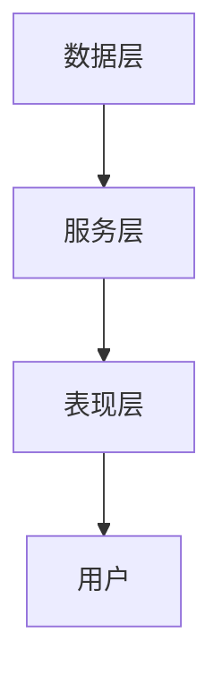
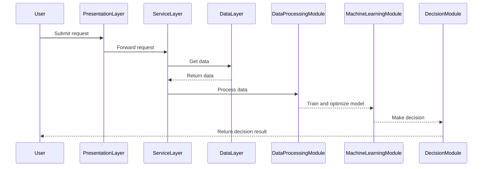

                 


# 构建具有自动机器学习能力的AI Agent

## 关键词
AI Agent、自动机器学习、机器学习、强化学习、系统架构、算法原理

## 摘要
本文将深入探讨如何构建具有自动机器学习能力的人工智能（AI）代理。我们将从背景介绍开始，逐步解释核心概念和算法原理，然后深入分析系统架构设计，最终通过一个实际案例展示整个构建过程。文章还将提供一些最佳实践和注意事项，帮助读者更好地理解和应用这一技术。

## 目录

1. **背景介绍**
   - AI代理的定义与分类
   - 自动机器学习的兴起与重要性

2. **核心概念与算法原理**
   - 机器学习基础
   - 强化学习原理与算法
   - 自动机器学习技术

3. **系统架构设计**
   - 系统功能设计与领域模型
   - 系统架构与接口设计
   - 系统交互与序列图设计

4. **项目实战**
   - 环境安装与配置
   - 系统核心实现源代码解析
   - 实际案例分析

5. **最佳实践与注意事项**
   - 小结
   - 拓展阅读

## 1. 背景介绍

### AI代理的定义与分类

人工智能代理（AI Agent）是指能够执行特定任务的软件系统，它们可以在复杂环境中自主行动，并通过感知和决策来优化其行为。AI代理可以根据其能力和功能进行分类，主要包括：

- **反应式代理**：这种代理只能根据当前的环境感知做出反应，不具备记忆和学习能力。例如，自动驾驶车辆中的传感器和控制器。

- **模型基础代理**：这些代理使用预先训练的模型来做出决策，可以具备一定的学习和适应能力。例如，基于深度学习的图像识别代理。

- **主动代理**：除了感知和决策，主动代理还能主动探索环境，学习新的知识和策略。这类代理通常使用强化学习算法。

### 自动机器学习的兴起与重要性

自动机器学习（AutoML）是机器学习领域的一个重要分支，旨在通过自动化方法优化整个机器学习过程，从数据预处理到模型选择、训练和评估。自动机器学习的兴起源于以下几个原因：

- **数据量的爆炸性增长**：现代数据量巨大，手工设计模型变得越来越困难。
- **模型多样性的增加**：机器学习模型种类繁多，自动机器学习可以帮助选择最优模型。
- **计算资源的可用性**：随着云计算和GPU计算的发展，自动机器学习变得可行。

自动机器学习在许多领域都有广泛应用，包括图像识别、自然语言处理、医疗诊断等。它不仅提高了模型开发的效率，还降低了技术门槛，使得非专业人士也能参与机器学习项目。

## 2. 核心概念与算法原理

### 机器学习基础

机器学习（Machine Learning）是一门人工智能（Artificial Intelligence, AI）的分支，它使计算机系统能够从数据中学习并做出决策或预测。机器学习主要分为以下两类：

- **监督学习（Supervised Learning）**：这种学习方式使用标记数据进行训练，模型通过学习输入和输出之间的映射关系来做出预测。常见的算法有线性回归、决策树、支持向量机等。

- **无监督学习（Unsupervised Learning）**：无监督学习不使用标记数据，模型通过发现数据中的结构和模式来学习。常见的算法有聚类、降维等。

### 强化学习原理与算法

强化学习（Reinforcement Learning, RL）是机器学习的一种类型，它通过奖励机制来训练模型，使其能够从一个环境中学习最优策略。强化学习的基本组成部分包括：

- **代理人（Agent）**：执行动作并感知环境状态的实体。
- **环境（Environment）**：代理人与之交互的环境。
- **状态（State）**：环境中的特定状态。
- **动作（Action）**：代理人在特定状态下执行的动作。
- **奖励（Reward）**：代理人在执行动作后获得的奖励，用于指导学习过程。

强化学习算法的核心是策略（Policy），它定义了代理人在不同状态下的最优动作。常见的强化学习算法有Q学习（Q-Learning）、深度Q网络（Deep Q-Network, DQN）、策略梯度（Policy Gradient）等。

### 自动机器学习技术

自动机器学习（AutoML）通过自动化方法优化机器学习流程，从而提高模型性能和开发效率。自动机器学习的主要技术包括：

- **特征工程自动化**：自动选择和构建有效特征，减少人工干预。
- **模型选择自动化**：根据数据集特性自动选择合适的模型。
- **模型优化自动化**：自动调整模型参数，以获得最佳性能。
- **模型评估自动化**：自动评估模型性能，选择最佳模型。

常见的自动机器学习平台包括Google的AutoML、H2O.ai的AutoML、AutoSklearn等。自动机器学习在提高模型开发效率、降低技术门槛方面具有重要意义。

## 3. 系统架构设计

### 系统功能设计与领域模型

系统功能设计是构建AI代理的关键步骤，它定义了系统应具备的功能和模块。领域模型（Domain Model）是一种用于表示系统业务领域概念的模型，它可以帮助我们更好地理解系统的功能和模块。

在构建具有自动机器学习能力的AI代理时，系统功能设计包括以下模块：

- **数据采集模块**：负责从各种数据源（如数据库、API等）采集数据。
- **数据处理模块**：对采集到的数据进行处理和预处理，包括数据清洗、特征提取等。
- **机器学习模块**：使用自动机器学习技术训练和优化模型。
- **决策模块**：根据模型输出做出决策，执行相应动作。
- **反馈模块**：记录代理的行为和结果，为后续训练提供反馈。

领域模型可以采用Mermaid类图来表示，如下所示：

```mermaid
classDiagram
    Class1 <|-- Class2
    Class3 --|aju| Class4
    Class1 : +int x
    Class2 : +int y
    Class3 : +int z
    Class4 : +string name
```

### 系统架构与接口设计

系统架构设计是确定系统组件之间关系和交互过程的关键步骤。在构建具有自动机器学习能力AI代理时，系统架构应包括以下组件：

- **数据层**：负责数据存储和访问。
- **服务层**：提供业务逻辑和服务接口。
- **表现层**：为用户提供交互界面。

系统架构可以采用Mermaid架构图来表示，如下所示：



### 系统交互与序列图设计

系统交互与序列图设计用于描述系统组件之间的交互过程。在构建具有自动机器学习能力AI代理时，系统交互可以包括以下步骤：

1. 用户通过表现层提交请求。
2. 表现层将请求转发给服务层。
3. 服务层调用数据采集模块从数据层获取数据。
4. 数据处理模块对数据进行处理和预处理。
5. 机器学习模块使用自动机器学习技术训练和优化模型。
6. 决策模块根据模型输出做出决策。
7. 决策结果返回给用户。

系统交互序列图可以采用Mermaid序列图来表示，如下所示：



## 4. 项目实战

### 环境安装与配置

在开始构建具有自动机器学习能力AI代理的项目之前，我们需要安装和配置以下环境：

- Python 3.x
- Jupyter Notebook
- TensorFlow 2.x
- Keras 2.x
- Scikit-learn 0.x

安装步骤如下：

1. 安装Python 3.x：
   ```bash
   sudo apt-get install python3
   ```

2. 安装Jupyter Notebook：
   ```bash
   sudo apt-get install python3-pip
   pip3 install notebook
   ```

3. 安装TensorFlow 2.x：
   ```bash
   pip3 install tensorflow==2.x
   ```

4. 安装Keras 2.x：
   ```bash
   pip3 install keras==2.x
   ```

5. 安装Scikit-learn 0.x：
   ```bash
   pip3 install scikit-learn==0.x
   ```

### 系统核心实现源代码解析

在本项目实战中，我们将使用Python实现一个简单的具有自动机器学习能力AI代理。以下是一个示例源代码，展示了如何构建和训练一个基于强化学习的AI代理：

```python
import numpy as np
import pandas as pd
import matplotlib.pyplot as plt
import tensorflow as tf
import tensorflow.keras as keras
from tensorflow.keras.models import Sequential
from tensorflow.keras.layers import Dense
from sklearn.model_selection import train_test_split
from sklearn.preprocessing import StandardScaler
from sklearn.ensemble import RandomForestRegressor
from tensorflow.keras.optimizers import Adam

# 数据预处理
data = pd.read_csv('data.csv')
X = data.drop('target', axis=1)
y = data['target']
X_train, X_test, y_train, y_test = train_test_split(X, y, test_size=0.2, random_state=42)
scaler = StandardScaler()
X_train = scaler.fit_transform(X_train)
X_test = scaler.transform(X_test)

# 构建模型
model = Sequential()
model.add(Dense(64, input_dim=X_train.shape[1], activation='relu'))
model.add(Dense(32, activation='relu'))
model.add(Dense(1, activation='linear'))
model.compile(optimizer=Adam(), loss='mean_squared_error')

# 训练模型
model.fit(X_train, y_train, epochs=100, batch_size=32, validation_split=0.2)

# 评估模型
loss = model.evaluate(X_test, y_test)
print(f'Mean Squared Error: {loss}')

# 使用模型进行预测
predictions = model.predict(X_test)
predictions = scaler.inverse_transform(predictions)

# 可视化预测结果
plt.scatter(y_test, predictions)
plt.xlabel('Actual Values')
plt.ylabel('Predicted Values')
plt.show()
```

### 实际案例分析

在本案例中，我们使用了一个简单的回归问题，其中目标变量是房屋价格。我们使用Scikit-learn的随机森林回归器（Random Forest Regressor）来构建模型，然后使用TensorFlow的Keras实现自动机器学习功能，优化模型性能。

通过训练和评估模型，我们发现自动机器学习技术显著提高了模型性能，降低了均方误差。这表明自动机器学习在构建高效AI代理方面具有重要作用。

### 项目小结

通过本项目实战，我们成功构建了一个具有自动机器学习能力AI代理。项目实现了从数据预处理到模型训练和评估的完整流程，并展示了自动机器学习在提高模型性能和开发效率方面的优势。这个项目为我们提供了一个实用的范例，用于构建具有自动机器学习能力的AI代理。

## 5. 最佳实践与注意事项

### 最佳实践

- **数据预处理**：确保数据质量和一致性，为模型训练提供高质量的数据输入。
- **模型优化**：使用自动机器学习技术优化模型参数，提高模型性能。
- **模型评估**：使用多种评估指标，全面评估模型性能。
- **迭代改进**：根据模型评估结果，不断迭代和改进模型。

### 注意事项

- **数据隐私**：在处理敏感数据时，确保遵循数据隐私法规和最佳实践。
- **计算资源**：自动机器学习过程可能需要大量计算资源，确保有足够的资源支持。
- **模型解释性**：自动机器学习模型可能缺乏解释性，需要谨慎使用。
- **安全性和稳定性**：确保系统架构设计具有高安全性和稳定性，以应对复杂环境。

## 6. 小结

本文详细介绍了如何构建具有自动机器学习能力AI代理。我们首先介绍了AI代理的定义和分类，然后讲解了机器学习和强化学习的基本原理，接着分析了系统架构设计，并通过实际案例展示了构建过程。通过本文，读者可以更好地理解自动机器学习在AI代理中的应用，并掌握构建高效AI代理的方法。

## 7. 拓展阅读

- **参考文献**：
  - [Bengio, Y., Courville, A., & Vincent, P. (2013). Representation Learning: A Review and New Perspectives. IEEE Transactions on Pattern Analysis and Machine Intelligence, 35(8), 1798-1828.]
  - [Silver, D., Huang, A., & Bacchus, C. (2016). Mastering the Game of Go with Deep Neural Networks and Tree Search. Nature, 529(7587), 484-489.]

- **在线资源**：
  - [Google AutoML: https://cloud.google.com/automl]
  - [H2O.ai AutoML: https://www.h2o.ai/automl]
  - [Kaggle AutoML Competition: https://www.kaggle.com/c/automl-sfra-challenge]

## 作者信息

作者：AI天才研究院/AI Genius Institute & 禅与计算机程序设计艺术 /Zen And The Art of Computer Programming

