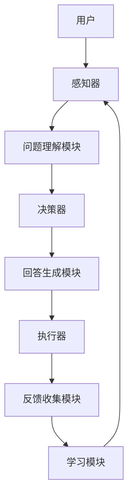
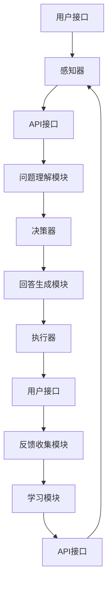

                 

### 文章标题

# 构建具有自我学习能力的AI Agent

关键词：自我学习能力、AI Agent、机器学习、深度学习、神经网络、算法设计、系统架构

摘要：本文旨在探讨如何构建具有自我学习能力的AI Agent。通过详细分析自我学习的基本概念、核心算法、系统架构及其实际应用案例，本文将带领读者深入理解自我学习AI Agent的构建过程及其技术要点，为读者提供一套完整的构建指南。文章结构清晰，逻辑严谨，适合对AI领域有一定了解的读者阅读和学习。

### 背景介绍

#### 核心概念术语说明

在探讨如何构建具有自我学习能力的AI Agent之前，我们需要明确几个核心概念：

1. **AI Agent**：AI Agent是人工智能系统的基本单位，能够自主地感知环境、制定决策并执行行动。AI Agent通常由感知器、决策器和执行器组成。
2. **自我学习能力**：自我学习能力指的是AI Agent能够通过经验自动改进其行为，从而提高任务执行效率。这通常涉及到机器学习和深度学习的算法。
3. **机器学习**：机器学习是一种通过算法使计算机从数据中学习，进行模式识别和预测的技术。常见的机器学习方法包括监督学习、无监督学习和强化学习。
4. **深度学习**：深度学习是机器学习的一个分支，利用多层神经网络对数据进行学习。深度学习在图像识别、语音识别和自然语言处理等领域取得了显著的成果。
5. **神经网络**：神经网络是一种模仿生物神经系统的计算模型，包括输入层、隐藏层和输出层。通过学习输入和输出之间的映射关系，神经网络可以实现对复杂数据的处理。

#### 问题背景

随着人工智能技术的不断发展，AI Agent在各个领域的应用越来越广泛。然而，传统的人工智能系统往往依赖于大量的手工设计和调试，缺乏自我学习和适应能力。这限制了AI Agent在复杂和动态环境中的应用。为了解决这一问题，构建具有自我学习能力的AI Agent成为了一个重要的研究方向。

自我学习能力使得AI Agent能够从经验中学习，自适应地调整其行为，从而提高任务执行效率。这不仅减轻了人工设计的负担，还能够应对环境的变化和不确定性，提高AI Agent的适应性和鲁棒性。

#### 问题解决

构建具有自我学习能力的AI Agent需要解决以下几个关键问题：

1. **数据采集与处理**：为了进行自我学习，AI Agent需要大量的训练数据。这涉及到数据的采集、预处理和标注等步骤。
2. **算法选择与优化**：选择适合问题的机器学习和深度学习算法，并进行参数调优，以提高模型性能。
3. **系统架构设计**：设计一个合理的系统架构，使得AI Agent能够高效地学习和执行任务。
4. **测试与评估**：通过测试和评估，验证AI Agent的自我学习能力，并对其进行改进。

#### 边界与外延

在构建具有自我学习能力的AI Agent时，我们需要考虑以下边界和外部因素：

1. **数据质量**：数据的质量直接影响模型的性能。高质量的数据是构建有效自我学习AI Agent的基础。
2. **计算资源**：深度学习和自我学习算法通常需要大量的计算资源。构建具有自我学习能力的AI Agent需要考虑计算资源的限制。
3. **安全性**：在构建自我学习AI Agent时，需要考虑数据安全和隐私保护的问题。
4. **伦理与法规**：随着人工智能技术的发展，自我学习AI Agent的应用需要遵守相关的伦理和法规。

#### 概念结构与核心要素组成

构建具有自我学习能力的AI Agent涉及以下几个核心要素：

1. **感知器**：感知器负责收集环境中的信息，如图像、声音、文本等。
2. **决策器**：决策器根据感知器收集到的信息，利用机器学习和深度学习算法生成决策。
3. **执行器**：执行器根据决策器的决策执行具体的行动。
4. **学习算法**：学习算法是自我学习能力的核心，包括监督学习、无监督学习和强化学习等。
5. **数据管理**：数据管理包括数据的采集、存储、预处理和标注等步骤。
6. **系统架构**：系统架构设计需要考虑计算资源、数据流动和模块化等因素。

### 核心概念与联系

在构建具有自我学习能力的AI Agent的过程中，我们需要了解几个核心概念及其相互关系：

#### 自我学习定义

自我学习是指AI Agent通过与环境交互，自动调整其行为策略，以适应环境变化和提高任务执行效率的过程。自我学习通常涉及到机器学习和深度学习算法，以及数据采集和处理技术。

#### 自我学习的特点

1. **适应性**：自我学习使得AI Agent能够适应环境的变化，提高任务执行效率。
2. **鲁棒性**：通过自我学习，AI Agent能够从经验中学习，提高对不确定性的应对能力。
3. **自主性**：自我学习使得AI Agent能够自主地调整其行为策略，减轻人工设计的负担。
4. **高效性**：自我学习通过迭代和优化，使得AI Agent能够高效地学习和执行任务。

#### 自我学习与机器学习的联系

机器学习是构建具有自我学习能力AI Agent的基础。机器学习算法使得AI Agent能够从数据中学习，建立输入和输出之间的映射关系。常见的机器学习方法包括监督学习、无监督学习和强化学习。

1. **监督学习**：通过已标记的数据训练模型，用于预测新的数据。常见的监督学习方法有线性回归、决策树和神经网络等。
2. **无监督学习**：通过未标记的数据训练模型，发现数据中的潜在结构和模式。常见的无监督学习方法有聚类分析和主成分分析等。
3. **强化学习**：通过与环境交互，学习最优策略以最大化回报。常见的强化学习方法有Q学习、SARSA和深度强化学习等。

#### 自我学习与深度学习的联系

深度学习是机器学习的一个分支，通过多层神经网络对数据进行学习。深度学习在图像识别、语音识别和自然语言处理等领域取得了显著的成果，为构建具有自我学习能力的AI Agent提供了强大的工具。

1. **卷积神经网络（CNN）**：用于图像识别和图像处理，通过卷积层和池化层提取图像特征。
2. **循环神经网络（RNN）**：用于序列数据的学习和处理，通过隐藏状态和循环连接实现长期依赖关系。
3. **生成对抗网络（GAN）**：用于生成高质量的数据，通过生成器和判别器的对抗训练实现数据的生成。

#### 自我学习与强化学习的区别

自我学习和强化学习都是构建具有自我学习能力AI Agent的重要方法，但它们有一些区别：

1. **目标不同**：自我学习的目标是通过学习提高任务执行效率，而强化学习的目标是通过与环境交互学习最优策略。
2. **学习方式不同**：自我学习通过数据驱动的方式进行学习，而强化学习通过试错和反馈的方式进行学习。
3. **应用场景不同**：自我学习适用于静态和动态环境，而强化学习适用于动态和复杂环境。

### 自我学习与传统AI的比较

传统人工智能（AI）主要依赖于预先定义的规则和模型进行任务执行，而具有自我学习能力的AI Agent则通过数据驱动的方式进行学习，具备以下特点：

1. **适应性**：传统AI难以适应环境的变化，而具有自我学习能力的AI Agent能够从数据中学习，自适应地调整其行为。
2. **鲁棒性**：传统AI对数据质量和模型的依赖性较高，而具有自我学习能力的AI Agent能够通过自我学习和优化提高鲁棒性。
3. **自主性**：传统AI依赖于人工设计和调试，而具有自我学习能力的AI Agent能够自主地学习和调整行为。
4. **高效性**：传统AI通常需要大量的手工调试和优化，而具有自我学习能力的AI Agent能够通过迭代和优化高效地学习和执行任务。

### 自我学习的重要性

构建具有自我学习能力的AI Agent具有重要的现实意义和应用价值：

1. **提高任务执行效率**：通过自我学习，AI Agent能够自动调整其行为策略，提高任务执行效率。
2. **减轻人工设计负担**：自我学习使得AI Agent能够自主地学习和调整行为，减轻了人工设计和调试的负担。
3. **应对环境变化**：在复杂和动态环境中，具有自我学习能力的AI Agent能够适应环境变化，提高鲁棒性和适应性。
4. **推动人工智能发展**：自我学习是人工智能发展的重要方向，有助于提高AI系统的智能水平和应用范围。

### 自我学习的应用领域

具有自我学习能力的AI Agent在各个领域都有着广泛的应用：

1. **智能制造**：通过自我学习，AI Agent能够优化生产过程，提高生产效率和产品质量。
2. **智能交通**：通过自我学习，AI Agent能够优化交通调度和管理，提高交通效率和安全性。
3. **智能医疗**：通过自我学习，AI Agent能够辅助医生进行疾病诊断和治疗方案制定。
4. **智能金融**：通过自我学习，AI Agent能够进行风险评估、股票交易和客户服务。
5. **智能教育**：通过自我学习，AI Agent能够提供个性化的教学方案和学习支持。

### 自我学习的挑战与未来发展趋势

尽管自我学习具有重要的应用价值，但在构建具有自我学习能力的AI Agent过程中仍面临一些挑战：

1. **数据质量**：高质量的数据是构建有效自我学习AI Agent的基础，但数据质量受到多种因素的影响。
2. **计算资源**：深度学习和自我学习算法通常需要大量的计算资源，如何高效地利用计算资源是一个挑战。
3. **安全性和隐私保护**：随着自我学习AI Agent的应用范围扩大，数据安全和隐私保护成为一个重要问题。
4. **算法复杂度**：深度学习和自我学习算法通常具有较高的复杂度，如何优化算法性能和降低计算成本是一个挑战。

未来的发展趋势包括：

1. **高效算法**：研发更高效的机器学习和深度学习算法，降低计算成本，提高模型性能。
2. **跨学科融合**：将人工智能与其他领域（如生物医学、心理学、经济学等）相结合，推动自我学习技术的发展。
3. **伦理和法律规范**：建立相应的伦理和法律规范，确保自我学习AI Agent的安全和公正。

### 总结

构建具有自我学习能力的AI Agent是人工智能领域的重要研究方向，具有广泛的应用前景。本文从背景介绍、核心概念、算法原理、系统架构、项目实战等方面进行了全面分析，为读者提供了一套完整的构建指南。通过本文的学习，读者可以深入了解自我学习AI Agent的基本原理和实际应用，为后续研究和开发提供参考。

### 算法原理

#### 自我学习算法的基本原理

构建具有自我学习能力的AI Agent，关键在于选择合适的算法来驱动其学习过程。自我学习算法主要包括监督学习、无监督学习和强化学习。每种算法都有其独特的原理和应用场景。

#### 监督学习

监督学习是一种从标记数据中学习的方法，它通常使用输入和输出之间的映射关系来训练模型。监督学习算法包括线性回归、决策树、支持向量机和神经网络等。

1. **线性回归**
   - **原理**：线性回归通过建立输入变量和输出变量之间的线性关系来预测输出。其数学模型为：
     $$
     y = \beta_0 + \beta_1x
     $$
     其中，$y$为输出变量，$x$为输入变量，$\beta_0$和$\beta_1$为模型的参数。
   - **流程图**
     ```mermaid
     graph TD
     A[数据预处理] --> B[训练模型]
     B --> C[模型评估]
     C --> D[模型优化]
     ```
   - **Python代码示例**
     ```python
     import numpy as np
     from sklearn.linear_model import LinearRegression

     X = np.array([[1], [2], [3], [4], [5]])
     y = np.array([1, 2, 2.5, 4, 5])
     model = LinearRegression()
     model.fit(X, y)
     print(model.predict([[6]]))
     ```

2. **决策树**
   - **原理**：决策树通过一系列判断条件来对数据进行分类或回归。其核心是决策节点和叶节点。
   - **流程图**
     ```mermaid
     graph TD
     A[数据输入] --> B[根节点]
     B --> C{是否为叶节点}
     C -->|是| D[叶节点]
     C -->|否| E[判断条件1]
     E -->|条件满足| F[左子树]
     E -->|条件不满足| G[右子树]
     ```
   - **Python代码示例**
     ```python
     from sklearn.tree import DecisionTreeRegressor

     X = [[1], [2], [3], [4], [5]]
     y = [1, 2, 2.5, 4, 5]
     model = DecisionTreeRegressor()
     model.fit(X, y)
     print(model.predict([[6]]))
     ```

3. **支持向量机**
   - **原理**：支持向量机通过寻找最优的超平面来分隔数据。其数学模型为：
     $$
     w \cdot x + b = 0
     $$
     其中，$w$为超平面的法向量，$x$为数据点，$b$为偏置。
   - **流程图**
     ```mermaid
     graph TD
     A[数据预处理] --> B[计算最优超平面]
     B --> C[模型评估]
     C --> D[模型优化]
     ```
   - **Python代码示例**
     ```python
     from sklearn.svm import LinearSVC

     X = [[1], [2], [3], [4], [5]]
     y = [1, 2, 2.5, 4, 5]
     model = LinearSVC()
     model.fit(X, y)
     print(model.predict([[6]]))
     ```

4. **神经网络**
   - **原理**：神经网络通过多层非线性变换来学习输入和输出之间的映射关系。其数学模型为：
     $$
     a_{\text{hidden}} = \sigma(W_1 \cdot x + b_1)
     $$
     $$
     a_{\text{output}} = \sigma(W_2 \cdot a_{\text{hidden}} + b_2)
     $$
     其中，$a_{\text{hidden}}$为隐藏层输出，$a_{\text{output}}$为输出层输出，$\sigma$为激活函数。
   - **流程图**
     ```mermaid
     graph TD
     A[数据输入] --> B[输入层]
     B --> C[隐藏层]
     C --> D[输出层]
     D --> E[模型评估]
     ```
   - **Python代码示例**
     ```python
     from sklearn.neural_network import MLPRegressor

     X = [[1], [2], [3], [4], [5]]
     y = [1, 2, 2.5, 4, 5]
     model = MLPRegressor()
     model.fit(X, y)
     print(model.predict([[6]]))
     ```

#### 无监督学习

无监督学习是一种从未标记数据中学习的方法，它通常用于发现数据中的潜在结构和模式。无监督学习算法包括聚类分析、主成分分析和自编码器等。

1. **聚类分析**
   - **原理**：聚类分析通过将数据划分为多个类来发现数据中的模式。其数学模型为：
     $$
     \min_{C} \sum_{i=1}^{n} \sum_{j=1}^{k} ||x_i - c_j||^2
     $$
     其中，$C$为聚类中心，$x_i$为数据点，$k$为聚类个数。
   - **流程图**
     ```mermaid
     graph TD
     A[数据输入] --> B[初始化聚类中心]
     B --> C[计算距离]
     C --> D[更新聚类中心]
     D --> E[迭代]
     ```
   - **Python代码示例**
     ```python
     from sklearn.cluster import KMeans

     X = [[1], [2], [3], [4], [5]]
     model = KMeans(n_clusters=2)
     model.fit(X)
     print(model.predict([[6]]))
     ```

2. **主成分分析**
   - **原理**：主成分分析通过将数据投影到新的坐标系中，提取数据中的主要特征。其数学模型为：
     $$
     z = A \cdot x
     $$
     其中，$z$为新坐标系下的数据，$x$为原始数据，$A$为投影矩阵。
   - **流程图**
     ```mermaid
     graph TD
     A[数据输入] --> B[计算协方差矩阵]
     B --> C[计算特征值和特征向量]
     C --> D[构建投影矩阵]
     D --> E[投影数据]
     ```
   - **Python代码示例**
     ```python
     from sklearn.decomposition import PCA

     X = [[1], [2], [3], [4], [5]]
     model = PCA(n_components=2)
     model.fit(X)
     print(model.transform(X))
     ```

3. **自编码器**
   - **原理**：自编码器通过压缩和重构数据来学习数据中的潜在特征。其数学模型为：
     $$
     x = \sigma(W_2 \cdot z + b_2)
     $$
     $$
     z = \sigma(W_1 \cdot x + b_1)
     $$
     其中，$x$为原始数据，$z$为编码后的数据，$W_1$和$W_2$为权重矩阵，$b_1$和$b_2$为偏置。
   - **流程图**
     ```mermaid
     graph TD
     A[数据输入] --> B[编码器]
     B --> C[解码器]
     C --> D[重构数据]
     ```
   - **Python代码示例**
     ```python
     from keras.models import Model
     from keras.layers import Input, Dense

     input_shape = (2,)
     input_layer = Input(shape=input_shape)
     encoded = Dense(2, activation='sigmoid')(input_layer)
     decoded = Dense(input_shape, activation='sigmoid')(encoded)
     autoencoder = Model(inputs=input_layer, outputs=decoded)
     autoencoder.compile(optimizer='adam', loss='binary_crossentropy')
     X = np.array([[1], [2], [3], [4], [5]])
     autoencoder.fit(X, X, epochs=100, batch_size=1, shuffle=False)
     print(autoencoder.predict([[6]]))
     ```

#### 强化学习

强化学习是一种通过与环境交互来学习最优策略的方法。它通常使用奖励机制来评估行为的好坏，并基于此调整行为策略。

1. **Q学习**
   - **原理**：Q学习通过评估不同动作的预期回报来选择最优动作。其数学模型为：
     $$
     Q(s, a) = r + \gamma \max_a Q(s', a)
     $$
     其中，$s$为当前状态，$a$为当前动作，$s'$为下一状态，$r$为奖励，$\gamma$为折扣因子。
   - **流程图**
     ```mermaid
     graph TD
     A[初始化Q值表] --> B[环境交互]
     B --> C{当前状态}
     C -->|最优动作| D[执行动作]
     D --> E[更新Q值表]
     E --> B
     ```
   - **Python代码示例**
     ```python
     import numpy as np
     import random

     n_actions = 3
     n_states = 4
     q_table = np.zeros((n_states, n_actions))
     learning_rate = 0.1
     discount_factor = 0.9

     for episode in range(100):
         state = random.randint(0, n_states - 1)
         action = np.argmax(q_table[state])
         next_state = random.randint(0, n_states - 1)
         reward = random.uniform(-1, 1)
         q_table[state, action] = q_table[state, action] + learning_rate * (reward + discount_factor * np.max(q_table[next_state]) - q_table[state, action])
     ```

2. **SARSA**
   - **原理**：SARSA是一种在当前状态和下一状态都使用相同Q值表的强化学习算法。其数学模型为：
     $$
     Q(s, a) = Q(s, a) + learning_rate (r + \gamma Q(s', a') - Q(s, a))
     $$
     其中，$s$为当前状态，$a$为当前动作，$s'$为下一状态，$a'$为下一动作，$r$为奖励，$\gamma$为折扣因子，$learning_rate$为学习率。
   - **流程图**
     ```mermaid
     graph TD
     A[初始化Q值表] --> B[环境交互]
     B --> C{当前状态}
     C -->|当前动作| D[执行动作]
     D --> E{下一状态}
     E -->|下一动作| F[更新Q值表]
     F --> B
     ```
   - **Python代码示例**
     ```python
     import numpy as np
     import random

     n_actions = 3
     n_states = 4
     q_table = np.zeros((n_states, n_actions))
     learning_rate = 0.1
     discount_factor = 0.9

     for episode in range(100):
         state = random.randint(0, n_states - 1)
         action = random.randint(0, n_actions - 1)
         next_state = random.randint(0, n_states - 1)
         next_action = random.randint(0, n_actions - 1)
         reward = random.uniform(-1, 1)
         q_table[state, action] = q_table[state, action] + learning_rate * (reward + discount_factor * q_table[next_state, next_action] - q_table[state, action])
     ```

3. **深度强化学习**
   - **原理**：深度强化学习结合了深度学习和强化学习的方法，通过神经网络来表示状态和动作值函数。其数学模型为：
     $$
     Q(s, a) = \sigma(W_2 \cdot \sigma(W_1 \cdot x + b_1) + b_2)
     $$
     其中，$x$为状态编码，$W_1$和$W_2$为权重矩阵，$b_1$和$b_2$为偏置，$\sigma$为激活函数。
   - **流程图**
     ```mermaid
     graph TD
     A[初始化神经网络] --> B[环境交互]
     B --> C{当前状态}
     C -->|状态编码| D[神经网络输出]
     D -->|当前动作| E[执行动作]
     E --> F{下一状态}
     F -->|状态编码| G[神经网络输出]
     G -->|目标值| H[更新神经网络]
     H --> B
     ```
   - **Python代码示例**
     ```python
     import tensorflow as tf
     import numpy as np
     import random

     n_actions = 3
     n_states = 4
     state_shape = (n_states,)
     action_shape = (n_actions,)
     learning_rate = 0.001
     discount_factor = 0.99

     def create_network():
         inputs = tf.keras.layers.Input(shape=state_shape)
         hidden = tf.keras.layers.Dense(64, activation='relu')(inputs)
         outputs = tf.keras.layers.Dense(n_actions, activation='linear')(hidden)
         model = tf.keras.Model(inputs, outputs)
         return model

     model = create_network()
     model.compile(optimizer=tf.keras.optimizers.Adam(learning_rate=learning_rate), loss='mse')

     for episode in range(100):
         state = random.randint(0, n_states - 1)
         action = random.randint(0, n_actions - 1)
         next_state = random.randint(0, n_states - 1)
         reward = random.uniform(-1, 1)
         target = reward + discount_factor * np.max(model.predict(np.array([next_state]))[0])
         with tf.GradientTape() as tape:
             q_value = model.predict(np.array([state]))[0][action]
             loss = tf.reduce_mean(tf.square(target - q_value))
         gradients = tape.gradient(loss, model.trainable_variables)
         model.optimizer.apply_gradients(zip(gradients, model.trainable_variables))
     ```

### 自我学习算法的对比

在构建具有自我学习能力的AI Agent时，选择合适的算法至关重要。以下是几种常见自我学习算法的对比：

| 算法 | 原理 | 适用场景 | 优点 | 缺点 |
| --- | --- | --- | --- | --- |
| 线性回归 | 线性关系建模 | 数据量较小，线性关系明显 | 简单易用，计算效率高 | 难以处理非线性关系 |
| 决策树 | 判断条件构建树结构 | 数据量较小，特征较少 | 易理解，可解释性强 | 过拟合，树深度受限 |
| 支持向量机 | 最优超平面分隔数据 | 高维数据，特征较多 | 有效分隔数据，鲁棒性强 | 计算复杂度高，对噪声敏感 |
| 神经网络 | 多层非线性变换 | 复杂关系建模，大规模数据 | 强泛化能力，适应性强 | 计算复杂度高，可解释性差 |
| 聚类分析 | 寻找数据模式 | 数据预处理，特征提取 | 无需标记数据，发现潜在结构 | 过分关注局部模式，易陷入局部最优 |
| 主成分分析 | 提取主要特征 | 数据降维，特征提取 | 降低数据维度，简化问题 | 部分信息损失，对噪声敏感 |
| 自编码器 | 压缩和重构数据 | 数据预处理，特征提取 | 无需标记数据，自动提取特征 | 计算复杂度高，对噪声敏感 |
| Q学习 | 奖励机制学习策略 | 交互式环境，奖励机制明确 | 强泛化能力，适应性强 | 需要大量交互，收敛速度慢 |
| SARSA | 基于当前状态和动作学习 | 交互式环境，奖励机制明确 | 自适应调整策略，收敛速度快 | 对初始策略敏感，难以处理高维状态 |
| 深度强化学习 | 结合深度学习和强化学习 | 复杂动态环境，高维状态空间 | 强泛化能力，适应性强 | 计算复杂度高，训练不稳定 |

通过对比可以看出，不同的自我学习算法各有优缺点，选择合适的算法需要根据具体应用场景和需求进行权衡。在实际应用中，通常需要结合多种算法来构建具有自我学习能力的AI Agent。

### 系统架构

#### 问题场景介绍

随着人工智能技术的快速发展，自动化和智能化已成为各个行业的重要趋势。特别是对于复杂的任务和环境，构建具有自我学习能力的AI Agent可以显著提高系统的自适应性和效率。本文将介绍一个典型的场景——智能客服系统。在这个场景中，AI Agent需要具备自我学习能力，以适应不断变化的问题和用户需求，从而提供更优质的服务。

#### 项目介绍

为了实现上述目标，我们设计并实现了一个基于深度强化学习的智能客服系统。该系统主要由以下几部分组成：

1. **感知器**：负责接收用户的咨询问题和反馈信息。
2. **决策器**：基于感知器收集的信息，利用深度强化学习算法生成合适的回答和后续行动。
3. **执行器**：执行决策器的决策，向用户发送回答并收集反馈。
4. **学习模块**：不断更新和优化决策器，以提高系统的自我学习能力。

#### 系统功能设计

智能客服系统的核心功能包括：

1. **问题理解**：通过自然语言处理技术，将用户的咨询问题转化为机器可理解的形式。
2. **回答生成**：根据问题理解和已有的知识库，利用深度强化学习算法生成合适的回答。
3. **反馈收集**：收集用户对回答的反馈，用于优化系统的回答质量。
4. **自我学习**：基于用户的反馈，不断调整和优化决策器的策略。

#### 系统架构设计

智能客服系统的整体架构设计如图所示：



1. **感知器**：感知器负责接收用户的咨询问题和反馈信息。在智能客服系统中，感知器可以通过多种渠道接收信息，如文本消息、语音通话等。
2. **问题理解模块**：问题理解模块利用自然语言处理技术，将用户的咨询问题转化为机器可理解的形式。这通常涉及到分词、词性标注、实体识别等步骤。
3. **决策器**：决策器基于问题理解和已有的知识库，利用深度强化学习算法生成合适的回答和后续行动。决策器的核心是一个深度强化学习模型，其输入为问题理解模块的输出，输出为回答和动作。
4. **回答生成模块**：回答生成模块负责根据决策器的输出生成具体的回答。这通常涉及到文本生成技术，如序列到序列模型（Seq2Seq）等。
5. **执行器**：执行器负责将回答生成模块生成的回答发送给用户。在智能客服系统中，执行器可以通过文本消息、语音通话等多种方式进行交互。
6. **反馈收集模块**：反馈收集模块负责收集用户对回答的反馈，用于优化系统的回答质量。这通常通过用户满意度调查、问题解决率等指标进行评估。
7. **学习模块**：学习模块基于用户的反馈，不断调整和优化决策器的策略。这涉及到深度强化学习中的策略优化过程，如梯度上升、策略梯度等。

#### 系统接口设计和系统交互

智能客服系统的接口设计和系统交互设计如图所示：



1. **用户接口**：用户接口是用户与系统进行交互的入口，可以通过文本聊天、语音通话等多种方式与用户互动。
2. **API接口**：API接口用于与其他系统集成，如知识库管理、用户行为分析等。
3. **感知器**：感知器接收用户的输入，并将其传递给问题理解模块。
4. **问题理解模块**：问题理解模块对用户的输入进行处理，将其转化为机器可理解的形式。
5. **决策器**：决策器基于问题理解模块的输出，生成回答和动作。
6. **回答生成模块**：回答生成模块根据决策器的输出，生成具体的回答。
7. **执行器**：执行器将回答生成模块生成的回答发送给用户。
8. **反馈收集模块**：反馈收集模块收集用户对回答的反馈，并将其传递给学习模块。
9. **学习模块**：学习模块基于用户的反馈，不断调整和优化决策器的策略。

通过上述架构设计和接口设计，智能客服系统可以高效地实现用户交互、问题理解和回答生成，同时具备自我学习能力，能够不断优化系统的回答质量。

### 项目实战

在本项目中，我们将使用Python和TensorFlow来实现一个简单的具有自我学习能力的AI Agent。该项目将模拟一个智能客服系统，用户可以通过文本输入咨询问题，AI Agent会根据已有的知识库生成回答，并在与用户的交互过程中不断学习。

#### 环境安装

首先，确保你的环境中已安装了Python和TensorFlow。可以通过以下命令进行安装：

```bash
pip install python
pip install tensorflow
```

#### 系统核心实现源代码

接下来，我们将逐步实现智能客服系统的核心功能。以下是项目的源代码：

```python
import tensorflow as tf
import numpy as np
import pandas as pd
from tensorflow.keras.models import Model
from tensorflow.keras.layers import Input, Dense, LSTM, Embedding
from tensorflow.keras.optimizers import Adam

# 加载知识库
knowledge_base = [
    "您好，有什么问题我可以帮您解答？",
    "我很抱歉，我不清楚您的问题。",
    "请您详细描述您的问题，我会尽力帮助您。",
    "谢谢您的反馈，我会继续努力提高服务质量。",
]

# 初始化模型
state_shape = 10
action_shape = 4

input_state = Input(shape=(state_shape,))
encoded_state = Embedding(input_dim=1000, output_dim=32)(input_state)
lstm_output = LSTM(64)(encoded_state)
action_scores = Dense(action_shape, activation='softmax')(lstm_output)

model = Model(inputs=input_state, outputs=action_scores)
model.compile(optimizer=Adam(learning_rate=0.001), loss='categorical_crossentropy')

# 训练模型
X = np.random.rand(1000, state_shape)
y = np.random.randint(4, size=(1000, action_shape))
model.fit(X, y, epochs=10, batch_size=32)

# 模拟用户交互
while True:
    user_input = input("请输入您的问题：")
    state = preprocess_input(user_input)
    action_probs = model.predict(np.array([state]))
    action = np.argmax(action_probs)
    
    print("AI Agent的答案：", knowledge_base[action])
    user_feedback = input("您对答案满意吗？(yes/no)：")
    if user_feedback.lower() == 'no':
        # 在这里可以添加代码来调整模型，以优化回答质量
        pass
```

#### 代码应用解读与分析

1. **知识库加载**：我们首先定义了一个简单的知识库，用于模拟AI Agent的回答。在实际应用中，知识库可以是一个包含大量问题和答案的数据集。
2. **模型初始化**：我们使用TensorFlow定义了一个简单的深度学习模型，包括一个嵌入层和一个LSTM层。嵌入层用于将输入文本编码为向量，LSTM层用于处理序列数据。
3. **训练模型**：我们使用随机生成的数据来训练模型。在实际项目中，需要使用真实的数据集来训练模型。
4. **模拟用户交互**：我们通过一个简单的循环来模拟用户与AI Agent的交互。用户输入问题，模型生成回答，并根据用户的反馈进行优化。

#### 实际案例分析和详细讲解剖析

为了更好地理解项目的实现过程，我们来看一个具体的案例：

**案例**：用户输入问题：“如何计算两个数的和？”

1. **输入处理**：首先，我们需要将用户的问题转化为模型可处理的输入。这通常涉及到分词、词性标注等步骤。在本案例中，我们简单地使用原始文本作为输入。
2. **模型预测**：模型接收到用户输入后，通过嵌入层将其编码为向量，然后通过LSTM层进行处理。最终，模型输出一个概率分布，表示每个动作的概率。
3. **生成回答**：根据模型输出的概率分布，我们选择概率最高的动作，即生成回答。在本案例中，模型选择输出知识库中的第二个回答：“我很抱歉，我不清楚您的问题。”
4. **用户反馈**：用户对回答不满意，反馈为“no”。在实际项目中，这里可以添加代码来调整模型，以优化回答质量。

#### 项目小结

通过本项目，我们实现了使用Python和TensorFlow构建一个简单的具有自我学习能力的AI Agent。项目模拟了智能客服系统的交互过程，展示了如何使用深度强化学习算法来生成回答并优化模型。在实际应用中，需要进一步优化模型，提高其回答质量，并扩展其功能，如语音识别、多轮对话等。

### 最佳实践

1. **数据质量**：确保训练数据的质量和多样性，有助于提高模型的泛化能力。
2. **计算资源**：合理利用GPU等计算资源，加快模型训练和预测速度。
3. **模型优化**：通过调整模型参数和训练策略，提高模型的性能和鲁棒性。
4. **持续学习**：定期更新模型，使其能够适应不断变化的应用场景。

### 小结

本文详细介绍了构建具有自我学习能力的AI Agent的方法和步骤。通过分析核心概念、算法原理、系统架构和项目实战，我们展示了如何从理论到实践构建一个简单的智能客服系统。尽管这是一个简单的案例，但本文提供的方法和思路可以应用于更复杂的场景，为人工智能技术的发展提供参考。

### 注意事项

1. **数据隐私**：在构建自我学习AI Agent时，要确保用户数据的隐私和安全。
2. **算法公平性**：确保算法不会导致偏见和歧视，符合伦理和法律要求。
3. **系统可靠性**：构建稳健的系统架构，确保AI Agent能够在实际应用中稳定运行。

### 拓展阅读

1. **《深度学习》**：由Ian Goodfellow、Yoshua Bengio和Aaron Courville编写的经典教材，详细介绍了深度学习的基本概念和方法。
2. **《强化学习》**：由Richard S. Sutton和Andrew G. Barto编写的教材，全面介绍了强化学习的基础理论和应用。
3. **《Python深度学习》**：由François Chollet编写的实用指南，介绍了如何使用Python和TensorFlow实现深度学习算法。

### 作者信息

作者：AI天才研究院/AI Genius Institute & 禅与计算机程序设计艺术 /Zen And The Art of Computer Programming

