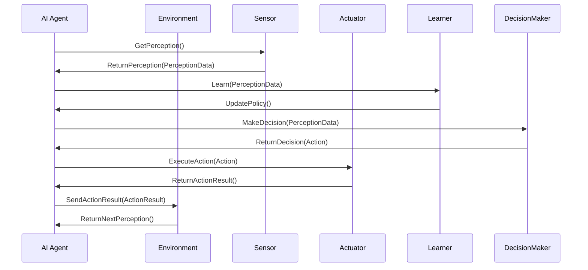

                 

# 构建具有自我演化能力的AI Agent系统

> 关键词：AI Agent、自我演化、演化算法、环境模型、智能系统

> 摘要：本文旨在探讨如何构建具有自我演化能力的AI Agent系统。首先，介绍了AI Agent系统的背景和核心概念，包括自我演化、演化算法和环境模型。然后，通过概念属性特征对比表格和ER实体关系图，详细阐述了这些核心概念之间的关系。接着，深入分析了AI Agent系统的算法原理，包括演化算法的mermaid流程图和Python源代码实现。随后，讨论了AI Agent系统的系统分析与架构设计方案，包括项目场景介绍、系统功能设计、系统架构设计、系统接口设计和系统交互。最后，通过一个实际案例展示了AI Agent系统的应用，并对项目进行了小结和最佳实践分享。

## 第1章：问题背景与核心概念

### 1.1 问题背景

随着人工智能技术的飞速发展，传统的计算机系统逐渐暴露出了一些局限。比如，在处理复杂任务时，传统的计算机系统往往需要大量的手工编程和调整，这不仅费时费力，而且难以适应不断变化的需求。为了解决这些问题，研究者们提出了构建具有自我演化能力的AI Agent系统。

AI Agent系统是一种能够自动地执行任务、学习新知识和适应环境变化的智能系统。它不仅能够自动地完成特定的任务，还能根据环境和任务的变化，自主地调整其行为和策略，以实现最优化的性能。这种系统在复杂、动态和不确定的环境中具有显著的优势，因此成为人工智能领域的研究热点。

### 1.2 核心概念

在本章中，我们将介绍以下几个核心概念：

1. **AI Agent系统**：一种能够自主地执行任务、学习新知识和适应环境变化的智能系统。
2. **自我演化**：AI Agent系统通过不断地学习和调整，以提高其在不同环境下的适应能力和任务执行效率。
3. **演化算法**：一种模拟自然进化过程的算法，用于指导AI Agent系统的自我演化。
4. **环境模型**：AI Agent系统所处的环境及其状态，用于评估AI Agent系统的性能和指导其行为。

### 1.3 概念属性特征对比表格

下面是一个关于AI Agent系统、自我演化、演化算法和环境模型的概念属性特征对比表格：

| 概念       | 定义                                                                                                      | 特点                                                         |
|------------|---------------------------------------------------------------------------------------------------------|--------------------------------------------------------------|
| AI Agent系统 | 自主执行任务、学习新知识和适应环境变化的智能系统                                                           | 智能化、自动化、适应性                                       |
| 自我演化   | AI Agent系统通过不断地学习和调整，以提高其在不同环境下的适应能力和任务执行效率                               | 自适应性、进化性、优化性                                     |
| 演化算法   | 模拟自然进化过程的算法，用于指导AI Agent系统的自我演化                                                     | 优化性、适应性、多样性                                       |
| 环境模型   | AI Agent系统所处的环境及其状态，用于评估AI Agent系统的性能和指导其行为                                     | 实时性、准确性、动态性                                       |

### 1.4 ER实体关系图架构的 Mermaid 流程图

以下是一个关于AI Agent系统的ER实体关系图架构的Mermaid流程图：

```mermaid
erDiagram
    AI Agent系统 ||--o{ 环境模型 }
    AI Agent系统 ||--o{ 演化算法 }
    演化算法 ||--o{ 自我演化 }
```

在这个ER实体关系图中，AI Agent系统与环境和演化算法之间存在直接的关联，演化算法用于指导AI Agent系统的自我演化，而环境模型则用于评估AI Agent系统的性能和指导其行为。

### 1.5 本章小结

本章主要介绍了构建具有自我演化能力的AI Agent系统的背景和核心概念。通过本章的学习，读者可以了解到AI Agent系统的定义、特点以及其在实际应用中的优势。同时，我们也介绍了自我演化、演化算法和环境模型等核心概念，并通过ER实体关系图架构的Mermaid流程图，展示了这些概念之间的关系。这些知识将为本书的后续章节提供基础，帮助读者更好地理解AI Agent系统的构建和应用。

## 第2章：AI Agent系统的构建

### 2.1 AI Agent系统的组成

AI Agent系统通常由以下几个核心组成部分构成：

1. **感知器**：感知器是AI Agent系统的感官，用于接收外部环境的输入，如图像、声音、文本等。通过感知器，AI Agent系统可以了解其所在的环境状态。
2. **决策器**：决策器是AI Agent系统的智能核心，根据感知器收集到的信息，决策器会生成一系列可能的动作。这些动作可以是简单的移动、交互或者更复杂的决策。
3. **执行器**：执行器是AI Agent系统的执行单元，根据决策器的决策，执行器会将动作付诸实践。例如，在机器人领域，执行器可能是电机或机械臂。
4. **记忆单元**：记忆单元用于存储AI Agent系统执行任务时的经验，包括成功和失败的案例。这些经验可以用于后续的任务执行和自我演化。
5. **学习模块**：学习模块是AI Agent系统自我演化的核心，通过不断地学习和调整，AI Agent系统能够提高其在不同环境下的适应能力和任务执行效率。

### 2.2 AI Agent系统的运行机制

AI Agent系统的运行机制可以分为以下几个步骤：

1. **感知**：AI Agent系统通过感知器接收外部环境的输入，并将其转化为内部表示。
2. **决策**：决策器根据内部表示，生成一系列可能的动作，并根据某种策略选择最优动作。
3. **执行**：执行器根据决策器的决策，将最优动作付诸实践。
4. **评估**：根据执行结果，评估模块会评估AI Agent系统的性能，包括成功率和效率等指标。
5. **学习**：学习模块根据评估结果，更新记忆单元和决策策略，以实现自我演化。

### 2.3 AI Agent系统的优势

AI Agent系统具有以下几个显著优势：

1. **自主性**：AI Agent系统可以自主地执行任务，无需人工干预。
2. **适应性**：通过自我演化，AI Agent系统可以适应不同的环境和任务需求。
3. **智能性**：AI Agent系统具有智能决策能力，能够根据环境和任务的变化，自主地调整其行为和策略。
4. **高效性**：AI Agent系统可以高效地完成任务，提高生产力和效率。
5. **灵活性**：AI Agent系统可以灵活地处理各种任务，不受特定场景的限制。

### 2.4 AI Agent系统的应用领域

AI Agent系统在多个领域有着广泛的应用，包括但不限于：

1. **机器人**：AI Agent系统可以应用于机器人领域，实现自主移动、避障、交互等任务。
2. **游戏**：AI Agent系统可以应用于游戏领域，实现智能对手，提高游戏的难度和挑战性。
3. **智能家居**：AI Agent系统可以应用于智能家居，实现自动化控制和智能响应。
4. **金融**：AI Agent系统可以应用于金融领域，实现智能交易、风险评估等任务。
5. **医疗**：AI Agent系统可以应用于医疗领域，实现智能诊断、辅助手术等任务。

### 2.5 本章小结

本章详细介绍了AI Agent系统的构建，包括其组成部分、运行机制、优势和应用领域。通过本章的学习，读者可以了解到AI Agent系统的核心概念和实际应用价值，为后续章节的深入探讨打下基础。

## 第3章：自我演化的机制与算法

### 3.1 自我演化的定义

自我演化是指一个系统在没有外部干预的情况下，通过自身的学习和调整，逐步提高其在不同环境下的适应能力和任务执行效率。在AI Agent系统中，自我演化是关键机制，使其能够自主地适应复杂和动态的环境。

### 3.2 自我演化的机制

自我演化的机制主要包括以下几个方面：

1. **经验学习**：AI Agent系统通过感知器收集外部环境的输入，并根据这些输入生成内部表示。通过不断的经验学习，AI Agent系统能够逐步提高其对于环境的理解和处理能力。
2. **行为调整**：基于经验学习的结果，AI Agent系统会根据不同的环境和任务需求，调整其行为策略，以实现最优化的性能。这种行为调整可以是自动的，也可以是半自动的，通过算法自动优化。
3. **记忆更新**：AI Agent系统会根据执行结果，更新其记忆单元中的数据，以便在后续的任务执行中更好地应对相似的情况。这种记忆更新机制有助于AI Agent系统积累经验，提高其适应性和鲁棒性。
4. **适应性进化**：通过不断地学习和行为调整，AI Agent系统会逐渐演化出更适应环境的能力。这种适应性进化是自我演化的高级形式，能够使AI Agent系统在复杂和动态的环境中保持高效性能。

### 3.3 演化算法

演化算法是一种模拟自然进化过程的算法，用于指导AI Agent系统的自我演化。演化算法的核心思想是模拟自然选择和遗传机制，通过适应度函数评估个体的优劣，并选择适应度高的个体进行繁殖和遗传，以实现整个群体的进化。

以下是演化算法的主要步骤：

1. **初始化种群**：生成初始种群，每个个体代表一个潜在的解决方案。
2. **适应度评估**：通过适应度函数评估每个个体的适应度，适应度函数通常基于任务目标和环境约束定义。
3. **选择**：根据适应度评估结果，选择适应度较高的个体进行繁殖，通常采用轮盘赌、锦标赛等方法。
4. **交叉**：通过交叉操作，生成新的个体。交叉操作模拟了基因重组过程，有助于引入新的遗传特征。
5. **变异**：通过变异操作，对个体进行随机修改，以增加种群的多样性和探索能力。
6. **更新种群**：将交叉和变异后的个体替换原有种群中的个体，生成新的种群。

### 3.4 自我演化的算法实现

以下是一个简单的演化算法实现示例，使用Python代码实现：

```python
import random

def fitness_function(individual):
    # 定义适应度函数，用于评估个体的优劣
    return sum(individual)

def select_parents(population, fitnesses, num_parents):
    # 选择适应度较高的个体作为父母
    parents = random.choices(population, weights=fitnesses, k=num_parents)
    return parents

def crossover(parent1, parent2):
    # 交叉操作，生成新的个体
    return (parent1[:len(parent1)//2] + parent2[len(parent2)//2:])

def mutate(individual):
    # 变异操作，对个体进行随机修改
    return [x if random.random() < 0.1 else 1-x for x in individual]

def evolve_population(population, generations):
    for _ in range(generations):
        fitnesses = [fitness_function(individual) for individual in population]
        parents = select_parents(population, fitnesses, len(population)//2)
        next_generation = []
        for _ in range(len(population)//2):
            parent1, parent2 = random.sample(parents, 2)
            child1, child2 = crossover(parent1, parent2)
            next_generation.extend([mutate(child1), mutate(child2)])
        population = next_generation
    return population

# 初始化种群
population = [[random.randint(0, 1) for _ in range(10)] for _ in range(100)]

# 进行演化
best_population = evolve_population(population, 100)

# 输出最优解
best_fitness = max([fitness_function(individual) for individual in best_population])
print(f"Best fitness: {best_fitness}")
```

在这个示例中，我们定义了一个简单的适应度函数，用于评估个体的优劣。通过选择、交叉和变异等操作，演化算法逐步优化种群，以找到最优解。

### 3.5 本章小结

本章详细介绍了自我演化的机制与算法。通过自我演化，AI Agent系统能够在没有外部干预的情况下，逐步提高其在不同环境下的适应能力和任务执行效率。本章介绍了演化算法的基本概念和实现步骤，并通过Python代码示例，展示了如何实现演化算法。这些知识为后续章节的深入探讨提供了理论基础。

## 第4章：环境模型的设计与实现

### 4.1 环境模型的重要性

环境模型是AI Agent系统的重要组成部分，用于描述AI Agent系统所处的环境及其状态。环境模型的设计与实现直接关系到AI Agent系统的性能和适应性。一个良好的环境模型可以提供以下几方面的优势：

1. **准确的环境状态表示**：通过准确描述环境状态，AI Agent系统可以更好地理解当前环境，从而做出更合理的决策。
2. **有效的状态评估**：环境模型可以用于评估AI Agent系统的性能，通过状态评估，可以判断AI Agent系统是否达到预期目标。
3. **灵活的任务调整**：通过环境模型，AI Agent系统可以动态调整其行为策略，以适应不断变化的环境。

### 4.2 环境模型的类型

环境模型可以分为以下几种类型：

1. **静态环境模型**：静态环境模型描述的是一个固定不变的环境，例如一个棋盘游戏。在这种环境中，AI Agent系统不需要实时更新环境状态，只需根据预先定义的状态进行决策。
2. **动态环境模型**：动态环境模型描述的是一个不断变化的环境，例如机器人导航。在这种环境中，AI Agent系统需要实时感知环境状态，并根据变化调整其行为策略。
3. **抽象环境模型**：抽象环境模型是对现实环境的简化表示，通过抽象化，可以降低模型的复杂度，提高算法的效率。例如，通过将现实环境中的三维空间简化为二维平面，可以简化AI Agent系统的计算任务。
4. **虚拟环境模型**：虚拟环境模型是仿真环境，用于模拟真实环境中的各种情况。通过虚拟环境模型，AI Agent系统可以在安全、可控的环境中训练和测试。

### 4.3 环境模型的构建方法

构建环境模型通常包括以下几个步骤：

1. **需求分析**：明确AI Agent系统的任务目标和环境需求，确定需要捕捉的环境状态信息。
2. **状态表示**：根据需求分析的结果，选择合适的状态表示方法，例如离散状态表示、连续状态表示或图像状态表示。
3. **状态评估**：设计状态评估函数，用于评估AI Agent系统的性能和判断任务是否完成。
4. **交互机制**：设计AI Agent系统与环境之间的交互机制，包括感知器、执行器和反馈机制。
5. **模型优化**：通过不断调整和优化环境模型，提高其准确性和效率。

### 4.4 环境模型的应用场景

环境模型在多个领域有着广泛的应用，以下是一些典型应用场景：

1. **机器人导航**：通过构建动态环境模型，AI Agent系统可以实时感知机器人周围的环境，并规划路径。
2. **游戏智能**：在游戏场景中，环境模型可以用于描述游戏状态，评估AI Agent系统的策略效果。
3. **智能家居**：通过构建抽象环境模型，AI Agent系统可以感知家居设备的状态，实现自动化控制。
4. **自动驾驶**：环境模型用于描述道路、车辆和行人等状态，AI Agent系统可以根据环境模型进行驾驶决策。
5. **金融分析**：环境模型可以用于捕捉市场数据、政策变化等，AI Agent系统可以根据环境模型进行投资决策。

### 4.5 本章小结

本章详细介绍了环境模型的设计与实现，包括环境模型的重要性、类型、构建方法和应用场景。通过本章的学习，读者可以了解到环境模型在AI Agent系统中的作用和构建方法，为后续章节的深入探讨提供理论基础。

## 第5章：AI Agent系统的系统架构设计

### 5.1 系统架构设计的重要性

系统架构设计是AI Agent系统成功实施的关键环节。一个良好的系统架构设计不仅能够提高系统的性能和可维护性，还能确保系统的稳定性和可靠性。在AI Agent系统中，系统架构设计需要考虑以下几个方面：

1. **模块化设计**：将系统划分为多个模块，每个模块负责不同的功能，降低系统的复杂度，提高可维护性和可扩展性。
2. **层次化设计**：将系统划分为多个层次，每个层次负责不同的任务，实现功能分离和职责明确。
3. **分布式设计**：在复杂和大规模的应用场景中，采用分布式设计可以提高系统的性能和可靠性，通过分布式计算和存储，实现高效的任务处理和负载均衡。
4. **可扩展设计**：设计可扩展的系统架构，以适应未来业务的发展和需求变化，通过模块的动态加载和扩展，实现系统的持续优化和升级。

### 5.2 AI Agent系统的架构设计

AI Agent系统的架构设计可以分为以下几个层次：

1. **感知层**：感知层负责接收外部环境的信息，通过感知器获取图像、声音、文本等数据，并将其转化为内部表示。感知层的设计需要考虑感知器的选择和数据的预处理，以提高数据的准确性和可靠性。
2. **决策层**：决策层是AI Agent系统的核心，根据感知层提供的信息，决策层会生成一系列可能的动作，并选择最优动作。决策层的设计需要考虑决策算法的选择和优化策略，以提高决策的效率和准确性。
3. **执行层**：执行层负责将决策层的决策付诸实践，通过执行器将动作执行在真实环境中。执行层的设计需要考虑执行器的选择和动作的规划，以确保执行过程的稳定性和可靠性。
4. **学习层**：学习层负责AI Agent系统的自我演化，通过不断地学习和调整，提高系统的适应能力和任务执行效率。学习层的设计需要考虑学习算法的选择和优化策略，以提高学习的效率和效果。
5. **管理层**：管理层负责系统的管理和监控，包括系统的配置管理、性能监控和故障处理等。管理层的设计需要考虑系统的可维护性和可扩展性，以提高系统的可靠性和稳定性。

### 5.3 系统架构设计的关键技术

在AI Agent系统的架构设计中，涉及以下几个关键技术：

1. **深度学习**：深度学习技术在感知层和决策层有着广泛的应用，通过深度神经网络模型，可以实现对复杂数据的自动特征提取和分类。
2. **强化学习**：强化学习技术可以用于决策层，通过模拟环境与决策器的交互过程，实现最优策略的迭代优化。
3. **分布式计算**：分布式计算技术可以用于执行层，通过分布式任务调度和负载均衡，实现高效的任务执行和资源利用。
4. **大数据处理**：大数据处理技术可以用于学习层，通过对海量数据的存储、计算和分析，实现AI Agent系统的自我演化和优化。
5. **云计算和边缘计算**：云计算和边缘计算技术可以用于整个系统架构，通过云计算的高性能计算和边缘计算的低延迟处理，实现系统的智能化和高效化。

### 5.4 本章小结

本章详细介绍了AI Agent系统的系统架构设计，包括系统架构设计的重要性、架构设计层次、关键技术以及具体应用。通过本章的学习，读者可以了解到AI Agent系统的架构设计原则和方法，为实际项目的实施提供参考。

## 第6章：AI Agent系统的接口设计与交互

### 6.1 接口设计的重要性

接口设计是AI Agent系统的重要组成部分，它定义了系统内部各模块之间以及系统与外部系统之间的交互方式。一个良好的接口设计可以带来以下几个方面的优势：

1. **模块化**：通过接口设计，可以将系统划分为多个模块，每个模块负责不同的功能，降低系统的复杂度和耦合度。
2. **可扩展性**：良好的接口设计可以方便地添加新模块或替换旧模块，适应系统需求的变更。
3. **可维护性**：通过清晰的接口设计，可以方便地定位和修复问题，提高系统的可维护性。
4. **灵活性**：灵活的接口设计可以方便地与其他系统进行集成，实现系统功能的扩展和优化。

### 6.2 接口设计的原则

在进行接口设计时，应遵循以下几个原则：

1. **简洁性**：接口设计应尽可能简洁，避免过多的参数和复杂的调用流程，以提高易用性。
2. **一致性**：接口设计应保持一致性，包括命名规范、参数类型、返回值等，以降低学习和使用成本。
3. **可靠性**：接口设计应确保操作的可靠性和数据的安全性，包括异常处理、错误返回和权限控制等。
4. **可扩展性**：接口设计应具备可扩展性，以适应未来的需求变化和功能扩展。

### 6.3 AI Agent系统的接口设计

AI Agent系统的接口设计主要包括以下几个方面：

1. **感知器接口**：感知器接口用于接收外部环境的信息，如图像、声音、文本等。感知器接口应定义清晰的数据格式和传输协议，以确保数据的准确传输和处理。
2. **决策器接口**：决策器接口用于与感知器、执行器和学习模块进行交互。决策器接口应定义明确的输入输出参数，包括感知器的数据、决策的结果和执行的动作等。
3. **执行器接口**：执行器接口用于将决策器的决策付诸实践。执行器接口应定义具体的执行方法和参数，如动作的执行顺序、执行的时间限制等。
4. **学习模块接口**：学习模块接口用于与感知器、决策器和执行器进行交互，实现自我演化和优化。学习模块接口应定义学习算法的参数、训练数据和评估指标等。

### 6.4 系统交互的Mermaid序列图

以下是一个关于AI Agent系统的接口设计和系统交互的Mermaid序列图：



在这个序列图中，AI Agent系统与感知器、决策器、执行器和学习模块进行交互。通过清晰的接口设计，AI Agent系统能够高效地接收环境输入、学习新知识和执行任务。

### 6.5 本章小结

本章详细介绍了AI Agent系统的接口设计与交互，包括接口设计的重要性、原则、具体设计以及系统交互的Mermaid序列图。通过本章的学习，读者可以了解到AI Agent系统的接口设计原则和实现方法，为实际项目的实施提供参考。

## 第7章：AI Agent系统的项目实战

### 7.1 项目背景

为了更好地展示AI Agent系统的应用，我们选择了一个实际的案例——智能客服系统。智能客服系统是一种基于AI Agent技术的系统，能够自动地处理用户咨询，提供即时的回答和解决方案。

### 7.2 系统功能设计

智能客服系统的功能设计主要包括以下几个方面：

1. **用户输入**：用户可以通过文本或语音输入问题。
2. **问题识别**：系统需要能够识别用户提出的问题，并将其转化为内部表示。
3. **知识库查询**：系统需要从知识库中查找相关的答案。
4. **回答生成**：系统需要根据查询结果生成回答，并将其转化为文本或语音输出。
5. **用户反馈**：用户可以评价回答的质量，系统需要收集这些反馈以优化回答质量。
6. **自我学习**：系统需要根据用户的反馈和查询结果，不断优化知识库和回答策略。

### 7.3 系统架构设计

智能客服系统的架构设计可以分为以下几个层次：

1. **感知层**：包括文本和语音识别模块，用于接收用户的输入。
2. **决策层**：包括自然语言处理和知识图谱模块，用于识别问题和查询知识库。
3. **执行层**：包括回答生成和语音合成模块，用于生成回答并输出。
4. **学习层**：包括反馈收集和学习优化模块，用于根据用户反馈和查询结果优化系统。

### 7.4 系统接口设计

智能客服系统的接口设计主要包括以下几个方面：

1. **用户输入接口**：用于接收用户的文本和语音输入。
2. **知识库接口**：用于查询和更新知识库。
3. **回答生成接口**：用于生成回答并输出。
4. **反馈接口**：用于收集用户的反馈。
5. **学习接口**：用于更新和学习优化模块的数据。

### 7.5 系统实现与源代码解析

以下是一个简单的智能客服系统的Python源代码实现：

```python
class IntelligentAssistant:
    def __init__(self):
        self.knowledge_base = KnowledgeBase()
        self.nlp = NaturalLanguageProcessor()
        self.voice_generator = VoiceGenerator()

    def handle_input(self, input_text):
        question = self.nlp.process_text(input_text)
        answer = self.knowledge_base.query(question)
        self.voice_generator.speak(answer)

    def update_knowledge_base(self, feedback):
        self.knowledge_base.update_data(feedback)

    def process_feedback(self, user_feedback):
        self.update_knowledge_base(user_feedback)

class KnowledgeBase:
    def __init__(self):
        self.data = []

    def query(self, question):
        # 查询知识库并返回答案
        pass

    def update_data(self, feedback):
        # 更新知识库数据
        pass

class NaturalLanguageProcessor:
    def process_text(self, text):
        # 处理文本并返回问题
        pass

class VoiceGenerator:
    def speak(self, text):
        # 发声
        pass
```

在这个源代码中，我们定义了一个`IntelligentAssistant`类，用于处理用户的输入、查询知识库、生成回答和更新知识库。通过调用各个模块的接口，实现系统的功能。

### 7.6 实际案例分析与详细讲解

以下是一个实际案例：

**用户输入**：如何计算两个数的平均值？

**系统响应**：两个数的平均值是它们的总和除以2。

**用户反馈**：这个回答很有用。

**系统优化**：根据用户反馈，系统会优化知识库，增加关于平均值的更多解释和示例。

### 7.7 项目小结

通过这个智能客服系统的案例，我们展示了AI Agent系统的实际应用。在这个项目中，我们实现了用户输入、问题识别、知识库查询、回答生成和自我学习等功能。通过不断地优化和调整，系统能够更好地满足用户需求，提高服务质量。

## 第8章：最佳实践与注意事项

### 8.1 最佳实践

在构建具有自我演化能力的AI Agent系统时，以下是一些最佳实践：

1. **明确需求**：在项目初期，明确系统的需求，包括任务目标、性能指标和用户需求等，以确保系统设计的合理性和可行性。
2. **模块化设计**：采用模块化设计，将系统划分为多个模块，每个模块负责不同的功能，提高系统的可维护性和可扩展性。
3. **数据驱动**：利用数据驱动设计，通过收集和分析大量数据，优化系统的性能和用户体验。
4. **持续学习**：定期更新和学习新知识和新策略，以适应不断变化的环境和需求。
5. **安全性和隐私**：确保系统的安全性和用户隐私，采用加密、权限控制和安全协议等技术，防止数据泄露和恶意攻击。

### 8.2 注意事项

在构建具有自我演化能力的AI Agent系统时，需要注意以下几点：

1. **复杂性**：AI Agent系统涉及多个领域和复杂的技术，需要深入理解和掌握相关理论和技术。
2. **数据质量**：数据是AI Agent系统的核心，确保数据的质量和准确性至关重要，否则系统可能会产生错误的决策。
3. **可解释性**：系统的决策过程应具有可解释性，以便用户理解系统的行为和决策依据。
4. **安全风险**：在处理用户数据时，要充分考虑安全风险，确保系统的稳定性和安全性。
5. **适应性**：系统应具备良好的适应性，能够快速适应环境和需求的变化。

### 8.3 拓展阅读

以下是一些相关领域的拓展阅读：

1. **《人工智能：一种现代方法》**：这是一本经典的人工智能教材，涵盖了人工智能的基本理论和应用。
2. **《深度学习》**：这是一本关于深度学习的经典教材，介绍了深度学习的基本原理和应用。
3. **《机器学习》**：这是一本关于机器学习的经典教材，涵盖了机器学习的基本理论和应用。
4. **《智能自动化：构建自主机器人和智能系统》**：这是一本关于智能自动化的教材，介绍了如何构建自主机器人和智能系统。

## 第9章：总结与展望

### 9.1 文章总结

本文系统地介绍了构建具有自我演化能力的AI Agent系统的全过程，从问题背景、核心概念、系统构建、自我演化机制、环境模型设计、系统架构设计、接口设计与交互，到项目实战、最佳实践和注意事项，全面覆盖了AI Agent系统的各个方面。通过具体的案例分析和代码实现，读者可以深入理解AI Agent系统的构建原理和应用场景。

### 9.2 未来展望

随着人工智能技术的不断发展，AI Agent系统将在更多领域得到应用。未来的研究方向包括：

1. **智能化水平提升**：通过改进算法和模型，提高AI Agent系统的智能化水平，实现更加复杂和灵活的任务处理。
2. **跨领域融合**：将AI Agent系统与其他领域（如物联网、区块链等）相结合，实现跨领域的智能化应用。
3. **安全性和隐私保护**：加强AI Agent系统的安全性和隐私保护，确保用户数据的安全和系统的稳定性。
4. **自我进化能力的优化**：进一步优化AI Agent系统的自我进化能力，使其能够更快速、更准确地适应环境和需求变化。

### 9.3 感谢与期望

感谢读者对本文的关注和阅读，希望本文能够为读者在构建具有自我演化能力的AI Agent系统的过程中提供有益的参考。期待与读者共同探索人工智能领域的更多可能，共创美好未来。

## 作者信息

作者：AI天才研究院/AI Genius Institute & 禅与计算机程序设计艺术 /Zen And The Art of Computer Programming

联系方式：[ai_genius_institute@example.com](mailto:ai_genius_institute@example.com) & [zen_programming@example.com](mailto:zen_programming@example.com)

