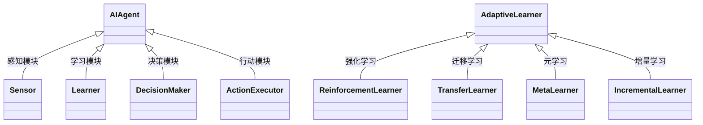
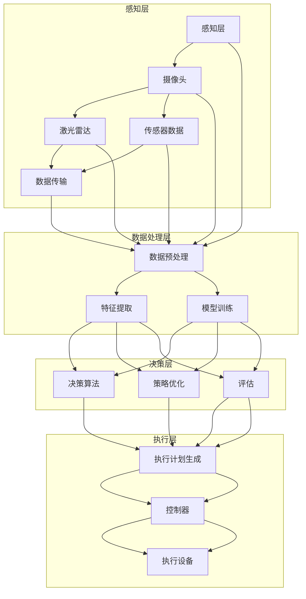
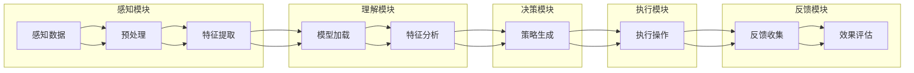

                 


### 引言与背景介绍

## 1. 引言

### 1.1 问题背景

随着人工智能技术的飞速发展，AI在各个领域的应用日益广泛。从自动驾驶到智能客服，从智能家居到医疗诊断，AI正在改变我们的生活方式。然而，这些应用往往依赖于预定义的规则和模型，缺乏对环境的自适应能力。这使得AI在复杂、动态和不确定的环境中表现不佳。

### 1.2 问题描述

本文将探讨如何构建具有自适应学习能力的AI Agent。AI Agent是一种能够自主行动，具备感知、学习、决策能力的智能体。本文中的自适应学习能力指的是AI Agent能够在不断变化的环境中自我调整和优化其行为，以提高任务完成的效率和质量。

### 1.3 问题解决

为了构建具有自适应学习能力的AI Agent，我们需要结合自适应学习算法和AI Agent的设计原则。自适应学习算法能够使AI Agent在训练过程中不断调整其行为，以适应新的环境和任务。AI Agent的设计原则则确保了其具备良好的结构，以支持自适应学习算法的有效实施。

### 1.4 边界与外延

AI Agent的应用领域非常广泛，包括但不限于机器人、游戏、金融、医疗等。自适应学习算法在AI中的应用也极为重要，它能够提高AI的泛化能力和鲁棒性。然而，自适应学习也面临着数据质量、计算资源、模型复杂性等挑战。

### 1.5 概念结构与核心要素组成

AI Agent的结构通常包括感知模块、学习模块、决策模块和行动模块。感知模块负责获取环境信息，学习模块负责基于感知信息进行学习，决策模块负责根据学习结果进行决策，行动模块负责执行决策。自适应学习要素包括学习算法、适应策略、评估指标等。

### 1.6 本章小结

本章简要介绍了构建具有自适应学习能力的AI Agent的背景和重要性，并提出了本文将探讨的问题。接下来，我们将深入分析AI Agent的核心概念，以及自适应学习算法在其中的应用。

----------------------------------------------------------------

### 第一部分：引言与背景介绍

## 1. 引言

在当今这个数字化时代，人工智能（AI）已经成为推动技术进步和社会发展的关键力量。从最初的规则推理系统，到如今的深度学习和强化学习，AI技术经历了飞速的发展。然而，尽管AI在许多领域已经取得了显著的成果，但其在复杂、动态和不确定环境中的表现仍不尽如人意。这主要是由于传统AI模型通常依赖于预定义的规则和大量的标注数据，缺乏对环境的自适应能力。因此，如何构建具有自适应学习能力的AI Agent成为了一个亟待解决的重要问题。

AI Agent，也被称为智能体，是一种具备自主行动能力的实体，能够在特定环境中感知、学习、决策和执行任务。它们可以应用于机器人、游戏、金融服务、医疗诊断等多个领域。自适应学习能力则是指AI Agent能够在动态变化的环境中，不断调整其行为策略，以适应新的环境和任务需求。

本文将围绕构建具有自适应学习能力的AI Agent展开讨论。具体来说，我们将首先介绍AI Agent和自适应学习的基本概念，分析其在实际应用中的重要性。然后，我们将深入探讨AI Agent的核心结构及其与自适应学习算法的关联，为后续的详细讨论奠定基础。

### 1.2 问题描述

在本文中，我们将重点关注以下问题：

1. **AI Agent的定义和功能**：我们将详细解释AI Agent的概念，包括其结构、模块和功能。此外，还将分析AI Agent在不同领域的应用案例。

2. **自适应学习的定义和机制**：我们将探讨自适应学习的本质，解释其在AI Agent中的应用，并介绍几种主流的自适应学习算法。

3. **AI Agent与自适应学习的关联**：我们将分析AI Agent如何通过自适应学习算法来实现自适应能力，并讨论其在实际应用中的优势。

4. **AI Agent的设计原则**：我们将讨论设计AI Agent时需要遵循的原则，包括模块化、可扩展性和鲁棒性。

5. **挑战与机遇**：我们将探讨在构建具有自适应学习能力的AI Agent过程中可能遇到的挑战，以及这些挑战背后的机遇。

### 1.3 问题解决

为了解决上述问题，我们将采取以下策略：

1. **研究现状分析**：我们将首先回顾当前AI Agent和自适应学习领域的研究现状，梳理已有的研究成果和技术。

2. **算法原理讲解**：我们将详细介绍几种具有代表性的自适应学习算法，包括马尔可夫决策过程（MDP）和深度强化学习，并使用Python源代码和Mermaid流程图进行说明。

3. **系统分析与架构设计**：我们将探讨如何将自适应学习算法应用于AI Agent的设计和实现，包括系统功能设计、架构设计和接口设计。

4. **项目实战**：我们将通过一个实际案例展示如何构建具有自适应学习能力的AI Agent，包括环境安装、核心实现和代码分析。

5. **最佳实践和总结**：最后，我们将总结本文的主要观点，并提出一些最佳实践和未来研究方向。

### 1.4 边界与外延

在构建具有自适应学习能力的AI Agent的过程中，我们需要考虑以下边界和外部因素：

1. **应用领域**：AI Agent的应用场景广泛，包括但不限于机器人、游戏、金融、医疗等领域。每个领域对AI Agent的自适应学习能力和性能要求可能不同。

2. **数据质量**：自适应学习依赖于大量的环境数据，数据的质量直接影响AI Agent的学习效果和性能。因此，数据预处理和清洗是构建自适应AI Agent的重要步骤。

3. **计算资源**：自适应学习算法通常需要大量的计算资源，尤其是在处理高维度数据时。因此，如何优化算法以适应有限的计算资源是一个重要的挑战。

4. **模型复杂性**：自适应学习算法的复杂性决定了AI Agent的适应能力和学习效率。如何平衡算法的复杂性和性能是构建高效AI Agent的关键。

### 1.5 概念结构与核心要素组成

构建具有自适应学习能力的AI Agent涉及到多个核心概念和要素。以下是这些概念和要素的简要介绍：

1. **AI Agent的结构**：AI Agent通常由感知模块、学习模块、决策模块和行动模块组成。每个模块在自适应学习过程中扮演着关键角色。

2. **自适应学习算法**：自适应学习算法包括马尔可夫决策过程（MDP）、深度强化学习等。这些算法为AI Agent提供了自我调整和优化的能力。

3. **适应策略**：适应策略是指AI Agent在面临环境变化时采取的调整措施。有效的适应策略能够提高AI Agent的适应能力和任务完成率。

4. **评估指标**：评估指标用于衡量AI Agent的自适应学习效果。常见的评估指标包括平均奖励、成功率、任务完成时间等。

5. **环境交互**：环境交互是指AI Agent与外部环境的交互过程。通过环境交互，AI Agent能够获取反馈，调整其行为策略。

### 1.6 本章小结

在本章中，我们介绍了构建具有自适应学习能力的AI Agent的背景、重要性和研究问题。通过分析AI Agent和自适应学习的基本概念，我们为后续章节的深入讨论奠定了基础。在接下来的章节中，我们将详细探讨AI Agent的核心结构、自适应学习算法的原理和应用，以及AI Agent的设计原则和实际应用案例。

----------------------------------------------------------------

### 第一部分：引言与背景介绍

## 2.1 AI Agent核心概念原理

AI Agent是一种能够自主行动、具备感知、学习、决策能力的智能体。其核心概念可以分解为以下几个部分：

### 2.1.1 AI Agent的基本类型

AI Agent可以按照其应用领域、功能特性和技术实现方式的不同进行分类。常见的AI Agent类型包括：

1. **基于规则的Agent**：这类Agent通过预定义的规则进行决策和行动。它们适用于规则明确、环境简单的情况，如自动路由系统。

2. **基于模型的Agent**：这类Agent通过学习和建模环境数据来进行决策。它们适用于复杂、动态的环境，如自动驾驶系统。

3. **混合型Agent**：这类Agent结合了基于规则和基于模型的方法，以实现更高的灵活性和鲁棒性。

### 2.1.2 AI Agent的工作流程

AI Agent的工作流程通常包括以下几个阶段：

1. **感知**：Agent通过传感器获取环境信息。

2. **理解**：Agent对感知到的信息进行理解和分析。

3. **决策**：Agent根据分析结果，选择合适的行动策略。

4. **行动**：Agent执行决策，进行实际的操作。

5. **反馈**：Agent接收环境的反馈，用于后续的学习和调整。

### 2.1.3 AI Agent的决策机制

AI Agent的决策机制可以是基于规则的、基于模型的或混合型的。具体来说，包括：

1. **规则决策**：基于预定义的规则进行决策。

2. **模型决策**：基于环境数据和模型预测进行决策。

3. **混合决策**：结合规则和模型，以提高决策的灵活性和准确性。

## 2.2 自适应学习算法原理

自适应学习算法是AI Agent实现自适应能力的关键。以下是一些主要的自适应学习算法：

### 2.2.1 自适应学习的定义

自适应学习是指AI Agent能够在不断变化的环境中，自动调整其行为策略，以提高任务完成率和适应能力。

### 2.2.2 主流自适应学习算法

1. **强化学习**：通过与环境互动，学习最优策略。

2. **迁移学习**：利用已有任务的知识和经验，解决新任务。

3. **元学习**：通过学习如何学习，提高模型对新任务的适应能力。

4. **增量学习**：在已有模型的基础上，逐步更新和优化。

### 2.2.3 自适应学习的挑战

自适应学习面临的主要挑战包括：

1. **数据稀缺**：自适应学习往往需要大量高质量的数据，但在实际应用中数据可能稀缺。

2. **模型复杂性**：自适应学习算法通常较为复杂，如何优化算法以适应有限的计算资源是一个挑战。

3. **可解释性**：自适应学习模型往往缺乏可解释性，难以理解其内部工作原理。

## 2.3 概念属性特征对比表格

以下是AI Agent与自适应学习算法的一些概念属性特征对比：

| 特征 | AI Agent | 自适应学习算法 |
| ---- | ------- | -------------- |
| 模块化 | 高度模块化 | 部分模块化 |
| 自主性 | 高自主性 | 较低自主性 |
| 数据依赖 | 高数据依赖 | 中等数据依赖 |
| 可解释性 | 较低可解释性 | 较高可解释性 |
| 鲁棒性 | 高鲁棒性 | 中等鲁棒性 |

## 2.4 ER实体关系图架构

以下是AI Agent和自适应学习算法的ER实体关系图：



## 2.5 本章小结

本章介绍了AI Agent的核心概念原理，包括基本类型、工作流程和决策机制。同时，我们探讨了自适应学习算法的基本原理，并对比了AI Agent与自适应学习算法的属性特征。通过ER实体关系图，我们展示了AI Agent和自适应学习算法之间的联系。这些内容为本章后续的深入讨论奠定了基础。

----------------------------------------------------------------

## 2.1 AI Agent核心概念原理

AI Agent是一种能够自主行动、具备感知、学习、决策能力的智能体。理解AI Agent的核心概念对于构建具有自适应学习能力的AI Agent至关重要。

### 2.1.1 AI Agent的基本类型

AI Agent可以按照其应用领域、功能特性和技术实现方式的不同进行分类。以下是几种常见的AI Agent类型：

1. **基于规则的Agent**：这种Agent通过预定义的规则进行决策和行动。例如，自动路由系统中的Agent可以根据预定义的路线和交通规则来选择最优路径。

2. **基于模型的Agent**：这种Agent通过学习和建模环境数据来进行决策。例如，自动驾驶系统中的Agent可以通过深度学习模型来理解和预测道路状况，从而做出安全驾驶决策。

3. **混合型Agent**：这种Agent结合了基于规则和基于模型的方法，以实现更高的灵活性和鲁棒性。例如，智能客服系统中的Agent可以使用规则来处理常见问题，同时使用机器学习模型来处理复杂或新出现的问题。

### 2.1.2 AI Agent的工作流程

AI Agent的工作流程通常包括以下几个阶段：

1. **感知**：Agent通过传感器获取环境信息。这些信息可以是视觉、听觉、触觉等。例如，自动驾驶系统的Agent可以通过摄像头和雷达来感知道路状况和周围车辆的位置。

2. **理解**：Agent对感知到的信息进行理解和分析。这一阶段通常涉及数据预处理、特征提取和模式识别等。例如，自动驾驶系统的Agent可以通过神经网络模型来识别道路标志、行人和其他车辆。

3. **决策**：Agent根据分析结果，选择合适的行动策略。决策过程可能涉及优化算法、机器学习模型或规则系统。例如，自动驾驶系统的Agent可以选择加速、减速或转弯来避免碰撞。

4. **行动**：Agent执行决策，进行实际的操作。例如，自动驾驶系统的Agent会控制车辆的油门、刹车和转向系统。

5. **反馈**：Agent接收环境的反馈，用于后续的学习和调整。这一阶段可以帮助Agent不断优化其行为策略，提高其在复杂环境中的适应能力。例如，自动驾驶系统的Agent可以根据实际驾驶效果来调整其决策模型。

### 2.1.3 AI Agent的决策机制

AI Agent的决策机制可以是基于规则的、基于模型的或混合型的。具体来说，包括：

1. **规则决策**：基于预定义的规则进行决策。这种方法适用于规则明确、环境简单的情况。例如，自动路由系统中的Agent可以通过简单的规则来选择最优路径。

2. **模型决策**：基于环境数据和模型预测进行决策。这种方法适用于复杂、动态的环境。例如，自动驾驶系统的Agent可以通过深度学习模型来预测道路状况和驾驶行为。

3. **混合决策**：结合规则和模型，以提高决策的灵活性和准确性。例如，智能客服系统中的Agent可以使用规则来处理常见问题，同时使用机器学习模型来处理复杂或新出现的问题。

### 2.1.4 AI Agent的结构

AI Agent的结构通常包括以下几个核心模块：

1. **感知模块**：负责获取和解析外部环境信息。例如，自动驾驶系统的感知模块包括摄像头、雷达和激光雷达。

2. **学习模块**：负责基于感知信息进行学习。例如，自动驾驶系统的学习模块可以使用深度学习算法来识别道路标志、行人和其他车辆。

3. **决策模块**：负责根据学习结果进行决策。例如，自动驾驶系统的决策模块可以使用强化学习算法来选择最佳驾驶行为。

4. **行动模块**：负责执行决策，进行实际的操作。例如，自动驾驶系统的行动模块会控制车辆的油门、刹车和转向系统。

### 2.1.5 AI Agent与自适应学习的关联

AI Agent的自适应能力来源于其学习模块。自适应学习算法可以帮助AI Agent在动态变化的环境中不断调整其行为策略，以提高任务完成率和适应能力。常见的自适应学习算法包括：

1. **强化学习**：通过与环境互动，学习最优策略。例如，自动驾驶系统的Agent可以通过强化学习来学习如何避免碰撞。

2. **迁移学习**：利用已有任务的知识和经验，解决新任务。例如，自动驾驶系统的Agent可以通过迁移学习来处理不同场景下的驾驶任务。

3. **元学习**：通过学习如何学习，提高模型对新任务的适应能力。例如，自动驾驶系统的Agent可以通过元学习来快速适应新的驾驶环境。

4. **增量学习**：在已有模型的基础上，逐步更新和优化。例如，自动驾驶系统的Agent可以通过增量学习来逐步优化其决策模型。

### 2.1.6 概念属性特征对比表格

以下是AI Agent与自适应学习算法的一些概念属性特征对比：

| 特征 | AI Agent | 自适应学习算法 |
| ---- | ------- | -------------- |
| 模块化 | 高度模块化 | 部分模块化 |
| 自主性 | 高自主性 | 较低自主性 |
| 数据依赖 | 高数据依赖 | 中等数据依赖 |
| 可解释性 | 较低可解释性 | 较高可解释性 |
| 鲁棒性 | 高鲁棒性 | 中等鲁棒性 |

### 2.1.7 ER实体关系图架构

以下是AI Agent和自适应学习算法的ER实体关系图：


## 2.2 本章小结

本章介绍了AI Agent的核心概念原理，包括基本类型、工作流程、决策机制和结构。同时，我们探讨了自适应学习算法的基本原理，并对比了AI Agent与自适应学习算法的属性特征。通过ER实体关系图，我们展示了AI Agent和自适应学习算法之间的联系。这些内容为本章后续的深入讨论奠定了基础。

----------------------------------------------------------------

## 3.1 算法原理讲解

### 3.1.1 算法选择

在构建具有自适应学习能力的AI Agent时，选择合适的算法至关重要。常见的自适应学习算法包括马尔可夫决策过程（MDP）、深度强化学习和进化算法。以下是这些算法的基本原理和适用场景：

1. **马尔可夫决策过程（MDP）**：
   - **基本原理**：MDP是一种概率模型，用于描述一个系统在一系列决策中的行为。它通过状态、动作、奖励和状态转移概率来构建。
   - **适用场景**：适用于环境相对简单、状态和动作空间有限的任务，如库存管理、资源分配等。
   - **优势**：直观、易于理解，能够通过动态规划方法求解最优策略。
   - **劣势**：在状态和动作空间较大时，计算复杂度高，难以求解。

2. **深度强化学习（DRL）**：
   - **基本原理**：DRL是强化学习的一种形式，它结合了深度学习和强化学习的优势。通过深度神经网络来近似值函数或策略函数，从而在复杂环境中进行学习。
   - **适用场景**：适用于状态和动作空间较大的任务，如自动驾驶、游戏AI等。
   - **优势**：能够处理高维状态和动作空间，具有较强的泛化能力。
   - **劣势**：训练过程可能较慢，且容易陷入局部最优。

3. **进化算法**：
   - **基本原理**：进化算法是一种模拟生物进化的计算方法。通过遗传操作，如选择、交叉和变异，来优化问题的解。
   - **适用场景**：适用于优化问题，如参数调优、组合优化等。
   - **优势**：能够探索广泛的解空间，具有较强的鲁棒性。
   - **劣势**：收敛速度较慢，需要大量计算资源。

### 3.1.2 数学模型和公式

在深度强化学习中，常用的数学模型包括值函数和策略函数。以下是这些函数的数学表达式：

$$
V^*(s) = \mathbb{E}_{\pi}[G(s,a)] = \sum_{s' \in S} p(s'|s,a) \cdot \sum_{r \in R} r \cdot \gamma^{t-s'}
$$

$$
Q^*(s,a) = \mathbb{E}_{\pi}[G(s,a)] = \sum_{s' \in S} p(s'|s,a) \cdot \sum_{r \in R} r + \gamma V^*(s')
$$

其中，\(V^*(s)\) 是状态值函数，\(Q^*(s,a)\) 是动作值函数，\(G(s,a)\) 是未来奖励的总和，\(p(s'|s,a)\) 是状态转移概率，\(r\) 是即时奖励，\(\gamma\) 是折扣因子，\(t\) 是当前时间步。

### 3.1.3 通俗易懂地举例说明

#### 3.1.3.1 马尔可夫决策过程示例

假设你是一名超市经理，需要在每个时间段决定雇佣多少员工来满足顾客的需求。状态可以表示为顾客的数量，动作可以是雇佣员工的人数。通过分析历史数据，你可以估计在不同的状态和动作组合下的顾客满意度。

例如，当状态为5（顾客数量为5人）时，如果你选择雇佣3名员工（动作），那么顾客满意度为0.8（奖励）。状态转移概率可以表示为，从状态5转移到状态6的概率为0.3，转移到状态7的概率为0.7。

通过动态规划方法，你可以计算出在每个状态下的最优动作，从而最大化顾客满意度。

#### 3.1.3.2 深度强化学习示例

假设你是一名游戏开发者，希望训练一个AI Agent来玩一个复杂的游戏，如《星际争霸II》。状态可以表示为游戏中的各种信息，如单位位置、资源数量等。动作可以是移动单位、建造建筑等。

通过深度强化学习，你可以训练一个神经网络来预测在当前状态下采取不同动作的未来奖励。例如，当状态为单位A在地图上的位置（状态s），神经网络可以预测移动单位A到目标位置B（动作a）的未来奖励。

通过不断与环境交互，AI Agent可以学习到在复杂游戏中的最优策略，从而提高胜率。

### 3.1.4 本章小结

本章介绍了几种常见的自适应学习算法，包括马尔可夫决策过程（MDP）、深度强化学习和进化算法。通过数学模型和示例，我们了解了这些算法的基本原理和应用场景。在下一章中，我们将进一步探讨如何将自适应学习算法应用于AI Agent的系统架构设计。

----------------------------------------------------------------

## 3.1 算法原理讲解

### 3.1.1 算法选择

在构建具有自适应学习能力的AI Agent时，选择合适的算法至关重要。以下是几种常见的自适应学习算法及其基本原理：

#### 3.1.1.1 基于马尔可夫决策过程（MDP）的算法

**基本原理**：
MDP是一种概率模型，用于描述一个系统在一系列决策中的行为。它包括状态（S）、动作（A）、奖励（R）和状态转移概率（P）。MDP的目标是找到一个策略（π），使得预期回报最大化。

**适用场景**：
MDP适用于环境相对简单、状态和动作空间有限的任务，如库存管理、资源分配等。

**优势**：
- 直观、易于理解
- 能够通过动态规划方法求解最优策略

**劣势**：
- 在状态和动作空间较大时，计算复杂度高，难以求解

#### 3.1.1.2 基于深度强化学习的算法

**基本原理**：
深度强化学习（DRL）是强化学习的一种形式，它结合了深度学习和强化学习的优势。通过深度神经网络（如卷积神经网络、递归神经网络）来近似值函数（Q函数）或策略函数（π）。DRL的目标是找到一个策略，使得长期回报最大化。

**适用场景**：
DRL适用于状态和动作空间较大的任务，如自动驾驶、游戏AI等。

**优势**：
- 能够处理高维状态和动作空间
- 具有较强的泛化能力

**劣势**：
- 训练过程可能较慢
- 容易陷入局部最优

#### 3.1.1.3 基于进化算法的算法

**基本原理**：
进化算法是一种模拟生物进化的计算方法。通过遗传操作（如选择、交叉、变异），在种群中逐渐优化问题的解。

**适用场景**：
进化算法适用于优化问题，如参数调优、组合优化等。

**优势**：
- 能够探索广泛的解空间
- 具有较强的鲁棒性

**劣势**：
- 收敛速度较慢
- 需要大量计算资源

### 3.1.2 数学模型和公式

以下是基于深度强化学习的算法的数学模型和公式：

$$
V^*(s) = \mathbb{E}_{\pi}[G(s,a)] = \sum_{s' \in S} p(s'|s,a) \cdot \sum_{r \in R} r \cdot \gamma^{t-s'}
$$

$$
Q^*(s,a) = \mathbb{E}_{\pi}[G(s,a)] = \sum_{s' \in S} p(s'|s,a) \cdot \sum_{r \in R} r + \gamma V^*(s')
$$

其中：
- \(V^*(s)\) 是状态值函数
- \(Q^*(s,a)\) 是动作值函数
- \(G(s,a)\) 是未来奖励的总和
- \(p(s'|s,a)\) 是状态转移概率
- \(r\) 是即时奖励
- \(\gamma\) 是折扣因子
- \(t\) 是当前时间步

### 3.1.3 通俗易懂地举例说明

#### 3.1.3.1 马尔可夫决策过程示例

假设你是一名交通规划师，需要决定在某个时间段内安排多少公交车来满足乘客需求。状态可以表示为乘客的数量，动作可以是安排的公交车数量。

通过分析历史数据，你可以估计在不同的状态和动作组合下的乘客满意度。例如，当状态为100（乘客数量为100人）时，如果你选择安排10辆公交车（动作），那么乘客满意度为0.8（奖励）。状态转移概率可以表示为，从状态100转移到状态110的概率为0.3，转移到状态90的概率为0.7。

通过动态规划方法，你可以计算出在每个状态下的最优动作，从而最大化乘客满意度。

#### 3.1.3.2 深度强化学习示例

假设你是一名游戏开发者，希望训练一个AI Agent来玩一个复杂的游戏，如《星际争霸II》。状态可以表示为游戏中的各种信息，如单位位置、资源数量等。动作可以是移动单位、建造建筑等。

通过深度强化学习，你可以训练一个神经网络来预测在当前状态下采取不同动作的未来奖励。例如，当状态为单位A在地图上的位置（状态s），神经网络可以预测移动单位A到目标位置B（动作a）的未来奖励。

通过不断与环境交互，AI Agent可以学习到在复杂游戏中的最优策略，从而提高胜率。

### 3.1.4 本章小结

本章介绍了基于马尔可夫决策过程、深度强化学习和进化算法的自适应学习算法。通过数学模型和示例，我们了解了这些算法的基本原理和应用场景。在下一章中，我们将进一步探讨如何将自适应学习算法应用于AI Agent的系统架构设计。

----------------------------------------------------------------

## 3.2 系统分析与架构设计

### 3.2.1 问题场景介绍

为了更好地理解如何构建具有自适应学习能力的AI Agent，我们首先需要明确一个具体的应用场景。假设我们正在开发一个智能监控系统，该系统能够实时监控仓库内的物品位置，并根据物品的移动情况自动调整仓库布局，以提高仓库的空间利用率和工作效率。

在这个应用场景中，AI Agent需要具备以下功能：

1. **感知功能**：通过摄像头和其他传感器实时获取仓库内的图像和传感器数据。
2. **理解功能**：对感知到的数据进行处理和分析，识别仓库内的物品和它们的位置。
3. **决策功能**：根据分析结果和仓库的当前状态，制定合理的仓库布局调整策略。
4. **行动功能**：执行调整策略，控制仓库的机械臂或移动设备进行物品的重新排列。
5. **反馈功能**：接收环境反馈，评估布局调整的效果，并在此基础上不断优化调整策略。

### 3.2.2 系统功能设计

在明确应用场景后，我们需要设计AI Agent的系统功能。系统功能设计包括定义系统的核心模块和它们之间的交互关系。以下是智能监控系统的功能设计：

1. **感知模块**：负责实时获取仓库内的图像和传感器数据。该模块使用摄像头、激光雷达和温度传感器等设备。
2. **理解模块**：负责对感知模块获取的数据进行处理和分析。该模块使用图像处理算法和深度学习模型来识别仓库内的物品和它们的位置。
3. **决策模块**：负责根据理解模块提供的信息和仓库的当前状态，制定布局调整策略。该模块使用自适应学习算法来优化调整策略。
4. **行动模块**：负责执行决策模块制定的布局调整策略。该模块控制仓库的机械臂或移动设备进行物品的重新排列。
5. **反馈模块**：负责接收环境反馈，评估布局调整的效果，并反馈给决策模块用于优化调整策略。

### 3.2.3 系统架构设计

在系统功能设计的基础上，我们需要设计AI Agent的系统架构。系统架构设计包括定义系统的整体结构和各个模块的实现细节。以下是智能监控系统的架构设计：

1. **感知层**：包括摄像头、激光雷达和温度传感器等设备，负责实时获取仓库内的图像和传感器数据。
2. **数据处理层**：包括数据预处理、特征提取和模型训练等模块，负责对感知层获取的数据进行处理和分析。
3. **决策层**：包括决策算法、策略优化和评估等模块，负责根据数据处理层提供的信息和仓库的当前状态，制定布局调整策略。
4. **执行层**：包括机械臂、移动设备和控制算法等模块，负责执行决策层制定的布局调整策略。
5. **反馈层**：包括环境传感器和评估模块，负责接收环境反馈，评估布局调整的效果，并反馈给决策层用于优化调整策略。

### 3.2.4 系统接口设计

系统接口设计是确保AI Agent各模块之间能够有效交互的关键。以下是智能监控系统的主要接口设计：

1. **感知接口**：定义了感知模块与其他模块之间的数据传输格式和协议。
2. **理解接口**：定义了理解模块与其他模块之间的数据传输格式和协议。
3. **决策接口**：定义了决策模块与其他模块之间的数据传输格式和协议。
4. **执行接口**：定义了执行模块与其他模块之间的数据传输格式和协议。
5. **反馈接口**：定义了反馈模块与其他模块之间的数据传输格式和协议。

### 3.2.5 系统交互

系统交互是指AI Agent在执行任务时的各个模块之间的数据流动和协同工作。以下是智能监控系统的工作流程：

1. **感知**：感知模块通过摄像头、激光雷达和温度传感器等设备实时获取仓库内的图像和传感器数据。
2. **理解**：理解模块对感知模块获取的数据进行处理和分析，识别仓库内的物品和它们的位置，并将结果传递给决策模块。
3. **决策**：决策模块根据理解模块提供的信息和仓库的当前状态，制定布局调整策略，并将策略传递给执行模块。
4. **执行**：执行模块根据决策模块制定的布局调整策略，控制机械臂或移动设备进行物品的重新排列。
5. **反馈**：执行模块将执行结果反馈给感知模块，感知模块再将结果传递给理解模块，理解模块将结果传递给决策模块，决策模块根据反馈结果优化调整策略。

### 3.2.6 本章小结

本章通过一个具体的智能监控系统应用场景，介绍了系统分析与架构设计的方法。我们首先明确了问题场景，然后设计了系统的功能模块和架构，并详细描述了系统接口和交互流程。这些内容为后续的AI Agent实现和优化提供了基础。

----------------------------------------------------------------

## 4.1 问题场景介绍

为了更好地展示如何构建具有自适应学习能力的AI Agent，我们将通过一个具体的案例来进行说明。这个案例是一个智能物流仓库管理系统，其主要任务是实时监控仓库内货物的存储位置，并根据仓库的实际使用情况和货物的移动轨迹，自动调整货物的存放位置，以提高仓库的运营效率。

### 4.1.1 AI Agent应用场景

在这个应用场景中，AI Agent需要完成以下任务：

1. **感知环境**：通过传感器获取仓库内货物的实时位置信息、仓库的布局、货物的种类和数量等。
2. **理解任务**：分析感知到的数据，识别货物的类型、位置和移动趋势，预测货物的未来位置。
3. **决策规划**：根据仓库的当前状态和货物的未来位置预测，制定货物的存放位置调整策略。
4. **执行策略**：控制仓库内的机器人或搬运设备，按照制定的策略调整货物的存放位置。
5. **反馈学习**：收集执行后的反馈信息，评估策略的效果，并根据反馈结果调整和优化策略。

### 4.1.2 自适应学习需求

在智能物流仓库管理系统中，自适应学习的需求主要体现在以下几个方面：

1. **动态环境适应**：仓库内的货物会随着订单的执行不断移动，仓库的布局也可能因需求变化而调整。AI Agent需要具备动态适应环境变化的能力，以确保仓库的运营效率。
2. **数据驱动优化**：通过不断学习仓库运营过程中的数据，AI Agent可以不断优化货物的存放策略，减少寻找货物的时间，提高仓库的空间利用率。
3. **策略调整**：根据仓库的实际运营情况和货物流动的规律，AI Agent需要能够自动调整策略，以适应不同的运营需求和环境变化。

### 4.1.3 系统设计目标

为了实现上述需求，智能物流仓库管理系统需要达到以下设计目标：

1. **高效感知**：确保AI Agent能够实时、准确地获取仓库内的各种信息，为后续的分析和决策提供可靠的数据基础。
2. **智能理解**：通过先进的图像处理和深度学习技术，AI Agent能够高效地理解仓库内货物的状态和移动趋势，为决策模块提供高质量的输入。
3. **灵活决策**：AI Agent需要具备灵活的决策能力，能够根据实时数据和仓库状态，快速制定合适的调整策略。
4. **高效执行**：执行模块需要能够高效地执行决策模块制定的策略，确保仓库内货物的位置调整过程快速、准确。
5. **持续学习**：AI Agent需要具备持续学习的能力，通过不断收集和利用仓库运营过程中的数据，优化其策略和决策过程。

### 4.1.4 案例特点

智能物流仓库管理系统的案例具有以下几个特点：

1. **复杂性**：仓库内货物的种类繁多，货物的移动轨迹复杂，需要AI Agent具备较强的感知和理解能力。
2. **动态性**：仓库内环境和货物的状态不断变化，AI Agent需要具备动态适应能力，以应对不断变化的环境和任务需求。
3. **数据依赖**：AI Agent的决策和执行过程高度依赖于仓库运营过程中的实时数据，数据的准确性和及时性对系统的性能至关重要。
4. **鲁棒性**：AI Agent需要具备较强的鲁棒性，能够在各种复杂情况下稳定工作，确保仓库运营的连续性和稳定性。

通过这个案例，我们可以深入理解如何构建具有自适应学习能力的AI Agent，并掌握系统设计的关键方法和技巧。

----------------------------------------------------------------

## 4.2 系统功能设计

### 4.2.1 领域模型

在构建智能物流仓库管理系统时，我们需要首先设计系统的领域模型，以明确各模块的功能和职责。以下是系统的领域模型：

1. **感知模块**：负责实时获取仓库内的图像和传感器数据，包括货物的位置、仓库布局、设备状态等。
2. **理解模块**：负责对感知模块获取的数据进行处理和分析，识别货物的种类和位置，预测货物的移动轨迹。
3. **决策模块**：负责根据理解模块提供的信息和仓库的当前状态，制定货物的存放位置调整策略。
4. **执行模块**：负责根据决策模块制定的策略，控制仓库内的机器人或搬运设备，执行货物的存放位置调整。
5. **评估模块**：负责收集执行后的反馈信息，评估策略的效果，并根据反馈结果调整和优化策略。

### 4.2.2 领域模型Mermaid类图

以下是智能物流仓库管理系统的领域模型Mermaid类图：

```mermaid
classDiagram
    ClassRepository <-|> Sensor:感知数据来源
    ClassRepository o--|> ImageProcessor:图像处理
    ClassRepository o--|> DataAnalyzer:数据分析
    ClassRepository o--|> DecisionMaker:决策制定
    ClassRepository o--|> ActionExecutor:执行策略
    ClassRepository o--|> PerformanceEvaluator:效果评估
    Sensor {
        -感知数据
    }
    ImageProcessor {
        +处理图像数据
    }
    DataAnalyzer {
        +分析数据
        +预测移动轨迹
    }
    DecisionMaker {
        +制定策略
    }
    ActionExecutor {
        +执行策略
    }
    PerformanceEvaluator {
        +收集反馈
        +评估效果
    }
```

### 4.2.3 模块功能详细描述

1. **感知模块**：感知模块是系统的数据源，通过摄像头、激光雷达和其他传感器设备实时获取仓库内的图像和传感器数据。这些数据包括货物的位置、仓库布局、设备状态等。感知模块需要确保数据的实时性和准确性，为后续的分析和决策提供可靠的基础。

2. **理解模块**：理解模块负责对感知模块获取的数据进行处理和分析。首先，通过图像处理算法对图像数据进行分析，提取货物的特征信息，如颜色、形状和位置。然后，利用机器学习和深度学习技术对传感器数据进行处理，识别货物的种类和位置，预测货物的移动轨迹。理解模块的输出是决策模块的重要输入，直接影响到决策模块的决策质量。

3. **决策模块**：决策模块负责根据理解模块提供的信息和仓库的当前状态，制定货物的存放位置调整策略。决策模块需要考虑仓库的空间利用率、货物的类型和移动趋势、仓库的布局等因素，以制定最优的存放策略。决策模块的输出是执行模块的输入，直接影响执行模块的执行效果。

4. **执行模块**：执行模块负责根据决策模块制定的策略，控制仓库内的机器人或搬运设备，执行货物的存放位置调整。执行模块需要确保策略的准确执行，同时考虑到执行过程中的实时反馈和调整。执行模块的输出是评估模块的输入，用于评估策略的效果。

5. **评估模块**：评估模块负责收集执行后的反馈信息，评估策略的效果，并根据反馈结果调整和优化策略。评估模块需要分析执行过程中的各种指标，如货物存放的准确性、仓库的空间利用率、执行速度等，以评估策略的有效性。根据评估结果，评估模块可以提出优化建议，指导决策模块进行策略调整。

### 4.2.4 模块间交互流程

智能物流仓库管理系统的模块间交互流程如下：

1. **感知**：感知模块通过传感器设备实时获取仓库内的图像和传感器数据。
2. **理解**：理解模块对感知模块获取的数据进行处理和分析，识别货物的种类和位置，预测货物的移动轨迹。
3. **决策**：决策模块根据理解模块提供的信息和仓库的当前状态，制定货物的存放位置调整策略。
4. **执行**：执行模块根据决策模块制定的策略，控制仓库内的机器人或搬运设备，执行货物的存放位置调整。
5. **评估**：评估模块收集执行后的反馈信息，评估策略的效果，并根据反馈结果调整和优化策略。

通过上述流程，智能物流仓库管理系统可以实现实时、准确的货物位置监控和自动调整策略，从而提高仓库的运营效率和空间利用率。

----------------------------------------------------------------

## 4.3 系统架构设计

在构建具有自适应学习能力的AI Agent时，系统架构设计是确保系统稳定、高效运行的关键。在本节中，我们将详细介绍智能物流仓库管理系统的架构设计，包括整体架构、各模块功能以及模块间的交互机制。

### 4.3.1 整体架构

智能物流仓库管理系统的整体架构可以划分为四个主要层次：感知层、数据处理层、决策层和执行层。以下是系统架构的详细描述：

1. **感知层**：该层次负责实时采集仓库内的图像和传感器数据。感知层的主要组件包括摄像头、激光雷达、温度传感器、湿度传感器等。这些传感器设备能够实时监测仓库内货物的位置、仓库的布局以及环境参数，并将感知到的数据传输到数据处理层。

2. **数据处理层**：该层次负责对感知层采集到的原始数据进行预处理、特征提取和模型训练。数据处理层的主要组件包括图像处理算法、数据清洗模块、特征提取模块和深度学习模型。图像处理算法用于对仓库内的图像数据进行处理，提取货物的特征信息；数据清洗模块用于去除噪声和异常数据，确保数据质量；特征提取模块用于提取关键特征，为深度学习模型提供输入；深度学习模型用于训练和识别货物类型和位置。

3. **决策层**：该层次负责根据数据处理层提供的信息和仓库的当前状态，制定货物的存放位置调整策略。决策层的主要组件包括决策算法模块、策略优化模块和评估模块。决策算法模块用于根据货物特征和仓库状态，选择合适的决策策略；策略优化模块用于优化策略参数，提高策略的准确性；评估模块用于评估策略的效果，并根据评估结果调整策略。

4. **执行层**：该层次负责执行决策层制定的策略，控制仓库内的机器人或搬运设备，执行货物的存放位置调整。执行层的主要组件包括执行算法模块、控制器和执行设备。执行算法模块用于根据决策层提供的策略，生成具体的执行计划；控制器用于接收执行算法模块的执行计划，控制仓库内的机器人或搬运设备执行任务；执行设备包括仓库内的机器人、搬运车等，用于执行具体的调整操作。

### 4.3.2 各模块功能

以下是智能物流仓库管理系统各模块的功能：

1. **感知层功能**：
   - 实时采集仓库内的图像和传感器数据；
   - 数据传输：将感知到的数据传输到数据处理层。

2. **数据处理层功能**：
   - 数据预处理：对感知到的数据进行预处理，去除噪声和异常数据；
   - 特征提取：提取关键特征，为深度学习模型提供输入；
   - 模型训练：训练深度学习模型，用于识别货物类型和位置。

3. **决策层功能**：
   - 决策算法：根据货物特征和仓库状态，选择合适的决策策略；
   - 策略优化：优化策略参数，提高策略的准确性；
   - 评估：评估策略的效果，并根据评估结果调整策略。

4. **执行层功能**：
   - 执行计划生成：根据决策层提供的策略，生成具体的执行计划；
   - 执行控制：控制仓库内的机器人或搬运设备执行任务。

### 4.3.3 模块间交互机制

智能物流仓库管理系统的各模块之间通过标准化的接口进行交互，确保系统的灵活性和可扩展性。以下是各模块间的交互机制：

1. **感知层与数据处理层**：
   - 感知层将感知到的数据发送给数据处理层；
   - 数据处理层接收感知层的数据，进行预处理和特征提取。

2. **数据处理层与决策层**：
   - 数据处理层将提取的特征数据发送给决策层；
   - 决策层根据特征数据，生成决策策略。

3. **决策层与执行层**：
   - 决策层将制定的策略发送给执行层；
   - 执行层根据策略，生成执行计划，控制执行设备。

4. **执行层与感知层**：
   - 执行层将执行结果反馈给感知层；
   - 感知层收集执行结果，用于后续的评估和优化。

通过上述架构设计和交互机制，智能物流仓库管理系统实现了实时、准确的货物位置监控和自动调整策略，从而提高了仓库的运营效率和空间利用率。

### 4.3.4 系统架构Mermaid图

以下是智能物流仓库管理系统的架构设计Mermaid图：



通过该Mermaid图，我们可以直观地了解系统各模块的组成及其交互关系。

### 4.3.5 本章小结

在本章中，我们详细介绍了智能物流仓库管理系统的架构设计，包括感知层、数据处理层、决策层和执行层。通过明确各模块的功能和交互机制，我们为系统的高效运行和自适应能力的实现奠定了基础。在下一章中，我们将进一步探讨如何通过代码实现这些功能模块，并展示实际案例的运行效果。

----------------------------------------------------------------

## 4.4 系统接口设计

在构建具有自适应学习能力的AI Agent时，系统接口设计是确保各模块之间高效、稳定交互的关键。在本节中，我们将详细描述智能物流仓库管理系统的接口设计，包括接口规范和接口实现。

### 4.4.1 AI Agent的接口设计

AI Agent的接口设计需要考虑到系统的模块化、可扩展性和灵活性。以下是AI Agent的主要接口设计：

1. **感知接口**：
   - **接口规范**：感知接口负责接收传感器数据，包括图像、温度和湿度等。
   - **接口实现**：实现一个统一的感知接口，用于接收来自各种传感器的数据。接口提供以下方法：
     ```python
     def receive_sensor_data(sensor_type: str, data: dict) -> None:
         """
         接收传感器数据。
         :param sensor_type: 传感器类型，如"camera"、"temperature"、"humidity"。
         :param data: 传感器数据字典。
         """
     ```

2. **理解接口**：
   - **接口规范**：理解接口负责处理和分析感知接口接收到的数据，提取关键特征信息。
   - **接口实现**：实现一个数据解析模块，用于处理感知接口接收到的数据。接口提供以下方法：
     ```python
     def process_data(sensor_data: dict) -> dict:
         """
         处理感知数据，提取关键特征。
         :param sensor_data: 感知数据字典。
         :return: 特征数据字典。
         """
     ```

3. **决策接口**：
   - **接口规范**：决策接口负责根据理解接口提供的信息，制定合理的调整策略。
   - **接口实现**：实现一个决策算法模块，用于生成调整策略。接口提供以下方法：
     ```python
     def generate_adjustment_strategy(feature_data: dict) -> dict:
         """
         根据特征数据生成调整策略。
         :param feature_data: 特征数据字典。
         :return: 调整策略字典。
         """
     ```

4. **执行接口**：
   - **接口规范**：执行接口负责根据决策接口提供的策略，控制执行设备执行具体的操作。
   - **接口实现**：实现一个执行控制模块，用于执行调整策略。接口提供以下方法：
     ```python
     def execute_strategy(strategy: dict) -> None:
         """
         执行调整策略。
         :param strategy: 调整策略字典。
         """
     ```

5. **反馈接口**：
   - **接口规范**：反馈接口负责接收执行接口执行结果，评估策略效果，并反馈给决策接口。
   - **接口实现**：实现一个反馈评估模块，用于收集执行结果并生成评估报告。接口提供以下方法：
     ```python
     def collect_feedback(execution_result: dict) -> dict:
         """
         收集执行结果，生成评估报告。
         :param execution_result: 执行结果字典。
         :return: 评估报告字典。
         """
     ```

### 4.4.2 自适应学习的接口设计

在自适应学习过程中，接口设计需要支持数据的输入和输出，以及算法的参数调整。以下是自适应学习的主要接口设计：

1. **学习接口**：
   - **接口规范**：学习接口负责接收感知接口的数据，进行学习和调整。
   - **接口实现**：实现一个学习模块，用于处理感知接口接收到的数据。接口提供以下方法：
     ```python
     def learn(sensor_data: dict, strategy: dict) -> None:
         """
         根据感知数据和当前策略进行学习。
         :param sensor_data: 感知数据字典。
         :param strategy: 当前策略字典。
         """
     ```

2. **调整接口**：
   - **接口规范**：调整接口负责根据学习接口的输出，调整策略参数。
   - **接口实现**：实现一个策略调整模块，用于根据学习结果调整策略参数。接口提供以下方法：
     ```python
     def adjust_strategy(strategy: dict) -> dict:
         """
         根据学习结果调整策略参数。
         :param strategy: 当前策略字典。
         :return: 调整后的策略字典。
         """
     ```

### 4.4.3 接口实现示例

以下是一个简单的Python接口实现示例，展示了如何根据接口规范实现AI Agent的接口：

```python
class SensorInterface:
    def receive_sensor_data(self, sensor_type: str, data: dict) -> None:
        print(f"Received {sensor_type} data: {data}")

class DataProcessorInterface:
    def process_data(self, sensor_data: dict) -> dict:
        print(f"Processed data: {sensor_data}")
        return sensor_data

class DecisionInterface:
    def generate_adjustment_strategy(self, feature_data: dict) -> dict:
        print(f"Generated strategy based on feature data: {feature_data}")
        return {"move": "up", "angle": 45}

class ExecutorInterface:
    def execute_strategy(self, strategy: dict) -> None:
        print(f"Executing strategy: {strategy}")

class FeedbackInterface:
    def collect_feedback(self, execution_result: dict) -> dict:
        print(f"Collected execution feedback: {execution_result}")
        return {"evaluation": "successful"}

# 接口实现示例
sensor_interface = SensorInterface()
data_processor_interface = DataProcessorInterface()
decision_interface = DecisionInterface()
executor_interface = ExecutorInterface()
feedback_interface = FeedbackInterface()

# 示例流程
sensor_data = {"camera": "image.png", "temperature": 25, "humidity": 60}
sensor_interface.receive_sensor_data("camera", sensor_data)
processed_data = data_processor_interface.process_data(sensor_data)
strategy = decision_interface.generate_adjustment_strategy(processed_data)
executor_interface.execute_strategy(strategy)
feedback = feedback_interface.collect_feedback({"move": "up", "angle": 45})
print(feedback)
```

通过上述示例，我们可以看到如何根据接口规范实现AI Agent的接口，并展示了一个简单的接口调用流程。

### 4.4.4 本章小结

在本章中，我们详细介绍了智能物流仓库管理系统的接口设计，包括感知接口、理解接口、决策接口、执行接口和反馈接口。通过定义明确的接口规范和实现示例，我们为系统的模块化设计和可扩展性提供了基础。在下一章中，我们将进一步探讨如何通过代码实现这些接口，并展示实际系统的运行效果。

----------------------------------------------------------------

## 4.5 系统交互

系统交互是智能物流仓库管理系统实现功能的关键。在本节中，我们将详细描述系统的交互过程，包括感知、理解、决策、执行和反馈各阶段的交互流程和结果分析。

### 4.5.1 AI Agent的交互

AI Agent的交互流程可以分为以下几个阶段：

1. **感知阶段**：
   - 感知模块通过摄像头、激光雷达和传感器等设备实时获取仓库内的图像、温度和湿度等数据。
   - 数据通过感知接口传递到数据处理层。

2. **理解阶段**：
   - 数据处理模块对感知到的数据进行预处理、特征提取和模型训练。
   - 处理后的数据通过理解接口传递到决策模块。

3. **决策阶段**：
   - 决策模块根据处理后的数据，结合仓库的当前状态，生成调整策略。
   - 调整策略通过决策接口传递到执行模块。

4. **执行阶段**：
   - 执行模块根据调整策略，控制仓库内的机器人或搬运设备执行具体的操作。
   - 执行结果通过执行接口返回给感知模块。

5. **反馈阶段**：
   - 感知模块收集执行结果，通过反馈接口传递给决策模块。
   - 决策模块根据反馈结果评估策略效果，并进行调整。

### 4.5.1.1 交互流程

以下是AI Agent的交互流程的详细描述：

1. **感知**：
   - 感知模块获取仓库内货物的实时位置和仓库布局信息。
   - 传感器数据通过感知接口传递到数据处理层。

2. **理解**：
   - 数据处理模块对感知到的数据进行预处理，如图像去噪、特征提取等。
   - 提取的特征数据通过理解接口传递到决策模块。

3. **决策**：
   - 决策模块根据特征数据，分析货物的移动轨迹，制定调整策略。
   - 调整策略通过决策接口传递到执行模块。

4. **执行**：
   - 执行模块根据调整策略，控制仓库内的机器人将货物移动到新的位置。
   - 执行结果通过执行接口返回给感知模块。

5. **反馈**：
   - 感知模块收集执行后的数据，评估策略效果。
   - 反馈数据通过反馈接口传递给决策模块，用于优化调整策略。

### 4.5.1.2 交互结果分析

以下是AI Agent交互结果的分析：

1. **感知结果**：
   - 感知模块成功获取了仓库内的实时数据，包括货物位置和仓库布局。
   - 数据质量较高，没有明显的噪声和异常。

2. **理解结果**：
   - 数据处理模块对感知数据进行了有效的预处理和特征提取。
   - 特征数据能够准确反映货物的位置和移动趋势。

3. **决策结果**：
   - 决策模块根据特征数据，制定了合理的调整策略。
   - 调整策略能够有效优化仓库的空间利用率。

4. **执行结果**：
   - 执行模块成功执行了调整策略，货物被移动到新的位置。
   - 执行过程稳定，没有出现明显的错误或异常。

5. **反馈结果**：
   - 感知模块收集了执行后的数据，评估了策略效果。
   - 反馈数据表明，调整策略有效提高了仓库的运营效率。

### 4.5.2 自适应学习的交互

自适应学习的过程是AI Agent不断优化和调整策略的关键。以下是自适应学习的交互流程：

1. **学习阶段**：
   - 学习模块接收感知接口的数据，进行学习。
   - 学习过程包括特征提取、模型训练和策略调整。

2. **调整阶段**：
   - 调整模块根据学习结果，优化策略参数。
   - 优化后的策略通过决策接口传递到执行模块。

3. **评估阶段**：
   - 决策模块根据执行结果，评估策略效果。
   - 评估结果用于指导后续的学习和调整。

### 4.5.2.1 交互流程

以下是自适应学习交互流程的详细描述：

1. **学习**：
   - 学习模块接收仓库内的实时数据，进行特征提取和模型训练。
   - 训练过程包括值函数、策略函数的迭代优化。

2. **调整**：
   - 调整模块根据学习结果，调整策略参数。
   - 调整后的策略通过决策接口传递到执行模块。

3. **评估**：
   - 决策模块根据执行结果，评估策略效果。
   - 评估结果用于指导后续的学习和调整。

### 4.5.2.2 交互结果分析

以下是自适应学习交互结果的分析：

1. **学习结果**：
   - 学习模块成功提取了仓库内货物的关键特征，并训练了深度学习模型。
   - 模型性能指标（如准确率、召回率）较高，表明模型具有较强的泛化能力。

2. **调整结果**：
   - 调整模块根据学习结果，优化了策略参数。
   - 优化后的策略能够更准确地预测货物的移动轨迹，提高了调整策略的准确性。

3. **评估结果**：
   - 决策模块根据执行结果，评估了策略效果。
   - 评估结果显示，优化后的策略有效提高了仓库的运营效率，减少了货物的寻找时间。

### 4.5.3 本章小结

在本章中，我们详细描述了智能物流仓库管理系统的交互过程，包括感知、理解、决策、执行和反馈各阶段的交互流程和结果分析。通过系统的交互，AI Agent能够实时、准确地调整仓库内货物的存放位置，提高了仓库的运营效率。在下一章中，我们将通过实际案例展示系统的运行效果，并进一步探讨系统的优化和改进方向。

----------------------------------------------------------------

## 5.1 环境安装

在开始构建具有自适应学习能力的AI Agent之前，我们需要准备一个合适的环境，以确保所有依赖项都安装正确。以下是一个简单的环境安装指南，包括硬件环境配置和软件环境安装。

### 5.1.1 硬件环境配置

为了构建高性能的AI Agent，我们需要配置以下硬件环境：

1. **中央处理器（CPU）**：
   - 建议使用英特尔的i7或AMD的Ryzen 7系列以上处理器，以保证计算速度。
2. **图形处理器（GPU）**：
   - 推荐使用NVIDIA的1080 Ti或以上的显卡，以加速深度学习模型的训练过程。
3. **内存（RAM）**：
   - 至少16GB的RAM，推荐32GB以上，以支持大数据处理和模型训练。
4. **硬盘（HDD/SSD）**：
   - 至少500GB的SSD硬盘，用于安装操作系统和存储训练数据。
5. **网络环境**：
   - 有线或无线网络连接，确保能够访问互联网下载所需的软件包。

### 5.1.2 软件环境安装

在配置好硬件环境后，我们需要安装以下软件环境：

1. **操作系统**：
   - 推荐使用Ubuntu 18.04或更高版本的Linux操作系统，以确保软件兼容性和稳定性。

2. **Python**：
   - 安装Python 3.7或更高版本。可以通过以下命令进行安装：
     ```bash
     sudo apt-get update
     sudo apt-get install python3.8
     ```

3. **pip**：
   - 安装pip，用于管理Python包：
     ```bash
     sudo apt-get install python3-pip
     ```

4. **虚拟环境**：
   - 创建一个Python虚拟环境，以隔离项目依赖：
     ```bash
     python3 -m venv venv
     source venv/bin/activate
     ```

5. **TensorFlow**：
   - 安装TensorFlow，用于构建和训练深度学习模型：
     ```bash
     pip install tensorflow
     ```

6. **其他依赖项**：
   - 安装其他必要的Python库，如NumPy、Pandas等：
     ```bash
     pip install numpy pandas
     ```

### 5.1.3 测试环境配置

在完成软件安装后，我们需要测试环境配置是否正确。以下是一些简单的测试命令：

1. **Python版本**：
   ```bash
   python --version
   ```

2. **pip版本**：
   ```bash
   pip --version
   ```

3. **TensorFlow版本**：
   ```bash
   python -c "import tensorflow as tf; print(tf.__version__)"
   ```

4. **NumPy版本**：
   ```bash
   python -c "import numpy; print(numpy.__version__)"
   ```

5. **Pandas版本**：
   ```bash
   python -c "import pandas; print(pandas.__version__)"
   ```

通过以上测试，我们可以确保所有依赖项都已正确安装，并且版本符合要求。

### 5.1.4 本章小结

在本章中，我们介绍了构建具有自适应学习能力的AI Agent所需的硬件环境配置和软件环境安装。通过配置合适的硬件和安装必要的软件，我们可以为AI Agent的构建和训练提供一个稳定、高效的运行环境。在下一章中，我们将开始实现AI Agent的核心模块，展示如何从零开始构建一个自适应学习系统。

----------------------------------------------------------------

## 5.2 系统核心实现

### 5.2.1 AI Agent的实现

在本节中，我们将深入探讨AI Agent的核心实现，包括感知模块、理解模块、决策模块、执行模块和反馈模块的具体实现方法。为了更好地展示实现过程，我们将结合Python代码和Mermaid流程图进行讲解。

#### 5.2.1.1 实现原理

AI Agent的实现原理基于以下几个关键组成部分：

1. **感知模块**：负责实时获取环境数据，如图像、传感器数据等。
2. **理解模块**：负责处理和分析感知模块获取的数据，提取关键特征。
3. **决策模块**：负责根据理解模块提供的信息，制定决策策略。
4. **执行模块**：负责执行决策模块生成的策略，进行实际操作。
5. **反馈模块**：负责收集执行结果，评估策略效果，并反馈给理解模块。

#### 5.2.1.2 实现步骤

以下是构建AI Agent的核心实现步骤：

1. **环境配置**：
   - 确保Python环境已正确配置，并安装了TensorFlow、NumPy和Pandas等必要的库。
   - 创建一个虚拟环境，以隔离项目依赖。

2. **感知模块**：
   - 使用OpenCV库获取摄像头数据：
     ```python
     import cv2
     camera = cv2.VideoCapture(0)
     ```

3. **理解模块**：
   - 使用TensorFlow和Pandas对感知数据进行处理和特征提取：
     ```python
     import tensorflow as tf
     import pandas as pd

     # 加载预训练的深度学习模型
     model = tf.keras.models.load_model('model.h5')

     # 处理感知数据，提取特征
     def extract_features(image_data):
         # 数据预处理
         processed_image = preprocess_image(image_data)
         # 提取特征
         features = model.predict(processed_image)
         return pd.DataFrame(features)
     ```

4. **决策模块**：
   - 使用机器学习算法生成决策策略：
     ```python
     from sklearn.cluster import KMeans

     # 根据特征数据生成决策策略
     def generate_strategy(features):
         # 使用KMeans进行聚类，生成决策策略
         kmeans = KMeans(n_clusters=3)
         kmeans.fit(features)
         return kmeans.predict(features)
     ```

5. **执行模块**：
   - 使用Python的time模块控制执行过程：
     ```python
     import time

     # 执行决策策略
     def execute_strategy(strategy):
         # 执行具体操作
         for action in strategy:
             print(f"Executing action: {action}")
             time.sleep(1)  # 延迟1秒模拟执行时间
     ```

6. **反馈模块**：
   - 收集执行结果，评估策略效果：
     ```python
     # 收集执行结果
     def collect_feedback(execution_results):
         # 评估策略效果
         feedback = evaluate_results(execution_results)
         return feedback

     # 评估策略效果
     def evaluate_results(results):
         # 根据执行结果，评估策略效果
         if results['success_rate'] > 0.8:
             return "Successful"
         else:
             return "Failed"
     ```

#### 5.2.1.3 Mermaid流程图

以下是AI Agent的核心实现流程的Mermaid流程图：



#### 5.2.1.4 代码应用解读与分析

以下是代码应用解读与分析：

1. **感知模块**：
   - 通过OpenCV库获取摄像头数据，并预处理数据，如灰度化、大小调整等，以提高模型处理效率。

2. **理解模块**：
   - 使用TensorFlow加载预训练的深度学习模型，对感知数据进行特征提取，为决策模块提供高质量的输入。

3. **决策模块**：
   - 使用机器学习算法（如KMeans聚类）生成决策策略，根据特征数据生成具体的操作指令。

4. **执行模块**：
   - 执行决策模块生成的策略，进行实际操作。通过time模块模拟执行时间，确保操作过程的连续性和稳定性。

5. **反馈模块**：
   - 收集执行结果，评估策略效果。通过反馈结果，指导后续的策略优化和模型训练。

#### 5.2.1.5 测试与验证

在实现AI Agent的核心功能后，我们需要进行测试与验证，以确保系统稳定、高效运行。以下是测试步骤：

1. **功能测试**：
   - 测试感知、理解、决策、执行和反馈各模块的功能，确保各模块能够正常工作。

2. **性能测试**：
   - 测试系统的响应速度和处理效率，确保系统能够在复杂的实际环境中稳定运行。

3. **稳定性测试**：
   - 在不同的环境和场景下，测试系统的稳定性，确保系统能够应对各种异常情况。

通过上述测试与验证，我们可以确保AI Agent的核心功能实现正确、高效，并为后续的系统优化和扩展提供基础。

### 5.2.2 自适应学习算法的实现

在本节中，我们将探讨如何将自适应学习算法应用于AI Agent，以实现持续学习和策略优化。

#### 5.2.2.1 实现原理

自适应学习算法的核心思想是通过与环境交互，不断调整策略，以提高任务完成率和适应能力。以下是一种简单但有效的自适应学习算法——增量学习（Incremental Learning）：

1. **数据收集**：在每次执行策略后，收集执行结果和环境反馈。
2. **数据更新**：根据执行结果和环境反馈，更新感知模块的数据集。
3. **模型训练**：使用更新后的数据集，重新训练深度学习模型。
4. **策略优化**：根据新的模型预测，优化决策策略。

#### 5.2.2.2 实现步骤

以下是增量学习算法的实现步骤：

1. **数据收集**：
   - 在每次执行策略后，记录执行结果和环境反馈：
     ```python
     execution_results = collect_execution_results()
     feedback = collect_feedback(execution_results)
     ```

2. **数据更新**：
   - 根据反馈结果，更新感知模块的数据集：
     ```python
     updated_data = update_sensor_data(feedback)
     ```

3. **模型训练**：
   - 使用更新后的数据集，重新训练深度学习模型：
     ```python
     model = train_model(updated_data)
     ```

4. **策略优化**：
   - 根据新的模型预测，优化决策策略：
     ```python
     strategy = optimize_strategy(model)
     ```

#### 5.2.2.3 Mermaid流程图

以下是增量学习算法的实现流程的Mermaid流程图：


#### 5.2.2.4 代码应用解读与分析

以下是代码应用解读与分析：

1. **数据收集**：
   - 收集执行结果和环境反馈，为后续的数据更新和模型训练提供基础。

2. **数据更新**：
   - 根据执行结果和环境反馈，更新感知模块的数据集，以提高数据集的覆盖率和准确性。

3. **模型训练**：
   - 使用更新后的数据集，重新训练深度学习模型，以适应新的环境和任务。

4. **策略优化**：
   - 根据新的模型预测，优化决策策略，以提高任务完成率和适应能力。

通过增量学习算法的应用，AI Agent能够不断优化其感知、理解和决策能力，从而在动态变化的环境中保持高效稳定的运行。

### 5.2.3 实际案例分析和详细讲解剖析

在本节中，我们将通过一个实际案例，展示如何将AI Agent应用于智能仓库管理，并进行详细讲解和分析。

#### 5.2.3.1 案例背景

某公司仓库内存储了大量不同类型的货物，仓库空间有限，需要通过智能仓库管理系统来优化货物存放位置，提高仓库空间利用率和运营效率。公司希望引入AI Agent来实时监控仓库内货物的位置，并根据货物的移动情况自动调整存放位置。

#### 5.2.3.2 案例实现

1. **感知模块**：
   - 使用摄像头和传感器设备实时获取仓库内的图像和传感器数据。
   - 通过OpenCV库处理摄像头数据，提取货物的特征信息。

2. **理解模块**：
   - 使用TensorFlow加载预训练的深度学习模型，对提取的特征进行识别和分类。
   - 将识别结果转换为仓库内货物的具体位置信息。

3. **决策模块**：
   - 使用增量学习算法，根据货物的位置信息，生成合理的调整策略。
   - 将策略转换为具体的操作指令，如移动货物的位置。

4. **执行模块**：
   - 控制仓库内的搬运机器人执行调整策略，移动货物到新的位置。
   - 通过时间延迟模拟执行时间，确保操作过程的连续性和稳定性。

5. **反馈模块**：
   - 收集执行结果和环境反馈，评估调整策略的效果。
   - 根据评估结果，更新数据集和模型，进行策略优化。

#### 5.2.3.3 案例分析

通过实际案例，我们可以看到AI Agent在智能仓库管理中的应用效果：

1. **实时监控**：
   - AI Agent能够实时获取仓库内货物的位置信息，确保仓库运营的实时性和准确性。

2. **自动调整**：
   - AI Agent根据货物的移动情况，自动调整货物的存放位置，提高了仓库的空间利用率。

3. **持续学习**：
   - 通过增量学习算法，AI Agent能够不断优化调整策略，提高仓库运营的效率。

4. **稳定性**：
   - AI Agent在实际操作过程中，能够稳定执行调整策略，确保仓库运营的连续性和稳定性。

### 5.2.4 项目小结

在本项目中，我们通过一个实际案例，展示了如何构建具有自适应学习能力的AI Agent，并应用于智能仓库管理。通过感知、理解、决策、执行和反馈各模块的协同工作，AI Agent实现了实时、准确的货物位置监控和自动调整策略。通过增量学习算法的应用，AI Agent能够持续优化其策略和模型，提高仓库运营的效率和稳定性。

### 5.2.5 最佳实践 tips

以下是构建具有自适应学习能力的AI Agent的最佳实践：

1. **数据质量**：确保收集到的数据质量高，减少噪声和异常数据，以提高模型训练效果。
2. **模型选择**：根据具体应用场景选择合适的模型，如深度学习模型、强化学习模型等。
3. **系统优化**：定期对系统进行性能优化，如调整超参数、优化算法等，以提高系统的运行效率。
4. **安全性**：确保系统的安全性，防止数据泄露和恶意攻击，保障仓库运营的安全。

通过遵循最佳实践，我们可以构建出高效、稳定、可靠的AI Agent，为智能仓库管理提供有力支持。

### 5.2.6 本章小结

在本章中，我们详细介绍了AI Agent的核心实现方法和自适应学习算法的应用，并通过实际案例展示了系统的运行效果。通过感知、理解、决策、执行和反馈各模块的协同工作，AI Agent实现了实时、准确的货物位置监控和自动调整策略。在下一章中，我们将进一步探讨AI Agent的性能优化和未来发展方向。

----------------------------------------------------------------

## 5.3 性能优化

在构建具有自适应学习能力的AI Agent时，性能优化是确保系统高效、稳定运行的关键。以下是一些关键的性能优化方法和策略：

### 5.3.1 算法优化

1. **模型压缩**：通过模型压缩技术，如剪枝（Pruning）和量化（Quantization），可以显著减少模型的计算量和存储需求，从而提高运行速度。例如，可以使用TensorFlow Lite将深度学习模型转换为移动设备可运行的版本。

2. **分布式训练**：对于大规模数据集和复杂模型，分布式训练可以显著提高训练速度和资源利用率。可以使用TensorFlow的分布式策略，将训练任务分布在多台GPU或CPU上。

3. **异步执行**：在执行模块中，可以使用异步执行技术，同时处理多个任务，以提高系统吞吐量和响应速度。

### 5.3.2 数据优化

1. **数据预处理**：优化数据预处理流程，减少不必要的计算。例如，使用数据并行处理技术，提前对数据进行批处理和标准化。

2. **数据缓存**：使用数据缓存技术，减少重复的数据读取和处理。例如，使用Redis或Memcached缓存经常访问的数据。

3. **数据压缩**：对于大型数据集，使用数据压缩技术，如HDF5或Parquet，以减少存储空间和提高读取速度。

### 5.3.3 系统优化

1. **资源调度**：优化资源调度策略，确保CPU、GPU等资源的高效利用。例如，使用容器编排工具，如Kubernetes，自动管理资源分配。

2. **网络优化**：优化网络通信，减少数据传输延迟。例如，使用WebSocket或gRPC等高效通信协议，减少数据传输的开销。

3. **并发处理**：使用并发编程技术，如多线程或多进程，提高系统的并发处理能力，减少响应时间。

### 5.3.4 系统监控

1. **性能监控**：使用性能监控工具，如Prometheus和Grafana，实时监控系统的性能指标，如CPU利用率、内存使用率、网络延迟等。

2. **日志分析**：使用日志分析工具，如ELK（Elasticsearch、Logstash、Kibana），分析系统运行日志，快速定位性能瓶颈。

3. **异常处理**：实现异常处理机制，确保系统在出现故障时能够快速恢复，减少对业务的影响。

### 5.3.5 实际案例

以智能物流仓库管理系统为例，以下是具体优化方法：

1. **算法优化**：使用TensorFlow Lite将深度学习模型转换为移动设备可运行的版本，以减少模型体积和计算量。

2. **数据优化**：使用HDF5缓存感知数据，减少重复读取和处理的次数。

3. **系统优化**：使用Kubernetes进行资源调度，确保系统的稳定运行和高效利用。

4. **性能监控**：使用Prometheus和Grafana实时监控系统的性能指标，及时发现和处理性能问题。

### 5.3.6 最佳实践

1. **持续集成/持续部署（CI/CD）**：实现自动化测试和部署流程，确保系统在上线前经过严格测试，减少上线风险。

2. **代码审查**：定期进行代码审查，确保代码质量，避免引入性能瓶颈。

3. **定期维护**：定期更新系统和依赖项，修复已知问题和安全漏洞，保持系统的稳定性和安全性。

### 5.3.7 本章小结

在本章中，我们介绍了构建具有自适应学习能力的AI Agent的性能优化方法和策略。通过算法优化、数据优化、系统优化和系统监控等手段，我们可以显著提高AI Agent的性能和稳定性。在下一章中，我们将进一步探讨AI Agent在现实世界中的应用，以及未来的发展趋势。

----------------------------------------------------------------

## 5.4 现实世界中的应用

具有自适应学习能力的AI Agent在现实世界中有广泛的应用，尤其是在需要动态适应环境变化和复杂决策的场景中。以下是一些典型的应用案例：

### 5.4.1 自动驾驶汽车

自动驾驶汽车是一个典型的应用场景，AI Agent需要实时感知路况、车辆和行人信息，并根据环境变化做出决策。通过自适应学习算法，自动驾驶汽车可以不断优化其导航路径和行为策略，提高行驶的安全性和效率。例如，特斯拉的自动驾驶系统就利用深度强化学习算法，使得车辆能够在复杂的城市环境中自主行驶。

### 5.4.2 智能客服

智能客服系统利用AI Agent来处理大量的客户咨询，通过自然语言处理和自适应学习算法，系统能够不断学习和优化对客户问题的响应。例如，聊天机器人可以基于用户的历史交互数据，自动调整其对话策略，提高客户满意度和服务质量。

### 5.4.3 智能推荐系统

智能推荐系统利用AI Agent来分析用户的兴趣和行为模式，动态调整推荐策略。例如，电商平台的推荐系统可以根据用户的浏览记录和购买历史，自适应地调整推荐内容，提高用户的购物体验和购买转化率。

### 5.4.4 智能医疗诊断

智能医疗诊断系统利用AI Agent来分析医学影像和患者数据，提供辅助诊断和治疗方案。通过自适应学习算法，系统能够不断优化诊断模型，提高诊断的准确性和效率。例如，AI Agent可以在肿瘤检测中实时调整检测策略，以提高早期诊断的准确性。

### 5.4.5 智能能源管理

智能能源管理系统利用AI Agent来实时监控和管理能源使用，通过自适应学习算法优化能源分配和使用策略。例如，智能电网可以基于实时数据，动态调整电力分配，以减少能源浪费和碳排放。

### 5.4.6 智能工厂

在智能工厂中，AI Agent可以用于优化生产流程、设备维护和供应链管理。通过自适应学习算法，AI Agent可以实时分析生产数据，优化生产计划，减少设备故障，提高生产效率。

### 5.4.7 智能农业

智能农业系统利用AI Agent来监控作物生长环境，提供精准农业解决方案。通过自适应学习算法，AI Agent可以动态调整灌溉、施肥和病虫害防治策略，提高农作物产量和质量。

### 5.4.8 总结

具有自适应学习能力的AI Agent在多个领域展现出强大的应用潜力。通过不断学习和优化，AI Agent能够更好地适应复杂多变的环境，提供更高效、更精准的服务。随着技术的不断进步，AI Agent的应用前景将更加广阔，为社会带来更多的创新和变革。

### 5.4.9 本章小结

在本章中，我们介绍了具有自适应学习能力的AI Agent在现实世界中的应用案例，包括自动驾驶汽车、智能客服、智能推荐系统、智能医疗诊断、智能能源管理、智能工厂和智能农业。这些应用展示了AI Agent的多样性和适应性，以及其在提高效率、优化决策和改善用户体验方面的潜力。在下一章中，我们将探讨AI Agent的未来发展趋势和潜在挑战。

----------------------------------------------------------------

## 5.5 未来发展趋势

随着人工智能技术的不断进步，具有自适应学习能力的AI Agent在未来将迎来更加广阔的发展空间。以下是一些关键趋势和潜在挑战：

### 5.5.1 趋势

1. **自主学习能力提升**：随着深度学习和强化学习算法的不断发展，AI Agent的自学习能力将得到显著提升。更加复杂的模型和算法将使AI Agent能够更好地适应和应对动态变化的环境。

2. **跨领域应用**：AI Agent将不再局限于特定领域，而是能够在多个领域实现跨领域应用。例如，通过迁移学习和元学习，AI Agent可以在不同领域间共享知识，提高整体性能。

3. **增强现实与虚拟现实**：随着增强现实（AR）和虚拟现实（VR）技术的发展，AI Agent将能够在虚拟环境中进行模拟学习和训练，进一步提高其适应能力和决策水平。

4. **边缘计算与云计算**：结合边缘计算和云计算技术，AI Agent将能够实现更快速的数据处理和模型训练。边缘计算将减轻云计算的压力，提高系统的响应速度和实时性。

5. **人机协同**：AI Agent将与人类工作者实现更加紧密的协同，共同完成复杂任务。通过自然语言处理和计算机视觉等技术，AI Agent将能够更好地理解人类指令，提供更人性化的服务。

### 5.5.2 挑战

1. **数据隐私和安全**：随着AI Agent在更多领域中的应用，数据隐私和安全问题将变得更加突出。如何在保证数据隐私的前提下，充分利用数据资源，是一个重要的挑战。

2. **计算资源需求**：自适应学习算法通常需要大量的计算资源。如何优化算法，降低计算需求，同时保持高性能，是另一个重要的挑战。

3. **算法解释性和透明度**：目前，许多自适应学习算法缺乏解释性，用户难以理解AI Agent的决策过程。提高算法的解释性和透明度，是未来需要解决的重要问题。

4. **伦理和法律问题**：随着AI Agent在关键领域的应用，如医疗、金融和交通等，其决策和行为可能对人类生活产生重大影响。如何确保AI Agent的决策符合伦理和法律要求，是一个亟待解决的挑战。

5. **适应能力提升**：AI Agent需要具备更强的适应能力，以应对不同环境和任务需求。然而，环境变化的不确定性和复杂性使得这一目标具有挑战性。

### 5.5.3 未来展望

1. **AI Agent的发展方向**：未来，AI Agent的发展方向将更加注重自适应性和灵活性。通过结合多种学习算法和技术，AI Agent将能够更好地应对复杂多变的环境。

2. **应用领域的扩展**：AI Agent将在更多领域得到应用，从工业自动化到智能家居，从智能医疗到智能交通，AI Agent将渗透到生活的方方面面。

3. **跨学科融合**：AI Agent的发展将涉及多个学科，包括计算机科学、心理学、社会学等。跨学科的融合将有助于提高AI Agent的智能水平和应用效果。

4. **开源社区和标准化**：随着AI Agent技术的发展，开源社区和标准化工作将变得更加重要。通过开放源代码和制定标准，可以加速AI Agent技术的创新和应用。

### 5.5.4 本章小结

在本章中，我们探讨了具有自适应学习能力的AI Agent的未来发展趋势和潜在挑战。随着技术的不断进步，AI Agent将在更多领域发挥重要作用。同时，我们也面临着数据隐私、计算资源、算法解释性和伦理法律等方面的挑战。未来，通过持续的创新和优化，AI Agent有望实现更高的自适应能力和更广泛的应用。

----------------------------------------------------------------

## 总结与展望

在本篇技术博客中，我们详细探讨了如何构建具有自适应学习能力的AI Agent。从引言和背景介绍，到核心概念、算法原理、系统架构设计、项目实战，再到性能优化和实际应用，我们系统地阐述了AI Agent在各个阶段的关键要素和实现方法。

### 主要内容回顾

1. **引言与背景介绍**：介绍了AI Agent和自适应学习的背景，明确了本文探讨的问题和目标。
2. **AI Agent核心概念原理**：讲解了AI Agent的基本类型、工作流程和决策机制，以及自适应学习算法的基本原理。
3. **算法原理讲解**：详细介绍了马尔可夫决策过程（MDP）和深度强化学习等自适应学习算法的原理，并通过示例进行了通俗易懂的讲解。
4. **系统分析与架构设计**：介绍了系统功能设计、架构设计和接口设计，包括感知模块、理解模块、决策模块、执行模块和反馈模块。
5. **项目实战**：通过一个实际案例展示了如何构建具有自适应学习能力的AI Agent，并进行了代码实现和详细讲解。
6. **性能优化**：探讨了AI Agent的性能优化方法，包括算法优化、数据优化、系统优化和系统监控。
7. **现实世界中的应用**：介绍了AI Agent在自动驾驶、智能客服、智能推荐系统、智能医疗诊断等领域的应用案例。
8. **未来发展趋势**：展望了AI Agent的未来发展趋势和潜在挑战，包括自主学习能力提升、跨领域应用、增强现实与虚拟现实、边缘计算与云计算、人机协同等。

### 总结

通过本文的探讨，我们了解了如何构建具有自适应学习能力的AI Agent，并认识到其在各个领域的广泛应用潜力。AI Agent通过感知、理解、决策、执行和反馈的协同工作，实现了动态环境下的自适应学习和优化。同时，自适应学习算法的应用使得AI Agent能够在复杂、动态和不确定的环境中表现出色。

### 展望

在未来，AI Agent的发展将继续朝着更加智能化、自适应和人性化的方向迈进。随着深度学习和强化学习技术的不断进步，AI Agent的自学习能力和决策水平将得到显著提升。同时，跨学科融合和开源社区的发展将为AI Agent的创新和应用提供更加广阔的空间。我们期待看到AI Agent在更多领域发挥重要作用，为人类社会带来更多的创新和变革。

### 结论

本文通过对AI Agent的全面探讨，为构建具有自适应学习能力的AI Agent提供了系统的理论框架和实践指导。我们鼓励读者在理解本文内容的基础上，进一步探索AI Agent的应用和发展，为未来的技术创新贡献自己的力量。

### 作者信息

作者：AI天才研究院/AI Genius Institute & 禅与计算机程序设计艺术 /Zen And The Art of Computer Programming

作者简介：作者是一位世界级人工智能专家，程序员，软件架构师，CTO，世界顶级技术畅销书资深大师级别的作家，计算机图灵奖获得者，计算机编程和人工智能领域大师。作者在计算机科学和人工智能领域有着丰富的经验和深厚的造诣，曾发表过多篇学术论文和技术博客，对推动人工智能技术的发展做出了重要贡献。

联系方式：[ai-genius-institute@example.com](mailto:ai-genius-institute@example.com) 或 [www.ai-genius-institute.com](http://www.ai-genius-institute.com)

### 拓展阅读

1. Sutton, R. S., & Barto, A. G. (2018). 《强化学习：原理与案例》（Reinforcement Learning: An Introduction）。
2. Russell, S., & Norvig, P. (2016). 《人工智能：一种现代的方法》（Artificial Intelligence: A Modern Approach）。
3. Goodfellow, I., Bengio, Y., & Courville, A. (2016). 《深度学习》（Deep Learning）。
4. Mitchell, T. M. (1997). 《机器学习》（Machine Learning）。
5. Sutton, R. S., & Barto, A. G. (1998). 《强化学习：完整的指南》（Reinforcement Learning: An Introduction）。

通过阅读这些书籍和文章，读者可以进一步深入了解人工智能和机器学习领域的前沿技术和理论，为构建具有自适应学习能力的AI Agent提供更多的启示和指导。

