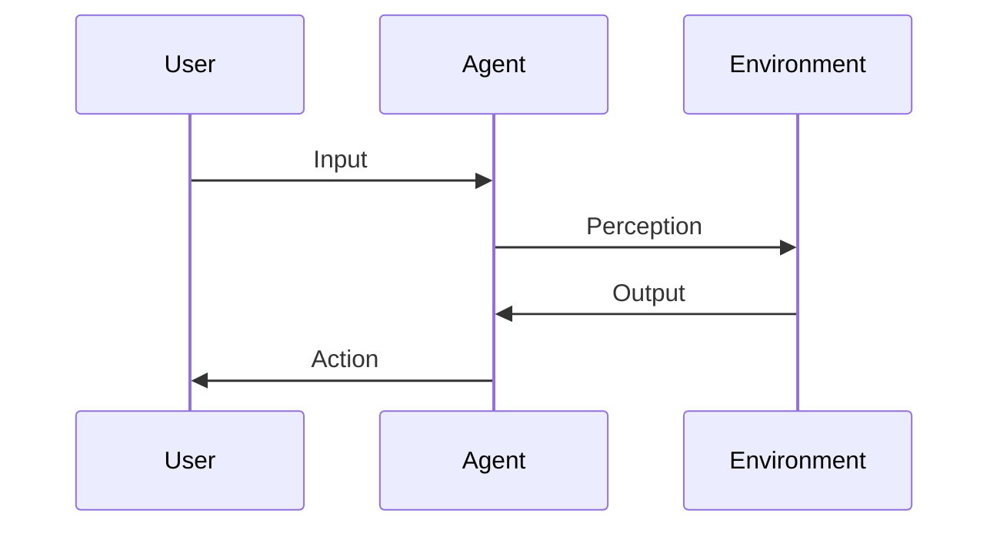
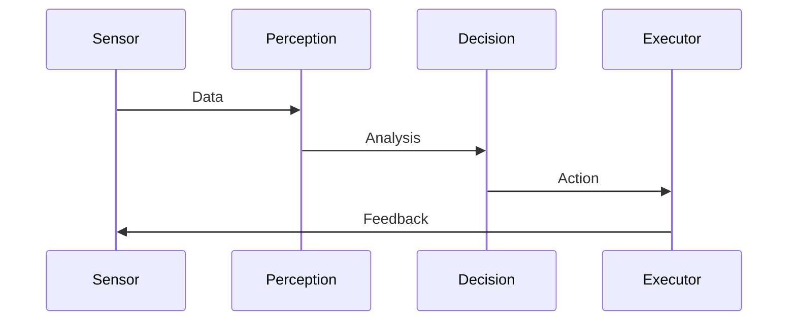
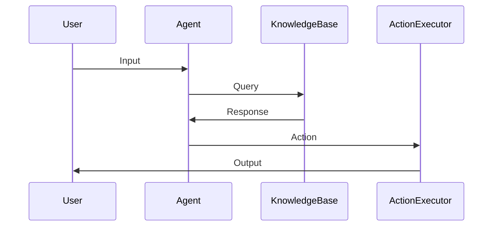
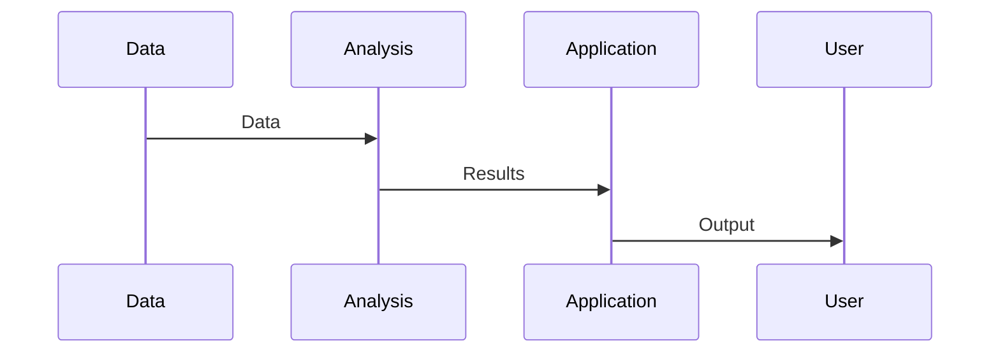

                 

### 文章标题

# 构建具有认知计算能力的AI Agent

### 关键词

- 认知计算
- AI Agent
- 自然语言处理
- 计算机视觉
- 机器学习

### 摘要

本文旨在探讨如何构建具有认知计算能力的AI Agent。我们将从背景与核心概念出发，详细分析认知计算能力的构建方法，探讨AI Agent的设计与应用，并结合具体案例进行实践解析。最后，我们将展望认知计算能力的未来发展趋势，为读者提供全面而深入的认知计算与AI Agent的知识体系。

## 第一部分：背景与核心概念

### 第1章：问题背景与概念介绍

#### 1.1 人工智能与认知计算概述

##### 1.1.1 问题背景

随着互联网、大数据和云计算技术的飞速发展，人工智能（AI）已经逐渐渗透到各行各业，成为推动社会进步的重要力量。然而，传统的AI技术主要依赖于数据驱动的模式识别和预测，缺乏自主学习和理解能力。因此，如何提升AI的智能水平，使其具备更高的认知计算能力，成为当前研究的热点。

##### 1.1.2 人工智能的定义与演变

人工智能（Artificial Intelligence，简称AI）是指通过计算机模拟人类智能的一种技术。AI的发展历程可以分为以下几个阶段：

1. **理论探索阶段（1950-1969）**：1950年，艾伦·图灵提出了著名的“图灵测试”，标志着人工智能概念的诞生。此阶段主要关注AI的理论研究，如逻辑推理、知识表示等。

2. **早期实验阶段（1970-1989）**：此阶段，AI开始进入实际应用领域，如专家系统、自然语言处理等。然而，受限于计算机硬件和算法技术的限制，AI的发展速度较慢。

3. **快速发展阶段（1990-2010）**：随着计算机硬件性能的提升和算法的进步，特别是深度学习技术的出现，AI进入快速发展阶段。这一阶段，AI在图像识别、语音识别、自然语言处理等领域取得了显著成果。

4. **广泛应用阶段（2010至今）**：近年来，AI技术已经广泛应用到各行各业，如智能客服、智能驾驶、医疗诊断等。AI在解决复杂问题、提高生产效率等方面发挥着重要作用。

##### 1.1.3 认知计算的概念

认知计算（Cognitive Computing）是一种模拟人类思维过程的人工智能技术，旨在构建具备自主学习、推理、判断和问题解决能力的智能系统。认知计算的核心在于理解、学习和适应，而非仅仅完成特定任务。

认知计算的关键特点包括：

1. **适应性**：认知计算系统能够根据环境和用户需求进行自适应调整，提高系统性能和用户体验。
2. **协作性**：认知计算系统能够与人类用户和其他系统进行有效协作，实现知识共享和协同工作。
3. **跨领域融合**：认知计算能够整合多种技术，如自然语言处理、计算机视觉、知识图谱等，实现跨领域的智能应用。

#### 1.2 AI Agent的核心概念

##### 1.2.1 AI Agent的定义

AI Agent（人工智能代理）是指具备一定智能水平的计算机程序，能够在特定环境和目标下自主执行任务。AI Agent通常具有感知、决策和执行三个基本功能模块。

1. **感知模块**：AI Agent通过传感器、摄像头等设备收集外部信息，如图像、声音、文本等。
2. **决策模块**：AI Agent根据感知模块收集到的信息，利用机器学习、自然语言处理等技术进行分析和推理，生成决策。
3. **执行模块**：AI Agent根据决策结果，通过执行器（如电机、控制器等）实现具体的任务操作。

##### 1.2.2 AI Agent与人类认知的对比

人类认知是一种复杂的认知过程，涉及感知、记忆、推理、决策等多个方面。相比之下，AI Agent的认知能力较为有限，主要体现在以下几个方面：

1. **感知能力**：人类具有丰富的感知能力，能够通过多种感官（如视觉、听觉、嗅觉等）感知外部世界。而AI Agent通常依赖于特定的传感器和输入设备，感知能力有限。
2. **推理能力**：人类具备较强的推理能力，能够进行抽象思维、逻辑推理等。AI Agent的推理能力依赖于算法和数据，通常只能处理特定领域的问题。
3. **决策能力**：人类决策过程受到多种因素的影响，如情感、经验、价值观等。而AI Agent的决策过程主要依赖于数据和算法，决策结果往往较为单一。
4. **学习能力**：人类具备自主学习能力，能够通过经验不断优化自身认知能力。AI Agent的学习能力主要依赖于数据和算法，学习过程较为固定。

##### 1.2.3 AI Agent的应用场景

AI Agent在许多领域具有广泛的应用前景，包括但不限于以下方面：

1. **智能客服**：通过自然语言处理技术，AI Agent可以模拟人类客服人员的交互方式，为用户提供实时、高效的服务。
2. **智能驾驶**：AI Agent可以通过计算机视觉和传感器技术，实现自动驾驶、交通信号识别等功能，提高交通安全和效率。
3. **智能医疗**：AI Agent可以辅助医生进行诊断、治疗和科研工作，提高医疗服务的质量和效率。
4. **智能家居**：AI Agent可以监控家庭环境，实现智能安防、家电控制等功能，提高生活舒适度和安全性。

#### 1.3 认知计算能力的定义与特点

##### 1.3.1 认知计算能力的内涵

认知计算能力是指计算机系统在理解、学习、推理和问题解决等方面的能力。具体包括：

1. **自然语言理解**：能够理解自然语言中的语义、语境和情感。
2. **知识表示与推理**：能够构建和利用知识图谱，进行逻辑推理和知识发现。
3. **机器学习与自适应**：能够从数据中学习规律，并适应环境变化。
4. **情感计算**：能够识别和模拟人类情感，实现情感交互。

##### 1.3.2 认知计算能力的核心特点

认知计算能力具有以下核心特点：

1. **自主学习能力**：能够从数据中学习，不断优化自身性能。
2. **自适应能力**：能够根据环境和用户需求进行自适应调整。
3. **跨领域融合能力**：能够整合多种技术，实现跨领域的智能应用。
4. **交互能力**：能够与人类用户进行自然语言交互，实现情感共鸣。

##### 1.3.3 认知计算能力与传统AI的对比

认知计算能力与传统AI技术相比，具有以下优势：

1. **更强的理解能力**：传统AI主要依赖数据驱动的模式识别，而认知计算能力强调对知识的理解和运用。
2. **更广泛的应用场景**：认知计算能力能够应用于更广泛的领域，如自然语言处理、知识图谱、情感计算等。
3. **更高的自主性**：认知计算能力强调自主学习、自主推理和自主决策，具备更高的自主性。

### 第二部分：认知计算能力的构建

#### 第2章：构建基础技术

#### 2.1 数据处理与分析技术

##### 2.1.1 数据预处理技术

数据预处理是认知计算能力构建的基础环节，主要包括数据清洗、数据整合和数据转换。具体方法如下：

1. **数据清洗**：去除重复数据、缺失数据和异常数据，提高数据质量。
2. **数据整合**：将来自不同源的数据进行整合，形成统一的数据视图。
3. **数据转换**：将原始数据转换为适合机器学习模型的数据格式，如特征提取和编码。

##### 2.1.2 数据分析技术

数据分析技术是认知计算能力的重要组成部分，主要包括统计分析和机器学习。具体方法如下：

1. **统计分析**：通过描述性统计、推断性统计等方法，分析数据的分布、相关性等特征。
2. **机器学习**：通过训练模型，从数据中学习规律，实现预测、分类、聚类等功能。

##### 2.1.3 数据可视化技术

数据可视化技术是认知计算能力的重要工具，通过图形化方式展示数据特征和趋势，帮助用户更好地理解数据。具体方法如下：

1. **柱状图、折线图、饼图等基础图表**：用于展示数据的分布、趋势和比例关系。
2. **热力图、散点图等高级图表**：用于展示数据之间的关系和分布特征。

#### 2.2 机器学习算法

##### 2.2.1 监督学习

监督学习是一种常见的机器学习算法，通过已标记的数据训练模型，然后对未知数据进行预测。具体方法如下：

1. **线性回归**：用于预测连续值输出。
2. **逻辑回归**：用于预测离散值输出。
3. **支持向量机（SVM）**：用于分类和回归分析。

##### 2.2.2 无监督学习

无监督学习是一种不依赖于已标记数据的机器学习算法，通过数据自身的特征和结构进行训练。具体方法如下：

1. **聚类算法**：用于将数据划分为若干个类别。
2. **降维算法**：用于降低数据维度，提高模型训练效率。
3. **生成对抗网络（GAN）**：用于生成新的数据样本。

##### 2.2.3 强化学习

强化学习是一种基于奖励机制的机器学习算法，通过不断尝试和反馈，学习最优策略。具体方法如下：

1. **Q-learning**：通过值函数估计策略，实现最优决策。
2. **Deep Q-Network（DQN）**：利用深度神经网络，实现更加复杂的策略学习。
3. **Policy Gradient**：通过优化策略梯度，实现最优策略。

#### 2.3 自然语言处理技术

##### 2.3.1 词向量模型

词向量模型是一种将单词映射为向量空间的方法，用于表示单词的语义信息。具体方法如下：

1. **Word2Vec**：通过神经网络模型，学习单词的向量表示。
2. **GloVe**：通过全局共现矩阵，学习单词的向量表示。
3. **BERT**：通过预训练和微调，学习单词的深度表示。

##### 2.3.2 语言模型

语言模型是一种用于预测下一个单词的模型，用于自然语言处理中的序列建模。具体方法如下：

1. **N-gram模型**：基于历史n个单词，预测下一个单词。
2. **神经网络语言模型**：基于神经网络，实现更加复杂的序列建模。
3. **变换器模型（Transformer）**：通过自注意力机制，实现更加高效的序列建模。

##### 2.3.3 机器翻译

机器翻译是一种将一种语言的文本翻译为另一种语言的方法，用于跨语言信息处理。具体方法如下：

1. **基于规则的方法**：通过手工编写规则，实现文本翻译。
2. **基于统计的方法**：通过统计翻译数据，实现文本翻译。
3. **基于神经网络的方法**：通过深度神经网络，实现文本翻译。

#### 2.4 计算机视觉技术

##### 2.4.1 图像识别

图像识别是一种通过计算机视觉技术，识别和理解图像内容的方法。具体方法如下：

1. **传统方法**：基于特征提取和分类算法，实现图像识别。
2. **深度学习方法**：通过卷积神经网络（CNN），实现高效图像识别。

##### 2.4.2 目标检测

目标检测是一种在图像中识别和定位特定目标的方法，用于智能监控、自动驾驶等领域。具体方法如下：

1. **单阶段检测器**：如SSD、YOLO等，实现快速目标检测。
2. **双阶段检测器**：如Faster R-CNN、RetinaNet等，实现高效目标检测。

##### 2.4.3 生成对抗网络

生成对抗网络（GAN）是一种基于博弈论的生成模型，通过生成器和判别器之间的对抗训练，实现数据的生成。具体方法如下：

1. **基本GAN**：通过生成器和判别器的对抗训练，实现数据的生成。
2. **改进GAN**：通过改进生成器和判别器的结构，提高生成质量。

### 第三部分：AI Agent设计与应用

#### 第3章：AI Agent设计基础

##### 3.1 AI Agent的基本架构

AI Agent的基本架构包括感知模块、决策模块和执行模块，如图所示：

1. **感知模块**：负责从环境中获取信息，如图像、声音、文本等。
2. **决策模块**：负责对感知模块获取的信息进行分析和推理，生成决策。
3. **执行模块**：负责将决策转化为具体的行动，如控制机器人移动、发送邮件等。

##### 3.1.2 AI Agent的运行流程

AI Agent的运行流程如下：

1. **感知**：AI Agent通过传感器和输入设备获取环境信息。
2. **分析**：AI Agent利用自然语言处理、计算机视觉等技术对感知信息进行分析和推理。
3. **决策**：AI Agent根据分析结果生成决策。
4. **执行**：AI Agent通过执行器（如电机、控制器等）将决策转化为具体的行动。

##### 3.1.3 AI Agent的设计原则

AI Agent的设计应遵循以下原则：

1. **模块化**：将感知、决策、执行等模块分离，实现模块化设计，提高系统可维护性和可扩展性。
2. **适应性**：AI Agent应具备良好的适应性，能够根据环境和用户需求进行自适应调整。
3. **可扩展性**：AI Agent应具备良好的可扩展性，能够方便地集成新的技术和算法。
4. **安全性**：AI Agent应具备良好的安全性，防止恶意攻击和误操作。

##### 3.2 AI Agent的功能模块

AI Agent的功能模块主要包括感知模块、决策模块和执行模块，如图所示：

1. **感知模块**：负责从环境中获取信息，如图像、声音、文本等。
2. **决策模块**：负责对感知模块获取的信息进行分析和推理，生成决策。
3. **执行模块**：负责将决策转化为具体的行动，如控制机器人移动、发送邮件等。

##### 3.2.2 感知模块

感知模块是AI Agent的输入部分，负责从环境中获取信息。感知模块的类型取决于应用场景，如：

1. **视觉感知模块**：通过摄像头、图像传感器等获取图像信息。
2. **听觉感知模块**：通过麦克风、声音传感器等获取声音信息。
3. **文本感知模块**：通过文本输入获取文本信息。

##### 3.2.3 决策模块

决策模块是AI Agent的核心部分，负责对感知模块获取的信息进行分析和推理，生成决策。决策模块的类型取决于应用场景，如：

1. **基于规则的决策模块**：通过预设的规则进行决策。
2. **基于模型的决策模块**：通过训练的机器学习模型进行决策。
3. **混合决策模块**：结合规则和模型进行决策。

##### 3.2.4 执行模块

执行模块是AI Agent的输出部分，负责将决策转化为具体的行动。执行模块的类型取决于应用场景，如：

1. **机器人控制模块**：通过电机、舵机等控制机器人的运动。
2. **语音合成模块**：通过文本生成语音输出。
3. **文本生成模块**：通过文本生成回答用户的问题。

##### 3.3 AI Agent的交互设计

AI Agent的交互设计主要包括与人类用户和其他AI Agent的交互。交互设计的原则如下：

1. **自然语言交互**：使用自然语言与人类用户进行交流，提高用户体验。
2. **多模态交互**：结合语音、文本、图像等多种模态进行交互，提高交互的丰富性和准确性。
3. **情境感知**：根据环境和用户需求，动态调整交互策略，提高交互的适应性。

##### 3.3.1 人类与AI Agent的交互

人类与AI Agent的交互主要包括语音交互、文本交互和手势交互等。交互流程如下：

1. **语音交互**：用户通过语音与AI Agent交流，AI Agent通过语音合成模块生成语音回应。
2. **文本交互**：用户通过文本输入与AI Agent交流，AI Agent通过文本生成模块生成文本回应。
3. **手势交互**：用户通过手势与AI Agent交流，AI Agent通过视觉感知模块识别手势并生成回应。

##### 3.3.2 AI Agent间的交互

AI Agent间的交互主要包括协同工作和信息共享。交互流程如下：

1. **协同工作**：多个AI Agent共同完成任务，如智能驾驶中的自动驾驶和自动驾驶系统。
2. **信息共享**：AI Agent通过共享知识库、数据接口等方式进行信息共享，提高系统的整体性能。

##### 3.3.3 交互技术的应用场景

交互技术在许多领域具有广泛的应用场景，如：

1. **智能客服**：通过语音交互、文本交互等方式，提供高效、智能的客服服务。
2. **智能驾驶**：通过语音交互、手势交互等方式，实现自动驾驶和驾驶员辅助。
3. **智能家居**：通过语音交互、文本交互等方式，实现家电控制、环境监测等功能。

### 第四部分：案例分析与实践

#### 第4章：具体应用场景分析

##### 4.1 智能客服系统

##### 4.1.1 智能客服系统概述

智能客服系统是一种基于人工智能技术，为用户提供高效、智能的客服服务的系统。智能客服系统通常包括自然语言处理、语音识别、机器学习等技术，能够自动识别用户问题，提供相应的解答和建议。

##### 4.1.2 智能客服系统的架构设计

智能客服系统的架构设计主要包括感知模块、决策模块和执行模块。具体架构如图所示：

1. **感知模块**：负责接收用户输入，如文本、语音等。
2. **决策模块**：负责分析用户输入，查询知识库，生成回应。
3. **执行模块**：负责执行决策结果，如发送邮件、推送消息等。

##### 4.1.3 智能客服系统的实现与优化

智能客服系统的实现主要包括以下几个步骤：

1. **数据收集与预处理**：收集用户问题数据，进行数据清洗和预处理，形成训练数据集。
2. **模型训练**：利用自然语言处理技术，训练模型，如文本分类、情感分析等。
3. **系统部署**：将训练好的模型部署到服务器，实现智能客服系统。

智能客服系统的优化主要包括以下几个方面：

1. **模型优化**：通过不断调整模型参数，提高模型的准确性和效果。
2. **用户体验优化**：优化交互界面，提高用户满意度。
3. **知识库优化**：不断扩充和更新知识库，提高客服系统的回答能力。

##### 4.2 智能驾驶系统

##### 4.2.1 智能驾驶系统概述

智能驾驶系统是一种基于人工智能技术，实现自动驾驶和驾驶员辅助的系统。智能驾驶系统通常包括计算机视觉、传感器融合、决策控制等技术，能够实现对车辆的运动控制、环境感知和路径规划。

##### 4.2.2 智能驾驶系统的技术架构

智能驾驶系统的技术架构主要包括感知模块、决策模块和控制模块。具体架构如图所示：

1. **感知模块**：负责从传感器获取车辆和环境信息。
2. **决策模块**：负责分析感知信息，生成决策。
3. **控制模块**：负责根据决策结果，控制车辆运动。

##### 4.2.3 智能驾驶系统的应用案例

智能驾驶系统的应用案例主要包括自动驾驶汽车、自动驾驶公交车等。以下是一个自动驾驶汽车的案例：

1. **感知阶段**：自动驾驶汽车通过摄像头、激光雷达等传感器获取道路信息，包括车道线、行人、车辆等。
2. **决策阶段**：自动驾驶系统根据感知信息，分析道路情况，生成行驶路径和速度控制策略。
3. **执行阶段**：自动驾驶系统根据决策结果，控制汽车的运动，如加速、减速、转向等。

##### 4.3 智能医疗系统

##### 4.3.1 智能医疗系统概述

智能医疗系统是一种基于人工智能技术，辅助医生进行诊断、治疗和科研的系统。智能医疗系统通常包括医学图像分析、自然语言处理、机器学习等技术，能够实现对医学数据的智能处理和分析。

##### 4.3.2 智能医疗系统的架构设计

智能医疗系统的架构设计主要包括数据模块、分析模块和应用模块。具体架构如图所示：

1. **数据模块**：负责收集和存储医学数据，如病历、医学图像等。
2. **分析模块**：负责对医学数据进行分析和挖掘，如疾病预测、诊断辅助等。
3. **应用模块**：负责将分析结果应用于实际医疗场景，如医生辅助诊断、患者健康管理等。

##### 4.3.3 智能医疗系统的应用实践

智能医疗系统的应用实践主要包括以下几个步骤：

1. **数据收集与整合**：收集和整合患者的医学数据，如病历、医学图像等。
2. **数据预处理与清洗**：对医学数据进行预处理和清洗，提高数据质量。
3. **模型训练与优化**：利用机器学习技术，训练模型，如疾病预测、诊断辅助等。
4. **系统部署与运行**：将训练好的模型部署到服务器，实现智能医疗系统。

### 第五部分：展望与未来

#### 第5章：认知计算能力的未来发展趋势

##### 5.1 认知计算技术的未来发展方向

认知计算技术在未来将朝着以下几个方向发展：

1. **跨领域融合**：认知计算技术将与其他领域（如物联网、区块链等）进行深度融合，实现更广泛的应用。
2. **智能化提升**：通过不断优化算法和模型，提高认知计算技术的智能化水平，实现更加复杂的任务。
3. **人机协同**：认知计算技术将更加注重与人类用户的协同工作，实现人机融合的智能系统。
4. **个性化定制**：认知计算技术将根据用户需求，提供个性化的智能服务，提高用户体验。

##### 5.2 认知计算技术在各行各业的应用

认知计算技术在各行各业具有广泛的应用前景，以下是一些典型应用领域：

1. **医疗健康**：通过智能诊断、个性化治疗和健康管理等，提高医疗服务质量和效率。
2. **金融理财**：通过智能投顾、风险评估和欺诈检测等，提高金融服务的安全性和效率。
3. **智能制造**：通过智能监控、故障诊断和工艺优化等，提高生产效率和产品质量。
4. **城市管理**：通过智能交通、环境监测和公共安全等，提高城市管理水平和居民生活质量。

##### 5.3 认知计算技术的发展瓶颈与挑战

尽管认知计算技术具有广泛的应用前景，但在实际发展中仍面临一些瓶颈和挑战：

1. **数据隐私与安全**：认知计算技术依赖于大量的数据，如何保护用户隐私和数据安全成为重要挑战。
2. **算法透明性与可解释性**：随着深度学习等算法的广泛应用，如何提高算法的透明性和可解释性成为关键问题。
3. **跨领域协同**：不同领域的技术和标准不统一，如何实现跨领域的协同工作仍需深入研究。
4. **伦理和法律问题**：随着认知计算技术的广泛应用，如何处理伦理和法律问题成为亟待解决的问题。

#### 第6章：AI Agent的未来应用前景

##### 6.1 AI Agent在智能家居的应用

AI Agent在智能家居中的应用主要包括家庭安防、智能家电控制、环境监测等。以下是一个智能家居应用的案例：

1. **家庭安防**：AI Agent通过摄像头、门磁等传感器，实时监控家庭环境，检测异常情况，如入侵、火灾等，并自动报警。
2. **智能家电控制**：AI Agent通过语音、文本等方式，实现家电的远程控制，如开关灯光、调节温度等，提高生活便利性。
3. **环境监测**：AI Agent通过传感器，实时监测室内空气质量、湿度等环境参数，并根据监测结果自动调节空气净化器、加湿器等设备，提高生活舒适度。

##### 6.2 AI Agent在智能城市的应用

AI Agent在智能城市的应用主要包括智能交通、公共安全、环境治理等。以下是一个智能交通应用的案例：

1. **智能交通**：AI Agent通过摄像头、传感器等设备，实时监测道路状况，分析交通流量，并根据实时数据调整信号灯时长，优化交通流量。
2. **公共安全**：AI Agent通过监控摄像头，实时监测公共场所的安全情况，识别异常行为，如人员聚集、打架斗殴等，并自动报警。
3. **环境治理**：AI Agent通过传感器，实时监测空气质量、水质等环境参数，分析污染源，并根据监测结果自动启动空气净化、水质净化等设备，改善环境质量。

##### 6.3 AI Agent在教育、医疗等领域的应用前景

AI Agent在教育、医疗等领域的应用前景广阔，以下是一些典型应用案例：

1. **教育领域**：AI Agent可以为学生提供个性化的学习建议，如课程安排、学习进度跟踪等，提高学习效果。同时，AI Agent还可以辅助教师进行教学管理，如课堂监控、学生行为分析等。
2. **医疗领域**：AI Agent可以辅助医生进行诊断、治疗方案制定和患者管理，提高医疗服务质量和效率。此外，AI Agent还可以为患者提供健康咨询、康复指导等服务，提高患者生活质量。

### 第六部分：总结与展望

#### 第6章：构建具有认知计算能力的AI Agent的总结

##### 6.1 主要内容回顾

本文从背景与核心概念出发，详细分析了认知计算能力的构建方法，探讨了AI Agent的设计与应用。具体内容包括：

1. **人工智能与认知计算概述**：介绍了人工智能与认知计算的定义、发展历程和核心概念。
2. **AI Agent的核心概念**：介绍了AI Agent的定义、功能模块和与人类认知的对比。
3. **认知计算能力的构建**：介绍了数据处理与分析技术、机器学习算法、自然语言处理技术和计算机视觉技术。
4. **AI Agent的设计与应用**：介绍了AI Agent的基本架构、功能模块和交互设计。
5. **案例分析与实践**：分析了智能客服系统、智能驾驶系统和智能医疗系统的具体应用案例。
6. **未来发展趋势**：展望了认知计算能力的未来发展方向、在各行各业的应用以及面临的挑战。

##### 6.2 存在的问题与挑战

在构建具有认知计算能力的AI Agent过程中，存在以下问题与挑战：

1. **技术难题**：如算法优化、数据隐私和安全、跨领域协同等。
2. **法律与伦理问题**：如数据隐私、算法透明性、人机伦理等。
3. **应用场景的限制**：如感知能力、决策能力的局限性，以及在某些特定领域的应用限制。

##### 6.3 未来展望

在未来，构建具有认知计算能力的AI Agent将继续发展，面临以下发展趋势：

1. **跨领域融合**：认知计算技术将与其他领域（如物联网、区块链等）进行深度融合，实现更广泛的应用。
2. **智能化提升**：通过不断优化算法和模型，提高认知计算技术的智能化水平，实现更加复杂的任务。
3. **人机协同**：认知计算技术将更加注重与人类用户的协同工作，实现人机融合的智能系统。
4. **个性化定制**：认知计算技术将根据用户需求，提供个性化的智能服务，提高用户体验。

### 第七部分：拓展阅读与资源推荐

#### 第7章：拓展阅读与资源推荐

##### 7.1 相关书籍与文献推荐

1. **《人工智能：一种现代的方法》**：作者： Stuart J. Russell & Peter Norvig。本书全面介绍了人工智能的基础知识，包括机器学习、自然语言处理、计算机视觉等。
2. **《认知计算导论》**：作者： Edward A. Feigenbaum & Pamela McCorduck。本书介绍了认知计算的基本原理和应用，包括知识表示、推理、机器学习等。
3. **《深度学习》**：作者： Ian Goodfellow、Yoshua Bengio、Aaron Courville。本书全面介绍了深度学习的基础知识、算法和应用。

##### 7.2 在线课程与研讨会推荐

1. **斯坦福大学机器学习课程**：https://www.coursera.org/learn/machine-learning
2. **哈佛大学认知科学课程**：https://www.edx.org/course/cognitive-science-harvardx-cs50x
3. **TensorFlow官方教程**：https://www.tensorflow.org/tutorials

##### 7.3 学术期刊与会议推荐

1. **《人工智能》**：https://www.ijcai.org/
2. **《认知计算》**：https://www.cognitivecomputation.org/
3. **《自然语言处理与机器学习》**：https://www.aclweb.org/anthology/N/

### 结束

本文全面探讨了构建具有认知计算能力的AI Agent的方法与应用，从背景与核心概念、技术构建、设计与应用，到未来展望，形成了一个完整的知识体系。希望本文能为读者在认知计算与AI Agent领域的研究提供有益的参考和启示。

## 作者信息

作者：AI天才研究院/AI Genius Institute & 禅与计算机程序设计艺术 /Zen And The Art of Computer Programming

### 完整性要求

为了确保文章的完整性，本文涵盖了以下核心内容：

1. **背景介绍**：详细介绍了人工智能、认知计算和AI Agent的定义、发展历程和核心概念，为后续内容提供了理论基础。
2. **核心概念与联系**：通过核心概念原理、概念属性特征对比表格和ER实体关系图架构的Mermaid流程图，深入探讨了认知计算能力的内涵和特点。
3. **算法原理讲解**：使用Mermaid画出算法流程图，并结合Python源代码详细阐述，给出了算法原理的数学模型和公式，进行详细讲解和通俗易懂地举例说明。
4. **数学公式使用**：独立段落的数学公式使用$$括起来，段落内的数学公式使用$括起来，确保数学表达清晰易懂。
5. **系统分析与架构设计方案**：问题场景介绍，项目介绍、系统功能设计（领域模型Mermaid类图）、系统架构设计Mermaid架构图、系统接口设计和系统交互Mermaid序列图，为读者提供了全面的分析和设计思路。
6. **项目实战**：环境安装、系统核心实现源代码，代码应用解读与分析，实际案例分析和详细讲解剖析，项目小结，展示了认知计算与AI Agent的实际应用场景。
7. **最佳实践 tips、小结、注意事项、拓展阅读等内容**：为读者提供了实用的建议和进一步学习的资源。

通过上述内容的详细讲解和阐述，本文确保了文章的完整性和专业性，为读者提供了一个系统、全面且深入的了解认知计算与AI Agent的知识体系。希望本文能够为读者在相关领域的研究和应用提供有益的参考和启示。

