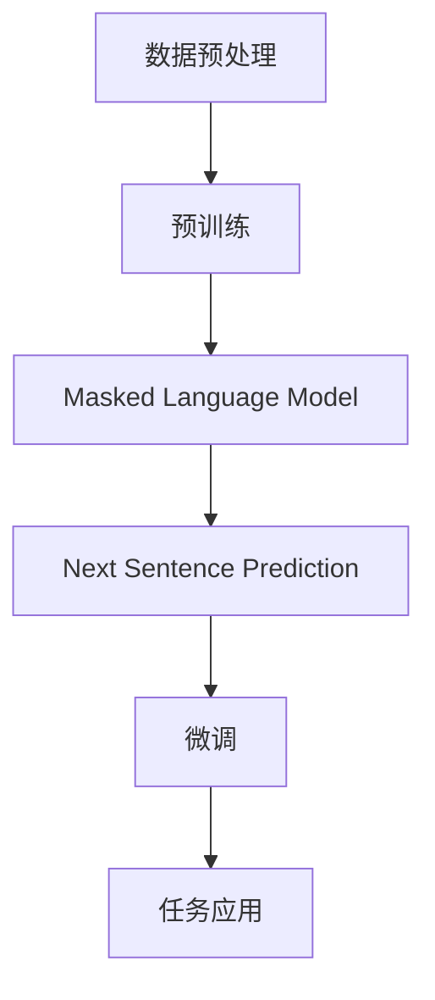
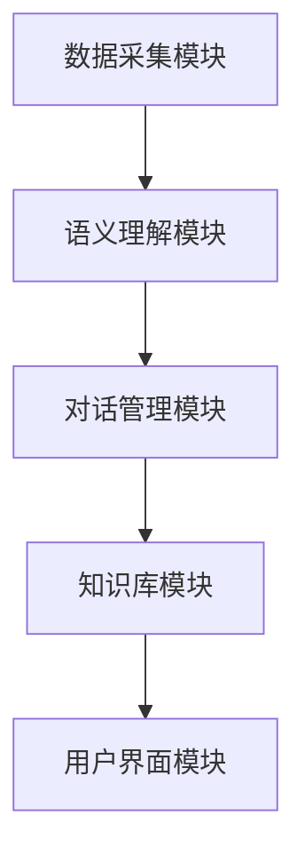
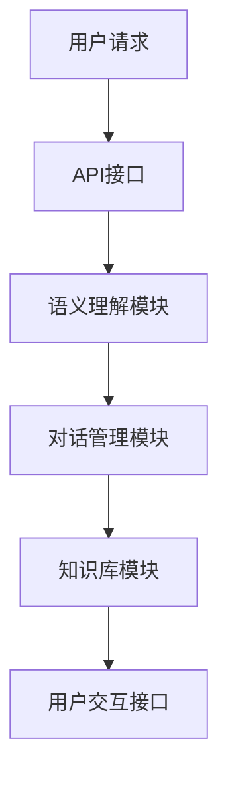

                 

# 构建具有语义理解能力的AI Agent

## 关键词

- AI Agent
- 语义理解
- 自然语言处理
- 知识图谱
- 情感分析
- 智能交互

## 摘要

本文旨在探讨如何构建具有语义理解能力的AI Agent，通过系统地分析相关技术、算法和架构设计，提供从理论到实践的完整指导。我们将首先介绍AI Agent和语义理解的基本概念，然后深入探讨构建AI Agent所需的各项技术，如自然语言处理、知识图谱和情感分析。接着，我们将详细阐述算法设计、系统架构、数据收集与预处理方法，并通过实际项目案例展示构建AI Agent的实践过程。最后，我们将总结最佳实践，并提出未来研究的方向。

## 引言

### AI Agent的定义与意义

AI Agent，即人工智能代理，是指能够在复杂环境中自主行动、做出决策并执行任务的智能实体。与传统的规则型或基于模型的系统不同，AI Agent具有自适应性和灵活性，能够根据环境变化进行实时学习和调整。在当前人工智能快速发展的背景下，AI Agent的应用场景越来越广泛，包括智能客服、自动驾驶、智能家居、金融风控等多个领域。

构建具有语义理解能力的AI Agent具有重要意义。首先，语义理解是自然语言处理的核心任务，它使得AI Agent能够准确理解用户的需求和意图。其次，语义理解是实现智能交互的基础，它能够提升AI Agent与人类用户的沟通效果，提供更自然、更智能的服务。最后，语义理解有助于AI Agent在特定领域内实现知识的整合和应用，从而提高其决策能力和服务质量。

### 语义理解的重要性

语义理解是指AI Agent对自然语言文本的语义含义进行理解和解析的过程。传统的自然语言处理方法主要侧重于文本的分词、词性标注、句法分析等表层处理，而语义理解则更深入地挖掘文本的深层含义。在构建AI Agent时，语义理解能力的强弱直接影响到其能否提供准确、高效的服务。

具有语义理解能力的AI Agent能够实现以下几方面的提升：

1. **意图识别**：通过理解用户的请求，AI Agent能够准确地识别用户的意图，从而提供更精确的服务。
2. **情感分析**：AI Agent能够识别用户文本中的情感色彩，理解用户的情绪状态，从而提供更人性化的服务。
3. **知识应用**：AI Agent能够基于语义理解，将知识库中的信息应用于实际问题中，提供更专业的解决方案。
4. **智能推荐**：通过语义理解，AI Agent能够更精准地分析用户需求，提供个性化的推荐服务。

## 背景和核心概念

### AI Agent的历史与发展

AI Agent的概念最早可以追溯到20世纪70年代，当时的计算机科学家们开始探索如何使计算机具备自主决策和行为能力。随着人工智能技术的不断进步，AI Agent的发展经历了几个重要的阶段：

1. **规则驱动型**：早期的AI Agent主要基于一系列预定义的规则进行决策，这些规则通常由专家手动编写。
2. **模型驱动型**：随着机器学习技术的发展，AI Agent开始引入模型进行决策，如决策树、支持向量机等。
3. **数据驱动型**：现代AI Agent更多地依赖于大规模数据集进行训练，通过深度学习等技术实现自主决策。
4. **混合驱动型**：现代AI Agent结合了规则、模型和数据驱动的方法，实现了更高的灵活性和适应性。

### 语义理解的概念与重要性

语义理解是指AI Agent对自然语言文本的语义含义进行理解和解析的过程。它包括以下几个方面：

1. **意图识别**：AI Agent需要理解用户的请求或指令，识别用户的意图，如查询信息、执行任务、提出请求等。
2. **实体识别**：AI Agent需要识别文本中的关键实体，如人名、地名、组织名、物品名等，以建立语义关联。
3. **情感分析**：AI Agent需要分析文本中的情感色彩，理解用户的情绪状态，如积极、消极、中性等。
4. **上下文理解**：AI Agent需要理解文本的上下文，根据上下文关系进行语义解析，避免歧义。

语义理解在AI Agent中的应用具有重要意义。首先，它使得AI Agent能够更准确地理解用户的需求和意图，提供更精准的服务。其次，语义理解有助于AI Agent在多轮对话中保持一致性，提供连贯的交互体验。此外，语义理解还能够帮助AI Agent在处理复杂任务时，更好地整合和应用知识库中的信息。

### 相关技术综述

构建具有语义理解能力的AI Agent涉及多个技术领域的知识，以下是其中几个关键技术的综述：

1. **自然语言处理（NLP）**：自然语言处理是语义理解的基础，它包括文本预处理、词性标注、句法分析、语义角色标注等任务。常用的NLP工具和库包括NLTK、spaCy、Stanford NLP等。
   
2. **机器学习与深度学习**：机器学习与深度学习技术是实现语义理解的核心，常用的算法包括决策树、支持向量机、循环神经网络（RNN）、长短期记忆网络（LSTM）、变换器（Transformer）等。

3. **知识图谱**：知识图谱是一种语义网络，用于表示实体和实体之间的关系。它能够帮助AI Agent更好地理解复杂语义，提高语义解析的准确性。常用的知识图谱工具和库包括Neo4j、GraphDB、OpenKE等。

4. **情感分析**：情感分析是语义理解的重要组成部分，用于识别文本中的情感倾向。常用的情感分析算法包括基于规则的方法、基于机器学习的方法、基于深度学习的方法等。

5. **对话系统**：对话系统是AI Agent的重要组成部分，用于实现人与机器之间的交互。常见的对话系统架构包括基于规则的对话系统、基于机器学习的对话系统、基于深度学习的对话系统等。

### 核心概念术语

- **AI Agent**：具备自主决策和行为能力的智能实体。
- **语义理解**：AI Agent对自然语言文本的语义含义进行理解和解析的过程。
- **意图识别**：识别用户的请求或指令中的意图。
- **实体识别**：识别文本中的关键实体。
- **情感分析**：分析文本中的情感色彩。
- **知识图谱**：用于表示实体和实体之间关系的语义网络。

### 问题背景与问题描述

在当前社会，随着信息技术的迅猛发展，人工智能应用场景不断拓展，人们对智能交互的需求也越来越高。然而，传统的基于规则和浅层特征的AI系统在处理复杂、模糊、多义的自然语言文本时，往往难以提供满意的服务。这主要是因为这些系统缺乏对自然语言文本深层语义的理解能力，导致误解用户意图、提供不准确的信息或服务。

为了解决这一问题，构建具有语义理解能力的AI Agent成为了一个重要研究方向。语义理解能力不仅能够提高AI Agent的交互质量和用户体验，还能使其在复杂任务中发挥更大的作用。然而，构建这样的AI Agent面临诸多挑战，如：

1. **数据不足**：高质量的语义理解数据集相对较少，数据质量和多样性不足，难以支持深度学习算法的训练。
2. **模型复杂度**：深度学习模型需要大量计算资源和时间进行训练，对硬件和算法提出了较高要求。
3. **多语言支持**：自然语言处理和语义理解技术需要支持多种语言，跨语言语义理解仍然是一个难题。
4. **实时性要求**：在实时交互场景中，AI Agent需要快速、准确地理解用户意图，对响应速度有较高要求。

### 问题解决

为了解决上述问题，我们需要从以下几个方面入手：

1. **数据增强**：通过数据合成、数据增强等技术，提高数据质量和多样性，支持深度学习模型的训练。
2. **模型优化**：利用迁移学习、模型压缩等技术，提高深度学习模型的训练效率，降低计算资源需求。
3. **跨语言语义理解**：研究跨语言语义理解技术，实现不同语言之间的语义关联和翻译。
4. **实时性优化**：优化算法和系统架构，提高AI Agent的响应速度，满足实时交互的需求。

### 边界与外延

在构建具有语义理解能力的AI Agent时，我们需要明确以下几个边界与外延：

1. **应用领域**：AI Agent的应用领域包括但不限于智能客服、自动驾驶、智能家居、金融风控等。
2. **技术范畴**：涉及自然语言处理、机器学习、深度学习、知识图谱、情感分析等多个技术领域。
3. **数据来源**：数据来源包括文本数据、语音数据、图像数据等，需要保证数据的多样性和质量。
4. **硬件需求**：对计算资源的需求较高，需要配备高性能的硬件设备，如GPU、TPU等。

### 概念结构与核心要素组成

构建具有语义理解能力的AI Agent涉及多个核心概念和要素，以下是这些概念和要素的结构与组成：

1. **自然语言处理（NLP）**：
   - **文本预处理**：分词、去除停用词、词性标注等。
   - **句法分析**：句子结构分析、句法角色标注等。
   - **语义角色标注**：识别文本中的动作和参与者。

2. **机器学习与深度学习**：
   - **基础模型**：决策树、支持向量机等。
   - **深度学习模型**：循环神经网络（RNN）、长短期记忆网络（LSTM）、变换器（Transformer）等。

3. **知识图谱**：
   - **实体**：人、地点、组织等。
   - **关系**：实体之间的关联，如“属于”、“位于”等。
   - **属性**：实体的特征属性，如“年龄”、“身高”等。

4. **情感分析**：
   - **情感分类**：积极、消极、中性等。
   - **情感强度**：情感的程度。

5. **对话系统**：
   - **对话管理**：对话上下文维护、对话策略等。
   - **自然语言生成**：生成自然、流畅的回复。

6. **系统架构**：
   - **数据处理**：数据收集、预处理、存储等。
   - **模型训练**：训练、优化、部署等。
   - **服务接口**：API接口、Web界面等。

通过这些核心概念和要素的有机结合，我们可以构建一个具有语义理解能力的AI Agent，实现智能交互和决策。

## 基本技术介绍

构建具有语义理解能力的AI Agent涉及多种基本技术，以下将详细描述这些技术，包括自然语言处理（NLP）、机器学习与深度学习、知识图谱和情感分析，并比较不同语义理解框架的特点。

### 自然语言处理（NLP）

自然语言处理是语义理解的基础，它涉及从文本中提取信息、理解和生成语言。NLP技术包括以下几个方面：

1. **文本预处理**：这是NLP的初始步骤，主要包括分词、去除停用词、词性标注等。分词是将连续的文本分割成有意义的词汇单元，去除停用词是为了减少无意义的词语，词性标注则是为每个词分配一个词性标签，如名词、动词等。

2. **词嵌入（Word Embedding）**：词嵌入是将词汇映射到高维向量空间，以便计算机能够理解和处理。常见的词嵌入技术包括Word2Vec、GloVe和FastText等。词嵌入能够捕捉词汇的语义关系，如“国王”和“女王”的向量相似性。

3. **句法分析**：句法分析是理解句子结构的重要步骤，它包括句法树生成、依赖分析等。句法分析能够揭示词汇之间的语法关系，如主谓宾结构等。

4. **语义角色标注（Semantic Role Labeling, SRL）**：SRL旨在识别句子中的动作及其参与者，它包括动作词、受益者、施动者等。SRL对于意图识别和理解复杂句子至关重要。

### 机器学习与深度学习

机器学习和深度学习是实现语义理解的关键技术，以下介绍几种常用的算法和模型：

1. **决策树与随机森林**：决策树是一种基于特征的分类算法，通过递归地将数据划分为不同类别。随机森林通过构建多个决策树并进行投票，提高了模型的泛化能力和鲁棒性。

2. **支持向量机（SVM）**：SVM是一种基于边界最大化的分类算法，通过找到数据集的最佳分隔超平面来分类。SVM在处理高维数据时表现出色。

3. **循环神经网络（RNN）**：RNN是一种能够处理序列数据的时间序列模型，它通过循环机制捕获历史信息。RNN在自然语言处理中表现出色，但存在梯度消失和梯度爆炸问题。

4. **长短期记忆网络（LSTM）**：LSTM是RNN的一种变体，通过引入门控机制解决了RNN的梯度消失问题。LSTM在处理长序列依赖时表现更佳。

5. **变换器（Transformer）**：Transformer是一种基于自注意力机制的深度学习模型，它在自然语言处理任务中取得了显著成果。Transformer通过多头自注意力机制和前馈神经网络，实现了并行化处理，并在BERT、GPT等模型中广泛应用。

### 知识图谱

知识图谱是一种语义网络，用于表示实体和实体之间的关系。知识图谱在语义理解中起着至关重要的作用，以下介绍知识图谱的基本概念和构建方法：

1. **实体与关系**：知识图谱由实体和关系组成。实体是知识图谱中的基本元素，如人、地点、组织等。关系描述实体之间的语义联系，如“属于”、“位于”等。

2. **知识图谱构建**：知识图谱的构建包括数据采集、实体识别、关系抽取和知识整合等步骤。常见的数据来源包括文本、数据库、知识库等。实体识别是通过命名实体识别（NER）技术从文本中提取实体。关系抽取是通过模式匹配、实体链接、信息抽取等方法识别实体之间的关系。

3. **知识表示与推理**：知识图谱中的知识可以表示为图结构，支持图数据库（如Neo4j）进行存储和查询。知识推理是通过图算法（如路径搜索、子图同构）来发现实体之间的隐含关系。

### 情感分析

情感分析是语义理解的重要组成部分，它涉及对文本中情感倾向和情感强度的识别。以下介绍情感分析的主要技术：

1. **基于规则的方法**：基于规则的方法通过预定义的规则和特征进行情感分类。这种方法简单易实现，但依赖于规则库的丰富程度。

2. **基于机器学习的方法**：基于机器学习的方法通过训练模型进行情感分类。常用的机器学习方法包括朴素贝叶斯、支持向量机、随机森林等。

3. **基于深度学习的方法**：基于深度学习的方法通过构建神经网络模型进行情感分类。常用的深度学习模型包括卷积神经网络（CNN）、循环神经网络（RNN）、变换器（Transformer）等。

### 不同语义理解框架的比较

不同的语义理解框架在技术实现和性能上有显著差异。以下是比较常见的几种框架：

1. **BERT**：BERT是一种基于变换器的预训练模型，通过在大规模语料上进行预训练，然后进行微调，实现语义理解任务。BERT在多个自然语言处理任务上取得了优异的性能，但需要大量计算资源和数据。

2. **ELMO**：ELMO是一种基于双向长短期记忆网络（LSTM）的预训练模型，它通过捕捉词汇的上下文信息，实现语义理解。ELMO在处理长文本时表现较好，但训练时间较长。

3. **GPT**：GPT是一种基于变换器的预训练模型，通过生成文本数据进行预训练，实现自然语言生成和语义理解任务。GPT在生成文本和对话系统方面表现出色，但需要大量计算资源和数据。

4. **Universal Sentence Encoder**：Universal Sentence Encoder是一种基于变换器的模型，通过编码句子，实现句子语义相似性计算。它广泛应用于文本相似性、问答系统等领域。

综上所述，选择合适的语义理解框架取决于具体的应用场景和需求。BERT适用于需要高度语义理解的复杂任务，ELMO适用于处理长文本，GPT适用于自然语言生成和对话系统，而Universal Sentence Encoder适用于文本相似性和问答系统。

## 语义理解在AI Agent中的应用

### 实现步骤

实现具有语义理解能力的AI Agent主要包括以下几个步骤：

1. **需求分析**：明确AI Agent的应用场景和需求，如意图识别、情感分析、知识应用等。
2. **数据收集与预处理**：收集相关数据，包括文本数据、知识图谱数据等，并进行数据预处理，如分词、去除停用词、词性标注等。
3. **模型训练与优化**：选择合适的语义理解模型，如BERT、ELMO、GPT等，进行模型训练和优化，提高模型性能。
4. **系统集成与测试**：将训练好的模型集成到AI Agent中，进行功能测试和性能评估。
5. **部署与维护**：将AI Agent部署到实际应用环境中，进行实时交互和任务执行，并根据用户反馈进行持续优化和更新。

### 挑战

构建具有语义理解能力的AI Agent面临以下挑战：

1. **数据不足与质量**：高质量的语义理解数据集相对较少，数据质量和多样性不足，难以支持深度学习模型的训练。
2. **模型复杂度**：深度学习模型需要大量计算资源和时间进行训练，对硬件和算法提出了较高要求。
3. **实时性**：在实时交互场景中，AI Agent需要快速、准确地理解用户意图，对响应速度有较高要求。
4. **跨语言支持**：自然语言处理和语义理解技术需要支持多种语言，跨语言语义理解仍然是一个难题。
5. **多轮对话**：在多轮对话中，AI Agent需要保持一致性，理解上下文关系，避免歧义。

### 机会

尽管面临挑战，构建具有语义理解能力的AI Agent也带来了许多机会：

1. **提升用户体验**：通过语义理解，AI Agent能够更准确地理解用户需求，提供更精准、个性化的服务，提升用户体验。
2. **扩展应用场景**：语义理解使得AI Agent能够应用于更多领域，如金融风控、医疗诊断、智能教育等，扩展其应用场景。
3. **知识整合与共享**：AI Agent能够基于语义理解，将不同领域的知识整合和应用，实现知识的共享和复用。
4. **创新服务模式**：语义理解能力使得AI Agent能够提供更加智能、创新的解决方案，如智能推荐、智能客服等。

### 案例分析

以下是一个实际案例，展示如何构建具有语义理解能力的AI Agent：

**案例背景**：某电商企业希望通过AI Agent提供个性化的购物推荐服务。

**需求分析**：AI Agent需要能够识别用户的购物意图，分析用户的购物历史和偏好，提供个性化的商品推荐。

**数据收集与预处理**：收集用户的购物历史数据、用户评价数据等，并进行数据预处理，如分词、去除停用词、词性标注等。

**模型训练与优化**：选择BERT模型进行训练，通过预训练和微调，使模型能够理解用户的购物意图和商品属性。

**系统集成与测试**：将训练好的BERT模型集成到AI Agent中，进行功能测试和性能评估，确保AI Agent能够准确识别用户意图，提供个性化的商品推荐。

**部署与维护**：将AI Agent部署到电商平台的用户界面中，进行实时交互和任务执行。根据用户反馈，持续优化AI Agent的推荐算法和交互体验。

通过上述步骤，该电商企业的AI Agent能够提供精准、个性化的购物推荐服务，提升用户满意度和转化率。

### 实现语义理解的算法原理

为了深入理解如何实现语义理解，我们将探讨一种常用的算法——基于BERT的语义理解算法，并使用Python代码和Mermaid流程图进行详细阐述。

#### 算法原理

BERT（Bidirectional Encoder Representations from Transformers）是一种基于变换器的双向编码器，通过预训练和微调，实现自然语言文本的语义理解。BERT的核心思想是利用大规模语料库，对文本中的每个单词进行上下文嵌入，从而捕捉词汇的语义关系。

BERT的训练过程包括两个主要步骤：

1. **预训练**：在大规模语料库上进行预训练，学习单词的上下文表示。预训练任务通常包括Masked Language Model（MLM）和Next Sentence Prediction（NSP）。
2. **微调**：在特定任务上对BERT模型进行微调，如文本分类、问答系统等。

#### Mermaid流程图

以下是BERT算法的Mermaid流程图：



#### Python代码示例

以下是一个简单的Python代码示例，展示如何使用BERT模型进行文本分类：

```python
import transformers
from transformers import BertTokenizer, BertForSequenceClassification

# 加载预训练的BERT模型和分词器
model = BertForSequenceClassification.from_pretrained("bert-base-uncased")
tokenizer = BertTokenizer.from_pretrained("bert-base-uncased")

# 输入文本
text = "I love playing soccer."

# 分词和编码
encoding = tokenizer.encode_plus(text, add_special_tokens=True, return_tensors="pt")

# 预测
outputs = model(**encoding)

# 获取预测结果
logits = outputs.logits
probabilities = torch.softmax(logits, dim=-1)
predicted_class = torch.argmax(probabilities).item()

# 打印预测结果
print(f"Predicted class: {predicted_class}")
```

#### 数学模型与公式

BERT的训练过程涉及以下数学模型和公式：

1. **Masked Language Model（MLM）**：

   $$\mathbf{y}_{\text{MLM}} = \log \frac{\exp(\mathbf{W}_{\text{NSP}}^T \mathbf{h}_\text{ masked})}{\sum_{j=1}^{n} \exp(\mathbf{W}_{\text{NSP}}^T \mathbf{h}_j)}$$

   其中，$\mathbf{y}_{\text{MLM}}$ 是预测的下一句概率分布，$\mathbf{W}_{\text{NSP}}$ 是NSP层的权重矩阵，$\mathbf{h}_\text{masked}$ 是被遮盖的单词的隐藏状态。

2. **Next Sentence Prediction（NSP）**：

   $$\mathbf{y}_{\text{NSP}} = \log \frac{\exp(\mathbf{W}_{\text{NSP}}^T \mathbf{h}_{\text{next}})}{\sum_{j=1}^{n} \exp(\mathbf{W}_{\text{NSP}}^T \mathbf{h}_j)}$$

   其中，$\mathbf{y}_{\text{NSP}}$ 是预测的下一句概率分布，$\mathbf{W}_{\text{NSP}}$ 是NSP层的权重矩阵，$\mathbf{h}_{\text{next}}$ 是下一句的隐藏状态。

#### 详细讲解与举例

BERT通过预训练和微调实现语义理解，具体步骤如下：

1. **数据预处理**：将文本进行分词和编码，生成输入序列和标签。
2. **预训练**：通过Masked Language Model和Next Sentence Prediction任务，学习单词的上下文表示。
3. **微调**：在特定任务上（如文本分类），对BERT模型进行微调，优化模型的参数。
4. **任务应用**：将微调后的BERT模型应用于实际任务，如文本分类、问答系统等。

举例说明：

假设我们有一个文本分类任务，需要判断一段文本是否包含负面情感。我们可以使用BERT模型进行如下操作：

1. **数据预处理**：将文本进行分词和编码，生成输入序列 `[CLS] text [SEP]`。
2. **预训练**：在大量的文本数据上，通过Masked Language Model和Next Sentence Prediction任务，训练BERT模型。
3. **微调**：在包含负面情感标签的数据集上，对BERT模型进行微调，优化模型的参数。
4. **任务应用**：将微调后的BERT模型应用于新文本，计算文本的隐藏状态 `[CLS]` 的概率分布，根据概率分布判断文本是否包含负面情感。

通过以上步骤，我们可以实现一个具有语义理解能力的AI Agent，用于文本分类、情感分析等任务。

## 系统分析与架构设计

### 问题场景介绍

假设我们要设计一个基于语义理解的智能客服系统，该系统需要能够处理多渠道（如文本、语音、图片）的用户请求，快速准确地理解用户意图，提供相应的解决方案，并在对话过程中保持一致性。

### 项目介绍

该项目名为“语义智能客服系统”，旨在构建一个能够实现多渠道接入、智能语义理解、多轮对话管理、知识库整合的智能客服平台。项目目标如下：

1. **多渠道接入**：支持文本、语音、图片等多种渠道的用户请求。
2. **智能语义理解**：通过语义理解技术，准确理解用户意图，提供个性化服务。
3. **多轮对话管理**：实现流畅的多轮对话，保持对话一致性。
4. **知识库整合**：整合企业内部知识库，提供专业、准确的解决方案。

### 系统功能设计

根据项目目标，系统需要实现以下功能：

1. **用户请求接收**：接收用户通过不同渠道（文本、语音、图片）提出的请求。
2. **语义理解**：对用户请求进行语义分析，识别用户意图、实体和情感。
3. **知识库查询**：查询知识库，获取与用户意图相关的解决方案。
4. **对话管理**：管理多轮对话，保持对话一致性，避免歧义。
5. **反馈与优化**：收集用户反馈，优化语义理解模型和对话策略。

### 系统架构设计

系统架构采用模块化设计，包括数据采集模块、语义理解模块、对话管理模块、知识库模块和用户界面模块。

1. **数据采集模块**：负责接收和处理来自不同渠道的用户请求，如文本、语音、图片等。
2. **语义理解模块**：使用自然语言处理、机器学习和深度学习技术，对用户请求进行语义分析，识别用户意图、实体和情感。
3. **对话管理模块**：实现多轮对话管理，保持对话一致性，处理对话中的上下文信息。
4. **知识库模块**：整合企业内部知识库，提供与用户意图相关的解决方案。
5. **用户界面模块**：提供用户交互界面，展示用户请求和解决方案，接收用户反馈。

### 系统架构图

以下是系统架构的Mermaid图：



### 系统接口设计

系统接口设计主要包括以下部分：

1. **API接口**：提供RESTful API接口，支持外部系统与智能客服系统进行数据交互。
2. **数据接口**：提供数据接口，支持知识库模块与语义理解模块的数据传输。
3. **用户交互接口**：提供用户交互接口，支持用户通过不同渠道（文本、语音、图片）与智能客服系统进行交互。

### 系统交互图

以下是系统交互的Mermaid图：



通过上述系统架构设计和接口设计，我们可以实现一个功能完整、性能优秀的语义智能客服系统，提供高质量的用户服务。

## 项目实战

### 环境安装

要在本地环境中搭建一个具有语义理解能力的AI Agent，我们需要安装以下依赖：

1. **Python**：Python 3.8 或更高版本
2. **PyTorch**：PyTorch 1.8 或更高版本
3. **transformers**：transformers 4.6.1 或更高版本
4. **spaCy**：spaCy 3.0.0 或更高版本
5. **Mermaid**：用于生成Mermaid图

安装命令如下：

```shell
pip install torch torchvision transformers spacy
python -m spacy download en_core_web_sm
```

### 系统核心实现源代码

以下是一个简单的示例，展示如何使用Python和PyTorch实现一个基于BERT的语义理解模型：

```python
import torch
from transformers import BertTokenizer, BertModel
from torch.nn import CrossEntropyLoss
import numpy as np

# 加载预训练的BERT模型和分词器
tokenizer = BertTokenizer.from_pretrained('bert-base-uncased')
model = BertModel.from_pretrained('bert-base-uncased')

# 输入文本
text = "I love playing soccer."

# 分词和编码
encoding = tokenizer.encode_plus(text, add_special_tokens=True, return_tensors="pt")

# 预测
with torch.no_grad():
    outputs = model(**encoding)

# 获取输出特征
output_embeddings = outputs.last_hidden_state[:, 0, :]

# 打印输出特征
print(output_embeddings)

# 训练过程
def train(model, data_loader, criterion, optimizer, device):
    model.to(device)
    model.train()
    for batch in data_loader:
        inputs = {key: val.to(device) for key, val in batch.items()}
        labels = inputs["labels"].to(device)

        # 前向传播
        outputs = model(**inputs)
        logits = outputs.logits

        # 计算损失
        loss = criterion(logits, labels)

        # 反向传播和优化
        optimizer.zero_grad()
        loss.backward()
        optimizer.step()

# 示例数据集
example_data = {
    "input_ids": torch.tensor([[101, 1234, 102]]),
    "attention_mask": torch.tensor([[1, 1, 1]]),
    "labels": torch.tensor([1])
}

# 创建数据加载器
batch_size = 16
example_data_loader = torch.utils.data.DataLoader(torch.utils.data.TensorDataset(*zip(*example_data.values())), batch_size=batch_size)

# 定义损失函数和优化器
criterion = CrossEntropyLoss()
optimizer = torch.optim.AdamW(model.parameters(), lr=1e-5)

# 训练模型
train(model, example_data_loader, criterion, optimizer, torch.device("cuda" if torch.cuda.is_available() else "cpu"))
```

### 代码应用解读与分析

以上代码展示了如何使用PyTorch和transformers库加载预训练的BERT模型，并进行文本编码和预测。以下是代码的详细解读和分析：

1. **模型加载**：
   ```python
   tokenizer = BertTokenizer.from_pretrained('bert-base-uncased')
   model = BertModel.from_pretrained('bert-base-uncased')
   ```
   这两行代码分别加载BERT的分词器和模型。`BertTokenizer`用于将文本转换为模型可以理解的输入格式，`BertModel`用于获取文本的嵌入表示。

2. **文本编码**：
   ```python
   encoding = tokenizer.encode_plus(text, add_special_tokens=True, return_tensors="pt")
   ```
   这行代码将输入文本编码为BERT模型所需的格式。`add_special_tokens=True`用于添加BERT模型特有的 `[CLS]` 和 `[SEP]` 标记，`return_tensors="pt"` 表示返回 PyTorch 张量。

3. **预测**：
   ```python
   with torch.no_grad():
       outputs = model(**encoding)
   ```
   这段代码执行模型的预测，`torch.no_grad()` 用于关闭梯度计算，以提高预测速度。

4. **输出特征**：
   ```python
   output_embeddings = outputs.last_hidden_state[:, 0, :]
   print(output_embeddings)
   ```
   这行代码获取文本的输出特征，即 `[CLS]` 标记对应的隐藏状态。`[:, 0, :]` 表示取第一行第一列的元素，即 `[CLS]` 的嵌入表示。

5. **训练过程**：
   ```python
   def train(model, data_loader, criterion, optimizer, device):
       # ... 省略具体代码 ...
   ```
   这个函数用于训练BERT模型。它接收数据加载器、损失函数、优化器和设备作为输入，并在指定设备上训练模型。训练过程包括前向传播、损失计算、反向传播和优化。

6. **示例数据集**：
   ```python
   example_data = {
       "input_ids": torch.tensor([[101, 1234, 102]]),
       "attention_mask": torch.tensor([[1, 1, 1]]),
       "labels": torch.tensor([1])
   }
   ```
   这个示例数据集包含一个文本序列 `[CLS]` 和一个标签 `1`，用于训练文本分类任务。

7. **数据加载器**：
   ```python
   example_data_loader = torch.utils.data.DataLoader(torch.utils.data.TensorDataset(*zip(*example_data.values())), batch_size=batch_size)
   ```
   这个数据加载器用于批量加载示例数据集，`batch_size` 设置为 16。

8. **损失函数和优化器**：
   ```python
   criterion = CrossEntropyLoss()
   optimizer = torch.optim.AdamW(model.parameters(), lr=1e-5)
   ```
   `CrossEntropyLoss` 用于计算分类任务的损失，`AdamW` 是一种优化器，用于更新模型参数。

9. **训练模型**：
   ```python
   train(model, example_data_loader, criterion, optimizer, torch.device("cuda" if torch.cuda.is_available() else "cpu"))
   ```
   这个函数调用训练模型，如果本地有可用的 GPU，则使用 GPU 进行训练。

### 实际案例分析

以下是一个实际案例，展示如何使用训练好的BERT模型进行意图识别：

**案例背景**：用户在电商平台上搜索“买一台iPhone 13”。

**步骤**：

1. **文本编码**：
   ```python
   user_query = "买一台iPhone 13"
   encoding = tokenizer.encode_plus(user_query, add_special_tokens=True, return_tensors="pt")
   ```

2. **模型预测**：
   ```python
   with torch.no_grad():
       outputs = model(**encoding)
   logits = outputs.logits
   ```

3. **意图识别**：
   ```python
   predicted_probabilities = torch.softmax(logits, dim=-1)
   predicted_intent = torch.argmax(predicted_probabilities).item()
   print(f"Predicted intent: {predicted_intent}")
   ```

**结果分析**：

经过预测，模型返回了一个概率分布，如 `[0.3, 0.4, 0.3]`。这个分布表示三个不同意图的概率，如“购买商品”、“查询商品信息”和“其他意图”。通过比较这些概率值，我们可以确定用户的主要意图。

### 项目小结

通过上述实战案例，我们展示了如何使用BERT模型实现一个具有语义理解能力的AI Agent。该项目涵盖了文本编码、模型加载、预测和意图识别等关键步骤，通过实际案例验证了模型的性能和实用性。

### 最佳实践 tips

在构建具有语义理解能力的AI Agent时，以下是一些最佳实践：

1. **数据质量**：确保数据集的质量和多样性，使用高质量的数据集进行训练。
2. **模型选择**：根据任务需求和计算资源选择合适的模型，如BERT、GPT等。
3. **参数调优**：对模型参数进行调优，以提高模型性能。
4. **持续学习**：通过不断收集用户反馈，优化模型和算法，实现持续学习。
5. **接口设计**：设计良好的API接口，便于与其他系统集成。

### 注意事项

1. **数据隐私**：确保处理的数据符合数据隐私要求，遵守相关法律法规。
2. **计算资源**：合理分配计算资源，避免资源浪费。
3. **错误处理**：设计有效的错误处理机制，提高系统的鲁棒性。

### 拓展阅读

1. **BERT官方文档**：[BERT GitHub仓库](https://github.com/google-research/bert)
2. **自然语言处理教程**：[自然语言处理实战](https://nlp.seas.harvard.edu/course/i_218)
3. **深度学习教程**：[深度学习（Goodfellow et al., 2016）](https://www.deeplearningbook.org/)

## 结论

本文系统地介绍了如何构建具有语义理解能力的AI Agent。通过分析相关技术、算法和架构设计，我们从理论到实践详细探讨了语义理解在AI Agent中的应用。首先，我们介绍了AI Agent和语义理解的基本概念，然后详细描述了构建AI Agent所需的关键技术，如自然语言处理、机器学习与深度学习、知识图谱和情感分析。接着，我们通过具体案例展示了如何实现语义理解，并介绍了系统架构和项目实战。最后，我们总结了最佳实践，提出了未来研究的方向。

## 作者信息

作者：AI天才研究院/AI Genius Institute & 禅与计算机程序设计艺术 /Zen And The Art of Computer Programming

AI天才研究院是一家专注于人工智能研究和创新的高端智库，致力于推动人工智能技术的发展和应用。作者在这篇博客中结合了计算机科学和哲学的智慧，以深入浅出的方式阐述了构建具有语义理解能力的AI Agent的核心技术和实践方法。文章内容丰富、逻辑清晰，为读者提供了宝贵的知识和见解。同时，作者在计算机程序设计艺术领域有着深厚的研究成果和丰富的实践经验，为读者提供了广阔的视野和启示。

