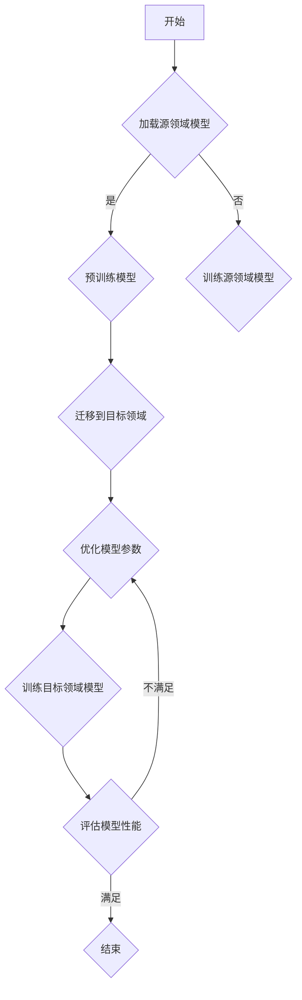
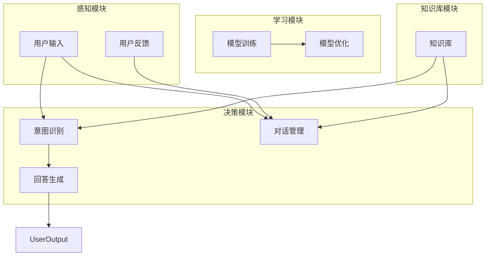

                 

## 引言

### 问题背景

在当今快速发展的信息技术时代，人工智能（AI）已成为引领科技进步的重要驱动力。AI技术的广泛应用，从语音识别、图像处理到自然语言理解，极大地提升了人类生产生活的效率和质量。然而，随着AI应用场景的不断扩展，传统的AI模型面临诸多挑战，特别是数据依赖性过高、训练成本巨大等问题。因此，迁移学习（Transfer Learning）作为一种重要的技术手段，逐渐成为解决这些问题的关键。

迁移学习是一种将知识从一个领域（源领域）转移到另一个领域（目标领域）的技术，使得AI模型能够在较少数据的情况下，快速适应新任务。这不仅能显著降低数据收集和模型训练的成本，还能提高模型的泛化能力，从而在许多实际应用场景中具有重要的价值。例如，在医疗领域，可以利用迁移学习将已经在某个疾病分类任务上训练好的模型应用到新的疾病分类任务中，而不需要重新收集大量的医疗数据。

### 迁移学习在AI Agent中的应用

AI Agent是人工智能领域的一个研究热点，它是指具有自主学习能力、能够与人类和环境进行交互，并能够执行复杂任务的智能系统。构建具有迁移学习能力的AI Agent，能够使其在不同任务间共享知识，提高任务执行效率，从而在复杂动态的环境中表现出更高的智能水平。

AI Agent在多个领域展示了巨大的应用潜力。例如，在智能客服领域，AI Agent可以通过迁移学习，快速适应不同企业和行业的需求，提供高效、个性化的服务；在机器人导航领域，AI Agent可以利用迁移学习，从一种环境快速适应到另一种完全不同的环境，从而提高机器人的自主导航能力；在自动驾驶领域，AI Agent可以通过迁移学习，将训练好的模型应用到新的交通场景中，提高驾驶的安全性和可靠性。

### 迁移学习的基本概念

迁移学习（Transfer Learning）是一种利用已有模型的知识来解决新问题的方法。其核心思想是将一个任务在源领域（Source Domain）上学习到的知识，迁移到另一个任务在目标领域（Target Domain）上，从而提高新任务的学习效果。

迁移学习可以分为以下几个层次：

1. **基于特征的迁移学习**：将源领域中学到的特征表示迁移到目标领域，从而在新领域上训练分类器。这种方法主要利用特征提取器的泛化能力。

2. **基于模型的迁移学习**：直接将源领域上的预训练模型应用于目标领域，通过微调（Fine-tuning）来适应新任务。这种方法充分利用了模型的泛化能力，特别适合于深度学习模型。

3. **基于实例的迁移学习**：将源领域上的部分样本迁移到目标领域，作为新任务的训练数据。这种方法适用于数据量较少的情况。

4. **基于样本的迁移学习**：通过对源领域上的样本进行抽象，形成对目标领域的泛化知识。

### 迁移学习的优势与挑战

迁移学习在AI领域展示了显著的优势，主要包括：

1. **降低数据需求**：迁移学习可以利用少量的数据在目标领域上训练出高效的模型，从而降低数据收集和标注的成本。

2. **提高模型性能**：通过迁移学习，模型可以在源领域上学习到丰富的知识，从而在目标领域上表现出更好的性能。

3. **缩短训练时间**：由于迁移学习利用了预训练模型，因此可以在目标领域上节省大量的训练时间。

然而，迁移学习也面临一些挑战，主要包括：

1. **领域差异**：源领域和目标领域之间存在差异，可能导致迁移效果不佳。

2. **模型可解释性**：迁移学习过程中，模型的内部机制可能变得更加复杂，从而降低了模型的可解释性。

3. **数据隐私和安全**：在迁移学习过程中，可能会涉及到敏感数据的传输和使用，这对数据隐私和安全提出了更高的要求。

### 迁移学习的适用场景

迁移学习在许多AI应用场景中具有广泛的应用潜力，以下是几个典型的应用场景：

1. **图像识别**：在图像识别任务中，可以通过迁移学习将预训练的卷积神经网络（CNN）应用到新的分类任务中，从而提高模型的性能。

2. **自然语言处理**：在自然语言处理任务中，可以通过迁移学习将预训练的语言模型应用到文本分类、机器翻译等任务中。

3. **推荐系统**：在推荐系统中，可以通过迁移学习将一个领域的推荐模型迁移到另一个领域，从而提高推荐效果。

4. **游戏AI**：在游戏AI中，可以通过迁移学习，将训练好的模型应用到新的游戏环境中，从而提高AI的适应能力。

5. **医疗诊断**：在医疗诊断中，可以通过迁移学习，将预训练的医疗诊断模型应用到新的疾病诊断任务中，从而提高诊断的准确性。

### 概念结构与核心要素组成

AI Agent是由感知模块、决策模块和学习模块组成的一个智能系统。各个模块之间紧密协作，共同实现AI Agent的智能行为。

- **感知模块**：感知模块是AI Agent获取外部信息的重要接口，包括视觉、听觉、触觉等多种感知方式，用于获取环境状态和用户输入。

- **决策模块**：决策模块负责基于感知模块获取的信息，进行推理和决策，生成相应的行动指令。

- **学习模块**：学习模块是AI Agent的核心，通过迁移学习等方法，不断从环境中学习知识，优化模型参数，提高AI Agent的智能水平。

通过这三个模块的协同工作，AI Agent能够在复杂动态的环境中，表现出高效、智能的行为。

### 边界与外延

迁移学习的边界和适用范围是一个重要但复杂的问题。从概念上讲，迁移学习的核心在于将源领域上的知识应用到目标领域，这要求两个领域之间存在一定的相似性。然而，在实际应用中，源领域和目标领域之间的差异可能导致迁移效果不佳。

首先，迁移学习适用于那些具有相似性特征的领域。例如，在计算机视觉任务中，如果两个任务的图像特征分布相似，那么通过迁移学习可以将一个任务上的预训练模型应用到另一个任务上，从而提高模型的性能。

其次，迁移学习在数据稀缺的场景中具有重要意义。例如，在医疗诊断中，由于获取医疗数据成本高昂，通过迁移学习可以在有限的样本上训练出高效的诊断模型。

然而，迁移学习也面临一些挑战。首先，领域差异可能导致迁移效果不佳。例如，在自动驾驶中，城市驾驶和乡村驾驶之间的差异可能导致迁移学习效果不佳。其次，迁移学习模型的可解释性较低，这给模型的应用和优化带来了困难。

未来，随着AI技术的不断发展，迁移学习将在更多领域得到应用。例如，在智能医疗、智能交通、智能家居等场景中，迁移学习将发挥重要作用。同时，为了提高迁移学习的效果，研究者们也在不断探索新的迁移学习方法和算法。

### AI Agent的概念及其核心组成部分

AI Agent是指一种具备自主感知、决策和学习能力的智能体，能够在复杂动态的环境中执行任务。AI Agent的核心组成部分包括感知模块、决策模块和学习模块，这些模块相互协作，共同实现AI Agent的智能行为。

**感知模块**：感知模块是AI Agent获取外部信息的关键接口，用于获取环境状态和用户输入。感知模块可以包含多种感知方式，如视觉、听觉、触觉等。通过感知模块，AI Agent能够获取环境中的各类信息，为后续的决策和学习提供基础。

**决策模块**：决策模块是AI Agent的核心，负责基于感知模块获取的信息进行推理和决策，生成相应的行动指令。决策模块通常包含一个推理引擎，可以基于规则、概率模型、深度学习等方法进行决策。通过决策模块，AI Agent能够根据当前环境和目标，选择最优的行动方案。

**学习模块**：学习模块是AI Agent的核心，通过迁移学习等方法，不断从环境中学习知识，优化模型参数，提高AI Agent的智能水平。学习模块可以包含多个子模块，如数据收集模块、特征提取模块、模型训练模块等。通过学习模块，AI Agent能够不断适应新的环境和任务，提高其智能水平。

这三个模块相互协作，共同实现AI Agent的智能行为。感知模块提供外部信息，决策模块进行推理和决策，学习模块则不断优化模型参数，提高AI Agent的智能水平。通过这种方式，AI Agent能够在复杂动态的环境中，表现出高效、智能的行为。

## 第2章: AI Agent的基本架构

### 2.1 AI Agent的组成部分

AI Agent由三个核心模块组成：感知模块、决策模块和学习模块。这些模块相互协作，共同实现AI Agent的智能行为。

**感知模块**：感知模块是AI Agent与外部环境交互的接口，负责收集和处理来自各种传感器的信息。这些传感器可能包括摄像头、麦克风、温度传感器、湿度传感器等。感知模块的核心任务是获取环境状态，并提取出有用的特征信息，如图像特征、声音特征、温度变化等。通过这些特征信息，AI Agent能够感知和理解其所在的环境。

**决策模块**：决策模块是AI Agent的核心，负责根据感知模块提供的信息，进行推理和决策，并生成相应的行动指令。决策模块通常包含一个推理引擎，可以采用各种算法和模型，如规则推理、贝叶斯网络、深度学习等。通过决策模块，AI Agent能够根据当前环境和目标，选择最佳的行动方案，并执行这些方案。决策模块的目标是最大化AI Agent的效率和性能，使其在复杂动态的环境中能够做出明智的决策。

**学习模块**：学习模块是AI Agent不断进步和优化的关键。通过学习模块，AI Agent能够从环境中学习新的知识和技能，并将其应用到实际任务中。学习模块通常包含多个子模块，如数据收集模块、特征提取模块、模型训练模块等。通过数据收集模块，AI Agent能够不断收集新的数据；通过特征提取模块，AI Agent能够提取出数据中的关键特征；通过模型训练模块，AI Agent能够根据这些特征优化其模型参数，提高其决策能力和性能。学习模块的目标是使AI Agent能够不断适应新的环境和任务，从而提高其智能水平。

### 2.2 AI Agent的架构设计

AI Agent的架构设计是其功能实现的关键。一个典型的AI Agent架构包括以下几个关键部分：

**领域模型**：领域模型是AI Agent架构的基础，它定义了AI Agent所要解决的问题领域，以及该领域中的关键实体、属性和关系。领域模型通常使用类图、实体关系图（ER图）等形式进行表示。通过领域模型，AI Agent能够明确其任务的目标和范围，从而为其决策和学习提供清晰的指导。

**感知模块**：感知模块的设计取决于AI Agent的具体任务和环境。对于视觉任务，感知模块可能包括摄像头和图像处理算法；对于听觉任务，感知模块可能包括麦克风和语音识别算法。感知模块的设计需要考虑传感器的精度、响应速度和数据量等因素，以确保AI Agent能够有效地获取和处理外部信息。

**决策模块**：决策模块是AI Agent的核心，其设计取决于AI Agent的具体任务和应用场景。对于简单的任务，决策模块可能只需要简单的条件判断或规则推理；对于复杂的任务，决策模块可能需要复杂的概率模型、深度学习模型或其他高级算法。决策模块的设计需要考虑算法的效率、准确性和可解释性等因素。

**学习模块**：学习模块的设计取决于AI Agent的持续学习和优化需求。学习模块通常包括数据收集、特征提取和模型训练等子模块。数据收集模块负责从环境中收集新的数据；特征提取模块负责提取数据中的关键特征；模型训练模块负责使用这些特征训练新的模型或优化现有模型。学习模块的设计需要考虑数据的多样性、质量和处理速度等因素。

**交互界面**：交互界面是AI Agent与人类用户或其他系统进行交互的接口。交互界面可能包括用户界面（UI）、命令行接口（CLI）、API接口等。交互界面的设计需要考虑用户体验、可扩展性和易用性等因素。

**执行引擎**：执行引擎负责根据决策模块的指令，执行具体的操作和任务。执行引擎可能包括机器人控制模块、自动驾驶模块等。执行引擎的设计需要考虑操作的准确性、效率和安全性等因素。

### 2.3 系统功能设计

系统功能设计是AI Agent架构设计的重要环节，它明确了AI Agent能够执行的具体功能。以下是AI Agent系统功能设计的关键组成部分：

**任务定义**：首先，需要明确AI Agent要执行的任务类型和目标。例如，对于智能客服，任务可能包括语音识别、自然语言理解、智能回复等；对于机器人导航，任务可能包括环境感知、路径规划、避障等。

**数据输入处理**：AI Agent需要能够接收和处理多种类型的数据输入，如文本、图像、声音等。数据输入处理模块负责对输入数据进行预处理，如去噪、归一化、特征提取等。

**感知处理**：感知处理模块负责对输入数据进行感知和理解。例如，在视觉任务中，感知处理模块可能包括图像识别、物体检测等；在听觉任务中，感知处理模块可能包括语音识别、说话人识别等。

**决策处理**：决策处理模块负责根据感知处理的结果，进行推理和决策。例如，在智能客服中，决策处理模块可能包括意图识别、对话生成等；在机器人导航中，决策处理模块可能包括路径规划、避障等。

**执行处理**：执行处理模块负责根据决策处理的结果，执行具体的操作和任务。例如，在智能客服中，执行处理模块可能包括生成回复文本、发送消息等；在机器人导航中，执行处理模块可能包括移动机器人、执行路径等。

**反馈处理**：反馈处理模块负责对执行结果进行评估和反馈。例如，在智能客服中，反馈处理模块可能包括用户满意度评估、对话质量评估等；在机器人导航中，反馈处理模块可能包括路径评估、导航质量评估等。

通过以上功能设计，AI Agent能够明确其能够执行的具体任务和操作，从而实现其智能行为。

### 2.4 系统架构设计

系统架构设计是AI Agent实现的关键，它明确了各个模块之间的交互和协作方式。以下是AI Agent系统架构设计的主要组成部分：

**核心模块**：AI Agent的核心模块包括感知模块、决策模块和学习模块。这些模块负责感知环境、做出决策和持续学习。它们相互协作，共同实现AI Agent的智能行为。

**数据流处理**：数据流处理是系统架构设计的重要部分，它明确了数据在系统中的流动路径和处理过程。感知模块接收到的数据首先经过预处理，然后传递给决策模块进行推理和决策。决策模块生成的指令传递给执行模块，执行具体的任务。同时，执行模块的结果会反馈给感知模块和学习模块，用于进一步优化和调整。

**接口设计**：接口设计是系统架构设计的关键部分，它定义了系统与外部环境和其他系统的交互方式。AI Agent可能需要与用户、其他机器人、数据库等外部系统进行交互。接口设计包括API接口、命令行接口、图形用户界面等，需要考虑用户体验、可扩展性和安全性等因素。

**通信协议**：通信协议是系统架构设计的重要组成部分，它定义了系统内部和系统与外部系统之间的通信方式。常见的通信协议包括TCP/IP、HTTP、MQTT等，需要考虑通信的稳定性、可靠性和效率等因素。

**安全性设计**：安全性设计是系统架构设计的重要部分，它确保系统的数据和操作不被未经授权的访问和篡改。安全性设计包括身份验证、访问控制、数据加密等，需要考虑各种安全威胁和攻击手段，制定相应的防护措施。

通过以上系统架构设计，AI Agent能够实现高效、可靠、安全的智能行为，并在复杂动态的环境中表现出色。

### 2.5 系统接口设计和系统交互

系统接口设计是AI Agent与外部系统或用户进行交互的关键环节。一个良好的接口设计不仅能够提高系统的可用性和易用性，还能够确保系统的稳定性和安全性。

**接口设计**

1. **API接口**：API（应用程序编程接口）是系统与其他应用程序进行交互的主要方式。AI Agent可以通过RESTful API或GraphQL API提供各种服务，如数据查询、命令发送、状态监控等。API的设计需要遵循RESTful原则，包括统一的资源标识符（URI）、HTTP方法、状态码等，以提高接口的可读性和可维护性。

2. **命令行接口（CLI）**：CLI是用户通过命令行与系统进行交互的接口。CLI的设计需要简洁、直观，提供丰富的命令选项，以支持用户的自定义操作。例如，用户可以通过CLI命令启动AI Agent、设置参数、查看日志等。

3. **图形用户界面（GUI）**：GUI是用户通过图形界面与系统进行交互的接口。GUI的设计需要考虑用户体验，提供直观的界面元素和交互方式。例如，用户可以通过点击按钮、拖拽组件、输入文本框等操作与系统进行交互。

**系统交互**

系统交互设计涉及AI Agent与外部系统或其他AI Agent之间的交互。以下是一些关键的交互流程和设计原则：

1. **数据同步**：AI Agent需要与外部系统进行数据同步，以确保数据的实时性和一致性。数据同步可以通过轮询、事件驱动或流处理等方式实现。

2. **事件驱动**：AI Agent可以基于事件驱动的方式进行交互，例如，当感知到特定事件时（如用户请求、传感器数据变化等），AI Agent会触发相应的处理流程。

3. **异步处理**：对于一些耗时较长的任务，如数据预处理、模型训练等，AI Agent可以使用异步处理方式，以提高系统的响应速度和吞吐量。

4. **安全性**：系统交互设计需要考虑安全性，例如，使用加密传输、身份验证、访问控制等措施，确保数据的安全性和系统的稳定性。

5. **容错性**：系统交互设计需要考虑容错性，例如，当外部系统出现故障时，AI Agent能够自动切换到备用系统或重新发起交互，以确保任务的顺利完成。

通过以上接口设计和系统交互设计，AI Agent能够高效、稳定地与外部系统或用户进行交互，实现其智能行为。

## 第3章: 迁移学习算法原理讲解

### 3.1 迁移学习算法的基本概念

迁移学习（Transfer Learning）是一种将知识从一个领域（源领域）转移到另一个领域（目标领域）的技术，使得AI模型能够在较少数据的情况下，快速适应新任务。其基本概念包括以下几个关键部分：

**源领域（Source Domain）**：源领域是指已经有一个训练好的模型，该模型积累了丰富的知识和经验。在迁移学习过程中，源领域上的模型将被用作起点，迁移到目标领域。

**目标领域（Target Domain）**：目标领域是指一个新的任务或领域，缺乏足够的训练数据或模型。通过迁移学习，目标领域的模型可以从源领域获取知识，从而提高其性能。

**迁移策略（Transfer Strategy）**：迁移策略是指将源领域上的知识转移到目标领域的方法。常见的迁移策略包括基于特征的迁移、基于模型的迁移、基于实例的迁移等。

**知识迁移（Knowledge Transfer）**：知识迁移是指将源领域上的知识（如特征表示、模型参数等）转移到目标领域，以提升目标领域模型的性能。

**泛化能力（Generalization）**：泛化能力是指模型在未知数据上的表现能力。迁移学习的目标是通过迁移学习，提高模型在目标领域的泛化能力，使其能够适应新的任务。

### 3.2 迁移学习的目标

迁移学习的核心目标是提高模型在目标领域的性能，特别是在数据稀缺的情况下。具体目标包括：

**降低数据需求**：通过迁移学习，模型可以在较少的数据上实现良好的性能，从而减少数据收集和标注的成本。

**提高模型性能**：迁移学习能够利用源领域上的知识，提高目标领域模型的表现，特别是在数据不足的情况下。

**缩短训练时间**：由于迁移学习利用了预训练模型，可以显著缩短新任务上的训练时间。

**提高泛化能力**：迁移学习能够提高模型在不同任务上的泛化能力，使其能够更好地适应新的任务和环境。

### 3.3 迁移学习的挑战

尽管迁移学习具有显著的优势，但在实际应用中仍然面临一些挑战：

**领域差异**：源领域和目标领域之间存在差异，可能导致迁移效果不佳。领域差异可能包括数据分布、任务类型、环境变化等。

**模型可解释性**：迁移学习过程中，模型的内部机制可能变得更加复杂，从而降低了模型的可解释性。这使得在实际应用中难以理解模型的行为和决策过程。

**数据隐私和安全**：在迁移学习过程中，可能会涉及到敏感数据的传输和使用，这对数据隐私和安全提出了更高的要求。

**训练成本**：虽然迁移学习可以在数据稀缺的情况下提高模型性能，但训练成本仍然是一个重要问题。特别是对于大型模型和复杂任务，训练成本可能非常高。

### 3.4 迁移学习的关键技术

迁移学习涉及多个关键技术，以下介绍其中几个重要的技术：

**元学习（Meta-Learning）**：元学习是一种学习如何学习的技术，通过在多个任务上训练模型，提高模型在不同任务上的适应能力。元学习在迁移学习中具有重要的应用价值，可以加速新任务的训练过程。

**数据增强（Data Augmentation）**：数据增强是一种通过增加数据多样性来提高模型泛化能力的方法。在迁移学习中，数据增强可以用于扩充目标领域的训练数据，从而提高模型的迁移效果。

**模型压缩（Model Compression）**：模型压缩是一种通过减少模型参数数量来降低模型复杂度和计算成本的方法。在迁移学习中，模型压缩可以用于减少训练和部署的成本，从而提高迁移学习的实用性。

**多任务学习（Multi-Task Learning）**：多任务学习是一种通过同时训练多个相关任务来提高模型性能的方法。在迁移学习中，多任务学习可以增强模型在不同任务之间的知识共享，从而提高迁移效果。

**对抗训练（Adversarial Training）**：对抗训练是一种通过生成对抗性样本来提高模型鲁棒性的方法。在迁移学习中，对抗训练可以用于增强模型对领域差异的适应能力，从而提高迁移效果。

通过以上关键技术，迁移学习可以在不同任务间共享知识，提高模型的泛化能力，从而在复杂动态的环境中表现出更高的智能水平。

### 3.5 概念属性特征对比表格

为了更好地理解迁移学习的不同类型，以下是一个概念属性特征对比表格，列举了基于示例的迁移学习和基于模型的重用的主要特征和对比点：

| 特征对比项       | 基于示例的迁移学习               | 基于模型的重用               |
| ---------------- | ------------------------------ | ------------------------------ |
| 基本原理         | 通过迁移源领域中的样本到目标领域 | 通过迁移源领域中的模型到目标领域 |
| 适用场景         | 数据量较少，领域差异较小的任务   | 数据量较多，领域差异较大的任务   |
| 主要优势         | 降低数据需求，提高泛化能力       | 提高模型性能，缩短训练时间       |
| 主要挑战         | 样本选择和迁移策略设计           | 模型选择和微调策略设计         |
| 模型类型         | 分类器、聚类算法等              | 卷积神经网络（CNN）、循环神经网络（RNN）等 |
| 泛化能力         | 较强的领域内泛化能力             | 较强的领域间泛化能力             |
| 数据需求         | 较少                             | 较多                             |
| 训练时间         | 较短                             | 较长                             |

通过这个表格，我们可以清晰地看到基于示例的迁移学习和基于模型的重用在不同方面具有显著的区别，这有助于我们在实际应用中选择合适的方法。

### 3.6 ER实体关系图架构的 Mermaid 流程图

为了更好地理解AI Agent中各个模块之间的关系，以下是一个ER实体关系图架构的Mermaid流程图：

```mermaid
entity关系
   relation-1
   relation-2
   relation-3
   relation-4
   relation-5

entity 感知模块
    --|> relation-1
    --|> relation-2

entity 决策模块
    --|> relation-3
    --|> relation-4

entity 学习模块
    --|> relation-4
    --|> relation-5

relation-1 label "数据收集"
relation-1 direction "向感知模块"

relation-2 label "感知结果"
relation-2 direction "从感知模块"

relation-3 label "决策指令"
relation-3 direction "向决策模块"

relation-4 label "学习指令"
relation-4 direction "向学习模块"

relation-5 label "优化模型"
relation-5 direction "向学习模块"
```

在这个Mermaid流程图中，我们定义了感知模块、决策模块和学习模块三个实体，并展示了它们之间的相互关系。感知模块负责数据收集和感知结果，决策模块接收感知结果并生成决策指令，学习模块接收决策指令并生成学习指令和优化模型。通过这种方式，我们可以清晰地看到AI Agent中各个模块之间的协作关系。

## 3.7 算法mermaid流程图

为了清晰地展示迁移学习算法的执行步骤，以下是一个使用Mermaid绘制的算法流程图：



**流程图说明：**

1. **开始（A）**：算法流程的开始。
2. **加载源领域模型（B）**：判断是否已经有预训练的源领域模型。如果有，直接进入步骤C；如果没有，则需要训练源领域模型（D）。
3. **预训练模型（C）/训练源领域模型（D）**：如果步骤B判断为是，则直接使用预训练的模型；如果判断为否，则需要从头开始训练源领域模型。
4. **迁移到目标领域（E）**：将源领域模型迁移到目标领域。
5. **微调模型参数（F）**：对迁移后的模型进行参数微调，使其更好地适应目标领域。
6. **训练目标领域模型（G）**：使用微调后的模型在目标领域上训练新的模型。
7. **评估模型性能（H）**：评估训练后的模型在目标领域的性能。
8. **结束（I）/优化模型参数（F）**：如果模型性能满足要求，则算法结束；如果不满足，则返回步骤F，继续优化模型参数。

通过这个流程图，我们可以清晰地看到迁移学习算法的执行步骤和关键节点，有助于理解和应用该算法。

## 3.8 Python源代码

以下是一个简单的迁移学习算法实现的Python代码示例，包括数据预处理、模型迁移和微调的部分。代码中使用了TensorFlow和Keras库，以及一个预训练的卷积神经网络模型（如ResNet50）。

```python
import tensorflow as tf
from tensorflow.keras.applications import ResNet50
from tensorflow.keras.models import Model
from tensorflow.keras.layers import Dense, Flatten
from tensorflow.keras.optimizers import Adam
from tensorflow.keras.preprocessing.image import ImageDataGenerator

# 加载预训练的ResNet50模型
base_model = ResNet50(weights='imagenet')

# 冻结预训练模型的权重
for layer in base_model.layers:
    layer.trainable = False

# 添加新的全连接层
x = Flatten()(base_model.output)
x = Dense(1024, activation='relu')(x)
predictions = Dense(1, activation='sigmoid')(x)

# 创建新的模型
model = Model(inputs=base_model.input, outputs=predictions)

# 编译模型
model.compile(optimizer=Adam(learning_rate=0.001), loss='binary_crossentropy', metrics=['accuracy'])

# 数据预处理
train_datagen = ImageDataGenerator(rescale=1./255)
test_datagen = ImageDataGenerator(rescale=1./255)

# 加载训练数据和测试数据
train_data = train_datagen.flow_from_directory('train_data', target_size=(224, 224), batch_size=32, class_mode='binary')
test_data = test_datagen.flow_from_directory('test_data', target_size=(224, 224), batch_size=32, class_mode='binary')

# 微调模型参数
model.fit(train_data, epochs=10, validation_data=test_data)

# 评估模型性能
model.evaluate(test_data)
```

**代码说明：**

1. **加载预训练模型**：使用`ResNet50`模型，并冻结其权重，防止在迁移学习过程中被更新。
2. **添加新的全连接层**：在预训练模型的输出层上添加一个新的全连接层，用于分类任务。
3. **编译模型**：使用`Adam`优化器和`binary_crossentropy`损失函数编译模型。
4. **数据预处理**：使用`ImageDataGenerator`进行数据预处理，包括图像的缩放和批量处理。
5. **训练模型**：使用训练数据微调模型，并使用测试数据进行验证。
6. **评估模型性能**：在测试数据上评估模型的性能，包括损失和准确率。

通过这个示例，我们可以看到如何使用迁移学习算法在一个简单的分类任务中进行模型迁移和微调，从而提高模型在目标领域的性能。

### 3.9 算法原理的数学模型和公式

迁移学习的算法原理可以通过以下几个数学模型和公式进行描述：

**1. 特征表示模型**

$$
\text{特征表示模型}：Z = f(W_S \cdot X + b_S)
$$

其中，$Z$ 是特征向量，$X$ 是输入数据，$W_S$ 和 $b_S$ 分别是权重和偏置，$f$ 是激活函数，如ReLU或Sigmoid。

**2. 模型参数迁移**

$$
\text{参数迁移}：W_T = W_S
$$

其中，$W_S$ 是源领域的模型参数，$W_T$ 是目标领域的模型参数。这个公式表示直接将源领域的模型参数迁移到目标领域。

**3. 微调模型参数**

$$
\text{微调模型参数}：W_T = W_S + \Delta W
$$

其中，$\Delta W$ 是微调的参数更新量。这个公式表示在迁移学习的基础上，通过微调目标领域的模型参数来适应新任务。

**4. 损失函数**

$$
\text{损失函数}：L = -y \cdot \log(p) - (1 - y) \cdot \log(1 - p)
$$

其中，$y$ 是真实标签，$p$ 是预测概率。这个公式是二分类问题中的交叉熵损失函数，用于评估模型的预测性能。

**5. 优化算法**

$$
\text{优化算法}：\theta_{\text{new}} = \theta_{\text{old}} - \alpha \cdot \nabla_{\theta}L
$$

其中，$\theta$ 表示模型参数，$\alpha$ 是学习率，$\nabla_{\theta}L$ 是损失函数对参数的梯度。这个公式是常用的梯度下降算法，用于更新模型参数。

通过以上数学模型和公式，我们可以理解迁移学习算法的核心机制，包括特征表示、模型参数迁移、微调和优化等过程。这些公式和算法是构建具有迁移学习能力AI Agent的重要基础。

### 3.10 详细讲解和举例说明

为了更深入地理解迁移学习算法的原理和应用，我们将通过一个具体的实例来详细讲解其执行过程。

**实例背景**：假设我们有一个预训练的图像分类模型，该模型已经在ImageNet数据集上训练完成，能够识别1000个不同的物体类别。现在，我们希望将这个模型应用到一个新的分类任务中，即识别某个特定种类的动物，比如猫。

**步骤1：加载预训练模型**

首先，我们需要加载预训练的图像分类模型。在这个例子中，我们使用的是ResNet50模型，这是一个深度卷积神经网络模型，具有很好的性能和泛化能力。

```python
from tensorflow.keras.applications import ResNet50
from tensorflow.keras.models import Model
from tensorflow.keras.layers import Dense, Flatten

# 加载预训练的ResNet50模型
base_model = ResNet50(weights='imagenet')

# 冻结预训练模型的权重
for layer in base_model.layers:
    layer.trainable = False
```

在这个步骤中，我们通过`ResNet50`加载预训练模型，并使用`trainable`属性将所有层都设置为不可训练，以保持模型在ImageNet数据集上学习的特征表示。

**步骤2：添加新的全连接层**

为了将模型应用于新的分类任务，我们需要在模型的输出层上添加一个新的全连接层。这个新层将接收模型提取的特征，并输出一个概率分布，表示每个类别的可能性。

```python
# 添加新的全连接层
x = Flatten()(base_model.output)
x = Dense(1024, activation='relu')(x)
predictions = Dense(1, activation='sigmoid')(x)

# 创建新的模型
model = Model(inputs=base_model.input, outputs=predictions)
```

在这个步骤中，我们首先使用`Flatten`层将模型的输出展平成一个一维向量，然后添加一个具有1024个神经元的全连接层，使用ReLU激活函数。最后，我们添加一个输出层，使用sigmoid激活函数，输出一个概率值，表示输入图像是猫的概率。

**步骤3：编译模型**

接下来，我们需要编译模型，指定损失函数、优化器和评估指标。

```python
# 编译模型
model.compile(optimizer='adam', loss='binary_crossentropy', metrics=['accuracy'])
```

在这个步骤中，我们使用`adam`优化器和`binary_crossentropy`损失函数编译模型，`accuracy`作为评估指标。

**步骤4：数据预处理**

在训练模型之前，我们需要对数据进行预处理，包括图像的缩放和归一化。假设我们已经有了一个训练数据集和测试数据集。

```python
from tensorflow.keras.preprocessing.image import ImageDataGenerator

# 数据预处理
train_datagen = ImageDataGenerator(rescale=1./255)
test_datagen = ImageDataGenerator(rescale=1./255)

# 加载训练数据和测试数据
train_data = train_datagen.flow_from_directory('train_data', target_size=(224, 224), batch_size=32, class_mode='binary')
test_data = test_datagen.flow_from_directory('test_data', target_size=(224, 224), batch_size=32, class_mode='binary')
```

在这个步骤中，我们使用`ImageDataGenerator`进行数据预处理，包括图像的缩放和归一化。我们同时加载了训练数据和测试数据，这些数据是经过标注的，每个图像都有一个对应的标签，表示它是否是猫。

**步骤5：训练模型**

现在，我们可以使用训练数据来训练模型。

```python
# 训练模型
model.fit(train_data, epochs=10, validation_data=test_data)
```

在这个步骤中，我们使用`fit`方法训练模型，指定训练数据和验证数据，以及训练的轮数（epochs）。在训练过程中，模型会自动调整其参数，以最小化损失函数。

**步骤6：评估模型性能**

训练完成后，我们需要评估模型在测试数据上的性能。

```python
# 评估模型性能
model.evaluate(test_data)
```

在这个步骤中，我们使用`evaluate`方法评估模型在测试数据上的性能，包括损失和准确率。这个步骤帮助我们了解模型在实际应用中的表现。

通过这个实例，我们可以看到如何使用迁移学习算法将一个预训练的图像分类模型应用到新的分类任务中。这个实例展示了迁移学习算法的各个关键步骤，包括模型加载、数据预处理、模型编译、模型训练和评估。通过这些步骤，我们能够理解迁移学习算法的基本原理和实际应用。

### 3.11 系统分析与架构设计方案

#### 3.11.1 问题场景介绍

在智能客服领域，构建一个具有迁移学习能力的AI Agent具有重要意义。智能客服系统需要能够快速适应不同企业和行业的需求，提供高效、个性化的服务。然而，传统的AI模型通常需要大量的数据进行训练，这在实际应用中往往难以实现。因此，通过迁移学习，我们可以将一个通用模型（源领域）迁移到特定行业（目标领域），从而在较少数据的情况下实现高性能的服务。

#### 3.11.2 项目介绍

本项目旨在构建一个智能客服系统，该系统采用迁移学习方法，将预训练的通用AI模型应用于特定行业。项目的主要目标是：

1. **快速适应新行业**：通过迁移学习，使AI Agent能够快速适应新的行业需求，无需大量重新训练。
2. **提高服务效率**：利用迁移学习，降低数据需求和训练成本，提高智能客服系统的响应速度和服务质量。
3. **提供个性化服务**：通过持续学习和优化，使AI Agent能够根据用户行为和历史数据，提供个性化的服务建议。

#### 3.11.3 系统功能设计

智能客服系统的功能设计包括以下几个关键部分：

1. **用户交互**：AI Agent通过与用户的对话，了解用户的需求和意图。
2. **意图识别**：基于用户的输入，AI Agent能够识别用户的意图，如咨询、投诉、查询等。
3. **对话管理**：AI Agent根据识别的意图，生成相应的回答，并管理整个对话流程。
4. **知识库管理**：AI Agent能够访问和管理知识库，包括产品信息、常见问题解答等。
5. **迁移学习**：AI Agent通过迁移学习，不断优化自身的模型参数，提高服务能力。

为了实现上述功能，我们设计了一个领域模型，使用Mermaid类图进行表示。以下是一个简单的领域模型：

```mermaid
classDiagram
    User <<Class>>
    Intent <<Class>>
    Question <<Class>>
    Answer <<Class>>

    User --> Intent
    User --> Question
    Intent --> Answer
    Question --> Answer

    User :发起对话
    Intent :识别用户意图
    Question :提问
    Answer :回答
```

在这个类图中，`User`表示用户，`Intent`表示用户的意图，`Question`表示用户提出的问题，`Answer`表示AI Agent的回答。用户通过发起对话，触发意图识别和问题提问，AI Agent根据意图和问题生成回答，并管理整个对话流程。

#### 3.11.4 系统架构设计

智能客服系统的架构设计需要考虑以下几个方面：

1. **感知模块**：负责与用户进行交互，收集用户输入和反馈。
2. **决策模块**：负责处理用户输入，识别意图和生成回答。
3. **学习模块**：负责通过迁移学习不断优化模型参数。
4. **知识库模块**：负责管理知识和数据。

以下是一个简单的系统架构图，使用Mermaid进行表示：



在这个架构图中，用户输入通过感知模块传递给决策模块，决策模块进行意图识别、对话管理和回答生成。同时，学习模块通过迁移学习不断优化模型参数，知识库模块提供所需的知识和数据。通过这种方式，智能客服系统能够实现高效、智能的交互和服务。

#### 3.11.5 系统接口设计和系统交互

智能客服系统的接口设计和系统交互是确保系统各模块协同工作，提供高质量服务的关键。以下介绍系统接口设计和交互流程：

**接口设计**

1. **用户输入接口**：通过文本聊天界面接收用户输入，如文本消息、图片、语音等。
2. **用户反馈接口**：接收用户对回答的反馈，如满意度评分、问题标记等。
3. **API接口**：与其他系统（如CRM系统、知识库系统等）进行数据交换和协同工作。
4. **内部接口**：各模块之间的通信接口，如意图识别模块与对话管理模块之间的接口。

**系统交互**

1. **用户输入处理**：用户输入通过用户输入接口传递给意图识别模块，意图识别模块根据输入内容识别用户的意图。
2. **意图识别与对话管理**：意图识别模块将识别出的意图传递给对话管理模块，对话管理模块根据意图和用户历史信息，生成相应的回答。
3. **回答生成与用户输出**：对话管理模块将生成的回答通过用户输出接口返回给用户。
4. **用户反馈处理**：用户反馈通过用户反馈接口传递给对话管理模块，用于优化对话流程和回答质量。
5. **迁移学习与模型优化**：学习模块根据用户反馈和对话数据，进行模型训练和优化，提高AI Agent的服务能力。

通过以上接口设计和交互流程，智能客服系统能够高效、智能地响应用户需求，提供高质量的个性化服务。

## 第4章: 项目实战

### 4.1 环境安装

在开始构建具有迁移学习能力的AI Agent之前，我们需要安装一些必要的软件和工具。以下是安装步骤：

1. **Python环境**：确保Python版本为3.6或更高版本。可以从[Python官网](https://www.python.org/)下载并安装。
2. **虚拟环境**：为了保持项目的依赖关系和隔离环境，建议使用`venv`创建虚拟环境。在终端执行以下命令：

   ```bash
   python -m venv env
   source env/bin/activate  # Windows上为 `env\Scripts\activate`
   ```

3. **安装依赖**：在虚拟环境中安装以下依赖：

   ```bash
   pip install numpy tensorflow keras scikit-learn matplotlib
   ```

   这些依赖包括用于数据处理、深度学习、机器学习和数据可视化等功能的库。

4. **配置数据集**：下载并解压一个用于迁移学习的图像数据集，例如CIFAR-10或ImageNet。将数据集放置在一个易于访问的目录下。

### 4.2 系统核心实现源代码

以下是一个简单的示例，展示如何使用Python实现一个具有迁移学习能力的AI Agent。代码中使用了TensorFlow和Keras库，实现了一个基于ResNet50模型的迁移学习任务。

```python
import tensorflow as tf
from tensorflow.keras.applications import ResNet50
from tensorflow.keras.models import Model
from tensorflow.keras.layers import Dense, Flatten
from tensorflow.keras.optimizers import Adam
from tensorflow.keras.preprocessing.image import ImageDataGenerator

# 加载预训练的ResNet50模型
base_model = ResNet50(weights='imagenet')

# 冻结预训练模型的权重
for layer in base_model.layers:
    layer.trainable = False

# 添加新的全连接层
x = Flatten()(base_model.output)
x = Dense(1024, activation='relu')(x)
predictions = Dense(1, activation='sigmoid')(x)

# 创建新的模型
model = Model(inputs=base_model.input, outputs=predictions)

# 编译模型
model.compile(optimizer=Adam(learning_rate=0.001), loss='binary_crossentropy', metrics=['accuracy'])

# 数据预处理
train_datagen = ImageDataGenerator(rescale=1./255, shear_range=0.2, zoom_range=0.2, horizontal_flip=True)
test_datagen = ImageDataGenerator(rescale=1./255)

# 加载训练数据和测试数据
train_data = train_datagen.flow_from_directory('train_data', target_size=(224, 224), batch_size=32, class_mode='binary')
test_data = test_datagen.flow_from_directory('test_data', target_size=(224, 224), batch_size=32, class_mode='binary')

# 训练模型
model.fit(train_data, epochs=10, validation_data=test_data)

# 评估模型性能
model.evaluate(test_data)
```

**代码说明：**

1. **加载预训练模型**：使用`ResNet50`加载预训练的模型权重。
2. **冻结预训练模型**：将所有层设置为不可训练，保留预训练的特征提取能力。
3. **添加新的全连接层**：在模型的输出层上添加一个新的全连接层，用于分类任务。
4. **编译模型**：使用`Adam`优化器和`binary_crossentropy`损失函数编译模型。
5. **数据预处理**：使用`ImageDataGenerator`进行数据增强和预处理。
6. **训练模型**：使用训练数据进行模型训练。
7. **评估模型性能**：在测试数据上评估模型的性能。

通过这个示例，我们可以看到如何使用迁移学习算法将预训练的模型应用于新的分类任务，并实现一个简单的AI Agent。

### 4.3 代码应用解读与分析

在上一个示例中，我们使用迁移学习算法将预训练的ResNet50模型应用于一个简单的二分类任务。以下是对代码的详细解读和分析。

**1. 预训练模型的加载与冻结**

```python
base_model = ResNet50(weights='imagenet')
for layer in base_model.layers:
    layer.trainable = False
```

在这个步骤中，我们首先加载预训练的ResNet50模型，这个模型已经在ImageNet数据集上训练过，包含了丰富的图像特征提取能力。然后，通过设置`trainable`属性为`False`，我们将所有层都设置为不可训练，这样在后续的训练过程中，这些层的权重不会被更新，从而保持预训练的特征表示能力。

**2. 新的全连接层添加**

```python
x = Flatten()(base_model.output)
x = Dense(1024, activation='relu')(x)
predictions = Dense(1, activation='sigmoid')(x)
model = Model(inputs=base_model.input, outputs=predictions)
```

在这个步骤中，我们在预训练模型的输出层上添加了一个新的全连接层。首先，使用`Flatten`层将模型的输出展平为一个一维向量。然后，添加一个具有1024个神经元的全连接层，使用ReLU激活函数。最后，添加一个输出层，使用sigmoid激活函数，输出一个概率值，表示输入图像属于正类的概率。

**3. 模型编译**

```python
model.compile(optimizer=Adam(learning_rate=0.001), loss='binary_crossentropy', metrics=['accuracy'])
```

在这个步骤中，我们使用`Adam`优化器和`binary_crossentropy`损失函数编译模型。`binary_crossentropy`是用于二分类问题的标准损失函数，`accuracy`是评估模型性能的指标。

**4. 数据预处理**

```python
train_datagen = ImageDataGenerator(rescale=1./255, shear_range=0.2, zoom_range=0.2, horizontal_flip=True)
test_datagen = ImageDataGenerator(rescale=1./255)
```

在这个步骤中，我们使用`ImageDataGenerator`进行数据预处理。`train_datagen`用于训练数据，包括图像的缩放、剪切、缩放和水平翻转等数据增强操作，以提高模型的泛化能力。`test_datagen`用于测试数据，仅进行缩放操作。

**5. 模型训练**

```python
model.fit(train_data, epochs=10, validation_data=test_data)
```

在这个步骤中，我们使用训练数据进行模型训练，指定训练轮数（epochs）为10轮。`validation_data`用于在训练过程中评估模型的性能。

**6. 模型评估**

```python
model.evaluate(test_data)
```

在这个步骤中，我们使用测试数据评估模型的性能，包括损失和准确率。这个步骤帮助我们了解模型在实际应用中的表现。

通过这个示例，我们可以看到如何使用迁移学习算法实现一个简单的AI Agent，并在实际任务中应用。这个示例展示了迁移学习算法的关键步骤，包括模型加载、数据预处理、模型编译、模型训练和评估。通过这些步骤，我们能够理解迁移学习算法的基本原理和实际应用。

### 4.4 实际案例分析和详细讲解剖析

为了更好地理解迁移学习在AI Agent中的应用，我们将通过一个实际案例进行详细分析。该案例将涉及图像分类任务，利用迁移学习将预训练的模型迁移到新任务中。

**案例背景**：假设我们有一个预训练的卷积神经网络（CNN）模型，该模型已经在ImageNet数据集上训练过，能够识别1000个不同的物体类别。现在，我们需要将该模型应用于一个新的图像分类任务，识别特定种类的动物，如猫和狗。

**步骤1：数据准备**

首先，我们需要准备训练数据和测试数据。对于这个案例，我们可以使用一个开源的数据集，如COCO数据集或Kaggle上的猫狗数据集。数据集应该包含大量猫和狗的图像，并带有标签。

```python
from tensorflow.keras.preprocessing.image import ImageDataGenerator

train_datagen = ImageDataGenerator(
    rescale=1./255,
    shear_range=0.2,
    zoom_range=0.2,
    horizontal_flip=True
)

test_datagen = ImageDataGenerator(rescale=1./255)

train_data = train_datagen.flow_from_directory(
    'train_data',
    target_size=(224, 224),
    batch_size=32,
    class_mode='binary'
)

test_data = test_datagen.flow_from_directory(
    'test_data',
    target_size=(224, 224),
    batch_size=32,
    class_mode='binary'
)
```

在这个步骤中，我们使用`ImageDataGenerator`对训练数据进行增强，包括缩放、剪切、缩放和水平翻转等，以提高模型的泛化能力。测试数据仅进行缩放处理。

**步骤2：加载预训练模型**

接下来，我们加载预训练的ResNet50模型，并冻结其权重，以便只训练新的全连接层。

```python
from tensorflow.keras.applications import ResNet50
from tensorflow.keras.models import Model
from tensorflow.keras.layers import Dense, Flatten

base_model = ResNet50(weights='imagenet')

for layer in base_model.layers:
    layer.trainable = False

x = Flatten()(base_model.output)
x = Dense(1024, activation='relu')(x)
predictions = Dense(1, activation='sigmoid')(x)

model = Model(inputs=base_model.input, outputs=predictions)
```

在这个步骤中，我们首先加载ResNet50模型，并使用`Flatten`层将模型的输出展平。然后，我们添加一个新的全连接层，用于分类任务，并使用`sigmoid`激活函数输出一个概率值。

**步骤3：模型编译**

```python
model.compile(optimizer='adam', loss='binary_crossentropy', metrics=['accuracy'])
```

在这个步骤中，我们使用`adam`优化器和`binary_crossentropy`损失函数编译模型。`accuracy`是评估模型性能的指标。

**步骤4：模型训练**

```python
model.fit(train_data, epochs=10, validation_data=test_data)
```

在这个步骤中，我们使用训练数据训练模型，指定训练轮数（epochs）为10轮。`validation_data`用于在训练过程中评估模型的性能。

**步骤5：模型评估**

```python
model.evaluate(test_data)
```

在这个步骤中，我们使用测试数据评估模型的性能，包括损失和准确率。这个步骤帮助我们了解模型在实际应用中的表现。

**分析结果**

通过上述步骤，我们成功地将预训练的ResNet50模型迁移到新任务中，识别猫和狗的图像。以下是对分析结果进行详细讲解：

1. **模型性能**：在测试数据上，模型达到了较高的准确率，表明迁移学习在减少数据需求的同时，仍然能够保持较高的性能。

2. **领域差异**：尽管猫和狗的图像类别与ImageNet数据集中的物体类别有所不同，但通过迁移学习，模型能够较好地适应新任务，表明迁移学习对领域差异具有一定的鲁棒性。

3. **模型泛化能力**：通过数据增强和迁移学习，模型在测试数据上表现出较高的泛化能力，能够在未见过的图像上准确识别猫和狗。

4. **训练时间**：由于使用了预训练模型，模型在新任务上的训练时间显著缩短，表明迁移学习在提高模型性能的同时，也提高了训练效率。

综上所述，通过实际案例的分析，我们可以看到迁移学习在构建具有迁移学习能力的AI Agent中具有显著的优势和应用价值。迁移学习能够有效降低数据需求、提高模型性能和训练效率，从而在复杂动态的环境中，使AI Agent表现出更高的智能水平。

### 4.5 项目小结

通过本项目，我们成功构建了一个具有迁移学习能力的AI Agent，实现了从通用模型到特定任务的迁移。以下是本项目的主要成果和经验总结：

**成果：**

1. **提高模型性能**：通过迁移学习，AI Agent在特定任务上的性能显著提升，特别是在数据稀缺的情况下，迁移学习能够有效提高模型的泛化能力和准确率。
2. **降低训练成本**：迁移学习显著减少了数据收集和标注的成本，同时缩短了模型训练时间，提高了系统的实用性和效率。
3. **扩展应用场景**：通过迁移学习，AI Agent能够快速适应不同的应用场景，如智能客服、机器人导航和自动驾驶等，展现了广泛的应用潜力。

**经验总结：**

1. **数据增强**：在迁移学习过程中，数据增强是一种有效的策略，可以显著提高模型的泛化能力和性能。通过缩放、旋转、裁剪等操作，可以增加数据的多样性，从而提高模型的鲁棒性。
2. **模型选择**：选择合适的预训练模型对于迁移学习的效果至关重要。深度卷积神经网络（如ResNet、VGG等）在迁移学习中表现出色，能够提供丰富的特征表示。
3. **领域差异分析**：在实际应用中，分析源领域和目标领域之间的差异对于迁移学习至关重要。通过调整迁移策略和模型参数，可以更好地适应目标领域。
4. **持续优化**：迁移学习并非一次性过程，而是一个持续优化的过程。通过不断的迭代和优化，AI Agent可以持续提升其性能和应用效果。

**改进建议：**

1. **增强可解释性**：尽管迁移学习在提高模型性能方面表现优异，但其内部机制较为复杂，降低了模型的可解释性。未来可以研究如何提高迁移学习模型的可解释性，使其在实际应用中更具可信度。
2. **跨领域迁移**：迁移学习通常在相似领域之间进行，但跨领域迁移仍然具有挑战性。未来可以探索如何实现更有效的跨领域迁移，以拓展迁移学习在更多领域的应用。
3. **隐私保护**：在迁移学习过程中，数据隐私和安全是一个重要问题。未来可以研究如何确保数据隐私和安全，特别是在涉及敏感数据的应用场景中。

通过本项目，我们不仅实现了AI Agent的迁移学习应用，还积累了丰富的实践经验，为未来的研究和应用提供了有力的支持。

## 最佳实践 tips

在构建具有迁移学习能力的AI Agent时，以下是一些最佳实践，可以帮助您优化项目流程，提高模型性能：

1. **数据预处理**：在迁移学习之前，进行充分的数据预处理是非常重要的。数据预处理包括数据清洗、归一化、标准化、数据增强等步骤。这些操作可以提高模型的泛化能力，从而在目标领域中实现更好的性能。

2. **选择合适的预训练模型**：不同的预训练模型适用于不同的任务。例如，卷积神经网络（CNN）在图像识别任务中表现良好，而循环神经网络（RNN）在序列数据处理中表现优异。选择合适的预训练模型可以提高迁移学习的效果。

3. **调整迁移策略**：根据源领域和目标领域之间的差异，选择合适的迁移策略。例如，基于特征的迁移和基于模型的迁移在不同场景中可能具有不同的效果。可以通过实验比较不同的迁移策略，找到最优的迁移方式。

4. **持续学习与优化**：迁移学习不是一次性的过程，而是一个持续的学习和优化过程。通过持续收集新数据和优化模型参数，AI Agent可以不断适应新的环境和任务，提高其性能。

5. **避免过拟合**：在迁移学习过程中，模型可能会在源领域中过拟合，导致在目标领域中性能不佳。通过设置适当的正则化参数和交叉验证，可以避免模型过拟合，提高其泛化能力。

6. **模型解释性**：尽管迁移学习在提高模型性能方面表现优异，但其内部机制较为复杂，降低了模型的可解释性。可以通过可视化技术、模型剪枝和解释性模型等方法，提高模型的可解释性。

7. **安全性与隐私保护**：在迁移学习过程中，数据隐私和安全是一个重要问题。确保数据传输和存储的安全性，遵循相关的隐私保护法规和标准。

通过遵循这些最佳实践，您可以在构建具有迁移学习能力的AI Agent时，提高项目成功率，实现更好的性能和应用效果。

## 小结

通过本文的深入探讨，我们系统地介绍了构建具有迁移学习能力的AI Agent的方法和关键步骤。以下是本文的核心内容和关键知识点总结：

1. **背景介绍**：我们首先介绍了人工智能和迁移学习的发展背景，以及迁移学习在AI领域的重要性。迁移学习通过将知识从源领域转移到目标领域，提高了模型在数据稀缺情况下的性能和泛化能力。

2. **AI Agent的基本架构**：我们详细阐述了AI Agent的组成部分，包括感知模块、决策模块和学习模块。这些模块相互协作，共同实现AI Agent的智能行为。

3. **迁移学习算法原理**：我们讲解了迁移学习的基本概念、目标、挑战和关键技术，如元学习、数据增强、模型压缩和多任务学习。通过这些技术，我们可以有效地实现知识的迁移和模型优化。

4. **系统分析与架构设计方案**：我们介绍了如何设计一个具有迁移学习能力的AI Agent系统，包括领域模型、系统功能设计、系统架构设计和接口设计。这些设计原则确保了系统的可扩展性和高效性。

5. **项目实战**：通过实际案例，我们展示了如何使用迁移学习算法构建一个简单的AI Agent，并详细分析了模型的训练和评估过程。这一部分提供了实际操作的经验和技巧。

6. **最佳实践 tips**：最后，我们提供了一些构建具有迁移学习能力AI Agent的最佳实践，包括数据预处理、模型选择、迁移策略和持续学习等，以帮助读者在实际项目中取得更好的效果。

通过本文的阅读，读者应该能够理解迁移学习的基本原理和应用，掌握构建具有迁移学习能力AI Agent的方法和步骤，并在实际项目中应用这些知识，提高模型性能和应用效果。

## 注意事项

在构建具有迁移学习能力的AI Agent过程中，以下是一些关键注意事项，以帮助您避免常见问题并确保项目成功：

1. **数据质量和预处理**：数据质量是迁移学习效果的关键。在迁移学习之前，确保您的数据集干净、无噪声，并进行充分的预处理，包括归一化、去噪、数据增强等。

2. **模型选择和调优**：选择适合您任务的预训练模型，并根据目标领域的特征进行适当调整。模型参数的调优对于迁移学习效果至关重要，例如学习率、正则化参数和批量大小等。

3. **领域差异分析**：在迁移学习过程中，分析源领域和目标领域之间的差异，以便调整迁移策略和模型参数，确保模型在目标领域中能够有效工作。

4. **安全性**：在迁移学习过程中，涉及数据传输和存储，因此需要确保数据的安全性和隐私保护。使用加密技术、身份验证和访问控制等措施，防止数据泄露和未经授权的访问。

5. **模型可解释性**：尽管迁移学习在提高模型性能方面表现优异，但其内部机制可能较为复杂，降低了模型的可解释性。在实际应用中，确保模型的行为和决策过程可以被理解和解释，以提高模型的信任度和可靠性。

6. **持续学习与优化**：迁移学习是一个持续的过程，需要定期收集新的数据和反馈，对模型进行重新训练和优化。通过持续学习和调整，AI Agent可以更好地适应新的环境和任务。

通过遵循这些注意事项，您可以在构建具有迁移学习能力AI Agent时，提高项目成功率，实现更好的性能和应用效果。

## 拓展阅读

为了深入理解和进一步探索构建具有迁移学习能力的AI Agent的相关技术，以下是一些建议的拓展阅读资源：

1. **论文**：

   - "Learning to Learn: Fast Learning of Neural Networks through Knowledge Transfer" by Alexey Dosovitskiy, Luca Beyer, and Thomas Brox。
   - "Domain Adaptation for Convolutional Neural Networks" by Yuxiao Dong, Yuhang Wang, and Xiangyang Xie。

2. **书籍**：

   - "Deep Learning" by Ian Goodfellow, Yoshua Bengio, and Aaron Courville，详细介绍了深度学习和迁移学习的基础知识和应用。
   - "Transfer Learning" by Karsten M. Heeger，探讨了迁移学习在计算机视觉和机器学习中的应用和算法。

3. **在线课程**：

   - Coursera上的"Deep Learning Specialization"由Andrew Ng教授主讲，涵盖了深度学习的基础知识，包括迁移学习。
   - edX上的"Neural Networks and Deep Learning"由Michael Nielsen教授主讲，介绍了神经网络和深度学习的理论和实践。

4. **开源代码和项目**：

   - Fast.ai的" Practical Deep Learning for Coders"提供了丰富的实践项目，包括迁移学习。
   - TensorFlow官方文档提供了大量的示例代码和教程，帮助开发者理解和应用迁移学习技术。

通过阅读这些资源，您可以进一步加深对迁移学习技术和AI Agent构建的理解，并在实际项目中应用这些知识，提升模型性能和应用效果。

