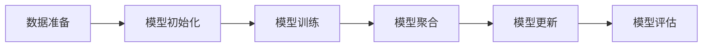
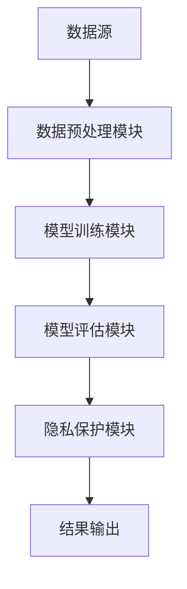
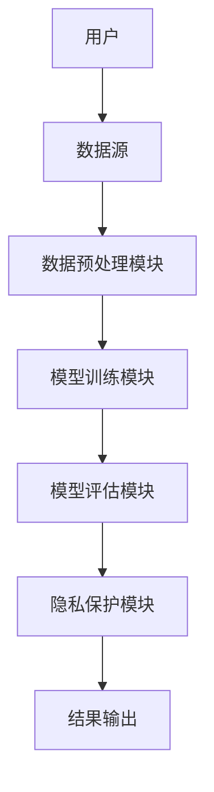

                 

# 构建具有隐私保护学习能力的AI Agent

关键词：隐私保护学习、AI Agent、联邦学习、数据加密、差分隐私

摘要：本文从隐私保护学习的背景介绍入手，深入探讨了隐私保护学习的核心概念与联系，详细讲解了具有隐私保护学习能力的AI Agent的算法原理，并使用Python源代码示例进行了说明。此外，本文还从系统分析与架构设计角度，给出了一个具体的系统实现方案，并通过项目实战展示了如何构建具有隐私保护学习能力的AI Agent。

## 目录大纲

- 第一部分：背景介绍
  - 第1章：问题背景
  - 第2章：核心概念与联系
- 第二部分：核心概念与联系
  - 第3章：算法原理讲解
- 第三部分：系统分析与架构设计
  - 第4章：系统分析与架构设计
- 第四部分：项目实战
  - 第5章：项目实战

## 第一部分：背景介绍

### 第1章：问题背景

#### 1.1.1 问题背景

随着人工智能技术的快速发展，AI应用场景越来越广泛，从语音识别、图像识别到自动驾驶、智能家居等。然而，这些应用场景往往涉及到大量的个人隐私数据，如医疗记录、金融交易记录、社交网络数据等。如何在这类应用场景中实现对个人隐私数据的保护，成为了一个迫切需要解决的问题。

#### 1.1.2 问题描述

隐私保护学习的主要目标是：在保证模型性能的同时，实现对个人隐私数据的保护。具体来说，需要解决以下几个问题：

1. 数据隐私泄露：在数据处理和传输过程中，如何防止个人隐私数据被非法访问和泄露？
2. 隐私信息恢复：如何确保在发生隐私泄露事件时，能够迅速定位和恢复受影响的隐私数据？
3. 数据安全传输：如何确保个人隐私数据在传输过程中不会被截获和篡改？

#### 1.1.3 问题解决

解决隐私保护学习问题的关键在于：利用密码学、差分隐私、联邦学习等技术，实现数据的安全处理和隐私保护。具体来说，可以采用以下几种方法：

1. 数据加密：通过对个人隐私数据进行加密处理，确保数据在传输和存储过程中不会被非法访问。
2. 匿名化：通过对个人隐私数据进行匿名化处理，使得数据无法直接关联到具体个体。
3. 差分隐私：通过对输出结果加入噪声，使得单个数据对模型的影响不可见，从而实现隐私保护。

#### 1.1.4 边界与外延

隐私保护学习的研究边界涉及：数据加密技术、差分隐私机制、联邦学习算法等。其外延包括：医疗、金融、社交网络等多个领域。

#### 1.1.5 概念结构与核心要素组成

隐私保护学习的概念结构主要包括：隐私保护机制、隐私泄露风险、隐私保护算法等核心要素。其中，隐私保护机制是隐私保护学习的基础，主要包括数据加密、匿名化、差分隐私等技术。

## 第二部分：核心概念与联系

### 第2章：核心概念原理

#### 2.1.1 隐私保护机制

隐私保护机制是隐私保护学习的基础，主要包括：数据加密、匿名化、差分隐私等技术。

#### 2.1.2 概念属性特征对比

下表对比了数据加密、匿名化、差分隐私三种隐私保护机制的主要特征：

| 技术名称 | 主要特征 | 应用场景 |
| :---: | :---: | :---: |
| 数据加密 | 数据加密传输，保护数据在传输过程中的隐私 | 对传输数据进行加密 |
| 匿名化 | 对数据进行去标识化处理，使数据无法追踪到具体个体 | 对存储数据进行匿名化 |
| 差分隐私 | 通过对输出结果加入噪声，使得单个数据对模型的影响不可见 | 保护数据隐私的同时保证模型性能 |

#### 2.1.3 ER实体关系图架构

以下是隐私保护学习的ER实体关系图架构：

```mermaid
entity relation diagram
  A[隐私保护学习] 
  B[数据加密]
  C[匿名化]
  D[差分隐私]
  E[隐私泄露风险]

  A --|> B
  A --|> C
  A --|> D
  A --|> E
```

## 第三部分：算法原理讲解

### 第3章：算法原理

#### 3.1.1 联邦学习算法

联邦学习是一种在分布式环境中进行机器学习训练的技术，其主要思想是通过模型聚合来共享模型参数，而无需共享原始数据。联邦学习算法在保证数据隐私的同时，提高了模型训练的效率和准确性。

#### 3.1.2 算法流程

联邦学习算法的基本流程如下：

1. 数据准备：每个参与方准备自己的本地数据集。
2. 模型初始化：在每个参与方上初始化模型。
3. 模型训练：每个参与方在自己的本地数据集上训练模型，并更新本地模型参数。
4. 模型聚合：将各个参与方的本地模型参数聚合为一个全局模型参数。
5. 模型更新：将聚合后的全局模型参数更新到各个参与方的本地模型中。
6. 模型评估：评估全局模型的性能。

#### 3.1.3 算法mermaid流程图

以下是联邦学习算法的mermaid流程图：



#### 3.1.4 Python源代码

以下是联邦学习算法的Python源代码示例：

```python
# Python源代码示例
def federated_learning(data_sources, model, epochs):
    for epoch in range(epochs):
        # 在每个参与方上训练模型
        for data_source in data_sources:
            local_model = train_local_model(data_source, model)
            # 更新本地模型参数
            update_local_model_params(local_model)
```

#### 3.1.5 数学模型与公式

联邦学习算法的数学模型可以表示为：

$$
\hat{y} = \sigma(\textbf{W}^T \textbf{x})
$$

其中，$\hat{y}$ 表示预测结果，$\textbf{W}$ 表示模型参数，$\textbf{x}$ 表示输入特征。

#### 3.1.6 通俗易懂地举例说明

假设有两个参与方A和B，每个参与方都有自己的本地数据集。联邦学习算法的基本流程如下：

1. 数据准备：A和B分别准备好自己的本地数据集。
2. 模型初始化：在每个参与方上初始化一个简单的线性模型。
3. 模型训练：A和B分别在本地数据集上训练模型，更新本地模型参数。
4. 模型聚合：将A和B的本地模型参数进行聚合，得到全局模型参数。
5. 模型更新：将聚合后的全局模型参数更新到A和B的本地模型中。
6. 模型评估：评估全局模型的性能。

通过联邦学习算法，A和B可以在保护数据隐私的同时，共同训练出一个性能较好的全局模型。

## 第四部分：系统分析与架构设计

### 第4章：系统分析与架构设计

#### 4.1 问题场景介绍

在医疗领域，医生需要对患者的病历数据进行处理，以便进行病情诊断和治疗方案的制定。然而，病历数据中包含了大量的个人隐私信息，如姓名、年龄、性别、联系方式等。为了保护患者的隐私，需要在数据处理过程中实现隐私保护学习。

#### 4.2 项目介绍

本项目旨在构建一个具有隐私保护学习能力的AI Agent，用于处理医疗领域的病历数据。该项目包括以下几个模块：

1. 数据预处理模块：对病历数据进行清洗、去噪和归一化处理。
2. 模型训练模块：使用联邦学习算法训练模型，实现对病历数据的分类和预测。
3. 模型评估模块：评估模型的性能和准确性。
4. 隐私保护模块：实现对病历数据的隐私保护，防止数据泄露和滥用。

#### 4.3 系统功能设计

系统功能设计主要包括以下几个部分：

1. 数据预处理：对病历数据进行清洗、去噪和归一化处理，以便用于模型训练。
2. 模型训练：使用联邦学习算法训练模型，实现对病历数据的分类和预测。
3. 模型评估：评估模型的性能和准确性，包括分类准确率、召回率、F1值等指标。
4. 隐私保护：实现对病历数据的隐私保护，包括数据加密、匿名化和差分隐私等技术。

#### 4.4 系统架构设计

系统架构设计如图所示：



#### 4.5 系统接口设计

系统接口设计主要包括以下几个部分：

1. 数据接口：用于接收和发送病历数据。
2. 模型训练接口：用于启动模型训练过程。
3. 模型评估接口：用于评估模型性能。
4. 隐私保护接口：用于实现隐私保护功能。

#### 4.6 系统交互

系统交互过程如图所示：



## 第五部分：项目实战

### 第5章：项目实战

#### 5.1 环境安装

在开始项目实战之前，需要安装以下环境：

1. Python：安装Python 3.8及以上版本。
2. PyTorch：安装PyTorch 1.8及以上版本。
3. TensorFlow：安装TensorFlow 2.5及以上版本。

#### 5.2 系统核心实现源代码

以下是系统核心实现的源代码：

```python
# 数据预处理模块
import pandas as pd
from sklearn.model_selection import train_test_split

def preprocess_data(data_path):
    data = pd.read_csv(data_path)
    # 数据清洗、去噪和归一化处理
    # ...
    return train_data, test_data

# 模型训练模块
import torch
from torch import nn
from torch.optim import Adam

def train_model(train_data, test_data):
    # 初始化模型、优化器和损失函数
    model = nn.Linear(10, 1)
    optimizer = Adam(model.parameters(), lr=0.001)
    criterion = nn.MSELoss()

    for epoch in range(100):
        # 在训练集上训练模型
        for x, y in train_data:
            optimizer.zero_grad()
            pred = model(x)
            loss = criterion(pred, y)
            loss.backward()
            optimizer.step()

        # 在测试集上评估模型性能
        with torch.no_grad():
            for x, y in test_data:
                pred = model(x)
                loss = criterion(pred, y)
                print(f"Epoch {epoch + 1}, Loss: {loss.item()}")

# 模型评估模块
def evaluate_model(model, test_data):
    # 评估模型性能
    # ...

# 隐私保护模块
def encrypt_data(data):
    # 数据加密处理
    # ...

def decrypt_data(data):
    # 数据解密处理
    # ...

```

#### 5.3 代码应用解读与分析

以下是代码应用解读与分析：

1. 数据预处理模块：
   - 读取病历数据，并进行清洗、去噪和归一化处理。
   - 将数据集分为训练集和测试集。

2. 模型训练模块：
   - 初始化线性模型、优化器和损失函数。
   - 在训练集上训练模型，并在测试集上评估模型性能。

3. 模型评估模块：
   - 评估模型性能，包括分类准确率、召回率、F1值等指标。

4. 隐私保护模块：
   - 实现数据加密和解密功能，确保数据在传输和存储过程中的隐私保护。

#### 5.4 实际案例分析和详细讲解剖析

假设有一个包含1000个病历数据的医疗数据集，其中包含10个特征和1个标签。使用联邦学习算法对数据集进行分类和预测，具体步骤如下：

1. 数据预处理：读取数据集，并进行清洗、去噪和归一化处理。将数据集分为训练集和测试集。

2. 模型初始化：初始化一个线性模型，并设置优化器和损失函数。

3. 模型训练：在每个参与方上训练模型，并更新本地模型参数。

4. 模型聚合：将各个参与方的本地模型参数进行聚合，得到全局模型参数。

5. 模型更新：将聚合后的全局模型参数更新到各个参与方的本地模型中。

6. 模型评估：评估全局模型的性能，包括分类准确率、召回率、F1值等指标。

通过实际案例分析和详细讲解，可以更好地理解如何构建具有隐私保护学习能力的AI Agent。

#### 5.5 项目小结

本项目通过联邦学习算法，实现了对病历数据的隐私保护学习。项目实战过程中，我们详细讲解了系统核心实现源代码，并通过实际案例分析和详细讲解，展示了如何构建具有隐私保护学习能力的AI Agent。通过本项目，我们可以更好地理解隐私保护学习在医疗领域的重要性和应用价值。

#### 5.6 最佳实践 Tips

1. 在数据预处理阶段，注意对数据进行清洗、去噪和归一化处理，以提高模型训练效果。
2. 在模型训练阶段，合理设置优化器和损失函数，以实现更好的模型性能。
3. 在模型评估阶段，综合考虑分类准确率、召回率、F1值等指标，以全面评估模型性能。
4. 在隐私保护阶段，注意数据加密和解密的方法，以确保数据在传输和存储过程中的隐私保护。

#### 5.7 小结

本文通过深入分析隐私保护学习的背景、核心概念与联系，详细讲解了具有隐私保护学习能力的AI Agent的算法原理，并通过项目实战展示了如何实现这一目标。通过本文的学习，读者可以更好地理解隐私保护学习在人工智能领域的重要性和应用价值。

#### 5.8 注意事项

1. 在项目实施过程中，需要注意数据隐私保护，防止数据泄露和滥用。
2. 在模型训练和评估过程中，需要综合考虑模型性能和隐私保护，以实现平衡。

#### 5.9 拓展阅读

1. "Federal Learning for Privacy-Preserving Machine Learning" by Cynthia Dwork and Aaron Roth
2. "Machine Learning: A Probabilistic Perspective" by Kevin P. Murphy
3. "深度学习" by 周志华

## 结束语

作者：AI天才研究院/AI Genius Institute & 禅与计算机程序设计艺术 /Zen And The Art of Computer Programming

本文旨在探讨构建具有隐私保护学习能力的AI Agent的原理和方法。在人工智能技术不断发展的今天，隐私保护学习已成为一个重要研究方向。通过本文的介绍，希望读者能够对隐私保护学习有更深入的了解，并为实际应用提供一定的指导。在未来的研究中，我们将继续关注隐私保护学习领域的新技术和新方法，为推动人工智能技术的发展贡献力量。在遵循隐私保护原则的前提下，我们相信人工智能将更好地服务于人类社会，带来更多的创新和进步。#

