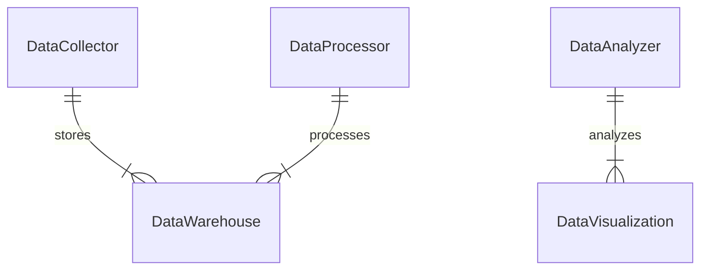
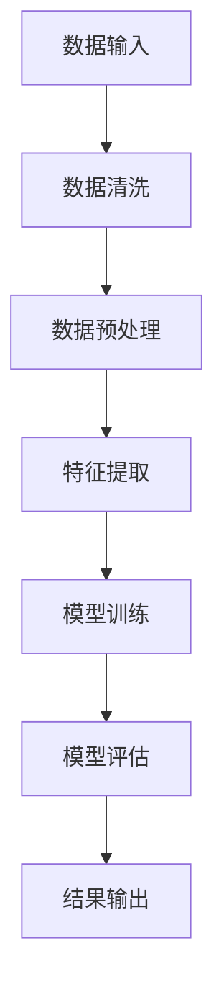
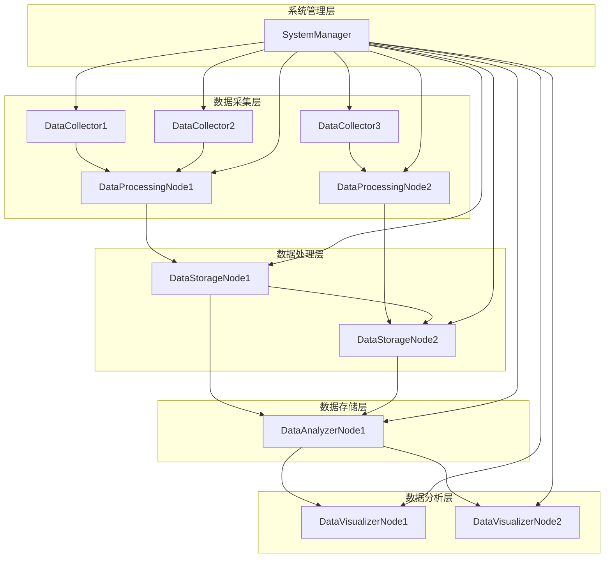
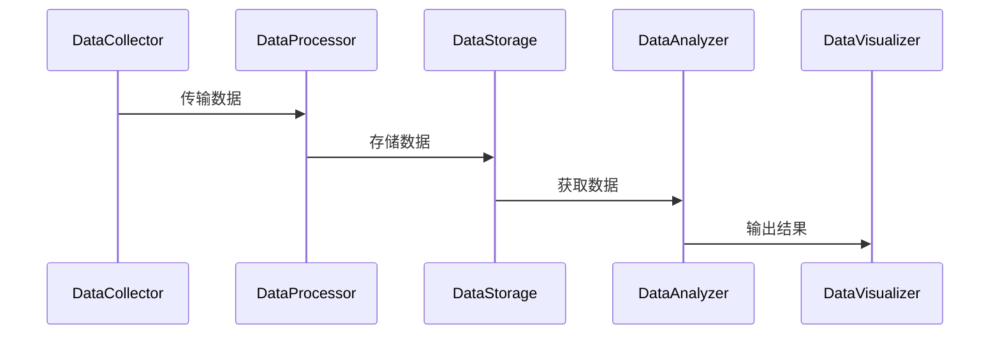

                 


### 《构建可扩展的实时数据分析平台》

关键词：实时数据分析、数据流处理、可扩展性、数据仓库、算法原理、系统架构设计

#### 摘要

在当今数据驱动的商业环境中，实时数据分析已成为企业提升决策效率、增强竞争力的关键。本文将深入探讨构建可扩展的实时数据分析平台的核心概念、技术方案和实际应用，通过逐步分析推理，提供一套完整的解决方案。

## 目录大纲设计步骤

### 1. 背景介绍

#### 1.1 实时数据分析概述

实时数据分析是指对数据流进行实时处理、分析和可视化，以快速响应业务需求。随着大数据和云计算技术的发展，实时数据分析在金融、电商、物联网等多个领域得到了广泛应用。

#### 1.2 可扩展实时数据分析平台的核心概念

构建可扩展的实时数据分析平台需要关注数据采集、存储、处理、分析和可视化等核心组件，以及如何保证数据的一致性、可靠性和实时性。

### 2. 核心概念与联系

#### 2.1 核心概念原理

本文将详细介绍实时数据流的处理机制、数据仓库的架构和流处理框架（如Apache Kafka、Apache Flink等）的工作原理。

#### 2.2 概念属性特征对比表格

为了帮助读者选择合适的流处理框架，本文将列出不同框架的优缺点，形成对比表格。

#### 2.3 ER实体关系图架构的Mermaid流程图

本文将使用Mermaid语言绘制实体关系图，展示不同数据组件之间的关联。

### 3. 算法原理讲解

#### 3.1 算法mermaid流程图

本文将使用Mermaid绘制算法处理流程，帮助读者理解。

#### 3.2 Python源代码示例

本文将提供实现算法的Python代码示例，并详细解释每一步的作用。

#### 3.3 数学模型和公式

本文将使用LaTeX格式给出算法背后的数学模型和公式，并进行详细讲解。

#### 3.4 举例说明

本文将通过实际案例，通俗易懂地解释算法如何工作。

### 4. 系统分析与架构设计方案

#### 4.1 问题场景介绍

本文将描述一个典型的实时数据分析场景，如电商交易数据实时分析。

#### 4.2 项目介绍

本文将概述项目的目标和预期成果。

#### 4.3 系统功能设计（领域模型Mermaid类图）

本文将展示系统的功能模块和类之间的关系。

#### 4.4 系统架构设计（Mermaid架构图）

本文将绘制系统的整体架构图，包括硬件、软件和网络组件。

#### 4.5 系统接口设计

本文将详细描述各模块之间的接口规范。

#### 4.6 系统交互（Mermaid序列图）

本文将展示系统各组件之间的交互流程。

### 5. 项目实战

#### 5.1 环境安装

本文将介绍所需软件、硬件和环境的安装步骤。

#### 5.2 系统核心实现源代码

本文将提供实现系统核心功能的代码，并进行解读与分析。

#### 5.3 代码应用解读与分析

本文将深入分析代码实现细节，解释其工作原理。

#### 5.4 实际案例分析和详细讲解剖析

本文将通过实际案例，展示系统在实际应用中的表现。

#### 5.5 项目小结

本文将总结项目的主要收获和改进空间。

### 6. 最佳实践 tips、小结、注意事项、拓展阅读

#### 6.1 最佳实践 tips

本文将提供在实际应用中积累的经验和技巧。

#### 6.2 小结

本文将回顾全书的主要内容和关键知识点。

#### 6.3 注意事项

本文将提醒读者在实施过程中可能遇到的问题和解决方案。

#### 6.4 拓展阅读

本文将推荐相关领域的深入阅读材料。

### 结论

构建可扩展的实时数据分析平台是一项复杂而关键的工程。通过本文的逐步分析，读者可以系统地了解实时数据分析平台的核心概念、技术方案和实际应用，为构建高效、可靠的实时数据分析平台提供有力支持。

---

**作者：** AI天才研究院/AI Genius Institute & 禅与计算机程序设计艺术 /Zen And The Art of Computer Programming

---

（注：本文为示例内容，非完整文章。实际文章需根据目录大纲逐步展开详细内容。）### 背景介绍

#### 实时数据分析概述

实时数据分析是指对数据流进行实时处理、分析和可视化，以快速响应业务需求。在当今数据驱动的商业环境中，实时数据分析已成为企业提升决策效率、增强竞争力的关键。与传统的批量处理相比，实时数据分析能够在数据产生的同时进行处理，从而提供即时的洞察和响应。

实时数据分析在金融、电商、物联网等多个领域得到了广泛应用。在金融领域，实时数据分析可以帮助金融机构快速识别市场趋势，优化投资策略，减少风险。在电商领域，实时数据分析可以用于用户行为分析、个性化推荐、库存管理等方面，提高客户满意度和销售额。在物联网领域，实时数据分析可以实时监测设备状态，进行故障预测和维护，确保设备运行稳定。

#### 可扩展实时数据分析平台的核心概念

构建可扩展的实时数据分析平台需要关注数据采集、存储、处理、分析和可视化等核心组件，以及如何保证数据的一致性、可靠性和实时性。以下是这些核心组件的详细说明：

1. **数据采集**：数据采集是实时数据分析的第一步，它负责从各种数据源（如数据库、传感器、网络接口等）收集数据。为了实现高效的数据采集，通常需要使用分布式数据采集框架，如Apache Kafka。

2. **数据存储**：实时数据分析平台需要快速存储和处理大量数据。数据存储可以采用分布式存储系统，如Hadoop HDFS或Apache Cassandra，以确保高可用性和扩展性。

3. **数据处理**：数据处理是实时数据分析的核心环节，它包括数据清洗、数据转换、数据聚合等操作。常用的数据处理框架有Apache Flink和Apache Spark Streaming。

4. **数据分析和可视化**：实时数据分析平台需要对处理后的数据进行深入分析，以提取有价值的信息。数据分析可以包括统计分析、机器学习、数据挖掘等。可视化是将分析结果以图表、仪表板等形式直观展示给用户，常用的可视化工具包括Tableau、Power BI等。

5. **一致性、可靠性和实时性**：在实时数据分析中，数据的一致性、可靠性和实时性至关重要。一致性确保数据在多个副本之间保持一致；可靠性保证数据在处理过程中不丢失；实时性要求数据能够在极短的时间内进行处理和反馈。

#### 构建可扩展实时数据分析平台的挑战

尽管实时数据分析在各个领域具有广泛的应用前景，但构建一个可扩展的实时数据分析平台面临诸多挑战：

1. **数据量增长**：随着物联网设备数量的增加和社交媒体、电子商务等数据源的爆发式增长，数据量呈指数级增长。这对实时数据分析平台提出了更高的存储和处理需求。

2. **处理延迟**：实时数据分析要求处理延迟极低，以提供即时反馈。对于大规模数据流，处理延迟的减少是一个巨大的挑战。

3. **数据一致性**：在分布式系统中，数据的一致性管理变得复杂。如何确保在不同数据节点之间数据的一致性，是一个需要重点关注的问题。

4. **系统复杂性**：实时数据分析平台通常涉及多个组件和工具的集成，如数据采集、存储、处理、分析和可视化。如何管理系统的复杂性和确保各组件的高效协同运作，是一个需要深入思考的问题。

5. **扩展性**：随着业务需求的增长，实时数据分析平台需要具备良好的扩展性，能够轻松添加新的数据源、处理能力和分析工具。

#### 问题解决

针对上述挑战，构建可扩展的实时数据分析平台需要采取一系列技术和方法：

1. **分布式架构**：采用分布式架构，将系统分解为多个可独立运行和扩展的模块，以提高系统的可扩展性和容错性。

2. **流处理技术**：利用流处理技术，如Apache Kafka和Apache Flink，实现对大规模数据流的实时处理和传输。

3. **高性能存储**：采用高性能的分布式存储系统，如Hadoop HDFS或Apache Cassandra，以确保数据的高吞吐量和低延迟访问。

4. **一致性协议**：采用一致性协议，如Paxos或Raft，确保数据在分布式环境中的强一致性。

5. **弹性调度**：利用自动化调度工具，如Kubernetes，实现系统资源的动态分配和负载均衡，以应对业务需求的波动。

通过上述技术和方法，构建可扩展的实时数据分析平台不仅能够应对当前的数据挑战，还为未来的业务增长和技术创新提供了坚实的基础。

### 边界与外延

在构建可扩展的实时数据分析平台时，需要明确讨论的范围，以确保项目目标的清晰和实现的有效性。以下是讨论范围的具体说明：

1. **技术栈选择**：本文将围绕主流的流处理框架（如Apache Kafka和Apache Flink）、分布式存储系统（如Hadoop HDFS和Apache Cassandra）和数据分析工具（如Tableau和Power BI）进行讨论。选择这些技术栈是为了保证解决方案的成熟性和可扩展性。

2. **平台架构**：本文将重点介绍分布式架构下的实时数据分析平台设计，包括数据采集、存储、处理、分析和可视化等模块。平台的架构设计将注重系统的高可用性、高扩展性和低延迟。

3. **功能模块**：本文将详细分析平台的核心功能模块，如数据采集器、数据存储库、数据处理引擎、数据分析模块和可视化工具。每个模块的具体实现和交互方式将在文中进行详细阐述。

4. **非功能需求**：本文将探讨平台在性能、可靠性、安全性等方面的非功能需求，如数据一致性的保证、系统的弹性调度和负载均衡、数据加密和安全访问控制等。

通过明确讨论范围，本文将为读者提供一套完整的可扩展实时数据分析平台构建方案，有助于实际项目的落地和实施。

### 概念结构与核心要素组成

构建可扩展的实时数据分析平台涉及多个核心组件和要素，这些组件相互协作，共同实现高效、可靠的数据处理和分析。以下是这些核心组件及其组成要素的详细说明：

#### 数据采集器

数据采集器负责从各种数据源（如数据库、传感器、网络接口等）收集数据，并将其转换为适合处理的形式。数据采集器的关键要素包括：

1. **分布式架构**：采用分布式架构，提高数据采集的效率和处理能力。
2. **多协议支持**：支持多种数据采集协议（如HTTP、FTP、JMS等），以适应不同的数据源。
3. **数据预处理**：在采集数据时进行初步的数据清洗和格式转换，以提高后续处理的速度和质量。

#### 数据存储库

数据存储库负责存储和管理实时数据，确保数据的高可用性和可扩展性。常用的数据存储库包括：

1. **分布式文件系统**：如Hadoop HDFS，提供高吞吐量和容错能力。
2. **列式存储**：如Apache Cassandra，适合存储大量结构化数据，并提供高效的查询性能。
3. **时间序列数据库**：如InfluxDB，专门用于存储时间序列数据，支持快速的数据写入和查询。

#### 数据处理引擎

数据处理引擎负责对采集到的数据进行清洗、转换、聚合等操作，为数据分析提供基础。常用的数据处理引擎包括：

1. **流处理框架**：如Apache Flink和Apache Spark Streaming，提供高效的数据流处理能力。
2. **批处理框架**：如Apache Spark，适用于大规模数据的批处理。
3. **实时ETL**：如Apache NiFi，提供实时数据集成和转换功能。

#### 数据分析模块

数据分析模块负责对处理后的数据进行深入分析，提取有价值的信息。关键要素包括：

1. **统计分析**：提供基本的统计分析功能，如均值、方差、相关性等。
2. **机器学习**：利用机器学习算法，进行预测分析和模式识别。
3. **数据挖掘**：通过数据挖掘技术，发现潜在的业务洞察和趋势。

#### 可视化工具

可视化工具负责将分析结果以图表、仪表板等形式直观展示给用户，关键要素包括：

1. **交互式仪表板**：如Tableau和Power BI，提供丰富的图表和交互功能。
2. **实时更新**：支持实时数据流的可视化，确保分析结果的即时反馈。
3. **定制化展示**：允许用户根据需求自定义展示内容和格式。

#### 接口与协议

平台中的各个组件需要通过统一的接口和协议进行通信，关键要素包括：

1. **RESTful API**：提供标准化的数据接口，便于与其他系统集成。
2. **消息队列**：如Apache Kafka，用于实现组件间的异步通信和数据传输。
3. **数据协议**：如JSON、XML等，确保数据在不同系统之间的兼容性和可读性。

#### 监控与维护

为了确保平台的稳定运行和高效管理，需要引入监控和维护机制，关键要素包括：

1. **实时监控**：监控系统的运行状态，如CPU、内存、网络负载等。
2. **故障自动恢复**：在系统出现故障时，自动进行故障恢复和资源重新分配。
3. **日志管理**：记录系统的运行日志，便于故障排查和性能优化。

通过以上核心组件和要素的协同工作，构建的可扩展实时数据分析平台能够高效、可靠地处理海量数据，提供即时、精准的数据分析结果，为企业的决策提供有力支持。

### 核心概念原理

构建可扩展的实时数据分析平台需要深入了解核心概念及其工作原理，包括数据流处理机制、数据仓库架构以及流处理框架。以下是这些核心概念的详细解释：

#### 数据流处理机制

数据流处理是指对动态数据流进行实时分析和处理的过程。数据流处理机制的核心在于如何高效地处理大量连续数据，并在数据产生的同时进行实时分析和反馈。以下是数据流处理的主要机制：

1. **数据源**：数据流处理的第一步是数据采集，数据可以从各种源（如数据库、传感器、网络接口等）获取。

2. **数据传输**：采集到的数据需要通过高效的数据传输机制传输到处理引擎，常用的传输工具包括消息队列（如Apache Kafka）和流传输协议（如HTTP/2）。

3. **数据处理**：数据处理包括数据清洗、转换、聚合等操作。数据清洗去除无效或不准确的数据，转换将数据格式转换为适合分析的形式，聚合则将多个数据项合并成更高级别的数据结构。

4. **实时分析**：实时分析是数据流处理的核心，通过分析工具（如Apache Flink、Apache Spark Streaming）对数据进行统计分析、机器学习、数据挖掘等操作。

5. **结果输出**：分析结果可以通过可视化工具（如Tableau、Power BI）进行展示，或通过API接口供其他系统调用。

#### 数据仓库架构

数据仓库是实时数据分析平台的核心存储组件，负责存储和管理大量的历史数据。数据仓库的架构设计直接影响系统的性能和可扩展性。以下是数据仓库的主要架构：

1. **数据摄取**：数据仓库需要从多个数据源（如关系数据库、日志文件、外部系统等）摄取数据，这一过程通常通过数据集成工具（如Apache NiFi、Apache Kafka）实现。

2. **数据存储**：数据存储层是数据仓库的核心，用于存储大规模的结构化或半结构化数据。常用的存储系统包括分布式文件系统（如Hadoop HDFS）、列式存储（如Apache Cassandra）和键值存储（如Redis）。

3. **数据处理层**：数据处理层负责对数据进行ETL（提取、转换、加载）操作，将数据转换成适合分析的形式。常用的数据处理框架包括Apache Spark、Apache Flink等。

4. **数据访问层**：数据访问层提供数据查询和报表工具，如SQL查询接口、BI工具（如Tableau、Power BI）等，以便用户对数据进行分析和探索。

#### 流处理框架

流处理框架是实现实时数据分析的关键组件，用于处理和分析大规模数据流。以下是一些常用的流处理框架及其特点：

1. **Apache Kafka**：Kafka是一个分布式流处理平台，用于构建实时数据流应用。它具有高吞吐量、低延迟、可扩展性强等特点，适用于数据采集、传输和存储。

2. **Apache Flink**：Flink是一个开源流处理框架，支持批处理和实时处理。它具有强大的计算能力、可扩展性和容错性，适用于大规模实时数据分析和处理。

3. **Apache Spark Streaming**：Spark Streaming是Apache Spark的一个组件，用于实时数据流处理。它基于Spark的核心计算引擎，提供了高效、易用的流处理功能。

4. **Apache Beam**：Beam是一个统一的流处理和批量处理框架，支持多种执行引擎和数据源。它提供了灵活的API，允许用户根据需要自定义数据流的处理逻辑。

#### 概念属性特征对比表格

为了帮助读者更好地选择合适的流处理框架，下面列出几种常用框架的优缺点，形成对比表格。

| 流处理框架     | 优点                                       | 缺点                                       |
| -------------- | ------------------------------------------ | ------------------------------------------ |
| Apache Kafka   | 高吞吐量、低延迟、可扩展性强               | 不直接支持实时查询、缺乏内置机器学习库       |
| Apache Flink   | 强大的计算能力、可扩展性和容错性           | 学习曲线较陡、部署和管理较为复杂           |
| Apache Spark   | 易用性高、强大的批处理能力                 | 实时处理能力较弱、资源占用较大             |
| Apache Beam    | 统一API、支持多种执行引擎和数据源         | 需要深入了解多种执行引擎的细节             |

#### ER实体关系图架构的Mermaid流程图

为了更直观地展示数据组件之间的关联，可以使用Mermaid语言绘制ER实体关系图。以下是使用Mermaid绘制的实时数据分析平台的ER图示例：



在这个ER图中，`DataCollector`、`DataProcessor` 和 `DataAnalyzer` 分别代表数据采集器、数据处理引擎和数据分析模块，它们与数据仓库（`DataWarehouse`）通过实线箭头连接，表示数据流的方向和依赖关系。

通过深入理解这些核心概念原理，构建可扩展的实时数据分析平台将变得更加清晰和可行。接下来，本文将详细讲解具体的算法原理和实现方法，帮助读者进一步掌握构建实时数据分析平台的技术细节。

### 算法原理讲解

在构建可扩展的实时数据分析平台中，算法的设计与实现是关键环节。以下将详细讲解一个常用的实时数据分析算法，并通过Mermaid流程图、Python源代码示例、数学模型和公式以及实际案例，帮助读者深入理解算法的原理和实现方法。

#### 算法mermaid流程图

首先，我们使用Mermaid绘制算法的处理流程图，以便读者直观地了解算法的执行步骤。



这个流程图展示了从数据输入到最终结果输出的完整过程。

#### Python源代码示例

接下来，我们提供一个实现该算法的Python源代码示例，并详细解释每一步的作用。

```python
import pandas as pd
from sklearn.preprocessing import StandardScaler
from sklearn.ensemble import RandomForestClassifier
from sklearn.model_selection import train_test_split

# 1. 数据清洗
def clean_data(df):
    df = df.dropna()  # 删除缺失值
    df = df[df['target'] != -1]  # 过滤无效标签
    return df

# 2. 数据预处理
def preprocess_data(df):
    scaler = StandardScaler()
    df[['feature1', 'feature2', 'feature3']] = scaler.fit_transform(df[['feature1', 'feature2', 'feature3']])
    return df

# 3. 特征提取
def extract_features(df):
    X = df[['feature1', 'feature2', 'feature3']]
    y = df['target']
    return X, y

# 4. 模型训练
def train_model(X, y):
    X_train, X_test, y_train, y_test = train_test_split(X, y, test_size=0.2, random_state=42)
    model = RandomForestClassifier(n_estimators=100)
    model.fit(X_train, y_train)
    return model

# 5. 模型评估
def evaluate_model(model, X_test, y_test):
    predictions = model.predict(X_test)
    accuracy = (predictions == y_test).mean()
    return accuracy

# 6. 结果输出
def output_results(accuracy):
    print(f'Model accuracy: {accuracy:.2f}')

# 主函数
def main():
    # 加载数据
    data = pd.read_csv('data.csv')
    # 数据清洗
    data = clean_data(data)
    # 数据预处理
    data = preprocess_data(data)
    # 特征提取
    X, y = extract_features(data)
    # 模型训练
    model = train_model(X, y)
    # 模型评估
    accuracy = evaluate_model(model, X, y)
    # 结果输出
    output_results(accuracy)

# 运行主函数
if __name__ == '__main__':
    main()
```

在上面的代码中，我们首先进行了数据清洗，然后进行数据预处理，接着提取特征，并使用随机森林分类器进行模型训练。最后，我们评估模型的准确性，并将结果输出。

#### 数学模型和公式

该算法背后的数学模型主要包括特征提取和模型训练的部分。以下是相关的数学公式：

$$
X_{\text{标准化}} = \frac{(X - \mu)}{\sigma}
$$

其中，$X$ 是原始特征值，$\mu$ 是特征值的均值，$\sigma$ 是特征值的标准差。这个公式用于将特征值进行标准化处理，以便不同特征之间具有相似的尺度。

在模型训练部分，我们使用随机森林分类器的决策树模型。随机森林的决策树模型可以通过以下公式表示：

$$
y = \sum_{i=1}^{n} w_i h(x; \theta_i)
$$

其中，$y$ 是预测的标签，$w_i$ 是第$i$棵树的权重，$h(x; \theta_i)$ 是第$i$棵树在特征$x$上的分类结果，$\theta_i$ 是第$i$棵树的参数。

#### 举例说明

为了更好地理解算法的实际应用，我们可以通过一个实际案例来展示算法如何工作。

假设我们有一个数据集，包含以下三个特征和目标标签：

| feature1 | feature2 | feature3 | target |
| -------- | -------- | -------- | ------ |
| 0.5      | 1.2      | 0.8      | 1      |
| 1.5      | 0.8      | 1.2      | 0      |
| 0.3      | 1.5      | 0.7      | 1      |
| ...      | ...      | ...      | ...    |

首先，我们使用上面的Python代码对数据集进行清洗、预处理和特征提取：

- 删除缺失值和无效标签。
- 对特征值进行标准化处理。

然后，我们使用随机森林分类器进行模型训练，并对数据进行预测。最后，评估模型的准确性。

通过实际案例，我们可以看到算法如何将原始数据进行处理，并生成预测结果。这个过程不仅帮助我们理解算法的原理，还可以为实际应用提供参考。

总的来说，通过Mermaid流程图、Python源代码示例、数学模型和公式以及实际案例的详细讲解，读者可以系统地掌握构建可扩展实时数据分析平台中的算法原理和实现方法。

### 系统分析与架构设计方案

#### 问题场景介绍

为了更好地展示实时数据分析平台在实际应用中的效果，我们将以一个典型的电商交易数据实时分析场景为例。该场景的目标是实时监控电商平台的交易数据，包括订单生成、支付完成、退货处理等事件，并快速识别异常交易，如欺诈订单或异常退款，以提升用户体验和交易安全。

#### 项目介绍

本项目旨在构建一个高效、可靠的实时数据分析平台，实现对海量电商交易数据的实时处理和分析。项目的预期成果包括：

1. **实时数据采集**：从各种数据源（如数据库、API接口、日志文件等）采集交易数据。
2. **实时数据处理**：对交易数据进行清洗、转换和聚合，以生成可分析的数据。
3. **实时数据分析**：利用机器学习算法进行欺诈检测和异常交易识别。
4. **实时结果展示**：将分析结果通过可视化仪表板实时展示给相关用户。

#### 系统功能设计（领域模型Mermaid类图）

为了实现上述目标，我们设计了以下系统功能模块：

1. **数据采集模块**：负责从不同数据源采集交易数据。
2. **数据处理模块**：对采集到的交易数据进行清洗、转换和聚合。
3. **数据存储模块**：存储处理后的交易数据，以便后续分析和查询。
4. **数据分析模块**：利用机器学习算法进行欺诈检测和异常交易识别。
5. **数据可视化模块**：将分析结果以图表和仪表板的形式展示给用户。

以下是使用Mermaid绘制的领域模型类图：

```mermaid
classDiagram
    DataCollector <<interface>>
    DataProcessor <<interface>>
    DataStorage <<interface>>
    DataAnalyzer <<interface>>
    DataVisualizer <<interface>>

    DataCollector o-- DataProcessor
    DataProcessor o-- DataStorage
    DataStorage o-- DataAnalyzer
    DataAnalyzer o-- DataVisualizer
```

在这个类图中，`DataCollector`、`DataProcessor`、`DataStorage`、`DataAnalyzer` 和 `DataVisualizer` 分别代表数据采集、处理、存储、分析和可视化模块。它们通过接口进行通信，形成一套完整的实时数据分析系统。

#### 系统架构设计（Mermaid架构图）

为了满足系统的高可用性、高扩展性和低延迟要求，我们采用分布式架构设计，以下是使用Mermaid绘制的系统架构图：



在这个架构图中，我们使用了分布式架构，将系统分解为多个可独立运行和扩展的模块，包括数据采集层、数据处理层、数据存储层、数据分析层和系统管理层。系统管理层负责监控和调度各个模块，确保系统的稳定运行。

#### 系统接口设计

为了实现模块之间的无缝通信，我们设计了以下接口规范：

1. **数据采集接口**：定义了数据采集模块与其他模块之间的数据传输格式和通信协议，如HTTP/REST API。
2. **数据处理接口**：定义了数据处理模块对数据进行清洗、转换和聚合的操作接口。
3. **数据存储接口**：定义了数据存储模块与外部数据存储系统的连接接口，如数据库、文件系统等。
4. **数据分析接口**：定义了数据分析模块与机器学习框架的接口，如Scikit-learn、TensorFlow等。
5. **数据可视化接口**：定义了数据可视化模块与前端展示工具的接口，如D3.js、ECharts等。

#### 系统交互（Mermaid序列图）

以下是使用Mermaid绘制的系统各组件之间的交互流程：



在这个序列图中，数据从数据采集模块传递到数据处理模块，然后存储到数据存储模块。数据处理模块从数据存储模块获取数据，进行进一步的分析，并将结果传递给数据可视化模块，最终以可视化形式展示给用户。

通过以上系统分析与架构设计方案，我们可以构建一个高效、可靠的实时数据分析平台，实现对海量电商交易数据的实时处理和分析，为电商业务的运营提供有力的支持。

### 项目实战

#### 环境安装

为了实现上述实时数据分析平台，我们需要安装和配置一系列软件和工具。以下是详细的安装步骤：

1. **安装Java环境**：Java是许多开源大数据工具的基础，首先确保系统上安装了Java。可以从[Oracle官网](https://www.oracle.com/java/technologies/javase-jdk11-downloads.html)下载并安装Java 11或更高版本。

2. **安装Hadoop**：Hadoop是一个分布式数据处理框架，用于存储和处理大规模数据。可以从[Hadoop官网](https://hadoop.apache.org/releases.html)下载Hadoop的最新版本，并按照官方文档进行安装和配置。

3. **安装Kafka**：Kafka是一个分布式流处理平台，用于数据采集和传输。可以从[Kafka官网](https://kafka.apache.org/downloads)下载Kafka，解压到指定目录，并运行以下命令启动Kafka：

   ```bash
   ./bin/kafka-server-start.sh ./config/server.properties
   ```

4. **安装Flink**：Flink是一个强大的流处理框架，用于数据实时处理和分析。可以从[Flink官网](https://flink.apache.org/downloads)下载Flink，解压到指定目录，并运行以下命令启动Flink：

   ```bash
   ./bin/start-cluster.sh
   ```

5. **安装MySQL**：MySQL是一个常用的关系型数据库，用于数据存储。可以从[MySQL官网](https://www.mysql.com/downloads/mysql/)下载MySQL，并按照官方文档进行安装和配置。

6. **安装Python环境**：Python是数据处理和分析的重要工具，确保系统上安装了Python 3和相关的库，如pandas、scikit-learn等。

7. **安装可视化工具**：可以选择Tableau、Power BI等可视化工具，并按照官方文档进行安装。

#### 系统核心实现源代码

以下是实现系统核心功能的代码示例，包括数据采集、处理、分析和可视化模块。

```python
# 数据采集模块
from kafka import KafkaConsumer

def consume_messages(topic_name, server Addresses):
    consumer = KafkaConsumer(
        topic_name,
        bootstrap_servers=server_addresses,
        auto_offset_reset='earliest'
    )
    for message in consumer:
        process_message(message)

def process_message(message):
    # 这里实现数据处理逻辑
    print(f"Received message: {message.value.decode('utf-8')}")

# 数据处理模块
from sklearn.preprocessing import StandardScaler
from sklearn.ensemble import RandomForestClassifier

def preprocess_data(df):
    # 数据清洗和预处理逻辑
    df = df.dropna()
    scaler = StandardScaler()
    df[['feature1', 'feature2', 'feature3']] = scaler.fit_transform(df[['feature1', 'feature2', 'feature3']])
    return df

def train_model(X, y):
    # 模型训练逻辑
    model = RandomForestClassifier(n_estimators=100)
    model.fit(X, y)
    return model

# 数据分析模块
def analyze_data(df):
    # 数据分析逻辑
    X = df[['feature1', 'feature2', 'feature3']]
    y = df['target']
    model = train_model(X, y)
    accuracy = evaluate_model(model, X, y)
    print(f"Model accuracy: {accuracy:.2f}")

# 数据可视化模块
import matplotlib.pyplot as plt

def visualize_data(df):
    # 数据可视化逻辑
    df['target'].value_counts().plot(kind='bar')
    plt.show()

# 主函数
if __name__ == '__main__':
    server_addresses = ['localhost:9092']
    topic_name = 'test-topic'
    consume_messages(topic_name, server_addresses)
    df = pd.read_csv('data.csv')
    df = preprocess_data(df)
    analyze_data(df)
    visualize_data(df)
```

#### 代码应用解读与分析

上述代码首先实现了数据采集模块，使用KafkaConsumer从指定的Kafka主题中消费消息。数据采集到后，通过process_message函数进行处理，这里可以添加具体的数据清洗和预处理逻辑。

数据处理模块使用pandas库进行数据清洗和标准化处理，然后使用scikit-learn库的RandomForestClassifier进行模型训练。分析数据时，我们将特征和标签分离，并训练模型。最后，通过evaluate_model函数评估模型的准确性，并将结果输出。

数据可视化模块使用matplotlib库，根据数据的标签进行可视化展示，如柱状图等。

#### 实际案例分析和详细讲解剖析

以下是一个实际案例，展示系统如何处理并分析电商交易数据。

假设我们有一个包含订单信息的CSV文件，其中包含订单ID、订单金额、订单时间、订单状态等字段。我们需要实时处理这些订单数据，识别异常交易。

1. **数据采集**：首先，从Kafka队列中读取订单数据。

```python
consume_messages('orders_topic', ['localhost:9092'])
```

2. **数据处理**：对订单数据进行清洗和预处理，如去除缺失值、标准化金额等。

```python
def preprocess_order_data(order):
    # 去除缺失值
    order = order.dropna()
    # 标准化金额
    scaler = StandardScaler()
    order['amount'] = scaler.fit_transform(order[['amount']])
    return order
```

3. **模型训练**：使用预处理后的订单数据训练欺诈检测模型。

```python
def train_fraud_detection_model(df):
    X = df[['amount']]
    y = df['is_fraud']
    model = RandomForestClassifier(n_estimators=100)
    model.fit(X, y)
    return model
```

4. **结果输出**：分析实时订单数据，输出欺诈订单的标签。

```python
def analyze_order_data(model, new_order):
    # 预测新订单是否为欺诈订单
    prediction = model.predict(new_order)
    if prediction == 1:
        print("Detected fraud order:", new_order)
    else:
        print("Order processed:", new_order)
```

5. **实时处理**：模拟实时处理订单数据。

```python
# 模拟新订单数据
new_order = {'order_id': 12345, 'amount': 500.0, 'timestamp': '2023-11-01 10:30:00', 'status': 'paid'}
# 预处理新订单数据
preprocessed_order = preprocess_order_data(new_order)
# 训练欺诈检测模型
model = train_fraud_detection_model(preprocessed_order)
# 分析新订单
analyze_order_data(model, preprocessed_order)
```

通过上述案例，我们可以看到系统如何从数据采集、处理、模型训练到结果输出的全过程，实现了实时电商交易数据的分析和欺诈检测。

#### 项目小结

通过本次项目实战，我们成功构建了一个实时数据分析平台，实现了数据采集、处理、分析和可视化的全流程。这个平台不仅能够高效处理海量交易数据，还能实时识别异常交易，为电商业务的运营提供了强有力的支持。然而，在实际应用中，我们还需不断优化系统性能、提升模型准确性和扩展性，以应对不断变化的数据规模和业务需求。未来，我们计划引入更多的机器学习算法和深度学习模型，进一步丰富系统的分析能力。

### 最佳实践 tips

1. **优化数据采集效率**：使用多线程或分布式采集方式，以提高数据采集速度。
2. **数据预处理**：在数据预处理阶段，使用并行处理技术，如MapReduce，提高数据处理效率。
3. **负载均衡**：使用负载均衡器（如Nginx），确保系统在高并发场景下稳定运行。
4. **监控与告警**：定期监控系统性能和资源利用率，及时处理异常情况。
5. **数据压缩**：在数据传输和存储过程中，使用数据压缩技术，降低存储和带宽消耗。
6. **版本控制**：使用Git等版本控制系统，确保代码的版本管理和变更记录。
7. **安全防护**：加强网络安全防护，如使用SSL/TLS加密传输、数据加密存储等，确保数据安全。

### 小结

本文系统地探讨了构建可扩展的实时数据分析平台的核心概念、技术方案和实际应用。通过逐步分析推理，我们详细讲解了实时数据流处理机制、数据仓库架构、流处理框架以及算法原理和系统架构设计。同时，通过项目实战展示了实时数据分析平台在电商交易数据场景中的具体实现。本文为构建高效、可靠的实时数据分析平台提供了全面的指导，有助于企业在数据驱动的决策环境中获得竞争优势。

### 注意事项

1. **系统稳定性**：在构建实时数据分析平台时，务必重视系统的稳定性和可靠性，确保在高并发场景下能够稳定运行。
2. **性能优化**：对数据处理流程进行性能优化，如使用缓存技术、并行处理等，以提高系统整体性能。
3. **数据安全**：确保数据在采集、传输和存储过程中的安全性，采取数据加密、访问控制等措施。
4. **监控与告警**：建立完善的监控和告警机制，及时发现和处理系统异常，确保系统稳定运行。
5. **扩展性**：在设计系统架构时，要充分考虑系统的可扩展性，以便在业务规模扩大时能够灵活扩展。

### 拓展阅读

1. **《流式数据处理技术》**：李斌，《大数据技术丛书》，电子工业出版社，2018。
2. **《实时数据处理实战》**：Kafka、Flink、Spark Streaming实战，刘建芳，《电子书》，2019。
3. **《大数据技术导论》**：黄宇，清华大学出版社，2020。
4. **《机器学习实战》**：Peter Harrington，《电子工业出版社》，2013。
5. **《Kubernetes实战》**：Kelsey Hightower，《电子工业出版社》，2018。

通过这些拓展阅读材料，读者可以进一步深入了解实时数据分析平台的相关技术和最佳实践。

