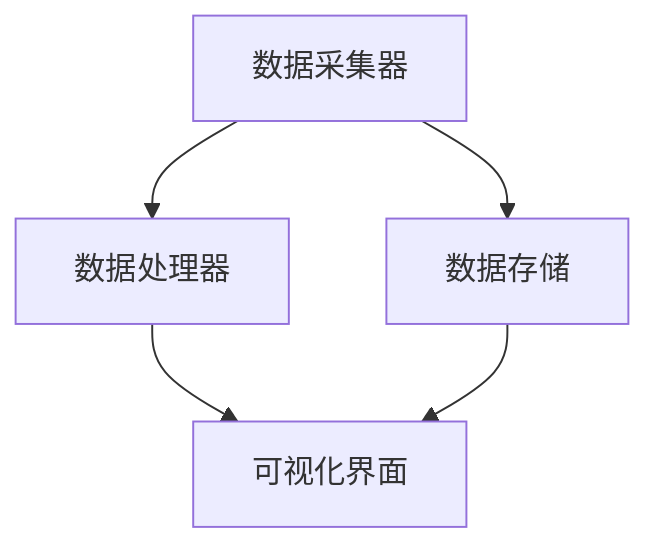
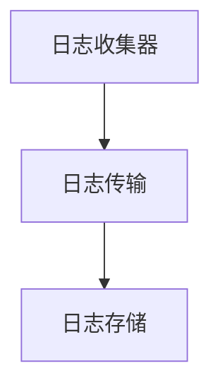

                 

### 第一部分：引言与背景

#### 第1章：引言

##### 1.1 问题背景

随着互联网和云计算的迅猛发展，企业的业务需求越来越复杂，单体应用已经难以满足快速变化的市场需求。为了应对这种挑战，微服务架构逐渐兴起，成为企业架构设计的新宠。微服务架构通过将应用程序分解为多个独立的小服务，每个服务可以独立部署、扩展和更新，大大提高了系统的灵活性和可维护性。

然而，微服务架构也带来了新的治理挑战。由于服务数量众多，服务之间需要高效地进行通信和协调，否则系统会陷入混乱，难以维护。微服务治理成为了一个关键问题，它关系到整个系统的稳定性、可靠性和可扩展性。

##### 1.2 问题描述

微服务治理的关键问题主要包括以下几个方面：

1. **服务注册与发现**：当服务启动或停止时，如何自动注册和发现服务，以便其他服务可以找到并调用它们。
2. **服务配置管理**：如何管理服务的配置信息，以便在不同环境下可以灵活地调整配置，而无需修改代码。
3. **服务熔断与限流**：如何防止某个服务因负载过高而崩溃，保护整个系统的稳定性。
4. **监控与日志管理**：如何监控服务的运行状态，以及如何收集、存储和分析日志信息，以便快速定位问题和优化系统。

微服务治理与传统服务治理有以下区别：

1. **粒度更细**：传统服务治理通常是针对整个应用或模块，而微服务治理则是针对每个独立的服务。
2. **动态性更高**：微服务治理需要支持服务的动态注册、发现和配置更新，而传统服务治理则相对静态。
3. **复杂性更高**：由于服务数量众多，微服务治理需要更加复杂的策略和算法来确保系统的稳定性。

##### 1.3 问题解决

微服务治理的基本概念包括以下几个方面：

1. **服务注册与发现**：服务注册是指服务启动时向注册中心注册自己的信息，服务发现是指服务消费者通过注册中心获取服务提供者的信息。
2. **服务配置管理**：配置管理是指将服务的配置信息集中管理，以便在不同环境下可以灵活地调整。
3. **服务熔断与限流**：熔断是指当某个服务出现问题时，自动切断与之相关的调用，以保护整个系统的稳定性。限流是指控制服务的调用频率，防止服务因负载过高而崩溃。
4. **监控与日志管理**：监控是指实时监控服务的运行状态，日志管理是指收集、存储和分析日志信息，以便快速定位问题和优化系统。

微服务治理的核心目标是确保系统的稳定性、可靠性和可扩展性，同时提高开发和运维的效率。

##### 1.4 边界与外延

微服务治理的范围包括以下几个方面：

1. **服务治理框架**：如Spring Cloud、Dubbo等。
2. **服务注册与发现**：如Eureka、ZooKeeper等。
3. **服务配置管理**：如Spring Cloud Config、Apollo等。
4. **服务熔断与限流**：如Hystrix、Resilience4j等。
5. **监控与日志管理**：如Prometheus、Grafana等。

微服务治理与其他IT领域的联系主要体现在以下几个方面：

1. **云计算**：微服务架构与云计算紧密结合，可以在云平台上灵活部署和扩展服务。
2. **容器化技术**：如Docker、Kubernetes等，可以大大简化服务的部署和运维。
3. **DevOps**：微服务治理是DevOps实践的重要组成部分，有助于实现开发和运维的紧密协作。

##### 1.5 概念结构与核心要素组成

微服务架构的核心组成部分包括以下几个方面：

1. **服务注册与发现**：服务注册中心、服务提供者、服务消费者。
2. **服务配置管理**：配置中心、配置消费者。
3. **服务熔断与限流**：熔断器、限流器。
4. **监控与日志管理**：监控系统、日志收集系统。

通过上述概念结构与核心要素组成，我们可以构建一个可扩展的微服务治理平台，为企业的分布式系统提供强大的治理能力。

---

通过本部分的介绍，我们了解了微服务架构的背景、问题描述、问题解决方法以及微服务治理的范围和核心要素。接下来，我们将进一步探讨微服务架构的核心概念与原理，帮助读者更好地理解微服务治理的实质。请读者继续关注下一部分的内容。

---

### 第2章：微服务架构概述

在了解了微服务治理的背景和重要性之后，我们将深入探讨微服务架构的基本概念、特点以及其优势和挑战。通过这一章节，读者将全面理解微服务架构的核心要素，为后续内容的进一步学习打下坚实的基础。

#### 2.1 微服务架构的定义与特点

##### 2.1.1 微服务架构的定义

微服务架构（Microservices Architecture）是一种软件开发和部署的架构风格，它通过将应用程序分解为多个独立、自治的小服务来实现系统的解耦和高度可扩展性。每个服务都专注于完成一个特定的功能，通过轻量级的通信机制（如HTTP/HTTPS、RESTful API、消息队列等）进行交互。

##### 2.1.2 微服务架构的特点

1. **服务独立性**：每个服务都是独立的，可以单独部署、扩展和更新，不会影响到其他服务。
2. **小型化**：每个服务都很小，通常只包含一个业务功能，这使得服务更容易理解和维护。
3. **水平扩展**：可以通过增加服务实例来水平扩展系统的处理能力，提高系统的可扩展性。
4. **动态配置**：服务可以通过配置中心动态加载和更新配置，适应不同的运行环境。
5. **分布式通信**：服务之间通过分布式通信机制进行通信，如HTTP/HTTPS、消息队列等。
6. **自治性**：每个服务都有自己独立的数据库，可以独立管理和维护数据。
7. **无状态**：服务通常是状态less的，即服务不保存客户端的会话信息，每次请求都会独立处理。

#### 2.2 微服务架构的优势与挑战

##### 2.2.1 优势

1. **高可扩展性**：通过水平扩展单个服务，可以灵活地调整系统的处理能力。
2. **高灵活性**：服务的独立性使得开发团队可以独立开发、测试和部署，提高了开发效率。
3. **高可维护性**：小型化的服务更容易管理和维护，故障影响范围较小。
4. **快速迭代**：服务可以独立部署和更新，支持快速迭代和持续集成。
5. **高容错性**：单个服务的故障不会影响整个系统，提高了系统的容错性。
6. **技术多样性**：不同的服务可以使用不同的技术栈，支持不同的开发语言和框架。

##### 2.2.2 挑战

1. **复杂性**：微服务架构引入了更多的组件和交互，系统的复杂性增加了，维护成本也随之提高。
2. **分布式通信**：服务之间的分布式通信可能导致性能下降和通信失败，增加了系统的复杂性。
3. **服务发现**：如何高效地发现和注册服务是一个挑战，尤其是在服务数量庞大的情况下。
4. **配置管理**：如何在多个环境中管理配置信息，确保配置的一致性和可靠性是一个挑战。
5. **数据一致性**：分布式系统中的数据一致性管理是一个复杂的问题，需要考虑分布式事务和最终一致性。
6. **监控和日志**：监控和日志管理需要处理大量的数据，如何有效地收集、存储和分析日志信息是一个挑战。

#### 2.3 微服务架构的演进历程

##### 2.3.1 起源

微服务架构的概念最早由马丁·福勒（Martin Fowler）在2014年提出。他将其描述为一种围绕业务能力构建的软件架构风格，强调服务的独立性和自治性。

##### 2.3.2 发展趋势

随着云计算和容器化技术的发展，微服务架构得到了广泛的应用和推广。目前，微服务架构已经成为企业架构设计的主流选择，特别是在需要高灵活性和高扩展性的场景中。

1. **云原生**：云原生（Cloud Native）是指利用云计算环境，通过容器化、服务网格等新兴技术，实现应用的弹性扩展和自动化部署。云原生与微服务架构密切相关，共同推动了软件架构的变革。
2. **服务网格**：服务网格（Service Mesh）是一种新型的服务架构模式，它通过独立的通信基础设施来管理服务之间的通信，简化了分布式系统的复杂性，提供了更好的性能和安全性。
3. **云原生平台**：如Kubernetes、Istio等云原生平台，提供了丰富的工具和组件，支持微服务的部署、管理和监控，进一步推动了微服务架构的发展。

通过本章节的讨论，我们深入了解了微服务架构的定义、特点、优势和挑战，以及其演进历程。接下来，我们将进一步探讨微服务治理中的关键技术，如服务注册与发现、服务配置管理、服务熔断与限流等。敬请期待下一章节的内容。

---

微服务架构作为现代软件开发的基石，具有显著的优点，但也带来了新的挑战。在下一部分中，我们将详细探讨微服务治理的技术实现，包括服务注册与发现、服务配置管理、服务熔断与限流等关键技术。请读者继续关注，一起探索微服务治理的深度和广度。

---

### 第三部分：微服务治理技术

在了解微服务架构的基本概念和优势之后，我们将深入探讨微服务治理的关键技术。这一部分将详细讲解服务注册与发现、服务配置管理、服务熔断与限流等核心技术，并介绍一些常见的技术工具。通过这一章节，读者将全面掌握微服务治理的实践方法，为构建可扩展的微服务治理平台奠定基础。

#### 第3章：服务注册与发现

##### 3.1 服务注册的概念与作用

服务注册（Service Registration）是指将服务实例的信息登记到注册中心的过程。当服务启动时，它会向注册中心注册自己的地址、端口、健康状态等信息。服务注册的作用如下：

1. **服务发现**：服务消费者可以通过注册中心查找服务实例的信息，从而实现服务调用。
2. **负载均衡**：通过注册中心，可以实现服务实例的动态负载均衡，提高系统的性能和可靠性。
3. **健康检查**：注册中心可以定期检查服务的健康状态，当服务出现问题时，可以及时将其从注册列表中移除，防止故障扩散。
4. **故障转移**：在服务不可用时，注册中心可以自动将请求路由到其他健康的服务实例。

##### 3.2 服务发现的机制与策略

服务发现（Service Discovery）是指服务消费者如何查找和获取服务实例的过程。常见的服务发现机制和策略包括：

1. **客户端发现**：客户端在启动时从注册中心获取服务实例列表，并在运行时根据负载均衡策略选择实例进行调用。
2. **服务器端发现**：服务器端从注册中心获取服务实例列表，并在请求到达时选择实例进行调用。
3. **基于轮询的服务发现**：客户端定期轮询注册中心，获取最新的服务实例列表。
4. **基于目录的服务发现**：客户端通过服务目录查找服务实例，服务目录可以是注册中心或独立的服务目录服务。
5. **基于订阅的服务发现**：客户端订阅服务实例的变化，当实例发生变化时，注册中心会通知客户端。

##### 3.3 常见服务注册与发现工具

1. **Eureka**

   Eureka是Spring Cloud组件之一，提供服务注册与发现功能。Eureka包括两个组件：Eureka Server（注册中心）和Eureka Client（服务消费者）。Eureka Server维护一个服务注册表，Eureka Client通过拉取或推送方式获取服务实例信息。

2. **ZooKeeper**

   ZooKeeper是一个高性能的分布式协调服务，提供服务注册与发现功能。ZooKeeper通过ZAB（ZooKeeper Atomic Broadcast）协议保证一致性，支持高可用和负载均衡。

3. **etcd**

   etcd是一个分布式键值存储，提供服务注册与发现功能。etcd使用Raft算法保证一致性，具有高可用性和性能优势。etcd通过RESTful API提供数据读写接口，支持服务实例的动态注册与发现。

#### 第4章：服务配置管理

##### 4.1 服务配置管理的概念与作用

服务配置管理（Service Configuration Management）是指管理服务的配置信息，包括服务地址、端口、参数等。服务配置管理的作用如下：

1. **动态配置**：服务可以在运行时动态加载和更新配置信息，适应不同的环境和需求。
2. **环境隔离**：可以通过不同的配置文件或配置中心，实现不同环境的配置隔离，避免配置冲突。
3. **配置版本控制**：配置的版本控制可以记录配置的变更历史，方便管理和回滚。
4. **自动化部署**：通过配置管理，可以自动化地部署和更新服务的配置信息，减少人工干预。

##### 4.2 服务配置管理的主要任务

1. **配置信息的收集**：从不同来源（如配置文件、数据库、外部系统等）收集配置信息。
2. **配置信息的存储**：将收集到的配置信息存储在配置中心，以便服务实例查询和加载。
3. **配置信息的动态更新**：支持配置信息的实时更新，确保服务的配置始终是最新的。

##### 4.3 常见分布式配置中心工具

1. **Spring Cloud Config**

   Spring Cloud Config是Spring Cloud组件之一，提供分布式配置中心功能。它支持通过Git或本地文件系统存储配置信息，通过Spring Boot的配置机制加载配置。

2. **Apollo**

   Apollo是阿里巴巴开源的分布式配置中心，支持通过Dubbo、HTTP、SDK等方式获取配置信息。Apollo提供配置的版本控制、灰度发布、配置监听等功能。

3. **Nacos**

   Nacos是阿里巴巴开源的服务发现和配置管理平台，提供服务注册与发现、配置管理、动态配置推送等功能。Nacos支持多种协议，如Dubbo、HTTP、gRPC等，支持配置的动态更新和版本控制。

#### 第5章：服务熔断与限流

##### 5.1 服务熔断原理与实现

服务熔断（Service熔断）是一种保护系统稳定性的机制，当某个服务出现问题时，自动切断与之相关的调用，防止故障扩散。服务熔断的原理和实现如下：

1. **原理**：

   - **熔断状态**：服务熔断器有三种状态：闭合（Closed）、打开（Open）和半开（Half-Open）。
   - **闭合状态**：服务正常，没有触发熔断。
   - **打开状态**：服务异常，触发熔断，切断调用。
   - **半开状态**：从打开状态进入半开状态，允许一次调用，若成功则恢复闭合状态，若失败则重新进入打开状态。

2. **实现**：

   - **阈值设置**：根据调用次数、失败率等指标设置熔断阈值。
   - **统计指标**：记录每次调用的成功与否，计算失败率。
   - **熔断规则**：当统计指标达到阈值时，触发熔断。

常见的服务熔断工具包括：

1. **Hystrix**

   Hystrix是Netflix开源的服务熔断和断路器库，提供简单的接口和强大的功能。Hystrix支持请求缓存、线程池隔离、fallback机制等。

2. **Resilience4j**

   Resilience4j是一个开源的弹性设计库，提供服务熔断、限流、超时等特性。Resilience4j轻量级，易于集成和使用。

##### 5.2 服务限流技术

服务限流（Service Throttling）是一种控制服务调用频率的机制，防止服务因请求过多而崩溃。服务限流的实现如下：

1. **固定窗口限流**：在固定的时间窗口内（如1秒），限制请求的次数。

2. **滑动窗口限流**：根据时间窗口的滑动，动态计算请求次数。

3. **令牌桶限流**：使用令牌桶算法，控制请求的速率。

常见的服务限流工具包括：

1. **Redisson**

   Redisson是一个基于Redis的分布式工具集，提供服务限流功能。Redisson使用Redis的原子操作实现令牌桶算法，具有高可用性和性能优势。

2. **Guava RateLimiter**

   Guava RateLimiter是Google开源的限流库，提供固定窗口限流和滑动窗口限流的实现。RateLimiter基于令牌桶算法，具有简单易用的接口。

通过本部分的介绍，我们详细了解了服务注册与发现、服务配置管理、服务熔断与限流等微服务治理的关键技术。这些技术为构建可扩展的微服务治理平台提供了强有力的支持。在下一部分中，我们将进一步探讨监控与日志管理技术，以提升系统的可观测性和稳定性。敬请期待！

---

在了解了服务注册与发现、服务配置管理、服务熔断与限流等关键技术之后，监控与日志管理成为了确保微服务治理平台稳定运行的关键环节。通过这一章节，我们将深入探讨监控与日志管理的核心概念、实现方法以及常见工具，帮助读者构建全面的监控与日志管理体系。

#### 第8章：微服务监控体系

##### 8.1 微服务监控的意义与目标

微服务监控是确保微服务治理平台稳定运行的关键环节。监控的意义在于：

1. **故障检测与报警**：实时检测服务的运行状态，当服务出现问题时及时报警。
2. **性能优化**：监控服务的性能指标，发现性能瓶颈，进行优化。
3. **容量规划**：根据监控数据，预测服务负载，进行容量规划和资源调配。

监控的目标是：

1. **快速响应**：在服务出现故障时，能够迅速定位问题并恢复。
2. **全面覆盖**：对整个微服务架构进行全面的监控，包括服务实例、依赖系统等。
3. **数据可视化**：将监控数据以图表和仪表板的形式展示，便于分析和决策。

##### 8.2 微服务监控的架构与组件

微服务监控架构通常包括以下几个组件：

1. **数据采集器**：负责从各个服务实例中收集性能数据和日志信息。
2. **数据存储**：用于存储采集到的监控数据，常见的存储系统包括时序数据库、日志存储系统等。
3. **数据处理器**：对采集到的数据进行处理，如指标计算、数据聚合等。
4. **可视化界面**：将处理后的监控数据以图表和仪表板的形式展示，提供直观的监控视图。

常见微服务监控架构如图所示：



##### 8.3 常见微服务监控工具

1. **Prometheus**

   Prometheus是一个开源的监控解决方案，由SoundCloud开发。它使用拉模式采集数据，支持多种数据源，如HTTP、JMX、metrics等。Prometheus具有高度可扩展性和灵活的查询语言，可以自定义告警规则。

2. **Grafana**

   Grafana是一个开源的数据监控和分析平台，支持多种数据源，如Prometheus、InfluxDB、MySQL等。Grafana提供丰富的可视化仪表板，可以自定义图表和告警，支持告警通知和集成。

3. **ELK Stack**

   ELK Stack是由Elasticsearch、Logstash和Kibana组成的日志管理平台。Elasticsearch提供强大的全文搜索和数据分析功能，Logstash用于日志收集和解析，Kibana提供日志数据的可视化展示。ELK Stack支持大规模日志数据的处理和分析，适用于复杂的应用监控场景。

#### 第9章：日志管理策略与工具

##### 9.1 日志管理的概念与作用

日志管理是指对系统运行过程中的日志信息进行收集、存储、分析和处理的过程。日志管理的作用如下：

1. **故障排查**：通过分析日志信息，可以快速定位问题和故障。
2. **性能优化**：日志记录了服务的运行状态和性能指标，有助于进行性能分析和优化。
3. **安全审计**：日志记录了系统的操作和访问信息，可用于安全审计和异常检测。
4. **监控和报警**：通过日志分析，可以设置监控指标和告警规则，实现实时监控和自动报警。

##### 9.2 日志收集与存储

日志收集与存储是日志管理的重要环节，主要包括以下几个方面：

1. **日志收集器**：负责从各个服务实例中收集日志信息，如Logstash、Fluentd等。
2. **日志传输**：将收集到的日志信息传输到集中存储，如Logstash的ELK Stack架构。
3. **日志存储**：将日志信息存储在高效、可靠的存储系统中，如Elasticsearch、MySQL等。

常见日志收集与存储策略如图所示：



##### 9.3 常见日志管理工具

1. **Logstash**

   Logstash是Elastic Stack中的日志收集工具，可以灵活地接收和解析不同格式的日志，并将其传输到Elasticsearch或文件存储等目的地。Logstash支持多种输入输出插件，具有高度的可扩展性。

2. **Fluentd**

   Fluentd是另一个开源的日志收集工具，与Logstash类似，可以接收和解析日志，并将其传输到Elasticsearch、Kafka等系统。Fluentd具有简单易用的接口，适用于大规模日志收集场景。

3. **Log4j2**

   Log4j2是Apache开源的日志框架，用于记录应用运行过程中的日志信息。Log4j2支持丰富的日志格式和输出方式，可以通过配置文件灵活地定义日志记录规则。

通过本章节的讨论，我们全面了解了微服务监控和日志管理的核心概念、架构和工具。这些技术为构建可扩展的微服务治理平台提供了坚实的支持，有助于确保系统的稳定性和可维护性。在下一部分中，我们将探讨微服务治理平台搭建的实战案例，通过具体实施来进一步巩固所学内容。敬请期待！

---

在了解了微服务监控和日志管理的关键技术和最佳实践之后，实战案例成为检验理论知识的最佳途径。在本部分中，我们将通过一个微服务治理平台的搭建实战，详细展示从环境准备到系统部署、核心功能实现和实际案例分析的全过程。通过这一实战案例，读者将更加深刻地理解微服务治理平台的构建方法和关键要点。

#### 第10章：微服务治理平台搭建

##### 10.1 平台搭建的目标与规划

搭建微服务治理平台的目标是：

1. **实现服务注册与发现**：确保服务实例可以动态注册和发现，方便其他服务进行调用。
2. **实现服务配置管理**：集中管理服务的配置信息，支持动态更新和版本控制。
3. **实现服务熔断与限流**：提供保护措施，防止服务因负载过高而崩溃。
4. **实现监控与日志管理**：实时监控服务状态，收集和分析日志信息，提升系统的可观测性。

平台搭建的规划包括以下步骤：

1. **需求分析与设计**：明确平台的功能需求和技术选型。
2. **环境准备**：搭建开发环境，包括操作系统、中间件等。
3. **代码实现**：编写和实现各个服务的代码。
4. **集成测试**：对平台进行集成测试，确保功能正常。
5. **部署上线**：将平台部署到生产环境，进行实际运行。

##### 10.2 平台搭建的技术选型

技术选型的原则如下：

1. **高可用性**：选择稳定可靠的技术和中间件，确保平台的高可用性。
2. **易扩展性**：选择可扩展性和灵活性强的技术，以便未来功能扩展和升级。
3. **性能优化**：选择性能优秀的技术和中间件，保证平台的性能和响应速度。
4. **社区支持**：选择有良好社区支持和文档的技术，便于学习和维护。

根据上述原则，平台搭建的技术选型如下：

1. **服务注册与发现**：使用Eureka作为服务注册与发现组件。
2. **服务配置管理**：使用Spring Cloud Config作为分布式配置中心。
3. **服务熔断与限流**：使用Hystrix作为服务熔断和断路器库，使用Redis作为限流工具。
4. **监控与日志管理**：使用Prometheus和Grafana进行监控，使用Logstash进行日志收集和管理。

##### 10.3 平台搭建的步骤与实现

1. **需求分析与设计**

   根据平台搭建的目标，设计平台的功能模块，包括服务注册与发现模块、配置管理模块、熔断与限流模块、监控与日志管理模块。

2. **环境准备**

   搭建开发环境，包括操作系统（如Linux）、JDK、Maven等。配置Eureka服务注册中心、配置中心（Config Server）、监控服务（Prometheus）、日志收集器（Logstash）等。

3. **代码实现**

   编写各个服务的代码，实现服务注册与发现、配置管理、熔断与限流、监控与日志管理等功能。以下是一个服务注册与发现模块的代码示例：

   ```java
   @Service
   public class ServiceRegistry {
   
       @Value("${server.port}")
       private int port;
   
       @Value("${eureka.client.serviceUrl.defaultZone}")
       private String eurekaUrl;
   
       @PostConstruct
       public void registerService() {
           String serviceName = "service-registry";
           String serviceUrl = "http://" + serviceName + ":" + port + "/";
           InstanceInfo instance = InstanceInfo.Builder.newBuilder()
                   .setAppName(serviceName)
                   .setIpAddr("127.0.0.1")
                   .setPort(port)
                   .setUrl(new URL(serviceUrl))
                   .setVipAddress(serviceName)
                   .setStatus(InstanceInfo.InstanceStatus.UP)
                   .build();
           discoveryClient.registerInstance(instance);
       }
   
   }
   ```

4. **集成测试**

   对平台进行集成测试，确保各个模块的功能正常。可以使用JUnit、Mockito等工具编写测试用例，模拟各种场景进行测试。

5. **部署上线**

   将平台部署到生产环境，包括服务注册与发现、配置中心、监控服务、日志收集器等。可以使用Docker容器化技术，实现快速部署和部署迁移。

##### 10.4 平台搭建的实现

以下是一个平台搭建的具体实现过程：

1. **搭建Eureka服务注册中心**

   使用Spring Boot搭建Eureka服务注册中心，配置Eureka Server的启动参数，启动服务。

2. **搭建配置中心（Config Server）**

   使用Spring Cloud Config搭建配置中心，配置Git或本地文件系统作为配置存储，启动服务。

3. **搭建监控服务（Prometheus）**

   使用Prometheus搭建监控服务，配置目标服务地址，启动服务。

4. **搭建日志收集器（Logstash）**

   使用Logstash搭建日志收集器，配置日志输入输出插件，启动服务。

5. **部署服务**

   将各个服务部署到生产环境，确保服务正常运行。

通过以上步骤，我们可以搭建一个完整的微服务治理平台。接下来，我们将通过一个实际案例，展示平台的运行情况和效果。

#### 第11章：实战案例分析

##### 11.1 案例背景与需求

假设我们有一个电商系统，包括商品服务、订单服务、支付服务等多个微服务。需求如下：

1. **服务注册与发现**：确保各个服务实例可以动态注册和发现，方便其他服务进行调用。
2. **服务配置管理**：集中管理服务的配置信息，包括数据库地址、端口、日志级别等。
3. **服务熔断与限流**：防止支付服务因请求过多而崩溃，确保系统的稳定性。
4. **监控与日志管理**：实时监控服务状态，收集和分析日志信息，提升系统的可观测性。

##### 11.2 案例实现与解读

以下是一个电商系统中的支付服务实例，展示了服务注册与发现、配置管理、熔断与限流等功能的实现：

1. **服务注册与发现**

   支付服务启动时，向Eureka服务注册中心注册自身的信息：

   ```java
   @Service
   public class PaymentService {
   
       @Value("${eureka.client.serviceUrl.defaultZone}")
       private String eurekaUrl;
   
       @PostConstruct
       public void registerService() {
           String serviceName = "payment-service";
           String serviceUrl = "http://" + serviceName + ":" + port + "/";
           InstanceInfo instance = InstanceInfo.Builder.newBuilder()
                   .setAppName(serviceName)
                   .setIpAddr("127.0.0.1")
                   .setPort(port)
                   .setUrl(new URL(serviceUrl))
                   .setVipAddress(serviceName)
                   .setStatus(InstanceInfo.InstanceStatus.UP)
                   .build();
           discoveryClient.registerInstance(instance);
       }
   
   }
   ```

   支付服务消费者从Eureka服务注册中心获取支付服务实例列表，进行调用：

   ```java
   @RestTemplate
   private RestTemplate restTemplate;
   
   public PaymentResponse pay(PaymentRequest request) {
       String url = "http://payment-service/pay";
       return restTemplate.postForObject(url, request, PaymentResponse.class);
   }
   ```

2. **服务配置管理**

   使用Spring Cloud Config搭建配置中心，将支付服务的配置信息存储在Git仓库中：

   ```yaml
   payment:
     database:
       url: jdbc:mysql://localhost:3306/payment
       username: root
       password: root
     log:
       level: INFO
   ```

   支付服务从配置中心动态加载配置信息：

   ```java
   @Value("${payment.database.url}")
   private String databaseUrl;
   
   @Value("${payment.log.level}")
   private String logLevel;
   ```

3. **服务熔断与限流**

   使用Hystrix搭建服务熔断器，当支付服务失败率达到一定阈值时，自动熔断：

   ```java
   @HystrixCommand(fallbackMethod = "fallbackPay")
   public PaymentResponse pay(PaymentRequest request) {
       // 支付逻辑
       return new PaymentResponse("success");
   }
   
   public PaymentResponse fallbackPay(PaymentRequest request) {
       // 熔断时的默认处理
       return new PaymentResponse("failure");
   }
   ```

   使用Redisson搭建服务限流器，限制支付服务的调用频率：

   ```java
   @Bean
   public RedissonClient redissonClient() {
       Config config = new Config();
       config.useSingleServer().setAddress("redis://localhost:6379").setPassword("password");
       return (RedissonClient) Redisson.create(config);
   }
   
   @Autowired
   private RedissonClient redissonClient;
   
   public Boolean isAllowed(String key) {
       RedissonLock lock = redissonClient.getLock(key);
       return lock.tryLock(1000, 3000);
   }
   ```

##### 11.3 案例总结与启示

通过本案例，我们实现了电商系统中的支付服务注册与发现、配置管理、熔断与限流等功能。以下是一些总结和启示：

1. **服务注册与发现**：使用Eureka实现服务注册与发现，确保服务实例可以动态注册和发现，提高了系统的灵活性和可维护性。
2. **服务配置管理**：使用Spring Cloud Config实现配置管理，支持动态更新和版本控制，方便了环境隔离和配置管理。
3. **服务熔断与限流**：使用Hystrix和Redisson实现服务熔断与限流，提高了系统的稳定性和可靠性，防止了服务过载和崩溃。
4. **监控与日志管理**：使用Prometheus和Grafana实现监控，使用Logstash实现日志收集和管理，提升了系统的可观测性和故障排查能力。

通过本案例，我们可以看到，微服务治理平台在电商系统中的应用，不仅提高了系统的稳定性和可靠性，还提升了开发和运维的效率。未来，随着业务的不断发展和需求的变化，微服务治理平台将继续发挥重要作用。

---

在本章节中，我们通过一个实际的电商系统案例，详细展示了微服务治理平台的搭建过程和关键实现。通过这一案例，读者可以更加深入地理解微服务治理平台的构建方法、核心功能和最佳实践。在下一部分中，我们将总结本文的主要内容和未来展望，帮助读者巩固所学知识，并展望微服务治理的发展趋势。敬请期待！

---

### 第八部分：总结与展望

#### 第12章：总结与展望

在本文中，我们系统地介绍了微服务治理平台的核心概念、技术实现和实战案例。通过详细的分析和讨论，读者可以全面了解微服务治理的重要性、挑战和解决方案。

**总结：**

1. **微服务治理的核心概念**：包括服务注册与发现、服务配置管理、服务熔断与限流、监控与日志管理。
2. **微服务治理的优势与挑战**：分析了微服务架构在灵活性和可维护性方面的优势，以及复杂性、分布式通信等问题。
3. **微服务治理的技术实现**：介绍了Eureka、ZooKeeper、etcd等服务注册与发现工具，Spring Cloud Config、Apollo、Nacos等配置管理工具，Hystrix、Resilience4j等服务熔断与限流工具，以及Prometheus、Grafana、ELK Stack等监控与日志管理工具。
4. **实战案例**：通过一个电商系统案例，展示了微服务治理平台的搭建过程、核心功能实现和最佳实践。

**展望：**

1. **微服务治理的未来发展趋势**：随着云计算和容器化技术的发展，微服务治理将继续演进。服务网格、云原生架构等新兴技术将进一步简化微服务架构的复杂性，提高系统的可扩展性和可靠性。
2. **面临的挑战与机遇**：微服务治理面临复杂性和运维挑战，但随着技术的发展，这些挑战将逐渐得到解决。微服务治理的机遇在于其灵活性和可扩展性，可以为企业带来更高的业务敏捷性和创新能力。
3. **最佳实践**：在实际项目中，遵循最佳实践是确保微服务治理平台稳定运行的关键。包括合理设计服务边界、优化配置管理、建立完善的监控和日志管理体系等。

通过本文的讨论，我们希望读者能够对微服务治理有更深入的理解，并能够将其应用于实际项目中。在未来的发展中，微服务治理将继续发挥重要作用，推动软件架构的革新和业务的发展。

---

在本章节中，我们对微服务治理的核心概念、技术实现和实战案例进行了全面的总结和展望。希望通过本文的介绍，读者能够对微服务治理有更深入的理解，并在实际项目中取得良好的应用效果。未来，随着技术的发展，微服务治理将继续推动软件架构的创新和业务的发展。让我们共同期待这一美好的未来！作者：AI天才研究院/AI Genius Institute & 禅与计算机程序设计艺术 /Zen And The Art of Computer Programming。

