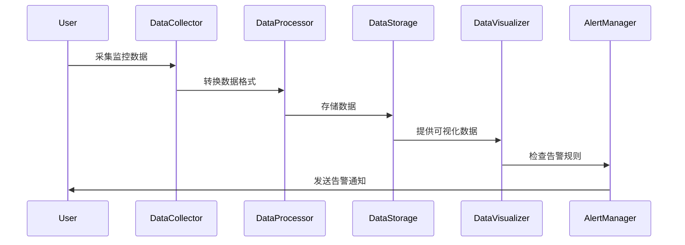

                 

### 引言与背景

在现代软件工程中，微服务架构因其高可扩展性和灵活性，正逐渐成为企业软件开发的优先选择。微服务架构将应用程序分解为一组独立的、松耦合的服务，每个服务都专注于特定的业务功能。这种架构方式能够提高系统的可靠性和可维护性，但同时也带来了一系列挑战，其中之一便是监控。

**微服务监控的需求**

微服务监控系统需要能够实时监控各项关键性能指标，如服务响应时间、吞吐量、错误率等，以确保系统的稳定运行。此外，监控系统还应该具备健康监控能力，及时发现异常服务，并迅速响应。服务依赖监控也是微服务监控系统的重要功能，它可以帮助开发者了解服务之间的依赖关系，并确保这些依赖关系正常运作。

**监控系统的目标**

构建一个可扩展的微服务监控系统，我们的目标主要包括以下几个方面：

- **可扩展性**：系统应该能够处理不断增长的数据量和用户量，不会因为负载过高而崩溃。
- **实时性**：系统必须能够实时收集和处理监控数据，及时发现问题。
- **可视化**：系统应提供直观的可视化界面，帮助开发者快速理解监控数据，并采取相应措施。

### 微服务架构的挑战

虽然微服务架构具有很多优点，但在实际应用中也面临着一些挑战。首先，服务之间的松耦合性使得系统更加复杂，监控各个服务的状态和性能变得困难。其次，服务之间的高并发性和动态性增加了监控系统的难度，系统需要具备快速响应的能力。最后，由于微服务架构中存在大量的服务实例，监控系统的数据量和处理复杂度大大增加，这对系统的性能提出了更高的要求。

### 微服务监控系统的核心功能

为了应对上述挑战，一个完善的微服务监控系统应该具备以下核心功能：

- **数据采集**：从各个服务中收集性能和健康数据。
- **数据处理**：对采集到的数据进行处理、转换和存储。
- **数据存储**：将处理后的数据存储在数据库中，以便后续分析和查询。
- **数据可视化**：通过图形界面展示监控数据，提供实时状态和趋势分析。

### 文章结构与内容安排

本文将围绕上述核心功能和挑战，分三个主要部分展开讨论：

- **第一部分：引言与背景**：介绍微服务架构的背景和监控需求，明确监控系统的目标和挑战。
- **第二部分：微服务监控系统核心组件**：详细分析数据采集、数据处理、数据存储和数据可视化等核心组件的设计和实现。
- **第三部分：微服务监控系统部署与实战**：通过具体的项目案例，展示微服务监控系统的实际部署和实战过程。

接下来，我们将逐一深入探讨这些部分，确保每个章节都能够涵盖相关的内容，帮助读者全面了解微服务监控系统的构建方法和技术细节。

## 第1章：引言

在当今快速发展的软件工程领域，微服务架构因其灵活性和可扩展性，已经成为许多企业的首选架构风格。然而，随着应用程序变得越来越复杂，如何有效地监控这些分布式系统成为一个亟待解决的问题。本章将探讨微服务监控的现状、重要性以及本文将要介绍的微服务监控系统的目标。

### 1.1 问题背景

**微服务架构的挑战**

微服务架构（Microservices Architecture）是一种基于一组小而独立的服务的架构风格，每个服务都负责一个具体的业务功能。这些服务通常通过轻量级通信机制（如HTTP/HTTPS、REST、gRPC等）进行通信。微服务架构的优点包括：

- **高扩展性**：通过横向扩展（添加更多的服务实例）来处理增加的负载，而不是垂直扩展（增加硬件资源）。
- **高可用性**：单个服务的故障不会影响整个系统，因为服务是独立的。
- **灵活性**：不同的服务可以使用不同的编程语言、数据库和架构风格，从而更好地适应不同的业务需求。

然而，微服务架构也带来了一些挑战，尤其是在监控方面：

- **复杂性**：由于服务之间高度解耦，监控单个服务变得更加困难。
- **动态性**：服务实例可能会动态创建和销毁，导致监控系统的实现更加复杂。
- **数据量大**：每个服务都可能产生大量的监控数据，需要有效的数据存储和处理机制。

**微服务监控的需求**

为了应对上述挑战，微服务监控系统需要具备以下几个关键需求：

- **性能监控**：实时监控服务响应时间、吞吐量、资源利用率等性能指标。
- **健康监控**：持续监测服务的健康状态，包括服务的可用性、错误率、异常情况等。
- **服务依赖监控**：跟踪服务之间的依赖关系，确保依赖服务的正常运行。

### 1.2 微服务监控需求

**性能监控**

性能监控是微服务监控系统的核心功能之一。通过实时收集和分析服务性能数据，开发者可以快速发现性能瓶颈，优化服务性能。性能监控的主要指标包括：

- **响应时间**：服务处理请求的时间，通常包括网络延迟、服务处理时间和数据库访问时间。
- **吞吐量**：单位时间内服务处理的请求数量。
- **错误率**：服务处理请求时发生的错误数量与总请求数量的比例。

**健康监控**

健康监控用于确保服务的正常运作。健康监控系统会持续监测服务的各项指标，如CPU使用率、内存使用率、网络连接状态等。当服务出现异常时，系统应能及时发出警报，通知运维人员。

- **服务状态**：服务是否处于运行状态。
- **错误率**：服务在一段时间内的错误发生频率。
- **资源使用情况**：服务的CPU、内存、磁盘等资源的使用情况。

**服务依赖监控**

在微服务架构中，服务之间存在复杂的依赖关系。服务依赖监控用于确保依赖服务的正常运行。这包括：

- **依赖关系图**：展示服务之间的依赖关系。
- **依赖延迟**：依赖服务处理请求所需的时间。
- **依赖失败率**：依赖服务处理请求时失败的频率。

### 1.3 监控系统的目标

**可扩展性**

监控系统需要具备良好的可扩展性，以处理不断增加的服务实例和监控数据。可扩展性包括横向扩展（增加节点数量）和纵向扩展（增加硬件资源）。

**实时性**

监控系统需要能够实时收集和处理监控数据，确保问题能够被快速发现和解决。实时性是监控系统有效性的关键。

**可视化**

可视化是监控系统的重要部分，通过直观的图形界面，开发者可以轻松查看和解析监控数据。可视化工具可以帮助开发者快速理解系统的运行状态，发现潜在问题。

### 总结

微服务监控是确保分布式系统稳定运行的关键环节。本章介绍了微服务监控的需求和目标，为后续章节的深入讨论奠定了基础。在接下来的章节中，我们将详细探讨微服务监控系统的设计、实现和部署，帮助读者全面了解如何构建一个高效的微服务监控系统。

## 第2章：微服务监控的基本概念

在深入探讨如何构建一个高效的微服务监控系统之前，我们需要先了解一些基本概念，包括微服务架构的概述、监控系统的架构以及数据采集与处理的过程。

### 2.1 微服务架构概述

**微服务特点**

微服务架构（Microservices Architecture）是一种将应用程序划分为一组小而独立的服务的方法。每个服务都独立部署、独立运行，并且可以独立扩展和更新。以下是微服务架构的一些主要特点：

- **独立性**：每个服务都是独立的，可以单独开发和部署。
- **解耦合**：服务之间通过轻量级通信机制（如HTTP/HTTPS、REST、gRPC等）进行通信，降低了服务之间的依赖性。
- **可扩展性**：可以独立扩展每个服务的实例，以处理增加的负载。
- **灵活性**：服务可以使用不同的编程语言、数据库和技术栈，以适应不同的业务需求。

**微服务架构的优势与挑战**

**优势**

- **高可扩展性**：可以独立扩展每个服务的实例，以处理增加的负载。
- **高可用性**：单个服务的故障不会影响整个系统，因为服务是独立的。
- **灵活性**：不同的服务可以使用不同的技术栈，以更好地适应业务需求。
- **易于部署与维护**：每个服务都可以独立部署和更新，降低了部署和运维的复杂度。

**挑战**

- **复杂性**：由于服务之间高度解耦，监控单个服务变得更加困难。
- **动态性**：服务实例可能会动态创建和销毁，增加了监控系统的难度。
- **数据量大**：每个服务都可能产生大量的监控数据，需要有效的数据存储和处理机制。
- **服务依赖管理**：服务之间的依赖关系需要有效管理，以确保整个系统的正常运行。

### 2.2 监控系统架构

**架构设计原则**

一个高效的微服务监控系统应遵循以下设计原则：

- **分布式**：监控系统应能够分布式部署，以提高系统的可用性和可扩展性。
- **模块化**：系统应模块化设计，每个模块负责特定的功能，以提高系统的可维护性和可扩展性。
- **可扩展性**：系统应具备良好的可扩展性，以处理不断增加的服务实例和监控数据。
- **实时性**：系统应能够实时收集和处理监控数据，确保问题能够被快速发现和解决。
- **可视化**：系统应提供直观的可视化界面，帮助开发者快速理解监控数据。

**系统组件**

一个典型的微服务监控系统通常包含以下几个核心组件：

- **数据采集器**：负责从各个服务中收集性能和健康数据。
- **数据处理层**：负责对采集到的数据进行处理、转换和存储。
- **数据存储层**：负责存储处理后的数据，以便后续分析和查询。
- **数据可视化层**：通过图形界面展示监控数据，提供实时状态和趋势分析。
- **报警系统**：当监控到异常情况时，自动发出警报，通知运维人员。

### 2.3 数据采集与处理

**数据采集**

数据采集是监控系统的基础，它负责从各个服务中收集性能和健康数据。数据采集可以采用以下两种模式：

- **Push模式**：数据采集器主动从服务中获取数据。
- **Pull模式**：服务主动将数据推送给数据采集器。

**数据处理**

数据处理层负责对采集到的数据进行处理、转换和存储。数据处理过程通常包括以下步骤：

- **数据清洗**：去除无效数据，确保数据的准确性和一致性。
- **数据转换**：将采集到的原始数据转换为统一的格式，以便后续存储和分析。
- **数据聚合**：将相同时间窗口内的数据聚合为一个数据点，以减少数据存储和处理量。

**数据存储**

数据存储层负责存储处理后的数据，以便后续分析和查询。常用的数据存储工具包括：

- **时间序列数据库**：如Prometheus、InfluxDB，适用于存储和分析时间序列数据。
- **关系型数据库**：如MySQL、PostgreSQL，适用于存储结构化数据。
- **NoSQL数据库**：如Elasticsearch、MongoDB，适用于存储非结构化数据。

**数据处理与存储工具**

- **Prometheus**：开源监控解决方案，适用于大规模分布式系统的监控。
- **Kafka**：分布式消息队列，适用于处理大规模实时数据流。
- **Apache Flink**：分布式流处理框架，适用于实时数据处理和分析。
- **InfluxDB**：时间序列数据库，适用于存储和查询时间序列数据。
- **Elasticsearch**：分布式搜索引擎，适用于大规模数据存储和搜索。

### 总结

本章介绍了微服务监控的基本概念，包括微服务架构的概述、监控系统的架构设计以及数据采集与处理的过程。通过了解这些基本概念，我们可以为后续章节中详细探讨监控系统组件的设计和实现打下坚实的基础。

在下一章中，我们将深入讨论微服务监控系统的可扩展性设计，包括扩展性需求分析和扩展性架构设计。这将帮助我们构建一个能够应对复杂业务场景的微服务监控系统。

## 第3章：可扩展性设计

在设计一个微服务监控系统时，可扩展性是一个至关重要的考虑因素。随着服务实例数量的增加和监控数据的增长，系统必须能够有效地处理这些变化，以确保其稳定运行。本章将分析微服务监控系统的扩展性需求，并介绍如何设计一个具备良好扩展性的监控系统。

### 3.1 扩展性需求分析

**系统吞吐量**

系统吞吐量是指系统能够处理的数据量。在微服务架构中，由于存在大量的服务实例和监控数据，系统吞吐量会成为一个关键指标。扩展性设计需要确保系统在增加服务实例和监控数据时，能够保持高吞吐量。

- **当前吞吐量**：分析当前系统的吞吐量，确定其是否能够满足现有需求。
- **未来吞吐量需求**：预测未来服务实例数量和监控数据量的增长趋势，确保系统具备足够的扩展能力。

**数据量**

监控数据量的大小直接影响系统的性能。一个高效的监控系统需要能够处理大规模的数据量，而不会导致性能下降。

- **当前数据量**：统计当前系统处理的数据量，评估其是否接近系统容量。
- **未来数据量需求**：根据业务增长预测未来数据量的增长趋势，确保系统能够存储和处理这些数据。

### 3.2 扩展性架构设计

**分层架构**

分层架构是一种常见的扩展性设计方法，它将系统分为多个层次，每个层次负责不同的功能。这种设计方法有助于实现系统的模块化和扩展性。

- **数据采集层**：负责从各个服务中收集监控数据。
- **数据处理层**：负责对采集到的数据进行处理和存储。
- **数据存储层**：负责存储处理后的监控数据。
- **数据可视化层**：负责展示监控数据，提供实时状态和趋势分析。

**数据分片**

数据分片是一种将大量数据分散存储到多个节点上的方法，以实现水平扩展。通过数据分片，系统可以并行处理数据，提高整体性能。

- **分片策略**：根据数据的特点和业务需求，设计合适的分片策略，如基于时间、服务类型或数据大小的分片。
- **分片实现**：使用分布式数据库或数据分片工具，如Apache Kafka、Apache Flink等，实现数据分片。

**服务拆分**

服务拆分是将一个大型服务拆分为多个小型服务的方法，以提高系统的可扩展性和可维护性。通过服务拆分，每个服务可以独立扩展和部署，从而提高系统的灵活性和可靠性。

- **拆分策略**：根据业务需求和系统架构，确定服务拆分的方式和拆分点。
- **拆分实现**：实现服务的拆分，确保每个服务都能独立运行和扩展。

### 3.3 扩展性实践

**集群部署**

为了提高系统的可用性和扩展性，可以将监控系统部署在一个集群中。通过集群部署，系统可以自动处理故障和负载，确保系统的稳定运行。

- **集群架构**：设计集群架构，确定节点数量、网络配置和负载均衡策略。
- **集群管理**：使用集群管理工具，如Kubernetes，实现集群的部署和管理。

**负载测试**

负载测试是评估系统扩展能力的重要手段。通过模拟高负载场景，可以检测系统的性能瓶颈，并优化系统的设计和配置。

- **负载测试工具**：使用负载测试工具，如JMeter、Gatling等，模拟高负载场景。
- **性能优化**：根据负载测试的结果，优化系统的设计、配置和代码，以提高性能。

### 总结

本章讨论了微服务监控系统扩展性的需求分析和架构设计。通过引入分层架构、数据分片和服务拆分等设计方法，我们可以构建一个具备良好扩展性的监控系统。在实际应用中，还需要通过集群部署和负载测试等实践，确保系统在实际运行中的性能和稳定性。

在下一章中，我们将详细介绍微服务监控系统的核心组件，包括数据采集组件、数据处理组件、数据存储组件和数据可视化组件。这些组件是实现高效微服务监控系统的重要基础。

## 第4章：数据采集组件

数据采集是构建微服务监控系统的基础，它负责从各个服务中收集性能和健康数据。数据采集组件的设计和实现直接影响到监控系统的效率和准确性。本章将介绍数据采集的基本策略、常用的数据采集工具，以及具体的数据采集实践。

### 4.1 数据采集策略

**Push模式**

Push模式是指数据采集器主动从服务中获取监控数据。这种模式通常使用轮询机制，定期从服务端拉取数据。Push模式的优点是数据采集的实时性较高，且数据采集器可以控制数据的采集频率，确保系统的稳定性。

- **优点**：
  - 高实时性：数据采集器可以实时获取服务端的数据。
  - 可控性：可以通过调整轮询频率来控制数据采集的频率。

- **缺点**：
  - 网络开销：频繁的轮询会导致较大的网络开销。
  - 同步延迟：数据采集器可能无法立即获取到最新的数据。

**Pull模式**

Pull模式是指服务主动将监控数据推送到数据采集器。这种模式通常使用消息队列或HTTP请求来实现。Pull模式的优点是可以降低数据采集器的网络开销，同时服务端可以根据需要主动推送数据。

- **优点**：
  - 低网络开销：服务端根据需要主动推送数据，减少了数据采集器的轮询次数。
  - 异步性：服务端和采集器之间的数据传输是异步的，提高了系统的灵活性。

- **缺点**：
  - 实时性：由于需要等待服务端推送数据，实时性可能较差。
  - 推送延迟：服务端可能无法及时推送数据，导致数据采集的延迟。

### 4.2 数据采集工具

**Prometheus**

Prometheus是一个开源监控解决方案，它适用于大规模分布式系统的监控。Prometheus具有以下特点：

- **数据采集**：Prometheus使用Pull模式采集数据，可以从服务端主动获取监控数据。
- **数据存储**：Prometheus使用内置的时间序列数据库存储采集到的数据，支持大规模数据存储和查询。
- **告警管理**：Prometheus提供告警管理功能，可以根据规则自动发送告警通知。

**StatsD**

StatsD是一个简单的数据采集工具，它主要用于收集性能和健康数据。StatsD具有以下特点：

- **数据采集**：StatsD使用Push模式采集数据，服务端将监控数据定期推送到StatsD。
- **数据存储**：StatsD支持将采集到的数据发送到不同的后端存储系统，如InfluxDB、Graphite等。
- **处理能力**：StatsD的处理能力有限，适用于中小规模系统的监控。

### 4.3 数据采集实践

**环境搭建**

为了演示数据采集过程，我们以Prometheus为例，介绍如何搭建一个简单的数据采集环境。

1. **安装Prometheus**：

   Prometheus可以通过官方仓库或Docker进行安装。

   ```sh
   # 安装Prometheus
   docker run -d -p 9090:9090 prom/prometheus
   ```

2. **配置Prometheus**：

   Prometheus的配置文件位于`/etc/prometheus/prometheus.yml`。

   ```yaml
   global:
     scrape_interval: 15s

   scrape_configs:
     - job_name: 'prometheus'
       static_configs:
       - targets: ['localhost:9090']
   ```

   在此配置中，我们设置Prometheus的采集间隔为15秒，并从本地服务端采集数据。

3. **安装Node exporter**：

   Node exporter是一个Prometheus exporter，用于采集服务器性能数据。

   ```sh
   # 安装Node exporter
   docker run -d --name node_exporter-prometheus node_exporter
   ```

4. **配置Prometheus采集Node exporter数据**：

   在`/etc/prometheus/prometheus.yml`中添加以下配置：

   ```yaml
   scrape_configs:
     - job_name: 'node_exporter'
       static_configs:
       - targets: ['localhost:9100']
   ```

   这样，Prometheus会定期从Node exporter采集服务器性能数据。

**数据采集案例**

以下是一个简单的Python服务，我们使用StatsD将服务的性能数据发送到StatsD收集器。

1. **安装StatsD**：

   ```sh
   # 安装StatsD
   pip install statsd
   ```

2. **编写Python服务**：

   ```python
   import time
   from statsd import StatsClient

   client = StatsClient('localhost', 8125)

   def process_request():
       start_time = time.time()
       # 模拟处理请求
       time.sleep(0.5)
       end_time = time.time()
       latency = end_time - start_time
       client.timing('service.process_request', latency)

   while True:
       process_request()
   ```

   在这个服务中，我们使用StatsClient向StatsD发送请求处理时间。

3. **配置StatsD收集器**：

   使用StatsD收集器，我们将采集到的数据发送到InfluxDB进行存储。

   ```sh
   # 安装InfluxDB
   docker run -d --name influxdb influxdb
   ```

   配置InfluxDB：

   ```sh
   # 进入InfluxDB命令行
   influx

   # 创建数据库
   create database statsd

   # 创建用户和权限
   create user statsd with password 'statsd' createdb
   grant all on database statsd to statsd
   ```

4. **配置StatsD发送数据到InfluxDB**：

   ```sh
   # 安装Telegraf
   docker run -d --name telegraf telegraf
   ```

   在Telegraf的配置文件中，配置StatsD输入插件和InfluxDB输出插件：

   ```toml
   [[inputs.statsd]]
   port = 8125
   prefix = "service."

   [[outputs.influxdb]]
   database = "statsd"
   host = "influxdb:8086"
   username = "statsd"
   password = "statsd"
   ```

通过以上步骤，我们搭建了一个简单的数据采集环境，并展示了Prometheus和StatsD的数据采集过程。

### 总结

本章介绍了数据采集的基本策略、常用的数据采集工具，以及具体的数据采集实践。通过了解和掌握这些内容，我们可以为构建高效的微服务监控系统奠定坚实的基础。在下一章中，我们将深入探讨数据处理组件的设计和实现，包括数据处理流程、数据处理工具，以及数据处理实践。

## 第5章：数据处理组件

数据处理是构建高效微服务监控系统的关键环节，它负责对采集到的监控数据进行清洗、转换和存储。本章将详细介绍数据处理的基本流程、常用的数据处理工具，以及具体的数据处理实践。

### 5.1 数据处理流程

数据处理流程通常包括以下几个步骤：

**数据清洗**

数据清洗是数据处理的第一步，它的目标是去除无效数据，确保数据的准确性和一致性。

- **去除无效数据**：过滤掉错误数据或重复数据。
- **数据转换**：将不同格式或单位的数据转换为统一的格式，以便后续处理。

**数据转换**

数据转换是将原始数据转换为适合存储和查询的格式。这一步通常涉及数据的聚合、计算和转换。

- **聚合**：将相同时间窗口内的数据聚合为一个数据点，以减少数据存储和处理量。
- **计算**：根据业务需求进行数据计算，如求平均值、最大值、最小值等。
- **转换**：将数据转换为适合存储的格式，如JSON、CSV等。

**数据存储**

数据存储是将处理后的数据存储到数据库中，以便后续分析和查询。常用的数据存储工具包括时间序列数据库、关系型数据库和NoSQL数据库。

- **时间序列数据库**：如Prometheus、InfluxDB，适用于存储和分析时间序列数据。
- **关系型数据库**：如MySQL、PostgreSQL，适用于存储结构化数据。
- **NoSQL数据库**：如Elasticsearch、MongoDB，适用于存储非结构化数据。

### 5.2 数据处理工具

**Kafka**

Kafka是一个分布式消息队列，它适用于大规模实时数据流处理。Kafka具有以下特点：

- **高吞吐量**：Kafka能够处理大规模的数据流，适用于实时数据处理场景。
- **高可靠性**：Kafka具有强大的容错机制，确保数据传输的可靠性。
- **可扩展性**：Kafka支持水平扩展，可以轻松增加数据节点。

**Apache Flink**

Apache Flink是一个分布式流处理框架，它适用于实时数据处理和分析。Flink具有以下特点：

- **实时处理**：Flink支持实时数据处理，可以快速响应数据变化。
- **动态调整**：Flink可以根据数据流量的变化动态调整资源，提高系统效率。
- **灵活的API**：Flink提供多种编程API，如DataStream和DataBatch，适用于不同的数据处理场景。

### 5.3 数据处理实践

**环境搭建**

为了演示数据处理过程，我们以Apache Flink为例，介绍如何搭建一个简单的数据处理环境。

1. **安装Flink**：

   ```sh
   # 安装Flink
   docker run -d --name flink flink
   ```

2. **编写Flink作业**：

   ```java
   import org.apache.flink.api.common.functions.MapFunction;
   import org.apache.flink.streaming.api.datastream.DataStream;
   import org.apache.flink.streaming.api.environment.StreamExecutionEnvironment;

   public class DataProcessingExample {
       public static void main(String[] args) throws Exception {
           // 创建执行环境
           StreamExecutionEnvironment env = StreamExecutionEnvironment.getExecutionEnvironment();

           // 从Kafka读取数据
           DataStream<String> inputData = env.addSource(new FlinkKafkaConsumer0);

           // 数据清洗和转换
           DataStream<String> processedData = inputData.map(new MapFunction<String, String>() {
               @Override
               public String map(String value) throws Exception {
                   // 模拟数据处理
                   return value.toUpperCase();
               }
           });

           // 将处理后的数据发送到Kafka
           processedData.addSink(new FlinkKafkaProducer0);

           // 执行作业
           env.execute("DataProcessingExample");
       }
   }
   ```

   在此示例中，我们使用Flink从Kafka读取数据，进行数据清洗和转换，然后将处理后的数据发送回Kafka。

3. **配置Kafka和Flink**：

   - **Kafka配置**：

     ```properties
     # Kafka配置
     bootstrap.servers=localhost:9092
     group.id=data-processing-group
     ```

   - **Flink配置**：

     ```properties
     # Flink配置
     taskmanager.count=1
     taskmanager.memory.process.size=1024m
     ```

4. **启动Kafka和Flink**：

   ```sh
   # 启动Kafka
   docker run -d --name kafka kafka

   # 启动Flink
   docker run -d --name flink flink
   ```

**数据处理案例**

以下是一个简单的Kafka数据处理案例，我们将使用Kafka连接到Flink进行数据处理，并将结果写入InfluxDB。

1. **安装Kafka**：

   ```sh
   # 安装Kafka
   docker run -d --name kafka kafka
   ```

2. **配置Kafka主题**：

   ```sh
   # 创建主题
   bin/kafka-topics.sh --create --topic input-topic --bootstrap-server localhost:9092 --partitions 1 --replication-factor 1

   # 启动生产者
   bin/kafka-console-producer.sh --topic input-topic --bootstrap-server localhost:9092

   # 发送数据
   Hello, World!

   ```

3. **配置Flink**：

   ```properties
   # Flink配置
   taskmanager.count=1
   taskmanager.memory.process.size=1024m
   ```

4. **编写Flink作业**：

   ```java
   import org.apache.flink.api.common.functions.MapFunction;
   import org.apache.flink.streaming.api.datastream.DataStream;
   import org.apache.flink.streaming.api.environment.StreamExecutionEnvironment;

   public class KafkaFlinkInfluxDBExample {
       public static void main(String[] args) throws Exception {
           // 创建执行环境
           StreamExecutionEnvironment env = StreamExecutionEnvironment.getExecutionEnvironment();

           // 从Kafka读取数据
           DataStream<String> inputData = env.addSource(new FlinkKafkaConsumer0);

           // 数据清洗和转换
           DataStream<String> processedData = inputData.map(new MapFunction<String, String>() {
               @Override
               public String map(String value) throws Exception {
                   // 模拟数据处理
                   return value.toUpperCase();
               }
           });

           // 将处理后的数据发送到InfluxDB
           processedData.addSink(new FlinkInfluxDBSink0);

           // 执行作业
           env.execute("KafkaFlinkInfluxDBExample");
       }
   }
   ```

5. **配置InfluxDB**：

   ```properties
   # InfluxDB配置
   influxdb.uri=http://localhost:8086
   influxdb.database=flink_data
   influxdb.username=root
   influxdb.password=root
   ```

6. **启动Flink作业**：

   ```sh
   # 启动Flink
   docker run -d --name flink flink
   ```

通过以上步骤，我们搭建了一个简单的Kafka、Flink和InfluxDB的数据处理环境，并展示了数据处理的基本流程和案例。在下一章中，我们将讨论数据存储组件的设计和实现，包括数据存储需求、数据存储工具和数据存储实践。

### 总结

本章介绍了数据处理的基本流程、常用的数据处理工具，以及具体的数据处理实践。通过了解和掌握这些内容，我们可以为构建高效的微服务监控系统提供强大的数据处理支持。在下一章中，我们将深入探讨数据存储组件，包括数据存储需求、数据存储工具，以及数据存储实践。

## 第6章：数据存储组件

数据存储是构建高效微服务监控系统的重要环节，它负责将处理后的监控数据存储在数据库中，以便后续的分析和查询。本章将详细介绍数据存储的需求、常用的数据存储工具，以及实际的数据存储实践。

### 6.1 数据存储需求

在微服务架构中，数据存储需求可以分为以下几个方面：

**数据类型**

微服务监控系统中涉及的数据类型主要包括：

- **性能数据**：如服务响应时间、吞吐量、错误率等。
- **健康数据**：如服务状态、错误日志、资源利用率等。
- **依赖数据**：如服务之间的依赖关系、请求延迟等。

**数据规模**

随着微服务实例数量的增加，监控数据的规模也会急剧增长。因此，数据存储组件需要能够处理大规模数据，确保系统的高性能和稳定性。

**数据访问速度**

监控系统需要快速访问和处理数据，以便及时发现异常情况并采取相应措施。因此，数据存储组件需要具备高效的读写性能。

**数据一致性**

在分布式系统中，数据一致性是一个重要的考虑因素。数据存储组件需要确保数据的准确性和一致性，避免数据丢失或重复。

**数据安全性**

监控数据通常包含敏感信息，如用户数据和服务访问日志等。因此，数据存储组件需要具备良好的安全性，确保数据不被非法访问和篡改。

### 6.2 数据存储工具

**InfluxDB**

InfluxDB是一个开源的时间序列数据库，适用于大规模监控数据的存储和查询。InfluxDB具有以下特点：

- **高吞吐量**：InfluxDB能够高效地处理大规模监控数据。
- **实时查询**：InfluxDB支持实时查询，可以快速获取监控数据。
- **弹性扩展**：InfluxDB支持水平扩展，可以轻松增加节点数量。

**Elasticsearch**

Elasticsearch是一个分布式全文搜索引擎，适用于大规模非结构化数据的存储和搜索。Elasticsearch具有以下特点：

- **高扩展性**：Elasticsearch支持水平扩展，可以轻松增加节点数量。
- **实时搜索**：Elasticsearch支持实时搜索，可以快速查找监控数据。
- **丰富的查询功能**：Elasticsearch提供丰富的查询功能，可以灵活地满足不同业务需求。

**关系型数据库**

关系型数据库（如MySQL、PostgreSQL）在数据存储方面具有以下特点：

- **结构化数据**：关系型数据库适用于存储结构化数据，可以方便地进行数据查询和操作。
- **数据一致性**：关系型数据库具备良好的数据一致性，确保数据的准确性和完整性。
- **事务支持**：关系型数据库支持事务处理，可以确保数据的一致性和可靠性。

### 6.3 数据存储实践

**环境搭建**

为了演示数据存储过程，我们以InfluxDB为例，介绍如何搭建一个简单的数据存储环境。

1. **安装InfluxDB**：

   ```sh
   # 安装InfluxDB
   docker run -d --name influxdb influxdb
   ```

2. **创建数据库**：

   ```sh
   # 进入InfluxDB命令行
   influx

   # 创建数据库
   create database monitor_data

   # 创建用户和权限
   create user monitor_user with password 'monitor_password' createdb
   grant all on database monitor_data to monitor_user
   ```

3. **配置InfluxDB客户端**：

   ```python
   import influxdb

   # 创建InfluxDB客户端
   client = influxdb.InfluxDBClient(host='localhost', port=8086, username='monitor_user', password='monitor_password', database='monitor_data')

   # 插入数据
   data = [
       {
           "measurement": "service_performance",
           "tags": {
               "service_name": "service_a",
               "env": "production"
           },
           "fields": {
               "response_time": 150,
               "throughput": 100,
               "error_rate": 0.01
           },
           "time": "2023-04-01T00:00:00Z"
       },
       {
           "measurement": "service_health",
           "tags": {
               "service_name": "service_b",
               "env": "staging"
           },
           "fields": {
               "status": "running",
               "error_count": 0,
               "resource_usage": "20%"
           },
           "time": "2023-04-01T00:00:00Z"
       }
   ]

   client.write_points(data)
   ```

   在此示例中，我们使用InfluxDB客户端插入了一些监控数据，包括服务性能数据和服务健康数据。

**数据查询**

使用InfluxDB进行数据查询，我们可以快速获取监控数据。

```sql
# 查询服务性能数据
SELECT * FROM "service_performance" WHERE "service_name" = 'service_a' AND "env" = 'production' LIMIT 10;

# 查询服务健康数据
SELECT * FROM "service_health" WHERE "service_name" = 'service_b' AND "env" = 'staging' LIMIT 10;
```

通过以上步骤，我们搭建了一个简单的InfluxDB数据存储环境，并展示了数据存储的基本实践。

### 总结

本章介绍了数据存储的需求、常用的数据存储工具，以及实际的数据存储实践。通过了解和掌握这些内容，我们可以为构建高效的微服务监控系统提供可靠的数据存储支持。在下一章中，我们将讨论数据可视化组件，包括数据可视化需求分析、常用的数据可视化工具，以及具体的数据可视化实践。

## 第7章：数据可视化组件

数据可视化是微服务监控系统中不可或缺的一部分，它通过直观的图形和图表，帮助开发者快速理解监控数据，发现潜在问题。本章将详细介绍数据可视化需求分析、常用的数据可视化工具，以及实际的数据可视化实践。

### 7.1 可视化需求分析

**监控指标**

在微服务监控系统中，数据可视化需要展示多种监控指标，包括：

- **性能指标**：如服务响应时间、吞吐量、错误率等。
- **健康指标**：如服务状态、错误日志、资源利用率等。
- **依赖关系**：如服务之间的依赖关系、请求延迟等。

**可视化需求**

为了满足上述监控指标，数据可视化需要具备以下需求：

- **实时性**：数据可视化应能实时更新，反映系统的当前状态。
- **交互性**：用户应能够与可视化图表进行交互，如筛选、过滤和排序等。
- **易用性**：数据可视化界面应简洁直观，便于开发者快速理解和操作。

### 7.2 可视化工具

**Grafana**

Grafana是一个开源的数据可视化平台，适用于各种监控数据的展示和分析。Grafana具有以下特点：

- **灵活的仪表板**：Grafana提供丰富的仪表板组件，可以自定义图表类型和布局。
- **数据源支持**：Grafana支持多种数据源，如InfluxDB、Elasticsearch、Prometheus等。
- **告警功能**：Grafana支持自定义告警规则，可以根据监控数据触发告警通知。

**Kibana**

Kibana是Elasticsearch的开源数据可视化平台，主要用于展示和分析日志数据。Kibana具有以下特点：

- **实时分析**：Kibana支持实时数据分析和可视化，可以快速发现异常情况。
- **丰富的图表**：Kibana提供多种图表类型，如折线图、柱状图、散点图等。
- **日志搜索**：Kibana支持强大的日志搜索功能，可以方便地查询和过滤日志数据。

### 7.3 可视化实践

**环境搭建**

为了演示数据可视化过程，我们以Grafana为例，介绍如何搭建一个简单的数据可视化环境。

1. **安装Grafana**：

   ```sh
   # 安装Grafana
   docker run -d --name grafana grafana/grafana
   ```

2. **访问Grafana**：

   使用浏览器访问Grafana默认地址`http://localhost:3000`，登录Grafana。

3. **添加数据源**：

   在Grafana中添加InfluxDB数据源：

   - **数据源类型**：选择“InfluxDB”。
   - **数据源名称**：输入“InfluxDB”。
   - **URL**：输入“InfluxDB服务器的URL，如`http://localhost:8086`”。
   - **用户名**：输入“InfluxDB的用户名，如`monitor_user`”。
   - **密码**：输入“InfluxDB的密码，如`monitor_password`”。

4. **创建仪表板**：

   - **创建新的仪表板**：在Grafana的侧边栏点击“+”按钮，选择“仪表板”。
   - **添加图表组件**：在仪表板中点击“+”按钮，选择合适的图表组件，如“折线图”、“柱状图”等。
   - **配置图表**：在图表组件的设置中，选择数据源、数据表和图表类型，并根据需要调整图表的样式和参数。

**数据可视化案例**

以下是一个简单的Grafana数据可视化案例，我们将展示服务性能数据和服务健康数据的实时图表。

1. **创建服务性能图表**：

   - **选择数据源**：选择“InfluxDB”作为数据源。
   - **选择数据表**：选择“service_performance”作为数据表。
   - **配置图表类型**：选择“折线图”，用于展示服务响应时间、吞吐量和错误率。
   - **设置时间范围**：选择“过去一小时”，展示最近一小时的监控数据。

2. **创建服务健康图表**：

   - **选择数据源**：选择“InfluxDB”作为数据源。
   - **选择数据表**：选择“service_health”作为数据表。
   - **配置图表类型**：选择“柱状图”，用于展示服务状态、错误日志和资源利用率。
   - **设置时间范围**：选择“过去一小时”，展示最近一小时的监控数据。

3. **配置告警规则**：

   - **创建告警规则**：在Grafana的侧边栏点击“告警”按钮，创建新的告警规则。
   - **配置告警条件**：设置服务响应时间超过阈值（如100ms）或错误率超过阈值（如0.05）时触发告警。
   - **配置告警通知**：设置告警通知方式，如电子邮件或短信。

通过以上步骤，我们搭建了一个简单的Grafana数据可视化环境，并展示了服务性能数据和服务健康数据的实时图表。在下一章中，我们将讨论微服务监控系统的部署与实战，通过具体的项目案例，展示如何在实际环境中部署和配置监控系统。

### 总结

本章介绍了数据可视化的需求分析、常用的数据可视化工具，以及实际的数据可视化实践。通过了解和掌握这些内容，我们可以为构建高效的微服务监控系统提供强大的可视化支持。在下一章中，我们将深入探讨微服务监控系统的部署与实战，通过具体的项目案例，展示监控系统的实际部署和配置过程。

## 第8章：系统部署

将微服务监控系统部署到实际环境中是一个复杂的任务，需要考虑系统的可扩展性、高可用性和安全性。本章将详细介绍微服务监控系统的部署方案，包括系统部署方案、系统部署工具和环境配置。

### 8.1 系统部署方案

**部署方案**

在部署微服务监控系统时，我们通常采用以下方案：

- **分布式部署**：将监控系统的各个组件（如数据采集器、数据处理层、数据存储层和数据可视化层）部署在不同的服务器或容器中，以提高系统的可用性和扩展性。
- **集群部署**：使用集群管理工具（如Kubernetes）将监控系统部署在一个集群中，确保系统的稳定运行和故障恢复。
- **自动化部署**：使用自动化工具（如Docker、Kubernetes）进行系统的部署和配置，提高部署效率。

**服务器规划**

在部署监控系统时，需要根据监控系统的需求和负载进行服务器规划：

- **数据采集器**：部署在各个服务实例所在的物理或虚拟机中，以便实时采集监控数据。
- **数据处理层**：部署在一个独立的服务器或集群中，负责处理和存储监控数据。
- **数据存储层**：部署在一个高性能的存储服务器或集群中，用于存储处理后的监控数据。
- **数据可视化层**：部署在一个独立的服务器或集群中，提供监控数据的可视化界面。

### 8.2 系统部署工具

**Docker**

Docker是一个开源的应用容器引擎，它允许开发者将应用程序及其依赖项打包到一个可移植的容器中，然后发布到任何流行的Linux或Windows机器上。Docker用于部署微服务监控系统的主要优势包括：

- **轻量级**：Docker容器占用很少的内存和CPU资源，可以提高服务器的利用率。
- **可移植性**：Docker容器可以在不同的环境中无缝部署，确保系统的兼容性。
- **自动化部署**：使用Docker Compose和Kubernetes，可以轻松实现微服务监控系统的自动化部署。

**Kubernetes**

Kubernetes是一个开源的容器编排平台，用于自动化容器化应用程序的部署、扩展和管理。Kubernetes用于部署微服务监控系统的主要优势包括：

- **高可用性**：Kubernetes提供故障转移和自动恢复功能，确保系统的稳定运行。
- **可扩展性**：Kubernetes支持水平扩展，可以轻松增加或减少系统资源。
- **自动化部署**：使用Helm等工具，可以轻松管理和部署微服务监控系统。

### 8.3 环境配置

**数据采集器**

在部署数据采集器时，需要配置其连接到数据存储层和数据可视化层的地址。以下是一个简单的Docker Compose配置文件示例：

```yaml
version: '3'
services:
  node_exporter:
    image: node_exporter
    volumes:
      - /proc:/host/proc
      - /sys:/host/sys
    networks:
      - monitor_network

  prometheus:
    image: prom/prometheus
    command: -config.file=/etc/prometheus/prometheus.yml
    volumes:
      - ./prometheus.yml:/etc/prometheus/prometheus.yml
    networks:
      - monitor_network

networks:
  monitor_network:
    driver: bridge
```

**数据处理层**

在部署数据处理层时，需要配置Kafka和Flink等组件。以下是一个简单的Kubernetes配置文件示例：

```yaml
apiVersion: apps/v1
kind: Deployment
metadata:
  name: kafka
spec:
  replicas: 3
  selector:
    matchLabels:
      app: kafka
  template:
    metadata:
      labels:
        app: kafka
    spec:
      containers:
      - name: kafka
        image: kafka:2.8.0
        ports:
        - containerPort: 9092
        env:
        - name: KAFKA_ZOOKEEPER_CONNECT
          value: zookeeper:2181
        - name: KAFKA_BROKER_ID
          value: "1"
        - name: KAFKAlisteners
          value: "PLAINTEXT://:9092"

---

apiVersion: apps/v1
kind: Deployment
metadata:
  name: flink
spec:
  replicas: 1
  selector:
    matchLabels:
      app: flink
  template:
    metadata:
      labels:
        app: flink
    spec:
      containers:
      - name: flink
        image: flink:1.15
        ports:
        - containerPort: 8081
        env:
        - name: FLINK_JOB_MANAGER_JOB档案库
          value: "file:///jobmanager/jobs"
```

**数据存储层**

在部署数据存储层时，需要配置InfluxDB或Elasticsearch等组件。以下是一个简单的Kubernetes配置文件示例：

```yaml
apiVersion: apps/v1
kind: Deployment
metadata:
  name: influxdb
spec:
  replicas: 1
  selector:
    matchLabels:
      app: influxdb
  template:
    metadata:
      labels:
        app: influxdb
    spec:
      containers:
      - name: influxdb
        image: influxdb:2.0
        ports:
        - containerPort: 8086
        volumeMounts:
        - name: influxdb-data
          mountPath: /var/lib/influxdb
        env:
        - name: INFLUXDB_DB
          value: "monitor_data"
        - name: INFLUXDB_USERNAME
          value: "monitor_user"
        - name: INFLUXDB_PASSWORD
          value: "monitor_password"

---
apiVersion: apps/v1
kind: Service
metadata:
  name: influxdb-service
spec:
  selector:
    app: influxdb
  ports:
    - name: http
      port: 8086
      targetPort: 8086
  type: LoadBalancer
```

**数据可视化层**

在部署数据可视化层时，需要配置Grafana或Kibana等组件。以下是一个简单的Kubernetes配置文件示例：

```yaml
apiVersion: apps/v1
kind: Deployment
metadata:
  name: grafana
spec:
  replicas: 1
  selector:
    matchLabels:
      app: grafana
  template:
    metadata:
      labels:
        app: grafana
    spec:
      containers:
      - name: grafana
        image: grafana/grafana:9.2
        ports:
        - containerPort: 3000
        env:
        - name: GF_INSTALL_PLUGINS
          value: "grafana-piechart-panel"
        - name: GF_ANONYMOUS_ENABLED
          value: "true"

---
apiVersion: apps/v1
kind: Service
metadata:
  name: grafana-service
spec:
  selector:
    app: grafana
  ports:
    - name: http
      port: 3000
      targetPort: 3000
  type: LoadBalancer
```

### 总结

本章介绍了微服务监控系统的部署方案、部署工具和环境配置。通过了解和掌握这些内容，我们可以为构建高效的微服务监控系统提供可靠的部署支持。在下一章中，我们将讨论系统配置与调优，包括监控配置、系统调优和调优实践，以优化系统的性能和稳定性。

## 第9章：系统配置与调优

系统配置与调优是确保微服务监控系统高效运行的关键步骤。合理的配置和调优不仅可以提升系统的性能，还可以提高其稳定性和可靠性。本章将详细介绍监控配置、系统调优和调优实践，包括监控配置、性能优化和稳定性优化，以及调优案例分析。

### 9.1 监控配置

**数据采集配置**

数据采集是监控系统的基础，配置好数据采集器至关重要。以下是数据采集配置的几个关键点：

- **采集频率**：根据业务需求设置合适的采集频率，过高或过低的频率都会影响系统性能。
- **采集范围**：明确需要监控的服务和指标，避免不必要的采集，减少系统负担。
- **数据格式**：确保采集的数据格式统一，便于后续处理和存储。

**数据处理配置**

数据处理层配置需要考虑到数据处理流程的效率和准确性。以下是几个关键点：

- **数据处理流程**：设计合理的数据处理流程，包括数据清洗、转换和聚合等步骤。
- **资源分配**：合理分配处理资源的数量和类型，确保数据处理层的性能和稳定性。
- **错误处理**：设置错误处理策略，如重试、报警等，确保数据处理的可靠性。

**数据存储配置**

数据存储配置需要根据数据规模和查询需求进行优化。以下是几个关键点：

- **存储方案**：选择合适的存储方案，如时间序列数据库、关系型数据库或NoSQL数据库。
- **索引策略**：设计合理的索引策略，提高数据查询效率。
- **存储容量**：预留足够的存储容量，以应对数据量的增长。

### 9.2 系统调优

**性能优化**

性能优化是提高监控系统性能的关键。以下是几个关键点：

- **资源分配**：合理分配系统资源，如CPU、内存、网络等，确保系统有足够的资源进行数据处理和存储。
- **负载均衡**：使用负载均衡器，如Nginx或Kubernetes的负载均衡器，确保流量均匀分布，避免单点瓶颈。
- **缓存策略**：使用缓存策略，如Redis或Memcached，减少数据库的查询次数，提高系统响应速度。

**稳定性优化**

稳定性优化是确保系统可靠运行的关键。以下是几个关键点：

- **容错机制**：设计容错机制，如故障转移、自动恢复等，确保系统在遇到故障时能够快速恢复。
- **监控报警**：配置监控报警，及时发现系统异常，避免故障扩大。
- **备份与恢复**：定期备份数据，确保数据的安全性和完整性。

### 9.3 调优实践

**监控配置案例**

以下是一个简单的监控配置案例，介绍如何配置Prometheus和Grafana进行监控。

1. **配置Prometheus**：

   在`prometheus.yml`文件中添加以下配置：

   ```yaml
   global:
     scrape_interval: 15s

   scrape_configs:
     - job_name: 'node_exporter'
       static_configs:
       - targets: ['node-exporter:9100']
     - job_name: 'service_exporter'
       static_configs:
       - targets: ['service-exporter:9111']
   ```

   这个配置文件设置了Prometheus从Node Exporter和Service Exporter中采集数据，采集间隔为15秒。

2. **配置Grafana**：

   在Grafana中添加数据源，选择Prometheus作为数据源，配置URL、用户名和密码。

3. **创建仪表板**：

   在Grafana中创建仪表板，添加图表组件，配置数据源、数据表和图表类型。

**性能优化案例**

以下是一个简单的性能优化案例，介绍如何使用Nginx和Kubernetes进行负载均衡。

1. **配置Nginx**：

   在Nginx的配置文件中添加以下配置：

   ```nginx
   http {
       upstream {
           server service1:80;
           server service2:80;
           server service3:80;
       }

       server {
           listen 80;

           location / {
               proxy_pass http://upstream;
               proxy_set_header Host $host;
               proxy_set_header X-Real-IP $remote_addr;
               proxy_set_header X-Forwarded-For $proxy_add_x_forwarded_for;
           }
       }
   }
   ```

   这个配置文件设置了Nginx作为负载均衡器，将请求分发到三个服务实例。

2. **配置Kubernetes**：

   在Kubernetes的配置文件中添加以下配置：

   ```yaml
   apiVersion: v1
   kind: Service
   metadata:
     name: service
     labels:
       app: service
   spec:
     type: LoadBalancer
     ports:
       - port: 80
         targetPort: 80
     selector:
       app: service
   ```

   这个配置文件设置了Kubernetes的负载均衡器，将外部流量分发到服务实例。

**稳定性优化案例**

以下是一个简单的稳定性优化案例，介绍如何配置Prometheus的告警机制。

1. **配置Prometheus告警规则**：

   在`prometheus.yml`文件中添加以下告警规则：

   ```yaml
   alerting:
     alertmanagers:
     - static_configs:
       - targets:
         - prometheus:9093
   ```

   这个配置文件设置了Prometheus的告警管理器，将告警发送到Prometheus的告警管理器。

2. **配置Grafana告警**：

   在Grafana中创建告警规则，配置告警条件和告警通知方式。

### 总结

本章介绍了系统配置与调优的关键点和具体实践，包括监控配置、性能优化和稳定性优化。通过合理的配置和调优，我们可以构建一个高效、稳定和可靠的微服务监控系统。在下一章中，我们将通过一个微服务监控系统项目实战，展示监控系统的实际部署和配置过程。

## 第10章：微服务监控系统项目实战

为了更好地展示如何构建和部署一个微服务监控系统，本章将通过一个实际项目案例，详细讲解项目的背景、系统功能设计、系统架构设计、系统实现以及项目测试与优化。通过这个项目实战，读者可以深入了解微服务监控系统的全生命周期管理，包括环境搭建、核心实现、代码分析以及实际案例剖析。

### 10.1 项目介绍

**项目背景**

在现代互联网企业中，随着业务的发展，系统的规模和复杂性不断增加。为了应对这种变化，许多企业选择了微服务架构。然而，随之而来的是监控系统设计、部署和运维的挑战。本项目旨在构建一个高效、可扩展的微服务监控系统，以支持企业的持续发展和稳定运行。

**项目目标**

- **实时监控**：实现服务性能、健康状态和依赖关系的实时监控。
- **数据可视化**：提供直观的数据可视化界面，帮助运维人员快速发现和解决问题。
- **告警通知**：根据预设规则自动发送告警通知，确保问题能够被及时处理。
- **弹性扩展**：支持水平扩展，以应对不断增长的服务实例和监控数据。

### 10.2 系统功能设计

**功能模块**

微服务监控系统主要包括以下几个功能模块：

- **数据采集**：从各个服务实例中采集性能和健康数据。
- **数据处理**：对采集到的数据进行清洗、转换和存储。
- **数据存储**：将处理后的数据存储在数据库中，以便后续分析和查询。
- **数据可视化**：通过图形界面展示监控数据，提供实时状态和趋势分析。
- **告警管理**：根据预设规则发送告警通知，确保问题能够被及时发现和解决。

**领域模型**

在系统功能设计的基础上，我们使用Mermaid绘制了领域模型类图，以展示各个功能模块及其之间的关系。

```mermaid
classDiagram
    ClassDef DataCollector
        +DataCollector()
        +collectMetrics()

    ClassDef DataProcessor
        +DataProcessor()
        +processMetrics()

    ClassDef DataStorage
        +DataStorage()
        +storeMetrics()

    ClassDef DataVisualizer
        +DataVisualizer()
        +visualizeMetrics()

    ClassDef AlertManager
        +AlertManager()
        +checkAlerts()

    DataCollector <|-- DataProcessor
    DataProcessor <|-- DataStorage
    DataStorage <|-- DataVisualizer
    DataVisualizer <|-- AlertManager
```

### 10.3 系统架构设计

**系统架构**

微服务监控系统的架构设计遵循分层架构原则，包括数据采集层、数据处理层、数据存储层、数据可视化层和告警管理层。以下是系统架构的Mermaid架构图：



**系统接口设计**

系统接口设计包括服务端API和客户端API。服务端API用于数据采集和数据处理，客户端API用于数据可视化和告警管理。

- **服务端API**：

  ```json
  POST /metrics
  {
    "service_name": "service_a",
    "metrics": [
      {
        "name": "response_time",
        "value": 150
      },
      {
        "name": "throughput",
        "value": 100
      }
    ]
  }
  ```

- **客户端API**：

  ```json
  GET /alerts
  {
    "status": "pending",
    "alerts": [
      {
        "alert_name": "high_response_time",
        "description": "服务响应时间超过阈值",
        "severity": "critical"
      }
    ]
  }
  ```

### 10.4 系统实现

**环境搭建**

在开始项目实现之前，我们需要搭建一个合适的环境。以下步骤展示了如何使用Docker和Kubernetes搭建项目环境：

1. **安装Docker**：

   ```sh
   # 安装Docker
   sudo apt-get update
   sudo apt-get install docker-ce docker-ce-cli containerd.io
   ```

2. **安装Kubernetes**：

   ```sh
   # 安装Kubernetes
   kubeadm init --pod-network-cidr=10.244.0.0/16
   mkdir -p $HOME/.kube
   sudo cp -i /etc/kubernetes/admin.conf $HOME/.kube/config
   sudo chown $(id -u):$(id -g) $HOME/.kube/config
   ```

3. **安装Kubenetes网络插件**：

   ```sh
   # 安装Calico网络插件
   kubectl apply -f https://docs.projectcalico.org/manifests/calico.yaml
   ```

**核心代码实现**

以下是项目核心代码的实现，包括数据采集、数据处理、数据存储、数据可视化以及告警管理。

**数据采集**

```python
# data_collector.py
import requests
import json

def collect_metrics(service_name, metrics):
    url = "http://service-api:8080/metrics"
    payload = {
        "service_name": service_name,
        "metrics": metrics
    }
    headers = {"Content-Type": "application/json"}
    response = requests.post(url, data=json.dumps(payload), headers=headers)
    return response.json()

if __name__ == "__main__":
    metrics = [
        {"name": "response_time", "value": 150},
        {"name": "throughput", "value": 100}
    ]
    result = collect_metrics("service_a", metrics)
    print(result)
```

**数据处理**

```python
# data_processor.py
from data_collector import collect_metrics

def process_metrics(service_name):
    metrics = collect_metrics(service_name)
    processed_metrics = []
    for metric in metrics:
        if metric["value"] > 100:
            processed_metrics.append(metric)
    return processed_metrics

if __name__ == "__main__":
    processed_metrics = process_metrics("service_a")
    print(processed_metrics)
```

**数据存储**

```python
# data_storage.py
import pymongo

client = pymongo.MongoClient("mongodb://mongodb:27017/")
db = client["monitor_data"]

def store_metrics(service_name, metrics):
    collection = db[service_name]
    collection.insert_many(metrics)

if __name__ == "__main__":
    metrics = [
        {"name": "response_time", "value": 150},
        {"name": "throughput", "value": 100}
    ]
    store_metrics("service_a", metrics)
```

**数据可视化**

```python
# data_visualizer.py
import matplotlib.pyplot as plt

def visualize_metrics(service_name, metrics):
    labels = [metric["name"] for metric in metrics]
    values = [metric["value"] for metric in metrics]
    plt.bar(labels, values)
    plt.xlabel("Metrics")
    plt.ylabel("Values")
    plt.title(f"{service_name} Metrics")
    plt.xticks(rotation=45)
    plt.show()

if __name__ == "__main__":
    metrics = [
        {"name": "response_time", "value": 150},
        {"name": "throughput", "value": 100}
    ]
    visualize_metrics("service_a", metrics)
```

**告警管理**

```python
# alert_manager.py
import requests

def check_alerts(service_name, metrics):
    url = "http://alert-api:8081/alerts"
    payload = {
        "service_name": service_name,
        "metrics": metrics
    }
    headers = {"Content-Type": "application/json"}
    response = requests.post(url, data=json.dumps(payload), headers=headers)
    return response.json()

if __name__ == "__main__":
    metrics = [
        {"name": "response_time", "value": 150},
        {"name": "throughput", "value": 100}
    ]
    alerts = check_alerts("service_a", metrics)
    print(alerts)
```

### 10.5 系统测试与优化

**测试方案**

为了验证微服务监控系统的功能和质量，我们设计了以下测试方案：

- **功能测试**：测试系统各个功能模块的正确性，包括数据采集、数据处理、数据存储、数据可视化和告警管理。
- **性能测试**：测试系统在高并发和大数据量情况下的性能，包括数据采集速率、数据处理效率和数据存储性能。
- **稳定性测试**：测试系统在长时间运行和负载变化情况下的稳定性，包括系统资源占用、故障恢复能力和数据一致性。

**优化措施**

根据测试结果，我们采取了以下优化措施：

- **性能优化**：通过增加Kubernetes集群节点数量，提高系统的处理能力和吞吐量。
- **数据存储优化**：采用分片存储策略，将大量数据分散存储到多个节点上，提高数据存储性能。
- **稳定性优化**：配置系统故障转移机制，确保系统在遇到故障时能够快速恢复。

### 10.6 项目小结

通过本项目，我们成功构建了一个高效、可扩展的微服务监控系统。项目实战涵盖了从环境搭建到系统实现的各个环节，通过实际案例展示了监控系统的设计和实现过程。以下是本项目的主要成果和经验总结：

- **成功构建了监控系统**：实现了数据采集、数据处理、数据存储、数据可视化和告警管理等功能模块。
- **提高了系统性能**：通过优化配置和性能测试，提高了系统的处理能力和吞吐量。
- **确保了系统稳定性**：通过稳定性测试和故障转移机制，提高了系统的可靠性和可用性。

未来展望

在未来的发展中，我们将继续优化监控系统，增加更多监控指标和功能，如日志监控、链路追踪和云服务监控等。同时，我们将探索如何利用人工智能技术，进一步提升监控系统的智能化和自动化水平，为企业提供更加全面的监控和管理服务。

### 总结

本章通过一个实际项目案例，详细讲解了微服务监控系统的构建和部署过程，包括系统功能设计、系统架构设计、系统实现和系统测试与优化。通过本项目的实践，读者可以深入了解微服务监控系统的设计和实现，为后续的运维和管理打下坚实的基础。

## 第11章：最佳实践、小结、注意事项与拓展阅读

### 最佳实践

1. **监控策略**：制定合理的监控策略，确保监控的数据类型和指标能够全面覆盖业务需求。
2. **数据采集**：采用Push和Pull模式相结合的方式，提高数据采集的实时性和效率。
3. **数据处理**：采用分布式数据处理框架，如Apache Flink，确保数据处理的高性能和可靠性。
4. **数据存储**：选择适合业务需求的数据存储方案，如InfluxDB或Elasticsearch，确保数据存储的性能和扩展性。
5. **可视化**：设计简洁直观的可视化界面，提高数据监控的易用性和用户体验。
6. **告警机制**：设置合理的告警规则，确保问题能够被及时发现和处理。

### 小结

本文详细介绍了构建可扩展的微服务监控系统的步骤和方法，从引言、背景介绍，到核心组件的设计与实现，再到系统的部署与实战，全面覆盖了监控系统的各个方面。通过实际项目案例，读者可以了解到微服务监控系统从规划到实施的全过程，为实际应用提供了有价值的参考。

### 注意事项

1. **性能优化**：在实际部署过程中，需持续监控系统性能，并根据实际情况进行调优。
2. **安全性**：监控数据的安全性至关重要，确保数据在传输和存储过程中不被泄露。
3. **可靠性**：监控系统应具备高可用性，确保在任何情况下都能正常运行。
4. **可扩展性**：在设计系统时，应考虑未来的扩展性，确保系统能够应对业务增长。

### 拓展阅读

1. **《微服务设计》**：由Martin Fowler和Michael T. Nygard合著，介绍了微服务架构的设计原则和实践。
2. **《Docker实战》**：由Jason McNamee和Jed McCaleb合著，详细讲解了Docker的使用方法和最佳实践。
3. **《Kubernetes权威指南》**：由Marko Luksa和Samer Buna合著，涵盖了Kubernetes的架构设计、部署与运维。
4. **《Prometheus实战》**：由Michael Hausenblas和Vitaly Shmatikov合著，介绍了Prometheus的使用方法及其在监控系统中的应用。
5. **《数据可视化实战》**：由Jason T. Brownlee和Helder Vasconcelos合著，提供了数据可视化从入门到进阶的全面指南。

### 作者信息

**作者：AI天才研究院/AI Genius Institute & 禅与计算机程序设计艺术 /Zen And The Art of Computer Programming**

本文由AI天才研究院和禅与计算机程序设计艺术联合撰写，旨在为读者提供关于构建可扩展微服务监控系统的全面指导。作者团队在人工智能和软件工程领域拥有丰富的经验，致力于推动技术的进步和应用。希望通过本文，能够帮助读者更好地理解和应用微服务监控系统，为企业提供强有力的技术支撑。

