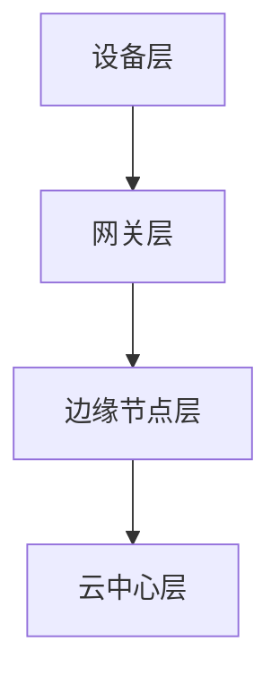
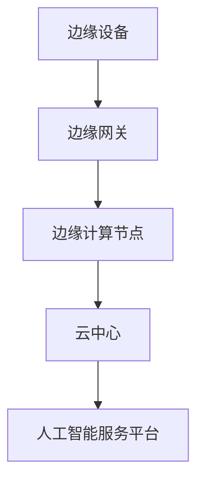

                 

### 第一部分：引言

#### 第1章：引言

##### 1.1 边缘计算的发展背景

边缘计算（Edge Computing）是近年来信息技术领域的一个热点话题，其重要性日益凸显。边缘计算的概念起源于对云计算的补充和扩展。随着物联网（IoT）、5G、人工智能（AI）等技术的发展，数据生成和处理的速度和规模急剧增加。传统的云计算模式由于数据传输距离远、延迟高、计算资源有限等问题，难以满足这些新兴应用的需求。

#### 1.1.1 边缘计算的概念

边缘计算是指在靠近数据源或靠近用户的网络边缘侧进行数据处理和计算。通过在边缘设备上部署计算任务，可以显著降低数据传输的延迟，提高系统的响应速度，增强数据的安全性和隐私性。边缘计算的目标是将计算、存储、应用和服务等整合到网络的边缘，实现资源的本地化和高效化利用。

#### 1.1.2 边缘计算的重要性

边缘计算的重要性体现在多个方面：

1. **降低延迟**：通过在数据源附近进行计算，边缘计算可以显著降低网络延迟，提高实时处理能力。
2. **提高效率**：边缘计算可以减轻中央数据中心的计算负担，提高整体系统的效率。
3. **增强安全性**：边缘计算可以减少数据在网络中的传输，降低数据泄露的风险。
4. **满足特定需求**：边缘计算可以针对特定的应用场景提供定制化的解决方案，满足不同行业和用户的需求。

#### 1.1.3 边缘计算的应用场景

边缘计算在多个领域都有广泛的应用，包括：

1. **智能工厂**：在制造业中，边缘计算可以用于实时监控生产过程、设备状态和产品质量，实现智能化的生产管理。
2. **智能交通**：在交通管理中，边缘计算可以用于实时处理交通数据，优化交通信号、智能调度公共交通。
3. **智能医疗**：在医疗领域，边缘计算可以用于远程医疗诊断、实时监测患者健康状况等。
4. **智能城市**：在城市建设中，边缘计算可以用于城市管理、环境监测、公共安全等。

##### 1.2 可扩展性的概念

可扩展性（Scalability）是系统设计和实现中的一个关键指标，它关系到系统在处理更多数据或用户时，是否能够保持高性能和高可靠性。可扩展性可以分为水平扩展（Horizontal Scaling）和垂直扩展（Vertical Scaling）两种类型。

#### 1.2.1 可扩展性的定义

可扩展性是指系统能够在保持性能和可用性的前提下，随着需求的增加，能够灵活地增加计算资源、存储资源或网络带宽。

#### 1.2.2 可扩展性的重要性

可扩展性的重要性体现在以下几个方面：

1. **适应增长**：随着业务的发展，系统需要能够适应数据量和用户数量的增长。
2. **保持性能**：即使系统规模扩大，也要保证系统的性能不受影响。
3. **降低成本**：通过可扩展性设计，可以在不增加过多成本的情况下，提高系统的处理能力。

#### 1.2.3 可扩展性的类型

1. **水平扩展**：通过增加更多的节点或实例来扩展系统，可以线性地提高系统的处理能力。
2. **垂直扩展**：通过增加硬件资源（如CPU、内存、存储等）来提高系统的处理能力。

##### 1.3 书籍概述

本书旨在为读者提供关于构建可扩展的边缘计算架构的全面指导。本书不仅涵盖了边缘计算的基本概念和发展背景，还深入探讨了可扩展性的设计原则、数据处理方法、人工智能应用以及安全性和隐私保护等方面的内容。

#### 1.3.1 书籍目的

本书的目的是帮助读者理解边缘计算和可扩展性的基本概念，掌握构建可扩展边缘计算架构的方法和技巧，并能够将这些知识应用于实际的工程项目中。

#### 1.3.2 书籍结构

本书分为八个部分，分别介绍了边缘计算架构基础、可扩展性设计原则、数据处理、人工智能应用、安全性与隐私保护、实践案例以及未来发展趋势等内容。

#### 1.3.3 读者对象

本书适合对边缘计算和可扩展性有兴趣的读者，包括软件工程师、系统架构师、数据中心管理人员以及从事人工智能应用的开发者等。

---

**关键词**：边缘计算、可扩展性、架构设计、数据处理、人工智能、安全性、隐私保护

**摘要**：本文全面介绍了边缘计算和可扩展性的基本概念，探讨了构建可扩展边缘计算架构的设计原则、数据处理方法、人工智能应用以及安全性和隐私保护等方面的内容，旨在为读者提供关于边缘计算和可扩展性的全面指导，帮助读者掌握构建可扩展边缘计算架构的方法和技巧。

---

### 目录大纲

```markdown
----------------------------------------------------------------
# 构建可扩展的边缘计算架构

> 关键词：边缘计算、可扩展性、架构设计、数据处理、人工智能、安全性、隐私保护

> 摘要：本文全面介绍了边缘计算和可扩展性的基本概念，探讨了构建可扩展边缘计算架构的设计原则、数据处理方法、人工智能应用以及安全性和隐私保护等方面的内容，旨在为读者提供关于边缘计算和可扩展性的全面指导，帮助读者掌握构建可扩展边缘计算架构的方法和技巧。

## 第1部分：引言

### 第1章：引言

#### 1.1 边缘计算的发展背景

##### 1.1.1 边缘计算的概念
##### 1.1.2 边缘计算的重要性
##### 1.1.3 边缘计算的应用场景

#### 1.2 可扩展性的概念

##### 1.2.1 可扩展性的定义
##### 1.2.2 可扩展性的重要性
##### 1.2.3 可扩展性的类型

#### 1.3 书籍概述

##### 1.3.1 书籍目的
##### 1.3.2 书籍结构
##### 1.3.3 读者对象

## 第2部分：边缘计算架构基础

### 第2章：边缘计算架构基础

#### 2.1 边缘计算架构概述

##### 2.1.1 边缘计算架构的层次结构
##### 2.1.2 边缘计算架构的关键组件
##### 2.1.3 边缘计算架构的优势与挑战

#### 2.2 边缘节点的设计与实现

##### 2.2.1 边缘节点的角色与功能
##### 2.2.2 边缘节点的硬件选择
##### 2.2.3 边缘节点的软件配置

#### 2.3 边缘计算网络架构

##### 2.3.1 边缘计算网络的拓扑结构
##### 2.3.2 边缘计算网络的协议与通信
##### 2.3.3 边缘计算网络的性能优化

## 第3部分：可扩展性设计原则

### 第3章：可扩展性设计原则

#### 3.1 可扩展性的设计原则

##### 3.1.1 分层架构
##### 3.1.2 微服务架构
##### 3.1.3 模块化设计

#### 3.2 系统容量规划

##### 3.2.1 容量预估
##### 3.2.2 可扩展性评估
##### 3.2.3 容量扩展策略

#### 3.3 负载均衡

##### 3.3.1 负载均衡的概念
##### 3.3.2 负载均衡策略
##### 3.3.3 负载均衡的实现

## 第4部分：边缘计算中的数据处理

### 第4章：边缘计算中的数据处理

#### 4.1 数据处理概述

##### 4.1.1 数据处理的挑战
##### 4.1.2 数据处理的流程
##### 4.1.3 数据处理的关键技术

#### 4.2 数据存储与管理

##### 4.2.1 数据存储方案
##### 4.2.2 数据管理策略
##### 4.2.3 数据隐私保护

#### 4.3 数据分析与挖掘

##### 4.3.1 数据分析的方法
##### 4.3.2 数据挖掘的算法
##### 4.3.3 数据分析的实践应用

## 第5部分：边缘计算与人工智能

### 第5章：边缘计算与人工智能

#### 5.1 人工智能在边缘计算中的应用

##### 5.1.1 人工智能的基础
##### 5.1.2 人工智能在边缘计算中的挑战
##### 5.1.3 人工智能在边缘计算中的实践应用

#### 5.2 边缘智能网络架构

##### 5.2.1 边缘智能网络的概念
##### 5.2.2 边缘智能网络的体系结构
##### 5.2.3 边缘智能网络的优化策略

#### 5.3 人工智能算法的边缘部署

##### 5.3.1 算法优化与量化
##### 5.3.2 模型压缩与迁移
##### 5.3.3 边缘智能网络的案例研究

## 第6部分：安全性与隐私保护

### 第6章：安全性与隐私保护

#### 6.1 边缘计算安全概述

##### 6.1.1 边缘计算安全的挑战
##### 6.1.2 安全架构的设计原则
##### 6.1.3 安全机制的实现策略

#### 6.2 数据隐私保护

##### 6.2.1 隐私保护的需求
##### 6.2.2 隐私保护的技术
##### 6.2.3 隐私保护的案例分析

#### 6.3 边缘计算中的访问控制

##### 6.3.1 访问控制的概念
##### 6.3.2 访问控制的实现机制
##### 6.3.3 访问控制的案例分析

## 第7部分：实践案例

### 第7章：实践案例

#### 7.1 边缘计算案例分析

##### 7.1.1 案例背景
##### 7.1.2 案例解决方案
##### 7.1.3 案例效果评估

#### 7.2 可扩展边缘计算架构设计

##### 7.2.1 架构设计原则
##### 7.2.2 架构设计步骤
##### 7.2.3 架构设计实例

#### 7.3 边缘计算项目实施

##### 7.3.1 项目规划
##### 7.3.2 项目实施
##### 7.3.3 项目验收

## 第8部分：未来发展趋势与展望

### 第8章：未来发展趋势与展望

#### 8.1 边缘计算的发展趋势

##### 8.1.1 技术趋势
##### 8.1.2 应用趋势
##### 8.1.3 市场趋势

#### 8.2 可扩展边缘计算的未来挑战与机遇

##### 8.2.1 挑战
##### 8.2.2 机遇
##### 8.2.3 展望

----------------------------------------------------------------
```

---

**本章内容概述**：

本章作为引言，首先介绍了边缘计算和可扩展性的基本概念，并探讨了它们的发展背景、重要性和应用场景。随后，本章简要概述了本书的目的、结构和读者对象，为后续章节的深入探讨奠定了基础。通过这一章的阅读，读者可以初步了解边缘计算和可扩展性的概念，以及本书的整体结构和内容安排。

---

## 第2部分：边缘计算架构基础

### 第2章：边缘计算架构基础

边缘计算架构是构建可扩展边缘计算系统的基础，它涉及到硬件设备、网络通信、数据处理等多个方面。本章将深入探讨边缘计算架构的基本概念、关键组件、优势和挑战，以及边缘节点的设计与实现和边缘计算网络架构。

#### 2.1 边缘计算架构概述

边缘计算架构可以分为多个层次，每个层次都有其特定的功能和组件。一般来说，边缘计算架构包括以下几个层次：

1. **设备层**：包括各种边缘设备，如传感器、无人机、智能摄像头等，这些设备负责收集数据。
2. **网关层**：网关是边缘计算架构中的关键组件，负责将来自设备层的数据进行初步处理和整合，并将其传输到云中心或其他数据中心。
3. **边缘节点层**：边缘节点是在网络边缘部署的计算资源，可以执行复杂的计算任务，如机器学习推理、实时数据分析等。
4. **云中心层**：云中心是整个架构的最高层次，负责存储、处理和管理来自边缘节点的数据，并提供高级的服务。

#### 2.1.1 边缘计算架构的层次结构

边缘计算架构的层次结构可以简化为以下模型：



在这个层次结构中，每个层次都有其特定的功能和组件，它们协同工作，实现了边缘计算的目标。

#### 2.1.2 边缘计算架构的关键组件

边缘计算架构的关键组件包括：

1. **边缘设备**：边缘设备是边缘计算的基础，负责收集和传输数据。这些设备可以是各种传感器、智能设备、移动设备等。
2. **网关**：网关是边缘计算架构中的桥梁，负责将来自边缘设备的数据进行初步处理，并将其传输到边缘节点或云中心。网关通常具备处理能力和存储能力，可以执行一些简单的计算任务。
3. **边缘节点**：边缘节点是边缘计算架构中的计算中心，负责执行复杂的计算任务，如机器学习推理、实时数据分析等。边缘节点通常具有高性能的计算能力和较大的存储容量。
4. **云中心**：云中心负责存储、处理和管理来自边缘节点的数据，并提供高级的服务。云中心通常具有大规模的计算资源、存储资源和网络资源。

#### 2.1.3 边缘计算架构的优势与挑战

边缘计算架构具有以下几个优势：

1. **降低延迟**：通过在数据源附近进行计算，边缘计算可以显著降低网络延迟，提高系统的响应速度。
2. **提高效率**：边缘计算可以减轻中央数据中心的计算负担，提高整体系统的效率。
3. **增强安全性**：边缘计算可以减少数据在网络中的传输，降低数据泄露的风险。
4. **满足特定需求**：边缘计算可以针对特定的应用场景提供定制化的解决方案，满足不同行业和用户的需求。

然而，边缘计算架构也面临着一些挑战：

1. **硬件限制**：边缘设备通常体积较小，硬件资源有限，需要高效利用计算资源。
2. **网络稳定性**：边缘设备的网络连接可能不稳定，需要设计可靠的通信协议和数据传输机制。
3. **数据隐私**：边缘设备收集和处理的数据可能涉及隐私信息，需要采取有效的数据隐私保护措施。

#### 2.2 边缘节点的设计与实现

边缘节点是边缘计算架构中的核心组件，其设计与实现需要考虑以下几个方面：

1. **硬件选择**：边缘节点的硬件选择需要根据应用场景和需求进行。一般而言，边缘节点应具备高性能的计算能力、较大的存储容量和稳定的网络连接。
2. **软件配置**：边缘节点的软件配置包括操作系统、中间件、数据库等。为了提高系统的稳定性和可靠性，应选择适合边缘环境的应用软件和工具。
3. **计算任务分配**：边缘节点需要根据网络负载和计算需求，合理分配计算任务。可以通过负载均衡算法和任务调度策略来实现。
4. **数据管理**：边缘节点需要负责数据的存储、管理和传输。应设计高效的数据管理策略，确保数据的安全性和完整性。

#### 2.2.1 边缘节点的角色与功能

边缘节点的角色和功能可以概括为以下几点：

1. **数据处理**：边缘节点负责接收和初步处理来自边缘设备的原始数据，执行一些简单的计算任务，如数据清洗、数据转换等。
2. **数据传输**：边缘节点负责将处理后的数据传输到云中心或其他边缘节点，以进行更复杂的处理和分析。
3. **实时推理**：边缘节点可以部署机器学习模型，执行实时推理任务，为应用提供快速响应。
4. **边缘服务**：边缘节点可以提供一些边缘服务，如智能监控、实时数据分析、智能控制等。

#### 2.2.2 边缘节点的硬件选择

边缘节点的硬件选择需要考虑以下几个因素：

1. **计算能力**：边缘节点需要具备较强的计算能力，以支持复杂的计算任务。可以选择具有高性能CPU、GPU或TPU的硬件设备。
2. **存储容量**：边缘节点需要具备较大的存储容量，以存储大量的数据和模型。可以选择具有大容量SSD或HDD的硬件设备。
3. **网络连接**：边缘节点需要具备稳定的网络连接，以实现数据的高速传输。可以选择有线或无线网络连接。
4. **功耗**：边缘节点的功耗需要控制在合理范围内，以延长设备的使用寿命。可以选择低功耗的硬件设备。

#### 2.2.3 边缘节点的软件配置

边缘节点的软件配置包括以下几个方面：

1. **操作系统**：可以选择Linux或Windows等操作系统，以满足不同的应用需求。
2. **中间件**：可以选择Apache Kafka、Apache Flink等中间件，以实现数据流处理和实时计算。
3. **数据库**：可以选择MySQL、PostgreSQL等数据库，以存储和管理数据。
4. **开发工具**：可以选择Python、Java等开发工具，以方便开发者和数据科学家进行数据处理和分析。

#### 2.3 边缘计算网络架构

边缘计算网络架构是边缘计算架构的重要组成部分，它涉及到网络的拓扑结构、协议与通信以及性能优化等方面。

1. **拓扑结构**：边缘计算网络架构可以采用星型、环型、树型等多种拓扑结构，以满足不同的应用需求。
2. **协议与通信**：边缘计算网络需要采用高效的通信协议，如HTTP/2、QUIC等，以实现数据的高效传输。同时，需要设计可靠的数据传输机制，如数据压缩、数据加密等。
3. **性能优化**：边缘计算网络需要优化性能，以满足实时性和高性能的要求。可以通过负载均衡、网络缓存、数据流分片等技术来实现性能优化。

---

**本章内容概述**：

本章详细介绍了边缘计算架构的基础知识，包括边缘计算架构的层次结构、关键组件、优势和挑战，以及边缘节点的设计与实现和边缘计算网络架构。通过本章的学习，读者可以全面了解边缘计算架构的基本概念和设计原则，为后续章节的深入学习打下坚实的基础。

---

## 第3部分：可扩展性设计原则

### 第3章：可扩展性设计原则

构建可扩展的边缘计算架构是确保系统能够应对不断增长的数据和处理需求的基石。本章将深入探讨可扩展性设计原则，包括分层架构、微服务架构和模块化设计。这些原则为开发者提供了有效的方法，以创建灵活、可扩展的边缘计算系统。

#### 3.1 可扩展性的设计原则

**分层架构**：

分层架构是一种将系统划分为多个层次，每个层次负责不同功能的结构化设计方法。这种设计方法有助于系统的可扩展性，因为它允许开发者独立地扩展或替换各个层次。

- **层次划分**：常见的分层包括表示层、业务逻辑层和数据访问层。
- **优势**：分层架构使得系统能够更灵活地适应变化，每个层次可以独立开发、测试和部署。
- **挑战**：层次之间的通信可能成为瓶颈，需要高效的消息传递机制。

**微服务架构**：

微服务架构将应用程序划分为一组小型、独立的服务，每个服务负责一个特定的功能。这种架构方法支持系统的水平扩展，允许开发者根据需求独立扩展不同的服务。

- **服务划分**：根据业务需求将应用程序划分为多个微服务。
- **优势**：微服务架构提高了系统的可维护性和可扩展性，便于故障隔离和服务更新。
- **挑战**：服务之间的通信可能复杂，需要有效的服务发现和负载均衡机制。

**模块化设计**：

模块化设计是将系统划分为多个独立的模块，每个模块负责特定的功能。这种设计方法有助于系统的可维护性和可扩展性，因为模块可以独立开发、测试和部署。

- **模块划分**：根据功能需求将系统划分为多个模块。
- **优势**：模块化设计使得系统能够更灵活地适应变化，每个模块可以独立扩展和优化。
- **挑战**：模块之间的依赖关系可能增加系统的复杂性。

#### 3.2 系统容量规划

系统容量规划是确保系统能够满足当前和未来需求的关键步骤。以下是系统容量规划的关键要素：

**容量预估**：

- **需求分析**：分析系统当前和未来的数据处理需求，包括数据量、处理速度和并发用户数。
- **容量估算**：根据需求分析结果，估算系统的硬件和软件资源需求。

**可扩展性评估**：

- **负载测试**：通过模拟实际负载，评估系统在不同负载下的性能和稳定性。
- **扩展性测试**：评估系统在增加硬件或软件资源后的性能提升。

**容量扩展策略**：

- **水平扩展**：通过增加节点或实例来提高系统的处理能力。
- **垂直扩展**：通过增加硬件资源（如CPU、内存、存储等）来提高系统的处理能力。

#### 3.3 负载均衡

负载均衡是确保系统在高负载下保持高性能和高可用性的关键技术。以下是负载均衡的关键要素：

**负载均衡的概念**：

- **负载均衡器**：负责分配网络请求到多个服务器，以均衡负载。
- **负载均衡策略**：包括轮询、最小连接数、加权轮询等，用于决定如何分配请求。

**负载均衡策略**：

- **轮询**：将请求均匀分配到所有服务器。
- **最小连接数**：将请求分配到当前连接数最少的服务器。
- **加权轮询**：根据服务器的处理能力或重要性，分配不同比例的请求。

**负载均衡的实现**：

- **硬件负载均衡器**：使用专门的硬件设备进行负载均衡。
- **软件负载均衡器**：使用软件实现的负载均衡，如Nginx、HAProxy等。

通过本章的学习，读者可以掌握可扩展性设计原则，包括分层架构、微服务架构和模块化设计，以及系统容量规划和负载均衡的关键要素。这些知识将为构建可扩展的边缘计算架构提供坚实的理论基础和实践指导。

---

**本章内容概述**：

本章深入探讨了构建可扩展边缘计算架构的设计原则，包括分层架构、微服务架构和模块化设计。通过理解这些原则，读者可以学习到如何进行系统容量规划，确保系统能够适应不断增长的需求。同时，本章还介绍了负载均衡的概念、策略和实现方法，帮助读者在实际项目中实现高效、稳定的负载均衡。这些设计原则和方法将为构建可扩展的边缘计算架构提供有力的支持和指导。

---

## 第4部分：边缘计算中的数据处理

### 第4章：边缘计算中的数据处理

边缘计算的核心价值之一在于实时处理和分析大量数据，以满足各种应用场景的需求。本章将深入探讨边缘计算中的数据处理，包括数据处理面临的挑战、处理流程、关键技术和应用场景。

#### 4.1 数据处理概述

边缘计算中的数据处理涉及从数据采集、传输、存储、处理到分析的一系列环节。以下是数据处理的主要挑战：

**数据处理挑战**：

1. **数据多样性**：边缘设备采集的数据类型多种多样，包括文本、图像、音频、视频等，需要设计灵活的数据处理方案。
2. **数据量大**：随着物联网设备的普及，边缘设备产生的数据量日益增长，对处理能力和存储容量提出了更高要求。
3. **实时性要求**：许多应用场景对数据处理的实时性有严格要求，如自动驾驶、智能监控等，需要高效的数据处理机制。

**数据处理流程**：

1. **数据采集**：通过边缘设备收集数据。
2. **数据传输**：将采集到的数据传输到边缘节点或云中心。
3. **数据存储**：将处理后的数据存储到数据库或文件系统中。
4. **数据处理**：对传输到边缘节点的数据进行清洗、转换、分析和存储。
5. **数据可视化**：将分析结果以可视化的形式展示，供用户查看。

**数据处理的关键技术**：

1. **数据流处理**：利用流处理框架（如Apache Kafka、Apache Flink）对实时数据进行处理和分析。
2. **实时分析**：利用机器学习和人工智能技术对数据进行分析，提取有价值的信息。
3. **边缘数据库**：使用边缘数据库（如Cassandra、MongoDB）存储和管理边缘设备产生的数据。
4. **数据压缩**：通过数据压缩技术减少数据传输和存储的负担。

**数据处理的应用场景**：

1. **智能工厂**：利用边缘计算对生产过程中的数据进行实时分析，优化生产流程，提高生产效率。
2. **智能交通**：通过边缘计算对交通数据进行实时处理，优化交通信号，减少交通拥堵。
3. **智能医疗**：利用边缘计算对医疗数据进行实时分析，提供远程诊断和监测服务。
4. **智能城市**：通过边缘计算对城市运行数据进行实时处理，提高城市管理水平和公共安全。

#### 4.2 数据存储与管理

**数据存储方案**：

1. **本地存储**：在边缘节点上存储数据，以减少数据传输延迟。
2. **分布式存储**：使用分布式存储系统（如Hadoop、Cassandra）存储大量数据，提高数据可靠性和可用性。
3. **云存储**：将数据存储在云中心，利用云服务的弹性和可扩展性。

**数据管理策略**：

1. **数据分类**：根据数据的重要性和访问频率对数据进行分类，采取不同的管理策略。
2. **数据备份**：定期备份数据，确保数据的安全性和完整性。
3. **数据权限管理**：根据用户角色和权限对数据进行访问控制，确保数据的安全。

**数据隐私保护**：

1. **数据加密**：对传输和存储的数据进行加密，确保数据在传输和存储过程中不被窃取。
2. **访问控制**：设置严格的访问控制策略，防止未经授权的用户访问数据。
3. **隐私计算**：利用隐私计算技术（如差分隐私、联邦学习）在保护数据隐私的前提下进行数据处理和分析。

#### 4.3 数据分析与挖掘

**数据分析的方法**：

1. **描述性分析**：对数据的基本统计特征进行分析，了解数据的分布和趋势。
2. **预测性分析**：利用历史数据预测未来的趋势和事件，如时间序列分析、回归分析。
3. **诊断性分析**：分析数据以识别异常和故障，如异常检测、故障诊断。

**数据挖掘的算法**：

1. **分类算法**：将数据分为不同的类别，如决策树、支持向量机。
2. **聚类算法**：将相似的数据归为一类，如K-均值、层次聚类。
3. **关联规则算法**：发现数据之间的关联关系，如Apriori算法、FP-growth。

**数据挖掘的实践应用**：

1. **推荐系统**：利用数据挖掘技术为用户推荐商品、服务和内容。
2. **客户行为分析**：分析客户行为数据，了解客户需求和行为模式。
3. **欺诈检测**：利用数据挖掘技术检测和预防金融欺诈行为。

通过本章的学习，读者可以全面了解边缘计算中的数据处理，包括数据处理挑战、处理流程、关键技术和应用场景。同时，本章还介绍了数据存储与管理策略以及数据隐私保护的方法。这些知识将为构建高效、安全的边缘计算系统提供指导。

---

**本章内容概述**：

本章详细探讨了边缘计算中的数据处理，从数据处理面临的挑战、处理流程、关键技术和应用场景等多个角度出发，深入分析了边缘计算中数据处理的各个方面。通过本章的学习，读者可以掌握边缘计算数据处理的策略和技术，了解如何有效地管理和分析边缘设备产生的海量数据，为构建高效、安全的边缘计算系统打下坚实基础。

---

## 第5部分：边缘计算与人工智能

### 第5章：边缘计算与人工智能

边缘计算与人工智能（AI）的结合正在引领一场技术变革，为各行各业带来了新的机遇。本章将探讨人工智能在边缘计算中的应用、面临的挑战以及具体实践案例。

#### 5.1 人工智能在边缘计算中的应用

人工智能在边缘计算中的应用场景非常广泛，包括但不限于以下领域：

**智能监控**：利用边缘计算和AI技术，可以实现实时视频分析，自动识别和检测异常行为，如安防监控、交通流量监控等。

**智能制造**：在制造业中，AI可以用于设备故障预测、质量检测、生产优化等，提高生产效率和产品质量。

**智能医疗**：在医疗领域，AI可以用于疾病诊断、患者监测、药物研发等，实现精准医疗和个性化治疗。

**智能农业**：在农业生产中，AI可以用于作物病害检测、土壤监测、智能灌溉等，提高农业产量和效率。

**智能交通**：在交通领域，AI可以用于智能信号控制、自动驾驶车辆管理、交通流量预测等，提高交通效率和安全性。

#### 5.1.1 人工智能的基础

**人工智能的基础**：

1. **机器学习**：机器学习是人工智能的核心技术，通过算法从数据中学习规律，实现自动化的决策和预测。

2. **深度学习**：深度学习是机器学习的一种方法，通过多层神经网络模拟人脑的决策过程，实现复杂模式的识别。

3. **神经网络**：神经网络是深度学习的基础，由大量的神经元组成，通过学习输入和输出的关系，实现数据分类、回归等任务。

#### 5.1.2 人工智能在边缘计算中的挑战

**人工智能在边缘计算中的挑战**：

1. **计算资源限制**：边缘设备通常具有有限的计算资源和存储能力，难以支持复杂的AI模型和算法。

2. **数据隐私和安全**：边缘设备处理的数据可能涉及隐私信息，需要确保数据的安全性和隐私性。

3. **网络连接稳定性**：边缘设备通常通过网络连接到云中心或其他边缘设备，网络连接的不稳定性会影响AI应用的性能和可靠性。

4. **算法优化与效率**：为了在边缘设备上运行，AI算法需要经过优化，减少计算复杂度和内存占用。

#### 5.1.3 人工智能在边缘计算中的实践应用

**人工智能在边缘计算中的实践应用**：

1. **智能监控**：

   - **应用场景**：在安防监控领域，利用边缘计算和AI技术，可以实时分析视频流，自动识别和报警异常行为。

   - **解决方案**：部署边缘设备（如智能摄像头）进行实时视频分析，使用深度学习算法进行人脸识别、物体检测等任务。

   - **案例研究**：一些城市已经实现了基于边缘计算和AI的智能监控系统，有效提高了公共安全水平。

2. **智能制造**：

   - **应用场景**：在制造业中，利用边缘计算和AI技术，可以实现设备故障预测、生产优化等。

   - **解决方案**：部署边缘设备（如传感器）收集设备运行数据，使用机器学习算法进行故障预测和生产优化。

   - **案例研究**：一些制造企业通过引入边缘计算和AI技术，显著提高了生产效率和产品质量。

3. **智能医疗**：

   - **应用场景**：在医疗领域，利用边缘计算和AI技术，可以实现远程诊断、患者监测等。

   - **解决方案**：部署边缘设备（如可穿戴设备）收集患者健康数据，使用AI算法进行诊断和监测。

   - **案例研究**：一些医院已经实现了基于边缘计算和AI的远程诊断系统，提高了医疗服务质量和效率。

#### 5.2 边缘智能网络架构

**边缘智能网络架构**：

边缘智能网络架构是指将人工智能技术集成到边缘计算网络中，实现数据的实时处理、分析和决策。以下是一个简化的边缘智能网络架构：



**边缘智能网络的概念**：

- **边缘设备**：负责数据的采集和初步处理。
- **边缘网关**：负责数据传输和边缘计算节点的调度。
- **边缘计算节点**：负责执行AI算法和复杂计算任务。
- **云中心**：负责存储和管理数据，提供高级的AI服务和计算资源。
- **人工智能服务平台**：提供AI模型训练、部署和管理服务。

**边缘智能网络的体系结构**：

1. **数据采集层**：包括各种边缘设备，如传感器、摄像头、无人机等，负责数据的采集和初步处理。
2. **数据处理层**：包括边缘网关和边缘计算节点，负责数据的存储、处理和分析。
3. **智能服务层**：包括云中心和人工智能服务平台，负责提供高级的AI服务和计算资源。

**边缘智能网络的优化策略**：

1. **数据流优化**：通过优化数据传输路径和传输协议，降低数据传输延迟和带宽消耗。
2. **计算资源调度**：通过动态调度计算资源，提高系统的处理能力和效率。
3. **智能算法优化**：通过优化AI算法和模型，降低计算复杂度和内存占用。

#### 5.3 人工智能算法的边缘部署

**人工智能算法的边缘部署**：

将人工智能算法部署到边缘设备上，需要考虑以下因素：

1. **算法优化**：为了在有限的计算资源上运行，需要对AI算法进行优化，降低计算复杂度和内存占用。
2. **模型压缩**：通过模型压缩技术，将大型的AI模型转化为较小的模型，以适应边缘设备的存储和计算限制。
3. **迁移学习**：通过迁移学习技术，将训练好的AI模型迁移到边缘设备上，利用边缘设备进行微调或本地化训练。

**算法优化与量化**：

1. **量化**：通过量化技术，将浮点数模型转化为整数模型，降低计算复杂度和内存占用。
2. **剪枝**：通过剪枝技术，删除网络中不必要的神经元和连接，简化模型结构，提高模型效率。

**模型压缩与迁移**：

1. **模型压缩**：通过剪枝、量化、蒸馏等技术，将大型AI模型转化为较小的模型，以适应边缘设备的存储和计算限制。
2. **迁移学习**：通过将训练好的AI模型迁移到边缘设备上，利用边缘设备进行微调或本地化训练，提高模型在边缘设备的性能。

**边缘智能网络的案例研究**：

1. **智能工厂**：在智能工厂中，利用边缘计算和AI技术，实现设备故障预测、生产优化等，提高生产效率和产品质量。
2. **智能交通**：在智能交通中，利用边缘计算和AI技术，实现实时交通流量预测、自动驾驶车辆管理等，提高交通效率和安全性。
3. **智能医疗**：在智能医疗中，利用边缘计算和AI技术，实现远程诊断、患者监测等，提高医疗服务质量和效率。

通过本章的学习，读者可以了解人工智能在边缘计算中的应用、面临的挑战以及具体实践案例。同时，本章还介绍了边缘智能网络架构以及人工智能算法的边缘部署方法。这些知识将为构建智能、高效的边缘计算系统提供有力支持。

---

**本章内容概述**：

本章深入探讨了边缘计算与人工智能的结合，首先介绍了人工智能在边缘计算中的应用场景，包括智能监控、智能制造、智能医疗、智能交通等。然后，本章分析了人工智能在边缘计算中面临的计算资源限制、数据隐私和安全、网络连接稳定性以及算法优化与效率等挑战。接着，本章通过具体实践案例，展示了人工智能在边缘计算中的应用效果。此外，本章还介绍了边缘智能网络架构以及人工智能算法的边缘部署方法，包括算法优化与量化、模型压缩与迁移等。通过本章的学习，读者可以全面了解边缘计算与人工智能的结合及其在实践中的应用，为构建智能、高效的边缘计算系统提供指导。

---

## 第6部分：安全性与隐私保护

### 第6章：安全性与隐私保护

随着边缘计算的普及，其安全性和隐私保护变得尤为重要。本章将详细探讨边缘计算中的安全性挑战、安全架构设计原则、实现策略以及数据隐私保护的需求、技术和案例分析。

#### 6.1 边缘计算安全概述

**边缘计算安全的挑战**：

1. **设备安全性**：边缘设备数量众多，分布广泛，可能成为攻击者的目标。
2. **数据隐私**：边缘设备处理的数据可能涉及个人隐私、商业秘密等，数据泄露的风险较高。
3. **网络安全性**：边缘计算网络通常采用混合网络架构，网络连接的不稳定性和多样性增加了安全风险。
4. **软件漏洞**：边缘设备的操作系统和应用程序可能存在安全漏洞，容易受到攻击。

**安全架构的设计原则**：

1. **最小权限原则**：边缘设备应遵循最小权限原则，只授予必要的权限，以减少攻击面。
2. **分层安全**：将安全措施分布在不同的层次，如设备层、网关层、边缘节点层等，形成多层防护体系。
3. **加密与认证**：使用加密技术保护数据传输和存储，采用身份认证和访问控制机制确保数据安全。
4. **安全监控与审计**：建立安全监控和审计系统，实时监测边缘设备的安全状态，及时发现和处理安全事件。

**安全机制的实现策略**：

1. **设备安全管理**：部署安全更新和补丁，加强设备的安全防护。
2. **网络隔离**：通过虚拟局域网（VLAN）和防火墙等技术实现网络隔离，防止内部网络攻击。
3. **数据加密**：使用SSL/TLS等协议对数据进行加密传输，确保数据在传输过程中的安全性。
4. **访问控制**：采用基于角色的访问控制（RBAC）和基于属性的访问控制（ABAC）机制，限制对敏感数据的访问。

#### 6.2 数据隐私保护

**数据隐私保护的需求**：

1. **数据去标识化**：对敏感数据进行去标识化处理，以减少数据泄露的风险。
2. **数据加密**：使用加密技术对存储和传输的数据进行加密，确保数据在存储和传输过程中的安全。
3. **隐私计算**：采用隐私计算技术，如差分隐私、联邦学习等，在保护数据隐私的前提下进行数据处理和分析。

**数据隐私保护的技术**：

1. **数据加密**：使用对称加密和非对称加密技术对数据进行加密，确保数据在存储和传输过程中的安全。
2. **差分隐私**：通过在数据处理过程中引入噪声，使攻击者无法准确推断出单个数据项，从而保护数据的隐私。
3. **联邦学习**：在分布式环境中，通过协同学习模型，使得各个节点可以共享学习结果而不泄露本地数据。

**数据隐私保护的案例分析**：

1. **案例背景**：某医疗公司希望利用边缘计算和AI技术进行患者数据分析，但数据涉及患者隐私。
2. **解决方案**：采用联邦学习技术，将数据分析任务分布在各个边缘设备上，确保数据不离开本地设备，从而保护患者隐私。
3. **效果评估**：通过联邦学习技术，成功实现了数据隐私保护，同时提高了数据分析的准确性和效率。

#### 6.3 边缘计算中的访问控制

**访问控制的概念**：

访问控制是指通过限制对系统资源的访问，确保只有授权用户和实体能够访问相应的资源。

**访问控制的实现机制**：

1. **身份认证**：验证用户的身份，确保只有授权用户能够访问系统。
2. **授权策略**：定义用户和资源的访问权限，根据用户角色和权限分配访问权限。
3. **访问审计**：记录用户对系统资源的访问行为，以便在发生安全事件时进行追溯和调查。

**访问控制的案例分析**：

1. **案例背景**：某智能工厂希望确保只有授权人员能够访问生产数据和管理系统。
2. **解决方案**：采用基于角色的访问控制（RBAC）机制，根据员工的角色分配访问权限，同时使用双因素认证（2FA）提高安全性。
3. **效果评估**：通过访问控制机制，成功限制了未经授权的访问，提高了系统的安全性和可控性。

通过本章的学习，读者可以全面了解边缘计算中的安全性和隐私保护，包括安全架构设计原则、实现策略、数据隐私保护需求和技术，以及访问控制的概念和实现机制。这些知识将为构建安全、可靠的边缘计算系统提供指导。

---

**本章内容概述**：

本章深入探讨了边缘计算中的安全性和隐私保护，首先分析了边缘计算面临的安全性挑战，并介绍了安全架构设计原则和实现策略。接着，本章讨论了数据隐私保护的需求、技术和案例分析，包括数据加密、差分隐私和联邦学习等。此外，本章还介绍了访问控制的概念和实现机制，并通过实际案例展示了访问控制的效果。通过本章的学习，读者可以全面了解边缘计算安全性的关键要素，为构建安全、可靠的边缘计算系统提供指导。

---

## 第7部分：实践案例

### 第7章：实践案例

本部分通过具体实践案例，进一步阐述边缘计算架构的构建和实施过程。这些案例将展示从项目规划、架构设计、系统实现到项目验收的完整过程，为读者提供实际操作经验和参考。

#### 7.1 边缘计算案例分析

**案例背景**：

某大型零售企业希望利用边缘计算技术，提升其仓储管理的效率和准确性。现有的仓储管理系统中，数据采集和处理主要依赖中央数据中心，导致数据传输延迟，影响实时决策和库存管理。

**案例解决方案**：

1. **项目规划**：制定详细的边缘计算架构方案，明确硬件设备、网络架构、数据处理流程和安全机制。
2. **架构设计**：
   - **设备层**：部署RFID传感器、摄像头等设备，实时采集库存信息。
   - **网关层**：安装边缘网关，处理数据初步清洗和分类，并将数据传输到边缘节点。
   - **边缘节点层**：部署高性能计算节点，执行库存数据分析、预测和优化算法。
   - **云中心层**：存储和管理全局数据，提供高级的数据分析和报告服务。
3. **系统实现**：
   - **数据处理**：使用流处理框架（如Apache Kafka）实现数据流处理，提高数据处理速度。
   - **实时分析**：利用机器学习算法，对库存数据进行分析，预测库存趋势和优化库存策略。
   - **安全机制**：部署防火墙和加密技术，确保数据传输和存储的安全。
4. **项目验收**：通过模拟测试和实际运行，验证边缘计算系统的稳定性和性能，确保系统能够满足业务需求。

**案例效果评估**：

通过引入边缘计算架构，该零售企业实现了以下效果：
- **库存准确性提高**：实时数据分析和预测，使库存管理更加精准，减少了库存积压和缺货情况。
- **决策效率提升**：数据处理的延迟显著降低，支持实时决策，提高了运营效率。
- **成本降低**：减少了对中央数据中心的依赖，降低了带宽和能耗成本。

#### 7.2 可扩展边缘计算架构设计

**架构设计原则**：

1. **模块化设计**：将系统划分为多个模块，每个模块负责特定的功能，便于扩展和维护。
2. **弹性扩展**：设计可水平扩展的架构，根据业务需求动态增加计算资源。
3. **高可用性**：设计冗余机制，确保系统在故障时能够快速恢复。
4. **安全性**：采用多层次的安全机制，保护数据和系统的安全。

**架构设计步骤**：

1. **需求分析**：明确业务需求和技术要求，确定系统的功能模块和性能指标。
2. **架构设计**：根据需求分析结果，设计系统的整体架构，包括设备层、网关层、边缘节点层和云中心层。
3. **组件选型**：选择适合的硬件设备、操作系统、数据库和中间件，确保系统的性能和稳定性。
4. **网络设计**：设计可靠的网络架构，包括数据传输路径、网络拓扑和安全策略。
5. **安全设计**：制定安全策略，包括数据加密、访问控制和安全审计等。

**架构设计实例**：

以下是一个简化的可扩展边缘计算架构设计实例：


在设备层，部署传感器和RFID设备，收集仓储数据。网关层负责数据初步处理和传输，边缘节点层执行数据分析和处理任务，云中心层存储和管理全局数据，提供高级数据分析服务。

#### 7.3 边缘计算项目实施

**项目实施步骤**：

1. **项目规划**：制定详细的实施计划，包括时间表、资源分配和风险评估。
2. **硬件安装**：部署边缘设备和边缘节点，确保硬件设备的正常运行。
3. **软件部署**：安装操作系统、数据库、中间件等软件，配置网络和系统参数。
4. **系统集成**：集成各个模块，确保系统能够协同工作，实现预期的功能。
5. **测试验证**：进行系统测试，验证系统的性能、稳定性和安全性。
6. **用户培训**：为用户进行系统操作和故障处理的培训，确保系统能够正常运行。

**项目实施实例**：

以某智能工厂项目为例，项目实施过程如下：

1. **项目规划**：明确项目目标、技术要求和时间节点，制定详细的实施计划。
2. **硬件安装**：在工厂现场部署传感器、摄像头和边缘计算节点，确保硬件设备正常连接和运行。
3. **软件部署**：安装操作系统和工业自动化软件，配置网络和监控工具，确保软件系统的稳定运行。
4. **系统集成**：将传感器数据接入边缘计算节点，实现实时监控和数据分析，确保系统集成符合预期。
5. **测试验证**：进行系统测试，包括功能测试、性能测试和安全测试，确保系统能够满足技术要求。
6. **用户培训**：为工厂操作人员进行系统操作和故障处理培训，确保系统能够正常运行并达到预期效果。

**项目验收**：

1. **功能验收**：验证系统是否实现了预期的功能，包括数据采集、处理、分析和监控等。
2. **性能验收**：验证系统在实际运行中的性能指标，如数据传输速度、处理能力和响应时间等。
3. **安全验收**：验证系统的安全性，包括数据加密、访问控制和安全审计等。
4. **用户反馈**：收集用户反馈，评估系统在实际应用中的效果和用户满意度。
5. **验收报告**：编写项目验收报告，总结项目实施过程、测试结果和用户反馈，为后续项目提供参考。

通过实践案例的介绍，读者可以了解到边缘计算架构的构建和实施过程，从项目规划、架构设计、系统实现到项目验收的各个阶段。这些案例不仅提供了实际操作的经验，也为构建可扩展、高效、安全的边缘计算系统提供了参考。

---

**本章内容概述**：

本章通过具体实践案例，详细介绍了边缘计算项目的规划、架构设计、系统实现和项目验收过程。首先，通过一个零售企业仓储管理案例，展示了边缘计算在提高效率、准确性和决策支持方面的应用效果。接着，本章讨论了可扩展边缘计算架构的设计原则和实例，以及项目实施的具体步骤。最后，本章介绍了项目验收的标准和方法。通过这些案例，读者可以全面了解边缘计算项目的实施过程，为实际项目的规划和执行提供参考和指导。

---

## 第8部分：未来发展趋势与展望

### 第8章：未来发展趋势与展望

边缘计算作为现代信息技术的一个重要分支，正以其独特的优势在多个领域迅速发展。本章将探讨边缘计算的未来发展趋势，包括技术趋势、应用趋势和市场趋势，并展望可扩展边缘计算的未来挑战与机遇。

#### 8.1 边缘计算的发展趋势

**技术趋势**：

1. **硬件性能提升**：随着芯片技术的进步，边缘设备的计算能力和存储容量将显著提升，为边缘计算提供更强有力的硬件支持。
2. **网络连接增强**：5G网络的普及将极大提高边缘设备的网络连接速度和稳定性，降低延迟，增强边缘计算的性能。
3. **人工智能融合**：人工智能与边缘计算的深度融合将成为未来技术发展的一个重要方向，通过边缘设备进行实时数据处理和智能决策。
4. **边缘智能**：边缘智能（Edge Intelligence）的概念逐渐兴起，意味着边缘设备不仅能够执行简单的数据处理，还能够进行复杂的智能分析和决策。
5. **边缘数据库和存储**：边缘数据库和存储技术的进步，将提高边缘设备的存储和管理能力，支持更大规模的数据处理和分析。

**应用趋势**：

1. **智能制造**：边缘计算在智能制造中的应用将更加广泛，通过实时数据分析和预测，优化生产流程，提高生产效率和产品质量。
2. **智能交通**：边缘计算在智能交通管理中的应用将进一步提升，通过实时数据分析和智能决策，优化交通流量，提高交通安全和效率。
3. **智慧城市**：随着智慧城市建设的推进，边缘计算将在城市管理、环境监测、公共安全等领域发挥重要作用，提高城市管理的智能化水平。
4. **医疗健康**：边缘计算在医疗健康领域的应用前景广阔，通过实时数据分析和远程监控，提供个性化的医疗服务和健康指导。
5. **能源管理**：边缘计算在能源管理中的应用，如智能电网、智能楼宇等，将有助于提高能源利用效率，减少能源浪费。

**市场趋势**：

1. **市场快速增长**：随着边缘计算技术的成熟和应用的推广，边缘计算市场将保持快速增长，预计未来几年市场规模将持续扩大。
2. **技术竞争加剧**：边缘计算领域的技术竞争将日趋激烈，各大厂商将纷纷推出新型边缘设备和解决方案，争夺市场份额。
3. **行业整合**：边缘计算技术与其他领域的融合，如物联网、人工智能、5G等，将推动行业整合，形成新的生态系统。
4. **政策支持**：政府和企业对边缘计算技术的重视，将提供政策支持和资金投入，推动边缘计算技术的研发和应用。

#### 8.2 可扩展边缘计算的未来挑战与机遇

**挑战**：

1. **硬件资源限制**：边缘设备的硬件资源有限，如何在有限的资源下实现高性能和高可扩展性的计算需求，是一个重要挑战。
2. **数据安全和隐私**：随着数据量的增加，如何确保数据在边缘设备上的安全和隐私，防止数据泄露和滥用，是一个亟待解决的问题。
3. **网络连接稳定性**：边缘设备的网络连接可能不稳定，如何在网络不稳定的情况下保证数据传输的可靠性和实时性，是一个技术挑战。
4. **系统复杂度**：边缘计算系统涉及到多个层次和组件，如何有效管理系统的复杂度，确保系统的可维护性和可扩展性，是一个管理挑战。

**机遇**：

1. **技术创新**：边缘计算技术的不断创新，将带来更多的应用场景和解决方案，推动边缘计算技术的发展。
2. **市场潜力**：边缘计算市场的快速增长，为企业和创业者提供了巨大的市场潜力，有望诞生新的行业巨头。
3. **行业融合**：边缘计算与其他领域的融合，如物联网、人工智能、5G等，将创造新的应用场景和商业模式。
4. **政策支持**：政府和企业对边缘计算技术的支持，将推动边缘计算技术的研发和应用，为行业提供良好的发展环境。

通过本章的讨论，可以清晰地看到边缘计算在未来的发展趋势和面临的挑战。随着技术的不断进步和市场需求的增长，边缘计算将发挥越来越重要的作用，为各个行业带来革命性的变化。可扩展边缘计算技术的研究和应用，将为构建智能、高效、安全的边缘计算系统提供强有力的支持。

---

**本章内容概述**：

本章全面探讨了边缘计算的未来发展趋势与展望，从技术趋势、应用趋势和市场趋势三个维度分析了边缘计算的发展方向。同时，本章也深入探讨了可扩展边缘计算面临的挑战和机遇，为未来边缘计算技术的发展提供了有益的思考和指导。通过本章的学习，读者可以更好地理解边缘计算的发展前景，为未来的技术研究和应用实践做好准备。

