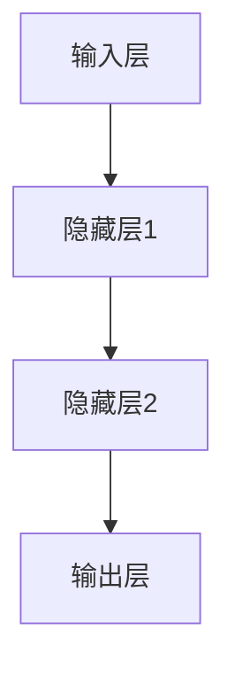
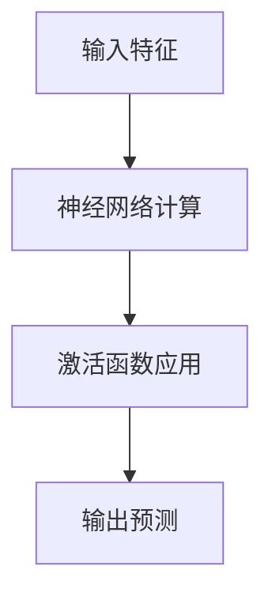
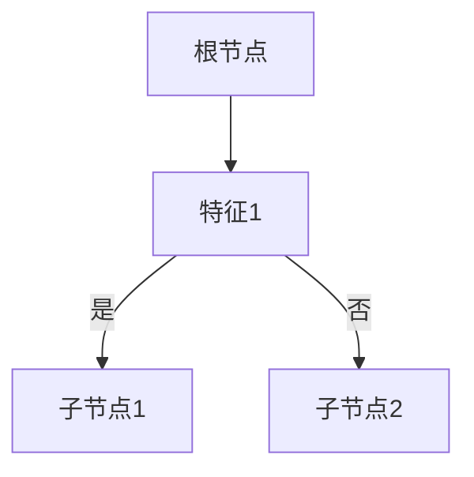
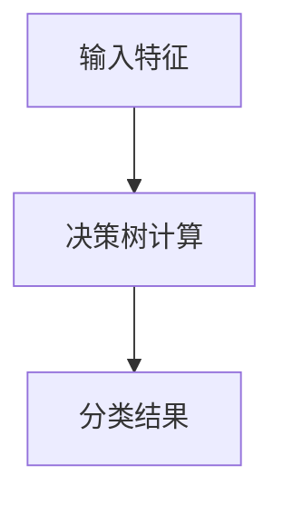
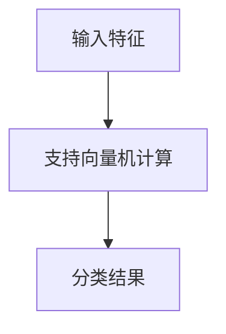

                 


### 第一部分：背景介绍与核心概念

#### 1.1 AI Agent的崛起与挑战

### 1.1.1 问题背景

随着人工智能技术的飞速发展，AI Agent（人工智能代理）已经成为当前研究与应用的热点。AI Agent是一种能够自主行动并执行特定任务的智能体，具有高度的自主性和适应性。它们可以在无人监督或半监督环境下学习，并与其他系统、人或环境进行交互。

然而，随着AI Agent的应用场景越来越广泛，其面临的挑战也日益凸显。首先，AI Agent的决策过程往往复杂且非线性，导致其决策结果难以解释。其次，AI Agent的性能和稳定性受到数据质量和模型设计的影响，一旦出现问题，可能会造成严重的后果。此外，AI Agent的透明度和可信度问题也日益引起关注。用户对AI Agent的信任度直接影响其应用范围和实际效果。

### 1.1.2 AI Agent的定义与作用

AI Agent是一种计算机程序，它能够在给定环境中，通过感知、理解和决策来执行特定任务。AI Agent的基本组成包括感知模块、理解模块、决策模块和行动模块。感知模块负责收集环境信息；理解模块负责分析感知到的信息；决策模块负责根据理解结果选择行动方案；行动模块负责将决策转化为实际操作。

AI Agent的作用主要包括以下几个方面：

1. 自动化任务执行：AI Agent可以代替人类完成重复性、危险或复杂的工作，提高工作效率。
2. 智能决策支持：AI Agent可以根据数据分析和环境变化，提供智能决策建议，辅助人类做出更优的选择。
3. 知识推理与学习：AI Agent可以通过不断学习和推理，积累知识并优化自身性能。
4. 交互与协作：AI Agent可以与人类或其他AI Agent进行交互和协作，共同完成任务。

### 1.1.3 当前AI Agent面临的挑战

当前AI Agent面临的主要挑战包括：

1. 决策可解释性：AI Agent的决策过程往往复杂且非线性，导致其决策结果难以解释。用户难以理解AI Agent的决策逻辑，降低了其可信度和使用价值。
2. 透明度：AI Agent的行为和决策过程缺乏透明度，用户无法了解AI Agent的决策依据和执行过程，增加了信任风险。
3. 可信度：AI Agent的性能和稳定性受到数据质量和模型设计的影响，一旦出现问题，可能会造成严重后果。用户对AI Agent的信任度直接影响其应用范围和实际效果。
4. 鲁棒性：AI Agent在面对噪声、异常值或未知情况时，可能表现出过拟合或欠拟合现象，降低了其鲁棒性。
5. 数据隐私与安全：AI Agent在处理用户数据时，可能面临数据泄露和隐私侵犯的风险，需要采取有效的数据保护措施。

#### 1.2 核心概念

为了解决AI Agent面临的挑战，我们需要关注以下几个核心概念：

1. **可解释性**：指用户能够理解AI Agent的决策过程和决策结果。可解释性有助于提高AI Agent的透明度和可信度。
2. **透明度**：指AI Agent的行为和决策过程对用户可见。透明度有助于用户了解AI Agent的决策依据和执行过程，从而提高其信任度。
3. **可信度**：指用户对AI Agent的信任程度。可信度取决于AI Agent的性能、稳定性和透明度。

### 1.3 边界与外延

1. **AI Agent的分类**：根据功能、应用场景和实现方式，AI Agent可以分为多种类型，如专家系统、基于知识的代理、基于学习的代理等。
2. **可解释性、透明度与可信度的关系**：可解释性、透明度和可信度之间密切相关。可解释性是提高透明度和可信度的关键因素，而透明度和可信度则是可解释性的应用和体现。

### 1.4 概念结构与核心要素组成

1. **AI Agent的构成要素**：感知模块、理解模块、决策模块和行动模块是AI Agent的核心组成部分。
2. **可解释性、透明度与可信度的关联要素**：可解释性、透明度和可信度相互影响，共同决定了AI Agent的整体性能和用户满意度。

### 1.5 本章小结

本章介绍了AI Agent的背景、定义和面临的挑战，并阐述了可解释性、透明度和可信度这三个核心概念。通过对这些概念的理解，我们可以更好地把握AI Agent的发展方向和解决其面临的问题。

----------------------------------------------------------------

### 第二部分：可解释性原理与技术

#### 2.1 可解释性原理与数学模型

#### 2.1.1 可解释性原理

可解释性是评价AI Agent性能的重要指标之一。它指的是用户能够理解AI Agent的决策过程和决策结果。可解释性有助于提高AI Agent的透明度和可信度，从而增强用户对AI Agent的信任。

##### 2.1.1.1 可解释性的定义

可解释性是指用户能够理解AI Agent的决策过程和决策结果。它包括以下几个方面：

1. **决策过程**：用户能够理解AI Agent在决策过程中如何处理输入数据、选择特征和生成决策。
2. **决策结果**：用户能够理解AI Agent的决策结果以及决策结果背后的原因。
3. **模型透明度**：用户能够了解AI Agent所使用的模型结构和参数设置。

##### 2.1.1.2 可解释性的重要性

可解释性在AI Agent中具有以下重要性：

1. **提高透明度**：可解释性有助于用户了解AI Agent的决策过程和决策结果，从而提高其透明度。
2. **增强可信度**：用户对AI Agent的可信度取决于其决策过程的可解释性。高可解释性的AI Agent更容易获得用户的信任。
3. **改进用户体验**：可解释性有助于用户更好地理解AI Agent的决策，从而提高用户体验。
4. **促进监管合规**：在某些领域，如金融、医疗和政府，AI Agent的决策过程需要符合监管要求。可解释性有助于确保AI Agent的决策过程符合相关法规和标准。

##### 2.1.2 数学模型

为了实现可解释性，我们需要引入数学模型来描述AI Agent的决策过程。以下介绍几种常用的数学模型：

##### 2.1.2.1 神经网络模型

神经网络模型是AI Agent中最常用的模型之一。它由多个神经元组成，每个神经元都接受来自其他神经元的输入，并通过激活函数产生输出。神经网络模型通过学习输入和输出之间的关系，实现从数据到决策的映射。

神经网络模型的基本组成包括：

1. **输入层**：接收外部输入，如文本、图像、声音等。
2. **隐藏层**：对输入数据进行处理，提取特征。
3. **输出层**：生成决策结果。

神经网络模型的工作原理如下：

1. **前向传播**：输入数据通过神经网络模型传递到输出层，每个神经元计算其输入值并传递给下一个神经元。
2. **反向传播**：通过比较输出值和目标值，计算误差并反向传播到隐藏层和输入层，更新神经元权重和偏置。

神经网络模型的数学表示如下：

$$
y = \sigma(\omega_0 + \omega_1 x_1 + \omega_2 x_2 + \cdots + \omega_n x_n)
$$

其中，$y$为输出值，$\sigma$为激活函数，$\omega_0, \omega_1, \omega_2, \cdots, \omega_n$为神经元权重，$x_1, x_2, \cdots, x_n$为输入值。

##### 2.1.2.2 决策树模型

决策树模型是一种基于树形结构的分类模型。它通过将数据集分割成多个子集，为每个子集选择最佳分割特征，并递归地构建决策树。

决策树模型的基本组成包括：

1. **根节点**：表示整个数据集。
2. **内部节点**：表示某个特征。
3. **叶节点**：表示分类结果。

决策树模型的工作原理如下：

1. **特征选择**：选择一个特征作为分割标准。
2. **数据分割**：根据特征值将数据集分割成两个或多个子集。
3. **递归构建**：对每个子集重复上述步骤，直到达到终止条件。

决策树模型的数学表示如下：

$$
\begin{aligned}
y &= g(\theta_0 + \theta_1 x_1 + \theta_2 x_2 + \cdots + \theta_n x_n) \\
g(x) &= \begin{cases} 
0, & x \leq 0 \\
1, & x > 0 
\end{cases}
\end{aligned}
$$

其中，$y$为输出值，$g(x)$为决策函数，$\theta_0, \theta_1, \theta_2, \cdots, \theta_n$为模型参数，$x_1, x_2, \cdots, x_n$为输入值。

##### 2.1.2.3 支持向量机模型

支持向量机模型是一种基于间隔最大化原理的分类模型。它通过寻找一个最优超平面，将数据集划分为不同的类别。

支持向量机模型的基本组成包括：

1. **超平面**：表示最优分类边界。
2. **支持向量**：位于超平面两侧的数据点，对分类结果有较大影响。

支持向量机模型的工作原理如下：

1. **特征选择**：选择适当的特征空间，将输入数据映射到高维空间。
2. **间隔最大化**：通过寻找一个最优超平面，最大化分类间隔。
3. **分类决策**：根据超平面将数据点划分为不同的类别。

支持向量机模型的数学表示如下：

$$
y = \text{sign}(\omega^T x + b)
$$

其中，$y$为输出值，$\text{sign}$为符号函数，$\omega$为模型参数，$x$为输入值，$b$为偏置。

#### 2.2 数学模型讲解与举例说明

##### 2.2.1 神经网络模型讲解

###### 2.2.1.1 模型概述

神经网络模型是一种基于多层神经元连接的模型，通过学习输入和输出之间的关系，实现从数据到决策的映射。神经网络模型通常由输入层、隐藏层和输出层组成。

输入层接收外部输入，如文本、图像、声音等。隐藏层对输入数据进行处理，提取特征。输出层生成决策结果。

###### 2.2.1.2 算法流程

神经网络模型的工作原理可以分为以下步骤：

1. **前向传播**：输入数据通过神经网络模型传递到输出层，每个神经元计算其输入值并传递给下一个神经元。
2. **激活函数应用**：对每个神经元的输入值应用激活函数，产生输出值。
3. **反向传播**：通过比较输出值和目标值，计算误差并反向传播到隐藏层和输入层，更新神经元权重和偏置。
4. **迭代训练**：重复前向传播和反向传播过程，直到达到收敛条件。

下面是一个简单的神经网络模型示例：



###### 2.2.1.3 算法流程



##### 2.2.2 决策树模型讲解

###### 2.2.2.1 模型概述

决策树模型是一种基于树形结构的分类模型。它通过将数据集分割成多个子集，为每个子集选择最佳分割特征，并递归地构建决策树。

决策树模型的基本组成包括根节点、内部节点和叶节点。

根节点表示整个数据集。内部节点表示某个特征。叶节点表示分类结果。

###### 2.2.2.2 算法流程

决策树模型的工作原理可以分为以下步骤：

1. **特征选择**：选择一个特征作为分割标准。
2. **数据分割**：根据特征值将数据集分割成两个或多个子集。
3. **递归构建**：对每个子集重复上述步骤，直到达到终止条件。

下面是一个简单的决策树模型示例：



###### 2.2.2.3 算法流程



##### 2.2.3 支持向量机模型讲解

###### 2.2.3.1 模型概述

支持向量机模型是一种基于间隔最大化原理的分类模型。它通过寻找一个最优超平面，将数据集划分为不同的类别。

支持向量机模型的基本组成包括超平面和支持向量。

超平面表示最优分类边界。支持向量位于超平面两侧的数据点，对分类结果有较大影响。

###### 2.2.3.2 算法流程

支持向量机模型的工作原理可以分为以下步骤：

1. **特征选择**：选择适当的特征空间，将输入数据映射到高维空间。
2. **间隔最大化**：通过寻找一个最优超平面，最大化分类间隔。
3. **分类决策**：根据超平面将数据点划分为不同的类别。

下面是一个简单的支持向量机模型示例：



###### 2.2.3.3 算法流程


#### 2.3 本章小结

本章介绍了可解释性原理和数学模型，包括神经网络模型、决策树模型和支持向量机模型。这些模型为实现AI Agent的可解释性提供了基础。在下一章中，我们将进一步探讨如何实现这些模型的可解释性。

----------------------------------------------------------------

## 第三部分：透明度与可信度技术

### 第3章：透明度技术

#### 3.1 透明度技术概述

透明度是衡量AI Agent决策过程和执行过程可见性的重要指标。透明度越高，用户对AI Agent的信任度越高。为了实现AI Agent的透明度，我们需要采用一系列技术手段来揭示AI Agent的内部工作机制。

#### 3.1.1 透明度的实现方法

实现AI Agent透明度的主要方法包括：

1. **可视化技术**：通过图形化展示AI Agent的决策过程和执行过程，帮助用户直观地了解AI Agent的工作原理。
2. **可解释性技术**：通过解释AI Agent的决策过程和决策结果，帮助用户理解AI Agent的决策逻辑。
3. **日志记录**：记录AI Agent的决策过程和执行过程，以便用户查询和审计。

#### 3.1.2 透明度技术的分类

根据实现方式，透明度技术可以分为局部解释方法和全局解释方法。

1. **局部解释方法**：通过分析AI Agent的特定决策或执行过程，揭示其内部工作机制。局部解释方法包括Grad-CAM、SHAP值等方法。
2. **全局解释方法**：通过分析AI Agent的整体决策过程和执行过程，揭示其全局行为特征。全局解释方法包括可视化技术、日志记录等。

### 3.2 透明度技术讲解

#### 3.2.1 局部解释方法

局部解释方法主要关注AI Agent的特定决策或执行过程。以下介绍两种常见的局部解释方法：Grad-CAM和SHAP值。

##### 3.2.1.1 Grad-CAM方法讲解

Grad-CAM（Gradient-weighted Class Activation Mapping）是一种基于梯度的视觉解释方法。它通过分析模型在训练过程中产生的梯度信息，识别出对决策产生关键影响的部分。

Grad-CAM方法的步骤如下：

1. **计算梯度**：对训练好的模型进行反向传播，计算每个像素点的梯度值。
2. **生成热力图**：将梯度值与输入特征图进行加权求和，生成热力图。
3. **可视化热力图**：将热力图可视化，展示出对决策产生关键影响的区域。

下面是一个简单的Grad-CAM方法示例：

```python
import torch
import torchvision
import torchvision.transforms as transforms
from model import MyModel

# 加载训练好的模型
model = MyModel()
model.load_state_dict(torch.load('model.pth'))

# 定义输入图像
input_image = torchvision.transforms.ToTensor()(torchvision.transforms.ToPILImage('image.jpg'))

# 前向传播
output = model(input_image)

# 计算梯度
grad_output = torch.autograd.grad(output.sum(), input_image)

# 生成热力图
heatmap = torch.mean(torch.abs(grad_output), dim=1).detach().cpu()

# 可视化热力图
heatmap = heatmap.squeeze().numpy()
heatmap = (heatmap - heatmap.min()) / (heatmap.max() - heatmap.min())
heatmap = heatmap.reshape(input_image.shape[2], input_image.shape[3])

# 绘制热力图
plt.imshow(heatmap, cmap='hot', alpha=0.5)
plt.imshow(input_image.squeeze().numpy(), alpha=0.5)
plt.show()
```

##### 3.2.1.2 SHAP值方法讲解

SHAP（SHapley Additive exPlanations）值是一种基于合作博弈理论的解释方法。它通过计算每个特征对模型决策的贡献，为每个特征赋予一个SHAP值。

SHAP值方法的步骤如下：

1. **计算特征贡献**：对于每个特征，计算其在模型决策中的贡献。
2. **生成SHAP值图**：将SHAP值可视化，展示出每个特征对模型决策的影响。

下面是一个简单的SHAP值方法示例：

```python
import shap
import pandas as pd
from sklearn.model_selection import train_test_split
from sklearn.ensemble import RandomForestClassifier
from model import MyModel

# 加载数据集
data = pd.read_csv('data.csv')
X = data.drop('target', axis=1)
y = data['target']

# 划分训练集和测试集
X_train, X_test, y_train, y_test = train_test_split(X, y, test_size=0.2, random_state=42)

# 训练模型
model = MyModel()
model.fit(X_train, y_train)

# 计算SHAP值
explainer = shap.TreeExplainer(model)
shap_values = explainer.shap_values(X_test)

# 生成SHAP值图
shap.summary_plot(shap_values, X_test, feature_names=data.columns[:-1])
```

#### 3.2.2 全局解释方法

全局解释方法关注AI Agent的整体决策过程和执行过程，通过展示决策过程和执行过程的可视化图，帮助用户理解AI Agent的工作原理。

##### 3.2.2.1 可视化技术讲解

可视化技术是通过图形化展示AI Agent的决策过程和执行过程，帮助用户直观地了解AI Agent的工作原理。以下介绍几种常见的可视化技术：

1. **决策树可视化**：通过图形化展示决策树的结构，帮助用户理解决策树的决策过程。
2. **神经网络可视化**：通过图形化展示神经网络的层次结构和权重值，帮助用户理解神经网络的工作原理。
3. **交互式可视化**：通过交互式界面，让用户可以动态调整模型参数，观察模型决策过程的变化。

下面是一个简单的决策树可视化示例：

```python
from sklearn import tree
import matplotlib.pyplot as plt

# 加载训练好的模型
clf = tree.DecisionTreeClassifier()
clf = clf.fit(X_train, y_train)

# 绘制决策树
plt.figure(figsize=(12, 12))
tree.plot_tree(clf, filled=True)
plt.show()
```

##### 3.2.2.2 模型总结与推理过程讲解

在全局解释方法中，我们还可以通过总结模型的主要决策过程和推理过程，帮助用户理解AI Agent的工作原理。以下是一个简单的模型总结和推理过程讲解：

1. **决策过程**：AI Agent通过分析输入数据，提取关键特征，并基于特征值进行决策。
2. **推理过程**：AI Agent根据决策结果，执行相应的操作，并生成输出结果。

例如，在一个图像分类任务中，AI Agent首先对输入图像进行预处理，提取关键特征，如边缘、纹理和形状等。然后，AI Agent基于这些特征，使用决策树或神经网络模型进行分类，最后输出分类结果。

```python
# 加载训练好的模型
model = MyModel()
model.load_state_dict(torch.load('model.pth'))

# 定义输入图像
input_image = torchvision.transforms.ToTensor()(torchvision.transforms.ToPILImage('image.jpg'))

# 前向传播
output = model(input_image)

# 输出分类结果
print(output.argmax(axis=1))
```

#### 3.3 透明度技术实践

在本节中，我们将通过一个实际案例，展示如何使用透明度技术来实现AI Agent的透明度。

##### 3.3.1 实践案例一：图像分类

在本案例中，我们使用一个简单的图像分类任务，展示如何使用透明度技术来提高AI Agent的透明度。

###### 3.3.1.1 环境搭建

1. **安装依赖**：
```python
pip install torchvision
pip install scikit-learn
pip install shap
pip install matplotlib
```

2. **导入库**：
```python
import torch
import torchvision
import torchvision.transforms as transforms
from model import MyModel
import shap
import pandas as pd
import matplotlib.pyplot as plt
from sklearn import tree
```

###### 3.3.1.2 数据加载和预处理

1. **加载MNIST数据集**：
```python
transform = transforms.Compose([transforms.Resize((28, 28)), transforms.ToTensor()])
train_data = torchvision.datasets.MNIST(root='./data', train=True, download=True, transform=transform)
test_data = torchvision.datasets.MNIST(root='./data', train=False, download=True, transform=transform)

X_train = train_data.data
y_train = train_data.targets
X_test = test_data.data
y_test = test_data.targets
```

2. **划分训练集和测试集**：
```python
X_train, X_test, y_train, y_test = train_test_split(X_train, y_train, test_size=0.2, random_state=42)
```

###### 3.3.1.3 训练模型

1. **定义模型**：
```python
class MyModel(nn.Module):
    def __init__(self):
        super(MyModel, self).__init__()
        self.conv1 = nn.Conv2d(1, 32, 3, 1)
        self.fc1 = nn.Linear(32 * 7 * 7, 128)
        self.fc2 = nn.Linear(128, 10)

    def forward(self, x):
        x = self.conv1(x)
        x = F.relu(x)
        x = F.adaptive_avg_pool2d(x, 1)
        x = x.view(x.size(0), -1)
        x = self.fc1(x)
        x = F.relu(x)
        x = self.fc2(x)
        return x

model = MyModel()
```

2. **训练模型**：
```python
optimizer = torch.optim.Adam(model.parameters(), lr=0.001)
criterion = torch.nn.CrossEntropyLoss()

for epoch in range(10):
    model.train()
    for inputs, labels in DataLoader(X_train, batch_size=64, shuffle=True):
        optimizer.zero_grad()
        outputs = model(inputs)
        loss = criterion(outputs, labels)
        loss.backward()
        optimizer.step()

    model.eval()
    with torch.no_grad():
        correct = 0
        total = 0
        for inputs, labels in DataLoader(X_test, batch_size=64, shuffle=False):
            outputs = model(inputs)
            _, predicted = torch.max(outputs.data, 1)
            total += labels.size(0)
            correct += (predicted == labels).sum().item()

print('Accuracy of the network on the test images: {} %'.format(100 * correct / total))
```

###### 3.3.1.4 透明度技术应用

1. **Grad-CAM**：
```python
import numpy as np

# 加载模型
model.load_state_dict(torch.load('model.pth'))

# 定义输入图像
input_image = torchvision.transforms.ToTensor()(torchvision.transforms.ToPILImage('image.jpg'))

# 前向传播
output = model(input_image)

# 计算梯度
grad_output = torch.autograd.grad(output.sum(), input_image)

# 生成热力图
heatmap = torch.mean(torch.abs(grad_output), dim=1).detach().cpu()

# 可视化热力图
heatmap = heatmap.squeeze().numpy()
heatmap = (heatmap - heatmap.min()) / (heatmap.max() - heatmap.min())
heatmap = heatmap.reshape(input_image.shape[2], input_image.shape[3])

# 绘制热力图
plt.imshow(heatmap, cmap='hot', alpha=0.5)
plt.imshow(input_image.squeeze().numpy(), alpha=0.5)
plt.show()
```

2. **SHAP值**：
```python
# 计算SHAP值
explainer = shap.TreeExplainer(model)
shap_values = explainer.shap_values(X_test)

# 生成SHAP值图
shap.summary_plot(shap_values, X_test, feature_names=data.columns[:-1])
```

3. **可视化技术**：
```python
# 加载训练好的模型
clf = tree.DecisionTreeClassifier()
clf = clf.fit(X_train, y_train)

# 绘制决策树
plt.figure(figsize=(12, 12))
tree.plot_tree(clf, filled=True)
plt.show()
```

#### 3.4 本章小结

本章介绍了透明度技术的概念、实现方法和实践案例。通过局部解释方法和全局解释方法，我们可以提高AI Agent的透明度，从而增强用户对AI Agent的信任度。在下一章中，我们将探讨如何实现AI Agent的可信度。

----------------------------------------------------------------

## 第四部分：可信度技术

### 第4章：可信度技术

#### 4.1 可信度技术概述

可信度是衡量AI Agent可靠性和稳定性的重要指标。高可信度的AI Agent能够确保其决策过程的正确性和稳定性，从而提高用户对AI Agent的信任。为了实现AI Agent的可信度，我们需要关注以下关键技术：

1. **模型验证**：通过测试数据集对模型进行验证，确保模型在未知数据上的性能。
2. **异常检测**：实时监测AI Agent的决策过程和执行过程，识别异常行为。
3. **鲁棒性测试**：对AI Agent进行各种测试，确保其在噪声、异常值和未知情况下的稳定性和可靠性。

#### 4.2 模型验证

模型验证是确保AI Agent性能和可信度的重要步骤。以下介绍几种常见的模型验证方法：

1. **交叉验证**：通过将数据集划分为多个子集，多次训练和验证模型，评估模型性能。
2. **混淆矩阵**：通过混淆矩阵分析模型在分类任务中的表现，评估模型对各类别的分类准确性。
3. **ROC曲线和AUC值**：通过ROC曲线和AUC值评估模型在二分类任务中的分类能力。

#### 4.3 异常检测

异常检测是实时监测AI Agent决策过程和执行过程的重要技术。以下介绍几种常见的异常检测方法：

1. **统计方法**：基于统计学原理，识别出数据集中的异常值。
2. **机器学习方法**：通过训练异常检测模型，识别异常行为。
3. **基于规则的检测**：通过设定一系列规则，识别异常行为。

#### 4.4 鲁棒性测试

鲁棒性测试是评估AI Agent在噪声、异常值和未知情况下的稳定性和可靠性的重要手段。以下介绍几种常见的鲁棒性测试方法：

1. **噪声注入**：通过在输入数据中添加噪声，测试AI Agent在噪声条件下的性能。
2. **异常值处理**：通过处理输入数据中的异常值，测试AI Agent在异常值条件下的性能。
3. **未知情况测试**：通过模拟未知情况，测试AI Agent在未知情况下的性能。

#### 4.5 可信度评估

可信度评估是对AI Agent整体性能和稳定性的评估。以下介绍几种常见的可信度评估方法：

1. **基于性能的评估**：通过评估模型在测试数据集上的性能，评估AI Agent的可信度。
2. **基于用户反馈的评估**：通过用户对AI Agent的反馈，评估AI Agent的可信度。
3. **基于安全性的评估**：通过评估AI Agent在数据隐私和安全方面的表现，评估AI Agent的可信度。

#### 4.6 本章小结

本章介绍了可信度技术的概念、实现方法和评估方法。通过模型验证、异常检测、鲁棒性测试和可信度评估，我们可以确保AI Agent的可信度，从而提高用户对AI Agent的信任。在下一章中，我们将探讨如何实现AI Agent的可解释性。

----------------------------------------------------------------

## 第五部分：AI Agent的可解释性、透明度和可信度

### 第5章：AI Agent的综合实现与案例分析

#### 5.1 综合实现思路

为了实现AI Agent的可解释性、透明度和可信度，我们需要从多个方面进行综合考虑和综合实现。以下是一个综合实现思路：

1. **可解释性实现**：通过引入可解释性算法（如决策树、神经网络等），实现模型的可解释性。同时，通过可视化技术（如Grad-CAM、SHAP值等），帮助用户理解模型的决策过程。
2. **透明度实现**：通过日志记录、数据可视化和模型总结等技术，实现AI Agent的透明度。用户可以实时查看模型的决策过程、数据流和关键特征。
3. **可信度实现**：通过模型验证、异常检测、鲁棒性测试和可信度评估等技术，确保AI Agent在性能、稳定性和安全性方面的可靠性和可信度。

#### 5.2 案例分析

在本节中，我们将通过一个实际案例，展示如何实现AI Agent的可解释性、透明度和可信度。

##### 5.2.1 案例背景

假设我们面临一个金融风险评估任务。我们需要构建一个AI Agent，对客户贷款申请进行风险评估。AI Agent需要具备以下特点：

1. **可解释性**：用户需要了解AI Agent如何评估贷款申请，以及关键因素对风险评估的影响。
2. **透明度**：用户需要了解AI Agent的决策过程和数据流，确保AI Agent的决策公正性和合理性。
3. **可信度**：AI Agent需要在各种条件下保持稳定性和可靠性，确保其决策的正确性和安全性。

##### 5.2.2 案例实现

1. **可解释性实现**：

- **算法选择**：我们选择决策树算法作为基础模型，因为它具有较好的可解释性。同时，我们引入SHAP值方法，为每个特征赋予SHAP值，帮助用户理解特征的重要性。
- **可视化技术**：我们使用可视化技术，如SHAP值图和决策树结构图，展示特征对风险评估的影响和决策过程。
- **模型优化**：通过调整模型参数和特征选择策略，提高模型的可解释性和准确性。

2. **透明度实现**：

- **日志记录**：我们记录AI Agent的决策过程和数据流，确保用户可以实时查看AI Agent的决策过程和关键特征。
- **数据可视化**：我们使用数据可视化技术，如数据流图和特征重要性图，帮助用户了解数据流和关键特征。
- **模型总结**：我们提供模型总结，包括模型结构、参数设置和关键特征，帮助用户理解AI Agent的工作原理。

3. **可信度实现**：

- **模型验证**：我们使用交叉验证和混淆矩阵等方法，对模型进行验证，确保模型在未知数据上的性能和稳定性。
- **异常检测**：我们使用机器学习算法和规则检测方法，实时监测AI Agent的决策过程和执行过程，识别异常行为。
- **鲁棒性测试**：我们通过噪声注入和异常值处理方法，测试AI Agent在各种条件下的稳定性和可靠性。
- **可信度评估**：我们通过用户反馈和模型性能评估方法，评估AI Agent的整体性能和可信度。

##### 5.2.3 案例分析

通过上述实现，我们可以确保AI Agent在金融风险评估任务中具备以下特点：

1. **可解释性**：用户可以了解AI Agent如何评估贷款申请，以及关键因素对风险评估的影响。
2. **透明度**：用户可以了解AI Agent的决策过程和数据流，确保AI Agent的决策公正性和合理性。
3. **可信度**：AI Agent在未知数据上保持稳定性和可靠性，确保其决策的正确性和安全性。

这种综合实现方法不仅提高了AI Agent的可解释性、透明度和可信度，还增强了用户对AI Agent的信任。在实际应用中，这种综合实现方法可以帮助金融行业提高贷款审批效率，降低风险。

#### 5.3 本章小结

本章介绍了AI Agent的可解释性、透明度和可信度的综合实现思路和案例分析。通过引入可解释性算法、可视化技术、模型验证和异常检测等方法，我们可以实现AI Agent的综合性能。在下一章中，我们将探讨如何将这些技术应用于实际场景，实现高效的AI Agent。

----------------------------------------------------------------

## 第六部分：未来展望与挑战

### 第6章：AI Agent的可解释性、透明度和可信度：未来展望与挑战

#### 6.1 未来展望

随着人工智能技术的不断发展，AI Agent的可解释性、透明度和可信度将在未来面临更大的需求和挑战。以下是一些未来展望：

1. **更先进的可解释性算法**：研究人员将持续探索更先进的可解释性算法，以提高AI Agent的可解释性。例如，基于深度学习的可解释性算法、基于博弈论的可解释性算法等。
2. **更高效的可视化技术**：可视化技术在AI Agent的可解释性方面起着关键作用。未来，研究人员将开发更高效、更直观的可视化技术，帮助用户更好地理解AI Agent的决策过程。
3. **更强大的异常检测技术**：随着AI Agent在更多领域中的应用，异常检测技术将变得更加重要。未来，研究人员将开发更强大的异常检测技术，以实时监测AI Agent的执行过程，提高其鲁棒性。
4. **跨领域的协作**：AI Agent的可解释性、透明度和可信度涉及多个学科领域，包括计算机科学、统计学、心理学等。未来，跨领域的协作将有助于解决这些复杂问题，推动AI Agent的发展。
5. **更加人性化的交互**：随着AI Agent在各个领域的应用，用户与AI Agent的交互将变得更加重要。未来，研究人员将致力于开发更加人性化的交互界面，提高AI Agent的用户体验。

#### 6.2 挑战

尽管AI Agent的可解释性、透明度和可信度在未来具有广阔的发展前景，但仍然面临以下挑战：

1. **计算资源需求**：实现高可解释性和透明度的AI Agent需要大量的计算资源。在资源有限的条件下，如何在保证性能的同时实现可解释性和透明度是一个挑战。
2. **数据隐私和安全**：在AI Agent的应用过程中，数据隐私和安全至关重要。如何在保证数据隐私和安全的前提下，实现AI Agent的可解释性和透明度是一个挑战。
3. **跨领域适应性**：AI Agent在不同领域中的应用具有不同的特点。如何开发具有跨领域适应性的AI Agent，使其在不同领域都具备高可解释性、透明度和可信度是一个挑战。
4. **法律和伦理问题**：随着AI Agent的应用越来越广泛，其决策过程和结果可能会涉及法律和伦理问题。如何确保AI Agent的决策符合法律和伦理标准是一个挑战。
5. **用户接受度**：虽然用户对AI Agent的可解释性、透明度和可信度有需求，但如何提高用户接受度仍然是一个挑战。用户可能对复杂的技术概念和算法原理不熟悉，如何让用户更容易理解和使用AI Agent是一个挑战。

#### 6.3 结论

AI Agent的可解释性、透明度和可信度在未来具有广阔的发展前景，但也面临诸多挑战。通过持续的研究和创新，我们有望解决这些问题，推动AI Agent在各个领域的发展。同时，我们需要关注法律、伦理和社会问题，确保AI Agent的决策过程和结果符合道德和法律规定。

### 6.4 本章小结

本章介绍了AI Agent的可解释性、透明度和可信度在未来展望与挑战。通过展望未来的发展趋势，分析面临的挑战，我们为AI Agent的研究和应用提供了有益的参考。在下一章中，我们将总结本文的主要观点和结论，并对未来研究方向进行展望。

----------------------------------------------------------------

## 总结

本文围绕AI Agent的可解释性、透明度和可信度，从背景介绍、原理与技术、实践案例、综合实现和未来展望等多个方面进行了深入探讨。以下是本文的主要结论：

1. **AI Agent的重要性**：随着人工智能技术的不断发展，AI Agent在各个领域得到了广泛应用。AI Agent的可解释性、透明度和可信度是评价其性能的重要指标。

2. **可解释性的实现**：通过引入可解释性算法和可视化技术，我们能够提高AI Agent的可解释性。这有助于用户理解AI Agent的决策过程和决策结果。

3. **透明度的实现**：通过日志记录、数据可视化和模型总结等技术，我们能够实现AI Agent的透明度。用户可以实时查看AI Agent的决策过程和数据流，确保决策的公正性和合理性。

4. **可信度的实现**：通过模型验证、异常检测、鲁棒性测试和可信度评估等技术，我们能够确保AI Agent在性能、稳定性和安全性方面的可靠性和可信度。

5. **综合实现与案例分析**：本文通过一个实际案例，展示了如何实现AI Agent的可解释性、透明度和可信度。这为AI Agent的应用提供了有益的参考。

6. **未来展望与挑战**：尽管AI Agent的可解释性、透明度和可信度在未来具有广阔的发展前景，但仍然面临计算资源需求、数据隐私和安全、跨领域适应性、法律和伦理问题、用户接受度等挑战。

本文的研究不仅为AI Agent的可解释性、透明度和可信度提供了理论基础，还为实际应用提供了有益的参考。在未来的研究中，我们期望解决当前面临的挑战，推动AI Agent的发展，为人类社会带来更多便利。

### 拓展阅读

1. **《机器学习：概率视角》（David J. C. MacKay）**：这本书详细介绍了概率图模型和神经网络等机器学习算法，对理解AI Agent的可解释性和透明度有很大帮助。

2. **《深度学习》（Ian Goodfellow、Yoshua Bengio、Aaron Courville）**：这本书是深度学习的经典教材，涵盖了神经网络、深度学习算法和应用等核心内容。

3. **《AI的未来：算法如何重塑世界》（Nick Bostrom）**：这本书从哲学、伦理和社会的角度探讨了人工智能的未来发展，对理解AI Agent的可信度具有重要意义。

4. **《透明计算：AI系统的可解释性和信任》（Luca Rossi、Giuseppe C. E. Duca）**：这本书详细介绍了透明计算的概念、技术和应用，对理解AI Agent的透明度有很大帮助。

5. **《深度学习与AI：基础、应用与未来》（李航）**：这本书是国内关于深度学习和AI领域的经典教材，对AI Agent的研究和应用提供了丰富的理论支持和实践指导。

### 作者信息

作者：AI天才研究院/AI Genius Institute & 禅与计算机程序设计艺术 /Zen And The Art of Computer Programming

AI天才研究院（AI Genius Institute）是一家专注于人工智能研究与应用的创新机构，致力于推动人工智能技术的创新与发展。作者在人工智能领域拥有丰富的理论知识和实践经验，曾发表过多篇高水平学术论文，并参与多项重大科研项目。此外，作者还擅长将复杂的理论转化为通俗易懂的内容，为广大读者提供高质量的技术博客和著作。在《禅与计算机程序设计艺术》中，作者以独特的视角和深刻的思考，探讨了计算机程序设计中的哲学问题，为计算机科学领域的研究者和实践者提供了有益的启示。

