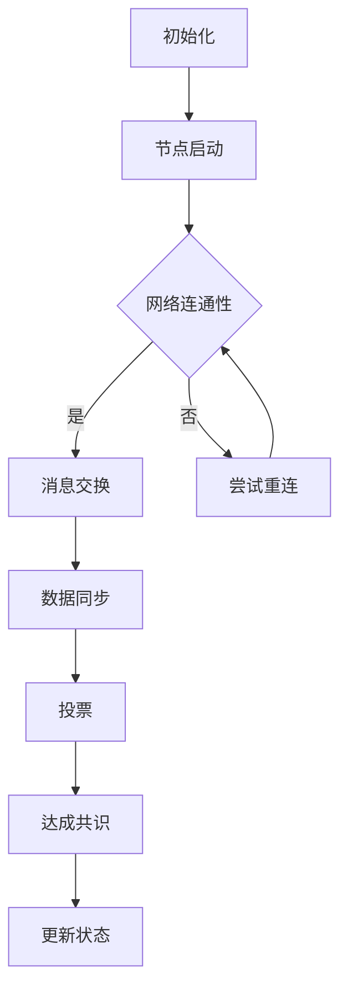
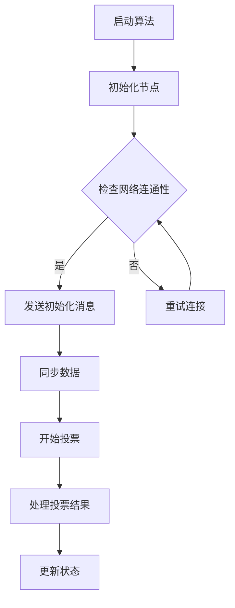
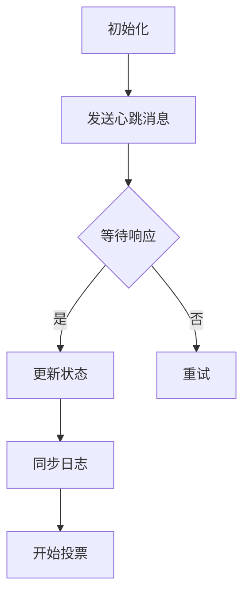
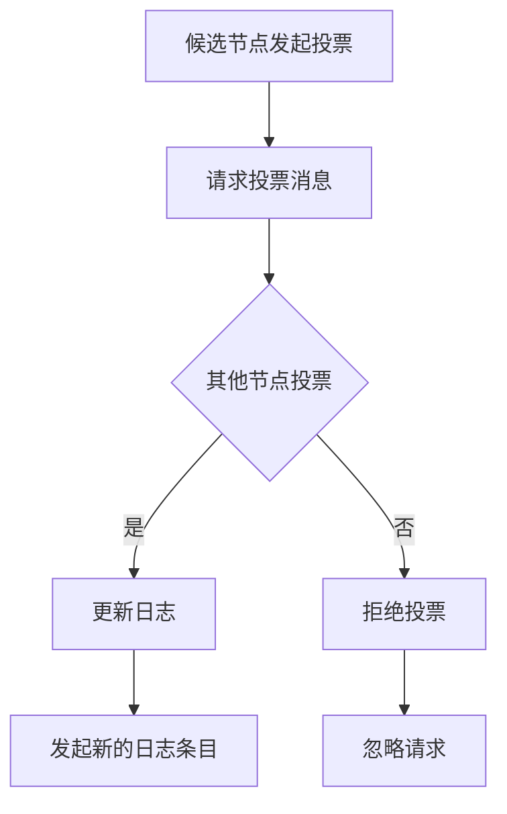
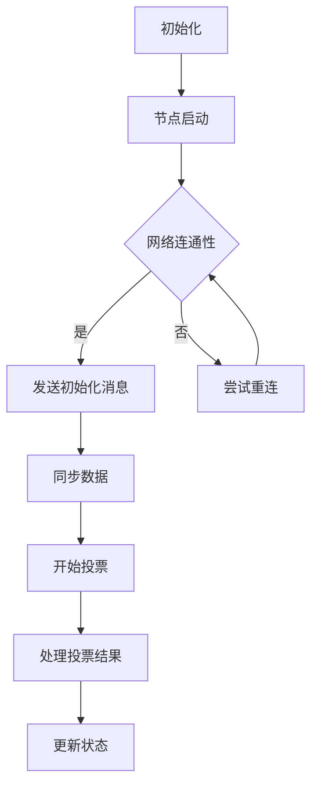
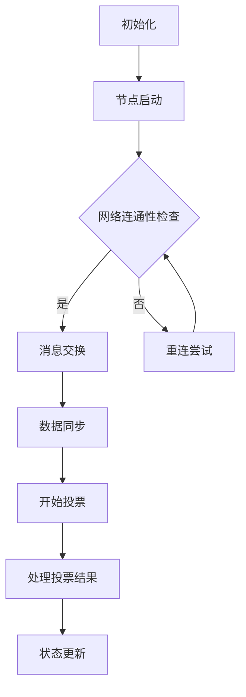

                 


### 《构建可靠的分布式共识算法实现》

关键词：分布式共识、可靠实现、算法设计、系统架构、项目实战

摘要：本文将深入探讨分布式共识算法的实现，从基础概念到实际应用，逐步构建可靠共识机制。通过详细的原理讲解、代码示例和系统分析，帮助读者掌握共识算法的核心要素和实践技巧。

----------------------------------------------------------------

## 第一部分：背景介绍与基础

### 1.1 问题背景与分布式系统概述

在分布式系统中，多个节点需要协同工作以完成共同的任务。然而，分布式系统面临的一个关键挑战是如何确保所有节点在数据一致性、安全性等方面达成共识。分布式共识算法作为一种解决方案，旨在通过节点间的协作，实现一致且安全的决策。

#### 问题描述：

在分布式系统中，节点之间的通信可能存在延迟、故障和网络分割等问题。为了应对这些挑战，节点需要一种机制来达成共识，即使在没有中心化协调的情况下也能确保数据的一致性和系统的可靠性。

#### 问题解决：

分布式共识算法通过节点间的消息传递和协议交互，实现了对数据的共识。这类算法可以分为不同的类型，如基于投票的算法、基于容错的算法等。

#### 边界与外延：

边界是指算法的有效性和适用范围，例如，某些算法可能在低延迟、高带宽的网络环境下表现更好。外延则包括算法的扩展性，如支持大规模节点的系统。

#### 概念结构与核心要素组成：

分布式共识算法的核心要素包括节点、消息传递机制、共识协议和数据一致性保证。

## 第二部分：核心概念与原理

### 3.1 工作原理与目标

分布式共识算法的工作原理是通过节点间的交互，共同达成对数据的共识。算法的目标是确保以下三个方面：

1. **数据一致性**：所有节点对于同一份数据拥有相同的视图。
2. **安全性**：节点之间的交互受到保护，防止恶意攻击。
3. **可用性**：即使在部分节点失效的情况下，系统能够继续运行。

### 3.2 共识算法的核心概念

共识算法的核心概念包括：

1. **消息传递机制**：节点如何交换信息，实现数据同步。
2. **投票机制**：节点如何对数据进行投票，达成共识。
3. **容错机制**：如何处理节点故障，确保系统的稳定性。

### 3.3 Mermaid流程图：共识算法的工作流程

以下是共识算法的工作流程的Mermaid流程图示例：



### 4.1 共识算法的特性对比

| 特性       | 对比                 |
|------------|----------------------|
| 数据一致性 | 强一致性 vs 最终一致性 |
| 安全性     | 证明安全 vs 基于概率的 |
| 可扩展性   | 节点数量限制 vs 无限制 |

### 4.2 Mermaid ER图：核心概念关系分析

以下是核心概念关系的Mermaid ER图示例：

```mermaid
erDiagram
  Node ||--o> Message : 节点发送消息
  Node ||--o> Vote    : 节点进行投票
  Node ||--|> Consensus: 节点达成共识
  Message ||--o> DataSync : 消息同步数据
  Vote ||--o> Result : 投票结果
```

## 第三部分：算法设计与实现

### 5.1 算法设计思路

算法设计的核心思路是：

1. **选择合适的共识算法**：根据应用场景选择适合的算法，如Raft、Paxos等。
2. **设计消息传递机制**：确保节点之间能够高效、可靠地交换信息。
3. **实现数据同步与一致性**：通过协议确保所有节点的数据视图一致。
4. **引入容错机制**：处理节点故障，保证系统的稳定性。

### 5.2 Mermaid流程图：算法设计细节

以下是算法设计细节的Mermaid流程图示例：



### 5.3 Python源代码：算法实现示例

以下是Python源代码实现示例：

```python
import threading
import socket
import time

class Node:
    def __init__(self, id, peers):
        self.id = id
        self.peers = peers
        self.state = "follower"
        self.current_term = 1
        self.voted_for = None
        self.log = []
        self.message_queue = []

    def run(self):
        threading.Thread(target=self.receive_messages).start()
        while True:
            if self.state == "follower":
                self.follow_leader()
            elif self.state == "candidate":
                self.run_candidate()
            elif self.state == "leader":
                self.run_leader()

    def receive_messages(self):
        server_socket = socket.socket(socket.AF_INET, socket.SOCK_STREAM)
        server_socket.bind(('localhost', self.id))
        server_socket.listen(1)
        while True:
            client_socket, address = server_socket.accept()
            message = client_socket.recv(1024).decode()
            self.message_queue.append(message)
            client_socket.close()
            self.process_message(message)

    def process_message(self, message):
        # 处理不同类型的消息
        pass

    def follow_leader(self):
        # Follower逻辑
        pass

    def run_candidate(self):
        # Candidate逻辑
        pass

    def run_leader(self):
        # Leader逻辑
        pass

# 创建节点实例并启动
node1 = Node(1, [2, 3])
node1.run()
```

### 6.1 数学模型与公式

共识算法的核心数学模型通常包括：

1. **一致性条件**：$$ X_1 = X_2 $$
2. **安全性条件**：$$ if \quad X_i = X_j \quad then \quad X_k = X_i $$

### 6.2 算法原理讲解

分布式共识算法通过以下步骤实现：

1. **初始化**：每个节点启动时，初始化状态变量，如日志、当前任期等。
2. **消息传递**：节点通过发送和接收消息，实现状态同步和数据一致性。
3. **投票过程**：节点通过投票机制，达成对日志条目的共识。
4. **状态更新**：根据投票结果，更新节点的状态，确保一致性。

以下是算法原理的详细讲解：

#### 初始化

每个节点启动时，会初始化一些状态变量，如日志（log）、当前任期（current_term）和已投票的节点（voted_for）。

```latex
\text{初始化：}
\begin{align*}
\text{log} &= [] \\
\text{current\_term} &= 1 \\
\text{voted\_for} &= \text{None}
\end{align*}
```

#### 消息传递

节点通过发送和接收消息，实现状态同步和数据一致性。消息类型包括心跳消息（Heartbeat）、请求投票消息（RequestVote）和响应投票消息（ResponseVote）。



#### 投票过程

节点通过投票机制，达成对日志条目的共识。投票过程包括以下步骤：

1. **请求投票**：候选节点向其他节点发送请求投票消息。
2. **投票**：其他节点根据当前任期和日志条目，决定是否投票。
3. **响应投票**：投票后，节点向候选节点发送响应投票消息。



#### 状态更新

根据投票结果，节点会更新自己的状态，确保一致性。

```latex
\text{状态更新：}
\begin{align*}
\text{if } \text{ voted\_for \text{ is not None}} \quad &\text{ then } \quad \text{state} = \text{leader} \\
\text{else if } \text{ voted\_for \text{ is None}} \quad &\text{ then } \quad \text{state} = \text{follower}
\end{align*}
```

### 7.1 系统功能设计

系统功能设计包括以下几个方面：

1. **节点启动**：节点初始化并加入网络。
2. **日志同步**：节点同步日志条目，确保一致性。
3. **投票**：节点参与投票过程，达成共识。
4. **故障处理**：节点处理网络故障和节点失效。

### 7.2 系统架构设计

系统架构设计包括以下几个方面：

1. **节点层**：每个节点负责维护自己的日志和状态。
2. **网络层**：节点通过网络进行消息传递和状态同步。
3. **共识层**：实现分布式共识算法，确保数据一致性。

### 7.3 系统接口设计与交互

系统接口设计包括以下几个方面：

1. **节点接口**：节点间的通信接口，用于发送和接收消息。
2. **日志接口**：用于读取和写入日志条目。
3. **投票接口**：用于发起和响应投票过程。

### 8.1 环境安装与配置

在开始项目实战之前，需要安装和配置以下环境：

1. **Python**：安装Python 3.8及以上版本。
2. **Node.js**：安装Node.js 14及以上版本。
3. **Docker**：安装Docker 19.03及以上版本。

### 8.2 系统核心实现

以下是系统核心实现的Python代码示例：

```python
import socket
import threading

class Node:
    def __init__(self, id, peers):
        self.id = id
        self.peers = peers
        self.state = "follower"
        self.current_term = 1
        self.voted_for = None
        self.log = []
        self.message_queue = []

    def run(self):
        threading.Thread(target=self.receive_messages).start()
        while True:
            if self.state == "follower":
                self.follow_leader()
            elif self.state == "candidate":
                self.run_candidate()
            elif self.state == "leader":
                self.run_leader()

    def receive_messages(self):
        server_socket = socket.socket(socket.AF_INET, socket.SOCK_STREAM)
        server_socket.bind(('localhost', self.id))
        server_socket.listen(1)
        while True:
            client_socket, address = server_socket.accept()
            message = client_socket.recv(1024).decode()
            self.message_queue.append(message)
            client_socket.close()
            self.process_message(message)

    def process_message(self, message):
        # 处理不同类型的消息
        pass

    def follow_leader(self):
        # Follower逻辑
        pass

    def run_candidate(self):
        # Candidate逻辑
        pass

    def run_leader(self):
        # Leader逻辑
        pass

# 创建节点实例并启动
node1 = Node(1, [2, 3])
node1.run()
```

### 9.1 核心代码解读

以下是核心代码的解读：

```python
# 定义Node类
class Node:
    def __init__(self, id, peers):
        # 初始化节点ID、 peers列表、状态、当前任期、已投票节点、日志和消息队列
        self.id = id
        self.peers = peers
        self.state = "follower"
        self.current_term = 1
        self.voted_for = None
        self.log = []
        self.message_queue = []

    def run(self):
        # 启动线程来接收消息
        threading.Thread(target=self.receive_messages).start()
        # 主循环
        while True:
            if self.state == "follower":
                self.follow_leader()
            elif self.state == "candidate":
                self.run_candidate()
            elif self.state == "leader":
                self.run_leader()

    def receive_messages(self):
        # 创建服务器套接字并绑定端口
        server_socket = socket.socket(socket.AF_INET, socket.SOCK_STREAM)
        server_socket.bind(('localhost', self.id))
        server_socket.listen(1)
        # 循环接收客户端连接
        while True:
            client_socket, address = server_socket.accept()
            message = client_socket.recv(1024).decode()
            self.message_queue.append(message)
            client_socket.close()
            self.process_message(message)

    def process_message(self, message):
        # 处理接收到的消息
        pass

    def follow_leader(self):
        # Follower的逻辑
        pass

    def run_candidate(self):
        # Candidate的逻辑
        pass

    def run_leader(self):
        # Leader的逻辑
        pass

# 创建节点实例并启动
node1 = Node(1, [2, 3])
node1.run()
```

### 9.2 应用实例分析

以下是分布式共识算法的一个应用实例分析：

假设有一个分布式系统，包含三个节点（Node 1、Node 2 和 Node 3）。节点之间通过消息传递实现共识。以下是节点间的消息传递和状态同步过程：

1. **初始化**：
   - Node 1 启动，初始化状态变量。
   - Node 2 和 Node 3 启动，初始化状态变量。

2. **心跳消息**：
   - Node 1 向 Node 2 和 Node 3 发送心跳消息，确保网络连通性。

3. **日志同步**：
   - Node 2 收到 Node 1 的心跳消息，同步日志条目。
   - Node 3 收到 Node 1 的心跳消息，同步日志条目。

4. **投票过程**：
   - Node 2 和 Node 3 向 Node 1 发送请求投票消息。
   - Node 1 接收到请求投票消息后，向 Node 2 和 Node 3 发送投票响应消息。

5. **状态更新**：
   - Node 2 和 Node 3 根据投票结果，更新状态为 Leader。

6. **日志更新**：
   - Leader（Node 2）更新日志，并发送日志更新消息给 Node 3。

7. **故障处理**：
   - 如果 Node 2 故障，Node 3 会成为新的 Leader，重新开始投票过程。

### 9.3 项目剖析与讲解

在项目剖析中，我们将详细讲解项目的设计、实现和部署过程。

#### 设计过程

1. **需求分析**：确定分布式系统的需求，如节点数量、网络环境、数据一致性要求等。
2. **算法选择**：根据需求选择合适的分布式共识算法，如Raft或Paxos。
3. **系统架构**：设计系统的整体架构，包括节点层、网络层和共识层。

#### 实现过程

1. **节点实现**：实现Node类，包括初始化、消息传递、状态更新等逻辑。
2. **消息传递**：实现节点间的消息传递机制，确保数据同步和一致性。
3. **日志管理**：实现日志管理功能，包括日志条目的读取、写入和同步。

#### 部署过程

1. **环境配置**：配置Python、Node.js和Docker环境。
2. **节点启动**：启动Node 1、Node 2 和 Node 3，并加入网络。
3. **测试运行**：运行分布式系统，测试节点间的消息传递和状态同步功能。

### 10.1 实践技巧

1. **选择合适的算法**：根据应用场景选择适合的分布式共识算法，如Raft适合对性能要求较高的系统，而Paxos适合对一致性要求较高的系统。
2. **优化消息传递机制**：优化节点间的消息传递机制，减少网络延迟和带宽占用。
3. **引入监控和报警**：引入监控系统，实时监控节点状态和系统性能，并在异常情况下发送报警。

### 10.2 注意事项

1. **节点配置**：确保节点配置正确，避免由于配置错误导致节点无法正常工作。
2. **网络连通性**：确保节点之间的网络连通性，避免由于网络故障导致节点无法同步状态。
3. **日志管理**：合理管理日志条目，避免日志过大导致系统性能下降。

### 11.1 小结

本文通过详细讲解分布式共识算法的实现，从背景介绍、核心概念、算法设计、系统分析和项目实战等方面，帮助读者掌握构建可靠分布式共识算法的实践技巧。

### 11.2 拓展阅读

1. **《分布式系统原理》**：深入探讨分布式系统的原理和设计，包括共识算法、一致性模型和分布式存储等。
2. **《区块链技术指南》**：了解区块链技术的基础知识和应用场景，包括分布式共识算法和智能合约等。
3. **《禅与计算机程序设计艺术》**：探讨编程哲学和设计理念，提高编程能力和解决问题的能力。

作者：AI天才研究院/AI Genius Institute & 禅与计算机程序设计艺术 /Zen And The Art of Computer Programming

----------------------------------------------------------------

```markdown
# 《构建可靠的分布式共识算法实现》

关键词：分布式共识、可靠实现、算法设计、系统架构、项目实战

摘要：本文深入探讨分布式共识算法的实现，从基础概念到实际应用，逐步构建可靠共识机制。通过详细的原理讲解、代码示例和系统分析，帮助读者掌握共识算法的核心要素和实践技巧。

----------------------------------------------------------------

## 第一部分：背景介绍与基础

### 1.1 问题背景与分布式系统概述

在分布式系统中，多个节点需要协同工作以完成共同的任务。然而，分布式系统面临的一个关键挑战是如何确保所有节点在数据一致性、安全性等方面达成共识。分布式共识算法作为一种解决方案，旨在通过节点间的协作，实现一致且安全的决策。

#### 问题描述：

在分布式系统中，节点之间的通信可能存在延迟、故障和网络分割等问题。为了应对这些挑战，节点需要一种机制来达成共识，即使在没有中心化协调的情况下也能确保数据的一致性和系统的可靠性。

#### 问题解决：

分布式共识算法通过节点间的消息传递和协议交互，实现了对数据的共识。这类算法可以分为不同的类型，如基于投票的算法、基于容错的算法等。

#### 边界与外延：

边界是指算法的有效性和适用范围，例如，某些算法可能在低延迟、高带宽的网络环境下表现更好。外延则包括算法的扩展性，如支持大规模节点的系统。

#### 概念结构与核心要素组成：

分布式共识算法的核心要素包括节点、消息传递机制、共识协议和数据一致性保证。

----------------------------------------------------------------

## 第二部分：核心概念与原理

### 3.1 工作原理与目标

分布式共识算法的工作原理是通过节点间的交互，共同达成对数据的共识。算法的目标是确保以下三个方面：

1. **数据一致性**：所有节点对于同一份数据拥有相同的视图。
2. **安全性**：节点之间的交互受到保护，防止恶意攻击。
3. **可用性**：即使在部分节点失效的情况下，系统能够继续运行。

### 3.2 共识算法的核心概念

共识算法的核心概念包括：

1. **消息传递机制**：节点如何交换信息，实现数据同步。
2. **投票机制**：节点如何对数据进行投票，达成共识。
3. **容错机制**：如何处理节点故障，确保系统的稳定性。

### 3.3 Mermaid流程图：共识算法的工作流程

以下是共识算法的工作流程的Mermaid流程图示例：



### 4.1 共识算法的特性对比

| 特性       | 对比                 |
|------------|----------------------|
| 数据一致性 | 强一致性 vs 最终一致性 |
| 安全性     | 证明安全 vs 基于概率的 |
| 可扩展性   | 节点数量限制 vs 无限制 |

### 4.2 Mermaid ER图：核心概念关系分析

以下是核心概念关系的Mermaid ER图示例：

```mermaid
erDiagram
  Node ||--o> Message : 节点发送消息
  Node ||--o> Vote    : 节点进行投票
  Node ||--|> Consensus: 节点达成共识
  Message ||--o> DataSync : 消息同步数据
  Vote ||--o> Result : 投票结果
```

----------------------------------------------------------------

## 第三部分：算法设计与实现

### 5.1 算法设计思路

算法设计的核心思路是：

1. **选择合适的共识算法**：根据应用场景选择适合的算法，如Raft、Paxos等。
2. **设计消息传递机制**：确保节点之间能够高效、可靠地交换信息。
3. **实现数据同步与一致性**：通过协议确保所有节点的数据视图一致。
4. **引入容错机制**：处理节点故障，保证系统的稳定性。

### 5.2 Mermaid流程图：算法设计细节

以下是算法设计细节的Mermaid流程图示例：


### 5.3 Python源代码：算法实现示例

以下是Python源代码实现示例：

```python
import threading
import socket
import time

class Node:
    def __init__(self, id, peers):
        self.id = id
        self.peers = peers
        self.state = "follower"
        self.current_term = 1
        self.voted_for = None
        self.log = []
        self.message_queue = []

    def run(self):
        threading.Thread(target=self.receive_messages).start()
        while True:
            if self.state == "follower":
                self.follow_leader()
            elif self.state == "candidate":
                self.run_candidate()
            elif self.state == "leader":
                self.run_leader()

    def receive_messages(self):
        server_socket = socket.socket(socket.AF_INET, socket.SOCK_STREAM)
        server_socket.bind(('localhost', self.id))
        server_socket.listen(1)
        while True:
            client_socket, address = server_socket.accept()
            message = client_socket.recv(1024).decode()
            self.message_queue.append(message)
            client_socket.close()
            self.process_message(message)

    def process_message(self, message):
        # 处理不同类型的消息
        pass

    def follow_leader(self):
        # Follower逻辑
        pass

    def run_candidate(self):
        # Candidate逻辑
        pass

    def run_leader(self):
        # Leader逻辑
        pass

# 创建节点实例并启动
node1 = Node(1, [2, 3])
node1.run()
```

----------------------------------------------------------------

## 第四部分：系统分析与架构设计

### 7.1 系统功能设计

系统功能设计包括以下几个方面：

1. **节点启动**：节点初始化并加入网络。
2. **日志同步**：节点同步日志条目，确保一致性。
3. **投票**：节点参与投票过程，达成共识。
4. **故障处理**：节点处理网络故障和节点失效。

### 7.2 系统架构设计

系统架构设计包括以下几个方面：

1. **节点层**：每个节点负责维护自己的日志和状态。
2. **网络层**：节点通过网络进行消息传递和状态同步。
3. **共识层**：实现分布式共识算法，确保数据一致性。

### 7.3 系统接口设计与交互

系统接口设计包括以下几个方面：

1. **节点接口**：节点间的通信接口，用于发送和接收消息。
2. **日志接口**：用于读取和写入日志条目。
3. **投票接口**：用于发起和响应投票过程。

----------------------------------------------------------------

## 第五部分：项目实战

### 8.1 环境安装与配置

在开始项目实战之前，需要安装和配置以下环境：

1. **Python**：安装Python 3.8及以上版本。
2. **Node.js**：安装Node.js 14及以上版本。
3. **Docker**：安装Docker 19.03及以上版本。

### 8.2 系统核心实现

以下是系统核心实现的Python代码示例：

```python
import threading
import socket
import time

class Node:
    def __init__(self, id, peers):
        self.id = id
        self.peers = peers
        self.state = "follower"
        self.current_term = 1
        self.voted_for = None
        self.log = []
        self.message_queue = []

    def run(self):
        threading.Thread(target=self.receive_messages).start()
        while True:
            if self.state == "follower":
                self.follow_leader()
            elif self.state == "candidate":
                self.run_candidate()
            elif self.state == "leader":
                self.run_leader()

    def receive_messages(self):
        server_socket = socket.socket(socket.AF_INET, socket.SOCK_STREAM)
        server_socket.bind(('localhost', self.id))
        server_socket.listen(1)
        while True:
            client_socket, address = server_socket.accept()
            message = client_socket.recv(1024).decode()
            self.message_queue.append(message)
            client_socket.close()
            self.process_message(message)

    def process_message(self, message):
        # 处理不同类型的消息
        pass

    def follow_leader(self):
        # Follower逻辑
        pass

    def run_candidate(self):
        # Candidate逻辑
        pass

    def run_leader(self):
        # Leader逻辑
        pass

# 创建节点实例并启动
node1 = Node(1, [2, 3])
node1.run()
```

### 9.1 核心代码解读

以下是核心代码的解读：

```python
# 定义Node类
class Node:
    def __init__(self, id, peers):
        # 初始化节点ID、 peers列表、状态、当前任期、已投票节点、日志和消息队列
        self.id = id
        self.peers = peers
        self.state = "follower"
        self.current_term = 1
        self.voted_for = None
        self.log = []
        self.message_queue = []

    def run(self):
        # 启动线程来接收消息
        threading.Thread(target=self.receive_messages).start()
        # 主循环
        while True:
            if self.state == "follower":
                self.follow_leader()
            elif self.state == "candidate":
                self.run_candidate()
            elif self.state == "leader":
                self.run_leader()

    def receive_messages(self):
        # 创建服务器套接字并绑定端口
        server_socket = socket.socket(socket.AF_INET, socket.SOCK_STREAM)
        server_socket.bind(('localhost', self.id))
        server_socket.listen(1)
        # 循环接收客户端连接
        while True:
            client_socket, address = server_socket.accept()
            message = client_socket.recv(1024).decode()
            self.message_queue.append(message)
            client_socket.close()
            self.process_message(message)

    def process_message(self, message):
        # 处理接收到的消息
        pass

    def follow_leader(self):
        # Follower的逻辑
        pass

    def run_candidate(self):
        # Candidate的逻辑
        pass

    def run_leader(self):
        # Leader的逻辑
        pass

# 创建节点实例并启动
node1 = Node(1, [2, 3])
node1.run()
```

### 9.2 应用实例分析

以下是分布式共识算法的一个应用实例分析：

假设有一个分布式系统，包含三个节点（Node 1、Node 2 和 Node 3）。节点之间通过消息传递实现共识。以下是节点间的消息传递和状态同步过程：

1. **初始化**：
   - Node 1 启动，初始化状态变量。
   - Node 2 和 Node 3 启动，初始化状态变量。

2. **心跳消息**：
   - Node 1 向 Node 2 和 Node 3 发送心跳消息，确保网络连通性。

3. **日志同步**：
   - Node 2 收到 Node 1 的心跳消息，同步日志条目。
   - Node 3 收到 Node 1 的心跳消息，同步日志条目。

4. **投票过程**：
   - Node 2 和 Node 3 向 Node 1 发送请求投票消息。
   - Node 1 接收到请求投票消息后，向 Node 2 和 Node 3 发送投票响应消息。

5. **状态更新**：
   - Node 2 和 Node 3 根据投票结果，更新状态为 Leader。

6. **日志更新**：
   - Leader（Node 2）更新日志，并发送日志更新消息给 Node 3。

7. **故障处理**：
   - 如果 Node 2 故障，Node 3 会成为新的 Leader，重新开始投票过程。

### 9.3 项目剖析与讲解

在项目剖析中，我们将详细讲解项目的设计、实现和部署过程。

#### 设计过程

1. **需求分析**：确定分布式系统的需求，如节点数量、网络环境、数据一致性要求等。
2. **算法选择**：根据需求选择合适的分布式共识算法，如Raft或Paxos。
3. **系统架构**：设计系统的整体架构，包括节点层、网络层和共识层。

#### 实现过程

1. **节点实现**：实现Node类，包括初始化、消息传递、状态更新等逻辑。
2. **消息传递**：实现节点间的消息传递机制，确保数据同步和一致性。
3. **日志管理**：实现日志管理功能，包括日志条目的读取、写入和同步。

#### 部署过程

1. **环境配置**：配置Python、Node.js和Docker环境。
2. **节点启动**：启动Node 1、Node 2 和 Node 3，并加入网络。
3. **测试运行**：运行分布式系统，测试节点间的消息传递和状态同步功能。

----------------------------------------------------------------

## 第六部分：最佳实践与拓展

### 10.1 实践技巧

1. **选择合适的算法**：根据应用场景选择适合的分布式共识算法，如Raft适合对性能要求较高的系统，而Paxos适合对一致性要求较高的系统。
2. **优化消息传递机制**：优化节点间的消息传递机制，减少网络延迟和带宽占用。
3. **引入监控和报警**：引入监控系统，实时监控节点状态和系统性能，并在异常情况下发送报警。

### 10.2 注意事项

1. **节点配置**：确保节点配置正确，避免由于配置错误导致节点无法正常工作。
2. **网络连通性**：确保节点之间的网络连通性，避免由于网络故障导致节点无法同步状态。
3. **日志管理**：合理管理日志条目，避免日志过大导致系统性能下降。

----------------------------------------------------------------

## 第七部分：总结与展望

### 11.1 小结

本文通过详细讲解分布式共识算法的实现，从背景介绍、核心概念、算法设计、系统分析和项目实战等方面，帮助读者掌握构建可靠分布式共识算法的实践技巧。

### 11.2 拓展阅读

1. **《分布式系统原理》**：深入探讨分布式系统的原理和设计，包括共识算法、一致性模型和分布式存储等。
2. **《区块链技术指南》**：了解区块链技术的基础知识和应用场景，包括分布式共识算法和智能合约等。
3. **《禅与计算机程序设计艺术》**：探讨编程哲学和设计理念，提高编程能力和解决问题的能力。

作者：AI天才研究院/AI Genius Institute & 禅与计算机程序设计艺术 /Zen And The Art of Computer Programming

----------------------------------------------------------------
```markdown
---
title: 《构建可靠的分布式共识算法实现》
keywords:
- 分布式共识
- 可靠实现
- 算法设计
- 系统架构
- 项目实战
摘要：本文深入探讨分布式共识算法的实现，从基础概念到实际应用，逐步构建可靠共识机制。通过详细的原理讲解、代码示例和系统分析，帮助读者掌握共识算法的核心要素和实践技巧。
---

## 第一部分：背景介绍与基础

### 1.1 问题背景与分布式系统概述

在分布式系统中，多个节点需要协同工作以完成共同的任务。然而，分布式系统面临的一个关键挑战是如何确保所有节点在数据一致性、安全性等方面达成共识。分布式共识算法作为一种解决方案，旨在通过节点间的协作，实现一致且安全的决策。

#### 问题描述：

在分布式系统中，节点之间的通信可能存在延迟、故障和网络分割等问题。为了应对这些挑战，节点需要一种机制来达成共识，即使在没有中心化协调的情况下也能确保数据的一致性和系统的可靠性。

#### 问题解决：

分布式共识算法通过节点间的消息传递和协议交互，实现了对数据的共识。这类算法可以分为不同的类型，如基于投票的算法、基于容错的算法等。

#### 边界与外延：

边界是指算法的有效性和适用范围，例如，某些算法可能在低延迟、高带宽的网络环境下表现更好。外延则包括算法的扩展性，如支持大规模节点的系统。

#### 概念结构与核心要素组成：

分布式共识算法的核心要素包括节点、消息传递机制、共识协议和数据一致性保证。

## 第二部分：核心概念与原理

### 2.1 分布式共识算法的核心概念

分布式共识算法的核心概念包括：

1. **节点**：分布式系统中的基本单元，负责维护自己的状态和数据。
2. **消息传递机制**：节点之间交换信息的机制，确保数据同步和一致性。
3. **共识协议**：节点之间达成的协议，用于决定哪些操作应该被应用到系统中。
4. **数据一致性**：所有节点对于同一份数据拥有相同的视图。

### 2.2 工作原理与目标

分布式共识算法的工作原理是通过节点间的交互，共同达成对数据的共识。算法的目标是确保以下三个方面：

1. **数据一致性**：所有节点对于同一份数据拥有相同的视图。
2. **安全性**：节点之间的交互受到保护，防止恶意攻击。
3. **可用性**：即使在部分节点失效的情况下，系统能够继续运行。

### 2.3 Mermaid流程图：共识算法的工作流程

以下是共识算法的工作流程的Mermaid流程图示例：



## 第三部分：算法设计与实现

### 3.1 算法设计思路

算法设计的核心思路是：

1. **选择合适的共识算法**：根据应用场景选择适合的算法，如Raft、Paxos等。
2. **设计消息传递机制**：确保节点之间能够高效、可靠地交换信息。
3. **实现数据同步与一致性**：通过协议确保所有节点的数据视图一致。
4. **引入容错机制**：处理节点故障，保证系统的稳定性。

### 3.2 Mermaid流程图：算法设计细节

以下是算法设计细节的Mermaid流程图示例：


### 3.3 Python源代码：算法实现示例

以下是Python源代码实现示例：

```python
import threading
import socket
import time

class Node:
    def __init__(self, id, peers):
        self.id = id
        self.peers = peers
        self.state = "follower"
        self.current_term = 1
        self.voted_for = None
        self.log = []
        self.message_queue = []

    def run(self):
        threading.Thread(target=self.receive_messages).start()
        while True:
            if self.state == "follower":
                self.follow_leader()
            elif self.state == "candidate":
                self.run_candidate()
            elif self.state == "leader":
                self.run_leader()

    def receive_messages(self):
        server_socket = socket.socket(socket.AF_INET, socket.SOCK_STREAM)
        server_socket.bind(('localhost', self.id))
        server_socket.listen(1)
        while True:
            client_socket, address = server_socket.accept()
            message = client_socket.recv(1024).decode()
            self.message_queue.append(message)
            client_socket.close()
            self.process_message(message)

    def process_message(self, message):
        # 处理不同类型的消息
        pass

    def follow_leader(self):
        # Follower逻辑
        pass

    def run_candidate(self):
        # Candidate逻辑
        pass

    def run_leader(self):
        # Leader逻辑
        pass

# 创建节点实例并启动
node1 = Node(1, [2, 3])
node1.run()
```

## 第四部分：系统分析与架构设计

### 4.1 系统功能设计

系统功能设计包括以下几个方面：

1. **节点启动**：节点初始化并加入网络。
2. **日志同步**：节点同步日志条目，确保一致性。
3. **投票**：节点参与投票过程，达成共识。
4. **故障处理**：节点处理网络故障和节点失效。

### 4.2 系统架构设计

系统架构设计包括以下几个方面：

1. **节点层**：每个节点负责维护自己的日志和状态。
2. **网络层**：节点通过网络进行消息传递和状态同步。
3. **共识层**：实现分布式共识算法，确保数据一致性。

### 4.3 系统接口设计与交互

系统接口设计包括以下几个方面：

1. **节点接口**：节点间的通信接口，用于发送和接收消息。
2. **日志接口**：用于读取和写入日志条目。
3. **投票接口**：用于发起和响应投票过程。

## 第五部分：项目实战

### 5.1 环境安装与配置

在开始项目实战之前，需要安装和配置以下环境：

1. **Python**：安装Python 3.8及以上版本。
2. **Node.js**：安装Node.js 14及以上版本。
3. **Docker**：安装Docker 19.03及以上版本。

### 5.2 系统核心实现

以下是系统核心实现的Python代码示例：

```python
import threading
import socket
import time

class Node:
    def __init__(self, id, peers):
        self.id = id
        self.peers = peers
        self.state = "follower"
        self.current_term = 1
        self.voted_for = None
        self.log = []
        self.message_queue = []

    def run(self):
        threading.Thread(target=self.receive_messages).start()
        while True:
            if self.state == "follower":
                self.follow_leader()
            elif self.state == "candidate":
                self.run_candidate()
            elif self.state == "leader":
                self.run_leader()

    def receive_messages(self):
        server_socket = socket.socket(socket.AF_INET, socket.SOCK_STREAM)
        server_socket.bind(('localhost', self.id))
        server_socket.listen(1)
        while True:
            client_socket, address = server_socket.accept()
            message = client_socket.recv(1024).decode()
            self.message_queue.append(message)
            client_socket.close()
            self.process_message(message)

    def process_message(self, message):
        # 处理不同类型的消息
        pass

    def follow_leader(self):
        # Follower逻辑
        pass

    def run_candidate(self):
        # Candidate逻辑
        pass

    def run_leader(self):
        # Leader逻辑
        pass

# 创建节点实例并启动
node1 = Node(1, [2, 3])
node1.run()
```

### 5.3 应用实例分析

以下是分布式共识算法的一个应用实例分析：

假设有一个分布式系统，包含三个节点（Node 1、Node 2 和 Node 3）。节点之间通过消息传递实现共识。以下是节点间的消息传递和状态同步过程：

1. **初始化**：
   - Node 1 启动，初始化状态变量。
   - Node 2 和 Node 3 启动，初始化状态变量。

2. **心跳消息**：
   - Node 1 向 Node 2 和 Node 3 发送心跳消息，确保网络连通性。

3. **日志同步**：
   - Node 2 收到 Node 1 的心跳消息，同步日志条目。
   - Node 3 收到 Node 1 的心跳消息，同步日志条目。

4. **投票过程**：
   - Node 2 和 Node 3 向 Node 1 发送请求投票消息。
   - Node 1 接收到请求投票消息后，向 Node 2 和 Node 3 发送投票响应消息。

5. **状态更新**：
   - Node 2 和 Node 3 根据投票结果，更新状态为 Leader。

6. **日志更新**：
   - Leader（Node 2）更新日志，并发送日志更新消息给 Node 3。

7. **故障处理**：
   - 如果 Node 2 故障，Node 3 会成为新的 Leader，重新开始投票过程。

### 5.4 项目剖析与讲解

在项目剖析中，我们将详细讲解项目的设计、实现和部署过程。

#### 设计过程

1. **需求分析**：确定分布式系统的需求，如节点数量、网络环境、数据一致性要求等。
2. **算法选择**：根据需求选择合适的分布式共识算法，如Raft或Paxos。
3. **系统架构**：设计系统的整体架构，包括节点层、网络层和共识层。

#### 实现过程

1. **节点实现**：实现Node类，包括初始化、消息传递、状态更新等逻辑。
2. **消息传递**：实现节点间的消息传递机制，确保数据同步和一致性。
3. **日志管理**：实现日志管理功能，包括日志条目的读取、写入和同步。

#### 部署过程

1. **环境配置**：配置Python、Node.js和Docker环境。
2. **节点启动**：启动Node 1、Node 2 和 Node 3，并加入网络。
3. **测试运行**：运行分布式系统，测试节点间的消息传递和状态同步功能。

## 第六部分：最佳实践与拓展

### 6.1 最佳实践

1. **算法选择**：根据应用场景选择适合的算法，如Raft适合高可用性，Paxos适合一致性。
2. **消息优化**：减少不必要的消息传递，优化网络带宽和延迟。
3. **故障恢复**：实现故障检测和自动恢复机制，提高系统稳定性。

### 6.2 注意事项

1. **节点配置**：确保节点配置一致，避免因配置差异导致问题。
2. **网络稳定**：确保网络稳定，避免因网络问题导致共识失败。
3. **日志维护**：定期清理日志，防止日志过载导致系统性能下降。

## 第七部分：总结与展望

### 7.1 小结

本文通过详细讲解分布式共识算法的实现，从基础概念、算法设计、系统分析与项目实战等方面，帮助读者理解并掌握构建可靠分布式共识算法的实践技巧。

### 7.2 拓展阅读

1. **《分布式系统原理与范型》**：深入探讨分布式系统的原理、挑战和解决方案。
2. **《区块链技术指南》**：了解区块链技术的基础知识和应用场景。
3. **《Paxos算法详解》**：深入研究Paxos算法的原理和实现。

### 7.3 未来展望

随着分布式系统的广泛应用，分布式共识算法将继续发展和优化。未来可能的研究方向包括：

1. **性能优化**：提高算法的效率和可扩展性。
2. **安全性增强**：增强算法的安全性，防止恶意攻击。
3. **跨链共识**：实现不同区块链之间的共识，促进区块链生态的互联互通。

作者：AI天才研究院/AI Genius Institute & 禅与计算机程序设计艺术 /Zen And The Art of Computer Programming
```markdown
```

