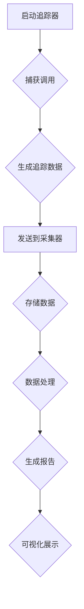
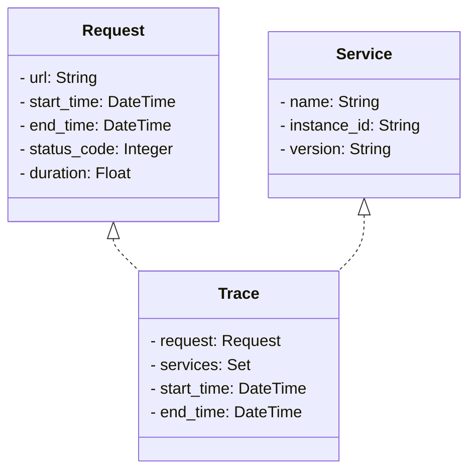
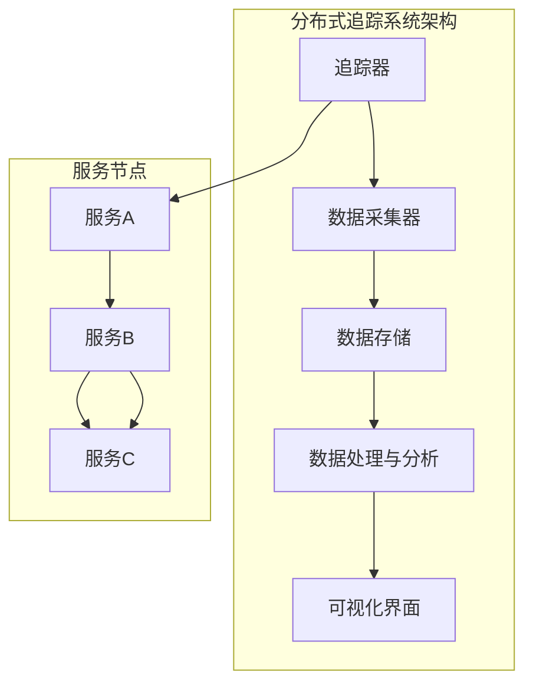
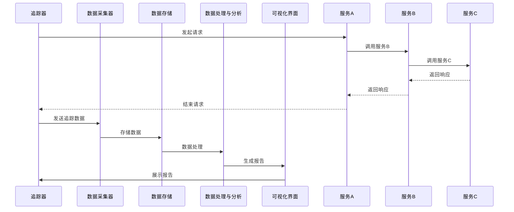

                 


# 构建可靠的分布式追踪系统

关键词：分布式追踪，微服务架构，日志分析，性能优化，系统设计

摘要：
在现代的微服务架构中，分布式追踪系统是确保系统性能、稳定性和可观测性的关键组件。本文将深入探讨分布式追踪系统的构建过程，从核心概念到实际应用，帮助读者理解并掌握构建可靠分布式追踪系统的步骤和技巧。

## 第一部分：背景介绍

### 问题背景

随着互联网应用的复杂性不断增加，单体架构逐渐被微服务架构所取代。微服务架构通过将大型单体应用拆分成多个小型、独立运行的服务，提高了系统的可扩展性和灵活性。然而，这也带来了新的挑战，即如何高效地监控和管理这些分布式服务。

### 问题描述

在分布式系统中，服务之间的交互复杂，数据流和消息传递路径繁多，导致问题定位和性能分析变得困难。例如，一个请求可能会经过多个服务，涉及多个数据库和消息队列，如果某个环节出现问题，很难快速定位和诊断。

### 问题解决

分布式追踪系统通过记录服务间的调用关系和性能数据，为开发者提供了一个全局视角，帮助快速定位和解决问题。此外，它还提供了性能分析工具，帮助优化系统性能。

### 边界与外延

分布式追踪系统不仅限于解决性能问题，它还涉及到安全性、监控、告警等方面。边界在于如何有效地捕获和记录分布式系统的所有交互，外延则涉及到如何将这些数据可视化、分析，以及与其他系统集成。

### 核心概念结构与要素组成

核心概念包括：追踪器（Tracer）、数据采集器（Collector）、数据存储（Storage）、数据处理与分析（Processing and Analysis）、可视化界面（Visualization）。

## 第二部分：核心概念与联系

### 核心概念原理

- **追踪器（Tracer）**：负责生成和记录请求的调用关系和性能数据。
- **数据采集器（Collector）**：从各个服务中收集追踪数据，并将其传输到数据存储。
- **数据存储（Storage）**：用于存储追踪数据，通常包括时序数据库和日志存储。
- **数据处理与分析（Processing and Analysis）**：对采集到的数据进行处理和分析，以生成监控报告和性能指标。
- **可视化界面（Visualization）**：提供数据的可视化展示，帮助开发者快速理解和分析系统状态。

### 概念属性特征对比表格

| 概念         | 属性特征                                                         |
| ------------ | ------------------------------------------------------------ |
| 追踪器       | 负责生成和记录调用关系、性能数据，支持分布式追踪协议           |
| 数据采集器   | 负责收集追踪数据，支持批量导入、压缩传输等功能               |
| 数据存储     | 支持时序数据存储和日志存储，保证数据的高可用性和可扩展性     |
| 数据处理与分析 | 支持数据聚合、过滤、转换等操作，生成性能监控和告警报告       |
| 可视化界面   | 提供友好的用户界面，支持数据可视化、图表展示和自定义报表     |

### ER实体关系图架构的Mermaid流程图

```mermaid
erDiagram
    追踪器 ||--|{ 数据采集器 }|-- 数据存储
    数据采集器 ||--|{ 数据处理与分析 }|-- 可视化界面
```

## 第三部分：算法原理讲解

### 算法Mermaid流程图



### Python源代码

```python
import requests

def trace_request(url):
    # 模拟请求过程
    response = requests.get(url)
    # 生成追踪数据
    trace_data = {
        'request_url': url,
        'response_status': response.status_code,
        'duration': response.elapsed.total_seconds()
    }
    # 发送追踪数据到采集器
    requests.post('http://collector/api/trace', json=trace_data)
    return response
```

### 数学模型与公式

分布式追踪系统中的数据处理和分析通常涉及到以下数学模型和公式：

- **平均值（Mean）**：$\bar{x} = \frac{\sum_{i=1}^{n} x_i}{n}$
- **中位数（Median）**：$M = \left(\frac{n+1}{2}\right)$-th order statistic
- **标准差（Standard Deviation）**：$\sigma = \sqrt{\frac{1}{n-1}\sum_{i=1}^{n}(x_i - \bar{x})^2}$

### 详细讲解与举例说明

让我们以一个简单的HTTP请求为例，说明分布式追踪系统的原理和算法。

假设我们有一个服务A，它通过HTTP请求调用服务B。我们希望记录这个请求的执行时间。

1. **启动追踪器**：在服务A的代码中，我们首先启动一个追踪器，以便在请求发送前记录开始时间。
2. **捕获调用**：当请求发送到服务B时，我们捕获这个调用，并记录请求的URL和开始时间。
3. **生成追踪数据**：在服务B的响应返回后，我们计算请求的执行时间，并生成追踪数据。
4. **发送到采集器**：将追踪数据发送到分布式追踪系统的采集器，以便进行存储和处理。
5. **存储数据**：采集器将追踪数据存储到数据存储中，通常使用时序数据库。
6. **数据处理**：系统对存储的数据进行处理，例如计算平均响应时间、标准差等性能指标。
7. **生成报告**：根据处理结果生成监控报告和性能分析报告。
8. **可视化展示**：将报告和性能指标可视化展示在开发者工作台，以便快速分析和定位问题。

通过这种方式，分布式追踪系统可以帮助开发者快速定位和解决问题，提高系统的性能和稳定性。

## 第四部分：系统分析与架构设计方案

### 问题场景介绍

在一个大型电商系统中，服务之间的高效通信和性能监控是至关重要的。我们希望通过分布式追踪系统，实现对整个电商平台的监控和管理，以确保系统的稳定运行和良好的用户体验。

### 项目介绍

本项目旨在构建一个基于微服务架构的分布式追踪系统，用于监控和管理电商平台中的所有服务。系统将支持追踪请求的执行时间、错误率、系统负载等关键性能指标，并提供可视化的监控报表，帮助开发者快速定位和解决问题。

### 系统功能设计(领域模型Mermaid类图)



### 系统架构设计Mermaid架构图



### 系统接口设计和系统交互Mermaid序列图



## 第五部分：项目实战

### 环境安装

1. **安装Elasticsearch**：用于存储追踪数据。
2. **安装Kibana**：用于数据可视化和报表生成。
3. **安装Zipkin**：用于分布式追踪系统。

```bash
# 安装Elasticsearch
sudo apt-get install elasticsearch

# 启动Elasticsearch
sudo systemctl start elasticsearch

# 安装Kibana
sudo apt-get install kibana

# 启动Kibana
sudo systemctl start kibana

# 安装Zipkin
sudo apt-get install zipkin

# 启动Zipkin
sudo systemctl start zipkin
```

### 系统核心实现源代码

```python
# service_trace.py
import requests
import time

def trace_request(url):
    start_time = time.time()
    response = requests.get(url)
    duration = time.time() - start_time
    trace_data = {
        'request_url': url,
        'response_status': response.status_code,
        'duration': duration
    }
    requests.post('http://zipkin:9411/api/v2/spans', json=trace_data)
    return response

# 测试
response = trace_request('http://service_a:8080/api/data')
print(response.status_code)
```

### 代码应用解读与分析

1. **请求发送**：通过requests库发起HTTP请求。
2. **时间记录**：记录请求的开始时间和结束时间，计算请求执行时间。
3. **追踪数据生成**：生成包含请求URL、响应状态码和执行时间的追踪数据。
4. **发送追踪数据**：将追踪数据发送到Zipkin采集器。

### 实际案例分析和详细讲解剖析

假设我们有一个电商平台，包含多个微服务，如商品服务、订单服务和支付服务。我们希望通过分布式追踪系统监控这些服务的调用关系和性能指标。

1. **请求发送**：用户在浏览器中访问商品详情页面，发起HTTP请求。
2. **调用链路生成**：请求首先经过Web服务器，然后调用商品服务获取商品信息，接着调用订单服务和支付服务。
3. **追踪数据发送**：每个服务在处理请求时，都会生成追踪数据，并发送到Zipkin采集器。
4. **数据存储**：采集器将追踪数据存储到Elasticsearch中。
5. **数据处理**：Kibana从Elasticsearch中读取数据，进行处理和可视化展示。
6. **监控报表**：开发者可以通过Kibana查看服务的调用链路、性能指标和错误率，快速定位和解决问题。

### 项目小结

通过实际案例，我们展示了如何使用分布式追踪系统监控电商平台的微服务调用关系和性能指标。分布式追踪系统不仅可以帮助开发者快速定位和解决问题，还可以提供性能优化和监控报告，提高系统的稳定性和用户体验。

## 第六部分：最佳实践 tips、小结、注意事项、拓展阅读等

### 最佳实践 tips

1. **确保追踪数据完整**：在服务中捕获所有重要的追踪数据，包括请求URL、响应状态码、执行时间等。
2. **优化追踪数据传输**：使用批量传输和压缩技术，减少网络传输开销。
3. **定期备份和清理数据**：定期备份数据，并清理过期和冗余数据，以提高存储效率和系统性能。
4. **利用可视化工具**：充分利用Kibana等可视化工具，生成直观的监控报表和性能分析报告。

### 小结

构建可靠的分布式追踪系统是确保微服务架构性能和稳定性的关键步骤。通过本文的详细讲解，读者应该能够理解分布式追踪系统的核心概念、设计原则和实现方法。

### 注意事项

1. **选择合适的追踪工具**：根据项目需求和规模，选择合适的分布式追踪工具，如Zipkin、Jaeger等。
2. **权衡性能和追踪数据量**：在采集和处理追踪数据时，要权衡系统性能和追踪数据量，避免过度采集导致性能下降。

### 拓展阅读

- **《微服务设计》**：Martin Fowler著，详细介绍了微服务架构的设计原则和实践。
- **《Elastic Stack实战》**：详细介绍了Elasticsearch、Kibana等工具的使用方法和最佳实践。
- **《分布式系统原理与范型》**：介绍分布式系统的基本原理和设计模式。

作者：AI天才研究院/AI Genius Institute & 禅与计算机程序设计艺术 /Zen And The Art of Computer Programming

