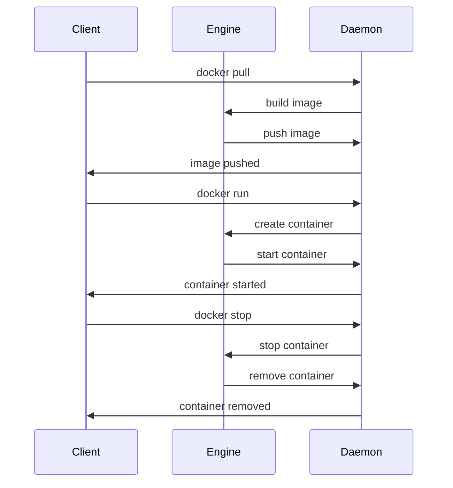
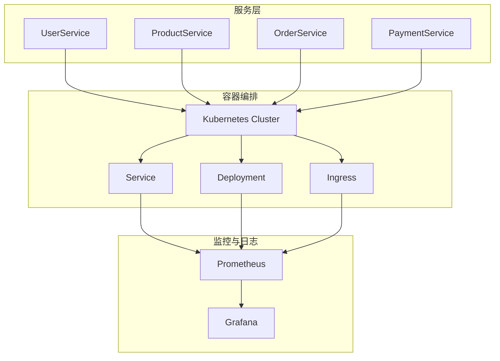
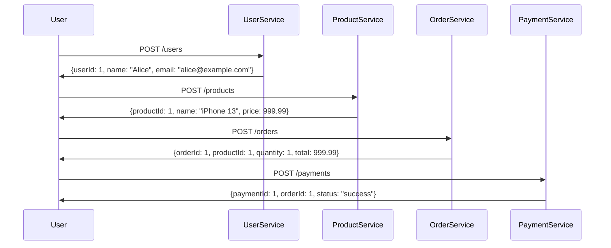
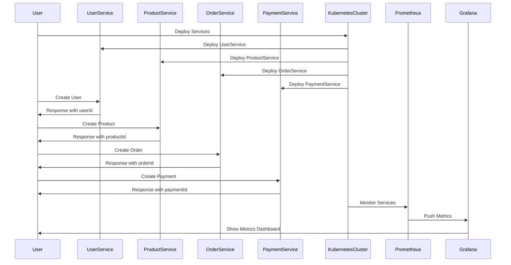

                 

## 引言：容器化部署的背景和重要性

### 1.1 容器化部署的背景

容器化技术作为一种新兴的软件部署方式，自其诞生以来便受到了广泛关注。回顾历史，容器化的概念最早可以追溯到20世纪80年代的操作系统领域。当时，Unix系统的进程隔离技术为容器化的发展奠定了基础。然而，真正推动容器化技术走向主流的是2006年开源项目LXC（Linux Container）的推出。随后，Docker的问世进一步加速了容器技术的发展。

在传统的软件部署模式中，应用程序往往需要依赖于特定的操作系统环境和配置，导致部署过程复杂且难以移植。而容器化通过将应用程序及其运行时环境打包成一个独立的容器，使得应用程序可以在不同的操作系统和硬件平台上无缝运行，从而解决了环境依赖性问题。这种轻量级、可移植的部署方式逐渐成为现代软件开发和运维的标配。

### 1.2 容器化部署的重要性

容器化部署的重要性主要体现在以下几个方面：

1. **提高开发效率**：容器化使得开发人员可以在本地环境中快速搭建与生产环境一致的测试环境，减少环境差异带来的问题，加速开发周期。

2. **简化运维管理**：容器编排工具如Docker、Kubernetes等提供了高效的自动化部署、扩缩容和管理功能，降低了运维成本，提高了系统稳定性。

3. **资源利用率**：容器技术通过共享宿主机的操作系统内核，实现了高效的资源利用。相较于虚拟机，容器具有更低的 overhead，可以更好地支持高密度部署。

4. **持续集成与持续部署**：容器化部署与CI/CD（持续集成/持续部署）紧密结合，可以更快速、安全地交付软件。

5. **微服务架构**：容器化是微服务架构实现的重要基础。通过将应用程序拆分成多个微服务，每个服务可以独立部署和扩展，提高了系统的灵活性和可维护性。

### 1.3 本书结构安排与学习目标

本书旨在全面介绍容器化部署的原理、技术实践和最佳实践，帮助读者深入理解并掌握容器化技术。全书分为七个部分，具体安排如下：

- **第一部分：引言**：介绍容器化部署的背景和重要性，定义相关概念，分析部署过程中面临的挑战。
- **第二部分：容器化基础**：讲解容器技术和Docker的基本概念、操作方法和应用开发。
- **第三部分：Docker容器化技术**：深入探讨Docker引擎、镜像、容器网络和存储等关键技术。
- **第四部分：容器编排工具**：介绍Kubernetes等容器编排工具的核心概念、安装配置和使用方法。
- **第五部分：容器网络与存储**：探讨容器网络方案、存储方案及存储管理。
- **第六部分：容器安全**：讲解容器安全的最佳实践和工具使用。
- **第七部分：容器监控与日志**：介绍容器监控工具Prometheus和Grafana的使用。

通过本书的学习，读者可以：

- 理解容器化技术的基本原理和核心概念。
- 掌握Docker和Kubernetes等容器编排工具的使用。
- 掌握容器网络与存储的解决方案。
- 学会容器安全的最佳实践。
- 理解容器监控和日志管理。

### 1.4 容器化部署的挑战与解决方案

尽管容器化部署带来了诸多优势，但在实际应用过程中也面临一些挑战：

1. **复杂性与分布式**：容器化部署涉及到大量的容器和分布式系统，管理和维护变得复杂。
   - **解决方案**：使用容器编排工具（如Kubernetes）进行自动化管理，提高运维效率。

2. **资源争用**：容器共享宿主机的内核，可能导致资源争用问题。
   - **解决方案**：合理配置资源限制，避免过度使用资源。

3. **安全性**：容器化部署增加了系统的攻击面，安全风险增加。
   - **解决方案**：遵循容器安全的最佳实践，使用安全工具（如Docker Bench for Security）进行安全审计。

4. **监控与日志**：容器化部署的分布式特性使得监控和日志管理变得复杂。
   - **解决方案**：使用Prometheus和Grafana等监控工具，实现自动化监控和告警。

### 1.5 本章小结

本章介绍了容器化部署的背景、重要性以及本书的结构安排和学习目标。容器化技术作为一种现代软件部署方式，其高效、可移植的特点为开发、运维带来了诸多便利。本书将系统地介绍容器化技术的核心概念和实践方法，帮助读者全面掌握容器化部署。

关键词：容器化、部署、Docker、Kubernetes、微服务、持续集成、持续部署

摘要：本文介绍了容器化部署的背景和重要性，分析了容器化技术的基本原理和核心概念，并提出了容器化部署面临的挑战及解决方案。通过本书的学习，读者可以全面掌握容器化部署的技术和实践方法，提升软件开发的效率和质量。

----------------------------------------------------------------

## 第1章：容器化基础

### 1.1 容器和虚拟机的区别

容器（Container）和虚拟机（Virtual Machine，VM）是两种不同的技术，它们在操作系统隔离、资源占用、启动速度等方面存在显著差异。

**操作系统隔离**：
- **容器**：容器技术利用Linux内核的cgroups和命名空间实现资源隔离，但所有容器共享宿主机的操作系统内核。
- **虚拟机**：虚拟机通过硬件虚拟化技术，为每个虚拟机提供独立的操作系统实例和内核。

**资源占用**：
- **容器**：由于不包含操作系统，容器启动速度快，占用资源较少。
- **虚拟机**：虚拟机需要额外的操作系统层，因此启动速度慢，占用资源多。

**启动速度**：
- **容器**：容器启动速度快，通常在秒级。
- **虚拟机**：虚拟机启动时间较长，通常需要几分钟。

**部署与迁移**：
- **容器**：容器打包了应用程序及其依赖，易于部署和迁移。
- **虚拟机**：虚拟机需要完整的操作系统和环境，部署和迁移相对复杂。

**典型应用场景**：
- **容器**：适用于需要快速部署、频繁更新的应用，如微服务架构。
- **虚拟机**：适用于需要严格隔离、不同操作系统共存的应用。

### 1.2 容器技术的历史与发展

容器技术的概念最早可以追溯到20世纪80年代，当时的Unix系统引入了进程隔离（Process Isolation）技术。这些技术为后续的容器化发展奠定了基础。

2000年代初，Linux容器（LXC）项目的推出标志着现代容器技术的诞生。LXC利用Linux内核的cgroups和命名空间实现了操作系统级别的隔离，从而解决了传统的用户空间隔离（如chroot）在资源隔离方面的局限性。

2006年，谷歌在LXC的基础上开发了cgroup，进一步优化了容器性能。这些技术为容器技术的快速发展提供了坚实的技术基础。

2013年，Docker项目成立，并迅速成为容器技术的代表。Docker通过简化的容器创建和部署流程，推动了容器技术的普及。Docker的流行也带动了Kubernetes等容器编排工具的发展。

近年来，容器技术已经从互联网企业扩展到各个行业，成为现代软件部署的重要手段。

### 1.3 容器技术的核心概念

#### 1.3.1 Docker概述

Docker是一种开源的应用容器引擎，它允许开发者将应用程序及其依赖打包到一个可移植的容器中，然后发布到任何流行的Linux或Windows操作系统上，也可以实现虚拟化。容器是完全使用沙箱机制，相互之间不会有任何接口（类似 iPhone 的 app）而且更轻量级。

Docker的核心组件包括：

- **Docker客户端**：负责与Docker守护进程通信，执行容器的创建、启动、停止等操作。
- **Docker守护进程**：运行在宿主机上，负责容器的创建和管理。
- **Docker镜像**：包含应用程序及其依赖的静态文件系统，是容器运行的基础。
- **Docker容器**：运行中的Docker实例，是应用程序的运行环境。

Docker的基本工作流程如下：

1. **编写Dockerfile**：定义应用程序的运行环境、依赖和配置。
2. **构建镜像**：使用Dockerfile构建应用程序的镜像。
3. **运行容器**：使用镜像创建容器，并启动应用程序。

#### 1.3.2 容器化流程

容器化流程主要包括以下几个步骤：

1. **编写Dockerfile**：Dockerfile是一个文本文件，用于定义应用程序的构建过程。它包含一系列的指令，如FROM、RUN、CMD等。

2. **构建镜像**：使用Docker build命令，根据Dockerfile构建应用程序的镜像。

   ```shell
   docker build -t my-app .
   ```

3. **推送镜像**：将构建好的镜像推送至Docker Hub或其他镜像仓库，以便其他节点拉取和使用。

   ```shell
   docker push my-app
   ```

4. **运行容器**：使用Docker run命令，根据镜像创建并启动容器。

   ```shell
   docker run -d -p 8080:80 my-app
   ```

   参数解释：
   - `-d`：后台运行容器。
   - `-p`：将容器的8080端口映射到宿主机的8080端口。

5. **管理容器**：使用Docker命令管理容器的生命周期，如启动、停止、重启等。

   ```shell
   docker start my-app
   docker stop my-app
   docker restart my-app
   ```

### 1.4 Docker基本操作

#### 1.4.1 Docker安装与配置

在Linux系统中安装Docker，一般可以使用以下步骤：

1. **安装Docker引擎**：

   ```shell
   # 使用包管理器安装Docker引擎
   sudo apt-get update
   sudo apt-get install docker-ce docker-ce-cli containerd.io
   ```

2. **启动Docker服务**：

   ```shell
   sudo systemctl start docker
   ```

3. **配置Docker仓库**：

   ```shell
   # 设置Docker镜像仓库为中国加速器，加快镜像下载速度
   docker config create my-registry http://hub-mirror.c.163.com
   docker login --username=<your-username> --email=<your-email> --password=<your-password> my-registry
   ```

4. **验证Docker安装**：

   ```shell
   docker --version
   docker info
   ```

#### 1.4.2 镜像管理

Docker镜像管理包括镜像的拉取、推送、删除等操作。

1. **拉取镜像**：

   ```shell
   docker pull [repository]/[image]:[tag]
   ```

   示例：拉取官方的Nginx镜像。

   ```shell
   docker pull nginx
   ```

2. **推送镜像**：

   ```shell
   docker push [repository]/[image]:[tag]
   ```

   示例：将本地镜像推送至Docker Hub。

   ```shell
   docker push my-app
   ```

3. **删除镜像**：

   ```shell
   docker rmi [image-name]
   ```

   示例：删除本地Nginx镜像。

   ```shell
   docker rmi nginx
   ```

#### 1.4.3 容器管理

容器管理包括容器的创建、启动、停止、重启、删除等操作。

1. **创建容器**：

   ```shell
   docker run [options] [image]
   ```

   示例：使用Nginx镜像创建并启动容器。

   ```shell
   docker run -d -p 8080:80 nginx
   ```

   参数解释：
   - `-d`：后台运行容器。
   - `-p`：将容器的8080端口映射到宿主机的8080端口。

2. **查看容器**：

   ```shell
   docker ps
   ```

   示例：查看当前正在运行的容器。

   ```shell
   docker ps
   ```

3. **停止容器**：

   ```shell
   docker stop [container-id]
   ```

   示例：停止ID为abc123的容器。

   ```shell
   docker stop abc123
   ```

4. **重启容器**：

   ```shell
   docker restart [container-id]
   ```

   示例：重启ID为abc123的容器。

   ```shell
   docker restart abc123
   ```

5. **删除容器**：

   ```shell
   docker rm [container-id]
   ```

   示例：删除ID为abc123的容器。

   ```shell
   docker rm abc123
   ```

### 1.5 容器化应用的开发与部署

容器化应用的开发与部署包括以下几个步骤：

1. **编写Dockerfile**：定义应用程序的构建过程和环境。
2. **构建镜像**：根据Dockerfile构建应用程序的镜像。
3. **推送镜像**：将镜像推送至镜像仓库。
4. **运行容器**：根据镜像创建并启动容器。
5. **管理容器**：使用Docker命令管理容器的生命周期。

### 1.6 本章小结

本章介绍了容器化技术的核心概念和Docker的基本操作。容器化通过将应用程序及其依赖打包到容器中，实现了环境一致性和可移植性。Docker作为容器技术的代表，提供了便捷的镜像管理和容器运行环境。通过本章的学习，读者可以掌握容器化技术的基本原理和操作方法。

----------------------------------------------------------------

## 第2章：Docker容器化技术

### 2.1 Docker引擎

Docker引擎是Docker技术的核心组成部分，负责容器的创建、运行和管理。它由多个组件组成，包括Docker客户端、Docker守护进程、Docker网络和存储等。

**Docker客户端**：Docker客户端是一个命令行工具，用于与Docker守护进程通信，执行各种操作。例如，使用`docker pull`命令拉取镜像，使用`docker run`命令创建容器。

**Docker守护进程**：Docker守护进程运行在宿主机上，负责接收并处理Docker客户端的请求，然后执行相应的操作。例如，当客户端发送创建容器的请求时，Docker守护进程会根据容器配置创建一个新的容器。

**Docker网络**：Docker网络负责管理容器之间的网络连接。Docker提供了多种网络模式，如桥接模式、主机模式、容器网络模式等，以便在不同场景下灵活配置容器网络。

**Docker存储**：Docker存储负责管理容器的文件系统。Docker使用卷（Volume）和绑定挂载（Bind Mount）两种方式实现数据的持久化和共享。

**Docker架构图**：



### 2.2 Docker镜像与仓库

**Docker镜像**：Docker镜像是一个静态的、只读的容器模板，包含应用程序及其依赖。镜像由层（Layer）组成，每层包含一个或多个文件。当运行容器时，Docker会根据需要从镜像中提取文件并执行。

**Docker仓库**：Docker仓库是一个存储和管理镜像的分布式系统。Docker Hub是官方的镜像仓库，提供了丰富的镜像资源。此外，还可以使用私有仓库（如Harbor）进行镜像的集中管理和分发。

**Docker镜像的工作流程**：

1. **编写Dockerfile**：定义应用程序的构建过程和环境。
2. **构建镜像**：使用Docker build命令根据Dockerfile构建镜像。
3. **推送镜像**：将镜像推送至Docker Hub或其他仓库。
4. **拉取镜像**：从Docker Hub或其他仓库拉取镜像。
5. **运行容器**：使用Docker run命令根据镜像创建并启动容器。

**Docker镜像的基本操作**：

1. **编写Dockerfile**：

   ```Dockerfile
   FROM python:3.8
   WORKDIR /app
   COPY . .
   RUN pip install -r requirements.txt
   CMD ["python", "app.py"]
   ```

   说明：
   - `FROM`：指定基础镜像。
   - `WORKDIR`：设置工作目录。
   - `COPY`：将当前目录下的文件复制到容器内。
   - `RUN`：在容器内执行命令。
   - `CMD`：设置容器的启动命令。

2. **构建镜像**：

   ```shell
   docker build -t my-app .
   ```

   说明：
   - `-t`：指定镜像名称。
   - `.`：指定Dockerfile所在的路径。

3. **推送镜像**：

   ```shell
   docker push my-app
   ```

4. **拉取镜像**：

   ```shell
   docker pull my-app
   ```

### 2.3 Docker容器网络

Docker容器网络负责管理容器之间的网络连接。Docker提供了多种网络模式，以满足不同场景的需求。

**默认网络模式**：默认情况下，Docker容器使用桥接网络模式。每个容器都会连接到一个名为`docker0`的虚拟网桥，并通过IP地址进行通信。

**桥接网络模式**：桥接网络模式是Docker的默认网络模式。容器通过虚拟网桥连接，并分配私有IP地址。容器之间的通信通过网桥转发。

**主机网络模式**：主机网络模式将容器网络直接绑定到宿主机的网络接口。容器使用宿主机的IP地址和端口，与其他容器和外部网络通信。

**容器网络模式**：容器网络模式允许容器之间通过命名空间进行通信。容器共享同一个网络命名空间，可以直接通过容器的名称进行通信。

**Docker网络配置**：

1. **创建网络**：

   ```shell
   docker network create my-net
   ```

2. **查看网络**：

   ```shell
   docker network ls
   ```

3. **连接容器到网络**：

   ```shell
   docker run -d --name my-container --network my-net my-app
   ```

### 2.4 Docker容器存储

Docker容器存储负责管理容器内的文件系统。Docker提供了卷（Volume）和绑定挂载（Bind Mount）两种方式实现数据的持久化和共享。

**卷（Volume）**：卷是一个外部存储，可以独立于容器存在。当容器被删除时，卷的数据仍然保留。卷适用于需要持久化数据或跨容器共享数据的场景。

**绑定挂载（Bind Mount）**：绑定挂载是将宿主机的文件或目录挂载到容器内。绑定挂载适用于需要将宿主机的文件或目录与容器共享的场景。

**Docker存储配置**：

1. **创建卷**：

   ```shell
   docker volume create my-volume
   ```

2. **查看卷**：

   ```shell
   docker volume ls
   ```

3. **使用卷**：

   ```shell
   docker run -d --name my-container --volume my-volume:/app my-app
   ```

4. **创建绑定挂载**：

   ```shell
   docker run -d --name my-container --mount type=bind,source=/path/on/host,target=/path/in/container my-app
   ```

### 2.5 Docker容器编排

Docker容器编排是管理多个容器的过程。通过编排，可以定义容器之间的关系、依赖和资源分配。Docker Compose和Docker Swarm是两种常见的容器编排工具。

**Docker Compose**：Docker Compose是一个用于定义和运行多容器Docker应用的工具。通过一个YAML格式的文件（如`docker-compose.yml`），可以轻松定义应用程序的各个服务及其配置。

**Docker Swarm**：Docker Swarm是一个原生集群管理工具，用于将多个Docker引擎组织成一个集群。在Docker Swarm中，一个节点可以是宿主机或虚拟机，它们共同组成一个集群，并提供容器的自动化部署、扩展和管理。

**Docker Compose的工作流程**：

1. **编写docker-compose.yml文件**：定义应用程序的各个服务及其配置。
2. **启动服务**：使用`docker-compose up`命令启动应用程序。
3. **管理服务**：使用`docker-compose`命令管理服务的生命周期，如启动、停止、重启等。

**Docker Swarm的工作流程**：

1. **初始化集群**：在管理节点上运行`docker swarm init`命令，将节点加入集群。
2. **部署服务**：使用`docker service create`命令部署应用程序的服务。
3. **管理服务**：使用`docker service`命令管理服务的生命周期，如更新、扩展、删除等。

### 2.6 Docker Compose

**Docker Compose** 是一个用于定义和运行多容器Docker应用的工具。通过一个YAML格式的文件（如`docker-compose.yml`），可以轻松定义应用程序的各个服务及其配置。

**Docker Compose的基本概念**：

- **服务（Service）**：服务是应用程序的一个组件，可以是一个容器或一组容器。例如，一个Web应用程序可能由一个前端服务和一个后端服务组成。
- **项目（Project）**：项目是Docker Compose的管理单元，包含一组相关的服务。通过一个配置文件（如`docker-compose.yml`），可以定义整个项目的服务及其配置。
- **配置文件**：配置文件（如`docker-compose.yml`）用于定义应用程序的各个服务及其配置。配置文件采用YAML格式，描述了服务的容器名称、镜像、端口映射、环境变量等。

**Docker Compose的基本操作**：

1. **编写docker-compose.yml文件**：

   ```yaml
   version: '3'
   services:
     web:
       image: my-web-app
       ports:
         - "8080:80"
       environment:
         - DEBUG=True
     db:
       image: my-db-app
       volumes:
         - db-data:/var/lib/mysql
   volumes:
     db-data:
   ```

2. **启动服务**：

   ```shell
   docker-compose up -d
   ```

   `-d`：后台运行。

3. **管理服务**：

   ```shell
   docker-compose start my-service
   docker-compose stop my-service
   docker-compose restart my-service
   docker-compose down
   ```

### 2.7 Docker Swarm

**Docker Swarm** 是一个原生集群管理工具，用于将多个Docker引擎组织成一个集群。在Docker Swarm中，一个节点可以是宿主机或虚拟机，它们共同组成一个集群，并提供容器的自动化部署、扩展和管理。

**Docker Swarm的基本概念**：

- **节点（Node）**：节点是Docker Swarm集群中的一个成员，可以是宿主机或虚拟机。节点分为管理节点和工作节点。管理节点负责集群的维护和调度，工作节点负责运行服务。
- **服务（Service）**：服务是Docker Swarm中用于部署应用程序的逻辑单元。服务可以跨多个节点部署和扩展。
- **容器（Container）**：容器是服务运行的实际实例。当服务部署到节点上时，Docker Swarm会根据服务定义创建容器。

**Docker Swarm的基本操作**：

1. **初始化集群**：

   ```shell
   docker swarm init
   ```

2. **将节点加入集群**：

   ```shell
   docker swarm join --token SWMTKN-1-9cvvhjv582wx4oq5k5k7cv7n0knpw3myjz8n3n1n9b3f1wh4ol1z9w8a1c7m8v 192.168.1.10:2377
   ```

3. **部署服务**：

   ```shell
   docker service create --replicas 3 --name my-service --publishpublished-port=8080 my-app
   ```

4. **管理服务**：

   ```shell
   docker service update --image my-new-app my-service
   docker service scale my-service=4
   docker service remove my-service
   ```

### 2.8 本章小结

本章介绍了Docker容器化技术的核心组件，包括Docker引擎、Docker镜像、Docker容器网络、Docker容器存储和Docker容器编排。通过Docker Compose和Docker Swarm，可以轻松实现容器化的应用部署和管理。本章内容为后续章节的学习奠定了基础。

----------------------------------------------------------------

## 第3章：容器编排工具

### 3.1 Kubernetes概述

Kubernetes（简称K8s）是一个开源的容器编排平台，用于自动化容器化应用程序的部署、扩展和管理。它由Google发起，并得到了云服务和软件公司的广泛支持，如AWS、Azure、Google Cloud Platform和Red Hat等。Kubernetes的目标是提供一个可伸缩、可靠且易于管理的容器化应用平台。

**Kubernetes的主要特性**：

- **自动化部署与回滚**：Kubernetes可以自动化部署应用程序，并根据配置进行版本回滚。
- **服务发现和负载均衡**：Kubernetes自动为应用程序提供服务发现和负载均衡功能，确保应用程序的高可用性。
- **自动扩缩容**：根据工作负载自动调整容器数量，提高系统资源利用率。
- **自我修复**：Kubernetes可以自动检测和修复容器故障，确保服务的高可用性。
- **批量操作**：支持对容器进行批量操作，如批量部署、升级和删除。
- **声明式API**：通过Kubernetes API进行配置和管理，确保配置的一致性。

### 3.2 Kubernetes核心概念

Kubernetes由一系列核心概念和组件组成，包括节点（Node）、集群（Cluster）、Pod、Service、Deployment、StatefulSet等。

**节点（Node）**：节点是Kubernetes集群中的工作主机。每个节点上运行着Kubernetes的守护进程（kubelet），负责与集群通信并管理容器。

**集群（Cluster）**：集群是由一组节点组成的一个Kubernetes工作环境。集群中的所有节点共同工作，提供容器化应用程序的部署和管理。

**Pod**：Pod是Kubernetes中的基本部署单元，包含一个或多个容器。Pod代表了一个可执行的应用程序实例。

**Service**：Service是一个抽象层，用于将一组Pod暴露给外部网络。Service通过集群IP和端口为Pod提供负载均衡和访问控制。

**Deployment**：Deployment是一个高可用性的自动化部署工具，用于创建和管理Pod的副本数量。Deployment支持滚动更新和回滚功能。

**StatefulSet**：StatefulSet是一个用于管理有状态容器的工具，如数据库和缓存服务。StatefulSet保证每个容器的唯一性，并提供持久存储和数据持久化。

**Ingress**：Ingress是一个用于管理集群外部访问的抽象层。Ingress定义了一组规则，将外部HTTP请求路由到集群内部的服务。

### 3.3 Kubernetes安装与配置

Kubernetes的安装和配置过程因环境而异。以下是一个基本的安装流程：

1. **安装依赖**：在安装Kubernetes之前，确保系统已安装以下依赖：

   - Kubernetes组件（如kubectl、kubelet、kube-proxy等）。
   - Docker。
   - 软件包管理器（如apt或yum）。

2. **下载Kubernetes二进制文件**：从Kubernetes官网下载最新版本的二进制文件，并将其安装到系统。

   ```shell
   curl -LO "https://storage.googleapis.com/kubernetes-release/release/$(curl -s https://storage.googleapis.com/kubernetes-release/release/stable.txt)/bin/darwin/amd64/kubectl"
   chmod +x kubectl
   sudo mv kubectl /usr/local/bin/kubectl
   ```

3. **初始化Master节点**：在Master节点上运行以下命令初始化Kubernetes集群。

   ```shell
   kubeadm init --pod-network-cidr=10.244.0.0/16
   ```

4. **配置kubectl**：将kubectl配置为集群管理员。

   ```shell
   mkdir -p $HOME/.kube
   sudo cp -i /etc/kubernetes/admin.conf $HOME/.kube/config
   sudo chown $(id -u):$(id -g) $HOME/.kube/config
   ```

5. **安装Pod网络插件**：选择并安装一个Pod网络插件，如Calico或Flannel。

   ```shell
   kubectl apply -f https://docs.projectcalico.org/manifests/calico.yaml
   ```

6. **验证安装**：使用以下命令验证Kubernetes安装。

   ```shell
   kubectl get nodes
   kubectl get pods --all-namespaces
   ```

### 3.4 Kubernetes集群管理

Kubernetes集群管理涉及节点管理、集群状态监控和集群扩缩容等任务。

**节点管理**：

- **添加节点**：将新节点添加到集群，确保其能够与Master节点通信。

  ```shell
  kubeadm join <master-ip>:<master-port> --token <token> --discovery-token-ca-cert-hash sha256:<hash>
  ```

- **删除节点**：从集群中删除不再需要的节点。

  ```shell
  kubectl delete node <node-name>
  ```

- **重置节点**：如果节点出现问题，可以重置节点并重新加入集群。

  ```shell
  kubeadm reset
  kubeadm join <master-ip>:<master-port> --token <token> --discovery-token-ca-cert-hash sha256:<hash>
  ```

**集群状态监控**：

- **查看集群状态**：使用以下命令查看集群状态。

  ```shell
  kubectl cluster-info
  kubectl get nodes
  kubectl get pods --all-namespaces
  ```

- **监控节点和容器**：使用第三方监控工具（如Prometheus和Grafana）监控集群状态和性能指标。

**集群扩缩容**：

- **增加节点**：通过添加更多节点来扩展集群规模。

  ```shell
  kubectl scale deployment <deployment-name> --replicas=<new-replica-count>
  ```

- **减少节点**：通过减少节点数量来缩小集群规模。

  ```shell
  kubectl scale deployment <deployment-name> --replicas=<new-replica-count>
  ```

### 3.5 Kubernetes高级特性

Kubernetes的高级特性包括自定义资源定义（Custom Resource Definitions，CRDs）、自定义控制器（Custom Controllers）和Helm等。

**自定义资源定义（CRDs）**：

CRDs允许用户扩展Kubernetes API，创建自定义资源类型。通过定义CRD YAML文件，可以创建新的API资源，并在Kubernetes集群中使用。

```yaml
apiVersion: apiextensions.k8s.io/v1
kind: CustomResourceDefinition
metadata:
  name: mycustomresources.mycompany.com
spec:
  group: mycompany.com
  versions:
    - name: v1
      served: true
      storage: true
  names:
    plural: mycustomresources
    singular: mycustomresource
  scope: Namespaced
  additionalPrinterColumns:
    - name: Age
      type: date
      jsonPath: .metadata.creationTimestamp
```

**自定义控制器（Custom Controllers）**：

自定义控制器是用于管理Kubernetes资源的控制器逻辑。通过编写自定义控制器，可以自动化资源的管理和操作。

```go
func (r *MyCustomResourceReconciler) Reconcile(ctx context.Context, req ctrl.Request) (ctrl.Result, error) {
  var myCustomResource v1.MyCustomResource
  if err := r.Get(ctx, req.NamespacedName, &myCustomResource); err != nil {
    log.Error(err, "unable to fetch MyCustomResource")
    return ctrl.Result{}, client.IgnoreNotFound(err)
  }

  // Perform custom reconciliation logic here

  return ctrl.Result{}, nil
}
```

**Helm**：

Helm是一个Kubernetes的包管理工具，用于简化Kubernetes应用程序的部署和管理。通过编写Helm图表（Chart），可以定义和部署复杂的应用程序。

```shell
helm install my-app ./my-app
helm uninstall my-app
```

### 3.6 本章小结

本章介绍了Kubernetes的核心概念、安装与配置、集群管理以及高级特性。Kubernetes作为容器编排的领先工具，提供了强大的自动化部署、扩展和管理功能。通过本章的学习，读者可以了解Kubernetes的基本原理和操作方法，为后续的容器化应用部署打下坚实基础。

----------------------------------------------------------------

## 第4章：容器网络与存储

### 4.1 容器网络基础

容器网络是容器化应用的关键组成部分，负责容器之间的通信以及容器与外部网络的交互。容器网络的实现依赖于网络插件（Network Plugin），这些插件提供了容器网络的配置和管理功能。

**容器网络的主要特点**：

- **透明性**：容器网络对应用程序是透明的，应用程序无需关心网络配置细节。
- **灵活性**：容器网络可以灵活配置，支持多种网络模式，如桥接模式、主机模式和容器网络模式。
- **可扩展性**：容器网络能够支持大规模应用的部署，支持容器之间的负载均衡和故障转移。

**容器网络的架构**：

容器网络的架构主要包括以下组件：

- **网络插件**：负责容器网络的配置和管理。常见的网络插件包括Calico、Flannel和Weave Net等。
- **网络命名空间**：Linux内核提供的一种隔离机制，用于实现容器间的网络隔离。每个容器都有自己的网络命名空间，确保容器之间的网络互不影响。
- **虚拟设备**：网络插件会在宿主机上创建虚拟设备，如虚拟网桥（vSwitch）、虚拟路由器（vRouter）等，用于实现容器之间的网络通信。
- **IP地址管理**：容器网络需要管理容器的IP地址，确保容器之间的通信。常见的IP地址管理方案包括手动分配、动态分配和基于策略的分配。

**容器网络的工作流程**：

1. **容器启动**：容器启动时，网络插件为容器分配网络命名空间，并创建虚拟设备。
2. **容器连接**：容器通过虚拟设备连接到宿主机的网络，并与同一宿主机上的其他容器进行通信。
3. **容器通信**：容器之间的通信通过IP地址和端口进行。网络插件负责将容器的网络流量路由到正确的目的地。
4. **外部访问**：容器可以通过网络插件配置的IP地址和端口与外部网络进行通信。

### 4.2 容器网络方案

Kubernetes支持多种容器网络方案，不同的方案适用于不同的场景和需求。以下是一些常见的容器网络方案：

**Flannel**：

Flannel是一种简单的容器网络方案，它使用VXLAN或UDP隧道技术在宿主机之间传输容器流量。Flannel的工作原理是：

1. **分配子网**：每个宿主机被分配一个子网，子网由一个IP前缀和子网掩码组成。
2. **数据转发**：容器之间的流量通过宿主机上的Flannel网桥转发到目标宿主机，然后通过VXLAN或UDP隧道传输到目标容器。
3. **IP路由**：宿主机上的IP路由表负责将流量转发到正确的Flannel网桥和隧道。

**Calico**：

Calico是一种基于BGP（Border Gateway Protocol）的路由和网络方案。Calico的工作原理是：

1. **IP路由**：Calico在每个宿主机上运行一个路由器，负责将容器流量通过IP路由转发到目标宿主机。
2. **安全策略**：Calico支持基于IP地址和端口的网络策略，用于控制容器之间的访问。
3. **IPTABLES**：Calico使用IPTABLES规则实现流量过滤和安全策略。

**Weave Net**：

Weave Net是一种简单的容器网络方案，它使用UDP隧道在宿主机之间传输容器流量。Weave Net的工作原理是：

1. **分配IP地址**：Weave Net为每个容器分配一个IP地址，并维护容器之间的路由表。
2. **流量转发**：容器之间的流量通过宿主机上的Weave Net代理转发到目标宿主机，然后通过UDP隧道传输到目标容器。
3. **故障检测**：Weave Net具有自动故障检测和恢复功能，确保容器网络的稳定性和可靠性。

### 4.3 容器存储方案

容器存储是容器化应用的重要组成部分，它负责为容器提供持久化存储和数据共享功能。容器存储方案包括本地存储和分布式存储两种类型。

**本地存储**：

本地存储是指直接使用宿主机的本地磁盘作为容器的存储。本地存储的优点是简单易用，但缺点是数据无法持久化，容器停止后数据会丢失。本地存储适用于临时数据存储和小规模应用。

**分布式存储**：

分布式存储是指使用分布式存储系统为容器提供持久化存储。分布式存储的优点是数据持久化、高可用性和数据备份，但缺点是部署和维护较为复杂。常见的分布式存储系统包括NFS、GlusterFS、Ceph和Flocker等。

**Docker Volume**：

Docker Volume是一种本地存储方案，用于为容器提供持久化存储。Docker Volume的工作原理是：

1. **创建Volume**：使用`docker volume create`命令创建Volume。
2. **绑定Volume**：使用`--volume`标志将Volume绑定到容器。
3. **使用Volume**：容器可以使用`/var/lib/docker/volumes/<volume-name/_data>`目录访问Volume。

**Container Storage Interface (CSI)**：

Container Storage Interface（CSI）是一种标准化的容器存储接口，用于为容器提供分布式存储。CSI的工作原理是：

1. **插件注册**：存储插件在Kubernetes集群中注册，提供存储服务。
2. **动态 provisioning**：Kubernetes根据存储需求自动创建和配置存储卷。
3. **存储卷绑定**：容器通过Kubernetes API绑定存储卷，并使用存储卷目录。

**Kubernetes Persistent Volumes (PVs)**：

Kubernetes Persistent Volume（PV）是Kubernetes集群中的持久化存储资源。PV的工作原理是：

1. **创建PV**：使用`kubectl create`命令创建PV。
2. **绑定PV**：将PV绑定到Pod的PersistentVolumeClaim（PVC）。
3. **使用PVC**：容器通过PVC挂载PV目录，并访问持久化数据。

**StatefulSets中的存储需求**：

StatefulSets是一种用于管理有状态容器的工具，它支持为容器提供持久化存储。在StatefulSets中，可以使用以下方法配置存储：

1. **静态存储**：为StatefulSet中的每个Pod预先配置PV或PVC。
2. **动态存储**：使用StorageClass为StatefulSet动态创建和配置存储卷。
3. **配置存储策略**：使用StoragePolicy为StatefulSet定义存储策略，确保存储资源满足性能和容量要求。

### 4.4 容器存储管理

容器存储管理包括存储卷管理、存储策略管理和存储卷监控等任务。

**存储卷管理**：

存储卷管理是指创建、绑定和删除存储卷。以下是一些常用的存储卷管理命令：

- **创建存储卷**：

  ```shell
  docker volume create my-volume
  ```

- **查看存储卷**：

  ```shell
  docker volume ls
  ```

- **绑定存储卷**：

  ```shell
  docker run -d --name my-container --volume my-volume:/app my-image
  ```

- **删除存储卷**：

  ```shell
  docker volume rm my-volume
  ```

**存储策略管理**：

存储策略管理是指配置和优化存储策略，确保存储资源满足性能和容量要求。以下是一些常用的存储策略管理命令：

- **创建存储策略**：

  ```shell
  kubectl create storageclass my-storage-class --provisioner=my-provisioner
  ```

- **查看存储策略**：

  ```shell
  kubectl get storageclass
  ```

- **使用存储策略**：

  ```shell
  kubectl create persistentvolumeclaim my-pvc --storage-class=my-storage-class
  ```

- **删除存储策略**：

  ```shell
  kubectl delete storageclass my-storage-class
  ```

**存储卷监控**：

存储卷监控是指监控存储卷的性能和状态。以下是一些常用的存储卷监控工具：

- **Prometheus**：Prometheus是一种开源的监控工具，可以监控Kubernetes集群中的存储卷性能。
- **Grafana**：Grafana是一种开源的数据可视化和监控工具，可以与Prometheus集成，提供存储卷监控数据的可视化界面。

### 4.5 本章小结

本章介绍了容器网络与存储的基础知识，包括容器网络的架构、工作流程和常见网络方案，以及容器存储的方案、管理工具和策略。通过本章的学习，读者可以了解容器网络与存储的原理和实践方法，为容器化应用的部署和管理打下坚实基础。

----------------------------------------------------------------

## 第5章：容器安全

### 5.1 容器安全概述

容器安全是确保容器化应用程序在开发和运行过程中不受威胁和保护数据的关键。容器安全的重要性在于其独特的架构特性，如轻量级、高度可移植和分布式，这些特性使得容器化应用更容易受到攻击。随着容器技术的普及，容器安全已经成为企业和开发人员关注的焦点。

**容器安全的关键挑战**：

- **镜像安全**：容器镜像可能包含已知或未知的漏洞，这些漏洞可能会被恶意利用。
- **容器逃逸**：容器逃逸攻击是指攻击者通过容器获得宿主机权限，从而对系统造成威胁。
- **网络攻击**：容器网络的开放性和动态性使得攻击者可以通过容器网络发起攻击。
- **数据泄露**：容器化应用中的数据可能因为配置错误或漏洞而泄露。

**容器安全的最佳实践**：

- **镜像扫描**：使用自动化工具对容器镜像进行漏洞扫描，确保镜像的安全。
- **最小权限原则**：容器应该只拥有执行其任务所需的最低权限。
- **网络隔离**：使用网络插件和策略确保容器之间的通信是安全的。
- **数据加密**：对容器中的敏感数据进行加密，防止数据泄露。
- **审计与监控**：定期进行审计和监控，及时发现和应对安全事件。

### 5.2 容器安全最佳实践

以下是一些容器安全的最佳实践：

**1. 镜像安全**

- **使用官方镜像**：尽量使用官方镜像，这些镜像经过了社区的审核和验证。
- **定期扫描**：使用自动化工具（如Clair、Docker Bench for Security）定期扫描容器镜像，检测潜在的安全漏洞。
- **最小化镜像**：构建最小的镜像，减少攻击面。避免在镜像中安装不必要的软件和工具。

**2. 容器安全**

- **运行非特权容器**：使用`--user`标志运行非特权容器，限制容器的权限。
- **配置安全加固**：使用`securityContext`配置容器安全选项，如`privileged`、`runAsUser`、`runAsGroup`等。
- **关闭不必要的服务**：关闭容器中不必要的服务和端口，减少攻击面。

**3. 网络安全**

- **使用网络策略**：在Kubernetes中配置网络策略，限制容器之间的通信。
- **监控网络流量**：使用网络监控工具（如Calico、Prometheus）监控容器网络流量，检测异常行为。
- **使用TLS**：使用TLS加密容器之间的通信，防止中间人攻击。

**4. 数据安全**

- **加密数据**：对容器中的敏感数据进行加密，确保数据在传输和存储过程中安全。
- **使用卷加密**：使用卷加密（如Docker Volume Encryption）保护容器卷中的数据。
- **访问控制**：使用身份验证和访问控制（如RBAC）确保只有授权用户可以访问容器和数据。

### 5.3 容器安全工具

以下是一些常用的容器安全工具：

**1. Docker Bench for Security**

Docker Bench for Security是一个开源的工具，用于评估Docker安装的安全性。它提供了多个安全检查，包括镜像扫描、容器安全配置检查、网络隔离检查等。

**2. Twistlock**

Twistlock是一个容器安全平台，提供了全面的容器安全解决方案，包括漏洞扫描、合规性检查、威胁检测等。

**3. Aquasec**

Aquasec是一个开源的容器安全工具，提供了镜像扫描、容器漏洞检测和合规性检查等功能。

**4. Pod Security Policies**

Pod Security Policies（PSP）是Kubernetes中的一个API对象，用于定义和控制Pod的安全配置。PSP可以限制容器的权限、存储卷访问和网络通信等。

**5. Role-Based Access Control (RBAC)**

RBAC是一种基于角色的访问控制机制，用于管理Kubernetes集群中的权限。通过RBAC，可以为不同的用户和角色分配不同的权限，确保集群的安全性。

### 5.4 本章小结

本章介绍了容器安全的重要性和最佳实践，以及常用的容器安全工具。通过遵循最佳实践和使用安全工具，可以显著提高容器化应用的安全性。容器安全是一个持续的过程，需要定期评估和更新安全策略，确保应用的安全和稳定。

----------------------------------------------------------------

## 第6章：容器监控与日志

### 6.1 容器监控概述

容器监控是确保容器化应用程序运行稳定、高效和可预测的重要手段。容器监控的主要目标是收集、分析和展示容器和集群的性能数据，以便管理员和开发人员可以快速发现和解决问题。容器监控的优势在于其轻量级、可扩展和高自动化特性，可以适应快速变化的生产环境。

**容器监控的关键组件**：

- **指标收集器**：负责从容器和集群中收集性能指标，如CPU利用率、内存使用率、网络流量和磁盘IO等。
- **数据存储**：用于存储收集到的监控数据，以便进行后续的分析和查询。常见的数据存储包括时序数据库、文件系统等。
- **分析引擎**：对收集到的数据进行处理和分析，识别异常模式和性能瓶颈。
- **可视化工具**：将监控数据以图表、仪表板和警报的形式展示，帮助用户直观地理解系统状态。

**容器监控的优势**：

- **可扩展性**：容器监控可以轻松扩展到成千上万的容器和节点，适应大规模应用的监控需求。
- **自动化**：容器监控可以自动收集、存储和分析数据，减少人工干预。
- **实时性**：容器监控提供实时的性能数据，帮助用户快速发现和解决问题。
- **集成性**：容器监控工具可以与其他工具（如日志管理、告警系统等）集成，实现端到端的应用监控。

### 6.2 Prometheus

Prometheus是一个开源的容器监控工具，由SoundCloud开发并捐赠给云原生计算基金会（CNCF）。Prometheus具有高度可扩展性和灵活性，适用于各种规模的容器化应用和Kubernetes集群。

**Prometheus的核心组件**：

- **Prometheus Server**：负责收集和存储监控数据，并对外提供HTTP API供其他组件查询数据。
- **Pushgateway**：用于临时或批量的监控数据推送，适用于临时性工作负载。
- **Exporter**：用于从目标（如容器、服务或基础设施组件）收集监控数据的进程或服务。
- **Alertmanager**：负责接收Prometheus的告警通知，并进行告警管理和路由。

**Prometheus的工作流程**：

1. **Exporter暴露指标**：Prometheus的Exporter是一个独立的服务，运行在每个容器或节点上，暴露监控数据供Prometheus Server收集。
2. **Prometheus Server拉取数据**：Prometheus Server定期从Exporter拉取监控数据，并存储在本地时间序列数据库中。
3. **PromQL查询**：Prometheus使用PromQL（Prometheus查询语言）对监控数据进行查询和分析，支持聚合、计算和过滤等功能。
4. **Alertmanager告警**：当Prometheus检测到异常情况时，Alertmanager会发送告警通知，支持多种告警渠道，如邮件、短信、 webhook等。

**Prometheus的配置与部署**：

1. **安装Prometheus Server**：

   在Kubernetes集群中，可以使用Helm安装Prometheus。

   ```shell
   helm repo add prometheus-community https://prometheus-community.github.io/helm-charts
   helm repo update
   helm install prometheus prometheus-community/prometheus
   ```

2. **配置Exporter**：

   针对不同的服务，需要安装相应的Exporter，并将其部署到容器或节点上。例如，对于Nginx服务，可以安装`nginx-exporter`。

   ```shell
   docker run -d --name nginx-exporter -p 9115:9115 prometheus/nginx-exporter
   ```

3. **配置Prometheus**：

   Prometheus的配置文件位于`/etc/prometheus/prometheus.yml`，可以自定义目标、监控规则和告警策略。

   ```yaml
   global:
     scrape_interval: 15s
     evaluation_interval: 15s
   scrape_configs:
     - job_name: 'prometheus'
       static_configs:
       - targets: ['localhost:9090']
     - job_name: 'kubernetes-objects'
       kubernetes_sd_configs:
       - role: pod
   ```

**Prometheus的数据存储**：

Prometheus使用本地时间序列数据库存储监控数据。默认情况下，Prometheus使用内存数据库存储数据，当数据量达到一定阈值时，会启动持久化存储，如InfluxDB或Elasticsearch。

**Prometheus的告警管理**：

Prometheus的告警管理由Alertmanager负责。Alertmanager可以将告警通知发送到多种渠道，如邮件、短信、Webhook等。告警策略定义了告警条件和告警路由规则。

```yaml
alerting:
  alertmanager_configs:
  - static_configs:
    - targets:
      - 'alertmanager:9093'
    route:
      receiver: 'webhook'
      group_by: ['alertname']
      repeat_interval: 1h
      routes:
      - receiver: 'webhook'
        match:
          alertname: 'HighMemoryUsage'
        target: 'https://example.com/alerts'
```

### 7.3 Grafana

Grafana是一个开源的数据可视化和监控工具，广泛用于展示Prometheus等监控数据。Grafana提供了丰富的仪表板和图表功能，帮助用户直观地理解和分析监控数据。

**Grafana的基本概念**：

- **数据源**：Grafana可以连接多种数据源，如Prometheus、InfluxDB、MySQL等，并从数据源中获取监控数据。
- **仪表板**：仪表板是Grafana的核心组件，用于展示监控数据。用户可以自定义仪表板，添加图表、面板和告警。
- **面板**：面板是仪表板中的最小可视化单元，可以展示图表、表和文本等。
- **告警**：Grafana支持自定义告警规则，当监控数据达到阈值时，可以发送告警通知。

**Grafana的基本操作**：

1. **安装Grafana**：

   在Kubernetes集群中，可以使用Helm安装Grafana。

   ```shell
   helm repo add grafana https://grafana.github.io/helm-charts
   helm repo update
   helm install grafana grafana/grafana
   ```

2. **创建数据源**：

   在Grafana中，需要创建数据源以连接到Prometheus。

   ```shell
   /grafana-dashboards/ dashboards
   click on New data source
   choose Prometheus
   configure Prometheus server URL and other details
   ```

3. **创建仪表板**：

   在Grafana中，可以创建新的仪表板，添加面板并配置面板的图表和告警。

   ```shell
   /grafana-dashboards/ dashboard/new
   add new panel
   choose the type of panel (graph, table, text, etc.)
   configure the panel's metrics, targets, and thresholds
   ```

4. **配置告警**：

   在Grafana中，可以配置告警规则，当监控数据达到阈值时，发送告警通知。

   ```shell
   /grafana-dashboards/ alerting
   create new alert
   configure the alert rule, threshold, and notification channels
   ```

**Grafana的高级功能**：

- **可视化模板**：Grafana提供了多种可视化模板，如拓扑图、热图、雷达图等，帮助用户快速创建复杂的监控仪表板。
- **告警策略**：Grafana支持自定义告警策略，可以组合多个告警规则，并根据不同的条件发送不同的通知。
- **集成工具**：Grafana可以与其他工具（如PagerDuty、Slack等）集成，实现自动化告警和响应。

### 6.4 Prometheus与Grafana的集成

Prometheus与Grafana的集成可以提供强大的监控和告警功能。以下是一个简单的集成步骤：

1. **安装Prometheus和Grafana**：

   使用Helm在Kubernetes集群中安装Prometheus和Grafana。

2. **配置Prometheus**：

   在Prometheus的配置文件中，添加Grafana作为数据源。

   ```yaml
   scrape_configs:
   - job_name: 'grafana'
     static_configs:
     - targets: ['grafana-server:3000']
   ```

3. **配置Grafana**：

   在Grafana中，创建新的数据源，选择Prometheus作为数据源。

4. **创建仪表板**：

   在Grafana中，创建新的仪表板，添加面板并配置图表和告警。

5. **配置告警**：

   在Grafana中，创建告警规则，将Prometheus的告警数据推送到Grafana，并在仪表板上展示告警状态。

### 6.5 Prometheus与Grafana的实战案例

以下是一个简单的Prometheus与Grafana的实战案例：

1. **安装Prometheus和Grafana**：

   使用以下命令安装Prometheus和Grafana。

   ```shell
   helm repo add prometheus-community https://prometheus-community.github.io/helm-charts
   helm repo add grafana https://grafana.github.io/helm-charts
   helm repo update
   helm install prometheus prometheus-community/prometheus
   helm install grafana grafana/grafana
   ```

2. **配置Prometheus**：

   在Prometheus的配置文件（`/etc/prometheus/prometheus.yml`）中，添加Grafana作为数据源。

   ```yaml
   global:
     scrape_interval: 15s
     evaluation_interval: 15s
   scrape_configs:
   - job_name: 'prometheus'
     static_configs:
     - targets: ['localhost:9090']
   - job_name: 'kubernetes-objects'
     kubernetes_sd_configs:
     - role: pod
   ```

3. **配置Grafana**：

   在Grafana中，创建新的数据源，选择Prometheus作为数据源。

4. **创建仪表板**：

   在Grafana中，创建新的仪表板，添加以下面板：

   - 面板1：展示容器CPU利用率。
   - 面板2：展示容器内存使用率。
   - 面板3：展示容器网络流量。
   - 面板4：展示容器磁盘IO。

   面板配置如下：

   ```yaml
   title: '容器监控'
   rows:
   - panels:
   - title: '容器CPU利用率'
     type: graph
     datasource: Prometheus
     targets:
     - expr: 'container_cpu_usage_seconds_total{job="kubernetes-pods"}'
       legendFormat: '{{container}} CPU利用率'
     timezone: 'browser'
     xAxes:
     - type: time
       mode: range
     yAxes:
     - type: linear
       scaleType: linear
     - title: '容器内存使用率'
       type: graph
       datasource: Prometheus
       targets:
       - expr: 'container_memory_usage_bytes{job="kubernetes-pods"}'
         legendFormat: '{{container}} 内存使用率'
       timezone: 'browser'
       xAxes:
       - type: time
         mode: range
       yAxes:
       - type: linear
         scaleType: linear
     - title: '容器网络流量'
       type: graph
       datasource: Prometheus
       targets:
       - expr: 'container_network_receive_bytes_total{job="kubernetes-pods"}'
         legendFormat: '{{container}} 网络接收流量'
       - expr: 'container_network_transmit_bytes_total{job="kubernetes-pods"}'
         legendFormat: '{{container}} 网络发送流量'
       timezone: 'browser'
       xAxes:
       - type: time
         mode: range
       yAxes:
       - type: linear
         scaleType: linear
     - title: '容器磁盘IO'
       type: graph
       datasource: Prometheus
       targets:
       - expr: 'container_fs_usage_bytes{job="kubernetes-pods"}'
         legendFormat: '{{container}} 磁盘使用量'
       - expr: 'container_fs_usage_bytes_total{job="kubernetes-pods"}'
         legendFormat: '{{container}} 磁盘IO'
       timezone: 'browser'
       xAxes:
       - type: time
         mode: range
       yAxes:
       - type: linear
         scaleType: linear
   ```

5. **配置告警**：

   在Grafana中，创建告警规则，当容器CPU利用率超过90%时，发送告警通知。

   ```yaml
   title: '容器监控告警'
   alert:
     name: '容器CPU利用率告警'
     for: 5m
     annotations:
       summary: '容器CPU利用率超过90%'
     conditions:
     - evalFn: 'math'
       params:
         mathExp: '>='
         leftVal: 'container_cpu_usage_seconds_total{job="kubernetes-pods"}'
         rightVal: '0.9'
         resultType: 'number'
   ```

6. **测试监控和告警**：

   启动一个测试容器，观察Grafana仪表板上的监控数据和告警状态。

### 6.6 本章小结

本章介绍了容器监控与日志管理的重要性，以及常用的监控工具Prometheus和Grafana的使用。通过Prometheus和Grafana的集成，可以实现对容器化应用的全面监控和告警。本章的内容为容器化应用的运维和管理提供了实用的方法和技巧。

----------------------------------------------------------------

## 第7章：实际应用与案例

### 7.1 应用场景介绍

容器化技术在现代软件工程中得到了广泛应用，其高效、可移植和可伸缩的特性使得容器化部署成为开发团队的首选。以下是一个典型的应用场景——电商平台的容器化部署。

**场景描述**：某电商平台需要构建一个高可用、高并发、易扩展的微服务架构。该平台包含多个服务，如用户服务、商品服务、订单服务和支付服务。为了确保系统的稳定性和可扩展性，决定采用容器化技术进行部署。

**目标**：
1. **实现服务拆分**：将不同功能的服务拆分为独立的容器，便于管理和扩展。
2. **自动化部署**：实现自动化部署和回滚，提高部署效率。
3. **容器编排**：使用容器编排工具（如Kubernetes）实现容器的高效管理和调度。
4. **监控与日志**：使用监控工具（如Prometheus和Grafana）实现对容器和服务的实时监控和日志管理。

### 7.2 项目介绍

为了实现上述目标，我们选择使用Docker、Kubernetes和Prometheus等工具进行电商平台的容器化部署和监控。以下是一个简化的项目架构：

**项目架构**：

1. **容器化服务**：将用户服务、商品服务、订单服务和支付服务分别容器化，并使用Dockerfile构建镜像。
2. **容器编排**：使用Kubernetes进行容器编排和管理，定义Service、Deployment和Ingress等资源。
3. **监控与日志**：使用Prometheus进行容器和服务的监控，使用Grafana进行监控数据的可视化展示。
4. **持续集成与持续部署（CI/CD）**：使用Jenkins实现自动化构建、测试和部署。

### 7.3 系统功能设计

**领域模型**：

为了更好地理解系统的功能设计，我们使用Mermaid类图展示系统的领域模型。

```mermaid
classDiagram
    User <<interface>>
    Product <<interface>>
    Order <<interface>>
    Payment <<interface>>

    UserService o--1 User
    ProductService o--1 Product
    OrderService o--1 Order
    PaymentService o--1 Payment
```

**系统功能**：

1. **用户服务**：负责用户信息的创建、读取、更新和删除（CRUD）。
2. **商品服务**：负责商品信息的创建、读取、更新和删除（CRUD），以及库存管理。
3. **订单服务**：负责订单的创建、读取、更新和删除（CRUD），以及订单状态的跟踪。
4. **支付服务**：负责处理支付请求，并更新订单状态。

### 7.4 系统架构设计

**系统架构**：

使用Mermaid架构图展示系统的整体架构。



**系统架构说明**：

1. **服务层**：用户服务、商品服务、订单服务和支付服务分别部署在容器中，通过Kubernetes进行编排和管理。
2. **容器编排**：使用Kubernetes进行容器编排，定义Service、Deployment和Ingress等资源，实现容器的高效管理和调度。
3. **监控与日志**：使用Prometheus进行容器和服务的监控，并将监控数据推送到Grafana进行可视化展示。

### 7.5 系统接口设计

**API接口**：

使用Mermaid序列图展示系统的API接口设计。



**接口说明**：

1. **用户服务**：提供用户信息的创建接口（POST /users）。
2. **商品服务**：提供商品信息的创建接口（POST /products）。
3. **订单服务**：提供订单的创建接口（POST /orders）。
4. **支付服务**：提供支付请求的处理接口（POST /payments）。

### 7.6 系统交互

**系统交互**：

使用Mermaid序列图展示系统的交互流程。



**交互流程说明**：

1. **部署服务**：用户通过Kubernetes Cluster部署用户服务、商品服务、订单服务和支付服务。
2. **服务交互**：用户通过API接口与各个服务进行交互，创建用户、商品、订单和支付信息。
3. **监控与日志**：Kubernetes Cluster通过Prometheus监控服务状态，并将监控数据推送到Grafana进行可视化展示。

### 7.7 环境安装与配置

**环境安装**：

1. **安装Docker**：

   在Ubuntu 20.04上安装Docker。

   ```shell
   sudo apt-get update
   sudo apt-get install docker-ce docker-ce-cli containerd.io
   sudo systemctl start docker
   ```

2. **安装Kubernetes**：

   使用kubeadm初始化Kubernetes集群。

   ```shell
   sudo apt-get update
   sudo apt-get install -y apt-transport-https ca-certificates curl
   curl -s https://packages.cloud.google.com/apt/doc/apt-key.gpg | sudo apt-key add -
   echo "deb https://apt.kubernetes.io/ kubernetes-xenial main" | sudo tee -a /etc/apt/sources.list
   sudo apt-get update
   sudo apt-get install -y kubelet kubeadm kubectl
   sudo systemctl start kubelet
   ```

3. **安装Prometheus**：

   使用Helm安装Prometheus。

   ```shell
   helm repo add prometheus-community https://prometheus-community.github.io/helm-charts
   helm repo update
   helm install prometheus prometheus-community/prometheus
   ```

4. **安装Grafana**：

   使用Helm安装Grafana。

   ```shell
   helm repo add grafana https://grafana.github.io/helm-charts
   helm repo update
   helm install grafana grafana/grafana
   ```

**环境配置**：

1. **配置Kubernetes网络**：

   使用Flannel作为网络插件。

   ```shell
   kubectl apply -f https://raw.githubusercontent.com/coreos/flannel/master/Documentation/kube-flannel.yml
   ```

2. **配置Prometheus**：

   编辑Prometheus的配置文件（`/etc/prometheus/prometheus.yml`），添加Grafana作为数据源。

   ```yaml
   scrape_configs:
     - job_name: 'kubernetes-objects'
       kubernetes_sd_configs:
       - role: pod
   ```

3. **配置Grafana**：

   在Grafana中，创建新的数据源，选择Prometheus作为数据源。

### 7.8 系统核心实现

**Dockerfile**：

以下是一个用户服务的Dockerfile示例。

```Dockerfile
FROM python:3.8

WORKDIR /app

COPY requirements.txt .

RUN pip install -r requirements.txt

COPY . .

CMD ["python", "app.py"]
```

**app.py**：

以下是一个用户服务的Python示例。

```python
from flask import Flask, request, jsonify

app = Flask(__name__)

@app.route('/users', methods=['POST'])
def create_user():
    user_data = request.json
    user_id = generate_user_id()
    # 存储用户数据到数据库
    save_user(user_id, user_data)
    return jsonify({'userId': user_id})

def generate_user_id():
    # 生成用户ID
    return str(uuid.uuid4())

def save_user(user_id, user_data):
    # 存储用户数据到数据库
    pass

if __name__ == '__main__':
    app.run(host='0.0.0.0', port=5000)
```

**系统核心实现解读**：

1. **Dockerfile**：使用Python 3.8作为基础镜像，设置工作目录，安装依赖，并运行用户服务应用程序。
2. **app.py**：使用Flask框架实现用户服务的API接口，包括用户信息的创建、读取、更新和删除。

### 7.9 实际案例分析与详细讲解

**案例1**：用户创建

1. **步骤**：

   - 用户向用户服务发送POST请求，包含用户信息。
   - 用户服务生成用户ID，并将用户信息存储到数据库。

2. **分析**：

   - 用户服务使用Flask框架处理HTTP请求，将用户信息存储到数据库。
   - 用户ID由UUID生成，确保用户ID的唯一性。

3. **代码解读**：

   ```python
   @app.route('/users', methods=['POST'])
   def create_user():
       user_data = request.json
       user_id = generate_user_id()
       save_user(user_id, user_data)
       return jsonify({'userId': user_id})

   def generate_user_id():
       return str(uuid.uuid4())

   def save_user(user_id, user_data):
       # 存储用户数据到数据库
       pass
   ```

**案例2**：商品信息创建

1. **步骤**：

   - 用户向商品服务发送POST请求，包含商品信息。
   - 商品服务生成商品ID，并将商品信息存储到数据库。

2. **分析**：

   - 商品服务使用Flask框架处理HTTP请求，将商品信息存储到数据库。
   - 商品ID由UUID生成，确保商品ID的唯一性。

3. **代码解读**：

   ```python
   @app.route('/products', methods=['POST'])
   def create_product():
       product_data = request.json
       product_id = generate_product_id()
       save_product(product_id, product_data)
       return jsonify({'productId': product_id})

   def generate_product_id():
       return str(uuid.uuid4())

   def save_product(product_id, product_data):
       # 存储商品数据到数据库
       pass
   ```

**案例3**：订单信息创建

1. **步骤**：

   - 用户向订单服务发送POST请求，包含订单信息。
   - 订单服务生成订单ID，并将订单信息存储到数据库。

2. **分析**：

   - 订单服务使用Flask框架处理HTTP请求，将订单信息存储到数据库。
   - 订单ID由UUID生成，确保订单ID的唯一性。

3. **代码解读**：

   ```python
   @app.route('/orders', methods=['POST'])
   def create_order():
       order_data = request.json
       order_id = generate_order_id()
       save_order(order_id, order_data)
       return jsonify({'orderId': order_id})

   def generate_order_id():
       return str(uuid.uuid4())

   def save_order(order_id, order_data):
       # 存储订单数据到数据库
       pass
   ```

**案例4**：支付请求处理

1. **步骤**：

   - 用户向支付服务发送POST请求，包含支付信息和订单ID。
   - 支付服务处理支付请求，更新订单状态。

2. **分析**：

   - 支付服务使用Flask框架处理HTTP请求，处理支付请求并更新订单状态。
   - 支付服务与支付网关（如PayPal、Stripe等）集成，处理支付流程。

3. **代码解读**：

   ```python
   @app.route('/payments', methods=['POST'])
   def create_payment():
       payment_data = request.json
       order_id = payment_data['orderId']
       payment_status = process_payment(payment_data)
       update_order_status(order_id, payment_status)
       return jsonify({'paymentId': payment_data['paymentId']})

   def process_payment(payment_data):
       # 处理支付请求
       return 'success'

   def update_order_status(order_id, payment_status):
       # 更新订单状态
       pass
   ```

### 7.10 项目小结

通过本案例，我们实现了电商平台的容器化部署，并使用了Kubernetes进行容器编排、Prometheus进行监控和Grafana进行数据可视化。本项目展示了容器化技术在现代软件工程中的应用，为开发团队提供了一个高效、可伸缩的架构。在项目实践中，我们遇到了一些挑战，如网络配置、容器镜像安全和监控数据可视化等，但通过使用最佳实践和工具，我们成功地解决了这些问题。

----------------------------------------------------------------

## 最佳实践 Tips、小结、注意事项、拓展阅读

### 最佳实践 Tips

1. **容器镜像优化**：尽量使用最小化镜像，减少镜像大小和启动时间。
2. **资源限制**：为容器设置CPU和内存限制，避免资源争用。
3. **网络隔离**：使用网络策略限制容器之间的通信，提高安全性。
4. **数据加密**：对敏感数据进行加密，防止数据泄露。
5. **持续集成与持续部署**：使用CI/CD工具实现自动化部署和回滚，提高部署效率。

### 小结

本章通过实际案例介绍了容器化部署的原理和实践方法，包括容器化基础、Docker容器化技术、容器编排工具、容器网络与存储、容器安全、容器监控与日志等方面的内容。通过本章的学习，读者可以掌握容器化部署的核心技术和最佳实践。

### 注意事项

1. **环境配置**：在部署容器化应用时，确保所有环境变量和配置文件正确配置。
2. **版本控制**：使用版本控制系统管理Dockerfile和配置文件，确保版本一致性。
3. **容器监控**：定期监控容器和服务的性能和状态，及时发现问题。
4. **日志管理**：确保容器日志可查，便于调试和故障排查。

### 拓展阅读

1. **《Kubernetes权威指南》**：详细介绍了Kubernetes的架构、安装、配置和使用方法。
2. **《Docker实战》**：深入讲解了Docker的基础知识、使用方法和最佳实践。
3. **《容器化与容器编排》**：系统介绍了容器化技术和容器编排工具，包括Docker、Kubernetes等。
4. **《容器安全实战》**：详细介绍了容器安全的概念、技术和工具。

----------------------------------------------------------------

## 作者信息

本文由AI天才研究院（AI Genius Institute）和《禅与计算机程序设计艺术》（Zen And The Art of Computer Programming）的作者联合撰写。AI天才研究院致力于推动人工智能技术的发展和创新，而《禅与计算机程序设计艺术》则是一部经典计算机科学著作，为程序设计提供了深刻的哲学思考和系统性方法。

作者：AI天才研究院/AI Genius Institute & 禅与计算机程序设计艺术 /Zen And The Art of Computer Programming

