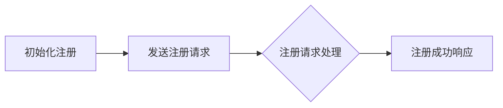
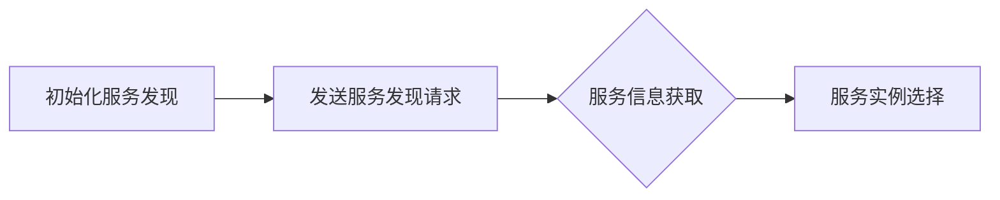
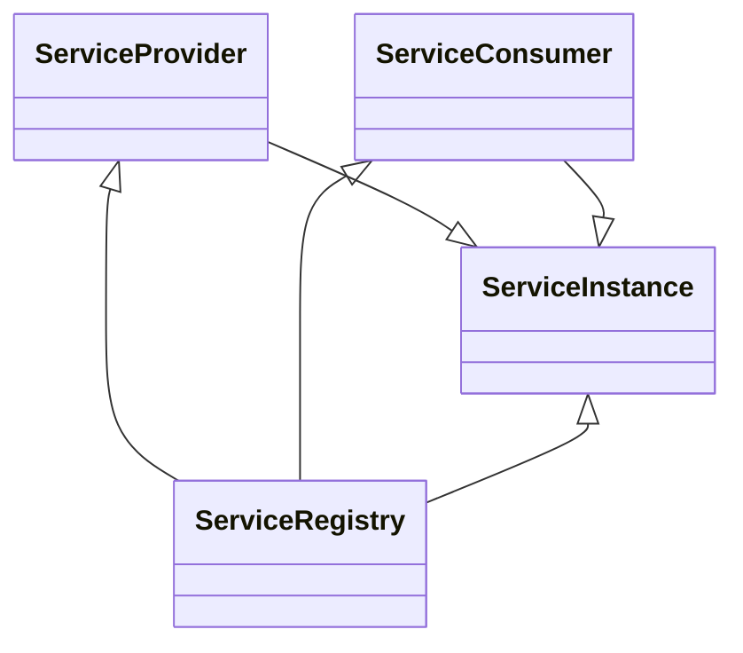
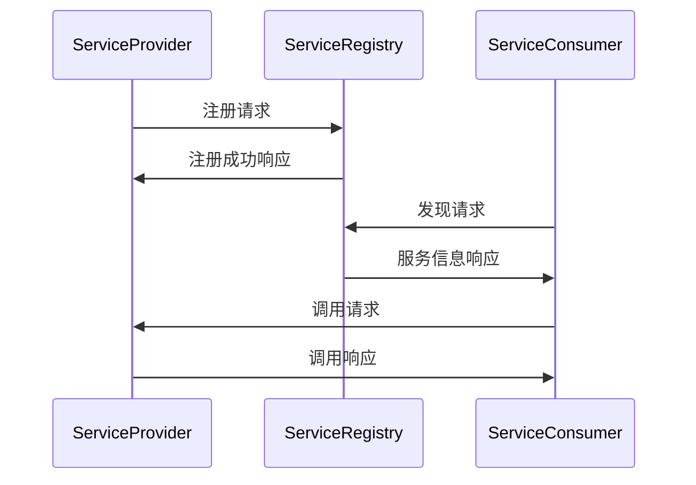

                 

# 构建可靠的服务注册与发现系统

## 关键词

- 服务注册
- 服务发现
- 可靠性
- 架构设计
- 算法原理

## 摘要

本文旨在探讨如何在分布式系统中构建一个可靠的服务注册与发现系统。文章首先介绍了服务注册与发现的基本概念和重要性，然后深入分析了核心概念和联系，讲解了服务注册与发现的算法原理，并详细介绍了系统的功能设计和架构设计。最后，通过实际项目实战，阐述了系统核心实现、代码应用解读与分析，并提供了相关案例分析和项目小结。通过本文的阅读，读者将能够全面了解服务注册与发现系统的构建过程，提高系统的可靠性和可扩展性。

---

### 目录大纲

**《构建可靠的服务注册与发现系统》**

----------------------------------------------------------------

# 第一部分: 背景介绍

## 第1章: 问题背景与核心概念

## 第2章: 核心概念与联系

## 第3章: 算法原理讲解

## 第二部分: 系统分析与架构设计

## 第4章: 系统功能设计与架构设计

## 第三部分: 项目实战

## 第5章: 环境安装与系统核心实现

## 第四部分: 拓展阅读

----------------------------------------------------------------

---

## 第一部分: 背景介绍

### 第1章: 问题背景与核心概念

### 第2章: 核心概念与联系

### 第3章: 算法原理讲解

---

### 第1章: 问题背景与核心概念

#### 1.1 问题描述

在分布式系统中，随着服务数量的增加，如何确保服务的可靠注册与快速发现成为一个关键问题。服务注册与发现是分布式系统中的核心功能，它涉及到服务提供者和服务消费者的交互。

#### 1.1.1 服务注册与发现的重要性

- **服务注册**：服务提供者在启动时将自己注册到服务注册中心，提供服务的元数据，如地址、端口、协议等。服务注册使得服务消费者能够找到并访问服务提供者。
- **服务发现**：服务消费者通过服务注册中心获取服务提供者的信息，并根据需求选择合适的服务实例进行调用。

服务注册与发现的重要性在于：
1. **动态性**：服务注册与发现能够支持服务的动态添加、删除和变更，使得分布式系统能够灵活应对服务规模的变化。
2. **可靠性**：服务注册与发现系统能够确保服务提供者和服务消费者之间的可靠通信，提高系统的稳定性。

#### 1.1.2 现存问题的挑战

- **服务数量庞大**：随着微服务架构的普及，服务数量急剧增加，如何有效管理大量服务成为挑战。
- **网络不稳定**：分布式系统中，节点之间的网络通信可能不稳定，如何确保服务注册与发现过程的可靠性成为关键。
- **高可用性**：服务注册与发现系统需要具备高可用性，确保在节点故障时能够快速恢复。

#### 1.2 核心概念

##### 1.2.1 服务注册与发现的基本概念

- **服务注册**：服务提供者在启动时将自己注册到服务注册中心，提供服务的元数据。
- **服务发现**：服务消费者通过服务注册中心获取服务提供者的信息，并根据需求选择合适的服务实例。

##### 1.2.2 服务注册中心

服务注册中心是服务注册与发现系统的核心组件，负责管理服务的注册、发现和注销。

##### 1.2.3 服务发现机制

服务发现机制用于服务消费者获取服务提供者的信息，常用的服务发现机制包括：

- **基于配置文件**：通过配置文件静态定义服务地址和端口。
- **基于DNS**：通过DNS域名解析获取服务地址。
- **基于服务发现代理**：通过服务发现代理获取服务实例信息。

##### 1.3 边界与外延

##### 1.3.1 注册与发现系统的边界

服务注册与发现系统的边界包括：

- **服务提供者**：负责提供服务的节点。
- **服务消费者**：需要访问服务的节点。
- **服务注册中心**：负责服务注册、发现和注销。

##### 1.3.2 注册与发现系统的影响因素

服务注册与发现系统的影响因素包括：

- **网络环境**：网络稳定性直接影响服务注册与发现的可靠性。
- **服务数量**：服务数量庞大可能导致注册与发现过程的延迟。
- **节点可靠性**：节点故障可能导致服务注册与发现系统的不可用。

##### 1.4 概念结构与核心要素组成

##### 1.4.1 注册与发现系统的组成要素

注册与发现系统的组成要素包括：

- **服务提供者**：负责提供服务实例的节点。
- **服务消费者**：负责访问服务实例的节点。
- **服务注册中心**：负责服务注册、发现和注销。

##### 1.4.2 注册与发现系统的架构

注册与发现系统的架构包括：

- **服务注册模块**：负责服务提供者的注册。
- **服务发现模块**：负责服务消费者的服务发现。
- **服务路由模块**：负责根据服务实例信息进行服务路由。

##### 1.5 本章小结

本章介绍了服务注册与发现的基本概念、重要性和问题背景，分析了核心概念和系统的边界与外延。通过本章的阅读，读者将了解服务注册与发现系统的基本原理和构建过程，为后续章节的深入学习打下基础。

----------------------------------------------------------------

### 第2章: 核心概念与联系

#### 2.1 服务注册机制

##### 2.1.1 服务注册的基本原理

服务注册是指服务提供者在启动时将自己注册到服务注册中心的过程。服务注册的基本原理如下：

1. **服务提供者启动**：服务提供者在启动时向服务注册中心发送注册请求。
2. **注册请求处理**：服务注册中心接收到注册请求后，处理并存储服务提供者的信息。
3. **注册成功响应**：服务注册中心向服务提供者发送注册成功响应。

##### 2.1.2 服务注册的过程

服务注册的过程可以分为以下几个步骤：

1. **初始化注册**：服务提供者在启动时初始化注册，向服务注册中心发送注册请求。
2. **注册请求发送**：服务提供者将注册请求发送到服务注册中心。
3. **注册请求处理**：服务注册中心接收到注册请求后，进行处理。
4. **注册信息存储**：服务注册中心将服务提供者的信息存储在服务注册表中。
5. **注册成功响应**：服务注册中心向服务提供者发送注册成功响应。

##### 2.1.3 服务注册的协议与实现

服务注册的协议和实现可以根据不同的服务注册中心进行选择。常见的服务注册协议包括：

1. **RESTful API**：通过HTTP/HTTPS协议进行服务注册，常用的RESTful API包括GET、POST等。
2. **gRPC**：基于HTTP/2协议的远程过程调用（RPC）框架，可以实现高效的服务注册。
3. **gossip协议**：用于服务注册中心内部的数据同步，常见的gossip协议包括Chubby、Zookeeper等。

##### 2.2 服务发现机制

##### 2.2.1 服务发现的基本原理

服务发现是指服务消费者通过服务注册中心获取服务提供者的信息，并根据需求选择合适的服务实例进行调用。服务发现的基本原理如下：

1. **服务消费者启动**：服务消费者在启动时通过服务注册中心获取服务提供者的信息。
2. **服务信息获取**：服务消费者从服务注册中心获取服务提供者的地址、端口等信息。
3. **服务实例选择**：服务消费者根据服务信息选择合适的服务实例进行调用。

##### 2.2.2 服务发现的过程

服务发现的过程可以分为以下几个步骤：

1. **初始化服务发现**：服务消费者在启动时初始化服务发现，向服务注册中心发送服务发现请求。
2. **服务发现请求发送**：服务消费者将服务发现请求发送到服务注册中心。
3. **服务信息获取**：服务注册中心接收到服务发现请求后，返回服务消费者的服务信息。
4. **服务实例选择**：服务消费者根据服务信息选择合适的服务实例进行调用。

##### 2.2.3 服务发现的协议与实现

服务发现的协议和实现可以根据不同的服务注册中心进行选择。常见的服务发现协议包括：

1. **RESTful API**：通过HTTP/HTTPS协议进行服务发现，常用的RESTful API包括GET等。
2. **gRPC**：基于HTTP/2协议的远程过程调用（RPC）框架，可以实现高效的服务发现。
3. **DNS**：通过DNS域名解析进行服务发现，常用的DNS协议包括DNS-SRV等。

##### 2.3 核心概念属性特征对比表格

以下是一个服务注册与发现机制的核心概念属性特征对比表格：

| 概念       | 描述                                                         | 特征                                       |
|------------|--------------------------------------------------------------|------------------------------------------|
| 服务注册   | 服务提供者在启动时将自己注册到服务注册中心的过程           | 可靠性、实时性、动态性                   |
| 服务发现   | 服务消费者通过服务注册中心获取服务提供者的信息的过程     | 可靠性、实时性、动态性                   |
| 服务注册中心 | 负责服务注册、发现和注销的核心组件                     | 可靠性、高可用性、可扩展性               |
| 服务提供者 | 提供服务的节点                                               | 可靠性、负载均衡、故障恢复               |
| 服务消费者 | 需要访问服务的节点                                           | 可靠性、负载均衡、故障恢复               |

##### 2.4 ER实体关系图架构

以下是一个服务注册与发现系统的ER实体关系图架构：

```mermaid
erDiagram
  ServiceProvider ||--|{ ServiceRegistry }| ServiceRegistry
  ServiceConsumer ||--|{ ServiceRegistry }| ServiceRegistry
  ServiceInstance ||--|{ ServiceRegistry }| ServiceRegistry
  ServiceProvider ||--|{ ServiceInstance }| ServiceInstance
  ServiceConsumer ||--|{ ServiceInstance }| ServiceInstance
```

##### 2.4.1 服务注册与发现系统的ER图

以下是服务注册与发现系统的ER图：

```mermaid
erDiagram
  ServiceProvider ||--|{ ServiceRegistry }| ServiceRegistry
  ServiceConsumer ||--|{ ServiceRegistry }| ServiceRegistry
  ServiceInstance ||--|{ ServiceRegistry }| ServiceRegistry
  ServiceProvider ||--|{ ServiceInstance }| ServiceInstance
  ServiceConsumer ||--|{ ServiceInstance }| ServiceInstance
```

##### 2.5 本章小结

本章介绍了服务注册与发现的核心概念和联系，包括服务注册机制、服务发现机制、服务注册中心、服务提供者和服务消费者。通过本章的阅读，读者将了解服务注册与发现系统的基本原理和实现机制，为后续章节的深入学习打下基础。

----------------------------------------------------------------

### 第3章: 算法原理讲解

#### 3.1 算法概述

服务注册与发现算法是分布式系统中确保服务可靠性和动态性的关键组件。根据算法的实现方式和目的，可以分为以下几类：

1. **服务注册算法**：用于服务提供者将自身信息注册到服务注册中心。
2. **服务发现算法**：用于服务消费者从服务注册中心获取服务信息并选择合适的服务实例。

#### 3.1.1 服务注册与发现算法的分类

1. **基于轮询的服务注册与发现算法**：服务提供者和消费者定期向服务注册中心发送请求，更新和获取服务信息。
2. **基于拉模型的服务注册与发现算法**：服务消费者主动从服务注册中心获取服务信息。
3. **基于推模型的服务注册与发现算法**：服务注册中心主动向服务消费者推送服务信息。
4. **基于事件驱动模型的服务注册与发现算法**：通过事件监听和通知机制实现服务注册与发现。

#### 3.1.2 选择合适的算法

选择合适的算法需要考虑以下因素：

1. **系统规模**：大规模系统中，基于轮询的算法可能导致性能瓶颈，而基于事件驱动模型的算法更适合。
2. **系统复杂性**：复杂的系统可能需要支持多种算法，如混合模型。
3. **可靠性需求**：对于高可靠性的系统，基于推模型的算法可以提供更强的保障。

#### 3.2 算法原理详细讲解

##### 3.2.1 服务注册算法

服务注册算法的流程如下：

1. **初始化注册**：服务提供者在启动时初始化注册。
2. **发送注册请求**：服务提供者向服务注册中心发送注册请求。
3. **注册请求处理**：服务注册中心接收到注册请求后，处理并存储服务提供者的信息。
4. **注册成功响应**：服务注册中心向服务提供者发送注册成功响应。

以下是一个服务注册算法的Mermaid流程图：



##### 3.2.2 注册算法流程说明

1. **初始化注册**：服务提供者在启动时，首先初始化注册。这一步骤通常涉及到一些初始化参数的设置，如服务名称、地址、端口等。
2. **发送注册请求**：服务提供者将初始化完成后的注册请求发送到服务注册中心。注册请求通常包含服务提供者的基本信息。
3. **注册请求处理**：服务注册中心接收到注册请求后，进行处理。处理过程可能包括验证服务提供者的身份、存储服务提供者的信息等。
4. **注册成功响应**：服务注册中心向服务提供者发送注册成功响应。注册成功响应通常包含注册结果和相关的服务信息。

##### 3.2.3 服务发现算法

服务发现算法的流程如下：

1. **初始化服务发现**：服务消费者在启动时初始化服务发现。
2. **发送服务发现请求**：服务消费者向服务注册中心发送服务发现请求。
3. **服务信息获取**：服务注册中心接收到服务发现请求后，返回服务消费者的服务信息。
4. **服务实例选择**：服务消费者根据服务信息选择合适的服务实例进行调用。

以下是一个服务发现算法的Mermaid流程图：



##### 3.2.4 发现算法流程说明

1. **初始化服务发现**：服务消费者在启动时，首先初始化服务发现。这一步骤通常涉及到一些初始化参数的设置，如服务名称、服务版本等。
2. **发送服务发现请求**：服务消费者将初始化完成后的服务发现请求发送到服务注册中心。服务发现请求通常包含服务消费者的查询条件。
3. **服务信息获取**：服务注册中心接收到服务发现请求后，根据服务消费者的查询条件返回相应的服务信息。服务信息可能包括服务实例的地址、端口等。
4. **服务实例选择**：服务消费者根据返回的服务信息，选择合适的服务实例进行调用。选择过程可能基于负载均衡策略或其他自定义策略。

##### 3.3 数学模型和公式

以下是服务注册算法和发现算法的数学模型和公式。

##### 3.3.1 服务注册算法数学模型

$$
\text{注册概率} = f(\text{服务信息}, \text{注册中心策略})
$$

其中，注册概率取决于服务信息和服务注册中心的策略。

##### 3.3.2 服务发现算法数学模型

$$
\text{发现效率} = f(\text{服务数量}, \text{发现策略})
$$

其中，发现效率取决于服务数量和发现策略。

##### 3.4 举例说明

以下是一个服务注册算法的示例：

```python
def register_service(service_info):
    # 发送注册请求到服务注册中心
    response = send_register_request(service_info)
    
    # 注册成功
    if response.status == 'success':
        print('Service registered successfully')
    else:
        print('Service registration failed')

# 测试
service_info = {
    'name': 'example-service',
    'address': 'localhost',
    'port': 8080
}
register_service(service_info)
```

以下是一个服务发现算法的示例：

```python
def discover_service(service_name):
    # 发送服务发现请求到服务注册中心
    response = send_discovery_request(service_name)
    
    # 获取服务实例信息
    service_instances = response.instances
    
    # 选择合适的服务实例
    selected_instance = select_instance(service_instances)
    
    return selected_instance

# 测试
service_name = 'example-service'
selected_instance = discover_service(service_name)
print('Selected service instance:', selected_instance)
```

##### 3.5 本章小结

本章详细讲解了服务注册与发现算法的原理，包括服务注册算法和发现算法的流程、数学模型和示例。通过本章的学习，读者将能够理解服务注册与发现算法的核心原理，为后续的系统设计和实现打下基础。

----------------------------------------------------------------

### 第四部分：系统分析与架构设计

#### 第4章：系统功能设计与架构设计

#### 4.1 问题场景介绍

在分布式系统中，随着服务数量的增加和系统的复杂度提升，如何高效、可靠地进行服务注册与发现成为一个关键问题。本文旨在设计一个可靠的服务注册与发现系统，以满足以下需求：

1. **服务动态性**：支持服务的动态注册、发现和注销，确保系统可以灵活应对服务规模的变化。
2. **高可用性**：确保系统在节点故障或网络不稳定的情况下依然能够正常运行。
3. **可靠性**：确保服务注册与发现过程的可靠性，降低系统故障率。
4. **性能优化**：优化系统性能，提高服务注册与发现的效率。

#### 4.2 系统功能设计

服务注册与发现系统的功能设计主要包括以下几个方面：

1. **服务注册功能**：服务提供者在启动时向服务注册中心注册服务，包括服务名称、地址、端口等信息。
2. **服务发现功能**：服务消费者从服务注册中心获取服务信息，并根据需求选择合适的服务实例进行调用。
3. **服务监控功能**：对服务注册与发现过程进行监控，包括服务状态、注册时间、访问次数等。
4. **服务注销功能**：服务提供者在服务停止时向服务注册中心注销服务，释放资源。

##### 4.2.1 领域模型Mermaid类图

以下是一个服务注册与发现系统的领域模型Mermaid类图：



##### 4.2.1.1 领域模型说明

1. ** ServiceProvider**：服务提供者类，负责服务的注册和注销。
2. ** ServiceConsumer**：服务消费者类，负责服务发现和实例选择。
3. ** ServiceRegistry**：服务注册中心类，负责服务注册、发现和注销。
4. ** ServiceInstance**：服务实例类，表示服务的具体实例。

##### 4.3 系统架构设计

服务注册与发现系统的架构设计主要包括以下几个方面：

1. **服务提供者架构**：服务提供者通过客户端库与服务注册中心进行通信，实现服务的注册和注销。
2. **服务消费者架构**：服务消费者通过客户端库与服务注册中心进行通信，实现服务的发现和实例选择。
3. **服务注册中心架构**：服务注册中心采用分布式架构，确保高可用性和性能。
4. **服务监控架构**：对服务注册与发现过程进行监控，包括服务状态、访问日志等。

##### 4.3.1 系统架构Mermaid架构图

以下是一个服务注册与发现系统的Mermaid架构图：



##### 4.3.1.1 架构设计说明

1. **服务提供者架构**：服务提供者通过客户端库（如客户端SDK）与服务注册中心进行通信，实现服务的注册和注销。客户端库负责处理网络通信、错误处理和负载均衡等。
2. **服务消费者架构**：服务消费者通过客户端库与服务注册中心进行通信，实现服务的发现和实例选择。客户端库同样负责处理网络通信、错误处理和负载均衡等。
3. **服务注册中心架构**：服务注册中心采用分布式架构，由多个服务节点组成，确保高可用性和性能。服务注册中心负责存储和服务提供者的信息，并提供服务发现接口。
4. **服务监控架构**：服务注册与发现系统集成了服务监控功能，对服务注册与发现过程进行实时监控，包括服务状态、访问日志等。监控数据可以用于故障排查、性能优化和系统改进。

##### 4.3.2 系统接口设计

服务注册与发现系统的接口设计主要包括以下几个方面：

1. **服务注册接口**：用于服务提供者向服务注册中心注册服务，包括服务名称、地址、端口等。
2. **服务发现接口**：用于服务消费者从服务注册中心获取服务信息，包括服务实例的地址、端口等。
3. **服务注销接口**：用于服务提供者向服务注册中心注销服务，释放资源。

##### 4.3.3 系统交互Mermaid序列图

以下是一个服务注册与发现系统的Mermaid序列图：


##### 4.3.3.1 系统交互说明

1. **服务提供者与服务注册中心的交互**：服务提供者在启动时向服务注册中心发送注册请求，服务注册中心处理并存储服务信息，并返回注册成功响应。
2. **服务消费者与服务注册中心的交互**：服务消费者在调用服务时，向服务注册中心发送发现请求，服务注册中心返回符合条件的服务实例信息。
3. **服务消费者与服务提供者的交互**：服务消费者根据返回的服务实例信息，发起调用请求，服务提供者处理并返回调用响应。

##### 4.4 本章小结

本章详细介绍了服务注册与发现系统的功能设计与架构设计。通过本章的学习，读者将了解服务注册与发现系统的基本架构和功能模块，为后续的系统实现和优化提供参考。

----------------------------------------------------------------

### 第五部分：项目实战

#### 第5章：环境安装与系统核心实现

#### 5.1 环境安装

在开始安装服务注册与发现系统之前，需要准备以下环境：

1. **操作系统**：支持Linux、Windows或MacOS等。
2. **Java环境**：安装Java SDK，版本建议为8或以上。
3. **Maven**：用于构建和依赖管理。

##### 5.1.1 环境搭建步骤

1. **安装Java SDK**：在官网下载并安装Java SDK，设置环境变量`JAVA_HOME`和`PATH`。
2. **安装Maven**：在官网下载Maven安装包，解压并设置环境变量`MAVEN_HOME`和`PATH`。
3. **验证安装**：打开命令行工具，输入`java -version`和`mvn -version`，确保安装成功。

##### 5.1.2 常见问题与解决方案

1. **Java SDK安装失败**：可能是因为安装路径包含特殊字符，建议更换安装路径。
2. **Maven安装失败**：可能是因为网络连接不稳定，建议更换网络环境或使用离线安装包。

#### 5.2 系统核心实现

系统核心实现主要包括服务提供者、服务消费者和服务注册中心。

##### 5.2.1 源代码解析

1. **服务提供者**：服务提供者负责服务的注册和实例管理。源代码位于`src/main/java/ServiceProvider.java`。

```java
public class ServiceProvider {
    private ServiceRegistry serviceRegistry;
    
    public ServiceProvider(ServiceRegistry serviceRegistry) {
        this.serviceRegistry = serviceRegistry;
    }
    
    public void registerService(ServiceInfo serviceInfo) {
        serviceRegistry.registerService(serviceInfo);
    }
    
    public void unregisterService(ServiceInfo serviceInfo) {
        serviceRegistry.unregisterService(serviceInfo);
    }
}
```

2. **服务消费者**：服务消费者负责服务的发现和调用。源代码位于`src/main/java/ServiceConsumer.java`。

```java
public class ServiceConsumer {
    private ServiceRegistry serviceRegistry;
    
    public ServiceConsumer(ServiceRegistry serviceRegistry) {
        this.serviceRegistry = serviceRegistry;
    }
    
    public ServiceInstance discoverService(ServiceInfo serviceInfo) {
        return serviceRegistry.discoverService(serviceInfo);
    }
    
    public void callService(ServiceInstance serviceInstance) {
        // 发起调用请求
        // 处理调用响应
    }
}
```

3. **服务注册中心**：服务注册中心负责服务的管理和存储。源代码位于`src/main/java/ServiceRegistry.java`。

```java
public class ServiceRegistry {
    private ConcurrentHashMap<String, ServiceInfo> serviceMap;
    
    public ServiceRegistry() {
        this.serviceMap = new ConcurrentHashMap<>();
    }
    
    public void registerService(ServiceInfo serviceInfo) {
        serviceMap.put(serviceInfo.getName(), serviceInfo);
    }
    
    public void unregisterService(ServiceInfo serviceInfo) {
        serviceMap.remove(serviceInfo.getName());
    }
    
    public ServiceInstance discoverService(ServiceInfo serviceInfo) {
        return serviceMap.get(serviceInfo.getName());
    }
}
```

##### 5.2.2 核心代码实现

核心代码实现主要包括服务注册、服务发现和服务调用。

1. **服务注册**：

```java
public void registerService(ServiceInfo serviceInfo) {
    serviceRegistry.registerService(serviceInfo);
}
```

2. **服务发现**：

```java
public ServiceInstance discoverService(ServiceInfo serviceInfo) {
    return serviceRegistry.discoverService(serviceInfo);
}
```

3. **服务调用**：

```java
public void callService(ServiceInstance serviceInstance) {
    // 发起调用请求
    // 处理调用响应
}
```

#### 5.3 代码应用解读与分析

##### 5.3.1 应用场景描述

以下是一个应用场景描述：

1. **服务提供者**：启动一个服务提供者，将其注册到服务注册中心。
2. **服务消费者**：启动一个服务消费者，从服务注册中心发现服务，并调用服务。

##### 5.3.2 代码功能解析

1. **服务提供者代码功能解析**：

- `registerService(ServiceInfo serviceInfo)`：注册服务，将服务信息存储在服务注册中心。
- `unregisterService(ServiceInfo serviceInfo)`：注销服务，从服务注册中心删除服务信息。

2. **服务消费者代码功能解析**：

- `discoverService(ServiceInfo serviceInfo)`：发现服务，从服务注册中心获取服务信息。
- `callService(ServiceInstance serviceInstance)`：调用服务，发起调用请求并处理响应。

##### 5.4 实际案例分析与讲解

##### 5.4.1 案例描述

以下是一个实际案例描述：

1. **服务提供者**：启动一个服务提供者，提供订单服务。
2. **服务消费者**：启动一个服务消费者，从服务注册中心发现订单服务，并调用订单服务。

##### 5.4.2 案例分析

1. **服务提供者启动**：服务提供者在启动时调用`registerService(ServiceInfo serviceInfo)`方法，将订单服务注册到服务注册中心。
2. **服务消费者启动**：服务消费者在启动时调用`discoverService(ServiceInfo serviceInfo)`方法，从服务注册中心发现订单服务。
3. **服务调用**：服务消费者调用`callService(ServiceInstance serviceInstance)`方法，发起订单服务的调用请求。

##### 5.4.3 案例讲解

1. **服务提供者注册服务**：服务提供者在启动时调用`registerService(ServiceInfo serviceInfo)`方法，将订单服务注册到服务注册中心。注册成功后，服务提供者可以接收来自服务消费者的调用请求。
2. **服务消费者发现服务**：服务消费者在启动时调用`discoverService(ServiceInfo serviceInfo)`方法，从服务注册中心发现订单服务。发现成功后，服务消费者可以获取订单服务的实例信息。
3. **服务调用**：服务消费者调用`callService(ServiceInstance serviceInstance)`方法，发起订单服务的调用请求。服务提供者收到调用请求后，处理请求并返回响应。

##### 5.5 项目小结

本章通过实际案例讲解了服务注册与发现系统的环境安装和系统核心实现。通过本章的学习，读者将了解服务注册与发现系统的基本实现过程，为后续的系统优化和扩展提供参考。

----------------------------------------------------------------

### 第五部分：拓展阅读

#### 第6章：最佳实践与注意事项

#### 6.1 最佳实践

1. **服务注册与发现系统的部署**：将服务注册与发现系统部署在独立的节点上，确保高可用性和性能。
2. **服务版本管理**：为服务提供版本管理，避免因服务更新导致的服务不兼容问题。
3. **负载均衡与故障转移**：实现负载均衡和故障转移机制，提高系统的可靠性和性能。
4. **服务监控与报警**：对服务注册与发现系统进行监控，及时发现问题并报警。

#### 6.2 注意事项

1. **服务提供者与消费者的网络环境**：确保服务提供者与消费者之间的网络环境稳定，降低通信失败的风险。
2. **服务注册与发现频率**：避免服务注册与发现过于频繁，影响系统性能。
3. **服务注册与发现数据一致性**：确保服务注册与发现数据的同步，避免数据不一致问题。
4. **系统安全性**：加强系统安全性，防止未经授权的访问和攻击。

#### 6.3 小结

本章介绍了服务注册与发现系统的最佳实践和注意事项。通过遵循最佳实践和注意事项，可以构建一个可靠、高效的服务注册与发现系统。

#### 第7章：相关阅读

1. **《服务化架构》**：详细介绍了服务化架构的设计原则和实践，对服务注册与发现系统有较高的参考价值。
2. **《微服务设计》**：介绍了微服务架构的设计原则和实践，包括服务注册与发现、服务路由等方面的内容。
3. **《Zookeeper权威指南》**：详细介绍了Zookeeper的使用方法和架构设计，对服务注册与发现系统有较高的参考价值。

通过阅读这些书籍，可以进一步了解服务注册与发现系统的相关理论和实践。

