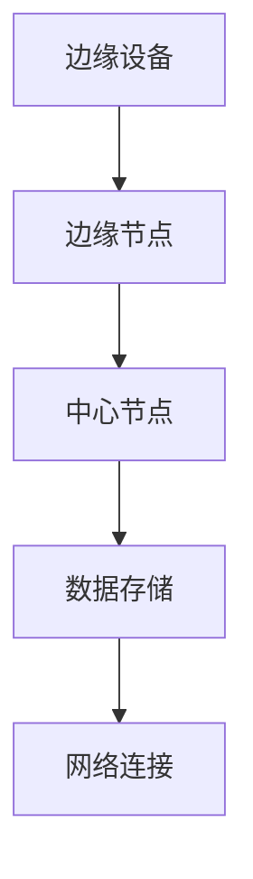

                 

## 文章标题

### 关键词

1. 边缘智能系统
2. 可靠性设计
3. 边缘计算
4. 硬件选择
5. 算法优化

### 摘要

边缘智能系统作为现代计算技术的重要组成部分，在提高数据处理效率和响应速度方面具有重要意义。本文将围绕构建可靠的边缘智能系统展开讨论，从系统架构设计、硬件选择、网络通信优化、数据处理与存储、边缘智能算法、系统测试与优化、部署与运维等多个方面，逐步分析并介绍实现边缘智能系统的关键技术和方法。本文旨在为读者提供一个全面、系统的边缘智能系统构建指南，帮助读者深入理解并掌握构建可靠边缘智能系统的核心要点。

## 第一部分：边缘智能系统概述

### 第1章：边缘智能系统的背景与重要性

#### 1.1 问题背景

随着物联网（IoT）、5G、人工智能（AI）等技术的发展，数据的生成和传输速度日益增加。传统的集中式数据处理模式已经无法满足现代应用的需求。为了提高数据处理效率、降低网络延迟、增强数据安全性，边缘计算应运而生，成为现代计算体系结构中的重要一环。

边缘计算是一种将计算、存储、网络功能分散到网络边缘的技术，通过在靠近数据生成源的地方进行处理，可以显著减少数据传输时间和带宽消耗。边缘智能系统则是在边缘计算的基础上，结合人工智能技术，实现数据的高效处理和智能决策。

#### 1.2 问题描述

边缘智能系统的构建面临诸多挑战，包括：

- **硬件选择与优化**：边缘设备性能参差不齐，如何选择合适的硬件并进行性能优化？
- **网络通信**：边缘设备与中心服务器之间的通信稳定性如何保障？
- **数据处理与存储**：如何高效地处理和存储来自不同类型和来源的数据？
- **边缘智能算法**：如何选择合适的算法并对其进行优化？
- **系统测试与优化**：如何确保系统的稳定性和可靠性？

#### 1.3 问题解决

本文将针对上述问题进行详细分析，提供一系列解决方案，包括：

- **硬件选择与优化**：介绍边缘设备的分类、性能指标，以及优化策略。
- **网络通信**：讨论网络架构设计、数据传输优化和网络延迟优化方法。
- **数据处理与存储**：探讨数据处理流程、数据存储策略和安全性。
- **边缘智能算法**：介绍常见边缘智能算法，讨论算法选择与优化。
- **系统测试与优化**：介绍系统测试方法、性能优化和可靠性提升策略。
- **部署与运维**：讨论部署策略、运维流程和故障处理。

#### 1.4 边缘智能系统的边界与外延

边缘智能系统不仅包括边缘设备，还涉及到中心服务器、网络架构以及云计算平台。其边界可以定义为：

- **边缘设备**：包括物联网设备、边缘服务器、网关等。
- **边缘网络**：连接边缘设备与中心服务器的网络，包括有线和无线网络。
- **中心服务器**：负责存储和管理数据，提供计算和存储服务。
- **云计算平台**：提供弹性计算和存储资源，支持边缘智能系统的扩展和升级。

#### 1.5 本章小结

本章概述了边缘智能系统的背景、重要性、问题描述以及解决方案。在接下来的章节中，我们将逐步深入探讨边缘智能系统的各个方面，帮助读者全面理解并掌握构建可靠边缘智能系统的核心技术和方法。接下来，我们将介绍边缘智能系统的核心概念与联系。

## 第2章：核心概念与联系

### 2.1 边缘计算

边缘计算是指将数据处理、存储、分析等任务从云端转移到网络边缘，在靠近数据生成源的地方进行处理。边缘计算的优势在于：

- **降低网络延迟**：通过在边缘设备上进行数据处理，减少了数据传输到云端的时间。
- **提高系统响应速度**：本地处理可以显著减少延迟，提高系统的实时响应能力。
- **增强数据安全性**：部分敏感数据可以在边缘设备上进行处理，减少数据在网络中的传输，提高数据安全性。

#### 2.2 边缘设备

边缘设备是边缘智能系统的核心组成部分，包括物联网设备、边缘服务器、网关等。根据其功能和应用场景，边缘设备可以分为以下几类：

- **物联网设备**：如传感器、摄像头、智能家居设备等，主要用于数据采集。
- **边缘服务器**：提供计算和存储资源，支持复杂的数据处理任务。
- **网关**：连接本地设备和广域网络，实现数据传输和协议转换。

#### 2.3 边缘智能网络

边缘智能网络是指连接边缘设备和中心服务器的网络架构，包括有线和无线网络。边缘智能网络的设计原则包括：

- **高可靠性**：确保网络连接的稳定性和数据传输的可靠性。
- **低延迟**：优化网络架构，降低数据传输延迟。
- **灵活性**：支持多种网络协议和设备接入。

#### 2.4 边缘智能系统的构成要素

边缘智能系统由以下几部分构成：

- **数据采集**：通过边缘设备收集各类数据。
- **数据处理**：在边缘设备上进行数据的初步处理和清洗。
- **数据传输**：将处理后的数据传输到中心服务器或云端。
- **数据存储**：在中心服务器或云端存储和管理数据。
- **智能决策**：利用人工智能算法进行数据分析和决策。

#### 2.5 边缘智能系统与云计算的关系

边缘智能系统和云计算密不可分。云计算提供弹性计算和存储资源，支持边缘智能系统的扩展和升级。边缘智能系统可以利用云计算平台的资源，实现以下功能：

- **数据存储**：将数据存储在云存储中，方便数据的访问和管理。
- **计算任务**：在云服务器上运行复杂的计算任务，提高数据处理效率。
- **模型训练**：利用云计算平台进行深度学习模型的训练和优化。

#### 2.6 边缘智能系统的特点

边缘智能系统具有以下特点：

- **分布式计算**：通过在边缘设备上进行数据处理，实现分布式计算。
- **实时性**：本地处理可以显著降低延迟，提高系统的实时性。
- **灵活性**：支持多种设备接入和网络协议，具有较好的灵活性。
- **数据安全性**：部分敏感数据可以在边缘设备上进行处理，提高数据安全性。

#### 2.7 本章小结

本章介绍了边缘智能系统的核心概念与联系，包括边缘计算、边缘设备、边缘智能网络、边缘智能系统的构成要素以及边缘智能系统与云计算的关系。在接下来的章节中，我们将进一步探讨边缘智能系统的设计原则、硬件选择与优化、网络通信优化、数据处理与存储、边缘智能算法、系统测试与优化、部署与运维等方面的内容。

## 第3章：边缘智能系统设计原则

### 3.1 系统架构设计

边缘智能系统的设计原则包括可靠性、可扩展性、灵活性、实时性和安全性。以下是一个典型的边缘智能系统架构设计：

#### 3.1.1 系统架构概述

边缘智能系统架构包括以下几部分：

- **边缘设备**：包括传感器、摄像头、智能终端等，用于数据采集。
- **边缘节点**：包括边缘服务器、网关等，负责数据的初步处理和传输。
- **中心节点**：包括云服务器、数据存储等，负责数据的进一步处理和存储。
- **网络连接**：包括局域网、广域网、互联网等，负责数据传输。

#### 3.1.2 设计原则

1. **可靠性**：确保系统的稳定运行，避免因硬件故障、网络故障等原因导致系统崩溃。
2. **可扩展性**：支持系统的水平扩展和垂直扩展，以适应不断增长的数据和处理需求。
3. **灵活性**：支持多种设备接入和网络协议，以适应不同的应用场景。
4. **实时性**：优化网络架构和数据处理流程，确保系统具有较低的延迟，满足实时性要求。
5. **安全性**：确保数据传输和存储的安全性，防止数据泄露和恶意攻击。

#### 3.1.3 系统架构图

### 3.2 硬件选择与优化

#### 3.2.1 硬件选择

1. **处理器**：选择性能稳定、功耗低的处理器，如ARM架构处理器。
2. **存储设备**：选择容量大、读写速度快、稳定性高的存储设备，如SSD。
3. **网络接口**：选择支持多种网络协议的网卡，如千兆以太网和Wi-Fi。

#### 3.2.2 硬件优化

1. **功耗优化**：通过功耗管理技术，降低硬件功耗，提高系统能效。
2. **散热优化**：通过散热设计，保证硬件在长时间运行中保持稳定的工作温度。
3. **硬件冗余**：通过冗余设计，提高系统的可靠性，如冗余电源、冗余网络接口。

### 3.3 网络通信优化

#### 3.3.1 网络架构设计

1. **局域网设计**：采用高性能的交换机和路由器，确保局域网内的数据传输速度和稳定性。
2. **广域网设计**：选择可靠、低延迟的广域网连接方式，如专线、VPN。
3. **网络协议**：支持多种网络协议，如TCP、UDP、HTTP等，以适应不同的应用场景。

#### 3.3.2 数据传输优化

1. **数据压缩**：通过数据压缩技术，减少数据传输量，提高传输效率。
2. **传输加密**：通过传输加密技术，确保数据在传输过程中的安全性。
3. **流量控制**：通过流量控制技术，避免网络拥塞，提高数据传输的稳定性。

#### 3.3.3 网络延迟优化

1. **网络拓扑优化**：通过优化网络拓扑，降低数据传输的延迟。
2. **缓存技术**：通过缓存技术，减少数据访问的延迟。
3. **负载均衡**：通过负载均衡技术，分散网络流量，降低网络延迟。

### 3.4 数据处理与存储

#### 3.4.1 数据处理流程

1. **数据采集**：通过边缘设备收集数据。
2. **数据预处理**：对采集到的数据进行清洗、去噪、归一化等预处理。
3. **数据分析**：利用边缘智能算法对预处理后的数据进行分析和挖掘。
4. **数据存储**：将处理后的数据存储在中心节点或云端。

#### 3.4.2 数据存储策略

1. **分布式存储**：通过分布式存储技术，提高数据的可靠性和访问速度。
2. **数据分层存储**：根据数据的访问频率和重要性，采用不同的存储策略，如热数据存储在SSD中，冷数据存储在HDD中。
3. **数据加密存储**：通过数据加密技术，确保数据存储的安全性。

#### 3.4.3 数据安全性

1. **数据备份**：通过数据备份技术，确保数据的安全性和完整性。
2. **访问控制**：通过访问控制技术，确保只有授权用户可以访问数据。
3. **审计日志**：通过审计日志技术，记录数据的访问和操作记录，便于审计和追溯。

### 3.5 边缘智能算法

#### 3.5.1 常见边缘智能算法

1. **机器学习算法**：如决策树、支持向量机、神经网络等。
2. **深度学习算法**：如卷积神经网络（CNN）、循环神经网络（RNN）、生成对抗网络（GAN）等。
3. **强化学习算法**：如Q学习、深度Q网络（DQN）、策略梯度等。

#### 3.5.2 算法选择与优化

1. **算法选择**：根据应用场景和数据处理需求，选择合适的算法。
2. **算法优化**：通过调整算法参数、优化数据处理流程、使用高效的数据结构等方法，提高算法的效率和准确性。

### 3.6 系统测试与优化

#### 3.6.1 系统测试方法

1. **功能测试**：测试系统的功能是否满足需求。
2. **性能测试**：测试系统的响应速度、吞吐量等性能指标。
3. **稳定性测试**：测试系统在长时间运行中的稳定性。
4. **安全性测试**：测试系统的安全性能，如抗攻击能力、数据泄露防护等。

#### 3.6.2 系统性能优化

1. **硬件优化**：通过升级硬件设备、优化硬件配置等手段，提高系统性能。
2. **软件优化**：通过优化代码、调整算法参数等手段，提高系统性能。
3. **网络优化**：通过优化网络架构、调整网络参数等手段，提高系统性能。

#### 3.6.3 系统可靠性提升

1. **冗余设计**：通过冗余设计，提高系统的可靠性。
2. **故障恢复**：通过故障恢复机制，确保系统在故障发生后能够快速恢复。
3. **监控与预警**：通过监控系统运行状态，及时发现并处理故障。

### 3.7 边缘智能系统的部署与运维

#### 3.7.1 部署策略

1. **分阶段部署**：将系统划分为多个模块，分阶段进行部署。
2. **自动化部署**：使用自动化工具，如Ansible、Puppet等，实现系统的自动化部署。

#### 3.7.2 运维流程

1. **监控与运维**：通过监控系统，实时监控系统运行状态，及时发现并处理故障。
2. **备份与恢复**：定期备份系统数据，确保数据的安全性和完整性。
3. **更新与升级**：定期更新系统软件，修复漏洞，提高系统性能。

#### 3.7.3 故障处理与系统升级

1. **故障处理**：根据故障类型和影响范围，采取相应的处理措施，如重启服务、更换硬件等。
2. **系统升级**：在确保系统安全的前提下，定期进行系统升级，提高系统性能和稳定性。

### 3.8 最佳实践与案例分析

1. **最佳实践**：总结成功的边缘智能系统构建经验，提供最佳实践指南。
2. **案例分析**：分析成功的边缘智能系统应用案例，探讨其设计原则和实现方法。

### 3.9 本章小结

本章介绍了边缘智能系统的设计原则，包括系统架构设计、硬件选择与优化、网络通信优化、数据处理与存储、边缘智能算法、系统测试与优化、部署与运维等方面的内容。通过本章的学习，读者可以全面了解边缘智能系统的构建过程，掌握构建可靠边缘智能系统的核心技术和方法。

## 第二部分：边缘智能系统设计原则

### 第4章：硬件选择与优化

#### 4.1 边缘设备选择

边缘设备的性能直接影响到边缘智能系统的整体性能。在选择边缘设备时，需要考虑以下几个关键因素：

- **计算能力**：根据应用场景和数据处理的复杂度，选择合适的处理器和GPU。例如，对于视频处理和深度学习任务，需要选择具有较强图形处理能力的GPU。
- **存储容量**：根据数据存储需求，选择足够的存储容量。SSD相比HDD具有更快的读写速度和更好的可靠性。
- **网络接口**：选择支持多种网络协议的边缘设备，如Wi-Fi、蓝牙和蜂窝网络，以便实现多场景的连接需求。
- **功耗**：选择功耗较低的设备，以延长设备电池寿命，降低运行成本。

#### 4.2 硬件性能优化

1. **功耗优化**：通过调整处理器的工作频率和电压，实现功耗的优化。例如，使用动态电压和频率调整（DVFS）技术，根据处理任务的负载动态调整处理器的工作状态。
2. **散热优化**：通过优化散热设计，如使用高效散热器、风扇等，确保硬件在长时间运行中保持较低的温度，提高系统稳定性。
3. **内存管理**：通过优化内存管理策略，如缓存技术、内存压缩等，提高内存利用率，减少内存访问的延迟。
4. **存储优化**：通过存储分级技术，将热数据和冷数据分别存储在不同的存储设备上，提高数据访问速度和存储效率。

#### 4.3 硬件成本控制

1. **设备采购策略**：根据实际需求，合理选择设备的配置，避免过度采购造成资源浪费。
2. **二次利用**：考虑旧设备的二次利用，如将旧服务器改造为边缘节点，降低采购成本。
3. **硬件集成**：通过硬件集成设计，减少设备数量，降低布线和维护成本。

#### 4.4 硬件冗余设计

1. **冗余电源**：为关键设备配置冗余电源，确保在单一电源故障时，系统可以继续运行。
2. **冗余网络接口**：为边缘设备配置多个网络接口，实现网络路径的冗余，提高网络的可靠性。
3. **冗余计算节点**：在边缘节点和中心节点之间配置冗余计算节点，确保在单一节点故障时，系统可以继续运行。

#### 4.5 硬件选型案例分析

以一个智能交通系统为例，其边缘设备需要具备以下硬件选型：

- **计算能力**：搭载高性能的ARM处理器，支持实时视频分析和深度学习任务。
- **存储容量**：配备大容量SSD，存储实时视频数据和交通数据。
- **网络接口**：支持Wi-Fi、4G/5G网络，实现多场景的连接。
- **功耗**：选择功耗较低的设备，以延长设备电池寿命。

通过上述硬件选型，智能交通系统能够实现实时交通监控、事件检测和智能决策，提高交通管理效率。

### 4.6 本章小结

本章介绍了边缘设备的选择和优化方法，包括计算能力、存储容量、网络接口、功耗、散热等方面的关键因素，以及功耗优化、内存管理、存储优化和硬件成本控制策略。通过本章的学习，读者可以掌握如何选择和优化边缘设备，以构建高性能、高可靠的边缘智能系统。

## 第三部分：网络通信优化

### 第5章：网络通信优化

#### 5.1 网络架构设计

网络架构设计是边缘智能系统通信优化的重要组成部分。一个高效、稳定的网络架构可以确保数据在边缘设备、边缘节点和中心节点之间的顺畅传输。以下是网络架构设计的关键步骤：

1. **网络层次划分**：将网络划分为多个层次，如接入层、汇聚层和核心层。接入层负责连接边缘设备，汇聚层负责数据汇聚和初步处理，核心层负责数据存储和进一步处理。
2. **网络拓扑选择**：根据应用场景，选择合适的网络拓扑，如星型、环型、树型等。星型拓扑结构简单、可靠，适用于小规模应用；环型拓扑具有较高的容错性，适用于大规模应用。
3. **网络冗余设计**：在网络架构中引入冗余路径，确保在单点故障时，数据仍能通过其他路径传输。冗余设计包括物理链路冗余、协议冗余和路径冗余等。
4. **网络安全性**：在网络架构中引入安全措施，如防火墙、加密传输、访问控制等，确保数据在传输过程中的安全性。

#### 5.2 数据传输优化

数据传输优化是提高边缘智能系统性能的关键环节。以下是一些常用的数据传输优化方法：

1. **数据压缩**：通过数据压缩技术，减少数据传输量，提高传输效率。常用的数据压缩算法包括Huffman编码、LZ77和LZ78等。
2. **数据分片**：将大数据文件分成多个小文件进行传输，可以减少单个文件传输过程中可能出现的阻塞和丢失问题。
3. **传输加密**：通过传输加密技术，确保数据在传输过程中的安全性。常用的加密算法包括AES、RSA等。
4. **流量控制**：通过流量控制技术，避免网络拥塞，提高数据传输的稳定性。常用的流量控制算法包括TCP拥塞控制算法、公平队列算法（FQ-CoDel）等。

#### 5.3 网络延迟优化

网络延迟优化是提高边缘智能系统实时性的关键。以下是一些常用的网络延迟优化方法：

1. **网络拓扑优化**：通过优化网络拓扑，降低数据传输的延迟。例如，选择最优路径算法（如Dijkstra算法），计算数据传输的最短路径。
2. **缓存技术**：通过缓存技术，减少数据访问的延迟。例如，在边缘节点和中心节点之间设置缓存，存储频繁访问的数据，提高数据访问速度。
3. **负载均衡**：通过负载均衡技术，分散网络流量，降低网络延迟。例如，使用轮询算法、最小连接数算法等，实现流量的动态分配。
4. **边缘计算**：通过在边缘节点上进行数据处理，减少数据传输的延迟。例如，在边缘节点上部署实时视频分析模型，减少数据传输量。

#### 5.4 网络协议选择

选择合适的网络协议对于边缘智能系统的通信优化至关重要。以下是一些常用的网络协议：

1. **TCP/IP协议**：传输控制协议/互联网协议（TCP/IP）是互联网的基本通信协议，适用于可靠的数据传输。TCP协议提供了面向连接的服务，确保数据传输的可靠性和顺序。
2. **UDP协议**：用户数据报协议（UDP）是一种无连接的传输协议，适用于对实时性要求较高的应用，如视频流和语音通话。UDP协议简单高效，但可靠性较低。
3. **HTTP/2协议**：超文本传输协议/第2版（HTTP/2）是一种基于TCP的传输协议，提供了更高的数据传输效率和更好的压缩能力。HTTP/2协议支持多路复用，减少了网络延迟和延迟抖动。
4. **MQTT协议**：消息队列遥测传输协议（MQTT）是一种轻量级的消息传输协议，适用于物联网应用。MQTT协议基于TCP或UDP协议，具有低功耗、高可靠性和可扩展性的特点。

#### 5.5 网络监控与管理

网络监控与管理是确保网络稳定运行的重要手段。以下是一些网络监控与管理的策略：

1. **网络监控**：通过网络监控工具，实时监控网络性能，包括带宽利用率、延迟、丢包率等指标。例如，使用Nagios、Zabbix等监控工具。
2. **故障排查**：当网络出现故障时，通过故障排查工具，快速定位故障点，并采取相应的修复措施。例如，使用Wireshark、MTR等故障排查工具。
3. **性能优化**：通过性能优化工具，识别网络瓶颈，并提出优化建议。例如，使用iperf、netem等性能优化工具。
4. **安全审计**：通过安全审计工具，审计网络访问日志和操作日志，确保网络的安全性。例如，使用Logwatch、AWStats等安全审计工具。

#### 5.6 网络通信优化案例分析

以一个智能城市管理平台为例，其网络通信优化策略包括：

- **网络架构设计**：采用分布式架构，将数据收集、处理和存储分散到多个边缘节点和中心节点。
- **数据传输优化**：使用HTTP/2协议，减少网络延迟和延迟抖动。同时，采用数据压缩技术，减少数据传输量。
- **网络延迟优化**：通过优化网络拓扑，选择最优路径算法，降低数据传输的延迟。
- **网络监控与管理**：使用Nagios监控网络性能，使用Wireshark进行故障排查和性能优化。

通过上述网络通信优化策略，智能城市管理平台实现了高效、稳定的数据传输和实时性，提高了城市管理效率。

### 5.7 本章小结

本章介绍了网络通信优化的方法，包括网络架构设计、数据传输优化、网络延迟优化、网络协议选择和网络监控与管理等方面的内容。通过本章的学习，读者可以掌握如何优化边缘智能系统的网络通信，提高系统的实时性和稳定性。

## 第四部分：数据处理与存储

### 第6章：数据处理与存储

#### 6.1 数据处理流程

边缘智能系统中的数据处理流程主要包括数据采集、数据预处理、数据分析和数据存储等环节。以下是数据处理流程的详细说明：

1. **数据采集**：通过边缘设备（如传感器、摄像头、智能终端等）收集各类数据。数据来源可以是实时数据、历史数据或混合数据。
2. **数据预处理**：对采集到的数据进行清洗、去噪、归一化等预处理操作。数据预处理是确保数据质量、提高分析效果的关键步骤。
3. **数据分析**：利用边缘智能算法（如机器学习、深度学习等）对预处理后的数据进行分析和挖掘，提取有用信息，实现智能决策。
4. **数据存储**：将处理后的数据存储在边缘节点或中心节点的数据库中，以便后续访问和管理。数据存储应考虑数据容量、访问速度和安全性等因素。

#### 6.2 数据存储策略

数据存储策略是边缘智能系统中至关重要的一环，直接影响系统的性能和可靠性。以下是一些常见的数据存储策略：

1. **分布式存储**：通过分布式存储技术，将数据存储在多个节点上，提高数据的可靠性和访问速度。分布式存储系统（如Hadoop、Cassandra等）支持海量数据的存储和处理。
2. **分层存储**：根据数据的访问频率和重要性，采用不同的存储策略。例如，将热数据存储在高速存储设备（如SSD）中，将冷数据存储在低成本的存储设备（如HDD）中。
3. **数据加密**：通过数据加密技术，确保数据在存储和传输过程中的安全性。常用的加密算法包括AES、RSA等。
4. **数据备份与恢复**：定期备份数据，确保在系统故障或数据丢失时，可以迅速恢复数据。备份策略应考虑数据备份的频率、存储位置和恢复速度等因素。
5. **数据压缩**：通过数据压缩技术，减少存储空间的占用，提高存储效率。常用的数据压缩算法包括Huffman编码、LZ77等。

#### 6.3 数据安全性

数据安全性是边缘智能系统中的关键问题，必须采取措施确保数据的安全性和完整性。以下是一些常见的数据安全措施：

1. **访问控制**：通过访问控制机制，限制只有授权用户可以访问数据。常用的访问控制方法包括身份验证、权限控制等。
2. **审计日志**：记录数据访问和操作的日志，以便在发生安全事件时进行审计和追溯。审计日志应包括用户信息、操作时间和操作内容等。
3. **加密传输**：在数据传输过程中，使用加密技术确保数据的安全性。常用的加密传输协议包括SSL/TLS等。
4. **数据隔离**：在边缘节点和中心节点之间实现数据隔离，确保不同应用的数据不会相互干扰。数据隔离可以通过虚拟化技术、容器技术等实现。
5. **入侵检测与防御**：部署入侵检测和防御系统，实时监控网络流量和系统行为，识别和阻止恶意攻击。

#### 6.4 数据处理与存储优化

1. **并行处理**：利用多核处理器和分布式计算技术，实现数据的并行处理，提高数据处理速度。并行处理可以通过编程框架（如MapReduce、Spark等）实现。
2. **缓存技术**：通过缓存技术，减少对磁盘的访问次数，提高数据处理速度。常用的缓存技术包括内存缓存（如Redis、Memcached等）和磁盘缓存（如LRU算法等）。
3. **压缩与解压缩**：在数据存储和传输过程中，使用数据压缩技术，减少存储空间的占用和带宽消耗。数据压缩可以通过编程库（如zlib、gzip等）实现。
4. **负载均衡**：通过负载均衡技术，实现数据处理和存储资源的动态分配，提高系统的性能和可用性。常用的负载均衡算法包括轮询、最小连接数、源地址哈希等。

#### 6.5 数据处理与存储案例分析

以一个智能安防系统为例，其数据处理与存储策略包括：

- **数据采集**：通过摄像头、传感器等设备实时采集视频数据和环境数据。
- **数据预处理**：对采集到的视频数据进行去噪、压缩和分类等预处理操作。
- **数据分析**：利用深度学习算法对预处理后的视频数据进行目标检测和识别。
- **数据存储**：将处理后的数据存储在分布式数据库中，如Cassandra或MongoDB，并采用数据加密技术确保数据安全性。

通过上述数据处理与存储策略，智能安防系统实现了实时视频监控、目标检测和报警功能，提高了安防管理水平。

### 6.6 本章小结

本章介绍了边缘智能系统中的数据处理与存储策略，包括数据处理流程、数据存储策略、数据安全性措施和数据处理与存储优化方法。通过本章的学习，读者可以掌握如何高效、安全地处理和存储边缘智能系统中的海量数据。

## 第五部分：边缘智能算法

### 第7章：边缘智能算法

边缘智能算法是边缘智能系统的核心组成部分，它决定了系统对数据的处理能力和智能决策水平。本章将介绍边缘智能算法的基本概念、常见算法及其应用，以及算法的选择与优化。

#### 7.1 常见边缘智能算法

边缘智能算法可以分为以下几类：

1. **机器学习算法**：机器学习算法是边缘智能系统中最常用的算法之一，包括线性回归、决策树、支持向量机（SVM）、随机森林等。这些算法可以用于数据分类、预测、聚类等任务。
2. **深度学习算法**：深度学习算法在图像识别、语音识别、自然语言处理等领域表现出色，包括卷积神经网络（CNN）、循环神经网络（RNN）、生成对抗网络（GAN）等。深度学习算法具有强大的特征提取和模式识别能力。
3. **强化学习算法**：强化学习算法通过学习奖励和惩罚机制，实现智能体的决策优化，常用于路径规划、智能控制等场景，包括Q学习、深度Q网络（DQN）、策略梯度等。
4. **聚类算法**：聚类算法用于将数据集划分为多个类，包括K均值、层次聚类、DBSCAN等。聚类算法可以用于数据挖掘、图像分割等任务。
5. **贝叶斯算法**：贝叶斯算法基于贝叶斯定理，用于概率推断和分类，包括朴素贝叶斯、贝叶斯网络等。贝叶斯算法在文本分类、异常检测等领域具有广泛的应用。

#### 7.2 算法选择与优化

选择合适的边缘智能算法对于构建高效的边缘智能系统至关重要。以下是算法选择与优化的一些建议：

1. **应用场景**：根据实际应用场景选择合适的算法。例如，对于图像识别任务，可以优先选择深度学习算法；对于实时决策任务，可以优先选择强化学习算法。
2. **数据特征**：分析数据特征，选择适合数据特征的算法。例如，对于高维数据，可以优先选择降维算法；对于稀疏数据，可以优先选择稀疏算法。
3. **计算资源**：考虑边缘设备的计算资源，选择计算效率较高的算法。例如，对于资源受限的设备，可以优先选择轻量级的机器学习算法。
4. **算法优化**：对选定的算法进行优化，以提高其性能和准确性。算法优化包括参数调优、模型压缩、加速技术等。

#### 7.3 算法应用案例

以下是一些边缘智能算法的应用案例：

1. **图像识别**：使用卷积神经网络（CNN）对摄像头采集的图像进行实时识别，实现行人检测、车牌识别等任务。
2. **语音识别**：使用循环神经网络（RNN）对语音信号进行实时识别，实现语音合成、语音搜索等任务。
3. **路径规划**：使用强化学习算法（如DQN）对无人驾驶车辆的路径进行实时规划，实现自动导航。
4. **数据预测**：使用线性回归等机器学习算法对传感器数据进行实时预测，实现设备故障预测、能耗预测等任务。
5. **文本分类**：使用朴素贝叶斯算法对社交媒体文本进行分类，实现垃圾邮件过滤、话题识别等任务。

#### 7.4 算法优化

算法优化是提高边缘智能系统性能的重要手段。以下是算法优化的一些建议：

1. **模型压缩**：通过模型压缩技术，减少模型的参数规模和计算复杂度，提高模型在边缘设备上的部署效率。常用的模型压缩技术包括量化、剪枝、知识蒸馏等。
2. **加速技术**：通过硬件加速技术，如GPU、FPGA等，提高模型的计算速度。例如，使用GPU加速卷积神经网络（CNN）的计算。
3. **分布式计算**：通过分布式计算技术，利用多台边缘设备协同工作，实现高性能的计算任务。例如，使用边缘设备集群进行大规模图像识别任务。
4. **边缘云计算**：结合边缘计算和云计算技术，将部分计算任务迁移到云端，利用云端的计算资源提高整体计算性能。

#### 7.5 本章小结

本章介绍了边缘智能算法的基本概念、常见算法及其应用，以及算法的选择与优化方法。通过本章的学习，读者可以了解如何选择和优化边缘智能算法，构建高效的边缘智能系统。

## 第六部分：系统测试与优化

### 第8章：系统测试与优化

#### 8.1 系统测试方法

系统测试是确保边缘智能系统可靠性和稳定性的重要环节。以下是系统测试的常用方法：

1. **功能测试**：验证系统的功能是否满足需求。功能测试包括单元测试、集成测试、系统测试等层次，确保每个模块和整体系统正常运行。
2. **性能测试**：评估系统的性能指标，如响应时间、吞吐量、并发处理能力等。性能测试可以帮助发现系统的瓶颈，提供优化方向。
3. **稳定性测试**：验证系统在长时间运行中的稳定性，包括重复执行相同任务、高负载测试等。稳定性测试可以检查系统在极端条件下的表现。
4. **安全性测试**：评估系统的安全性，包括漏洞扫描、攻击测试、数据加密测试等。安全性测试可以确保系统的数据安全，防止恶意攻击。

#### 8.2 系统性能优化

系统性能优化是提高边缘智能系统效率和响应速度的关键。以下是系统性能优化的一些建议：

1. **硬件优化**：通过升级硬件设备、优化硬件配置等手段，提高系统性能。例如，使用高性能处理器、增加内存、提高网络带宽等。
2. **软件优化**：通过优化代码、调整算法参数等手段，提高系统性能。优化策略包括代码优化、内存管理优化、算法优化等。
3. **负载均衡**：通过负载均衡技术，实现系统资源的合理分配，提高系统的并发处理能力。负载均衡可以避免单点过载，提高系统的稳定性。
4. **缓存技术**：通过缓存技术，减少对磁盘和网络的访问，提高系统的响应速度。常用的缓存技术包括内存缓存、磁盘缓存等。
5. **分布式计算**：通过分布式计算技术，利用多台边缘设备协同工作，提高系统的计算性能。例如，使用边缘设备集群进行大规模数据处理任务。

#### 8.3 系统可靠性提升

系统可靠性是边缘智能系统的关键指标，以下是提升系统可靠性的方法：

1. **冗余设计**：通过冗余设计，提高系统的可靠性。冗余设计包括硬件冗余（如冗余电源、冗余网络接口）、软件冗余（如备份程序、多重校验等）。
2. **故障恢复**：通过故障恢复机制，确保系统在故障发生后能够快速恢复。故障恢复包括自动重启、故障切换等策略。
3. **监控与预警**：通过监控系统，实时监控系统运行状态，及时发现并处理故障。监控工具可以包括Nagios、Zabbix等。
4. **容错技术**：通过容错技术，提高系统在故障发生时的容错能力。例如，使用分布式系统、冗余校验等。
5. **数据备份**：定期备份系统数据，确保在系统故障或数据丢失时，可以迅速恢复。备份策略可以包括本地备份、远程备份等。

#### 8.4 系统测试与优化案例分析

以下是一个智能交通系统的测试与优化案例：

1. **功能测试**：通过模拟各种交通场景，验证系统的功能，如实时路况监控、交通事件检测、信号灯控制等。
2. **性能测试**：通过高并发测试，评估系统的响应时间和吞吐量，发现系统瓶颈并进行优化。
3. **稳定性测试**：长时间运行系统，模拟极端交通场景，验证系统的稳定性。
4. **安全性测试**：通过漏洞扫描和攻击测试，确保系统的数据安全。
5. **优化建议**：通过性能测试结果，发现系统瓶颈，如网络延迟、计算资源不足等，并提出相应的优化措施，如升级硬件、优化算法等。

通过上述测试与优化措施，智能交通系统实现了高并发、低延迟、高稳定性和数据安全性，提高了交通管理水平。

### 8.5 本章小结

本章介绍了系统测试与优化的方法，包括功能测试、性能测试、稳定性测试、安全性测试等方面的内容。通过本章的学习，读者可以掌握如何进行系统测试和优化，确保边缘智能系统的可靠性和高性能。

## 第七部分：边缘智能系统的部署与运维

### 第9章：边缘智能系统的部署与运维

#### 9.1 部署策略

边缘智能系统的部署涉及到硬件安装、软件安装、配置和网络连接等多个方面。以下是一些关键的部署策略：

1. **分阶段部署**：将整个部署过程分为多个阶段，逐步完成硬件安装、软件安装和配置等任务，降低部署风险和复杂度。
2. **自动化部署**：使用自动化工具（如Ansible、Puppet等）实现系统的自动化部署，提高部署效率和一致性。
3. **云化部署**：利用云计算平台（如AWS、Azure等），实现边缘节点的虚拟化部署，提高资源利用率和灵活性。
4. **冗余部署**：在关键部分部署冗余节点，确保在硬件故障或网络中断时，系统能够自动切换到备用节点，保证服务的持续运行。

#### 9.2 运维流程

运维流程是保证边缘智能系统稳定运行的关键。以下是一个典型的运维流程：

1. **监控与告警**：通过监控系统（如Nagios、Zabbix等）实时监控系统的运行状态，设置告警阈值，及时发现异常并进行处理。
2. **日志管理**：收集并管理系统日志，包括应用日志、系统日志、网络日志等，便于故障排查和性能分析。
3. **备份与恢复**：定期备份数据和系统配置，确保在数据丢失或系统故障时，可以迅速恢复。
4. **升级与维护**：定期对系统进行升级和维护，包括安全补丁更新、软件版本更新等，确保系统的稳定性和安全性。
5. **性能优化**：根据系统运行情况，进行性能优化，包括硬件升级、软件优化、网络优化等，提高系统性能和响应速度。

#### 9.3 故障处理与系统升级

故障处理和系统升级是运维过程中的重要环节。以下是一些建议：

1. **故障处理**：当系统出现故障时，及时定位故障原因，采取相应的处理措施，如重启服务、更换硬件、重置网络等。故障处理应遵循快速响应、逐步排查、及时记录的原则。
2. **系统升级**：在确保系统安全的前提下，定期进行系统升级。系统升级包括软件版本升级、安全补丁更新、硬件升级等。升级过程中，应进行充分的测试和备份，确保升级过程顺利进行。

#### 9.4 运维工具

运维工具是提高运维效率和降低运维成本的关键。以下是一些常用的运维工具：

1. **自动化部署工具**：如Ansible、Puppet等，实现系统的自动化部署和配置。
2. **监控系统**：如Nagios、Zabbix等，实时监控系统的运行状态，设置告警阈值，及时发现异常。
3. **日志管理工具**：如Logstash、ELK（Elasticsearch、Logstash、Kibana）等，收集、存储和管理系统日志。
4. **备份工具**：如Bacula、Veeam等，定期备份数据和系统配置，确保在数据丢失或系统故障时，可以迅速恢复。
5. **性能优化工具**：如New Relic、AppDynamics等，监测和分析系统性能，提供优化建议。

#### 9.5 运维案例

以下是一个智能城市交通系统的运维案例：

1. **监控与告警**：使用Nagios监控系统，实时监控系统的CPU、内存、磁盘使用率、网络状态等指标，设置告警阈值，确保在异常情况下及时响应。
2. **日志管理**：使用ELK日志管理平台，收集和管理系统日志，便于故障排查和性能分析。
3. **备份与恢复**：定期使用Veeam备份工具，备份数据库和系统配置，确保在系统故障或数据丢失时，可以迅速恢复。
4. **升级与维护**：定期进行系统升级，包括软件版本更新、安全补丁更新等，确保系统的稳定性和安全性。
5. **性能优化**：使用AppDynamics监控和分析系统性能，发现性能瓶颈，进行硬件升级和软件优化，提高系统响应速度和稳定性。

通过上述运维措施，智能城市交通系统实现了高效、稳定、安全的运行，提高了交通管理水平。

### 9.6 本章小结

本章介绍了边缘智能系统的部署与运维策略，包括部署策略、运维流程、故障处理与系统升级、运维工具等方面的内容。通过本章的学习，读者可以掌握如何部署和运维边缘智能系统，确保系统的可靠性和高性能。

## 总结与未来展望

### 10.1 本章内容总结

本文详细探讨了构建可靠边缘智能系统的各个方面，包括边缘智能系统概述、设计原则、硬件选择与优化、网络通信优化、数据处理与存储、边缘智能算法、系统测试与优化、部署与运维等。通过以下关键点，读者可以全面了解边缘智能系统的构建方法：

- **边缘智能系统背景与重要性**：边缘计算在数据处理效率、网络延迟和数据安全性方面的优势。
- **核心概念与联系**：边缘计算、边缘设备、边缘智能网络等基本概念及其相互关系。
- **设计原则**：系统架构设计、硬件选择与优化、网络通信优化、数据处理与存储、边缘智能算法、系统测试与优化、部署与运维等方面的原则和方法。
- **硬件选择与优化**：硬件性能指标、功耗优化、散热优化和硬件成本控制策略。
- **网络通信优化**：网络架构设计、数据传输优化、网络延迟优化和网络协议选择。
- **数据处理与存储**：数据处理流程、数据存储策略、数据安全性措施和数据处理与存储优化方法。
- **边缘智能算法**：常见边缘智能算法、算法选择与优化方法以及算法应用案例。
- **系统测试与优化**：系统测试方法、性能优化、系统可靠性提升策略和运维工具。
- **部署与运维**：部署策略、运维流程、故障处理与系统升级以及运维工具的使用。

### 10.2 未来展望与挑战

随着技术的不断进步，边缘智能系统将在未来发挥更加重要的作用。然而，面对快速变化的技术环境和日益复杂的应用需求，构建可靠的边缘智能系统仍面临诸多挑战：

- **数据安全与隐私**：边缘设备分散、网络复杂，如何确保数据安全和用户隐私是一个重大挑战。
- **硬件性能与功耗**：边缘设备硬件性能不断提升，但功耗管理仍是关键问题，特别是在电池供电的设备上。
- **网络连接与稳定性**：边缘网络的可靠性和稳定性是边缘智能系统正常运行的基础，如何优化网络架构和通信协议是亟待解决的问题。
- **算法优化与适应性**：边缘智能算法需要适应不同的应用场景和硬件环境，如何进行算法优化以提高效率和准确性是一个重要课题。
- **跨平台兼容性**：边缘智能系统通常涉及多个平台和设备，如何实现跨平台兼容性是构建可靠系统的重要挑战。

### 10.3 结论

构建可靠的边缘智能系统是现代计算技术发展的必然趋势。通过本文的详细探讨，读者可以全面了解边缘智能系统的构建方法和技术要点。未来，随着技术的不断进步和应用的深入，边缘智能系统将不断优化和升级，为各个行业带来巨大的变革和进步。作者希望本文能够为边缘智能系统的研究和实践提供有益的参考和指导。

### 10.4 拓展阅读

- **《边缘计算：原理、架构与实现》**：详细介绍了边缘计算的基本概念、架构设计和实现方法。
- **《深度学习与边缘计算》**：探讨了深度学习在边缘计算中的应用，包括算法优化和硬件加速。
- **《物联网安全：设计、实现与运维》**：介绍了物联网安全的设计原则、实现方法和运维策略。

作者：AI天才研究院/AI Genius Institute & 禅与计算机程序设计艺术 /Zen And The Art of Computer Programming

