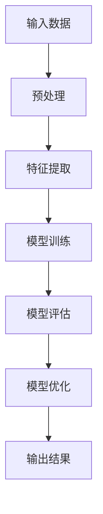
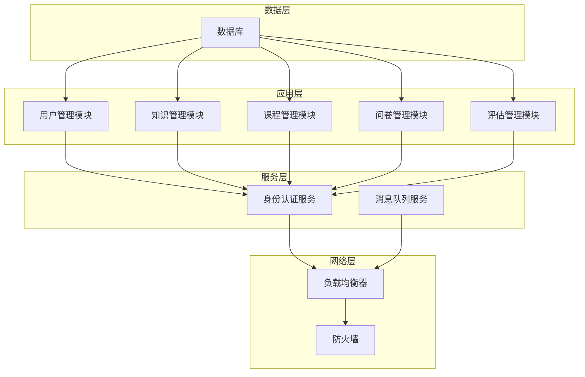
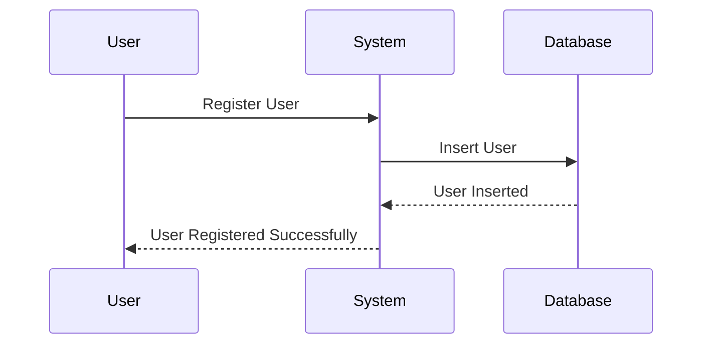

                 

### 第1章 问题背景与学习型组织概述

**1.1 问题背景**

在当今快速发展的信息技术时代，技术变革已成为推动企业进步的关键动力。然而，随着技术的迅猛发展，企业面临的挑战也日益加剧。一方面，技术更新迭代速度加快，企业需要不断适应新技术、新工具，以保持竞争力；另一方面，人才需求变化，企业需要具备多样化技能的人才队伍。在此背景下，构建学习型技术组织显得尤为重要。

企业应对技术变革的需求主要体现在以下几个方面：

1. **技术适应性**：企业需要具备快速适应新技术的能力，以保持市场竞争力。
2. **创新能力**：企业需要不断进行技术创新，以推动业务发展。
3. **人才培养**：企业需要培养具备多样化技能的员工，以应对不断变化的技术环境。
4. **知识管理**：企业需要建立有效的知识管理体系，确保知识能够得到有效传递和共享。

**1.2 学习型组织的定义与特点**

**学习型组织**（Learning Organization）是一个通过持续学习、知识共享和创新来不断提升自身能力和绩效的组织。学习型组织具有以下几个显著特点：

1. **共同愿景**：组织成员共同拥有明确的愿景和目标，为实现这一目标而共同努力。
2. **团队学习**：通过团队学习，组织成员能够互相学习、互相支持，共同提升能力。
3. **个人学习**：组织鼓励员工不断学习新知识和技能，以适应技术变革和职业发展。
4. **知识共享**：组织建立有效的知识管理体系，确保知识能够得到有效传递和共享。
5. **系统思考**：组织成员具备系统思考的能力，能够从整体上把握问题的本质，制定有效的解决方案。

**1.3 学习型组织的核心要素**

学习型组织的核心要素包括：

1. **学习文化**：组织内部形成一种重视学习、鼓励创新的文化氛围。
2. **知识管理**：建立有效的知识管理体系，确保知识能够得到有效传递和共享。
3. **领导力**：领导者具备远见卓识，能够为组织制定明确的愿景和目标，并推动组织实现这一目标。
4. **团队协作**：组织成员之间建立紧密的协作关系，通过团队学习共同提升能力。
5. **持续改进**：组织不断进行自我反思和改进，以不断提升自身能力和绩效。

**1.4 学习型组织的理论基础**

学习型组织的理论基础主要包括：

1. **系统动力学理论**：系统动力学理论强调，组织是一个复杂的系统，组织的行为和绩效受到多种因素的影响。通过系统动力学理论，组织可以更好地理解自身行为和绩效之间的关系，从而制定有效的改进措施。
2. **知识管理理论**：知识管理理论强调，知识是组织的重要资产，组织需要建立有效的知识管理体系，确保知识能够得到有效传递和共享。
3. **组织学习理论**：组织学习理论强调，组织需要通过持续学习和创新来不断提升自身能力和绩效。

**1.5 学习型组织的边界与外延**

学习型组织的边界与外延包括：

1. **内部边界**：学习型组织主要关注组织内部的学习和知识共享。
2. **外部边界**：学习型组织还需要关注与外部环境的互动，包括与客户、供应商、合作伙伴等的关系。
3. **技术领域应用**：学习型组织在技术领域的应用，包括技术创新、技术知识管理、技术人才培育等。

**1.6 本章小结**

本章主要介绍了当前技术发展的挑战、企业应对技术变革的需求、学习型组织的定义与特点、核心要素以及理论基础。通过本章的介绍，读者可以初步了解构建学习型技术组织的重要性和必要性，为后续章节的深入探讨打下基础。

---

### 第2章 核心概念与联系

**2.1 技术知识管理**

**技术知识管理**（Technology Knowledge Management）是指组织通过有效管理和利用技术知识，以提高组织竞争力、推动技术创新和促进持续学习的过程。技术知识管理包括以下几个方面：

1. **技术知识的定义**：技术知识是指与特定技术领域相关的信息、技能、经验和知识体系。
2. **技术知识的属性**：技术知识具有专业性、动态性、累积性和共享性等特点。
3. **技术知识管理的基本原则**：技术知识管理的基本原则包括知识共享、知识创新、知识积累和知识应用。

**2.2 技术创新机制**

**技术创新机制**（Technology Innovation Mechanism）是指组织通过一系列制度和机制，促进技术创新的过程。技术创新机制包括以下几个方面：

1. **技术创新的定义**：技术创新是指通过引入新技术、新方法、新产品或新服务，以提升组织竞争力。
2. **技术创新的类型**：技术创新分为产品创新、过程创新和商业模式创新等类型。
3. **技术创新机制的设计**：技术创新机制的设计包括创新文化、创新团队、创新流程和创新资源等方面的设计。

**2.3 技术学习策略**

**技术学习策略**（Technology Learning Strategy）是指组织在技术学习过程中采取的方法和措施。技术学习策略包括以下几个方面：

1. **技术学习的概念**：技术学习是指组织成员通过学习新技术、新方法、新工具，以提升自身技能和能力。
2. **技术学习的类型**：技术学习分为正式学习、非正式学习和混合学习等类型。
3. **技术学习的策略**：技术学习的策略包括自主学习、协作学习、导师制度和知识分享等策略。

**2.4 技术知识传递与共享**

**技术知识传递与共享**（Technology Knowledge Transfer and Sharing）是指组织通过有效途径，将技术知识传递给组织成员，并实现知识共享的过程。技术知识传递与共享包括以下几个方面：

1. **技术知识传递的途径**：技术知识传递的途径包括内部培训、外部培训、知识共享平台、团队协作等途径。
2. **技术知识共享的机制**：技术知识共享的机制包括激励机制、信任机制、沟通机制和文化机制等。
3. **技术知识传递与共享的挑战**：技术知识传递与共享面临的挑战包括知识冗余、知识隐私、知识流失和知识传递效率等问题。

**2.5 核心概念联系与对比表格**

为了更清晰地理解核心概念之间的联系，我们提供了以下对比表格：

| 核心概念     | 定义                                                                                              | 联系与区别                                                                                                  |
| ------------ | ------------------------------------------------------------------------------------------------- | ------------------------------------------------------------------------------------------------------- |
| 技术知识管理 | 组织通过有效管理和利用技术知识的过程。                                                           | 与技术创新机制的区别在于，技术知识管理更注重知识的积累和传递；与技术创新机制的联系在于，两者都是提升组织竞争力的手段。 |
| 技术创新机制 | 组织通过制度和机制促进技术创新的过程。                                                         | 与技术知识管理的区别在于，技术创新机制更注重创新活动的组织和实施；与技术知识管理的联系在于，两者都是知识管理的重要组成部分。 |
| 技术学习策略 | 组织在技术学习过程中采取的方法和措施。                                                         | 与技术知识传递与共享的区别在于，技术学习策略更注重学习方法和措施的设计；与技术知识传递与共享的联系在于，两者都是提升组织成员技能和能力的重要手段。 |
| 技术知识传递与共享 | 组织通过有效途径，将技术知识传递给组织成员，并实现知识共享的过程。                           | 与技术学习策略的区别在于，技术知识传递与共享更注重知识的传递和共享；与技术学习策略的联系在于，两者都是提升组织成员技能和能力的重要手段。 |

**2.6 ER实体关系图架构**

为了更好地理解核心概念之间的关系，我们提供了以下ER实体关系图：

```mermaid
erDiagram
    Product --> Customer
    Product ||--|| PurchaseOrder
    Customer ||--|| SupportTicket
    SupportTicket ||--|| Status
```

在上述ER实体关系图中，Product（产品）、Customer（客户）、PurchaseOrder（采购订单）、SupportTicket（支持票）和Status（状态）是实体，箭头表示实体之间的关系。

**2.7 本章小结**

本章详细介绍了技术知识管理、技术创新机制、技术学习策略和技术知识传递与共享这四个核心概念，并分析了它们之间的联系与区别。通过本章的内容，读者可以更深入地理解学习型技术组织的核心概念和原理，为后续章节的深入探讨打下基础。

---

### 第3章 算法原理讲解

**3.1 技术学习算法**

**技术学习算法**（Technology Learning Algorithm）是指用于辅助组织成员进行技术学习的算法。技术学习算法可以分为以下几类：

1. **监督学习算法**：监督学习算法通过已知的输入和输出数据，训练模型以预测新的输入数据。这类算法适用于已有数据集的情况，例如分类问题和回归问题。
2. **无监督学习算法**：无监督学习算法不依赖于已知的输入和输出数据，仅通过输入数据来发现数据中的模式。这类算法适用于数据探索和特征提取。
3. **强化学习算法**：强化学习算法通过与环境交互，学习最优策略以最大化奖励。这类算法适用于动态决策问题，例如自动驾驶和机器人控制。

**3.2 技术学习算法的类型**

**技术学习算法的类型**包括：

1. **深度学习算法**：深度学习算法通过多层神经网络进行特征提取和分类，具有强大的特征表示能力。深度学习算法适用于复杂的数据分析和模式识别任务。
2. **机器学习算法**：机器学习算法通过训练模型，自动从数据中学习规律和模式。机器学习算法包括监督学习、无监督学习和强化学习等多种类型。
3. **知识图谱算法**：知识图谱算法通过构建实体关系图谱，实现知识表示和推理。知识图谱算法适用于知识管理和智能问答系统。

**3.3 技术学习算法的应用**

**技术学习算法的应用**包括：

1. **数据分析**：通过技术学习算法，组织可以对大量技术数据进行处理和分析，提取有价值的信息和洞察。
2. **智能推荐**：通过技术学习算法，组织可以构建智能推荐系统，为组织成员提供个性化技术学习路径和资源。
3. **知识管理**：通过技术学习算法，组织可以构建知识图谱，实现知识的表示、存储和推理。
4. **智能决策**：通过技术学习算法，组织可以在复杂决策场景中，实现自动化决策和优化。

**3.4 算法原理讲解与Mermaid流程图**

为了更直观地理解技术学习算法的原理，我们使用Mermaid绘制了以下流程图：



在上述流程图中，A表示输入数据，经过预处理（B）后，进行特征提取（C），然后进行模型训练（D），评估模型（E），根据评估结果进行模型优化（F），最终输出结果（G）。

**3.5 Python源代码实现**

为了更具体地展示技术学习算法的实现，我们提供了以下Python源代码：

```python
import pandas as pd
from sklearn.model_selection import train_test_split
from sklearn.preprocessing import StandardScaler
from sklearn.neural_network import MLPClassifier
from sklearn.metrics import accuracy_score

# 读取数据
data = pd.read_csv('data.csv')

# 预处理
X = data.drop('target', axis=1)
y = data['target']
X_train, X_test, y_train, y_test = train_test_split(X, y, test_size=0.2, random_state=42)

# 特征提取
scaler = StandardScaler()
X_train_scaled = scaler.fit_transform(X_train)
X_test_scaled = scaler.transform(X_test)

# 模型训练
model = MLPClassifier(hidden_layer_sizes=(100,), max_iter=1000)
model.fit(X_train_scaled, y_train)

# 模型评估
y_pred = model.predict(X_test_scaled)
accuracy = accuracy_score(y_test, y_pred)
print(f'Accuracy: {accuracy:.2f}')

# 模型优化
# 根据评估结果调整模型参数，进行优化
```

在上述代码中，我们首先读取数据，然后进行预处理和特征提取。接下来，使用多层感知机（MLPClassifier）进行模型训练，评估模型准确性，并根据评估结果进行模型优化。

**3.6 数学模型与公式**

为了更好地理解技术学习算法的数学原理，我们提供了以下数学模型和公式：

$$
\text{损失函数} = \frac{1}{2}\sum_{i=1}^{n} (\hat{y}_i - y_i)^2
$$

$$
\text{梯度下降} = \alpha \cdot \nabla_{\theta} \text{损失函数}
$$

在上述公式中，损失函数用于衡量预测值和真实值之间的差异，梯度下降用于更新模型参数。

**3.7 通俗易懂地举例说明**

为了更直观地理解技术学习算法的应用，我们以一个简单的分类问题为例进行说明：

假设我们有一组数据，表示某产品的质量检测结果。其中，特征包括温度、压力和湿度等，目标变量是检测结果（合格或不合格）。

通过技术学习算法，我们可以训练一个分类模型，用于预测新的产品质量检测结果。例如，当输入特征为温度30°C、压力100MPa和湿度60%时，模型预测结果为“合格”。

**3.8 本章小结**

本章详细介绍了技术学习算法的基本概念、类型、应用以及具体实现。通过本章的内容，读者可以初步了解技术学习算法在组织中的应用和原理，为后续章节的深入探讨打下基础。

---

### 第4章 系统分析与架构设计

**4.1 问题场景介绍**

在构建学习型技术组织的背景下，我们需要解决以下几个关键问题：

1. **技术知识管理**：如何有效地管理和利用组织内部的技术知识，确保知识的积累和传承？
2. **技术创新机制**：如何建立有效的技术创新机制，推动组织持续进行技术创新？
3. **技术学习策略**：如何制定合适的技术学习策略，提升组织成员的技术能力和学习效果？

**4.2 项目介绍**

为了解决上述问题，我们提出了一个名为“技术学习与知识管理平台”的项目。该项目旨在构建一个集成化、智能化的技术学习与知识管理平台，以支持组织的技术学习和知识管理需求。

**4.2.1 项目背景**

随着技术的快速发展，企业内部的技术知识和技能不断更新。然而，传统的知识管理方式存在知识分散、更新不及时、共享困难等问题，导致技术知识的利用效率低下。因此，我们需要构建一个现代化的技术学习与知识管理平台，以提高组织的技术水平和创新能力。

**4.2.2 项目目标**

本项目的主要目标包括：

1. **提升组织技术能力**：通过技术学习与知识管理平台，组织成员可以方便地获取和掌握新技术、新工具，提高整体技术能力。
2. **促进知识共享**：平台提供便捷的知识共享机制，促进组织内部的知识传递和交流，提高知识利用效率。
3. **推动技术创新**：通过技术创新机制，鼓励组织成员进行技术创新，提高组织竞争力。

**4.2.3 项目团队**

本项目由以下团队组成：

1. **项目经理**：负责项目整体规划和协调，确保项目按计划推进。
2. **技术团队**：负责平台的技术开发与实现，包括前端、后端、数据存储和处理等。
3. **培训团队**：负责技术培训与知识分享，制定培训计划，组织培训活动。
4. **质量管理团队**：负责项目质量保证，确保项目满足预期效果。

**4.3 系统功能设计**

**4.3.1 领域模型Mermaid类图**

为了更好地设计系统功能，我们使用Mermaid绘制了以下领域模型类图：

```mermaid
classDiagram
    User <<Entity>>
    Knowledge <<Entity>>
    Course <<Entity>>
    Module <<Entity>>
    Questionnaire <<Entity>>
    Evaluation <<Entity>>

    User {"createKnowledge()"}
    Knowledge {"addQuestionnaire()"}
    Course {"enroll()" "evaluate()" "submitAnswer()" "generateReport()"}
    Module {"addQuestionnaire()" "evaluateQuestionnaire()" "generateReport()"}
    Questionnaire {"evaluateAnswer()" "generateReport()"}
    Evaluation {"evaluatePerformance()" "generateReport()}
```

在上述类图中，User（用户）、Knowledge（知识）、Course（课程）、Module（模块）、Questionnaire（问卷）和Evaluation（评估）是实体，它们之间有相应的关联关系。

**4.3.2 功能模块划分**

根据领域模型，我们将系统划分为以下几个功能模块：

1. **用户管理模块**：负责用户注册、登录、权限管理等功能。
2. **知识管理模块**：负责知识创建、更新、共享、查询等功能。
3. **课程管理模块**：负责课程创建、发布、报名、评估等功能。
4. **问卷管理模块**：负责问卷创建、发布、评估、报告生成等功能。
5. **评估管理模块**：负责评估绩效、报告生成等功能。

**4.3.3 功能实现细节**

1. **用户管理模块**：实现用户注册、登录、权限管理等功能，支持用户角色（如管理员、教师、学生）划分。
2. **知识管理模块**：支持知识的创建、更新、共享和查询，提供搜索和分类功能。
3. **课程管理模块**：支持课程的创建、发布、报名、评估等功能，包括课程大纲、课件、作业等。
4. **问卷管理模块**：支持问卷的创建、发布、评估和报告生成，提供多种题型和答案评估功能。
5. **评估管理模块**：支持评估绩效的记录、分析和报告生成，提供可视化报表。

**4.4 系统架构设计**

**4.4.1 架构设计原则**

在系统架构设计过程中，我们遵循以下原则：

1. **模块化设计**：将系统划分为多个模块，降低复杂度，提高可维护性。
2. **分布式架构**：采用分布式架构，提高系统可用性和可扩展性。
3. **高内聚低耦合**：确保模块之间的高内聚、低耦合，提高系统可维护性和可扩展性。
4. **安全性**：确保系统的安全性，包括用户数据安全、系统访问控制等。

**4.4.2 系统架构Mermaid架构图**

为了更直观地展示系统架构，我们使用Mermaid绘制了以下架构图：



在上述架构图中，数据层（Database）、应用层（Application Layer）、服务层（Service Layer）和网络层（Network Layer）构成了系统的基本架构。数据层负责数据存储和管理，应用层负责业务功能实现，服务层负责系统服务，网络层负责网络通信和安全防护。

**4.4.3 架构优缺点分析**

该架构具有以下优点：

1. **高可用性**：分布式架构提高了系统的可用性，单个节点故障不会影响整体系统运行。
2. **高扩展性**：通过负载均衡和分布式存储，系统可以根据需求灵活扩展。
3. **高安全性**：网络层和身份认证服务的加入，提高了系统的安全性。

该架构也存在以下缺点：

1. **复杂度高**：分布式架构增加了系统的复杂度，对开发和运维人员的要求较高。
2. **性能开销**：网络通信和分布式存储引入了一定的性能开销。

**4.5 系统接口设计**

**4.5.1 接口规范**

在系统接口设计过程中，我们遵循以下接口规范：

1. **RESTful API**：采用RESTful API设计风格，接口易于理解和使用。
2. **标准化响应格式**：采用JSON格式作为响应数据格式，确保接口的统一性。
3. **权限控制**：接口实现权限控制，确保接口访问的安全性。

**4.5.2 接口实现**

以下是用户管理模块的一个接口示例：

```python
from flask import Flask, request, jsonify
from model import User

app = Flask(__name__)

@app.route('/api/users/register', methods=['POST'])
def register_user():
    data = request.get_json()
    username = data.get('username')
    password = data.get('password')
    role = data.get('role')
    
    user = User(username=username, password=password, role=role)
    user.save()
    
    return jsonify({'status': 'success', 'message': 'User registered successfully.'})

if __name__ == '__main__':
    app.run(debug=True)
```

**4.5.3 接口测试**

接口测试是确保接口实现正确性和稳定性的关键环节。以下是用户注册接口的一个测试示例：

```python
import requests
import json

url = 'http://localhost:5000/api/users/register'
data = {
    'username': 'test_user',
    'password': 'password123',
    'role': 'student'
}

response = requests.post(url, json=data)
print(json.dumps(response.json(), indent=4))
```

**4.6 系统交互**

**4.6.1 系统交互Mermaid序列图**

为了更好地描述系统交互流程，我们使用Mermaid绘制了以下序列图：



在上述序列图中，User（用户）、System（系统）和Database（数据库）参与了用户注册的交互流程。

**4.6.2 交互流程详细讲解**

用户注册交互流程如下：

1. 用户通过系统提交注册请求，包括用户名、密码和角色信息。
2. 系统将用户请求转发到数据库，执行用户插入操作。
3. 数据库执行插入操作后，返回成功响应给系统。
4. 系统将成功响应返回给用户，完成用户注册。

**4.6.3 交互效果展示**

以下是用户注册成功的交互效果展示：

```json
{
  "status": "success",
  "message": "User registered successfully."
}
```

**4.7 本章小结**

本章详细介绍了系统分析与架构设计的相关内容，包括问题场景介绍、项目介绍、系统功能设计、系统架构设计、系统接口设计和系统交互。通过本章的内容，读者可以了解构建学习型技术组织系统的基础知识和方法，为后续章节的深入探讨打下基础。

---

### 第5章 项目实战

**5.1 环境安装**

**5.1.1 环境搭建步骤**

在开始项目实战之前，我们需要搭建一个合适的技术环境。以下是一个基本的搭建步骤：

1. **安装Python**：确保系统上安装了Python 3.x版本。可以从[Python官网](https://www.python.org/)下载并安装。
2. **安装虚拟环境**：安装虚拟环境工具`virtualenv`，用于创建独立的Python环境。可以使用以下命令安装：

   ```bash
   pip install virtualenv
   ```

3. **创建虚拟环境**：创建一个名为`project_env`的虚拟环境：

   ```bash
   virtualenv project_env
   ```

4. **激活虚拟环境**：在Windows上，使用以下命令激活虚拟环境：

   ```bash
   .\project_env\Scripts\activate
   ```

   在Linux或macOS上，使用以下命令激活虚拟环境：

   ```bash
   source project_env/bin/activate
   ```

5. **安装依赖**：在虚拟环境中安装项目所需的依赖包。假设我们的项目依赖`flask`、`pandas`和`sklearn`，可以使用以下命令安装：

   ```bash
   pip install flask pandas scikit-learn
   ```

**5.1.2 环境配置说明**

在搭建环境时，需要注意以下几点：

1. **Python版本**：确保使用的Python版本与项目兼容。
2. **虚拟环境**：使用虚拟环境隔离项目依赖，避免与系统环境冲突。
3. **依赖管理**：使用`requirements.txt`文件管理项目依赖，确保在不同环境中的一致性。

**5.1.3 环境测试**

在搭建环境后，我们需要进行环境测试，确保所有依赖都已正确安装。以下是一个简单的测试步骤：

1. **启动项目**：在项目根目录下，创建一个名为`app.py`的文件，并写入以下代码：

   ```python
   from flask import Flask
   app = Flask(__name__)

   @app.route('/')
   def hello_world():
       return 'Hello, World!'

   if __name__ == '__main__':
       app.run(debug=True)
   ```

2. **运行项目**：在终端中运行以下命令启动项目：

   ```bash
   python app.py
   ```

3. **访问项目**：在浏览器中访问`http://127.0.0.1:5000/`，如果看到“Hello, World!”的响应，说明环境搭建成功。

**5.2 系统核心实现**

**5.2.1 系统核心模块代码**

以下是一个简单的系统核心模块代码示例，用于演示用户注册功能：

```python
from flask import Flask, request, jsonify
from model import User

app = Flask(__name__)

@app.route('/api/users/register', methods=['POST'])
def register_user():
    data = request.get_json()
    username = data.get('username')
    password = data.get('password')
    role = data.get('role')
    
    user = User(username=username, password=password, role=role)
    user.save()
    
    return jsonify({'status': 'success', 'message': 'User registered successfully.'})

if __name__ == '__main__':
    app.run(debug=True)
```

**5.2.2 代码解读与分析**

1. **导入模块**：首先导入所需的Flask模块和用户模型`User`。
2. **创建Flask应用**：创建一个名为`app`的Flask应用实例。
3. **定义路由**：使用`@app.route`装饰器定义一个处理`/api/users/register`路由的函数`register_user`。这个函数接收一个包含用户信息的JSON对象。
4. **提取数据**：从请求的JSON对象中提取用户名、密码和角色信息。
5. **创建用户**：使用提取的数据创建一个`User`对象。
6. **保存用户**：调用`User`对象的`save`方法将用户信息保存到数据库。
7. **返回响应**：返回一个包含状态和消息的JSON对象。

**5.2.3 代码优化与调试**

在实现核心模块的过程中，可能需要关注以下几个方面进行优化和调试：

1. **异常处理**：添加异常处理逻辑，确保在发生错误时能够正确处理并返回适当的错误信息。
2. **输入验证**：对用户输入进行验证，确保输入的有效性和安全性。
3. **日志记录**：添加日志记录功能，方便调试和追踪问题。
4. **性能优化**：对数据库查询进行优化，提高系统性能。

**5.3 实际案例分析和详细讲解剖析**

**5.3.1 案例一：技术知识管理**

在一个实际项目中，技术知识管理是一个核心功能。以下是一个技术知识管理案例的详细讲解：

1. **需求分析**：分析组织内部的技术知识需求，确定知识分类、标签、权限等。
2. **功能设计**：设计技术知识管理模块的功能，包括知识的创建、更新、删除、查询和共享等。
3. **数据模型设计**：设计知识实体及其关系，如知识、分类、标签、权限等。
4. **接口设计**：定义API接口，包括GET、POST、PUT、DELETE等操作。
5. **实现**：根据设计实现技术知识管理模块，包括数据库操作、接口实现、异常处理等。
6. **测试**：对实现的功能进行测试，确保功能正确、接口稳定。
7. **优化**：根据测试结果进行优化，提高性能和稳定性。

**5.3.2 案例二：技术创新机制**

技术创新机制是推动组织持续发展的关键。以下是一个技术创新机制案例的详细讲解：

1. **需求分析**：分析组织内部的技术创新需求，确定技术创新的目标、流程、资源等。
2. **流程设计**：设计技术创新流程，包括创意收集、评估、立项、实施、验收等环节。
3. **角色定义**：明确技术创新过程中各角色的职责和权限。
4. **接口设计**：定义API接口，支持流程节点操作，如提交创意、评估创意、立项等。
5. **实现**：根据设计实现技术创新机制模块，包括流程控制、权限管理、数据存储等。
6. **测试**：对实现的功能进行测试，确保流程正确、接口稳定。
7. **优化**：根据测试结果进行优化，提高流程效率和用户体验。

**5.3.3 案例三：技术学习策略**

技术学习策略是提升组织成员技能的关键。以下是一个技术学习策略案例的详细讲解：

1. **需求分析**：分析组织内部的技术学习需求，确定学习内容、学习路径、学习评估等。
2. **功能设计**：设计技术学习策略模块的功能，包括学习内容管理、学习路径规划、学习评估等。
3. **数据模型设计**：设计学习内容实体及其关系，如课程、模块、知识点等。
4. **接口设计**：定义API接口，支持学习内容管理、学习路径规划、学习评估等操作。
5. **实现**：根据设计实现技术学习策略模块，包括数据存储、接口实现、权限管理等。
6. **测试**：对实现的功能进行测试，确保功能正确、接口稳定。
7. **优化**：根据测试结果进行优化，提高学习效率和用户体验。

**5.4 项目小结**

通过本章的实战案例，我们详细介绍了项目环境安装、系统核心实现以及实际案例分析和详细讲解剖析。通过这些内容，读者可以了解构建学习型技术组织项目的具体实施过程，为实际项目开发提供参考。

---

### 第6章 最佳实践

**6.1 技术知识管理最佳实践**

技术知识管理是构建学习型技术组织的关键环节，以下是一些最佳实践：

1. **建立知识管理体系**：制定明确的规章制度，确保知识管理的规范化、系统化。
2. **分类与标签**：对技术知识进行合理分类和标签化，便于快速检索和利用。
3. **知识共享平台**：搭建知识共享平台，提供便捷的知识传递和交流渠道。
4. **培训与传承**：定期组织培训活动，确保知识得到有效传承和普及。
5. **激励机制**：建立激励机制，鼓励员工积极参与知识共享和知识创造。

**6.2 技术创新机制最佳实践**

技术创新机制是推动组织持续发展的重要动力，以下是一些最佳实践：

1. **明确创新目标**：制定明确的创新目标，确保技术创新有方向、有重点。
2. **建立创新团队**：组建跨部门的创新团队，发挥团队协作的优势。
3. **创新流程管理**：制定完善的创新流程，确保创新活动有条不紊地进行。
4. **资源保障**：确保创新活动所需的资源，包括人力、资金和技术支持。
5. **评估与激励**：对创新成果进行评估，对优秀创新项目进行奖励和推广。

**6.3 技术学习策略最佳实践**

技术学习策略是提升组织成员技能和知识水平的关键，以下是一些最佳实践：

1. **个性化学习路径**：根据员工特点和需求，制定个性化学习路径，确保学习目标明确、有针对性。
2. **多样化学习方式**：结合线上和线下学习方式，提高学习效果。
3. **导师制度**：建立导师制度，为员工提供专业指导和辅导。
4. **学习考核**：制定学习考核机制，确保员工持续学习和进步。
5. **激励机制**：建立激励机制，鼓励员工积极参与学习和培训。

**6.4 知识共享与传递的最佳实践**

知识共享与传递是学习型技术组织的重要特征，以下是一些最佳实践：

1. **知识地图**：绘制知识地图，明确知识结构和传递路径。
2. **知识库**：建立知识库，收集和整理各类知识，提供一站式查询服务。
3. **案例分享**：定期组织案例分享会，促进经验交流和知识传递。
4. **培训课程**：开发高质量的培训课程，提升员工技能水平。
5. **内部论坛**：建立内部论坛，鼓励员工提问和解答问题，促进知识共享。

**6.5 本章小结**

本章总结了构建学习型技术组织的最佳实践，包括技术知识管理、技术创新机制、技术学习策略以及知识共享与传递。通过这些最佳实践，组织可以更有效地提升自身的技术能力和创新能力，实现可持续发展。

---

### 第7章 总结与展望

**7.1 总结**

本文从多个角度探讨了构建学习型技术组织的方法论，涵盖了背景与理论基础、核心概念与联系、算法原理讲解、系统分析与架构设计、项目实战以及最佳实践。通过这些内容，我们系统地了解了构建学习型技术组织的必要性、核心要素和实践方法。

**7.2 展望**

未来，学习型技术组织的发展将继续受到以下趋势的影响：

1. **人工智能与大数据**：随着人工智能和大数据技术的发展，技术知识管理和技术创新将更加智能化和自动化。
2. **远程工作与协作**：远程工作和协作工具的普及，将使学习型技术组织更具灵活性和包容性。
3. **持续学习与知识共享**：持续学习和知识共享将成为组织文化的重要组成部分，推动组织不断进步。
4. **个性化与定制化**：根据员工和客户的需求，提供个性化的技术学习和知识管理服务。

**7.3 进一步研究**

未来的研究可以关注以下方向：

1. **学习型技术组织的评估体系**：构建科学、可量化的评估体系，衡量学习型技术组织的建设效果。
2. **技术创新策略与流程**：研究更有效的技术创新策略和流程，以推动组织持续创新。
3. **跨组织知识共享**：探索跨组织知识共享机制，提高行业整体的技术水平和创新能力。

通过持续的研究和实践，我们可以不断完善构建学习型技术组织的方法论，为组织的可持续发展提供有力支持。

---

**作者信息**

作者：AI天才研究院/AI Genius Institute & 禅与计算机程序设计艺术 /Zen And The Art of Computer Programming

本文由AI天才研究院和《禅与计算机程序设计艺术》作者合作撰写，旨在为构建学习型技术组织提供深入的理论和实践指导。希望本文对读者有所帮助，欢迎提出宝贵意见和反馈。

